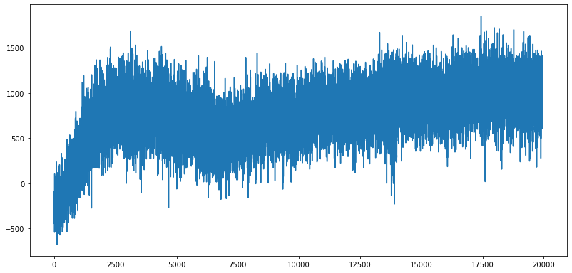
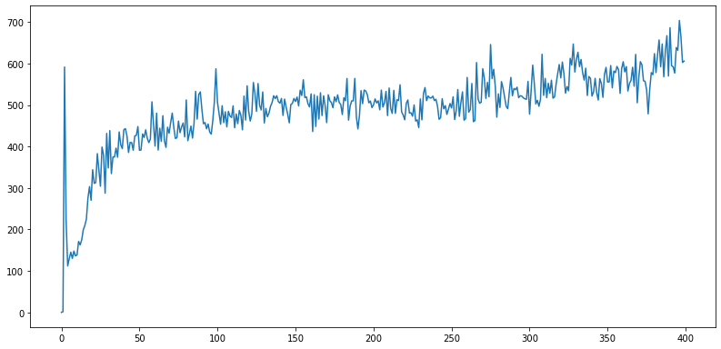
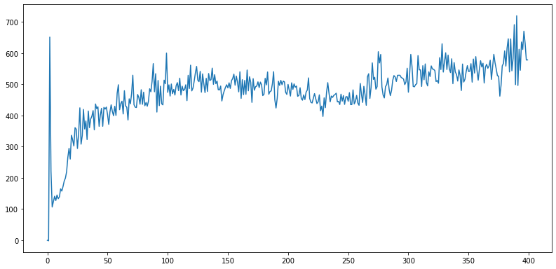
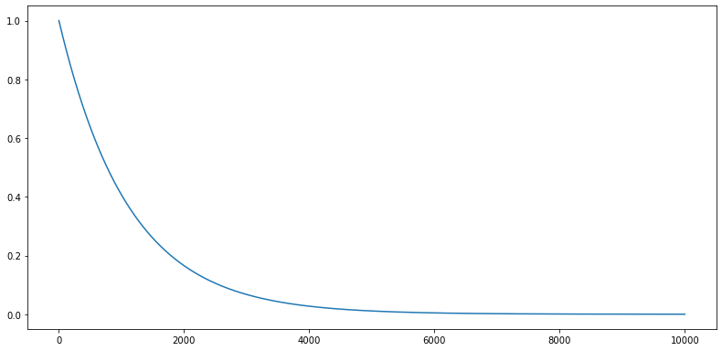

### Cab-Driver Agent


```python
# Importing libraries
import os
import numpy as np
import random
import math
from collections import deque
import collections
import pickle

# for building DQN model
from keras import layers
from keras import Sequential
from keras.layers import Dense, Activation, Flatten
from tensorflow.keras.optimizers import Adam

# for plotting graphs
import matplotlib.pyplot as plt

# Import the environment
from Env import CabDriver

import glob
import os

env = CabDriver()
```

#### Defining Time Matrix


```python
# Loading the time matrix provided
Time_matrix = np.load("TM.npy")
```

#### Tracking the state-action pairs for checking convergence


```python
states_track = collections.defaultdict(dict)

def initialise_states_for_tracking():
    # Initializina Tracking Q-values for a couple of state action pairs
    sample_q_values = [((4,3,2),(4,1)),((0,0,0),(0,4))]    
    for q_values in sample_q_values:
        state = q_values[0]
        action = q_values[1]
        #array to trace state-action pair after every 25th episode         
        states_track[state][action] = []
```


```python
# Defining a function to save the tracked Q-values in the dictionry
def save_tracking_states():
    print("saving states...")
    for state in states_track.keys():
        for action in states_track[state].keys():
            state_encod = env.state_trans(state)
            state_encod = np.reshape(state_encod, [1, agent.state_size])
            prediction = agent.model.predict(state_encod)
            action_index = env.action_space.index(action)
            Q = prediction[0][action_index]
            states_track[state][action].append(Q)
```


```python
#Defining a function to save a dictionary as a pickle file
def save_obj(obj, name ):
    with open(name + '.pkl', 'wb') as f:
        pickle.dump(obj, f, pickle.HIGHEST_PROTOCOL)
```

### Agent Class

If you are using this framework, you need to fill the following to complete the following code block:
1. State and Action Size
2. Hyperparameters
3. Create a neural-network model in function 'build_model()'
4. Define epsilon-greedy strategy in function 'get_action()'
5. Complete the function 'append_sample()'. This function appends the recent experience tuple <state, action, reward, new-state> to the memory
6. Complete the 'train_model()' function with following logic:
   - If the memory size is greater than mini-batch size, you randomly sample experiences from memory as per the mini-batch size and do the following:
      - Initialise your input and output batch for training the model
      - Calculate the target Q value for each sample: reward + gamma*max(Q(s'a,))
      - Get Q(s', a) values from the last trained model
      - Update the input batch as your encoded state and output batch as your Q-values
      - Then fit your DQN model using the updated input and output batch.

#### Choice of the Hyper Parameters

We chose to train our model every Episode instead of every step to make use of parallelization  


```python
m = 5 
t = 24  
d = 7   


class DQNAgent:
    def __init__(self, state_size):

        # Define size of state and action
        self.state_size = m+t+d 
        self.action_size = m*(m-1) + 1
        self.action_space = [[i,j] for i in range(m) for j in range(m) if i!=j or i==0]
      
        # These are hyper parameters for the DQN
        self.discount_factor = 0.95
        self.learning_rate = 0.01        
        self.epsilon_max = 1.0
        self.epsilon_decay = 0.0009
        self.epsilon_min = 0.00000001
        
        self.batch_size = 2048*3      
        # create replay memory using deque
        self.memory = deque(maxlen=2048*64)

        # create main model and target model
        self.model = self.build_model()

    # approximate Q function using Neural Network
    def build_model(self):
        model = Sequential()
        model.add(Dense(32, input_dim = self.state_size,activation ='relu'))
        model.add(Dense(32,activation ='relu'))
        model.add(Dense(self.action_size,activation ='linear'))
        model.compile(loss='mse',optimizer=Adam(learning_rate=self.learning_rate))
        model.summary
        return model


    def get_action(self, state, episode):
    # get action from model using epsilon-greedy policy
    # Decay in e after we generate each sample from the environment
        poss_actions_index, poss_actions = env.requests(state)
        epsilon = self.epsilon_min + (self.epsilon_max - self.epsilon_min) * np.exp(-self.epsilon_decay*episode)
    
        if np.random.rand() <= epsilon: # Exploration: randomly choosing and action      
            action_index = np.random.choice(poss_actions_index)
            action = self.action_space[action_index]
        else: #Exploitation: this gets the action corresponding to max q-value of current state
            state_encod = env.state_trans(state)
            state_encod = np.reshape(state_encod, [1, self.state_size])
            q_value = self.model.predict(state_encod)
            q_value = q_value[0][poss_actions_index]
            action_index = np.argmax(q_value)
            action = poss_actions[action_index]
            
        return action, epsilon
        
        
    # save sample <s,a,r,s'> to the replay memory 
    def append_sample(self, state, action, reward, next_state, terminal_state):
        self.memory.append((state, action, reward, next_state, terminal_state))
    

    # pick samples randomly from replay memory (with batch_size) and train the network
    def train_model(self):
  
        if len(self.memory) < self.batch_size:
            return
        print('Training...')
        # Sample batch from the memory
        mini_batch = random.sample(self.memory, self.batch_size)
        update_output = np.zeros((self.batch_size, self.state_size))
        update_input = np.zeros((self.batch_size, self.state_size))

        actions, rewards, terminal_states = [], [], []
       
        
        for i in range(self.batch_size):
            
            state, action, reward, next_state, terminal_state = mini_batch[i]
            actions.append(self.action_space.index(list(action)))
            rewards.append(reward)
            terminal_states.append(terminal_state)
            

            update_input[i] = env.state_trans(state)
            update_output[i] = env.state_trans(next_state)
                
        target = self.model.predict(update_input)
        target_val = self.model.predict(update_output)
        
        # get your target Q-value on the basis of terminal state
        for i in range(self.batch_size):
            if terminal_states[i]:
                target[i][actions[i]] = rewards[i]
            else:
                target[i][actions[i]] = rewards[i] + self.discount_factor * (np.amax(target_val[i]))

        self.model.fit(update_input, target, batch_size=self.batch_size, epochs=1, verbose=0)
                   
    def save(self, name):
        self.model.save_weights(name)
        
    def load(self, name):
        self.model.load_weights(name)
```

### DQN block


```python
# make directory
if not os.path.exists("saved_pickle_files"):
    os.mkdir("saved_pickle_files")
    
# Initialising the environment
env = CabDriver()
# get size of state and action from environment
state_size = len(env.state_space)
action_space = env.action_space
Time_matrix = np.load("TM.npy")
state_space = env.state_space
start_episode = 0;

# agent needs to be initialised outside the loop since the DQN
# network will be initialised along with the agent
agent = DQNAgent(state_size)

#Loading wights from disk (The training was interupted due to power failure)
# agent.load('./cab_driver.h5')
# start_episode = 2400 # Index of the episode to restart training from

# tracking average reward per episode = total rewards in an episode/ total steps in an episode
avg_reward = []

# tracking total rewards per episode
total_reward  = []

initialise_states_for_tracking()

Episodes = 20000
for episode in range(start_episode,Episodes):
    
    # tracking total rewards, step count
    tot_reward = 0
    step_count = 0
    state = env.reset()
    terminal_state = False
    state_space = env.state_space
    
    while not terminal_state:
        
        action, epsilon = agent.get_action(state, episode)
        reward = env.reward_func(state, action, Time_matrix)
        
        next_state, terminal_state = env.next_state_func(state, action, Time_matrix)

        # save the sample <s, a, r, s'> to the replay memory
        agent.append_sample(state, action, reward, next_state, terminal_state)
        
        tot_reward += reward
        state = next_state
        step_count += 1
        
        # Store the rewards for every 25th episode        
        if terminal_state and episode % 1 == 0:
            avg_reward.append(tot_reward/step_count)
            total_reward.append(tot_reward)
            print("episode:", episode,"  no of steps:",step_count, "  score:", tot_reward, "  avg score:", round(tot_reward/step_count,4),
                  "  memorylength:", len(agent.memory), "  epsilon:", epsilon)
            
    #For every 25th episode,track the states.
    if episode % 50 == 0:   #every 25 episode
        save_tracking_states()

    if episode % 50 == 0 and episode !=0:
        Rewardname = "saved_pickle_files/Rewards"+str(episode)
        Statesname = "saved_pickle_files/States_tracked"+str(episode)
        save_obj(total_reward,Rewardname)  
        save_obj(states_track,Statesname)
        agent.save("./cab_driver.h5")
        
    #Train the model every episode
    agent.train_model()
```

    episode: 0   no of steps: 127   score: -257.0   avg score: -2.0236   memorylength: 127   epsilon: 1.0
    saving states...
    episode: 1   no of steps: 149   score: -446.0   avg score: -2.9933   memorylength: 276   epsilon: 0.9991004048875233
    episode: 2   no of steps: 141   score: -400.0   avg score: -2.8369   memorylength: 417   epsilon: 0.9982016190464211
    episode: 3   no of steps: 140   score: -256.0   avg score: -1.8286   memorylength: 557   epsilon: 0.9973036417486767
    episode: 4   no of steps: 137   score: -351.0   avg score: -2.562   memorylength: 694   epsilon: 0.9964064722669286
    episode: 5   no of steps: 174   score: -208.0   avg score: -1.1954   memorylength: 868   epsilon: 0.9955101098744694
    episode: 6   no of steps: 131   score: -220.0   avg score: -1.6794   memorylength: 999   epsilon: 0.9946145538452457
    episode: 7   no of steps: 131   score: -320.0   avg score: -2.4427   memorylength: 1130   epsilon: 0.9937198034538567
    episode: 8   no of steps: 142   score: -412.0   avg score: -2.9014   memorylength: 1272   epsilon: 0.9928258579755548
    episode: 9   no of steps: 129   score: -219.0   avg score: -1.6977   memorylength: 1401   epsilon: 0.9919327166862439
    episode: 10   no of steps: 136   score: -253.0   avg score: -1.8603   memorylength: 1537   epsilon: 0.9910403788624799
    episode: 11   no of steps: 155   score: -86.0   avg score: -0.5548   memorylength: 1692   epsilon: 0.9901488437814687
    episode: 12   no of steps: 170   score: -221.0   avg score: -1.3   memorylength: 1862   epsilon: 0.9892581107210671
    episode: 13   no of steps: 128   score: -252.0   avg score: -1.9688   memorylength: 1990   epsilon: 0.988368178959781
    episode: 14   no of steps: 155   score: -198.0   avg score: -1.2774   memorylength: 2145   epsilon: 0.987479047776766
    episode: 15   no of steps: 145   score: -544.0   avg score: -3.7517   memorylength: 2290   epsilon: 0.9865907164518255
    episode: 16   no of steps: 146   score: -237.0   avg score: -1.6233   memorylength: 2436   epsilon: 0.9857031842654111
    episode: 17   no of steps: 164   score: -130.0   avg score: -0.7927   memorylength: 2600   epsilon: 0.9848164504986219
    episode: 18   no of steps: 124   score: -57.0   avg score: -0.4597   memorylength: 2724   epsilon: 0.9839305144332032
    episode: 19   no of steps: 128   score: 104.0   avg score: 0.8125   memorylength: 2852   epsilon: 0.983045375351547
    episode: 20   no of steps: 138   score: -100.0   avg score: -0.7246   memorylength: 2990   epsilon: 0.9821610325366904
    episode: 21   no of steps: 152   score: -230.0   avg score: -1.5132   memorylength: 3142   epsilon: 0.9812774852723157
    episode: 22   no of steps: 136   score: -267.0   avg score: -1.9632   memorylength: 3278   epsilon: 0.9803947328427498
    episode: 23   no of steps: 129   score: -88.0   avg score: -0.6822   memorylength: 3407   epsilon: 0.9795127745329629
    episode: 24   no of steps: 140   score: -189.0   avg score: -1.35   memorylength: 3547   epsilon: 0.9786316096285689
    episode: 25   no of steps: 151   score: -294.0   avg score: -1.947   memorylength: 3698   epsilon: 0.9777512374158239
    episode: 26   no of steps: 149   score: -302.0   avg score: -2.0268   memorylength: 3847   epsilon: 0.9768716571816268
    episode: 27   no of steps: 133   score: -162.0   avg score: -1.218   memorylength: 3980   epsilon: 0.9759928682135173
    episode: 28   no of steps: 130   score: -208.0   avg score: -1.6   memorylength: 4110   epsilon: 0.9751148697996762
    episode: 29   no of steps: 148   score: -245.0   avg score: -1.6554   memorylength: 4258   epsilon: 0.9742376612289249
    episode: 30   no of steps: 123   score: -271.0   avg score: -2.2033   memorylength: 4381   epsilon: 0.9733612417907244
    episode: 31   no of steps: 135   score: -137.0   avg score: -1.0148   memorylength: 4516   epsilon: 0.9724856107751748
    episode: 32   no of steps: 142   score: -415.0   avg score: -2.9225   memorylength: 4658   epsilon: 0.9716107674730151
    episode: 33   no of steps: 157   score: -291.0   avg score: -1.8535   memorylength: 4815   epsilon: 0.970736711175622
    episode: 34   no of steps: 152   score: -396.0   avg score: -2.6053   memorylength: 4967   epsilon: 0.9698634411750099
    episode: 35   no of steps: 153   score: -91.0   avg score: -0.5948   memorylength: 5120   epsilon: 0.9689909567638301
    episode: 36   no of steps: 134   score: -196.0   avg score: -1.4627   memorylength: 5254   epsilon: 0.9681192572353702
    episode: 37   no of steps: 154   score: -399.0   avg score: -2.5909   memorylength: 5408   epsilon: 0.9672483418835535
    episode: 38   no of steps: 145   score: -518.0   avg score: -3.5724   memorylength: 5553   epsilon: 0.9663782100029384
    episode: 39   no of steps: 164   score: -396.0   avg score: -2.4146   memorylength: 5717   epsilon: 0.9655088608887183
    episode: 40   no of steps: 133   score: -95.0   avg score: -0.7143   memorylength: 5850   epsilon: 0.9646402938367201
    episode: 41   no of steps: 135   score: -374.0   avg score: -2.7704   memorylength: 5985   epsilon: 0.9637725081434045
    episode: 42   no of steps: 140   score: -196.0   avg score: -1.4   memorylength: 6125   epsilon: 0.9629055031058652
    episode: 43   no of steps: 147   score: -493.0   avg score: -3.3537   memorylength: 6272   epsilon: 0.962039278021828
    Training...
    episode: 44   no of steps: 144   score: -388.0   avg score: -2.6944   memorylength: 6416   epsilon: 0.9611738321896504
    Training...
    episode: 45   no of steps: 147   score: -288.0   avg score: -1.9592   memorylength: 6563   epsilon: 0.9603091649083214
    Training...
    episode: 46   no of steps: 157   score: -500.0   avg score: -3.1847   memorylength: 6720   epsilon: 0.9594452754774603
    Training...
    episode: 47   no of steps: 146   score: -199.0   avg score: -1.363   memorylength: 6866   epsilon: 0.9585821631973167
    Training...
    episode: 48   no of steps: 155   score: -196.0   avg score: -1.2645   memorylength: 7021   epsilon: 0.9577198273687696
    Training...
    episode: 49   no of steps: 143   score: -352.0   avg score: -2.4615   memorylength: 7164   epsilon: 0.956858267293327
    Training...
    episode: 50   no of steps: 128   score: -133.0   avg score: -1.0391   memorylength: 7292   epsilon: 0.9559974822731252
    saving states...
    Training...
    episode: 51   no of steps: 144   score: -180.0   avg score: -1.25   memorylength: 7436   epsilon: 0.955137471610928
    Training...
    episode: 52   no of steps: 143   score: -206.0   avg score: -1.4406   memorylength: 7579   epsilon: 0.9542782346101271
    Training...
    episode: 53   no of steps: 133   score: -77.0   avg score: -0.5789   memorylength: 7712   epsilon: 0.9534197705747401
    Training...
    episode: 54   no of steps: 134   score: -454.0   avg score: -3.3881   memorylength: 7846   epsilon: 0.9525620788094115
    Training...
    episode: 55   no of steps: 137   score: -262.0   avg score: -1.9124   memorylength: 7983   epsilon: 0.9517051586194106
    Training...
    episode: 56   no of steps: 124   score: -316.0   avg score: -2.5484   memorylength: 8107   epsilon: 0.9508490093106322
    Training...
    episode: 57   no of steps: 149   score: 75.0   avg score: 0.5034   memorylength: 8256   epsilon: 0.9499936301895952
    Training...
    episode: 58   no of steps: 126   score: -303.0   avg score: -2.4048   memorylength: 8382   epsilon: 0.9491390205634425
    Training...
    episode: 59   no of steps: 144   score: 63.0   avg score: 0.4375   memorylength: 8526   epsilon: 0.9482851797399402
    Training...
    episode: 60   no of steps: 139   score: 15.0   avg score: 0.1079   memorylength: 8665   epsilon: 0.9474321070274773
    Training...
    episode: 61   no of steps: 137   score: -450.0   avg score: -3.2847   memorylength: 8802   epsilon: 0.9465798017350647
    Training...
    episode: 62   no of steps: 124   score: -321.0   avg score: -2.5887   memorylength: 8926   epsilon: 0.9457282631723353
    Training...
    episode: 63   no of steps: 143   score: -152.0   avg score: -1.0629   memorylength: 9069   epsilon: 0.9448774906495425
    Training...
    episode: 64   no of steps: 138   score: -536.0   avg score: -3.8841   memorylength: 9207   epsilon: 0.9440274834775608
    Training...
    episode: 65   no of steps: 140   score: -288.0   avg score: -2.0571   memorylength: 9347   epsilon: 0.9431782409678842
    Training...
    episode: 66   no of steps: 128   score: -316.0   avg score: -2.4688   memorylength: 9475   epsilon: 0.9423297624326262
    Training...
    episode: 67   no of steps: 143   score: -1.0   avg score: -0.007   memorylength: 9618   epsilon: 0.9414820471845194
    Training...
    episode: 68   no of steps: 151   score: -248.0   avg score: -1.6424   memorylength: 9769   epsilon: 0.940635094536914
    Training...
    episode: 69   no of steps: 156   score: -322.0   avg score: -2.0641   memorylength: 9925   epsilon: 0.9397889038037786
    Training...
    episode: 70   no of steps: 154   score: -33.0   avg score: -0.2143   memorylength: 10079   epsilon: 0.9389434742996985
    Training...
    episode: 71   no of steps: 131   score: -446.0   avg score: -3.4046   memorylength: 10210   epsilon: 0.9380988053398759
    Training...
    episode: 72   no of steps: 138   score: -337.0   avg score: -2.442   memorylength: 10348   epsilon: 0.9372548962401288
    Training...
    episode: 73   no of steps: 128   score: -378.0   avg score: -2.9531   memorylength: 10476   epsilon: 0.9364117463168907
    Training...
    episode: 74   no of steps: 157   score: 78.0   avg score: 0.4968   memorylength: 10633   epsilon: 0.9355693548872103
    Training...
    episode: 75   no of steps: 130   score: -65.0   avg score: -0.5   memorylength: 10763   epsilon: 0.9347277212687503
    Training...
    episode: 76   no of steps: 139   score: -203.0   avg score: -1.4604   memorylength: 10902   epsilon: 0.9338868447797877
    Training...
    episode: 77   no of steps: 152   score: 84.0   avg score: 0.5526   memorylength: 11054   epsilon: 0.9330467247392122
    Training...
    episode: 78   no of steps: 149   score: 87.0   avg score: 0.5839   memorylength: 11203   epsilon: 0.9322073604665266
    Training...
    episode: 79   no of steps: 141   score: -382.0   avg score: -2.7092   memorylength: 11344   epsilon: 0.931368751281846
    Training...
    episode: 80   no of steps: 140   score: -179.0   avg score: -1.2786   memorylength: 11484   epsilon: 0.9305308965058968
    Training...
    episode: 81   no of steps: 140   score: -190.0   avg score: -1.3571   memorylength: 11624   epsilon: 0.9296937954600164
    Training...
    episode: 82   no of steps: 127   score: -288.0   avg score: -2.2677   memorylength: 11751   epsilon: 0.9288574474661532
    Training...
    episode: 83   no of steps: 136   score: 195.0   avg score: 1.4338   memorylength: 11887   epsilon: 0.9280218518468649
    Training...
    episode: 84   no of steps: 152   score: -414.0   avg score: -2.7237   memorylength: 12039   epsilon: 0.9271870079253194
    Training...
    episode: 85   no of steps: 131   score: -330.0   avg score: -2.5191   memorylength: 12170   epsilon: 0.926352915025293
    Training...
    episode: 86   no of steps: 150   score: 238.0   avg score: 1.5867   memorylength: 12320   epsilon: 0.9255195724711702
    Training...
    episode: 87   no of steps: 132   score: -150.0   avg score: -1.1364   memorylength: 12452   epsilon: 0.9246869795879437
    Training...
    episode: 88   no of steps: 138   score: -446.0   avg score: -3.2319   memorylength: 12590   epsilon: 0.923855135701213
    Training...
    episode: 89   no of steps: 163   score: -281.0   avg score: -1.7239   memorylength: 12753   epsilon: 0.9230240401371846
    Training...
    episode: 90   no of steps: 123   score: -327.0   avg score: -2.6585   memorylength: 12876   epsilon: 0.9221936922226711
    Training...
    episode: 91   no of steps: 147   score: -197.0   avg score: -1.3401   memorylength: 13023   epsilon: 0.9213640912850907
    Training...
    episode: 92   no of steps: 149   score: 70.0   avg score: 0.4698   memorylength: 13172   epsilon: 0.9205352366524665
    Training...
    episode: 93   no of steps: 146   score: 151.0   avg score: 1.0342   memorylength: 13318   epsilon: 0.9197071276534262
    Training...
    episode: 94   no of steps: 143   score: -360.0   avg score: -2.5175   memorylength: 13461   epsilon: 0.9188797636172015
    Training...
    episode: 95   no of steps: 154   score: -73.0   avg score: -0.474   memorylength: 13615   epsilon: 0.9180531438736275
    Training...
    episode: 96   no of steps: 172   score: -63.0   avg score: -0.3663   memorylength: 13787   epsilon: 0.917227267753142
    Training...
    episode: 97   no of steps: 151   score: -299.0   avg score: -1.9801   memorylength: 13938   epsilon: 0.9164021345867855
    Training...
    episode: 98   no of steps: 156   score: -439.0   avg score: -2.8141   memorylength: 14094   epsilon: 0.9155777437062002
    Training...
    episode: 99   no of steps: 157   score: -289.0   avg score: -1.8408   memorylength: 14251   epsilon: 0.9147540944436291
    Training...
    episode: 100   no of steps: 154   score: -448.0   avg score: -2.9091   memorylength: 14405   epsilon: 0.9139311861319164
    saving states...
    Training...
    episode: 101   no of steps: 135   score: 111.0   avg score: 0.8222   memorylength: 14540   epsilon: 0.9131090181045063
    Training...
    episode: 102   no of steps: 140   score: -88.0   avg score: -0.6286   memorylength: 14680   epsilon: 0.9122875896954428
    Training...
    episode: 103   no of steps: 139   score: -165.0   avg score: -1.1871   memorylength: 14819   epsilon: 0.9114669002393686
    Training...
    episode: 104   no of steps: 140   score: -315.0   avg score: -2.25   memorylength: 14959   epsilon: 0.9106469490715253
    Training...
    episode: 105   no of steps: 156   score: -410.0   avg score: -2.6282   memorylength: 15115   epsilon: 0.9098277355277526
    Training...
    episode: 106   no of steps: 137   score: -279.0   avg score: -2.0365   memorylength: 15252   epsilon: 0.9090092589444873
    Training...
    episode: 107   no of steps: 143   score: -514.0   avg score: -3.5944   memorylength: 15395   epsilon: 0.9081915186587634
    Training...
    episode: 108   no of steps: 146   score: -136.0   avg score: -0.9315   memorylength: 15541   epsilon: 0.907374514008211
    Training...
    episode: 109   no of steps: 139   score: 21.0   avg score: 0.1511   memorylength: 15680   epsilon: 0.9065582443310565
    Training...
    episode: 110   no of steps: 125   score: 33.0   avg score: 0.264   memorylength: 15805   epsilon: 0.9057427089661214
    Training...
    episode: 111   no of steps: 153   score: -420.0   avg score: -2.7451   memorylength: 15958   epsilon: 0.904927907252822
    Training...
    episode: 112   no of steps: 137   score: -482.0   avg score: -3.5182   memorylength: 16095   epsilon: 0.9041138385311689
    Training...
    episode: 113   no of steps: 140   score: -234.0   avg score: -1.6714   memorylength: 16235   epsilon: 0.9033005021417663
    Training...
    episode: 114   no of steps: 133   score: -291.0   avg score: -2.188   memorylength: 16368   epsilon: 0.9024878974258117
    Training...
    episode: 115   no of steps: 160   score: -677.0   avg score: -4.2312   memorylength: 16528   epsilon: 0.9016760237250953
    Training...
    episode: 116   no of steps: 130   score: 46.0   avg score: 0.3538   memorylength: 16658   epsilon: 0.9008648803819992
    Training...
    episode: 117   no of steps: 140   score: -118.0   avg score: -0.8429   memorylength: 16798   epsilon: 0.9000544667394974
    Training...
    episode: 118   no of steps: 139   score: -106.0   avg score: -0.7626   memorylength: 16937   epsilon: 0.8992447821411548
    Training...
    episode: 119   no of steps: 157   score: -273.0   avg score: -1.7389   memorylength: 17094   epsilon: 0.8984358259311269
    Training...
    episode: 120   no of steps: 145   score: -223.0   avg score: -1.5379   memorylength: 17239   epsilon: 0.8976275974541589
    Training...
    episode: 121   no of steps: 146   score: -487.0   avg score: -3.3356   memorylength: 17385   epsilon: 0.8968200960555859
    Training...
    episode: 122   no of steps: 153   score: 22.0   avg score: 0.1438   memorylength: 17538   epsilon: 0.8960133210813316
    Training...
    episode: 123   no of steps: 144   score: -88.0   avg score: -0.6111   memorylength: 17682   epsilon: 0.8952072718779083
    Training...
    episode: 124   no of steps: 149   score: -281.0   avg score: -1.8859   memorylength: 17831   epsilon: 0.894401947792416
    Training...
    episode: 125   no of steps: 148   score: -342.0   avg score: -2.3108   memorylength: 17979   epsilon: 0.8935973481725422
    Training...
    episode: 126   no of steps: 144   score: -189.0   avg score: -1.3125   memorylength: 18123   epsilon: 0.8927934723665613
    Training...
    episode: 127   no of steps: 141   score: -191.0   avg score: -1.3546   memorylength: 18264   epsilon: 0.8919903197233335
    Training...
    episode: 128   no of steps: 136   score: -271.0   avg score: -1.9926   memorylength: 18400   epsilon: 0.8911878895923055
    Training...
    episode: 129   no of steps: 145   score: -333.0   avg score: -2.2966   memorylength: 18545   epsilon: 0.8903861813235088
    Training...
    episode: 130   no of steps: 145   score: -181.0   avg score: -1.2483   memorylength: 18690   epsilon: 0.8895851942675594
    Training...
    episode: 131   no of steps: 133   score: -306.0   avg score: -2.3008   memorylength: 18823   epsilon: 0.8887849277756579
    Training...
    episode: 132   no of steps: 144   score: -155.0   avg score: -1.0764   memorylength: 18967   epsilon: 0.8879853811995885
    Training...
    episode: 133   no of steps: 123   score: -138.0   avg score: -1.122   memorylength: 19090   epsilon: 0.8871865538917182
    Training...
    episode: 134   no of steps: 133   score: -52.0   avg score: -0.391   memorylength: 19223   epsilon: 0.886388445204997
    Training...
    episode: 135   no of steps: 134   score: -231.0   avg score: -1.7239   memorylength: 19357   epsilon: 0.8855910544929568
    Training...
    episode: 136   no of steps: 128   score: -63.0   avg score: -0.4922   memorylength: 19485   epsilon: 0.8847943811097111
    Training...
    episode: 137   no of steps: 150   score: -438.0   avg score: -2.92   memorylength: 19635   epsilon: 0.8839984244099544
    Training...
    episode: 138   no of steps: 143   score: -179.0   avg score: -1.2517   memorylength: 19778   epsilon: 0.8832031837489616
    Training...
    episode: 139   no of steps: 130   score: -351.0   avg score: -2.7   memorylength: 19908   epsilon: 0.8824086584825879
    Training...
    episode: 140   no of steps: 149   score: -45.0   avg score: -0.302   memorylength: 20057   epsilon: 0.8816148479672676
    Training...
    episode: 141   no of steps: 137   score: -186.0   avg score: -1.3577   memorylength: 20194   epsilon: 0.8808217515600143
    Training...
    episode: 142   no of steps: 128   score: 118.0   avg score: 0.9219   memorylength: 20322   epsilon: 0.8800293686184198
    Training...
    episode: 143   no of steps: 118   score: -96.0   avg score: -0.8136   memorylength: 20440   epsilon: 0.879237698500654
    Training...
    episode: 144   no of steps: 136   score: -475.0   avg score: -3.4926   memorylength: 20576   epsilon: 0.8784467405654639
    Training...
    episode: 145   no of steps: 138   score: -103.0   avg score: -0.7464   memorylength: 20714   epsilon: 0.8776564941721736
    Training...
    episode: 146   no of steps: 141   score: -34.0   avg score: -0.2411   memorylength: 20855   epsilon: 0.8768669586806835
    Training...
    episode: 147   no of steps: 138   score: -338.0   avg score: -2.4493   memorylength: 20993   epsilon: 0.8760781334514698
    Training...
    episode: 148   no of steps: 162   score: 15.0   avg score: 0.0926   memorylength: 21155   epsilon: 0.8752900178455839
    Training...
    episode: 149   no of steps: 149   score: 6.0   avg score: 0.0403   memorylength: 21304   epsilon: 0.8745026112246522
    Training...
    episode: 150   no of steps: 126   score: -319.0   avg score: -2.5317   memorylength: 21430   epsilon: 0.8737159129508754
    saving states...
    Training...
    episode: 151   no of steps: 133   score: -126.0   avg score: -0.9474   memorylength: 21563   epsilon: 0.8729299223870276
    Training...
    episode: 152   no of steps: 134   score: -189.0   avg score: -1.4104   memorylength: 21697   epsilon: 0.8721446388964567
    Training...
    episode: 153   no of steps: 128   score: -301.0   avg score: -2.3516   memorylength: 21825   epsilon: 0.8713600618430829
    Training...
    episode: 154   no of steps: 126   score: -311.0   avg score: -2.4683   memorylength: 21951   epsilon: 0.8705761905913987
    Training...
    episode: 155   no of steps: 141   score: -269.0   avg score: -1.9078   memorylength: 22092   epsilon: 0.8697930245064683
    Training...
    episode: 156   no of steps: 128   score: -231.0   avg score: -1.8047   memorylength: 22220   epsilon: 0.8690105629539273
    Training...
    episode: 157   no of steps: 136   score: -284.0   avg score: -2.0882   memorylength: 22356   epsilon: 0.8682288052999816
    Training...
    episode: 158   no of steps: 149   score: -132.0   avg score: -0.8859   memorylength: 22505   epsilon: 0.8674477509114077
    Training...
    episode: 159   no of steps: 147   score: -289.0   avg score: -1.966   memorylength: 22652   epsilon: 0.8666673991555514
    Training...
    episode: 160   no of steps: 156   score: -270.0   avg score: -1.7308   memorylength: 22808   epsilon: 0.8658877494003275
    Training...
    episode: 161   no of steps: 144   score: -99.0   avg score: -0.6875   memorylength: 22952   epsilon: 0.8651088010142199
    Training...
    episode: 162   no of steps: 139   score: 57.0   avg score: 0.4101   memorylength: 23091   epsilon: 0.8643305533662805
    Training...
    episode: 163   no of steps: 139   score: 115.0   avg score: 0.8273   memorylength: 23230   epsilon: 0.8635530058261284
    Training...
    episode: 164   no of steps: 151   score: -5.0   avg score: -0.0331   memorylength: 23381   epsilon: 0.8627761577639501
    Training...
    episode: 165   no of steps: 145   score: -293.0   avg score: -2.0207   memorylength: 23526   epsilon: 0.8620000085504986
    Training...
    episode: 166   no of steps: 130   score: 21.0   avg score: 0.1615   memorylength: 23656   epsilon: 0.8612245575570932
    Training...
    episode: 167   no of steps: 140   score: -155.0   avg score: -1.1071   memorylength: 23796   epsilon: 0.8604498041556182
    Training...
    episode: 168   no of steps: 125   score: -185.0   avg score: -1.48   memorylength: 23921   epsilon: 0.8596757477185237
    Training...
    episode: 169   no of steps: 147   score: 193.0   avg score: 1.3129   memorylength: 24068   epsilon: 0.8589023876188238
    Training...
    episode: 170   no of steps: 134   score: -56.0   avg score: -0.4179   memorylength: 24202   epsilon: 0.8581297232300966
    Training...
    episode: 171   no of steps: 138   score: -145.0   avg score: -1.0507   memorylength: 24340   epsilon: 0.8573577539264841
    Training...
    episode: 172   no of steps: 131   score: -424.0   avg score: -3.2366   memorylength: 24471   epsilon: 0.856586479082691
    Training...
    episode: 173   no of steps: 141   score: -83.0   avg score: -0.5887   memorylength: 24612   epsilon: 0.8558158980739847
    Training...
    episode: 174   no of steps: 132   score: -415.0   avg score: -3.1439   memorylength: 24744   epsilon: 0.8550460102761945
    Training...
    episode: 175   no of steps: 140   score: -196.0   avg score: -1.4   memorylength: 24884   epsilon: 0.8542768150657114
    Training...
    episode: 176   no of steps: 137   score: -20.0   avg score: -0.146   memorylength: 25021   epsilon: 0.8535083118194869
    Training...
    episode: 177   no of steps: 127   score: -86.0   avg score: -0.6772   memorylength: 25148   epsilon: 0.8527404999150338
    Training...
    episode: 178   no of steps: 149   score: -423.0   avg score: -2.8389   memorylength: 25297   epsilon: 0.851973378730424
    Training...
    episode: 179   no of steps: 158   score: -123.0   avg score: -0.7785   memorylength: 25455   epsilon: 0.8512069476442895
    Training...
    episode: 180   no of steps: 142   score: -186.0   avg score: -1.3099   memorylength: 25597   epsilon: 0.850441206035821
    Training...
    episode: 181   no of steps: 141   score: -77.0   avg score: -0.5461   memorylength: 25738   epsilon: 0.8496761532847678
    Training...
    episode: 182   no of steps: 143   score: -555.0   avg score: -3.8811   memorylength: 25881   epsilon: 0.848911788771437
    Training...
    episode: 183   no of steps: 141   score: -353.0   avg score: -2.5035   memorylength: 26022   epsilon: 0.8481481118766936
    Training...
    episode: 184   no of steps: 130   score: -200.0   avg score: -1.5385   memorylength: 26152   epsilon: 0.847385121981959
    Training...
    episode: 185   no of steps: 128   score: 49.0   avg score: 0.3828   memorylength: 26280   epsilon: 0.8466228184692115
    Training...
    episode: 186   no of steps: 149   score: -113.0   avg score: -0.7584   memorylength: 26429   epsilon: 0.8458612007209851
    Training...
    episode: 187   no of steps: 146   score: -153.0   avg score: -1.0479   memorylength: 26575   epsilon: 0.8451002681203694
    Training...
    episode: 188   no of steps: 134   score: 129.0   avg score: 0.9627   memorylength: 26709   epsilon: 0.844340020051009
    Training...
    episode: 189   no of steps: 133   score: -185.0   avg score: -1.391   memorylength: 26842   epsilon: 0.843580455897103
    Training...
    episode: 190   no of steps: 136   score: -489.0   avg score: -3.5956   memorylength: 26978   epsilon: 0.8428215750434042
    Training...
    episode: 191   no of steps: 133   score: -309.0   avg score: -2.3233   memorylength: 27111   epsilon: 0.8420633768752193
    Training...
    episode: 192   no of steps: 147   score: -468.0   avg score: -3.1837   memorylength: 27258   epsilon: 0.8413058607784074
    Training...
    episode: 193   no of steps: 145   score: -170.0   avg score: -1.1724   memorylength: 27403   epsilon: 0.8405490261393808
    Training...
    episode: 194   no of steps: 145   score: -118.0   avg score: -0.8138   memorylength: 27548   epsilon: 0.839792872345103
    Training...
    episode: 195   no of steps: 136   score: -34.0   avg score: -0.25   memorylength: 27684   epsilon: 0.8390373987830898
    Training...
    episode: 196   no of steps: 124   score: -143.0   avg score: -1.1532   memorylength: 27808   epsilon: 0.8382826048414074
    Training...
    episode: 197   no of steps: 125   score: -288.0   avg score: -2.304   memorylength: 27933   epsilon: 0.8375284899086727
    Training...
    episode: 198   no of steps: 122   score: 88.0   avg score: 0.7213   memorylength: 28055   epsilon: 0.8367750533740523
    Training...
    episode: 199   no of steps: 124   score: -455.0   avg score: -3.6694   memorylength: 28179   epsilon: 0.8360222946272631
    Training...
    episode: 200   no of steps: 126   score: 178.0   avg score: 1.4127   memorylength: 28305   epsilon: 0.8352702130585699
    saving states...
    Training...
    episode: 201   no of steps: 154   score: -231.0   avg score: -1.5   memorylength: 28459   epsilon: 0.834518808058787
    Training...
    episode: 202   no of steps: 145   score: -128.0   avg score: -0.8828   memorylength: 28604   epsilon: 0.8337680790192761
    Training...
    episode: 203   no of steps: 144   score: -216.0   avg score: -1.5   memorylength: 28748   epsilon: 0.8330180253319466
    Training...
    episode: 204   no of steps: 134   score: -307.0   avg score: -2.291   memorylength: 28882   epsilon: 0.8322686463892551
    Training...
    episode: 205   no of steps: 144   score: -277.0   avg score: -1.9236   memorylength: 29026   epsilon: 0.8315199415842047
    Training...
    episode: 206   no of steps: 137   score: -171.0   avg score: -1.2482   memorylength: 29163   epsilon: 0.8307719103103441
    Training...
    episode: 207   no of steps: 130   score: -28.0   avg score: -0.2154   memorylength: 29293   epsilon: 0.8300245519617685
    Training...
    episode: 208   no of steps: 131   score: -513.0   avg score: -3.916   memorylength: 29424   epsilon: 0.829277865933117
    Training...
    episode: 209   no of steps: 140   score: -442.0   avg score: -3.1571   memorylength: 29564   epsilon: 0.8285318516195743
    Training...
    episode: 210   no of steps: 119   score: -251.0   avg score: -2.1092   memorylength: 29683   epsilon: 0.8277865084168686
    Training...
    episode: 211   no of steps: 147   score: -402.0   avg score: -2.7347   memorylength: 29830   epsilon: 0.8270418357212719
    Training...
    episode: 212   no of steps: 147   score: 110.0   avg score: 0.7483   memorylength: 29977   epsilon: 0.8262978329295991
    Training...
    episode: 213   no of steps: 116   score: 13.0   avg score: 0.1121   memorylength: 30093   epsilon: 0.8255544994392082
    Training...
    episode: 214   no of steps: 131   score: -306.0   avg score: -2.3359   memorylength: 30224   epsilon: 0.8248118346479988
    Training...
    episode: 215   no of steps: 125   score: -122.0   avg score: -0.976   memorylength: 30349   epsilon: 0.8240698379544125
    Training...
    episode: 216   no of steps: 152   score: -374.0   avg score: -2.4605   memorylength: 30501   epsilon: 0.8233285087574318
    Training...
    episode: 217   no of steps: 150   score: -212.0   avg score: -1.4133   memorylength: 30651   epsilon: 0.8225878464565802
    Training...
    episode: 218   no of steps: 133   score: -311.0   avg score: -2.3383   memorylength: 30784   epsilon: 0.8218478504519211
    Training...
    episode: 219   no of steps: 121   score: -36.0   avg score: -0.2975   memorylength: 30905   epsilon: 0.8211085201440578
    Training...
    episode: 220   no of steps: 138   score: 206.0   avg score: 1.4928   memorylength: 31043   epsilon: 0.8203698549341325
    Training...
    episode: 221   no of steps: 140   score: 150.0   avg score: 1.0714   memorylength: 31183   epsilon: 0.8196318542238266
    Training...
    episode: 222   no of steps: 150   score: -354.0   avg score: -2.36   memorylength: 31333   epsilon: 0.8188945174153591
    Training...
    episode: 223   no of steps: 135   score: -246.0   avg score: -1.8222   memorylength: 31468   epsilon: 0.8181578439114875
    Training...
    episode: 224   no of steps: 150   score: 0.0   avg score: 0.0   memorylength: 31618   epsilon: 0.8174218331155061
    Training...
    episode: 225   no of steps: 127   score: -256.0   avg score: -2.0157   memorylength: 31745   epsilon: 0.816686484431246
    Training...
    episode: 226   no of steps: 145   score: -248.0   avg score: -1.7103   memorylength: 31890   epsilon: 0.815951797263075
    Training...
    episode: 227   no of steps: 152   score: -116.0   avg score: -0.7632   memorylength: 32042   epsilon: 0.8152177710158962
    Training...
    episode: 228   no of steps: 139   score: -70.0   avg score: -0.5036   memorylength: 32181   epsilon: 0.8144844050951485
    Training...
    episode: 229   no of steps: 143   score: 80.0   avg score: 0.5594   memorylength: 32324   epsilon: 0.8137516989068052
    Training...
    episode: 230   no of steps: 144   score: -362.0   avg score: -2.5139   memorylength: 32468   epsilon: 0.8130196518573746
    Training...
    episode: 231   no of steps: 137   score: -313.0   avg score: -2.2847   memorylength: 32605   epsilon: 0.8122882633538981
    Training...
    episode: 232   no of steps: 143   score: -284.0   avg score: -1.986   memorylength: 32748   epsilon: 0.8115575328039515
    Training...
    episode: 233   no of steps: 138   score: -191.0   avg score: -1.3841   memorylength: 32886   epsilon: 0.8108274596156426
    Training...
    episode: 234   no of steps: 154   score: -573.0   avg score: -3.7208   memorylength: 33040   epsilon: 0.8100980431976122
    Training...
    episode: 235   no of steps: 137   score: -123.0   avg score: -0.8978   memorylength: 33177   epsilon: 0.8093692829590331
    Training...
    episode: 236   no of steps: 138   score: 22.0   avg score: 0.1594   memorylength: 33315   epsilon: 0.8086411783096092
    Training...
    episode: 237   no of steps: 141   score: -68.0   avg score: -0.4823   memorylength: 33456   epsilon: 0.8079137286595759
    Training...
    episode: 238   no of steps: 148   score: -469.0   avg score: -3.1689   memorylength: 33604   epsilon: 0.8071869334196989
    Training...
    episode: 239   no of steps: 133   score: -121.0   avg score: -0.9098   memorylength: 33737   epsilon: 0.806460792001274
    Training...
    episode: 240   no of steps: 146   score: -504.0   avg score: -3.4521   memorylength: 33883   epsilon: 0.8057353038161267
    Training...
    episode: 241   no of steps: 122   score: -309.0   avg score: -2.5328   memorylength: 34005   epsilon: 0.8050104682766114
    Training...
    episode: 242   no of steps: 122   score: -72.0   avg score: -0.5902   memorylength: 34127   epsilon: 0.8042862847956113
    Training...
    episode: 243   no of steps: 141   score: -148.0   avg score: -1.0496   memorylength: 34268   epsilon: 0.8035627527865377
    Training...
    episode: 244   no of steps: 132   score: -411.0   avg score: -3.1136   memorylength: 34400   epsilon: 0.8028398716633297
    Training...
    episode: 245   no of steps: 171   score: 27.0   avg score: 0.1579   memorylength: 34571   epsilon: 0.8021176408404536
    Training...
    episode: 246   no of steps: 139   score: -266.0   avg score: -1.9137   memorylength: 34710   epsilon: 0.8013960597329023
    Training...
    episode: 247   no of steps: 164   score: 45.0   avg score: 0.2744   memorylength: 34874   epsilon: 0.8006751277561951
    Training...
    episode: 248   no of steps: 141   score: -23.0   avg score: -0.1631   memorylength: 35015   epsilon: 0.7999548443263771
    Training...
    episode: 249   no of steps: 157   score: -369.0   avg score: -2.3503   memorylength: 35172   epsilon: 0.7992352088600185
    Training...
    episode: 250   no of steps: 161   score: -64.0   avg score: -0.3975   memorylength: 35333   epsilon: 0.7985162207742149
    saving states...
    Training...
    episode: 251   no of steps: 144   score: -219.0   avg score: -1.5208   memorylength: 35477   epsilon: 0.7977978794865855
    Training...
    episode: 252   no of steps: 129   score: -301.0   avg score: -2.3333   memorylength: 35606   epsilon: 0.7970801844152741
    Training...
    episode: 253   no of steps: 138   score: -162.0   avg score: -1.1739   memorylength: 35744   epsilon: 0.7963631349789475
    Training...
    episode: 254   no of steps: 145   score: -208.0   avg score: -1.4345   memorylength: 35889   epsilon: 0.7956467305967957
    Training...
    episode: 255   no of steps: 140   score: -449.0   avg score: -3.2071   memorylength: 36029   epsilon: 0.7949309706885311
    Training...
    episode: 256   no of steps: 156   score: -239.0   avg score: -1.5321   memorylength: 36185   epsilon: 0.7942158546743882
    Training...
    episode: 257   no of steps: 149   score: -27.0   avg score: -0.1812   memorylength: 36334   epsilon: 0.7935013819751228
    Training...
    episode: 258   no of steps: 138   score: 2.0   avg score: 0.0145   memorylength: 36472   epsilon: 0.7927875520120121
    Training...
    episode: 259   no of steps: 140   score: -82.0   avg score: -0.5857   memorylength: 36612   epsilon: 0.7920743642068538
    Training...
    episode: 260   no of steps: 144   score: -216.0   avg score: -1.5   memorylength: 36756   epsilon: 0.7913618179819657
    Training...
    episode: 261   no of steps: 133   score: -271.0   avg score: -2.0376   memorylength: 36889   epsilon: 0.7906499127601854
    Training...
    episode: 262   no of steps: 146   score: -88.0   avg score: -0.6027   memorylength: 37035   epsilon: 0.7899386479648695
    Training...
    episode: 263   no of steps: 130   score: -135.0   avg score: -1.0385   memorylength: 37165   epsilon: 0.7892280230198935
    Training...
    episode: 264   no of steps: 139   score: -68.0   avg score: -0.4892   memorylength: 37304   epsilon: 0.7885180373496512
    Training...
    episode: 265   no of steps: 143   score: -333.0   avg score: -2.3287   memorylength: 37447   epsilon: 0.7878086903790542
    Training...
    episode: 266   no of steps: 135   score: -28.0   avg score: -0.2074   memorylength: 37582   epsilon: 0.7870999815335313
    Training...
    episode: 267   no of steps: 138   score: 34.0   avg score: 0.2464   memorylength: 37720   epsilon: 0.7863919102390287
    Training...
    episode: 268   no of steps: 129   score: -59.0   avg score: -0.4574   memorylength: 37849   epsilon: 0.785684475922008
    Training...
    episode: 269   no of steps: 133   score: -37.0   avg score: -0.2782   memorylength: 37982   epsilon: 0.7849776780094476
    Training...
    episode: 270   no of steps: 151   score: -421.0   avg score: -2.7881   memorylength: 38133   epsilon: 0.7842715159288414
    Training...
    episode: 271   no of steps: 151   score: -245.0   avg score: -1.6225   memorylength: 38284   epsilon: 0.7835659891081977
    Training...
    episode: 272   no of steps: 140   score: -369.0   avg score: -2.6357   memorylength: 38424   epsilon: 0.78286109697604
    Training...
    episode: 273   no of steps: 128   score: -262.0   avg score: -2.0469   memorylength: 38552   epsilon: 0.7821568389614056
    Training...
    episode: 274   no of steps: 135   score: -288.0   avg score: -2.1333   memorylength: 38687   epsilon: 0.7814532144938454
    Training...
    episode: 275   no of steps: 139   score: -47.0   avg score: -0.3381   memorylength: 38826   epsilon: 0.7807502230034236
    Training...
    episode: 276   no of steps: 149   score: -81.0   avg score: -0.5436   memorylength: 38975   epsilon: 0.7800478639207169
    Training...
    episode: 277   no of steps: 140   score: -98.0   avg score: -0.7   memorylength: 39115   epsilon: 0.7793461366768145
    Training...
    episode: 278   no of steps: 135   score: -184.0   avg score: -1.363   memorylength: 39250   epsilon: 0.7786450407033176
    Training...
    episode: 279   no of steps: 140   score: 68.0   avg score: 0.4857   memorylength: 39390   epsilon: 0.7779445754323379
    Training...
    episode: 280   no of steps: 133   score: -128.0   avg score: -0.9624   memorylength: 39523   epsilon: 0.7772447402964987
    Training...
    episode: 281   no of steps: 132   score: -181.0   avg score: -1.3712   memorylength: 39655   epsilon: 0.7765455347289337
    Training...
    episode: 282   no of steps: 148   score: -252.0   avg score: -1.7027   memorylength: 39803   epsilon: 0.7758469581632861
    Training...
    episode: 283   no of steps: 131   score: -172.0   avg score: -1.313   memorylength: 39934   epsilon: 0.775149010033709
    Training...
    episode: 284   no of steps: 147   score: -110.0   avg score: -0.7483   memorylength: 40081   epsilon: 0.7744516897748642
    Training...
    episode: 285   no of steps: 145   score: -140.0   avg score: -0.9655   memorylength: 40226   epsilon: 0.7737549968219225
    Training...
    episode: 286   no of steps: 140   score: -35.0   avg score: -0.25   memorylength: 40366   epsilon: 0.7730589306105623
    Training...
    episode: 287   no of steps: 139   score: 4.0   avg score: 0.0288   memorylength: 40505   epsilon: 0.7723634905769701
    Training...
    episode: 288   no of steps: 132   score: -222.0   avg score: -1.6818   memorylength: 40637   epsilon: 0.7716686761578395
    Training...
    episode: 289   no of steps: 137   score: -144.0   avg score: -1.0511   memorylength: 40774   epsilon: 0.7709744867903705
    Training...
    episode: 290   no of steps: 149   score: -254.0   avg score: -1.7047   memorylength: 40923   epsilon: 0.7702809219122699
    Training...
    episode: 291   no of steps: 130   score: -325.0   avg score: -2.5   memorylength: 41053   epsilon: 0.7695879809617502
    Training...
    episode: 292   no of steps: 144   score: -189.0   avg score: -1.3125   memorylength: 41197   epsilon: 0.7688956633775289
    Training...
    episode: 293   no of steps: 137   score: 332.0   avg score: 2.4234   memorylength: 41334   epsilon: 0.768203968598829
    Training...
    episode: 294   no of steps: 140   score: -297.0   avg score: -2.1214   memorylength: 41474   epsilon: 0.7675128960653774
    Training...
    episode: 295   no of steps: 133   score: -97.0   avg score: -0.7293   memorylength: 41607   epsilon: 0.7668224452174056
    Training...
    episode: 296   no of steps: 131   score: -199.0   avg score: -1.5191   memorylength: 41738   epsilon: 0.7661326154956484
    Training...
    episode: 297   no of steps: 137   score: -473.0   avg score: -3.4526   memorylength: 41875   epsilon: 0.7654434063413432
    Training...
    episode: 298   no of steps: 136   score: -258.0   avg score: -1.8971   memorylength: 42011   epsilon: 0.7647548171962312
    Training...
    episode: 299   no of steps: 131   score: -198.0   avg score: -1.5115   memorylength: 42142   epsilon: 0.7640668475025545
    Training...
    episode: 300   no of steps: 135   score: -131.0   avg score: -0.9704   memorylength: 42277   epsilon: 0.7633794967030583
    saving states...
    Training...
    episode: 301   no of steps: 139   score: 12.0   avg score: 0.0863   memorylength: 42416   epsilon: 0.7626927642409879
    Training...
    episode: 302   no of steps: 137   score: -115.0   avg score: -0.8394   memorylength: 42553   epsilon: 0.7620066495600902
    Training...
    episode: 303   no of steps: 140   score: 27.0   avg score: 0.1929   memorylength: 42693   epsilon: 0.7613211521046122
    Training...
    episode: 304   no of steps: 141   score: 212.0   avg score: 1.5035   memorylength: 42834   epsilon: 0.7606362713193008
    Training...
    episode: 305   no of steps: 128   score: -335.0   avg score: -2.6172   memorylength: 42962   epsilon: 0.7599520066494028
    Training...
    episode: 306   no of steps: 147   score: -173.0   avg score: -1.1769   memorylength: 43109   epsilon: 0.7592683575406636
    Training...
    episode: 307   no of steps: 141   score: 114.0   avg score: 0.8085   memorylength: 43250   epsilon: 0.7585853234393273
    Training...
    episode: 308   no of steps: 136   score: -68.0   avg score: -0.5   memorylength: 43386   epsilon: 0.7579029037921364
    Training...
    episode: 309   no of steps: 148   score: -227.0   avg score: -1.5338   memorylength: 43534   epsilon: 0.7572210980463311
    Training...
    episode: 310   no of steps: 124   score: -91.0   avg score: -0.7339   memorylength: 43658   epsilon: 0.7565399056496483
    Training...
    episode: 311   no of steps: 132   score: 51.0   avg score: 0.3864   memorylength: 43790   epsilon: 0.7558593260503225
    Training...
    episode: 312   no of steps: 134   score: 53.0   avg score: 0.3955   memorylength: 43924   epsilon: 0.755179358697084
    Training...
    episode: 313   no of steps: 137   score: -154.0   avg score: -1.1241   memorylength: 44061   epsilon: 0.7545000030391591
    Training...
    episode: 314   no of steps: 147   score: -72.0   avg score: -0.4898   memorylength: 44208   epsilon: 0.7538212585262699
    Training...
    episode: 315   no of steps: 138   score: -115.0   avg score: -0.8333   memorylength: 44346   epsilon: 0.7531431246086333
    Training...
    episode: 316   no of steps: 144   score: 286.0   avg score: 1.9861   memorylength: 44490   epsilon: 0.7524656007369607
    Training...
    episode: 317   no of steps: 141   score: -93.0   avg score: -0.6596   memorylength: 44631   epsilon: 0.7517886863624577
    Training...
    episode: 318   no of steps: 155   score: 35.0   avg score: 0.2258   memorylength: 44786   epsilon: 0.7511123809368235
    Training...
    episode: 319   no of steps: 132   score: -176.0   avg score: -1.3333   memorylength: 44918   epsilon: 0.750436683912251
    Training...
    episode: 320   no of steps: 151   score: -234.0   avg score: -1.5497   memorylength: 45069   epsilon: 0.7497615947414253
    Training...
    episode: 321   no of steps: 144   score: -95.0   avg score: -0.6597   memorylength: 45213   epsilon: 0.7490871128775244
    Training...
    episode: 322   no of steps: 148   score: 211.0   avg score: 1.4257   memorylength: 45361   epsilon: 0.7484132377742176
    Training...
    episode: 323   no of steps: 130   score: 103.0   avg score: 0.7923   memorylength: 45491   epsilon: 0.7477399688856664
    Training...
    episode: 324   no of steps: 139   score: -385.0   avg score: -2.7698   memorylength: 45630   epsilon: 0.7470673056665227
    Training...
    episode: 325   no of steps: 149   score: -45.0   avg score: -0.302   memorylength: 45779   epsilon: 0.7463952475719293
    Training...
    episode: 326   no of steps: 126   score: -117.0   avg score: -0.9286   memorylength: 45905   epsilon: 0.7457237940575192
    Training...
    episode: 327   no of steps: 137   score: -351.0   avg score: -2.562   memorylength: 46042   epsilon: 0.7450529445794148
    Training...
    episode: 328   no of steps: 123   score: -133.0   avg score: -1.0813   memorylength: 46165   epsilon: 0.7443826985942283
    Training...
    episode: 329   no of steps: 129   score: -224.0   avg score: -1.7364   memorylength: 46294   epsilon: 0.7437130555590602
    Training...
    episode: 330   no of steps: 167   score: 236.0   avg score: 1.4132   memorylength: 46461   epsilon: 0.7430440149314997
    Training...
    episode: 331   no of steps: 130   score: -411.0   avg score: -3.1615   memorylength: 46591   epsilon: 0.7423755761696239
    Training...
    episode: 332   no of steps: 128   score: -371.0   avg score: -2.8984   memorylength: 46719   epsilon: 0.7417077387319971
    Training...
    episode: 333   no of steps: 138   score: -138.0   avg score: -1.0   memorylength: 46857   epsilon: 0.7410405020776712
    Training...
    episode: 334   no of steps: 148   score: -538.0   avg score: -3.6351   memorylength: 47005   epsilon: 0.7403738656661846
    Training...
    episode: 335   no of steps: 121   score: -387.0   avg score: -3.1983   memorylength: 47126   epsilon: 0.7397078289575613
    Training...
    episode: 336   no of steps: 129   score: -19.0   avg score: -0.1473   memorylength: 47255   epsilon: 0.7390423914123119
    Training...
    episode: 337   no of steps: 139   score: -246.0   avg score: -1.7698   memorylength: 47394   epsilon: 0.7383775524914318
    Training...
    episode: 338   no of steps: 142   score: -116.0   avg score: -0.8169   memorylength: 47536   epsilon: 0.7377133116564015
    Training...
    episode: 339   no of steps: 119   score: -126.0   avg score: -1.0588   memorylength: 47655   epsilon: 0.737049668369186
    Training...
    episode: 340   no of steps: 149   score: 13.0   avg score: 0.0872   memorylength: 47804   epsilon: 0.7363866220922339
    Training...
    episode: 341   no of steps: 136   score: -110.0   avg score: -0.8088   memorylength: 47940   epsilon: 0.735724172288478
    Training...
    episode: 342   no of steps: 140   score: -149.0   avg score: -1.0643   memorylength: 48080   epsilon: 0.7350623184213336
    Training...
    episode: 343   no of steps: 129   score: -170.0   avg score: -1.3178   memorylength: 48209   epsilon: 0.7344010599546994
    Training...
    episode: 344   no of steps: 143   score: -133.0   avg score: -0.9301   memorylength: 48352   epsilon: 0.7337403963529557
    Training...
    episode: 345   no of steps: 134   score: 0.0   avg score: 0.0   memorylength: 48486   epsilon: 0.7330803270809652
    Training...
    episode: 346   no of steps: 140   score: -236.0   avg score: -1.6857   memorylength: 48626   epsilon: 0.7324208516040714
    Training...
    episode: 347   no of steps: 142   score: -115.0   avg score: -0.8099   memorylength: 48768   epsilon: 0.7317619693880996
    Training...
    episode: 348   no of steps: 140   score: 18.0   avg score: 0.1286   memorylength: 48908   epsilon: 0.7311036798993548
    Training...
    episode: 349   no of steps: 127   score: -176.0   avg score: -1.3858   memorylength: 49035   epsilon: 0.7304459826046226
    Training...
    episode: 350   no of steps: 131   score: -134.0   avg score: -1.0229   memorylength: 49166   epsilon: 0.7297888769711681
    saving states...
    Training...
    episode: 351   no of steps: 129   score: -159.0   avg score: -1.2326   memorylength: 49295   epsilon: 0.7291323624667357
    Training...
    episode: 352   no of steps: 133   score: -198.0   avg score: -1.4887   memorylength: 49428   epsilon: 0.7284764385595488
    Training...
    episode: 353   no of steps: 132   score: -101.0   avg score: -0.7652   memorylength: 49560   epsilon: 0.7278211047183089
    Training...
    episode: 354   no of steps: 148   score: 156.0   avg score: 1.0541   memorylength: 49708   epsilon: 0.7271663604121953
    Training...
    episode: 355   no of steps: 154   score: -250.0   avg score: -1.6234   memorylength: 49862   epsilon: 0.7265122051108653
    Training...
    episode: 356   no of steps: 136   score: -36.0   avg score: -0.2647   memorylength: 49998   epsilon: 0.7258586382844532
    Training...
    episode: 357   no of steps: 138   score: 170.0   avg score: 1.2319   memorylength: 50136   epsilon: 0.7252056594035697
    Training...
    episode: 358   no of steps: 150   score: -285.0   avg score: -1.9   memorylength: 50286   epsilon: 0.7245532679393019
    Training...
    episode: 359   no of steps: 148   score: -250.0   avg score: -1.6892   memorylength: 50434   epsilon: 0.7239014633632126
    Training...
    episode: 360   no of steps: 138   score: -113.0   avg score: -0.8188   memorylength: 50572   epsilon: 0.7232502451473399
    Training...
    episode: 361   no of steps: 139   score: -408.0   avg score: -2.9353   memorylength: 50711   epsilon: 0.7225996127641975
    Training...
    episode: 362   no of steps: 137   score: 74.0   avg score: 0.5401   memorylength: 50848   epsilon: 0.7219495656867727
    Training...
    episode: 363   no of steps: 144   score: -271.0   avg score: -1.8819   memorylength: 50992   epsilon: 0.7213001033885276
    Training...
    episode: 364   no of steps: 140   score: -351.0   avg score: -2.5071   memorylength: 51132   epsilon: 0.7206512253433974
    Training...
    episode: 365   no of steps: 149   score: -486.0   avg score: -3.2617   memorylength: 51281   epsilon: 0.7200029310257912
    Training...
    episode: 366   no of steps: 137   score: -124.0   avg score: -0.9051   memorylength: 51418   epsilon: 0.7193552199105904
    Training...
    episode: 367   no of steps: 143   score: -132.0   avg score: -0.9231   memorylength: 51561   epsilon: 0.7187080914731488
    Training...
    episode: 368   no of steps: 149   score: -271.0   avg score: -1.8188   memorylength: 51710   epsilon: 0.7180615451892927
    Training...
    episode: 369   no of steps: 152   score: -106.0   avg score: -0.6974   memorylength: 51862   epsilon: 0.7174155805353191
    Training...
    episode: 370   no of steps: 142   score: 17.0   avg score: 0.1197   memorylength: 52004   epsilon: 0.716770196987997
    Training...
    episode: 371   no of steps: 144   score: -91.0   avg score: -0.6319   memorylength: 52148   epsilon: 0.7161253940245657
    Training...
    episode: 372   no of steps: 135   score: -83.0   avg score: -0.6148   memorylength: 52283   epsilon: 0.7154811711227343
    Training...
    episode: 373   no of steps: 146   score: 42.0   avg score: 0.2877   memorylength: 52429   epsilon: 0.7148375277606827
    Training...
    episode: 374   no of steps: 131   score: -54.0   avg score: -0.4122   memorylength: 52560   epsilon: 0.7141944634170596
    Training...
    episode: 375   no of steps: 127   score: -164.0   avg score: -1.2913   memorylength: 52687   epsilon: 0.7135519775709829
    Training...
    episode: 376   no of steps: 124   score: -280.0   avg score: -2.2581   memorylength: 52811   epsilon: 0.7129100697020386
    Training...
    episode: 377   no of steps: 150   score: -158.0   avg score: -1.0533   memorylength: 52961   epsilon: 0.7122687392902819
    Training...
    episode: 378   no of steps: 145   score: -125.0   avg score: -0.8621   memorylength: 53106   epsilon: 0.7116279858162348
    Training...
    episode: 379   no of steps: 155   score: -233.0   avg score: -1.5032   memorylength: 53261   epsilon: 0.7109878087608871
    Training...
    episode: 380   no of steps: 158   score: 12.0   avg score: 0.0759   memorylength: 53419   epsilon: 0.7103482076056952
    Training...
    episode: 381   no of steps: 139   score: -149.0   avg score: -1.0719   memorylength: 53558   epsilon: 0.7097091818325822
    Training...
    episode: 382   no of steps: 150   score: -181.0   avg score: -1.2067   memorylength: 53708   epsilon: 0.7090707309239372
    Training...
    episode: 383   no of steps: 118   score: -154.0   avg score: -1.3051   memorylength: 53826   epsilon: 0.7084328543626149
    Training...
    episode: 384   no of steps: 145   score: -59.0   avg score: -0.4069   memorylength: 53971   epsilon: 0.7077955516319353
    Training...
    episode: 385   no of steps: 154   score: -393.0   avg score: -2.5519   memorylength: 54125   epsilon: 0.7071588222156832
    Training...
    episode: 386   no of steps: 140   score: -271.0   avg score: -1.9357   memorylength: 54265   epsilon: 0.7065226655981075
    Training...
    episode: 387   no of steps: 138   score: -369.0   avg score: -2.6739   memorylength: 54403   epsilon: 0.7058870812639215
    Training...
    episode: 388   no of steps: 153   score: 12.0   avg score: 0.0784   memorylength: 54556   epsilon: 0.7052520686983019
    Training...
    episode: 389   no of steps: 127   score: 115.0   avg score: 0.9055   memorylength: 54683   epsilon: 0.7046176273868884
    Training...
    episode: 390   no of steps: 136   score: 132.0   avg score: 0.9706   memorylength: 54819   epsilon: 0.7039837568157834
    Training...
    episode: 391   no of steps: 134   score: -28.0   avg score: -0.209   memorylength: 54953   epsilon: 0.7033504564715519
    Training...
    episode: 392   no of steps: 157   score: -19.0   avg score: -0.121   memorylength: 55110   epsilon: 0.7027177258412204
    Training...
    episode: 393   no of steps: 141   score: -239.0   avg score: -1.695   memorylength: 55251   epsilon: 0.7020855644122772
    Training...
    episode: 394   no of steps: 136   score: -333.0   avg score: -2.4485   memorylength: 55387   epsilon: 0.7014539716726715
    Training...
    episode: 395   no of steps: 134   score: -9.0   avg score: -0.0672   memorylength: 55521   epsilon: 0.7008229471108132
    Training...
    episode: 396   no of steps: 133   score: -78.0   avg score: -0.5865   memorylength: 55654   epsilon: 0.7001924902155721
    Training...
    episode: 397   no of steps: 135   score: -50.0   avg score: -0.3704   memorylength: 55789   epsilon: 0.6995626004762784
    Training...
    episode: 398   no of steps: 133   score: -11.0   avg score: -0.0827   memorylength: 55922   epsilon: 0.6989332773827212
    Training...
    episode: 399   no of steps: 133   score: -234.0   avg score: -1.7594   memorylength: 56055   epsilon: 0.6983045204251486
    Training...
    episode: 400   no of steps: 143   score: -14.0   avg score: -0.0979   memorylength: 56198   epsilon: 0.6976763290942678
    saving states...
    Training...
    episode: 401   no of steps: 152   score: -150.0   avg score: -0.9868   memorylength: 56350   epsilon: 0.6970487028812435
    Training...
    episode: 402   no of steps: 124   score: -176.0   avg score: -1.4194   memorylength: 56474   epsilon: 0.6964216412776987
    Training...
    episode: 403   no of steps: 146   score: -128.0   avg score: -0.8767   memorylength: 56620   epsilon: 0.6957951437757133
    Training...
    episode: 404   no of steps: 130   score: -145.0   avg score: -1.1154   memorylength: 56750   epsilon: 0.6951692098678243
    Training...
    episode: 405   no of steps: 134   score: -127.0   avg score: -0.9478   memorylength: 56884   epsilon: 0.694543839047025
    Training...
    episode: 406   no of steps: 109   score: -205.0   avg score: -1.8807   memorylength: 56993   epsilon: 0.6939190308067654
    Training...
    episode: 407   no of steps: 129   score: -3.0   avg score: -0.0233   memorylength: 57122   epsilon: 0.6932947846409505
    Training...
    episode: 408   no of steps: 140   score: -423.0   avg score: -3.0214   memorylength: 57262   epsilon: 0.6926711000439412
    Training...
    episode: 409   no of steps: 142   score: -57.0   avg score: -0.4014   memorylength: 57404   epsilon: 0.6920479765105524
    Training...
    episode: 410   no of steps: 132   score: -137.0   avg score: -1.0379   memorylength: 57536   epsilon: 0.6914254135360544
    Training...
    episode: 411   no of steps: 130   score: -189.0   avg score: -1.4538   memorylength: 57666   epsilon: 0.6908034106161711
    Training...
    episode: 412   no of steps: 139   score: -347.0   avg score: -2.4964   memorylength: 57805   epsilon: 0.6901819672470801
    Training...
    episode: 413   no of steps: 126   score: -217.0   avg score: -1.7222   memorylength: 57931   epsilon: 0.6895610829254122
    Training...
    episode: 414   no of steps: 148   score: -195.0   avg score: -1.3176   memorylength: 58079   epsilon: 0.688940757148251
    Training...
    episode: 415   no of steps: 131   score: 88.0   avg score: 0.6718   memorylength: 58210   epsilon: 0.6883209894131327
    Training...
    episode: 416   no of steps: 126   score: -183.0   avg score: -1.4524   memorylength: 58336   epsilon: 0.6877017792180453
    Training...
    episode: 417   no of steps: 134   score: -63.0   avg score: -0.4701   memorylength: 58470   epsilon: 0.6870831260614287
    Training...
    episode: 418   no of steps: 133   score: -18.0   avg score: -0.1353   memorylength: 58603   epsilon: 0.6864650294421736
    Training...
    episode: 419   no of steps: 127   score: -243.0   avg score: -1.9134   memorylength: 58730   epsilon: 0.6858474888596218
    Training...
    episode: 420   no of steps: 150   score: -432.0   avg score: -2.88   memorylength: 58880   epsilon: 0.6852305038135653
    Training...
    episode: 421   no of steps: 126   score: 81.0   avg score: 0.6429   memorylength: 59006   epsilon: 0.6846140738042463
    Training...
    episode: 422   no of steps: 155   score: 17.0   avg score: 0.1097   memorylength: 59161   epsilon: 0.6839981983323564
    Training...
    episode: 423   no of steps: 131   score: -63.0   avg score: -0.4809   memorylength: 59292   epsilon: 0.6833828768990365
    Training...
    episode: 424   no of steps: 137   score: 18.0   avg score: 0.1314   memorylength: 59429   epsilon: 0.6827681090058761
    Training...
    episode: 425   no of steps: 144   score: -129.0   avg score: -0.8958   memorylength: 59573   epsilon: 0.6821538941549133
    Training...
    episode: 426   no of steps: 135   score: -180.0   avg score: -1.3333   memorylength: 59708   epsilon: 0.6815402318486339
    Training...
    episode: 427   no of steps: 132   score: -153.0   avg score: -1.1591   memorylength: 59840   epsilon: 0.6809271215899715
    Training...
    episode: 428   no of steps: 150   score: -34.0   avg score: -0.2267   memorylength: 59990   epsilon: 0.6803145628823066
    Training...
    episode: 429   no of steps: 118   score: -195.0   avg score: -1.6525   memorylength: 60108   epsilon: 0.6797025552294668
    Training...
    episode: 430   no of steps: 147   score: -29.0   avg score: -0.1973   memorylength: 60255   epsilon: 0.6790910981357259
    Training...
    episode: 431   no of steps: 131   score: -276.0   avg score: -2.1069   memorylength: 60386   epsilon: 0.6784801911058034
    Training...
    episode: 432   no of steps: 143   score: -111.0   avg score: -0.7762   memorylength: 60529   epsilon: 0.6778698336448647
    Training...
    episode: 433   no of steps: 142   score: -351.0   avg score: -2.4718   memorylength: 60671   epsilon: 0.6772600252585202
    Training...
    episode: 434   no of steps: 134   score: -117.0   avg score: -0.8731   memorylength: 60805   epsilon: 0.6766507654528252
    Training...
    episode: 435   no of steps: 135   score: 264.0   avg score: 1.9556   memorylength: 60940   epsilon: 0.6760420537342791
    Training...
    episode: 436   no of steps: 130   score: -247.0   avg score: -1.9   memorylength: 61070   epsilon: 0.6754338896098253
    Training...
    episode: 437   no of steps: 133   score: 29.0   avg score: 0.218   memorylength: 61203   epsilon: 0.6748262725868509
    Training...
    episode: 438   no of steps: 133   score: 171.0   avg score: 1.2857   memorylength: 61336   epsilon: 0.6742192021731862
    Training...
    episode: 439   no of steps: 144   score: -45.0   avg score: -0.3125   memorylength: 61480   epsilon: 0.6736126778771039
    Training...
    episode: 440   no of steps: 128   score: 2.0   avg score: 0.0156   memorylength: 61608   epsilon: 0.6730066992073196
    Training...
    episode: 441   no of steps: 135   score: -392.0   avg score: -2.9037   memorylength: 61743   epsilon: 0.6724012656729901
    Training...
    episode: 442   no of steps: 144   score: -201.0   avg score: -1.3958   memorylength: 61887   epsilon: 0.6717963767837146
    Training...
    episode: 443   no of steps: 138   score: -253.0   avg score: -1.8333   memorylength: 62025   epsilon: 0.6711920320495329
    Training...
    episode: 444   no of steps: 140   score: -198.0   avg score: -1.4143   memorylength: 62165   epsilon: 0.6705882309809258
    Training...
    episode: 445   no of steps: 143   score: -104.0   avg score: -0.7273   memorylength: 62308   epsilon: 0.6699849730888142
    Training...
    episode: 446   no of steps: 141   score: 197.0   avg score: 1.3972   memorylength: 62449   epsilon: 0.6693822578845595
    Training...
    episode: 447   no of steps: 152   score: 47.0   avg score: 0.3092   memorylength: 62601   epsilon: 0.6687800848799622
    Training...
    episode: 448   no of steps: 134   score: 63.0   avg score: 0.4701   memorylength: 62735   epsilon: 0.668178453587262
    Training...
    episode: 449   no of steps: 139   score: -115.0   avg score: -0.8273   memorylength: 62874   epsilon: 0.6675773635191378
    Training...
    episode: 450   no of steps: 133   score: -165.0   avg score: -1.2406   memorylength: 63007   epsilon: 0.6669768141887062
    saving states...
    Training...
    episode: 451   no of steps: 130   score: -92.0   avg score: -0.7077   memorylength: 63137   epsilon: 0.6663768051095227
    Training...
    episode: 452   no of steps: 136   score: -208.0   avg score: -1.5294   memorylength: 63273   epsilon: 0.6657773357955796
    Training...
    episode: 453   no of steps: 130   score: 162.0   avg score: 1.2462   memorylength: 63403   epsilon: 0.6651784057613068
    Training...
    episode: 454   no of steps: 123   score: -129.0   avg score: -1.0488   memorylength: 63526   epsilon: 0.6645800145215709
    Training...
    episode: 455   no of steps: 130   score: -119.0   avg score: -0.9154   memorylength: 63656   epsilon: 0.663982161591675
    Training...
    episode: 456   no of steps: 127   score: -404.0   avg score: -3.1811   memorylength: 63783   epsilon: 0.6633848464873582
    Training...
    episode: 457   no of steps: 133   score: 255.0   avg score: 1.9173   memorylength: 63916   epsilon: 0.6627880687247952
    Training...
    episode: 458   no of steps: 123   score: -163.0   avg score: -1.3252   memorylength: 64039   epsilon: 0.6621918278205962
    Training...
    episode: 459   no of steps: 128   score: -86.0   avg score: -0.6719   memorylength: 64167   epsilon: 0.6615961232918056
    Training...
    episode: 460   no of steps: 140   score: -168.0   avg score: -1.2   memorylength: 64307   epsilon: 0.661000954655903
    Training...
    episode: 461   no of steps: 140   score: 103.0   avg score: 0.7357   memorylength: 64447   epsilon: 0.6604063214308017
    Training...
    episode: 462   no of steps: 132   score: 46.0   avg score: 0.3485   memorylength: 64579   epsilon: 0.6598122231348488
    Training...
    episode: 463   no of steps: 135   score: 74.0   avg score: 0.5481   memorylength: 64714   epsilon: 0.6592186592868245
    Training...
    episode: 464   no of steps: 147   score: -144.0   avg score: -0.9796   memorylength: 64861   epsilon: 0.6586256294059424
    Training...
    episode: 465   no of steps: 130   score: -9.0   avg score: -0.0692   memorylength: 64991   epsilon: 0.658033133011848
    Training...
    episode: 466   no of steps: 131   score: 196.0   avg score: 1.4962   memorylength: 65122   epsilon: 0.657441169624619
    Training...
    episode: 467   no of steps: 129   score: -42.0   avg score: -0.3256   memorylength: 65251   epsilon: 0.6568497387647653
    Training...
    episode: 468   no of steps: 146   score: 21.0   avg score: 0.1438   memorylength: 65397   epsilon: 0.656258839953228
    Training...
    episode: 469   no of steps: 133   score: -252.0   avg score: -1.8947   memorylength: 65530   epsilon: 0.6556684727113786
    Training...
    episode: 470   no of steps: 131   score: 3.0   avg score: 0.0229   memorylength: 65661   epsilon: 0.65507863656102
    Training...
    episode: 471   no of steps: 139   score: -20.0   avg score: -0.1439   memorylength: 65800   epsilon: 0.6544893310243847
    Training...
    episode: 472   no of steps: 125   score: -180.0   avg score: -1.44   memorylength: 65925   epsilon: 0.6539005556241352
    Training...
    episode: 473   no of steps: 135   score: -404.0   avg score: -2.9926   memorylength: 66060   epsilon: 0.6533123098833634
    Training...
    episode: 474   no of steps: 131   score: -83.0   avg score: -0.6336   memorylength: 66191   epsilon: 0.6527245933255902
    Training...
    episode: 475   no of steps: 144   score: -209.0   avg score: -1.4514   memorylength: 66335   epsilon: 0.6521374054747652
    Training...
    episode: 476   no of steps: 141   score: -74.0   avg score: -0.5248   memorylength: 66476   epsilon: 0.6515507458552663
    Training...
    episode: 477   no of steps: 142   score: -15.0   avg score: -0.1056   memorylength: 66618   epsilon: 0.6509646139918989
    Training...
    episode: 478   no of steps: 132   score: 148.0   avg score: 1.1212   memorylength: 66750   epsilon: 0.6503790094098965
    Training...
    episode: 479   no of steps: 146   score: 54.0   avg score: 0.3699   memorylength: 66896   epsilon: 0.649793931634919
    Training...
    episode: 480   no of steps: 132   score: -127.0   avg score: -0.9621   memorylength: 67028   epsilon: 0.6492093801930537
    Training...
    episode: 481   no of steps: 131   score: 104.0   avg score: 0.7939   memorylength: 67159   epsilon: 0.6486253546108136
    Training...
    episode: 482   no of steps: 134   score: -108.0   avg score: -0.806   memorylength: 67293   epsilon: 0.6480418544151383
    Training...
    episode: 483   no of steps: 149   score: -41.0   avg score: -0.2752   memorylength: 67442   epsilon: 0.6474588791333923
    Training...
    episode: 484   no of steps: 123   score: 234.0   avg score: 1.9024   memorylength: 67565   epsilon: 0.6468764282933656
    Training...
    episode: 485   no of steps: 118   score: -54.0   avg score: -0.4576   memorylength: 67683   epsilon: 0.6462945014232733
    Training...
    episode: 486   no of steps: 132   score: -153.0   avg score: -1.1591   memorylength: 67815   epsilon: 0.6457130980517541
    Training...
    episode: 487   no of steps: 132   score: 49.0   avg score: 0.3712   memorylength: 67947   epsilon: 0.6451322177078718
    Training...
    episode: 488   no of steps: 136   score: -74.0   avg score: -0.5441   memorylength: 68083   epsilon: 0.6445518599211129
    Training...
    episode: 489   no of steps: 123   score: 301.0   avg score: 2.4472   memorylength: 68206   epsilon: 0.6439720242213877
    Training...
    episode: 490   no of steps: 138   score: 135.0   avg score: 0.9783   memorylength: 68344   epsilon: 0.6433927101390292
    Training...
    episode: 491   no of steps: 129   score: -136.0   avg score: -1.0543   memorylength: 68473   epsilon: 0.642813917204793
    Training...
    episode: 492   no of steps: 129   score: -227.0   avg score: -1.7597   memorylength: 68602   epsilon: 0.6422356449498567
    Training...
    episode: 493   no of steps: 132   score: -119.0   avg score: -0.9015   memorylength: 68734   epsilon: 0.64165789290582
    Training...
    episode: 494   no of steps: 134   score: -65.0   avg score: -0.4851   memorylength: 68868   epsilon: 0.6410806606047035
    Training...
    episode: 495   no of steps: 149   score: -21.0   avg score: -0.1409   memorylength: 69017   epsilon: 0.6405039475789488
    Training...
    episode: 496   no of steps: 134   score: 183.0   avg score: 1.3657   memorylength: 69151   epsilon: 0.6399277533614188
    Training...
    episode: 497   no of steps: 138   score: 183.0   avg score: 1.3261   memorylength: 69289   epsilon: 0.6393520774853958
    Training...
    episode: 498   no of steps: 140   score: 45.0   avg score: 0.3214   memorylength: 69429   epsilon: 0.6387769194845825
    Training...
    episode: 499   no of steps: 139   score: 224.0   avg score: 1.6115   memorylength: 69568   epsilon: 0.6382022788931008
    Training...
    episode: 500   no of steps: 137   score: -147.0   avg score: -1.073   memorylength: 69705   epsilon: 0.6376281552454919
    saving states...
    Training...
    episode: 501   no of steps: 123   score: -47.0   avg score: -0.3821   memorylength: 69828   epsilon: 0.6370545480767154
    Training...
    episode: 502   no of steps: 128   score: -153.0   avg score: -1.1953   memorylength: 69956   epsilon: 0.6364814569221494
    Training...
    episode: 503   no of steps: 112   score: -132.0   avg score: -1.1786   memorylength: 70068   epsilon: 0.6359088813175904
    Training...
    episode: 504   no of steps: 146   score: -27.0   avg score: -0.1849   memorylength: 70214   epsilon: 0.6353368207992519
    Training...
    episode: 505   no of steps: 142   score: 144.0   avg score: 1.0141   memorylength: 70356   epsilon: 0.6347652749037649
    Training...
    episode: 506   no of steps: 127   score: 67.0   avg score: 0.5276   memorylength: 70483   epsilon: 0.6341942431681772
    Training...
    episode: 507   no of steps: 143   score: -161.0   avg score: -1.1259   memorylength: 70626   epsilon: 0.633623725129953
    Training...
    episode: 508   no of steps: 151   score: -298.0   avg score: -1.9735   memorylength: 70777   epsilon: 0.6330537203269727
    Training...
    episode: 509   no of steps: 152   score: -171.0   avg score: -1.125   memorylength: 70929   epsilon: 0.6324842282975324
    Training...
    episode: 510   no of steps: 148   score: 153.0   avg score: 1.0338   memorylength: 71077   epsilon: 0.6319152485803434
    Training...
    episode: 511   no of steps: 141   score: -54.0   avg score: -0.383   memorylength: 71218   epsilon: 0.6313467807145324
    Training...
    episode: 512   no of steps: 151   score: -217.0   avg score: -1.4371   memorylength: 71369   epsilon: 0.63077882423964
    Training...
    episode: 513   no of steps: 153   score: -5.0   avg score: -0.0327   memorylength: 71522   epsilon: 0.6302113786956217
    Training...
    episode: 514   no of steps: 139   score: 12.0   avg score: 0.0863   memorylength: 71661   epsilon: 0.6296444436228466
    Training...
    episode: 515   no of steps: 132   score: 26.0   avg score: 0.197   memorylength: 71793   epsilon: 0.629078018562097
    Training...
    episode: 516   no of steps: 145   score: -255.0   avg score: -1.7586   memorylength: 71938   epsilon: 0.6285121030545688
    Training...
    episode: 517   no of steps: 155   score: 76.0   avg score: 0.4903   memorylength: 72093   epsilon: 0.6279466966418704
    Training...
    episode: 518   no of steps: 141   score: -540.0   avg score: -3.8298   memorylength: 72234   epsilon: 0.6273817988660224
    Training...
    episode: 519   no of steps: 130   score: -5.0   avg score: -0.0385   memorylength: 72364   epsilon: 0.6268174092694577
    Training...
    episode: 520   no of steps: 142   score: 22.0   avg score: 0.1549   memorylength: 72506   epsilon: 0.6262535273950207
    Training...
    episode: 521   no of steps: 134   score: 138.0   avg score: 1.0299   memorylength: 72640   epsilon: 0.6256901527859671
    Training...
    episode: 522   no of steps: 144   score: -53.0   avg score: -0.3681   memorylength: 72784   epsilon: 0.6251272849859633
    Training...
    episode: 523   no of steps: 137   score: -150.0   avg score: -1.0949   memorylength: 72921   epsilon: 0.6245649235390864
    Training...
    episode: 524   no of steps: 130   score: -117.0   avg score: -0.9   memorylength: 73051   epsilon: 0.6240030679898236
    Training...
    episode: 525   no of steps: 147   score: 485.0   avg score: 3.2993   memorylength: 73198   epsilon: 0.623441717883072
    Training...
    episode: 526   no of steps: 123   score: -24.0   avg score: -0.1951   memorylength: 73321   epsilon: 0.6228808727641378
    Training...
    episode: 527   no of steps: 139   score: 85.0   avg score: 0.6115   memorylength: 73460   epsilon: 0.6223205321787365
    Training...
    episode: 528   no of steps: 141   score: 229.0   avg score: 1.6241   memorylength: 73601   epsilon: 0.6217606956729921
    Training...
    episode: 529   no of steps: 141   score: -87.0   avg score: -0.617   memorylength: 73742   epsilon: 0.6212013627934373
    Training...
    episode: 530   no of steps: 147   score: -48.0   avg score: -0.3265   memorylength: 73889   epsilon: 0.620642533087012
    Training...
    episode: 531   no of steps: 122   score: -14.0   avg score: -0.1148   memorylength: 74011   epsilon: 0.6200842061010645
    Training...
    episode: 532   no of steps: 141   score: 25.0   avg score: 0.1773   memorylength: 74152   epsilon: 0.6195263813833496
    Training...
    episode: 533   no of steps: 155   score: -102.0   avg score: -0.6581   memorylength: 74307   epsilon: 0.6189690584820295
    Training...
    episode: 534   no of steps: 142   score: 62.0   avg score: 0.4366   memorylength: 74449   epsilon: 0.6184122369456726
    Training...
    episode: 535   no of steps: 124   score: -20.0   avg score: -0.1613   memorylength: 74573   epsilon: 0.6178559163232532
    Training...
    episode: 536   no of steps: 127   score: 40.0   avg score: 0.315   memorylength: 74700   epsilon: 0.6173000961641516
    Training...
    episode: 537   no of steps: 147   score: -134.0   avg score: -0.9116   memorylength: 74847   epsilon: 0.6167447760181537
    Training...
    episode: 538   no of steps: 137   score: -41.0   avg score: -0.2993   memorylength: 74984   epsilon: 0.6161899554354501
    Training...
    episode: 539   no of steps: 140   score: -221.0   avg score: -1.5786   memorylength: 75124   epsilon: 0.6156356339666358
    Training...
    episode: 540   no of steps: 144   score: 58.0   avg score: 0.4028   memorylength: 75268   epsilon: 0.6150818111627107
    Training...
    episode: 541   no of steps: 144   score: 120.0   avg score: 0.8333   memorylength: 75412   epsilon: 0.6145284865750781
    Training...
    episode: 542   no of steps: 139   score: -153.0   avg score: -1.1007   memorylength: 75551   epsilon: 0.613975659755545
    Training...
    episode: 543   no of steps: 129   score: -37.0   avg score: -0.2868   memorylength: 75680   epsilon: 0.6134233302563219
    Training...
    episode: 544   no of steps: 137   score: 131.0   avg score: 0.9562   memorylength: 75817   epsilon: 0.6128714976300218
    Training...
    episode: 545   no of steps: 130   score: 40.0   avg score: 0.3077   memorylength: 75947   epsilon: 0.6123201614296602
    Training...
    episode: 546   no of steps: 129   score: -119.0   avg score: -0.9225   memorylength: 76076   epsilon: 0.6117693212086546
    Training...
    episode: 547   no of steps: 134   score: -122.0   avg score: -0.9104   memorylength: 76210   epsilon: 0.6112189765208246
    Training...
    episode: 548   no of steps: 147   score: -2.0   avg score: -0.0136   memorylength: 76357   epsilon: 0.6106691269203909
    Training...
    episode: 549   no of steps: 133   score: 4.0   avg score: 0.0301   memorylength: 76490   epsilon: 0.6101197719619753
    Training...
    episode: 550   no of steps: 138   score: -117.0   avg score: -0.8478   memorylength: 76628   epsilon: 0.6095709112006003
    saving states...
    Training...
    episode: 551   no of steps: 130   score: 147.0   avg score: 1.1308   memorylength: 76758   epsilon: 0.6090225441916884
    Training...
    episode: 552   no of steps: 150   score: 31.0   avg score: 0.2067   memorylength: 76908   epsilon: 0.6084746704910627
    Training...
    episode: 553   no of steps: 137   score: 33.0   avg score: 0.2409   memorylength: 77045   epsilon: 0.6079272896549452
    Training...
    episode: 554   no of steps: 134   score: 192.0   avg score: 1.4328   memorylength: 77179   epsilon: 0.6073804012399575
    Training...
    episode: 555   no of steps: 143   score: -91.0   avg score: -0.6364   memorylength: 77322   epsilon: 0.6068340048031199
    Training...
    episode: 556   no of steps: 132   score: -162.0   avg score: -1.2273   memorylength: 77454   epsilon: 0.6062880999018513
    Training...
    episode: 557   no of steps: 133   score: -77.0   avg score: -0.5789   memorylength: 77587   epsilon: 0.6057426860939685
    Training...
    episode: 558   no of steps: 154   score: -222.0   avg score: -1.4416   memorylength: 77741   epsilon: 0.6051977629376866
    Training...
    episode: 559   no of steps: 134   score: -134.0   avg score: -1.0   memorylength: 77875   epsilon: 0.6046533299916176
    Training...
    episode: 560   no of steps: 134   score: 193.0   avg score: 1.4403   memorylength: 78009   epsilon: 0.6041093868147709
    Training...
    episode: 561   no of steps: 131   score: 39.0   avg score: 0.2977   memorylength: 78140   epsilon: 0.6035659329665525
    Training...
    episode: 562   no of steps: 146   score: -173.0   avg score: -1.1849   memorylength: 78286   epsilon: 0.6030229680067646
    Training...
    episode: 563   no of steps: 130   score: 172.0   avg score: 1.3231   memorylength: 78416   epsilon: 0.6024804914956057
    Training...
    episode: 564   no of steps: 140   score: 139.0   avg score: 0.9929   memorylength: 78556   epsilon: 0.6019385029936698
    Training...
    episode: 565   no of steps: 146   score: -221.0   avg score: -1.5137   memorylength: 78702   epsilon: 0.601397002061946
    Training...
    episode: 566   no of steps: 126   score: 192.0   avg score: 1.5238   memorylength: 78828   epsilon: 0.6008559882618187
    Training...
    episode: 567   no of steps: 138   score: 99.0   avg score: 0.7174   memorylength: 78966   epsilon: 0.6003154611550667
    Training...
    episode: 568   no of steps: 140   score: -7.0   avg score: -0.05   memorylength: 79106   epsilon: 0.599775420303863
    Training...
    episode: 569   no of steps: 148   score: 15.0   avg score: 0.1014   memorylength: 79254   epsilon: 0.5992358652707743
    Training...
    episode: 570   no of steps: 134   score: 127.0   avg score: 0.9478   memorylength: 79388   epsilon: 0.5986967956187613
    Training...
    episode: 571   no of steps: 138   score: -305.0   avg score: -2.2101   memorylength: 79526   epsilon: 0.5981582109111773
    Training...
    episode: 572   no of steps: 150   score: 432.0   avg score: 2.88   memorylength: 79676   epsilon: 0.5976201107117687
    Training...
    episode: 573   no of steps: 135   score: 269.0   avg score: 1.9926   memorylength: 79811   epsilon: 0.5970824945846744
    Training...
    episode: 574   no of steps: 144   score: 302.0   avg score: 2.0972   memorylength: 79955   epsilon: 0.5965453620944253
    Training...
    episode: 575   no of steps: 130   score: -118.0   avg score: -0.9077   memorylength: 80085   epsilon: 0.5960087128059439
    Training...
    episode: 576   no of steps: 129   score: 109.0   avg score: 0.845   memorylength: 80214   epsilon: 0.5954725462845444
    Training...
    episode: 577   no of steps: 137   score: 153.0   avg score: 1.1168   memorylength: 80351   epsilon: 0.5949368620959319
    Training...
    episode: 578   no of steps: 133   score: -88.0   avg score: -0.6617   memorylength: 80484   epsilon: 0.5944016598062021
    Training...
    episode: 579   no of steps: 131   score: 284.0   avg score: 2.1679   memorylength: 80615   epsilon: 0.5938669389818412
    Training...
    episode: 580   no of steps: 145   score: 87.0   avg score: 0.6   memorylength: 80760   epsilon: 0.5933326991897251
    Training...
    episode: 581   no of steps: 141   score: 295.0   avg score: 2.0922   memorylength: 80901   epsilon: 0.5927989399971196
    Training...
    episode: 582   no of steps: 132   score: 9.0   avg score: 0.0682   memorylength: 81033   epsilon: 0.5922656609716802
    Training...
    episode: 583   no of steps: 122   score: -68.0   avg score: -0.5574   memorylength: 81155   epsilon: 0.5917328616814502
    Training...
    episode: 584   no of steps: 141   score: 97.0   avg score: 0.6879   memorylength: 81296   epsilon: 0.5912005416948625
    Training...
    episode: 585   no of steps: 135   score: -82.0   avg score: -0.6074   memorylength: 81431   epsilon: 0.5906687005807376
    Training...
    episode: 586   no of steps: 117   score: -297.0   avg score: -2.5385   memorylength: 81548   epsilon: 0.5901373379082846
    Training...
    episode: 587   no of steps: 141   score: -62.0   avg score: -0.4397   memorylength: 81689   epsilon: 0.5896064532470994
    Training...
    episode: 588   no of steps: 129   score: -102.0   avg score: -0.7907   memorylength: 81818   epsilon: 0.5890760461671655
    Training...
    episode: 589   no of steps: 143   score: -258.0   avg score: -1.8042   memorylength: 81961   epsilon: 0.588546116238853
    Training...
    episode: 590   no of steps: 140   score: -303.0   avg score: -2.1643   memorylength: 82101   epsilon: 0.5880166630329189
    Training...
    episode: 591   no of steps: 140   score: -433.0   avg score: -3.0929   memorylength: 82241   epsilon: 0.5874876861205057
    Training...
    episode: 592   no of steps: 125   score: -36.0   avg score: -0.288   memorylength: 82366   epsilon: 0.5869591850731425
    Training...
    episode: 593   no of steps: 138   score: 166.0   avg score: 1.2029   memorylength: 82504   epsilon: 0.5864311594627429
    Training...
    episode: 594   no of steps: 144   score: 17.0   avg score: 0.1181   memorylength: 82648   epsilon: 0.5859036088616068
    Training...
    episode: 595   no of steps: 135   score: -149.0   avg score: -1.1037   memorylength: 82783   epsilon: 0.5853765328424174
    Training...
    episode: 596   no of steps: 139   score: -50.0   avg score: -0.3597   memorylength: 82922   epsilon: 0.5848499309782438
    Training...
    episode: 597   no of steps: 129   score: 44.0   avg score: 0.3411   memorylength: 83051   epsilon: 0.5843238028425382
    Training...
    episode: 598   no of steps: 126   score: 89.0   avg score: 0.7063   memorylength: 83177   epsilon: 0.5837981480091365
    Training...
    episode: 599   no of steps: 152   score: 184.0   avg score: 1.2105   memorylength: 83329   epsilon: 0.5832729660522588
    Training...
    episode: 600   no of steps: 118   score: -214.0   avg score: -1.8136   memorylength: 83447   epsilon: 0.5827482565465071
    saving states...
    Training...
    episode: 601   no of steps: 129   score: -213.0   avg score: -1.6512   memorylength: 83576   epsilon: 0.5822240190668673
    Training...
    episode: 602   no of steps: 136   score: -222.0   avg score: -1.6324   memorylength: 83712   epsilon: 0.5817002531887063
    Training...
    episode: 603   no of steps: 129   score: -64.0   avg score: -0.4961   memorylength: 83841   epsilon: 0.5811769584877743
    Training...
    episode: 604   no of steps: 126   score: 126.0   avg score: 1.0   memorylength: 83967   epsilon: 0.5806541345402023
    Training...
    episode: 605   no of steps: 142   score: 9.0   avg score: 0.0634   memorylength: 84109   epsilon: 0.5801317809225031
    Training...
    episode: 606   no of steps: 131   score: -216.0   avg score: -1.6489   memorylength: 84240   epsilon: 0.5796098972115699
    Training...
    episode: 607   no of steps: 131   score: 26.0   avg score: 0.1985   memorylength: 84371   epsilon: 0.579088482984677
    Training...
    episode: 608   no of steps: 145   score: 119.0   avg score: 0.8207   memorylength: 84516   epsilon: 0.5785675378194789
    Training...
    episode: 609   no of steps: 145   score: -150.0   avg score: -1.0345   memorylength: 84661   epsilon: 0.5780470612940101
    Training...
    episode: 610   no of steps: 128   score: -161.0   avg score: -1.2578   memorylength: 84789   epsilon: 0.5775270529866843
    Training...
    episode: 611   no of steps: 145   score: 116.0   avg score: 0.8   memorylength: 84934   epsilon: 0.577007512476295
    Training...
    episode: 612   no of steps: 135   score: 80.0   avg score: 0.5926   memorylength: 85069   epsilon: 0.5764884393420141
    Training...
    episode: 613   no of steps: 131   score: -251.0   avg score: -1.916   memorylength: 85200   epsilon: 0.5759698331633927
    Training...
    episode: 614   no of steps: 119   score: -207.0   avg score: -1.7395   memorylength: 85319   epsilon: 0.5754516935203593
    Training...
    episode: 615   no of steps: 125   score: -155.0   avg score: -1.24   memorylength: 85444   epsilon: 0.5749340199932211
    Training...
    episode: 616   no of steps: 145   score: 241.0   avg score: 1.6621   memorylength: 85589   epsilon: 0.5744168121626625
    Training...
    episode: 617   no of steps: 129   score: 56.0   avg score: 0.4341   memorylength: 85718   epsilon: 0.573900069609745
    Training...
    episode: 618   no of steps: 119   score: 103.0   avg score: 0.8655   memorylength: 85837   epsilon: 0.5733837919159072
    Training...
    episode: 619   no of steps: 142   score: 81.0   avg score: 0.5704   memorylength: 85979   epsilon: 0.5728679786629641
    Training...
    episode: 620   no of steps: 133   score: -117.0   avg score: -0.8797   memorylength: 86112   epsilon: 0.572352629433107
    Training...
    episode: 621   no of steps: 117   score: -4.0   avg score: -0.0342   memorylength: 86229   epsilon: 0.571837743808903
    Training...
    episode: 622   no of steps: 120   score: -35.0   avg score: -0.2917   memorylength: 86349   epsilon: 0.5713233213732944
    Training...
    episode: 623   no of steps: 141   score: 98.0   avg score: 0.695   memorylength: 86490   epsilon: 0.5708093617095995
    Training...
    episode: 624   no of steps: 125   score: -186.0   avg score: -1.488   memorylength: 86615   epsilon: 0.5702958644015105
    Training...
    episode: 625   no of steps: 139   score: -177.0   avg score: -1.2734   memorylength: 86754   epsilon: 0.5697828290330947
    Training...
    episode: 626   no of steps: 129   score: -105.0   avg score: -0.814   memorylength: 86883   epsilon: 0.5692702551887937
    Training...
    episode: 627   no of steps: 140   score: -86.0   avg score: -0.6143   memorylength: 87023   epsilon: 0.5687581424534223
    Training...
    episode: 628   no of steps: 147   score: 412.0   avg score: 2.8027   memorylength: 87170   epsilon: 0.5682464904121692
    Training...
    episode: 629   no of steps: 127   score: 88.0   avg score: 0.6929   memorylength: 87297   epsilon: 0.5677352986505966
    Training...
    episode: 630   no of steps: 134   score: 11.0   avg score: 0.0821   memorylength: 87431   epsilon: 0.5672245667546385
    Training...
    episode: 631   no of steps: 129   score: 78.0   avg score: 0.6047   memorylength: 87560   epsilon: 0.5667142943106025
    Training...
    episode: 632   no of steps: 140   score: -5.0   avg score: -0.0357   memorylength: 87700   epsilon: 0.5662044809051678
    Training...
    episode: 633   no of steps: 140   score: 44.0   avg score: 0.3143   memorylength: 87840   epsilon: 0.5656951261253855
    Training...
    episode: 634   no of steps: 122   score: -9.0   avg score: -0.0738   memorylength: 87962   epsilon: 0.5651862295586783
    Training...
    episode: 635   no of steps: 127   score: 103.0   avg score: 0.811   memorylength: 88089   epsilon: 0.5646777907928396
    Training...
    episode: 636   no of steps: 122   score: -47.0   avg score: -0.3852   memorylength: 88211   epsilon: 0.5641698094160343
    Training...
    episode: 637   no of steps: 133   score: 535.0   avg score: 4.0226   memorylength: 88344   epsilon: 0.5636622850167975
    Training...
    episode: 638   no of steps: 129   score: -176.0   avg score: -1.3643   memorylength: 88473   epsilon: 0.5631552171840344
    Training...
    episode: 639   no of steps: 135   score: 264.0   avg score: 1.9556   memorylength: 88608   epsilon: 0.5626486055070196
    Training...
    episode: 640   no of steps: 125   score: -10.0   avg score: -0.08   memorylength: 88733   epsilon: 0.562142449575398
    Training...
    episode: 641   no of steps: 126   score: -168.0   avg score: -1.3333   memorylength: 88859   epsilon: 0.5616367489791833
    Training...
    episode: 642   no of steps: 108   score: 45.0   avg score: 0.4167   memorylength: 88967   epsilon: 0.5611315033087578
    Training...
    episode: 643   no of steps: 137   score: -116.0   avg score: -0.8467   memorylength: 89104   epsilon: 0.5606267121548725
    Training...
    episode: 644   no of steps: 134   score: -185.0   avg score: -1.3806   memorylength: 89238   epsilon: 0.5601223751086467
    Training...
    episode: 645   no of steps: 134   score: 191.0   avg score: 1.4254   memorylength: 89372   epsilon: 0.5596184917615673
    Training...
    episode: 646   no of steps: 152   score: 323.0   avg score: 2.125   memorylength: 89524   epsilon: 0.5591150617054885
    Training...
    episode: 647   no of steps: 138   score: 40.0   avg score: 0.2899   memorylength: 89662   epsilon: 0.5586120845326324
    Training...
    episode: 648   no of steps: 147   score: -218.0   avg score: -1.483   memorylength: 89809   epsilon: 0.5581095598355871
    Training...
    episode: 649   no of steps: 133   score: -24.0   avg score: -0.1805   memorylength: 89942   epsilon: 0.5576074872073078
    Training...
    episode: 650   no of steps: 125   score: -49.0   avg score: -0.392   memorylength: 90067   epsilon: 0.5571058662411154
    saving states...
    Training...
    episode: 651   no of steps: 147   score: -225.0   avg score: -1.5306   memorylength: 90214   epsilon: 0.556604696530697
    Training...
    episode: 652   no of steps: 132   score: -195.0   avg score: -1.4773   memorylength: 90346   epsilon: 0.5561039776701051
    Training...
    episode: 653   no of steps: 130   score: 58.0   avg score: 0.4462   memorylength: 90476   epsilon: 0.5556037092537575
    Training...
    episode: 654   no of steps: 149   score: -117.0   avg score: -0.7852   memorylength: 90625   epsilon: 0.5551038908764366
    Training...
    episode: 655   no of steps: 116   score: -165.0   avg score: -1.4224   memorylength: 90741   epsilon: 0.5546045221332897
    Training...
    episode: 656   no of steps: 130   score: -340.0   avg score: -2.6154   memorylength: 90871   epsilon: 0.5541056026198278
    Training...
    episode: 657   no of steps: 133   score: 279.0   avg score: 2.0977   memorylength: 91004   epsilon: 0.5536071319319263
    Training...
    episode: 658   no of steps: 142   score: -29.0   avg score: -0.2042   memorylength: 91146   epsilon: 0.5531091096658239
    Training...
    episode: 659   no of steps: 126   score: 444.0   avg score: 3.5238   memorylength: 91272   epsilon: 0.5526115354181224
    Training...
    episode: 660   no of steps: 148   score: -45.0   avg score: -0.3041   memorylength: 91420   epsilon: 0.5521144087857865
    Training...
    episode: 661   no of steps: 146   score: 279.0   avg score: 1.911   memorylength: 91566   epsilon: 0.5516177293661441
    Training...
    episode: 662   no of steps: 127   score: 23.0   avg score: 0.1811   memorylength: 91693   epsilon: 0.5511214967568845
    Training...
    episode: 663   no of steps: 138   score: 16.0   avg score: 0.1159   memorylength: 91831   epsilon: 0.5506257105560591
    Training...
    episode: 664   no of steps: 132   score: -161.0   avg score: -1.2197   memorylength: 91963   epsilon: 0.5501303703620815
    Training...
    episode: 665   no of steps: 136   score: -72.0   avg score: -0.5294   memorylength: 92099   epsilon: 0.5496354757737257
    Training...
    episode: 666   no of steps: 132   score: -255.0   avg score: -1.9318   memorylength: 92231   epsilon: 0.5491410263901274
    Training...
    episode: 667   no of steps: 133   score: 38.0   avg score: 0.2857   memorylength: 92364   epsilon: 0.5486470218107823
    Training...
    episode: 668   no of steps: 136   score: 173.0   avg score: 1.2721   memorylength: 92500   epsilon: 0.5481534616355468
    Training...
    episode: 669   no of steps: 148   score: 20.0   avg score: 0.1351   memorylength: 92648   epsilon: 0.547660345464637
    Training...
    episode: 670   no of steps: 140   score: 387.0   avg score: 2.7643   memorylength: 92788   epsilon: 0.5471676728986289
    Training...
    episode: 671   no of steps: 134   score: 324.0   avg score: 2.4179   memorylength: 92922   epsilon: 0.5466754435384578
    Training...
    episode: 672   no of steps: 143   score: -86.0   avg score: -0.6014   memorylength: 93065   epsilon: 0.5461836569854175
    Training...
    episode: 673   no of steps: 131   score: 245.0   avg score: 1.8702   memorylength: 93196   epsilon: 0.5456923128411613
    Training...
    episode: 674   no of steps: 126   score: -27.0   avg score: -0.2143   memorylength: 93322   epsilon: 0.5452014107077002
    Training...
    episode: 675   no of steps: 133   score: 202.0   avg score: 1.5188   memorylength: 93455   epsilon: 0.5447109501874036
    Training...
    episode: 676   no of steps: 115   score: 120.0   avg score: 1.0435   memorylength: 93570   epsilon: 0.5442209308829982
    Training...
    episode: 677   no of steps: 136   score: -263.0   avg score: -1.9338   memorylength: 93706   epsilon: 0.5437313523975684
    Training...
    episode: 678   no of steps: 122   score: -352.0   avg score: -2.8852   memorylength: 93828   epsilon: 0.5432422143345558
    Training...
    episode: 679   no of steps: 131   score: -158.0   avg score: -1.2061   memorylength: 93959   epsilon: 0.5427535162977583
    Training...
    episode: 680   no of steps: 126   score: -6.0   avg score: -0.0476   memorylength: 94085   epsilon: 0.5422652578913307
    Training...
    episode: 681   no of steps: 139   score: 251.0   avg score: 1.8058   memorylength: 94224   epsilon: 0.5417774387197835
    Training...
    episode: 682   no of steps: 129   score: 12.0   avg score: 0.093   memorylength: 94353   epsilon: 0.5412900583879832
    Training...
    episode: 683   no of steps: 133   score: 120.0   avg score: 0.9023   memorylength: 94486   epsilon: 0.5408031165011516
    Training...
    episode: 684   no of steps: 123   score: 198.0   avg score: 1.6098   memorylength: 94609   epsilon: 0.5403166126648659
    Training...
    episode: 685   no of steps: 139   score: 148.0   avg score: 1.0647   memorylength: 94748   epsilon: 0.5398305464850579
    Training...
    episode: 686   no of steps: 125   score: 259.0   avg score: 2.072   memorylength: 94873   epsilon: 0.5393449175680141
    Training...
    episode: 687   no of steps: 130   score: -108.0   avg score: -0.8308   memorylength: 95003   epsilon: 0.5388597255203748
    Training...
    episode: 688   no of steps: 139   score: 52.0   avg score: 0.3741   memorylength: 95142   epsilon: 0.5383749699491345
    Training...
    episode: 689   no of steps: 145   score: 110.0   avg score: 0.7586   memorylength: 95287   epsilon: 0.5378906504616412
    Training...
    episode: 690   no of steps: 120   score: -158.0   avg score: -1.3167   memorylength: 95407   epsilon: 0.5374067666655961
    Training...
    episode: 691   no of steps: 137   score: 16.0   avg score: 0.1168   memorylength: 95544   epsilon: 0.5369233181690531
    Training...
    episode: 692   no of steps: 123   score: -15.0   avg score: -0.122   memorylength: 95667   epsilon: 0.5364403045804194
    Training...
    episode: 693   no of steps: 146   score: 337.0   avg score: 2.3082   memorylength: 95813   epsilon: 0.5359577255084534
    Training...
    episode: 694   no of steps: 137   score: -163.0   avg score: -1.1898   memorylength: 95950   epsilon: 0.5354755805622665
    Training...
    episode: 695   no of steps: 108   score: 277.0   avg score: 2.5648   memorylength: 96058   epsilon: 0.5349938693513208
    Training...
    episode: 696   no of steps: 144   score: 63.0   avg score: 0.4375   memorylength: 96202   epsilon: 0.5345125914854305
    Training...
    episode: 697   no of steps: 137   score: 136.0   avg score: 0.9927   memorylength: 96339   epsilon: 0.5340317465747605
    Training...
    episode: 698   no of steps: 135   score: 270.0   avg score: 2.0   memorylength: 96474   epsilon: 0.5335513342298263
    Training...
    episode: 699   no of steps: 125   score: 17.0   avg score: 0.136   memorylength: 96599   epsilon: 0.5330713540614938
    Training...
    episode: 700   no of steps: 133   score: 153.0   avg score: 1.1504   memorylength: 96732   epsilon: 0.5325918056809792
    saving states...
    Training...
    episode: 701   no of steps: 131   score: 73.0   avg score: 0.5573   memorylength: 96863   epsilon: 0.5321126886998482
    Training...
    episode: 702   no of steps: 138   score: 207.0   avg score: 1.5   memorylength: 97001   epsilon: 0.531634002730016
    Training...
    episode: 703   no of steps: 143   score: 70.0   avg score: 0.4895   memorylength: 97144   epsilon: 0.5311557473837472
    Training...
    episode: 704   no of steps: 134   score: 100.0   avg score: 0.7463   memorylength: 97278   epsilon: 0.5306779222736545
    Training...
    episode: 705   no of steps: 142   score: -8.0   avg score: -0.0563   memorylength: 97420   epsilon: 0.5302005270126998
    Training...
    episode: 706   no of steps: 140   score: -89.0   avg score: -0.6357   memorylength: 97560   epsilon: 0.529723561214193
    Training...
    episode: 707   no of steps: 123   score: -241.0   avg score: -1.9593   memorylength: 97683   epsilon: 0.5292470244917914
    Training...
    episode: 708   no of steps: 135   score: 36.0   avg score: 0.2667   memorylength: 97818   epsilon: 0.5287709164595007
    Training...
    episode: 709   no of steps: 140   score: -243.0   avg score: -1.7357   memorylength: 97958   epsilon: 0.528295236731673
    Training...
    episode: 710   no of steps: 123   score: -249.0   avg score: -2.0244   memorylength: 98081   epsilon: 0.5278199849230079
    Training...
    episode: 711   no of steps: 118   score: 373.0   avg score: 3.161   memorylength: 98199   epsilon: 0.5273451606485513
    Training...
    episode: 712   no of steps: 136   score: -135.0   avg score: -0.9926   memorylength: 98335   epsilon: 0.5268707635236957
    Training...
    episode: 713   no of steps: 144   score: 53.0   avg score: 0.3681   memorylength: 98479   epsilon: 0.5263967931641791
    Training...
    episode: 714   no of steps: 124   score: 164.0   avg score: 1.3226   memorylength: 98603   epsilon: 0.5259232491860857
    Training...
    episode: 715   no of steps: 137   score: 76.0   avg score: 0.5547   memorylength: 98740   epsilon: 0.5254501312058448
    Training...
    episode: 716   no of steps: 134   score: -227.0   avg score: -1.694   memorylength: 98874   epsilon: 0.5249774388402307
    Training...
    episode: 717   no of steps: 143   score: 225.0   avg score: 1.5734   memorylength: 99017   epsilon: 0.5245051717063628
    Training...
    episode: 718   no of steps: 142   score: 71.0   avg score: 0.5   memorylength: 99159   epsilon: 0.5240333294217046
    Training...
    episode: 719   no of steps: 135   score: 278.0   avg score: 2.0593   memorylength: 99294   epsilon: 0.5235619116040637
    Training...
    episode: 720   no of steps: 137   score: -32.0   avg score: -0.2336   memorylength: 99431   epsilon: 0.5230909178715917
    Training...
    episode: 721   no of steps: 133   score: 75.0   avg score: 0.5639   memorylength: 99564   epsilon: 0.5226203478427837
    Training...
    episode: 722   no of steps: 121   score: 44.0   avg score: 0.3636   memorylength: 99685   epsilon: 0.5221502011364779
    Training...
    episode: 723   no of steps: 133   score: -97.0   avg score: -0.7293   memorylength: 99818   epsilon: 0.5216804773718555
    Training...
    episode: 724   no of steps: 148   score: -7.0   avg score: -0.0473   memorylength: 99966   epsilon: 0.5212111761684403
    Training...
    episode: 725   no of steps: 129   score: -5.0   avg score: -0.0388   memorylength: 100095   epsilon: 0.5207422971460981
    Training...
    episode: 726   no of steps: 132   score: -9.0   avg score: -0.0682   memorylength: 100227   epsilon: 0.520273839925037
    Training...
    episode: 727   no of steps: 155   score: 210.0   avg score: 1.3548   memorylength: 100382   epsilon: 0.5198058041258065
    Training...
    episode: 728   no of steps: 123   score: 76.0   avg score: 0.6179   memorylength: 100505   epsilon: 0.5193381893692977
    Training...
    episode: 729   no of steps: 154   score: 225.0   avg score: 1.461   memorylength: 100659   epsilon: 0.5188709952767425
    Training...
    episode: 730   no of steps: 120   score: 162.0   avg score: 1.35   memorylength: 100779   epsilon: 0.5184042214697138
    Training...
    episode: 731   no of steps: 135   score: -312.0   avg score: -2.3111   memorylength: 100914   epsilon: 0.5179378675701248
    Training...
    episode: 732   no of steps: 142   score: -15.0   avg score: -0.1056   memorylength: 101056   epsilon: 0.5174719332002288
    Training...
    episode: 733   no of steps: 140   score: 188.0   avg score: 1.3429   memorylength: 101196   epsilon: 0.5170064179826187
    Training...
    episode: 734   no of steps: 144   score: 117.0   avg score: 0.8125   memorylength: 101340   epsilon: 0.5165413215402275
    Training...
    episode: 735   no of steps: 149   score: 493.0   avg score: 3.3087   memorylength: 101489   epsilon: 0.5160766434963268
    Training...
    episode: 736   no of steps: 137   score: -249.0   avg score: -1.8175   memorylength: 101626   epsilon: 0.5156123834745273
    Training...
    episode: 737   no of steps: 127   score: -118.0   avg score: -0.9291   memorylength: 101753   epsilon: 0.5151485410987788
    Training...
    episode: 738   no of steps: 125   score: 31.0   avg score: 0.248   memorylength: 101878   epsilon: 0.5146851159933685
    Training...
    episode: 739   no of steps: 144   score: -254.0   avg score: -1.7639   memorylength: 102022   epsilon: 0.5142221077829222
    Training...
    episode: 740   no of steps: 140   score: 196.0   avg score: 1.4   memorylength: 102162   epsilon: 0.5137595160924032
    Training...
    episode: 741   no of steps: 114   score: -387.0   avg score: -3.3947   memorylength: 102276   epsilon: 0.5132973405471124
    Training...
    episode: 742   no of steps: 142   score: 26.0   avg score: 0.1831   memorylength: 102418   epsilon: 0.5128355807726873
    Training...
    episode: 743   no of steps: 133   score: 223.0   avg score: 1.6767   memorylength: 102551   epsilon: 0.5123742363951025
    Training...
    episode: 744   no of steps: 143   score: 374.0   avg score: 2.6154   memorylength: 102694   epsilon: 0.5119133070406692
    Training...
    episode: 745   no of steps: 153   score: 27.0   avg score: 0.1765   memorylength: 102847   epsilon: 0.5114527923360344
    Training...
    episode: 746   no of steps: 137   score: 372.0   avg score: 2.7153   memorylength: 102984   epsilon: 0.5109926919081812
    Training...
    episode: 747   no of steps: 137   score: 94.0   avg score: 0.6861   memorylength: 103121   epsilon: 0.5105330053844284
    Training...
    episode: 748   no of steps: 134   score: 54.0   avg score: 0.403   memorylength: 103255   epsilon: 0.5100737323924297
    Training...
    episode: 749   no of steps: 129   score: 67.0   avg score: 0.5194   memorylength: 103384   epsilon: 0.509614872560174
    Training...
    episode: 750   no of steps: 128   score: 310.0   avg score: 2.4219   memorylength: 103512   epsilon: 0.509156425515985
    saving states...
    Training...
    episode: 751   no of steps: 141   score: 189.0   avg score: 1.3404   memorylength: 103653   epsilon: 0.5086983908885203
    Training...
    episode: 752   no of steps: 132   score: 63.0   avg score: 0.4773   memorylength: 103785   epsilon: 0.508240768306772
    Training...
    episode: 753   no of steps: 132   score: -95.0   avg score: -0.7197   memorylength: 103917   epsilon: 0.5077835574000655
    Training...
    episode: 754   no of steps: 142   score: 84.0   avg score: 0.5915   memorylength: 104059   epsilon: 0.5073267577980604
    Training...
    episode: 755   no of steps: 137   score: 53.0   avg score: 0.3869   memorylength: 104196   epsilon: 0.5068703691307487
    Training...
    episode: 756   no of steps: 114   score: 72.0   avg score: 0.6316   memorylength: 104310   epsilon: 0.5064143910284555
    Training...
    episode: 757   no of steps: 127   score: -56.0   avg score: -0.4409   memorylength: 104437   epsilon: 0.5059588231218387
    Training...
    episode: 758   no of steps: 139   score: -147.0   avg score: -1.0576   memorylength: 104576   epsilon: 0.5055036650418883
    Training...
    episode: 759   no of steps: 141   score: 251.0   avg score: 1.7801   memorylength: 104717   epsilon: 0.505048916419926
    Training...
    episode: 760   no of steps: 145   score: 216.0   avg score: 1.4897   memorylength: 104862   epsilon: 0.5045945768876055
    Training...
    episode: 761   no of steps: 142   score: 183.0   avg score: 1.2887   memorylength: 105004   epsilon: 0.5041406460769119
    Training...
    episode: 762   no of steps: 133   score: 81.0   avg score: 0.609   memorylength: 105137   epsilon: 0.5036871236201609
    Training...
    episode: 763   no of steps: 137   score: -7.0   avg score: -0.0511   memorylength: 105274   epsilon: 0.5032340091499995
    Training...
    episode: 764   no of steps: 129   score: -198.0   avg score: -1.5349   memorylength: 105403   epsilon: 0.5027813022994051
    Training...
    episode: 765   no of steps: 152   score: -54.0   avg score: -0.3553   memorylength: 105555   epsilon: 0.5023290027016847
    Training...
    episode: 766   no of steps: 130   score: 210.0   avg score: 1.6154   memorylength: 105685   epsilon: 0.5018771099904761
    Training...
    episode: 767   no of steps: 141   score: 200.0   avg score: 1.4184   memorylength: 105826   epsilon: 0.5014256237997458
    Training...
    episode: 768   no of steps: 127   score: 92.0   avg score: 0.7244   memorylength: 105953   epsilon: 0.50097454376379
    Training...
    episode: 769   no of steps: 125   score: 416.0   avg score: 3.328   memorylength: 106078   epsilon: 0.5005238695172342
    Training...
    episode: 770   no of steps: 132   score: 137.0   avg score: 1.0379   memorylength: 106210   epsilon: 0.5000736006950318
    Training...
    episode: 771   no of steps: 135   score: 124.0   avg score: 0.9185   memorylength: 106345   epsilon: 0.4996237369324651
    Training...
    episode: 772   no of steps: 126   score: -218.0   avg score: -1.7302   memorylength: 106471   epsilon: 0.4991742778651447
    Training...
    episode: 773   no of steps: 135   score: -8.0   avg score: -0.0593   memorylength: 106606   epsilon: 0.49872522312900847
    Training...
    episode: 774   no of steps: 134   score: -38.0   avg score: -0.2836   memorylength: 106740   epsilon: 0.4982765723603222
    Training...
    episode: 775   no of steps: 137   score: 384.0   avg score: 2.8029   memorylength: 106877   epsilon: 0.4978283251956787
    Training...
    episode: 776   no of steps: 131   score: 328.0   avg score: 2.5038   memorylength: 107008   epsilon: 0.4973804812719977
    Training...
    episode: 777   no of steps: 154   score: 466.0   avg score: 3.026   memorylength: 107162   epsilon: 0.4969330402265256
    Training...
    episode: 778   no of steps: 144   score: 35.0   avg score: 0.2431   memorylength: 107306   epsilon: 0.49648600169683527
    Training...
    episode: 779   no of steps: 128   score: 13.0   avg score: 0.1016   memorylength: 107434   epsilon: 0.49603936532082527
    Training...
    episode: 780   no of steps: 130   score: 303.0   avg score: 2.3308   memorylength: 107564   epsilon: 0.4955931307367202
    Training...
    episode: 781   no of steps: 142   score: -86.0   avg score: -0.6056   memorylength: 107706   epsilon: 0.49514729758307
    Training...
    episode: 782   no of steps: 140   score: 120.0   avg score: 0.8571   memorylength: 107846   epsilon: 0.4947018654987499
    Training...
    episode: 783   no of steps: 124   score: -22.0   avg score: -0.1774   memorylength: 107970   epsilon: 0.49425683412295973
    Training...
    episode: 784   no of steps: 139   score: 10.0   avg score: 0.0719   memorylength: 108109   epsilon: 0.4938122030952241
    Training...
    episode: 785   no of steps: 138   score: 207.0   avg score: 1.5   memorylength: 108247   epsilon: 0.49336797205539196
    Training...
    episode: 786   no of steps: 136   score: 459.0   avg score: 3.375   memorylength: 108383   epsilon: 0.49292414064363593
    Training...
    episode: 787   no of steps: 124   score: -54.0   avg score: -0.4355   memorylength: 108507   epsilon: 0.49248070850045284
    Training...
    episode: 788   no of steps: 129   score: -9.0   avg score: -0.0698   memorylength: 108636   epsilon: 0.4920376752666624
    Training...
    episode: 789   no of steps: 134   score: 324.0   avg score: 2.4179   memorylength: 108770   epsilon: 0.4915950405834077
    Training...
    episode: 790   no of steps: 127   score: -135.0   avg score: -1.063   memorylength: 108897   epsilon: 0.49115280409215467
    Training...
    episode: 791   no of steps: 131   score: -185.0   avg score: -1.4122   memorylength: 109028   epsilon: 0.49071096543469167
    Training...
    episode: 792   no of steps: 149   score: 129.0   avg score: 0.8658   memorylength: 109177   epsilon: 0.4902695242531294
    Training...
    episode: 793   no of steps: 124   score: 350.0   avg score: 2.8226   memorylength: 109301   epsilon: 0.48982848018990055
    Training...
    episode: 794   no of steps: 129   score: 101.0   avg score: 0.7829   memorylength: 109430   epsilon: 0.4893878328877593
    Training...
    episode: 795   no of steps: 118   score: -129.0   avg score: -1.0932   memorylength: 109548   epsilon: 0.48894758198978133
    Training...
    episode: 796   no of steps: 132   score: 184.0   avg score: 1.3939   memorylength: 109680   epsilon: 0.48850772713936347
    Training...
    episode: 797   no of steps: 122   score: 95.0   avg score: 0.7787   memorylength: 109802   epsilon: 0.4880682679802231
    Training...
    episode: 798   no of steps: 125   score: 135.0   avg score: 1.08   memorylength: 109927   epsilon: 0.48762920415639843
    Training...
    episode: 799   no of steps: 119   score: -14.0   avg score: -0.1176   memorylength: 110046   epsilon: 0.4871905353122477
    Training...
    episode: 800   no of steps: 139   score: 72.0   avg score: 0.518   memorylength: 110185   epsilon: 0.48675226109244907
    saving states...
    Training...
    episode: 801   no of steps: 142   score: -136.0   avg score: -0.9577   memorylength: 110327   epsilon: 0.4863143811420005
    Training...
    episode: 802   no of steps: 144   score: 348.0   avg score: 2.4167   memorylength: 110471   epsilon: 0.48587689510621906
    Training...
    episode: 803   no of steps: 124   score: -124.0   avg score: -1.0   memorylength: 110595   epsilon: 0.48543980263074116
    Training...
    episode: 804   no of steps: 132   score: -3.0   avg score: -0.0227   memorylength: 110727   epsilon: 0.48500310336152186
    Training...
    episode: 805   no of steps: 135   score: -106.0   avg score: -0.7852   memorylength: 110862   epsilon: 0.4845667969448347
    Training...
    episode: 806   no of steps: 142   score: -315.0   avg score: -2.2183   memorylength: 111004   epsilon: 0.4841308830272715
    Training...
    episode: 807   no of steps: 151   score: 234.0   avg score: 1.5497   memorylength: 111155   epsilon: 0.4836953612557418
    Training...
    episode: 808   no of steps: 142   score: 125.0   avg score: 0.8803   memorylength: 111297   epsilon: 0.48326023127747314
    Training...
    episode: 809   no of steps: 139   score: 126.0   avg score: 0.9065   memorylength: 111436   epsilon: 0.4828254927400101
    Training...
    episode: 810   no of steps: 144   score: 13.0   avg score: 0.0903   memorylength: 111580   epsilon: 0.48239114529121446
    Training...
    episode: 811   no of steps: 145   score: 496.0   avg score: 3.4207   memorylength: 111725   epsilon: 0.48195718857926484
    Training...
    episode: 812   no of steps: 150   score: 21.0   avg score: 0.14   memorylength: 111875   epsilon: 0.4815236222526562
    Training...
    episode: 813   no of steps: 131   score: 187.0   avg score: 1.4275   memorylength: 112006   epsilon: 0.4810904459601998
    Training...
    episode: 814   no of steps: 126   score: -7.0   avg score: -0.0556   memorylength: 112132   epsilon: 0.48065765935102284
    Training...
    episode: 815   no of steps: 139   score: 27.0   avg score: 0.1942   memorylength: 112271   epsilon: 0.4802252620745682
    Training...
    episode: 816   no of steps: 136   score: 140.0   avg score: 1.0294   memorylength: 112407   epsilon: 0.47979325378059395
    Training...
    episode: 817   no of steps: 129   score: -72.0   avg score: -0.5581   memorylength: 112536   epsilon: 0.4793616341191733
    Training...
    episode: 818   no of steps: 132   score: 138.0   avg score: 1.0455   memorylength: 112668   epsilon: 0.47893040274069454
    Training...
    episode: 819   no of steps: 144   score: 38.0   avg score: 0.2639   memorylength: 112812   epsilon: 0.47849955929586
    Training...
    episode: 820   no of steps: 137   score: 156.0   avg score: 1.1387   memorylength: 112949   epsilon: 0.4780691034356866
    Training...
    episode: 821   no of steps: 136   score: -91.0   avg score: -0.6691   memorylength: 113085   epsilon: 0.47763903481150494
    Training...
    episode: 822   no of steps: 144   score: 36.0   avg score: 0.25   memorylength: 113229   epsilon: 0.4772093530749596
    Training...
    episode: 823   no of steps: 144   score: 182.0   avg score: 1.2639   memorylength: 113373   epsilon: 0.47678005787800815
    Training...
    episode: 824   no of steps: 135   score: 371.0   avg score: 2.7481   memorylength: 113508   epsilon: 0.4763511488729216
    Training...
    episode: 825   no of steps: 139   score: 26.0   avg score: 0.1871   memorylength: 113647   epsilon: 0.4759226257122836
    Training...
    episode: 826   no of steps: 146   score: -235.0   avg score: -1.6096   memorylength: 113793   epsilon: 0.47549448804899036
    Training...
    episode: 827   no of steps: 136   score: -101.0   avg score: -0.7426   memorylength: 113929   epsilon: 0.4750667355362503
    Training...
    episode: 828   no of steps: 127   score: -388.0   avg score: -3.0551   memorylength: 114056   epsilon: 0.4746393678275838
    Training...
    episode: 829   no of steps: 139   score: 168.0   avg score: 1.2086   memorylength: 114195   epsilon: 0.47421238457682324
    Training...
    episode: 830   no of steps: 118   score: -210.0   avg score: -1.7797   memorylength: 114313   epsilon: 0.47378578543811195
    Training...
    episode: 831   no of steps: 128   score: -57.0   avg score: -0.4453   memorylength: 114441   epsilon: 0.4733595700659047
    Training...
    episode: 832   no of steps: 116   score: 90.0   avg score: 0.7759   memorylength: 114557   epsilon: 0.4729337381149669
    Training...
    episode: 833   no of steps: 137   score: -23.0   avg score: -0.1679   memorylength: 114694   epsilon: 0.4725082892403748
    Training...
    episode: 834   no of steps: 135   score: 503.0   avg score: 3.7259   memorylength: 114829   epsilon: 0.47208322309751477
    Training...
    episode: 835   no of steps: 122   score: 274.0   avg score: 2.2459   memorylength: 114951   epsilon: 0.4716585393420831
    Training...
    episode: 836   no of steps: 125   score: -77.0   avg score: -0.616   memorylength: 115076   epsilon: 0.471234237630086
    Training...
    episode: 837   no of steps: 137   score: 30.0   avg score: 0.219   memorylength: 115213   epsilon: 0.47081031761783904
    Training...
    episode: 838   no of steps: 121   score: 163.0   avg score: 1.3471   memorylength: 115334   epsilon: 0.47038677896196696
    Training...
    episode: 839   no of steps: 142   score: 592.0   avg score: 4.169   memorylength: 115476   epsilon: 0.46996362131940345
    Training...
    episode: 840   no of steps: 146   score: 282.0   avg score: 1.9315   memorylength: 115622   epsilon: 0.46954084434739085
    Training...
    episode: 841   no of steps: 142   score: 429.0   avg score: 3.0211   memorylength: 115764   epsilon: 0.4691184477034797
    Training...
    episode: 842   no of steps: 136   score: 81.0   avg score: 0.5956   memorylength: 115900   epsilon: 0.4686964310455288
    Training...
    episode: 843   no of steps: 142   score: 108.0   avg score: 0.7606   memorylength: 116042   epsilon: 0.4682747940317046
    Training...
    episode: 844   no of steps: 132   score: 156.0   avg score: 1.1818   memorylength: 116174   epsilon: 0.467853536320481
    Training...
    episode: 845   no of steps: 151   score: 206.0   avg score: 1.3642   memorylength: 116325   epsilon: 0.4674326575706393
    Training...
    episode: 846   no of steps: 143   score: 169.0   avg score: 1.1818   memorylength: 116468   epsilon: 0.4670121574412677
    Training...
    episode: 847   no of steps: 127   score: 210.0   avg score: 1.6535   memorylength: 116595   epsilon: 0.46659203559176105
    Training...
    episode: 848   no of steps: 140   score: 200.0   avg score: 1.4286   memorylength: 116735   epsilon: 0.4661722916818206
    Training...
    episode: 849   no of steps: 146   score: 85.0   avg score: 0.5822   memorylength: 116881   epsilon: 0.46575292537145385
    Training...
    episode: 850   no of steps: 139   score: 238.0   avg score: 1.7122   memorylength: 117020   epsilon: 0.4653339363209741
    saving states...
    Training...
    episode: 851   no of steps: 138   score: 93.0   avg score: 0.6739   memorylength: 117158   epsilon: 0.46491532419099996
    Training...
    episode: 852   no of steps: 153   score: 75.0   avg score: 0.4902   memorylength: 117311   epsilon: 0.46449708864245587
    Training...
    episode: 853   no of steps: 141   score: 153.0   avg score: 1.0851   memorylength: 117452   epsilon: 0.4640792293365708
    Training...
    episode: 854   no of steps: 140   score: 369.0   avg score: 2.6357   memorylength: 117592   epsilon: 0.4636617459348788
    Training...
    episode: 855   no of steps: 125   score: -93.0   avg score: -0.744   memorylength: 117717   epsilon: 0.4632446380992182
    Training...
    episode: 856   no of steps: 124   score: 93.0   avg score: 0.75   memorylength: 117841   epsilon: 0.4628279054917317
    Training...
    episode: 857   no of steps: 120   score: 207.0   avg score: 1.725   memorylength: 117961   epsilon: 0.4624115477748659
    Training...
    episode: 858   no of steps: 124   score: -44.0   avg score: -0.3548   memorylength: 118085   epsilon: 0.4619955646113709
    Training...
    episode: 859   no of steps: 140   score: 418.0   avg score: 2.9857   memorylength: 118225   epsilon: 0.4615799556643005
    Training...
    episode: 860   no of steps: 139   score: -137.0   avg score: -0.9856   memorylength: 118364   epsilon: 0.46116472059701125
    Training...
    episode: 861   no of steps: 155   score: 126.0   avg score: 0.8129   memorylength: 118519   epsilon: 0.46074985907316285
    Training...
    episode: 862   no of steps: 143   score: 46.0   avg score: 0.3217   memorylength: 118662   epsilon: 0.4603353707567174
    Training...
    episode: 863   no of steps: 133   score: 135.0   avg score: 1.015   memorylength: 118795   epsilon: 0.4599212553119393
    Training...
    episode: 864   no of steps: 121   score: 98.0   avg score: 0.8099   memorylength: 118916   epsilon: 0.459507512403395
    Training...
    episode: 865   no of steps: 157   score: 720.0   avg score: 4.586   memorylength: 119073   epsilon: 0.4590941416959528
    Training...
    episode: 866   no of steps: 115   score: 228.0   avg score: 1.9826   memorylength: 119188   epsilon: 0.45868114285478245
    Training...
    episode: 867   no of steps: 134   score: -349.0   avg score: -2.6045   memorylength: 119322   epsilon: 0.4582685155453547
    Training...
    episode: 868   no of steps: 139   score: 18.0   avg score: 0.1295   memorylength: 119461   epsilon: 0.4578562594334415
    Training...
    episode: 869   no of steps: 154   score: 60.0   avg score: 0.3896   memorylength: 119615   epsilon: 0.4574443741851154
    Training...
    episode: 870   no of steps: 140   score: 572.0   avg score: 4.0857   memorylength: 119755   epsilon: 0.4570328594667493
    Training...
    episode: 871   no of steps: 129   score: 336.0   avg score: 2.6047   memorylength: 119884   epsilon: 0.4566217149450163
    Training...
    episode: 872   no of steps: 139   score: 270.0   avg score: 1.9424   memorylength: 120023   epsilon: 0.45621094028688924
    Training...
    episode: 873   no of steps: 127   score: 333.0   avg score: 2.622   memorylength: 120150   epsilon: 0.45580053515964064
    Training...
    episode: 874   no of steps: 114   score: 184.0   avg score: 1.614   memorylength: 120264   epsilon: 0.45539049923084235
    Training...
    episode: 875   no of steps: 136   score: 344.0   avg score: 2.5294   memorylength: 120400   epsilon: 0.4549808321683652
    Training...
    episode: 876   no of steps: 149   score: 453.0   avg score: 3.0403   memorylength: 120549   epsilon: 0.45457153364037894
    Training...
    episode: 877   no of steps: 144   score: 154.0   avg score: 1.0694   memorylength: 120693   epsilon: 0.45416260331535163
    Training...
    episode: 878   no of steps: 135   score: 405.0   avg score: 3.0   memorylength: 120828   epsilon: 0.45375404086204973
    Training...
    episode: 879   no of steps: 139   score: 133.0   avg score: 0.9568   memorylength: 120967   epsilon: 0.4533458459495377
    Training...
    episode: 880   no of steps: 134   score: 102.0   avg score: 0.7612   memorylength: 121101   epsilon: 0.4529380182471776
    Training...
    episode: 881   no of steps: 132   score: 135.0   avg score: 1.0227   memorylength: 121233   epsilon: 0.4525305574246289
    Training...
    episode: 882   no of steps: 122   score: -45.0   avg score: -0.3689   memorylength: 121355   epsilon: 0.4521234631518483
    Training...
    episode: 883   no of steps: 128   score: -167.0   avg score: -1.3047   memorylength: 121483   epsilon: 0.45171673509908955
    Training...
    episode: 884   no of steps: 129   score: 21.0   avg score: 0.1628   memorylength: 121612   epsilon: 0.45131037293690274
    Training...
    episode: 885   no of steps: 123   score: 125.0   avg score: 1.0163   memorylength: 121735   epsilon: 0.45090437633613467
    Training...
    episode: 886   no of steps: 154   score: 206.0   avg score: 1.3377   memorylength: 121889   epsilon: 0.45049874496792797
    Training...
    episode: 887   no of steps: 144   score: -57.0   avg score: -0.3958   memorylength: 122033   epsilon: 0.4500934785037212
    Training...
    episode: 888   no of steps: 136   score: 798.0   avg score: 5.8676   memorylength: 122169   epsilon: 0.4496885766152485
    Training...
    episode: 889   no of steps: 138   score: 207.0   avg score: 1.5   memorylength: 122307   epsilon: 0.4492840389745394
    Training...
    episode: 890   no of steps: 139   score: 246.0   avg score: 1.7698   memorylength: 122446   epsilon: 0.4488798652539184
    Training...
    episode: 891   no of steps: 156   score: 477.0   avg score: 3.0577   memorylength: 122602   epsilon: 0.44847605512600464
    Training...
    episode: 892   no of steps: 118   score: 480.0   avg score: 4.0678   memorylength: 122720   epsilon: 0.44807260826371187
    Training...
    episode: 893   no of steps: 144   score: 234.0   avg score: 1.625   memorylength: 122864   epsilon: 0.44766952434024826
    Training...
    episode: 894   no of steps: 130   score: 108.0   avg score: 0.8308   memorylength: 122994   epsilon: 0.4472668030291157
    Training...
    episode: 895   no of steps: 152   score: 117.0   avg score: 0.7697   memorylength: 123146   epsilon: 0.44686444400411
    Training...
    episode: 896   no of steps: 133   score: 288.0   avg score: 2.1654   memorylength: 123279   epsilon: 0.44646244693932025
    Training...
    episode: 897   no of steps: 129   score: -46.0   avg score: -0.3566   memorylength: 123408   epsilon: 0.44606081150912885
    Training...
    episode: 898   no of steps: 120   score: -36.0   avg score: -0.3   memorylength: 123528   epsilon: 0.44565953738821107
    Training...
    episode: 899   no of steps: 136   score: 374.0   avg score: 2.75   memorylength: 123664   epsilon: 0.44525862425153484
    Training...
    episode: 900   no of steps: 123   score: -80.0   avg score: -0.6504   memorylength: 123787   epsilon: 0.4448580717743605
    saving states...
    Training...
    episode: 901   no of steps: 141   score: 129.0   avg score: 0.9149   memorylength: 123928   epsilon: 0.4444578796322405
    Training...
    episode: 902   no of steps: 135   score: 256.0   avg score: 1.8963   memorylength: 124063   epsilon: 0.4440580475010191
    Training...
    episode: 903   no of steps: 128   score: 36.0   avg score: 0.2812   memorylength: 124191   epsilon: 0.44365857505683254
    Training...
    episode: 904   no of steps: 131   score: 97.0   avg score: 0.7405   memorylength: 124322   epsilon: 0.4432594619761078
    Training...
    episode: 905   no of steps: 131   score: 137.0   avg score: 1.0458   memorylength: 124453   epsilon: 0.4428607079355635
    Training...
    episode: 906   no of steps: 138   score: 103.0   avg score: 0.7464   memorylength: 124591   epsilon: 0.44246231261220864
    Training...
    episode: 907   no of steps: 140   score: 300.0   avg score: 2.1429   memorylength: 124731   epsilon: 0.4420642756833431
    Training...
    episode: 908   no of steps: 138   score: 344.0   avg score: 2.4928   memorylength: 124869   epsilon: 0.44166659682655707
    Training...
    episode: 909   no of steps: 121   score: 294.0   avg score: 2.4298   memorylength: 124990   epsilon: 0.4412692757197304
    Training...
    episode: 910   no of steps: 125   score: 143.0   avg score: 1.144   memorylength: 125115   epsilon: 0.44087231204103305
    Training...
    episode: 911   no of steps: 138   score: 409.0   avg score: 2.9638   memorylength: 125253   epsilon: 0.44047570546892456
    Training...
    episode: 912   no of steps: 133   score: 503.0   avg score: 3.782   memorylength: 125386   epsilon: 0.4400794556821534
    Training...
    episode: 913   no of steps: 136   score: 450.0   avg score: 3.3088   memorylength: 125522   epsilon: 0.43968356235975736
    Training...
    episode: 914   no of steps: 135   score: 228.0   avg score: 1.6889   memorylength: 125657   epsilon: 0.4392880251810627
    Training...
    episode: 915   no of steps: 130   score: 331.0   avg score: 2.5462   memorylength: 125787   epsilon: 0.43889284382568444
    Training...
    episode: 916   no of steps: 125   score: -33.0   avg score: -0.264   memorylength: 125912   epsilon: 0.4384980179735255
    Training...
    episode: 917   no of steps: 125   score: 99.0   avg score: 0.792   memorylength: 126037   epsilon: 0.43810354730477713
    Training...
    episode: 918   no of steps: 122   score: 256.0   avg score: 2.0984   memorylength: 126159   epsilon: 0.43770943149991776
    Training...
    episode: 919   no of steps: 131   score: 65.0   avg score: 0.4962   memorylength: 126290   epsilon: 0.43731567023971385
    Training...
    episode: 920   no of steps: 145   score: 116.0   avg score: 0.8   memorylength: 126435   epsilon: 0.4369222632052186
    Training...
    episode: 921   no of steps: 137   score: -224.0   avg score: -1.635   memorylength: 126572   epsilon: 0.4365292100777723
    Training...
    episode: 922   no of steps: 129   score: 63.0   avg score: 0.4884   memorylength: 126701   epsilon: 0.436136510539002
    Training...
    episode: 923   no of steps: 140   score: 179.0   avg score: 1.2786   memorylength: 126841   epsilon: 0.4357441642708209
    Training...
    episode: 924   no of steps: 150   score: 503.0   avg score: 3.3533   memorylength: 126991   epsilon: 0.43535217095542866
    Training...
    episode: 925   no of steps: 133   score: 175.0   avg score: 1.3158   memorylength: 127124   epsilon: 0.43496053027531056
    Training...
    episode: 926   no of steps: 136   score: 157.0   avg score: 1.1544   memorylength: 127260   epsilon: 0.4345692419132377
    Training...
    episode: 927   no of steps: 167   score: 589.0   avg score: 3.5269   memorylength: 127427   epsilon: 0.43417830555226644
    Training...
    episode: 928   no of steps: 131   score: -5.0   avg score: -0.0382   memorylength: 127558   epsilon: 0.4337877208757383
    Training...
    episode: 929   no of steps: 137   score: 290.0   avg score: 2.1168   memorylength: 127695   epsilon: 0.4333974875672797
    Training...
    episode: 930   no of steps: 129   score: -212.0   avg score: -1.6434   memorylength: 127824   epsilon: 0.4330076053108016
    Training...
    episode: 931   no of steps: 158   score: 403.0   avg score: 2.5506   memorylength: 127982   epsilon: 0.4326180737904994
    Training...
    episode: 932   no of steps: 132   score: 62.0   avg score: 0.4697   memorylength: 128114   epsilon: 0.43222889269085246
    Training...
    episode: 933   no of steps: 132   score: 690.0   avg score: 5.2273   memorylength: 128246   epsilon: 0.4318400616966242
    Training...
    episode: 934   no of steps: 143   score: 183.0   avg score: 1.2797   memorylength: 128389   epsilon: 0.4314515804928615
    Training...
    episode: 935   no of steps: 144   score: -106.0   avg score: -0.7361   memorylength: 128533   epsilon: 0.43106344876489433
    Training...
    episode: 936   no of steps: 125   score: 0.0   avg score: 0.0   memorylength: 128658   epsilon: 0.43067566619833625
    Training...
    episode: 937   no of steps: 128   score: 405.0   avg score: 3.1641   memorylength: 128786   epsilon: 0.4302882324790832
    Training...
    episode: 938   no of steps: 135   score: 319.0   avg score: 2.363   memorylength: 128921   epsilon: 0.42990114729331386
    Training...
    episode: 939   no of steps: 140   score: 345.0   avg score: 2.4643   memorylength: 129061   epsilon: 0.4295144103274892
    Training...
    episode: 940   no of steps: 148   score: 243.0   avg score: 1.6419   memorylength: 129209   epsilon: 0.42912802126835237
    Training...
    episode: 941   no of steps: 135   score: 332.0   avg score: 2.4593   memorylength: 129344   epsilon: 0.42874197980292805
    Training...
    episode: 942   no of steps: 131   score: 170.0   avg score: 1.2977   memorylength: 129475   epsilon: 0.42835628561852274
    Training...
    episode: 943   no of steps: 144   score: 295.0   avg score: 2.0486   memorylength: 129619   epsilon: 0.4279709384027241
    Training...
    episode: 944   no of steps: 123   score: 172.0   avg score: 1.3984   memorylength: 129742   epsilon: 0.42758593784340093
    Training...
    episode: 945   no of steps: 143   score: 367.0   avg score: 2.5664   memorylength: 129885   epsilon: 0.4272012836287027
    Training...
    episode: 946   no of steps: 125   score: 255.0   avg score: 2.04   memorylength: 130010   epsilon: 0.4268169754470594
    Training...
    episode: 947   no of steps: 136   score: 206.0   avg score: 1.5147   memorylength: 130146   epsilon: 0.4264330129871814
    Training...
    episode: 948   no of steps: 146   score: -152.0   avg score: -1.0411   memorylength: 130292   epsilon: 0.42604939593805924
    Training...
    episode: 949   no of steps: 130   score: 124.0   avg score: 0.9538   memorylength: 130422   epsilon: 0.4256661239889629
    Training...
    episode: 950   no of steps: 142   score: 148.0   avg score: 1.0423   memorylength: 130564   epsilon: 0.4252831968294422
    saving states...
    Training...
    episode: 951   no of steps: 137   score: 332.0   avg score: 2.4234   memorylength: 130701   epsilon: 0.42490061414932606
    Training...
    episode: 952   no of steps: 134   score: 155.0   avg score: 1.1567   memorylength: 130835   epsilon: 0.4245183756387226
    Training...
    episode: 953   no of steps: 147   score: 3.0   avg score: 0.0204   memorylength: 130982   epsilon: 0.4241364809880184
    Training...
    episode: 954   no of steps: 137   score: 25.0   avg score: 0.1825   memorylength: 131072   epsilon: 0.42375492988787894
    Training...
    episode: 955   no of steps: 138   score: -64.0   avg score: -0.4638   memorylength: 131072   epsilon: 0.4233737220292478
    Training...
    episode: 956   no of steps: 139   score: 306.0   avg score: 2.2014   memorylength: 131072   epsilon: 0.4229928571033465
    Training...
    episode: 957   no of steps: 144   score: 287.0   avg score: 1.9931   memorylength: 131072   epsilon: 0.42261233480167454
    Training...
    episode: 958   no of steps: 136   score: 341.0   avg score: 2.5074   memorylength: 131072   epsilon: 0.42223215481600873
    Training...
    episode: 959   no of steps: 136   score: 279.0   avg score: 2.0515   memorylength: 131072   epsilon: 0.42185231683840324
    Training...
    episode: 960   no of steps: 138   score: 193.0   avg score: 1.3986   memorylength: 131072   epsilon: 0.42147282056118945
    Training...
    episode: 961   no of steps: 139   score: 198.0   avg score: 1.4245   memorylength: 131072   epsilon: 0.4210936656769752
    Training...
    episode: 962   no of steps: 137   score: 200.0   avg score: 1.4599   memorylength: 131072   epsilon: 0.4207148518786451
    Training...
    episode: 963   no of steps: 123   score: -3.0   avg score: -0.0244   memorylength: 131072   epsilon: 0.4203363788593599
    Training...
    episode: 964   no of steps: 138   score: 27.0   avg score: 0.1957   memorylength: 131072   epsilon: 0.41995824631255657
    Training...
    episode: 965   no of steps: 146   score: -107.0   avg score: -0.7329   memorylength: 131072   epsilon: 0.41958045393194754
    Training...
    episode: 966   no of steps: 133   score: -71.0   avg score: -0.5338   memorylength: 131072   epsilon: 0.41920300141152095
    Training...
    episode: 967   no of steps: 133   score: 88.0   avg score: 0.6617   memorylength: 131072   epsilon: 0.4188258884455404
    Training...
    episode: 968   no of steps: 133   score: 226.0   avg score: 1.6992   memorylength: 131072   epsilon: 0.41844911472854435
    Training...
    episode: 969   no of steps: 136   score: 115.0   avg score: 0.8456   memorylength: 131072   epsilon: 0.4180726799553459
    Training...
    episode: 970   no of steps: 133   score: -306.0   avg score: -2.3008   memorylength: 131072   epsilon: 0.41769658382103303
    Training...
    episode: 971   no of steps: 130   score: 249.0   avg score: 1.9154   memorylength: 131072   epsilon: 0.41732082602096776
    Training...
    episode: 972   no of steps: 139   score: 349.0   avg score: 2.5108   memorylength: 131072   epsilon: 0.4169454062507863
    Training...
    episode: 973   no of steps: 142   score: 523.0   avg score: 3.6831   memorylength: 131072   epsilon: 0.4165703242063986
    Training...
    episode: 974   no of steps: 141   score: 333.0   avg score: 2.3617   memorylength: 131072   epsilon: 0.41619557958398823
    Training...
    episode: 975   no of steps: 141   score: 192.0   avg score: 1.3617   memorylength: 131072   epsilon: 0.41582117208001196
    Training...
    episode: 976   no of steps: 138   score: 430.0   avg score: 3.1159   memorylength: 131072   epsilon: 0.4154471013911996
    Training...
    episode: 977   no of steps: 137   score: 358.0   avg score: 2.6131   memorylength: 131072   epsilon: 0.4150733672145541
    Training...
    episode: 978   no of steps: 134   score: 284.0   avg score: 2.1194   memorylength: 131072   epsilon: 0.41469996924735064
    Training...
    episode: 979   no of steps: 120   score: -94.0   avg score: -0.7833   memorylength: 131072   epsilon: 0.4143269071871368
    Training...
    episode: 980   no of steps: 140   score: -132.0   avg score: -0.9429   memorylength: 131072   epsilon: 0.41395418073173235
    Training...
    episode: 981   no of steps: 132   score: 81.0   avg score: 0.6136   memorylength: 131072   epsilon: 0.4135817895792288
    Training...
    episode: 982   no of steps: 139   score: 80.0   avg score: 0.5755   memorylength: 131072   epsilon: 0.41320973342798933
    Training...
    episode: 983   no of steps: 138   score: 82.0   avg score: 0.5942   memorylength: 131072   epsilon: 0.4128380119766485
    Training...
    episode: 984   no of steps: 131   score: 161.0   avg score: 1.229   memorylength: 131072   epsilon: 0.41246662492411174
    Training...
    episode: 985   no of steps: 156   score: 285.0   avg score: 1.8269   memorylength: 131072   epsilon: 0.41209557196955565
    Training...
    episode: 986   no of steps: 129   score: 273.0   avg score: 2.1163   memorylength: 131072   epsilon: 0.4117248528124273
    Training...
    episode: 987   no of steps: 145   score: 36.0   avg score: 0.2483   memorylength: 131072   epsilon: 0.41135446715244417
    Training...
    episode: 988   no of steps: 154   score: 244.0   avg score: 1.5844   memorylength: 131072   epsilon: 0.41098441468959374
    Training...
    episode: 989   no of steps: 133   score: 490.0   avg score: 3.6842   memorylength: 131072   epsilon: 0.4106146951241336
    Training...
    episode: 990   no of steps: 136   score: 424.0   avg score: 3.1176   memorylength: 131072   epsilon: 0.41024530815659094
    Training...
    episode: 991   no of steps: 149   score: 553.0   avg score: 3.7114   memorylength: 131072   epsilon: 0.4098762534877622
    Training...
    episode: 992   no of steps: 195   score: 136.0   avg score: 0.6974   memorylength: 131072   epsilon: 0.40950753081871305
    Training...
    episode: 993   no of steps: 200   score: 216.0   avg score: 1.08   memorylength: 131072   epsilon: 0.4091391398507782
    Training...
    episode: 994   no of steps: 165   score: -124.0   avg score: -0.7515   memorylength: 131072   epsilon: 0.40877108028556086
    Training...
    episode: 995   no of steps: 142   score: -108.0   avg score: -0.7606   memorylength: 131072   epsilon: 0.40840335182493276
    Training...
    episode: 996   no of steps: 125   score: 117.0   avg score: 0.936   memorylength: 131072   epsilon: 0.40803595417103394
    Training...
    episode: 997   no of steps: 125   score: 175.0   avg score: 1.4   memorylength: 131072   epsilon: 0.4076688870262722
    Training...
    episode: 998   no of steps: 115   score: 52.0   avg score: 0.4522   memorylength: 131072   epsilon: 0.4073021500933231
    Training...
    episode: 999   no of steps: 115   score: -24.0   avg score: -0.2087   memorylength: 131072   epsilon: 0.40693574307512975
    Training...
    episode: 1000   no of steps: 126   score: 138.0   avg score: 1.0952   memorylength: 131072   epsilon: 0.4065696656749025
    saving states...
    Training...
    episode: 1001   no of steps: 132   score: -45.0   avg score: -0.3409   memorylength: 131072   epsilon: 0.40620391759611857
    Training...
    episode: 1002   no of steps: 164   score: 422.0   avg score: 2.5732   memorylength: 131072   epsilon: 0.4058384985425219
    Training...
    episode: 1003   no of steps: 136   score: 616.0   avg score: 4.5294   memorylength: 131072   epsilon: 0.4054734082181232
    Training...
    episode: 1004   no of steps: 134   score: 570.0   avg score: 4.2537   memorylength: 131072   epsilon: 0.4051086463271993
    Training...
    episode: 1005   no of steps: 142   score: 285.0   avg score: 2.007   memorylength: 131072   epsilon: 0.4047442125742929
    Training...
    episode: 1006   no of steps: 144   score: 400.0   avg score: 2.7778   memorylength: 131072   epsilon: 0.4043801066642127
    Training...
    episode: 1007   no of steps: 121   score: 168.0   avg score: 1.3884   memorylength: 131072   epsilon: 0.4040163283020329
    Training...
    episode: 1008   no of steps: 125   score: 371.0   avg score: 2.968   memorylength: 131072   epsilon: 0.40365287719309306
    Training...
    episode: 1009   no of steps: 127   score: 413.0   avg score: 3.252   memorylength: 131072   epsilon: 0.4032897530429977
    Training...
    episode: 1010   no of steps: 146   score: 638.0   avg score: 4.3699   memorylength: 131072   epsilon: 0.4029269555576162
    Training...
    episode: 1011   no of steps: 148   score: 424.0   avg score: 2.8649   memorylength: 131072   epsilon: 0.40256448444308274
    Training...
    episode: 1012   no of steps: 145   score: 601.0   avg score: 4.1448   memorylength: 131072   epsilon: 0.40220233940579553
    Training...
    episode: 1013   no of steps: 133   score: 389.0   avg score: 2.9248   memorylength: 131072   epsilon: 0.40184052015241717
    Training...
    episode: 1014   no of steps: 147   score: 86.0   avg score: 0.585   memorylength: 131072   epsilon: 0.4014790263898739
    Training...
    episode: 1015   no of steps: 150   score: 45.0   avg score: 0.3   memorylength: 131072   epsilon: 0.401117857825356
    Training...
    episode: 1016   no of steps: 144   score: 283.0   avg score: 1.9653   memorylength: 131072   epsilon: 0.40075701416631665
    Training...
    episode: 1017   no of steps: 143   score: 350.0   avg score: 2.4476   memorylength: 131072   epsilon: 0.4003964951204726
    Training...
    episode: 1018   no of steps: 160   score: 288.0   avg score: 1.8   memorylength: 131072   epsilon: 0.4000363003958034
    Training...
    episode: 1019   no of steps: 148   score: 397.0   avg score: 2.6824   memorylength: 131072   epsilon: 0.39967642970055134
    Training...
    episode: 1020   no of steps: 148   score: -27.0   avg score: -0.1824   memorylength: 131072   epsilon: 0.3993168827432211
    Training...
    episode: 1021   no of steps: 135   score: 312.0   avg score: 2.3111   memorylength: 131072   epsilon: 0.3989576592325796
    Training...
    episode: 1022   no of steps: 140   score: 198.0   avg score: 1.4143   memorylength: 131072   epsilon: 0.3985987588776558
    Training...
    episode: 1023   no of steps: 122   score: 425.0   avg score: 3.4836   memorylength: 131072   epsilon: 0.39824018138774026
    Training...
    episode: 1024   no of steps: 127   score: -81.0   avg score: -0.6378   memorylength: 131072   epsilon: 0.39788192647238546
    Training...
    episode: 1025   no of steps: 128   score: 62.0   avg score: 0.4844   memorylength: 131072   epsilon: 0.3975239938414047
    Training...
    episode: 1026   no of steps: 137   score: 288.0   avg score: 2.1022   memorylength: 131072   epsilon: 0.3971663832048726
    Training...
    episode: 1027   no of steps: 137   score: -137.0   avg score: -1.0   memorylength: 131072   epsilon: 0.39680909427312444
    Training...
    episode: 1028   no of steps: 128   score: 129.0   avg score: 1.0078   memorylength: 131072   epsilon: 0.39645212675675634
    Training...
    episode: 1029   no of steps: 131   score: -159.0   avg score: -1.2137   memorylength: 131072   epsilon: 0.39609548036662445
    Training...
    episode: 1030   no of steps: 131   score: -39.0   avg score: -0.2977   memorylength: 131072   epsilon: 0.3957391548138452
    Training...
    episode: 1031   no of steps: 159   score: -82.0   avg score: -0.5157   memorylength: 131072   epsilon: 0.3953831498097949
    Training...
    episode: 1032   no of steps: 140   score: 385.0   avg score: 2.75   memorylength: 131072   epsilon: 0.3950274650661095
    Training...
    episode: 1033   no of steps: 135   score: 300.0   avg score: 2.2222   memorylength: 131072   epsilon: 0.39467210029468425
    Training...
    episode: 1034   no of steps: 136   score: 592.0   avg score: 4.3529   memorylength: 131072   epsilon: 0.39431705520767374
    Training...
    episode: 1035   no of steps: 152   score: 121.0   avg score: 0.7961   memorylength: 131072   epsilon: 0.3939623295174914
    Training...
    episode: 1036   no of steps: 128   score: 301.0   avg score: 2.3516   memorylength: 131072   epsilon: 0.3936079229368094
    Training...
    episode: 1037   no of steps: 155   score: 382.0   avg score: 2.4645   memorylength: 131072   epsilon: 0.3932538351785584
    Training...
    episode: 1038   no of steps: 135   score: 382.0   avg score: 2.8296   memorylength: 131072   epsilon: 0.3929000659559273
    Training...
    episode: 1039   no of steps: 143   score: 207.0   avg score: 1.4476   memorylength: 131072   epsilon: 0.39254661498236304
    Training...
    episode: 1040   no of steps: 131   score: 254.0   avg score: 1.9389   memorylength: 131072   epsilon: 0.3921934819715702
    Training...
    episode: 1041   no of steps: 126   score: 126.0   avg score: 1.0   memorylength: 131072   epsilon: 0.3918406666375112
    Training...
    episode: 1042   no of steps: 129   score: 342.0   avg score: 2.6512   memorylength: 131072   epsilon: 0.39148816869440545
    Training...
    episode: 1043   no of steps: 143   score: 577.0   avg score: 4.035   memorylength: 131072   epsilon: 0.3911359878567296
    Training...
    episode: 1044   no of steps: 132   score: 211.0   avg score: 1.5985   memorylength: 131072   epsilon: 0.39078412383921723
    Training...
    episode: 1045   no of steps: 139   score: -158.0   avg score: -1.1367   memorylength: 131072   epsilon: 0.3904325763568585
    Training...
    episode: 1046   no of steps: 152   score: 326.0   avg score: 2.1447   memorylength: 131072   epsilon: 0.3900813451248998
    Training...
    episode: 1047   no of steps: 148   score: 300.0   avg score: 2.027   memorylength: 131072   epsilon: 0.3897304298588439
    Training...
    episode: 1048   no of steps: 153   score: 634.0   avg score: 4.1438   memorylength: 131072   epsilon: 0.3893798302744494
    Training...
    episode: 1049   no of steps: 149   score: 278.0   avg score: 1.8658   memorylength: 131072   epsilon: 0.3890295460877306
    Training...
    episode: 1050   no of steps: 150   score: 558.0   avg score: 3.72   memorylength: 131072   epsilon: 0.3886795770149573
    saving states...
    Training...
    episode: 1051   no of steps: 150   score: 318.0   avg score: 2.12   memorylength: 131072   epsilon: 0.38832992277265455
    Training...
    episode: 1052   no of steps: 137   score: 45.0   avg score: 0.3285   memorylength: 131072   epsilon: 0.3879805830776023
    Training...
    episode: 1053   no of steps: 138   score: 247.0   avg score: 1.7899   memorylength: 131072   epsilon: 0.38763155764683555
    Training...
    episode: 1054   no of steps: 135   score: 720.0   avg score: 5.3333   memorylength: 131072   epsilon: 0.3872828461976435
    Training...
    episode: 1055   no of steps: 139   score: 394.0   avg score: 2.8345   memorylength: 131072   epsilon: 0.38693444844757
    Training...
    episode: 1056   no of steps: 139   score: -79.0   avg score: -0.5683   memorylength: 131072   epsilon: 0.3865863641144129
    Training...
    episode: 1057   no of steps: 128   score: 386.0   avg score: 3.0156   memorylength: 131072   epsilon: 0.38623859291622364
    Training...
    episode: 1058   no of steps: 140   score: 288.0   avg score: 2.0571   memorylength: 131072   epsilon: 0.3858911345713077
    Training...
    episode: 1059   no of steps: 138   score: -32.0   avg score: -0.2319   memorylength: 131072   epsilon: 0.3855439887982237
    Training...
    episode: 1060   no of steps: 130   score: 144.0   avg score: 1.1077   memorylength: 131072   epsilon: 0.3851971553157837
    Training...
    episode: 1061   no of steps: 144   score: 342.0   avg score: 2.375   memorylength: 131072   epsilon: 0.3848506338430524
    Training...
    episode: 1062   no of steps: 143   score: 396.0   avg score: 2.7692   memorylength: 131072   epsilon: 0.3845044240993475
    Training...
    episode: 1063   no of steps: 149   score: 711.0   avg score: 4.7718   memorylength: 131072   epsilon: 0.384158525804239
    Training...
    episode: 1064   no of steps: 150   score: 576.0   avg score: 3.84   memorylength: 131072   epsilon: 0.3838129386775493
    Training...
    episode: 1065   no of steps: 151   score: 458.0   avg score: 3.0331   memorylength: 131072   epsilon: 0.3834676624393529
    Training...
    episode: 1066   no of steps: 151   score: 570.0   avg score: 3.7748   memorylength: 131072   epsilon: 0.38312269680997585
    Training...
    episode: 1067   no of steps: 169   score: 272.0   avg score: 1.6095   memorylength: 131072   epsilon: 0.3827780415099961
    Training...
    episode: 1068   no of steps: 141   score: -46.0   avg score: -0.3262   memorylength: 131072   epsilon: 0.3824336962602428
    Training...
    episode: 1069   no of steps: 128   score: 447.0   avg score: 3.4922   memorylength: 131072   epsilon: 0.3820896607817963
    Training...
    episode: 1070   no of steps: 145   score: 557.0   avg score: 3.8414   memorylength: 131072   epsilon: 0.3817459347959878
    Training...
    episode: 1071   no of steps: 142   score: 624.0   avg score: 4.3944   memorylength: 131072   epsilon: 0.38140251802439923
    Training...
    episode: 1072   no of steps: 140   score: 325.0   avg score: 2.3214   memorylength: 131072   epsilon: 0.381059410188863
    Training...
    episode: 1073   no of steps: 128   score: 81.0   avg score: 0.6328   memorylength: 131072   epsilon: 0.3807166110114618
    Training...
    episode: 1074   no of steps: 139   score: 169.0   avg score: 1.2158   memorylength: 131072   epsilon: 0.38037412021452827
    Training...
    episode: 1075   no of steps: 142   score: -143.0   avg score: -1.007   memorylength: 131072   epsilon: 0.38003193752064474
    Training...
    episode: 1076   no of steps: 134   score: 153.0   avg score: 1.1418   memorylength: 131072   epsilon: 0.3796900626526434
    Training...
    episode: 1077   no of steps: 153   score: 189.0   avg score: 1.2353   memorylength: 131072   epsilon: 0.3793484953336053
    Training...
    episode: 1078   no of steps: 147   score: 6.0   avg score: 0.0408   memorylength: 131072   epsilon: 0.3790072352868612
    Training...
    episode: 1079   no of steps: 142   score: 36.0   avg score: 0.2535   memorylength: 131072   epsilon: 0.37866628223599025
    Training...
    episode: 1080   no of steps: 151   score: 147.0   avg score: 0.9735   memorylength: 131072   epsilon: 0.3783256359048205
    Training...
    episode: 1081   no of steps: 152   score: 78.0   avg score: 0.5132   memorylength: 131072   epsilon: 0.3779852960174284
    Training...
    episode: 1082   no of steps: 151   score: -25.0   avg score: -0.1656   memorylength: 131072   epsilon: 0.37764526229813866
    Training...
    episode: 1083   no of steps: 141   score: 79.0   avg score: 0.5603   memorylength: 131072   epsilon: 0.37730553447152393
    Training...
    episode: 1084   no of steps: 146   score: 173.0   avg score: 1.1849   memorylength: 131072   epsilon: 0.3769661122624047
    Training...
    episode: 1085   no of steps: 130   score: 74.0   avg score: 0.5692   memorylength: 131072   epsilon: 0.3766269953958489
    Training...
    episode: 1086   no of steps: 129   score: 400.0   avg score: 3.1008   memorylength: 131072   epsilon: 0.3762881835971718
    Training...
    episode: 1087   no of steps: 127   score: 568.0   avg score: 4.4724   memorylength: 131072   epsilon: 0.37594967659193596
    Training...
    episode: 1088   no of steps: 130   score: 551.0   avg score: 4.2385   memorylength: 131072   epsilon: 0.3756114741059506
    Training...
    episode: 1089   no of steps: 141   score: 305.0   avg score: 2.1631   memorylength: 131072   epsilon: 0.3752735758652716
    Training...
    episode: 1090   no of steps: 153   score: 33.0   avg score: 0.2157   memorylength: 131072   epsilon: 0.37493598159620156
    Training...
    episode: 1091   no of steps: 152   score: 412.0   avg score: 2.7105   memorylength: 131072   epsilon: 0.37459869102528903
    Training...
    episode: 1092   no of steps: 131   score: 535.0   avg score: 4.084   memorylength: 131072   epsilon: 0.37426170387932856
    Training...
    episode: 1093   no of steps: 155   score: 521.0   avg score: 3.3613   memorylength: 131072   epsilon: 0.37392501988536064
    Training...
    episode: 1094   no of steps: 149   score: 403.0   avg score: 2.7047   memorylength: 131072   epsilon: 0.37358863877067117
    Training...
    episode: 1095   no of steps: 144   score: 535.0   avg score: 3.7153   memorylength: 131072   epsilon: 0.3732525602627914
    Training...
    episode: 1096   no of steps: 141   score: 589.0   avg score: 4.1773   memorylength: 131072   epsilon: 0.37291678408949774
    Training...
    episode: 1097   no of steps: 152   score: 9.0   avg score: 0.0592   memorylength: 131072   epsilon: 0.3725813099788115
    Training...
    episode: 1098   no of steps: 128   score: 225.0   avg score: 1.7578   memorylength: 131072   epsilon: 0.3722461376589986
    Training...
    episode: 1099   no of steps: 127   score: 228.0   avg score: 1.7953   memorylength: 131072   epsilon: 0.3719112668585695
    Training...
    episode: 1100   no of steps: 145   score: 252.0   avg score: 1.7379   memorylength: 131072   epsilon: 0.3715766973062788
    saving states...
    Training...
    episode: 1101   no of steps: 146   score: -69.0   avg score: -0.4726   memorylength: 131072   epsilon: 0.37124242873112506
    Training...
    episode: 1102   no of steps: 125   score: 99.0   avg score: 0.792   memorylength: 131072   epsilon: 0.37090846086235085
    Training...
    episode: 1103   no of steps: 138   score: 223.0   avg score: 1.6159   memorylength: 131072   epsilon: 0.37057479342944205
    Training...
    episode: 1104   no of steps: 122   score: 135.0   avg score: 1.1066   memorylength: 131072   epsilon: 0.3702414261621282
    Training...
    episode: 1105   no of steps: 133   score: 78.0   avg score: 0.5865   memorylength: 131072   epsilon: 0.3699083587903816
    Training...
    episode: 1106   no of steps: 129   score: 388.0   avg score: 3.0078   memorylength: 131072   epsilon: 0.36957559104441773
    Training...
    episode: 1107   no of steps: 144   score: 74.0   avg score: 0.5139   memorylength: 131072   epsilon: 0.3692431226546947
    Training...
    episode: 1108   no of steps: 129   score: 198.0   avg score: 1.5349   memorylength: 131072   epsilon: 0.3689109533519132
    Training...
    episode: 1109   no of steps: 131   score: 360.0   avg score: 2.7481   memorylength: 131072   epsilon: 0.36857908286701596
    Training...
    episode: 1110   no of steps: 131   score: 336.0   avg score: 2.5649   memorylength: 131072   epsilon: 0.36824751093118785
    Training...
    episode: 1111   no of steps: 131   score: 207.0   avg score: 1.5802   memorylength: 131072   epsilon: 0.36791623727585565
    Training...
    episode: 1112   no of steps: 136   score: 461.0   avg score: 3.3897   memorylength: 131072   epsilon: 0.3675852616326877
    Training...
    episode: 1113   no of steps: 143   score: 535.0   avg score: 3.7413   memorylength: 131072   epsilon: 0.3672545837335936
    Training...
    episode: 1114   no of steps: 139   score: 527.0   avg score: 3.7914   memorylength: 131072   epsilon: 0.3669242033107244
    Training...
    episode: 1115   no of steps: 131   score: 180.0   avg score: 1.374   memorylength: 131072   epsilon: 0.3665941200964717
    Training...
    episode: 1116   no of steps: 150   score: 292.0   avg score: 1.9467   memorylength: 131072   epsilon: 0.3662643338234683
    Training...
    episode: 1117   no of steps: 140   score: 323.0   avg score: 2.3071   memorylength: 131072   epsilon: 0.3659348442245872
    Training...
    episode: 1118   no of steps: 126   score: 82.0   avg score: 0.6508   memorylength: 131072   epsilon: 0.3656056510329419
    Training...
    episode: 1119   no of steps: 157   score: 47.0   avg score: 0.2994   memorylength: 131072   epsilon: 0.3652767539818858
    Training...
    episode: 1120   no of steps: 153   score: 243.0   avg score: 1.5882   memorylength: 131072   epsilon: 0.36494815280501225
    Training...
    episode: 1121   no of steps: 170   score: 279.0   avg score: 1.6412   memorylength: 131072   epsilon: 0.36461984723615437
    Training...
    episode: 1122   no of steps: 154   score: 261.0   avg score: 1.6948   memorylength: 131072   epsilon: 0.36429183700938456
    Training...
    episode: 1123   no of steps: 139   score: 543.0   avg score: 3.9065   memorylength: 131072   epsilon: 0.3639641218590145
    Training...
    episode: 1124   no of steps: 148   score: 126.0   avg score: 0.8514   memorylength: 131072   epsilon: 0.363636701519595
    Training...
    episode: 1125   no of steps: 143   score: 845.0   avg score: 5.9091   memorylength: 131072   epsilon: 0.36330957572591555
    Training...
    episode: 1126   no of steps: 135   score: 316.0   avg score: 2.3407   memorylength: 131072   epsilon: 0.36298274421300414
    Training...
    episode: 1127   no of steps: 143   score: 160.0   avg score: 1.1189   memorylength: 131072   epsilon: 0.36265620671612736
    Training...
    episode: 1128   no of steps: 133   score: 77.0   avg score: 0.5789   memorylength: 131072   epsilon: 0.3623299629707897
    Training...
    episode: 1129   no of steps: 139   score: 267.0   avg score: 1.9209   memorylength: 131072   epsilon: 0.3620040127127337
    Training...
    episode: 1130   no of steps: 139   score: 341.0   avg score: 2.4532   memorylength: 131072   epsilon: 0.3616783556779398
    Training...
    episode: 1131   no of steps: 127   score: 286.0   avg score: 2.252   memorylength: 131072   epsilon: 0.3613529916026256
    Training...
    episode: 1132   no of steps: 140   score: 21.0   avg score: 0.15   memorylength: 131072   epsilon: 0.3610279202232463
    Training...
    episode: 1133   no of steps: 133   score: 396.0   avg score: 2.9774   memorylength: 131072   epsilon: 0.36070314127649394
    Training...
    episode: 1134   no of steps: 130   score: 92.0   avg score: 0.7077   memorylength: 131072   epsilon: 0.36037865449929773
    Training...
    episode: 1135   no of steps: 134   score: 223.0   avg score: 1.6642   memorylength: 131072   epsilon: 0.3600544596288232
    Training...
    episode: 1136   no of steps: 137   score: 155.0   avg score: 1.1314   memorylength: 131072   epsilon: 0.3597305564024726
    Training...
    episode: 1137   no of steps: 141   score: 295.0   avg score: 2.0922   memorylength: 131072   epsilon: 0.3594069445578843
    Training...
    episode: 1138   no of steps: 137   score: 333.0   avg score: 2.4307   memorylength: 131072   epsilon: 0.3590836238329325
    Training...
    episode: 1139   no of steps: 152   score: 573.0   avg score: 3.7697   memorylength: 131072   epsilon: 0.3587605939657277
    Training...
    episode: 1140   no of steps: 147   score: 403.0   avg score: 2.7415   memorylength: 131072   epsilon: 0.35843785469461537
    Training...
    episode: 1141   no of steps: 132   score: 549.0   avg score: 4.1591   memorylength: 131072   epsilon: 0.35811540575817696
    Training...
    episode: 1142   no of steps: 139   score: 607.0   avg score: 4.3669   memorylength: 131072   epsilon: 0.35779324689522857
    Training...
    episode: 1143   no of steps: 141   score: 216.0   avg score: 1.5319   memorylength: 131072   epsilon: 0.35747137784482175
    Training...
    episode: 1144   no of steps: 136   score: 263.0   avg score: 1.9338   memorylength: 131072   epsilon: 0.3571497983462424
    Training...
    episode: 1145   no of steps: 141   score: 53.0   avg score: 0.3759   memorylength: 131072   epsilon: 0.3568285081390111
    Training...
    episode: 1146   no of steps: 149   score: -79.0   avg score: -0.5302   memorylength: 131072   epsilon: 0.3565075069628829
    Training...
    episode: 1147   no of steps: 149   score: 18.0   avg score: 0.1208   memorylength: 131072   epsilon: 0.3561867945578466
    Training...
    episode: 1148   no of steps: 160   score: 235.0   avg score: 1.4688   memorylength: 131072   epsilon: 0.35586637066412535
    Training...
    episode: 1149   no of steps: 152   score: 595.0   avg score: 3.9145   memorylength: 131072   epsilon: 0.35554623502217564
    Training...
    episode: 1150   no of steps: 159   score: 1117.0   avg score: 7.0252   memorylength: 131072   epsilon: 0.3552263873726877
    saving states...
    Training...
    episode: 1151   no of steps: 171   score: 720.0   avg score: 4.2105   memorylength: 131072   epsilon: 0.3549068274565848
    Training...
    episode: 1152   no of steps: 150   score: 606.0   avg score: 4.04   memorylength: 131072   epsilon: 0.3545875550150235
    Training...
    episode: 1153   no of steps: 155   score: 708.0   avg score: 4.5677   memorylength: 131072   epsilon: 0.354268569789393
    Training...
    episode: 1154   no of steps: 134   score: 451.0   avg score: 3.3657   memorylength: 131072   epsilon: 0.3539498715213153
    Training...
    episode: 1155   no of steps: 130   score: 170.0   avg score: 1.3077   memorylength: 131072   epsilon: 0.35363145995264483
    Training...
    episode: 1156   no of steps: 135   score: 694.0   avg score: 5.1407   memorylength: 131072   epsilon: 0.3533133348254681
    Training...
    episode: 1157   no of steps: 128   score: 279.0   avg score: 2.1797   memorylength: 131072   epsilon: 0.3529954958821038
    Training...
    episode: 1158   no of steps: 131   score: 49.0   avg score: 0.374   memorylength: 131072   epsilon: 0.3526779428651024
    Training...
    episode: 1159   no of steps: 133   score: 34.0   avg score: 0.2556   memorylength: 131072   epsilon: 0.3523606755172459
    Training...
    episode: 1160   no of steps: 138   score: 127.0   avg score: 0.9203   memorylength: 131072   epsilon: 0.3520436935815477
    Training...
    episode: 1161   no of steps: 141   score: 3.0   avg score: 0.0213   memorylength: 131072   epsilon: 0.35172699680125247
    Training...
    episode: 1162   no of steps: 145   score: 391.0   avg score: 2.6966   memorylength: 131072   epsilon: 0.3514105849198358
    Training...
    episode: 1163   no of steps: 156   score: 445.0   avg score: 2.8526   memorylength: 131072   epsilon: 0.351094457681004
    Training...
    episode: 1164   no of steps: 145   score: 504.0   avg score: 3.4759   memorylength: 131072   epsilon: 0.35077861482869405
    Training...
    episode: 1165   no of steps: 144   score: 886.0   avg score: 6.1528   memorylength: 131072   epsilon: 0.3504630561070731
    Training...
    episode: 1166   no of steps: 112   score: 621.0   avg score: 5.5446   memorylength: 131072   epsilon: 0.3501477812605388
    Training...
    episode: 1167   no of steps: 122   score: 414.0   avg score: 3.3934   memorylength: 131072   epsilon: 0.34983279003371825
    Training...
    episode: 1168   no of steps: 123   score: 197.0   avg score: 1.6016   memorylength: 131072   epsilon: 0.34951808217146874
    Training...
    episode: 1169   no of steps: 127   score: 491.0   avg score: 3.8661   memorylength: 131072   epsilon: 0.3492036574188767
    Training...
    episode: 1170   no of steps: 140   score: 222.0   avg score: 1.5857   memorylength: 131072   epsilon: 0.34888951552125824
    Training...
    episode: 1171   no of steps: 143   score: 354.0   avg score: 2.4755   memorylength: 131072   epsilon: 0.34857565622415826
    Training...
    episode: 1172   no of steps: 149   score: 567.0   avg score: 3.8054   memorylength: 131072   epsilon: 0.3482620792733509
    Training...
    episode: 1173   no of steps: 137   score: 156.0   avg score: 1.1387   memorylength: 131072   epsilon: 0.3479487844148386
    Training...
    episode: 1174   no of steps: 151   score: -71.0   avg score: -0.4702   memorylength: 131072   epsilon: 0.34763577139485263
    Training...
    episode: 1175   no of steps: 164   score: 171.0   avg score: 1.0427   memorylength: 131072   epsilon: 0.34732303995985236
    Training...
    episode: 1176   no of steps: 157   score: 379.0   avg score: 2.414   memorylength: 131072   epsilon: 0.34701058985652533
    Training...
    episode: 1177   no of steps: 148   score: 250.0   avg score: 1.6892   memorylength: 131072   epsilon: 0.3466984208317871
    Training...
    episode: 1178   no of steps: 131   score: 107.0   avg score: 0.8168   memorylength: 131072   epsilon: 0.3463865326327804
    Training...
    episode: 1179   no of steps: 131   score: 351.0   avg score: 2.6794   memorylength: 131072   epsilon: 0.34607492500687614
    Training...
    episode: 1180   no of steps: 152   score: 387.0   avg score: 2.5461   memorylength: 131072   epsilon: 0.3457635977016718
    Training...
    episode: 1181   no of steps: 141   score: 387.0   avg score: 2.7447   memorylength: 131072   epsilon: 0.34545255046499257
    Training...
    episode: 1182   no of steps: 148   score: 424.0   avg score: 2.8649   memorylength: 131072   epsilon: 0.3451417830448899
    Training...
    episode: 1183   no of steps: 135   score: 544.0   avg score: 4.0296   memorylength: 131072   epsilon: 0.3448312951896423
    Training...
    episode: 1184   no of steps: 131   score: 412.0   avg score: 3.145   memorylength: 131072   epsilon: 0.34452108664775455
    Training...
    episode: 1185   no of steps: 137   score: 727.0   avg score: 5.3066   memorylength: 131072   epsilon: 0.3442111571679577
    Training...
    episode: 1186   no of steps: 132   score: 468.0   avg score: 3.5455   memorylength: 131072   epsilon: 0.3439015064992089
    Training...
    episode: 1187   no of steps: 135   score: 337.0   avg score: 2.4963   memorylength: 131072   epsilon: 0.3435921343906911
    Training...
    episode: 1188   no of steps: 142   score: 229.0   avg score: 1.6127   memorylength: 131072   epsilon: 0.3432830405918128
    Training...
    episode: 1189   no of steps: 145   score: 414.0   avg score: 2.8552   memorylength: 131072   epsilon: 0.34297422485220797
    Training...
    episode: 1190   no of steps: 143   score: 155.0   avg score: 1.0839   memorylength: 131072   epsilon: 0.34266568692173605
    Training...
    episode: 1191   no of steps: 147   score: 687.0   avg score: 4.6735   memorylength: 131072   epsilon: 0.3423574265504811
    Training...
    episode: 1192   no of steps: 167   score: 375.0   avg score: 2.2455   memorylength: 131072   epsilon: 0.3420494434887523
    Training...
    episode: 1193   no of steps: 137   score: 660.0   avg score: 4.8175   memorylength: 131072   epsilon: 0.34174173748708336
    Training...
    episode: 1194   no of steps: 145   score: 827.0   avg score: 5.7034   memorylength: 131072   epsilon: 0.34143430829623234
    Training...
    episode: 1195   no of steps: 155   score: 518.0   avg score: 3.3419   memorylength: 131072   epsilon: 0.34112715566718166
    Training...
    episode: 1196   no of steps: 143   score: 546.0   avg score: 3.8182   memorylength: 131072   epsilon: 0.3408202793511375
    Training...
    episode: 1197   no of steps: 128   score: 244.0   avg score: 1.9062   memorylength: 131072   epsilon: 0.3405136790995303
    Training...
    episode: 1198   no of steps: 144   score: 459.0   avg score: 3.1875   memorylength: 131072   epsilon: 0.3402073546640135
    Training...
    episode: 1199   no of steps: 135   score: 403.0   avg score: 2.9852   memorylength: 131072   epsilon: 0.3399013057964646
    Training...
    episode: 1200   no of steps: 126   score: 286.0   avg score: 2.2698   memorylength: 131072   epsilon: 0.3395955322489838
    saving states...
    Training...
    episode: 1201   no of steps: 133   score: 116.0   avg score: 0.8722   memorylength: 131072   epsilon: 0.3392900337738947
    Training...
    episode: 1202   no of steps: 153   score: -95.0   avg score: -0.6209   memorylength: 131072   epsilon: 0.33898481012374343
    Training...
    episode: 1203   no of steps: 154   score: 494.0   avg score: 3.2078   memorylength: 131072   epsilon: 0.33867986105129866
    Training...
    episode: 1204   no of steps: 156   score: 444.0   avg score: 2.8462   memorylength: 131072   epsilon: 0.3383751863095519
    Training...
    episode: 1205   no of steps: 156   score: 303.0   avg score: 1.9423   memorylength: 131072   epsilon: 0.3380707856517163
    Training...
    episode: 1206   no of steps: 152   score: 486.0   avg score: 3.1974   memorylength: 131072   epsilon: 0.3377666588312276
    Training...
    episode: 1207   no of steps: 157   score: 606.0   avg score: 3.8599   memorylength: 131072   epsilon: 0.3374628056017428
    Training...
    episode: 1208   no of steps: 142   score: 882.0   avg score: 6.2113   memorylength: 131072   epsilon: 0.33715922571714096
    Training...
    episode: 1209   no of steps: 146   score: 1193.0   avg score: 8.1712   memorylength: 131072   epsilon: 0.3368559189315222
    Training...
    episode: 1210   no of steps: 127   score: 573.0   avg score: 4.5118   memorylength: 131072   epsilon: 0.3365528849992082
    Training...
    episode: 1211   no of steps: 133   score: 553.0   avg score: 4.1579   memorylength: 131072   epsilon: 0.3362501236747414
    Training...
    episode: 1212   no of steps: 139   score: 198.0   avg score: 1.4245   memorylength: 131072   epsilon: 0.3359476347128849
    Training...
    episode: 1213   no of steps: 136   score: 369.0   avg score: 2.7132   memorylength: 131072   epsilon: 0.3356454178686229
    Training...
    episode: 1214   no of steps: 132   score: 270.0   avg score: 2.0455   memorylength: 131072   epsilon: 0.33534347289715954
    Training...
    episode: 1215   no of steps: 151   score: 555.0   avg score: 3.6755   memorylength: 131072   epsilon: 0.33504179955391955
    Training...
    episode: 1216   no of steps: 145   score: 330.0   avg score: 2.2759   memorylength: 131072   epsilon: 0.3347403975945473
    Training...
    episode: 1217   no of steps: 155   score: 413.0   avg score: 2.6645   memorylength: 131072   epsilon: 0.33443926677490743
    Training...
    episode: 1218   no of steps: 148   score: 425.0   avg score: 2.8716   memorylength: 131072   epsilon: 0.33413840685108376
    Training...
    episode: 1219   no of steps: 153   score: 444.0   avg score: 2.902   memorylength: 131072   epsilon: 0.3338378175793798
    Training...
    episode: 1220   no of steps: 151   score: 664.0   avg score: 4.3974   memorylength: 131072   epsilon: 0.3335374987163183
    Training...
    episode: 1221   no of steps: 137   score: 476.0   avg score: 3.4745   memorylength: 131072   epsilon: 0.33323745001864086
    Training...
    episode: 1222   no of steps: 146   score: 759.0   avg score: 5.1986   memorylength: 131072   epsilon: 0.3329376712433081
    Training...
    episode: 1223   no of steps: 140   score: 364.0   avg score: 2.6   memorylength: 131072   epsilon: 0.33263816214749903
    Training...
    episode: 1224   no of steps: 133   score: 381.0   avg score: 2.8647   memorylength: 131072   epsilon: 0.33233892248861147
    Training...
    episode: 1225   no of steps: 130   score: 462.0   avg score: 3.5538   memorylength: 131072   epsilon: 0.3320399520242612
    Training...
    episode: 1226   no of steps: 134   score: 90.0   avg score: 0.6716   memorylength: 131072   epsilon: 0.3317412505122821
    Training...
    episode: 1227   no of steps: 130   score: -123.0   avg score: -0.9462   memorylength: 131072   epsilon: 0.3314428177107259
    Training...
    episode: 1228   no of steps: 126   score: 201.0   avg score: 1.5952   memorylength: 131072   epsilon: 0.33114465337786214
    Training...
    episode: 1229   no of steps: 140   score: 162.0   avg score: 1.1571   memorylength: 131072   epsilon: 0.3308467572721777
    Training...
    episode: 1230   no of steps: 137   score: 1.0   avg score: 0.0073   memorylength: 131072   epsilon: 0.3305491291523765
    Training...
    episode: 1231   no of steps: 145   score: 534.0   avg score: 3.6828   memorylength: 131072   epsilon: 0.33025176877737994
    Training...
    episode: 1232   no of steps: 150   score: 270.0   avg score: 1.8   memorylength: 131072   epsilon: 0.32995467590632604
    Training...
    episode: 1233   no of steps: 141   score: 188.0   avg score: 1.3333   memorylength: 131072   epsilon: 0.3296578502985696
    Training...
    episode: 1234   no of steps: 142   score: 416.0   avg score: 2.9296   memorylength: 131072   epsilon: 0.3293612917136817
    Training...
    episode: 1235   no of steps: 134   score: 273.0   avg score: 2.0373   memorylength: 131072   epsilon: 0.3290649999114501
    Training...
    episode: 1236   no of steps: 136   score: 369.0   avg score: 2.7132   memorylength: 131072   epsilon: 0.3287689746518783
    Training...
    episode: 1237   no of steps: 152   score: 372.0   avg score: 2.4474   memorylength: 131072   epsilon: 0.3284732156951859
    Training...
    episode: 1238   no of steps: 151   score: 839.0   avg score: 5.5563   memorylength: 131072   epsilon: 0.32817772280180796
    Training...
    episode: 1239   no of steps: 175   score: 290.0   avg score: 1.6571   memorylength: 131072   epsilon: 0.3278824957323954
    Training...
    episode: 1240   no of steps: 145   score: 655.0   avg score: 4.5172   memorylength: 131072   epsilon: 0.3275875342478143
    Training...
    episode: 1241   no of steps: 151   score: 561.0   avg score: 3.7152   memorylength: 131072   epsilon: 0.3272928381091456
    Training...
    episode: 1242   no of steps: 142   score: 30.0   avg score: 0.2113   memorylength: 131072   epsilon: 0.3269984070776857
    Training...
    episode: 1243   no of steps: 152   score: 157.0   avg score: 1.0329   memorylength: 131072   epsilon: 0.32670424091494515
    Training...
    episode: 1244   no of steps: 145   score: 488.0   avg score: 3.3655   memorylength: 131072   epsilon: 0.32641033938264963
    Training...
    episode: 1245   no of steps: 160   score: 278.0   avg score: 1.7375   memorylength: 131072   epsilon: 0.3261167022427387
    Training...
    episode: 1246   no of steps: 158   score: 844.0   avg score: 5.3418   memorylength: 131072   epsilon: 0.3258233292573663
    Training...
    episode: 1247   no of steps: 142   score: 962.0   avg score: 6.7746   memorylength: 131072   epsilon: 0.3255302201889003
    Training...
    episode: 1248   no of steps: 147   score: 630.0   avg score: 4.2857   memorylength: 131072   epsilon: 0.32523737479992243
    Training...
    episode: 1249   no of steps: 135   score: 634.0   avg score: 4.6963   memorylength: 131072   epsilon: 0.32494479285322786
    Training...
    episode: 1250   no of steps: 147   score: 857.0   avg score: 5.8299   memorylength: 131072   epsilon: 0.324652474111825
    saving states...
    Training...
    episode: 1251   no of steps: 144   score: 478.0   avg score: 3.3194   memorylength: 131072   epsilon: 0.32436041833893603
    Training...
    episode: 1252   no of steps: 137   score: 442.0   avg score: 3.2263   memorylength: 131072   epsilon: 0.32406862529799535
    Training...
    episode: 1253   no of steps: 142   score: 507.0   avg score: 3.5704   memorylength: 131072   epsilon: 0.32377709475265093
    Training...
    episode: 1254   no of steps: 139   score: 714.0   avg score: 5.1367   memorylength: 131072   epsilon: 0.32348582646676277
    Training...
    episode: 1255   no of steps: 126   score: 245.0   avg score: 1.9444   memorylength: 131072   epsilon: 0.32319482020440365
    Training...
    episode: 1256   no of steps: 139   score: 327.0   avg score: 2.3525   memorylength: 131072   epsilon: 0.32290407572985846
    Training...
    episode: 1257   no of steps: 137   score: 380.0   avg score: 2.7737   memorylength: 131072   epsilon: 0.32261359280762425
    Training...
    episode: 1258   no of steps: 150   score: 373.0   avg score: 2.4867   memorylength: 131072   epsilon: 0.32232337120240967
    Training...
    episode: 1259   no of steps: 127   score: 148.0   avg score: 1.1654   memorylength: 131072   epsilon: 0.3220334106791353
    Training...
    episode: 1260   no of steps: 136   score: 400.0   avg score: 2.9412   memorylength: 131072   epsilon: 0.32174371100293314
    Training...
    episode: 1261   no of steps: 137   score: 428.0   avg score: 3.1241   memorylength: 131072   epsilon: 0.3214542719391463
    Training...
    episode: 1262   no of steps: 134   score: -23.0   avg score: -0.1716   memorylength: 131072   epsilon: 0.32116509325332926
    Training...
    episode: 1263   no of steps: 141   score: 274.0   avg score: 1.9433   memorylength: 131072   epsilon: 0.3208761747112472
    Training...
    episode: 1264   no of steps: 135   score: 393.0   avg score: 2.9111   memorylength: 131072   epsilon: 0.3205875160788761
    Training...
    episode: 1265   no of steps: 162   score: 442.0   avg score: 2.7284   memorylength: 131072   epsilon: 0.32029911712240244
    Training...
    episode: 1266   no of steps: 144   score: 443.0   avg score: 3.0764   memorylength: 131072   epsilon: 0.32001097760822306
    Training...
    episode: 1267   no of steps: 149   score: 485.0   avg score: 3.255   memorylength: 131072   epsilon: 0.319723097302945
    Training...
    episode: 1268   no of steps: 146   score: 319.0   avg score: 2.1849   memorylength: 131072   epsilon: 0.31943547597338506
    Training...
    episode: 1269   no of steps: 144   score: 602.0   avg score: 4.1806   memorylength: 131072   epsilon: 0.3191481133865701
    Training...
    episode: 1270   no of steps: 146   score: 721.0   avg score: 4.9384   memorylength: 131072   epsilon: 0.31886100930973627
    Training...
    episode: 1271   no of steps: 142   score: 562.0   avg score: 3.9577   memorylength: 131072   epsilon: 0.31857416351032936
    Training...
    episode: 1272   no of steps: 154   score: 553.0   avg score: 3.5909   memorylength: 131072   epsilon: 0.31828757575600414
    Training...
    episode: 1273   no of steps: 140   score: 551.0   avg score: 3.9357   memorylength: 131072   epsilon: 0.31800124581462463
    Training...
    episode: 1274   no of steps: 142   score: 479.0   avg score: 3.3732   memorylength: 131072   epsilon: 0.3177151734542635
    Training...
    episode: 1275   no of steps: 147   score: 684.0   avg score: 4.6531   memorylength: 131072   epsilon: 0.31742935844320214
    Training...
    episode: 1276   no of steps: 137   score: 531.0   avg score: 3.8759   memorylength: 131072   epsilon: 0.31714380054993047
    Training...
    episode: 1277   no of steps: 157   score: 43.0   avg score: 0.2739   memorylength: 131072   epsilon: 0.3168584995431463
    Training...
    episode: 1278   no of steps: 121   score: 542.0   avg score: 4.4793   memorylength: 131072   epsilon: 0.31657345519175617
    Training...
    episode: 1279   no of steps: 126   score: 295.0   avg score: 2.3413   memorylength: 131072   epsilon: 0.3162886672648738
    Training...
    episode: 1280   no of steps: 142   score: 328.0   avg score: 2.3099   memorylength: 131072   epsilon: 0.3160041355318213
    Training...
    episode: 1281   no of steps: 140   score: 344.0   avg score: 2.4571   memorylength: 131072   epsilon: 0.3157198597621275
    Training...
    episode: 1282   no of steps: 125   score: 264.0   avg score: 2.112   memorylength: 131072   epsilon: 0.31543583972552947
    Training...
    episode: 1283   no of steps: 146   score: 85.0   avg score: 0.5822   memorylength: 131072   epsilon: 0.31515207519197064
    Training...
    episode: 1284   no of steps: 143   score: 651.0   avg score: 4.5524   memorylength: 131072   epsilon: 0.314868565931602
    Training...
    episode: 1285   no of steps: 145   score: 369.0   avg score: 2.5448   memorylength: 131072   epsilon: 0.31458531171478077
    Training...
    episode: 1286   no of steps: 147   score: 270.0   avg score: 1.8367   memorylength: 131072   epsilon: 0.3143023123120711
    Training...
    episode: 1287   no of steps: 134   score: 881.0   avg score: 6.5746   memorylength: 131072   epsilon: 0.3140195674942436
    Training...
    episode: 1288   no of steps: 151   score: 854.0   avg score: 5.6556   memorylength: 131072   epsilon: 0.3137370770322747
    Training...
    episode: 1289   no of steps: 136   score: 773.0   avg score: 5.6838   memorylength: 131072   epsilon: 0.31345484069734736
    Training...
    episode: 1290   no of steps: 131   score: 393.0   avg score: 3.0   memorylength: 131072   epsilon: 0.31317285826084995
    Training...
    episode: 1291   no of steps: 144   score: 656.0   avg score: 4.5556   memorylength: 131072   epsilon: 0.3128911294943768
    Training...
    episode: 1292   no of steps: 128   score: 315.0   avg score: 2.4609   memorylength: 131072   epsilon: 0.3126096541697275
    Training...
    episode: 1293   no of steps: 144   score: 88.0   avg score: 0.6111   memorylength: 131072   epsilon: 0.3123284320589072
    Training...
    episode: 1294   no of steps: 149   score: 85.0   avg score: 0.5705   memorylength: 131072   epsilon: 0.3120474629341257
    Training...
    episode: 1295   no of steps: 150   score: 120.0   avg score: 0.8   memorylength: 131072   epsilon: 0.3117667465677982
    Training...
    episode: 1296   no of steps: 144   score: 504.0   avg score: 3.5   memorylength: 131072   epsilon: 0.3114862827325444
    Training...
    episode: 1297   no of steps: 152   score: 220.0   avg score: 1.4474   memorylength: 131072   epsilon: 0.31120607120118843
    Training...
    episode: 1298   no of steps: 173   score: 295.0   avg score: 1.7052   memorylength: 131072   epsilon: 0.31092611174675916
    Training...
    episode: 1299   no of steps: 149   score: 51.0   avg score: 0.3423   memorylength: 131072   epsilon: 0.31064640414248923
    Training...
    episode: 1300   no of steps: 154   score: 396.0   avg score: 2.5714   memorylength: 131072   epsilon: 0.3103669481618156
    saving states...
    Training...
    episode: 1301   no of steps: 133   score: 629.0   avg score: 4.7293   memorylength: 131072   epsilon: 0.31008774357837876
    Training...
    episode: 1302   no of steps: 155   score: 612.0   avg score: 3.9484   memorylength: 131072   epsilon: 0.3098087901660232
    Training...
    episode: 1303   no of steps: 145   score: 575.0   avg score: 3.9655   memorylength: 131072   epsilon: 0.30953008769879636
    Training...
    episode: 1304   no of steps: 146   score: 434.0   avg score: 2.9726   memorylength: 131072   epsilon: 0.3092516359509495
    Training...
    episode: 1305   no of steps: 138   score: 335.0   avg score: 2.4275   memorylength: 131072   epsilon: 0.3089734346969366
    Training...
    episode: 1306   no of steps: 137   score: 319.0   avg score: 2.3285   memorylength: 131072   epsilon: 0.3086954837114145
    Training...
    episode: 1307   no of steps: 140   score: 359.0   avg score: 2.5643   memorylength: 131072   epsilon: 0.3084177827692431
    Training...
    episode: 1308   no of steps: 145   score: 234.0   avg score: 1.6138   memorylength: 131072   epsilon: 0.3081403316454843
    Training...
    episode: 1309   no of steps: 153   score: 23.0   avg score: 0.1503   memorylength: 131072   epsilon: 0.30786313011540306
    Training...
    episode: 1310   no of steps: 144   score: 203.0   avg score: 1.4097   memorylength: 131072   epsilon: 0.30758617795446586
    Training...
    episode: 1311   no of steps: 157   score: 513.0   avg score: 3.2675   memorylength: 131072   epsilon: 0.30730947493834154
    Training...
    episode: 1312   no of steps: 136   score: 648.0   avg score: 4.7647   memorylength: 131072   epsilon: 0.30703302084290063
    Training...
    episode: 1313   no of steps: 124   score: 576.0   avg score: 4.6452   memorylength: 131072   epsilon: 0.30675681544421535
    Training...
    episode: 1314   no of steps: 127   score: 563.0   avg score: 4.4331   memorylength: 131072   epsilon: 0.3064808585185592
    Training...
    episode: 1315   no of steps: 138   score: 700.0   avg score: 5.0725   memorylength: 131072   epsilon: 0.30620514984240704
    Training...
    episode: 1316   no of steps: 139   score: 468.0   avg score: 3.3669   memorylength: 131072   epsilon: 0.305929689192435
    Training...
    episode: 1317   no of steps: 145   score: 603.0   avg score: 4.1586   memorylength: 131072   epsilon: 0.3056544763455198
    Training...
    episode: 1318   no of steps: 127   score: 11.0   avg score: 0.0866   memorylength: 131072   epsilon: 0.305379511078739
    Training...
    episode: 1319   no of steps: 145   score: 51.0   avg score: 0.3517   memorylength: 131072   epsilon: 0.30510479316937084
    Training...
    episode: 1320   no of steps: 156   score: 265.0   avg score: 1.6987   memorylength: 131072   epsilon: 0.30483032239489366
    Training...
    episode: 1321   no of steps: 155   score: 493.0   avg score: 3.1806   memorylength: 131072   epsilon: 0.3045560985329862
    Training...
    episode: 1322   no of steps: 174   score: 562.0   avg score: 3.2299   memorylength: 131072   epsilon: 0.30428212136152716
    Training...
    episode: 1323   no of steps: 159   score: 801.0   avg score: 5.0377   memorylength: 131072   epsilon: 0.304008390658595
    Training...
    episode: 1324   no of steps: 180   score: 844.0   avg score: 4.6889   memorylength: 131072   epsilon: 0.3037349062024677
    Training...
    episode: 1325   no of steps: 167   score: 792.0   avg score: 4.7425   memorylength: 131072   epsilon: 0.3034616677716229
    Training...
    episode: 1326   no of steps: 157   score: 1051.0   avg score: 6.6943   memorylength: 131072   epsilon: 0.3031886751447375
    Training...
    episode: 1327   no of steps: 147   score: 619.0   avg score: 4.2109   memorylength: 131072   epsilon: 0.30291592810068757
    Training...
    episode: 1328   no of steps: 172   score: 552.0   avg score: 3.2093   memorylength: 131072   epsilon: 0.3026434264185477
    Training...
    episode: 1329   no of steps: 175   score: 105.0   avg score: 0.6   memorylength: 131072   epsilon: 0.30237116987759177
    Training...
    episode: 1330   no of steps: 165   score: 490.0   avg score: 2.9697   memorylength: 131072   epsilon: 0.3020991582572919
    Training...
    episode: 1331   no of steps: 151   score: 423.0   avg score: 2.8013   memorylength: 131072   epsilon: 0.30182739133731856
    Training...
    episode: 1332   no of steps: 158   score: 327.0   avg score: 2.0696   memorylength: 131072   epsilon: 0.30155586889754066
    Training...
    episode: 1333   no of steps: 133   score: 381.0   avg score: 2.8647   memorylength: 131072   epsilon: 0.3012845907180249
    Training...
    episode: 1334   no of steps: 154   score: 515.0   avg score: 3.3442   memorylength: 131072   epsilon: 0.30101355657903606
    Training...
    episode: 1335   no of steps: 139   score: 216.0   avg score: 1.554   memorylength: 131072   epsilon: 0.30074276626103635
    Training...
    episode: 1336   no of steps: 142   score: 306.0   avg score: 2.1549   memorylength: 131072   epsilon: 0.3004722195446857
    Training...
    episode: 1337   no of steps: 139   score: 768.0   avg score: 5.5252   memorylength: 131072   epsilon: 0.30020191621084114
    Training...
    episode: 1338   no of steps: 138   score: 504.0   avg score: 3.6522   memorylength: 131072   epsilon: 0.2999318560405571
    Training...
    episode: 1339   no of steps: 144   score: 765.0   avg score: 5.3125   memorylength: 131072   epsilon: 0.2996620388150847
    Training...
    episode: 1340   no of steps: 144   score: 424.0   avg score: 2.9444   memorylength: 131072   epsilon: 0.2993924643158721
    Training...
    episode: 1341   no of steps: 147   score: 219.0   avg score: 1.4898   memorylength: 131072   epsilon: 0.29912313232456383
    Training...
    episode: 1342   no of steps: 145   score: 467.0   avg score: 3.2207   memorylength: 131072   epsilon: 0.29885404262300097
    Training...
    episode: 1343   no of steps: 146   score: 526.0   avg score: 3.6027   memorylength: 131072   epsilon: 0.2985851949932209
    Training...
    episode: 1344   no of steps: 150   score: 216.0   avg score: 1.44   memorylength: 131072   epsilon: 0.29831658921745696
    Training...
    episode: 1345   no of steps: 141   score: 489.0   avg score: 3.4681   memorylength: 131072   epsilon: 0.29804822507813855
    Training...
    episode: 1346   no of steps: 158   score: 489.0   avg score: 3.0949   memorylength: 131072   epsilon: 0.2977801023578906
    Training...
    episode: 1347   no of steps: 152   score: 532.0   avg score: 3.5   memorylength: 131072   epsilon: 0.29751222083953377
    Training...
    episode: 1348   no of steps: 157   score: 450.0   avg score: 2.8662   memorylength: 131072   epsilon: 0.2972445803060839
    Training...
    episode: 1349   no of steps: 138   score: 693.0   avg score: 5.0217   memorylength: 131072   epsilon: 0.29697718054075234
    Training...
    episode: 1350   no of steps: 173   score: 253.0   avg score: 1.4624   memorylength: 131072   epsilon: 0.29671002132694513
    saving states...
    Training...
    episode: 1351   no of steps: 184   score: 954.0   avg score: 5.1848   memorylength: 131072   epsilon: 0.29644310244826333
    Training...
    episode: 1352   no of steps: 144   score: 368.0   avg score: 2.5556   memorylength: 131072   epsilon: 0.2961764236885026
    Training...
    episode: 1353   no of steps: 183   score: 474.0   avg score: 2.5902   memorylength: 131072   epsilon: 0.2959099848316531
    Training...
    episode: 1354   no of steps: 152   score: 576.0   avg score: 3.7895   memorylength: 131072   epsilon: 0.29564378566189947
    Training...
    episode: 1355   no of steps: 159   score: 629.0   avg score: 3.956   memorylength: 131072   epsilon: 0.2953778259636202
    Training...
    episode: 1356   no of steps: 137   score: 492.0   avg score: 3.5912   memorylength: 131072   epsilon: 0.29511210552138817
    Training...
    episode: 1357   no of steps: 143   score: 529.0   avg score: 3.6993   memorylength: 131072   epsilon: 0.2948466241199695
    Training...
    episode: 1358   no of steps: 138   score: 173.0   avg score: 1.2536   memorylength: 131072   epsilon: 0.2945813815443245
    Training...
    episode: 1359   no of steps: 142   score: 17.0   avg score: 0.1197   memorylength: 131072   epsilon: 0.29431637757960644
    Training...
    episode: 1360   no of steps: 176   score: 614.0   avg score: 3.4886   memorylength: 131072   epsilon: 0.2940516120111623
    Training...
    episode: 1361   no of steps: 165   score: 668.0   avg score: 4.0485   memorylength: 131072   epsilon: 0.2937870846245319
    Training...
    episode: 1362   no of steps: 155   score: 6.0   avg score: 0.0387   memorylength: 131072   epsilon: 0.2935227952054479
    Training...
    episode: 1363   no of steps: 155   score: 705.0   avg score: 4.5484   memorylength: 131072   epsilon: 0.293258743539836
    Training...
    episode: 1364   no of steps: 141   score: 558.0   avg score: 3.9574   memorylength: 131072   epsilon: 0.2929949294138143
    Training...
    episode: 1365   no of steps: 130   score: 805.0   avg score: 6.1923   memorylength: 131072   epsilon: 0.2927313526136934
    Training...
    episode: 1366   no of steps: 127   score: 235.0   avg score: 1.8504   memorylength: 131072   epsilon: 0.29246801292597596
    Training...
    episode: 1367   no of steps: 144   score: 588.0   avg score: 4.0833   memorylength: 131072   epsilon: 0.2922049101373569
    Training...
    episode: 1368   no of steps: 130   score: 548.0   avg score: 4.2154   memorylength: 131072   epsilon: 0.2919420440347229
    Training...
    episode: 1369   no of steps: 140   score: 297.0   avg score: 2.1214   memorylength: 131072   epsilon: 0.29167941440515244
    Training...
    episode: 1370   no of steps: 151   score: 502.0   avg score: 3.3245   memorylength: 131072   epsilon: 0.2914170210359156
    Training...
    episode: 1371   no of steps: 157   score: 389.0   avg score: 2.4777   memorylength: 131072   epsilon: 0.29115486371447347
    Training...
    episode: 1372   no of steps: 144   score: 219.0   avg score: 1.5208   memorylength: 131072   epsilon: 0.29089294222847883
    Training...
    episode: 1373   no of steps: 153   score: 18.0   avg score: 0.1176   memorylength: 131072   epsilon: 0.2906312563657752
    Training...
    episode: 1374   no of steps: 153   score: -27.0   avg score: -0.1765   memorylength: 131072   epsilon: 0.2903698059143971
    Training...
    episode: 1375   no of steps: 156   score: 25.0   avg score: 0.1603   memorylength: 131072   epsilon: 0.2901085906625694
    Training...
    episode: 1376   no of steps: 149   score: 544.0   avg score: 3.651   memorylength: 131072   epsilon: 0.28984761039870804
    Training...
    episode: 1377   no of steps: 164   score: 714.0   avg score: 4.3537   memorylength: 131072   epsilon: 0.2895868649114188
    Training...
    episode: 1378   no of steps: 157   score: 576.0   avg score: 3.6688   memorylength: 131072   epsilon: 0.2893263539894979
    Training...
    episode: 1379   no of steps: 175   score: 925.0   avg score: 5.2857   memorylength: 131072   epsilon: 0.28906607742193147
    Training...
    episode: 1380   no of steps: 155   score: 987.0   avg score: 6.3677   memorylength: 131072   epsilon: 0.28880603499789537
    Training...
    episode: 1381   no of steps: 167   score: 810.0   avg score: 4.8503   memorylength: 131072   epsilon: 0.2885462265067554
    Training...
    episode: 1382   no of steps: 163   score: 706.0   avg score: 4.3313   memorylength: 131072   epsilon: 0.28828665173806645
    Training...
    episode: 1383   no of steps: 154   score: 771.0   avg score: 5.0065   memorylength: 131072   epsilon: 0.28802731048157315
    Training...
    episode: 1384   no of steps: 173   score: 418.0   avg score: 2.4162   memorylength: 131072   epsilon: 0.28776820252720897
    Training...
    episode: 1385   no of steps: 152   score: 854.0   avg score: 5.6184   memorylength: 131072   epsilon: 0.2875093276650965
    Training...
    episode: 1386   no of steps: 162   score: 719.0   avg score: 4.4383   memorylength: 131072   epsilon: 0.287250685685547
    Training...
    episode: 1387   no of steps: 150   score: 1063.0   avg score: 7.0867   memorylength: 131072   epsilon: 0.2869922763790606
    Training...
    episode: 1388   no of steps: 160   score: 706.0   avg score: 4.4125   memorylength: 131072   epsilon: 0.28673409953632567
    Training...
    episode: 1389   no of steps: 160   score: 711.0   avg score: 4.4438   memorylength: 131072   epsilon: 0.2864761549482188
    Training...
    episode: 1390   no of steps: 153   score: 1007.0   avg score: 6.5817   memorylength: 131072   epsilon: 0.28621844240580513
    Training...
    episode: 1391   no of steps: 150   score: 859.0   avg score: 5.7267   memorylength: 131072   epsilon: 0.2859609617003373
    Training...
    episode: 1392   no of steps: 147   score: 342.0   avg score: 2.3265   memorylength: 131072   epsilon: 0.285703712623256
    Training...
    episode: 1393   no of steps: 144   score: 499.0   avg score: 3.4653   memorylength: 131072   epsilon: 0.2854466949661894
    Training...
    episode: 1394   no of steps: 133   score: 198.0   avg score: 1.4887   memorylength: 131072   epsilon: 0.2851899085209533
    Training...
    episode: 1395   no of steps: 146   score: 493.0   avg score: 3.3767   memorylength: 131072   epsilon: 0.28493335307955053
    Training...
    episode: 1396   no of steps: 134   score: 402.0   avg score: 3.0   memorylength: 131072   epsilon: 0.2846770284341713
    Training...
    episode: 1397   no of steps: 130   score: 323.0   avg score: 2.4846   memorylength: 131072   epsilon: 0.28442093437719257
    Training...
    episode: 1398   no of steps: 135   score: 197.0   avg score: 1.4593   memorylength: 131072   epsilon: 0.2841650707011781
    Training...
    episode: 1399   no of steps: 132   score: 227.0   avg score: 1.7197   memorylength: 131072   epsilon: 0.28390943719887834
    Training...
    episode: 1400   no of steps: 148   score: 132.0   avg score: 0.8919   memorylength: 131072   epsilon: 0.2836540336632301
    saving states...
    Training...
    episode: 1401   no of steps: 151   score: 174.0   avg score: 1.1523   memorylength: 131072   epsilon: 0.2833988598873566
    Training...
    episode: 1402   no of steps: 136   score: 590.0   avg score: 4.3382   memorylength: 131072   epsilon: 0.2831439156645669
    Training...
    episode: 1403   no of steps: 132   score: 449.0   avg score: 3.4015   memorylength: 131072   epsilon: 0.2828892007883564
    Training...
    episode: 1404   no of steps: 146   score: 328.0   avg score: 2.2466   memorylength: 131072   epsilon: 0.2826347150524058
    Training...
    episode: 1405   no of steps: 144   score: 657.0   avg score: 4.5625   memorylength: 131072   epsilon: 0.28238045825058183
    Training...
    episode: 1406   no of steps: 140   score: 916.0   avg score: 6.5429   memorylength: 131072   epsilon: 0.2821264301769364
    Training...
    episode: 1407   no of steps: 153   score: 436.0   avg score: 2.8497   memorylength: 131072   epsilon: 0.2818726306257066
    Training...
    episode: 1408   no of steps: 180   score: 267.0   avg score: 1.4833   memorylength: 131072   epsilon: 0.281619059391315
    Training...
    episode: 1409   no of steps: 153   score: 526.0   avg score: 3.4379   memorylength: 131072   epsilon: 0.2813657162683688
    Training...
    episode: 1410   no of steps: 163   score: 531.0   avg score: 3.2577   memorylength: 131072   epsilon: 0.2811126010516601
    Training...
    episode: 1411   no of steps: 170   score: 599.0   avg score: 3.5235   memorylength: 131072   epsilon: 0.28085971353616546
    Training...
    episode: 1412   no of steps: 146   score: 408.0   avg score: 2.7945   memorylength: 131072   epsilon: 0.28060705351704607
    Training...
    episode: 1413   no of steps: 142   score: 629.0   avg score: 4.4296   memorylength: 131072   epsilon: 0.2803546207896472
    Training...
    episode: 1414   no of steps: 157   score: 808.0   avg score: 5.1465   memorylength: 131072   epsilon: 0.2801024151494985
    Training...
    episode: 1415   no of steps: 148   score: 898.0   avg score: 6.0676   memorylength: 131072   epsilon: 0.2798504363923133
    Training...
    episode: 1416   no of steps: 155   score: 486.0   avg score: 3.1355   memorylength: 131072   epsilon: 0.2795986843139887
    Training...
    episode: 1417   no of steps: 148   score: 197.0   avg score: 1.3311   memorylength: 131072   epsilon: 0.27934715871060567
    Training...
    episode: 1418   no of steps: 147   score: 683.0   avg score: 4.6463   memorylength: 131072   epsilon: 0.27909585937842823
    Training...
    episode: 1419   no of steps: 152   score: 705.0   avg score: 4.6382   memorylength: 131072   epsilon: 0.2788447861139042
    Training...
    episode: 1420   no of steps: 143   score: 420.0   avg score: 2.9371   memorylength: 131072   epsilon: 0.27859393871366395
    Training...
    episode: 1421   no of steps: 149   score: 702.0   avg score: 4.7114   memorylength: 131072   epsilon: 0.27834331697452125
    Training...
    episode: 1422   no of steps: 152   score: 450.0   avg score: 2.9605   memorylength: 131072   epsilon: 0.27809292069347236
    Training...
    episode: 1423   no of steps: 149   score: 623.0   avg score: 4.1812   memorylength: 131072   epsilon: 0.2778427496676964
    Training...
    episode: 1424   no of steps: 150   score: 565.0   avg score: 3.7667   memorylength: 131072   epsilon: 0.2775928036945547
    Training...
    episode: 1425   no of steps: 145   score: 150.0   avg score: 1.0345   memorylength: 131072   epsilon: 0.2773430825715911
    Training...
    episode: 1426   no of steps: 157   score: 659.0   avg score: 4.1975   memorylength: 131072   epsilon: 0.2770935860965315
    Training...
    episode: 1427   no of steps: 142   score: 703.0   avg score: 4.9507   memorylength: 131072   epsilon: 0.2768443140672836
    Training...
    episode: 1428   no of steps: 163   score: 663.0   avg score: 4.0675   memorylength: 131072   epsilon: 0.27659526628193726
    Training...
    episode: 1429   no of steps: 146   score: 305.0   avg score: 2.089   memorylength: 131072   epsilon: 0.2763464425387635
    Training...
    episode: 1430   no of steps: 141   score: 492.0   avg score: 3.4894   memorylength: 131072   epsilon: 0.27609784263621523
    Training...
    episode: 1431   no of steps: 143   score: 283.0   avg score: 1.979   memorylength: 131072   epsilon: 0.2758494663729265
    Training...
    episode: 1432   no of steps: 147   score: 468.0   avg score: 3.1837   memorylength: 131072   epsilon: 0.27560131354771256
    Training...
    episode: 1433   no of steps: 163   score: 456.0   avg score: 2.7975   memorylength: 131072   epsilon: 0.2753533839595695
    Training...
    episode: 1434   no of steps: 148   score: 711.0   avg score: 4.8041   memorylength: 131072   epsilon: 0.27510567740767444
    Training...
    episode: 1435   no of steps: 140   score: 366.0   avg score: 2.6143   memorylength: 131072   epsilon: 0.2748581936913851
    Training...
    episode: 1436   no of steps: 137   score: 367.0   avg score: 2.6788   memorylength: 131072   epsilon: 0.2746109326102394
    Training...
    episode: 1437   no of steps: 136   score: -130.0   avg score: -0.9559   memorylength: 131072   epsilon: 0.27436389396395616
    Training...
    episode: 1438   no of steps: 174   score: 492.0   avg score: 2.8276   memorylength: 131072   epsilon: 0.27411707755243386
    Training...
    episode: 1439   no of steps: 167   score: 489.0   avg score: 2.9281   memorylength: 131072   epsilon: 0.27387048317575136
    Training...
    episode: 1440   no of steps: 153   score: 687.0   avg score: 4.4902   memorylength: 131072   epsilon: 0.273624110634167
    Training...
    episode: 1441   no of steps: 146   score: 675.0   avg score: 4.6233   memorylength: 131072   epsilon: 0.2733779597281192
    Training...
    episode: 1442   no of steps: 166   score: 544.0   avg score: 3.2771   memorylength: 131072   epsilon: 0.2731320302582255
    Training...
    episode: 1443   no of steps: 161   score: 907.0   avg score: 5.6335   memorylength: 131072   epsilon: 0.2728863220252833
    Training...
    episode: 1444   no of steps: 156   score: 742.0   avg score: 4.7564   memorylength: 131072   epsilon: 0.2726408348302687
    Training...
    episode: 1445   no of steps: 162   score: 625.0   avg score: 3.858   memorylength: 131072   epsilon: 0.27239556847433705
    Training...
    episode: 1446   no of steps: 147   score: 909.0   avg score: 6.1837   memorylength: 131072   epsilon: 0.27215052275882273
    Training...
    episode: 1447   no of steps: 148   score: 773.0   avg score: 5.223   memorylength: 131072   epsilon: 0.2719056974852386
    Training...
    episode: 1448   no of steps: 145   score: 418.0   avg score: 2.8828   memorylength: 131072   epsilon: 0.2716610924552762
    Training...
    episode: 1449   no of steps: 151   score: 476.0   avg score: 3.1523   memorylength: 131072   epsilon: 0.2714167074708055
    Training...
    episode: 1450   no of steps: 167   score: 561.0   avg score: 3.3593   memorylength: 131072   epsilon: 0.27117254233387456
    saving states...
    Training...
    episode: 1451   no of steps: 174   score: 189.0   avg score: 1.0862   memorylength: 131072   epsilon: 0.27092859684670956
    Training...
    episode: 1452   no of steps: 158   score: 423.0   avg score: 2.6772   memorylength: 131072   epsilon: 0.2706848708117148
    Training...
    episode: 1453   no of steps: 154   score: 642.0   avg score: 4.1688   memorylength: 131072   epsilon: 0.27044136403147206
    Training...
    episode: 1454   no of steps: 167   score: 628.0   avg score: 3.7605   memorylength: 131072   epsilon: 0.2701980763087409
    Training...
    episode: 1455   no of steps: 150   score: 542.0   avg score: 3.6133   memorylength: 131072   epsilon: 0.2699550074464582
    Training...
    episode: 1456   no of steps: 151   score: 936.0   avg score: 6.1987   memorylength: 131072   epsilon: 0.26971215724773817
    Training...
    episode: 1457   no of steps: 144   score: 522.0   avg score: 3.625   memorylength: 131072   epsilon: 0.2694695255158722
    Training...
    episode: 1458   no of steps: 134   score: 141.0   avg score: 1.0522   memorylength: 131072   epsilon: 0.2692271120543285
    Training...
    episode: 1459   no of steps: 128   score: 710.0   avg score: 5.5469   memorylength: 131072   epsilon: 0.2689849166667522
    Training...
    episode: 1460   no of steps: 135   score: 514.0   avg score: 3.8074   memorylength: 131072   epsilon: 0.268742939156965
    Training...
    episode: 1461   no of steps: 151   score: 315.0   avg score: 2.0861   memorylength: 131072   epsilon: 0.26850117932896517
    Training...
    episode: 1462   no of steps: 162   score: 856.0   avg score: 5.284   memorylength: 131072   epsilon: 0.2682596369869271
    Training...
    episode: 1463   no of steps: 141   score: 491.0   avg score: 3.4823   memorylength: 131072   epsilon: 0.2680183119352016
    Training...
    episode: 1464   no of steps: 162   score: 596.0   avg score: 3.679   memorylength: 131072   epsilon: 0.2677772039783153
    Training...
    episode: 1465   no of steps: 174   score: 332.0   avg score: 1.908   memorylength: 131072   epsilon: 0.2675363129209708
    Training...
    episode: 1466   no of steps: 146   score: 668.0   avg score: 4.5753   memorylength: 131072   epsilon: 0.2672956385680463
    Training...
    episode: 1467   no of steps: 167   score: 438.0   avg score: 2.6228   memorylength: 131072   epsilon: 0.26705518072459544
    Training...
    episode: 1468   no of steps: 179   score: 613.0   avg score: 3.4246   memorylength: 131072   epsilon: 0.2668149391958476
    Training...
    episode: 1469   no of steps: 174   score: 521.0   avg score: 2.9943   memorylength: 131072   epsilon: 0.2665749137872069
    Training...
    episode: 1470   no of steps: 186   score: 279.0   avg score: 1.5   memorylength: 131072   epsilon: 0.2663351043042529
    Training...
    episode: 1471   no of steps: 183   score: 935.0   avg score: 5.1093   memorylength: 131072   epsilon: 0.26609551055273983
    Training...
    episode: 1472   no of steps: 170   score: 435.0   avg score: 2.5588   memorylength: 131072   epsilon: 0.26585613233859673
    Training...
    episode: 1473   no of steps: 154   score: 585.0   avg score: 3.7987   memorylength: 131072   epsilon: 0.26561696946792734
    Training...
    episode: 1474   no of steps: 148   score: 513.0   avg score: 3.4662   memorylength: 131072   epsilon: 0.26537802174700953
    Training...
    episode: 1475   no of steps: 140   score: 715.0   avg score: 5.1071   memorylength: 131072   epsilon: 0.26513928898229583
    Training...
    episode: 1476   no of steps: 139   score: 658.0   avg score: 4.7338   memorylength: 131072   epsilon: 0.26490077098041254
    Training...
    episode: 1477   no of steps: 146   score: 612.0   avg score: 4.1918   memorylength: 131072   epsilon: 0.26466246754816014
    Training...
    episode: 1478   no of steps: 139   score: 684.0   avg score: 4.9209   memorylength: 131072   epsilon: 0.2644243784925129
    Training...
    episode: 1479   no of steps: 144   score: 1010.0   avg score: 7.0139   memorylength: 131072   epsilon: 0.2641865036206186
    Training...
    episode: 1480   no of steps: 148   score: 936.0   avg score: 6.3243   memorylength: 131072   epsilon: 0.26394884273979846
    Training...
    episode: 1481   no of steps: 150   score: 555.0   avg score: 3.7   memorylength: 131072   epsilon: 0.2637113956575473
    Training...
    episode: 1482   no of steps: 147   score: 619.0   avg score: 4.2109   memorylength: 131072   epsilon: 0.263474162181533
    Training...
    episode: 1483   no of steps: 154   score: 702.0   avg score: 4.5584   memorylength: 131072   epsilon: 0.2632371421195963
    Training...
    episode: 1484   no of steps: 159   score: 583.0   avg score: 3.6667   memorylength: 131072   epsilon: 0.26300033527975114
    Training...
    episode: 1485   no of steps: 165   score: 183.0   avg score: 1.1091   memorylength: 131072   epsilon: 0.2627637414701837
    Training...
    episode: 1486   no of steps: 143   score: 366.0   avg score: 2.5594   memorylength: 131072   epsilon: 0.2625273604992532
    Training...
    episode: 1487   no of steps: 143   score: 327.0   avg score: 2.2867   memorylength: 131072   epsilon: 0.26229119217549085
    Training...
    episode: 1488   no of steps: 152   score: 450.0   avg score: 2.9605   memorylength: 131072   epsilon: 0.2620552363076006
    Training...
    episode: 1489   no of steps: 122   score: 139.0   avg score: 1.1393   memorylength: 131072   epsilon: 0.26181949270445776
    Training...
    episode: 1490   no of steps: 136   score: 495.0   avg score: 3.6397   memorylength: 131072   epsilon: 0.2615839611751104
    Training...
    episode: 1491   no of steps: 145   score: 576.0   avg score: 3.9724   memorylength: 131072   epsilon: 0.2613486415287777
    Training...
    episode: 1492   no of steps: 147   score: 1044.0   avg score: 7.102   memorylength: 131072   epsilon: 0.26111353357485084
    Training...
    episode: 1493   no of steps: 147   score: 671.0   avg score: 4.5646   memorylength: 131072   epsilon: 0.2608786371228924
    Training...
    episode: 1494   no of steps: 162   score: 666.0   avg score: 4.1111   memorylength: 131072   epsilon: 0.2606439519826361
    Training...
    episode: 1495   no of steps: 145   score: 297.0   avg score: 2.0483   memorylength: 131072   epsilon: 0.26040947796398717
    Training...
    episode: 1496   no of steps: 159   score: 699.0   avg score: 4.3962   memorylength: 131072   epsilon: 0.26017521487702144
    Training...
    episode: 1497   no of steps: 168   score: 711.0   avg score: 4.2321   memorylength: 131072   epsilon: 0.25994116253198596
    Training...
    episode: 1498   no of steps: 160   score: 517.0   avg score: 3.2312   memorylength: 131072   epsilon: 0.25970732073929814
    Training...
    episode: 1499   no of steps: 154   score: 328.0   avg score: 2.1299   memorylength: 131072   epsilon: 0.25947368930954634
    Training...
    episode: 1500   no of steps: 157   score: 862.0   avg score: 5.4904   memorylength: 131072   epsilon: 0.25924026805348893
    saving states...
    Training...
    episode: 1501   no of steps: 143   score: 567.0   avg score: 3.965   memorylength: 131072   epsilon: 0.25900705678205466
    Training...
    episode: 1502   no of steps: 147   score: 494.0   avg score: 3.3605   memorylength: 131072   epsilon: 0.2587740553063425
    Training...
    episode: 1503   no of steps: 149   score: 708.0   avg score: 4.7517   memorylength: 131072   epsilon: 0.2585412634376212
    Training...
    episode: 1504   no of steps: 160   score: 535.0   avg score: 3.3438   memorylength: 131072   epsilon: 0.25830868098732923
    Training...
    episode: 1505   no of steps: 150   score: 945.0   avg score: 6.3   memorylength: 131072   epsilon: 0.25807630776707496
    Training...
    episode: 1506   no of steps: 140   score: 713.0   avg score: 5.0929   memorylength: 131072   epsilon: 0.257844143588636
    Training...
    episode: 1507   no of steps: 143   score: 636.0   avg score: 4.4476   memorylength: 131072   epsilon: 0.25761218826395926
    Training...
    episode: 1508   no of steps: 166   score: 657.0   avg score: 3.9578   memorylength: 131072   epsilon: 0.2573804416051611
    Training...
    episode: 1509   no of steps: 136   score: 486.0   avg score: 3.5735   memorylength: 131072   epsilon: 0.25714890342452656
    Training...
    episode: 1510   no of steps: 159   score: 859.0   avg score: 5.4025   memorylength: 131072   epsilon: 0.2569175735345098
    Training...
    episode: 1511   no of steps: 157   score: 909.0   avg score: 5.7898   memorylength: 131072   epsilon: 0.25668645174773347
    Training...
    episode: 1512   no of steps: 158   score: 355.0   avg score: 2.2468   memorylength: 131072   epsilon: 0.25645553787698905
    Training...
    episode: 1513   no of steps: 155   score: 238.0   avg score: 1.5355   memorylength: 131072   epsilon: 0.2562248317352362
    Training...
    episode: 1514   no of steps: 158   score: 746.0   avg score: 4.7215   memorylength: 131072   epsilon: 0.25599433313560294
    Training...
    episode: 1515   no of steps: 155   score: 353.0   avg score: 2.2774   memorylength: 131072   epsilon: 0.25576404189138546
    Training...
    episode: 1516   no of steps: 145   score: 576.0   avg score: 3.9724   memorylength: 131072   epsilon: 0.25553395781604776
    Training...
    episode: 1517   no of steps: 137   score: 420.0   avg score: 3.0657   memorylength: 131072   epsilon: 0.25530408072322186
    Training...
    episode: 1518   no of steps: 148   score: 279.0   avg score: 1.8851   memorylength: 131072   epsilon: 0.2550744104267071
    Training...
    episode: 1519   no of steps: 144   score: 729.0   avg score: 5.0625   memorylength: 131072   epsilon: 0.2548449467404707
    Training...
    episode: 1520   no of steps: 138   score: 601.0   avg score: 4.3551   memorylength: 131072   epsilon: 0.25461568947864693
    Training...
    episode: 1521   no of steps: 144   score: 519.0   avg score: 3.6042   memorylength: 131072   epsilon: 0.25438663845553744
    Training...
    episode: 1522   no of steps: 143   score: 764.0   avg score: 5.3427   memorylength: 131072   epsilon: 0.254157793485611
    Training...
    episode: 1523   no of steps: 147   score: 463.0   avg score: 3.1497   memorylength: 131072   epsilon: 0.253929154383503
    Training...
    episode: 1524   no of steps: 168   score: 709.0   avg score: 4.2202   memorylength: 131072   epsilon: 0.2537007209640159
    Training...
    episode: 1525   no of steps: 149   score: 236.0   avg score: 1.5839   memorylength: 131072   epsilon: 0.2534724930421185
    Training...
    episode: 1526   no of steps: 155   score: 484.0   avg score: 3.1226   memorylength: 131072   epsilon: 0.2532444704329463
    Training...
    episode: 1527   no of steps: 154   score: 217.0   avg score: 1.4091   memorylength: 131072   epsilon: 0.25301665295180087
    Training...
    episode: 1528   no of steps: 166   score: -274.0   avg score: -1.6506   memorylength: 131072   epsilon: 0.25278904041415
    Training...
    episode: 1529   no of steps: 160   score: 178.0   avg score: 1.1125   memorylength: 131072   epsilon: 0.25256163263562764
    Training...
    episode: 1530   no of steps: 153   score: 435.0   avg score: 2.8431   memorylength: 131072   epsilon: 0.2523344294320334
    Training...
    episode: 1531   no of steps: 171   score: 774.0   avg score: 4.5263   memorylength: 131072   epsilon: 0.2521074306193327
    Training...
    episode: 1532   no of steps: 173   score: 957.0   avg score: 5.5318   memorylength: 131072   epsilon: 0.2518806360136565
    Training...
    episode: 1533   no of steps: 182   score: 964.0   avg score: 5.2967   memorylength: 131072   epsilon: 0.25165404543130115
    Training...
    episode: 1534   no of steps: 179   score: 1203.0   avg score: 6.7207   memorylength: 131072   epsilon: 0.2514276586887282
    Training...
    episode: 1535   no of steps: 169   score: 579.0   avg score: 3.426   memorylength: 131072   epsilon: 0.2512014756025645
    Training...
    episode: 1536   no of steps: 168   score: 818.0   avg score: 4.869   memorylength: 131072   epsilon: 0.2509754959896016
    Training...
    episode: 1537   no of steps: 153   score: 287.0   avg score: 1.8758   memorylength: 131072   epsilon: 0.25074971966679616
    Training...
    episode: 1538   no of steps: 162   score: 699.0   avg score: 4.3148   memorylength: 131072   epsilon: 0.25052414645126925
    Training...
    episode: 1539   no of steps: 153   score: 409.0   avg score: 2.6732   memorylength: 131072   epsilon: 0.2502987761603065
    Training...
    episode: 1540   no of steps: 143   score: 634.0   avg score: 4.4336   memorylength: 131072   epsilon: 0.25007360861135813
    Training...
    episode: 1541   no of steps: 161   score: 377.0   avg score: 2.3416   memorylength: 131072   epsilon: 0.24984864362203818
    Training...
    episode: 1542   no of steps: 170   score: 300.0   avg score: 1.7647   memorylength: 131072   epsilon: 0.2496238810101252
    Training...
    episode: 1543   no of steps: 142   score: 452.0   avg score: 3.1831   memorylength: 131072   epsilon: 0.24939932059356132
    Training...
    episode: 1544   no of steps: 128   score: 711.0   avg score: 5.5547   memorylength: 131072   epsilon: 0.24917496219045274
    Training...
    episode: 1545   no of steps: 131   score: 800.0   avg score: 6.1069   memorylength: 131072   epsilon: 0.248950805619069
    Training...
    episode: 1546   no of steps: 145   score: 801.0   avg score: 5.5241   memorylength: 131072   epsilon: 0.24872685069784337
    Training...
    episode: 1547   no of steps: 138   score: 511.0   avg score: 3.7029   memorylength: 131072   epsilon: 0.2485030972453723
    Training...
    episode: 1548   no of steps: 148   score: 756.0   avg score: 5.1081   memorylength: 131072   epsilon: 0.24827954508041544
    Training...
    episode: 1549   no of steps: 154   score: 701.0   avg score: 4.5519   memorylength: 131072   epsilon: 0.24805619402189563
    Training...
    episode: 1550   no of steps: 161   score: 855.0   avg score: 5.3106   memorylength: 131072   epsilon: 0.24783304388889837
    saving states...
    Training...
    episode: 1551   no of steps: 148   score: 631.0   avg score: 4.2635   memorylength: 131072   epsilon: 0.24761009450067217
    Training...
    episode: 1552   no of steps: 181   score: 395.0   avg score: 2.1823   memorylength: 131072   epsilon: 0.2473873456766279
    Training...
    episode: 1553   no of steps: 146   score: 507.0   avg score: 3.4726   memorylength: 131072   epsilon: 0.2471647972363391
    Training...
    episode: 1554   no of steps: 144   score: 944.0   avg score: 6.5556   memorylength: 131072   epsilon: 0.24694244899954146
    Training...
    episode: 1555   no of steps: 136   score: 602.0   avg score: 4.4265   memorylength: 131072   epsilon: 0.2467203007861329
    Training...
    episode: 1556   no of steps: 148   score: 632.0   avg score: 4.2703   memorylength: 131072   epsilon: 0.2464983524161734
    Training...
    episode: 1557   no of steps: 157   score: 904.0   avg score: 5.758   memorylength: 131072   epsilon: 0.2462766037098847
    Training...
    episode: 1558   no of steps: 155   score: 751.0   avg score: 4.8452   memorylength: 131072   epsilon: 0.2460550544876504
    Training...
    episode: 1559   no of steps: 149   score: 531.0   avg score: 3.5638   memorylength: 131072   epsilon: 0.24583370457001555
    Training...
    episode: 1560   no of steps: 161   score: 651.0   avg score: 4.0435   memorylength: 131072   epsilon: 0.2456125537776868
    Training...
    episode: 1561   no of steps: 191   score: 594.0   avg score: 3.1099   memorylength: 131072   epsilon: 0.24539160193153184
    Training...
    episode: 1562   no of steps: 167   score: 535.0   avg score: 3.2036   memorylength: 131072   epsilon: 0.24517084885257986
    Training...
    episode: 1563   no of steps: 146   score: 658.0   avg score: 4.5068   memorylength: 131072   epsilon: 0.24495029436202068
    Training...
    episode: 1564   no of steps: 140   score: 166.0   avg score: 1.1857   memorylength: 131072   epsilon: 0.2447299382812053
    Training...
    episode: 1565   no of steps: 144   score: 376.0   avg score: 2.6111   memorylength: 131072   epsilon: 0.2445097804316452
    Training...
    episode: 1566   no of steps: 140   score: 448.0   avg score: 3.2   memorylength: 131072   epsilon: 0.24428982063501245
    Training...
    episode: 1567   no of steps: 130   score: 378.0   avg score: 2.9077   memorylength: 131072   epsilon: 0.24407005871313972
    Training...
    episode: 1568   no of steps: 120   score: 678.0   avg score: 5.65   memorylength: 131072   epsilon: 0.24385049448801976
    Training...
    episode: 1569   no of steps: 136   score: 598.0   avg score: 4.3971   memorylength: 131072   epsilon: 0.24363112778180562
    Training...
    episode: 1570   no of steps: 140   score: 174.0   avg score: 1.2429   memorylength: 131072   epsilon: 0.24341195841681015
    Training...
    episode: 1571   no of steps: 171   score: 539.0   avg score: 3.152   memorylength: 131072   epsilon: 0.24319298621550625
    Training...
    episode: 1572   no of steps: 146   score: 640.0   avg score: 4.3836   memorylength: 131072   epsilon: 0.24297421100052632
    Training...
    episode: 1573   no of steps: 166   score: 620.0   avg score: 3.7349   memorylength: 131072   epsilon: 0.24275563259466257
    Training...
    episode: 1574   no of steps: 157   score: 843.0   avg score: 5.3694   memorylength: 131072   epsilon: 0.24253725082086636
    Training...
    episode: 1575   no of steps: 168   score: 557.0   avg score: 3.3155   memorylength: 131072   epsilon: 0.24231906550224844
    Training...
    episode: 1576   no of steps: 186   score: 580.0   avg score: 3.1183   memorylength: 131072   epsilon: 0.2421010764620788
    Training...
    episode: 1577   no of steps: 166   score: 342.0   avg score: 2.0602   memorylength: 131072   epsilon: 0.24188328352378613
    Training...
    episode: 1578   no of steps: 180   score: 611.0   avg score: 3.3944   memorylength: 131072   epsilon: 0.24166568651095832
    Training...
    episode: 1579   no of steps: 159   score: 274.0   avg score: 1.7233   memorylength: 131072   epsilon: 0.24144828524734166
    Training...
    episode: 1580   no of steps: 144   score: 774.0   avg score: 5.375   memorylength: 131072   epsilon: 0.24123107955684117
    Training...
    episode: 1581   no of steps: 139   score: 858.0   avg score: 6.1727   memorylength: 131072   epsilon: 0.24101406926352015
    Training...
    episode: 1582   no of steps: 144   score: 769.0   avg score: 5.3403   memorylength: 131072   epsilon: 0.2407972541916004
    Training...
    episode: 1583   no of steps: 158   score: 517.0   avg score: 3.2722   memorylength: 131072   epsilon: 0.2405806341654616
    Training...
    episode: 1584   no of steps: 138   score: 351.0   avg score: 2.5435   memorylength: 131072   epsilon: 0.24036420900964148
    Training...
    episode: 1585   no of steps: 141   score: 234.0   avg score: 1.6596   memorylength: 131072   epsilon: 0.24014797854883577
    Training...
    episode: 1586   no of steps: 144   score: 390.0   avg score: 2.7083   memorylength: 131072   epsilon: 0.2399319426078976
    Training...
    episode: 1587   no of steps: 149   score: 774.0   avg score: 5.1946   memorylength: 131072   epsilon: 0.23971610101183807
    Training...
    episode: 1588   no of steps: 159   score: 750.0   avg score: 4.717   memorylength: 131072   epsilon: 0.23950045358582528
    Training...
    episode: 1589   no of steps: 158   score: 661.0   avg score: 4.1835   memorylength: 131072   epsilon: 0.23928500015518495
    Training...
    episode: 1590   no of steps: 175   score: 678.0   avg score: 3.8743   memorylength: 131072   epsilon: 0.2390697405453997
    Training...
    episode: 1591   no of steps: 174   score: 817.0   avg score: 4.6954   memorylength: 131072   epsilon: 0.23885467458210927
    Training...
    episode: 1592   no of steps: 171   score: 551.0   avg score: 3.2222   memorylength: 131072   epsilon: 0.23863980209111024
    Training...
    episode: 1593   no of steps: 173   score: 776.0   avg score: 4.4855   memorylength: 131072   epsilon: 0.23842512289835582
    Training...
    episode: 1594   no of steps: 164   score: 670.0   avg score: 4.0854   memorylength: 131072   epsilon: 0.23821063682995589
    Training...
    episode: 1595   no of steps: 164   score: 752.0   avg score: 4.5854   memorylength: 131072   epsilon: 0.2379963437121767
    Training...
    episode: 1596   no of steps: 156   score: 531.0   avg score: 3.4038   memorylength: 131072   epsilon: 0.23778224337144088
    Training...
    episode: 1597   no of steps: 156   score: 704.0   avg score: 4.5128   memorylength: 131072   epsilon: 0.23756833563432703
    Training...
    episode: 1598   no of steps: 161   score: 751.0   avg score: 4.6646   memorylength: 131072   epsilon: 0.23735462032756996
    Training...
    episode: 1599   no of steps: 158   score: 864.0   avg score: 5.4684   memorylength: 131072   epsilon: 0.2371410972780602
    Training...
    episode: 1600   no of steps: 129   score: 557.0   avg score: 4.3178   memorylength: 131072   epsilon: 0.23692776631284415
    saving states...
    Training...
    episode: 1601   no of steps: 167   score: 596.0   avg score: 3.5689   memorylength: 131072   epsilon: 0.23671462725912365
    Training...
    episode: 1602   no of steps: 153   score: 244.0   avg score: 1.5948   memorylength: 131072   epsilon: 0.23650167994425608
    Training...
    episode: 1603   no of steps: 160   score: 336.0   avg score: 2.1   memorylength: 131072   epsilon: 0.2362889241957541
    Training...
    episode: 1604   no of steps: 156   score: 894.0   avg score: 5.7308   memorylength: 131072   epsilon: 0.23607635984128553
    Training...
    episode: 1605   no of steps: 159   score: 639.0   avg score: 4.0189   memorylength: 131072   epsilon: 0.23586398670867323
    Training...
    episode: 1606   no of steps: 152   score: 379.0   avg score: 2.4934   memorylength: 131072   epsilon: 0.23565180462589494
    Training...
    episode: 1607   no of steps: 146   score: 1101.0   avg score: 7.5411   memorylength: 131072   epsilon: 0.23543981342108325
    Training...
    episode: 1608   no of steps: 162   score: 715.0   avg score: 4.4136   memorylength: 131072   epsilon: 0.23522801292252513
    Training...
    episode: 1609   no of steps: 153   score: 354.0   avg score: 2.3137   memorylength: 131072   epsilon: 0.2350164029586623
    Training...
    episode: 1610   no of steps: 144   score: 801.0   avg score: 5.5625   memorylength: 131072   epsilon: 0.23480498335809052
    Training...
    episode: 1611   no of steps: 137   score: 231.0   avg score: 1.6861   memorylength: 131072   epsilon: 0.2345937539495601
    Training...
    episode: 1612   no of steps: 142   score: 535.0   avg score: 3.7676   memorylength: 131072   epsilon: 0.2343827145619751
    Training...
    episode: 1613   no of steps: 135   score: 630.0   avg score: 4.6667   memorylength: 131072   epsilon: 0.23417186502439352
    Training...
    episode: 1614   no of steps: 159   score: 216.0   avg score: 1.3585   memorylength: 131072   epsilon: 0.23396120516602742
    Training...
    episode: 1615   no of steps: 144   score: 348.0   avg score: 2.4167   memorylength: 131072   epsilon: 0.23375073481624212
    Training...
    episode: 1616   no of steps: 175   score: 389.0   avg score: 2.2229   memorylength: 131072   epsilon: 0.23354045380455674
    Training...
    episode: 1617   no of steps: 157   score: 193.0   avg score: 1.2293   memorylength: 131072   epsilon: 0.23333036196064358
    Training...
    episode: 1618   no of steps: 160   score: 530.0   avg score: 3.3125   memorylength: 131072   epsilon: 0.2331204591143283
    Training...
    episode: 1619   no of steps: 166   score: 463.0   avg score: 2.7892   memorylength: 131072   epsilon: 0.2329107450955895
    Training...
    episode: 1620   no of steps: 142   score: 665.0   avg score: 4.6831   memorylength: 131072   epsilon: 0.23270121973455893
    Training...
    episode: 1621   no of steps: 151   score: 471.0   avg score: 3.1192   memorylength: 131072   epsilon: 0.23249188286152095
    Training...
    episode: 1622   no of steps: 148   score: 476.0   avg score: 3.2162   memorylength: 131072   epsilon: 0.23228273430691262
    Training...
    episode: 1623   no of steps: 147   score: 558.0   avg score: 3.7959   memorylength: 131072   epsilon: 0.23207377390132378
    Training...
    episode: 1624   no of steps: 153   score: 643.0   avg score: 4.2026   memorylength: 131072   epsilon: 0.23186500147549635
    Training...
    episode: 1625   no of steps: 140   score: 597.0   avg score: 4.2643   memorylength: 131072   epsilon: 0.2316564168603247
    Training...
    episode: 1626   no of steps: 143   score: 325.0   avg score: 2.2727   memorylength: 131072   epsilon: 0.23144801988685523
    Training...
    episode: 1627   no of steps: 144   score: 544.0   avg score: 3.7778   memorylength: 131072   epsilon: 0.23123981038628647
    Training...
    episode: 1628   no of steps: 130   score: 296.0   avg score: 2.2769   memorylength: 131072   epsilon: 0.23103178818996864
    Training...
    episode: 1629   no of steps: 160   score: 378.0   avg score: 2.3625   memorylength: 131072   epsilon: 0.23082395312940382
    Training...
    episode: 1630   no of steps: 148   score: 561.0   avg score: 3.7905   memorylength: 131072   epsilon: 0.23061630503624556
    Training...
    episode: 1631   no of steps: 159   score: 173.0   avg score: 1.0881   memorylength: 131072   epsilon: 0.2304088437422988
    Training...
    episode: 1632   no of steps: 165   score: 745.0   avg score: 4.5152   memorylength: 131072   epsilon: 0.23020156907952005
    Training...
    episode: 1633   no of steps: 151   score: 922.0   avg score: 6.106   memorylength: 131072   epsilon: 0.2299944808800167
    Training...
    episode: 1634   no of steps: 159   score: 604.0   avg score: 3.7987   memorylength: 131072   epsilon: 0.22978757897604735
    Training...
    episode: 1635   no of steps: 170   score: 792.0   avg score: 4.6588   memorylength: 131072   epsilon: 0.2295808632000214
    Training...
    episode: 1636   no of steps: 172   score: 1066.0   avg score: 6.1977   memorylength: 131072   epsilon: 0.22937433338449914
    Training...
    episode: 1637   no of steps: 149   score: 888.0   avg score: 5.9597   memorylength: 131072   epsilon: 0.22916798936219135
    Training...
    episode: 1638   no of steps: 179   score: 998.0   avg score: 5.5754   memorylength: 131072   epsilon: 0.2289618309659594
    Training...
    episode: 1639   no of steps: 189   score: 1053.0   avg score: 5.5714   memorylength: 131072   epsilon: 0.22875585802881496
    Training...
    episode: 1640   no of steps: 188   score: 463.0   avg score: 2.4628   memorylength: 131072   epsilon: 0.22855007038391983
    Training...
    episode: 1641   no of steps: 169   score: 805.0   avg score: 4.7633   memorylength: 131072   epsilon: 0.22834446786458623
    Training...
    episode: 1642   no of steps: 142   score: 566.0   avg score: 3.9859   memorylength: 131072   epsilon: 0.22813905030427586
    Training...
    episode: 1643   no of steps: 144   score: 663.0   avg score: 4.6042   memorylength: 131072   epsilon: 0.22793381753660072
    Training...
    episode: 1644   no of steps: 142   score: 691.0   avg score: 4.8662   memorylength: 131072   epsilon: 0.22772876939532208
    Training...
    episode: 1645   no of steps: 157   score: 755.0   avg score: 4.8089   memorylength: 131072   epsilon: 0.22752390571435105
    Training...
    episode: 1646   no of steps: 149   score: 524.0   avg score: 3.5168   memorylength: 131072   epsilon: 0.22731922632774793
    Training...
    episode: 1647   no of steps: 166   score: 977.0   avg score: 5.8855   memorylength: 131072   epsilon: 0.22711473106972252
    Training...
    episode: 1648   no of steps: 152   score: 839.0   avg score: 5.5197   memorylength: 131072   epsilon: 0.2269104197746336
    Training...
    episode: 1649   no of steps: 148   score: 603.0   avg score: 4.0743   memorylength: 131072   epsilon: 0.22670629227698896
    Training...
    episode: 1650   no of steps: 156   score: 556.0   avg score: 3.5641   memorylength: 131072   epsilon: 0.22650234841144537
    saving states...
    Training...
    episode: 1651   no of steps: 126   score: 362.0   avg score: 2.873   memorylength: 131072   epsilon: 0.22629858801280825
    Training...
    episode: 1652   no of steps: 162   score: 580.0   avg score: 3.5802   memorylength: 131072   epsilon: 0.22609501091603176
    Training...
    episode: 1653   no of steps: 166   score: 956.0   avg score: 5.759   memorylength: 131072   epsilon: 0.22589161695621832
    Training...
    episode: 1654   no of steps: 147   score: 698.0   avg score: 4.7483   memorylength: 131072   epsilon: 0.22568840596861892
    Training...
    episode: 1655   no of steps: 172   score: 817.0   avg score: 4.75   memorylength: 131072   epsilon: 0.2254853777886325
    Training...
    episode: 1656   no of steps: 161   score: 809.0   avg score: 5.0248   memorylength: 131072   epsilon: 0.22528253225180642
    Training...
    episode: 1657   no of steps: 165   score: 685.0   avg score: 4.1515   memorylength: 131072   epsilon: 0.2250798691938356
    Training...
    episode: 1658   no of steps: 169   score: 665.0   avg score: 3.9349   memorylength: 131072   epsilon: 0.2248773884505631
    Training...
    episode: 1659   no of steps: 155   score: 963.0   avg score: 6.2129   memorylength: 131072   epsilon: 0.2246750898579794
    Training...
    episode: 1660   no of steps: 155   score: 540.0   avg score: 3.4839   memorylength: 131072   epsilon: 0.22447297325222265
    Training...
    episode: 1661   no of steps: 144   score: 628.0   avg score: 4.3611   memorylength: 131072   epsilon: 0.2242710384695785
    Training...
    episode: 1662   no of steps: 129   score: 256.0   avg score: 1.9845   memorylength: 131072   epsilon: 0.22406928534647955
    Training...
    episode: 1663   no of steps: 142   score: 284.0   avg score: 2.0   memorylength: 131072   epsilon: 0.22386771371950598
    Training...
    episode: 1664   no of steps: 155   score: 530.0   avg score: 3.4194   memorylength: 131072   epsilon: 0.22366632342538462
    Training...
    episode: 1665   no of steps: 156   score: 850.0   avg score: 5.4487   memorylength: 131072   epsilon: 0.22346511430098936
    Training...
    episode: 1666   no of steps: 149   score: 930.0   avg score: 6.2416   memorylength: 131072   epsilon: 0.2232640861833408
    Training...
    episode: 1667   no of steps: 173   score: 1145.0   avg score: 6.6185   memorylength: 131072   epsilon: 0.2230632389096062
    Training...
    episode: 1668   no of steps: 151   score: 1308.0   avg score: 8.6623   memorylength: 131072   epsilon: 0.2228625723170992
    Training...
    episode: 1669   no of steps: 160   score: 1109.0   avg score: 6.9312   memorylength: 131072   epsilon: 0.22266208624327977
    Training...
    episode: 1670   no of steps: 163   score: 1124.0   avg score: 6.8957   memorylength: 131072   epsilon: 0.22246178052575438
    Training...
    episode: 1671   no of steps: 152   score: 621.0   avg score: 4.0855   memorylength: 131072   epsilon: 0.2222616550022752
    Training...
    episode: 1672   no of steps: 160   score: 760.0   avg score: 4.75   memorylength: 131072   epsilon: 0.2220617095107407
    Training...
    episode: 1673   no of steps: 161   score: 693.0   avg score: 4.3043   memorylength: 131072   epsilon: 0.2218619438891949
    Training...
    episode: 1674   no of steps: 158   score: 567.0   avg score: 3.5886   memorylength: 131072   epsilon: 0.22166235797582767
    Training...
    episode: 1675   no of steps: 147   score: 679.0   avg score: 4.619   memorylength: 131072   epsilon: 0.22146295160897442
    Training...
    episode: 1676   no of steps: 151   score: 171.0   avg score: 1.1325   memorylength: 131072   epsilon: 0.22126372462711602
    Training...
    episode: 1677   no of steps: 145   score: 247.0   avg score: 1.7034   memorylength: 131072   epsilon: 0.2210646768688786
    Training...
    episode: 1678   no of steps: 143   score: 342.0   avg score: 2.3916   memorylength: 131072   epsilon: 0.22086580817303333
    Training...
    episode: 1679   no of steps: 136   score: 321.0   avg score: 2.3603   memorylength: 131072   epsilon: 0.22066711837849673
    Training...
    episode: 1680   no of steps: 150   score: 760.0   avg score: 5.0667   memorylength: 131072   epsilon: 0.2204686073243299
    Training...
    episode: 1681   no of steps: 141   score: 764.0   avg score: 5.4184   memorylength: 131072   epsilon: 0.22027027484973905
    Training...
    episode: 1682   no of steps: 147   score: 909.0   avg score: 6.1837   memorylength: 131072   epsilon: 0.2200721207940747
    Training...
    episode: 1683   no of steps: 143   score: 862.0   avg score: 6.028   memorylength: 131072   epsilon: 0.2198741449968322
    Training...
    episode: 1684   no of steps: 145   score: 804.0   avg score: 5.5448   memorylength: 131072   epsilon: 0.21967634729765098
    Training...
    episode: 1685   no of steps: 170   score: 729.0   avg score: 4.2882   memorylength: 131072   epsilon: 0.21947872753631506
    Training...
    episode: 1686   no of steps: 157   score: 1062.0   avg score: 6.7643   memorylength: 131072   epsilon: 0.21928128555275234
    Training...
    episode: 1687   no of steps: 180   score: 598.0   avg score: 3.3222   memorylength: 131072   epsilon: 0.21908402118703474
    Training...
    episode: 1688   no of steps: 185   score: 738.0   avg score: 3.9892   memorylength: 131072   epsilon: 0.21888693427937825
    Training...
    episode: 1689   no of steps: 153   score: 979.0   avg score: 6.3987   memorylength: 131072   epsilon: 0.21869002467014234
    Training...
    episode: 1690   no of steps: 176   score: 940.0   avg score: 5.3409   memorylength: 131072   epsilon: 0.21849329219983032
    Training...
    episode: 1691   no of steps: 152   score: 722.0   avg score: 4.75   memorylength: 131072   epsilon: 0.21829673670908875
    Training...
    episode: 1692   no of steps: 138   score: 567.0   avg score: 4.1087   memorylength: 131072   epsilon: 0.21810035803870784
    Training...
    episode: 1693   no of steps: 130   score: 679.0   avg score: 5.2231   memorylength: 131072   epsilon: 0.21790415602962068
    Training...
    episode: 1694   no of steps: 153   score: 420.0   avg score: 2.7451   memorylength: 131072   epsilon: 0.2177081305229038
    Training...
    episode: 1695   no of steps: 143   score: 745.0   avg score: 5.2098   memorylength: 131072   epsilon: 0.21751228135977643
    Training...
    episode: 1696   no of steps: 142   score: 854.0   avg score: 6.0141   memorylength: 131072   epsilon: 0.21731660838160072
    Training...
    episode: 1697   no of steps: 134   score: 687.0   avg score: 5.1269   memorylength: 131072   epsilon: 0.21712111142988164
    Training...
    episode: 1698   no of steps: 148   score: 972.0   avg score: 6.5676   memorylength: 131072   epsilon: 0.2169257903462665
    Training...
    episode: 1699   no of steps: 153   score: 647.0   avg score: 4.2288   memorylength: 131072   epsilon: 0.21673064497254535
    Training...
    episode: 1700   no of steps: 161   score: 900.0   avg score: 5.5901   memorylength: 131072   epsilon: 0.2165356751506504
    saving states...
    Training...
    episode: 1701   no of steps: 142   score: 631.0   avg score: 4.4437   memorylength: 131072   epsilon: 0.21634088072265603
    Training...
    episode: 1702   no of steps: 136   score: 1019.0   avg score: 7.4926   memorylength: 131072   epsilon: 0.21614626153077876
    Training...
    episode: 1703   no of steps: 165   score: 876.0   avg score: 5.3091   memorylength: 131072   epsilon: 0.21595181741737707
    Training...
    episode: 1704   no of steps: 153   score: 657.0   avg score: 4.2941   memorylength: 131072   epsilon: 0.21575754822495122
    Training...
    episode: 1705   no of steps: 150   score: 613.0   avg score: 4.0867   memorylength: 131072   epsilon: 0.21556345379614306
    Training...
    episode: 1706   no of steps: 153   score: 323.0   avg score: 2.1111   memorylength: 131072   epsilon: 0.21536953397373623
    Training...
    episode: 1707   no of steps: 153   score: 705.0   avg score: 4.6078   memorylength: 131072   epsilon: 0.21517578860065553
    Training...
    episode: 1708   no of steps: 125   score: 586.0   avg score: 4.688   memorylength: 131072   epsilon: 0.21498221751996735
    Training...
    episode: 1709   no of steps: 154   score: 530.0   avg score: 3.4416   memorylength: 131072   epsilon: 0.2147888205748789
    Training...
    episode: 1710   no of steps: 158   score: 816.0   avg score: 5.1646   memorylength: 131072   epsilon: 0.21459559760873886
    Training...
    episode: 1711   no of steps: 150   score: 474.0   avg score: 3.16   memorylength: 131072   epsilon: 0.21440254846503645
    Training...
    episode: 1712   no of steps: 167   score: 570.0   avg score: 3.4132   memorylength: 131072   epsilon: 0.21420967298740198
    Training...
    episode: 1713   no of steps: 157   score: 709.0   avg score: 4.5159   memorylength: 131072   epsilon: 0.2140169710196062
    Training...
    episode: 1714   no of steps: 148   score: 451.0   avg score: 3.0473   memorylength: 131072   epsilon: 0.21382444240556056
    Training...
    episode: 1715   no of steps: 167   score: 871.0   avg score: 5.2156   memorylength: 131072   epsilon: 0.21363208698931685
    Training...
    episode: 1716   no of steps: 155   score: 1224.0   avg score: 7.8968   memorylength: 131072   epsilon: 0.21343990461506718
    Training...
    episode: 1717   no of steps: 140   score: 1062.0   avg score: 7.5857   memorylength: 131072   epsilon: 0.21324789512714384
    Training...
    episode: 1718   no of steps: 163   score: 1153.0   avg score: 7.0736   memorylength: 131072   epsilon: 0.2130560583700191
    Training...
    episode: 1719   no of steps: 143   score: 732.0   avg score: 5.1189   memorylength: 131072   epsilon: 0.2128643941883052
    Training...
    episode: 1720   no of steps: 173   score: 1369.0   avg score: 7.9133   memorylength: 131072   epsilon: 0.21267290242675407
    Training...
    episode: 1721   no of steps: 165   score: 580.0   avg score: 3.5152   memorylength: 131072   epsilon: 0.2124815829302575
    Training...
    episode: 1722   no of steps: 145   score: 395.0   avg score: 2.7241   memorylength: 131072   epsilon: 0.21229043554384658
    Training...
    episode: 1723   no of steps: 149   score: 768.0   avg score: 5.1544   memorylength: 131072   epsilon: 0.21209946011269198
    Training...
    episode: 1724   no of steps: 149   score: 468.0   avg score: 3.1409   memorylength: 131072   epsilon: 0.21190865648210364
    Training...
    episode: 1725   no of steps: 149   score: 568.0   avg score: 3.8121   memorylength: 131072   epsilon: 0.2117180244975304
    Training...
    episode: 1726   no of steps: 153   score: 684.0   avg score: 4.4706   memorylength: 131072   epsilon: 0.21152756400456058
    Training...
    episode: 1727   no of steps: 160   score: 666.0   avg score: 4.1625   memorylength: 131072   epsilon: 0.211337274848921
    Training...
    episode: 1728   no of steps: 170   score: 999.0   avg score: 5.8765   memorylength: 131072   epsilon: 0.21114715687647756
    Training...
    episode: 1729   no of steps: 158   score: 825.0   avg score: 5.2215   memorylength: 131072   epsilon: 0.21095720993323455
    Training...
    episode: 1730   no of steps: 164   score: 720.0   avg score: 4.3902   memorylength: 131072   epsilon: 0.21076743386533514
    Training...
    episode: 1731   no of steps: 161   score: 1126.0   avg score: 6.9938   memorylength: 131072   epsilon: 0.21057782851906048
    Training...
    episode: 1732   no of steps: 155   score: 853.0   avg score: 5.5032   memorylength: 131072   epsilon: 0.2103883937408304
    Training...
    episode: 1733   no of steps: 164   score: 864.0   avg score: 5.2683   memorylength: 131072   epsilon: 0.21019912937720267
    Training...
    episode: 1734   no of steps: 152   score: 997.0   avg score: 6.5592   memorylength: 131072   epsilon: 0.21001003527487305
    Training...
    episode: 1735   no of steps: 154   score: 638.0   avg score: 4.1429   memorylength: 131072   epsilon: 0.20982111128067543
    Training...
    episode: 1736   no of steps: 147   score: 859.0   avg score: 5.8435   memorylength: 131072   epsilon: 0.2096323572415813
    Training...
    episode: 1737   no of steps: 150   score: 1048.0   avg score: 6.9867   memorylength: 131072   epsilon: 0.20944377300469993
    Training...
    episode: 1738   no of steps: 164   score: 841.0   avg score: 5.128   memorylength: 131072   epsilon: 0.209255358417278
    Training...
    episode: 1739   no of steps: 155   score: 880.0   avg score: 5.6774   memorylength: 131072   epsilon: 0.20906711332669978
    Training...
    episode: 1740   no of steps: 179   score: 1044.0   avg score: 5.8324   memorylength: 131072   epsilon: 0.20887903758048662
    Training...
    episode: 1741   no of steps: 190   score: 516.0   avg score: 2.7158   memorylength: 131072   epsilon: 0.20869113102629727
    Training...
    episode: 1742   no of steps: 156   score: 620.0   avg score: 3.9744   memorylength: 131072   epsilon: 0.20850339351192737
    Training...
    episode: 1743   no of steps: 170   score: 742.0   avg score: 4.3647   memorylength: 131072   epsilon: 0.20831582488530948
    Training...
    episode: 1744   no of steps: 153   score: 696.0   avg score: 4.549   memorylength: 131072   epsilon: 0.2081284249945131
    Training...
    episode: 1745   no of steps: 156   score: 657.0   avg score: 4.2115   memorylength: 131072   epsilon: 0.20794119368774414
    Training...
    episode: 1746   no of steps: 146   score: 418.0   avg score: 2.863   memorylength: 131072   epsilon: 0.2077541308133454
    Training...
    episode: 1747   no of steps: 155   score: 1274.0   avg score: 8.2194   memorylength: 131072   epsilon: 0.20756723621979586
    Training...
    episode: 1748   no of steps: 150   score: 783.0   avg score: 5.22   memorylength: 131072   epsilon: 0.20738050975571096
    Training...
    episode: 1749   no of steps: 167   score: 732.0   avg score: 4.3832   memorylength: 131072   epsilon: 0.2071939512698421
    Training...
    episode: 1750   no of steps: 151   score: 803.0   avg score: 5.3179   memorylength: 131072   epsilon: 0.2070075606110771
    saving states...
    Training...
    episode: 1751   no of steps: 161   score: 461.0   avg score: 2.8634   memorylength: 131072   epsilon: 0.2068213376284394
    Training...
    episode: 1752   no of steps: 143   score: 174.0   avg score: 1.2168   memorylength: 131072   epsilon: 0.2066352821710883
    Training...
    episode: 1753   no of steps: 160   score: 877.0   avg score: 5.4812   memorylength: 131072   epsilon: 0.20644939408831903
    Training...
    episode: 1754   no of steps: 162   score: 918.0   avg score: 5.6667   memorylength: 131072   epsilon: 0.20626367322956213
    Training...
    episode: 1755   no of steps: 152   score: 710.0   avg score: 4.6711   memorylength: 131072   epsilon: 0.20607811944438376
    Training...
    episode: 1756   no of steps: 145   score: 427.0   avg score: 2.9448   memorylength: 131072   epsilon: 0.20589273258248525
    Training...
    episode: 1757   no of steps: 148   score: 377.0   avg score: 2.5473   memorylength: 131072   epsilon: 0.20570751249370334
    Training...
    episode: 1758   no of steps: 173   score: 807.0   avg score: 4.6647   memorylength: 131072   epsilon: 0.20552245902800967
    Training...
    episode: 1759   no of steps: 161   score: 526.0   avg score: 3.2671   memorylength: 131072   epsilon: 0.20533757203551095
    Training...
    episode: 1760   no of steps: 148   score: 795.0   avg score: 5.3716   memorylength: 131072   epsilon: 0.20515285136644876
    Training...
    episode: 1761   no of steps: 145   score: 293.0   avg score: 2.0207   memorylength: 131072   epsilon: 0.20496829687119922
    Training...
    episode: 1762   no of steps: 147   score: 692.0   avg score: 4.7075   memorylength: 131072   epsilon: 0.2047839084002733
    Training...
    episode: 1763   no of steps: 157   score: 1228.0   avg score: 7.8217   memorylength: 131072   epsilon: 0.20459968580431623
    Training...
    episode: 1764   no of steps: 142   score: 785.0   avg score: 5.5282   memorylength: 131072   epsilon: 0.20441562893410778
    Training...
    episode: 1765   no of steps: 143   score: 684.0   avg score: 4.7832   memorylength: 131072   epsilon: 0.20423173764056182
    Training...
    episode: 1766   no of steps: 148   score: 364.0   avg score: 2.4595   memorylength: 131072   epsilon: 0.20404801177472648
    Training...
    episode: 1767   no of steps: 138   score: 571.0   avg score: 4.1377   memorylength: 131072   epsilon: 0.20386445118778365
    Training...
    episode: 1768   no of steps: 144   score: 575.0   avg score: 3.9931   memorylength: 131072   epsilon: 0.2036810557310494
    Training...
    episode: 1769   no of steps: 152   score: 439.0   avg score: 2.8882   memorylength: 131072   epsilon: 0.2034978252559733
    Training...
    episode: 1770   no of steps: 165   score: 620.0   avg score: 3.7576   memorylength: 131072   epsilon: 0.20331475961413864
    Training...
    episode: 1771   no of steps: 146   score: 1017.0   avg score: 6.9658   memorylength: 131072   epsilon: 0.20313185865726235
    Training...
    episode: 1772   no of steps: 169   score: 1198.0   avg score: 7.0888   memorylength: 131072   epsilon: 0.20294912223719452
    Training...
    episode: 1773   no of steps: 160   score: 1019.0   avg score: 6.3688   memorylength: 131072   epsilon: 0.20276655020591877
    Training...
    episode: 1774   no of steps: 173   score: 1181.0   avg score: 6.8266   memorylength: 131072   epsilon: 0.20258414241555162
    Training...
    episode: 1775   no of steps: 161   score: 837.0   avg score: 5.1988   memorylength: 131072   epsilon: 0.20240189871834283
    Training...
    episode: 1776   no of steps: 157   score: 1082.0   avg score: 6.8917   memorylength: 131072   epsilon: 0.20221981896667493
    Training...
    episode: 1777   no of steps: 159   score: 946.0   avg score: 5.9497   memorylength: 131072   epsilon: 0.2020379030130634
    Training...
    episode: 1778   no of steps: 136   score: 792.0   avg score: 5.8235   memorylength: 131072   epsilon: 0.2018561507101562
    Training...
    episode: 1779   no of steps: 145   score: 664.0   avg score: 4.5793   memorylength: 131072   epsilon: 0.20167456191073407
    Training...
    episode: 1780   no of steps: 161   score: 779.0   avg score: 4.8385   memorylength: 131072   epsilon: 0.20149313646771
    Training...
    episode: 1781   no of steps: 153   score: 468.0   avg score: 3.0588   memorylength: 131072   epsilon: 0.20131187423412936
    Training...
    episode: 1782   no of steps: 136   score: 504.0   avg score: 3.7059   memorylength: 131072   epsilon: 0.2011307750631698
    Training...
    episode: 1783   no of steps: 140   score: 281.0   avg score: 2.0071   memorylength: 131072   epsilon: 0.20094983880814085
    Training...
    episode: 1784   no of steps: 156   score: 540.0   avg score: 3.4615   memorylength: 131072   epsilon: 0.20076906532248429
    Training...
    episode: 1785   no of steps: 150   score: 427.0   avg score: 2.8467   memorylength: 131072   epsilon: 0.2005884544597735
    Training...
    episode: 1786   no of steps: 156   score: 782.0   avg score: 5.0128   memorylength: 131072   epsilon: 0.20040800607371373
    Training...
    episode: 1787   no of steps: 143   score: 907.0   avg score: 6.3427   memorylength: 131072   epsilon: 0.20022772001814168
    Training...
    episode: 1788   no of steps: 146   score: 1015.0   avg score: 6.9521   memorylength: 131072   epsilon: 0.20004759614702572
    Training...
    episode: 1789   no of steps: 157   score: 804.0   avg score: 5.121   memorylength: 131072   epsilon: 0.1998676343144655
    Training...
    episode: 1790   no of steps: 153   score: 1080.0   avg score: 7.0588   memorylength: 131072   epsilon: 0.19968783437469184
    Training...
    episode: 1791   no of steps: 174   score: 702.0   avg score: 4.0345   memorylength: 131072   epsilon: 0.1995081961820669
    Training...
    episode: 1792   no of steps: 166   score: 698.0   avg score: 4.2048   memorylength: 131072   epsilon: 0.19932871959108364
    Training...
    episode: 1793   no of steps: 167   score: 581.0   avg score: 3.479   memorylength: 131072   epsilon: 0.19914940445636606
    Training...
    episode: 1794   no of steps: 144   score: 272.0   avg score: 1.8889   memorylength: 131072   epsilon: 0.19897025063266888
    Training...
    episode: 1795   no of steps: 159   score: 355.0   avg score: 2.2327   memorylength: 131072   epsilon: 0.19879125797487748
    Training...
    episode: 1796   no of steps: 127   score: 348.0   avg score: 2.7402   memorylength: 131072   epsilon: 0.19861242633800782
    Training...
    episode: 1797   no of steps: 135   score: 449.0   avg score: 3.3259   memorylength: 131072   epsilon: 0.19843375557720627
    Training...
    episode: 1798   no of steps: 143   score: 422.0   avg score: 2.951   memorylength: 131072   epsilon: 0.19825524554774948
    Training...
    episode: 1799   no of steps: 149   score: 437.0   avg score: 2.9329   memorylength: 131072   epsilon: 0.19807689610504428
    Training...
    episode: 1800   no of steps: 134   score: 597.0   avg score: 4.4552   memorylength: 131072   epsilon: 0.1978987071046277
    saving states...
    Training...
    episode: 1801   no of steps: 149   score: 629.0   avg score: 4.2215   memorylength: 131072   epsilon: 0.19772067840216656
    Training...
    episode: 1802   no of steps: 176   score: 720.0   avg score: 4.0909   memorylength: 131072   epsilon: 0.19754280985345768
    Training...
    episode: 1803   no of steps: 147   score: 615.0   avg score: 4.1837   memorylength: 131072   epsilon: 0.19736510131442742
    Training...
    episode: 1804   no of steps: 137   score: 803.0   avg score: 5.8613   memorylength: 131072   epsilon: 0.19718755264113197
    Training...
    episode: 1805   no of steps: 146   score: 875.0   avg score: 5.9932   memorylength: 131072   epsilon: 0.19701016368975682
    Training...
    episode: 1806   no of steps: 145   score: 825.0   avg score: 5.6897   memorylength: 131072   epsilon: 0.19683293431661694
    Training...
    episode: 1807   no of steps: 142   score: 854.0   avg score: 6.0141   memorylength: 131072   epsilon: 0.19665586437815652
    Training...
    episode: 1808   no of steps: 166   score: 939.0   avg score: 5.6566   memorylength: 131072   epsilon: 0.19647895373094887
    Training...
    episode: 1809   no of steps: 179   score: 791.0   avg score: 4.419   memorylength: 131072   epsilon: 0.19630220223169645
    Training...
    episode: 1810   no of steps: 188   score: 873.0   avg score: 4.6436   memorylength: 131072   epsilon: 0.1961256097372304
    Training...
    episode: 1811   no of steps: 178   score: 715.0   avg score: 4.0169   memorylength: 131072   epsilon: 0.1959491761045109
    Training...
    episode: 1812   no of steps: 171   score: 737.0   avg score: 4.3099   memorylength: 131072   epsilon: 0.1957729011906266
    Training...
    episode: 1813   no of steps: 178   score: 792.0   avg score: 4.4494   memorylength: 131072   epsilon: 0.19559678485279494
    Training...
    episode: 1814   no of steps: 174   score: 813.0   avg score: 4.6724   memorylength: 131072   epsilon: 0.19542082694836155
    Training...
    episode: 1815   no of steps: 167   score: 675.0   avg score: 4.0419   memorylength: 131072   epsilon: 0.19524502733480062
    Training...
    episode: 1816   no of steps: 154   score: 775.0   avg score: 5.0325   memorylength: 131072   epsilon: 0.1950693858697144
    Training...
    episode: 1817   no of steps: 163   score: 625.0   avg score: 3.8344   memorylength: 131072   epsilon: 0.19489390241083326
    Training...
    episode: 1818   no of steps: 159   score: 811.0   avg score: 5.1006   memorylength: 131072   epsilon: 0.1947185768160157
    Training...
    episode: 1819   no of steps: 151   score: 1038.0   avg score: 6.8742   memorylength: 131072   epsilon: 0.19454340894324784
    Training...
    episode: 1820   no of steps: 128   score: 466.0   avg score: 3.6406   memorylength: 131072   epsilon: 0.1943683986506438
    Training...
    episode: 1821   no of steps: 158   score: 817.0   avg score: 5.1709   memorylength: 131072   epsilon: 0.19419354579644516
    Training...
    episode: 1822   no of steps: 155   score: 908.0   avg score: 5.8581   memorylength: 131072   epsilon: 0.19401885023902116
    Training...
    episode: 1823   no of steps: 153   score: 899.0   avg score: 5.8758   memorylength: 131072   epsilon: 0.19384431183686832
    Training...
    episode: 1824   no of steps: 143   score: 679.0   avg score: 4.7483   memorylength: 131072   epsilon: 0.1936699304486106
    Training...
    episode: 1825   no of steps: 138   score: 904.0   avg score: 6.5507   memorylength: 131072   epsilon: 0.19349570593299906
    Training...
    episode: 1826   no of steps: 159   score: 540.0   avg score: 3.3962   memorylength: 131072   epsilon: 0.19332163814891176
    Training...
    episode: 1827   no of steps: 156   score: 764.0   avg score: 4.8974   memorylength: 131072   epsilon: 0.19314772695535387
    Training...
    episode: 1828   no of steps: 166   score: 614.0   avg score: 3.6988   memorylength: 131072   epsilon: 0.19297397221145723
    Training...
    episode: 1829   no of steps: 136   score: 930.0   avg score: 6.8382   memorylength: 131072   epsilon: 0.19280037377648057
    Training...
    episode: 1830   no of steps: 150   score: 692.0   avg score: 4.6133   memorylength: 131072   epsilon: 0.19262693150980906
    Training...
    episode: 1831   no of steps: 152   score: 1084.0   avg score: 7.1316   memorylength: 131072   epsilon: 0.19245364527095454
    Training...
    episode: 1832   no of steps: 153   score: 865.0   avg score: 5.6536   memorylength: 131072   epsilon: 0.1922805149195551
    Training...
    episode: 1833   no of steps: 157   score: 637.0   avg score: 4.0573   memorylength: 131072   epsilon: 0.1921075403153752
    Training...
    episode: 1834   no of steps: 153   score: 658.0   avg score: 4.3007   memorylength: 131072   epsilon: 0.19193472131830533
    Training...
    episode: 1835   no of steps: 169   score: 881.0   avg score: 5.213   memorylength: 131072   epsilon: 0.1917620577883621
    Training...
    episode: 1836   no of steps: 170   score: 626.0   avg score: 3.6824   memorylength: 131072   epsilon: 0.1915895495856881
    Training...
    episode: 1837   no of steps: 184   score: 621.0   avg score: 3.375   memorylength: 131072   epsilon: 0.1914171965705516
    Training...
    episode: 1838   no of steps: 170   score: 196.0   avg score: 1.1529   memorylength: 131072   epsilon: 0.1912449986033467
    Training...
    episode: 1839   no of steps: 138   score: 468.0   avg score: 3.3913   memorylength: 131072   epsilon: 0.19107295554459303
    Training...
    episode: 1840   no of steps: 171   score: 391.0   avg score: 2.2865   memorylength: 131072   epsilon: 0.19090106725493575
    Training...
    episode: 1841   no of steps: 132   score: 166.0   avg score: 1.2576   memorylength: 131072   epsilon: 0.19072933359514518
    Training...
    episode: 1842   no of steps: 158   score: 613.0   avg score: 3.8797   memorylength: 131072   epsilon: 0.19055775442611722
    Training...
    episode: 1843   no of steps: 148   score: 648.0   avg score: 4.3784   memorylength: 131072   epsilon: 0.19038632960887264
    Training...
    episode: 1844   no of steps: 125   score: 1024.0   avg score: 8.192   memorylength: 131072   epsilon: 0.19021505900455737
    Training...
    episode: 1845   no of steps: 154   score: 756.0   avg score: 4.9091   memorylength: 131072   epsilon: 0.1900439424744422
    Training...
    episode: 1846   no of steps: 170   score: 839.0   avg score: 4.9353   memorylength: 131072   epsilon: 0.1898729798799227
    Training...
    episode: 1847   no of steps: 154   score: 840.0   avg score: 5.4545   memorylength: 131072   epsilon: 0.18970217108251922
    Training...
    episode: 1848   no of steps: 150   score: 776.0   avg score: 5.1733   memorylength: 131072   epsilon: 0.18953151594387652
    Training...
    episode: 1849   no of steps: 184   score: 1020.0   avg score: 5.5435   memorylength: 131072   epsilon: 0.18936101432576408
    Training...
    episode: 1850   no of steps: 189   score: 684.0   avg score: 3.619   memorylength: 131072   epsilon: 0.18919066609007545
    saving states...
    Training...
    episode: 1851   no of steps: 179   score: 636.0   avg score: 3.5531   memorylength: 131072   epsilon: 0.1890204710988286
    Training...
    episode: 1852   no of steps: 169   score: 378.0   avg score: 2.2367   memorylength: 131072   epsilon: 0.18885042921416556
    Training...
    episode: 1853   no of steps: 176   score: 507.0   avg score: 2.8807   memorylength: 131072   epsilon: 0.18868054029835246
    Training...
    episode: 1854   no of steps: 145   score: 559.0   avg score: 3.8552   memorylength: 131072   epsilon: 0.1885108042137792
    Training...
    episode: 1855   no of steps: 144   score: 853.0   avg score: 5.9236   memorylength: 131072   epsilon: 0.1883412208229595
    Training...
    episode: 1856   no of steps: 155   score: 350.0   avg score: 2.2581   memorylength: 131072   epsilon: 0.18817178998853093
    Training...
    episode: 1857   no of steps: 142   score: 348.0   avg score: 2.4507   memorylength: 131072   epsilon: 0.1880025115732544
    Training...
    episode: 1858   no of steps: 142   score: 810.0   avg score: 5.7042   memorylength: 131072   epsilon: 0.18783338544001446
    Training...
    episode: 1859   no of steps: 142   score: 775.0   avg score: 5.4577   memorylength: 131072   epsilon: 0.18766441145181886
    Training...
    episode: 1860   no of steps: 127   score: 630.0   avg score: 4.9606   memorylength: 131072   epsilon: 0.18749558947179873
    Training...
    episode: 1861   no of steps: 148   score: 345.0   avg score: 2.3311   memorylength: 131072   epsilon: 0.1873269193632082
    Training...
    episode: 1862   no of steps: 152   score: 376.0   avg score: 2.4737   memorylength: 131072   epsilon: 0.18715840098942452
    Training...
    episode: 1863   no of steps: 147   score: 494.0   avg score: 3.3605   memorylength: 131072   epsilon: 0.18699003421394778
    Training...
    episode: 1864   no of steps: 156   score: 395.0   avg score: 2.5321   memorylength: 131072   epsilon: 0.18682181890040084
    Training...
    episode: 1865   no of steps: 153   score: 358.0   avg score: 2.3399   memorylength: 131072   epsilon: 0.18665375491252936
    Training...
    episode: 1866   no of steps: 168   score: 1029.0   avg score: 6.125   memorylength: 131072   epsilon: 0.1864858421142014
    Training...
    episode: 1867   no of steps: 180   score: 1017.0   avg score: 5.65   memorylength: 131072   epsilon: 0.18631808036940772
    Training...
    episode: 1868   no of steps: 148   score: 1366.0   avg score: 9.2297   memorylength: 131072   epsilon: 0.1861504695422612
    Training...
    episode: 1869   no of steps: 169   score: 912.0   avg score: 5.3964   memorylength: 131072   epsilon: 0.1859830094969971
    Training...
    episode: 1870   no of steps: 170   score: 444.0   avg score: 2.6118   memorylength: 131072   epsilon: 0.1858157000979727
    Training...
    episode: 1871   no of steps: 175   score: 814.0   avg score: 4.6514   memorylength: 131072   epsilon: 0.18564854120966753
    Training...
    episode: 1872   no of steps: 149   score: 859.0   avg score: 5.7651   memorylength: 131072   epsilon: 0.18548153269668277
    Training...
    episode: 1873   no of steps: 146   score: 343.0   avg score: 2.3493   memorylength: 131072   epsilon: 0.18531467442374147
    Training...
    episode: 1874   no of steps: 133   score: 386.0   avg score: 2.9023   memorylength: 131072   epsilon: 0.18514796625568855
    Training...
    episode: 1875   no of steps: 152   score: 616.0   avg score: 4.0526   memorylength: 131072   epsilon: 0.18498140805749028
    Training...
    episode: 1876   no of steps: 150   score: 558.0   avg score: 3.72   memorylength: 131072   epsilon: 0.1848149996942346
    Training...
    episode: 1877   no of steps: 157   score: 610.0   avg score: 3.8854   memorylength: 131072   epsilon: 0.18464874103113058
    Training...
    episode: 1878   no of steps: 135   score: 494.0   avg score: 3.6593   memorylength: 131072   epsilon: 0.18448263193350892
    Training...
    episode: 1879   no of steps: 147   score: 651.0   avg score: 4.4286   memorylength: 131072   epsilon: 0.184316672266821
    Training...
    episode: 1880   no of steps: 155   score: 680.0   avg score: 4.3871   memorylength: 131072   epsilon: 0.18415086189663965
    Training...
    episode: 1881   no of steps: 176   score: 915.0   avg score: 5.1989   memorylength: 131072   epsilon: 0.18398520068865842
    Training...
    episode: 1882   no of steps: 168   score: 920.0   avg score: 5.4762   memorylength: 131072   epsilon: 0.18381968850869168
    Training...
    episode: 1883   no of steps: 181   score: 1106.0   avg score: 6.1105   memorylength: 131072   epsilon: 0.1836543252226746
    Training...
    episode: 1884   no of steps: 154   score: 802.0   avg score: 5.2078   memorylength: 131072   epsilon: 0.18348911069666285
    Training...
    episode: 1885   no of steps: 147   score: 953.0   avg score: 6.483   memorylength: 131072   epsilon: 0.18332404479683276
    Training...
    episode: 1886   no of steps: 153   score: 708.0   avg score: 4.6275   memorylength: 131072   epsilon: 0.18315912738948079
    Training...
    episode: 1887   no of steps: 159   score: 360.0   avg score: 2.2642   memorylength: 131072   epsilon: 0.182994358341024
    Training...
    episode: 1888   no of steps: 139   score: 981.0   avg score: 7.0576   memorylength: 131072   epsilon: 0.18282973751799933
    Training...
    episode: 1889   no of steps: 147   score: 745.0   avg score: 5.068   memorylength: 131072   epsilon: 0.18266526478706396
    Training...
    episode: 1890   no of steps: 151   score: 462.0   avg score: 3.0596   memorylength: 131072   epsilon: 0.18250094001499498
    Training...
    episode: 1891   no of steps: 150   score: 711.0   avg score: 4.74   memorylength: 131072   epsilon: 0.18233676306868923
    Training...
    episode: 1892   no of steps: 151   score: 432.0   avg score: 2.8609   memorylength: 131072   epsilon: 0.18217273381516352
    Training...
    episode: 1893   no of steps: 142   score: 588.0   avg score: 4.1408   memorylength: 131072   epsilon: 0.182008852121554
    Training...
    episode: 1894   no of steps: 143   score: 1106.0   avg score: 7.7343   memorylength: 131072   epsilon: 0.18184511785511656
    Training...
    episode: 1895   no of steps: 167   score: 805.0   avg score: 4.8204   memorylength: 131072   epsilon: 0.18168153088322642
    Training...
    episode: 1896   no of steps: 194   score: 755.0   avg score: 3.8918   memorylength: 131072   epsilon: 0.18151809107337813
    Training...
    episode: 1897   no of steps: 174   score: 711.0   avg score: 4.0862   memorylength: 131072   epsilon: 0.1813547982931854
    Training...
    episode: 1898   no of steps: 156   score: 430.0   avg score: 2.7564   memorylength: 131072   epsilon: 0.18119165241038118
    Training...
    episode: 1899   no of steps: 171   score: 747.0   avg score: 4.3684   memorylength: 131072   epsilon: 0.18102865329281717
    Training...
    episode: 1900   no of steps: 193   score: 557.0   avg score: 2.886   memorylength: 131072   epsilon: 0.18086580080846415
    saving states...
    Training...
    episode: 1901   no of steps: 173   score: 866.0   avg score: 5.0058   memorylength: 131072   epsilon: 0.18070309482541155
    Training...
    episode: 1902   no of steps: 171   score: 799.0   avg score: 4.6725   memorylength: 131072   epsilon: 0.18054053521186755
    Training...
    episode: 1903   no of steps: 141   score: 875.0   avg score: 6.2057   memorylength: 131072   epsilon: 0.18037812183615887
    Training...
    episode: 1904   no of steps: 148   score: 872.0   avg score: 5.8919   memorylength: 131072   epsilon: 0.1802158545667306
    Training...
    episode: 1905   no of steps: 168   score: 1212.0   avg score: 7.2143   memorylength: 131072   epsilon: 0.1800537332721463
    Training...
    episode: 1906   no of steps: 143   score: 1190.0   avg score: 8.3217   memorylength: 131072   epsilon: 0.17989175782108766
    Training...
    episode: 1907   no of steps: 157   score: 849.0   avg score: 5.4076   memorylength: 131072   epsilon: 0.17972992808235463
    Training...
    episode: 1908   no of steps: 149   score: 935.0   avg score: 6.2752   memorylength: 131072   epsilon: 0.17956824392486506
    Training...
    episode: 1909   no of steps: 161   score: 557.0   avg score: 3.4596   memorylength: 131072   epsilon: 0.17940670521765478
    Training...
    episode: 1910   no of steps: 168   score: 580.0   avg score: 3.4524   memorylength: 131072   epsilon: 0.17924531182987746
    Training...
    episode: 1911   no of steps: 168   score: 676.0   avg score: 4.0238   memorylength: 131072   epsilon: 0.1790840636308044
    Training...
    episode: 1912   no of steps: 167   score: 481.0   avg score: 2.8802   memorylength: 131072   epsilon: 0.1789229604898246
    Training...
    episode: 1913   no of steps: 160   score: 459.0   avg score: 2.8688   memorylength: 131072   epsilon: 0.17876200227644443
    Training...
    episode: 1914   no of steps: 182   score: 207.0   avg score: 1.1374   memorylength: 131072   epsilon: 0.17860118886028784
    Training...
    episode: 1915   no of steps: 147   score: 468.0   avg score: 3.1837   memorylength: 131072   epsilon: 0.17844052011109582
    Training...
    episode: 1916   no of steps: 149   score: 570.0   avg score: 3.8255   memorylength: 131072   epsilon: 0.1782799958987268
    Training...
    episode: 1917   no of steps: 144   score: 434.0   avg score: 3.0139   memorylength: 131072   epsilon: 0.17811961609315607
    Training...
    episode: 1918   no of steps: 151   score: 1130.0   avg score: 7.4834   memorylength: 131072   epsilon: 0.17795938056447605
    Training...
    episode: 1919   no of steps: 163   score: 1287.0   avg score: 7.8957   memorylength: 131072   epsilon: 0.17779928918289592
    Training...
    episode: 1920   no of steps: 152   score: 921.0   avg score: 6.0592   memorylength: 131072   epsilon: 0.1776393418187416
    Training...
    episode: 1921   no of steps: 151   score: 1046.0   avg score: 6.9272   memorylength: 131072   epsilon: 0.1774795383424558
    Training...
    episode: 1922   no of steps: 180   score: 688.0   avg score: 3.8222   memorylength: 131072   epsilon: 0.17731987862459764
    Training...
    episode: 1923   no of steps: 139   score: 661.0   avg score: 4.7554   memorylength: 131072   epsilon: 0.1771603625358428
    Training...
    episode: 1924   no of steps: 150   score: 258.0   avg score: 1.72   memorylength: 131072   epsilon: 0.17700098994698316
    Training...
    episode: 1925   no of steps: 141   score: 84.0   avg score: 0.5957   memorylength: 131072   epsilon: 0.17684176072892702
    Training...
    episode: 1926   no of steps: 135   score: 336.0   avg score: 2.4889   memorylength: 131072   epsilon: 0.17668267475269853
    Training...
    episode: 1927   no of steps: 169   score: 610.0   avg score: 3.6095   memorylength: 131072   epsilon: 0.17652373188943826
    Training...
    episode: 1928   no of steps: 183   score: 702.0   avg score: 3.8361   memorylength: 131072   epsilon: 0.17636493201040232
    Training...
    episode: 1929   no of steps: 182   score: 788.0   avg score: 4.3297   memorylength: 131072   epsilon: 0.1762062749869628
    Training...
    episode: 1930   no of steps: 184   score: 759.0   avg score: 4.125   memorylength: 131072   epsilon: 0.17604776069060765
    Training...
    episode: 1931   no of steps: 175   score: 1147.0   avg score: 6.5543   memorylength: 131072   epsilon: 0.17588938899294015
    Training...
    episode: 1932   no of steps: 174   score: 864.0   avg score: 4.9655   memorylength: 131072   epsilon: 0.17573115976567924
    Training...
    episode: 1933   no of steps: 136   score: 860.0   avg score: 6.3235   memorylength: 131072   epsilon: 0.17557307288065924
    Training...
    episode: 1934   no of steps: 161   score: 498.0   avg score: 3.0932   memorylength: 131072   epsilon: 0.1754151282098298
    Training...
    episode: 1935   no of steps: 140   score: 927.0   avg score: 6.6214   memorylength: 131072   epsilon: 0.17525732562525567
    Training...
    episode: 1936   no of steps: 154   score: 768.0   avg score: 4.987   memorylength: 131072   epsilon: 0.1750996649991168
    Training...
    episode: 1937   no of steps: 148   score: 854.0   avg score: 5.7703   memorylength: 131072   epsilon: 0.17494214620370807
    Training...
    episode: 1938   no of steps: 158   score: 497.0   avg score: 3.1456   memorylength: 131072   epsilon: 0.1747847691114392
    Training...
    episode: 1939   no of steps: 149   score: 592.0   avg score: 3.9732   memorylength: 131072   epsilon: 0.17462753359483477
    Training...
    episode: 1940   no of steps: 147   score: 1015.0   avg score: 6.9048   memorylength: 131072   epsilon: 0.174470439526534
    Training...
    episode: 1941   no of steps: 147   score: 776.0   avg score: 5.2789   memorylength: 131072   epsilon: 0.17431348677929068
    Training...
    episode: 1942   no of steps: 160   score: 579.0   avg score: 3.6188   memorylength: 131072   epsilon: 0.17415667522597308
    Training...
    episode: 1943   no of steps: 170   score: 252.0   avg score: 1.4824   memorylength: 131072   epsilon: 0.17400000473956387
    Training...
    episode: 1944   no of steps: 172   score: 676.0   avg score: 3.9302   memorylength: 131072   epsilon: 0.17384347519315987
    Training...
    episode: 1945   no of steps: 199   score: 954.0   avg score: 4.794   memorylength: 131072   epsilon: 0.17368708645997222
    Training...
    episode: 1946   no of steps: 195   score: 544.0   avg score: 2.7897   memorylength: 131072   epsilon: 0.17353083841332598
    Training...
    episode: 1947   no of steps: 170   score: 810.0   avg score: 4.7647   memorylength: 131072   epsilon: 0.17337473092666023
    Training...
    episode: 1948   no of steps: 174   score: 1105.0   avg score: 6.3506   memorylength: 131072   epsilon: 0.17321876387352794
    Training...
    episode: 1949   no of steps: 172   score: 1062.0   avg score: 6.1744   memorylength: 131072   epsilon: 0.1730629371275957
    Training...
    episode: 1950   no of steps: 167   score: 562.0   avg score: 3.3653   memorylength: 131072   epsilon: 0.17290725056264394
    saving states...
    Training...
    episode: 1951   no of steps: 156   score: 786.0   avg score: 5.0385   memorylength: 131072   epsilon: 0.17275170405256648
    Training...
    episode: 1952   no of steps: 163   score: 983.0   avg score: 6.0307   memorylength: 131072   epsilon: 0.17259629747137067
    Training...
    episode: 1953   no of steps: 160   score: 738.0   avg score: 4.6125   memorylength: 131072   epsilon: 0.17244103069317712
    Training...
    episode: 1954   no of steps: 167   score: 767.0   avg score: 4.5928   memorylength: 131072   epsilon: 0.1722859035922198
    Training...
    episode: 1955   no of steps: 147   score: 634.0   avg score: 4.3129   memorylength: 131072   epsilon: 0.17213091604284567
    Training...
    episode: 1956   no of steps: 152   score: 661.0   avg score: 4.3487   memorylength: 131072   epsilon: 0.17197606791951484
    Training...
    episode: 1957   no of steps: 161   score: 314.0   avg score: 1.9503   memorylength: 131072   epsilon: 0.17182135909680038
    Training...
    episode: 1958   no of steps: 143   score: 387.0   avg score: 2.7063   memorylength: 131072   epsilon: 0.171666789449388
    Training...
    episode: 1959   no of steps: 161   score: 621.0   avg score: 3.8571   memorylength: 131072   epsilon: 0.17151235885207644
    Training...
    episode: 1960   no of steps: 146   score: 774.0   avg score: 5.3014   memorylength: 131072   epsilon: 0.17135806717977675
    Training...
    episode: 1961   no of steps: 146   score: 927.0   avg score: 6.3493   memorylength: 131072   epsilon: 0.17120391430751283
    Training...
    episode: 1962   no of steps: 146   score: 705.0   avg score: 4.8288   memorylength: 131072   epsilon: 0.17104990011042068
    Training...
    episode: 1963   no of steps: 166   score: 917.0   avg score: 5.5241   memorylength: 131072   epsilon: 0.17089602446374894
    Training...
    episode: 1964   no of steps: 154   score: 1025.0   avg score: 6.6558   memorylength: 131072   epsilon: 0.17074228724285823
    Training...
    episode: 1965   no of steps: 153   score: 1044.0   avg score: 6.8235   memorylength: 131072   epsilon: 0.1705886883232214
    Training...
    episode: 1966   no of steps: 167   score: 727.0   avg score: 4.3533   memorylength: 131072   epsilon: 0.17043522758042337
    Training...
    episode: 1967   no of steps: 180   score: 718.0   avg score: 3.9889   memorylength: 131072   epsilon: 0.1702819048901609
    Training...
    episode: 1968   no of steps: 183   score: 854.0   avg score: 4.6667   memorylength: 131072   epsilon: 0.1701287201282426
    Training...
    episode: 1969   no of steps: 192   score: 931.0   avg score: 4.849   memorylength: 131072   epsilon: 0.16997567317058876
    Training...
    episode: 1970   no of steps: 173   score: 696.0   avg score: 4.0231   memorylength: 131072   epsilon: 0.16982276389323145
    Training...
    episode: 1971   no of steps: 171   score: 733.0   avg score: 4.2865   memorylength: 131072   epsilon: 0.16966999217231404
    Training...
    episode: 1972   no of steps: 177   score: 1252.0   avg score: 7.0734   memorylength: 131072   epsilon: 0.16951735788409147
    Training...
    episode: 1973   no of steps: 189   score: 983.0   avg score: 5.2011   memorylength: 131072   epsilon: 0.16936486090492994
    Training...
    episode: 1974   no of steps: 171   score: 758.0   avg score: 4.4327   memorylength: 131072   epsilon: 0.16921250111130692
    Training...
    episode: 1975   no of steps: 153   score: 499.0   avg score: 3.2614   memorylength: 131072   epsilon: 0.16906027837981097
    Training...
    episode: 1976   no of steps: 146   score: 899.0   avg score: 6.1575   memorylength: 131072   epsilon: 0.16890819258714163
    Training...
    episode: 1977   no of steps: 142   score: 883.0   avg score: 6.2183   memorylength: 131072   epsilon: 0.16875624361010944
    Training...
    episode: 1978   no of steps: 137   score: 843.0   avg score: 6.1533   memorylength: 131072   epsilon: 0.16860443132563563
    Training...
    episode: 1979   no of steps: 139   score: 502.0   avg score: 3.6115   memorylength: 131072   epsilon: 0.1684527556107524
    Training...
    episode: 1980   no of steps: 134   score: 629.0   avg score: 4.694   memorylength: 131072   epsilon: 0.16830121634260228
    Training...
    episode: 1981   no of steps: 152   score: 389.0   avg score: 2.5592   memorylength: 131072   epsilon: 0.16814981339843854
    Training...
    episode: 1982   no of steps: 187   score: 843.0   avg score: 4.508   memorylength: 131072   epsilon: 0.16799854665562466
    Training...
    episode: 1983   no of steps: 162   score: 558.0   avg score: 3.4444   memorylength: 131072   epsilon: 0.16784741599163475
    Training...
    episode: 1984   no of steps: 169   score: 620.0   avg score: 3.6686   memorylength: 131072   epsilon: 0.16769642128405282
    Training...
    episode: 1985   no of steps: 175   score: 316.0   avg score: 1.8057   memorylength: 131072   epsilon: 0.16754556241057322
    Training...
    episode: 1986   no of steps: 185   score: 505.0   avg score: 2.7297   memorylength: 131072   epsilon: 0.16739483924900025
    Training...
    episode: 1987   no of steps: 174   score: 841.0   avg score: 4.8333   memorylength: 131072   epsilon: 0.16724425167724807
    Training...
    episode: 1988   no of steps: 160   score: 804.0   avg score: 5.025   memorylength: 131072   epsilon: 0.16709379957334083
    Training...
    episode: 1989   no of steps: 154   score: 710.0   avg score: 4.6104   memorylength: 131072   epsilon: 0.16694348281541224
    Training...
    episode: 1990   no of steps: 135   score: 779.0   avg score: 5.7704   memorylength: 131072   epsilon: 0.16679330128170583
    Training...
    episode: 1991   no of steps: 141   score: 760.0   avg score: 5.3901   memorylength: 131072   epsilon: 0.16664325485057443
    Training...
    episode: 1992   no of steps: 162   score: 687.0   avg score: 4.2407   memorylength: 131072   epsilon: 0.16649334340048047
    Training...
    episode: 1993   no of steps: 154   score: 873.0   avg score: 5.6688   memorylength: 131072   epsilon: 0.1663435668099957
    Training...
    episode: 1994   no of steps: 164   score: 358.0   avg score: 2.1829   memorylength: 131072   epsilon: 0.166193924957801
    Training...
    episode: 1995   no of steps: 157   score: 525.0   avg score: 3.3439   memorylength: 131072   epsilon: 0.16604441772268652
    Training...
    episode: 1996   no of steps: 159   score: 90.0   avg score: 0.566   memorylength: 131072   epsilon: 0.16589504498355137
    Training...
    episode: 1997   no of steps: 175   score: 211.0   avg score: 1.2057   memorylength: 131072   epsilon: 0.16574580661940364
    Training...
    episode: 1998   no of steps: 151   score: 450.0   avg score: 2.9801   memorylength: 131072   epsilon: 0.1655967025093602
    Training...
    episode: 1999   no of steps: 149   score: 466.0   avg score: 3.1275   memorylength: 131072   epsilon: 0.1654477325326468
    Training...
    episode: 2000   no of steps: 141   score: 84.0   avg score: 0.5957   memorylength: 131072   epsilon: 0.16529889656859764
    saving states...
    Training...
    episode: 2001   no of steps: 136   score: 697.0   avg score: 5.125   memorylength: 131072   epsilon: 0.16515019449665566
    Training...
    episode: 2002   no of steps: 143   score: 652.0   avg score: 4.5594   memorylength: 131072   epsilon: 0.1650016261963722
    Training...
    episode: 2003   no of steps: 142   score: 1064.0   avg score: 7.493   memorylength: 131072   epsilon: 0.16485319154740682
    Training...
    episode: 2004   no of steps: 169   score: 676.0   avg score: 4.0   memorylength: 131072   epsilon: 0.16470489042952752
    Training...
    episode: 2005   no of steps: 174   score: 1113.0   avg score: 6.3966   memorylength: 131072   epsilon: 0.16455672272261038
    Training...
    episode: 2006   no of steps: 167   score: 1215.0   avg score: 7.2754   memorylength: 131072   epsilon: 0.16440868830663954
    Training...
    episode: 2007   no of steps: 176   score: 679.0   avg score: 3.858   memorylength: 131072   epsilon: 0.1642607870617071
    Training...
    episode: 2008   no of steps: 179   score: 904.0   avg score: 5.0503   memorylength: 131072   epsilon: 0.16411301886801308
    Training...
    episode: 2009   no of steps: 197   score: 603.0   avg score: 3.0609   memorylength: 131072   epsilon: 0.1639653836058652
    Training...
    episode: 2010   no of steps: 171   score: 1019.0   avg score: 5.9591   memorylength: 131072   epsilon: 0.16381788115567894
    Training...
    episode: 2011   no of steps: 164   score: 824.0   avg score: 5.0244   memorylength: 131072   epsilon: 0.16367051139797728
    Training...
    episode: 2012   no of steps: 154   score: 467.0   avg score: 3.0325   memorylength: 131072   epsilon: 0.16352327421339063
    Training...
    episode: 2013   no of steps: 137   score: 547.0   avg score: 3.9927   memorylength: 131072   epsilon: 0.163376169482657
    Training...
    episode: 2014   no of steps: 145   score: 549.0   avg score: 3.7862   memorylength: 131072   epsilon: 0.16322919708662148
    Training...
    episode: 2015   no of steps: 119   score: 638.0   avg score: 5.3613   memorylength: 131072   epsilon: 0.1630823569062364
    Training...
    episode: 2016   no of steps: 146   score: 622.0   avg score: 4.2603   memorylength: 131072   epsilon: 0.16293564882256123
    Training...
    episode: 2017   no of steps: 147   score: 938.0   avg score: 6.381   memorylength: 131072   epsilon: 0.1627890727167624
    Training...
    episode: 2018   no of steps: 153   score: 414.0   avg score: 2.7059   memorylength: 131072   epsilon: 0.1626426284701133
    Training...
    episode: 2019   no of steps: 146   score: 179.0   avg score: 1.226   memorylength: 131072   epsilon: 0.16249631596399405
    Training...
    episode: 2020   no of steps: 151   score: 654.0   avg score: 4.3311   memorylength: 131072   epsilon: 0.1623501350798915
    Training...
    episode: 2021   no of steps: 155   score: 707.0   avg score: 4.5613   memorylength: 131072   epsilon: 0.16220408569939918
    Training...
    episode: 2022   no of steps: 164   score: 703.0   avg score: 4.2866   memorylength: 131072   epsilon: 0.16205816770421702
    Training...
    episode: 2023   no of steps: 200   score: 949.0   avg score: 4.745   memorylength: 131072   epsilon: 0.16191238097615146
    Training...
    episode: 2024   no of steps: 183   score: 513.0   avg score: 2.8033   memorylength: 131072   epsilon: 0.16176672539711526
    Training...
    episode: 2025   no of steps: 182   score: 776.0   avg score: 4.2637   memorylength: 131072   epsilon: 0.16162120084912732
    Training...
    episode: 2026   no of steps: 161   score: 677.0   avg score: 4.205   memorylength: 131072   epsilon: 0.16147580721431284
    Training...
    episode: 2027   no of steps: 155   score: 850.0   avg score: 5.4839   memorylength: 131072   epsilon: 0.1613305443749029
    Training...
    episode: 2028   no of steps: 136   score: 782.0   avg score: 5.75   memorylength: 131072   epsilon: 0.1611854122132347
    Training...
    episode: 2029   no of steps: 160   score: 534.0   avg score: 3.3375   memorylength: 131072   epsilon: 0.16104041061175103
    Training...
    episode: 2030   no of steps: 135   score: 376.0   avg score: 2.7852   memorylength: 131072   epsilon: 0.16089553945300072
    Training...
    episode: 2031   no of steps: 144   score: 169.0   avg score: 1.1736   memorylength: 131072   epsilon: 0.16075079861963806
    Training...
    episode: 2032   no of steps: 146   score: 206.0   avg score: 1.411   memorylength: 131072   epsilon: 0.16060618799442292
    Training...
    episode: 2033   no of steps: 142   score: 621.0   avg score: 4.3732   memorylength: 131072   epsilon: 0.1604617074602208
    Training...
    episode: 2034   no of steps: 134   score: 634.0   avg score: 4.7313   memorylength: 131072   epsilon: 0.16031735690000234
    Training...
    episode: 2035   no of steps: 140   score: 775.0   avg score: 5.5357   memorylength: 131072   epsilon: 0.16017313619684367
    Training...
    episode: 2036   no of steps: 181   score: 785.0   avg score: 4.337   memorylength: 131072   epsilon: 0.16002904523392594
    Training...
    episode: 2037   no of steps: 156   score: 889.0   avg score: 5.6987   memorylength: 131072   epsilon: 0.15988508389453554
    Training...
    episode: 2038   no of steps: 169   score: 600.0   avg score: 3.5503   memorylength: 131072   epsilon: 0.1597412520620637
    Training...
    episode: 2039   no of steps: 173   score: 1115.0   avg score: 6.4451   memorylength: 131072   epsilon: 0.15959754962000672
    Training...
    episode: 2040   no of steps: 168   score: 759.0   avg score: 4.5179   memorylength: 131072   epsilon: 0.15945397645196552
    Training...
    episode: 2041   no of steps: 171   score: 781.0   avg score: 4.5673   memorylength: 131072   epsilon: 0.15931053244164584
    Training...
    episode: 2042   no of steps: 151   score: 597.0   avg score: 3.9536   memorylength: 131072   epsilon: 0.15916721747285809
    Training...
    episode: 2043   no of steps: 153   score: 751.0   avg score: 4.9085   memorylength: 131072   epsilon: 0.15902403142951704
    Training...
    episode: 2044   no of steps: 141   score: 847.0   avg score: 6.0071   memorylength: 131072   epsilon: 0.15888097419564212
    Training...
    episode: 2045   no of steps: 143   score: 472.0   avg score: 3.3007   memorylength: 131072   epsilon: 0.15873804565535682
    Training...
    episode: 2046   no of steps: 146   score: 493.0   avg score: 3.3767   memorylength: 131072   epsilon: 0.15859524569288913
    Training...
    episode: 2047   no of steps: 147   score: 688.0   avg score: 4.6803   memorylength: 131072   epsilon: 0.15845257419257097
    Training...
    episode: 2048   no of steps: 155   score: 758.0   avg score: 4.8903   memorylength: 131072   epsilon: 0.15831003103883853
    Training...
    episode: 2049   no of steps: 164   score: 845.0   avg score: 5.1524   memorylength: 131072   epsilon: 0.15816761611623176
    Training...
    episode: 2050   no of steps: 171   score: 1145.0   avg score: 6.6959   memorylength: 131072   epsilon: 0.15802532930939459
    saving states...
    Training...
    episode: 2051   no of steps: 163   score: 917.0   avg score: 5.6258   memorylength: 131072   epsilon: 0.1578831705030747
    Training...
    episode: 2052   no of steps: 179   score: 1093.0   avg score: 6.1061   memorylength: 131072   epsilon: 0.15774113958212344
    Training...
    episode: 2053   no of steps: 170   score: 763.0   avg score: 4.4882   memorylength: 131072   epsilon: 0.1575992364314958
    Training...
    episode: 2054   no of steps: 170   score: 688.0   avg score: 4.0471   memorylength: 131072   epsilon: 0.15745746093625013
    Training...
    episode: 2055   no of steps: 162   score: 300.0   avg score: 1.8519   memorylength: 131072   epsilon: 0.15731581298154837
    Training...
    episode: 2056   no of steps: 160   score: 549.0   avg score: 3.4312   memorylength: 131072   epsilon: 0.15717429245265557
    Training...
    episode: 2057   no of steps: 152   score: 498.0   avg score: 3.2763   memorylength: 131072   epsilon: 0.1570328992349402
    Training...
    episode: 2058   no of steps: 143   score: 744.0   avg score: 5.2028   memorylength: 131072   epsilon: 0.15689163321387373
    Training...
    episode: 2059   no of steps: 154   score: 778.0   avg score: 5.0519   memorylength: 131072   epsilon: 0.15675049427503057
    Training...
    episode: 2060   no of steps: 147   score: 538.0   avg score: 3.6599   memorylength: 131072   epsilon: 0.1566094823040883
    Training...
    episode: 2061   no of steps: 135   score: 562.0   avg score: 4.163   memorylength: 131072   epsilon: 0.1564685971868271
    Training...
    episode: 2062   no of steps: 160   score: 754.0   avg score: 4.7125   memorylength: 131072   epsilon: 0.15632783880913015
    Training...
    episode: 2063   no of steps: 146   score: 328.0   avg score: 2.2466   memorylength: 131072   epsilon: 0.15618720705698302
    Training...
    episode: 2064   no of steps: 177   score: 930.0   avg score: 5.2542   memorylength: 131072   epsilon: 0.15604670181647406
    Training...
    episode: 2065   no of steps: 170   score: 489.0   avg score: 2.8765   memorylength: 131072   epsilon: 0.155906322973794
    Training...
    episode: 2066   no of steps: 164   score: 670.0   avg score: 4.0854   memorylength: 131072   epsilon: 0.155766070415236
    Training...
    episode: 2067   no of steps: 174   score: 769.0   avg score: 4.4195   memorylength: 131072   epsilon: 0.15562594402719546
    Training...
    episode: 2068   no of steps: 151   score: 612.0   avg score: 4.053   memorylength: 131072   epsilon: 0.15548594369616994
    Training...
    episode: 2069   no of steps: 155   score: 722.0   avg score: 4.6581   memorylength: 131072   epsilon: 0.15534606930875927
    Training...
    episode: 2070   no of steps: 136   score: 457.0   avg score: 3.3603   memorylength: 131072   epsilon: 0.15520632075166507
    Training...
    episode: 2071   no of steps: 129   score: 303.0   avg score: 2.3488   memorylength: 131072   epsilon: 0.15506669791169114
    Training...
    episode: 2072   no of steps: 140   score: 756.0   avg score: 5.4   memorylength: 131072   epsilon: 0.15492720067574284
    Training...
    episode: 2073   no of steps: 126   score: 636.0   avg score: 5.0476   memorylength: 131072   epsilon: 0.1547878289308275
    Training...
    episode: 2074   no of steps: 138   score: 457.0   avg score: 3.3116   memorylength: 131072   epsilon: 0.1546485825640539
    Training...
    episode: 2075   no of steps: 167   score: 1011.0   avg score: 6.0539   memorylength: 131072   epsilon: 0.15450946146263259
    Training...
    episode: 2076   no of steps: 163   score: 721.0   avg score: 4.4233   memorylength: 131072   epsilon: 0.15437046551387537
    Training...
    episode: 2077   no of steps: 175   score: 619.0   avg score: 3.5371   memorylength: 131072   epsilon: 0.1542315946051956
    Training...
    episode: 2078   no of steps: 181   score: 882.0   avg score: 4.8729   memorylength: 131072   epsilon: 0.15409284862410774
    Training...
    episode: 2079   no of steps: 204   score: 847.0   avg score: 4.152   memorylength: 131072   epsilon: 0.15395422745822762
    Training...
    episode: 2080   no of steps: 166   score: 743.0   avg score: 4.4759   memorylength: 131072   epsilon: 0.15381573099527207
    Training...
    episode: 2081   no of steps: 170   score: 700.0   avg score: 4.1176   memorylength: 131072   epsilon: 0.1536773591230589
    Training...
    episode: 2082   no of steps: 160   score: 648.0   avg score: 4.05   memorylength: 131072   epsilon: 0.15353911172950696
    Training...
    episode: 2083   no of steps: 152   score: 504.0   avg score: 3.3158   memorylength: 131072   epsilon: 0.15340098870263577
    Training...
    episode: 2084   no of steps: 163   score: 744.0   avg score: 4.5644   memorylength: 131072   epsilon: 0.15326298993056575
    Training...
    episode: 2085   no of steps: 171   score: 542.0   avg score: 3.1696   memorylength: 131072   epsilon: 0.15312511530151784
    Training...
    episode: 2086   no of steps: 145   score: 754.0   avg score: 5.2   memorylength: 131072   epsilon: 0.15298736470381363
    Training...
    episode: 2087   no of steps: 153   score: 1035.0   avg score: 6.7647   memorylength: 131072   epsilon: 0.1528497380258751
    Training...
    episode: 2088   no of steps: 144   score: 924.0   avg score: 6.4167   memorylength: 131072   epsilon: 0.1527122351562246
    Training...
    episode: 2089   no of steps: 153   score: 688.0   avg score: 4.4967   memorylength: 131072   epsilon: 0.15257485598348483
    Training...
    episode: 2090   no of steps: 150   score: 657.0   avg score: 4.38   memorylength: 131072   epsilon: 0.1524376003963786
    Training...
    episode: 2091   no of steps: 179   score: 895.0   avg score: 5.0   memorylength: 131072   epsilon: 0.15230046828372898
    Training...
    episode: 2092   no of steps: 174   score: 229.0   avg score: 1.3161   memorylength: 131072   epsilon: 0.15216345953445887
    Training...
    episode: 2093   no of steps: 160   score: 112.0   avg score: 0.7   memorylength: 131072   epsilon: 0.15202657403759123
    Training...
    episode: 2094   no of steps: 162   score: 583.0   avg score: 3.5988   memorylength: 131072   epsilon: 0.15188981168224874
    Training...
    episode: 2095   no of steps: 163   score: 242.0   avg score: 1.4847   memorylength: 131072   epsilon: 0.15175317235765395
    Training...
    episode: 2096   no of steps: 159   score: 764.0   avg score: 4.805   memorylength: 131072   epsilon: 0.15161665595312898
    Training...
    episode: 2097   no of steps: 150   score: 369.0   avg score: 2.46   memorylength: 131072   epsilon: 0.1514802623580955
    Training...
    episode: 2098   no of steps: 131   score: 191.0   avg score: 1.458   memorylength: 131072   epsilon: 0.1513439914620747
    Training...
    episode: 2099   no of steps: 160   score: 548.0   avg score: 3.425   memorylength: 131072   epsilon: 0.15120784315468716
    Training...
    episode: 2100   no of steps: 134   score: 498.0   avg score: 3.7164   memorylength: 131072   epsilon: 0.15107181732565275
    saving states...
    Training...
    episode: 2101   no of steps: 134   score: 566.0   avg score: 4.2239   memorylength: 131072   epsilon: 0.15093591386479052
    Training...
    episode: 2102   no of steps: 150   score: 715.0   avg score: 4.7667   memorylength: 131072   epsilon: 0.1508001326620187
    Training...
    episode: 2103   no of steps: 154   score: 543.0   avg score: 3.526   memorylength: 131072   epsilon: 0.15066447360735444
    Training...
    episode: 2104   no of steps: 167   score: 958.0   avg score: 5.7365   memorylength: 131072   epsilon: 0.15052893659091401
    Training...
    episode: 2105   no of steps: 144   score: 998.0   avg score: 6.9306   memorylength: 131072   epsilon: 0.1503935215029123
    Training...
    episode: 2106   no of steps: 182   score: 958.0   avg score: 5.2637   memorylength: 131072   epsilon: 0.15025822823366314
    Training...
    episode: 2107   no of steps: 183   score: 948.0   avg score: 5.1803   memorylength: 131072   epsilon: 0.15012305667357895
    Training...
    episode: 2108   no of steps: 176   score: 735.0   avg score: 4.1761   memorylength: 131072   epsilon: 0.14998800671317078
    Training...
    episode: 2109   no of steps: 187   score: 1077.0   avg score: 5.7594   memorylength: 131072   epsilon: 0.14985307824304817
    Training...
    episode: 2110   no of steps: 178   score: 733.0   avg score: 4.118   memorylength: 131072   epsilon: 0.149718271153919
    Training...
    episode: 2111   no of steps: 167   score: 574.0   avg score: 3.4371   memorylength: 131072   epsilon: 0.14958358533658955
    Training...
    episode: 2112   no of steps: 145   score: 654.0   avg score: 4.5103   memorylength: 131072   epsilon: 0.1494490206819643
    Training...
    episode: 2113   no of steps: 151   score: 466.0   avg score: 3.0861   memorylength: 131072   epsilon: 0.14931457708104592
    Training...
    episode: 2114   no of steps: 139   score: 778.0   avg score: 5.5971   memorylength: 131072   epsilon: 0.14918025442493504
    Training...
    episode: 2115   no of steps: 150   score: 909.0   avg score: 6.06   memorylength: 131072   epsilon: 0.14904605260483023
    Training...
    episode: 2116   no of steps: 151   score: 994.0   avg score: 6.5828   memorylength: 131072   epsilon: 0.14891197151202815
    Training...
    episode: 2117   no of steps: 145   score: 764.0   avg score: 5.269   memorylength: 131072   epsilon: 0.14877801103792296
    Training...
    episode: 2118   no of steps: 135   score: 528.0   avg score: 3.9111   memorylength: 131072   epsilon: 0.14864417107400682
    Training...
    episode: 2119   no of steps: 145   score: 678.0   avg score: 4.6759   memorylength: 131072   epsilon: 0.14851045151186923
    Training...
    episode: 2120   no of steps: 158   score: 280.0   avg score: 1.7722   memorylength: 131072   epsilon: 0.1483768522431974
    Training...
    episode: 2121   no of steps: 159   score: 741.0   avg score: 4.6604   memorylength: 131072   epsilon: 0.1482433731597759
    Training...
    episode: 2122   no of steps: 163   score: 899.0   avg score: 5.5153   memorylength: 131072   epsilon: 0.14811001415348665
    Training...
    episode: 2123   no of steps: 170   score: 729.0   avg score: 4.2882   memorylength: 131072   epsilon: 0.1479767751163089
    Training...
    episode: 2124   no of steps: 147   score: 1210.0   avg score: 8.2313   memorylength: 131072   epsilon: 0.14784365594031895
    Training...
    episode: 2125   no of steps: 160   score: 1305.0   avg score: 8.1562   memorylength: 131072   epsilon: 0.14771065651769033
    Training...
    episode: 2126   no of steps: 167   score: 1063.0   avg score: 6.3653   memorylength: 131072   epsilon: 0.14757777674069342
    Training...
    episode: 2127   no of steps: 170   score: 961.0   avg score: 5.6529   memorylength: 131072   epsilon: 0.14744501650169567
    Training...
    episode: 2128   no of steps: 179   score: 690.0   avg score: 3.8547   memorylength: 131072   epsilon: 0.14731237569316122
    Training...
    episode: 2129   no of steps: 158   score: 696.0   avg score: 4.4051   memorylength: 131072   epsilon: 0.1471798542076511
    Training...
    episode: 2130   no of steps: 174   score: 1050.0   avg score: 6.0345   memorylength: 131072   epsilon: 0.14704745193782276
    Training...
    episode: 2131   no of steps: 179   score: 770.0   avg score: 4.3017   memorylength: 131072   epsilon: 0.14691516877643046
    Training...
    episode: 2132   no of steps: 160   score: 736.0   avg score: 4.6   memorylength: 131072   epsilon: 0.14678300461632482
    Training...
    episode: 2133   no of steps: 154   score: 731.0   avg score: 4.7468   memorylength: 131072   epsilon: 0.1466509593504528
    Training...
    episode: 2134   no of steps: 163   score: 958.0   avg score: 5.8773   memorylength: 131072   epsilon: 0.14651903287185783
    Training...
    episode: 2135   no of steps: 162   score: 654.0   avg score: 4.037   memorylength: 131072   epsilon: 0.14638722507367935
    Training...
    episode: 2136   no of steps: 148   score: 837.0   avg score: 5.6554   memorylength: 131072   epsilon: 0.1462555358491531
    Training...
    episode: 2137   no of steps: 146   score: 625.0   avg score: 4.2808   memorylength: 131072   epsilon: 0.14612396509161077
    Training...
    episode: 2138   no of steps: 144   score: 927.0   avg score: 6.4375   memorylength: 131072   epsilon: 0.14599251269448008
    Training...
    episode: 2139   no of steps: 143   score: 414.0   avg score: 2.8951   memorylength: 131072   epsilon: 0.14586117855128453
    Training...
    episode: 2140   no of steps: 142   score: 414.0   avg score: 2.9155   memorylength: 131072   epsilon: 0.14572996255564347
    Training...
    episode: 2141   no of steps: 172   score: 944.0   avg score: 5.4884   memorylength: 131072   epsilon: 0.14559886460127197
    Training...
    episode: 2142   no of steps: 191   score: 1029.0   avg score: 5.3874   memorylength: 131072   epsilon: 0.14546788458198068
    Training...
    episode: 2143   no of steps: 178   score: 757.0   avg score: 4.2528   memorylength: 131072   epsilon: 0.14533702239167573
    Training...
    episode: 2144   no of steps: 181   score: 749.0   avg score: 4.1381   memorylength: 131072   epsilon: 0.14520627792435878
    Training...
    episode: 2145   no of steps: 207   score: 834.0   avg score: 4.029   memorylength: 131072   epsilon: 0.14507565107412676
    Training...
    episode: 2146   no of steps: 204   score: 1143.0   avg score: 5.6029   memorylength: 131072   epsilon: 0.14494514173517195
    Training...
    episode: 2147   no of steps: 183   score: 895.0   avg score: 4.8907   memorylength: 131072   epsilon: 0.1448147498017818
    Training...
    episode: 2148   no of steps: 181   score: 862.0   avg score: 4.7624   memorylength: 131072   epsilon: 0.14468447516833874
    Training...
    episode: 2149   no of steps: 181   score: 717.0   avg score: 3.9613   memorylength: 131072   epsilon: 0.14455431772932045
    Training...
    episode: 2150   no of steps: 168   score: 704.0   avg score: 4.1905   memorylength: 131072   epsilon: 0.14442427737929928
    saving states...
    Training...
    episode: 2151   no of steps: 166   score: 1096.0   avg score: 6.6024   memorylength: 131072   epsilon: 0.1442943540129426
    Training...
    episode: 2152   no of steps: 136   score: 431.0   avg score: 3.1691   memorylength: 131072   epsilon: 0.14416454752501248
    Training...
    episode: 2153   no of steps: 138   score: 604.0   avg score: 4.3768   memorylength: 131072   epsilon: 0.1440348578103656
    Training...
    episode: 2154   no of steps: 153   score: 714.0   avg score: 4.6667   memorylength: 131072   epsilon: 0.14390528476395334
    Training...
    episode: 2155   no of steps: 141   score: 601.0   avg score: 4.2624   memorylength: 131072   epsilon: 0.14377582828082147
    Training...
    episode: 2156   no of steps: 145   score: 539.0   avg score: 3.7172   memorylength: 131072   epsilon: 0.14364648825611034
    Training...
    episode: 2157   no of steps: 137   score: 567.0   avg score: 4.1387   memorylength: 131072   epsilon: 0.1435172645850544
    Training...
    episode: 2158   no of steps: 136   score: 318.0   avg score: 2.3382   memorylength: 131072   epsilon: 0.14338815716298256
    Training...
    episode: 2159   no of steps: 150   score: 931.0   avg score: 6.2067   memorylength: 131072   epsilon: 0.1432591658853177
    Training...
    episode: 2160   no of steps: 152   score: 621.0   avg score: 4.0855   memorylength: 131072   epsilon: 0.14313029064757699
    Training...
    episode: 2161   no of steps: 164   score: 531.0   avg score: 3.2378   memorylength: 131072   epsilon: 0.1430015313453714
    Training...
    episode: 2162   no of steps: 171   score: 698.0   avg score: 4.0819   memorylength: 131072   epsilon: 0.14287288787440594
    Training...
    episode: 2163   no of steps: 163   score: 1191.0   avg score: 7.3067   memorylength: 131072   epsilon: 0.1427443601304794
    Training...
    episode: 2164   no of steps: 197   score: 828.0   avg score: 4.203   memorylength: 131072   epsilon: 0.14261594800948418
    Training...
    episode: 2165   no of steps: 192   score: 1134.0   avg score: 5.9062   memorylength: 131072   epsilon: 0.14248765140740663
    Training...
    episode: 2166   no of steps: 172   score: 832.0   avg score: 4.8372   memorylength: 131072   epsilon: 0.14235947022032636
    Training...
    episode: 2167   no of steps: 197   score: 1201.0   avg score: 6.0964   memorylength: 131072   epsilon: 0.1422314043444167
    Training...
    episode: 2168   no of steps: 197   score: 1012.0   avg score: 5.1371   memorylength: 131072   epsilon: 0.14210345367594418
    Training...
    episode: 2169   no of steps: 180   score: 646.0   avg score: 3.5889   memorylength: 131072   epsilon: 0.14197561811126885
    Training...
    episode: 2170   no of steps: 146   score: 381.0   avg score: 2.6096   memorylength: 131072   epsilon: 0.14184789754684385
    Training...
    episode: 2171   no of steps: 162   score: 1002.0   avg score: 6.1852   memorylength: 131072   epsilon: 0.1417202918792155
    Training...
    episode: 2172   no of steps: 148   score: 628.0   avg score: 4.2432   memorylength: 131072   epsilon: 0.14159280100502322
    Training...
    episode: 2173   no of steps: 143   score: 603.0   avg score: 4.2168   memorylength: 131072   epsilon: 0.14146542482099939
    Training...
    episode: 2174   no of steps: 144   score: 1006.0   avg score: 6.9861   memorylength: 131072   epsilon: 0.14133816322396933
    Training...
    episode: 2175   no of steps: 140   score: 827.0   avg score: 5.9071   memorylength: 131072   epsilon: 0.14121101611085107
    Training...
    episode: 2176   no of steps: 135   score: 611.0   avg score: 4.5259   memorylength: 131072   epsilon: 0.14108398337865552
    Training...
    episode: 2177   no of steps: 152   score: 747.0   avg score: 4.9145   memorylength: 131072   epsilon: 0.1409570649244861
    Training...
    episode: 2178   no of steps: 152   score: 469.0   avg score: 3.0855   memorylength: 131072   epsilon: 0.14083026064553889
    Training...
    episode: 2179   no of steps: 207   score: 961.0   avg score: 4.6425   memorylength: 131072   epsilon: 0.1407035704391024
    Training...
    episode: 2180   no of steps: 174   score: 630.0   avg score: 3.6207   memorylength: 131072   epsilon: 0.14057699420255754
    Training...
    episode: 2181   no of steps: 183   score: 141.0   avg score: 0.7705   memorylength: 131072   epsilon: 0.14045053183337758
    Training...
    episode: 2182   no of steps: 162   score: 890.0   avg score: 5.4938   memorylength: 131072   epsilon: 0.14032418322912799
    Training...
    episode: 2183   no of steps: 173   score: 962.0   avg score: 5.5607   memorylength: 131072   epsilon: 0.14019794828746637
    Training...
    episode: 2184   no of steps: 167   score: 628.0   avg score: 3.7605   memorylength: 131072   epsilon: 0.14007182690614242
    Training...
    episode: 2185   no of steps: 184   score: 792.0   avg score: 4.3043   memorylength: 131072   epsilon: 0.13994581898299785
    Training...
    episode: 2186   no of steps: 172   score: 1185.0   avg score: 6.8895   memorylength: 131072   epsilon: 0.1398199244159662
    Training...
    episode: 2187   no of steps: 153   score: 675.0   avg score: 4.4118   memorylength: 131072   epsilon: 0.13969414310307288
    Training...
    episode: 2188   no of steps: 158   score: 882.0   avg score: 5.5823   memorylength: 131072   epsilon: 0.139568474942435
    Training...
    episode: 2189   no of steps: 152   score: 1395.0   avg score: 9.1776   memorylength: 131072   epsilon: 0.13944291983226134
    Training...
    episode: 2190   no of steps: 144   score: 890.0   avg score: 6.1806   memorylength: 131072   epsilon: 0.1393174776708523
    Training...
    episode: 2191   no of steps: 154   score: 393.0   avg score: 2.5519   memorylength: 131072   epsilon: 0.13919214835659965
    Training...
    episode: 2192   no of steps: 156   score: 849.0   avg score: 5.4423   memorylength: 131072   epsilon: 0.13906693178798674
    Training...
    episode: 2193   no of steps: 142   score: 258.0   avg score: 1.8169   memorylength: 131072   epsilon: 0.13894182786358802
    Training...
    episode: 2194   no of steps: 167   score: 814.0   avg score: 4.8743   memorylength: 131072   epsilon: 0.1388168364820694
    Training...
    episode: 2195   no of steps: 154   score: 792.0   avg score: 5.1429   memorylength: 131072   epsilon: 0.1386919575421878
    Training...
    episode: 2196   no of steps: 174   score: 949.0   avg score: 5.454   memorylength: 131072   epsilon: 0.13856719094279132
    Training...
    episode: 2197   no of steps: 159   score: 810.0   avg score: 5.0943   memorylength: 131072   epsilon: 0.13844253658281896
    Training...
    episode: 2198   no of steps: 165   score: 1069.0   avg score: 6.4788   memorylength: 131072   epsilon: 0.1383179943613007
    Training...
    episode: 2199   no of steps: 154   score: 693.0   avg score: 4.5   memorylength: 131072   epsilon: 0.13819356417735737
    Training...
    episode: 2200   no of steps: 151   score: 875.0   avg score: 5.7947   memorylength: 131072   epsilon: 0.13806924593020042
    saving states...
    Training...
    episode: 2201   no of steps: 144   score: 787.0   avg score: 5.4653   memorylength: 131072   epsilon: 0.13794503951913217
    Training...
    episode: 2202   no of steps: 163   score: 843.0   avg score: 5.1718   memorylength: 131072   epsilon: 0.13782094484354535
    Training...
    episode: 2203   no of steps: 157   score: 798.0   avg score: 5.0828   memorylength: 131072   epsilon: 0.1376969618029233
    Training...
    episode: 2204   no of steps: 145   score: 773.0   avg score: 5.331   memorylength: 131072   epsilon: 0.1375730902968397
    Training...
    episode: 2205   no of steps: 178   score: 1065.0   avg score: 5.9831   memorylength: 131072   epsilon: 0.13744933022495873
    Training...
    episode: 2206   no of steps: 146   score: 715.0   avg score: 4.8973   memorylength: 131072   epsilon: 0.1373256814870346
    Training...
    episode: 2207   no of steps: 152   score: 1070.0   avg score: 7.0395   memorylength: 131072   epsilon: 0.13720214398291192
    Training...
    episode: 2208   no of steps: 163   score: 1314.0   avg score: 8.0613   memorylength: 131072   epsilon: 0.13707871761252527
    Training...
    episode: 2209   no of steps: 177   score: 826.0   avg score: 4.6667   memorylength: 131072   epsilon: 0.13695540227589925
    Training...
    episode: 2210   no of steps: 186   score: 727.0   avg score: 3.9086   memorylength: 131072   epsilon: 0.1368321978731485
    Training...
    episode: 2211   no of steps: 160   score: 992.0   avg score: 6.2   memorylength: 131072   epsilon: 0.13670910430447736
    Training...
    episode: 2212   no of steps: 199   score: 729.0   avg score: 3.6633   memorylength: 131072   epsilon: 0.1365861214701801
    Training...
    episode: 2213   no of steps: 170   score: 1119.0   avg score: 6.5824   memorylength: 131072   epsilon: 0.1364632492706406
    Training...
    episode: 2214   no of steps: 181   score: 863.0   avg score: 4.768   memorylength: 131072   epsilon: 0.13634048760633238
    Training...
    episode: 2215   no of steps: 144   score: 1044.0   avg score: 7.25   memorylength: 131072   epsilon: 0.13621783637781845
    Training...
    episode: 2216   no of steps: 141   score: 1202.0   avg score: 8.5248   memorylength: 131072   epsilon: 0.13609529548575136
    Training...
    episode: 2217   no of steps: 127   score: 965.0   avg score: 7.5984   memorylength: 131072   epsilon: 0.13597286483087295
    Training...
    episode: 2218   no of steps: 151   score: 887.0   avg score: 5.8742   memorylength: 131072   epsilon: 0.1358505443140144
    Training...
    episode: 2219   no of steps: 128   score: 471.0   avg score: 3.6797   memorylength: 131072   epsilon: 0.13572833383609606
    Training...
    episode: 2220   no of steps: 145   score: 747.0   avg score: 5.1517   memorylength: 131072   epsilon: 0.13560623329812743
    Training...
    episode: 2221   no of steps: 147   score: 810.0   avg score: 5.5102   memorylength: 131072   epsilon: 0.13548424260120712
    Training...
    episode: 2222   no of steps: 137   score: 291.0   avg score: 2.1241   memorylength: 131072   epsilon: 0.13536236164652257
    Training...
    episode: 2223   no of steps: 152   score: 414.0   avg score: 2.7237   memorylength: 131072   epsilon: 0.1352405903353503
    Training...
    episode: 2224   no of steps: 154   score: 399.0   avg score: 2.5909   memorylength: 131072   epsilon: 0.13511892856905552
    Training...
    episode: 2225   no of steps: 166   score: 603.0   avg score: 3.6325   memorylength: 131072   epsilon: 0.1349973762490921
    Training...
    episode: 2226   no of steps: 182   score: 476.0   avg score: 2.6154   memorylength: 131072   epsilon: 0.13487593327700279
    Training...
    episode: 2227   no of steps: 164   score: 643.0   avg score: 3.9207   memorylength: 131072   epsilon: 0.1347545995544187
    Training...
    episode: 2228   no of steps: 169   score: 849.0   avg score: 5.0237   memorylength: 131072   epsilon: 0.13463337498305947
    Training...
    episode: 2229   no of steps: 210   score: 981.0   avg score: 4.6714   memorylength: 131072   epsilon: 0.13451225946473325
    Training...
    episode: 2230   no of steps: 198   score: 585.0   avg score: 2.9545   memorylength: 131072   epsilon: 0.13439125290133644
    Training...
    episode: 2231   no of steps: 239   score: 310.0   avg score: 1.2971   memorylength: 131072   epsilon: 0.13427035519485378
    Training...
    episode: 2232   no of steps: 197   score: 1026.0   avg score: 5.2081   memorylength: 131072   epsilon: 0.13414956624735805
    Training...
    episode: 2233   no of steps: 212   score: 877.0   avg score: 4.1368   memorylength: 131072   epsilon: 0.13402888596101017
    Training...
    episode: 2234   no of steps: 185   score: 1082.0   avg score: 5.8486   memorylength: 131072   epsilon: 0.13390831423805916
    Training...
    episode: 2235   no of steps: 156   score: 1051.0   avg score: 6.7372   memorylength: 131072   epsilon: 0.13378785098084198
    Training...
    episode: 2236   no of steps: 153   score: 718.0   avg score: 4.6928   memorylength: 131072   epsilon: 0.13366749609178322
    Training...
    episode: 2237   no of steps: 173   score: 686.0   avg score: 3.9653   memorylength: 131072   epsilon: 0.13354724947339552
    Training...
    episode: 2238   no of steps: 148   score: 612.0   avg score: 4.1351   memorylength: 131072   epsilon: 0.13342711102827917
    Training...
    episode: 2239   no of steps: 159   score: 589.0   avg score: 3.7044   memorylength: 131072   epsilon: 0.13330708065912186
    Training...
    episode: 2240   no of steps: 166   score: 390.0   avg score: 2.3494   memorylength: 131072   epsilon: 0.1331871582686991
    Training...
    episode: 2241   no of steps: 158   score: 426.0   avg score: 2.6962   memorylength: 131072   epsilon: 0.1330673437598737
    Training...
    episode: 2242   no of steps: 143   score: 421.0   avg score: 2.9441   memorylength: 131072   epsilon: 0.132947637035596
    Training...
    episode: 2243   no of steps: 151   score: 681.0   avg score: 4.5099   memorylength: 131072   epsilon: 0.1328280379989034
    Training...
    episode: 2244   no of steps: 158   score: 632.0   avg score: 4.0   memorylength: 131072   epsilon: 0.13270854655292072
    Training...
    episode: 2245   no of steps: 175   score: 738.0   avg score: 4.2171   memorylength: 131072   epsilon: 0.13258916260085998
    Training...
    episode: 2246   no of steps: 161   score: 957.0   avg score: 5.9441   memorylength: 131072   epsilon: 0.13246988604602003
    Training...
    episode: 2247   no of steps: 185   score: 693.0   avg score: 3.7459   memorylength: 131072   epsilon: 0.13235071679178692
    Training...
    episode: 2248   no of steps: 195   score: 643.0   avg score: 3.2974   memorylength: 131072   epsilon: 0.13223165474163354
    Training...
    episode: 2249   no of steps: 203   score: 822.0   avg score: 4.0493   memorylength: 131072   epsilon: 0.13211269979911971
    Training...
    episode: 2250   no of steps: 193   score: 738.0   avg score: 3.8238   memorylength: 131072   epsilon: 0.13199385186789178
    saving states...
    Training...
    episode: 2251   no of steps: 166   score: 845.0   avg score: 5.0904   memorylength: 131072   epsilon: 0.13187511085168296
    Training...
    episode: 2252   no of steps: 177   score: 1080.0   avg score: 6.1017   memorylength: 131072   epsilon: 0.13175647665431306
    Training...
    episode: 2253   no of steps: 157   score: 1208.0   avg score: 7.6943   memorylength: 131072   epsilon: 0.1316379491796884
    Training...
    episode: 2254   no of steps: 148   score: 675.0   avg score: 4.5608   memorylength: 131072   epsilon: 0.13151952833180164
    Training...
    episode: 2255   no of steps: 151   score: 696.0   avg score: 4.6093   memorylength: 131072   epsilon: 0.1314012140147319
    Training...
    episode: 2256   no of steps: 135   score: 264.0   avg score: 1.9556   memorylength: 131072   epsilon: 0.13128300613264465
    Training...
    episode: 2257   no of steps: 139   score: 418.0   avg score: 3.0072   memorylength: 131072   epsilon: 0.1311649045897914
    Training...
    episode: 2258   no of steps: 142   score: 180.0   avg score: 1.2676   memorylength: 131072   epsilon: 0.1310469092905099
    Training...
    episode: 2259   no of steps: 141   score: 643.0   avg score: 4.5603   memorylength: 131072   epsilon: 0.13092902013922403
    Training...
    episode: 2260   no of steps: 151   score: 550.0   avg score: 3.6424   memorylength: 131072   epsilon: 0.1308112370404436
    Training...
    episode: 2261   no of steps: 154   score: 963.0   avg score: 6.2532   memorylength: 131072   epsilon: 0.13069355989876413
    Training...
    episode: 2262   no of steps: 159   score: 736.0   avg score: 4.6289   memorylength: 131072   epsilon: 0.13057598861886724
    Training...
    episode: 2263   no of steps: 163   score: 760.0   avg score: 4.6626   memorylength: 131072   epsilon: 0.13045852310552022
    Training...
    episode: 2264   no of steps: 165   score: 1008.0   avg score: 6.1091   memorylength: 131072   epsilon: 0.13034116326357592
    Training...
    episode: 2265   no of steps: 186   score: 1165.0   avg score: 6.2634   memorylength: 131072   epsilon: 0.13022390899797287
    Training...
    episode: 2266   no of steps: 167   score: 994.0   avg score: 5.9521   memorylength: 131072   epsilon: 0.13010676021373513
    Training...
    episode: 2267   no of steps: 180   score: 867.0   avg score: 4.8167   memorylength: 131072   epsilon: 0.12998971681597224
    Training...
    episode: 2268   no of steps: 170   score: 1382.0   avg score: 8.1294   memorylength: 131072   epsilon: 0.1298727787098789
    Training...
    episode: 2269   no of steps: 189   score: 1170.0   avg score: 6.1905   memorylength: 131072   epsilon: 0.12975594580073535
    Training...
    episode: 2270   no of steps: 175   score: 925.0   avg score: 5.2857   memorylength: 131072   epsilon: 0.12963921799390685
    Training...
    episode: 2271   no of steps: 166   score: 702.0   avg score: 4.2289   memorylength: 131072   epsilon: 0.129522595194844
    Training...
    episode: 2272   no of steps: 167   score: 1143.0   avg score: 6.8443   memorylength: 131072   epsilon: 0.12940607730908216
    Training...
    episode: 2273   no of steps: 153   score: 1053.0   avg score: 6.8824   memorylength: 131072   epsilon: 0.12928966424224195
    Training...
    episode: 2274   no of steps: 164   score: 606.0   avg score: 3.6951   memorylength: 131072   epsilon: 0.1291733559000288
    Training...
    episode: 2275   no of steps: 133   score: 611.0   avg score: 4.594   memorylength: 131072   epsilon: 0.1290571521882328
    Training...
    episode: 2276   no of steps: 130   score: 728.0   avg score: 5.6   memorylength: 131072   epsilon: 0.12894105301272904
    Training...
    episode: 2277   no of steps: 135   score: 835.0   avg score: 6.1852   memorylength: 131072   epsilon: 0.12882505827947716
    Training...
    episode: 2278   no of steps: 148   score: 1065.0   avg score: 7.1959   memorylength: 131072   epsilon: 0.12870916789452153
    Training...
    episode: 2279   no of steps: 123   score: 417.0   avg score: 3.3902   memorylength: 131072   epsilon: 0.1285933817639907
    Training...
    episode: 2280   no of steps: 147   score: 787.0   avg score: 5.3537   memorylength: 131072   epsilon: 0.1284776997940981
    Training...
    episode: 2281   no of steps: 177   score: 731.0   avg score: 4.1299   memorylength: 131072   epsilon: 0.12836212189114132
    Training...
    episode: 2282   no of steps: 165   score: 813.0   avg score: 4.9273   memorylength: 131072   epsilon: 0.12824664796150206
    Training...
    episode: 2283   no of steps: 180   score: 519.0   avg score: 2.8833   memorylength: 131072   epsilon: 0.12813127791164663
    Training...
    episode: 2284   no of steps: 163   score: 642.0   avg score: 3.9387   memorylength: 131072   epsilon: 0.1280160116481252
    Training...
    episode: 2285   no of steps: 196   score: 836.0   avg score: 4.2653   memorylength: 131072   epsilon: 0.12790084907757215
    Training...
    episode: 2286   no of steps: 187   score: 1046.0   avg score: 5.5936   memorylength: 131072   epsilon: 0.12778579010670568
    Training...
    episode: 2287   no of steps: 171   score: 1165.0   avg score: 6.8129   memorylength: 131072   epsilon: 0.1276708346423281
    Training...
    episode: 2288   no of steps: 141   score: 783.0   avg score: 5.5532   memorylength: 131072   epsilon: 0.12755598259132545
    Training...
    episode: 2289   no of steps: 168   score: 1083.0   avg score: 6.4464   memorylength: 131072   epsilon: 0.1274412338606676
    Training...
    episode: 2290   no of steps: 191   score: 1064.0   avg score: 5.5707   memorylength: 131072   epsilon: 0.12732658835740807
    Training...
    episode: 2291   no of steps: 163   score: 769.0   avg score: 4.7178   memorylength: 131072   epsilon: 0.1272120459886839
    Training...
    episode: 2292   no of steps: 186   score: 877.0   avg score: 4.7151   memorylength: 131072   epsilon: 0.1270976066617159
    Training...
    episode: 2293   no of steps: 142   score: 1489.0   avg score: 10.4859   memorylength: 131072   epsilon: 0.12698327028380813
    Training...
    episode: 2294   no of steps: 171   score: 873.0   avg score: 5.1053   memorylength: 131072   epsilon: 0.1268690367623481
    Training...
    episode: 2295   no of steps: 160   score: 1012.0   avg score: 6.325   memorylength: 131072   epsilon: 0.12675490600480668
    Training...
    episode: 2296   no of steps: 161   score: 632.0   avg score: 3.9255   memorylength: 131072   epsilon: 0.12664087791873804
    Training...
    episode: 2297   no of steps: 131   score: 445.0   avg score: 3.3969   memorylength: 131072   epsilon: 0.12652695241177925
    Training...
    episode: 2298   no of steps: 130   score: 489.0   avg score: 3.7615   memorylength: 131072   epsilon: 0.12641312939165075
    Training...
    episode: 2299   no of steps: 147   score: 450.0   avg score: 3.0612   memorylength: 131072   epsilon: 0.12629940876615586
    Training...
    episode: 2300   no of steps: 136   score: 395.0   avg score: 2.9044   memorylength: 131072   epsilon: 0.12618579044318096
    saving states...
    Training...
    episode: 2301   no of steps: 135   score: 607.0   avg score: 4.4963   memorylength: 131072   epsilon: 0.126072274330695
    Training...
    episode: 2302   no of steps: 141   score: 592.0   avg score: 4.1986   memorylength: 131072   epsilon: 0.1259588603367501
    Training...
    episode: 2303   no of steps: 159   score: 981.0   avg score: 6.1698   memorylength: 131072   epsilon: 0.1258455483694809
    Training...
    episode: 2304   no of steps: 149   score: 890.0   avg score: 5.9732   memorylength: 131072   epsilon: 0.1257323383371046
    Training...
    episode: 2305   no of steps: 154   score: 649.0   avg score: 4.2143   memorylength: 131072   epsilon: 0.1256192301479211
    Training...
    episode: 2306   no of steps: 163   score: 1037.0   avg score: 6.362   memorylength: 131072   epsilon: 0.1255062237103128
    Training...
    episode: 2307   no of steps: 182   score: 1273.0   avg score: 6.9945   memorylength: 131072   epsilon: 0.12539331893274458
    Training...
    episode: 2308   no of steps: 178   score: 1449.0   avg score: 8.1404   memorylength: 131072   epsilon: 0.12528051572376334
    Training...
    episode: 2309   no of steps: 163   score: 1511.0   avg score: 9.2699   memorylength: 131072   epsilon: 0.12516781399199858
    Training...
    episode: 2310   no of steps: 160   score: 1071.0   avg score: 6.6938   memorylength: 131072   epsilon: 0.12505521364616198
    Training...
    episode: 2311   no of steps: 171   score: 877.0   avg score: 5.1287   memorylength: 131072   epsilon: 0.12494271459504712
    Training...
    episode: 2312   no of steps: 170   score: 957.0   avg score: 5.6294   memorylength: 131072   epsilon: 0.1248303167475298
    Training...
    episode: 2313   no of steps: 176   score: 784.0   avg score: 4.4545   memorylength: 131072   epsilon: 0.12471802001256777
    Training...
    episode: 2314   no of steps: 181   score: 895.0   avg score: 4.9448   memorylength: 131072   epsilon: 0.12460582429920072
    Training...
    episode: 2315   no of steps: 173   score: 969.0   avg score: 5.6012   memorylength: 131072   epsilon: 0.12449372951655002
    Training...
    episode: 2316   no of steps: 145   score: 738.0   avg score: 5.0897   memorylength: 131072   epsilon: 0.12438173557381893
    Training...
    episode: 2317   no of steps: 156   score: 891.0   avg score: 5.7115   memorylength: 131072   epsilon: 0.12426984238029234
    Training...
    episode: 2318   no of steps: 144   score: 468.0   avg score: 3.25   memorylength: 131072   epsilon: 0.12415804984533685
    Training...
    episode: 2319   no of steps: 132   score: 767.0   avg score: 5.8106   memorylength: 131072   epsilon: 0.12404635787840036
    Training...
    episode: 2320   no of steps: 143   score: 837.0   avg score: 5.8531   memorylength: 131072   epsilon: 0.12393476638901244
    Training...
    episode: 2321   no of steps: 136   score: 693.0   avg score: 5.0956   memorylength: 131072   epsilon: 0.12382327528678402
    Training...
    episode: 2322   no of steps: 129   score: 175.0   avg score: 1.3566   memorylength: 131072   epsilon: 0.12371188448140719
    Training...
    episode: 2323   no of steps: 144   score: 512.0   avg score: 3.5556   memorylength: 131072   epsilon: 0.12360059388265547
    Training...
    episode: 2324   no of steps: 149   score: 584.0   avg score: 3.9195   memorylength: 131072   epsilon: 0.12348940340038345
    Training...
    episode: 2325   no of steps: 172   score: 620.0   avg score: 3.6047   memorylength: 131072   epsilon: 0.12337831294452688
    Training...
    episode: 2326   no of steps: 185   score: 1334.0   avg score: 7.2108   memorylength: 131072   epsilon: 0.12326732242510238
    Training...
    episode: 2327   no of steps: 195   score: 993.0   avg score: 5.0923   memorylength: 131072   epsilon: 0.1231564317522077
    Training...
    episode: 2328   no of steps: 198   score: 603.0   avg score: 3.0455   memorylength: 131072   epsilon: 0.12304564083602143
    Training...
    episode: 2329   no of steps: 199   score: 567.0   avg score: 2.8492   memorylength: 131072   epsilon: 0.1229349495868028
    Training...
    episode: 2330   no of steps: 189   score: 771.0   avg score: 4.0794   memorylength: 131072   epsilon: 0.12282435791489196
    Training...
    episode: 2331   no of steps: 159   score: 783.0   avg score: 4.9245   memorylength: 131072   epsilon: 0.12271386573070965
    Training...
    episode: 2332   no of steps: 180   score: 671.0   avg score: 3.7278   memorylength: 131072   epsilon: 0.12260347294475724
    Training...
    episode: 2333   no of steps: 151   score: 793.0   avg score: 5.2517   memorylength: 131072   epsilon: 0.12249317946761647
    Training...
    episode: 2334   no of steps: 145   score: 697.0   avg score: 4.8069   memorylength: 131072   epsilon: 0.12238298520994965
    Training...
    episode: 2335   no of steps: 137   score: 599.0   avg score: 4.3723   memorylength: 131072   epsilon: 0.12227289008249946
    Training...
    episode: 2336   no of steps: 141   score: 837.0   avg score: 5.9362   memorylength: 131072   epsilon: 0.12216289399608887
    Training...
    episode: 2337   no of steps: 137   score: 787.0   avg score: 5.7445   memorylength: 131072   epsilon: 0.12205299686162095
    Training...
    episode: 2338   no of steps: 140   score: 378.0   avg score: 2.7   memorylength: 131072   epsilon: 0.12194319859007904
    Training...
    episode: 2339   no of steps: 161   score: 233.0   avg score: 1.4472   memorylength: 131072   epsilon: 0.12183349909252664
    Training...
    episode: 2340   no of steps: 150   score: 530.0   avg score: 3.5333   memorylength: 131072   epsilon: 0.12172389828010698
    Training...
    episode: 2341   no of steps: 186   score: 544.0   avg score: 2.9247   memorylength: 131072   epsilon: 0.1216143960640435
    Training...
    episode: 2342   no of steps: 185   score: 792.0   avg score: 4.2811   memorylength: 131072   epsilon: 0.12150499235563939
    Training...
    episode: 2343   no of steps: 172   score: 967.0   avg score: 5.6221   memorylength: 131072   epsilon: 0.12139568706627767
    Training...
    episode: 2344   no of steps: 183   score: 971.0   avg score: 5.306   memorylength: 131072   epsilon: 0.12128648010742095
    Training...
    episode: 2345   no of steps: 177   score: 981.0   avg score: 5.5424   memorylength: 131072   epsilon: 0.12117737139061167
    Training...
    episode: 2346   no of steps: 176   score: 1047.0   avg score: 5.9489   memorylength: 131072   epsilon: 0.12106836082747177
    Training...
    episode: 2347   no of steps: 200   score: 900.0   avg score: 4.5   memorylength: 131072   epsilon: 0.12095944832970264
    Training...
    episode: 2348   no of steps: 169   score: 560.0   avg score: 3.3136   memorylength: 131072   epsilon: 0.12085063380908515
    Training...
    episode: 2349   no of steps: 167   score: 850.0   avg score: 5.0898   memorylength: 131072   epsilon: 0.12074191717747954
    Training...
    episode: 2350   no of steps: 176   score: 1037.0   avg score: 5.892   memorylength: 131072   epsilon: 0.12063329834682542
    saving states...
    Training...
    episode: 2351   no of steps: 151   score: 1234.0   avg score: 8.1722   memorylength: 131072   epsilon: 0.12052477722914139
    Training...
    episode: 2352   no of steps: 177   score: 1062.0   avg score: 6.0   memorylength: 131072   epsilon: 0.12041635373652541
    Training...
    episode: 2353   no of steps: 149   score: 336.0   avg score: 2.255   memorylength: 131072   epsilon: 0.12030802778115444
    Training...
    episode: 2354   no of steps: 162   score: 655.0   avg score: 4.0432   memorylength: 131072   epsilon: 0.12019979927528451
    Training...
    episode: 2355   no of steps: 163   score: 684.0   avg score: 4.1963   memorylength: 131072   epsilon: 0.1200916681312504
    Training...
    episode: 2356   no of steps: 146   score: 579.0   avg score: 3.9658   memorylength: 131072   epsilon: 0.11998363426146595
    Training...
    episode: 2357   no of steps: 149   score: 701.0   avg score: 4.7047   memorylength: 131072   epsilon: 0.11987569757842376
    Training...
    episode: 2358   no of steps: 176   score: 930.0   avg score: 5.2841   memorylength: 131072   epsilon: 0.11976785799469501
    Training...
    episode: 2359   no of steps: 166   score: 765.0   avg score: 4.6084   memorylength: 131072   epsilon: 0.1196601154229297
    Training...
    episode: 2360   no of steps: 176   score: 1043.0   avg score: 5.9261   memorylength: 131072   epsilon: 0.11955246977585632
    Training...
    episode: 2361   no of steps: 160   score: 814.0   avg score: 5.0875   memorylength: 131072   epsilon: 0.11944492096628194
    Training...
    episode: 2362   no of steps: 158   score: 571.0   avg score: 3.6139   memorylength: 131072   epsilon: 0.1193374689070919
    Training...
    episode: 2363   no of steps: 150   score: 819.0   avg score: 5.46   memorylength: 131072   epsilon: 0.11923011351125014
    Training...
    episode: 2364   no of steps: 152   score: 216.0   avg score: 1.4211   memorylength: 131072   epsilon: 0.11912285469179872
    Training...
    episode: 2365   no of steps: 133   score: 450.0   avg score: 3.3835   memorylength: 131072   epsilon: 0.11901569236185806
    Training...
    episode: 2366   no of steps: 147   score: 817.0   avg score: 5.5578   memorylength: 131072   epsilon: 0.11890862643462659
    Training...
    episode: 2367   no of steps: 143   score: 715.0   avg score: 5.0   memorylength: 131072   epsilon: 0.11880165682338091
    Training...
    episode: 2368   no of steps: 140   score: 552.0   avg score: 3.9429   memorylength: 131072   epsilon: 0.11869478344147572
    Training...
    episode: 2369   no of steps: 123   score: 450.0   avg score: 3.6585   memorylength: 131072   epsilon: 0.11858800620234346
    Training...
    episode: 2370   no of steps: 165   score: 670.0   avg score: 4.0606   memorylength: 131072   epsilon: 0.11848132501949458
    Training...
    episode: 2371   no of steps: 156   score: 455.0   avg score: 2.9167   memorylength: 131072   epsilon: 0.11837473980651736
    Training...
    episode: 2372   no of steps: 189   score: 846.0   avg score: 4.4762   memorylength: 131072   epsilon: 0.11826825047707781
    Training...
    episode: 2373   no of steps: 173   score: 628.0   avg score: 3.6301   memorylength: 131072   epsilon: 0.11816185694491947
    Training...
    episode: 2374   no of steps: 191   score: 515.0   avg score: 2.6963   memorylength: 131072   epsilon: 0.1180555591238636
    Training...
    episode: 2375   no of steps: 177   score: 965.0   avg score: 5.452   memorylength: 131072   epsilon: 0.11794935692780903
    Training...
    episode: 2376   no of steps: 165   score: 753.0   avg score: 4.5636   memorylength: 131072   epsilon: 0.11784325027073188
    Training...
    episode: 2377   no of steps: 188   score: 676.0   avg score: 3.5957   memorylength: 131072   epsilon: 0.11773723906668578
    Training...
    episode: 2378   no of steps: 182   score: 657.0   avg score: 3.6099   memorylength: 131072   epsilon: 0.11763132322980167
    Training...
    episode: 2379   no of steps: 153   score: 677.0   avg score: 4.4248   memorylength: 131072   epsilon: 0.11752550267428775
    Training...
    episode: 2380   no of steps: 133   score: 967.0   avg score: 7.2707   memorylength: 131072   epsilon: 0.11741977731442928
    Training...
    episode: 2381   no of steps: 142   score: 432.0   avg score: 3.0423   memorylength: 131072   epsilon: 0.11731414706458874
    Training...
    episode: 2382   no of steps: 158   score: 1273.0   avg score: 8.057   memorylength: 131072   epsilon: 0.11720861183920565
    Training...
    episode: 2383   no of steps: 147   score: 751.0   avg score: 5.1088   memorylength: 131072   epsilon: 0.11710317155279651
    Training...
    episode: 2384   no of steps: 156   score: 773.0   avg score: 4.9551   memorylength: 131072   epsilon: 0.11699782611995457
    Training...
    episode: 2385   no of steps: 189   score: 562.0   avg score: 2.9735   memorylength: 131072   epsilon: 0.11689257545535009
    Training...
    episode: 2386   no of steps: 160   score: 729.0   avg score: 4.5562   memorylength: 131072   epsilon: 0.11678741947373007
    Training...
    episode: 2387   no of steps: 199   score: 729.0   avg score: 3.6633   memorylength: 131072   epsilon: 0.11668235808991806
    Training...
    episode: 2388   no of steps: 182   score: 925.0   avg score: 5.0824   memorylength: 131072   epsilon: 0.11657739121881439
    Training...
    episode: 2389   no of steps: 188   score: 666.0   avg score: 3.5426   memorylength: 131072   epsilon: 0.11647251877539586
    Training...
    episode: 2390   no of steps: 200   score: 778.0   avg score: 3.89   memorylength: 131072   epsilon: 0.11636774067471586
    Training...
    episode: 2391   no of steps: 163   score: 873.0   avg score: 5.3558   memorylength: 131072   epsilon: 0.11626305683190402
    Training...
    episode: 2392   no of steps: 160   score: 301.0   avg score: 1.8812   memorylength: 131072   epsilon: 0.11615846716216649
    Training...
    episode: 2393   no of steps: 149   score: 620.0   avg score: 4.1611   memorylength: 131072   epsilon: 0.11605397158078565
    Training...
    episode: 2394   no of steps: 142   score: 520.0   avg score: 3.662   memorylength: 131072   epsilon: 0.11594957000311999
    Training...
    episode: 2395   no of steps: 135   score: 691.0   avg score: 5.1185   memorylength: 131072   epsilon: 0.11584526234460427
    Training...
    episode: 2396   no of steps: 133   score: 574.0   avg score: 4.3158   memorylength: 131072   epsilon: 0.11574104852074928
    Training...
    episode: 2397   no of steps: 132   score: 645.0   avg score: 4.8864   memorylength: 131072   epsilon: 0.11563692844714185
    Training...
    episode: 2398   no of steps: 135   score: 342.0   avg score: 2.5333   memorylength: 131072   epsilon: 0.11553290203944466
    Training...
    episode: 2399   no of steps: 142   score: 283.0   avg score: 1.993   memorylength: 131072   epsilon: 0.11542896921339633
    Training...
    episode: 2400   no of steps: 150   score: 496.0   avg score: 3.3067   memorylength: 131072   epsilon: 0.11532512988481129
    saving states...
    Training...
    episode: 2401   no of steps: 166   score: 588.0   avg score: 3.5422   memorylength: 131072   epsilon: 0.1152213839695797
    Training...
    episode: 2402   no of steps: 208   score: 1030.0   avg score: 4.9519   memorylength: 131072   epsilon: 0.11511773138366727
    Training...
    episode: 2403   no of steps: 193   score: 886.0   avg score: 4.5907   memorylength: 131072   epsilon: 0.11501417204311547
    Training...
    episode: 2404   no of steps: 182   score: 831.0   avg score: 4.5659   memorylength: 131072   epsilon: 0.11491070586404124
    Training...
    episode: 2405   no of steps: 180   score: 763.0   avg score: 4.2389   memorylength: 131072   epsilon: 0.11480733276263691
    Training...
    episode: 2406   no of steps: 191   score: 990.0   avg score: 5.1832   memorylength: 131072   epsilon: 0.11470405265517028
    Training...
    episode: 2407   no of steps: 170   score: 1044.0   avg score: 6.1412   memorylength: 131072   epsilon: 0.1146008654579845
    Training...
    episode: 2408   no of steps: 143   score: 837.0   avg score: 5.8531   memorylength: 131072   epsilon: 0.11449777108749794
    Training...
    episode: 2409   no of steps: 146   score: 1006.0   avg score: 6.8904   memorylength: 131072   epsilon: 0.11439476946020405
    Training...
    episode: 2410   no of steps: 152   score: 863.0   avg score: 5.6776   memorylength: 131072   epsilon: 0.11429186049267161
    Training...
    episode: 2411   no of steps: 151   score: 927.0   avg score: 6.1391   memorylength: 131072   epsilon: 0.1141890441015443
    Training...
    episode: 2412   no of steps: 146   score: 576.0   avg score: 3.9452   memorylength: 131072   epsilon: 0.11408632020354093
    Training...
    episode: 2413   no of steps: 144   score: 778.0   avg score: 5.4028   memorylength: 131072   epsilon: 0.11398368871545497
    Training...
    episode: 2414   no of steps: 152   score: 992.0   avg score: 6.5263   memorylength: 131072   epsilon: 0.11388114955415504
    Training...
    episode: 2415   no of steps: 153   score: 664.0   avg score: 4.3399   memorylength: 131072   epsilon: 0.11377870263658439
    Training...
    episode: 2416   no of steps: 163   score: 1308.0   avg score: 8.0245   memorylength: 131072   epsilon: 0.11367634787976098
    Training...
    episode: 2417   no of steps: 196   score: 1105.0   avg score: 5.6378   memorylength: 131072   epsilon: 0.11357408520077746
    Training...
    episode: 2418   no of steps: 162   score: 967.0   avg score: 5.9691   memorylength: 131072   epsilon: 0.11347191451680104
    Training...
    episode: 2419   no of steps: 160   score: 859.0   avg score: 5.3688   memorylength: 131072   epsilon: 0.11336983574507356
    Training...
    episode: 2420   no of steps: 162   score: 945.0   avg score: 5.8333   memorylength: 131072   epsilon: 0.11326784880291106
    Training...
    episode: 2421   no of steps: 179   score: 718.0   avg score: 4.0112   memorylength: 131072   epsilon: 0.1131659536077042
    Training...
    episode: 2422   no of steps: 162   score: 830.0   avg score: 5.1235   memorylength: 131072   epsilon: 0.1130641500769179
    Training...
    episode: 2423   no of steps: 145   score: 686.0   avg score: 4.731   memorylength: 131072   epsilon: 0.11296243812809119
    Training...
    episode: 2424   no of steps: 164   score: 850.0   avg score: 5.1829   memorylength: 131072   epsilon: 0.11286081767883743
    Training...
    episode: 2425   no of steps: 131   score: 633.0   avg score: 4.8321   memorylength: 131072   epsilon: 0.11275928864684408
    Training...
    episode: 2426   no of steps: 163   score: 1078.0   avg score: 6.6135   memorylength: 131072   epsilon: 0.11265785094987263
    Training...
    episode: 2427   no of steps: 149   score: 692.0   avg score: 4.6443   memorylength: 131072   epsilon: 0.11255650450575848
    Training...
    episode: 2428   no of steps: 149   score: 490.0   avg score: 3.2886   memorylength: 131072   epsilon: 0.11245524923241101
    Training...
    episode: 2429   no of steps: 146   score: 738.0   avg score: 5.0548   memorylength: 131072   epsilon: 0.11235408504781348
    Training...
    episode: 2430   no of steps: 157   score: 516.0   avg score: 3.2866   memorylength: 131072   epsilon: 0.11225301187002293
    Training...
    episode: 2431   no of steps: 156   score: 1152.0   avg score: 7.3846   memorylength: 131072   epsilon: 0.11215202961716998
    Training...
    episode: 2432   no of steps: 175   score: 816.0   avg score: 4.6629   memorylength: 131072   epsilon: 0.11205113820745906
    Training...
    episode: 2433   no of steps: 166   score: 954.0   avg score: 5.747   memorylength: 131072   epsilon: 0.11195033755916815
    Training...
    episode: 2434   no of steps: 179   score: 1116.0   avg score: 6.2346   memorylength: 131072   epsilon: 0.11184962759064863
    Training...
    episode: 2435   no of steps: 172   score: 1078.0   avg score: 6.2674   memorylength: 131072   epsilon: 0.11174900822032549
    Training...
    episode: 2436   no of steps: 182   score: 1092.0   avg score: 6.0   memorylength: 131072   epsilon: 0.11164847936669701
    Training...
    episode: 2437   no of steps: 161   score: 792.0   avg score: 4.9193   memorylength: 131072   epsilon: 0.11154804094833488
    Training...
    episode: 2438   no of steps: 137   score: 704.0   avg score: 5.1387   memorylength: 131072   epsilon: 0.11144769288388387
    Training...
    episode: 2439   no of steps: 137   score: 621.0   avg score: 4.5328   memorylength: 131072   epsilon: 0.11134743509206207
    Training...
    episode: 2440   no of steps: 140   score: 746.0   avg score: 5.3286   memorylength: 131072   epsilon: 0.11124726749166076
    Training...
    episode: 2441   no of steps: 138   score: 882.0   avg score: 6.3913   memorylength: 131072   epsilon: 0.11114719000154402
    Training...
    episode: 2442   no of steps: 142   score: 652.0   avg score: 4.5915   memorylength: 131072   epsilon: 0.11104720254064919
    Training...
    episode: 2443   no of steps: 118   score: 422.0   avg score: 3.5763   memorylength: 131072   epsilon: 0.11094730502798636
    Training...
    episode: 2444   no of steps: 154   score: 747.0   avg score: 4.8506   memorylength: 131072   epsilon: 0.11084749738263863
    Training...
    episode: 2445   no of steps: 163   score: 1060.0   avg score: 6.5031   memorylength: 131072   epsilon: 0.1107477795237617
    Training...
    episode: 2446   no of steps: 175   score: 873.0   avg score: 4.9886   memorylength: 131072   epsilon: 0.11064815137058412
    Training...
    episode: 2447   no of steps: 192   score: 1189.0   avg score: 6.1927   memorylength: 131072   epsilon: 0.1105486128424071
    Training...
    episode: 2448   no of steps: 181   score: 935.0   avg score: 5.1657   memorylength: 131072   epsilon: 0.11044916385860451
    Training...
    episode: 2449   no of steps: 176   score: 552.0   avg score: 3.1364   memorylength: 131072   epsilon: 0.1103498043386225
    Training...
    episode: 2450   no of steps: 199   score: 1035.0   avg score: 5.201   memorylength: 131072   epsilon: 0.11025053420197996
    saving states...
    Training...
    episode: 2451   no of steps: 160   score: 628.0   avg score: 3.925   memorylength: 131072   epsilon: 0.11015135336826809
    Training...
    episode: 2452   no of steps: 160   score: 859.0   avg score: 5.3688   memorylength: 131072   epsilon: 0.11005226175715031
    Training...
    episode: 2453   no of steps: 162   score: 985.0   avg score: 6.0802   memorylength: 131072   epsilon: 0.1099532592883625
    Training...
    episode: 2454   no of steps: 148   score: 540.0   avg score: 3.6486   memorylength: 131072   epsilon: 0.10985434588171258
    Training...
    episode: 2455   no of steps: 147   score: 794.0   avg score: 5.4014   memorylength: 131072   epsilon: 0.10975552145708083
    Training...
    episode: 2456   no of steps: 146   score: 1018.0   avg score: 6.9726   memorylength: 131072   epsilon: 0.10965678593441927
    Training...
    episode: 2457   no of steps: 141   score: 747.0   avg score: 5.2979   memorylength: 131072   epsilon: 0.10955813923375225
    Training...
    episode: 2458   no of steps: 149   score: 499.0   avg score: 3.349   memorylength: 131072   epsilon: 0.10945958127517592
    Training...
    episode: 2459   no of steps: 141   score: 381.0   avg score: 2.7021   memorylength: 131072   epsilon: 0.10936111197885827
    Training...
    episode: 2460   no of steps: 154   score: 816.0   avg score: 5.2987   memorylength: 131072   epsilon: 0.1092627312650392
    Training...
    episode: 2461   no of steps: 168   score: 885.0   avg score: 5.2679   memorylength: 131072   epsilon: 0.10916443905403034
    Training...
    episode: 2462   no of steps: 181   score: 967.0   avg score: 5.3425   memorylength: 131072   epsilon: 0.109066235266215
    Training...
    episode: 2463   no of steps: 206   score: 1235.0   avg score: 5.9951   memorylength: 131072   epsilon: 0.10896811982204808
    Training...
    episode: 2464   no of steps: 183   score: 945.0   avg score: 5.1639   memorylength: 131072   epsilon: 0.10887009264205605
    Training...
    episode: 2465   no of steps: 164   score: 839.0   avg score: 5.1159   memorylength: 131072   epsilon: 0.10877215364683691
    Training...
    episode: 2466   no of steps: 179   score: 944.0   avg score: 5.2737   memorylength: 131072   epsilon: 0.10867430275706012
    Training...
    episode: 2467   no of steps: 158   score: 589.0   avg score: 3.7278   memorylength: 131072   epsilon: 0.10857653989346638
    Training...
    episode: 2468   no of steps: 146   score: 542.0   avg score: 3.7123   memorylength: 131072   epsilon: 0.10847886497686776
    Training...
    episode: 2469   no of steps: 148   score: 738.0   avg score: 4.9865   memorylength: 131072   epsilon: 0.10838127792814767
    Training...
    episode: 2470   no of steps: 123   score: 614.0   avg score: 4.9919   memorylength: 131072   epsilon: 0.10828377866826047
    Training...
    episode: 2471   no of steps: 156   score: 1125.0   avg score: 7.2115   memorylength: 131072   epsilon: 0.10818636711823182
    Training...
    episode: 2472   no of steps: 137   score: 1170.0   avg score: 8.5401   memorylength: 131072   epsilon: 0.10808904319915834
    Training...
    episode: 2473   no of steps: 162   score: 976.0   avg score: 6.0247   memorylength: 131072   epsilon: 0.10799180683220772
    Training...
    episode: 2474   no of steps: 167   score: 1280.0   avg score: 7.6647   memorylength: 131072   epsilon: 0.10789465793861838
    Training...
    episode: 2475   no of steps: 165   score: 1053.0   avg score: 6.3818   memorylength: 131072   epsilon: 0.10779759643969979
    Training...
    episode: 2476   no of steps: 178   score: 913.0   avg score: 5.1292   memorylength: 131072   epsilon: 0.10770062225683208
    Training...
    episode: 2477   no of steps: 167   score: 1120.0   avg score: 6.7066   memorylength: 131072   epsilon: 0.10760373531146625
    Training...
    episode: 2478   no of steps: 175   score: 1170.0   avg score: 6.6857   memorylength: 131072   epsilon: 0.10750693552512376
    Training...
    episode: 2479   no of steps: 176   score: 391.0   avg score: 2.2216   memorylength: 131072   epsilon: 0.10741022281939683
    Training...
    episode: 2480   no of steps: 158   score: 860.0   avg score: 5.443   memorylength: 131072   epsilon: 0.10731359711594818
    Training...
    episode: 2481   no of steps: 158   score: 599.0   avg score: 3.7911   memorylength: 131072   epsilon: 0.10721705833651092
    Training...
    episode: 2482   no of steps: 151   score: 938.0   avg score: 6.2119   memorylength: 131072   epsilon: 0.10712060640288869
    Training...
    episode: 2483   no of steps: 143   score: 621.0   avg score: 4.3427   memorylength: 131072   epsilon: 0.1070242412369554
    Training...
    episode: 2484   no of steps: 141   score: 728.0   avg score: 5.1631   memorylength: 131072   epsilon: 0.1069279627606553
    Training...
    episode: 2485   no of steps: 183   score: 1132.0   avg score: 6.1858   memorylength: 131072   epsilon: 0.10683177089600274
    Training...
    episode: 2486   no of steps: 170   score: 1072.0   avg score: 6.3059   memorylength: 131072   epsilon: 0.10673566556508235
    Training...
    episode: 2487   no of steps: 151   score: 656.0   avg score: 4.3444   memorylength: 131072   epsilon: 0.10663964669004884
    Training...
    episode: 2488   no of steps: 174   score: 1168.0   avg score: 6.7126   memorylength: 131072   epsilon: 0.10654371419312686
    Training...
    episode: 2489   no of steps: 162   score: 884.0   avg score: 5.4568   memorylength: 131072   epsilon: 0.10644786799661107
    Training...
    episode: 2490   no of steps: 147   score: 1025.0   avg score: 6.9728   memorylength: 131072   epsilon: 0.1063521080228661
    Training...
    episode: 2491   no of steps: 149   score: 765.0   avg score: 5.1342   memorylength: 131072   epsilon: 0.10625643419432639
    Training...
    episode: 2492   no of steps: 171   score: 682.0   avg score: 3.9883   memorylength: 131072   epsilon: 0.10616084643349602
    Training...
    episode: 2493   no of steps: 146   score: 638.0   avg score: 4.3699   memorylength: 131072   epsilon: 0.10606534466294898
    Training...
    episode: 2494   no of steps: 163   score: 935.0   avg score: 5.7362   memorylength: 131072   epsilon: 0.10596992880532881
    Training...
    episode: 2495   no of steps: 154   score: 1142.0   avg score: 7.4156   memorylength: 131072   epsilon: 0.1058745987833487
    Training...
    episode: 2496   no of steps: 165   score: 972.0   avg score: 5.8909   memorylength: 131072   epsilon: 0.10577935451979127
    Training...
    episode: 2497   no of steps: 174   score: 873.0   avg score: 5.0172   memorylength: 131072   epsilon: 0.10568419593750868
    Training...
    episode: 2498   no of steps: 155   score: 1264.0   avg score: 8.1548   memorylength: 131072   epsilon: 0.10558912295942252
    Training...
    episode: 2499   no of steps: 169   score: 873.0   avg score: 5.1657   memorylength: 131072   epsilon: 0.10549413550852359
    Training...
    episode: 2500   no of steps: 160   score: 1088.0   avg score: 6.8   memorylength: 131072   epsilon: 0.10539923350787207
    saving states...
    Training...
    episode: 2501   no of steps: 166   score: 1183.0   avg score: 7.1265   memorylength: 131072   epsilon: 0.10530441688059738
    Training...
    episode: 2502   no of steps: 153   score: 1141.0   avg score: 7.4575   memorylength: 131072   epsilon: 0.10520968554989805
    Training...
    episode: 2503   no of steps: 154   score: 861.0   avg score: 5.5909   memorylength: 131072   epsilon: 0.10511503943904163
    Training...
    episode: 2504   no of steps: 144   score: 877.0   avg score: 6.0903   memorylength: 131072   epsilon: 0.1050204784713648
    Training...
    episode: 2505   no of steps: 154   score: 758.0   avg score: 4.9221   memorylength: 131072   epsilon: 0.10492600257027322
    Training...
    episode: 2506   no of steps: 165   score: 1015.0   avg score: 6.1515   memorylength: 131072   epsilon: 0.10483161165924132
    Training...
    episode: 2507   no of steps: 148   score: 618.0   avg score: 4.1757   memorylength: 131072   epsilon: 0.10473730566181248
    Training...
    episode: 2508   no of steps: 153   score: 1042.0   avg score: 6.8105   memorylength: 131072   epsilon: 0.10464308450159886
    Training...
    episode: 2509   no of steps: 153   score: 720.0   avg score: 4.7059   memorylength: 131072   epsilon: 0.10454894810228135
    Training...
    episode: 2510   no of steps: 157   score: 873.0   avg score: 5.5605   memorylength: 131072   epsilon: 0.10445489638760938
    Training...
    episode: 2511   no of steps: 157   score: 607.0   avg score: 3.8662   memorylength: 131072   epsilon: 0.10436092928140109
    Training...
    episode: 2512   no of steps: 165   score: 862.0   avg score: 5.2242   memorylength: 131072   epsilon: 0.10426704670754314
    Training...
    episode: 2513   no of steps: 164   score: 999.0   avg score: 6.0915   memorylength: 131072   epsilon: 0.10417324858999065
    Training...
    episode: 2514   no of steps: 180   score: 800.0   avg score: 4.4444   memorylength: 131072   epsilon: 0.10407953485276707
    Training...
    episode: 2515   no of steps: 168   score: 889.0   avg score: 5.2917   memorylength: 131072   epsilon: 0.1039859054199643
    Training...
    episode: 2516   no of steps: 170   score: 1035.0   avg score: 6.0882   memorylength: 131072   epsilon: 0.10389236021574258
    Training...
    episode: 2517   no of steps: 164   score: 952.0   avg score: 5.8049   memorylength: 131072   epsilon: 0.10379889916433016
    Training...
    episode: 2518   no of steps: 159   score: 803.0   avg score: 5.0503   memorylength: 131072   epsilon: 0.10370552219002363
    Training...
    episode: 2519   no of steps: 146   score: 670.0   avg score: 4.589   memorylength: 131072   epsilon: 0.10361222921718766
    Training...
    episode: 2520   no of steps: 147   score: 666.0   avg score: 4.5306   memorylength: 131072   epsilon: 0.10351902017025494
    Training...
    episode: 2521   no of steps: 144   score: 665.0   avg score: 4.6181   memorylength: 131072   epsilon: 0.10342589497372609
    Training...
    episode: 2522   no of steps: 146   score: 421.0   avg score: 2.8836   memorylength: 131072   epsilon: 0.10333285355216972
    Training...
    episode: 2523   no of steps: 142   score: 391.0   avg score: 2.7535   memorylength: 131072   epsilon: 0.10323989583022232
    Training...
    episode: 2524   no of steps: 138   score: 795.0   avg score: 5.7609   memorylength: 131072   epsilon: 0.10314702173258805
    Training...
    episode: 2525   no of steps: 160   score: 736.0   avg score: 4.6   memorylength: 131072   epsilon: 0.10305423118403892
    Training...
    episode: 2526   no of steps: 165   score: 846.0   avg score: 5.1273   memorylength: 131072   epsilon: 0.10296152410941457
    Training...
    episode: 2527   no of steps: 169   score: 1089.0   avg score: 6.4438   memorylength: 131072   epsilon: 0.10286890043362233
    Training...
    episode: 2528   no of steps: 189   score: 1226.0   avg score: 6.4868   memorylength: 131072   epsilon: 0.10277636008163693
    Training...
    episode: 2529   no of steps: 167   score: 1263.0   avg score: 7.5629   memorylength: 131072   epsilon: 0.1026839029785007
    Training...
    episode: 2530   no of steps: 184   score: 1035.0   avg score: 5.625   memorylength: 131072   epsilon: 0.10259152904932342
    Training...
    episode: 2531   no of steps: 177   score: 992.0   avg score: 5.6045   memorylength: 131072   epsilon: 0.10249923821928221
    Training...
    episode: 2532   no of steps: 162   score: 692.0   avg score: 4.2716   memorylength: 131072   epsilon: 0.10240703041362142
    Training...
    episode: 2533   no of steps: 165   score: 1170.0   avg score: 7.0909   memorylength: 131072   epsilon: 0.10231490555765275
    Training...
    episode: 2534   no of steps: 151   score: 1201.0   avg score: 7.9536   memorylength: 131072   epsilon: 0.10222286357675514
    Training...
    episode: 2535   no of steps: 153   score: 721.0   avg score: 4.7124   memorylength: 131072   epsilon: 0.10213090439637447
    Training...
    episode: 2536   no of steps: 148   score: 579.0   avg score: 3.9122   memorylength: 131072   epsilon: 0.10203902794202384
    Training...
    episode: 2537   no of steps: 150   score: 936.0   avg score: 6.24   memorylength: 131072   epsilon: 0.10194723413928332
    Training...
    episode: 2538   no of steps: 153   score: 756.0   avg score: 4.9412   memorylength: 131072   epsilon: 0.10185552291379997
    Training...
    episode: 2539   no of steps: 153   score: 835.0   avg score: 5.4575   memorylength: 131072   epsilon: 0.1017638941912876
    Training...
    episode: 2540   no of steps: 150   score: 507.0   avg score: 3.38   memorylength: 131072   epsilon: 0.101672347897527
    Training...
    episode: 2541   no of steps: 149   score: 495.0   avg score: 3.3221   memorylength: 131072   epsilon: 0.10158088395836565
    Training...
    episode: 2542   no of steps: 160   score: 706.0   avg score: 4.4125   memorylength: 131072   epsilon: 0.10148950229971782
    Training...
    episode: 2543   no of steps: 176   score: 958.0   avg score: 5.4432   memorylength: 131072   epsilon: 0.10139820284756423
    Training...
    episode: 2544   no of steps: 170   score: 693.0   avg score: 4.0765   memorylength: 131072   epsilon: 0.1013069855279524
    Training...
    episode: 2545   no of steps: 212   score: 1273.0   avg score: 6.0047   memorylength: 131072   epsilon: 0.10121585026699635
    Training...
    episode: 2546   no of steps: 154   score: 932.0   avg score: 6.0519   memorylength: 131072   epsilon: 0.10112479699087638
    Training...
    episode: 2547   no of steps: 186   score: 1044.0   avg score: 5.6129   memorylength: 131072   epsilon: 0.10103382562583942
    Training...
    episode: 2548   no of steps: 169   score: 998.0   avg score: 5.9053   memorylength: 131072   epsilon: 0.10094293609819863
    Training...
    episode: 2549   no of steps: 150   score: 1032.0   avg score: 6.88   memorylength: 131072   epsilon: 0.10085212833433355
    Training...
    episode: 2550   no of steps: 145   score: 615.0   avg score: 4.2414   memorylength: 131072   epsilon: 0.10076140226068979
    saving states...
    Training...
    episode: 2551   no of steps: 148   score: 801.0   avg score: 5.4122   memorylength: 131072   epsilon: 0.10067075780377926
    Training...
    episode: 2552   no of steps: 140   score: 690.0   avg score: 4.9286   memorylength: 131072   epsilon: 0.10058019489018001
    Training...
    episode: 2553   no of steps: 143   score: 675.0   avg score: 4.7203   memorylength: 131072   epsilon: 0.10048971344653597
    Training...
    episode: 2554   no of steps: 150   score: 998.0   avg score: 6.6533   memorylength: 131072   epsilon: 0.10039931339955721
    Training...
    episode: 2555   no of steps: 162   score: 863.0   avg score: 5.3272   memorylength: 131072   epsilon: 0.10030899467601971
    Training...
    episode: 2556   no of steps: 156   score: 324.0   avg score: 2.0769   memorylength: 131072   epsilon: 0.10021875720276532
    Training...
    episode: 2557   no of steps: 168   score: 904.0   avg score: 5.381   memorylength: 131072   epsilon: 0.10012860090670159
    Training...
    episode: 2558   no of steps: 161   score: 1050.0   avg score: 6.5217   memorylength: 131072   epsilon: 0.10003852571480198
    Training...
    episode: 2559   no of steps: 179   score: 786.0   avg score: 4.3911   memorylength: 131072   epsilon: 0.09994853155410557
    Training...
    episode: 2560   no of steps: 165   score: 1139.0   avg score: 6.903   memorylength: 131072   epsilon: 0.09985861835171712
    Training...
    episode: 2561   no of steps: 181   score: 976.0   avg score: 5.3923   memorylength: 131072   epsilon: 0.09976878603480685
    Training...
    episode: 2562   no of steps: 174   score: 772.0   avg score: 4.4368   memorylength: 131072   epsilon: 0.09967903453061062
    Training...
    episode: 2563   no of steps: 158   score: 751.0   avg score: 4.7532   memorylength: 131072   epsilon: 0.09958936376642978
    Training...
    episode: 2564   no of steps: 162   score: 739.0   avg score: 4.5617   memorylength: 131072   epsilon: 0.09949977366963086
    Training...
    episode: 2565   no of steps: 148   score: 733.0   avg score: 4.9527   memorylength: 131072   epsilon: 0.09941026416764598
    Training...
    episode: 2566   no of steps: 157   score: 786.0   avg score: 5.0064   memorylength: 131072   epsilon: 0.09932083518797238
    Training...
    episode: 2567   no of steps: 137   score: 1052.0   avg score: 7.6788   memorylength: 131072   epsilon: 0.09923148665817268
    Training...
    episode: 2568   no of steps: 136   score: 700.0   avg score: 5.1471   memorylength: 131072   epsilon: 0.09914221850587444
    Training...
    episode: 2569   no of steps: 138   score: 855.0   avg score: 6.1957   memorylength: 131072   epsilon: 0.09905303065877051
    Training...
    episode: 2570   no of steps: 150   score: 436.0   avg score: 2.9067   memorylength: 131072   epsilon: 0.09896392304461879
    Training...
    episode: 2571   no of steps: 157   score: 674.0   avg score: 4.293   memorylength: 131072   epsilon: 0.09887489559124199
    Training...
    episode: 2572   no of steps: 174   score: 566.0   avg score: 3.2529   memorylength: 131072   epsilon: 0.09878594822652793
    Training...
    episode: 2573   no of steps: 170   score: 693.0   avg score: 4.0765   memorylength: 131072   epsilon: 0.09869708087842922
    Training...
    episode: 2574   no of steps: 171   score: 385.0   avg score: 2.2515   memorylength: 131072   epsilon: 0.09860829347496339
    Training...
    episode: 2575   no of steps: 202   score: 872.0   avg score: 4.3168   memorylength: 131072   epsilon: 0.0985195859442125
    Training...
    episode: 2576   no of steps: 186   score: 799.0   avg score: 4.2957   memorylength: 131072   epsilon: 0.09843095821432353
    Training...
    episode: 2577   no of steps: 162   score: 1182.0   avg score: 7.2963   memorylength: 131072   epsilon: 0.09834241021350797
    Training...
    episode: 2578   no of steps: 153   score: 508.0   avg score: 3.3203   memorylength: 131072   epsilon: 0.09825394187004204
    Training...
    episode: 2579   no of steps: 175   score: 781.0   avg score: 4.4629   memorylength: 131072   epsilon: 0.09816555311226621
    Training...
    episode: 2580   no of steps: 167   score: 849.0   avg score: 5.0838   memorylength: 131072   epsilon: 0.0980772438685857
    Training...
    episode: 2581   no of steps: 169   score: 931.0   avg score: 5.5089   memorylength: 131072   epsilon: 0.09798901406747001
    Training...
    episode: 2582   no of steps: 143   score: 881.0   avg score: 6.1608   memorylength: 131072   epsilon: 0.09790086363745293
    Training...
    episode: 2583   no of steps: 141   score: 922.0   avg score: 6.539   memorylength: 131072   epsilon: 0.09781279250713266
    Training...
    episode: 2584   no of steps: 161   score: 957.0   avg score: 5.9441   memorylength: 131072   epsilon: 0.09772480060517157
    Training...
    episode: 2585   no of steps: 152   score: 516.0   avg score: 3.3947   memorylength: 131072   epsilon: 0.09763688786029626
    Training...
    episode: 2586   no of steps: 164   score: 927.0   avg score: 5.6524   memorylength: 131072   epsilon: 0.0975490542012973
    Training...
    episode: 2587   no of steps: 154   score: 900.0   avg score: 5.8442   memorylength: 131072   epsilon: 0.09746129955702948
    Training...
    episode: 2588   no of steps: 195   score: 918.0   avg score: 4.7077   memorylength: 131072   epsilon: 0.09737362385641157
    Training...
    episode: 2589   no of steps: 172   score: 1085.0   avg score: 6.3081   memorylength: 131072   epsilon: 0.09728602702842616
    Training...
    episode: 2590   no of steps: 159   score: 916.0   avg score: 5.761   memorylength: 131072   epsilon: 0.09719850900211986
    Training...
    episode: 2591   no of steps: 169   score: 1143.0   avg score: 6.7633   memorylength: 131072   epsilon: 0.09711106970660309
    Training...
    episode: 2592   no of steps: 164   score: 769.0   avg score: 4.689   memorylength: 131072   epsilon: 0.09702370907105001
    Training...
    episode: 2593   no of steps: 174   score: 944.0   avg score: 5.4253   memorylength: 131072   epsilon: 0.09693642702469846
    Training...
    episode: 2594   no of steps: 172   score: 1043.0   avg score: 6.064   memorylength: 131072   epsilon: 0.09684922349684999
    Training...
    episode: 2595   no of steps: 156   score: 935.0   avg score: 5.9936   memorylength: 131072   epsilon: 0.09676209841686974
    Training...
    episode: 2596   no of steps: 134   score: 561.0   avg score: 4.1866   memorylength: 131072   epsilon: 0.09667505171418646
    Training...
    episode: 2597   no of steps: 144   score: 899.0   avg score: 6.2431   memorylength: 131072   epsilon: 0.09658808331829219
    Training...
    episode: 2598   no of steps: 141   score: 629.0   avg score: 4.461   memorylength: 131072   epsilon: 0.0965011931587426
    Training...
    episode: 2599   no of steps: 153   score: 1063.0   avg score: 6.9477   memorylength: 131072   epsilon: 0.09641438116515669
    Training...
    episode: 2600   no of steps: 160   score: 738.0   avg score: 4.6125   memorylength: 131072   epsilon: 0.09632764726721664
    saving states...
    Training...
    episode: 2601   no of steps: 134   score: 533.0   avg score: 3.9776   memorylength: 131072   epsilon: 0.09624099139466805
    Training...
    episode: 2602   no of steps: 171   score: 719.0   avg score: 4.2047   memorylength: 131072   epsilon: 0.09615441347731965
    Training...
    episode: 2603   no of steps: 157   score: 309.0   avg score: 1.9682   memorylength: 131072   epsilon: 0.09606791344504337
    Training...
    episode: 2604   no of steps: 188   score: 798.0   avg score: 4.2447   memorylength: 131072   epsilon: 0.0959814912277741
    Training...
    episode: 2605   no of steps: 167   score: 765.0   avg score: 4.5808   memorylength: 131072   epsilon: 0.09589514675550986
    Training...
    episode: 2606   no of steps: 182   score: 859.0   avg score: 4.7198   memorylength: 131072   epsilon: 0.09580887995831162
    Training...
    episode: 2607   no of steps: 176   score: 946.0   avg score: 5.375   memorylength: 131072   epsilon: 0.09572269076630335
    Training...
    episode: 2608   no of steps: 172   score: 1170.0   avg score: 6.8023   memorylength: 131072   epsilon: 0.09563657910967169
    Training...
    episode: 2609   no of steps: 177   score: 1002.0   avg score: 5.661   memorylength: 131072   epsilon: 0.09555054491866623
    Training...
    episode: 2610   no of steps: 169   score: 1015.0   avg score: 6.0059   memorylength: 131072   epsilon: 0.09546458812359934
    Training...
    episode: 2611   no of steps: 163   score: 970.0   avg score: 5.9509   memorylength: 131072   epsilon: 0.09537870865484588
    Training...
    episode: 2612   no of steps: 145   score: 827.0   avg score: 5.7034   memorylength: 131072   epsilon: 0.09529290644284356
    Training...
    episode: 2613   no of steps: 142   score: 754.0   avg score: 5.3099   memorylength: 131072   epsilon: 0.09520718141809258
    Training...
    episode: 2614   no of steps: 137   score: 657.0   avg score: 4.7956   memorylength: 131072   epsilon: 0.09512153351115568
    Training...
    episode: 2615   no of steps: 145   score: 908.0   avg score: 6.2621   memorylength: 131072   epsilon: 0.09503596265265797
    Training...
    episode: 2616   no of steps: 131   score: 603.0   avg score: 4.6031   memorylength: 131072   epsilon: 0.09495046877328712
    Training...
    episode: 2617   no of steps: 154   score: 913.0   avg score: 5.9286   memorylength: 131072   epsilon: 0.09486505180379311
    Training...
    episode: 2618   no of steps: 154   score: 624.0   avg score: 4.0519   memorylength: 131072   epsilon: 0.09477971167498811
    Training...
    episode: 2619   no of steps: 189   score: 834.0   avg score: 4.4127   memorylength: 131072   epsilon: 0.09469444831774665
    Training...
    episode: 2620   no of steps: 169   score: 668.0   avg score: 3.9527   memorylength: 131072   epsilon: 0.09460926166300539
    Training...
    episode: 2621   no of steps: 150   score: 699.0   avg score: 4.66   memorylength: 131072   epsilon: 0.09452415164176321
    Training...
    episode: 2622   no of steps: 147   score: 776.0   avg score: 5.2789   memorylength: 131072   epsilon: 0.09443911818508087
    Training...
    episode: 2623   no of steps: 164   score: 835.0   avg score: 5.0915   memorylength: 131072   epsilon: 0.09435416122408134
    Training...
    episode: 2624   no of steps: 149   score: 868.0   avg score: 5.8255   memorylength: 131072   epsilon: 0.09426928068994946
    Training...
    episode: 2625   no of steps: 169   score: 481.0   avg score: 2.8462   memorylength: 131072   epsilon: 0.094184476513932
    Training...
    episode: 2626   no of steps: 161   score: 1384.0   avg score: 8.5963   memorylength: 131072   epsilon: 0.09409974862733755
    Training...
    episode: 2627   no of steps: 163   score: 1397.0   avg score: 8.5706   memorylength: 131072   epsilon: 0.09401509696153654
    Training...
    episode: 2628   no of steps: 147   score: 918.0   avg score: 6.2449   memorylength: 131072   epsilon: 0.09393052144796114
    Training...
    episode: 2629   no of steps: 142   score: 958.0   avg score: 6.7465   memorylength: 131072   epsilon: 0.09384602201810512
    Training...
    episode: 2630   no of steps: 133   score: 949.0   avg score: 7.1353   memorylength: 131072   epsilon: 0.09376159860352395
    Training...
    episode: 2631   no of steps: 157   score: 924.0   avg score: 5.8854   memorylength: 131072   epsilon: 0.09367725113583468
    Training...
    episode: 2632   no of steps: 155   score: 571.0   avg score: 3.6839   memorylength: 131072   epsilon: 0.0935929795467159
    Training...
    episode: 2633   no of steps: 172   score: 1137.0   avg score: 6.6105   memorylength: 131072   epsilon: 0.09350878376790751
    Training...
    episode: 2634   no of steps: 179   score: 1320.0   avg score: 7.3743   memorylength: 131072   epsilon: 0.093424663731211
    Training...
    episode: 2635   no of steps: 164   score: 1000.0   avg score: 6.0976   memorylength: 131072   epsilon: 0.09334061936848917
    Training...
    episode: 2636   no of steps: 171   score: 1066.0   avg score: 6.2339   memorylength: 131072   epsilon: 0.09325665061166596
    Training...
    episode: 2637   no of steps: 165   score: 648.0   avg score: 3.9273   memorylength: 131072   epsilon: 0.09317275739272678
    Training...
    episode: 2638   no of steps: 170   score: 868.0   avg score: 5.1059   memorylength: 131072   epsilon: 0.09308893964371806
    Training...
    episode: 2639   no of steps: 165   score: 1064.0   avg score: 6.4485   memorylength: 131072   epsilon: 0.0930051972967475
    Training...
    episode: 2640   no of steps: 166   score: 965.0   avg score: 5.8133   memorylength: 131072   epsilon: 0.09292153028398367
    Training...
    episode: 2641   no of steps: 173   score: 911.0   avg score: 5.2659   memorylength: 131072   epsilon: 0.09283793853765636
    Training...
    episode: 2642   no of steps: 151   score: 1007.0   avg score: 6.6689   memorylength: 131072   epsilon: 0.09275442199005625
    Training...
    episode: 2643   no of steps: 148   score: 1244.0   avg score: 8.4054   memorylength: 131072   epsilon: 0.09267098057353496
    Training...
    episode: 2644   no of steps: 148   score: 866.0   avg score: 5.8514   memorylength: 131072   epsilon: 0.09258761422050486
    Training...
    episode: 2645   no of steps: 159   score: 439.0   avg score: 2.761   memorylength: 131072   epsilon: 0.09250432286343925
    Training...
    episode: 2646   no of steps: 143   score: 967.0   avg score: 6.7622   memorylength: 131072   epsilon: 0.09242110643487216
    Training...
    episode: 2647   no of steps: 165   score: 471.0   avg score: 2.8545   memorylength: 131072   epsilon: 0.09233796486739816
    Training...
    episode: 2648   no of steps: 169   score: 472.0   avg score: 2.7929   memorylength: 131072   epsilon: 0.09225489809367267
    Training...
    episode: 2649   no of steps: 159   score: 701.0   avg score: 4.4088   memorylength: 131072   epsilon: 0.0921719060464116
    Training...
    episode: 2650   no of steps: 154   score: 774.0   avg score: 5.026   memorylength: 131072   epsilon: 0.0920889886583914
    saving states...
    Training...
    episode: 2651   no of steps: 176   score: 961.0   avg score: 5.4602   memorylength: 131072   epsilon: 0.09200614586244889
    Training...
    episode: 2652   no of steps: 175   score: 841.0   avg score: 4.8057   memorylength: 131072   epsilon: 0.09192337759148146
    Training...
    episode: 2653   no of steps: 151   score: 1215.0   avg score: 8.0464   memorylength: 131072   epsilon: 0.09184068377844681
    Training...
    episode: 2654   no of steps: 183   score: 1191.0   avg score: 6.5082   memorylength: 131072   epsilon: 0.091758064356363
    Training...
    episode: 2655   no of steps: 174   score: 1260.0   avg score: 7.2414   memorylength: 131072   epsilon: 0.09167551925830818
    Training...
    episode: 2656   no of steps: 164   score: 1056.0   avg score: 6.439   memorylength: 131072   epsilon: 0.09159304841742086
    Training...
    episode: 2657   no of steps: 140   score: 1070.0   avg score: 7.6429   memorylength: 131072   epsilon: 0.09151065176689972
    Training...
    episode: 2658   no of steps: 154   score: 901.0   avg score: 5.8506   memorylength: 131072   epsilon: 0.09142832924000338
    Training...
    episode: 2659   no of steps: 132   score: 871.0   avg score: 6.5985   memorylength: 131072   epsilon: 0.09134608077005062
    Training...
    episode: 2660   no of steps: 136   score: 546.0   avg score: 4.0147   memorylength: 131072   epsilon: 0.09126390629042017
    Training...
    episode: 2661   no of steps: 158   score: 782.0   avg score: 4.9494   memorylength: 131072   epsilon: 0.09118180573455074
    Training...
    episode: 2662   no of steps: 159   score: 682.0   avg score: 4.2893   memorylength: 131072   epsilon: 0.09109977903594081
    Training...
    episode: 2663   no of steps: 147   score: 583.0   avg score: 3.966   memorylength: 131072   epsilon: 0.0910178261281488
    Training...
    episode: 2664   no of steps: 175   score: 733.0   avg score: 4.1886   memorylength: 131072   epsilon: 0.09093594694479284
    Training...
    episode: 2665   no of steps: 169   score: 669.0   avg score: 3.9586   memorylength: 131072   epsilon: 0.09085414141955074
    Training...
    episode: 2666   no of steps: 182   score: 718.0   avg score: 3.9451   memorylength: 131072   epsilon: 0.09077240948616007
    Training...
    episode: 2667   no of steps: 181   score: 630.0   avg score: 3.4807   memorylength: 131072   epsilon: 0.09069075107841794
    Training...
    episode: 2668   no of steps: 177   score: 945.0   avg score: 5.339   memorylength: 131072   epsilon: 0.09060916613018108
    Training...
    episode: 2669   no of steps: 172   score: 852.0   avg score: 4.9535   memorylength: 131072   epsilon: 0.0905276545753656
    Training...
    episode: 2670   no of steps: 153   score: 882.0   avg score: 5.7647   memorylength: 131072   epsilon: 0.09044621634794718
    Training...
    episode: 2671   no of steps: 172   score: 765.0   avg score: 4.4477   memorylength: 131072   epsilon: 0.09036485138196085
    Training...
    episode: 2672   no of steps: 174   score: 1340.0   avg score: 7.7011   memorylength: 131072   epsilon: 0.09028355961150102
    Training...
    episode: 2673   no of steps: 188   score: 899.0   avg score: 4.7819   memorylength: 131072   epsilon: 0.09020234097072127
    Training...
    episode: 2674   no of steps: 164   score: 1170.0   avg score: 7.1341   memorylength: 131072   epsilon: 0.09012119539383452
    Training...
    episode: 2675   no of steps: 146   score: 920.0   avg score: 6.3014   memorylength: 131072   epsilon: 0.09004012281511292
    Training...
    episode: 2676   no of steps: 148   score: 849.0   avg score: 5.7365   memorylength: 131072   epsilon: 0.08995912316888759
    Training...
    episode: 2677   no of steps: 167   score: 877.0   avg score: 5.2515   memorylength: 131072   epsilon: 0.08987819638954883
    Training...
    episode: 2678   no of steps: 152   score: 1061.0   avg score: 6.9803   memorylength: 131072   epsilon: 0.08979734241154598
    Training...
    episode: 2679   no of steps: 154   score: 682.0   avg score: 4.4286   memorylength: 131072   epsilon: 0.08971656116938732
    Training...
    episode: 2680   no of steps: 134   score: 560.0   avg score: 4.1791   memorylength: 131072   epsilon: 0.08963585259763997
    Training...
    episode: 2681   no of steps: 141   score: 378.0   avg score: 2.6809   memorylength: 131072   epsilon: 0.08955521663093004
    Training...
    episode: 2682   no of steps: 131   score: 628.0   avg score: 4.7939   memorylength: 131072   epsilon: 0.0894746532039424
    Training...
    episode: 2683   no of steps: 139   score: 566.0   avg score: 4.0719   memorylength: 131072   epsilon: 0.08939416225142063
    Training...
    episode: 2684   no of steps: 155   score: 953.0   avg score: 6.1484   memorylength: 131072   epsilon: 0.08931374370816704
    Training...
    episode: 2685   no of steps: 172   score: 762.0   avg score: 4.4302   memorylength: 131072   epsilon: 0.08923339750904266
    Training...
    episode: 2686   no of steps: 175   score: 1376.0   avg score: 7.8629   memorylength: 131072   epsilon: 0.08915312358896707
    Training...
    episode: 2687   no of steps: 171   score: 911.0   avg score: 5.3275   memorylength: 131072   epsilon: 0.08907292188291834
    Training...
    episode: 2688   no of steps: 178   score: 1109.0   avg score: 6.2303   memorylength: 131072   epsilon: 0.08899279232593307
    Training...
    episode: 2689   no of steps: 181   score: 1384.0   avg score: 7.6464   memorylength: 131072   epsilon: 0.08891273485310638
    Training...
    episode: 2690   no of steps: 209   score: 1251.0   avg score: 5.9856   memorylength: 131072   epsilon: 0.08883274939959171
    Training...
    episode: 2691   no of steps: 188   score: 1043.0   avg score: 5.5479   memorylength: 131072   epsilon: 0.08875283590060078
    Training...
    episode: 2692   no of steps: 171   score: 684.0   avg score: 4.0   memorylength: 131072   epsilon: 0.08867299429140367
    Training...
    episode: 2693   no of steps: 154   score: 782.0   avg score: 5.0779   memorylength: 131072   epsilon: 0.08859322450732873
    Training...
    episode: 2694   no of steps: 165   score: 868.0   avg score: 5.2606   memorylength: 131072   epsilon: 0.08851352648376236
    Training...
    episode: 2695   no of steps: 142   score: 783.0   avg score: 5.5141   memorylength: 131072   epsilon: 0.08843390015614915
    Training...
    episode: 2696   no of steps: 153   score: 981.0   avg score: 6.4118   memorylength: 131072   epsilon: 0.08835434545999182
    Training...
    episode: 2697   no of steps: 138   score: 384.0   avg score: 2.7826   memorylength: 131072   epsilon: 0.08827486233085108
    Training...
    episode: 2698   no of steps: 131   score: 733.0   avg score: 5.5954   memorylength: 131072   epsilon: 0.08819545070434551
    Training...
    episode: 2699   no of steps: 138   score: 832.0   avg score: 6.029   memorylength: 131072   epsilon: 0.08811611051615174
    Training...
    episode: 2700   no of steps: 144   score: 512.0   avg score: 3.5556   memorylength: 131072   epsilon: 0.08803684170200425
    saving states...
    Training...
    episode: 2701   no of steps: 149   score: 843.0   avg score: 5.6577   memorylength: 131072   epsilon: 0.08795764419769521
    Training...
    episode: 2702   no of steps: 191   score: 804.0   avg score: 4.2094   memorylength: 131072   epsilon: 0.08787851793907468
    Training...
    episode: 2703   no of steps: 179   score: 632.0   avg score: 3.5307   memorylength: 131072   epsilon: 0.08779946286205037
    Training...
    episode: 2704   no of steps: 168   score: 1116.0   avg score: 6.6429   memorylength: 131072   epsilon: 0.08772047890258773
    Training...
    episode: 2705   no of steps: 170   score: 934.0   avg score: 5.4941   memorylength: 131072   epsilon: 0.08764156599670965
    Training...
    episode: 2706   no of steps: 159   score: 767.0   avg score: 4.8239   memorylength: 131072   epsilon: 0.08756272408049673
    Training...
    episode: 2707   no of steps: 146   score: 674.0   avg score: 4.6164   memorylength: 131072   epsilon: 0.087483953090087
    Training...
    episode: 2708   no of steps: 153   score: 594.0   avg score: 3.8824   memorylength: 131072   epsilon: 0.08740525296167599
    Training...
    episode: 2709   no of steps: 148   score: 1093.0   avg score: 7.3851   memorylength: 131072   epsilon: 0.08732662363151653
    Training...
    episode: 2710   no of steps: 138   score: 801.0   avg score: 5.8043   memorylength: 131072   epsilon: 0.08724806503591888
    Training...
    episode: 2711   no of steps: 152   score: 385.0   avg score: 2.5329   memorylength: 131072   epsilon: 0.0871695771112506
    Training...
    episode: 2712   no of steps: 136   score: 719.0   avg score: 5.2868   memorylength: 131072   epsilon: 0.08709115979393643
    Training...
    episode: 2713   no of steps: 167   score: 804.0   avg score: 4.8144   memorylength: 131072   epsilon: 0.08701281302045835
    Training...
    episode: 2714   no of steps: 172   score: 666.0   avg score: 3.8721   memorylength: 131072   epsilon: 0.08693453672735547
    Training...
    episode: 2715   no of steps: 171   score: 718.0   avg score: 4.1988   memorylength: 131072   epsilon: 0.08685633085122405
    Training...
    episode: 2716   no of steps: 171   score: 601.0   avg score: 3.5146   memorylength: 131072   epsilon: 0.08677819532871721
    Training...
    episode: 2717   no of steps: 177   score: 666.0   avg score: 3.7627   memorylength: 131072   epsilon: 0.08670013009654522
    Training...
    episode: 2718   no of steps: 171   score: 629.0   avg score: 3.6784   memorylength: 131072   epsilon: 0.08662213509147527
    Training...
    episode: 2719   no of steps: 165   score: 719.0   avg score: 4.3576   memorylength: 131072   epsilon: 0.08654421025033142
    Training...
    episode: 2720   no of steps: 178   score: 802.0   avg score: 4.5056   memorylength: 131072   epsilon: 0.08646635550999444
    Training...
    episode: 2721   no of steps: 131   score: 687.0   avg score: 5.2443   memorylength: 131072   epsilon: 0.08638857080740209
    Training...
    episode: 2722   no of steps: 136   score: 854.0   avg score: 6.2794   memorylength: 131072   epsilon: 0.08631085607954872
    Training...
    episode: 2723   no of steps: 148   score: 857.0   avg score: 5.7905   memorylength: 131072   epsilon: 0.08623321126348538
    Training...
    episode: 2724   no of steps: 170   score: 984.0   avg score: 5.7882   memorylength: 131072   epsilon: 0.08615563629631977
    Training...
    episode: 2725   no of steps: 163   score: 1066.0   avg score: 6.5399   memorylength: 131072   epsilon: 0.08607813111521616
    Training...
    episode: 2726   no of steps: 144   score: 791.0   avg score: 5.4931   memorylength: 131072   epsilon: 0.0860006956573954
    Training...
    episode: 2727   no of steps: 167   score: 1008.0   avg score: 6.0359   memorylength: 131072   epsilon: 0.08592332986013469
    Training...
    episode: 2728   no of steps: 166   score: 972.0   avg score: 5.8554   memorylength: 131072   epsilon: 0.08584603366076778
    Training...
    episode: 2729   no of steps: 163   score: 1073.0   avg score: 6.5828   memorylength: 131072   epsilon: 0.08576880699668475
    Training...
    episode: 2730   no of steps: 165   score: 1020.0   avg score: 6.1818   memorylength: 131072   epsilon: 0.08569164980533193
    Training...
    episode: 2731   no of steps: 148   score: 702.0   avg score: 4.7432   memorylength: 131072   epsilon: 0.08561456202421205
    Training...
    episode: 2732   no of steps: 155   score: 728.0   avg score: 4.6968   memorylength: 131072   epsilon: 0.08553754359088399
    Training...
    episode: 2733   no of steps: 176   score: 751.0   avg score: 4.267   memorylength: 131072   epsilon: 0.08546059444296286
    Training...
    episode: 2734   no of steps: 163   score: 822.0   avg score: 5.0429   memorylength: 131072   epsilon: 0.08538371451811975
    Training...
    episode: 2735   no of steps: 159   score: 695.0   avg score: 4.3711   memorylength: 131072   epsilon: 0.08530690375408198
    Training...
    episode: 2736   no of steps: 188   score: 1249.0   avg score: 6.6436   memorylength: 131072   epsilon: 0.08523016208863281
    Training...
    episode: 2737   no of steps: 151   score: 917.0   avg score: 6.0728   memorylength: 131072   epsilon: 0.08515348945961154
    Training...
    episode: 2738   no of steps: 176   score: 935.0   avg score: 5.3125   memorylength: 131072   epsilon: 0.08507688580491322
    Training...
    episode: 2739   no of steps: 170   score: 1019.0   avg score: 5.9941   memorylength: 131072   epsilon: 0.08500035106248897
    Training...
    episode: 2740   no of steps: 152   score: 801.0   avg score: 5.2697   memorylength: 131072   epsilon: 0.08492388517034569
    Training...
    episode: 2741   no of steps: 165   score: 814.0   avg score: 4.9333   memorylength: 131072   epsilon: 0.08484748806654588
    Training...
    episode: 2742   no of steps: 149   score: 750.0   avg score: 5.0336   memorylength: 131072   epsilon: 0.08477115968920794
    Training...
    episode: 2743   no of steps: 148   score: 669.0   avg score: 4.5203   memorylength: 131072   epsilon: 0.0846948999765059
    Training...
    episode: 2744   no of steps: 155   score: 658.0   avg score: 4.2452   memorylength: 131072   epsilon: 0.08461870886666939
    Training...
    episode: 2745   no of steps: 147   score: 939.0   avg score: 6.3878   memorylength: 131072   epsilon: 0.08454258629798357
    Training...
    episode: 2746   no of steps: 147   score: 1401.0   avg score: 9.5306   memorylength: 131072   epsilon: 0.08446653220878915
    Training...
    episode: 2747   no of steps: 170   score: 1020.0   avg score: 6.0   memorylength: 131072   epsilon: 0.08439054653748239
    Training...
    episode: 2748   no of steps: 146   score: 935.0   avg score: 6.4041   memorylength: 131072   epsilon: 0.0843146292225148
    Training...
    episode: 2749   no of steps: 168   score: 966.0   avg score: 5.75   memorylength: 131072   epsilon: 0.08423878020239339
    Training...
    episode: 2750   no of steps: 161   score: 859.0   avg score: 5.3354   memorylength: 131072   epsilon: 0.08416299941568045
    saving states...
    Training...
    episode: 2751   no of steps: 162   score: 1021.0   avg score: 6.3025   memorylength: 131072   epsilon: 0.08408728680099357
    Training...
    episode: 2752   no of steps: 174   score: 1014.0   avg score: 5.8276   memorylength: 131072   epsilon: 0.08401164229700546
    Training...
    episode: 2753   no of steps: 175   score: 962.0   avg score: 5.4971   memorylength: 131072   epsilon: 0.08393606584244412
    Training...
    episode: 2754   no of steps: 156   score: 1102.0   avg score: 7.0641   memorylength: 131072   epsilon: 0.08386055737609258
    Training...
    episode: 2755   no of steps: 168   score: 820.0   avg score: 4.881   memorylength: 131072   epsilon: 0.08378511683678905
    Training...
    episode: 2756   no of steps: 161   score: 985.0   avg score: 6.118   memorylength: 131072   epsilon: 0.08370974416342661
    Training...
    episode: 2757   no of steps: 161   score: 425.0   avg score: 2.6398   memorylength: 131072   epsilon: 0.0836344392949534
    Training...
    episode: 2758   no of steps: 153   score: 811.0   avg score: 5.3007   memorylength: 131072   epsilon: 0.08355920217037253
    Training...
    episode: 2759   no of steps: 148   score: 911.0   avg score: 6.1554   memorylength: 131072   epsilon: 0.08348403272874186
    Training...
    episode: 2760   no of steps: 162   score: 849.0   avg score: 5.2407   memorylength: 131072   epsilon: 0.08340893090917416
    Training...
    episode: 2761   no of steps: 143   score: 885.0   avg score: 6.1888   memorylength: 131072   epsilon: 0.08333389665083696
    Training...
    episode: 2762   no of steps: 151   score: 1121.0   avg score: 7.4238   memorylength: 131072   epsilon: 0.08325892989295254
    Training...
    episode: 2763   no of steps: 169   score: 1296.0   avg score: 7.6686   memorylength: 131072   epsilon: 0.08318403057479774
    Training...
    episode: 2764   no of steps: 168   score: 1390.0   avg score: 8.2738   memorylength: 131072   epsilon: 0.08310919863570415
    Training...
    episode: 2765   no of steps: 175   score: 1093.0   avg score: 6.2457   memorylength: 131072   epsilon: 0.08303443401505796
    Training...
    episode: 2766   no of steps: 154   score: 990.0   avg score: 6.4286   memorylength: 131072   epsilon: 0.0829597366522997
    Training...
    episode: 2767   no of steps: 169   score: 818.0   avg score: 4.8402   memorylength: 131072   epsilon: 0.08288510648692458
    Training...
    episode: 2768   no of steps: 151   score: 925.0   avg score: 6.1258   memorylength: 131072   epsilon: 0.08281054345848214
    Training...
    episode: 2769   no of steps: 158   score: 808.0   avg score: 5.1139   memorylength: 131072   epsilon: 0.08273604750657637
    Training...
    episode: 2770   no of steps: 173   score: 718.0   avg score: 4.1503   memorylength: 131072   epsilon: 0.08266161857086547
    Training...
    episode: 2771   no of steps: 161   score: 927.0   avg score: 5.7578   memorylength: 131072   epsilon: 0.08258725659106202
    Training...
    episode: 2772   no of steps: 150   score: 898.0   avg score: 5.9867   memorylength: 131072   epsilon: 0.08251296150693282
    Training...
    episode: 2773   no of steps: 154   score: 989.0   avg score: 6.4221   memorylength: 131072   epsilon: 0.08243873325829891
    Training...
    episode: 2774   no of steps: 152   score: 1020.0   avg score: 6.7105   memorylength: 131072   epsilon: 0.0823645717850353
    Training...
    episode: 2775   no of steps: 164   score: 1078.0   avg score: 6.5732   memorylength: 131072   epsilon: 0.08229047702707123
    Training...
    episode: 2776   no of steps: 134   score: 654.0   avg score: 4.8806   memorylength: 131072   epsilon: 0.08221644892438999
    Training...
    episode: 2777   no of steps: 144   score: 818.0   avg score: 5.6806   memorylength: 131072   epsilon: 0.08214248741702875
    Training...
    episode: 2778   no of steps: 155   score: 749.0   avg score: 4.8323   memorylength: 131072   epsilon: 0.0820685924450787
    Training...
    episode: 2779   no of steps: 155   score: 576.0   avg score: 3.7161   memorylength: 131072   epsilon: 0.08199476394868492
    Training...
    episode: 2780   no of steps: 169   score: 1179.0   avg score: 6.9763   memorylength: 131072   epsilon: 0.08192100186804636
    Training...
    episode: 2781   no of steps: 147   score: 1179.0   avg score: 8.0204   memorylength: 131072   epsilon: 0.08184730614341566
    Training...
    episode: 2782   no of steps: 154   score: 779.0   avg score: 5.0584   memorylength: 131072   epsilon: 0.0817736767150993
    Training...
    episode: 2783   no of steps: 163   score: 1281.0   avg score: 7.8589   memorylength: 131072   epsilon: 0.08170011352345745
    Training...
    episode: 2784   no of steps: 150   score: 742.0   avg score: 4.9467   memorylength: 131072   epsilon: 0.08162661650890396
    Training...
    episode: 2785   no of steps: 155   score: 1035.0   avg score: 6.6774   memorylength: 131072   epsilon: 0.08155318561190618
    Training...
    episode: 2786   no of steps: 172   score: 1412.0   avg score: 8.2093   memorylength: 131072   epsilon: 0.0814798207729851
    Training...
    episode: 2787   no of steps: 152   score: 972.0   avg score: 6.3947   memorylength: 131072   epsilon: 0.08140652193271522
    Training...
    episode: 2788   no of steps: 147   score: 735.0   avg score: 5.0   memorylength: 131072   epsilon: 0.08133328903172445
    Training...
    episode: 2789   no of steps: 157   score: 1016.0   avg score: 6.4713   memorylength: 131072   epsilon: 0.0812601220106941
    Training...
    episode: 2790   no of steps: 154   score: 951.0   avg score: 6.1753   memorylength: 131072   epsilon: 0.08118702081035896
    Training...
    episode: 2791   no of steps: 139   score: 749.0   avg score: 5.3885   memorylength: 131072   epsilon: 0.08111398537150705
    Training...
    episode: 2792   no of steps: 160   score: 908.0   avg score: 5.675   memorylength: 131072   epsilon: 0.08104101563497956
    Training...
    episode: 2793   no of steps: 139   score: 362.0   avg score: 2.6043   memorylength: 131072   epsilon: 0.08096811154167109
    Training...
    episode: 2794   no of steps: 169   score: 1025.0   avg score: 6.0651   memorylength: 131072   epsilon: 0.08089527303252933
    Training...
    episode: 2795   no of steps: 184   score: 958.0   avg score: 5.2065   memorylength: 131072   epsilon: 0.080822500048555
    Training...
    episode: 2796   no of steps: 174   score: 884.0   avg score: 5.0805   memorylength: 131072   epsilon: 0.08074979253080204
    Training...
    episode: 2797   no of steps: 202   score: 756.0   avg score: 3.7426   memorylength: 131072   epsilon: 0.08067715042037735
    Training...
    episode: 2798   no of steps: 187   score: 1201.0   avg score: 6.4225   memorylength: 131072   epsilon: 0.08060457365844084
    Training...
    episode: 2799   no of steps: 183   score: 935.0   avg score: 5.1093   memorylength: 131072   epsilon: 0.08053206218620526
    Training...
    episode: 2800   no of steps: 172   score: 661.0   avg score: 3.843   memorylength: 131072   epsilon: 0.08045961594493636
    saving states...
    Training...
    episode: 2801   no of steps: 162   score: 780.0   avg score: 4.8148   memorylength: 131072   epsilon: 0.08038723487595267
    Training...
    episode: 2802   no of steps: 161   score: 953.0   avg score: 5.9193   memorylength: 131072   epsilon: 0.08031491892062556
    Training...
    episode: 2803   no of steps: 156   score: 561.0   avg score: 3.5962   memorylength: 131072   epsilon: 0.08024266802037903
    Training...
    episode: 2804   no of steps: 135   score: 621.0   avg score: 4.6   memorylength: 131072   epsilon: 0.0801704821166899
    Training...
    episode: 2805   no of steps: 163   score: 1096.0   avg score: 6.7239   memorylength: 131072   epsilon: 0.08009836115108758
    Training...
    episode: 2806   no of steps: 129   score: 721.0   avg score: 5.5891   memorylength: 131072   epsilon: 0.08002630506515404
    Training...
    episode: 2807   no of steps: 140   score: 647.0   avg score: 4.6214   memorylength: 131072   epsilon: 0.07995431380052388
    Training...
    episode: 2808   no of steps: 144   score: 729.0   avg score: 5.0625   memorylength: 131072   epsilon: 0.0798823872988842
    Training...
    episode: 2809   no of steps: 155   score: 1101.0   avg score: 7.1032   memorylength: 131072   epsilon: 0.0798105255019745
    Training...
    episode: 2810   no of steps: 155   score: 685.0   avg score: 4.4194   memorylength: 131072   epsilon: 0.0797387283515867
    Training...
    episode: 2811   no of steps: 153   score: 586.0   avg score: 3.8301   memorylength: 131072   epsilon: 0.07966699578956511
    Training...
    episode: 2812   no of steps: 151   score: 877.0   avg score: 5.8079   memorylength: 131072   epsilon: 0.07959532775780641
    Training...
    episode: 2813   no of steps: 155   score: 1119.0   avg score: 7.2194   memorylength: 131072   epsilon: 0.07952372419825941
    Training...
    episode: 2814   no of steps: 162   score: 769.0   avg score: 4.7469   memorylength: 131072   epsilon: 0.07945218505292526
    Training...
    episode: 2815   no of steps: 177   score: 1080.0   avg score: 6.1017   memorylength: 131072   epsilon: 0.07938071026385725
    Training...
    episode: 2816   no of steps: 172   score: 895.0   avg score: 5.2035   memorylength: 131072   epsilon: 0.07930929977316083
    Training...
    episode: 2817   no of steps: 160   score: 1145.0   avg score: 7.1562   memorylength: 131072   epsilon: 0.07923795352299341
    Training...
    episode: 2818   no of steps: 201   score: 1231.0   avg score: 6.1244   memorylength: 131072   epsilon: 0.07916667145556461
    Training...
    episode: 2819   no of steps: 174   score: 1445.0   avg score: 8.3046   memorylength: 131072   epsilon: 0.07909545351313589
    Training...
    episode: 2820   no of steps: 177   score: 988.0   avg score: 5.5819   memorylength: 131072   epsilon: 0.07902429963802077
    Training...
    episode: 2821   no of steps: 168   score: 1343.0   avg score: 7.994   memorylength: 131072   epsilon: 0.07895320977258456
    Training...
    episode: 2822   no of steps: 168   score: 1361.0   avg score: 8.1012   memorylength: 131072   epsilon: 0.07888218385924449
    Training...
    episode: 2823   no of steps: 191   score: 1187.0   avg score: 6.2147   memorylength: 131072   epsilon: 0.07881122184046957
    Training...
    episode: 2824   no of steps: 151   score: 1044.0   avg score: 6.9139   memorylength: 131072   epsilon: 0.07874032365878053
    Training...
    episode: 2825   no of steps: 162   score: 862.0   avg score: 5.321   memorylength: 131072   epsilon: 0.07866948925674984
    Training...
    episode: 2826   no of steps: 140   score: 839.0   avg score: 5.9929   memorylength: 131072   epsilon: 0.07859871857700167
    Training...
    episode: 2827   no of steps: 166   score: 888.0   avg score: 5.3494   memorylength: 131072   epsilon: 0.07852801156221177
    Training...
    episode: 2828   no of steps: 148   score: 516.0   avg score: 3.4865   memorylength: 131072   epsilon: 0.0784573681551074
    Training...
    episode: 2829   no of steps: 162   score: 985.0   avg score: 6.0802   memorylength: 131072   epsilon: 0.07838678829846743
    Training...
    episode: 2830   no of steps: 159   score: 670.0   avg score: 4.2138   memorylength: 131072   epsilon: 0.07831627193512218
    Training...
    episode: 2831   no of steps: 153   score: 669.0   avg score: 4.3725   memorylength: 131072   epsilon: 0.07824581900795337
    Training...
    episode: 2832   no of steps: 139   score: 454.0   avg score: 3.2662   memorylength: 131072   epsilon: 0.07817542945989411
    Training...
    episode: 2833   no of steps: 165   score: 652.0   avg score: 3.9515   memorylength: 131072   epsilon: 0.0781051032339289
    Training...
    episode: 2834   no of steps: 149   score: 634.0   avg score: 4.255   memorylength: 131072   epsilon: 0.07803484027309353
    Training...
    episode: 2835   no of steps: 162   score: 694.0   avg score: 4.284   memorylength: 131072   epsilon: 0.07796464052047489
    Training...
    episode: 2836   no of steps: 158   score: 990.0   avg score: 6.2658   memorylength: 131072   epsilon: 0.07789450391921124
    Training...
    episode: 2837   no of steps: 137   score: 675.0   avg score: 4.927   memorylength: 131072   epsilon: 0.07782443041249193
    Training...
    episode: 2838   no of steps: 168   score: 917.0   avg score: 5.4583   memorylength: 131072   epsilon: 0.07775441994355743
    Training...
    episode: 2839   no of steps: 154   score: 771.0   avg score: 5.0065   memorylength: 131072   epsilon: 0.07768447245569922
    Training...
    episode: 2840   no of steps: 171   score: 633.0   avg score: 3.7018   memorylength: 131072   epsilon: 0.07761458789225983
    Training...
    episode: 2841   no of steps: 184   score: 1008.0   avg score: 5.4783   memorylength: 131072   epsilon: 0.07754476619663282
    Training...
    episode: 2842   no of steps: 172   score: 1051.0   avg score: 6.1105   memorylength: 131072   epsilon: 0.07747500731226253
    Training...
    episode: 2843   no of steps: 167   score: 1255.0   avg score: 7.515   memorylength: 131072   epsilon: 0.07740531118264429
    Training...
    episode: 2844   no of steps: 157   score: 697.0   avg score: 4.4395   memorylength: 131072   epsilon: 0.07733567775132427
    Training...
    episode: 2845   no of steps: 169   score: 647.0   avg score: 3.8284   memorylength: 131072   epsilon: 0.07726610696189937
    Training...
    episode: 2846   no of steps: 178   score: 1326.0   avg score: 7.4494   memorylength: 131072   epsilon: 0.07719659875801721
    Training...
    episode: 2847   no of steps: 176   score: 829.0   avg score: 4.7102   memorylength: 131072   epsilon: 0.07712715308337616
    Training...
    episode: 2848   no of steps: 154   score: 1053.0   avg score: 6.8377   memorylength: 131072   epsilon: 0.0770577698817252
    Training...
    episode: 2849   no of steps: 158   score: 883.0   avg score: 5.5886   memorylength: 131072   epsilon: 0.07698844909686402
    Training...
    episode: 2850   no of steps: 144   score: 963.0   avg score: 6.6875   memorylength: 131072   epsilon: 0.07691919067264268
    saving states...
    Training...
    episode: 2851   no of steps: 152   score: 832.0   avg score: 5.4737   memorylength: 131072   epsilon: 0.07684999455296188
    Training...
    episode: 2852   no of steps: 152   score: 748.0   avg score: 4.9211   memorylength: 131072   epsilon: 0.07678086068177281
    Training...
    episode: 2853   no of steps: 148   score: 1021.0   avg score: 6.8986   memorylength: 131072   epsilon: 0.07671178900307696
    Training...
    episode: 2854   no of steps: 161   score: 983.0   avg score: 6.1056   memorylength: 131072   epsilon: 0.07664277946092629
    Training...
    episode: 2855   no of steps: 158   score: 1158.0   avg score: 7.3291   memorylength: 131072   epsilon: 0.07657383199942308
    Training...
    episode: 2856   no of steps: 154   score: 1161.0   avg score: 7.539   memorylength: 131072   epsilon: 0.07650494656271992
    Training...
    episode: 2857   no of steps: 161   score: 716.0   avg score: 4.4472   memorylength: 131072   epsilon: 0.0764361230950195
    Training...
    episode: 2858   no of steps: 161   score: 970.0   avg score: 6.0248   memorylength: 131072   epsilon: 0.07636736154057487
    Training...
    episode: 2859   no of steps: 162   score: 792.0   avg score: 4.8889   memorylength: 131072   epsilon: 0.0762986618436892
    Training...
    episode: 2860   no of steps: 161   score: 1068.0   avg score: 6.6335   memorylength: 131072   epsilon: 0.07623002394871567
    Training...
    episode: 2861   no of steps: 162   score: 1354.0   avg score: 8.358   memorylength: 131072   epsilon: 0.07616144780005761
    Training...
    episode: 2862   no of steps: 137   score: 273.0   avg score: 1.9927   memorylength: 131072   epsilon: 0.07609293334216832
    Training...
    episode: 2863   no of steps: 168   score: 999.0   avg score: 5.9464   memorylength: 131072   epsilon: 0.07602448051955114
    Training...
    episode: 2864   no of steps: 143   score: 985.0   avg score: 6.8881   memorylength: 131072   epsilon: 0.0759560892767592
    Training...
    episode: 2865   no of steps: 140   score: 1011.0   avg score: 7.2214   memorylength: 131072   epsilon: 0.07588775955839563
    Training...
    episode: 2866   no of steps: 154   score: 679.0   avg score: 4.4091   memorylength: 131072   epsilon: 0.07581949130911335
    Training...
    episode: 2867   no of steps: 149   score: 1075.0   avg score: 7.2148   memorylength: 131072   epsilon: 0.0757512844736151
    Training...
    episode: 2868   no of steps: 160   score: 787.0   avg score: 4.9188   memorylength: 131072   epsilon: 0.07568313899665328
    Training...
    episode: 2869   no of steps: 161   score: 787.0   avg score: 4.8882   memorylength: 131072   epsilon: 0.0756150548230301
    Training...
    episode: 2870   no of steps: 159   score: 669.0   avg score: 4.2075   memorylength: 131072   epsilon: 0.0755470318975974
    Training...
    episode: 2871   no of steps: 172   score: 495.0   avg score: 2.8779   memorylength: 131072   epsilon: 0.07547907016525651
    Training...
    episode: 2872   no of steps: 168   score: 511.0   avg score: 3.0417   memorylength: 131072   epsilon: 0.0754111695709585
    Training...
    episode: 2873   no of steps: 179   score: 1299.0   avg score: 7.257   memorylength: 131072   epsilon: 0.07534333005970385
    Training...
    episode: 2874   no of steps: 176   score: 670.0   avg score: 3.8068   memorylength: 131072   epsilon: 0.07527555157654263
    Training...
    episode: 2875   no of steps: 164   score: 909.0   avg score: 5.5427   memorylength: 131072   epsilon: 0.07520783406657415
    Training...
    episode: 2876   no of steps: 174   score: 945.0   avg score: 5.431   memorylength: 131072   epsilon: 0.07514017747494726
    Training...
    episode: 2877   no of steps: 146   score: 960.0   avg score: 6.5753   memorylength: 131072   epsilon: 0.0750725817468602
    Training...
    episode: 2878   no of steps: 155   score: 621.0   avg score: 4.0065   memorylength: 131072   epsilon: 0.0750050468275603
    Training...
    episode: 2879   no of steps: 144   score: 814.0   avg score: 5.6528   memorylength: 131072   epsilon: 0.07493757266234435
    Training...
    episode: 2880   no of steps: 139   score: 786.0   avg score: 5.6547   memorylength: 131072   epsilon: 0.07487015919655823
    Training...
    episode: 2881   no of steps: 147   score: 765.0   avg score: 5.2041   memorylength: 131072   epsilon: 0.07480280637559711
    Training...
    episode: 2882   no of steps: 146   score: 652.0   avg score: 4.4658   memorylength: 131072   epsilon: 0.07473551414490509
    Training...
    episode: 2883   no of steps: 138   score: 453.0   avg score: 3.2826   memorylength: 131072   epsilon: 0.07466828244997553
    Training...
    episode: 2884   no of steps: 154   score: 813.0   avg score: 5.2792   memorylength: 131072   epsilon: 0.07460111123635074
    Training...
    episode: 2885   no of steps: 148   score: 667.0   avg score: 4.5068   memorylength: 131072   epsilon: 0.07453400044962205
    Training...
    episode: 2886   no of steps: 151   score: 593.0   avg score: 3.9272   memorylength: 131072   epsilon: 0.07446695003542966
    Training...
    episode: 2887   no of steps: 149   score: 562.0   avg score: 3.7718   memorylength: 131072   epsilon: 0.07439995993946279
    Training...
    episode: 2888   no of steps: 159   score: 737.0   avg score: 4.6352   memorylength: 131072   epsilon: 0.07433303010745945
    Training...
    episode: 2889   no of steps: 144   score: 670.0   avg score: 4.6528   memorylength: 131072   epsilon: 0.07426616048520646
    Training...
    episode: 2890   no of steps: 148   score: 693.0   avg score: 4.6824   memorylength: 131072   epsilon: 0.07419935101853939
    Training...
    episode: 2891   no of steps: 158   score: 710.0   avg score: 4.4937   memorylength: 131072   epsilon: 0.07413260165334262
    Training...
    episode: 2892   no of steps: 158   score: 1023.0   avg score: 6.4747   memorylength: 131072   epsilon: 0.07406591233554917
    Training...
    episode: 2893   no of steps: 171   score: 513.0   avg score: 3.0   memorylength: 131072   epsilon: 0.07399928301114063
    Training...
    episode: 2894   no of steps: 187   score: 1215.0   avg score: 6.4973   memorylength: 131072   epsilon: 0.07393271362614728
    Training...
    episode: 2895   no of steps: 162   score: 1061.0   avg score: 6.5494   memorylength: 131072   epsilon: 0.0738662041266479
    Training...
    episode: 2896   no of steps: 148   score: 1109.0   avg score: 7.4932   memorylength: 131072   epsilon: 0.07379975445876984
    Training...
    episode: 2897   no of steps: 149   score: 1129.0   avg score: 7.5772   memorylength: 131072   epsilon: 0.07373336456868879
    Training...
    episode: 2898   no of steps: 140   score: 493.0   avg score: 3.5214   memorylength: 131072   epsilon: 0.07366703440262898
    Training...
    episode: 2899   no of steps: 134   score: 721.0   avg score: 5.3806   memorylength: 131072   epsilon: 0.07360076390686299
    Training...
    episode: 2900   no of steps: 139   score: 488.0   avg score: 3.5108   memorylength: 131072   epsilon: 0.07353455302771165
    saving states...
    Training...
    episode: 2901   no of steps: 132   score: 858.0   avg score: 6.5   memorylength: 131072   epsilon: 0.07346840171154419
    Training...
    episode: 2902   no of steps: 131   score: 289.0   avg score: 2.2061   memorylength: 131072   epsilon: 0.07340230990477803
    Training...
    episode: 2903   no of steps: 148   score: 886.0   avg score: 5.9865   memorylength: 131072   epsilon: 0.07333627755387884
    Training...
    episode: 2904   no of steps: 184   score: 1119.0   avg score: 6.0815   memorylength: 131072   epsilon: 0.07327030460536035
    Training...
    episode: 2905   no of steps: 182   score: 967.0   avg score: 5.3132   memorylength: 131072   epsilon: 0.0732043910057845
    Training...
    episode: 2906   no of steps: 193   score: 584.0   avg score: 3.0259   memorylength: 131072   epsilon: 0.07313853670176129
    Training...
    episode: 2907   no of steps: 187   score: 927.0   avg score: 4.9572   memorylength: 131072   epsilon: 0.07307274163994867
    Training...
    episode: 2908   no of steps: 221   score: 1134.0   avg score: 5.1312   memorylength: 131072   epsilon: 0.0730070057670527
    Training...
    episode: 2909   no of steps: 179   score: 890.0   avg score: 4.9721   memorylength: 131072   epsilon: 0.07294132902982726
    Training...
    episode: 2910   no of steps: 154   score: 704.0   avg score: 4.5714   memorylength: 131072   epsilon: 0.07287571137507427
    Training...
    episode: 2911   no of steps: 153   score: 707.0   avg score: 4.6209   memorylength: 131072   epsilon: 0.07281015274964335
    Training...
    episode: 2912   no of steps: 153   score: 477.0   avg score: 3.1176   memorylength: 131072   epsilon: 0.07274465310043204
    Training...
    episode: 2913   no of steps: 135   score: 768.0   avg score: 5.6889   memorylength: 131072   epsilon: 0.07267921237438561
    Training...
    episode: 2914   no of steps: 136   score: 513.0   avg score: 3.7721   memorylength: 131072   epsilon: 0.0726138305184971
    Training...
    episode: 2915   no of steps: 143   score: 571.0   avg score: 3.993   memorylength: 131072   epsilon: 0.07254850747980716
    Training...
    episode: 2916   no of steps: 130   score: 328.0   avg score: 2.5231   memorylength: 131072   epsilon: 0.07248324320540414
    Training...
    episode: 2917   no of steps: 158   score: 404.0   avg score: 2.557   memorylength: 131072   epsilon: 0.07241803764242402
    Training...
    episode: 2918   no of steps: 124   score: 353.0   avg score: 2.8468   memorylength: 131072   epsilon: 0.07235289073805022
    Training...
    episode: 2919   no of steps: 160   score: 1001.0   avg score: 6.2562   memorylength: 131072   epsilon: 0.07228780243951376
    Training...
    episode: 2920   no of steps: 178   score: 904.0   avg score: 5.0787   memorylength: 131072   epsilon: 0.07222277269409313
    Training...
    episode: 2921   no of steps: 158   score: 895.0   avg score: 5.6646   memorylength: 131072   epsilon: 0.07215780144911428
    Training...
    episode: 2922   no of steps: 199   score: 963.0   avg score: 4.8392   memorylength: 131072   epsilon: 0.0720928886519504
    Training...
    episode: 2923   no of steps: 180   score: 405.0   avg score: 2.25   memorylength: 131072   epsilon: 0.07202803425002219
    Training...
    episode: 2924   no of steps: 169   score: 683.0   avg score: 4.0414   memorylength: 131072   epsilon: 0.07196323819079757
    Training...
    episode: 2925   no of steps: 188   score: 305.0   avg score: 1.6223   memorylength: 131072   epsilon: 0.0718985004217917
    Training...
    episode: 2926   no of steps: 148   score: 751.0   avg score: 5.0743   memorylength: 131072   epsilon: 0.07183382089056699
    Training...
    episode: 2927   no of steps: 134   score: 783.0   avg score: 5.8433   memorylength: 131072   epsilon: 0.07176919954473304
    Training...
    episode: 2928   no of steps: 131   score: 988.0   avg score: 7.542   memorylength: 131072   epsilon: 0.07170463633194658
    Training...
    episode: 2929   no of steps: 133   score: 378.0   avg score: 2.8421   memorylength: 131072   epsilon: 0.07164013119991133
    Training...
    episode: 2930   no of steps: 117   score: 755.0   avg score: 6.453   memorylength: 131072   epsilon: 0.07157568409637817
    Training...
    episode: 2931   no of steps: 124   score: 565.0   avg score: 4.5565   memorylength: 131072   epsilon: 0.07151129496914495
    Training...
    episode: 2932   no of steps: 127   score: 661.0   avg score: 5.2047   memorylength: 131072   epsilon: 0.07144696376605647
    Training...
    episode: 2933   no of steps: 142   score: 679.0   avg score: 4.7817   memorylength: 131072   epsilon: 0.07138269043500443
    Training...
    episode: 2934   no of steps: 162   score: 773.0   avg score: 4.7716   memorylength: 131072   epsilon: 0.07131847492392746
    Training...
    episode: 2935   no of steps: 176   score: 420.0   avg score: 2.3864   memorylength: 131072   epsilon: 0.071254317180811
    Training...
    episode: 2936   no of steps: 208   score: 711.0   avg score: 3.4183   memorylength: 131072   epsilon: 0.07119021715368722
    Training...
    episode: 2937   no of steps: 218   score: 810.0   avg score: 3.7156   memorylength: 131072   epsilon: 0.07112617479063511
    Training...
    episode: 2938   no of steps: 259   score: -3.0   avg score: -0.0116   memorylength: 131072   epsilon: 0.0710621900397804
    Training...
    episode: 2939   no of steps: 176   score: 830.0   avg score: 4.7159   memorylength: 131072   epsilon: 0.07099826284929542
    Training...
    episode: 2940   no of steps: 132   score: 1111.0   avg score: 8.4167   memorylength: 131072   epsilon: 0.07093439316739909
    Training...
    episode: 2941   no of steps: 158   score: 809.0   avg score: 5.1203   memorylength: 131072   epsilon: 0.07087058094235703
    Training...
    episode: 2942   no of steps: 134   score: 534.0   avg score: 3.9851   memorylength: 131072   epsilon: 0.07080682612248132
    Training...
    episode: 2943   no of steps: 145   score: 747.0   avg score: 5.1517   memorylength: 131072   epsilon: 0.07074312865613051
    Training...
    episode: 2944   no of steps: 153   score: 549.0   avg score: 3.5882   memorylength: 131072   epsilon: 0.0706794884917097
    Training...
    episode: 2945   no of steps: 180   score: 666.0   avg score: 3.7   memorylength: 131072   epsilon: 0.07061590557767031
    Training...
    episode: 2946   no of steps: 179   score: 241.0   avg score: 1.3464   memorylength: 131072   epsilon: 0.07055237986251024
    Training...
    episode: 2947   no of steps: 157   score: 332.0   avg score: 2.1146   memorylength: 131072   epsilon: 0.07048891129477358
    Training...
    episode: 2948   no of steps: 145   score: 37.0   avg score: 0.2552   memorylength: 131072   epsilon: 0.07042549982305082
    Training...
    episode: 2949   no of steps: 151   score: 307.0   avg score: 2.0331   memorylength: 131072   epsilon: 0.07036214539597867
    Training...
    episode: 2950   no of steps: 163   score: 593.0   avg score: 3.638   memorylength: 131072   epsilon: 0.07029884796224008
    saving states...
    Training...
    episode: 2951   no of steps: 175   score: 958.0   avg score: 5.4743   memorylength: 131072   epsilon: 0.07023560747056405
    Training...
    episode: 2952   no of steps: 187   score: 829.0   avg score: 4.4332   memorylength: 131072   epsilon: 0.07017242386972579
    Training...
    episode: 2953   no of steps: 172   score: 1323.0   avg score: 7.6919   memorylength: 131072   epsilon: 0.07010929710854666
    Training...
    episode: 2954   no of steps: 176   score: 792.0   avg score: 4.5   memorylength: 131072   epsilon: 0.07004622713589385
    Training...
    episode: 2955   no of steps: 161   score: 947.0   avg score: 5.882   memorylength: 131072   epsilon: 0.06998321390068078
    Training...
    episode: 2956   no of steps: 156   score: 630.0   avg score: 4.0385   memorylength: 131072   epsilon: 0.0699202573518667
    Training...
    episode: 2957   no of steps: 178   score: 810.0   avg score: 4.5506   memorylength: 131072   epsilon: 0.06985735743845682
    Training...
    episode: 2958   no of steps: 162   score: 534.0   avg score: 3.2963   memorylength: 131072   epsilon: 0.06979451410950216
    Training...
    episode: 2959   no of steps: 142   score: 602.0   avg score: 4.2394   memorylength: 131072   epsilon: 0.06973172731409963
    Training...
    episode: 2960   no of steps: 159   score: 814.0   avg score: 5.1195   memorylength: 131072   epsilon: 0.06966899700139195
    Training...
    episode: 2961   no of steps: 142   score: 279.0   avg score: 1.9648   memorylength: 131072   epsilon: 0.06960632312056758
    Training...
    episode: 2962   no of steps: 125   score: 459.0   avg score: 3.672   memorylength: 131072   epsilon: 0.06954370562086061
    Training...
    episode: 2963   no of steps: 136   score: 593.0   avg score: 4.3603   memorylength: 131072   epsilon: 0.06948114445155089
    Training...
    episode: 2964   no of steps: 139   score: 518.0   avg score: 3.7266   memorylength: 131072   epsilon: 0.06941863956196392
    Training...
    episode: 2965   no of steps: 138   score: 922.0   avg score: 6.6812   memorylength: 131072   epsilon: 0.06935619090147065
    Training...
    episode: 2966   no of steps: 140   score: 772.0   avg score: 5.5143   memorylength: 131072   epsilon: 0.0692937984194877
    Training...
    episode: 2967   no of steps: 149   score: 1355.0   avg score: 9.094   memorylength: 131072   epsilon: 0.06923146206547717
    Training...
    episode: 2968   no of steps: 165   score: 836.0   avg score: 5.0667   memorylength: 131072   epsilon: 0.06916918178894661
    Training...
    episode: 2969   no of steps: 164   score: 516.0   avg score: 3.1463   memorylength: 131072   epsilon: 0.06910695753944897
    Training...
    episode: 2970   no of steps: 162   score: 954.0   avg score: 5.8889   memorylength: 131072   epsilon: 0.06904478926658261
    Training...
    episode: 2971   no of steps: 160   score: 1138.0   avg score: 7.1125   memorylength: 131072   epsilon: 0.06898267691999124
    Training...
    episode: 2972   no of steps: 159   score: 489.0   avg score: 3.0755   memorylength: 131072   epsilon: 0.06892062044936384
    Training...
    episode: 2973   no of steps: 156   score: 824.0   avg score: 5.2821   memorylength: 131072   epsilon: 0.06885861980443467
    Training...
    episode: 2974   no of steps: 146   score: 1039.0   avg score: 7.1164   memorylength: 131072   epsilon: 0.0687966749349832
    Training...
    episode: 2975   no of steps: 144   score: 786.0   avg score: 5.4583   memorylength: 131072   epsilon: 0.06873478579083413
    Training...
    episode: 2976   no of steps: 125   score: 657.0   avg score: 5.256   memorylength: 131072   epsilon: 0.06867295232185716
    Training...
    episode: 2977   no of steps: 125   score: 587.0   avg score: 4.696   memorylength: 131072   epsilon: 0.06861117447796723
    Training...
    episode: 2978   no of steps: 146   score: 710.0   avg score: 4.863   memorylength: 131072   epsilon: 0.06854945220912428
    Training...
    episode: 2979   no of steps: 141   score: 729.0   avg score: 5.1702   memorylength: 131072   epsilon: 0.06848778546533331
    Training...
    episode: 2980   no of steps: 149   score: 1020.0   avg score: 6.8456   memorylength: 131072   epsilon: 0.06842617419664418
    Training...
    episode: 2981   no of steps: 165   score: 942.0   avg score: 5.7091   memorylength: 131072   epsilon: 0.06836461835315177
    Training...
    episode: 2982   no of steps: 175   score: 1138.0   avg score: 6.5029   memorylength: 131072   epsilon: 0.0683031178849959
    Training...
    episode: 2983   no of steps: 185   score: 995.0   avg score: 5.3784   memorylength: 131072   epsilon: 0.06824167274236113
    Training...
    episode: 2984   no of steps: 174   score: 1155.0   avg score: 6.6379   memorylength: 131072   epsilon: 0.06818028287547692
    Training...
    episode: 2985   no of steps: 179   score: 864.0   avg score: 4.8268   memorylength: 131072   epsilon: 0.06811894823461745
    Training...
    episode: 2986   no of steps: 160   score: 900.0   avg score: 5.625   memorylength: 131072   epsilon: 0.06805766877010172
    Training...
    episode: 2987   no of steps: 150   score: 638.0   avg score: 4.2533   memorylength: 131072   epsilon: 0.06799644443229327
    Training...
    episode: 2988   no of steps: 160   score: 998.0   avg score: 6.2375   memorylength: 131072   epsilon: 0.06793527517160045
    Training...
    episode: 2989   no of steps: 167   score: 926.0   avg score: 5.5449   memorylength: 131072   epsilon: 0.06787416093847613
    Training...
    episode: 2990   no of steps: 149   score: 779.0   avg score: 5.2282   memorylength: 131072   epsilon: 0.06781310168341778
    Training...
    episode: 2991   no of steps: 163   score: 468.0   avg score: 2.8712   memorylength: 131072   epsilon: 0.06775209735696738
    Training...
    episode: 2992   no of steps: 175   score: 348.0   avg score: 1.9886   memorylength: 131072   epsilon: 0.06769114790971147
    Training...
    episode: 2993   no of steps: 175   score: 396.0   avg score: 2.2629   memorylength: 131072   epsilon: 0.06763025329228096
    Training...
    episode: 2994   no of steps: 154   score: 334.0   avg score: 2.1688   memorylength: 131072   epsilon: 0.06756941345535122
    Training...
    episode: 2995   no of steps: 180   score: 344.0   avg score: 1.9111   memorylength: 131072   epsilon: 0.06750862834964196
    Training...
    episode: 2996   no of steps: 164   score: 351.0   avg score: 2.1402   memorylength: 131072   epsilon: 0.06744789792591725
    Training...
    episode: 2997   no of steps: 157   score: 477.0   avg score: 3.0382   memorylength: 131072   epsilon: 0.06738722213498549
    Training...
    episode: 2998   no of steps: 155   score: 684.0   avg score: 4.4129   memorylength: 131072   epsilon: 0.0673266009276992
    Training...
    episode: 2999   no of steps: 135   score: 548.0   avg score: 4.0593   memorylength: 131072   epsilon: 0.06726603425495525
    Training...
    episode: 3000   no of steps: 156   score: 558.0   avg score: 3.5769   memorylength: 131072   epsilon: 0.06720552206769465
    saving states...
    Training...
    episode: 3001   no of steps: 159   score: 922.0   avg score: 5.7987   memorylength: 131072   epsilon: 0.06714506431690247
    Training...
    episode: 3002   no of steps: 158   score: 444.0   avg score: 2.8101   memorylength: 131072   epsilon: 0.06708466095360796
    Training...
    episode: 3003   no of steps: 138   score: 683.0   avg score: 4.9493   memorylength: 131072   epsilon: 0.06702431192888439
    Training...
    episode: 3004   no of steps: 167   score: 522.0   avg score: 3.1257   memorylength: 131072   epsilon: 0.06696401719384908
    Training...
    episode: 3005   no of steps: 178   score: 524.0   avg score: 2.9438   memorylength: 131072   epsilon: 0.06690377669966323
    Training...
    episode: 3006   no of steps: 179   score: 384.0   avg score: 2.1453   memorylength: 131072   epsilon: 0.06684359039753204
    Training...
    episode: 3007   no of steps: 179   score: 130.0   avg score: 0.7263   memorylength: 131072   epsilon: 0.06678345823870468
    Training...
    episode: 3008   no of steps: 149   score: 399.0   avg score: 2.6779   memorylength: 131072   epsilon: 0.06672338017447402
    Training...
    episode: 3009   no of steps: 150   score: 798.0   avg score: 5.32   memorylength: 131072   epsilon: 0.06666335615617683
    Training...
    episode: 3010   no of steps: 144   score: 696.0   avg score: 4.8333   memorylength: 131072   epsilon: 0.06660338613519369
    Training...
    episode: 3011   no of steps: 142   score: 1110.0   avg score: 7.8169   memorylength: 131072   epsilon: 0.06654347006294888
    Training...
    episode: 3012   no of steps: 130   score: 1189.0   avg score: 9.1462   memorylength: 131072   epsilon: 0.06648360789091033
    Training...
    episode: 3013   no of steps: 170   score: 926.0   avg score: 5.4471   memorylength: 131072   epsilon: 0.0664237995705897
    Training...
    episode: 3014   no of steps: 162   score: 1178.0   avg score: 7.2716   memorylength: 131072   epsilon: 0.06636404505354226
    Training...
    episode: 3015   no of steps: 192   score: 871.0   avg score: 4.5365   memorylength: 131072   epsilon: 0.06630434429136688
    Training...
    episode: 3016   no of steps: 164   score: 1233.0   avg score: 7.5183   memorylength: 131072   epsilon: 0.06624469723570586
    Training...
    episode: 3017   no of steps: 176   score: 1196.0   avg score: 6.7955   memorylength: 131072   epsilon: 0.06618510383824514
    Training...
    episode: 3018   no of steps: 147   score: 1170.0   avg score: 7.9592   memorylength: 131072   epsilon: 0.06612556405071406
    Training...
    episode: 3019   no of steps: 144   score: 995.0   avg score: 6.9097   memorylength: 131072   epsilon: 0.06606607782488536
    Training...
    episode: 3020   no of steps: 148   score: 988.0   avg score: 6.6757   memorylength: 131072   epsilon: 0.06600664511257519
    Training...
    episode: 3021   no of steps: 151   score: 1444.0   avg score: 9.5629   memorylength: 131072   epsilon: 0.06594726586564309
    Training...
    episode: 3022   no of steps: 138   score: 908.0   avg score: 6.5797   memorylength: 131072   epsilon: 0.06588794003599187
    Training...
    episode: 3023   no of steps: 137   score: 486.0   avg score: 3.5474   memorylength: 131072   epsilon: 0.06582866757556755
    Training...
    episode: 3024   no of steps: 143   score: 1035.0   avg score: 7.2378   memorylength: 131072   epsilon: 0.06576944843635946
    Training...
    episode: 3025   no of steps: 168   score: 1188.0   avg score: 7.0714   memorylength: 131072   epsilon: 0.06571028257040011
    Training...
    episode: 3026   no of steps: 147   score: 562.0   avg score: 3.8231   memorylength: 131072   epsilon: 0.06565116992976516
    Training...
    episode: 3027   no of steps: 183   score: 1019.0   avg score: 5.5683   memorylength: 131072   epsilon: 0.06559211046657332
    Training...
    episode: 3028   no of steps: 187   score: 645.0   avg score: 3.4492   memorylength: 131072   epsilon: 0.06553310413298642
    Training...
    episode: 3029   no of steps: 179   score: 616.0   avg score: 3.4413   memorylength: 131072   epsilon: 0.06547415088120942
    Training...
    episode: 3030   no of steps: 161   score: 825.0   avg score: 5.1242   memorylength: 131072   epsilon: 0.06541525066349005
    Training...
    episode: 3031   no of steps: 204   score: 818.0   avg score: 4.0098   memorylength: 131072   epsilon: 0.06535640343211921
    Training...
    episode: 3032   no of steps: 162   score: 718.0   avg score: 4.4321   memorylength: 131072   epsilon: 0.06529760913943061
    Training...
    episode: 3033   no of steps: 158   score: 733.0   avg score: 4.6392   memorylength: 131072   epsilon: 0.06523886773780092
    Training...
    episode: 3034   no of steps: 155   score: 859.0   avg score: 5.5419   memorylength: 131072   epsilon: 0.06518017917964955
    Training...
    episode: 3035   no of steps: 175   score: 1120.0   avg score: 6.4   memorylength: 131072   epsilon: 0.06512154341743875
    Training...
    episode: 3036   no of steps: 174   score: 793.0   avg score: 4.5575   memorylength: 131072   epsilon: 0.06506296040367364
    Training...
    episode: 3037   no of steps: 156   score: 837.0   avg score: 5.3654   memorylength: 131072   epsilon: 0.06500443009090186
    Training...
    episode: 3038   no of steps: 153   score: 270.0   avg score: 1.7647   memorylength: 131072   epsilon: 0.06494595243171393
    Training...
    episode: 3039   no of steps: 166   score: 652.0   avg score: 3.9277   memorylength: 131072   epsilon: 0.06488752737874288
    Training...
    episode: 3040   no of steps: 162   score: 490.0   avg score: 3.0247   memorylength: 131072   epsilon: 0.06482915488466452
    Training...
    episode: 3041   no of steps: 161   score: 638.0   avg score: 3.9627   memorylength: 131072   epsilon: 0.06477083490219702
    Training...
    episode: 3042   no of steps: 151   score: 1077.0   avg score: 7.1325   memorylength: 131072   epsilon: 0.06471256738410124
    Training...
    episode: 3043   no of steps: 174   score: 376.0   avg score: 2.1609   memorylength: 131072   epsilon: 0.06465435228318048
    Training...
    episode: 3044   no of steps: 158   score: 1120.0   avg score: 7.0886   memorylength: 131072   epsilon: 0.06459618955228053
    Training...
    episode: 3045   no of steps: 162   score: 666.0   avg score: 4.1111   memorylength: 131072   epsilon: 0.06453807914428951
    Training...
    episode: 3046   no of steps: 171   score: 965.0   avg score: 5.6433   memorylength: 131072   epsilon: 0.06448002101213804
    Training...
    episode: 3047   no of steps: 146   score: 1090.0   avg score: 7.4658   memorylength: 131072   epsilon: 0.06442201510879904
    Training...
    episode: 3048   no of steps: 168   score: 841.0   avg score: 5.006   memorylength: 131072   epsilon: 0.06436406138728766
    Training...
    episode: 3049   no of steps: 165   score: 774.0   avg score: 4.6909   memorylength: 131072   epsilon: 0.06430615980066144
    Training...
    episode: 3050   no of steps: 179   score: 763.0   avg score: 4.2626   memorylength: 131072   epsilon: 0.06424831030202006
    saving states...
    Training...
    episode: 3051   no of steps: 171   score: 578.0   avg score: 3.3801   memorylength: 131072   epsilon: 0.06419051284450547
    Training...
    episode: 3052   no of steps: 185   score: 716.0   avg score: 3.8703   memorylength: 131072   epsilon: 0.06413276738130166
    Training...
    episode: 3053   no of steps: 178   score: 617.0   avg score: 3.4663   memorylength: 131072   epsilon: 0.06407507386563487
    Training...
    episode: 3054   no of steps: 185   score: 1021.0   avg score: 5.5189   memorylength: 131072   epsilon: 0.0640174322507733
    Training...
    episode: 3055   no of steps: 169   score: 1020.0   avg score: 6.0355   memorylength: 131072   epsilon: 0.06395984249002724
    Training...
    episode: 3056   no of steps: 158   score: 888.0   avg score: 5.6203   memorylength: 131072   epsilon: 0.063902304536749
    Training...
    episode: 3057   no of steps: 159   score: 841.0   avg score: 5.2893   memorylength: 131072   epsilon: 0.06384481834433281
    Training...
    episode: 3058   no of steps: 157   score: 1012.0   avg score: 6.4459   memorylength: 131072   epsilon: 0.06378738386621492
    Training...
    episode: 3059   no of steps: 143   score: 772.0   avg score: 5.3986   memorylength: 131072   epsilon: 0.06373000105587331
    Training...
    episode: 3060   no of steps: 139   score: 608.0   avg score: 4.3741   memorylength: 131072   epsilon: 0.06367266986682796
    Training...
    episode: 3061   no of steps: 154   score: 1026.0   avg score: 6.6623   memorylength: 131072   epsilon: 0.06361539025264056
    Training...
    episode: 3062   no of steps: 129   score: 529.0   avg score: 4.1008   memorylength: 131072   epsilon: 0.06355816216691466
    Training...
    episode: 3063   no of steps: 129   score: 484.0   avg score: 3.7519   memorylength: 131072   epsilon: 0.06350098556329549
    Training...
    episode: 3064   no of steps: 135   score: 755.0   avg score: 5.5926   memorylength: 131072   epsilon: 0.06344386039546998
    Training...
    episode: 3065   no of steps: 149   score: 881.0   avg score: 5.9128   memorylength: 131072   epsilon: 0.06338678661716679
    Training...
    episode: 3066   no of steps: 155   score: 769.0   avg score: 4.9613   memorylength: 131072   epsilon: 0.0633297641821561
    Training...
    episode: 3067   no of steps: 151   score: 908.0   avg score: 6.0132   memorylength: 131072   epsilon: 0.06327279304424976
    Training...
    episode: 3068   no of steps: 138   score: 904.0   avg score: 6.5507   memorylength: 131072   epsilon: 0.06321587315730115
    Training...
    episode: 3069   no of steps: 157   score: 1133.0   avg score: 7.2166   memorylength: 131072   epsilon: 0.06315900447520519
    Training...
    episode: 3070   no of steps: 180   score: 1016.0   avg score: 5.6444   memorylength: 131072   epsilon: 0.06310218695189816
    Training...
    episode: 3071   no of steps: 194   score: 840.0   avg score: 4.3299   memorylength: 131072   epsilon: 0.06304542054135792
    Training...
    episode: 3072   no of steps: 209   score: 1035.0   avg score: 4.9522   memorylength: 131072   epsilon: 0.06298870519760368
    Training...
    episode: 3073   no of steps: 209   score: 988.0   avg score: 4.7273   memorylength: 131072   epsilon: 0.06293204087469599
    Training...
    episode: 3074   no of steps: 200   score: 1079.0   avg score: 5.395   memorylength: 131072   epsilon: 0.06287542752673674
    Training...
    episode: 3075   no of steps: 209   score: 1076.0   avg score: 5.1483   memorylength: 131072   epsilon: 0.06281886510786913
    Training...
    episode: 3076   no of steps: 201   score: 1213.0   avg score: 6.0348   memorylength: 131072   epsilon: 0.06276235357227762
    Training...
    episode: 3077   no of steps: 212   score: 1342.0   avg score: 6.3302   memorylength: 131072   epsilon: 0.06270589287418779
    Training...
    episode: 3078   no of steps: 200   score: 895.0   avg score: 4.475   memorylength: 131072   epsilon: 0.06264948296786652
    Training...
    episode: 3079   no of steps: 173   score: 562.0   avg score: 3.2486   memorylength: 131072   epsilon: 0.06259312380762179
    Training...
    episode: 3080   no of steps: 170   score: 468.0   avg score: 2.7529   memorylength: 131072   epsilon: 0.0625368153478027
    Training...
    episode: 3081   no of steps: 146   score: 415.0   avg score: 2.8425   memorylength: 131072   epsilon: 0.062480557542799325
    Training...
    episode: 3082   no of steps: 148   score: 263.0   avg score: 1.777   memorylength: 131072   epsilon: 0.06242435034704287
    Training...
    episode: 3083   no of steps: 135   score: 293.0   avg score: 2.1704   memorylength: 131072   epsilon: 0.06236819371500554
    Training...
    episode: 3084   no of steps: 146   score: 452.0   avg score: 3.0959   memorylength: 131072   epsilon: 0.062312087601200404
    Training...
    episode: 3085   no of steps: 136   score: 422.0   avg score: 3.1029   memorylength: 131072   epsilon: 0.062256031960181535
    Training...
    episode: 3086   no of steps: 141   score: 469.0   avg score: 3.3262   memorylength: 131072   epsilon: 0.06220002674654385
    Training...
    episode: 3087   no of steps: 136   score: 279.0   avg score: 2.0515   memorylength: 131072   epsilon: 0.06214407191492316
    Training...
    episode: 3088   no of steps: 143   score: 797.0   avg score: 5.5734   memorylength: 131072   epsilon: 0.062088167419995996
    Training...
    episode: 3089   no of steps: 138   score: 522.0   avg score: 3.7826   memorylength: 131072   epsilon: 0.06203231321647973
    Training...
    episode: 3090   no of steps: 155   score: 1071.0   avg score: 6.9097   memorylength: 131072   epsilon: 0.061976509259132465
    Training...
    episode: 3091   no of steps: 141   score: 890.0   avg score: 6.3121   memorylength: 131072   epsilon: 0.061920755502753014
    Training...
    episode: 3092   no of steps: 156   score: 954.0   avg score: 6.1154   memorylength: 131072   epsilon: 0.06186505190218078
    Training...
    episode: 3093   no of steps: 144   score: 327.0   avg score: 2.2708   memorylength: 131072   epsilon: 0.061809398412295866
    Training...
    episode: 3094   no of steps: 161   score: 756.0   avg score: 4.6957   memorylength: 131072   epsilon: 0.06175379498801897
    Training...
    episode: 3095   no of steps: 184   score: 801.0   avg score: 4.3533   memorylength: 131072   epsilon: 0.061698241584311274
    Training...
    episode: 3096   no of steps: 185   score: 628.0   avg score: 3.3946   memorylength: 131072   epsilon: 0.06164273815617453
    Training...
    episode: 3097   no of steps: 181   score: 648.0   avg score: 3.5801   memorylength: 131072   epsilon: 0.06158728465865096
    Training...
    episode: 3098   no of steps: 194   score: 1098.0   avg score: 5.6598   memorylength: 131072   epsilon: 0.061531881046823264
    Training...
    episode: 3099   no of steps: 182   score: 1132.0   avg score: 6.2198   memorylength: 131072   epsilon: 0.061476527275814444
    Training...
    episode: 3100   no of steps: 167   score: 1012.0   avg score: 6.0599   memorylength: 131072   epsilon: 0.06142122330078799
    saving states...
    Training...
    episode: 3101   no of steps: 183   score: 1032.0   avg score: 5.6393   memorylength: 131072   epsilon: 0.061365969076947684
    Training...
    episode: 3102   no of steps: 155   score: 1218.0   avg score: 7.8581   memorylength: 131072   epsilon: 0.06131076455953756
    Training...
    episode: 3103   no of steps: 144   score: 940.0   avg score: 6.5278   memorylength: 131072   epsilon: 0.06125560970384199
    Training...
    episode: 3104   no of steps: 161   score: 1212.0   avg score: 7.528   memorylength: 131072   epsilon: 0.061200504465185525
    Training...
    episode: 3105   no of steps: 158   score: 953.0   avg score: 6.0316   memorylength: 131072   epsilon: 0.061145448798932946
    Training...
    episode: 3106   no of steps: 147   score: 654.0   avg score: 4.449   memorylength: 131072   epsilon: 0.06109044266048912
    Training...
    episode: 3107   no of steps: 143   score: 648.0   avg score: 4.5315   memorylength: 131072   epsilon: 0.061035486005299074
    Training...
    episode: 3108   no of steps: 146   score: 758.0   avg score: 5.1918   memorylength: 131072   epsilon: 0.06098057878884794
    Training...
    episode: 3109   no of steps: 152   score: 692.0   avg score: 4.5526   memorylength: 131072   epsilon: 0.060925720966660886
    Training...
    episode: 3110   no of steps: 151   score: 707.0   avg score: 4.6821   memorylength: 131072   epsilon: 0.060870912494303014
    Training...
    episode: 3111   no of steps: 154   score: 818.0   avg score: 5.3117   memorylength: 131072   epsilon: 0.06081615332737949
    Training...
    episode: 3112   no of steps: 165   score: 1090.0   avg score: 6.6061   memorylength: 131072   epsilon: 0.06076144342153542
    Training...
    episode: 3113   no of steps: 156   score: 1085.0   avg score: 6.9551   memorylength: 131072   epsilon: 0.06070678273245571
    Training...
    episode: 3114   no of steps: 162   score: 1687.0   avg score: 10.4136   memorylength: 131072   epsilon: 0.06065217121586523
    Training...
    episode: 3115   no of steps: 176   score: 1133.0   avg score: 6.4375   memorylength: 131072   epsilon: 0.06059760882752866
    Training...
    episode: 3116   no of steps: 141   score: 880.0   avg score: 6.2411   memorylength: 131072   epsilon: 0.060543095523250476
    Training...
    episode: 3117   no of steps: 168   score: 971.0   avg score: 5.7798   memorylength: 131072   epsilon: 0.06048863125887485
    Training...
    episode: 3118   no of steps: 191   score: 715.0   avg score: 3.7435   memorylength: 131072   epsilon: 0.060434215990285756
    Training...
    episode: 3119   no of steps: 192   score: 1102.0   avg score: 5.7396   memorylength: 131072   epsilon: 0.06037984967340684
    Training...
    episode: 3120   no of steps: 180   score: 1350.0   avg score: 7.5   memorylength: 131072   epsilon: 0.060325532264201336
    Training...
    episode: 3121   no of steps: 159   score: 976.0   avg score: 6.1384   memorylength: 131072   epsilon: 0.060271263718672155
    Training...
    episode: 3122   no of steps: 135   score: 872.0   avg score: 6.4593   memorylength: 131072   epsilon: 0.06021704399286179
    Training...
    episode: 3123   no of steps: 148   score: 818.0   avg score: 5.527   memorylength: 131072   epsilon: 0.060162873042852276
    Training...
    episode: 3124   no of steps: 132   score: 517.0   avg score: 3.9167   memorylength: 131072   epsilon: 0.06010875082476509
    Training...
    episode: 3125   no of steps: 133   score: 585.0   avg score: 4.3985   memorylength: 131072   epsilon: 0.060054677294761265
    Training...
    episode: 3126   no of steps: 141   score: 935.0   avg score: 6.6312   memorylength: 131072   epsilon: 0.060000652409041226
    Training...
    episode: 3127   no of steps: 167   score: 905.0   avg score: 5.4192   memorylength: 131072   epsilon: 0.05994667612384484
    Training...
    episode: 3128   no of steps: 136   score: 333.0   avg score: 2.4485   memorylength: 131072   epsilon: 0.05989274839545127
    Training...
    episode: 3129   no of steps: 158   score: 638.0   avg score: 4.038   memorylength: 131072   epsilon: 0.059838869180179076
    Training...
    episode: 3130   no of steps: 156   score: 837.0   avg score: 5.3654   memorylength: 131072   epsilon: 0.05978503843438612
    Training...
    episode: 3131   no of steps: 175   score: 1460.0   avg score: 8.3429   memorylength: 131072   epsilon: 0.05973125611446944
    Training...
    episode: 3132   no of steps: 166   score: 1098.0   avg score: 6.6145   memorylength: 131072   epsilon: 0.059677522176865366
    Training...
    episode: 3133   no of steps: 176   score: 793.0   avg score: 4.5057   memorylength: 131072   epsilon: 0.05962383657804943
    Training...
    episode: 3134   no of steps: 162   score: 598.0   avg score: 3.6914   memorylength: 131072   epsilon: 0.0595701992745363
    Training...
    episode: 3135   no of steps: 167   score: 953.0   avg score: 5.7066   memorylength: 131072   epsilon: 0.05951661022287971
    Training...
    episode: 3136   no of steps: 174   score: 683.0   avg score: 3.9253   memorylength: 131072   epsilon: 0.05946306937967257
    Training...
    episode: 3137   no of steps: 178   score: 1363.0   avg score: 7.6573   memorylength: 131072   epsilon: 0.05940957670154677
    Training...
    episode: 3138   no of steps: 150   score: 477.0   avg score: 3.18   memorylength: 131072   epsilon: 0.059356132145173275
    Training...
    episode: 3139   no of steps: 153   score: 1017.0   avg score: 6.6471   memorylength: 131072   epsilon: 0.05930273566726193
    Training...
    episode: 3140   no of steps: 146   score: 841.0   avg score: 5.7603   memorylength: 131072   epsilon: 0.05924938722456162
    Training...
    episode: 3141   no of steps: 135   score: 396.0   avg score: 2.9333   memorylength: 131072   epsilon: 0.05919608677386013
    Training...
    episode: 3142   no of steps: 155   score: 625.0   avg score: 4.0323   memorylength: 131072   epsilon: 0.05914283427198404
    Training...
    episode: 3143   no of steps: 163   score: 301.0   avg score: 1.8466   memorylength: 131072   epsilon: 0.05908962967579884
    Training...
    episode: 3144   no of steps: 165   score: 529.0   avg score: 3.2061   memorylength: 131072   epsilon: 0.059036472942208804
    Training...
    episode: 3145   no of steps: 161   score: 480.0   avg score: 2.9814   memorylength: 131072   epsilon: 0.058983364028157015
    Training...
    episode: 3146   no of steps: 155   score: 480.0   avg score: 3.0968   memorylength: 131072   epsilon: 0.058930302890625175
    Training...
    episode: 3147   no of steps: 177   score: 558.0   avg score: 3.1525   memorylength: 131072   epsilon: 0.058877289486633816
    Training...
    episode: 3148   no of steps: 185   score: 768.0   avg score: 4.1514   memorylength: 131072   epsilon: 0.05882432377324207
    Training...
    episode: 3149   no of steps: 191   score: 774.0   avg score: 4.0524   memorylength: 131072   epsilon: 0.05877140570754768
    Training...
    episode: 3150   no of steps: 172   score: 747.0   avg score: 4.343   memorylength: 131072   epsilon: 0.05871853524668703
    saving states...
    Training...
    episode: 3151   no of steps: 166   score: 755.0   avg score: 4.5482   memorylength: 131072   epsilon: 0.05866571234783502
    Training...
    episode: 3152   no of steps: 189   score: 661.0   avg score: 3.4974   memorylength: 131072   epsilon: 0.058612936968205166
    Training...
    episode: 3153   no of steps: 174   score: 1093.0   avg score: 6.2816   memorylength: 131072   epsilon: 0.05856020906504933
    Training...
    episode: 3154   no of steps: 163   score: 621.0   avg score: 3.8098   memorylength: 131072   epsilon: 0.05850752859565793
    Training...
    episode: 3155   no of steps: 163   score: 952.0   avg score: 5.8405   memorylength: 131072   epsilon: 0.0584548955173598
    Training...
    episode: 3156   no of steps: 165   score: 768.0   avg score: 4.6545   memorylength: 131072   epsilon: 0.05840230978752216
    Training...
    episode: 3157   no of steps: 133   score: 409.0   avg score: 3.0752   memorylength: 131072   epsilon: 0.05834977136355051
    Training...
    episode: 3158   no of steps: 149   score: 502.0   avg score: 3.3691   memorylength: 131072   epsilon: 0.05829728020288876
    Training...
    episode: 3159   no of steps: 153   score: 678.0   avg score: 4.4314   memorylength: 131072   epsilon: 0.05824483626301909
    Training...
    episode: 3160   no of steps: 143   score: 792.0   avg score: 5.5385   memorylength: 131072   epsilon: 0.05819243950146185
    Training...
    episode: 3161   no of steps: 131   score: 744.0   avg score: 5.6794   memorylength: 131072   epsilon: 0.05814008987577568
    Training...
    episode: 3162   no of steps: 152   score: 903.0   avg score: 5.9408   memorylength: 131072   epsilon: 0.05808778734355739
    Training...
    episode: 3163   no of steps: 136   score: 756.0   avg score: 5.5588   memorylength: 131072   epsilon: 0.05803553186244195
    Training...
    episode: 3164   no of steps: 146   score: 622.0   avg score: 4.2603   memorylength: 131072   epsilon: 0.05798332339010238
    Training...
    episode: 3165   no of steps: 141   score: 984.0   avg score: 6.9787   memorylength: 131072   epsilon: 0.057931161884249814
    Training...
    episode: 3166   no of steps: 127   score: 728.0   avg score: 5.7323   memorylength: 131072   epsilon: 0.05787904730263346
    Training...
    episode: 3167   no of steps: 143   score: 972.0   avg score: 6.7972   memorylength: 131072   epsilon: 0.05782697960304048
    Training...
    episode: 3168   no of steps: 163   score: 1057.0   avg score: 6.4847   memorylength: 131072   epsilon: 0.05777495874329603
    Training...
    episode: 3169   no of steps: 149   score: 854.0   avg score: 5.7315   memorylength: 131072   epsilon: 0.05772298468126322
    Training...
    episode: 3170   no of steps: 172   score: 1031.0   avg score: 5.9942   memorylength: 131072   epsilon: 0.05767105737484308
    Training...
    episode: 3171   no of steps: 175   score: 1424.0   avg score: 8.1371   memorylength: 131072   epsilon: 0.057619176781974445
    Training...
    episode: 3172   no of steps: 178   score: 1498.0   avg score: 8.4157   memorylength: 131072   epsilon: 0.05756734286063406
    Training...
    episode: 3173   no of steps: 158   score: 961.0   avg score: 6.0823   memorylength: 131072   epsilon: 0.057515555568836425
    Training...
    episode: 3174   no of steps: 162   score: 1164.0   avg score: 7.1852   memorylength: 131072   epsilon: 0.05746381486463388
    Training...
    episode: 3175   no of steps: 167   score: 918.0   avg score: 5.497   memorylength: 131072   epsilon: 0.05741212070611639
    Training...
    episode: 3176   no of steps: 161   score: 736.0   avg score: 4.5714   memorylength: 131072   epsilon: 0.05736047305141172
    Training...
    episode: 3177   no of steps: 144   score: 856.0   avg score: 5.9444   memorylength: 131072   epsilon: 0.05730887185868527
    Training...
    episode: 3178   no of steps: 132   score: 979.0   avg score: 7.4167   memorylength: 131072   epsilon: 0.05725731708614004
    Training...
    episode: 3179   no of steps: 157   score: 1012.0   avg score: 6.4459   memorylength: 131072   epsilon: 0.05720580869201668
    Training...
    episode: 3180   no of steps: 142   score: 454.0   avg score: 3.1972   memorylength: 131072   epsilon: 0.057154346634593386
    Training...
    episode: 3181   no of steps: 159   score: 893.0   avg score: 5.6164   memorylength: 131072   epsilon: 0.05710293087218592
    Training...
    episode: 3182   no of steps: 165   score: 827.0   avg score: 5.0121   memorylength: 131072   epsilon: 0.05705156136314745
    Training...
    episode: 3183   no of steps: 158   score: 453.0   avg score: 2.8671   memorylength: 131072   epsilon: 0.05700023806586871
    Training...
    episode: 3184   no of steps: 150   score: 978.0   avg score: 6.52   memorylength: 131072   epsilon: 0.05694896093877784
    Training...
    episode: 3185   no of steps: 149   score: 432.0   avg score: 2.8993   memorylength: 131072   epsilon: 0.05689772994034033
    Training...
    episode: 3186   no of steps: 159   score: 1141.0   avg score: 7.1761   memorylength: 131072   epsilon: 0.05684654502905907
    Training...
    episode: 3187   no of steps: 154   score: 1101.0   avg score: 7.1494   memorylength: 131072   epsilon: 0.056795406163474296
    Training...
    episode: 3188   no of steps: 153   score: 711.0   avg score: 4.6471   memorylength: 131072   epsilon: 0.05674431330216354
    Training...
    episode: 3189   no of steps: 157   score: 1118.0   avg score: 7.121   memorylength: 131072   epsilon: 0.05669326640374155
    Training...
    episode: 3190   no of steps: 160   score: 1340.0   avg score: 8.375   memorylength: 131072   epsilon: 0.056642265426860336
    Training...
    episode: 3191   no of steps: 170   score: 623.0   avg score: 3.6647   memorylength: 131072   epsilon: 0.056591310330209116
    Training...
    episode: 3192   no of steps: 151   score: 503.0   avg score: 3.3311   memorylength: 131072   epsilon: 0.05654040107251428
    Training...
    episode: 3193   no of steps: 141   score: 278.0   avg score: 1.9716   memorylength: 131072   epsilon: 0.05648953761253929
    Training...
    episode: 3194   no of steps: 143   score: 566.0   avg score: 3.958   memorylength: 131072   epsilon: 0.05643871990908474
    Training...
    episode: 3195   no of steps: 145   score: 502.0   avg score: 3.4621   memorylength: 131072   epsilon: 0.056387947920988335
    Training...
    episode: 3196   no of steps: 145   score: 369.0   avg score: 2.5448   memorylength: 131072   epsilon: 0.056337221607124705
    Training...
    episode: 3197   no of steps: 151   score: 767.0   avg score: 5.0795   memorylength: 131072   epsilon: 0.05628654092640556
    Training...
    episode: 3198   no of steps: 164   score: 1174.0   avg score: 7.1585   memorylength: 131072   epsilon: 0.056235905837779536
    Training...
    episode: 3199   no of steps: 159   score: 871.0   avg score: 5.478   memorylength: 131072   epsilon: 0.05618531630023224
    Training...
    episode: 3200   no of steps: 172   score: 802.0   avg score: 4.6628   memorylength: 131072   epsilon: 0.0561347722727861
    saving states...
    Training...
    episode: 3201   no of steps: 170   score: 1099.0   avg score: 6.4647   memorylength: 131072   epsilon: 0.05608427371450047
    Training...
    episode: 3202   no of steps: 169   score: 792.0   avg score: 4.6864   memorylength: 131072   epsilon: 0.056033820584471504
    Training...
    episode: 3203   no of steps: 165   score: 1150.0   avg score: 6.9697   memorylength: 131072   epsilon: 0.055983412841832204
    Training...
    episode: 3204   no of steps: 174   score: 591.0   avg score: 3.3966   memorylength: 131072   epsilon: 0.05593305044575225
    Training...
    episode: 3205   no of steps: 140   score: 795.0   avg score: 5.6786   memorylength: 131072   epsilon: 0.05588273335543811
    Training...
    episode: 3206   no of steps: 178   score: 966.0   avg score: 5.427   memorylength: 131072   epsilon: 0.05583246153013297
    Training...
    episode: 3207   no of steps: 150   score: 975.0   avg score: 6.5   memorylength: 131072   epsilon: 0.055782234929116596
    Training...
    episode: 3208   no of steps: 159   score: 972.0   avg score: 6.1132   memorylength: 131072   epsilon: 0.055732053511705466
    Training...
    episode: 3209   no of steps: 144   score: 962.0   avg score: 6.6806   memorylength: 131072   epsilon: 0.055681917237252625
    Training...
    episode: 3210   no of steps: 142   score: 193.0   avg score: 1.3592   memorylength: 131072   epsilon: 0.055631826065147716
    Training...
    episode: 3211   no of steps: 143   score: 1040.0   avg score: 7.2727   memorylength: 131072   epsilon: 0.05558177995481684
    Training...
    episode: 3212   no of steps: 127   score: 508.0   avg score: 4.0   memorylength: 131072   epsilon: 0.05553177886572267
    Training...
    episode: 3213   no of steps: 144   score: 730.0   avg score: 5.0694   memorylength: 131072   epsilon: 0.05548182275736433
    Training...
    episode: 3214   no of steps: 142   score: 773.0   avg score: 5.4437   memorylength: 131072   epsilon: 0.05543191158927734
    Training...
    episode: 3215   no of steps: 148   score: 682.0   avg score: 4.6081   memorylength: 131072   epsilon: 0.05538204532103366
    Training...
    episode: 3216   no of steps: 155   score: 1012.0   avg score: 6.529   memorylength: 131072   epsilon: 0.05533222391224163
    Training...
    episode: 3217   no of steps: 161   score: 1434.0   avg score: 8.9068   memorylength: 131072   epsilon: 0.05528244732254591
    Training...
    episode: 3218   no of steps: 174   score: 932.0   avg score: 5.3563   memorylength: 131072   epsilon: 0.05523271551162742
    Training...
    episode: 3219   no of steps: 166   score: 957.0   avg score: 5.7651   memorylength: 131072   epsilon: 0.055183028439203426
    Training...
    episode: 3220   no of steps: 177   score: 880.0   avg score: 4.9718   memorylength: 131072   epsilon: 0.05513338606502737
    Training...
    episode: 3221   no of steps: 194   score: 898.0   avg score: 4.6289   memorylength: 131072   epsilon: 0.055083788348888975
    Training...
    episode: 3222   no of steps: 212   score: 1190.0   avg score: 5.6132   memorylength: 131072   epsilon: 0.05503423525061403
    Training...
    episode: 3223   no of steps: 180   score: 591.0   avg score: 3.2833   memorylength: 131072   epsilon: 0.05498472673006454
    Training...
    episode: 3224   no of steps: 170   score: 828.0   avg score: 4.8706   memorylength: 131072   epsilon: 0.054935262747138634
    Training...
    episode: 3225   no of steps: 200   score: 765.0   avg score: 3.825   memorylength: 131072   epsilon: 0.05488584326177043
    Training...
    episode: 3226   no of steps: 153   score: 1146.0   avg score: 7.4902   memorylength: 131072   epsilon: 0.05483646823393017
    Training...
    episode: 3227   no of steps: 142   score: 1028.0   avg score: 7.2394   memorylength: 131072   epsilon: 0.05478713762362408
    Training...
    episode: 3228   no of steps: 142   score: 967.0   avg score: 6.8099   memorylength: 131072   epsilon: 0.05473785139089439
    Training...
    episode: 3229   no of steps: 130   score: 841.0   avg score: 6.4692   memorylength: 131072   epsilon: 0.05468860949581919
    Training...
    episode: 3230   no of steps: 139   score: 450.0   avg score: 3.2374   memorylength: 131072   epsilon: 0.05463941189851257
    Training...
    episode: 3231   no of steps: 142   score: 925.0   avg score: 6.5141   memorylength: 131072   epsilon: 0.0545902585591245
    Training...
    episode: 3232   no of steps: 152   score: 657.0   avg score: 4.3224   memorylength: 131072   epsilon: 0.054541149437840726
    Training...
    episode: 3233   no of steps: 147   score: 1014.0   avg score: 6.898   memorylength: 131072   epsilon: 0.054492084494882874
    Training...
    episode: 3234   no of steps: 162   score: 226.0   avg score: 1.3951   memorylength: 131072   epsilon: 0.05444306369050835
    Training...
    episode: 3235   no of steps: 149   score: 369.0   avg score: 2.4765   memorylength: 131072   epsilon: 0.05439408698501031
    Training...
    episode: 3236   no of steps: 147   score: 476.0   avg score: 3.2381   memorylength: 131072   epsilon: 0.05434515433871758
    Training...
    episode: 3237   no of steps: 154   score: 816.0   avg score: 5.2987   memorylength: 131072   epsilon: 0.05429626571199474
    Training...
    episode: 3238   no of steps: 188   score: 1050.0   avg score: 5.5851   memorylength: 131072   epsilon: 0.05424742106524198
    Training...
    episode: 3239   no of steps: 188   score: 786.0   avg score: 4.1809   memorylength: 131072   epsilon: 0.054198620358895194
    Training...
    episode: 3240   no of steps: 173   score: 813.0   avg score: 4.6994   memorylength: 131072   epsilon: 0.05414986355342573
    Training...
    episode: 3241   no of steps: 186   score: 1005.0   avg score: 5.4032   memorylength: 131072   epsilon: 0.05410115060934059
    Training...
    episode: 3242   no of steps: 225   score: 976.0   avg score: 4.3378   memorylength: 131072   epsilon: 0.05405248148718234
    Training...
    episode: 3243   no of steps: 202   score: 1134.0   avg score: 5.6139   memorylength: 131072   epsilon: 0.05400385614752892
    Training...
    episode: 3244   no of steps: 186   score: 696.0   avg score: 3.7419   memorylength: 131072   epsilon: 0.053955274550993845
    Training...
    episode: 3245   no of steps: 179   score: 480.0   avg score: 2.6816   memorylength: 131072   epsilon: 0.05390673665822599
    Training...
    episode: 3246   no of steps: 155   score: 565.0   avg score: 3.6452   memorylength: 131072   epsilon: 0.05385824242990971
    Training...
    episode: 3247   no of steps: 161   score: 274.0   avg score: 1.7019   memorylength: 131072   epsilon: 0.05380979182676462
    Training...
    episode: 3248   no of steps: 137   score: 427.0   avg score: 3.1168   memorylength: 131072   epsilon: 0.05376138480954574
    Training...
    episode: 3249   no of steps: 147   score: 313.0   avg score: 2.1293   memorylength: 131072   epsilon: 0.05371302133904343
    Training...
    episode: 3250   no of steps: 133   score: 230.0   avg score: 1.7293   memorylength: 131072   epsilon: 0.053664701376083215
    saving states...
    Training...
    episode: 3251   no of steps: 143   score: 562.0   avg score: 3.9301   memorylength: 131072   epsilon: 0.053616424881525945
    Training...
    episode: 3252   no of steps: 144   score: 139.0   avg score: 0.9653   memorylength: 131072   epsilon: 0.053568191816267666
    Training...
    episode: 3253   no of steps: 158   score: 854.0   avg score: 5.4051   memorylength: 131072   epsilon: 0.05352000214123961
    Training...
    episode: 3254   no of steps: 145   score: 911.0   avg score: 6.2828   memorylength: 131072   epsilon: 0.053471855817408084
    Training...
    episode: 3255   no of steps: 163   score: 1035.0   avg score: 6.3497   memorylength: 131072   epsilon: 0.0534237528057746
    Training...
    episode: 3256   no of steps: 162   score: 993.0   avg score: 6.1296   memorylength: 131072   epsilon: 0.05337569306737571
    Training...
    episode: 3257   no of steps: 160   score: 926.0   avg score: 5.7875   memorylength: 131072   epsilon: 0.05332767656328304
    Training...
    episode: 3258   no of steps: 177   score: 945.0   avg score: 5.339   memorylength: 131072   epsilon: 0.05327970325460319
    Training...
    episode: 3259   no of steps: 167   score: 1064.0   avg score: 6.3713   memorylength: 131072   epsilon: 0.05323177310247777
    Training...
    episode: 3260   no of steps: 177   score: 772.0   avg score: 4.3616   memorylength: 131072   epsilon: 0.05318388606808342
    Training...
    episode: 3261   no of steps: 170   score: 829.0   avg score: 4.8765   memorylength: 131072   epsilon: 0.05313604211263155
    Training...
    episode: 3262   no of steps: 151   score: 998.0   avg score: 6.6093   memorylength: 131072   epsilon: 0.053088241197368616
    Training...
    episode: 3263   no of steps: 148   score: 629.0   avg score: 4.25   memorylength: 131072   epsilon: 0.053040483283575836
    Training...
    episode: 3264   no of steps: 127   score: 503.0   avg score: 3.9606   memorylength: 131072   epsilon: 0.05299276833256935
    Training...
    episode: 3265   no of steps: 139   score: 652.0   avg score: 4.6906   memorylength: 131072   epsilon: 0.05294509630569998
    Training...
    episode: 3266   no of steps: 137   score: 930.0   avg score: 6.7883   memorylength: 131072   epsilon: 0.052897467164353416
    Training...
    episode: 3267   no of steps: 154   score: 814.0   avg score: 5.2857   memorylength: 131072   epsilon: 0.05284988086995005
    Training...
    episode: 3268   no of steps: 134   score: 728.0   avg score: 5.4328   memorylength: 131072   epsilon: 0.052802337383945
    Training...
    episode: 3269   no of steps: 160   score: 620.0   avg score: 3.875   memorylength: 131072   epsilon: 0.052754836667827994
    Training...
    episode: 3270   no of steps: 172   score: 868.0   avg score: 5.0465   memorylength: 131072   epsilon: 0.052707378683123474
    Training...
    episode: 3271   no of steps: 169   score: 952.0   avg score: 5.6331   memorylength: 131072   epsilon: 0.052659963391390494
    Training...
    episode: 3272   no of steps: 161   score: 944.0   avg score: 5.8634   memorylength: 131072   epsilon: 0.05261259075422261
    Training...
    episode: 3273   no of steps: 164   score: 999.0   avg score: 6.0915   memorylength: 131072   epsilon: 0.05256526073324802
    Training...
    episode: 3274   no of steps: 169   score: 575.0   avg score: 3.4024   memorylength: 131072   epsilon: 0.052517973290129395
    Training...
    episode: 3275   no of steps: 162   score: 1011.0   avg score: 6.2407   memorylength: 131072   epsilon: 0.05247072838656393
    Training...
    episode: 3276   no of steps: 163   score: 776.0   avg score: 4.7607   memorylength: 131072   epsilon: 0.0524235259842832
    Training...
    episode: 3277   no of steps: 164   score: 897.0   avg score: 5.4695   memorylength: 131072   epsilon: 0.052376366045053295
    Training...
    episode: 3278   no of steps: 147   score: 754.0   avg score: 5.1293   memorylength: 131072   epsilon: 0.052329248530674666
    Training...
    episode: 3279   no of steps: 153   score: 1056.0   avg score: 6.902   memorylength: 131072   epsilon: 0.052282173402982086
    Training...
    episode: 3280   no of steps: 140   score: 821.0   avg score: 5.8643   memorylength: 131072   epsilon: 0.05223514062384472
    Training...
    episode: 3281   no of steps: 135   score: 737.0   avg score: 5.4593   memorylength: 131072   epsilon: 0.05218815015516602
    Training...
    episode: 3282   no of steps: 120   score: 809.0   avg score: 6.7417   memorylength: 131072   epsilon: 0.052141201958883714
    Training...
    episode: 3283   no of steps: 135   score: 748.0   avg score: 5.5407   memorylength: 131072   epsilon: 0.05209429599696973
    Training...
    episode: 3284   no of steps: 134   score: 384.0   avg score: 2.8657   memorylength: 131072   epsilon: 0.05204743223143024
    Training...
    episode: 3285   no of steps: 147   score: 878.0   avg score: 5.9728   memorylength: 131072   epsilon: 0.05200061062430561
    Training...
    episode: 3286   no of steps: 164   score: 621.0   avg score: 3.7866   memorylength: 131072   epsilon: 0.05195383113767036
    Training...
    episode: 3287   no of steps: 156   score: 634.0   avg score: 4.0641   memorylength: 131072   epsilon: 0.05190709373363304
    Training...
    episode: 3288   no of steps: 189   score: 996.0   avg score: 5.2698   memorylength: 131072   epsilon: 0.05186039837433638
    Training...
    episode: 3289   no of steps: 220   score: 1321.0   avg score: 6.0045   memorylength: 131072   epsilon: 0.05181374502195717
    Training...
    episode: 3290   no of steps: 184   score: 845.0   avg score: 4.5924   memorylength: 131072   epsilon: 0.05176713363870613
    Training...
    episode: 3291   no of steps: 168   score: 1192.0   avg score: 7.0952   memorylength: 131072   epsilon: 0.05172056418682807
    Training...
    episode: 3292   no of steps: 173   score: 1367.0   avg score: 7.9017   memorylength: 131072   epsilon: 0.05167403662860173
    Training...
    episode: 3293   no of steps: 156   score: 953.0   avg score: 6.109   memorylength: 131072   epsilon: 0.05162755092633981
    Training...
    episode: 3294   no of steps: 165   score: 764.0   avg score: 4.6303   memorylength: 131072   epsilon: 0.05158110704238884
    Training...
    episode: 3295   no of steps: 142   score: 1219.0   avg score: 8.5845   memorylength: 131072   epsilon: 0.05153470493912929
    Training...
    episode: 3296   no of steps: 129   score: 812.0   avg score: 6.2946   memorylength: 131072   epsilon: 0.051488344578975484
    Training...
    episode: 3297   no of steps: 131   score: 665.0   avg score: 5.0763   memorylength: 131072   epsilon: 0.05144202592437548
    Training...
    episode: 3298   no of steps: 136   score: 1080.0   avg score: 7.9412   memorylength: 131072   epsilon: 0.05139574893781119
    Training...
    episode: 3299   no of steps: 141   score: 710.0   avg score: 5.0355   memorylength: 131072   epsilon: 0.05134951358179824
    Training...
    episode: 3300   no of steps: 154   score: 827.0   avg score: 5.3701   memorylength: 131072   epsilon: 0.05130331981888603
    saving states...
    Training...
    episode: 3301   no of steps: 140   score: 450.0   avg score: 3.2143   memorylength: 131072   epsilon: 0.05125716761165755
    Training...
    episode: 3302   no of steps: 143   score: 386.0   avg score: 2.6993   memorylength: 131072   epsilon: 0.05121105692272954
    Training...
    episode: 3303   no of steps: 142   score: 318.0   avg score: 2.2394   memorylength: 131072   epsilon: 0.05116498771475234
    Training...
    episode: 3304   no of steps: 163   score: 460.0   avg score: 2.8221   memorylength: 131072   epsilon: 0.05111895995040991
    Training...
    episode: 3305   no of steps: 141   score: 468.0   avg score: 3.3191   memorylength: 131072   epsilon: 0.051072973592419704
    Training...
    episode: 3306   no of steps: 176   score: 773.0   avg score: 4.392   memorylength: 131072   epsilon: 0.05102702860353281
    Training...
    episode: 3307   no of steps: 162   score: 1133.0   avg score: 6.9938   memorylength: 131072   epsilon: 0.05098112494653379
    Training...
    episode: 3308   no of steps: 167   score: 685.0   avg score: 4.1018   memorylength: 131072   epsilon: 0.05093526258424065
    Training...
    episode: 3309   no of steps: 197   score: 909.0   avg score: 4.6142   memorylength: 131072   epsilon: 0.05088944147950488
    Training...
    episode: 3310   no of steps: 168   score: 911.0   avg score: 5.4226   memorylength: 131072   epsilon: 0.0508436615952114
    Training...
    episode: 3311   no of steps: 190   score: 1255.0   avg score: 6.6053   memorylength: 131072   epsilon: 0.0507979228942785
    Training...
    episode: 3312   no of steps: 200   score: 1205.0   avg score: 6.025   memorylength: 131072   epsilon: 0.05075222533965781
    Training...
    episode: 3313   no of steps: 195   score: 747.0   avg score: 3.8308   memorylength: 131072   epsilon: 0.050706568894334315
    Training...
    episode: 3314   no of steps: 191   score: 589.0   avg score: 3.0838   memorylength: 131072   epsilon: 0.0506609535213263
    Training...
    episode: 3315   no of steps: 167   score: 647.0   avg score: 3.8743   memorylength: 131072   epsilon: 0.050615379183685326
    Training...
    episode: 3316   no of steps: 152   score: 225.0   avg score: 1.4803   memorylength: 131072   epsilon: 0.05056984584449614
    Training...
    episode: 3317   no of steps: 157   score: 585.0   avg score: 3.7261   memorylength: 131072   epsilon: 0.050524353466876754
    Training...
    episode: 3318   no of steps: 148   score: 798.0   avg score: 5.3919   memorylength: 131072   epsilon: 0.05047890201397836
    Training...
    episode: 3319   no of steps: 129   score: 295.0   avg score: 2.2868   memorylength: 131072   epsilon: 0.05043349144898523
    Training...
    episode: 3320   no of steps: 146   score: 575.0   avg score: 3.9384   memorylength: 131072   epsilon: 0.05038812173511484
    Training...
    episode: 3321   no of steps: 138   score: 396.0   avg score: 2.8696   memorylength: 131072   epsilon: 0.050342792835617704
    Training...
    episode: 3322   no of steps: 135   score: 840.0   avg score: 6.2222   memorylength: 131072   epsilon: 0.05029750471377744
    Training...
    episode: 3323   no of steps: 143   score: 719.0   avg score: 5.028   memorylength: 131072   epsilon: 0.05025225733291062
    Training...
    episode: 3324   no of steps: 132   score: 657.0   avg score: 4.9773   memorylength: 131072   epsilon: 0.05020705065636689
    Training...
    episode: 3325   no of steps: 156   score: 1080.0   avg score: 6.9231   memorylength: 131072   epsilon: 0.05016188464752886
    Training...
    episode: 3326   no of steps: 158   score: 1200.0   avg score: 7.5949   memorylength: 131072   epsilon: 0.05011675926981201
    Training...
    episode: 3327   no of steps: 181   score: 1532.0   avg score: 8.4641   memorylength: 131072   epsilon: 0.05007167448666481
    Training...
    episode: 3328   no of steps: 180   score: 1143.0   avg score: 6.35   memorylength: 131072   epsilon: 0.05002663026156859
    Training...
    episode: 3329   no of steps: 202   score: 929.0   avg score: 4.599   memorylength: 131072   epsilon: 0.04998162655803753
    Training...
    episode: 3330   no of steps: 176   score: 1057.0   avg score: 6.0057   memorylength: 131072   epsilon: 0.049936663339618596
    Training...
    episode: 3331   no of steps: 180   score: 1066.0   avg score: 5.9222   memorylength: 131072   epsilon: 0.0498917405698916
    Training...
    episode: 3332   no of steps: 191   score: 1008.0   avg score: 5.2775   memorylength: 131072   epsilon: 0.04984685821246909
    Training...
    episode: 3333   no of steps: 153   score: 886.0   avg score: 5.7908   memorylength: 131072   epsilon: 0.04980201623099638
    Training...
    episode: 3334   no of steps: 150   score: 630.0   avg score: 4.2   memorylength: 131072   epsilon: 0.049757214589151416
    Training...
    episode: 3335   no of steps: 130   score: 467.0   avg score: 3.5923   memorylength: 131072   epsilon: 0.04971245325064489
    Training...
    episode: 3336   no of steps: 125   score: 111.0   avg score: 0.888   memorylength: 131072   epsilon: 0.049667732179220145
    Training...
    episode: 3337   no of steps: 151   score: 517.0   avg score: 3.4238   memorylength: 131072   epsilon: 0.04962305133865305
    Training...
    episode: 3338   no of steps: 150   score: 710.0   avg score: 4.7333   memorylength: 131072   epsilon: 0.04957841069275216
    Training...
    episode: 3339   no of steps: 161   score: 439.0   avg score: 2.7267   memorylength: 131072   epsilon: 0.04953381020535853
    Training...
    episode: 3340   no of steps: 175   score: 619.0   avg score: 3.5371   memorylength: 131072   epsilon: 0.049489249840345806
    Training...
    episode: 3341   no of steps: 166   score: 714.0   avg score: 4.3012   memorylength: 131072   epsilon: 0.04944472956162003
    Training...
    episode: 3342   no of steps: 163   score: 1081.0   avg score: 6.6319   memorylength: 131072   epsilon: 0.04940024933311981
    Training...
    episode: 3343   no of steps: 136   score: 570.0   avg score: 4.1912   memorylength: 131072   epsilon: 0.049355809118816166
    Training...
    episode: 3344   no of steps: 150   score: 745.0   avg score: 4.9667   memorylength: 131072   epsilon: 0.049311408882712494
    Training...
    episode: 3345   no of steps: 145   score: 601.0   avg score: 4.1448   memorylength: 131072   epsilon: 0.049267048588844606
    Training...
    episode: 3346   no of steps: 156   score: 778.0   avg score: 4.9872   memorylength: 131072   epsilon: 0.049222728201280666
    Training...
    episode: 3347   no of steps: 154   score: 810.0   avg score: 5.2597   memorylength: 131072   epsilon: 0.04917844768412119
    Training...
    episode: 3348   no of steps: 162   score: 928.0   avg score: 5.7284   memorylength: 131072   epsilon: 0.049134207001498904
    Training...
    episode: 3349   no of steps: 156   score: 1178.0   avg score: 7.5513   memorylength: 131072   epsilon: 0.04909000611757887
    Training...
    episode: 3350   no of steps: 143   score: 838.0   avg score: 5.8601   memorylength: 131072   epsilon: 0.049045844996558376
    saving states...
    Training...
    episode: 3351   no of steps: 154   score: 694.0   avg score: 4.5065   memorylength: 131072   epsilon: 0.049001723602666934
    Training...
    episode: 3352   no of steps: 134   score: 777.0   avg score: 5.7985   memorylength: 131072   epsilon: 0.04895764190016617
    Training...
    episode: 3353   no of steps: 143   score: 697.0   avg score: 4.8741   memorylength: 131072   epsilon: 0.04891359985334992
    Training...
    episode: 3354   no of steps: 127   score: 318.0   avg score: 2.5039   memorylength: 131072   epsilon: 0.04886959742654414
    Training...
    episode: 3355   no of steps: 152   score: 634.0   avg score: 4.1711   memorylength: 131072   epsilon: 0.04882563458410683
    Training...
    episode: 3356   no of steps: 138   score: 603.0   avg score: 4.3696   memorylength: 131072   epsilon: 0.04878171129042811
    Training...
    episode: 3357   no of steps: 153   score: 751.0   avg score: 4.9085   memorylength: 131072   epsilon: 0.0487378275099301
    Training...
    episode: 3358   no of steps: 148   score: 1118.0   avg score: 7.5541   memorylength: 131072   epsilon: 0.04869398320706696
    Training...
    episode: 3359   no of steps: 167   score: 976.0   avg score: 5.8443   memorylength: 131072   epsilon: 0.04865017834632475
    Training...
    episode: 3360   no of steps: 176   score: 1294.0   avg score: 7.3523   memorylength: 131072   epsilon: 0.04860641289222157
    Training...
    episode: 3361   no of steps: 206   score: 695.0   avg score: 3.3738   memorylength: 131072   epsilon: 0.04856268680930741
    Training...
    episode: 3362   no of steps: 169   score: 1102.0   avg score: 6.5207   memorylength: 131072   epsilon: 0.04851900006216409
    Training...
    episode: 3363   no of steps: 186   score: 1116.0   avg score: 6.0   memorylength: 131072   epsilon: 0.048475352615405386
    Training...
    episode: 3364   no of steps: 143   score: 857.0   avg score: 5.993   memorylength: 131072   epsilon: 0.04843174443367684
    Training...
    episode: 3365   no of steps: 170   score: 513.0   avg score: 3.0176   memorylength: 131072   epsilon: 0.04838817548165586
    Training...
    episode: 3366   no of steps: 174   score: 867.0   avg score: 4.9828   memorylength: 131072   epsilon: 0.048344645724051546
    Training...
    episode: 3367   no of steps: 166   score: 973.0   avg score: 5.8614   memorylength: 131072   epsilon: 0.04830115512560482
    Training...
    episode: 3368   no of steps: 140   score: 687.0   avg score: 4.9071   memorylength: 131072   epsilon: 0.04825770365108827
    Training...
    episode: 3369   no of steps: 171   score: 1059.0   avg score: 6.193   memorylength: 131072   epsilon: 0.04821429126530624
    Training...
    episode: 3370   no of steps: 148   score: 925.0   avg score: 6.25   memorylength: 131072   epsilon: 0.04817091793309466
    Training...
    episode: 3371   no of steps: 164   score: 1369.0   avg score: 8.3476   memorylength: 131072   epsilon: 0.04812758361932113
    Training...
    episode: 3372   no of steps: 156   score: 1419.0   avg score: 9.0962   memorylength: 131072   epsilon: 0.04808428828888489
    Training...
    episode: 3373   no of steps: 138   score: 1016.0   avg score: 7.3623   memorylength: 131072   epsilon: 0.048041031906716665
    Training...
    episode: 3374   no of steps: 148   score: 849.0   avg score: 5.7365   memorylength: 131072   epsilon: 0.04799781443777882
    Training...
    episode: 3375   no of steps: 154   score: 537.0   avg score: 3.487   memorylength: 131072   epsilon: 0.04795463584706519
    Training...
    episode: 3376   no of steps: 146   score: 926.0   avg score: 6.3425   memorylength: 131072   epsilon: 0.04791149609960114
    Training...
    episode: 3377   no of steps: 147   score: 837.0   avg score: 5.6939   memorylength: 131072   epsilon: 0.047868395160443424
    Training...
    episode: 3378   no of steps: 137   score: 483.0   avg score: 3.5255   memorylength: 131072   epsilon: 0.04782533299468031
    Training...
    episode: 3379   no of steps: 168   score: 884.0   avg score: 5.2619   memorylength: 131072   epsilon: 0.04778230956743143
    Training...
    episode: 3380   no of steps: 183   score: 1103.0   avg score: 6.0273   memorylength: 131072   epsilon: 0.047739324843847845
    Training...
    episode: 3381   no of steps: 179   score: 897.0   avg score: 5.0112   memorylength: 131072   epsilon: 0.04769637878911186
    Training...
    episode: 3382   no of steps: 176   score: 1034.0   avg score: 5.875   memorylength: 131072   epsilon: 0.04765347136843721
    Training...
    episode: 3383   no of steps: 171   score: 1108.0   avg score: 6.4795   memorylength: 131072   epsilon: 0.04761060254706889
    Training...
    episode: 3384   no of steps: 196   score: 1107.0   avg score: 5.648   memorylength: 131072   epsilon: 0.04756777229028312
    Training...
    episode: 3385   no of steps: 159   score: 674.0   avg score: 4.239   memorylength: 131072   epsilon: 0.0475249805633874
    Training...
    episode: 3386   no of steps: 171   score: 1018.0   avg score: 5.9532   memorylength: 131072   epsilon: 0.047482227331720445
    Training...
    episode: 3387   no of steps: 157   score: 904.0   avg score: 5.758   memorylength: 131072   epsilon: 0.04743951256065214
    Training...
    episode: 3388   no of steps: 158   score: 1266.0   avg score: 8.0127   memorylength: 131072   epsilon: 0.04739683621558348
    Training...
    episode: 3389   no of steps: 137   score: 1038.0   avg score: 7.5766   memorylength: 131072   epsilon: 0.047354198261946645
    Training...
    episode: 3390   no of steps: 137   score: 585.0   avg score: 4.2701   memorylength: 131072   epsilon: 0.047311598665204915
    Training...
    episode: 3391   no of steps: 152   score: 1093.0   avg score: 7.1908   memorylength: 131072   epsilon: 0.047269037390852565
    Training...
    episode: 3392   no of steps: 132   score: 720.0   avg score: 5.4545   memorylength: 131072   epsilon: 0.04722651440441499
    Training...
    episode: 3393   no of steps: 145   score: 740.0   avg score: 5.1034   memorylength: 131072   epsilon: 0.047184029671448566
    Training...
    episode: 3394   no of steps: 140   score: 697.0   avg score: 4.9786   memorylength: 131072   epsilon: 0.04714158315754068
    Training...
    episode: 3395   no of steps: 133   score: 576.0   avg score: 4.3308   memorylength: 131072   epsilon: 0.0470991748283096
    Training...
    episode: 3396   no of steps: 141   score: 409.0   avg score: 2.9007   memorylength: 131072   epsilon: 0.047056804649404614
    Training...
    episode: 3397   no of steps: 173   score: 847.0   avg score: 4.896   memorylength: 131072   epsilon: 0.047014472586505866
    Training...
    episode: 3398   no of steps: 151   score: 647.0   avg score: 4.2848   memorylength: 131072   epsilon: 0.0469721786053244
    Training...
    episode: 3399   no of steps: 191   score: 1034.0   avg score: 5.4136   memorylength: 131072   epsilon: 0.04692992267160205
    Training...
    episode: 3400   no of steps: 170   score: 634.0   avg score: 3.7294   memorylength: 131072   epsilon: 0.046887704751111536
    saving states...
    Training...
    episode: 3401   no of steps: 170   score: 1195.0   avg score: 7.0294   memorylength: 131072   epsilon: 0.04684552480965635
    Training...
    episode: 3402   no of steps: 184   score: 890.0   avg score: 4.837   memorylength: 131072   epsilon: 0.0468033828130707
    Training...
    episode: 3403   no of steps: 174   score: 902.0   avg score: 5.1839   memorylength: 131072   epsilon: 0.04676127872721959
    Training...
    episode: 3404   no of steps: 157   score: 873.0   avg score: 5.5605   memorylength: 131072   epsilon: 0.0467192125179987
    Training...
    episode: 3405   no of steps: 169   score: 1008.0   avg score: 5.9645   memorylength: 131072   epsilon: 0.046677184151334435
    Training...
    episode: 3406   no of steps: 178   score: 659.0   avg score: 3.7022   memorylength: 131072   epsilon: 0.04663519359318376
    Training...
    episode: 3407   no of steps: 170   score: 441.0   avg score: 2.5941   memorylength: 131072   epsilon: 0.04659324080953434
    Training...
    episode: 3408   no of steps: 165   score: 625.0   avg score: 3.7879   memorylength: 131072   epsilon: 0.04655132576640445
    Training...
    episode: 3409   no of steps: 170   score: 782.0   avg score: 4.6   memorylength: 131072   epsilon: 0.04650944842984285
    Training...
    episode: 3410   no of steps: 142   score: 444.0   avg score: 3.1268   memorylength: 131072   epsilon: 0.04646760876592893
    Training...
    episode: 3411   no of steps: 130   score: 282.0   avg score: 2.1692   memorylength: 131072   epsilon: 0.04642580674077255
    Training...
    episode: 3412   no of steps: 123   score: 450.0   avg score: 3.6585   memorylength: 131072   epsilon: 0.04638404232051408
    Training...
    episode: 3413   no of steps: 147   score: 810.0   avg score: 5.5102   memorylength: 131072   epsilon: 0.04634231547132431
    Training...
    episode: 3414   no of steps: 165   score: 628.0   avg score: 3.8061   memorylength: 131072   epsilon: 0.0463006261594045
    Training...
    episode: 3415   no of steps: 141   score: 425.0   avg score: 3.0142   memorylength: 131072   epsilon: 0.04625897435098632
    Training...
    episode: 3416   no of steps: 136   score: 486.0   avg score: 3.5735   memorylength: 131072   epsilon: 0.04621736001233181
    Training...
    episode: 3417   no of steps: 150   score: 990.0   avg score: 6.6   memorylength: 131072   epsilon: 0.04617578310973332
    Training...
    episode: 3418   no of steps: 137   score: 863.0   avg score: 6.2993   memorylength: 131072   epsilon: 0.046134243609513556
    Training...
    episode: 3419   no of steps: 140   score: 720.0   avg score: 5.1429   memorylength: 131072   epsilon: 0.04609274147802558
    Training...
    episode: 3420   no of steps: 151   score: 1152.0   avg score: 7.6291   memorylength: 131072   epsilon: 0.04605127668165259
    Training...
    episode: 3421   no of steps: 170   score: 1053.0   avg score: 6.1941   memorylength: 131072   epsilon: 0.04600984918680814
    Training...
    episode: 3422   no of steps: 160   score: 990.0   avg score: 6.1875   memorylength: 131072   epsilon: 0.04596845895993593
    Training...
    episode: 3423   no of steps: 170   score: 1255.0   avg score: 7.3824   memorylength: 131072   epsilon: 0.04592710596750992
    Training...
    episode: 3424   no of steps: 187   score: 1299.0   avg score: 6.9465   memorylength: 131072   epsilon: 0.04588579017603414
    Training...
    episode: 3425   no of steps: 186   score: 812.0   avg score: 4.3656   memorylength: 131072   epsilon: 0.045844511552042805
    Training...
    episode: 3426   no of steps: 151   score: 916.0   avg score: 6.0662   memorylength: 131072   epsilon: 0.04580327006210026
    Training...
    episode: 3427   no of steps: 170   score: 963.0   avg score: 5.6647   memorylength: 131072   epsilon: 0.04576206567280084
    Training...
    episode: 3428   no of steps: 170   score: 673.0   avg score: 3.9588   memorylength: 131072   epsilon: 0.04572089835076903
    Training...
    episode: 3429   no of steps: 195   score: 885.0   avg score: 4.5385   memorylength: 131072   epsilon: 0.045679768062659276
    Training...
    episode: 3430   no of steps: 180   score: 872.0   avg score: 4.8444   memorylength: 131072   epsilon: 0.04563867477515606
    Training...
    episode: 3431   no of steps: 134   score: 850.0   avg score: 6.3433   memorylength: 131072   epsilon: 0.04559761845497381
    Training...
    episode: 3432   no of steps: 151   score: 435.0   avg score: 2.8808   memorylength: 131072   epsilon: 0.04555659906885688
    Training...
    episode: 3433   no of steps: 152   score: 650.0   avg score: 4.2763   memorylength: 131072   epsilon: 0.045515616583579596
    Training...
    episode: 3434   no of steps: 153   score: 618.0   avg score: 4.0392   memorylength: 131072   epsilon: 0.04547467096594616
    Training...
    episode: 3435   no of steps: 154   score: 945.0   avg score: 6.1364   memorylength: 131072   epsilon: 0.04543376218279056
    Training...
    episode: 3436   no of steps: 166   score: 472.0   avg score: 2.8434   memorylength: 131072   epsilon: 0.04539289020097672
    Training...
    episode: 3437   no of steps: 135   score: 738.0   avg score: 5.4667   memorylength: 131072   epsilon: 0.04535205498739834
    Training...
    episode: 3438   no of steps: 169   score: 692.0   avg score: 4.0947   memorylength: 131072   epsilon: 0.04531125650897887
    Training...
    episode: 3439   no of steps: 173   score: 1053.0   avg score: 6.0867   memorylength: 131072   epsilon: 0.045270494732671536
    Training...
    episode: 3440   no of steps: 130   score: 998.0   avg score: 7.6769   memorylength: 131072   epsilon: 0.04522976962545932
    Training...
    episode: 3441   no of steps: 158   score: 839.0   avg score: 5.3101   memorylength: 131072   epsilon: 0.04518908115435488
    Training...
    episode: 3442   no of steps: 163   score: 1008.0   avg score: 6.184   memorylength: 131072   epsilon: 0.045148429286400546
    Training...
    episode: 3443   no of steps: 153   score: 809.0   avg score: 5.2876   memorylength: 131072   epsilon: 0.04510781398866828
    Training...
    episode: 3444   no of steps: 156   score: 445.0   avg score: 2.8526   memorylength: 131072   epsilon: 0.045067235228259735
    Training...
    episode: 3445   no of steps: 144   score: 801.0   avg score: 5.5625   memorylength: 131072   epsilon: 0.04502669297230609
    Training...
    episode: 3446   no of steps: 129   score: 574.0   avg score: 4.4496   memorylength: 131072   epsilon: 0.0449861871879681
    Training...
    episode: 3447   no of steps: 142   score: 603.0   avg score: 4.2465   memorylength: 131072   epsilon: 0.044945717842436096
    Training...
    episode: 3448   no of steps: 130   score: 531.0   avg score: 4.0846   memorylength: 131072   epsilon: 0.04490528490292992
    Training...
    episode: 3449   no of steps: 128   score: 700.0   avg score: 5.4688   memorylength: 131072   epsilon: 0.04486488833669885
    Training...
    episode: 3450   no of steps: 133   score: 355.0   avg score: 2.6692   memorylength: 131072   epsilon: 0.04482452811102168
    saving states...
    Training...
    episode: 3451   no of steps: 149   score: 724.0   avg score: 4.8591   memorylength: 131072   epsilon: 0.04478420419320664
    Training...
    episode: 3452   no of steps: 140   score: 841.0   avg score: 6.0071   memorylength: 131072   epsilon: 0.044743916550591366
    Training...
    episode: 3453   no of steps: 151   score: 1185.0   avg score: 7.8477   memorylength: 131072   epsilon: 0.04470366515054281
    Training...
    episode: 3454   no of steps: 156   score: 727.0   avg score: 4.6603   memorylength: 131072   epsilon: 0.04466344996045739
    Training...
    episode: 3455   no of steps: 167   score: 1210.0   avg score: 7.2455   memorylength: 131072   epsilon: 0.044623270947760786
    Training...
    episode: 3456   no of steps: 149   score: 967.0   avg score: 6.4899   memorylength: 131072   epsilon: 0.044583128079907976
    Training...
    episode: 3457   no of steps: 184   score: 774.0   avg score: 4.2065   memorylength: 131072   epsilon: 0.04454302132438324
    Training...
    episode: 3458   no of steps: 165   score: 823.0   avg score: 4.9879   memorylength: 131072   epsilon: 0.044502950648700114
    Training...
    episode: 3459   no of steps: 185   score: 740.0   avg score: 4.0   memorylength: 131072   epsilon: 0.04446291602040137
    Training...
    episode: 3460   no of steps: 168   score: 558.0   avg score: 3.3214   memorylength: 131072   epsilon: 0.044422917407058914
    Training...
    episode: 3461   no of steps: 174   score: 534.0   avg score: 3.069   memorylength: 131072   epsilon: 0.044382954776273895
    Training...
    episode: 3462   no of steps: 173   score: 669.0   avg score: 3.8671   memorylength: 131072   epsilon: 0.04434302809567656
    Training...
    episode: 3463   no of steps: 156   score: 601.0   avg score: 3.8526   memorylength: 131072   epsilon: 0.04430313733292633
    Training...
    episode: 3464   no of steps: 154   score: 846.0   avg score: 5.4935   memorylength: 131072   epsilon: 0.04426328245571164
    Training...
    episode: 3465   no of steps: 164   score: 1043.0   avg score: 6.3598   memorylength: 131072   epsilon: 0.044223463431750064
    Training...
    episode: 3466   no of steps: 144   score: 692.0   avg score: 4.8056   memorylength: 131072   epsilon: 0.0441836802287882
    Training...
    episode: 3467   no of steps: 137   score: 729.0   avg score: 5.3212   memorylength: 131072   epsilon: 0.04414393281460162
    Training...
    episode: 3468   no of steps: 132   score: 508.0   avg score: 3.8485   memorylength: 131072   epsilon: 0.04410422115699493
    Training...
    episode: 3469   no of steps: 137   score: 566.0   avg score: 4.1314   memorylength: 131072   epsilon: 0.04406454522380169
    Training...
    episode: 3470   no of steps: 143   score: 619.0   avg score: 4.3287   memorylength: 131072   epsilon: 0.044024904982884416
    Training...
    episode: 3471   no of steps: 139   score: 395.0   avg score: 2.8417   memorylength: 131072   epsilon: 0.04398530040213446
    Training...
    episode: 3472   no of steps: 135   score: 620.0   avg score: 4.5926   memorylength: 131072   epsilon: 0.043945731449472135
    Training...
    episode: 3473   no of steps: 163   score: 857.0   avg score: 5.2577   memorylength: 131072   epsilon: 0.04390619809284661
    Training...
    episode: 3474   no of steps: 140   score: 564.0   avg score: 4.0286   memorylength: 131072   epsilon: 0.04386670030023582
    Training...
    episode: 3475   no of steps: 154   score: 840.0   avg score: 5.4545   memorylength: 131072   epsilon: 0.04382723803964657
    Training...
    episode: 3476   no of steps: 153   score: 693.0   avg score: 4.5294   memorylength: 131072   epsilon: 0.04378781127911443
    Training...
    episode: 3477   no of steps: 174   score: 899.0   avg score: 5.1667   memorylength: 131072   epsilon: 0.043748419986703736
    Training...
    episode: 3478   no of steps: 170   score: 630.0   avg score: 3.7059   memorylength: 131072   epsilon: 0.0437090641305075
    Training...
    episode: 3479   no of steps: 164   score: 675.0   avg score: 4.1159   memorylength: 131072   epsilon: 0.04366974367864751
    Training...
    episode: 3480   no of steps: 192   score: 1179.0   avg score: 6.1406   memorylength: 131072   epsilon: 0.04363045859927418
    Training...
    episode: 3481   no of steps: 194   score: 1089.0   avg score: 5.6134   memorylength: 131072   epsilon: 0.043591208860566624
    Training...
    episode: 3482   no of steps: 217   score: 963.0   avg score: 4.4378   memorylength: 131072   epsilon: 0.04355199443073251
    Training...
    episode: 3483   no of steps: 175   score: 1300.0   avg score: 7.4286   memorylength: 131072   epsilon: 0.04351281527800816
    Training...
    episode: 3484   no of steps: 162   score: 826.0   avg score: 5.0988   memorylength: 131072   epsilon: 0.04347367137065849
    Training...
    episode: 3485   no of steps: 140   score: 1070.0   avg score: 7.6429   memorylength: 131072   epsilon: 0.04343456267697689
    Training...
    episode: 3486   no of steps: 150   score: 561.0   avg score: 3.74   memorylength: 131072   epsilon: 0.04339548916528533
    Training...
    episode: 3487   no of steps: 141   score: 971.0   avg score: 6.8865   memorylength: 131072   epsilon: 0.043356450803934264
    Training...
    episode: 3488   no of steps: 155   score: 945.0   avg score: 6.0968   memorylength: 131072   epsilon: 0.04331744756130263
    Training...
    episode: 3489   no of steps: 148   score: 686.0   avg score: 4.6351   memorylength: 131072   epsilon: 0.043278479405797786
    Training...
    episode: 3490   no of steps: 140   score: 738.0   avg score: 5.2714   memorylength: 131072   epsilon: 0.04323954630585552
    Training...
    episode: 3491   no of steps: 133   score: 497.0   avg score: 3.7368   memorylength: 131072   epsilon: 0.04320064822994005
    Training...
    episode: 3492   no of steps: 131   score: 549.0   avg score: 4.1908   memorylength: 131072   epsilon: 0.04316178514654388
    Training...
    episode: 3493   no of steps: 143   score: 738.0   avg score: 5.1608   memorylength: 131072   epsilon: 0.04312295702418795
    Training...
    episode: 3494   no of steps: 152   score: 376.0   avg score: 2.4737   memorylength: 131072   epsilon: 0.04308416383142146
    Training...
    episode: 3495   no of steps: 143   score: 561.0   avg score: 3.9231   memorylength: 131072   epsilon: 0.04304540553682194
    Training...
    episode: 3496   no of steps: 158   score: 549.0   avg score: 3.4747   memorylength: 131072   epsilon: 0.04300668210899516
    Training...
    episode: 3497   no of steps: 151   score: 725.0   avg score: 4.8013   memorylength: 131072   epsilon: 0.042967993516575126
    Training...
    episode: 3498   no of steps: 153   score: 823.0   avg score: 5.3791   memorylength: 131072   epsilon: 0.04292933972822409
    Training...
    episode: 3499   no of steps: 156   score: 812.0   avg score: 5.2051   memorylength: 131072   epsilon: 0.0428907207126325
    Training...
    episode: 3500   no of steps: 180   score: 917.0   avg score: 5.0944   memorylength: 131072   epsilon: 0.042852136438518915
    saving states...
    Training...
    episode: 3501   no of steps: 199   score: 776.0   avg score: 3.8995   memorylength: 131072   epsilon: 0.042813586874630084
    Training...
    episode: 3502   no of steps: 208   score: 886.0   avg score: 4.2596   memorylength: 131072   epsilon: 0.04277507198974089
    Training...
    episode: 3503   no of steps: 205   score: 1099.0   avg score: 5.361   memorylength: 131072   epsilon: 0.04273659175265422
    Training...
    episode: 3504   no of steps: 180   score: 677.0   avg score: 3.7611   memorylength: 131072   epsilon: 0.04269814613220111
    Training...
    episode: 3505   no of steps: 150   score: 1026.0   avg score: 6.84   memorylength: 131072   epsilon: 0.0426597350972406
    Training...
    episode: 3506   no of steps: 153   score: 898.0   avg score: 5.8693   memorylength: 131072   epsilon: 0.04262135861665977
    Training...
    episode: 3507   no of steps: 152   score: 938.0   avg score: 6.1711   memorylength: 131072   epsilon: 0.04258301665937363
    Training...
    episode: 3508   no of steps: 147   score: 44.0   avg score: 0.2993   memorylength: 131072   epsilon: 0.04254470919432522
    Training...
    episode: 3509   no of steps: 139   score: 898.0   avg score: 6.4604   memorylength: 131072   epsilon: 0.042506436190485476
    Training...
    episode: 3510   no of steps: 114   score: 144.0   avg score: 1.2632   memorylength: 131072   epsilon: 0.0424681976168533
    Training...
    episode: 3511   no of steps: 144   score: 456.0   avg score: 3.1667   memorylength: 131072   epsilon: 0.042429993442455384
    Training...
    episode: 3512   no of steps: 128   score: 278.0   avg score: 2.1719   memorylength: 131072   epsilon: 0.042391823636346374
    Training...
    episode: 3513   no of steps: 134   score: 342.0   avg score: 2.5522   memorylength: 131072   epsilon: 0.042353688167608754
    Training...
    episode: 3514   no of steps: 140   score: 702.0   avg score: 5.0143   memorylength: 131072   epsilon: 0.04231558700535275
    Training...
    episode: 3515   no of steps: 138   score: 589.0   avg score: 4.2681   memorylength: 131072   epsilon: 0.042277520118716425
    Training...
    episode: 3516   no of steps: 182   score: 808.0   avg score: 4.4396   memorylength: 131072   epsilon: 0.04223948747686561
    Training...
    episode: 3517   no of steps: 178   score: 1179.0   avg score: 6.6236   memorylength: 131072   epsilon: 0.04220148904899388
    Training...
    episode: 3518   no of steps: 205   score: 711.0   avg score: 3.4683   memorylength: 131072   epsilon: 0.042163524804322464
    Training...
    episode: 3519   no of steps: 227   score: 687.0   avg score: 3.0264   memorylength: 131072   epsilon: 0.04212559471210035
    Training...
    episode: 3520   no of steps: 224   score: 1000.0   avg score: 4.4643   memorylength: 131072   epsilon: 0.042087698741604174
    Training...
    episode: 3521   no of steps: 219   score: 1161.0   avg score: 5.3014   memorylength: 131072   epsilon: 0.04204983686213817
    Training...
    episode: 3522   no of steps: 188   score: 999.0   avg score: 5.3138   memorylength: 131072   epsilon: 0.04201200904303421
    Training...
    episode: 3523   no of steps: 164   score: 961.0   avg score: 5.8598   memorylength: 131072   epsilon: 0.041974215253651775
    Training...
    episode: 3524   no of steps: 156   score: 673.0   avg score: 4.3141   memorylength: 131072   epsilon: 0.04193645546337792
    Training...
    episode: 3525   no of steps: 143   score: 625.0   avg score: 4.3706   memorylength: 131072   epsilon: 0.04189872964162714
    Training...
    episode: 3526   no of steps: 125   score: 237.0   avg score: 1.896   memorylength: 131072   epsilon: 0.041861037757841585
    Training...
    episode: 3527   no of steps: 137   score: 307.0   avg score: 2.2409   memorylength: 131072   epsilon: 0.041823379781490796
    Training...
    episode: 3528   no of steps: 141   score: 700.0   avg score: 4.9645   memorylength: 131072   epsilon: 0.04178575568207183
    Training...
    episode: 3529   no of steps: 132   score: 1209.0   avg score: 9.1591   memorylength: 131072   epsilon: 0.041748165429109134
    Training...
    episode: 3530   no of steps: 138   score: 556.0   avg score: 4.029   memorylength: 131072   epsilon: 0.041710608992154626
    Training...
    episode: 3531   no of steps: 131   score: 378.0   avg score: 2.8855   memorylength: 131072   epsilon: 0.04167308634078759
    Training...
    episode: 3532   no of steps: 177   score: 600.0   avg score: 3.3898   memorylength: 131072   epsilon: 0.041635597444614654
    Training...
    episode: 3533   no of steps: 171   score: 1093.0   avg score: 6.3918   memorylength: 131072   epsilon: 0.04159814227326983
    Training...
    episode: 3534   no of steps: 166   score: 1020.0   avg score: 6.1446   memorylength: 131072   epsilon: 0.041560720796414416
    Training...
    episode: 3535   no of steps: 193   score: 741.0   avg score: 3.8394   memorylength: 131072   epsilon: 0.04152333298373703
    Training...
    episode: 3536   no of steps: 177   score: 561.0   avg score: 3.1695   memorylength: 131072   epsilon: 0.04148597880495353
    Training...
    episode: 3537   no of steps: 166   score: 684.0   avg score: 4.1205   memorylength: 131072   epsilon: 0.04144865822980702
    Training...
    episode: 3538   no of steps: 165   score: 850.0   avg score: 5.1515   memorylength: 131072   epsilon: 0.04141137122806786
    Training...
    episode: 3539   no of steps: 157   score: 1095.0   avg score: 6.9745   memorylength: 131072   epsilon: 0.04137411776953354
    Training...
    episode: 3540   no of steps: 140   score: 769.0   avg score: 5.4929   memorylength: 131072   epsilon: 0.04133689782402878
    Training...
    episode: 3541   no of steps: 139   score: 1017.0   avg score: 7.3165   memorylength: 131072   epsilon: 0.041299711361405415
    Training...
    episode: 3542   no of steps: 135   score: 507.0   avg score: 3.7556   memorylength: 131072   epsilon: 0.04126255835154243
    Training...
    episode: 3543   no of steps: 133   score: 610.0   avg score: 4.5865   memorylength: 131072   epsilon: 0.04122543876434585
    Training...
    episode: 3544   no of steps: 134   score: 440.0   avg score: 3.2836   memorylength: 131072   epsilon: 0.04118835256974882
    Training...
    episode: 3545   no of steps: 129   score: 210.0   avg score: 1.6279   memorylength: 131072   epsilon: 0.041151299737711526
    Training...
    episode: 3546   no of steps: 162   score: 549.0   avg score: 3.3889   memorylength: 131072   epsilon: 0.04111428023822118
    Training...
    episode: 3547   no of steps: 152   score: 260.0   avg score: 1.7105   memorylength: 131072   epsilon: 0.04107729404129196
    Training...
    episode: 3548   no of steps: 178   score: 823.0   avg score: 4.6236   memorylength: 131072   epsilon: 0.04104034111696507
    Training...
    episode: 3549   no of steps: 178   score: 1079.0   avg score: 6.0618   memorylength: 131072   epsilon: 0.041003421435308635
    Training...
    episode: 3550   no of steps: 172   score: 390.0   avg score: 2.2674   memorylength: 131072   epsilon: 0.040966534966417695
    saving states...
    Training...
    episode: 3551   no of steps: 191   score: 755.0   avg score: 3.9529   memorylength: 131072   epsilon: 0.04092968168041421
    Training...
    episode: 3552   no of steps: 185   score: 756.0   avg score: 4.0865   memorylength: 131072   epsilon: 0.04089286154744702
    Training...
    episode: 3553   no of steps: 194   score: 810.0   avg score: 4.1753   memorylength: 131072   epsilon: 0.04085607453769185
    Training...
    episode: 3554   no of steps: 168   score: 1019.0   avg score: 6.0655   memorylength: 131072   epsilon: 0.040819320621351164
    Training...
    episode: 3555   no of steps: 160   score: 965.0   avg score: 6.0312   memorylength: 131072   epsilon: 0.04078259976865431
    Training...
    episode: 3556   no of steps: 147   score: 808.0   avg score: 5.4966   memorylength: 131072   epsilon: 0.040745911949857404
    Training...
    episode: 3557   no of steps: 165   score: 1129.0   avg score: 6.8424   memorylength: 131072   epsilon: 0.04070925713524332
    Training...
    episode: 3558   no of steps: 143   score: 424.0   avg score: 2.965   memorylength: 131072   epsilon: 0.04067263529512163
    Training...
    episode: 3559   no of steps: 149   score: 525.0   avg score: 3.5235   memorylength: 131072   epsilon: 0.040636046399828644
    Training...
    episode: 3560   no of steps: 123   score: 267.0   avg score: 2.1707   memorylength: 131072   epsilon: 0.04059949041972739
    Training...
    episode: 3561   no of steps: 128   score: -101.0   avg score: -0.7891   memorylength: 131072   epsilon: 0.04056296732520747
    Training...
    episode: 3562   no of steps: 138   score: 470.0   avg score: 3.4058   memorylength: 131072   epsilon: 0.040526477086685206
    Training...
    episode: 3563   no of steps: 147   score: 546.0   avg score: 3.7143   memorylength: 131072   epsilon: 0.0404900196746035
    Training...
    episode: 3564   no of steps: 160   score: 801.0   avg score: 5.0062   memorylength: 131072   epsilon: 0.04045359505943185
    Training...
    episode: 3565   no of steps: 153   score: 705.0   avg score: 4.6078   memorylength: 131072   epsilon: 0.0404172032116663
    Training...
    episode: 3566   no of steps: 177   score: 963.0   avg score: 5.4407   memorylength: 131072   epsilon: 0.04038084410182947
    Training...
    episode: 3567   no of steps: 200   score: 909.0   avg score: 4.545   memorylength: 131072   epsilon: 0.04034451770047048
    Training...
    episode: 3568   no of steps: 188   score: 1268.0   avg score: 6.7447   memorylength: 131072   epsilon: 0.040308223978164914
    Training...
    episode: 3569   no of steps: 176   score: 1177.0   avg score: 6.6875   memorylength: 131072   epsilon: 0.040271962905514866
    Training...
    episode: 3570   no of steps: 183   score: 1021.0   avg score: 5.5792   memorylength: 131072   epsilon: 0.04023573445314889
    Training...
    episode: 3571   no of steps: 175   score: 1064.0   avg score: 6.08   memorylength: 131072   epsilon: 0.04019953859172193
    Training...
    episode: 3572   no of steps: 166   score: 881.0   avg score: 5.3072   memorylength: 131072   epsilon: 0.04016337529191531
    Training...
    episode: 3573   no of steps: 150   score: 728.0   avg score: 4.8533   memorylength: 131072   epsilon: 0.04012724452443678
    Training...
    episode: 3574   no of steps: 140   score: 638.0   avg score: 4.5571   memorylength: 131072   epsilon: 0.0400911462600204
    Training...
    episode: 3575   no of steps: 138   score: 755.0   avg score: 5.471   memorylength: 131072   epsilon: 0.0400550804694266
    Training...
    episode: 3576   no of steps: 145   score: 837.0   avg score: 5.7724   memorylength: 131072   epsilon: 0.04001904712344206
    Training...
    episode: 3577   no of steps: 128   score: 380.0   avg score: 2.9688   memorylength: 131072   epsilon: 0.03998304619287976
    Training...
    episode: 3578   no of steps: 139   score: 891.0   avg score: 6.4101   memorylength: 131072   epsilon: 0.039947077648579
    Training...
    episode: 3579   no of steps: 134   score: 760.0   avg score: 5.6716   memorylength: 131072   epsilon: 0.039911141461405196
    Training...
    episode: 3580   no of steps: 124   score: 620.0   avg score: 5.0   memorylength: 131072   epsilon: 0.039875237602250056
    Training...
    episode: 3581   no of steps: 154   score: 791.0   avg score: 5.1364   memorylength: 131072   epsilon: 0.039839366042031456
    Training...
    episode: 3582   no of steps: 162   score: 404.0   avg score: 2.4938   memorylength: 131072   epsilon: 0.03980352675169344
    Training...
    episode: 3583   no of steps: 171   score: 585.0   avg score: 3.4211   memorylength: 131072   epsilon: 0.03976771970220616
    Training...
    episode: 3584   no of steps: 174   score: 804.0   avg score: 4.6207   memorylength: 131072   epsilon: 0.0397319448645659
    Training...
    episode: 3585   no of steps: 165   score: 998.0   avg score: 6.0485   memorylength: 131072   epsilon: 0.03969620220979509
    Training...
    episode: 3586   no of steps: 168   score: 956.0   avg score: 5.6905   memorylength: 131072   epsilon: 0.039660491708942106
    Training...
    episode: 3587   no of steps: 168   score: 1089.0   avg score: 6.4821   memorylength: 131072   epsilon: 0.03962481333308148
    Training...
    episode: 3588   no of steps: 215   score: 632.0   avg score: 2.9395   memorylength: 131072   epsilon: 0.03958916705331373
    Training...
    episode: 3589   no of steps: 185   score: 1220.0   avg score: 6.5946   memorylength: 131072   epsilon: 0.03955355284076536
    Training...
    episode: 3590   no of steps: 181   score: 1216.0   avg score: 6.7182   memorylength: 131072   epsilon: 0.039517970666588846
    Training...
    episode: 3591   no of steps: 191   score: 1108.0   avg score: 5.801   memorylength: 131072   epsilon: 0.03948242050196263
    Training...
    episode: 3592   no of steps: 152   score: 963.0   avg score: 6.3355   memorylength: 131072   epsilon: 0.03944690231809107
    Training...
    episode: 3593   no of steps: 168   score: 839.0   avg score: 4.994   memorylength: 131072   epsilon: 0.03941141608620448
    Training...
    episode: 3594   no of steps: 148   score: 630.0   avg score: 4.2568   memorylength: 131072   epsilon: 0.03937596177755894
    Training...
    episode: 3595   no of steps: 126   score: 198.0   avg score: 1.5714   memorylength: 131072   epsilon: 0.039340539363436504
    Training...
    episode: 3596   no of steps: 143   score: 532.0   avg score: 3.7203   memorylength: 131072   epsilon: 0.03930514881514501
    Training...
    episode: 3597   no of steps: 143   score: 350.0   avg score: 2.4476   memorylength: 131072   epsilon: 0.039269790104018105
    Training...
    episode: 3598   no of steps: 154   score: 864.0   avg score: 5.6104   memorylength: 131072   epsilon: 0.039234463201415215
    Training...
    episode: 3599   no of steps: 127   score: 459.0   avg score: 3.6142   memorylength: 131072   epsilon: 0.03919916807872158
    Training...
    episode: 3600   no of steps: 139   score: 597.0   avg score: 4.295   memorylength: 131072   epsilon: 0.03916390470734813
    saving states...
    Training...
    episode: 3601   no of steps: 136   score: 654.0   avg score: 4.8088   memorylength: 131072   epsilon: 0.03912867305873153
    Training...
    episode: 3602   no of steps: 140   score: 630.0   avg score: 4.5   memorylength: 131072   epsilon: 0.039093473104334135
    Training...
    episode: 3603   no of steps: 154   score: 1152.0   avg score: 7.4805   memorylength: 131072   epsilon: 0.03905830481564402
    Training...
    episode: 3604   no of steps: 190   score: 865.0   avg score: 4.5526   memorylength: 131072   epsilon: 0.03902316816417482
    Training...
    episode: 3605   no of steps: 161   score: 598.0   avg score: 3.7143   memorylength: 131072   epsilon: 0.03898806312146587
    Training...
    episode: 3606   no of steps: 163   score: 1344.0   avg score: 8.2454   memorylength: 131072   epsilon: 0.038952989659082074
    Training...
    episode: 3607   no of steps: 210   score: 1091.0   avg score: 5.1952   memorylength: 131072   epsilon: 0.03891794774861396
    Training...
    episode: 3608   no of steps: 161   score: 908.0   avg score: 5.6398   memorylength: 131072   epsilon: 0.03888293736167752
    Training...
    episode: 3609   no of steps: 184   score: 1237.0   avg score: 6.7228   memorylength: 131072   epsilon: 0.03884795846991437
    Training...
    episode: 3610   no of steps: 172   score: 1277.0   avg score: 7.4244   memorylength: 131072   epsilon: 0.038813011044991616
    Training...
    episode: 3611   no of steps: 167   score: 959.0   avg score: 5.7425   memorylength: 131072   epsilon: 0.03877809505860184
    Training...
    episode: 3612   no of steps: 141   score: 915.0   avg score: 6.4894   memorylength: 131072   epsilon: 0.03874321048246306
    Training...
    episode: 3613   no of steps: 158   score: 707.0   avg score: 4.4747   memorylength: 131072   epsilon: 0.0387083572883188
    Training...
    episode: 3614   no of steps: 166   score: 1098.0   avg score: 6.6145   memorylength: 131072   epsilon: 0.038673535447937966
    Training...
    episode: 3615   no of steps: 163   score: 1008.0   avg score: 6.184   memorylength: 131072   epsilon: 0.03863874493311485
    Training...
    episode: 3616   no of steps: 137   score: 732.0   avg score: 5.3431   memorylength: 131072   epsilon: 0.038603985715669135
    Training...
    episode: 3617   no of steps: 139   score: 927.0   avg score: 6.6691   memorylength: 131072   epsilon: 0.038569257767445866
    Training...
    episode: 3618   no of steps: 141   score: 540.0   avg score: 3.8298   memorylength: 131072   epsilon: 0.038534561060315414
    Training...
    episode: 3619   no of steps: 155   score: 789.0   avg score: 5.0903   memorylength: 131072   epsilon: 0.03849989556617341
    Training...
    episode: 3620   no of steps: 154   score: 901.0   avg score: 5.8506   memorylength: 131072   epsilon: 0.03846526125694082
    Training...
    episode: 3621   no of steps: 138   score: 743.0   avg score: 5.3841   memorylength: 131072   epsilon: 0.03843065810456385
    Training...
    episode: 3622   no of steps: 149   score: 749.0   avg score: 5.0268   memorylength: 131072   epsilon: 0.03839608608101397
    Training...
    episode: 3623   no of steps: 135   score: 836.0   avg score: 6.1926   memorylength: 131072   epsilon: 0.03836154515828779
    Training...
    episode: 3624   no of steps: 157   score: 954.0   avg score: 6.0764   memorylength: 131072   epsilon: 0.03832703530840719
    Training...
    episode: 3625   no of steps: 127   score: 705.0   avg score: 5.5512   memorylength: 131072   epsilon: 0.038292556503419194
    Training...
    episode: 3626   no of steps: 154   score: 935.0   avg score: 6.0714   memorylength: 131072   epsilon: 0.03825810871539595
    Training...
    episode: 3627   no of steps: 163   score: 668.0   avg score: 4.0982   memorylength: 131072   epsilon: 0.03822369191643475
    Training...
    episode: 3628   no of steps: 173   score: 993.0   avg score: 5.7399   memorylength: 131072   epsilon: 0.038189306078658
    Training...
    episode: 3629   no of steps: 143   score: 1129.0   avg score: 7.8951   memorylength: 131072   epsilon: 0.03815495117421318
    Training...
    episode: 3630   no of steps: 154   score: 738.0   avg score: 4.7922   memorylength: 131072   epsilon: 0.03812062717527277
    Training...
    episode: 3631   no of steps: 155   score: 668.0   avg score: 4.3097   memorylength: 131072   epsilon: 0.03808633405403437
    Training...
    episode: 3632   no of steps: 158   score: 486.0   avg score: 3.0759   memorylength: 131072   epsilon: 0.03805207178272055
    Training...
    episode: 3633   no of steps: 160   score: 402.0   avg score: 2.5125   memorylength: 131072   epsilon: 0.03801784033357882
    Training...
    episode: 3634   no of steps: 144   score: 947.0   avg score: 6.5764   memorylength: 131072   epsilon: 0.03798363967888176
    Training...
    episode: 3635   no of steps: 144   score: 628.0   avg score: 4.3611   memorylength: 131072   epsilon: 0.03794946979092681
    Training...
    episode: 3636   no of steps: 140   score: 564.0   avg score: 4.0286   memorylength: 131072   epsilon: 0.03791533064203638
    Training...
    episode: 3637   no of steps: 144   score: 648.0   avg score: 4.5   memorylength: 131072   epsilon: 0.037881222204557724
    Training...
    episode: 3638   no of steps: 153   score: 1120.0   avg score: 7.3203   memorylength: 131072   epsilon: 0.03784714445086303
    Training...
    episode: 3639   no of steps: 136   score: 395.0   avg score: 2.9044   memorylength: 131072   epsilon: 0.037813097353349305
    Training...
    episode: 3640   no of steps: 163   score: 1279.0   avg score: 7.8466   memorylength: 131072   epsilon: 0.037779080884438425
    Training...
    episode: 3641   no of steps: 158   score: 817.0   avg score: 5.1709   memorylength: 131072   epsilon: 0.03774509501657702
    Training...
    episode: 3642   no of steps: 154   score: 1035.0   avg score: 6.7208   memorylength: 131072   epsilon: 0.037711139722236525
    Training...
    episode: 3643   no of steps: 155   score: 943.0   avg score: 6.0839   memorylength: 131072   epsilon: 0.03767721497391319
    Training...
    episode: 3644   no of steps: 190   score: 1087.0   avg score: 5.7211   memorylength: 131072   epsilon: 0.03764332074412793
    Training...
    episode: 3645   no of steps: 165   score: 945.0   avg score: 5.7273   memorylength: 131072   epsilon: 0.03760945700542643
    Training...
    episode: 3646   no of steps: 137   score: 962.0   avg score: 7.0219   memorylength: 131072   epsilon: 0.03757562373037906
    Training...
    episode: 3647   no of steps: 173   score: 913.0   avg score: 5.2775   memorylength: 131072   epsilon: 0.037541820891580875
    Training...
    episode: 3648   no of steps: 157   score: 607.0   avg score: 3.8662   memorylength: 131072   epsilon: 0.03750804846165156
    Training...
    episode: 3649   no of steps: 163   score: 895.0   avg score: 5.4908   memorylength: 131072   epsilon: 0.03747430641323544
    Training...
    episode: 3650   no of steps: 156   score: 842.0   avg score: 5.3974   memorylength: 131072   epsilon: 0.037440594719001484
    saving states...
    Training...
    episode: 3651   no of steps: 147   score: 380.0   avg score: 2.585   memorylength: 131072   epsilon: 0.03740691335164318
    Training...
    episode: 3652   no of steps: 141   score: 312.0   avg score: 2.2128   memorylength: 131072   epsilon: 0.03737326228387864
    Training...
    episode: 3653   no of steps: 141   score: 597.0   avg score: 4.234   memorylength: 131072   epsilon: 0.03733964148845049
    Training...
    episode: 3654   no of steps: 125   score: 400.0   avg score: 3.2   memorylength: 131072   epsilon: 0.037306050938125904
    Training...
    episode: 3655   no of steps: 136   score: 393.0   avg score: 2.8897   memorylength: 131072   epsilon: 0.037272490605696505
    Training...
    episode: 3656   no of steps: 140   score: 845.0   avg score: 6.0357   memorylength: 131072   epsilon: 0.037238960463978434
    Training...
    episode: 3657   no of steps: 143   score: 740.0   avg score: 5.1748   memorylength: 131072   epsilon: 0.03720546048581227
    Training...
    episode: 3658   no of steps: 140   score: 751.0   avg score: 5.3643   memorylength: 131072   epsilon: 0.03717199064406305
    Training...
    episode: 3659   no of steps: 151   score: 936.0   avg score: 6.1987   memorylength: 131072   epsilon: 0.03713855091162017
    Training...
    episode: 3660   no of steps: 146   score: 832.0   avg score: 5.6986   memorylength: 131072   epsilon: 0.037105141261397454
    Training...
    episode: 3661   no of steps: 169   score: 910.0   avg score: 5.3846   memorylength: 131072   epsilon: 0.037071761666333115
    Training...
    episode: 3662   no of steps: 182   score: 819.0   avg score: 4.5   memorylength: 131072   epsilon: 0.03703841209938963
    Training...
    episode: 3663   no of steps: 182   score: 1066.0   avg score: 5.8571   memorylength: 131072   epsilon: 0.03700509253355387
    Training...
    episode: 3664   no of steps: 171   score: 1131.0   avg score: 6.614   memorylength: 131072   epsilon: 0.03697180294183699
    Training...
    episode: 3665   no of steps: 146   score: 681.0   avg score: 4.6644   memorylength: 131072   epsilon: 0.036938543297274425
    Training...
    episode: 3666   no of steps: 165   score: 857.0   avg score: 5.1939   memorylength: 131072   epsilon: 0.03690531357292584
    Training...
    episode: 3667   no of steps: 129   score: 402.0   avg score: 3.1163   memorylength: 131072   epsilon: 0.036872113741875163
    Training...
    episode: 3668   no of steps: 147   score: 1128.0   avg score: 7.6735   memorylength: 131072   epsilon: 0.03683894377723056
    Training...
    episode: 3669   no of steps: 133   score: 544.0   avg score: 4.0902   memorylength: 131072   epsilon: 0.03680580365212429
    Training...
    episode: 3670   no of steps: 154   score: 747.0   avg score: 4.8506   memorylength: 131072   epsilon: 0.036772693339712906
    Training...
    episode: 3671   no of steps: 167   score: 853.0   avg score: 5.1078   memorylength: 131072   epsilon: 0.036739612813177044
    Training...
    episode: 3672   no of steps: 162   score: 1048.0   avg score: 6.4691   memorylength: 131072   epsilon: 0.03670656204572147
    Training...
    episode: 3673   no of steps: 172   score: 793.0   avg score: 4.6105   memorylength: 131072   epsilon: 0.03667354101057506
    Training...
    episode: 3674   no of steps: 137   score: 643.0   avg score: 4.6934   memorylength: 131072   epsilon: 0.036640549680990765
    Training...
    episode: 3675   no of steps: 161   score: 621.0   avg score: 3.8571   memorylength: 131072   epsilon: 0.03660758803024561
    Training...
    episode: 3676   no of steps: 174   score: 739.0   avg score: 4.2471   memorylength: 131072   epsilon: 0.03657465603164068
    Training...
    episode: 3677   no of steps: 164   score: 1067.0   avg score: 6.5061   memorylength: 131072   epsilon: 0.03654175365850103
    Training...
    episode: 3678   no of steps: 149   score: 150.0   avg score: 1.0067   memorylength: 131072   epsilon: 0.036508880884175726
    Training...
    episode: 3679   no of steps: 137   score: 632.0   avg score: 4.6131   memorylength: 131072   epsilon: 0.03647603768203786
    Training...
    episode: 3680   no of steps: 157   score: 880.0   avg score: 5.6051   memorylength: 131072   epsilon: 0.036443224025484396
    Training...
    episode: 3681   no of steps: 135   score: 507.0   avg score: 3.7556   memorylength: 131072   epsilon: 0.03641043988793628
    Training...
    episode: 3682   no of steps: 150   score: 740.0   avg score: 4.9333   memorylength: 131072   epsilon: 0.03637768524283836
    Training...
    episode: 3683   no of steps: 144   score: 558.0   avg score: 3.875   memorylength: 131072   epsilon: 0.0363449600636594
    Training...
    episode: 3684   no of steps: 148   score: 935.0   avg score: 6.3176   memorylength: 131072   epsilon: 0.036312264323891966
    Training...
    episode: 3685   no of steps: 162   score: 767.0   avg score: 4.7346   memorylength: 131072   epsilon: 0.036279597997052514
    Training...
    episode: 3686   no of steps: 177   score: 888.0   avg score: 5.0169   memorylength: 131072   epsilon: 0.03624696105668132
    Training...
    episode: 3687   no of steps: 168   score: 893.0   avg score: 5.3155   memorylength: 131072   epsilon: 0.03621435347634248
    Training...
    episode: 3688   no of steps: 174   score: 702.0   avg score: 4.0345   memorylength: 131072   epsilon: 0.03618177522962382
    Training...
    episode: 3689   no of steps: 167   score: 548.0   avg score: 3.2814   memorylength: 131072   epsilon: 0.036149226290136977
    Training...
    episode: 3690   no of steps: 172   score: 552.0   avg score: 3.2093   memorylength: 131072   epsilon: 0.03611670663151732
    Training...
    episode: 3691   no of steps: 155   score: 782.0   avg score: 5.0452   memorylength: 131072   epsilon: 0.0360842162274239
    Training...
    episode: 3692   no of steps: 168   score: 583.0   avg score: 3.4702   memorylength: 131072   epsilon: 0.036051755051539486
    Training...
    episode: 3693   no of steps: 141   score: 1224.0   avg score: 8.6809   memorylength: 131072   epsilon: 0.03601932307757054
    Training...
    episode: 3694   no of steps: 137   score: 802.0   avg score: 5.854   memorylength: 131072   epsilon: 0.03598692027924718
    Training...
    episode: 3695   no of steps: 164   score: 1129.0   avg score: 6.8841   memorylength: 131072   epsilon: 0.03595454663032308
    Training...
    episode: 3696   no of steps: 150   score: 936.0   avg score: 6.24   memorylength: 131072   epsilon: 0.03592220210457563
    Training...
    episode: 3697   no of steps: 154   score: 695.0   avg score: 4.513   memorylength: 131072   epsilon: 0.03588988667580576
    Training...
    episode: 3698   no of steps: 145   score: 733.0   avg score: 5.0552   memorylength: 131072   epsilon: 0.03585760031783795
    Training...
    episode: 3699   no of steps: 142   score: 816.0   avg score: 5.7465   memorylength: 131072   epsilon: 0.03582534300452025
    Training...
    episode: 3700   no of steps: 158   score: 873.0   avg score: 5.5253   memorylength: 131072   epsilon: 0.035793114709724246
    saving states...
    Training...
    episode: 3701   no of steps: 153   score: 997.0   avg score: 6.5163   memorylength: 131072   epsilon: 0.03576091540734503
    Training...
    episode: 3702   no of steps: 144   score: 827.0   avg score: 5.7431   memorylength: 131072   epsilon: 0.03572874507130113
    Training...
    episode: 3703   no of steps: 157   score: 1014.0   avg score: 6.4586   memorylength: 131072   epsilon: 0.035696603675534594
    Training...
    episode: 3704   no of steps: 148   score: 383.0   avg score: 2.5878   memorylength: 131072   epsilon: 0.03566449119401089
    Training...
    episode: 3705   no of steps: 150   score: 913.0   avg score: 6.0867   memorylength: 131072   epsilon: 0.03563240760071891
    Training...
    episode: 3706   no of steps: 171   score: 501.0   avg score: 2.9298   memorylength: 131072   epsilon: 0.03560035286967093
    Training...
    episode: 3707   no of steps: 165   score: 575.0   avg score: 3.4848   memorylength: 131072   epsilon: 0.035568326974902614
    Training...
    episode: 3708   no of steps: 144   score: 948.0   avg score: 6.5833   memorylength: 131072   epsilon: 0.03553632989047301
    Training...
    episode: 3709   no of steps: 135   score: 759.0   avg score: 5.6222   memorylength: 131072   epsilon: 0.035504361590464446
    Training...
    episode: 3710   no of steps: 152   score: 1105.0   avg score: 7.2697   memorylength: 131072   epsilon: 0.035472422048982606
    Training...
    episode: 3711   no of steps: 145   score: 715.0   avg score: 4.931   memorylength: 131072   epsilon: 0.03544051124015647
    Training...
    episode: 3712   no of steps: 151   score: 603.0   avg score: 3.9934   memorylength: 131072   epsilon: 0.03540862913813829
    Training...
    episode: 3713   no of steps: 155   score: 603.0   avg score: 3.8903   memorylength: 131072   epsilon: 0.035376775717103535
    Training...
    episode: 3714   no of steps: 178   score: 1025.0   avg score: 5.7584   memorylength: 131072   epsilon: 0.03534495095125094
    Training...
    episode: 3715   no of steps: 151   score: 846.0   avg score: 5.6026   memorylength: 131072   epsilon: 0.03531315481480247
    Training...
    episode: 3716   no of steps: 147   score: 571.0   avg score: 3.8844   memorylength: 131072   epsilon: 0.03528138728200321
    Training...
    episode: 3717   no of steps: 132   score: 562.0   avg score: 4.2576   memorylength: 131072   epsilon: 0.035249648327121484
    Training...
    episode: 3718   no of steps: 157   score: 491.0   avg score: 3.1274   memorylength: 131072   epsilon: 0.03521793792444872
    Training...
    episode: 3719   no of steps: 155   score: 931.0   avg score: 6.0065   memorylength: 131072   epsilon: 0.03518625604829952
    Training...
    episode: 3720   no of steps: 154   score: 1030.0   avg score: 6.6883   memorylength: 131072   epsilon: 0.03515460267301153
    Training...
    episode: 3721   no of steps: 157   score: 987.0   avg score: 6.2866   memorylength: 131072   epsilon: 0.03512297777294553
    Training...
    episode: 3722   no of steps: 155   score: 892.0   avg score: 5.7548   memorylength: 131072   epsilon: 0.035091381322485335
    Training...
    episode: 3723   no of steps: 147   score: 1352.0   avg score: 9.1973   memorylength: 131072   epsilon: 0.035059813296037856
    Training...
    episode: 3724   no of steps: 156   score: 1195.0   avg score: 7.6603   memorylength: 131072   epsilon: 0.03502827366803294
    Training...
    episode: 3725   no of steps: 154   score: 900.0   avg score: 5.8442   memorylength: 131072   epsilon: 0.03499676241292352
    Training...
    episode: 3726   no of steps: 162   score: 1359.0   avg score: 8.3889   memorylength: 131072   epsilon: 0.03496527950518547
    Training...
    episode: 3727   no of steps: 155   score: 760.0   avg score: 4.9032   memorylength: 131072   epsilon: 0.03493382491931763
    Training...
    episode: 3728   no of steps: 139   score: 779.0   avg score: 5.6043   memorylength: 131072   epsilon: 0.03490239862984178
    Training...
    episode: 3729   no of steps: 144   score: 480.0   avg score: 3.3333   memorylength: 131072   epsilon: 0.03487100061130263
    Training...
    episode: 3730   no of steps: 163   score: 954.0   avg score: 5.8528   memorylength: 131072   epsilon: 0.03483963083826779
    Training...
    episode: 3731   no of steps: 157   score: 865.0   avg score: 5.5096   memorylength: 131072   epsilon: 0.034808289285327726
    Training...
    episode: 3732   no of steps: 152   score: 872.0   avg score: 5.7368   memorylength: 131072   epsilon: 0.03477697592709578
    Training...
    episode: 3733   no of steps: 147   score: 792.0   avg score: 5.3878   memorylength: 131072   epsilon: 0.03474569073820816
    Training...
    episode: 3734   no of steps: 155   score: 763.0   avg score: 4.9226   memorylength: 131072   epsilon: 0.03471443369332381
    Training...
    episode: 3735   no of steps: 172   score: 717.0   avg score: 4.1686   memorylength: 131072   epsilon: 0.03468320476712456
    Training...
    episode: 3736   no of steps: 183   score: 831.0   avg score: 4.541   memorylength: 131072   epsilon: 0.03465200393431496
    Training...
    episode: 3737   no of steps: 182   score: 877.0   avg score: 4.8187   memorylength: 131072   epsilon: 0.03462083116962236
    Training...
    episode: 3738   no of steps: 171   score: 783.0   avg score: 4.5789   memorylength: 131072   epsilon: 0.03458968644779679
    Training...
    episode: 3739   no of steps: 149   score: 751.0   avg score: 5.0403   memorylength: 131072   epsilon: 0.03455856974361103
    Training...
    episode: 3740   no of steps: 147   score: 920.0   avg score: 6.2585   memorylength: 131072   epsilon: 0.03452748103186055
    Training...
    episode: 3741   no of steps: 160   score: 724.0   avg score: 4.525   memorylength: 131072   epsilon: 0.034496420287363515
    Training...
    episode: 3742   no of steps: 153   score: 936.0   avg score: 6.1176   memorylength: 131072   epsilon: 0.034465387484960676
    Training...
    episode: 3743   no of steps: 137   score: 538.0   avg score: 3.927   memorylength: 131072   epsilon: 0.034434382599515485
    Training...
    episode: 3744   no of steps: 146   score: 490.0   avg score: 3.3562   memorylength: 131072   epsilon: 0.034403405605914
    Training...
    episode: 3745   no of steps: 154   score: 621.0   avg score: 4.0325   memorylength: 131072   epsilon: 0.03437245647906482
    Training...
    episode: 3746   no of steps: 156   score: 714.0   avg score: 4.5769   memorylength: 131072   epsilon: 0.034341535193899174
    Training...
    episode: 3747   no of steps: 152   score: 407.0   avg score: 2.6776   memorylength: 131072   epsilon: 0.03431064172537081
    Training...
    episode: 3748   no of steps: 148   score: 822.0   avg score: 5.5541   memorylength: 131072   epsilon: 0.03427977604845603
    Training...
    episode: 3749   no of steps: 141   score: 679.0   avg score: 4.8156   memorylength: 131072   epsilon: 0.034248938138153606
    Training...
    episode: 3750   no of steps: 136   score: 798.0   avg score: 5.8676   memorylength: 131072   epsilon: 0.03421812796948485
    saving states...
    Training...
    episode: 3751   no of steps: 153   score: 723.0   avg score: 4.7255   memorylength: 131072   epsilon: 0.03418734551749352
    Training...
    episode: 3752   no of steps: 151   score: 1161.0   avg score: 7.6887   memorylength: 131072   epsilon: 0.03415659075724585
    Training...
    episode: 3753   no of steps: 170   score: 927.0   avg score: 5.4529   memorylength: 131072   epsilon: 0.034125863663830434
    Training...
    episode: 3754   no of steps: 181   score: 1025.0   avg score: 5.663   memorylength: 131072   epsilon: 0.034095164212358364
    Training...
    episode: 3755   no of steps: 178   score: 978.0   avg score: 5.4944   memorylength: 131072   epsilon: 0.03406449237796307
    Training...
    episode: 3756   no of steps: 182   score: 970.0   avg score: 5.3297   memorylength: 131072   epsilon: 0.03403384813580036
    Training...
    episode: 3757   no of steps: 156   score: 1136.0   avg score: 7.2821   memorylength: 131072   epsilon: 0.03400323146104841
    Training...
    episode: 3758   no of steps: 154   score: 463.0   avg score: 3.0065   memorylength: 131072   epsilon: 0.03397264232890768
    Training...
    episode: 3759   no of steps: 162   score: 836.0   avg score: 5.1605   memorylength: 131072   epsilon: 0.033942080714601024
    Training...
    episode: 3760   no of steps: 145   score: 664.0   avg score: 4.5793   memorylength: 131072   epsilon: 0.03391154659337349
    Training...
    episode: 3761   no of steps: 141   score: 799.0   avg score: 5.6667   memorylength: 131072   epsilon: 0.03388103994049244
    Training...
    episode: 3762   no of steps: 161   score: 746.0   avg score: 4.6335   memorylength: 131072   epsilon: 0.033850560731247516
    Training...
    episode: 3763   no of steps: 146   score: 455.0   avg score: 3.1164   memorylength: 131072   epsilon: 0.03382010894095052
    Training...
    episode: 3764   no of steps: 170   score: 872.0   avg score: 5.1294   memorylength: 131072   epsilon: 0.033789684544935514
    Training...
    episode: 3765   no of steps: 150   score: 792.0   avg score: 5.28   memorylength: 131072   epsilon: 0.03375928751855874
    Training...
    episode: 3766   no of steps: 170   score: 827.0   avg score: 4.8647   memorylength: 131072   epsilon: 0.033728917837198606
    Training...
    episode: 3767   no of steps: 176   score: 841.0   avg score: 4.7784   memorylength: 131072   epsilon: 0.03369857547625566
    Training...
    episode: 3768   no of steps: 162   score: 679.0   avg score: 4.1914   memorylength: 131072   epsilon: 0.03366826041115259
    Training...
    episode: 3769   no of steps: 174   score: 269.0   avg score: 1.546   memorylength: 131072   epsilon: 0.03363797261733419
    Training...
    episode: 3770   no of steps: 165   score: 696.0   avg score: 4.2182   memorylength: 131072   epsilon: 0.033607712070267366
    Training...
    episode: 3771   no of steps: 152   score: 791.0   avg score: 5.2039   memorylength: 131072   epsilon: 0.03357747874544104
    Training...
    episode: 3772   no of steps: 151   score: 774.0   avg score: 5.1258   memorylength: 131072   epsilon: 0.03354727261836624
    Training...
    episode: 3773   no of steps: 150   score: 697.0   avg score: 4.6467   memorylength: 131072   epsilon: 0.03351709366457601
    Training...
    episode: 3774   no of steps: 143   score: 513.0   avg score: 3.5874   memorylength: 131072   epsilon: 0.033486941859625356
    Training...
    episode: 3775   no of steps: 164   score: 927.0   avg score: 5.6524   memorylength: 131072   epsilon: 0.03345681717909135
    Training...
    episode: 3776   no of steps: 138   score: 996.0   avg score: 7.2174   memorylength: 131072   epsilon: 0.03342671959857298
    Training...
    episode: 3777   no of steps: 141   score: 967.0   avg score: 6.8582   memorylength: 131072   epsilon: 0.033396649093691236
    Training...
    episode: 3778   no of steps: 152   score: 724.0   avg score: 4.7632   memorylength: 131072   epsilon: 0.03336660564008896
    Training...
    episode: 3779   no of steps: 154   score: 759.0   avg score: 4.9286   memorylength: 131072   epsilon: 0.03333658921343098
    Training...
    episode: 3780   no of steps: 139   score: 737.0   avg score: 5.3022   memorylength: 131072   epsilon: 0.03330659978940401
    Training...
    episode: 3781   no of steps: 159   score: 787.0   avg score: 4.9497   memorylength: 131072   epsilon: 0.03327663734371656
    Training...
    episode: 3782   no of steps: 163   score: 834.0   avg score: 5.1166   memorylength: 131072   epsilon: 0.03324670185209909
    Training...
    episode: 3783   no of steps: 147   score: 783.0   avg score: 5.3265   memorylength: 131072   epsilon: 0.03321679329030383
    Training...
    episode: 3784   no of steps: 188   score: 954.0   avg score: 5.0745   memorylength: 131072   epsilon: 0.03318691163410487
    Training...
    episode: 3785   no of steps: 176   score: 1170.0   avg score: 6.6477   memorylength: 131072   epsilon: 0.033157056859298026
    Training...
    episode: 3786   no of steps: 207   score: 903.0   avg score: 4.3623   memorylength: 131072   epsilon: 0.033127228941700955
    Training...
    episode: 3787   no of steps: 157   score: 767.0   avg score: 4.8854   memorylength: 131072   epsilon: 0.03309742785715304
    Training...
    episode: 3788   no of steps: 164   score: 922.0   avg score: 5.622   memorylength: 131072   epsilon: 0.03306765358151542
    Training...
    episode: 3789   no of steps: 163   score: 1025.0   avg score: 6.2883   memorylength: 131072   epsilon: 0.033037906090670886
    Training...
    episode: 3790   no of steps: 152   score: 506.0   avg score: 3.3289   memorylength: 131072   epsilon: 0.03300818536052399
    Training...
    episode: 3791   no of steps: 139   score: 570.0   avg score: 4.1007   memorylength: 131072   epsilon: 0.03297849136700096
    Training...
    episode: 3792   no of steps: 158   score: 681.0   avg score: 4.3101   memorylength: 131072   epsilon: 0.03294882408604963
    Training...
    episode: 3793   no of steps: 138   score: 369.0   avg score: 2.6739   memorylength: 131072   epsilon: 0.032919183493639495
    Training...
    episode: 3794   no of steps: 165   score: 1012.0   avg score: 6.1333   memorylength: 131072   epsilon: 0.03288956956576171
    Training...
    episode: 3795   no of steps: 154   score: 858.0   avg score: 5.5714   memorylength: 131072   epsilon: 0.03285998227842897
    Training...
    episode: 3796   no of steps: 138   score: 889.0   avg score: 6.442   memorylength: 131072   epsilon: 0.03283042160767557
    Training...
    episode: 3797   no of steps: 134   score: 742.0   avg score: 5.5373   memorylength: 131072   epsilon: 0.03280088752955736
    Training...
    episode: 3798   no of steps: 159   score: 922.0   avg score: 5.7987   memorylength: 131072   epsilon: 0.032771380020151744
    Training...
    episode: 3799   no of steps: 153   score: 689.0   avg score: 4.5033   memorylength: 131072   epsilon: 0.03274189905555765
    Training...
    episode: 3800   no of steps: 158   score: 973.0   avg score: 6.1582   memorylength: 131072   epsilon: 0.03271244461189547
    saving states...
    Training...
    episode: 3801   no of steps: 155   score: 1255.0   avg score: 8.0968   memorylength: 131072   epsilon: 0.03268301666530711
    Training...
    episode: 3802   no of steps: 182   score: 778.0   avg score: 4.2747   memorylength: 131072   epsilon: 0.03265361519195595
    Training...
    episode: 3803   no of steps: 170   score: 638.0   avg score: 3.7529   memorylength: 131072   epsilon: 0.03262424016802677
    Training...
    episode: 3804   no of steps: 159   score: 467.0   avg score: 2.9371   memorylength: 131072   epsilon: 0.0325948915697258
    Training...
    episode: 3805   no of steps: 173   score: 746.0   avg score: 4.3121   memorylength: 131072   epsilon: 0.032565569373280694
    Training...
    episode: 3806   no of steps: 154   score: 645.0   avg score: 4.1883   memorylength: 131072   epsilon: 0.03253627355494047
    Training...
    episode: 3807   no of steps: 183   score: 955.0   avg score: 5.2186   memorylength: 131072   epsilon: 0.0325070040909755
    Training...
    episode: 3808   no of steps: 165   score: 773.0   avg score: 4.6848   memorylength: 131072   epsilon: 0.03247776095767751
    Training...
    episode: 3809   no of steps: 153   score: 1152.0   avg score: 7.5294   memorylength: 131072   epsilon: 0.032448544131359586
    Training...
    episode: 3810   no of steps: 149   score: 1053.0   avg score: 7.0671   memorylength: 131072   epsilon: 0.03241935358835607
    Training...
    episode: 3811   no of steps: 142   score: 683.0   avg score: 4.8099   memorylength: 131072   epsilon: 0.03239018930502264
    Training...
    episode: 3812   no of steps: 137   score: 999.0   avg score: 7.292   memorylength: 131072   epsilon: 0.032361051257736216
    Training...
    episode: 3813   no of steps: 142   score: 575.0   avg score: 4.0493   memorylength: 131072   epsilon: 0.03233193942289499
    Training...
    episode: 3814   no of steps: 128   score: 530.0   avg score: 4.1406   memorylength: 131072   epsilon: 0.03230285377691835
    Training...
    episode: 3815   no of steps: 152   score: 1043.0   avg score: 6.8618   memorylength: 131072   epsilon: 0.03227379429624693
    Training...
    episode: 3816   no of steps: 143   score: 931.0   avg score: 6.5105   memorylength: 131072   epsilon: 0.03224476095734257
    Training...
    episode: 3817   no of steps: 149   score: 521.0   avg score: 3.4966   memorylength: 131072   epsilon: 0.03221575373668825
    Training...
    episode: 3818   no of steps: 163   score: 810.0   avg score: 4.9693   memorylength: 131072   epsilon: 0.03218677261078811
    Training...
    episode: 3819   no of steps: 171   score: 1120.0   avg score: 6.5497   memorylength: 131072   epsilon: 0.03215781755616744
    Training...
    episode: 3820   no of steps: 176   score: 1006.0   avg score: 5.7159   memorylength: 131072   epsilon: 0.03212888854937267
    Training...
    episode: 3821   no of steps: 182   score: 931.0   avg score: 5.1154   memorylength: 131072   epsilon: 0.03209998556697126
    Training...
    episode: 3822   no of steps: 166   score: 1051.0   avg score: 6.3313   memorylength: 131072   epsilon: 0.032071108585551816
    Training...
    episode: 3823   no of steps: 186   score: 1473.0   avg score: 7.9194   memorylength: 131072   epsilon: 0.03204225758172398
    Training...
    episode: 3824   no of steps: 159   score: 683.0   avg score: 4.2956   memorylength: 131072   epsilon: 0.03201343253211845
    Training...
    episode: 3825   no of steps: 161   score: 822.0   avg score: 5.1056   memorylength: 131072   epsilon: 0.03198463341338691
    Training...
    episode: 3826   no of steps: 172   score: 756.0   avg score: 4.3953   memorylength: 131072   epsilon: 0.031955860202202084
    Training...
    episode: 3827   no of steps: 151   score: 756.0   avg score: 5.0066   memorylength: 131072   epsilon: 0.03192711287525768
    Training...
    episode: 3828   no of steps: 147   score: 1034.0   avg score: 7.034   memorylength: 131072   epsilon: 0.03189839140926834
    Training...
    episode: 3829   no of steps: 164   score: 1049.0   avg score: 6.3963   memorylength: 131072   epsilon: 0.03186969578096969
    Training...
    episode: 3830   no of steps: 149   score: 837.0   avg score: 5.6174   memorylength: 131072   epsilon: 0.03184102596711825
    Training...
    episode: 3831   no of steps: 153   score: 1017.0   avg score: 6.6471   memorylength: 131072   epsilon: 0.03181238194449151
    Training...
    episode: 3832   no of steps: 143   score: 660.0   avg score: 4.6154   memorylength: 131072   epsilon: 0.03178376368988777
    Training...
    episode: 3833   no of steps: 155   score: 756.0   avg score: 4.8774   memorylength: 131072   epsilon: 0.03175517118012625
    Training...
    episode: 3834   no of steps: 160   score: 660.0   avg score: 4.125   memorylength: 131072   epsilon: 0.031726604392047025
    Training...
    episode: 3835   no of steps: 149   score: 908.0   avg score: 6.094   memorylength: 131072   epsilon: 0.03169806330251101
    Training...
    episode: 3836   no of steps: 142   score: 729.0   avg score: 5.1338   memorylength: 131072   epsilon: 0.03166954788839989
    Training...
    episode: 3837   no of steps: 149   score: 823.0   avg score: 5.5235   memorylength: 131072   epsilon: 0.03164105812661618
    Training...
    episode: 3838   no of steps: 162   score: 386.0   avg score: 2.3827   memorylength: 131072   epsilon: 0.031612593994083206
    Training...
    episode: 3839   no of steps: 157   score: 892.0   avg score: 5.6815   memorylength: 131072   epsilon: 0.031584155467744984
    Training...
    episode: 3840   no of steps: 177   score: 988.0   avg score: 5.5819   memorylength: 131072   epsilon: 0.03155574252456631
    Training...
    episode: 3841   no of steps: 170   score: 384.0   avg score: 2.2588   memorylength: 131072   epsilon: 0.031527355141532716
    Training...
    episode: 3842   no of steps: 140   score: 466.0   avg score: 3.3286   memorylength: 131072   epsilon: 0.03149899329565042
    Training...
    episode: 3843   no of steps: 157   score: 918.0   avg score: 5.8471   memorylength: 131072   epsilon: 0.03147065696394629
    Training...
    episode: 3844   no of steps: 145   score: 777.0   avg score: 5.3586   memorylength: 131072   epsilon: 0.03144234612346793
    Training...
    episode: 3845   no of steps: 167   score: 495.0   avg score: 2.9641   memorylength: 131072   epsilon: 0.03141406075128357
    Training...
    episode: 3846   no of steps: 152   score: 666.0   avg score: 4.3816   memorylength: 131072   epsilon: 0.031385800824482016
    Training...
    episode: 3847   no of steps: 139   score: 621.0   avg score: 4.4676   memorylength: 131072   epsilon: 0.031357566320172746
    Training...
    episode: 3848   no of steps: 152   score: 862.0   avg score: 5.6711   memorylength: 131072   epsilon: 0.03132935721548582
    Training...
    episode: 3849   no of steps: 154   score: 880.0   avg score: 5.7143   memorylength: 131072   epsilon: 0.03130117348757185
    Training...
    episode: 3850   no of steps: 156   score: 980.0   avg score: 6.2821   memorylength: 131072   epsilon: 0.031273015113602004
    saving states...
    Training...
    episode: 3851   no of steps: 155   score: 850.0   avg score: 5.4839   memorylength: 131072   epsilon: 0.031244882070768015
    Training...
    episode: 3852   no of steps: 163   score: 1161.0   avg score: 7.1227   memorylength: 131072   epsilon: 0.031216774336282112
    Training...
    episode: 3853   no of steps: 193   score: 1330.0   avg score: 6.8912   memorylength: 131072   epsilon: 0.031188691887377044
    Training...
    episode: 3854   no of steps: 161   score: 1070.0   avg score: 6.646   memorylength: 131072   epsilon: 0.031160634701305992
    Training...
    episode: 3855   no of steps: 168   score: 1368.0   avg score: 8.1429   memorylength: 131072   epsilon: 0.03113260275534265
    Training...
    episode: 3856   no of steps: 163   score: 1174.0   avg score: 7.2025   memorylength: 131072   epsilon: 0.03110459602678116
    Training...
    episode: 3857   no of steps: 166   score: 796.0   avg score: 4.7952   memorylength: 131072   epsilon: 0.031076614492936038
    Training...
    episode: 3858   no of steps: 165   score: 900.0   avg score: 5.4545   memorylength: 131072   epsilon: 0.03104865813114225
    Training...
    episode: 3859   no of steps: 141   score: 540.0   avg score: 3.8298   memorylength: 131072   epsilon: 0.03102072691875515
    Training...
    episode: 3860   no of steps: 165   score: 787.0   avg score: 4.7697   memorylength: 131072   epsilon: 0.030992820833150463
    Training...
    episode: 3861   no of steps: 164   score: 1088.0   avg score: 6.6341   memorylength: 131072   epsilon: 0.030964939851724233
    Training...
    episode: 3862   no of steps: 148   score: 666.0   avg score: 4.5   memorylength: 131072   epsilon: 0.030937083951892874
    Training...
    episode: 3863   no of steps: 147   score: 553.0   avg score: 3.7619   memorylength: 131072   epsilon: 0.030909253111093108
    Training...
    episode: 3864   no of steps: 143   score: 827.0   avg score: 5.7832   memorylength: 131072   epsilon: 0.030881447306781967
    Training...
    episode: 3865   no of steps: 149   score: 764.0   avg score: 5.1275   memorylength: 131072   epsilon: 0.030853666516436715
    Training...
    episode: 3866   no of steps: 142   score: 821.0   avg score: 5.7817   memorylength: 131072   epsilon: 0.030825910717554934
    Training...
    episode: 3867   no of steps: 172   score: 927.0   avg score: 5.3895   memorylength: 131072   epsilon: 0.03079817988765443
    Training...
    episode: 3868   no of steps: 163   score: 1008.0   avg score: 6.184   memorylength: 131072   epsilon: 0.03077047400427321
    Training...
    episode: 3869   no of steps: 164   score: 580.0   avg score: 3.5366   memorylength: 131072   epsilon: 0.030742793044969508
    Training...
    episode: 3870   no of steps: 193   score: 843.0   avg score: 4.3679   memorylength: 131072   epsilon: 0.03071513698732176
    Training...
    episode: 3871   no of steps: 202   score: 975.0   avg score: 4.8267   memorylength: 131072   epsilon: 0.03068750580892856
    Training...
    episode: 3872   no of steps: 182   score: 516.0   avg score: 2.8352   memorylength: 131072   epsilon: 0.03065989948740863
    Training...
    episode: 3873   no of steps: 164   score: 960.0   avg score: 5.8537   memorylength: 131072   epsilon: 0.030632318000400862
    Training...
    episode: 3874   no of steps: 195   score: 866.0   avg score: 4.441   memorylength: 131072   epsilon: 0.030604761325564264
    Training...
    episode: 3875   no of steps: 160   score: 729.0   avg score: 4.5562   memorylength: 131072   epsilon: 0.030577229440577898
    Training...
    episode: 3876   no of steps: 153   score: 886.0   avg score: 5.7908   memorylength: 131072   epsilon: 0.030549722323140953
    Training...
    episode: 3877   no of steps: 157   score: 895.0   avg score: 5.7006   memorylength: 131072   epsilon: 0.030522239950972654
    Training...
    episode: 3878   no of steps: 155   score: 1006.0   avg score: 6.4903   memorylength: 131072   epsilon: 0.030494782301812306
    Training...
    episode: 3879   no of steps: 140   score: 1057.0   avg score: 7.55   memorylength: 131072   epsilon: 0.03046734935341917
    Training...
    episode: 3880   no of steps: 150   score: 647.0   avg score: 4.3133   memorylength: 131072   epsilon: 0.030439941083572578
    Training...
    episode: 3881   no of steps: 151   score: 786.0   avg score: 5.2053   memorylength: 131072   epsilon: 0.03041255747007183
    Training...
    episode: 3882   no of steps: 158   score: 848.0   avg score: 5.3671   memorylength: 131072   epsilon: 0.030385198490736207
    Training...
    episode: 3883   no of steps: 140   score: 576.0   avg score: 4.1143   memorylength: 131072   epsilon: 0.03035786412340491
    Training...
    episode: 3884   no of steps: 165   score: 1011.0   avg score: 6.1273   memorylength: 131072   epsilon: 0.03033055434593711
    Training...
    episode: 3885   no of steps: 146   score: 629.0   avg score: 4.3082   memorylength: 131072   epsilon: 0.030303269136211907
    Training...
    episode: 3886   no of steps: 160   score: 449.0   avg score: 2.8062   memorylength: 131072   epsilon: 0.030276008472128243
    Training...
    episode: 3887   no of steps: 145   score: 986.0   avg score: 6.8   memorylength: 131072   epsilon: 0.030248772331604997
    Training...
    episode: 3888   no of steps: 153   score: 994.0   avg score: 6.4967   memorylength: 131072   epsilon: 0.030221560692580897
    Training...
    episode: 3889   no of steps: 146   score: 1050.0   avg score: 7.1918   memorylength: 131072   epsilon: 0.03019437353301452
    Training...
    episode: 3890   no of steps: 156   score: 971.0   avg score: 6.2244   memorylength: 131072   epsilon: 0.030167210830884247
    Training...
    episode: 3891   no of steps: 153   score: 992.0   avg score: 6.4837   memorylength: 131072   epsilon: 0.030140072564188294
    Training...
    episode: 3892   no of steps: 136   score: 723.0   avg score: 5.3162   memorylength: 131072   epsilon: 0.030112958710944677
    Training...
    episode: 3893   no of steps: 157   score: 895.0   avg score: 5.7006   memorylength: 131072   epsilon: 0.03008586924919115
    Training...
    episode: 3894   no of steps: 145   score: 776.0   avg score: 5.3517   memorylength: 131072   epsilon: 0.030058804156985263
    Training...
    episode: 3895   no of steps: 140   score: 976.0   avg score: 6.9714   memorylength: 131072   epsilon: 0.030031763412404284
    Training...
    episode: 3896   no of steps: 163   score: 681.0   avg score: 4.1779   memorylength: 131072   epsilon: 0.030004746993545224
    Training...
    episode: 3897   no of steps: 156   score: 699.0   avg score: 4.4808   memorylength: 131072   epsilon: 0.02997775487852476
    Training...
    episode: 3898   no of steps: 169   score: 400.0   avg score: 2.3669   memorylength: 131072   epsilon: 0.02995078704547928
    Training...
    episode: 3899   no of steps: 168   score: 1123.0   avg score: 6.6845   memorylength: 131072   epsilon: 0.029923843472564847
    Training...
    episode: 3900   no of steps: 176   score: 1084.0   avg score: 6.1591   memorylength: 131072   epsilon: 0.02989692413795718
    saving states...
    Training...
    episode: 3901   no of steps: 204   score: 1250.0   avg score: 6.1275   memorylength: 131072   epsilon: 0.02987002901985158
    Training...
    episode: 3902   no of steps: 207   score: 692.0   avg score: 3.343   memorylength: 131072   epsilon: 0.029843158096463023
    Training...
    episode: 3903   no of steps: 220   score: 988.0   avg score: 4.4909   memorylength: 131072   epsilon: 0.029816311346026067
    Training...
    episode: 3904   no of steps: 185   score: 972.0   avg score: 5.2541   memorylength: 131072   epsilon: 0.02978948874679482
    Training...
    episode: 3905   no of steps: 158   score: 1119.0   avg score: 7.0823   memorylength: 131072   epsilon: 0.029762690277042984
    Training...
    episode: 3906   no of steps: 144   score: 753.0   avg score: 5.2292   memorylength: 131072   epsilon: 0.029735915915063804
    Training...
    episode: 3907   no of steps: 153   score: 702.0   avg score: 4.5882   memorylength: 131072   epsilon: 0.029709165639170053
    Training...
    episode: 3908   no of steps: 169   score: 753.0   avg score: 4.4556   memorylength: 131072   epsilon: 0.02968243942769398
    Training...
    episode: 3909   no of steps: 144   score: 588.0   avg score: 4.0833   memorylength: 131072   epsilon: 0.02965573725898736
    Training...
    episode: 3910   no of steps: 143   score: 746.0   avg score: 5.2168   memorylength: 131072   epsilon: 0.029629059111421465
    Training...
    episode: 3911   no of steps: 140   score: 488.0   avg score: 3.4857   memorylength: 131072   epsilon: 0.029602404963386952
    Training...
    episode: 3912   no of steps: 135   score: 538.0   avg score: 3.9852   memorylength: 131072   epsilon: 0.02957577479329398
    Training...
    episode: 3913   no of steps: 133   score: 773.0   avg score: 5.812   memorylength: 131072   epsilon: 0.029549168579572106
    Training...
    episode: 3914   no of steps: 130   score: 345.0   avg score: 2.6538   memorylength: 131072   epsilon: 0.029522586300670308
    Training...
    episode: 3915   no of steps: 136   score: 274.0   avg score: 2.0147   memorylength: 131072   epsilon: 0.02949602793505692
    Training...
    episode: 3916   no of steps: 156   score: 497.0   avg score: 3.1859   memorylength: 131072   epsilon: 0.029469493461219666
    Training...
    episode: 3917   no of steps: 172   score: 754.0   avg score: 4.3837   memorylength: 131072   epsilon: 0.02944298285766563
    Training...
    episode: 3918   no of steps: 192   score: 966.0   avg score: 5.0312   memorylength: 131072   epsilon: 0.02941649610292123
    Training...
    episode: 3919   no of steps: 178   score: 1098.0   avg score: 6.1685   memorylength: 131072   epsilon: 0.02939003317553217
    Training...
    episode: 3920   no of steps: 213   score: 940.0   avg score: 4.4131   memorylength: 131072   epsilon: 0.02936359405406349
    Training...
    episode: 3921   no of steps: 186   score: 1105.0   avg score: 5.9409   memorylength: 131072   epsilon: 0.02933717871709951
    Training...
    episode: 3922   no of steps: 189   score: 1196.0   avg score: 6.328   memorylength: 131072   epsilon: 0.029310787143243786
    Training...
    episode: 3923   no of steps: 176   score: 557.0   avg score: 3.1648   memorylength: 131072   epsilon: 0.029284419311119147
    Training...
    episode: 3924   no of steps: 170   score: 611.0   avg score: 3.5941   memorylength: 131072   epsilon: 0.02925807519936765
    Training...
    episode: 3925   no of steps: 142   score: 641.0   avg score: 4.5141   memorylength: 131072   epsilon: 0.02923175478665058
    Training...
    episode: 3926   no of steps: 153   score: 721.0   avg score: 4.7124   memorylength: 131072   epsilon: 0.029205458051648373
    Training...
    episode: 3927   no of steps: 135   score: 665.0   avg score: 4.9259   memorylength: 131072   epsilon: 0.02917918497306068
    Training...
    episode: 3928   no of steps: 130   score: 333.0   avg score: 2.5615   memorylength: 131072   epsilon: 0.029152935529606315
    Training...
    episode: 3929   no of steps: 160   score: 836.0   avg score: 5.225   memorylength: 131072   epsilon: 0.029126709700023238
    Training...
    episode: 3930   no of steps: 159   score: 945.0   avg score: 5.9434   memorylength: 131072   epsilon: 0.02910050746306849
    Training...
    episode: 3931   no of steps: 160   score: 643.0   avg score: 4.0188   memorylength: 131072   epsilon: 0.029074328797518284
    Training...
    episode: 3932   no of steps: 144   score: 346.0   avg score: 2.4028   memorylength: 131072   epsilon: 0.029048173682167902
    Training...
    episode: 3933   no of steps: 167   score: 786.0   avg score: 4.7066   memorylength: 131072   epsilon: 0.02902204209583168
    Training...
    episode: 3934   no of steps: 158   score: 589.0   avg score: 3.7278   memorylength: 131072   epsilon: 0.028995934017343048
    Training...
    episode: 3935   no of steps: 171   score: 1235.0   avg score: 7.2222   memorylength: 131072   epsilon: 0.02896984942555445
    Training...
    episode: 3936   no of steps: 180   score: 944.0   avg score: 5.2444   memorylength: 131072   epsilon: 0.028943788299337383
    Training...
    episode: 3937   no of steps: 161   score: 611.0   avg score: 3.795   memorylength: 131072   epsilon: 0.028917750617582307
    Training...
    episode: 3938   no of steps: 154   score: 841.0   avg score: 5.461   memorylength: 131072   epsilon: 0.028891736359198717
    Training...
    episode: 3939   no of steps: 159   score: 781.0   avg score: 4.9119   memorylength: 131072   epsilon: 0.02886574550311507
    Training...
    episode: 3940   no of steps: 150   score: 415.0   avg score: 2.7667   memorylength: 131072   epsilon: 0.02883977802827874
    Training...
    episode: 3941   no of steps: 157   score: 971.0   avg score: 6.1847   memorylength: 131072   epsilon: 0.028813833913656096
    Training...
    episode: 3942   no of steps: 155   score: 704.0   avg score: 4.5419   memorylength: 131072   epsilon: 0.028787913138232393
    Training...
    episode: 3943   no of steps: 155   score: 759.0   avg score: 4.8968   memorylength: 131072   epsilon: 0.028762015681011822
    Training...
    episode: 3944   no of steps: 181   score: 945.0   avg score: 5.221   memorylength: 131072   epsilon: 0.02873614152101741
    Training...
    episode: 3945   no of steps: 174   score: 657.0   avg score: 3.7759   memorylength: 131072   epsilon: 0.0287102906372911
    Training...
    episode: 3946   no of steps: 174   score: 493.0   avg score: 2.8333   memorylength: 131072   epsilon: 0.02868446300889368
    Training...
    episode: 3947   no of steps: 171   score: 767.0   avg score: 4.4854   memorylength: 131072   epsilon: 0.028658658614904776
    Training...
    episode: 3948   no of steps: 149   score: 271.0   avg score: 1.8188   memorylength: 131072   epsilon: 0.028632877434422804
    Training...
    episode: 3949   no of steps: 165   score: 724.0   avg score: 4.3879   memorylength: 131072   epsilon: 0.028607119446565025
    Training...
    episode: 3950   no of steps: 170   score: 1088.0   avg score: 6.4   memorylength: 131072   epsilon: 0.028581384630467464
    saving states...
    Training...
    episode: 3951   no of steps: 140   score: 388.0   avg score: 2.7714   memorylength: 131072   epsilon: 0.02855567296528491
    Training...
    episode: 3952   no of steps: 148   score: 769.0   avg score: 5.1959   memorylength: 131072   epsilon: 0.02852998443019092
    Training...
    episode: 3953   no of steps: 145   score: 1053.0   avg score: 7.2621   memorylength: 131072   epsilon: 0.02850431900437778
    Training...
    episode: 3954   no of steps: 155   score: 711.0   avg score: 4.5871   memorylength: 131072   epsilon: 0.028478676667056498
    Training...
    episode: 3955   no of steps: 140   score: 777.0   avg score: 5.55   memorylength: 131072   epsilon: 0.028453057397456762
    Training...
    episode: 3956   no of steps: 138   score: 491.0   avg score: 3.558   memorylength: 131072   epsilon: 0.028427461174826977
    Training...
    episode: 3957   no of steps: 157   score: 567.0   avg score: 3.6115   memorylength: 131072   epsilon: 0.02840188797843421
    Training...
    episode: 3958   no of steps: 146   score: 435.0   avg score: 2.9795   memorylength: 131072   epsilon: 0.028376337787564144
    Training...
    episode: 3959   no of steps: 170   score: 907.0   avg score: 5.3353   memorylength: 131072   epsilon: 0.02835081058152114
    Training...
    episode: 3960   no of steps: 160   score: 702.0   avg score: 4.3875   memorylength: 131072   epsilon: 0.028325306339628157
    Training...
    episode: 3961   no of steps: 163   score: 839.0   avg score: 5.1472   memorylength: 131072   epsilon: 0.028299825041226766
    Training...
    episode: 3962   no of steps: 191   score: 1045.0   avg score: 5.4712   memorylength: 131072   epsilon: 0.0282743666656771
    Training...
    episode: 3963   no of steps: 169   score: 580.0   avg score: 3.432   memorylength: 131072   epsilon: 0.028248931192357874
    Training...
    episode: 3964   no of steps: 156   score: 828.0   avg score: 5.3077   memorylength: 131072   epsilon: 0.02822351860066636
    Training...
    episode: 3965   no of steps: 148   score: 809.0   avg score: 5.4662   memorylength: 131072   epsilon: 0.02819812887001837
    Training...
    episode: 3966   no of steps: 168   score: 1109.0   avg score: 6.6012   memorylength: 131072   epsilon: 0.02817276197984819
    Training...
    episode: 3967   no of steps: 168   score: 980.0   avg score: 5.8333   memorylength: 131072   epsilon: 0.028147417909608653
    Training...
    episode: 3968   no of steps: 166   score: 447.0   avg score: 2.6928   memorylength: 131072   epsilon: 0.02812209663877108
    Training...
    episode: 3969   no of steps: 161   score: 1116.0   avg score: 6.9317   memorylength: 131072   epsilon: 0.028096798146825204
    Training...
    episode: 3970   no of steps: 148   score: 459.0   avg score: 3.1014   memorylength: 131072   epsilon: 0.028071522413279267
    Training...
    episode: 3971   no of steps: 149   score: 945.0   avg score: 6.3423   memorylength: 131072   epsilon: 0.02804626941765992
    Training...
    episode: 3972   no of steps: 148   score: 674.0   avg score: 4.5541   memorylength: 131072   epsilon: 0.028021039139512243
    Training...
    episode: 3973   no of steps: 148   score: 846.0   avg score: 5.7162   memorylength: 131072   epsilon: 0.02799583155839969
    Training...
    episode: 3974   no of steps: 135   score: 522.0   avg score: 3.8667   memorylength: 131072   epsilon: 0.027970646653904134
    Training...
    episode: 3975   no of steps: 134   score: 594.0   avg score: 4.4328   memorylength: 131072   epsilon: 0.027945484405625803
    Training...
    episode: 3976   no of steps: 168   score: 599.0   avg score: 3.5655   memorylength: 131072   epsilon: 0.027920344793183262
    Training...
    episode: 3977   no of steps: 174   score: 530.0   avg score: 3.046   memorylength: 131072   epsilon: 0.027895227796213427
    Training...
    episode: 3978   no of steps: 162   score: 656.0   avg score: 4.0494   memorylength: 131072   epsilon: 0.02787013339437153
    Training...
    episode: 3979   no of steps: 179   score: 942.0   avg score: 5.2626   memorylength: 131072   epsilon: 0.02784506156733112
    Training...
    episode: 3980   no of steps: 195   score: 782.0   avg score: 4.0103   memorylength: 131072   epsilon: 0.027820012294783994
    Training...
    episode: 3981   no of steps: 167   score: 925.0   avg score: 5.5389   memorylength: 131072   epsilon: 0.027794985556440242
    Training...
    episode: 3982   no of steps: 169   score: 985.0   avg score: 5.8284   memorylength: 131072   epsilon: 0.027769981332028213
    Training...
    episode: 3983   no of steps: 143   score: 726.0   avg score: 5.0769   memorylength: 131072   epsilon: 0.027744999601294493
    Training...
    episode: 3984   no of steps: 161   score: 762.0   avg score: 4.7329   memorylength: 131072   epsilon: 0.027720040344003855
    Training...
    episode: 3985   no of steps: 139   score: 786.0   avg score: 5.6547   memorylength: 131072   epsilon: 0.027695103539939314
    Training...
    episode: 3986   no of steps: 134   score: 368.0   avg score: 2.7463   memorylength: 131072   epsilon: 0.02767018916890206
    Training...
    episode: 3987   no of steps: 139   score: 530.0   avg score: 3.8129   memorylength: 131072   epsilon: 0.02764529721071144
    Training...
    episode: 3988   no of steps: 136   score: 612.0   avg score: 4.5   memorylength: 131072   epsilon: 0.02762042764520497
    Training...
    episode: 3989   no of steps: 134   score: 395.0   avg score: 2.9478   memorylength: 131072   epsilon: 0.0275955804522383
    Training...
    episode: 3990   no of steps: 144   score: 799.0   avg score: 5.5486   memorylength: 131072   epsilon: 0.027570755611685222
    Training...
    episode: 3991   no of steps: 157   score: 457.0   avg score: 2.9108   memorylength: 131072   epsilon: 0.027545953103437583
    Training...
    episode: 3992   no of steps: 150   score: 737.0   avg score: 4.9133   memorylength: 131072   epsilon: 0.027521172907405363
    Training...
    episode: 3993   no of steps: 189   score: 1036.0   avg score: 5.4815   memorylength: 131072   epsilon: 0.027496415003516603
    Training...
    episode: 3994   no of steps: 192   score: 947.0   avg score: 4.9323   memorylength: 131072   epsilon: 0.027471679371717413
    Training...
    episode: 3995   no of steps: 170   score: 450.0   avg score: 2.6471   memorylength: 131072   epsilon: 0.0274469659919719
    Training...
    episode: 3996   no of steps: 178   score: 579.0   avg score: 3.2528   memorylength: 131072   epsilon: 0.027422274844262247
    Training...
    episode: 3997   no of steps: 198   score: 543.0   avg score: 2.7424   memorylength: 131072   epsilon: 0.027397605908588626
    Training...
    episode: 3998   no of steps: 161   score: 737.0   avg score: 4.5776   memorylength: 131072   epsilon: 0.027372959164969176
    Training...
    episode: 3999   no of steps: 161   score: 1007.0   avg score: 6.2547   memorylength: 131072   epsilon: 0.02734833459344005
    Training...
    episode: 4000   no of steps: 172   score: 999.0   avg score: 5.8081   memorylength: 131072   epsilon: 0.027323732174055336
    saving states...
    Training...
    episode: 4001   no of steps: 131   score: 867.0   avg score: 6.6183   memorylength: 131072   epsilon: 0.027299151886887085
    Training...
    episode: 4002   no of steps: 118   score: 976.0   avg score: 8.2712   memorylength: 131072   epsilon: 0.02727459371202525
    Training...
    episode: 4003   no of steps: 136   score: 639.0   avg score: 4.6985   memorylength: 131072   epsilon: 0.02725005762957771
    Training...
    episode: 4004   no of steps: 125   score: 333.0   avg score: 2.664   memorylength: 131072   epsilon: 0.027225543619670254
    Training...
    episode: 4005   no of steps: 153   score: 742.0   avg score: 4.8497   memorylength: 131072   epsilon: 0.027201051662446504
    Training...
    episode: 4006   no of steps: 184   score: 774.0   avg score: 4.2065   memorylength: 131072   epsilon: 0.02717658173806799
    Training...
    episode: 4007   no of steps: 153   score: 1057.0   avg score: 6.9085   memorylength: 131072   epsilon: 0.02715213382671407
    Training...
    episode: 4008   no of steps: 184   score: 984.0   avg score: 5.3478   memorylength: 131072   epsilon: 0.027127707908581943
    Training...
    episode: 4009   no of steps: 192   score: 917.0   avg score: 4.776   memorylength: 131072   epsilon: 0.027103303963886598
    Training...
    episode: 4010   no of steps: 213   score: 822.0   avg score: 3.8592   memorylength: 131072   epsilon: 0.027078921972860843
    Training...
    episode: 4011   no of steps: 172   score: 1176.0   avg score: 6.8372   memorylength: 131072   epsilon: 0.027054561915755265
    Training...
    episode: 4012   no of steps: 157   score: 884.0   avg score: 5.6306   memorylength: 131072   epsilon: 0.02703022377283823
    Training...
    episode: 4013   no of steps: 164   score: 974.0   avg score: 5.939   memorylength: 131072   epsilon: 0.02700590752439582
    Training...
    episode: 4014   no of steps: 157   score: 828.0   avg score: 5.2739   memorylength: 131072   epsilon: 0.02698161315073188
    Training...
    episode: 4015   no of steps: 137   score: 703.0   avg score: 5.1314   memorylength: 131072   epsilon: 0.026957340632167977
    Training...
    episode: 4016   no of steps: 137   score: 638.0   avg score: 4.6569   memorylength: 131072   epsilon: 0.026933089949043348
    Training...
    episode: 4017   no of steps: 136   score: 443.0   avg score: 3.2574   memorylength: 131072   epsilon: 0.026908861081714953
    Training...
    episode: 4018   no of steps: 137   score: 580.0   avg score: 4.2336   memorylength: 131072   epsilon: 0.026884654010557403
    Training...
    episode: 4019   no of steps: 141   score: 675.0   avg score: 4.7872   memorylength: 131072   epsilon: 0.02686046871596299
    Training...
    episode: 4020   no of steps: 135   score: 783.0   avg score: 5.8   memorylength: 131072   epsilon: 0.026836305178341586
    Training...
    episode: 4021   no of steps: 140   score: 520.0   avg score: 3.7143   memorylength: 131072   epsilon: 0.026812163378120743
    Training...
    episode: 4022   no of steps: 165   score: 709.0   avg score: 4.297   memorylength: 131072   epsilon: 0.02678804329574562
    Training...
    episode: 4023   no of steps: 180   score: 1001.0   avg score: 5.5611   memorylength: 131072   epsilon: 0.026763944911678918
    Training...
    episode: 4024   no of steps: 182   score: 877.0   avg score: 4.8187   memorylength: 131072   epsilon: 0.026739868206400955
    Training...
    episode: 4025   no of steps: 172   score: 990.0   avg score: 5.7558   memorylength: 131072   epsilon: 0.026715813160409604
    Training...
    episode: 4026   no of steps: 150   score: 1065.0   avg score: 7.1   memorylength: 131072   epsilon: 0.026691779754220282
    Training...
    episode: 4027   no of steps: 178   score: 1066.0   avg score: 5.9888   memorylength: 131072   epsilon: 0.02666776796836591
    Training...
    episode: 4028   no of steps: 173   score: 758.0   avg score: 4.3815   memorylength: 131072   epsilon: 0.026643777783396952
    Training...
    episode: 4029   no of steps: 167   score: 1013.0   avg score: 6.0659   memorylength: 131072   epsilon: 0.026619809179881354
    Training...
    episode: 4030   no of steps: 165   score: 895.0   avg score: 5.4242   memorylength: 131072   epsilon: 0.02659586213840456
    Training...
    episode: 4031   no of steps: 149   score: 402.0   avg score: 2.698   memorylength: 131072   epsilon: 0.02657193663956944
    Training...
    episode: 4032   no of steps: 176   score: 512.0   avg score: 2.9091   memorylength: 131072   epsilon: 0.026548032663996347
    Training...
    episode: 4033   no of steps: 138   score: 480.0   avg score: 3.4783   memorylength: 131072   epsilon: 0.02652415019232308
    Training...
    episode: 4034   no of steps: 145   score: 697.0   avg score: 4.8069   memorylength: 131072   epsilon: 0.026500289205204804
    Training...
    episode: 4035   no of steps: 145   score: 809.0   avg score: 5.5793   memorylength: 131072   epsilon: 0.026476449683314137
    Training...
    episode: 4036   no of steps: 143   score: 556.0   avg score: 3.8881   memorylength: 131072   epsilon: 0.02645263160734106
    Training...
    episode: 4037   no of steps: 158   score: 625.0   avg score: 3.9557   memorylength: 131072   epsilon: 0.02642883495799294
    Training...
    episode: 4038   no of steps: 141   score: 522.0   avg score: 3.7021   memorylength: 131072   epsilon: 0.026405059715994474
    Training...
    episode: 4039   no of steps: 161   score: 759.0   avg score: 4.7143   memorylength: 131072   epsilon: 0.026381305862087718
    Training...
    episode: 4040   no of steps: 166   score: 1078.0   avg score: 6.494   memorylength: 131072   epsilon: 0.026357573377032054
    Training...
    episode: 4041   no of steps: 182   score: 1089.0   avg score: 5.9835   memorylength: 131072   epsilon: 0.026333862241604174
    Training...
    episode: 4042   no of steps: 138   score: 1033.0   avg score: 7.4855   memorylength: 131072   epsilon: 0.026310172436598046
    Training...
    episode: 4043   no of steps: 165   score: 774.0   avg score: 4.6909   memorylength: 131072   epsilon: 0.02628650394282492
    Training...
    episode: 4044   no of steps: 148   score: 661.0   avg score: 4.4662   memorylength: 131072   epsilon: 0.026262856741113345
    Training...
    episode: 4045   no of steps: 185   score: 914.0   avg score: 4.9405   memorylength: 131072   epsilon: 0.026239230812309052
    Training...
    episode: 4046   no of steps: 148   score: 390.0   avg score: 2.6351   memorylength: 131072   epsilon: 0.026215626137275055
    Training...
    episode: 4047   no of steps: 164   score: 369.0   avg score: 2.25   memorylength: 131072   epsilon: 0.026192042696891557
    Training...
    episode: 4048   no of steps: 149   score: 804.0   avg score: 5.396   memorylength: 131072   epsilon: 0.02616848047205599
    Training...
    episode: 4049   no of steps: 165   score: 921.0   avg score: 5.5818   memorylength: 131072   epsilon: 0.026144939443682923
    Training...
    episode: 4050   no of steps: 182   score: 1087.0   avg score: 5.9725   memorylength: 131072   epsilon: 0.026121419592704136
    saving states...
    Training...
    episode: 4051   no of steps: 148   score: 1026.0   avg score: 6.9324   memorylength: 131072   epsilon: 0.026097920900068558
    Training...
    episode: 4052   no of steps: 143   score: 987.0   avg score: 6.9021   memorylength: 131072   epsilon: 0.026074443346742224
    Training...
    episode: 4053   no of steps: 159   score: 1060.0   avg score: 6.6667   memorylength: 131072   epsilon: 0.026050986913708326
    Training...
    episode: 4054   no of steps: 163   score: 751.0   avg score: 4.6074   memorylength: 131072   epsilon: 0.026027551581967154
    Training...
    episode: 4055   no of steps: 167   score: 951.0   avg score: 5.6946   memorylength: 131072   epsilon: 0.0260041373325361
    Training...
    episode: 4056   no of steps: 158   score: 1021.0   avg score: 6.462   memorylength: 131072   epsilon: 0.025980744146449592
    Training...
    episode: 4057   no of steps: 146   score: 935.0   avg score: 6.4041   memorylength: 131072   epsilon: 0.025957372004759165
    Training...
    episode: 4058   no of steps: 157   score: 894.0   avg score: 5.6943   memorylength: 131072   epsilon: 0.02593402088853338
    Training...
    episode: 4059   no of steps: 147   score: 945.0   avg score: 6.4286   memorylength: 131072   epsilon: 0.025910690778857843
    Training...
    episode: 4060   no of steps: 155   score: 892.0   avg score: 5.7548   memorylength: 131072   epsilon: 0.025887381656835146
    Training...
    episode: 4061   no of steps: 157   score: 729.0   avg score: 4.6433   memorylength: 131072   epsilon: 0.025864093503584904
    Training...
    episode: 4062   no of steps: 132   score: 278.0   avg score: 2.1061   memorylength: 131072   epsilon: 0.025840826300243726
    Training...
    episode: 4063   no of steps: 162   score: 1232.0   avg score: 7.6049   memorylength: 131072   epsilon: 0.025817580027965154
    Training...
    episode: 4064   no of steps: 154   score: 1146.0   avg score: 7.4416   memorylength: 131072   epsilon: 0.02579435466791971
    Training...
    episode: 4065   no of steps: 172   score: 1046.0   avg score: 6.0814   memorylength: 131072   epsilon: 0.025771150201294866
    Training...
    episode: 4066   no of steps: 174   score: 819.0   avg score: 4.7069   memorylength: 131072   epsilon: 0.025747966609295
    Training...
    episode: 4067   no of steps: 161   score: 1025.0   avg score: 6.3665   memorylength: 131072   epsilon: 0.025724803873141387
    Training...
    episode: 4068   no of steps: 196   score: 1196.0   avg score: 6.102   memorylength: 131072   epsilon: 0.025701661974072212
    Training...
    episode: 4069   no of steps: 211   score: 1379.0   avg score: 6.5355   memorylength: 131072   epsilon: 0.02567854089334256
    Training...
    episode: 4070   no of steps: 173   score: 977.0   avg score: 5.6474   memorylength: 131072   epsilon: 0.025655440612224318
    Training...
    episode: 4071   no of steps: 168   score: 941.0   avg score: 5.6012   memorylength: 131072   epsilon: 0.02563236111200628
    Training...
    episode: 4072   no of steps: 153   score: 917.0   avg score: 5.9935   memorylength: 131072   epsilon: 0.025609302373994038
    Training...
    episode: 4073   no of steps: 137   score: 735.0   avg score: 5.365   memorylength: 131072   epsilon: 0.025586264379510035
    Training...
    episode: 4074   no of steps: 136   score: 611.0   avg score: 4.4926   memorylength: 131072   epsilon: 0.025563247109893463
    Training...
    episode: 4075   no of steps: 145   score: 653.0   avg score: 4.5034   memorylength: 131072   epsilon: 0.025540250546500352
    Training...
    episode: 4076   no of steps: 149   score: 669.0   avg score: 4.4899   memorylength: 131072   epsilon: 0.025517274670703482
    Training...
    episode: 4077   no of steps: 139   score: 565.0   avg score: 4.0647   memorylength: 131072   epsilon: 0.025494319463892398
    Training...
    episode: 4078   no of steps: 150   score: 621.0   avg score: 4.14   memorylength: 131072   epsilon: 0.02547138490747336
    Training...
    episode: 4079   no of steps: 177   score: 583.0   avg score: 3.2938   memorylength: 131072   epsilon: 0.025448470982869394
    Training...
    episode: 4080   no of steps: 183   score: 663.0   avg score: 3.623   memorylength: 131072   epsilon: 0.025425577671520226
    Training...
    episode: 4081   no of steps: 156   score: 906.0   avg score: 5.8077   memorylength: 131072   epsilon: 0.02540270495488225
    Training...
    episode: 4082   no of steps: 164   score: 702.0   avg score: 4.2805   memorylength: 131072   epsilon: 0.025379852814428575
    Training...
    episode: 4083   no of steps: 157   score: 872.0   avg score: 5.5541   memorylength: 131072   epsilon: 0.02535702123164897
    Training...
    episode: 4084   no of steps: 155   score: 810.0   avg score: 5.2258   memorylength: 131072   epsilon: 0.025334210188049856
    Training...
    episode: 4085   no of steps: 146   score: 1012.0   avg score: 6.9315   memorylength: 131072   epsilon: 0.025311419665154277
    Training...
    episode: 4086   no of steps: 165   score: 1162.0   avg score: 7.0424   memorylength: 131072   epsilon: 0.025288649644501903
    Training...
    episode: 4087   no of steps: 160   score: 990.0   avg score: 6.1875   memorylength: 131072   epsilon: 0.025265900107649036
    Training...
    episode: 4088   no of steps: 161   score: 1019.0   avg score: 6.3292   memorylength: 131072   epsilon: 0.025243171036168528
    Training...
    episode: 4089   no of steps: 173   score: 578.0   avg score: 3.341   memorylength: 131072   epsilon: 0.025220462411649838
    Training...
    episode: 4090   no of steps: 182   score: 387.0   avg score: 2.1264   memorylength: 131072   epsilon: 0.025197774215698982
    Training...
    episode: 4091   no of steps: 164   score: 777.0   avg score: 4.7378   memorylength: 131072   epsilon: 0.02517510642993853
    Training...
    episode: 4092   no of steps: 165   score: 737.0   avg score: 4.4667   memorylength: 131072   epsilon: 0.025152459036007546
    Training...
    episode: 4093   no of steps: 147   score: 503.0   avg score: 3.4218   memorylength: 131072   epsilon: 0.02512983201556166
    Training...
    episode: 4094   no of steps: 170   score: 868.0   avg score: 5.1059   memorylength: 131072   epsilon: 0.025107225350272985
    Training...
    episode: 4095   no of steps: 157   score: 1024.0   avg score: 6.5223   memorylength: 131072   epsilon: 0.025084639021830123
    Training...
    episode: 4096   no of steps: 133   score: 1021.0   avg score: 7.6767   memorylength: 131072   epsilon: 0.025062073011938128
    Training...
    episode: 4097   no of steps: 147   score: 834.0   avg score: 5.6735   memorylength: 131072   epsilon: 0.025039527302318548
    Training...
    episode: 4098   no of steps: 176   score: 1206.0   avg score: 6.8523   memorylength: 131072   epsilon: 0.025017001874709358
    Training...
    episode: 4099   no of steps: 153   score: 868.0   avg score: 5.6732   memorylength: 131072   epsilon: 0.024994496710864945
    Training...
    episode: 4100   no of steps: 147   score: 840.0   avg score: 5.7143   memorylength: 131072   epsilon: 0.024972011792556134
    saving states...
    Training...
    episode: 4101   no of steps: 161   score: 697.0   avg score: 4.3292   memorylength: 131072   epsilon: 0.02494954710157014
    Training...
    episode: 4102   no of steps: 152   score: 794.0   avg score: 5.2237   memorylength: 131072   epsilon: 0.024927102619710574
    Training...
    episode: 4103   no of steps: 142   score: 398.0   avg score: 2.8028   memorylength: 131072   epsilon: 0.024904678328797385
    Training...
    episode: 4104   no of steps: 160   score: 934.0   avg score: 5.8375   memorylength: 131072   epsilon: 0.0248822742106669
    Training...
    episode: 4105   no of steps: 137   score: 918.0   avg score: 6.7007   memorylength: 131072   epsilon: 0.02485989024717179
    Training...
    episode: 4106   no of steps: 160   score: 1019.0   avg score: 6.3688   memorylength: 131072   epsilon: 0.024837526420181045
    Training...
    episode: 4107   no of steps: 143   score: 1208.0   avg score: 8.4476   memorylength: 131072   epsilon: 0.02481518271157995
    Training...
    episode: 4108   no of steps: 147   score: 881.0   avg score: 5.9932   memorylength: 131072   epsilon: 0.024792859103270108
    Training...
    episode: 4109   no of steps: 151   score: 598.0   avg score: 3.9603   memorylength: 131072   epsilon: 0.024770555577169406
    Training...
    episode: 4110   no of steps: 156   score: 865.0   avg score: 5.5449   memorylength: 131072   epsilon: 0.024748272115211963
    Training...
    episode: 4111   no of steps: 163   score: 823.0   avg score: 5.0491   memorylength: 131072   epsilon: 0.02472600869934819
    Training...
    episode: 4112   no of steps: 155   score: 524.0   avg score: 3.3806   memorylength: 131072   epsilon: 0.024703765311544713
    Training...
    episode: 4113   no of steps: 163   score: 486.0   avg score: 2.9816   memorylength: 131072   epsilon: 0.024681541933784402
    Training...
    episode: 4114   no of steps: 177   score: 998.0   avg score: 5.6384   memorylength: 131072   epsilon: 0.024659338548066297
    Training...
    episode: 4115   no of steps: 150   score: 602.0   avg score: 4.0133   memorylength: 131072   epsilon: 0.02463715513640566
    Training...
    episode: 4116   no of steps: 179   score: 792.0   avg score: 4.4246   memorylength: 131072   epsilon: 0.024614991680833944
    Training...
    episode: 4117   no of steps: 173   score: 1008.0   avg score: 5.8266   memorylength: 131072   epsilon: 0.024592848163398722
    Training...
    episode: 4118   no of steps: 163   score: 733.0   avg score: 4.4969   memorylength: 131072   epsilon: 0.02457072456616376
    Training...
    episode: 4119   no of steps: 168   score: 861.0   avg score: 5.125   memorylength: 131072   epsilon: 0.024548620871208935
    Training...
    episode: 4120   no of steps: 152   score: 1030.0   avg score: 6.7763   memorylength: 131072   epsilon: 0.024526537060630276
    Training...
    episode: 4121   no of steps: 158   score: 1327.0   avg score: 8.3987   memorylength: 131072   epsilon: 0.024504473116539863
    Training...
    episode: 4122   no of steps: 156   score: 1390.0   avg score: 8.9103   memorylength: 131072   epsilon: 0.024482429021065913
    Training...
    episode: 4123   no of steps: 157   score: 1006.0   avg score: 6.4076   memorylength: 131072   epsilon: 0.024460404756352708
    Training...
    episode: 4124   no of steps: 157   score: 827.0   avg score: 5.2675   memorylength: 131072   epsilon: 0.02443840030456061
    Training...
    episode: 4125   no of steps: 142   score: 559.0   avg score: 3.9366   memorylength: 131072   epsilon: 0.024416415647865976
    Training...
    episode: 4126   no of steps: 150   score: 520.0   avg score: 3.4667   memorylength: 131072   epsilon: 0.024394450768461255
    Training...
    episode: 4127   no of steps: 158   score: 630.0   avg score: 3.9873   memorylength: 131072   epsilon: 0.0243725056485549
    Training...
    episode: 4128   no of steps: 158   score: 719.0   avg score: 4.5506   memorylength: 131072   epsilon: 0.024350580270371344
    Training...
    episode: 4129   no of steps: 166   score: 519.0   avg score: 3.1265   memorylength: 131072   epsilon: 0.024328674616151034
    Training...
    episode: 4130   no of steps: 183   score: 661.0   avg score: 3.612   memorylength: 131072   epsilon: 0.0243067886681504
    Training...
    episode: 4131   no of steps: 174   score: 608.0   avg score: 3.4943   memorylength: 131072   epsilon: 0.024284922408641826
    Training...
    episode: 4132   no of steps: 194   score: 911.0   avg score: 4.6959   memorylength: 131072   epsilon: 0.024263075819913615
    Training...
    episode: 4133   no of steps: 164   score: 814.0   avg score: 4.9634   memorylength: 131072   epsilon: 0.02424124888427005
    Training...
    episode: 4134   no of steps: 169   score: 945.0   avg score: 5.5917   memorylength: 131072   epsilon: 0.024219441584031314
    Training...
    episode: 4135   no of steps: 163   score: 873.0   avg score: 5.3558   memorylength: 131072   epsilon: 0.024197653901533476
    Training...
    episode: 4136   no of steps: 159   score: 673.0   avg score: 4.2327   memorylength: 131072   epsilon: 0.02417588581912852
    Training...
    episode: 4137   no of steps: 173   score: 1119.0   avg score: 6.4682   memorylength: 131072   epsilon: 0.0241541373191843
    Training...
    episode: 4138   no of steps: 164   score: 650.0   avg score: 3.9634   memorylength: 131072   epsilon: 0.02413240838408454
    Training...
    episode: 4139   no of steps: 147   score: 835.0   avg score: 5.6803   memorylength: 131072   epsilon: 0.024110698996228776
    Training...
    episode: 4140   no of steps: 162   score: 516.0   avg score: 3.1852   memorylength: 131072   epsilon: 0.024089009138032424
    Training...
    episode: 4141   no of steps: 151   score: 796.0   avg score: 5.2715   memorylength: 131072   epsilon: 0.024067338791926688
    Training...
    episode: 4142   no of steps: 181   score: 699.0   avg score: 3.8619   memorylength: 131072   epsilon: 0.0240456879403586
    Training...
    episode: 4143   no of steps: 175   score: 539.0   avg score: 3.08   memorylength: 131072   epsilon: 0.024024056565790947
    Training...
    episode: 4144   no of steps: 145   score: 660.0   avg score: 4.5517   memorylength: 131072   epsilon: 0.024002444650702327
    Training...
    episode: 4145   no of steps: 161   score: 721.0   avg score: 4.4783   memorylength: 131072   epsilon: 0.023980852177587095
    Training...
    episode: 4146   no of steps: 178   score: 854.0   avg score: 4.7978   memorylength: 131072   epsilon: 0.02395927912895533
    Training...
    episode: 4147   no of steps: 172   score: 928.0   avg score: 5.3953   memorylength: 131072   epsilon: 0.02393772548733287
    Training...
    episode: 4148   no of steps: 179   score: 962.0   avg score: 5.3743   memorylength: 131072   epsilon: 0.023916191235261258
    Training...
    episode: 4149   no of steps: 142   score: 1065.0   avg score: 7.5   memorylength: 131072   epsilon: 0.02389467635529777
    Training...
    episode: 4150   no of steps: 168   score: 900.0   avg score: 5.3571   memorylength: 131072   epsilon: 0.023873180830015325
    saving states...
    Training...
    episode: 4151   no of steps: 164   score: 948.0   avg score: 5.7805   memorylength: 131072   epsilon: 0.023851704642002557
    Training...
    episode: 4152   no of steps: 148   score: 845.0   avg score: 5.7095   memorylength: 131072   epsilon: 0.023830247773863764
    Training...
    episode: 4153   no of steps: 151   score: 1001.0   avg score: 6.6291   memorylength: 131072   epsilon: 0.02380881020821886
    Training...
    episode: 4154   no of steps: 155   score: 669.0   avg score: 4.3161   memorylength: 131072   epsilon: 0.023787391927703426
    Training...
    episode: 4155   no of steps: 149   score: 826.0   avg score: 5.5436   memorylength: 131072   epsilon: 0.023765992914968653
    Training...
    episode: 4156   no of steps: 158   score: 939.0   avg score: 5.943   memorylength: 131072   epsilon: 0.02374461315268135
    Training...
    episode: 4157   no of steps: 151   score: 576.0   avg score: 3.8146   memorylength: 131072   epsilon: 0.023723252623523892
    Training...
    episode: 4158   no of steps: 168   score: 1227.0   avg score: 7.3036   memorylength: 131072   epsilon: 0.023701911310194255
    Training...
    episode: 4159   no of steps: 151   score: 688.0   avg score: 4.5563   memorylength: 131072   epsilon: 0.02368058919540597
    Training...
    episode: 4160   no of steps: 160   score: 899.0   avg score: 5.6188   memorylength: 131072   epsilon: 0.023659286261888148
    Training...
    episode: 4161   no of steps: 166   score: 774.0   avg score: 4.6627   memorylength: 131072   epsilon: 0.023638002492385374
    Training...
    episode: 4162   no of steps: 175   score: 533.0   avg score: 3.0457   memorylength: 131072   epsilon: 0.023616737869657813
    Training...
    episode: 4163   no of steps: 182   score: 1034.0   avg score: 5.6813   memorylength: 131072   epsilon: 0.02359549237648113
    Training...
    episode: 4164   no of steps: 175   score: 1062.0   avg score: 6.0686   memorylength: 131072   epsilon: 0.02357426599564645
    Training...
    episode: 4165   no of steps: 181   score: 1338.0   avg score: 7.3923   memorylength: 131072   epsilon: 0.023553058709960415
    Training...
    episode: 4166   no of steps: 172   score: 936.0   avg score: 5.4419   memorylength: 131072   epsilon: 0.023531870502245124
    Training...
    episode: 4167   no of steps: 163   score: 1039.0   avg score: 6.3742   memorylength: 131072   epsilon: 0.02351070135533814
    Training...
    episode: 4168   no of steps: 142   score: 1044.0   avg score: 7.3521   memorylength: 131072   epsilon: 0.023489551252092424
    Training...
    episode: 4169   no of steps: 165   score: 1224.0   avg score: 7.4182   memorylength: 131072   epsilon: 0.023468420175376408
    Training...
    episode: 4170   no of steps: 142   score: 732.0   avg score: 5.1549   memorylength: 131072   epsilon: 0.023447308108073914
    Training...
    episode: 4171   no of steps: 164   score: 684.0   avg score: 4.1707   memorylength: 131072   epsilon: 0.023426215033084185
    Training...
    episode: 4172   no of steps: 147   score: 988.0   avg score: 6.7211   memorylength: 131072   epsilon: 0.0234051409333218
    Training...
    episode: 4173   no of steps: 142   score: 692.0   avg score: 4.8732   memorylength: 131072   epsilon: 0.02338408579171675
    Training...
    episode: 4174   no of steps: 154   score: 711.0   avg score: 4.6169   memorylength: 131072   epsilon: 0.023363049591214383
    Training...
    episode: 4175   no of steps: 142   score: 813.0   avg score: 5.7254   memorylength: 131072   epsilon: 0.02334203231477535
    Training...
    episode: 4176   no of steps: 134   score: 412.0   avg score: 3.0746   memorylength: 131072   epsilon: 0.02332103394537567
    Training...
    episode: 4177   no of steps: 132   score: 314.0   avg score: 2.3788   memorylength: 131072   epsilon: 0.02330005446600666
    Training...
    episode: 4178   no of steps: 151   score: 832.0   avg score: 5.5099   memorylength: 131072   epsilon: 0.023279093859674953
    Training...
    episode: 4179   no of steps: 158   score: 673.0   avg score: 4.2595   memorylength: 131072   epsilon: 0.023258152109402436
    Training...
    episode: 4180   no of steps: 188   score: 1161.0   avg score: 6.1755   memorylength: 131072   epsilon: 0.023237229198226295
    Training...
    episode: 4181   no of steps: 171   score: 956.0   avg score: 5.5906   memorylength: 131072   epsilon: 0.023216325109198986
    Training...
    episode: 4182   no of steps: 169   score: 1039.0   avg score: 6.1479   memorylength: 131072   epsilon: 0.023195439825388176
    Training...
    episode: 4183   no of steps: 193   score: 1136.0   avg score: 5.886   memorylength: 131072   epsilon: 0.023174573329876793
    Training...
    episode: 4184   no of steps: 185   score: 1313.0   avg score: 7.0973   memorylength: 131072   epsilon: 0.02315372560576297
    Training...
    episode: 4185   no of steps: 182   score: 764.0   avg score: 4.1978   memorylength: 131072   epsilon: 0.023132896636160073
    Training...
    episode: 4186   no of steps: 187   score: 1092.0   avg score: 5.8396   memorylength: 131072   epsilon: 0.023112086404196597
    Training...
    episode: 4187   no of steps: 161   score: 1156.0   avg score: 7.1801   memorylength: 131072   epsilon: 0.023091294893016277
    Training...
    episode: 4188   no of steps: 153   score: 868.0   avg score: 5.6732   memorylength: 131072   epsilon: 0.023070522085777978
    Training...
    episode: 4189   no of steps: 153   score: 913.0   avg score: 5.9673   memorylength: 131072   epsilon: 0.023049767965655745
    Training...
    episode: 4190   no of steps: 143   score: 946.0   avg score: 6.6154   memorylength: 131072   epsilon: 0.023029032515838713
    Training...
    episode: 4191   no of steps: 149   score: 962.0   avg score: 6.4564   memorylength: 131072   epsilon: 0.02300831571953118
    Training...
    episode: 4192   no of steps: 139   score: 787.0   avg score: 5.6619   memorylength: 131072   epsilon: 0.02298761755995254
    Training...
    episode: 4193   no of steps: 154   score: 1221.0   avg score: 7.9286   memorylength: 131072   epsilon: 0.02296693802033728
    Training...
    episode: 4194   no of steps: 171   score: 1284.0   avg score: 7.5088   memorylength: 131072   epsilon: 0.022946277083934968
    Training...
    episode: 4195   no of steps: 162   score: 967.0   avg score: 5.9691   memorylength: 131072   epsilon: 0.02292563473401025
    Training...
    episode: 4196   no of steps: 172   score: 639.0   avg score: 3.7151   memorylength: 131072   epsilon: 0.022905010953842828
    Training...
    episode: 4197   no of steps: 181   score: 862.0   avg score: 4.7624   memorylength: 131072   epsilon: 0.022884405726727418
    Training...
    episode: 4198   no of steps: 155   score: 801.0   avg score: 5.1677   memorylength: 131072   epsilon: 0.0228638190359738
    Training...
    episode: 4199   no of steps: 158   score: 468.0   avg score: 2.962   memorylength: 131072   epsilon: 0.022843250864906767
    Training...
    episode: 4200   no of steps: 167   score: 797.0   avg score: 4.7725   memorylength: 131072   epsilon: 0.022822701196866066
    saving states...
    Training...
    episode: 4201   no of steps: 167   score: 989.0   avg score: 5.9222   memorylength: 131072   epsilon: 0.022802170015206485
    Training...
    episode: 4202   no of steps: 150   score: 544.0   avg score: 3.6267   memorylength: 131072   epsilon: 0.022781657303297762
    Training...
    episode: 4203   no of steps: 152   score: 927.0   avg score: 6.0987   memorylength: 131072   epsilon: 0.022761163044524614
    Training...
    episode: 4204   no of steps: 152   score: 792.0   avg score: 5.2105   memorylength: 131072   epsilon: 0.022740687222286667
    Training...
    episode: 4205   no of steps: 161   score: 303.0   avg score: 1.882   memorylength: 131072   epsilon: 0.022720229819998508
    Training...
    episode: 4206   no of steps: 173   score: 900.0   avg score: 5.2023   memorylength: 131072   epsilon: 0.022699790821089645
    Training...
    episode: 4207   no of steps: 155   score: 732.0   avg score: 4.7226   memorylength: 131072   epsilon: 0.022679370209004505
    Training...
    episode: 4208   no of steps: 158   score: 1179.0   avg score: 7.462   memorylength: 131072   epsilon: 0.02265896796720236
    Training...
    episode: 4209   no of steps: 162   score: 688.0   avg score: 4.2469   memorylength: 131072   epsilon: 0.02263858407915741
    Training...
    episode: 4210   no of steps: 158   score: 304.0   avg score: 1.9241   memorylength: 131072   epsilon: 0.02261821852835871
    Training...
    episode: 4211   no of steps: 155   score: 803.0   avg score: 5.1806   memorylength: 131072   epsilon: 0.02259787129831014
    Training...
    episode: 4212   no of steps: 172   score: 817.0   avg score: 4.75   memorylength: 131072   epsilon: 0.022577542372530464
    Training...
    episode: 4213   no of steps: 150   score: 369.0   avg score: 2.46   memorylength: 131072   epsilon: 0.02255723173455324
    Training...
    episode: 4214   no of steps: 147   score: 1162.0   avg score: 7.9048   memorylength: 131072   epsilon: 0.02253693936792687
    Training...
    episode: 4215   no of steps: 157   score: 1198.0   avg score: 7.6306   memorylength: 131072   epsilon: 0.022516665256214503
    Training...
    episode: 4216   no of steps: 130   score: 548.0   avg score: 4.2154   memorylength: 131072   epsilon: 0.022496409382994124
    Training...
    episode: 4217   no of steps: 149   score: 679.0   avg score: 4.557   memorylength: 131072   epsilon: 0.022476171731858483
    Training...
    episode: 4218   no of steps: 166   score: 1107.0   avg score: 6.6687   memorylength: 131072   epsilon: 0.022455952286415077
    Training...
    episode: 4219   no of steps: 188   score: 1141.0   avg score: 6.0691   memorylength: 131072   epsilon: 0.022435751030286145
    Training...
    episode: 4220   no of steps: 170   score: 908.0   avg score: 5.3412   memorylength: 131072   epsilon: 0.022415567947108674
    Training...
    episode: 4221   no of steps: 162   score: 845.0   avg score: 5.216   memorylength: 131072   epsilon: 0.02239540302053437
    Training...
    episode: 4222   no of steps: 185   score: 863.0   avg score: 4.6649   memorylength: 131072   epsilon: 0.022375256234229635
    Training...
    episode: 4223   no of steps: 156   score: 859.0   avg score: 5.5064   memorylength: 131072   epsilon: 0.02235512757187557
    Training...
    episode: 4224   no of steps: 186   score: 1113.0   avg score: 5.9839   memorylength: 131072   epsilon: 0.022335017017167957
    Training...
    episode: 4225   no of steps: 164   score: 809.0   avg score: 4.9329   memorylength: 131072   epsilon: 0.022314924553817266
    Training...
    episode: 4226   no of steps: 155   score: 769.0   avg score: 4.9613   memorylength: 131072   epsilon: 0.022294850165548566
    Training...
    episode: 4227   no of steps: 155   score: 795.0   avg score: 5.129   memorylength: 131072   epsilon: 0.022274793836101626
    Training...
    episode: 4228   no of steps: 153   score: 525.0   avg score: 3.4314   memorylength: 131072   epsilon: 0.022254755549230815
    Training...
    episode: 4229   no of steps: 156   score: 82.0   avg score: 0.5256   memorylength: 131072   epsilon: 0.02223473528870511
    Training...
    episode: 4230   no of steps: 155   score: 387.0   avg score: 2.4968   memorylength: 131072   epsilon: 0.022214733038308104
    Training...
    episode: 4231   no of steps: 146   score: 585.0   avg score: 4.0068   memorylength: 131072   epsilon: 0.022194748781837973
    Training...
    episode: 4232   no of steps: 158   score: 629.0   avg score: 3.981   memorylength: 131072   epsilon: 0.02217478250310748
    Training...
    episode: 4233   no of steps: 153   score: 559.0   avg score: 3.6536   memorylength: 131072   epsilon: 0.022154834185943915
    Training...
    episode: 4234   no of steps: 177   score: 1035.0   avg score: 5.8475   memorylength: 131072   epsilon: 0.02213490381418915
    Training...
    episode: 4235   no of steps: 167   score: 885.0   avg score: 5.2994   memorylength: 131072   epsilon: 0.02211499137169959
    Training...
    episode: 4236   no of steps: 173   score: 1128.0   avg score: 6.5202   memorylength: 131072   epsilon: 0.022095096842346156
    Training...
    episode: 4237   no of steps: 168   score: 1296.0   avg score: 7.7143   memorylength: 131072   epsilon: 0.022075220210014266
    Training...
    episode: 4238   no of steps: 150   score: 1091.0   avg score: 7.2733   memorylength: 131072   epsilon: 0.02205536145860385
    Training...
    episode: 4239   no of steps: 149   score: 1207.0   avg score: 8.1007   memorylength: 131072   epsilon: 0.02203552057202933
    Training...
    episode: 4240   no of steps: 143   score: 839.0   avg score: 5.8671   memorylength: 131072   epsilon: 0.022015697534219572
    Training...
    episode: 4241   no of steps: 141   score: 891.0   avg score: 6.3191   memorylength: 131072   epsilon: 0.02199589232911792
    Training...
    episode: 4242   no of steps: 158   score: 1256.0   avg score: 7.9494   memorylength: 131072   epsilon: 0.021976104940682153
    Training...
    episode: 4243   no of steps: 158   score: 1215.0   avg score: 7.6899   memorylength: 131072   epsilon: 0.021956335352884503
    Training...
    episode: 4244   no of steps: 134   score: 566.0   avg score: 4.2239   memorylength: 131072   epsilon: 0.02193658354971158
    Training...
    episode: 4245   no of steps: 141   score: 789.0   avg score: 5.5957   memorylength: 131072   epsilon: 0.021916849515164427
    Training...
    episode: 4246   no of steps: 157   score: 786.0   avg score: 5.0064   memorylength: 131072   epsilon: 0.02189713323325849
    Training...
    episode: 4247   no of steps: 156   score: 746.0   avg score: 4.7821   memorylength: 131072   epsilon: 0.021877434688023566
    Training...
    episode: 4248   no of steps: 145   score: 634.0   avg score: 4.3724   memorylength: 131072   epsilon: 0.02185775386350383
    Training...
    episode: 4249   no of steps: 161   score: 683.0   avg score: 4.2422   memorylength: 131072   epsilon: 0.021838090743757824
    Training...
    episode: 4250   no of steps: 163   score: 461.0   avg score: 2.8282   memorylength: 131072   epsilon: 0.02181844531285842
    saving states...
    Training...
    episode: 4251   no of steps: 162   score: 215.0   avg score: 1.3272   memorylength: 131072   epsilon: 0.0217988175548928
    Training...
    episode: 4252   no of steps: 178   score: 520.0   avg score: 2.9213   memorylength: 131072   epsilon: 0.021779207453962494
    Training...
    episode: 4253   no of steps: 172   score: 804.0   avg score: 4.6744   memorylength: 131072   epsilon: 0.02175961499418332
    Training...
    episode: 4254   no of steps: 194   score: 822.0   avg score: 4.2371   memorylength: 131072   epsilon: 0.021740040159685385
    Training...
    episode: 4255   no of steps: 159   score: 1092.0   avg score: 6.8679   memorylength: 131072   epsilon: 0.02172048293461306
    Training...
    episode: 4256   no of steps: 158   score: 1066.0   avg score: 6.7468   memorylength: 131072   epsilon: 0.021700943303125
    Training...
    episode: 4257   no of steps: 159   score: 786.0   avg score: 4.9434   memorylength: 131072   epsilon: 0.021681421249394116
    Training...
    episode: 4258   no of steps: 151   score: 921.0   avg score: 6.0993   memorylength: 131072   epsilon: 0.021661916757607515
    Training...
    episode: 4259   no of steps: 165   score: 799.0   avg score: 4.8424   memorylength: 131072   epsilon: 0.02164242981196657
    Training...
    episode: 4260   no of steps: 145   score: 422.0   avg score: 2.9103   memorylength: 131072   epsilon: 0.02162296039668686
    Training...
    episode: 4261   no of steps: 148   score: 770.0   avg score: 5.2027   memorylength: 131072   epsilon: 0.021603508495998163
    Training...
    episode: 4262   no of steps: 128   score: 102.0   avg score: 0.7969   memorylength: 131072   epsilon: 0.021584074094144416
    Training...
    episode: 4263   no of steps: 127   score: 549.0   avg score: 4.3228   memorylength: 131072   epsilon: 0.021564657175383768
    Training...
    episode: 4264   no of steps: 124   score: 439.0   avg score: 3.5403   memorylength: 131072   epsilon: 0.021545257723988524
    Training...
    episode: 4265   no of steps: 149   score: 690.0   avg score: 4.6309   memorylength: 131072   epsilon: 0.021525875724245098
    Training...
    episode: 4266   no of steps: 157   score: 745.0   avg score: 4.7452   memorylength: 131072   epsilon: 0.02150651116045409
    Training...
    episode: 4267   no of steps: 174   score: 1290.0   avg score: 7.4138   memorylength: 131072   epsilon: 0.021487164016930196
    Training...
    episode: 4268   no of steps: 175   score: 939.0   avg score: 5.3657   memorylength: 131072   epsilon: 0.02146783427800224
    Training...
    episode: 4269   no of steps: 174   score: 780.0   avg score: 4.4828   memorylength: 131072   epsilon: 0.021448521928013112
    Training...
    episode: 4270   no of steps: 172   score: 728.0   avg score: 4.2326   memorylength: 131072   epsilon: 0.02142922695131982
    Training...
    episode: 4271   no of steps: 143   score: 768.0   avg score: 5.3706   memorylength: 131072   epsilon: 0.021409949332293433
    Training...
    episode: 4272   no of steps: 135   score: 764.0   avg score: 5.6593   memorylength: 131072   epsilon: 0.021390689055319084
    Training...
    episode: 4273   no of steps: 147   score: 693.0   avg score: 4.7143   memorylength: 131072   epsilon: 0.021371446104795928
    Training...
    episode: 4274   no of steps: 148   score: 579.0   avg score: 3.9122   memorylength: 131072   epsilon: 0.021352220465137187
    Training...
    episode: 4275   no of steps: 161   score: 546.0   avg score: 3.3913   memorylength: 131072   epsilon: 0.0213330121207701
    Training...
    episode: 4276   no of steps: 149   score: 457.0   avg score: 3.0671   memorylength: 131072   epsilon: 0.021313821056135884
    Training...
    episode: 4277   no of steps: 142   score: 771.0   avg score: 5.4296   memorylength: 131072   epsilon: 0.021294647255689792
    Training...
    episode: 4278   no of steps: 155   score: 341.0   avg score: 2.2   memorylength: 131072   epsilon: 0.021275490703901043
    Training...
    episode: 4279   no of steps: 148   score: 654.0   avg score: 4.4189   memorylength: 131072   epsilon: 0.021256351385252833
    Training...
    episode: 4280   no of steps: 144   score: 487.0   avg score: 3.3819   memorylength: 131072   epsilon: 0.0212372292842423
    Training...
    episode: 4281   no of steps: 144   score: 273.0   avg score: 1.8958   memorylength: 131072   epsilon: 0.021218124385380545
    Training...
    episode: 4282   no of steps: 179   score: 530.0   avg score: 2.9609   memorylength: 131072   epsilon: 0.021199036673192607
    Training...
    episode: 4283   no of steps: 152   score: 1065.0   avg score: 7.0066   memorylength: 131072   epsilon: 0.02117996613221744
    Training...
    episode: 4284   no of steps: 145   score: 450.0   avg score: 3.1034   memorylength: 131072   epsilon: 0.02116091274700789
    Training...
    episode: 4285   no of steps: 146   score: 706.0   avg score: 4.8356   memorylength: 131072   epsilon: 0.021141876502130723
    Training...
    episode: 4286   no of steps: 124   score: 287.0   avg score: 2.3145   memorylength: 131072   epsilon: 0.021122857382166585
    Training...
    episode: 4287   no of steps: 160   score: 701.0   avg score: 4.3812   memorylength: 131072   epsilon: 0.021103855371709973
    Training...
    episode: 4288   no of steps: 156   score: 571.0   avg score: 3.6603   memorylength: 131072   epsilon: 0.021084870455369265
    Training...
    episode: 4289   no of steps: 153   score: 627.0   avg score: 4.098   memorylength: 131072   epsilon: 0.021065902617766686
    Training...
    episode: 4290   no of steps: 163   score: 730.0   avg score: 4.4785   memorylength: 131072   epsilon: 0.02104695184353828
    Training...
    episode: 4291   no of steps: 135   score: 410.0   avg score: 3.037   memorylength: 131072   epsilon: 0.02102801811733391
    Training...
    episode: 4292   no of steps: 156   score: 981.0   avg score: 6.2885   memorylength: 131072   epsilon: 0.021009101423817268
    Training...
    episode: 4293   no of steps: 133   score: 1169.0   avg score: 8.7895   memorylength: 131072   epsilon: 0.020990201747665832
    Training...
    episode: 4294   no of steps: 155   score: 783.0   avg score: 5.0516   memorylength: 131072   epsilon: 0.020971319073570856
    Training...
    episode: 4295   no of steps: 166   score: 1120.0   avg score: 6.747   memorylength: 131072   epsilon: 0.020952453386237375
    Training...
    episode: 4296   no of steps: 147   score: 1462.0   avg score: 9.9456   memorylength: 131072   epsilon: 0.020933604670384177
    Training...
    episode: 4297   no of steps: 165   score: 1092.0   avg score: 6.6182   memorylength: 131072   epsilon: 0.020914772910743822
    Training...
    episode: 4298   no of steps: 179   score: 996.0   avg score: 5.5642   memorylength: 131072   epsilon: 0.020895958092062555
    Training...
    episode: 4299   no of steps: 170   score: 786.0   avg score: 4.6235   memorylength: 131072   epsilon: 0.02087716019910039
    Training...
    episode: 4300   no of steps: 157   score: 903.0   avg score: 5.7516   memorylength: 131072   epsilon: 0.020858379216631022
    saving states...
    Training...
    episode: 4301   no of steps: 151   score: 723.0   avg score: 4.7881   memorylength: 131072   epsilon: 0.020839615129441873
    Training...
    episode: 4302   no of steps: 163   score: 847.0   avg score: 5.1963   memorylength: 131072   epsilon: 0.020820867922334008
    Training...
    episode: 4303   no of steps: 170   score: 535.0   avg score: 3.1471   memorylength: 131072   epsilon: 0.0208021375801222
    Training...
    episode: 4304   no of steps: 188   score: 904.0   avg score: 4.8085   memorylength: 131072   epsilon: 0.020783424087634873
    Training...
    episode: 4305   no of steps: 174   score: 713.0   avg score: 4.0977   memorylength: 131072   epsilon: 0.02076472742971409
    Training...
    episode: 4306   no of steps: 178   score: 859.0   avg score: 4.8258   memorylength: 131072   epsilon: 0.02074604759121556
    Training...
    episode: 4307   no of steps: 163   score: 464.0   avg score: 2.8466   memorylength: 131072   epsilon: 0.020727384557008607
    Training...
    episode: 4308   no of steps: 190   score: 557.0   avg score: 2.9316   memorylength: 131072   epsilon: 0.020708738311976196
    Training...
    episode: 4309   no of steps: 170   score: 713.0   avg score: 4.1941   memorylength: 131072   epsilon: 0.020690108841014833
    Training...
    episode: 4310   no of steps: 165   score: 580.0   avg score: 3.5152   memorylength: 131072   epsilon: 0.02067149612903467
    Training...
    episode: 4311   no of steps: 150   score: 732.0   avg score: 4.88   memorylength: 131072   epsilon: 0.020652900160959404
    Training...
    episode: 4312   no of steps: 165   score: 721.0   avg score: 4.3697   memorylength: 131072   epsilon: 0.020634320921726294
    Training...
    episode: 4313   no of steps: 156   score: 512.0   avg score: 3.2821   memorylength: 131072   epsilon: 0.020615758396286155
    Training...
    episode: 4314   no of steps: 141   score: 546.0   avg score: 3.8723   memorylength: 131072   epsilon: 0.020597212569603347
    Training...
    episode: 4315   no of steps: 131   score: 410.0   avg score: 3.1298   memorylength: 131072   epsilon: 0.020578683426655753
    Training...
    episode: 4316   no of steps: 128   score: 264.0   avg score: 2.0625   memorylength: 131072   epsilon: 0.02056017095243475
    Training...
    episode: 4317   no of steps: 132   score: 601.0   avg score: 4.553   memorylength: 131072   epsilon: 0.020541675131945245
    Training...
    episode: 4318   no of steps: 135   score: 1108.0   avg score: 8.2074   memorylength: 131072   epsilon: 0.02052319595020562
    Training...
    episode: 4319   no of steps: 147   score: 1013.0   avg score: 6.8912   memorylength: 131072   epsilon: 0.020504733392247745
    Training...
    episode: 4320   no of steps: 170   score: 1226.0   avg score: 7.2118   memorylength: 131072   epsilon: 0.02048628744311693
    Training...
    episode: 4321   no of steps: 157   score: 1287.0   avg score: 8.1975   memorylength: 131072   epsilon: 0.020467858087871965
    Training...
    episode: 4322   no of steps: 158   score: 1186.0   avg score: 7.5063   memorylength: 131072   epsilon: 0.020449445311585077
    Training...
    episode: 4323   no of steps: 153   score: 994.0   avg score: 6.4967   memorylength: 131072   epsilon: 0.020431049099341902
    Training...
    episode: 4324   no of steps: 152   score: 918.0   avg score: 6.0395   memorylength: 131072   epsilon: 0.020412669436241516
    Training...
    episode: 4325   no of steps: 155   score: 979.0   avg score: 6.3161   memorylength: 131072   epsilon: 0.020394306307396387
    Training...
    episode: 4326   no of steps: 157   score: 813.0   avg score: 5.1783   memorylength: 131072   epsilon: 0.02037595969793239
    Training...
    episode: 4327   no of steps: 175   score: 895.0   avg score: 5.1143   memorylength: 131072   epsilon: 0.020357629592988757
    Training...
    episode: 4328   no of steps: 166   score: 581.0   avg score: 3.5   memorylength: 131072   epsilon: 0.020339315977718105
    Training...
    episode: 4329   no of steps: 176   score: 454.0   avg score: 2.5795   memorylength: 131072   epsilon: 0.020321018837286417
    Training...
    episode: 4330   no of steps: 157   score: 575.0   avg score: 3.6624   memorylength: 131072   epsilon: 0.020302738156872988
    Training...
    episode: 4331   no of steps: 169   score: 834.0   avg score: 4.9349   memorylength: 131072   epsilon: 0.020284473921670477
    Training...
    episode: 4332   no of steps: 170   score: 778.0   avg score: 4.5765   memorylength: 131072   epsilon: 0.02026622611688485
    Training...
    episode: 4333   no of steps: 191   score: 531.0   avg score: 2.7801   memorylength: 131072   epsilon: 0.020247994727735398
    Training...
    episode: 4334   no of steps: 163   score: 899.0   avg score: 5.5153   memorylength: 131072   epsilon: 0.02022977973945467
    Training...
    episode: 4335   no of steps: 160   score: 796.0   avg score: 4.975   memorylength: 131072   epsilon: 0.02021158113728854
    Training...
    episode: 4336   no of steps: 192   score: 1190.0   avg score: 6.1979   memorylength: 131072   epsilon: 0.020193398906496133
    Training...
    episode: 4337   no of steps: 166   score: 549.0   avg score: 3.3072   memorylength: 131072   epsilon: 0.020175233032349856
    Training...
    episode: 4338   no of steps: 182   score: 926.0   avg score: 5.0879   memorylength: 131072   epsilon: 0.020157083500135328
    Training...
    episode: 4339   no of steps: 156   score: 580.0   avg score: 3.7179   memorylength: 131072   epsilon: 0.02013895029515144
    Training...
    episode: 4340   no of steps: 156   score: 423.0   avg score: 2.7115   memorylength: 131072   epsilon: 0.020120833402710297
    Training...
    episode: 4341   no of steps: 158   score: 502.0   avg score: 3.1772   memorylength: 131072   epsilon: 0.020102732808137205
    Training...
    episode: 4342   no of steps: 155   score: 592.0   avg score: 3.8194   memorylength: 131072   epsilon: 0.020084648496770684
    Training...
    episode: 4343   no of steps: 145   score: 557.0   avg score: 3.8414   memorylength: 131072   epsilon: 0.020066580453962445
    Training...
    episode: 4344   no of steps: 169   score: 711.0   avg score: 4.2071   memorylength: 131072   epsilon: 0.020048528665077378
    Training...
    episode: 4345   no of steps: 156   score: 567.0   avg score: 3.6346   memorylength: 131072   epsilon: 0.020030493115493517
    Training...
    episode: 4346   no of steps: 156   score: 892.0   avg score: 5.7179   memorylength: 131072   epsilon: 0.020012473790602076
    Training...
    episode: 4347   no of steps: 166   score: 981.0   avg score: 5.9096   memorylength: 131072   epsilon: 0.019994470675807403
    Training...
    episode: 4348   no of steps: 168   score: 990.0   avg score: 5.8929   memorylength: 131072   epsilon: 0.019976483756526976
    Training...
    episode: 4349   no of steps: 164   score: 1174.0   avg score: 7.1585   memorylength: 131072   epsilon: 0.019958513018191376
    Training...
    episode: 4350   no of steps: 161   score: 1408.0   avg score: 8.7453   memorylength: 131072   epsilon: 0.01994055844624431
    saving states...
    Training...
    episode: 4351   no of steps: 152   score: 696.0   avg score: 4.5789   memorylength: 131072   epsilon: 0.019922620026142583
    Training...
    episode: 4352   no of steps: 144   score: 1006.0   avg score: 6.9861   memorylength: 131072   epsilon: 0.019904697743356063
    Training...
    episode: 4353   no of steps: 161   score: 393.0   avg score: 2.441   memorylength: 131072   epsilon: 0.0198867915833677
    Training...
    episode: 4354   no of steps: 148   score: 353.0   avg score: 2.3851   memorylength: 131072   epsilon: 0.019868901531673505
    Training...
    episode: 4355   no of steps: 142   score: 537.0   avg score: 3.7817   memorylength: 131072   epsilon: 0.019851027573782553
    Training...
    episode: 4356   no of steps: 145   score: 705.0   avg score: 4.8621   memorylength: 131072   epsilon: 0.019833169695216903
    Training...
    episode: 4357   no of steps: 146   score: 328.0   avg score: 2.2466   memorylength: 131072   epsilon: 0.019815327881511698
    Training...
    episode: 4358   no of steps: 140   score: 418.0   avg score: 2.9857   memorylength: 131072   epsilon: 0.019797502118215064
    Training...
    episode: 4359   no of steps: 137   score: 645.0   avg score: 4.708   memorylength: 131072   epsilon: 0.019779692390888122
    Training...
    episode: 4360   no of steps: 149   score: 602.0   avg score: 4.0403   memorylength: 131072   epsilon: 0.019761898685104997
    Training...
    episode: 4361   no of steps: 132   score: 589.0   avg score: 4.4621   memorylength: 131072   epsilon: 0.01974412098645279
    Training...
    episode: 4362   no of steps: 169   score: 760.0   avg score: 4.497   memorylength: 131072   epsilon: 0.019726359280531566
    Training...
    episode: 4363   no of steps: 170   score: 1089.0   avg score: 6.4059   memorylength: 131072   epsilon: 0.019708613552954335
    Training...
    episode: 4364   no of steps: 182   score: 1092.0   avg score: 6.0   memorylength: 131072   epsilon: 0.019690883789347056
    Training...
    episode: 4365   no of steps: 174   score: 1138.0   avg score: 6.5402   memorylength: 131072   epsilon: 0.019673169975348622
    Training...
    episode: 4366   no of steps: 168   score: 728.0   avg score: 4.3333   memorylength: 131072   epsilon: 0.019655472096610855
    Training...
    episode: 4367   no of steps: 175   score: 931.0   avg score: 5.32   memorylength: 131072   epsilon: 0.01963779013879845
    Training...
    episode: 4368   no of steps: 194   score: 654.0   avg score: 3.3711   memorylength: 131072   epsilon: 0.019620124087589032
    Training...
    episode: 4369   no of steps: 195   score: 733.0   avg score: 3.759   memorylength: 131072   epsilon: 0.019602473928673106
    Training...
    episode: 4370   no of steps: 176   score: 878.0   avg score: 4.9886   memorylength: 131072   epsilon: 0.019584839647754024
    Training...
    episode: 4371   no of steps: 158   score: 681.0   avg score: 4.3101   memorylength: 131072   epsilon: 0.01956722123054803
    Training...
    episode: 4372   no of steps: 144   score: 881.0   avg score: 6.1181   memorylength: 131072   epsilon: 0.0195496186627842
    Training...
    episode: 4373   no of steps: 143   score: 588.0   avg score: 4.1119   memorylength: 131072   epsilon: 0.019532031930204467
    Training...
    episode: 4374   no of steps: 138   score: 702.0   avg score: 5.087   memorylength: 131072   epsilon: 0.019514461018563557
    Training...
    episode: 4375   no of steps: 143   score: 792.0   avg score: 5.5385   memorylength: 131072   epsilon: 0.019496905913629035
    Training...
    episode: 4376   no of steps: 168   score: 605.0   avg score: 3.6012   memorylength: 131072   epsilon: 0.01947936660118128
    Training...
    episode: 4377   no of steps: 178   score: 657.0   avg score: 3.691   memorylength: 131072   epsilon: 0.01946184306701343
    Training...
    episode: 4378   no of steps: 172   score: 630.0   avg score: 3.6628   memorylength: 131072   epsilon: 0.019444335296931424
    Training...
    episode: 4379   no of steps: 186   score: 760.0   avg score: 4.086   memorylength: 131072   epsilon: 0.019426843276753977
    Training...
    episode: 4380   no of steps: 207   score: 821.0   avg score: 3.9662   memorylength: 131072   epsilon: 0.01940936699231255
    Training...
    episode: 4381   no of steps: 197   score: 1029.0   avg score: 5.2234   memorylength: 131072   epsilon: 0.019391906429451343
    Training...
    episode: 4382   no of steps: 184   score: 953.0   avg score: 5.1793   memorylength: 131072   epsilon: 0.019374461574027304
    Training...
    episode: 4383   no of steps: 173   score: 1515.0   avg score: 8.7572   memorylength: 131072   epsilon: 0.0193570324119101
    Training...
    episode: 4384   no of steps: 157   score: 1176.0   avg score: 7.4904   memorylength: 131072   epsilon: 0.019339618928982113
    Training...
    episode: 4385   no of steps: 141   score: 981.0   avg score: 6.9574   memorylength: 131072   epsilon: 0.019322221111138408
    Training...
    episode: 4386   no of steps: 142   score: 904.0   avg score: 6.3662   memorylength: 131072   epsilon: 0.01930483894428676
    Training...
    episode: 4387   no of steps: 148   score: 451.0   avg score: 3.0473   memorylength: 131072   epsilon: 0.019287472414347622
    Training...
    episode: 4388   no of steps: 145   score: 820.0   avg score: 5.6552   memorylength: 131072   epsilon: 0.019270121507254084
    Training...
    episode: 4389   no of steps: 147   score: 504.0   avg score: 3.4286   memorylength: 131072   epsilon: 0.019252786208951923
    Training...
    episode: 4390   no of steps: 160   score: 463.0   avg score: 2.8938   memorylength: 131072   epsilon: 0.019235466505399545
    Training...
    episode: 4391   no of steps: 123   score: 918.0   avg score: 7.4634   memorylength: 131072   epsilon: 0.01921816238256799
    Training...
    episode: 4392   no of steps: 154   score: 615.0   avg score: 3.9935   memorylength: 131072   epsilon: 0.019200873826440912
    Training...
    episode: 4393   no of steps: 164   score: 785.0   avg score: 4.7866   memorylength: 131072   epsilon: 0.019183600823014582
    Training...
    episode: 4394   no of steps: 140   score: 834.0   avg score: 5.9571   memorylength: 131072   epsilon: 0.019166343358297876
    Training...
    episode: 4395   no of steps: 165   score: 1019.0   avg score: 6.1758   memorylength: 131072   epsilon: 0.01914910141831223
    Training...
    episode: 4396   no of steps: 184   score: 825.0   avg score: 4.4837   memorylength: 131072   epsilon: 0.019131874989091684
    Training...
    episode: 4397   no of steps: 169   score: 1179.0   avg score: 6.9763   memorylength: 131072   epsilon: 0.019114664056682818
    Training...
    episode: 4398   no of steps: 174   score: 1191.0   avg score: 6.8448   memorylength: 131072   epsilon: 0.019097468607144792
    Training...
    episode: 4399   no of steps: 177   score: 1268.0   avg score: 7.1638   memorylength: 131072   epsilon: 0.01908028862654928
    Training...
    episode: 4400   no of steps: 170   score: 934.0   avg score: 5.4941   memorylength: 131072   epsilon: 0.019063124100980496
    saving states...
    Training...
    episode: 4401   no of steps: 160   score: 686.0   avg score: 4.2875   memorylength: 131072   epsilon: 0.019045975016535176
    Training...
    episode: 4402   no of steps: 171   score: 728.0   avg score: 4.2573   memorylength: 131072   epsilon: 0.019028841359322566
    Training...
    episode: 4403   no of steps: 142   score: 624.0   avg score: 4.3944   memorylength: 131072   epsilon: 0.01901172311546439
    Training...
    episode: 4404   no of steps: 155   score: 696.0   avg score: 4.4903   memorylength: 131072   epsilon: 0.01899462027109488
    Training...
    episode: 4405   no of steps: 154   score: 710.0   avg score: 4.6104   memorylength: 131072   epsilon: 0.018977532812360733
    Training...
    episode: 4406   no of steps: 159   score: 715.0   avg score: 4.4969   memorylength: 131072   epsilon: 0.018960460725421093
    Training...
    episode: 4407   no of steps: 178   score: 725.0   avg score: 4.073   memorylength: 131072   epsilon: 0.018943403996447578
    Training...
    episode: 4408   no of steps: 194   score: 692.0   avg score: 3.567   memorylength: 131072   epsilon: 0.01892636261162424
    Training...
    episode: 4409   no of steps: 181   score: 827.0   avg score: 4.5691   memorylength: 131072   epsilon: 0.018909336557147556
    Training...
    episode: 4410   no of steps: 185   score: 944.0   avg score: 5.1027   memorylength: 131072   epsilon: 0.01889232581922641
    Training...
    episode: 4411   no of steps: 175   score: 1394.0   avg score: 7.9657   memorylength: 131072   epsilon: 0.01887533038408211
    Training...
    episode: 4412   no of steps: 187   score: 1032.0   avg score: 5.5187   memorylength: 131072   epsilon: 0.018858350237948355
    Training...
    episode: 4413   no of steps: 159   score: 927.0   avg score: 5.8302   memorylength: 131072   epsilon: 0.01884138536707123
    Training...
    episode: 4414   no of steps: 121   score: 504.0   avg score: 4.1653   memorylength: 131072   epsilon: 0.018824435757709177
    Training...
    episode: 4415   no of steps: 140   score: 724.0   avg score: 5.1714   memorylength: 131072   epsilon: 0.018807501396133013
    Training...
    episode: 4416   no of steps: 138   score: 602.0   avg score: 4.3623   memorylength: 131072   epsilon: 0.01879058226862592
    Training...
    episode: 4417   no of steps: 144   score: 245.0   avg score: 1.7014   memorylength: 131072   epsilon: 0.01877367836148338
    Training...
    episode: 4418   no of steps: 142   score: 261.0   avg score: 1.838   memorylength: 131072   epsilon: 0.018756789661013244
    Training...
    episode: 4419   no of steps: 151   score: 903.0   avg score: 5.9801   memorylength: 131072   epsilon: 0.018739916153535655
    Training...
    episode: 4420   no of steps: 155   score: 793.0   avg score: 5.1161   memorylength: 131072   epsilon: 0.018723057825383086
    Training...
    episode: 4421   no of steps: 161   score: 1221.0   avg score: 7.5839   memorylength: 131072   epsilon: 0.018706214662900268
    Training...
    episode: 4422   no of steps: 165   score: 744.0   avg score: 4.5091   memorylength: 131072   epsilon: 0.018689386652444254
    Training...
    episode: 4423   no of steps: 156   score: 1030.0   avg score: 6.6026   memorylength: 131072   epsilon: 0.018672573780384352
    Training...
    episode: 4424   no of steps: 186   score: 1278.0   avg score: 6.871   memorylength: 131072   epsilon: 0.01865577603310213
    Training...
    episode: 4425   no of steps: 165   score: 1426.0   avg score: 8.6424   memorylength: 131072   epsilon: 0.018638993396991415
    Training...
    episode: 4426   no of steps: 184   score: 1012.0   avg score: 5.5   memorylength: 131072   epsilon: 0.01862222585845827
    Training...
    episode: 4427   no of steps: 177   score: 1336.0   avg score: 7.548   memorylength: 131072   epsilon: 0.018605473403920995
    Training...
    episode: 4428   no of steps: 198   score: 943.0   avg score: 4.7626   memorylength: 131072   epsilon: 0.018588736019810086
    Training...
    episode: 4429   no of steps: 171   score: 907.0   avg score: 5.3041   memorylength: 131072   epsilon: 0.018572013692568272
    Training...
    episode: 4430   no of steps: 184   score: 441.0   avg score: 2.3967   memorylength: 131072   epsilon: 0.018555306408650465
    Training...
    episode: 4431   no of steps: 171   score: 507.0   avg score: 2.9649   memorylength: 131072   epsilon: 0.018538614154523767
    Training...
    episode: 4432   no of steps: 192   score: 250.0   avg score: 1.3021   memorylength: 131072   epsilon: 0.018521936916667443
    Training...
    episode: 4433   no of steps: 168   score: 243.0   avg score: 1.4464   memorylength: 131072   epsilon: 0.018505274681572932
    Training...
    episode: 4434   no of steps: 149   score: 110.0   avg score: 0.7383   memorylength: 131072   epsilon: 0.018488627435743837
    Training...
    episode: 4435   no of steps: 145   score: 38.0   avg score: 0.2621   memorylength: 131072   epsilon: 0.018471995165695865
    Training...
    episode: 4436   no of steps: 175   score: 242.0   avg score: 1.3829   memorylength: 131072   epsilon: 0.018455377857956885
    Training...
    episode: 4437   no of steps: 157   score: 949.0   avg score: 6.0446   memorylength: 131072   epsilon: 0.018438775499066883
    Training...
    episode: 4438   no of steps: 132   score: 534.0   avg score: 4.0455   memorylength: 131072   epsilon: 0.01842218807557795
    Training...
    episode: 4439   no of steps: 172   score: 1065.0   avg score: 6.1919   memorylength: 131072   epsilon: 0.018405615574054256
    Training...
    episode: 4440   no of steps: 137   score: 1251.0   avg score: 9.1314   memorylength: 131072   epsilon: 0.018389057981072085
    Training...
    episode: 4441   no of steps: 177   score: 924.0   avg score: 5.2203   memorylength: 131072   epsilon: 0.01837251528321979
    Training...
    episode: 4442   no of steps: 163   score: 855.0   avg score: 5.2454   memorylength: 131072   epsilon: 0.01835598746709777
    Training...
    episode: 4443   no of steps: 156   score: 881.0   avg score: 5.6474   memorylength: 131072   epsilon: 0.01833947451931851
    Training...
    episode: 4444   no of steps: 174   score: 1051.0   avg score: 6.0402   memorylength: 131072   epsilon: 0.018322976426506505
    Training...
    episode: 4445   no of steps: 202   score: 896.0   avg score: 4.4356   memorylength: 131072   epsilon: 0.018306493175298318
    Training...
    episode: 4446   no of steps: 188   score: 855.0   avg score: 4.5479   memorylength: 131072   epsilon: 0.01829002475234249
    Training...
    episode: 4447   no of steps: 169   score: 493.0   avg score: 2.9172   memorylength: 131072   epsilon: 0.018273571144299623
    Training...
    episode: 4448   no of steps: 172   score: 486.0   avg score: 2.8256   memorylength: 131072   epsilon: 0.018257132337842284
    Training...
    episode: 4449   no of steps: 179   score: 783.0   avg score: 4.3743   memorylength: 131072   epsilon: 0.018240708319655023
    Training...
    episode: 4450   no of steps: 197   score: 913.0   avg score: 4.6345   memorylength: 131072   epsilon: 0.01822429907643441
    saving states...
    Training...
    episode: 4451   no of steps: 190   score: 1223.0   avg score: 6.4368   memorylength: 131072   epsilon: 0.018207904594888948
    Training...
    episode: 4452   no of steps: 191   score: 436.0   avg score: 2.2827   memorylength: 131072   epsilon: 0.018191524861739087
    Training...
    episode: 4453   no of steps: 153   score: 903.0   avg score: 5.902   memorylength: 131072   epsilon: 0.018175159863717275
    Training...
    episode: 4454   no of steps: 150   score: 385.0   avg score: 2.5667   memorylength: 131072   epsilon: 0.018158809587567847
    Training...
    episode: 4455   no of steps: 175   score: 800.0   avg score: 4.5714   memorylength: 131072   epsilon: 0.01814247402004706
    Training...
    episode: 4456   no of steps: 134   score: 660.0   avg score: 4.9254   memorylength: 131072   epsilon: 0.01812615314792314
    Training...
    episode: 4457   no of steps: 140   score: 609.0   avg score: 4.35   memorylength: 131072   epsilon: 0.018109846957976142
    Training...
    episode: 4458   no of steps: 165   score: 642.0   avg score: 3.8909   memorylength: 131072   epsilon: 0.018093555436998088
    Training...
    episode: 4459   no of steps: 163   score: 846.0   avg score: 5.1902   memorylength: 131072   epsilon: 0.018077278571792827
    Training...
    episode: 4460   no of steps: 165   score: 1286.0   avg score: 7.7939   memorylength: 131072   epsilon: 0.01806101634917608
    Training...
    episode: 4461   no of steps: 162   score: 565.0   avg score: 3.4877   memorylength: 131072   epsilon: 0.01804476875597548
    Training...
    episode: 4462   no of steps: 172   score: 1133.0   avg score: 6.5872   memorylength: 131072   epsilon: 0.01802853577903046
    Training...
    episode: 4463   no of steps: 170   score: 1182.0   avg score: 6.9529   memorylength: 131072   epsilon: 0.01801231740519229
    Training...
    episode: 4464   no of steps: 149   score: 1043.0   avg score: 7.0   memorylength: 131072   epsilon: 0.017996113621324118
    Training...
    episode: 4465   no of steps: 144   score: 758.0   avg score: 5.2639   memorylength: 131072   epsilon: 0.017979924414300862
    Training...
    episode: 4466   no of steps: 142   score: 939.0   avg score: 6.6127   memorylength: 131072   epsilon: 0.017963749771009254
    Training...
    episode: 4467   no of steps: 150   score: 674.0   avg score: 4.4933   memorylength: 131072   epsilon: 0.017947589678347853
    Training...
    episode: 4468   no of steps: 164   score: 940.0   avg score: 5.7317   memorylength: 131072   epsilon: 0.017931444123226958
    Training...
    episode: 4469   no of steps: 149   score: 918.0   avg score: 6.1611   memorylength: 131072   epsilon: 0.0179153130925687
    Training...
    episode: 4470   no of steps: 163   score: 559.0   avg score: 3.4294   memorylength: 131072   epsilon: 0.017899196573306925
    Training...
    episode: 4471   no of steps: 157   score: 571.0   avg score: 3.6369   memorylength: 131072   epsilon: 0.017883094552387242
    Training...
    episode: 4472   no of steps: 168   score: 765.0   avg score: 4.5536   memorylength: 131072   epsilon: 0.01786700701676704
    Training...
    episode: 4473   no of steps: 156   score: 731.0   avg score: 4.6859   memorylength: 131072   epsilon: 0.01785093395341539
    Training...
    episode: 4474   no of steps: 163   score: 555.0   avg score: 3.4049   memorylength: 131072   epsilon: 0.01783487534931311
    Training...
    episode: 4475   no of steps: 185   score: 721.0   avg score: 3.8973   memorylength: 131072   epsilon: 0.017818831191452753
    Training...
    episode: 4476   no of steps: 179   score: 778.0   avg score: 4.3464   memorylength: 131072   epsilon: 0.017802801466838533
    Training...
    episode: 4477   no of steps: 171   score: 623.0   avg score: 3.6433   memorylength: 131072   epsilon: 0.01778678616248636
    Training...
    episode: 4478   no of steps: 158   score: 909.0   avg score: 5.7532   memorylength: 131072   epsilon: 0.017770785265423868
    Training...
    episode: 4479   no of steps: 159   score: 943.0   avg score: 5.9308   memorylength: 131072   epsilon: 0.01775479876269031
    Training...
    episode: 4480   no of steps: 147   score: 911.0   avg score: 6.1973   memorylength: 131072   epsilon: 0.017738826641336605
    Training...
    episode: 4481   no of steps: 153   score: 1134.0   avg score: 7.4118   memorylength: 131072   epsilon: 0.017722868888425364
    Training...
    episode: 4482   no of steps: 150   score: 930.0   avg score: 6.2   memorylength: 131072   epsilon: 0.01770692549103078
    Training...
    episode: 4483   no of steps: 143   score: 676.0   avg score: 4.7273   memorylength: 131072   epsilon: 0.017690996436238726
    Training...
    episode: 4484   no of steps: 151   score: 549.0   avg score: 3.6358   memorylength: 131072   epsilon: 0.017675081711146654
    Training...
    episode: 4485   no of steps: 151   score: 563.0   avg score: 3.7285   memorylength: 131072   epsilon: 0.017659181302863616
    Training...
    episode: 4486   no of steps: 168   score: 804.0   avg score: 4.7857   memorylength: 131072   epsilon: 0.017643295198510316
    Training...
    episode: 4487   no of steps: 157   score: 274.0   avg score: 1.7452   memorylength: 131072   epsilon: 0.01762742338521899
    Training...
    episode: 4488   no of steps: 138   score: 655.0   avg score: 4.7464   memorylength: 131072   epsilon: 0.017611565850133456
    Training...
    episode: 4489   no of steps: 143   score: 756.0   avg score: 5.2867   memorylength: 131072   epsilon: 0.01759572258040914
    Training...
    episode: 4490   no of steps: 145   score: 646.0   avg score: 4.4552   memorylength: 131072   epsilon: 0.017579893563212972
    Training...
    episode: 4491   no of steps: 144   score: 827.0   avg score: 5.7431   memorylength: 131072   epsilon: 0.017564078785723438
    Training...
    episode: 4492   no of steps: 162   score: 1081.0   avg score: 6.6728   memorylength: 131072   epsilon: 0.017548278235130596
    Training...
    episode: 4493   no of steps: 140   score: 951.0   avg score: 6.7929   memorylength: 131072   epsilon: 0.01753249189863597
    Training...
    episode: 4494   no of steps: 160   score: 1102.0   avg score: 6.8875   memorylength: 131072   epsilon: 0.017516719763452655
    Training...
    episode: 4495   no of steps: 148   score: 801.0   avg score: 5.4122   memorylength: 131072   epsilon: 0.017500961816805206
    Training...
    episode: 4496   no of steps: 173   score: 974.0   avg score: 5.6301   memorylength: 131072   epsilon: 0.017485218045929667
    Training...
    episode: 4497   no of steps: 164   score: 1107.0   avg score: 6.75   memorylength: 131072   epsilon: 0.01746948843807362
    Training...
    episode: 4498   no of steps: 170   score: 590.0   avg score: 3.4706   memorylength: 131072   epsilon: 0.017453772980496066
    Training...
    episode: 4499   no of steps: 175   score: 487.0   avg score: 2.7829   memorylength: 131072   epsilon: 0.01743807166046746
    Training...
    episode: 4500   no of steps: 183   score: 605.0   avg score: 3.306   memorylength: 131072   epsilon: 0.01742238446526977
    saving states...
    Training...
    episode: 4501   no of steps: 166   score: 360.0   avg score: 2.1687   memorylength: 131072   epsilon: 0.017406711382196346
    Training...
    episode: 4502   no of steps: 178   score: 522.0   avg score: 2.9326   memorylength: 131072   epsilon: 0.01739105239855198
    Training...
    episode: 4503   no of steps: 165   score: 385.0   avg score: 2.3333   memorylength: 131072   epsilon: 0.017375407501652926
    Training...
    episode: 4504   no of steps: 158   score: 652.0   avg score: 4.1266   memorylength: 131072   epsilon: 0.01735977667882678
    Training...
    episode: 4505   no of steps: 149   score: 423.0   avg score: 2.8389   memorylength: 131072   epsilon: 0.017344159917412613
    Training...
    episode: 4506   no of steps: 146   score: 720.0   avg score: 4.9315   memorylength: 131072   epsilon: 0.01732855720476082
    Training...
    episode: 4507   no of steps: 134   score: 344.0   avg score: 2.5672   memorylength: 131072   epsilon: 0.0173129685282332
    Training...
    episode: 4508   no of steps: 159   score: 877.0   avg score: 5.5157   memorylength: 131072   epsilon: 0.01729739387520295
    Training...
    episode: 4509   no of steps: 140   score: 534.0   avg score: 3.8143   memorylength: 131072   epsilon: 0.01728183323305458
    Training...
    episode: 4510   no of steps: 157   score: 558.0   avg score: 3.5541   memorylength: 131072   epsilon: 0.01726628658918396
    Training...
    episode: 4511   no of steps: 145   score: 495.0   avg score: 3.4138   memorylength: 131072   epsilon: 0.01725075393099834
    Training...
    episode: 4512   no of steps: 152   score: 630.0   avg score: 4.1447   memorylength: 131072   epsilon: 0.017235235245916247
    Training...
    episode: 4513   no of steps: 158   score: 216.0   avg score: 1.3671   memorylength: 131072   epsilon: 0.017219730521367528
    Training...
    episode: 4514   no of steps: 171   score: 369.0   avg score: 2.1579   memorylength: 131072   epsilon: 0.017204239744793386
    Training...
    episode: 4515   no of steps: 170   score: 376.0   avg score: 2.2118   memorylength: 131072   epsilon: 0.017188762903646283
    Training...
    episode: 4516   no of steps: 169   score: 810.0   avg score: 4.7929   memorylength: 131072   epsilon: 0.017173299985389953
    Training...
    episode: 4517   no of steps: 159   score: 594.0   avg score: 3.7358   memorylength: 131072   epsilon: 0.017157850977499466
    Training...
    episode: 4518   no of steps: 173   score: 1035.0   avg score: 5.9827   memorylength: 131072   epsilon: 0.017142415867461094
    Training...
    episode: 4519   no of steps: 176   score: 1071.0   avg score: 6.0852   memorylength: 131072   epsilon: 0.01712699464277243
    Training...
    episode: 4520   no of steps: 171   score: 1188.0   avg score: 6.9474   memorylength: 131072   epsilon: 0.017111587290942257
    Training...
    episode: 4521   no of steps: 172   score: 1072.0   avg score: 6.2326   memorylength: 131072   epsilon: 0.01709619379949061
    Training...
    episode: 4522   no of steps: 165   score: 1300.0   avg score: 7.8788   memorylength: 131072   epsilon: 0.017080814155948795
    Training...
    episode: 4523   no of steps: 170   score: 1142.0   avg score: 6.7176   memorylength: 131072   epsilon: 0.01706544834785928
    Training...
    episode: 4524   no of steps: 163   score: 1289.0   avg score: 7.908   memorylength: 131072   epsilon: 0.017050096362775744
    Training...
    episode: 4525   no of steps: 170   score: 851.0   avg score: 5.0059   memorylength: 131072   epsilon: 0.017034758188263107
    Training...
    episode: 4526   no of steps: 161   score: 765.0   avg score: 4.7516   memorylength: 131072   epsilon: 0.01701943381189744
    Training...
    episode: 4527   no of steps: 159   score: 712.0   avg score: 4.478   memorylength: 131072   epsilon: 0.01700412322126597
    Training...
    episode: 4528   no of steps: 170   score: 647.0   avg score: 3.8059   memorylength: 131072   epsilon: 0.016988826403967157
    Training...
    episode: 4529   no of steps: 149   score: 737.0   avg score: 4.9463   memorylength: 131072   epsilon: 0.01697354334761054
    Training...
    episode: 4530   no of steps: 161   score: 684.0   avg score: 4.2484   memorylength: 131072   epsilon: 0.016958274039816885
    Training...
    episode: 4531   no of steps: 150   score: 521.0   avg score: 3.4733   memorylength: 131072   epsilon: 0.016943018468218024
    Training...
    episode: 4532   no of steps: 144   score: 556.0   avg score: 3.8611   memorylength: 131072   epsilon: 0.016927776620456934
    Training...
    episode: 4533   no of steps: 150   score: 648.0   avg score: 4.32   memorylength: 131072   epsilon: 0.01691254848418775
    Training...
    episode: 4534   no of steps: 157   score: 805.0   avg score: 5.1274   memorylength: 131072   epsilon: 0.016897334047075663
    Training...
    episode: 4535   no of steps: 172   score: 868.0   avg score: 5.0465   memorylength: 131072   epsilon: 0.01688213329679696
    Training...
    episode: 4536   no of steps: 175   score: 1080.0   avg score: 6.1714   memorylength: 131072   epsilon: 0.01686694622103907
    Training...
    episode: 4537   no of steps: 201   score: 849.0   avg score: 4.2239   memorylength: 131072   epsilon: 0.016851772807500436
    Training...
    episode: 4538   no of steps: 218   score: 630.0   avg score: 2.8899   memorylength: 131072   epsilon: 0.016836613043890582
    Training...
    episode: 4539   no of steps: 204   score: 1062.0   avg score: 5.2059   memorylength: 131072   epsilon: 0.016821466917930135
    Training...
    episode: 4540   no of steps: 222   score: 846.0   avg score: 3.8108   memorylength: 131072   epsilon: 0.01680633441735069
    Training...
    episode: 4541   no of steps: 203   score: 783.0   avg score: 3.8571   memorylength: 131072   epsilon: 0.01679121552989496
    Training...
    episode: 4542   no of steps: 172   score: 442.0   avg score: 2.5698   memorylength: 131072   epsilon: 0.016776110243316624
    Training...
    episode: 4543   no of steps: 175   score: 963.0   avg score: 5.5029   memorylength: 131072   epsilon: 0.016761018545380393
    Training...
    episode: 4544   no of steps: 156   score: 436.0   avg score: 2.7949   memorylength: 131072   epsilon: 0.016745940423862012
    Training...
    episode: 4545   no of steps: 153   score: 445.0   avg score: 2.9085   memorylength: 131072   epsilon: 0.016730875866548194
    Training...
    episode: 4546   no of steps: 146   score: 531.0   avg score: 3.637   memorylength: 131072   epsilon: 0.01671582486123662
    Training...
    episode: 4547   no of steps: 138   score: 697.0   avg score: 5.0507   memorylength: 131072   epsilon: 0.01670078739573602
    Training...
    episode: 4548   no of steps: 146   score: 342.0   avg score: 2.3425   memorylength: 131072   epsilon: 0.01668576345786602
    Training...
    episode: 4549   no of steps: 149   score: 373.0   avg score: 2.5034   memorylength: 131072   epsilon: 0.016670753035457217
    Training...
    episode: 4550   no of steps: 146   score: 957.0   avg score: 6.5548   memorylength: 131072   epsilon: 0.016655756116351204
    saving states...
    Training...
    episode: 4551   no of steps: 142   score: 755.0   avg score: 5.3169   memorylength: 131072   epsilon: 0.016640772688400432
    Training...
    episode: 4552   no of steps: 140   score: 1200.0   avg score: 8.5714   memorylength: 131072   epsilon: 0.01662580273946837
    Training...
    episode: 4553   no of steps: 152   score: 945.0   avg score: 6.2171   memorylength: 131072   epsilon: 0.016610846257429333
    Training...
    episode: 4554   no of steps: 161   score: 1147.0   avg score: 7.1242   memorylength: 131072   epsilon: 0.01659590323016856
    Training...
    episode: 4555   no of steps: 167   score: 1441.0   avg score: 8.6287   memorylength: 131072   epsilon: 0.016580973645582222
    Training...
    episode: 4556   no of steps: 174   score: 1071.0   avg score: 6.1552   memorylength: 131072   epsilon: 0.016566057491577347
    Training...
    episode: 4557   no of steps: 169   score: 1277.0   avg score: 7.5562   memorylength: 131072   epsilon: 0.01655115475607183
    Training...
    episode: 4558   no of steps: 187   score: 614.0   avg score: 3.2834   memorylength: 131072   epsilon: 0.016536265426994486
    Training...
    episode: 4559   no of steps: 154   score: 886.0   avg score: 5.7532   memorylength: 131072   epsilon: 0.016521389492284943
    Training...
    episode: 4560   no of steps: 151   score: 773.0   avg score: 5.1192   memorylength: 131072   epsilon: 0.016506526939893674
    Training...
    episode: 4561   no of steps: 145   score: 1111.0   avg score: 7.6621   memorylength: 131072   epsilon: 0.016491677757782045
    Training...
    episode: 4562   no of steps: 168   score: 945.0   avg score: 5.625   memorylength: 131072   epsilon: 0.016476841933922202
    Training...
    episode: 4563   no of steps: 147   score: 738.0   avg score: 5.0204   memorylength: 131072   epsilon: 0.016462019456297113
    Training...
    episode: 4564   no of steps: 152   score: 836.0   avg score: 5.5   memorylength: 131072   epsilon: 0.016447210312900595
    Training...
    episode: 4565   no of steps: 155   score: 781.0   avg score: 5.0387   memorylength: 131072   epsilon: 0.016432414491737216
    Training...
    episode: 4566   no of steps: 167   score: 1259.0   avg score: 7.5389   memorylength: 131072   epsilon: 0.01641763198082239
    Training...
    episode: 4567   no of steps: 216   score: 796.0   avg score: 3.6852   memorylength: 131072   epsilon: 0.016402862768182265
    Training...
    episode: 4568   no of steps: 180   score: 970.0   avg score: 5.3889   memorylength: 131072   epsilon: 0.016388106841853763
    Training...
    episode: 4569   no of steps: 168   score: 999.0   avg score: 5.9464   memorylength: 131072   epsilon: 0.016373364189884616
    Training...
    episode: 4570   no of steps: 165   score: 561.0   avg score: 3.4   memorylength: 131072   epsilon: 0.016358634800333255
    Training...
    episode: 4571   no of steps: 159   score: 471.0   avg score: 2.9623   memorylength: 131072   epsilon: 0.016343918661268865
    Training...
    episode: 4572   no of steps: 153   score: 463.0   avg score: 3.0261   memorylength: 131072   epsilon: 0.0163292157607714
    Training...
    episode: 4573   no of steps: 155   score: 739.0   avg score: 4.7677   memorylength: 131072   epsilon: 0.01631452608693149
    Training...
    episode: 4574   no of steps: 126   score: 844.0   avg score: 6.6984   memorylength: 131072   epsilon: 0.01629984962785049
    Training...
    episode: 4575   no of steps: 134   score: 1053.0   avg score: 7.8582   memorylength: 131072   epsilon: 0.016285186371640493
    Training...
    episode: 4576   no of steps: 136   score: 674.0   avg score: 4.9559   memorylength: 131072   epsilon: 0.016270536306424235
    Training...
    episode: 4577   no of steps: 160   score: 764.0   avg score: 4.775   memorylength: 131072   epsilon: 0.016255899420335188
    Training...
    episode: 4578   no of steps: 150   score: 840.0   avg score: 5.6   memorylength: 131072   epsilon: 0.01624127570151746
    Training...
    episode: 4579   no of steps: 151   score: 737.0   avg score: 4.8808   memorylength: 131072   epsilon: 0.016226665138125825
    Training...
    episode: 4580   no of steps: 151   score: 357.0   avg score: 2.3642   memorylength: 131072   epsilon: 0.016212067718325753
    Training...
    episode: 4581   no of steps: 156   score: 504.0   avg score: 3.2308   memorylength: 131072   epsilon: 0.01619748343029332
    Training...
    episode: 4582   no of steps: 166   score: 274.0   avg score: 1.6506   memorylength: 131072   epsilon: 0.016182912262215236
    Training...
    episode: 4583   no of steps: 171   score: 875.0   avg score: 5.117   memorylength: 131072   epsilon: 0.016168354202288883
    Training...
    episode: 4584   no of steps: 209   score: 674.0   avg score: 3.2249   memorylength: 131072   epsilon: 0.016153809238722217
    Training...
    episode: 4585   no of steps: 212   score: 738.0   avg score: 3.4811   memorylength: 131072   epsilon: 0.016139277359733806
    Training...
    episode: 4586   no of steps: 224   score: 459.0   avg score: 2.0491   memorylength: 131072   epsilon: 0.016124758553552852
    Training...
    episode: 4587   no of steps: 208   score: 877.0   avg score: 4.2163   memorylength: 131072   epsilon: 0.016110252808419094
    Training...
    episode: 4588   no of steps: 206   score: 1015.0   avg score: 4.9272   memorylength: 131072   epsilon: 0.016095760112582902
    Training...
    episode: 4589   no of steps: 186   score: 702.0   avg score: 3.7742   memorylength: 131072   epsilon: 0.016081280454305187
    Training...
    episode: 4590   no of steps: 186   score: 917.0   avg score: 4.9301   memorylength: 131072   epsilon: 0.0160668138218574
    Training...
    episode: 4591   no of steps: 152   score: 504.0   avg score: 3.3158   memorylength: 131072   epsilon: 0.016052360203521604
    Training...
    episode: 4592   no of steps: 181   score: 759.0   avg score: 4.1934   memorylength: 131072   epsilon: 0.016037919587590353
    Training...
    episode: 4593   no of steps: 133   score: 178.0   avg score: 1.3383   memorylength: 131072   epsilon: 0.016023491962366725
    Training...
    episode: 4594   no of steps: 130   score: 243.0   avg score: 1.8692   memorylength: 131072   epsilon: 0.01600907731616438
    Training...
    episode: 4595   no of steps: 131   score: 382.0   avg score: 2.916   memorylength: 131072   epsilon: 0.015994675637307436
    Training...
    episode: 4596   no of steps: 156   score: 880.0   avg score: 5.641   memorylength: 131072   epsilon: 0.01598028691413052
    Training...
    episode: 4597   no of steps: 156   score: 591.0   avg score: 3.7885   memorylength: 131072   epsilon: 0.01596591113497879
    Training...
    episode: 4598   no of steps: 170   score: 749.0   avg score: 4.4059   memorylength: 131072   epsilon: 0.01595154828820784
    Training...
    episode: 4599   no of steps: 162   score: 1209.0   avg score: 7.463   memorylength: 131072   epsilon: 0.01593719836218379
    Training...
    episode: 4600   no of steps: 170   score: 1098.0   avg score: 6.4588   memorylength: 131072   epsilon: 0.015922861345283184
    saving states...
    Training...
    episode: 4601   no of steps: 157   score: 1367.0   avg score: 8.707   memorylength: 131072   epsilon: 0.01590853722589302
    Training...
    episode: 4602   no of steps: 174   score: 904.0   avg score: 5.1954   memorylength: 131072   epsilon: 0.0158942259924108
    Training...
    episode: 4603   no of steps: 149   score: 976.0   avg score: 6.5503   memorylength: 131072   epsilon: 0.0158799276332444
    Training...
    episode: 4604   no of steps: 140   score: 927.0   avg score: 6.6214   memorylength: 131072   epsilon: 0.015865642136812134
    Training...
    episode: 4605   no of steps: 157   score: 1039.0   avg score: 6.6178   memorylength: 131072   epsilon: 0.015851369491542783
    Training...
    episode: 4606   no of steps: 145   score: 796.0   avg score: 5.4897   memorylength: 131072   epsilon: 0.015837109685875487
    Training...
    episode: 4607   no of steps: 164   score: 1008.0   avg score: 6.1463   memorylength: 131072   epsilon: 0.015822862708259788
    Training...
    episode: 4608   no of steps: 171   score: 443.0   avg score: 2.5906   memorylength: 131072   epsilon: 0.015808628547155663
    Training...
    episode: 4609   no of steps: 163   score: 448.0   avg score: 2.7485   memorylength: 131072   epsilon: 0.015794407191033425
    Training...
    episode: 4610   no of steps: 190   score: 457.0   avg score: 2.4053   memorylength: 131072   epsilon: 0.015780198628373758
    Training...
    episode: 4611   no of steps: 148   score: 371.0   avg score: 2.5068   memorylength: 131072   epsilon: 0.015766002847667764
    Training...
    episode: 4612   no of steps: 144   score: 449.0   avg score: 3.1181   memorylength: 131072   epsilon: 0.01575181983741682
    Training...
    episode: 4613   no of steps: 159   score: 390.0   avg score: 2.4528   memorylength: 131072   epsilon: 0.015737649586132718
    Training...
    episode: 4614   no of steps: 162   score: 516.0   avg score: 3.1852   memorylength: 131072   epsilon: 0.01572349208233754
    Training...
    episode: 4615   no of steps: 157   score: 801.0   avg score: 5.1019   memorylength: 131072   epsilon: 0.0157093473145637
    Training...
    episode: 4616   no of steps: 189   score: 841.0   avg score: 4.4497   memorylength: 131072   epsilon: 0.015695215271353955
    Training...
    episode: 4617   no of steps: 175   score: 810.0   avg score: 4.6286   memorylength: 131072   epsilon: 0.015681095941261335
    Training...
    episode: 4618   no of steps: 187   score: 891.0   avg score: 4.7647   memorylength: 131072   epsilon: 0.015666989312849176
    Training...
    episode: 4619   no of steps: 155   score: 1172.0   avg score: 7.5613   memorylength: 131072   epsilon: 0.01565289537469113
    Training...
    episode: 4620   no of steps: 176   score: 1048.0   avg score: 5.9545   memorylength: 131072   epsilon: 0.01563881411537109
    Training...
    episode: 4621   no of steps: 168   score: 891.0   avg score: 5.3036   memorylength: 131072   epsilon: 0.015624745523483226
    Training...
    episode: 4622   no of steps: 161   score: 705.0   avg score: 4.3789   memorylength: 131072   epsilon: 0.015610689587632006
    Training...
    episode: 4623   no of steps: 188   score: 447.0   avg score: 2.3777   memorylength: 131072   epsilon: 0.01559664629643209
    Training...
    episode: 4624   no of steps: 174   score: 981.0   avg score: 5.6379   memorylength: 131072   epsilon: 0.015582615638508442
    Training...
    episode: 4625   no of steps: 167   score: 434.0   avg score: 2.5988   memorylength: 131072   epsilon: 0.015568597602496211
    Training...
    episode: 4626   no of steps: 161   score: 756.0   avg score: 4.6957   memorylength: 131072   epsilon: 0.015554592177040777
    Training...
    episode: 4627   no of steps: 148   score: 780.0   avg score: 5.2703   memorylength: 131072   epsilon: 0.01554059935079777
    Training...
    episode: 4628   no of steps: 151   score: 508.0   avg score: 3.3642   memorylength: 131072   epsilon: 0.015526619112432987
    Training...
    episode: 4629   no of steps: 128   score: 198.0   avg score: 1.5469   memorylength: 131072   epsilon: 0.01551265145062242
    Training...
    episode: 4630   no of steps: 138   score: 182.0   avg score: 1.3188   memorylength: 131072   epsilon: 0.015498696354052292
    Training...
    episode: 4631   no of steps: 150   score: 842.0   avg score: 5.6133   memorylength: 131072   epsilon: 0.015484753811418955
    Training...
    episode: 4632   no of steps: 161   score: 380.0   avg score: 2.3602   memorylength: 131072   epsilon: 0.01547082381142894
    Training...
    episode: 4633   no of steps: 169   score: 918.0   avg score: 5.432   memorylength: 131072   epsilon: 0.015456906342798973
    Training...
    episode: 4634   no of steps: 157   score: 861.0   avg score: 5.4841   memorylength: 131072   epsilon: 0.015443001394255872
    Training...
    episode: 4635   no of steps: 179   score: 1085.0   avg score: 6.0615   memorylength: 131072   epsilon: 0.01542910895453666
    Training...
    episode: 4636   no of steps: 152   score: 723.0   avg score: 4.7566   memorylength: 131072   epsilon: 0.015415229012388445
    Training...
    episode: 4637   no of steps: 158   score: 1061.0   avg score: 6.7152   memorylength: 131072   epsilon: 0.01540136155656846
    Training...
    episode: 4638   no of steps: 163   score: 1202.0   avg score: 7.3742   memorylength: 131072   epsilon: 0.01538750657584409
    Training...
    episode: 4639   no of steps: 157   score: 823.0   avg score: 5.242   memorylength: 131072   epsilon: 0.015373664058992789
    Training...
    episode: 4640   no of steps: 182   score: 931.0   avg score: 5.1154   memorylength: 131072   epsilon: 0.015359833994802102
    Training...
    episode: 4641   no of steps: 177   score: 1086.0   avg score: 6.1356   memorylength: 131072   epsilon: 0.015346016372069704
    Training...
    episode: 4642   no of steps: 152   score: 919.0   avg score: 6.0461   memorylength: 131072   epsilon: 0.015332211179603305
    Training...
    episode: 4643   no of steps: 167   score: 753.0   avg score: 4.509   memorylength: 131072   epsilon: 0.015318418406220688
    Training...
    episode: 4644   no of steps: 150   score: 880.0   avg score: 5.8667   memorylength: 131072   epsilon: 0.01530463804074973
    Training...
    episode: 4645   no of steps: 145   score: 467.0   avg score: 3.2207   memorylength: 131072   epsilon: 0.01529087007202831
    Training...
    episode: 4646   no of steps: 141   score: 405.0   avg score: 2.8723   memorylength: 131072   epsilon: 0.015277114488904397
    Training...
    episode: 4647   no of steps: 135   score: 639.0   avg score: 4.7333   memorylength: 131072   epsilon: 0.015263371280235956
    Training...
    episode: 4648   no of steps: 175   score: 725.0   avg score: 4.1429   memorylength: 131072   epsilon: 0.01524964043489097
    Training...
    episode: 4649   no of steps: 175   score: 1066.0   avg score: 6.0914   memorylength: 131072   epsilon: 0.015235921941747487
    Training...
    episode: 4650   no of steps: 182   score: 1063.0   avg score: 5.8407   memorylength: 131072   epsilon: 0.01522221578969351
    saving states...
    Training...
    episode: 4651   no of steps: 163   score: 1146.0   avg score: 7.0307   memorylength: 131072   epsilon: 0.015208521967627038
    Training...
    episode: 4652   no of steps: 171   score: 932.0   avg score: 5.4503   memorylength: 131072   epsilon: 0.015194840464456108
    Training...
    episode: 4653   no of steps: 177   score: 1220.0   avg score: 6.8927   memorylength: 131072   epsilon: 0.015181171269098685
    Training...
    episode: 4654   no of steps: 153   score: 1089.0   avg score: 7.1176   memorylength: 131072   epsilon: 0.015167514370482705
    Training...
    episode: 4655   no of steps: 158   score: 877.0   avg score: 5.5506   memorylength: 131072   epsilon: 0.015153869757546108
    Training...
    episode: 4656   no of steps: 155   score: 1273.0   avg score: 8.2129   memorylength: 131072   epsilon: 0.015140237419236743
    Training...
    episode: 4657   no of steps: 152   score: 914.0   avg score: 6.0132   memorylength: 131072   epsilon: 0.015126617344512401
    Training...
    episode: 4658   no of steps: 146   score: 1093.0   avg score: 7.4863   memorylength: 131072   epsilon: 0.015113009522340851
    Training...
    episode: 4659   no of steps: 138   score: 998.0   avg score: 7.2319   memorylength: 131072   epsilon: 0.015099413941699726
    Training...
    episode: 4660   no of steps: 144   score: 936.0   avg score: 6.5   memorylength: 131072   epsilon: 0.015085830591576633
    Training...
    episode: 4661   no of steps: 153   score: 925.0   avg score: 6.0458   memorylength: 131072   epsilon: 0.015072259460969043
    Training...
    episode: 4662   no of steps: 164   score: 999.0   avg score: 6.0915   memorylength: 131072   epsilon: 0.015058700538884329
    Training...
    episode: 4663   no of steps: 152   score: 957.0   avg score: 6.2961   memorylength: 131072   epsilon: 0.015045153814339785
    Training...
    episode: 4664   no of steps: 162   score: 597.0   avg score: 3.6852   memorylength: 131072   epsilon: 0.015031619276362557
    Training...
    episode: 4665   no of steps: 176   score: 863.0   avg score: 4.9034   memorylength: 131072   epsilon: 0.01501809691398965
    Training...
    episode: 4666   no of steps: 164   score: 801.0   avg score: 4.8841   memorylength: 131072   epsilon: 0.015004586716267976
    Training...
    episode: 4667   no of steps: 163   score: 961.0   avg score: 5.8957   memorylength: 131072   epsilon: 0.014991088672254264
    Training...
    episode: 4668   no of steps: 189   score: 876.0   avg score: 4.6349   memorylength: 131072   epsilon: 0.014977602771015083
    Training...
    episode: 4669   no of steps: 180   score: 1017.0   avg score: 5.65   memorylength: 131072   epsilon: 0.014964129001626879
    Training...
    episode: 4670   no of steps: 168   score: 1121.0   avg score: 6.6726   memorylength: 131072   epsilon: 0.01495066735317587
    Training...
    episode: 4671   no of steps: 174   score: 1204.0   avg score: 6.9195   memorylength: 131072   epsilon: 0.014937217814758147
    Training...
    episode: 4672   no of steps: 162   score: 730.0   avg score: 4.5062   memorylength: 131072   epsilon: 0.014923780375479572
    Training...
    episode: 4673   no of steps: 158   score: 882.0   avg score: 5.5823   memorylength: 131072   epsilon: 0.014910355024455806
    Training...
    episode: 4674   no of steps: 178   score: 831.0   avg score: 4.6685   memorylength: 131072   epsilon: 0.014896941750812335
    Training...
    episode: 4675   no of steps: 144   score: 669.0   avg score: 4.6458   memorylength: 131072   epsilon: 0.014883540543684399
    Training...
    episode: 4676   no of steps: 135   score: -271.0   avg score: -2.0074   memorylength: 131072   epsilon: 0.014870151392217002
    Training...
    episode: 4677   no of steps: 135   score: 593.0   avg score: 4.3926   memorylength: 131072   epsilon: 0.014856774285564959
    Training...
    episode: 4678   no of steps: 130   score: 444.0   avg score: 3.4154   memorylength: 131072   epsilon: 0.014843409212892799
    Training...
    episode: 4679   no of steps: 152   score: 470.0   avg score: 3.0921   memorylength: 131072   epsilon: 0.014830056163374801
    Training...
    episode: 4680   no of steps: 135   score: 468.0   avg score: 3.4667   memorylength: 131072   epsilon: 0.014816715126195019
    Training...
    episode: 4681   no of steps: 166   score: 882.0   avg score: 5.3133   memorylength: 131072   epsilon: 0.014803386090547188
    Training...
    episode: 4682   no of steps: 189   score: 952.0   avg score: 5.037   memorylength: 131072   epsilon: 0.01479006904563481
    Training...
    episode: 4683   no of steps: 184   score: 871.0   avg score: 4.7337   memorylength: 131072   epsilon: 0.01477676398067107
    Training...
    episode: 4684   no of steps: 187   score: 999.0   avg score: 5.3422   memorylength: 131072   epsilon: 0.014763470884878848
    Training...
    episode: 4685   no of steps: 155   score: 841.0   avg score: 5.4258   memorylength: 131072   epsilon: 0.014750189747490764
    Training...
    episode: 4686   no of steps: 141   score: 985.0   avg score: 6.9858   memorylength: 131072   epsilon: 0.01473692055774908
    Training...
    episode: 4687   no of steps: 165   score: 936.0   avg score: 5.6727   memorylength: 131072   epsilon: 0.014723663304905741
    Training...
    episode: 4688   no of steps: 159   score: 823.0   avg score: 5.1761   memorylength: 131072   epsilon: 0.014710417978222397
    Training...
    episode: 4689   no of steps: 133   score: 682.0   avg score: 5.1278   memorylength: 131072   epsilon: 0.014697184566970322
    Training...
    episode: 4690   no of steps: 153   score: 573.0   avg score: 3.7451   memorylength: 131072   epsilon: 0.014683963060430433
    Training...
    episode: 4691   no of steps: 163   score: 585.0   avg score: 3.589   memorylength: 131072   epsilon: 0.014670753447893342
    Training...
    episode: 4692   no of steps: 166   score: 517.0   avg score: 3.1145   memorylength: 131072   epsilon: 0.014657555718659244
    Training...
    episode: 4693   no of steps: 149   score: 786.0   avg score: 5.2752   memorylength: 131072   epsilon: 0.014644369862037968
    Training...
    episode: 4694   no of steps: 146   score: 447.0   avg score: 3.0616   memorylength: 131072   epsilon: 0.014631195867348994
    Training...
    episode: 4695   no of steps: 139   score: 831.0   avg score: 5.9784   memorylength: 131072   epsilon: 0.014618033723921358
    Training...
    episode: 4696   no of steps: 179   score: 683.0   avg score: 3.8156   memorylength: 131072   epsilon: 0.014604883421093753
    Training...
    episode: 4697   no of steps: 185   score: 1097.0   avg score: 5.9297   memorylength: 131072   epsilon: 0.014591744948214415
    Training...
    episode: 4698   no of steps: 180   score: 617.0   avg score: 3.4278   memorylength: 131072   epsilon: 0.01457861829464117
    Training...
    episode: 4699   no of steps: 181   score: 729.0   avg score: 4.0276   memorylength: 131072   epsilon: 0.014565503449741455
    Training...
    episode: 4700   no of steps: 171   score: 444.0   avg score: 2.5965   memorylength: 131072   epsilon: 0.01455240040289223
    saving states...
    Training...
    episode: 4701   no of steps: 171   score: 913.0   avg score: 5.3392   memorylength: 131072   epsilon: 0.014539309143480015
    Training...
    episode: 4702   no of steps: 148   score: 432.0   avg score: 2.9189   memorylength: 131072   epsilon: 0.014526229660900914
    Training...
    episode: 4703   no of steps: 151   score: 841.0   avg score: 5.5695   memorylength: 131072   epsilon: 0.01451316194456053
    Training...
    episode: 4704   no of steps: 155   score: 907.0   avg score: 5.8516   memorylength: 131072   epsilon: 0.014500105983874004
    Training...
    episode: 4705   no of steps: 135   score: 423.0   avg score: 3.1333   memorylength: 131072   epsilon: 0.01448706176826603
    Training...
    episode: 4706   no of steps: 157   score: 503.0   avg score: 3.2038   memorylength: 131072   epsilon: 0.014474029287170767
    Training...
    episode: 4707   no of steps: 156   score: 418.0   avg score: 2.6795   memorylength: 131072   epsilon: 0.014461008530031932
    Training...
    episode: 4708   no of steps: 146   score: 836.0   avg score: 5.726   memorylength: 131072   epsilon: 0.014447999486302697
    Training...
    episode: 4709   no of steps: 158   score: 587.0   avg score: 3.7152   memorylength: 131072   epsilon: 0.014435002145445722
    Training...
    episode: 4710   no of steps: 156   score: 940.0   avg score: 6.0256   memorylength: 131072   epsilon: 0.014422016496933188
    Training...
    episode: 4711   no of steps: 131   score: 442.0   avg score: 3.374   memorylength: 131072   epsilon: 0.014409042530246703
    Training...
    episode: 4712   no of steps: 156   score: 1105.0   avg score: 7.0833   memorylength: 131072   epsilon: 0.014396080234877345
    Training...
    episode: 4713   no of steps: 163   score: 990.0   avg score: 6.0736   memorylength: 131072   epsilon: 0.014383129600325676
    Training...
    episode: 4714   no of steps: 183   score: 917.0   avg score: 5.0109   memorylength: 131072   epsilon: 0.01437019061610167
    Training...
    episode: 4715   no of steps: 173   score: 1007.0   avg score: 5.8208   memorylength: 131072   epsilon: 0.014357263271724737
    Training...
    episode: 4716   no of steps: 194   score: 1120.0   avg score: 5.7732   memorylength: 131072   epsilon: 0.014344347556723749
    Training...
    episode: 4717   no of steps: 185   score: 793.0   avg score: 4.2865   memorylength: 131072   epsilon: 0.014331443460636955
    Training...
    episode: 4718   no of steps: 150   score: 1080.0   avg score: 7.2   memorylength: 131072   epsilon: 0.014318550973012061
    Training...
    episode: 4719   no of steps: 168   score: 1044.0   avg score: 6.2143   memorylength: 131072   epsilon: 0.014305670083406137
    Training...
    episode: 4720   no of steps: 175   score: 861.0   avg score: 4.92   memorylength: 131072   epsilon: 0.01429280078138565
    Training...
    episode: 4721   no of steps: 175   score: 946.0   avg score: 5.4057   memorylength: 131072   epsilon: 0.01427994305652649
    Training...
    episode: 4722   no of steps: 163   score: 1026.0   avg score: 6.2945   memorylength: 131072   epsilon: 0.014267096898413888
    Training...
    episode: 4723   no of steps: 148   score: 844.0   avg score: 5.7027   memorylength: 131072   epsilon: 0.01425426229664244
    Training...
    episode: 4724   no of steps: 156   score: 557.0   avg score: 3.5705   memorylength: 131072   epsilon: 0.014241439240816145
    Training...
    episode: 4725   no of steps: 159   score: 296.0   avg score: 1.8616   memorylength: 131072   epsilon: 0.014228627720548313
    Training...
    episode: 4726   no of steps: 145   score: 254.0   avg score: 1.7517   memorylength: 131072   epsilon: 0.0142158277254616
    Training...
    episode: 4727   no of steps: 135   score: 450.0   avg score: 3.3333   memorylength: 131072   epsilon: 0.014203039245188035
    Training...
    episode: 4728   no of steps: 158   score: 456.0   avg score: 2.8861   memorylength: 131072   epsilon: 0.014190262269368922
    Training...
    episode: 4729   no of steps: 166   score: 612.0   avg score: 3.6867   memorylength: 131072   epsilon: 0.014177496787654936
    Training...
    episode: 4730   no of steps: 160   score: 490.0   avg score: 3.0625   memorylength: 131072   epsilon: 0.014164742789706024
    Training...
    episode: 4731   no of steps: 178   score: 773.0   avg score: 4.3427   memorylength: 131072   epsilon: 0.014152000265191431
    Training...
    episode: 4732   no of steps: 175   score: 741.0   avg score: 4.2343   memorylength: 131072   epsilon: 0.014139269203789741
    Training...
    episode: 4733   no of steps: 159   score: 773.0   avg score: 4.8616   memorylength: 131072   epsilon: 0.014126549595188777
    Training...
    episode: 4734   no of steps: 165   score: 849.0   avg score: 5.1455   memorylength: 131072   epsilon: 0.01411384142908565
    Training...
    episode: 4735   no of steps: 170   score: 1215.0   avg score: 7.1471   memorylength: 131072   epsilon: 0.01410114469518676
    Training...
    episode: 4736   no of steps: 151   score: 714.0   avg score: 4.7285   memorylength: 131072   epsilon: 0.014088459383207744
    Training...
    episode: 4737   no of steps: 156   score: 524.0   avg score: 3.359   memorylength: 131072   epsilon: 0.01407578548287349
    Training...
    episode: 4738   no of steps: 173   score: 860.0   avg score: 4.9711   memorylength: 131072   epsilon: 0.014063122983918156
    Training...
    episode: 4739   no of steps: 161   score: 931.0   avg score: 5.7826   memorylength: 131072   epsilon: 0.014050471876085109
    Training...
    episode: 4740   no of steps: 162   score: 559.0   avg score: 3.4506   memorylength: 131072   epsilon: 0.014037832149126938
    Training...
    episode: 4741   no of steps: 149   score: 954.0   avg score: 6.4027   memorylength: 131072   epsilon: 0.014025203792805486
    Training...
    episode: 4742   no of steps: 160   score: 958.0   avg score: 5.9875   memorylength: 131072   epsilon: 0.014012586796891761
    Training...
    episode: 4743   no of steps: 166   score: 704.0   avg score: 4.241   memorylength: 131072   epsilon: 0.01399998115116602
    Training...
    episode: 4744   no of steps: 174   score: 988.0   avg score: 5.6782   memorylength: 131072   epsilon: 0.013987386845417678
    Training...
    episode: 4745   no of steps: 174   score: 1075.0   avg score: 6.1782   memorylength: 131072   epsilon: 0.013974803869445333
    Training...
    episode: 4746   no of steps: 179   score: 1183.0   avg score: 6.6089   memorylength: 131072   epsilon: 0.0139622322130568
    Training...
    episode: 4747   no of steps: 166   score: 800.0   avg score: 4.8193   memorylength: 131072   epsilon: 0.013949671866069019
    Training...
    episode: 4748   no of steps: 162   score: 1283.0   avg score: 7.9198   memorylength: 131072   epsilon: 0.013937122818308102
    Training...
    episode: 4749   no of steps: 171   score: 882.0   avg score: 5.1579   memorylength: 131072   epsilon: 0.013924585059609343
    Training...
    episode: 4750   no of steps: 143   score: 699.0   avg score: 4.8881   memorylength: 131072   epsilon: 0.013912058579817144
    saving states...
    Training...
    episode: 4751   no of steps: 146   score: 674.0   avg score: 4.6164   memorylength: 131072   epsilon: 0.013899543368785041
    Training...
    episode: 4752   no of steps: 173   score: 922.0   avg score: 5.3295   memorylength: 131072   epsilon: 0.01388703941637574
    Training...
    episode: 4753   no of steps: 159   score: 970.0   avg score: 6.1006   memorylength: 131072   epsilon: 0.013874546712461012
    Training...
    episode: 4754   no of steps: 183   score: 764.0   avg score: 4.1749   memorylength: 131072   epsilon: 0.013862065246921794
    Training...
    episode: 4755   no of steps: 166   score: 836.0   avg score: 5.0361   memorylength: 131072   epsilon: 0.013849595009648084
    Training...
    episode: 4756   no of steps: 172   score: 898.0   avg score: 5.2209   memorylength: 131072   epsilon: 0.013837135990538974
    Training...
    episode: 4757   no of steps: 171   score: 919.0   avg score: 5.3743   memorylength: 131072   epsilon: 0.013824688179502687
    Training...
    episode: 4758   no of steps: 152   score: 768.0   avg score: 5.0526   memorylength: 131072   epsilon: 0.013812251566456482
    Training...
    episode: 4759   no of steps: 151   score: 72.0   avg score: 0.4768   memorylength: 131072   epsilon: 0.013799826141326688
    Training...
    episode: 4760   no of steps: 162   score: 1006.0   avg score: 6.2099   memorylength: 131072   epsilon: 0.013787411894048736
    Training...
    episode: 4761   no of steps: 164   score: 1039.0   avg score: 6.3354   memorylength: 131072   epsilon: 0.01377500881456707
    Training...
    episode: 4762   no of steps: 166   score: 744.0   avg score: 4.4819   memorylength: 131072   epsilon: 0.013762616892835186
    Training...
    episode: 4763   no of steps: 151   score: 519.0   avg score: 3.4371   memorylength: 131072   epsilon: 0.013750236118815649
    Training...
    episode: 4764   no of steps: 184   score: 911.0   avg score: 4.9511   memorylength: 131072   epsilon: 0.013737866482480009
    Training...
    episode: 4765   no of steps: 168   score: 841.0   avg score: 5.006   memorylength: 131072   epsilon: 0.013725507973808884
    Training...
    episode: 4766   no of steps: 169   score: 840.0   avg score: 4.9704   memorylength: 131072   epsilon: 0.013713160582791867
    Training...
    episode: 4767   no of steps: 172   score: 1021.0   avg score: 5.936   memorylength: 131072   epsilon: 0.01370082429942756
    Training...
    episode: 4768   no of steps: 172   score: 1332.0   avg score: 7.7442   memorylength: 131072   epsilon: 0.013688499113723595
    Training...
    episode: 4769   no of steps: 155   score: 864.0   avg score: 5.5742   memorylength: 131072   epsilon: 0.01367618501569656
    Training...
    episode: 4770   no of steps: 191   score: 1166.0   avg score: 6.1047   memorylength: 131072   epsilon: 0.013663881995372029
    Training...
    episode: 4771   no of steps: 169   score: 646.0   avg score: 3.8225   memorylength: 131072   epsilon: 0.013651590042784567
    Training...
    episode: 4772   no of steps: 167   score: 745.0   avg score: 4.4611   memorylength: 131072   epsilon: 0.01363930914797769
    Training...
    episode: 4773   no of steps: 176   score: 1012.0   avg score: 5.75   memorylength: 131072   epsilon: 0.013627039301003854
    Training...
    episode: 4774   no of steps: 169   score: 880.0   avg score: 5.2071   memorylength: 131072   epsilon: 0.01361478049192451
    Training...
    episode: 4775   no of steps: 147   score: 738.0   avg score: 5.0204   memorylength: 131072   epsilon: 0.013602532710809998
    Training...
    episode: 4776   no of steps: 149   score: 655.0   avg score: 4.396   memorylength: 131072   epsilon: 0.013590295947739636
    Training...
    episode: 4777   no of steps: 170   score: 854.0   avg score: 5.0235   memorylength: 131072   epsilon: 0.013578070192801635
    Training...
    episode: 4778   no of steps: 156   score: 381.0   avg score: 2.4423   memorylength: 131072   epsilon: 0.013565855436093122
    Training...
    episode: 4779   no of steps: 145   score: 543.0   avg score: 3.7448   memorylength: 131072   epsilon: 0.013553651667720164
    Training...
    episode: 4780   no of steps: 155   score: 616.0   avg score: 3.9742   memorylength: 131072   epsilon: 0.0135414588777977
    Training...
    episode: 4781   no of steps: 149   score: 927.0   avg score: 6.2215   memorylength: 131072   epsilon: 0.013529277056449553
    Training...
    episode: 4782   no of steps: 153   score: 898.0   avg score: 5.8693   memorylength: 131072   epsilon: 0.013517106193808474
    Training...
    episode: 4783   no of steps: 165   score: 1123.0   avg score: 6.8061   memorylength: 131072   epsilon: 0.013504946280016052
    Training...
    episode: 4784   no of steps: 161   score: 1179.0   avg score: 7.323   memorylength: 131072   epsilon: 0.013492797305222744
    Training...
    episode: 4785   no of steps: 176   score: 1117.0   avg score: 6.3466   memorylength: 131072   epsilon: 0.0134806592595879
    Training...
    episode: 4786   no of steps: 185   score: 989.0   avg score: 5.3459   memorylength: 131072   epsilon: 0.013468532133279695
    Training...
    episode: 4787   no of steps: 181   score: 1143.0   avg score: 6.3149   memorylength: 131072   epsilon: 0.013456415916475142
    Training...
    episode: 4788   no of steps: 168   score: 891.0   avg score: 5.3036   memorylength: 131072   epsilon: 0.013444310599360128
    Training...
    episode: 4789   no of steps: 163   score: 1071.0   avg score: 6.5706   memorylength: 131072   epsilon: 0.013432216172129325
    Training...
    episode: 4790   no of steps: 163   score: 781.0   avg score: 4.7914   memorylength: 131072   epsilon: 0.013420132624986267
    Training...
    episode: 4791   no of steps: 170   score: 804.0   avg score: 4.7294   memorylength: 131072   epsilon: 0.013408059948143269
    Training...
    episode: 4792   no of steps: 146   score: 948.0   avg score: 6.4932   memorylength: 131072   epsilon: 0.01339599813182145
    Training...
    episode: 4793   no of steps: 163   score: 306.0   avg score: 1.8773   memorylength: 131072   epsilon: 0.013383947166250762
    Training...
    episode: 4794   no of steps: 163   score: 539.0   avg score: 3.3067   memorylength: 131072   epsilon: 0.013371907041669911
    Training...
    episode: 4795   no of steps: 155   score: 479.0   avg score: 3.0903   memorylength: 131072   epsilon: 0.013359877748326383
    Training...
    episode: 4796   no of steps: 165   score: 859.0   avg score: 5.2061   memorylength: 131072   epsilon: 0.01334785927647647
    Training...
    episode: 4797   no of steps: 156   score: 756.0   avg score: 4.8462   memorylength: 131072   epsilon: 0.013335851616385206
    Training...
    episode: 4798   no of steps: 149   score: 483.0   avg score: 3.2416   memorylength: 131072   epsilon: 0.013323854758326365
    Training...
    episode: 4799   no of steps: 164   score: 966.0   avg score: 5.8902   memorylength: 131072   epsilon: 0.01331186869258252
    Training...
    episode: 4800   no of steps: 184   score: 657.0   avg score: 3.5707   memorylength: 131072   epsilon: 0.013299893409444931
    saving states...
    Training...
    episode: 4801   no of steps: 150   score: 841.0   avg score: 5.6067   memorylength: 131072   epsilon: 0.013287928899213645
    Training...
    episode: 4802   no of steps: 159   score: 508.0   avg score: 3.195   memorylength: 131072   epsilon: 0.01327597515219739
    Training...
    episode: 4803   no of steps: 150   score: 543.0   avg score: 3.62   memorylength: 131072   epsilon: 0.013264032158713626
    Training...
    episode: 4804   no of steps: 168   score: 942.0   avg score: 5.6071   memorylength: 131072   epsilon: 0.013252099909088546
    Training...
    episode: 4805   no of steps: 152   score: 831.0   avg score: 5.4671   memorylength: 131072   epsilon: 0.013240178393657018
    Training...
    episode: 4806   no of steps: 151   score: 756.0   avg score: 5.0066   memorylength: 131072   epsilon: 0.0132282676027626
    Training...
    episode: 4807   no of steps: 156   score: 922.0   avg score: 5.9103   memorylength: 131072   epsilon: 0.013216367526757575
    Training...
    episode: 4808   no of steps: 158   score: 579.0   avg score: 3.6646   memorylength: 131072   epsilon: 0.013204478156002867
    Training...
    episode: 4809   no of steps: 168   score: 1035.0   avg score: 6.1607   memorylength: 131072   epsilon: 0.013192599480868079
    Training...
    episode: 4810   no of steps: 165   score: 459.0   avg score: 2.7818   memorylength: 131072   epsilon: 0.013180731491731504
    Training...
    episode: 4811   no of steps: 138   score: 746.0   avg score: 5.4058   memorylength: 131072   epsilon: 0.013168874178980043
    Training...
    episode: 4812   no of steps: 149   score: 1142.0   avg score: 7.6644   memorylength: 131072   epsilon: 0.013157027533009303
    Training...
    episode: 4813   no of steps: 160   score: 867.0   avg score: 5.4188   memorylength: 131072   epsilon: 0.01314519154422348
    Training...
    episode: 4814   no of steps: 162   score: 494.0   avg score: 3.0494   memorylength: 131072   epsilon: 0.013133366203035417
    Training...
    episode: 4815   no of steps: 141   score: 297.0   avg score: 2.1064   memorylength: 131072   epsilon: 0.013121551499866609
    Training...
    episode: 4816   no of steps: 167   score: 855.0   avg score: 5.1198   memorylength: 131072   epsilon: 0.01310974742514713
    Training...
    episode: 4817   no of steps: 171   score: 652.0   avg score: 3.8129   memorylength: 131072   epsilon: 0.013097953969315675
    Training...
    episode: 4818   no of steps: 201   score: 400.0   avg score: 1.99   memorylength: 131072   epsilon: 0.013086171122819559
    Training...
    episode: 4819   no of steps: 186   score: 488.0   avg score: 2.6237   memorylength: 131072   epsilon: 0.01307439887611467
    Training...
    episode: 4820   no of steps: 175   score: 881.0   avg score: 5.0343   memorylength: 131072   epsilon: 0.013062637219665474
    Training...
    episode: 4821   no of steps: 176   score: 597.0   avg score: 3.392   memorylength: 131072   epsilon: 0.01305088614394505
    Training...
    episode: 4822   no of steps: 141   score: 616.0   avg score: 4.3688   memorylength: 131072   epsilon: 0.013039145639435005
    Training...
    episode: 4823   no of steps: 173   score: 538.0   avg score: 3.1098   memorylength: 131072   epsilon: 0.013027415696625555
    Training...
    episode: 4824   no of steps: 136   score: 737.0   avg score: 5.4191   memorylength: 131072   epsilon: 0.013015696306015428
    Training...
    episode: 4825   no of steps: 143   score: 531.0   avg score: 3.7133   memorylength: 131072   epsilon: 0.013003987458111911
    Training...
    episode: 4826   no of steps: 118   score: 609.0   avg score: 5.161   memorylength: 131072   epsilon: 0.012992289143430858
    Training...
    episode: 4827   no of steps: 133   score: 615.0   avg score: 4.6241   memorylength: 131072   epsilon: 0.01298060135249662
    Training...
    episode: 4828   no of steps: 132   score: 333.0   avg score: 2.5227   memorylength: 131072   epsilon: 0.012968924075842075
    Training...
    episode: 4829   no of steps: 139   score: 369.0   avg score: 2.6547   memorylength: 131072   epsilon: 0.012957257304008655
    Training...
    episode: 4830   no of steps: 149   score: 750.0   avg score: 5.0336   memorylength: 131072   epsilon: 0.012945601027546256
    Training...
    episode: 4831   no of steps: 162   score: 845.0   avg score: 5.216   memorylength: 131072   epsilon: 0.01293395523701329
    Training...
    episode: 4832   no of steps: 215   score: 1030.0   avg score: 4.7907   memorylength: 131072   epsilon: 0.012922319922976683
    Training...
    episode: 4833   no of steps: 182   score: 981.0   avg score: 5.3901   memorylength: 131072   epsilon: 0.012910695076011818
    Training...
    episode: 4834   no of steps: 200   score: 1027.0   avg score: 5.135   memorylength: 131072   epsilon: 0.012899080686702561
    Training...
    episode: 4835   no of steps: 183   score: 976.0   avg score: 5.3333   memorylength: 131072   epsilon: 0.012887476745641276
    Training...
    episode: 4836   no of steps: 183   score: 1133.0   avg score: 6.1913   memorylength: 131072   epsilon: 0.012875883243428749
    Training...
    episode: 4837   no of steps: 186   score: 641.0   avg score: 3.4462   memorylength: 131072   epsilon: 0.012864300170674263
    Training...
    episode: 4838   no of steps: 148   score: 621.0   avg score: 4.1959   memorylength: 131072   epsilon: 0.012852727517995521
    Training...
    episode: 4839   no of steps: 162   score: 513.0   avg score: 3.1667   memorylength: 131072   epsilon: 0.01284116527601866
    Training...
    episode: 4840   no of steps: 158   score: 934.0   avg score: 5.9114   memorylength: 131072   epsilon: 0.012829613435378282
    Training...
    episode: 4841   no of steps: 146   score: 465.0   avg score: 3.1849   memorylength: 131072   epsilon: 0.012818071986717392
    Training...
    episode: 4842   no of steps: 145   score: 643.0   avg score: 4.4345   memorylength: 131072   epsilon: 0.0128065409206874
    Training...
    episode: 4843   no of steps: 156   score: 611.0   avg score: 3.9167   memorylength: 131072   epsilon: 0.012795020227948165
    Training...
    episode: 4844   no of steps: 152   score: 616.0   avg score: 4.0526   memorylength: 131072   epsilon: 0.012783509899167912
    Training...
    episode: 4845   no of steps: 135   score: 594.0   avg score: 4.4   memorylength: 131072   epsilon: 0.012772009925023269
    Training...
    episode: 4846   no of steps: 153   score: 783.0   avg score: 5.1176   memorylength: 131072   epsilon: 0.012760520296199273
    Training...
    episode: 4847   no of steps: 174   score: 886.0   avg score: 5.092   memorylength: 131072   epsilon: 0.012749041003389302
    Training...
    episode: 4848   no of steps: 204   score: 917.0   avg score: 4.4951   memorylength: 131072   epsilon: 0.012737572037295154
    Training...
    episode: 4849   no of steps: 185   score: 774.0   avg score: 4.1838   memorylength: 131072   epsilon: 0.012726113388626953
    Training...
    episode: 4850   no of steps: 229   score: 899.0   avg score: 3.9258   memorylength: 131072   epsilon: 0.01271466504810318
    saving states...
    Training...
    episode: 4851   no of steps: 201   score: 309.0   avg score: 1.5373   memorylength: 131072   epsilon: 0.012703227006450702
    Training...
    episode: 4852   no of steps: 172   score: 1045.0   avg score: 6.0756   memorylength: 131072   epsilon: 0.012691799254404694
    Training...
    episode: 4853   no of steps: 147   score: 669.0   avg score: 4.551   memorylength: 131072   epsilon: 0.012680381782708664
    Training...
    episode: 4854   no of steps: 147   score: 834.0   avg score: 5.6735   memorylength: 131072   epsilon: 0.012668974582114485
    Training...
    episode: 4855   no of steps: 138   score: 984.0   avg score: 7.1304   memorylength: 131072   epsilon: 0.012657577643382307
    Training...
    episode: 4856   no of steps: 152   score: 889.0   avg score: 5.8487   memorylength: 131072   epsilon: 0.012646190957280604
    Training...
    episode: 4857   no of steps: 146   score: 867.0   avg score: 5.9384   memorylength: 131072   epsilon: 0.012634814514586179
    Training...
    episode: 4858   no of steps: 153   score: 759.0   avg score: 4.9608   memorylength: 131072   epsilon: 0.012623448306084088
    Training...
    episode: 4859   no of steps: 170   score: 801.0   avg score: 4.7118   memorylength: 131072   epsilon: 0.012612092322567728
    Training...
    episode: 4860   no of steps: 171   score: 733.0   avg score: 4.2865   memorylength: 131072   epsilon: 0.012600746554838739
    Training...
    episode: 4861   no of steps: 158   score: 382.0   avg score: 2.4177   memorylength: 131072   epsilon: 0.012589410993707036
    Training...
    episode: 4862   no of steps: 163   score: 763.0   avg score: 4.681   memorylength: 131072   epsilon: 0.012578085629990838
    Training...
    episode: 4863   no of steps: 182   score: 606.0   avg score: 3.3297   memorylength: 131072   epsilon: 0.012566770454516589
    Training...
    episode: 4864   no of steps: 143   score: 292.0   avg score: 2.042   memorylength: 131072   epsilon: 0.012555465458118982
    Training...
    episode: 4865   no of steps: 170   score: 67.0   avg score: 0.3941   memorylength: 131072   epsilon: 0.012544170631640995
    Training...
    episode: 4866   no of steps: 165   score: 224.0   avg score: 1.3576   memorylength: 131072   epsilon: 0.012532885965933806
    Training...
    episode: 4867   no of steps: 160   score: 574.0   avg score: 3.5875   memorylength: 131072   epsilon: 0.012521611451856823
    Training...
    episode: 4868   no of steps: 171   score: 742.0   avg score: 4.3392   memorylength: 131072   epsilon: 0.012510347080277711
    Training...
    episode: 4869   no of steps: 143   score: 945.0   avg score: 6.6084   memorylength: 131072   epsilon: 0.012499092842072318
    Training...
    episode: 4870   no of steps: 166   score: 879.0   avg score: 5.2952   memorylength: 131072   epsilon: 0.0124878487281247
    Training...
    episode: 4871   no of steps: 159   score: 637.0   avg score: 4.0063   memorylength: 131072   epsilon: 0.012476614729327144
    Training...
    episode: 4872   no of steps: 158   score: 517.0   avg score: 3.2722   memorylength: 131072   epsilon: 0.012465390836580093
    Training...
    episode: 4873   no of steps: 168   score: 342.0   avg score: 2.0357   memorylength: 131072   epsilon: 0.012454177040792212
    Training...
    episode: 4874   no of steps: 192   score: 386.0   avg score: 2.0104   memorylength: 131072   epsilon: 0.012442973332880313
    Training...
    episode: 4875   no of steps: 168   score: 740.0   avg score: 4.4048   memorylength: 131072   epsilon: 0.012431779703769383
    Training...
    episode: 4876   no of steps: 155   score: 835.0   avg score: 5.3871   memorylength: 131072   epsilon: 0.012420596144392605
    Training...
    episode: 4877   no of steps: 193   score: 857.0   avg score: 4.4404   memorylength: 131072   epsilon: 0.012409422645691282
    Training...
    episode: 4878   no of steps: 154   score: 359.0   avg score: 2.3312   memorylength: 131072   epsilon: 0.01239825919861487
    Training...
    episode: 4879   no of steps: 161   score: 418.0   avg score: 2.5963   memorylength: 131072   epsilon: 0.012387105794120997
    Training...
    episode: 4880   no of steps: 167   score: 632.0   avg score: 3.7844   memorylength: 131072   epsilon: 0.012375962423175395
    Training...
    episode: 4881   no of steps: 160   score: 652.0   avg score: 4.075   memorylength: 131072   epsilon: 0.012364829076751922
    Training...
    episode: 4882   no of steps: 148   score: 313.0   avg score: 2.1149   memorylength: 131072   epsilon: 0.012353705745832586
    Training...
    episode: 4883   no of steps: 136   score: 793.0   avg score: 5.8309   memorylength: 131072   epsilon: 0.012342592421407471
    Training...
    episode: 4884   no of steps: 171   score: 444.0   avg score: 2.5965   memorylength: 131072   epsilon: 0.012331489094474804
    Training...
    episode: 4885   no of steps: 162   score: 676.0   avg score: 4.1728   memorylength: 131072   epsilon: 0.012320395756040877
    Training...
    episode: 4886   no of steps: 162   score: 584.0   avg score: 3.6049   memorylength: 131072   epsilon: 0.012309312397120074
    Training...
    episode: 4887   no of steps: 141   score: 395.0   avg score: 2.8014   memorylength: 131072   epsilon: 0.012298239008734895
    Training...
    episode: 4888   no of steps: 157   score: 580.0   avg score: 3.6943   memorylength: 131072   epsilon: 0.01228717558191589
    Training...
    episode: 4889   no of steps: 151   score: 782.0   avg score: 5.1788   memorylength: 131072   epsilon: 0.012276122107701664
    Training...
    episode: 4890   no of steps: 172   score: 611.0   avg score: 3.5523   memorylength: 131072   epsilon: 0.012265078577138927
    Training...
    episode: 4891   no of steps: 158   score: 836.0   avg score: 5.2911   memorylength: 131072   epsilon: 0.01225404498128241
    Training...
    episode: 4892   no of steps: 170   score: 859.0   avg score: 5.0529   memorylength: 131072   epsilon: 0.012243021311194886
    Training...
    episode: 4893   no of steps: 210   score: 913.0   avg score: 4.3476   memorylength: 131072   epsilon: 0.012232007557947204
    Training...
    episode: 4894   no of steps: 224   score: 999.0   avg score: 4.4598   memorylength: 131072   epsilon: 0.012221003712618202
    Training...
    episode: 4895   no of steps: 191   score: 336.0   avg score: 1.7592   memorylength: 131072   epsilon: 0.012210009766294785
    Training...
    episode: 4896   no of steps: 198   score: 594.0   avg score: 3.0   memorylength: 131072   epsilon: 0.012199025710071849
    Training...
    episode: 4897   no of steps: 157   score: 630.0   avg score: 4.0127   memorylength: 131072   epsilon: 0.012188051535052292
    Training...
    episode: 4898   no of steps: 155   score: 489.0   avg score: 3.1548   memorylength: 131072   epsilon: 0.012177087232347058
    Training...
    episode: 4899   no of steps: 144   score: 229.0   avg score: 1.5903   memorylength: 131072   epsilon: 0.012166132793075046
    Training...
    episode: 4900   no of steps: 172   score: 425.0   avg score: 2.4709   memorylength: 131072   epsilon: 0.01215518820836315
    saving states...
    Training...
    episode: 4901   no of steps: 169   score: 692.0   avg score: 4.0947   memorylength: 131072   epsilon: 0.012144253469346281
    Training...
    episode: 4902   no of steps: 166   score: 1202.0   avg score: 7.241   memorylength: 131072   epsilon: 0.012133328567167284
    Training...
    episode: 4903   no of steps: 169   score: 763.0   avg score: 4.5148   memorylength: 131072   epsilon: 0.01212241349297698
    Training...
    episode: 4904   no of steps: 161   score: 748.0   avg score: 4.646   memorylength: 131072   epsilon: 0.01211150823793418
    Training...
    episode: 4905   no of steps: 150   score: 882.0   avg score: 5.88   memorylength: 131072   epsilon: 0.012100612793205602
    Training...
    episode: 4906   no of steps: 133   score: 481.0   avg score: 3.6165   memorylength: 131072   epsilon: 0.01208972714996596
    Training...
    episode: 4907   no of steps: 135   score: 797.0   avg score: 5.9037   memorylength: 131072   epsilon: 0.012078851299397871
    Training...
    episode: 4908   no of steps: 153   score: 645.0   avg score: 4.2157   memorylength: 131072   epsilon: 0.012067985232691881
    Training...
    episode: 4909   no of steps: 171   score: 855.0   avg score: 5.0   memorylength: 131072   epsilon: 0.012057128941046501
    Training...
    episode: 4910   no of steps: 184   score: 1372.0   avg score: 7.4565   memorylength: 131072   epsilon: 0.012046282415668125
    Training...
    episode: 4911   no of steps: 186   score: 687.0   avg score: 3.6935   memorylength: 131072   epsilon: 0.012035445647771053
    Training...
    episode: 4912   no of steps: 174   score: 663.0   avg score: 3.8103   memorylength: 131072   epsilon: 0.012024618628577524
    Training...
    episode: 4913   no of steps: 174   score: 382.0   avg score: 2.1954   memorylength: 131072   epsilon: 0.012013801349317642
    Training...
    episode: 4914   no of steps: 172   score: 777.0   avg score: 4.5174   memorylength: 131072   epsilon: 0.012002993801229397
    Training...
    episode: 4915   no of steps: 167   score: 627.0   avg score: 3.7545   memorylength: 131072   epsilon: 0.011992195975558699
    Training...
    episode: 4916   no of steps: 167   score: 459.0   avg score: 2.7485   memorylength: 131072   epsilon: 0.011981407863559298
    Training...
    episode: 4917   no of steps: 165   score: 318.0   avg score: 1.9273   memorylength: 131072   epsilon: 0.01197062945649281
    Training...
    episode: 4918   no of steps: 159   score: 1174.0   avg score: 7.3836   memorylength: 131072   epsilon: 0.011959860745628747
    Training...
    episode: 4919   no of steps: 150   score: 754.0   avg score: 5.0267   memorylength: 131072   epsilon: 0.011949101722244433
    Training...
    episode: 4920   no of steps: 126   score: 738.0   avg score: 5.8571   memorylength: 131072   epsilon: 0.011938352377625076
    Training...
    episode: 4921   no of steps: 152   score: 693.0   avg score: 4.5592   memorylength: 131072   epsilon: 0.011927612703063698
    Training...
    episode: 4922   no of steps: 144   score: 909.0   avg score: 6.3125   memorylength: 131072   epsilon: 0.011916882689861151
    Training...
    episode: 4923   no of steps: 153   score: 652.0   avg score: 4.2614   memorylength: 131072   epsilon: 0.011906162329326144
    Training...
    episode: 4924   no of steps: 179   score: 814.0   avg score: 4.5475   memorylength: 131072   epsilon: 0.011895451612775176
    Training...
    episode: 4925   no of steps: 172   score: 697.0   avg score: 4.0523   memorylength: 131072   epsilon: 0.011884750531532554
    Training...
    episode: 4926   no of steps: 182   score: 558.0   avg score: 3.0659   memorylength: 131072   epsilon: 0.011874059076930421
    Training...
    episode: 4927   no of steps: 185   score: 611.0   avg score: 3.3027   memorylength: 131072   epsilon: 0.011863377240308693
    Training...
    episode: 4928   no of steps: 160   score: 349.0   avg score: 2.1812   memorylength: 131072   epsilon: 0.011852705013015065
    Training...
    episode: 4929   no of steps: 177   score: 387.0   avg score: 2.1864   memorylength: 131072   epsilon: 0.011842042386405058
    Training...
    episode: 4930   no of steps: 150   score: 549.0   avg score: 3.66   memorylength: 131072   epsilon: 0.01183138935184192
    Training...
    episode: 4931   no of steps: 145   score: 603.0   avg score: 4.1586   memorylength: 131072   epsilon: 0.011820745900696714
    Training...
    episode: 4932   no of steps: 158   score: 817.0   avg score: 5.1709   memorylength: 131072   epsilon: 0.011810112024348235
    Training...
    episode: 4933   no of steps: 186   score: 967.0   avg score: 5.1989   memorylength: 131072   epsilon: 0.01179948771418303
    Training...
    episode: 4934   no of steps: 135   score: 816.0   avg score: 6.0444   memorylength: 131072   epsilon: 0.011788872961595429
    Training...
    episode: 4935   no of steps: 138   score: 912.0   avg score: 6.6087   memorylength: 131072   epsilon: 0.011778267757987472
    Training...
    episode: 4936   no of steps: 139   score: 576.0   avg score: 4.1439   memorylength: 131072   epsilon: 0.011767672094768932
    Training...
    episode: 4937   no of steps: 146   score: 558.0   avg score: 3.8219   memorylength: 131072   epsilon: 0.01175708596335734
    Training...
    episode: 4938   no of steps: 147   score: 364.0   avg score: 2.4762   memorylength: 131072   epsilon: 0.011746509355177926
    Training...
    episode: 4939   no of steps: 143   score: 836.0   avg score: 5.8462   memorylength: 131072   epsilon: 0.01173594226166362
    Training...
    episode: 4940   no of steps: 179   score: 661.0   avg score: 3.6927   memorylength: 131072   epsilon: 0.011725384674255096
    Training...
    episode: 4941   no of steps: 156   score: 475.0   avg score: 3.0449   memorylength: 131072   epsilon: 0.011714836584400692
    Training...
    episode: 4942   no of steps: 148   score: 576.0   avg score: 3.8919   memorylength: 131072   epsilon: 0.01170429798355647
    Training...
    episode: 4943   no of steps: 152   score: 243.0   avg score: 1.5987   memorylength: 131072   epsilon: 0.011693768863186155
    Training...
    episode: 4944   no of steps: 127   score: 517.0   avg score: 4.0709   memorylength: 131072   epsilon: 0.011683249214761148
    Training...
    episode: 4945   no of steps: 144   score: 560.0   avg score: 3.8889   memorylength: 131072   epsilon: 0.011672739029760555
    Training...
    episode: 4946   no of steps: 133   score: 411.0   avg score: 3.0902   memorylength: 131072   epsilon: 0.011662238299671113
    Training...
    episode: 4947   no of steps: 148   score: 709.0   avg score: 4.7905   memorylength: 131072   epsilon: 0.011651747015987222
    Training...
    episode: 4948   no of steps: 129   score: 1119.0   avg score: 8.6744   memorylength: 131072   epsilon: 0.011641265170210961
    Training...
    episode: 4949   no of steps: 145   score: 928.0   avg score: 6.4   memorylength: 131072   epsilon: 0.011630792753852025
    Training...
    episode: 4950   no of steps: 160   score: 458.0   avg score: 2.8625   memorylength: 131072   epsilon: 0.011620329758427745
    saving states...
    Training...
    episode: 4951   no of steps: 151   score: 702.0   avg score: 4.649   memorylength: 131072   epsilon: 0.011609876175463114
    Training...
    episode: 4952   no of steps: 169   score: 675.0   avg score: 3.9941   memorylength: 131072   epsilon: 0.011599431996490711
    Training...
    episode: 4953   no of steps: 168   score: 525.0   avg score: 3.125   memorylength: 131072   epsilon: 0.011588997213050768
    Training...
    episode: 4954   no of steps: 195   score: 704.0   avg score: 3.6103   memorylength: 131072   epsilon: 0.011578571816691101
    Training...
    episode: 4955   no of steps: 164   score: 619.0   avg score: 3.7744   memorylength: 131072   epsilon: 0.011568155798967132
    Training...
    episode: 4956   no of steps: 176   score: 331.0   avg score: 1.8807   memorylength: 131072   epsilon: 0.0115577491514419
    Training...
    episode: 4957   no of steps: 178   score: 221.0   avg score: 1.2416   memorylength: 131072   epsilon: 0.011547351865686012
    Training...
    episode: 4958   no of steps: 171   score: 379.0   avg score: 2.2164   memorylength: 131072   epsilon: 0.011536963933277659
    Training...
    episode: 4959   no of steps: 153   score: 137.0   avg score: 0.8954   memorylength: 131072   epsilon: 0.01152658534580263
    Training...
    episode: 4960   no of steps: 141   score: 418.0   avg score: 2.9645   memorylength: 131072   epsilon: 0.011516216094854263
    Training...
    episode: 4961   no of steps: 157   score: 570.0   avg score: 3.6306   memorylength: 131072   epsilon: 0.011505856172033452
    Training...
    episode: 4962   no of steps: 133   score: 722.0   avg score: 5.4286   memorylength: 131072   epsilon: 0.01149550556894868
    Training...
    episode: 4963   no of steps: 145   score: 641.0   avg score: 4.4207   memorylength: 131072   epsilon: 0.011485164277215945
    Training...
    episode: 4964   no of steps: 156   score: 639.0   avg score: 4.0962   memorylength: 131072   epsilon: 0.011474832288458794
    Training...
    episode: 4965   no of steps: 143   score: 583.0   avg score: 4.0769   memorylength: 131072   epsilon: 0.011464509594308335
    Training...
    episode: 4966   no of steps: 153   score: 576.0   avg score: 3.7647   memorylength: 131072   epsilon: 0.011454196186403164
    Training...
    episode: 4967   no of steps: 160   score: 151.0   avg score: 0.9438   memorylength: 131072   epsilon: 0.011443892056389439
    Training...
    episode: 4968   no of steps: 153   score: 313.0   avg score: 2.0458   memorylength: 131072   epsilon: 0.011433597195920806
    Training...
    episode: 4969   no of steps: 174   score: 605.0   avg score: 3.477   memorylength: 131072   epsilon: 0.011423311596658417
    Training...
    episode: 4970   no of steps: 180   score: 679.0   avg score: 3.7722   memorylength: 131072   epsilon: 0.011413035250270955
    Training...
    episode: 4971   no of steps: 165   score: 603.0   avg score: 3.6545   memorylength: 131072   epsilon: 0.011402768148434573
    Training...
    episode: 4972   no of steps: 167   score: 643.0   avg score: 3.8503   memorylength: 131072   epsilon: 0.0113925102828329
    Training...
    episode: 4973   no of steps: 188   score: 375.0   avg score: 1.9947   memorylength: 131072   epsilon: 0.011382261645157092
    Training...
    episode: 4974   no of steps: 168   score: 358.0   avg score: 2.131   memorylength: 131072   epsilon: 0.011372022227105738
    Training...
    episode: 4975   no of steps: 176   score: 738.0   avg score: 4.1932   memorylength: 131072   epsilon: 0.0113617920203849
    Training...
    episode: 4976   no of steps: 156   score: 374.0   avg score: 2.3974   memorylength: 131072   epsilon: 0.01135157101670813
    Training...
    episode: 4977   no of steps: 161   score: 327.0   avg score: 2.0311   memorylength: 131072   epsilon: 0.011341359207796392
    Training...
    episode: 4978   no of steps: 160   score: 823.0   avg score: 5.1438   memorylength: 131072   epsilon: 0.011331156585378144
    Training...
    episode: 4979   no of steps: 156   score: 760.0   avg score: 4.8718   memorylength: 131072   epsilon: 0.01132096314118925
    Training...
    episode: 4980   no of steps: 160   score: 657.0   avg score: 4.1062   memorylength: 131072   epsilon: 0.01131077886697301
    Training...
    episode: 4981   no of steps: 173   score: 733.0   avg score: 4.237   memorylength: 131072   epsilon: 0.011300603754480179
    Training...
    episode: 4982   no of steps: 162   score: 477.0   avg score: 2.9444   memorylength: 131072   epsilon: 0.011290437795468908
    Training...
    episode: 4983   no of steps: 162   score: 518.0   avg score: 3.1975   memorylength: 131072   epsilon: 0.011280280981704758
    Training...
    episode: 4984   no of steps: 168   score: 738.0   avg score: 4.3929   memorylength: 131072   epsilon: 0.01127013330496073
    Training...
    episode: 4985   no of steps: 149   score: 1050.0   avg score: 7.047   memorylength: 131072   epsilon: 0.011259994757017196
    Training...
    episode: 4986   no of steps: 149   score: 341.0   avg score: 2.2886   memorylength: 131072   epsilon: 0.01124986532966192
    Training...
    episode: 4987   no of steps: 157   score: 448.0   avg score: 2.8535   memorylength: 131072   epsilon: 0.011239745014690087
    Training...
    episode: 4988   no of steps: 169   score: 268.0   avg score: 1.5858   memorylength: 131072   epsilon: 0.01122963380390422
    Training...
    episode: 4989   no of steps: 190   score: 116.0   avg score: 0.6105   memorylength: 131072   epsilon: 0.011219531689114258
    Training...
    episode: 4990   no of steps: 199   score: 614.0   avg score: 3.0854   memorylength: 131072   epsilon: 0.011209438662137477
    Training...
    episode: 4991   no of steps: 182   score: 288.0   avg score: 1.5824   memorylength: 131072   epsilon: 0.011199354714798515
    Training...
    episode: 4992   no of steps: 163   score: 318.0   avg score: 1.9509   memorylength: 131072   epsilon: 0.011189279838929396
    Training...
    episode: 4993   no of steps: 176   score: 310.0   avg score: 1.7614   memorylength: 131072   epsilon: 0.011179214026369457
    Training...
    episode: 4994   no of steps: 168   score: 654.0   avg score: 3.8929   memorylength: 131072   epsilon: 0.011169157268965382
    Training...
    episode: 4995   no of steps: 177   score: 705.0   avg score: 3.9831   memorylength: 131072   epsilon: 0.011159109558571216
    Training...
    episode: 4996   no of steps: 170   score: 814.0   avg score: 4.7882   memorylength: 131072   epsilon: 0.0111490708870483
    Training...
    episode: 4997   no of steps: 172   score: 709.0   avg score: 4.1221   memorylength: 131072   epsilon: 0.011139041246265304
    Training...
    episode: 4998   no of steps: 185   score: 897.0   avg score: 4.8486   memorylength: 131072   epsilon: 0.011129020628098235
    Training...
    episode: 4999   no of steps: 171   score: 691.0   avg score: 4.0409   memorylength: 131072   epsilon: 0.011119009024430384
    Training...
    episode: 5000   no of steps: 171   score: 819.0   avg score: 4.7895   memorylength: 131072   epsilon: 0.01110900642715234
    saving states...
    Training...
    episode: 5001   no of steps: 168   score: 873.0   avg score: 5.1964   memorylength: 131072   epsilon: 0.01109901282816202
    Training...
    episode: 5002   no of steps: 189   score: 1002.0   avg score: 5.3016   memorylength: 131072   epsilon: 0.011089028219364588
    Training...
    episode: 5003   no of steps: 175   score: 477.0   avg score: 2.7257   memorylength: 131072   epsilon: 0.01107905259267253
    Training...
    episode: 5004   no of steps: 163   score: 369.0   avg score: 2.2638   memorylength: 131072   epsilon: 0.011069085940005578
    Training...
    episode: 5005   no of steps: 165   score: 449.0   avg score: 2.7212   memorylength: 131072   epsilon: 0.011059128253290732
    Training...
    episode: 5006   no of steps: 170   score: 539.0   avg score: 3.1706   memorylength: 131072   epsilon: 0.011049179524462285
    Training...
    episode: 5007   no of steps: 162   score: -63.0   avg score: -0.3889   memorylength: 131072   epsilon: 0.011039239745461758
    Training...
    episode: 5008   no of steps: 153   score: 370.0   avg score: 2.4183   memorylength: 131072   epsilon: 0.011029308908237919
    Training...
    episode: 5009   no of steps: 142   score: 301.0   avg score: 2.1197   memorylength: 131072   epsilon: 0.011019387004746807
    Training...
    episode: 5010   no of steps: 170   score: 774.0   avg score: 4.5529   memorylength: 131072   epsilon: 0.011009474026951674
    Training...
    episode: 5011   no of steps: 165   score: 555.0   avg score: 3.3636   memorylength: 131072   epsilon: 0.010999569966822992
    Training...
    episode: 5012   no of steps: 162   score: 657.0   avg score: 4.0556   memorylength: 131072   epsilon: 0.010989674816338496
    Training...
    episode: 5013   no of steps: 164   score: 1075.0   avg score: 6.5549   memorylength: 131072   epsilon: 0.01097978856748309
    Training...
    episode: 5014   no of steps: 163   score: 736.0   avg score: 4.5153   memorylength: 131072   epsilon: 0.010969911212248938
    Training...
    episode: 5015   no of steps: 172   score: 1078.0   avg score: 6.2674   memorylength: 131072   epsilon: 0.010960042742635364
    Training...
    episode: 5016   no of steps: 180   score: 1012.0   avg score: 5.6222   memorylength: 131072   epsilon: 0.010950183150648904
    Training...
    episode: 5017   no of steps: 155   score: 712.0   avg score: 4.5935   memorylength: 131072   epsilon: 0.010940332428303301
    Training...
    episode: 5018   no of steps: 182   score: 696.0   avg score: 3.8242   memorylength: 131072   epsilon: 0.010930490567619466
    Training...
    episode: 5019   no of steps: 191   score: 902.0   avg score: 4.7225   memorylength: 131072   epsilon: 0.010920657560625477
    Training...
    episode: 5020   no of steps: 148   score: 809.0   avg score: 5.4662   memorylength: 131072   epsilon: 0.010910833399356619
    Training...
    episode: 5021   no of steps: 170   score: 1029.0   avg score: 6.0529   memorylength: 131072   epsilon: 0.010901018075855312
    Training...
    episode: 5022   no of steps: 178   score: 749.0   avg score: 4.2079   memorylength: 131072   epsilon: 0.01089121158217113
    Training...
    episode: 5023   no of steps: 158   score: 1018.0   avg score: 6.443   memorylength: 131072   epsilon: 0.010881413910360838
    Training...
    episode: 5024   no of steps: 144   score: 377.0   avg score: 2.6181   memorylength: 131072   epsilon: 0.010871625052488298
    Training...
    episode: 5025   no of steps: 148   score: 454.0   avg score: 3.0676   memorylength: 131072   epsilon: 0.010861845000624554
    Training...
    episode: 5026   no of steps: 144   score: 300.0   avg score: 2.0833   memorylength: 131072   epsilon: 0.010852073746847756
    Training...
    episode: 5027   no of steps: 156   score: 1129.0   avg score: 7.2372   memorylength: 131072   epsilon: 0.010842311283243176
    Training...
    episode: 5028   no of steps: 151   score: 721.0   avg score: 4.7748   memorylength: 131072   epsilon: 0.010832557601903237
    Training...
    episode: 5029   no of steps: 145   score: 350.0   avg score: 2.4138   memorylength: 131072   epsilon: 0.010822812694927447
    Training...
    episode: 5030   no of steps: 176   score: 747.0   avg score: 4.2443   memorylength: 131072   epsilon: 0.010813076554422422
    Training...
    episode: 5031   no of steps: 203   score: 1120.0   avg score: 5.5172   memorylength: 131072   epsilon: 0.010803349172501909
    Training...
    episode: 5032   no of steps: 205   score: 994.0   avg score: 4.8488   memorylength: 131072   epsilon: 0.010793630541286715
    Training...
    episode: 5033   no of steps: 167   score: 1200.0   avg score: 7.1856   memorylength: 131072   epsilon: 0.01078392065290474
    Training...
    episode: 5034   no of steps: 170   score: 1151.0   avg score: 6.7706   memorylength: 131072   epsilon: 0.010774219499490994
    Training...
    episode: 5035   no of steps: 160   score: 652.0   avg score: 4.075   memorylength: 131072   epsilon: 0.01076452707318752
    Training...
    episode: 5036   no of steps: 167   score: 1242.0   avg score: 7.4371   memorylength: 131072   epsilon: 0.010754843366143475
    Training...
    episode: 5037   no of steps: 164   score: 570.0   avg score: 3.4756   memorylength: 131072   epsilon: 0.010745168370515043
    Training...
    episode: 5038   no of steps: 151   score: 623.0   avg score: 4.1258   memorylength: 131072   epsilon: 0.010735502078465471
    Training...
    episode: 5039   no of steps: 172   score: 436.0   avg score: 2.5349   memorylength: 131072   epsilon: 0.010725844482165079
    Training...
    episode: 5040   no of steps: 163   score: 758.0   avg score: 4.6503   memorylength: 131072   epsilon: 0.010716195573791203
    Training...
    episode: 5041   no of steps: 173   score: 1174.0   avg score: 6.7861   memorylength: 131072   epsilon: 0.010706555345528218
    Training...
    episode: 5042   no of steps: 136   score: 754.0   avg score: 5.5441   memorylength: 131072   epsilon: 0.01069692378956756
    Training...
    episode: 5043   no of steps: 153   score: 750.0   avg score: 4.902   memorylength: 131072   epsilon: 0.010687300898107654
    Training...
    episode: 5044   no of steps: 170   score: 723.0   avg score: 4.2529   memorylength: 131072   epsilon: 0.010677686663353952
    Training...
    episode: 5045   no of steps: 158   score: 720.0   avg score: 4.557   memorylength: 131072   epsilon: 0.010668081077518939
    Training...
    episode: 5046   no of steps: 180   score: 873.0   avg score: 4.85   memorylength: 131072   epsilon: 0.010658484132822083
    Training...
    episode: 5047   no of steps: 193   score: 638.0   avg score: 3.3057   memorylength: 131072   epsilon: 0.010648895821489847
    Training...
    episode: 5048   no of steps: 195   score: 1109.0   avg score: 5.6872   memorylength: 131072   epsilon: 0.010639316135755719
    Training...
    episode: 5049   no of steps: 226   score: 711.0   avg score: 3.146   memorylength: 131072   epsilon: 0.010629745067860132
    Training...
    episode: 5050   no of steps: 188   score: 585.0   avg score: 3.1117   memorylength: 131072   epsilon: 0.010620182610050542
    saving states...
    Training...
    episode: 5051   no of steps: 194   score: 702.0   avg score: 3.6186   memorylength: 131072   epsilon: 0.010610628754581346
    Training...
    episode: 5052   no of steps: 194   score: 728.0   avg score: 3.7526   memorylength: 131072   epsilon: 0.010601083493713912
    Training...
    episode: 5053   no of steps: 173   score: 593.0   avg score: 3.4277   memorylength: 131072   epsilon: 0.010591546819716597
    Training...
    episode: 5054   no of steps: 185   score: 912.0   avg score: 4.9297   memorylength: 131072   epsilon: 0.010582018724864686
    Training...
    episode: 5055   no of steps: 197   score: 993.0   avg score: 5.0406   memorylength: 131072   epsilon: 0.01057249920144041
    Training...
    episode: 5056   no of steps: 165   score: 764.0   avg score: 4.6303   memorylength: 131072   epsilon: 0.010562988241732975
    Training...
    episode: 5057   no of steps: 168   score: 651.0   avg score: 3.875   memorylength: 131072   epsilon: 0.010553485838038494
    Training...
    episode: 5058   no of steps: 166   score: 1079.0   avg score: 6.5   memorylength: 131072   epsilon: 0.010543991982660008
    Training...
    episode: 5059   no of steps: 152   score: 606.0   avg score: 3.9868   memorylength: 131072   epsilon: 0.010534506667907515
    Training...
    episode: 5060   no of steps: 151   score: 557.0   avg score: 3.6887   memorylength: 131072   epsilon: 0.01052502988609789
    Training...
    episode: 5061   no of steps: 167   score: 1078.0   avg score: 6.4551   memorylength: 131072   epsilon: 0.010515561629554956
    Training...
    episode: 5062   no of steps: 139   score: 535.0   avg score: 3.8489   memorylength: 131072   epsilon: 0.01050610189060942
    Training...
    episode: 5063   no of steps: 161   score: 789.0   avg score: 4.9006   memorylength: 131072   epsilon: 0.010496650661598876
    Training...
    episode: 5064   no of steps: 166   score: 1035.0   avg score: 6.2349   memorylength: 131072   epsilon: 0.010487207934867855
    Training...
    episode: 5065   no of steps: 181   score: 902.0   avg score: 4.9834   memorylength: 131072   epsilon: 0.010477773702767734
    Training...
    episode: 5066   no of steps: 167   score: 607.0   avg score: 3.6347   memorylength: 131072   epsilon: 0.010468347957656773
    Training...
    episode: 5067   no of steps: 161   score: 1129.0   avg score: 7.0124   memorylength: 131072   epsilon: 0.010458930691900141
    Training...
    episode: 5068   no of steps: 181   score: 1002.0   avg score: 5.5359   memorylength: 131072   epsilon: 0.010449521897869843
    Training...
    episode: 5069   no of steps: 166   score: 904.0   avg score: 5.4458   memorylength: 131072   epsilon: 0.010440121567944742
    Training...
    episode: 5070   no of steps: 171   score: 166.0   avg score: 0.9708   memorylength: 131072   epsilon: 0.010430729694510591
    Training...
    episode: 5071   no of steps: 186   score: 873.0   avg score: 4.6935   memorylength: 131072   epsilon: 0.010421346269959955
    Training...
    episode: 5072   no of steps: 189   score: 540.0   avg score: 2.8571   memorylength: 131072   epsilon: 0.010411971286692277
    Training...
    episode: 5073   no of steps: 164   score: 579.0   avg score: 3.5305   memorylength: 131072   epsilon: 0.010402604737113809
    Training...
    episode: 5074   no of steps: 172   score: 558.0   avg score: 3.2442   memorylength: 131072   epsilon: 0.010393246613637637
    Training...
    episode: 5075   no of steps: 159   score: 839.0   avg score: 5.2767   memorylength: 131072   epsilon: 0.010383896908683703
    Training...
    episode: 5076   no of steps: 180   score: 352.0   avg score: 1.9556   memorylength: 131072   epsilon: 0.010374555614678729
    Training...
    episode: 5077   no of steps: 192   score: 891.0   avg score: 4.6406   memorylength: 131072   epsilon: 0.010365222724056263
    Training...
    episode: 5078   no of steps: 165   score: 364.0   avg score: 2.2061   memorylength: 131072   epsilon: 0.010355898229256678
    Training...
    episode: 5079   no of steps: 184   score: 541.0   avg score: 2.9402   memorylength: 131072   epsilon: 0.010346582122727127
    Training...
    episode: 5080   no of steps: 165   score: 873.0   avg score: 5.2909   memorylength: 131072   epsilon: 0.01033727439692155
    Training...
    episode: 5081   no of steps: 151   score: 1020.0   avg score: 6.755   memorylength: 131072   epsilon: 0.01032797504430071
    Training...
    episode: 5082   no of steps: 161   score: 489.0   avg score: 3.0373   memorylength: 131072   epsilon: 0.010318684057332111
    Training...
    episode: 5083   no of steps: 162   score: 1084.0   avg score: 6.6914   memorylength: 131072   epsilon: 0.010309401428490073
    Training...
    episode: 5084   no of steps: 181   score: 782.0   avg score: 4.3204   memorylength: 131072   epsilon: 0.010300127150255653
    Training...
    episode: 5085   no of steps: 155   score: 970.0   avg score: 6.2581   memorylength: 131072   epsilon: 0.010290861215116682
    Training...
    episode: 5086   no of steps: 179   score: 824.0   avg score: 4.6034   memorylength: 131072   epsilon: 0.010281603615567764
    Training...
    episode: 5087   no of steps: 159   score: 1161.0   avg score: 7.3019   memorylength: 131072   epsilon: 0.01027235434411024
    Training...
    episode: 5088   no of steps: 172   score: 1323.0   avg score: 7.6919   memorylength: 131072   epsilon: 0.010263113393252183
    Training...
    episode: 5089   no of steps: 170   score: 827.0   avg score: 4.8647   memorylength: 131072   epsilon: 0.010253880755508447
    Training...
    episode: 5090   no of steps: 162   score: 602.0   avg score: 3.716   memorylength: 131072   epsilon: 0.010244656423400583
    Training...
    episode: 5091   no of steps: 144   score: 579.0   avg score: 4.0208   memorylength: 131072   epsilon: 0.010235440389456875
    Training...
    episode: 5092   no of steps: 173   score: 802.0   avg score: 4.6358   memorylength: 131072   epsilon: 0.01022623264621235
    Training...
    episode: 5093   no of steps: 160   score: 777.0   avg score: 4.8562   memorylength: 131072   epsilon: 0.010217033186208726
    Training...
    episode: 5094   no of steps: 150   score: 781.0   avg score: 5.2067   memorylength: 131072   epsilon: 0.010207842001994434
    Training...
    episode: 5095   no of steps: 168   score: 939.0   avg score: 5.5893   memorylength: 131072   epsilon: 0.01019865908612463
    Training...
    episode: 5096   no of steps: 162   score: 1012.0   avg score: 6.2469   memorylength: 131072   epsilon: 0.010189484431161135
    Training...
    episode: 5097   no of steps: 149   score: 950.0   avg score: 6.3758   memorylength: 131072   epsilon: 0.010180318029672496
    Training...
    episode: 5098   no of steps: 165   score: 783.0   avg score: 4.7455   memorylength: 131072   epsilon: 0.010171159874233917
    Training...
    episode: 5099   no of steps: 148   score: 439.0   avg score: 2.9662   memorylength: 131072   epsilon: 0.010162009957427283
    Training...
    episode: 5100   no of steps: 148   score: 616.0   avg score: 4.1622   memorylength: 131072   epsilon: 0.010152868271841179
    saving states...
    Training...
    episode: 5101   no of steps: 178   score: 803.0   avg score: 4.5112   memorylength: 131072   epsilon: 0.010143734810070831
    Training...
    episode: 5102   no of steps: 173   score: 206.0   avg score: 1.1908   memorylength: 131072   epsilon: 0.010134609564718124
    Training...
    episode: 5103   no of steps: 167   score: 782.0   avg score: 4.6826   memorylength: 131072   epsilon: 0.010125492528391627
    Training...
    episode: 5104   no of steps: 182   score: 1107.0   avg score: 6.0824   memorylength: 131072   epsilon: 0.010116383693706533
    Training...
    episode: 5105   no of steps: 175   score: 855.0   avg score: 4.8857   memorylength: 131072   epsilon: 0.010107283053284675
    Training...
    episode: 5106   no of steps: 152   score: 246.0   avg score: 1.6184   memorylength: 131072   epsilon: 0.01009819059975455
    Training...
    episode: 5107   no of steps: 165   score: 783.0   avg score: 4.7455   memorylength: 131072   epsilon: 0.010089106325751256
    Training...
    episode: 5108   no of steps: 190   score: 406.0   avg score: 2.1368   memorylength: 131072   epsilon: 0.010080030223916545
    Training...
    episode: 5109   no of steps: 158   score: 570.0   avg score: 3.6076   memorylength: 131072   epsilon: 0.010070962286898768
    Training...
    episode: 5110   no of steps: 179   score: 719.0   avg score: 4.0168   memorylength: 131072   epsilon: 0.010061902507352885
    Training...
    episode: 5111   no of steps: 136   score: 665.0   avg score: 4.8897   memorylength: 131072   epsilon: 0.01005285087794049
    Training...
    episode: 5112   no of steps: 152   score: 909.0   avg score: 5.9803   memorylength: 131072   epsilon: 0.010043807391329757
    Training...
    episode: 5113   no of steps: 154   score: 910.0   avg score: 5.9091   memorylength: 131072   epsilon: 0.01003477204019545
    Training...
    episode: 5114   no of steps: 159   score: 916.0   avg score: 5.761   memorylength: 131072   epsilon: 0.010025744817218955
    Training...
    episode: 5115   no of steps: 159   score: 793.0   avg score: 4.9874   memorylength: 131072   epsilon: 0.01001672571508821
    Training...
    episode: 5116   no of steps: 152   score: 450.0   avg score: 2.9605   memorylength: 131072   epsilon: 0.010007714726497731
    Training...
    episode: 5117   no of steps: 170   score: 880.0   avg score: 5.1765   memorylength: 131072   epsilon: 0.009998711844148639
    Training...
    episode: 5118   no of steps: 164   score: 506.0   avg score: 3.0854   memorylength: 131072   epsilon: 0.009989717060748578
    Training...
    episode: 5119   no of steps: 163   score: 308.0   avg score: 1.8896   memorylength: 131072   epsilon: 0.00998073036901179
    Training...
    episode: 5120   no of steps: 142   score: 306.0   avg score: 2.1549   memorylength: 131072   epsilon: 0.009971751761659048
    Training...
    episode: 5121   no of steps: 156   score: 449.0   avg score: 2.8782   memorylength: 131072   epsilon: 0.009962781231417668
    Training...
    episode: 5122   no of steps: 158   score: 67.0   avg score: 0.4241   memorylength: 131072   epsilon: 0.00995381877102154
    Training...
    episode: 5123   no of steps: 188   score: 595.0   avg score: 3.1649   memorylength: 131072   epsilon: 0.00994486437321106
    Training...
    episode: 5124   no of steps: 195   score: 734.0   avg score: 3.7641   memorylength: 131072   epsilon: 0.009935918030733158
    Training...
    episode: 5125   no of steps: 189   score: 697.0   avg score: 3.6878   memorylength: 131072   epsilon: 0.009926979736341313
    Training...
    episode: 5126   no of steps: 176   score: 1119.0   avg score: 6.358   memorylength: 131072   epsilon: 0.009918049482795496
    Training...
    episode: 5127   no of steps: 168   score: 1122.0   avg score: 6.6786   memorylength: 131072   epsilon: 0.009909127262862194
    Training...
    episode: 5128   no of steps: 160   score: 829.0   avg score: 5.1812   memorylength: 131072   epsilon: 0.009900213069314425
    Training...
    episode: 5129   no of steps: 158   score: 778.0   avg score: 4.9241   memorylength: 131072   epsilon: 0.009891306894931676
    Training...
    episode: 5130   no of steps: 157   score: 600.0   avg score: 3.8217   memorylength: 131072   epsilon: 0.00988240873249996
    Training...
    episode: 5131   no of steps: 162   score: 936.0   avg score: 5.7778   memorylength: 131072   epsilon: 0.009873518574811758
    Training...
    episode: 5132   no of steps: 156   score: 960.0   avg score: 6.1538   memorylength: 131072   epsilon: 0.009864636414666035
    Training...
    episode: 5133   no of steps: 164   score: 859.0   avg score: 5.2378   memorylength: 131072   epsilon: 0.009855762244868255
    Training...
    episode: 5134   no of steps: 156   score: 719.0   avg score: 4.609   memorylength: 131072   epsilon: 0.009846896058230331
    Training...
    episode: 5135   no of steps: 167   score: 997.0   avg score: 5.9701   memorylength: 131072   epsilon: 0.009838037847570645
    Training...
    episode: 5136   no of steps: 164   score: 651.0   avg score: 3.9695   memorylength: 131072   epsilon: 0.00982918760571406
    Training...
    episode: 5137   no of steps: 166   score: 501.0   avg score: 3.0181   memorylength: 131072   epsilon: 0.009820345325491874
    Training...
    episode: 5138   no of steps: 128   score: 432.0   avg score: 3.375   memorylength: 131072   epsilon: 0.009811510999741832
    Training...
    episode: 5139   no of steps: 147   score: 323.0   avg score: 2.1973   memorylength: 131072   epsilon: 0.009802684621308141
    Training...
    episode: 5140   no of steps: 163   score: 503.0   avg score: 3.0859   memorylength: 131072   epsilon: 0.009793866183041433
    Training...
    episode: 5141   no of steps: 164   score: 375.0   avg score: 2.2866   memorylength: 131072   epsilon: 0.009785055677798757
    Training...
    episode: 5142   no of steps: 180   score: 531.0   avg score: 2.95   memorylength: 131072   epsilon: 0.009776253098443627
    Training...
    episode: 5143   no of steps: 173   score: 801.0   avg score: 4.6301   memorylength: 131072   epsilon: 0.00976745843784593
    Training...
    episode: 5144   no of steps: 177   score: 507.0   avg score: 2.8644   memorylength: 131072   epsilon: 0.009758671688882012
    Training...
    episode: 5145   no of steps: 175   score: 702.0   avg score: 4.0114   memorylength: 131072   epsilon: 0.009749892844434593
    Training...
    episode: 5146   no of steps: 205   score: 982.0   avg score: 4.7902   memorylength: 131072   epsilon: 0.009741121897392804
    Training...
    episode: 5147   no of steps: 194   score: 1145.0   avg score: 5.9021   memorylength: 131072   epsilon: 0.009732358840652194
    Training...
    episode: 5148   no of steps: 189   score: 630.0   avg score: 3.3333   memorylength: 131072   epsilon: 0.009723603667114677
    Training...
    episode: 5149   no of steps: 182   score: 976.0   avg score: 5.3626   memorylength: 131072   epsilon: 0.009714856369688551
    Training...
    episode: 5150   no of steps: 180   score: 949.0   avg score: 5.2722   memorylength: 131072   epsilon: 0.009706116941288527
    saving states...
    Training...
    episode: 5151   no of steps: 164   score: 840.0   avg score: 5.122   memorylength: 131072   epsilon: 0.009697385374835655
    Training...
    episode: 5152   no of steps: 173   score: 872.0   avg score: 5.0405   memorylength: 131072   epsilon: 0.009688661663257358
    Training...
    episode: 5153   no of steps: 167   score: 967.0   avg score: 5.7904   memorylength: 131072   epsilon: 0.009679945799487446
    Training...
    episode: 5154   no of steps: 127   score: 20.0   avg score: 0.1575   memorylength: 131072   epsilon: 0.009671237776466054
    Training...
    episode: 5155   no of steps: 145   score: 684.0   avg score: 4.7172   memorylength: 131072   epsilon: 0.009662537587139697
    Training...
    episode: 5156   no of steps: 157   score: 664.0   avg score: 4.2293   memorylength: 131072   epsilon: 0.009653845224461213
    Training...
    episode: 5157   no of steps: 166   score: 498.0   avg score: 3.0   memorylength: 131072   epsilon: 0.009645160681389781
    Training...
    episode: 5158   no of steps: 157   score: 553.0   avg score: 3.5223   memorylength: 131072   epsilon: 0.009636483950890938
    Training...
    episode: 5159   no of steps: 164   score: 626.0   avg score: 3.8171   memorylength: 131072   epsilon: 0.009627815025936522
    Training...
    episode: 5160   no of steps: 179   score: 469.0   avg score: 2.6201   memorylength: 131072   epsilon: 0.009619153899504693
    Training...
    episode: 5161   no of steps: 195   score: 893.0   avg score: 4.5795   memorylength: 131072   epsilon: 0.009610500564579958
    Training...
    episode: 5162   no of steps: 188   score: 857.0   avg score: 4.5585   memorylength: 131072   epsilon: 0.009601855014153105
    Training...
    episode: 5163   no of steps: 174   score: 738.0   avg score: 4.2414   memorylength: 131072   epsilon: 0.009593217241221233
    Training...
    episode: 5164   no of steps: 188   score: 666.0   avg score: 3.5426   memorylength: 131072   epsilon: 0.009584587238787756
    Training...
    episode: 5165   no of steps: 165   score: 695.0   avg score: 4.2121   memorylength: 131072   epsilon: 0.009575964999862359
    Training...
    episode: 5166   no of steps: 174   score: 737.0   avg score: 4.2356   memorylength: 131072   epsilon: 0.009567350517461045
    Training...
    episode: 5167   no of steps: 167   score: 737.0   avg score: 4.4132   memorylength: 131072   epsilon: 0.00955874378460607
    Training...
    episode: 5168   no of steps: 176   score: 522.0   avg score: 2.9659   memorylength: 131072   epsilon: 0.009550144794325978
    Training...
    episode: 5169   no of steps: 164   score: 467.0   avg score: 2.8476   memorylength: 131072   epsilon: 0.009541553539655601
    Training...
    episode: 5170   no of steps: 155   score: 972.0   avg score: 6.271   memorylength: 131072   epsilon: 0.009532970013636009
    Training...
    episode: 5171   no of steps: 166   score: 769.0   avg score: 4.6325   memorylength: 131072   epsilon: 0.009524394209314543
    Training...
    episode: 5172   no of steps: 161   score: 702.0   avg score: 4.3602   memorylength: 131072   epsilon: 0.009515826119744816
    Training...
    episode: 5173   no of steps: 179   score: 999.0   avg score: 5.581   memorylength: 131072   epsilon: 0.009507265737986666
    Training...
    episode: 5174   no of steps: 145   score: 356.0   avg score: 2.4552   memorylength: 131072   epsilon: 0.009498713057106175
    Training...
    episode: 5175   no of steps: 155   score: 1026.0   avg score: 6.6194   memorylength: 131072   epsilon: 0.009490168070175688
    Training...
    episode: 5176   no of steps: 148   score: 703.0   avg score: 4.75   memorylength: 131072   epsilon: 0.009481630770273756
    Training...
    episode: 5177   no of steps: 163   score: 999.0   avg score: 6.1288   memorylength: 131072   epsilon: 0.009473101150485158
    Training...
    episode: 5178   no of steps: 150   score: 833.0   avg score: 5.5533   memorylength: 131072   epsilon: 0.009464579203900918
    Training...
    episode: 5179   no of steps: 186   score: 805.0   avg score: 4.328   memorylength: 131072   epsilon: 0.009456064923618245
    Training...
    episode: 5180   no of steps: 153   score: 904.0   avg score: 5.9085   memorylength: 131072   epsilon: 0.00944755830274058
    Training...
    episode: 5181   no of steps: 177   score: 711.0   avg score: 4.0169   memorylength: 131072   epsilon: 0.009439059334377562
    Training...
    episode: 5182   no of steps: 182   score: 942.0   avg score: 5.1758   memorylength: 131072   epsilon: 0.009430568011645012
    Training...
    episode: 5183   no of steps: 192   score: 1305.0   avg score: 6.7969   memorylength: 131072   epsilon: 0.009422084327664974
    Training...
    episode: 5184   no of steps: 187   score: 1115.0   avg score: 5.9626   memorylength: 131072   epsilon: 0.009413608275565656
    Training...
    episode: 5185   no of steps: 178   score: 1011.0   avg score: 5.6798   memorylength: 131072   epsilon: 0.009405139848481448
    Training...
    episode: 5186   no of steps: 189   score: 876.0   avg score: 4.6349   memorylength: 131072   epsilon: 0.00939667903955294
    Training...
    episode: 5187   no of steps: 196   score: 1025.0   avg score: 5.2296   memorylength: 131072   epsilon: 0.009388225841926869
    Training...
    episode: 5188   no of steps: 151   score: 634.0   avg score: 4.1987   memorylength: 131072   epsilon: 0.009379780248756133
    Training...
    episode: 5189   no of steps: 188   score: 715.0   avg score: 3.8032   memorylength: 131072   epsilon: 0.009371342253199822
    Training...
    episode: 5190   no of steps: 163   score: 759.0   avg score: 4.6564   memorylength: 131072   epsilon: 0.009362911848423137
    Training...
    episode: 5191   no of steps: 165   score: 700.0   avg score: 4.2424   memorylength: 131072   epsilon: 0.009354489027597472
    Training...
    episode: 5192   no of steps: 139   score: 503.0   avg score: 3.6187   memorylength: 131072   epsilon: 0.00934607378390033
    Training...
    episode: 5193   no of steps: 143   score: 455.0   avg score: 3.1818   memorylength: 131072   epsilon: 0.009337666110515355
    Training...
    episode: 5194   no of steps: 146   score: 368.0   avg score: 2.5205   memorylength: 131072   epsilon: 0.00932926600063235
    Training...
    episode: 5195   no of steps: 139   score: 63.0   avg score: 0.4532   memorylength: 131072   epsilon: 0.009320873447447213
    Training...
    episode: 5196   no of steps: 163   score: 688.0   avg score: 4.2209   memorylength: 131072   epsilon: 0.009312488444161972
    Training...
    episode: 5197   no of steps: 152   score: 531.0   avg score: 3.4934   memorylength: 131072   epsilon: 0.009304110983984789
    Training...
    episode: 5198   no of steps: 164   score: 665.0   avg score: 4.0549   memorylength: 131072   epsilon: 0.009295741060129908
    Training...
    episode: 5199   no of steps: 154   score: 607.0   avg score: 3.9416   memorylength: 131072   epsilon: 0.009287378665817688
    Training...
    episode: 5200   no of steps: 190   score: 670.0   avg score: 3.5263   memorylength: 131072   epsilon: 0.009279023794274604
    saving states...
    Training...
    episode: 5201   no of steps: 160   score: 561.0   avg score: 3.5062   memorylength: 131072   epsilon: 0.009270676438733192
    Training...
    episode: 5202   no of steps: 170   score: 715.0   avg score: 4.2059   memorylength: 131072   epsilon: 0.00926233659243211
    Training...
    episode: 5203   no of steps: 192   score: 1012.0   avg score: 5.2708   memorylength: 131072   epsilon: 0.009254004248616074
    Training...
    episode: 5204   no of steps: 195   score: 1017.0   avg score: 5.2154   memorylength: 131072   epsilon: 0.009245679400535878
    Training...
    episode: 5205   no of steps: 174   score: 785.0   avg score: 4.5115   memorylength: 131072   epsilon: 0.00923736204144841
    Training...
    episode: 5206   no of steps: 178   score: 1016.0   avg score: 5.7079   memorylength: 131072   epsilon: 0.0092290521646166
    Training...
    episode: 5207   no of steps: 161   score: 819.0   avg score: 5.087   memorylength: 131072   epsilon: 0.009220749763309439
    Training...
    episode: 5208   no of steps: 144   score: 719.0   avg score: 4.9931   memorylength: 131072   epsilon: 0.009212454830802
    Training...
    episode: 5209   no of steps: 140   score: 530.0   avg score: 3.7857   memorylength: 131072   epsilon: 0.009204167360375378
    Training...
    episode: 5210   no of steps: 157   score: 786.0   avg score: 5.0064   memorylength: 131072   epsilon: 0.00919588734531671
    Training...
    episode: 5211   no of steps: 159   score: 675.0   avg score: 4.2453   memorylength: 131072   epsilon: 0.009187614778919209
    Training...
    episode: 5212   no of steps: 143   score: 767.0   avg score: 5.3636   memorylength: 131072   epsilon: 0.009179349654482067
    Training...
    episode: 5213   no of steps: 162   score: 921.0   avg score: 5.6852   memorylength: 131072   epsilon: 0.009171091965310558
    Training...
    episode: 5214   no of steps: 178   score: 743.0   avg score: 4.1742   memorylength: 131072   epsilon: 0.009162841704715942
    Training...
    episode: 5215   no of steps: 164   score: 970.0   avg score: 5.9146   memorylength: 131072   epsilon: 0.009154598866015499
    Training...
    episode: 5216   no of steps: 151   score: 521.0   avg score: 3.4503   memorylength: 131072   epsilon: 0.009146363442532545
    Training...
    episode: 5217   no of steps: 151   score: 722.0   avg score: 4.7815   memorylength: 131072   epsilon: 0.009138135427596382
    Training...
    episode: 5218   no of steps: 158   score: 900.0   avg score: 5.6962   memorylength: 131072   epsilon: 0.009129914814542306
    Training...
    episode: 5219   no of steps: 144   score: 346.0   avg score: 2.4028   memorylength: 131072   epsilon: 0.009121701596711636
    Training...
    episode: 5220   no of steps: 162   score: 548.0   avg score: 3.3827   memorylength: 131072   epsilon: 0.00911349576745166
    Training...
    episode: 5221   no of steps: 162   score: 408.0   avg score: 2.5185   memorylength: 131072   epsilon: 0.009105297320115644
    Training...
    episode: 5222   no of steps: 185   score: 819.0   avg score: 4.427   memorylength: 131072   epsilon: 0.009097106248062864
    Training...
    episode: 5223   no of steps: 172   score: 882.0   avg score: 5.1279   memorylength: 131072   epsilon: 0.009088922544658543
    Training...
    episode: 5224   no of steps: 178   score: 675.0   avg score: 3.7921   memorylength: 131072   epsilon: 0.00908074620327387
    Training...
    episode: 5225   no of steps: 186   score: 1006.0   avg score: 5.4086   memorylength: 131072   epsilon: 0.009072577217286028
    Training...
    episode: 5226   no of steps: 172   score: 998.0   avg score: 5.8023   memorylength: 131072   epsilon: 0.00906441558007812
    Training...
    episode: 5227   no of steps: 174   score: 804.0   avg score: 4.6207   memorylength: 131072   epsilon: 0.009056261285039235
    Training...
    episode: 5228   no of steps: 140   score: 621.0   avg score: 4.4357   memorylength: 131072   epsilon: 0.009048114325564386
    Training...
    episode: 5229   no of steps: 144   score: 711.0   avg score: 4.9375   memorylength: 131072   epsilon: 0.009039974695054527
    Training...
    episode: 5230   no of steps: 129   score: 792.0   avg score: 6.1395   memorylength: 131072   epsilon: 0.009031842386916573
    Training...
    episode: 5231   no of steps: 147   score: 901.0   avg score: 6.1293   memorylength: 131072   epsilon: 0.009023717394563348
    Training...
    episode: 5232   no of steps: 158   score: 868.0   avg score: 5.4937   memorylength: 131072   epsilon: 0.009015599711413597
    Training...
    episode: 5233   no of steps: 173   score: 471.0   avg score: 2.7225   memorylength: 131072   epsilon: 0.009007489330892012
    Training...
    episode: 5234   no of steps: 173   score: 930.0   avg score: 5.3757   memorylength: 131072   epsilon: 0.008999386246429179
    Training...
    episode: 5235   no of steps: 160   score: 612.0   avg score: 3.825   memorylength: 131072   epsilon: 0.00899129045146159
    Training...
    episode: 5236   no of steps: 170   score: 326.0   avg score: 1.9176   memorylength: 131072   epsilon: 0.008983201939431664
    Training...
    episode: 5237   no of steps: 176   score: 420.0   avg score: 2.3864   memorylength: 131072   epsilon: 0.008975120703787696
    Training...
    episode: 5238   no of steps: 163   score: 477.0   avg score: 2.9264   memorylength: 131072   epsilon: 0.008967046737983894
    Training...
    episode: 5239   no of steps: 170   score: 378.0   avg score: 2.2235   memorylength: 131072   epsilon: 0.00895898003548034
    Training...
    episode: 5240   no of steps: 166   score: 552.0   avg score: 3.3253   memorylength: 131072   epsilon: 0.008950920589742997
    Training...
    episode: 5241   no of steps: 180   score: 691.0   avg score: 3.8389   memorylength: 131072   epsilon: 0.008942868394243728
    Training...
    episode: 5242   no of steps: 165   score: 1008.0   avg score: 6.1091   memorylength: 131072   epsilon: 0.008934823442460249
    Training...
    episode: 5243   no of steps: 184   score: 1198.0   avg score: 6.5109   memorylength: 131072   epsilon: 0.00892678572787614
    Training...
    episode: 5244   no of steps: 169   score: 710.0   avg score: 4.2012   memorylength: 131072   epsilon: 0.008918755243980862
    Training...
    episode: 5245   no of steps: 140   score: 863.0   avg score: 6.1643   memorylength: 131072   epsilon: 0.008910731984269723
    Training...
    episode: 5246   no of steps: 139   score: 885.0   avg score: 6.3669   memorylength: 131072   epsilon: 0.00890271594224387
    Training...
    episode: 5247   no of steps: 126   score: 972.0   avg score: 7.7143   memorylength: 131072   epsilon: 0.008894707111410324
    Training...
    episode: 5248   no of steps: 134   score: 1034.0   avg score: 7.7164   memorylength: 131072   epsilon: 0.008886705485281919
    Training...
    episode: 5249   no of steps: 157   score: 1260.0   avg score: 8.0255   memorylength: 131072   epsilon: 0.008878711057377347
    Training...
    episode: 5250   no of steps: 159   score: 543.0   avg score: 3.4151   memorylength: 131072   epsilon: 0.00887072382122112
    saving states...
    Training...
    episode: 5251   no of steps: 147   score: 1118.0   avg score: 7.6054   memorylength: 131072   epsilon: 0.008862743770343563
    Training...
    episode: 5252   no of steps: 164   score: 502.0   avg score: 3.061   memorylength: 131072   epsilon: 0.008854770898280854
    Training...
    episode: 5253   no of steps: 180   score: 492.0   avg score: 2.7333   memorylength: 131072   epsilon: 0.008846805198574956
    Training...
    episode: 5254   no of steps: 167   score: 233.0   avg score: 1.3952   memorylength: 131072   epsilon: 0.008838846664773647
    Training...
    episode: 5255   no of steps: 166   score: 201.0   avg score: 1.2108   memorylength: 131072   epsilon: 0.008830895290430523
    Training...
    episode: 5256   no of steps: 165   score: 394.0   avg score: 2.3879   memorylength: 131072   epsilon: 0.008822951069104972
    Training...
    episode: 5257   no of steps: 157   score: 441.0   avg score: 2.8089   memorylength: 131072   epsilon: 0.008815013994362159
    Training...
    episode: 5258   no of steps: 193   score: 988.0   avg score: 5.1192   memorylength: 131072   epsilon: 0.008807084059773072
    Training...
    episode: 5259   no of steps: 176   score: 980.0   avg score: 5.5682   memorylength: 131072   epsilon: 0.008799161258914447
    Training...
    episode: 5260   no of steps: 159   score: 913.0   avg score: 5.7421   memorylength: 131072   epsilon: 0.00879124558536883
    Training...
    episode: 5261   no of steps: 152   score: 848.0   avg score: 5.5789   memorylength: 131072   epsilon: 0.008783337032724518
    Training...
    episode: 5262   no of steps: 136   score: 697.0   avg score: 5.125   memorylength: 131072   epsilon: 0.008775435594575574
    Training...
    episode: 5263   no of steps: 141   score: 807.0   avg score: 5.7234   memorylength: 131072   epsilon: 0.00876754126452185
    Training...
    episode: 5264   no of steps: 161   score: 1098.0   avg score: 6.8199   memorylength: 131072   epsilon: 0.00875965403616893
    Training...
    episode: 5265   no of steps: 163   score: 796.0   avg score: 4.8834   memorylength: 131072   epsilon: 0.008751773903128151
    Training...
    episode: 5266   no of steps: 156   score: 385.0   avg score: 2.4679   memorylength: 131072   epsilon: 0.008743900859016619
    Training...
    episode: 5267   no of steps: 170   score: 368.0   avg score: 2.1647   memorylength: 131072   epsilon: 0.00873603489745716
    Training...
    episode: 5268   no of steps: 138   score: 381.0   avg score: 2.7609   memorylength: 131072   epsilon: 0.00872817601207834
    Training...
    episode: 5269   no of steps: 135   score: 435.0   avg score: 3.2222   memorylength: 131072   epsilon: 0.008720324196514473
    Training...
    episode: 5270   no of steps: 138   score: 395.0   avg score: 2.8623   memorylength: 131072   epsilon: 0.008712479444405582
    Training...
    episode: 5271   no of steps: 152   score: 206.0   avg score: 1.3553   memorylength: 131072   epsilon: 0.008704641749397411
    Training...
    episode: 5272   no of steps: 180   score: 478.0   avg score: 2.6556   memorylength: 131072   epsilon: 0.00869681110514144
    Training...
    episode: 5273   no of steps: 171   score: 808.0   avg score: 4.7251   memorylength: 131072   epsilon: 0.00868898750529483
    Training...
    episode: 5274   no of steps: 166   score: 634.0   avg score: 3.8193   memorylength: 131072   epsilon: 0.008681170943520486
    Training...
    episode: 5275   no of steps: 163   score: 313.0   avg score: 1.9202   memorylength: 131072   epsilon: 0.008673361413486978
    Training...
    episode: 5276   no of steps: 159   score: 881.0   avg score: 5.5409   memorylength: 131072   epsilon: 0.008665558908868583
    Training...
    episode: 5277   no of steps: 156   score: 836.0   avg score: 5.359   memorylength: 131072   epsilon: 0.008657763423345285
    Training...
    episode: 5278   no of steps: 167   score: 1226.0   avg score: 7.3413   memorylength: 131072   epsilon: 0.008649974950602731
    Training...
    episode: 5279   no of steps: 167   score: 957.0   avg score: 5.7305   memorylength: 131072   epsilon: 0.008642193484332254
    Training...
    episode: 5280   no of steps: 150   score: 1056.0   avg score: 7.04   memorylength: 131072   epsilon: 0.008634419018230881
    Training...
    episode: 5281   no of steps: 176   score: 741.0   avg score: 4.2102   memorylength: 131072   epsilon: 0.008626651546001283
    Training...
    episode: 5282   no of steps: 184   score: 1142.0   avg score: 6.2065   memorylength: 131072   epsilon: 0.008618891061351804
    Training...
    episode: 5283   no of steps: 153   score: 486.0   avg score: 3.1765   memorylength: 131072   epsilon: 0.008611137557996461
    Training...
    episode: 5284   no of steps: 151   score: 279.0   avg score: 1.8477   memorylength: 131072   epsilon: 0.008603391029654902
    Training...
    episode: 5285   no of steps: 159   score: 404.0   avg score: 2.5409   memorylength: 131072   epsilon: 0.008595651470052458
    Training...
    episode: 5286   no of steps: 158   score: 569.0   avg score: 3.6013   memorylength: 131072   epsilon: 0.008587918872920073
    Training...
    episode: 5287   no of steps: 138   score: 257.0   avg score: 1.8623   memorylength: 131072   epsilon: 0.008580193231994337
    Training...
    episode: 5288   no of steps: 160   score: 435.0   avg score: 2.7188   memorylength: 131072   epsilon: 0.008572474541017496
    Training...
    episode: 5289   no of steps: 151   score: 414.0   avg score: 2.7417   memorylength: 131072   epsilon: 0.008564762793737402
    Training...
    episode: 5290   no of steps: 146   score: 566.0   avg score: 3.8767   memorylength: 131072   epsilon: 0.008557057983907532
    Training...
    episode: 5291   no of steps: 154   score: 446.0   avg score: 2.8961   memorylength: 131072   epsilon: 0.008549360105287004
    Training...
    episode: 5292   no of steps: 161   score: 391.0   avg score: 2.4286   memorylength: 131072   epsilon: 0.00854166915164053
    Training...
    episode: 5293   no of steps: 156   score: 1099.0   avg score: 7.0449   memorylength: 131072   epsilon: 0.008533985116738425
    Training...
    episode: 5294   no of steps: 151   score: 763.0   avg score: 5.053   memorylength: 131072   epsilon: 0.008526307994356642
    Training...
    episode: 5295   no of steps: 164   score: 1024.0   avg score: 6.2439   memorylength: 131072   epsilon: 0.00851863777827669
    Training...
    episode: 5296   no of steps: 161   score: 812.0   avg score: 5.0435   memorylength: 131072   epsilon: 0.008510974462285714
    Training...
    episode: 5297   no of steps: 150   score: 976.0   avg score: 6.5067   memorylength: 131072   epsilon: 0.008503318040176419
    Training...
    episode: 5298   no of steps: 164   score: 1250.0   avg score: 7.622   memorylength: 131072   epsilon: 0.008495668505747091
    Training...
    episode: 5299   no of steps: 164   score: 904.0   avg score: 5.5122   memorylength: 131072   epsilon: 0.008488025852801626
    Training...
    episode: 5300   no of steps: 174   score: 642.0   avg score: 3.6897   memorylength: 131072   epsilon: 0.008480390075149466
    saving states...
    Training...
    episode: 5301   no of steps: 152   score: 921.0   avg score: 6.0592   memorylength: 131072   epsilon: 0.008472761166605622
    Training...
    episode: 5302   no of steps: 177   score: 499.0   avg score: 2.8192   memorylength: 131072   epsilon: 0.008465139120990695
    Training...
    episode: 5303   no of steps: 168   score: 940.0   avg score: 5.5952   memorylength: 131072   epsilon: 0.008457523932130818
    Training...
    episode: 5304   no of steps: 156   score: 641.0   avg score: 4.109   memorylength: 131072   epsilon: 0.008449915593857682
    Training...
    episode: 5305   no of steps: 169   score: 359.0   avg score: 2.1243   memorylength: 131072   epsilon: 0.008442314100008546
    Training...
    episode: 5306   no of steps: 173   score: 467.0   avg score: 2.6994   memorylength: 131072   epsilon: 0.008434719444426185
    Training...
    episode: 5307   no of steps: 178   score: 495.0   avg score: 2.7809   memorylength: 131072   epsilon: 0.008427131620958943
    Training...
    episode: 5308   no of steps: 179   score: 871.0   avg score: 4.8659   memorylength: 131072   epsilon: 0.008419550623460673
    Training...
    episode: 5309   no of steps: 177   score: 889.0   avg score: 5.0226   memorylength: 131072   epsilon: 0.008411976445790762
    Training...
    episode: 5310   no of steps: 168   score: 678.0   avg score: 4.0357   memorylength: 131072   epsilon: 0.008404409081814139
    Training...
    episode: 5311   no of steps: 173   score: 1110.0   avg score: 6.4162   memorylength: 131072   epsilon: 0.008396848525401233
    Training...
    episode: 5312   no of steps: 147   score: 855.0   avg score: 5.8163   memorylength: 131072   epsilon: 0.008389294770427984
    Training...
    episode: 5313   no of steps: 141   score: 627.0   avg score: 4.4468   memorylength: 131072   epsilon: 0.008381747810775863
    Training...
    episode: 5314   no of steps: 145   score: 732.0   avg score: 5.0483   memorylength: 131072   epsilon: 0.00837420764033183
    Training...
    episode: 5315   no of steps: 157   score: 672.0   avg score: 4.2803   memorylength: 131072   epsilon: 0.008366674252988336
    Training...
    episode: 5316   no of steps: 164   score: 762.0   avg score: 4.6463   memorylength: 131072   epsilon: 0.00835914764264335
    Training...
    episode: 5317   no of steps: 165   score: 742.0   avg score: 4.497   memorylength: 131072   epsilon: 0.00835162780320031
    Training...
    episode: 5318   no of steps: 181   score: 625.0   avg score: 3.453   memorylength: 131072   epsilon: 0.008344114728568143
    Training...
    episode: 5319   no of steps: 163   score: 626.0   avg score: 3.8405   memorylength: 131072   epsilon: 0.008336608412661269
    Training...
    episode: 5320   no of steps: 144   score: 103.0   avg score: 0.7153   memorylength: 131072   epsilon: 0.008329108849399558
    Training...
    episode: 5321   no of steps: 155   score: 486.0   avg score: 3.1355   memorylength: 131072   epsilon: 0.008321616032708378
    Training...
    episode: 5322   no of steps: 152   score: 441.0   avg score: 2.9013   memorylength: 131072   epsilon: 0.008314129956518538
    Training...
    episode: 5323   no of steps: 153   score: 836.0   avg score: 5.4641   memorylength: 131072   epsilon: 0.00830665061476631
    Training...
    episode: 5324   no of steps: 164   score: 374.0   avg score: 2.2805   memorylength: 131072   epsilon: 0.008299178001393442
    Training...
    episode: 5325   no of steps: 172   score: 696.0   avg score: 4.0465   memorylength: 131072   epsilon: 0.00829171211034711
    Training...
    episode: 5326   no of steps: 194   score: 832.0   avg score: 4.2887   memorylength: 131072   epsilon: 0.008284252935579932
    Training...
    episode: 5327   no of steps: 164   score: 1020.0   avg score: 6.2195   memorylength: 131072   epsilon: 0.008276800471049993
    Training...
    episode: 5328   no of steps: 174   score: 924.0   avg score: 5.3103   memorylength: 131072   epsilon: 0.008269354710720787
    Training...
    episode: 5329   no of steps: 194   score: 706.0   avg score: 3.6392   memorylength: 131072   epsilon: 0.008261915648561243
    Training...
    episode: 5330   no of steps: 163   score: 562.0   avg score: 3.4479   memorylength: 131072   epsilon: 0.008254483278545733
    Training...
    episode: 5331   no of steps: 147   score: 877.0   avg score: 5.966   memorylength: 131072   epsilon: 0.00824705759465402
    Training...
    episode: 5332   no of steps: 147   score: 805.0   avg score: 5.4762   memorylength: 131072   epsilon: 0.00823963859087132
    Training...
    episode: 5333   no of steps: 145   score: 831.0   avg score: 5.731   memorylength: 131072   epsilon: 0.008232226261188228
    Training...
    episode: 5334   no of steps: 158   score: 695.0   avg score: 4.3987   memorylength: 131072   epsilon: 0.00822482059960075
    Training...
    episode: 5335   no of steps: 157   score: 585.0   avg score: 3.7261   memorylength: 131072   epsilon: 0.008217421600110316
    Training...
    episode: 5336   no of steps: 168   score: 270.0   avg score: 1.6071   memorylength: 131072   epsilon: 0.008210029256723726
    Training...
    episode: 5337   no of steps: 152   score: 454.0   avg score: 2.9868   memorylength: 131072   epsilon: 0.008202643563453176
    Training...
    episode: 5338   no of steps: 158   score: 308.0   avg score: 1.9494   memorylength: 131072   epsilon: 0.008195264514316267
    Training...
    episode: 5339   no of steps: 151   score: 529.0   avg score: 3.5033   memorylength: 131072   epsilon: 0.008187892103335965
    Training...
    episode: 5340   no of steps: 154   score: 549.0   avg score: 3.5649   memorylength: 131072   epsilon: 0.008180526324540605
    Training...
    episode: 5341   no of steps: 163   score: 530.0   avg score: 3.2515   memorylength: 131072   epsilon: 0.008173167171963924
    Training...
    episode: 5342   no of steps: 175   score: 675.0   avg score: 3.8571   memorylength: 131072   epsilon: 0.00816581463964499
    Training...
    episode: 5343   no of steps: 182   score: 886.0   avg score: 4.8681   memorylength: 131072   epsilon: 0.008158468721628271
    Training...
    episode: 5344   no of steps: 175   score: 849.0   avg score: 4.8514   memorylength: 131072   epsilon: 0.00815112941196356
    Training...
    episode: 5345   no of steps: 163   score: 647.0   avg score: 3.9693   memorylength: 131072   epsilon: 0.008143796704706012
    Training...
    episode: 5346   no of steps: 183   score: 846.0   avg score: 4.623   memorylength: 131072   epsilon: 0.008136470593916147
    Training...
    episode: 5347   no of steps: 146   score: 752.0   avg score: 5.1507   memorylength: 131072   epsilon: 0.008129151073659809
    Training...
    episode: 5348   no of steps: 163   score: 755.0   avg score: 4.6319   memorylength: 131072   epsilon: 0.008121838138008177
    Training...
    episode: 5349   no of steps: 158   score: 921.0   avg score: 5.8291   memorylength: 131072   epsilon: 0.008114531781037788
    Training...
    episode: 5350   no of steps: 146   score: 963.0   avg score: 6.5959   memorylength: 131072   epsilon: 0.008107231996830484
    saving states...
    Training...
    episode: 5351   no of steps: 131   score: 657.0   avg score: 5.0153   memorylength: 131072   epsilon: 0.008099938779473435
    Training...
    episode: 5352   no of steps: 171   score: 810.0   avg score: 4.7368   memorylength: 131072   epsilon: 0.008092652123059148
    Training...
    episode: 5353   no of steps: 134   score: 786.0   avg score: 5.8657   memorylength: 131072   epsilon: 0.008085372021685423
    Training...
    episode: 5354   no of steps: 134   score: 1028.0   avg score: 7.6716   memorylength: 131072   epsilon: 0.00807809846945537
    Training...
    episode: 5355   no of steps: 160   score: 804.0   avg score: 5.025   memorylength: 131072   epsilon: 0.008070831460477424
    Training...
    episode: 5356   no of steps: 152   score: 578.0   avg score: 3.8026   memorylength: 131072   epsilon: 0.008063570988865298
    Training...
    episode: 5357   no of steps: 141   score: 607.0   avg score: 4.305   memorylength: 131072   epsilon: 0.00805631704873802
    Training...
    episode: 5358   no of steps: 153   score: 514.0   avg score: 3.3595   memorylength: 131072   epsilon: 0.008049069634219893
    Training...
    episode: 5359   no of steps: 164   score: 606.0   avg score: 3.6951   memorylength: 131072   epsilon: 0.0080418287394405
    Training...
    episode: 5360   no of steps: 195   score: 462.0   avg score: 2.3692   memorylength: 131072   epsilon: 0.008034594358534736
    Training...
    episode: 5361   no of steps: 190   score: 472.0   avg score: 2.4842   memorylength: 131072   epsilon: 0.008027366485642739
    Training...
    episode: 5362   no of steps: 154   score: 897.0   avg score: 5.8247   memorylength: 131072   epsilon: 0.008020145114909928
    Training...
    episode: 5363   no of steps: 170   score: 889.0   avg score: 5.2294   memorylength: 131072   epsilon: 0.008012930240487007
    Training...
    episode: 5364   no of steps: 178   score: 1276.0   avg score: 7.1685   memorylength: 131072   epsilon: 0.008005721856529919
    Training...
    episode: 5365   no of steps: 150   score: 659.0   avg score: 4.3933   memorylength: 131072   epsilon: 0.007998519957199864
    Training...
    episode: 5366   no of steps: 160   score: 1188.0   avg score: 7.425   memorylength: 131072   epsilon: 0.007991324536663317
    Training...
    episode: 5367   no of steps: 162   score: 615.0   avg score: 3.7963   memorylength: 131072   epsilon: 0.007984135589091976
    Training...
    episode: 5368   no of steps: 148   score: 652.0   avg score: 4.4054   memorylength: 131072   epsilon: 0.007976953108662808
    Training...
    episode: 5369   no of steps: 151   score: 315.0   avg score: 2.0861   memorylength: 131072   epsilon: 0.007969777089557992
    Training...
    episode: 5370   no of steps: 146   score: 632.0   avg score: 4.3288   memorylength: 131072   epsilon: 0.007962607525964949
    Training...
    episode: 5371   no of steps: 150   score: 463.0   avg score: 3.0867   memorylength: 131072   epsilon: 0.00795544441207634
    Training...
    episode: 5372   no of steps: 139   score: 562.0   avg score: 4.0432   memorylength: 131072   epsilon: 0.007948287742090046
    Training...
    episode: 5373   no of steps: 147   score: 810.0   avg score: 5.5102   memorylength: 131072   epsilon: 0.007941137510209147
    Training...
    episode: 5374   no of steps: 156   score: 601.0   avg score: 3.8526   memorylength: 131072   epsilon: 0.007933993710641973
    Training...
    episode: 5375   no of steps: 172   score: 666.0   avg score: 3.8721   memorylength: 131072   epsilon: 0.007926856337602038
    Training...
    episode: 5376   no of steps: 152   score: 927.0   avg score: 6.0987   memorylength: 131072   epsilon: 0.007919725385308062
    Training...
    episode: 5377   no of steps: 176   score: 423.0   avg score: 2.4034   memorylength: 131072   epsilon: 0.00791260084798399
    Training...
    episode: 5378   no of steps: 181   score: 828.0   avg score: 4.5746   memorylength: 131072   epsilon: 0.00790548271985893
    Training...
    episode: 5379   no of steps: 170   score: 659.0   avg score: 3.8765   memorylength: 131072   epsilon: 0.007898370995167213
    Training...
    episode: 5380   no of steps: 172   score: 1360.0   avg score: 7.907   memorylength: 131072   epsilon: 0.007891265668148333
    Training...
    episode: 5381   no of steps: 184   score: 846.0   avg score: 4.5978   memorylength: 131072   epsilon: 0.007884166733046968
    Training...
    episode: 5382   no of steps: 190   score: 834.0   avg score: 4.3895   memorylength: 131072   epsilon: 0.007877074184112995
    Training...
    episode: 5383   no of steps: 178   score: 830.0   avg score: 4.6629   memorylength: 131072   epsilon: 0.007869988015601443
    Training...
    episode: 5384   no of steps: 148   score: 258.0   avg score: 1.7432   memorylength: 131072   epsilon: 0.007862908221772507
    Training...
    episode: 5385   no of steps: 149   score: 166.0   avg score: 1.1141   memorylength: 131072   epsilon: 0.007855834796891567
    Training...
    episode: 5386   no of steps: 155   score: 540.0   avg score: 3.4839   memorylength: 131072   epsilon: 0.007848767735229141
    Training...
    episode: 5387   no of steps: 145   score: 396.0   avg score: 2.731   memorylength: 131072   epsilon: 0.007841707031060904
    Training...
    episode: 5388   no of steps: 161   score: 994.0   avg score: 6.1739   memorylength: 131072   epsilon: 0.007834652678667696
    Training...
    episode: 5389   no of steps: 165   score: 578.0   avg score: 3.503   memorylength: 131072   epsilon: 0.00782760467233548
    Training...
    episode: 5390   no of steps: 157   score: 1012.0   avg score: 6.4459   memorylength: 131072   epsilon: 0.007820563006355386
    Training...
    episode: 5391   no of steps: 144   score: 402.0   avg score: 2.7917   memorylength: 131072   epsilon: 0.007813527675023654
    Training...
    episode: 5392   no of steps: 153   score: 205.0   avg score: 1.3399   memorylength: 131072   epsilon: 0.007806498672641656
    Training...
    episode: 5393   no of steps: 155   score: 658.0   avg score: 4.2452   memorylength: 131072   epsilon: 0.007799475993515919
    Training...
    episode: 5394   no of steps: 141   score: 475.0   avg score: 3.3688   memorylength: 131072   epsilon: 0.007792459631958062
    Training...
    episode: 5395   no of steps: 135   score: 440.0   avg score: 3.2593   memorylength: 131072   epsilon: 0.007785449582284827
    Training...
    episode: 5396   no of steps: 135   score: 445.0   avg score: 3.2963   memorylength: 131072   epsilon: 0.0077784458388180855
    Training...
    episode: 5397   no of steps: 150   score: 740.0   avg score: 4.9333   memorylength: 131072   epsilon: 0.007771448395884799
    Training...
    episode: 5398   no of steps: 146   score: 778.0   avg score: 5.3288   memorylength: 131072   epsilon: 0.007764457247817032
    Training...
    episode: 5399   no of steps: 164   score: 718.0   avg score: 4.378   memorylength: 131072   epsilon: 0.007757472388951967
    Training...
    episode: 5400   no of steps: 153   score: 782.0   avg score: 5.1111   memorylength: 131072   epsilon: 0.00775049381363186
    saving states...
    Training...
    episode: 5401   no of steps: 166   score: 828.0   avg score: 4.988   memorylength: 131072   epsilon: 0.007743521516204059
    Training...
    episode: 5402   no of steps: 153   score: 346.0   avg score: 2.2614   memorylength: 131072   epsilon: 0.007736555491021017
    Training...
    episode: 5403   no of steps: 167   score: 900.0   avg score: 5.3892   memorylength: 131072   epsilon: 0.007729595732440239
    Training...
    episode: 5404   no of steps: 168   score: 705.0   avg score: 4.1964   memorylength: 131072   epsilon: 0.007722642234824334
    Training...
    episode: 5405   no of steps: 152   score: 900.0   avg score: 5.9211   memorylength: 131072   epsilon: 0.00771569499254096
    Training...
    episode: 5406   no of steps: 156   score: 452.0   avg score: 2.8974   memorylength: 131072   epsilon: 0.007708753999962846
    Training...
    episode: 5407   no of steps: 152   score: 639.0   avg score: 4.2039   memorylength: 131072   epsilon: 0.007701819251467801
    Training...
    episode: 5408   no of steps: 167   score: 553.0   avg score: 3.3114   memorylength: 131072   epsilon: 0.007694890741438669
    Training...
    episode: 5409   no of steps: 165   score: 616.0   avg score: 3.7333   memorylength: 131072   epsilon: 0.0076879684642633525
    Training...
    episode: 5410   no of steps: 149   score: 796.0   avg score: 5.3423   memorylength: 131072   epsilon: 0.00768105241433482
    Training...
    episode: 5411   no of steps: 170   score: 608.0   avg score: 3.5765   memorylength: 131072   epsilon: 0.007674142586051062
    Training...
    episode: 5412   no of steps: 143   score: 480.0   avg score: 3.3566   memorylength: 131072   epsilon: 0.007667238973815112
    Training...
    episode: 5413   no of steps: 125   score: 548.0   avg score: 4.384   memorylength: 131072   epsilon: 0.007660341572035056
    Training...
    episode: 5414   no of steps: 138   score: 398.0   avg score: 2.8841   memorylength: 131072   epsilon: 0.007653450375123986
    Training...
    episode: 5415   no of steps: 147   score: 734.0   avg score: 4.9932   memorylength: 131072   epsilon: 0.007646565377500044
    Training...
    episode: 5416   no of steps: 138   score: 438.0   avg score: 3.1739   memorylength: 131072   epsilon: 0.007639686573586378
    Training...
    episode: 5417   no of steps: 153   score: 918.0   avg score: 6.0   memorylength: 131072   epsilon: 0.007632813957811146
    Training...
    episode: 5418   no of steps: 159   score: 459.0   avg score: 2.8868   memorylength: 131072   epsilon: 0.007625947524607544
    Training...
    episode: 5419   no of steps: 160   score: 638.0   avg score: 3.9875   memorylength: 131072   epsilon: 0.007619087268413754
    Training...
    episode: 5420   no of steps: 157   score: 648.0   avg score: 4.1274   memorylength: 131072   epsilon: 0.007612233183672962
    Training...
    episode: 5421   no of steps: 162   score: 864.0   avg score: 5.3333   memorylength: 131072   epsilon: 0.0076053852648333715
    Training...
    episode: 5422   no of steps: 158   score: 378.0   avg score: 2.3924   memorylength: 131072   epsilon: 0.007598543506348161
    Training...
    episode: 5423   no of steps: 168   score: 918.0   avg score: 5.4643   memorylength: 131072   epsilon: 0.007591707902675498
    Training...
    episode: 5424   no of steps: 174   score: 394.0   avg score: 2.2644   memorylength: 131072   epsilon: 0.00758487844827856
    Training...
    episode: 5425   no of steps: 168   score: 692.0   avg score: 4.119   memorylength: 131072   epsilon: 0.007578055137625473
    Training...
    episode: 5426   no of steps: 193   score: 882.0   avg score: 4.5699   memorylength: 131072   epsilon: 0.0075712379651893666
    Training...
    episode: 5427   no of steps: 145   score: 515.0   avg score: 3.5517   memorylength: 131072   epsilon: 0.007564426925448327
    Training...
    episode: 5428   no of steps: 150   score: 710.0   avg score: 4.7333   memorylength: 131072   epsilon: 0.007557622012885405
    Training...
    episode: 5429   no of steps: 155   score: 710.0   avg score: 4.5806   memorylength: 131072   epsilon: 0.007550823221988632
    Training...
    episode: 5430   no of steps: 141   score: 179.0   avg score: 1.2695   memorylength: 131072   epsilon: 0.007544030547250982
    Training...
    episode: 5431   no of steps: 139   score: 484.0   avg score: 3.482   memorylength: 131072   epsilon: 0.007537243983170382
    Training...
    episode: 5432   no of steps: 143   score: 652.0   avg score: 4.5594   memorylength: 131072   epsilon: 0.007530463524249726
    Training...
    episode: 5433   no of steps: 160   score: 602.0   avg score: 3.7625   memorylength: 131072   epsilon: 0.007523689164996837
    Training...
    episode: 5434   no of steps: 162   score: 927.0   avg score: 5.7222   memorylength: 131072   epsilon: 0.007516920899924475
    Training...
    episode: 5435   no of steps: 166   score: 547.0   avg score: 3.2952   memorylength: 131072   epsilon: 0.007510158723550361
    Training...
    episode: 5436   no of steps: 158   score: 379.0   avg score: 2.3987   memorylength: 131072   epsilon: 0.007503402630397117
    Training...
    episode: 5437   no of steps: 161   score: 535.0   avg score: 3.323   memorylength: 131072   epsilon: 0.0074966526149923204
    Training...
    episode: 5438   no of steps: 172   score: 340.0   avg score: 1.9767   memorylength: 131072   epsilon: 0.0074899086718684515
    Training...
    episode: 5439   no of steps: 175   score: 846.0   avg score: 4.8343   memorylength: 131072   epsilon: 0.00748317079556291
    Training...
    episode: 5440   no of steps: 196   score: 538.0   avg score: 2.7449   memorylength: 131072   epsilon: 0.007476438980618028
    Training...
    episode: 5441   no of steps: 176   score: 814.0   avg score: 4.625   memorylength: 131072   epsilon: 0.00746971322158103
    Training...
    episode: 5442   no of steps: 163   score: 306.0   avg score: 1.8773   memorylength: 131072   epsilon: 0.007462993513004042
    Training...
    episode: 5443   no of steps: 158   score: 803.0   avg score: 5.0823   memorylength: 131072   epsilon: 0.007456279849444115
    Training...
    episode: 5444   no of steps: 161   score: 1143.0   avg score: 7.0994   memorylength: 131072   epsilon: 0.007449572225463175
    Training...
    episode: 5445   no of steps: 146   score: 656.0   avg score: 4.4932   memorylength: 131072   epsilon: 0.007442870635628036
    Training...
    episode: 5446   no of steps: 164   score: 641.0   avg score: 3.9085   memorylength: 131072   epsilon: 0.007436175074510426
    Training...
    episode: 5447   no of steps: 152   score: 842.0   avg score: 5.5395   memorylength: 131072   epsilon: 0.007429485536686935
    Training...
    episode: 5448   no of steps: 132   score: 540.0   avg score: 4.0909   memorylength: 131072   epsilon: 0.007422802016739026
    Training...
    episode: 5449   no of steps: 147   score: 1039.0   avg score: 7.068   memorylength: 131072   epsilon: 0.007416124509253064
    Training...
    episode: 5450   no of steps: 154   score: 485.0   avg score: 3.1494   memorylength: 131072   epsilon: 0.0074094530088202526
    saving states...
    Training...
    episode: 5451   no of steps: 148   score: 721.0   avg score: 4.8716   memorylength: 131072   epsilon: 0.007402787510036691
    Training...
    episode: 5452   no of steps: 175   score: 649.0   avg score: 3.7086   memorylength: 131072   epsilon: 0.007396128007503317
    Training...
    episode: 5453   no of steps: 159   score: 576.0   avg score: 3.6226   memorylength: 131072   epsilon: 0.0073894744958259255
    Training...
    episode: 5454   no of steps: 147   score: 790.0   avg score: 5.3741   memorylength: 131072   epsilon: 0.007382826969615188
    Training...
    episode: 5455   no of steps: 157   score: 774.0   avg score: 4.9299   memorylength: 131072   epsilon: 0.007376185423486599
    Training...
    episode: 5456   no of steps: 175   score: 864.0   avg score: 4.9371   memorylength: 131072   epsilon: 0.0073695498520605
    Training...
    episode: 5457   no of steps: 161   score: 693.0   avg score: 4.3043   memorylength: 131072   epsilon: 0.0073629202499620895
    Training...
    episode: 5458   no of steps: 136   score: 922.0   avg score: 6.7794   memorylength: 131072   epsilon: 0.007356296611821385
    Training...
    episode: 5459   no of steps: 151   score: 720.0   avg score: 4.7682   memorylength: 131072   epsilon: 0.007349678932273232
    Training...
    episode: 5460   no of steps: 142   score: 1012.0   avg score: 7.1268   memorylength: 131072   epsilon: 0.0073430672059573215
    Training...
    episode: 5461   no of steps: 134   score: 523.0   avg score: 3.903   memorylength: 131072   epsilon: 0.007336461427518144
    Training...
    episode: 5462   no of steps: 157   score: 481.0   avg score: 3.0637   memorylength: 131072   epsilon: 0.00732986159160503
    Training...
    episode: 5463   no of steps: 164   score: 640.0   avg score: 3.9024   memorylength: 131072   epsilon: 0.007323267692872106
    Training...
    episode: 5464   no of steps: 192   score: 696.0   avg score: 3.625   memorylength: 131072   epsilon: 0.0073166797259783065
    Training...
    episode: 5465   no of steps: 195   score: 520.0   avg score: 2.6667   memorylength: 131072   epsilon: 0.007310097685587392
    Training...
    episode: 5466   no of steps: 159   score: 670.0   avg score: 4.2138   memorylength: 131072   epsilon: 0.0073035215663679025
    Training...
    episode: 5467   no of steps: 184   score: 337.0   avg score: 1.8315   memorylength: 131072   epsilon: 0.007296951362993175
    Training...
    episode: 5468   no of steps: 178   score: 778.0   avg score: 4.3708   memorylength: 131072   epsilon: 0.007290387070141356
    Training...
    episode: 5469   no of steps: 175   score: 600.0   avg score: 3.4286   memorylength: 131072   epsilon: 0.007283828682495363
    Training...
    episode: 5470   no of steps: 156   score: 864.0   avg score: 5.5385   memorylength: 131072   epsilon: 0.007277276194742895
    Training...
    episode: 5471   no of steps: 163   score: 564.0   avg score: 3.4601   memorylength: 131072   epsilon: 0.0072707296015764485
    Training...
    episode: 5472   no of steps: 155   score: 459.0   avg score: 2.9613   memorylength: 131072   epsilon: 0.00726418889769327
    Training...
    episode: 5473   no of steps: 152   score: 831.0   avg score: 5.4671   memorylength: 131072   epsilon: 0.007257654077795403
    Training...
    episode: 5474   no of steps: 163   score: 615.0   avg score: 3.773   memorylength: 131072   epsilon: 0.007251125136589636
    Training...
    episode: 5475   no of steps: 166   score: 638.0   avg score: 3.8434   memorylength: 131072   epsilon: 0.007244602068787519
    Training...
    episode: 5476   no of steps: 153   score: 1110.0   avg score: 7.2549   memorylength: 131072   epsilon: 0.00723808486910538
    Training...
    episode: 5477   no of steps: 151   score: 460.0   avg score: 3.0464   memorylength: 131072   epsilon: 0.007231573532264282
    Training...
    episode: 5478   no of steps: 147   score: 1071.0   avg score: 7.2857   memorylength: 131072   epsilon: 0.007225068052990033
    Training...
    episode: 5479   no of steps: 164   score: 953.0   avg score: 5.811   memorylength: 131072   epsilon: 0.007218568426013208
    Training...
    episode: 5480   no of steps: 167   score: 841.0   avg score: 5.0359   memorylength: 131072   epsilon: 0.007212074646069104
    Training...
    episode: 5481   no of steps: 163   score: 729.0   avg score: 4.4724   memorylength: 131072   epsilon: 0.007205586707897751
    Training...
    episode: 5482   no of steps: 171   score: 466.0   avg score: 2.7251   memorylength: 131072   epsilon: 0.007199104606243931
    Training...
    episode: 5483   no of steps: 148   score: 508.0   avg score: 3.4324   memorylength: 131072   epsilon: 0.00719262833585713
    Training...
    episode: 5484   no of steps: 181   score: 840.0   avg score: 4.6409   memorylength: 131072   epsilon: 0.00718615789149158
    Training...
    episode: 5485   no of steps: 175   score: 746.0   avg score: 4.2629   memorylength: 131072   epsilon: 0.0071796932679062155
    Training...
    episode: 5486   no of steps: 198   score: 783.0   avg score: 3.9545   memorylength: 131072   epsilon: 0.007173234459864684
    Training...
    episode: 5487   no of steps: 175   score: 773.0   avg score: 4.4171   memorylength: 131072   epsilon: 0.0071667814621353635
    Training...
    episode: 5488   no of steps: 165   score: 899.0   avg score: 5.4485   memorylength: 131072   epsilon: 0.007160334269491319
    Training...
    episode: 5489   no of steps: 181   score: 580.0   avg score: 3.2044   memorylength: 131072   epsilon: 0.007153892876710319
    Training...
    episode: 5490   no of steps: 173   score: 715.0   avg score: 4.1329   memorylength: 131072   epsilon: 0.007147457278574846
    Training...
    episode: 5491   no of steps: 163   score: 990.0   avg score: 6.0736   memorylength: 131072   epsilon: 0.007141027469872059
    Training...
    episode: 5492   no of steps: 158   score: 616.0   avg score: 3.8987   memorylength: 131072   epsilon: 0.007134603445393807
    Training...
    episode: 5493   no of steps: 154   score: 934.0   avg score: 6.0649   memorylength: 131072   epsilon: 0.007128185199936642
    Training...
    episode: 5494   no of steps: 150   score: 899.0   avg score: 5.9933   memorylength: 131072   epsilon: 0.007121772728301779
    Training...
    episode: 5495   no of steps: 158   score: 553.0   avg score: 3.5   memorylength: 131072   epsilon: 0.007115366025295109
    Training...
    episode: 5496   no of steps: 148   score: 408.0   avg score: 2.7568   memorylength: 131072   epsilon: 0.0071089650857272145
    Training...
    episode: 5497   no of steps: 138   score: 623.0   avg score: 4.5145   memorylength: 131072   epsilon: 0.0071025699044133216
    Training...
    episode: 5498   no of steps: 157   score: 647.0   avg score: 4.121   memorylength: 131072   epsilon: 0.007096180476173346
    Training...
    episode: 5499   no of steps: 149   score: 287.0   avg score: 1.9262   memorylength: 131072   epsilon: 0.007089796795831845
    Training...
    episode: 5500   no of steps: 171   score: 760.0   avg score: 4.4444   memorylength: 131072   epsilon: 0.007083418858218029
    saving states...
    Training...
    episode: 5501   no of steps: 156   score: 943.0   avg score: 6.0449   memorylength: 131072   epsilon: 0.007077046658165782
    Training...
    episode: 5502   no of steps: 148   score: 796.0   avg score: 5.3784   memorylength: 131072   epsilon: 0.0070706801905136155
    Training...
    episode: 5503   no of steps: 163   score: 593.0   avg score: 3.638   memorylength: 131072   epsilon: 0.007064319450104683
    Training...
    episode: 5504   no of steps: 183   score: 694.0   avg score: 3.7923   memorylength: 131072   epsilon: 0.007057964431786797
    Training...
    episode: 5505   no of steps: 201   score: 732.0   avg score: 3.6418   memorylength: 131072   epsilon: 0.007051615130412388
    Training...
    episode: 5506   no of steps: 178   score: 588.0   avg score: 3.3034   memorylength: 131072   epsilon: 0.007045271540838513
    Training...
    episode: 5507   no of steps: 178   score: 778.0   avg score: 4.3708   memorylength: 131072   epsilon: 0.007038933657926879
    Training...
    episode: 5508   no of steps: 189   score: 758.0   avg score: 4.0106   memorylength: 131072   epsilon: 0.007032601476543785
    Training...
    episode: 5509   no of steps: 179   score: 1060.0   avg score: 5.9218   memorylength: 131072   epsilon: 0.0070262749915601785
    Training...
    episode: 5510   no of steps: 159   score: 694.0   avg score: 4.3648   memorylength: 131072   epsilon: 0.007019954197851599
    Training...
    episode: 5511   no of steps: 147   score: 722.0   avg score: 4.9116   memorylength: 131072   epsilon: 0.007013639090298197
    Training...
    episode: 5512   no of steps: 154   score: 466.0   avg score: 3.026   memorylength: 131072   epsilon: 0.007007329663784748
    Training...
    episode: 5513   no of steps: 142   score: 601.0   avg score: 4.2324   memorylength: 131072   epsilon: 0.007001025913200611
    Training...
    episode: 5514   no of steps: 149   score: 324.0   avg score: 2.1745   memorylength: 131072   epsilon: 0.006994727833439739
    Training...
    episode: 5515   no of steps: 141   score: 459.0   avg score: 3.2553   memorylength: 131072   epsilon: 0.0069884354194007
    Training...
    episode: 5516   no of steps: 145   score: 614.0   avg score: 4.2345   memorylength: 131072   epsilon: 0.006982148665986634
    Training...
    episode: 5517   no of steps: 151   score: 494.0   avg score: 3.2715   memorylength: 131072   epsilon: 0.0069758675681052635
    Training...
    episode: 5518   no of steps: 151   score: 858.0   avg score: 5.6821   memorylength: 131072   epsilon: 0.00696959212066891
    Training...
    episode: 5519   no of steps: 166   score: 747.0   avg score: 4.5   memorylength: 131072   epsilon: 0.0069633223185944495
    Training...
    episode: 5520   no of steps: 145   score: 459.0   avg score: 3.1655   memorylength: 131072   epsilon: 0.006957058156803354
    Training...
    episode: 5521   no of steps: 163   score: 988.0   avg score: 6.0613   memorylength: 131072   epsilon: 0.0069507996302216445
    Training...
    episode: 5522   no of steps: 147   score: 522.0   avg score: 3.551   memorylength: 131072   epsilon: 0.00694454673377991
    Training...
    episode: 5523   no of steps: 164   score: 368.0   avg score: 2.2439   memorylength: 131072   epsilon: 0.006938299462413317
    Training...
    episode: 5524   no of steps: 164   score: 835.0   avg score: 5.0915   memorylength: 131072   epsilon: 0.006932057811061567
    Training...
    episode: 5525   no of steps: 164   score: 935.0   avg score: 5.7012   memorylength: 131072   epsilon: 0.006925821774668916
    Training...
    episode: 5526   no of steps: 153   score: 720.0   avg score: 4.7059   memorylength: 131072   epsilon: 0.006919591348184188
    Training...
    episode: 5527   no of steps: 179   score: 685.0   avg score: 3.8268   memorylength: 131072   epsilon: 0.006913366526560731
    Training...
    episode: 5528   no of steps: 149   score: 1123.0   avg score: 7.5369   memorylength: 131072   epsilon: 0.006907147304756432
    Training...
    episode: 5529   no of steps: 181   score: 711.0   avg score: 3.9282   memorylength: 131072   epsilon: 0.0069009336777337334
    Training...
    episode: 5530   no of steps: 151   score: 848.0   avg score: 5.6159   memorylength: 131072   epsilon: 0.006894725640459592
    Training...
    episode: 5531   no of steps: 166   score: 738.0   avg score: 4.4458   memorylength: 131072   epsilon: 0.006888523187905489
    Training...
    episode: 5532   no of steps: 158   score: 560.0   avg score: 3.5443   memorylength: 131072   epsilon: 0.00688232631504745
    Training...
    episode: 5533   no of steps: 161   score: 909.0   avg score: 5.646   memorylength: 131072   epsilon: 0.006876135016865998
    Training...
    episode: 5534   no of steps: 163   score: 709.0   avg score: 4.3497   memorylength: 131072   epsilon: 0.006869949288346191
    Training...
    episode: 5535   no of steps: 174   score: 580.0   avg score: 3.3333   memorylength: 131072   epsilon: 0.006863769124477584
    Training...
    episode: 5536   no of steps: 156   score: 288.0   avg score: 1.8462   memorylength: 131072   epsilon: 0.006857594520254236
    Training...
    episode: 5537   no of steps: 170   score: 355.0   avg score: 2.0882   memorylength: 131072   epsilon: 0.006851425470674731
    Training...
    episode: 5538   no of steps: 180   score: 637.0   avg score: 3.5389   memorylength: 131072   epsilon: 0.0068452619707421326
    Training...
    episode: 5539   no of steps: 181   score: 459.0   avg score: 2.5359   memorylength: 131072   epsilon: 0.006839104015463998
    Training...
    episode: 5540   no of steps: 182   score: 777.0   avg score: 4.2692   memorylength: 131072   epsilon: 0.006832951599852396
    Training...
    episode: 5541   no of steps: 163   score: 441.0   avg score: 2.7055   memorylength: 131072   epsilon: 0.006826804718923863
    Training...
    episode: 5542   no of steps: 137   score: 427.0   avg score: 3.1168   memorylength: 131072   epsilon: 0.00682066336769942
    Training...
    episode: 5543   no of steps: 131   score: 357.0   avg score: 2.7252   memorylength: 131072   epsilon: 0.006814527541204584
    Training...
    episode: 5544   no of steps: 149   score: 954.0   avg score: 6.4027   memorylength: 131072   epsilon: 0.006808397234469322
    Training...
    episode: 5545   no of steps: 164   score: 1153.0   avg score: 7.0305   memorylength: 131072   epsilon: 0.006802272442528099
    Training...
    episode: 5546   no of steps: 149   score: 943.0   avg score: 6.3289   memorylength: 131072   epsilon: 0.006796153160419826
    Training...
    episode: 5547   no of steps: 159   score: 849.0   avg score: 5.3396   memorylength: 131072   epsilon: 0.006790039383187879
    Training...
    episode: 5548   no of steps: 160   score: 821.0   avg score: 5.1312   memorylength: 131072   epsilon: 0.006783931105880109
    Training...
    episode: 5549   no of steps: 153   score: 638.0   avg score: 4.1699   memorylength: 131072   epsilon: 0.006777828323548806
    Training...
    episode: 5550   no of steps: 157   score: 794.0   avg score: 5.0573   memorylength: 131072   epsilon: 0.00677173103125071
    saving states...
    Training...
    episode: 5551   no of steps: 157   score: 678.0   avg score: 4.3185   memorylength: 131072   epsilon: 0.006765639224047025
    Training...
    episode: 5552   no of steps: 161   score: 580.0   avg score: 3.6025   memorylength: 131072   epsilon: 0.0067595528970033816
    Training...
    episode: 5553   no of steps: 166   score: 492.0   avg score: 2.9639   memorylength: 131072   epsilon: 0.006753472045189848
    Training...
    episode: 5554   no of steps: 152   score: 426.0   avg score: 2.8026   memorylength: 131072   epsilon: 0.006747396663680947
    Training...
    episode: 5555   no of steps: 156   score: 372.0   avg score: 2.3846   memorylength: 131072   epsilon: 0.006741326747555606
    Training...
    episode: 5556   no of steps: 173   score: 627.0   avg score: 3.6243   memorylength: 131072   epsilon: 0.006735262291897205
    Training...
    episode: 5557   no of steps: 166   score: 408.0   avg score: 2.4578   memorylength: 131072   epsilon: 0.006729203291793528
    Training...
    episode: 5558   no of steps: 152   score: 677.0   avg score: 4.4539   memorylength: 131072   epsilon: 0.006723149742336781
    Training...
    episode: 5559   no of steps: 140   score: 679.0   avg score: 4.85   memorylength: 131072   epsilon: 0.006717101638623598
    Training...
    episode: 5560   no of steps: 137   score: 386.0   avg score: 2.8175   memorylength: 131072   epsilon: 0.0067110589757550096
    Training...
    episode: 5561   no of steps: 154   score: 866.0   avg score: 5.6234   memorylength: 131072   epsilon: 0.006705021748836451
    Training...
    episode: 5562   no of steps: 152   score: 724.0   avg score: 4.7632   memorylength: 131072   epsilon: 0.006698989952977784
    Training...
    episode: 5563   no of steps: 154   score: 833.0   avg score: 5.4091   memorylength: 131072   epsilon: 0.006692963583293245
    Training...
    episode: 5564   no of steps: 157   score: 683.0   avg score: 4.3503   memorylength: 131072   epsilon: 0.006686942634901467
    Training...
    episode: 5565   no of steps: 142   score: 621.0   avg score: 4.3732   memorylength: 131072   epsilon: 0.006680927102925495
    Training...
    episode: 5566   no of steps: 161   score: 636.0   avg score: 3.9503   memorylength: 131072   epsilon: 0.006674916982492737
    Training...
    episode: 5567   no of steps: 143   score: 575.0   avg score: 4.021   memorylength: 131072   epsilon: 0.006668912268735004
    Training...
    episode: 5568   no of steps: 157   score: 470.0   avg score: 2.9936   memorylength: 131072   epsilon: 0.006662912956788475
    Training...
    episode: 5569   no of steps: 143   score: 700.0   avg score: 4.8951   memorylength: 131072   epsilon: 0.006656919041793698
    Training...
    episode: 5570   no of steps: 179   score: 897.0   avg score: 5.0112   memorylength: 131072   epsilon: 0.006650930518895615
    Training...
    episode: 5571   no of steps: 185   score: 810.0   avg score: 4.3784   memorylength: 131072   epsilon: 0.006644947383243517
    Training...
    episode: 5572   no of steps: 158   score: 1079.0   avg score: 6.8291   memorylength: 131072   epsilon: 0.006638969629991056
    Training...
    episode: 5573   no of steps: 159   score: 799.0   avg score: 5.0252   memorylength: 131072   epsilon: 0.006632997254296264
    Training...
    episode: 5574   no of steps: 172   score: 545.0   avg score: 3.1686   memorylength: 131072   epsilon: 0.00662703025132151
    Training...
    episode: 5575   no of steps: 158   score: 632.0   avg score: 4.0   memorylength: 131072   epsilon: 0.006621068616233517
    Training...
    episode: 5576   no of steps: 168   score: 548.0   avg score: 3.2619   memorylength: 131072   epsilon: 0.006615112344203371
    Training...
    episode: 5577   no of steps: 161   score: 580.0   avg score: 3.6025   memorylength: 131072   epsilon: 0.006609161430406485
    Training...
    episode: 5578   no of steps: 151   score: 462.0   avg score: 3.0596   memorylength: 131072   epsilon: 0.006603215870022614
    Training...
    episode: 5579   no of steps: 149   score: 829.0   avg score: 5.5638   memorylength: 131072   epsilon: 0.006597275658235864
    Training...
    episode: 5580   no of steps: 154   score: 766.0   avg score: 4.974   memorylength: 131072   epsilon: 0.006591340790234652
    Training...
    episode: 5581   no of steps: 135   score: 840.0   avg score: 6.2222   memorylength: 131072   epsilon: 0.006585411261211747
    Training...
    episode: 5582   no of steps: 156   score: 486.0   avg score: 3.1154   memorylength: 131072   epsilon: 0.0065794870663642225
    Training...
    episode: 5583   no of steps: 155   score: 738.0   avg score: 4.7613   memorylength: 131072   epsilon: 0.0065735682008934765
    Training...
    episode: 5584   no of steps: 165   score: 611.0   avg score: 3.703   memorylength: 131072   epsilon: 0.006567654660005238
    Training...
    episode: 5585   no of steps: 167   score: 353.0   avg score: 2.1138   memorylength: 131072   epsilon: 0.006561746438909533
    Training...
    episode: 5586   no of steps: 156   score: 508.0   avg score: 3.2564   memorylength: 131072   epsilon: 0.006555843532820697
    Training...
    episode: 5587   no of steps: 127   score: 504.0   avg score: 3.9685   memorylength: 131072   epsilon: 0.006549945936957387
    Training...
    episode: 5588   no of steps: 158   score: 612.0   avg score: 3.8734   memorylength: 131072   epsilon: 0.006544053646542544
    Training...
    episode: 5589   no of steps: 150   score: 274.0   avg score: 1.8267   memorylength: 131072   epsilon: 0.006538166656803407
    Training...
    episode: 5590   no of steps: 146   score: 519.0   avg score: 3.5548   memorylength: 131072   epsilon: 0.006532284962971524
    Training...
    episode: 5591   no of steps: 156   score: 702.0   avg score: 4.5   memorylength: 131072   epsilon: 0.006526408560282713
    Training...
    episode: 5592   no of steps: 170   score: 686.0   avg score: 4.0353   memorylength: 131072   epsilon: 0.006520537443977099
    Training...
    episode: 5593   no of steps: 149   score: 812.0   avg score: 5.4497   memorylength: 131072   epsilon: 0.00651467160929907
    Training...
    episode: 5594   no of steps: 165   score: 864.0   avg score: 5.2364   memorylength: 131072   epsilon: 0.006508811051497296
    Training...
    episode: 5595   no of steps: 145   score: 820.0   avg score: 5.6552   memorylength: 131072   epsilon: 0.006502955765824735
    Training...
    episode: 5596   no of steps: 160   score: 1006.0   avg score: 6.2875   memorylength: 131072   epsilon: 0.006497105747538599
    Training...
    episode: 5597   no of steps: 149   score: 619.0   avg score: 4.1544   memorylength: 131072   epsilon: 0.006491260991900369
    Training...
    episode: 5598   no of steps: 149   score: 304.0   avg score: 2.0403   memorylength: 131072   epsilon: 0.006485421494175803
    Training...
    episode: 5599   no of steps: 157   score: 986.0   avg score: 6.2803   memorylength: 131072   epsilon: 0.0064795872496349015
    Training...
    episode: 5600   no of steps: 157   score: 376.0   avg score: 2.3949   memorylength: 131072   epsilon: 0.006473758253551921
    saving states...
    Training...
    episode: 5601   no of steps: 156   score: 316.0   avg score: 2.0256   memorylength: 131072   epsilon: 0.006467934501205385
    Training...
    episode: 5602   no of steps: 158   score: 189.0   avg score: 1.1962   memorylength: 131072   epsilon: 0.006462115987878044
    Training...
    episode: 5603   no of steps: 171   score: 632.0   avg score: 3.6959   memorylength: 131072   epsilon: 0.006456302708856912
    Training...
    episode: 5604   no of steps: 171   score: 846.0   avg score: 4.9474   memorylength: 131072   epsilon: 0.006450494659433227
    Training...
    episode: 5605   no of steps: 178   score: 445.0   avg score: 2.5   memorylength: 131072   epsilon: 0.006444691834902463
    Training...
    episode: 5606   no of steps: 179   score: 662.0   avg score: 3.6983   memorylength: 131072   epsilon: 0.006438894230564343
    Training...
    episode: 5607   no of steps: 169   score: 652.0   avg score: 3.858   memorylength: 131072   epsilon: 0.006433101841722803
    Training...
    episode: 5608   no of steps: 161   score: 954.0   avg score: 5.9255   memorylength: 131072   epsilon: 0.0064273146636859985
    Training...
    episode: 5609   no of steps: 160   score: 710.0   avg score: 4.4375   memorylength: 131072   epsilon: 0.006421532691766331
    Training...
    episode: 5610   no of steps: 132   score: 862.0   avg score: 6.5303   memorylength: 131072   epsilon: 0.0064157559212803935
    Training...
    episode: 5611   no of steps: 168   score: 747.0   avg score: 4.4464   memorylength: 131072   epsilon: 0.006409984347548998
    Training...
    episode: 5612   no of steps: 148   score: 405.0   avg score: 2.7365   memorylength: 131072   epsilon: 0.00640421796589718
    Training...
    episode: 5613   no of steps: 175   score: 526.0   avg score: 3.0057   memorylength: 131072   epsilon: 0.006398456771654159
    Training...
    episode: 5614   no of steps: 168   score: 789.0   avg score: 4.6964   memorylength: 131072   epsilon: 0.006392700760153378
    Training...
    episode: 5615   no of steps: 145   score: 453.0   avg score: 3.1241   memorylength: 131072   epsilon: 0.006386949926732463
    Training...
    episode: 5616   no of steps: 167   score: 781.0   avg score: 4.6766   memorylength: 131072   epsilon: 0.006381204266733232
    Training...
    episode: 5617   no of steps: 165   score: 420.0   avg score: 2.5455   memorylength: 131072   epsilon: 0.006375463775501711
    Training...
    episode: 5618   no of steps: 165   score: 556.0   avg score: 3.3697   memorylength: 131072   epsilon: 0.006369728448388097
    Training...
    episode: 5619   no of steps: 163   score: 684.0   avg score: 4.1963   memorylength: 131072   epsilon: 0.00636399828074677
    Training...
    episode: 5620   no of steps: 160   score: 355.0   avg score: 2.2188   memorylength: 131072   epsilon: 0.006358273267936303
    Training...
    episode: 5621   no of steps: 146   score: 675.0   avg score: 4.6233   memorylength: 131072   epsilon: 0.00635255340531943
    Training...
    episode: 5622   no of steps: 178   score: 739.0   avg score: 4.1517   memorylength: 131072   epsilon: 0.006346838688263058
    Training...
    episode: 5623   no of steps: 166   score: 682.0   avg score: 4.1084   memorylength: 131072   epsilon: 0.006341129112138276
    Training...
    episode: 5624   no of steps: 170   score: 919.0   avg score: 5.4059   memorylength: 131072   epsilon: 0.006335424672320321
    Training...
    episode: 5625   no of steps: 172   score: 888.0   avg score: 5.1628   memorylength: 131072   epsilon: 0.006329725364188592
    Training...
    episode: 5626   no of steps: 145   score: 811.0   avg score: 5.5931   memorylength: 131072   epsilon: 0.00632403118312666
    Training...
    episode: 5627   no of steps: 150   score: 558.0   avg score: 3.72   memorylength: 131072   epsilon: 0.006318342124522225
    Training...
    episode: 5628   no of steps: 162   score: 751.0   avg score: 4.6358   memorylength: 131072   epsilon: 0.006312658183767163
    Training...
    episode: 5629   no of steps: 140   score: 546.0   avg score: 3.9   memorylength: 131072   epsilon: 0.006306979356257475
    Training...
    episode: 5630   no of steps: 148   score: 776.0   avg score: 5.2432   memorylength: 131072   epsilon: 0.006301305637393304
    Training...
    episode: 5631   no of steps: 153   score: 747.0   avg score: 4.8824   memorylength: 131072   epsilon: 0.006295637022578951
    Training...
    episode: 5632   no of steps: 149   score: 512.0   avg score: 3.4362   memorylength: 131072   epsilon: 0.006289973507222829
    Training...
    episode: 5633   no of steps: 177   score: 768.0   avg score: 4.339   memorylength: 131072   epsilon: 0.0062843150867374865
    Training...
    episode: 5634   no of steps: 169   score: 579.0   avg score: 3.426   memorylength: 131072   epsilon: 0.0062786617565396136
    Training...
    episode: 5635   no of steps: 167   score: 835.0   avg score: 5.0   memorylength: 131072   epsilon: 0.006273013512050007
    Training...
    episode: 5636   no of steps: 161   score: 537.0   avg score: 3.3354   memorylength: 131072   epsilon: 0.006267370348693582
    Training...
    episode: 5637   no of steps: 167   score: 805.0   avg score: 4.8204   memorylength: 131072   epsilon: 0.0062617322618993875
    Training...
    episode: 5638   no of steps: 162   score: 657.0   avg score: 4.0556   memorylength: 131072   epsilon: 0.006256099247100563
    Training...
    episode: 5639   no of steps: 170   score: 560.0   avg score: 3.2941   memorylength: 131072   epsilon: 0.006250471299734376
    Training...
    episode: 5640   no of steps: 174   score: 831.0   avg score: 4.7759   memorylength: 131072   epsilon: 0.006244848415242183
    Training...
    episode: 5641   no of steps: 161   score: 715.0   avg score: 4.441   memorylength: 131072   epsilon: 0.006239230589069443
    Training...
    episode: 5642   no of steps: 145   score: 678.0   avg score: 4.6759   memorylength: 131072   epsilon: 0.006233617816665726
    Training...
    episode: 5643   no of steps: 158   score: 754.0   avg score: 4.7722   memorylength: 131072   epsilon: 0.006228010093484682
    Training...
    episode: 5644   no of steps: 171   score: 430.0   avg score: 2.5146   memorylength: 131072   epsilon: 0.006222407414984048
    Training...
    episode: 5645   no of steps: 149   score: 966.0   avg score: 6.4832   memorylength: 131072   epsilon: 0.006216809776625666
    Training...
    episode: 5646   no of steps: 132   score: 437.0   avg score: 3.3106   memorylength: 131072   epsilon: 0.006211217173875443
    Training...
    episode: 5647   no of steps: 150   score: 1030.0   avg score: 6.8667   memorylength: 131072   epsilon: 0.006205629602203365
    Training...
    episode: 5648   no of steps: 150   score: 517.0   avg score: 3.4467   memorylength: 131072   epsilon: 0.00620004705708351
    Training...
    episode: 5649   no of steps: 143   score: 535.0   avg score: 3.7413   memorylength: 131072   epsilon: 0.006194469533994005
    Training...
    episode: 5650   no of steps: 150   score: 813.0   avg score: 5.42   memorylength: 131072   epsilon: 0.006188897028417065
    saving states...
    Training...
    episode: 5651   no of steps: 141   score: 787.0   avg score: 5.5816   memorylength: 131072   epsilon: 0.006183329535838958
    Training...
    episode: 5652   no of steps: 148   score: 418.0   avg score: 2.8243   memorylength: 131072   epsilon: 0.006177767051750007
    Training...
    episode: 5653   no of steps: 177   score: 627.0   avg score: 3.5424   memorylength: 131072   epsilon: 0.0061722095716446115
    Training...
    episode: 5654   no of steps: 167   score: 530.0   avg score: 3.1737   memorylength: 131072   epsilon: 0.006166657091021207
    Training...
    episode: 5655   no of steps: 135   score: 208.0   avg score: 1.5407   memorylength: 131072   epsilon: 0.006161109605382277
    Training...
    episode: 5656   no of steps: 166   score: 966.0   avg score: 5.8193   memorylength: 131072   epsilon: 0.006155567110234369
    Training...
    episode: 5657   no of steps: 160   score: 897.0   avg score: 5.6062   memorylength: 131072   epsilon: 0.006150029601088058
    Training...
    episode: 5658   no of steps: 173   score: 648.0   avg score: 3.7457   memorylength: 131072   epsilon: 0.006144497073457955
    Training...
    episode: 5659   no of steps: 157   score: 710.0   avg score: 4.5223   memorylength: 131072   epsilon: 0.006138969522862721
    Training...
    episode: 5660   no of steps: 190   score: 642.0   avg score: 3.3789   memorylength: 131072   epsilon: 0.006133446944825038
    Training...
    episode: 5661   no of steps: 164   score: 557.0   avg score: 3.3963   memorylength: 131072   epsilon: 0.00612792933487161
    Training...
    episode: 5662   no of steps: 150   score: 524.0   avg score: 3.4933   memorylength: 131072   epsilon: 0.006122416688533184
    Training...
    episode: 5663   no of steps: 148   score: 278.0   avg score: 1.8784   memorylength: 131072   epsilon: 0.006116909001344504
    Training...
    episode: 5664   no of steps: 156   score: 512.0   avg score: 3.2821   memorylength: 131072   epsilon: 0.006111406268844355
    Training...
    episode: 5665   no of steps: 138   score: 261.0   avg score: 1.8913   memorylength: 131072   epsilon: 0.006105908486575519
    Training...
    episode: 5666   no of steps: 127   score: 377.0   avg score: 2.9685   memorylength: 131072   epsilon: 0.006100415650084784
    Training...
    episode: 5667   no of steps: 157   score: 663.0   avg score: 4.2229   memorylength: 131072   epsilon: 0.006094927754922965
    Training...
    episode: 5668   no of steps: 163   score: 777.0   avg score: 4.7669   memorylength: 131072   epsilon: 0.006089444796644862
    Training...
    episode: 5669   no of steps: 174   score: 751.0   avg score: 4.3161   memorylength: 131072   epsilon: 0.006083966770809271
    Training...
    episode: 5670   no of steps: 188   score: 943.0   avg score: 5.016   memorylength: 131072   epsilon: 0.006078493672979003
    Training...
    episode: 5671   no of steps: 177   score: 1232.0   avg score: 6.9605   memorylength: 131072   epsilon: 0.006073025498720841
    Training...
    episode: 5672   no of steps: 158   score: 908.0   avg score: 5.7468   memorylength: 131072   epsilon: 0.0060675622436055605
    Training...
    episode: 5673   no of steps: 176   score: 877.0   avg score: 4.983   memorylength: 131072   epsilon: 0.006062103903207935
    Training...
    episode: 5674   no of steps: 194   score: 812.0   avg score: 4.1856   memorylength: 131072   epsilon: 0.0060566504731066955
    Training...
    episode: 5675   no of steps: 187   score: 995.0   avg score: 5.3209   memorylength: 131072   epsilon: 0.006051201948884578
    Training...
    episode: 5676   no of steps: 159   score: 348.0   avg score: 2.1887   memorylength: 131072   epsilon: 0.006045758326128268
    Training...
    episode: 5677   no of steps: 150   score: 377.0   avg score: 2.5133   memorylength: 131072   epsilon: 0.006040319600428428
    Training...
    episode: 5678   no of steps: 150   score: 475.0   avg score: 3.1667   memorylength: 131072   epsilon: 0.0060348857673797
    Training...
    episode: 5679   no of steps: 152   score: 530.0   avg score: 3.4868   memorylength: 131072   epsilon: 0.006029456822580674
    Training...
    episode: 5680   no of steps: 149   score: 510.0   avg score: 3.4228   memorylength: 131072   epsilon: 0.006024032761633898
    Training...
    episode: 5681   no of steps: 161   score: 711.0   avg score: 4.4161   memorylength: 131072   epsilon: 0.006018613580145893
    Training...
    episode: 5682   no of steps: 158   score: 733.0   avg score: 4.6392   memorylength: 131072   epsilon: 0.0060131992737271186
    Training...
    episode: 5683   no of steps: 142   score: 741.0   avg score: 5.2183   memorylength: 131072   epsilon: 0.006007789837991978
    Training...
    episode: 5684   no of steps: 157   score: 608.0   avg score: 3.8726   memorylength: 131072   epsilon: 0.006002385268558841
    Training...
    episode: 5685   no of steps: 139   score: 423.0   avg score: 3.0432   memorylength: 131072   epsilon: 0.005996985561049994
    Training...
    episode: 5686   no of steps: 160   score: 844.0   avg score: 5.275   memorylength: 131072   epsilon: 0.0059915907110916836
    Training...
    episode: 5687   no of steps: 166   score: 760.0   avg score: 4.5783   memorylength: 131072   epsilon: 0.005986200714314078
    Training...
    episode: 5688   no of steps: 156   score: 746.0   avg score: 4.7821   memorylength: 131072   epsilon: 0.005980815566351273
    Training...
    episode: 5689   no of steps: 150   score: 606.0   avg score: 4.04   memorylength: 131072   epsilon: 0.005975435262841308
    Training...
    episode: 5690   no of steps: 170   score: 759.0   avg score: 4.4647   memorylength: 131072   epsilon: 0.005970059799426134
    Training...
    episode: 5691   no of steps: 140   score: 305.0   avg score: 2.1786   memorylength: 131072   epsilon: 0.005964689171751618
    Training...
    episode: 5692   no of steps: 162   score: 747.0   avg score: 4.6111   memorylength: 131072   epsilon: 0.005959323375467563
    Training...
    episode: 5693   no of steps: 168   score: 373.0   avg score: 2.2202   memorylength: 131072   epsilon: 0.005953962406227666
    Training...
    episode: 5694   no of steps: 176   score: 712.0   avg score: 4.0455   memorylength: 131072   epsilon: 0.00594860625968954
    Training...
    episode: 5695   no of steps: 172   score: 624.0   avg score: 3.6279   memorylength: 131072   epsilon: 0.0059432549315147154
    Training...
    episode: 5696   no of steps: 164   score: 677.0   avg score: 4.128   memorylength: 131072   epsilon: 0.005937908417368604
    Training...
    episode: 5697   no of steps: 154   score: 728.0   avg score: 4.7273   memorylength: 131072   epsilon: 0.005932566712920541
    Training...
    episode: 5698   no of steps: 150   score: 625.0   avg score: 4.1667   memorylength: 131072   epsilon: 0.00592722981384374
    Training...
    episode: 5699   no of steps: 158   score: 973.0   avg score: 6.1582   memorylength: 131072   epsilon: 0.005921897715815306
    Training...
    episode: 5700   no of steps: 162   score: 613.0   avg score: 3.784   memorylength: 131072   epsilon: 0.005916570414516252
    saving states...
    Training...
    episode: 5701   no of steps: 144   score: 651.0   avg score: 4.5208   memorylength: 131072   epsilon: 0.005911247905631457
    Training...
    episode: 5702   no of steps: 170   score: 971.0   avg score: 5.7118   memorylength: 131072   epsilon: 0.005905930184849683
    Training...
    episode: 5703   no of steps: 147   score: 576.0   avg score: 3.9184   memorylength: 131072   epsilon: 0.005900617247863587
    Training...
    episode: 5704   no of steps: 155   score: 1025.0   avg score: 6.6129   memorylength: 131072   epsilon: 0.0058953090903696844
    Training...
    episode: 5705   no of steps: 169   score: 718.0   avg score: 4.2485   memorylength: 131072   epsilon: 0.005890005708068363
    Training...
    episode: 5706   no of steps: 151   score: 720.0   avg score: 4.7682   memorylength: 131072   epsilon: 0.005884707096663892
    Training...
    episode: 5707   no of steps: 162   score: 773.0   avg score: 4.7716   memorylength: 131072   epsilon: 0.0058794132518643905
    Training...
    episode: 5708   no of steps: 149   score: 616.0   avg score: 4.1342   memorylength: 131072   epsilon: 0.005874124169381839
    Training...
    episode: 5709   no of steps: 147   score: 359.0   avg score: 2.4422   memorylength: 131072   epsilon: 0.005868839844932091
    Training...
    episode: 5710   no of steps: 145   score: 312.0   avg score: 2.1517   memorylength: 131072   epsilon: 0.005863560274234834
    Training...
    episode: 5711   no of steps: 168   score: 825.0   avg score: 4.9107   memorylength: 131072   epsilon: 0.0058582854530136235
    Training...
    episode: 5712   no of steps: 151   score: 603.0   avg score: 3.9934   memorylength: 131072   epsilon: 0.005853015376995852
    Training...
    episode: 5713   no of steps: 139   score: 509.0   avg score: 3.6619   memorylength: 131072   epsilon: 0.005847750041912751
    Training...
    episode: 5714   no of steps: 164   score: 981.0   avg score: 5.9817   memorylength: 131072   epsilon: 0.005842489443499407
    Training...
    episode: 5715   no of steps: 156   score: 1123.0   avg score: 7.1987   memorylength: 131072   epsilon: 0.005837233577494732
    Training...
    episode: 5716   no of steps: 168   score: 971.0   avg score: 5.7798   memorylength: 131072   epsilon: 0.005831982439641469
    Training...
    episode: 5717   no of steps: 160   score: 535.0   avg score: 3.3438   memorylength: 131072   epsilon: 0.005826736025686207
    Training...
    episode: 5718   no of steps: 170   score: 926.0   avg score: 5.4471   memorylength: 131072   epsilon: 0.005821494331379343
    Training...
    episode: 5719   no of steps: 153   score: 349.0   avg score: 2.281   memorylength: 131072   epsilon: 0.005816257352475102
    Training...
    episode: 5720   no of steps: 160   score: 723.0   avg score: 4.5188   memorylength: 131072   epsilon: 0.005811025084731539
    Training...
    episode: 5721   no of steps: 180   score: 1228.0   avg score: 6.8222   memorylength: 131072   epsilon: 0.005805797523910507
    Training...
    episode: 5722   no of steps: 164   score: 713.0   avg score: 4.3476   memorylength: 131072   epsilon: 0.005800574665777692
    Training...
    episode: 5723   no of steps: 176   score: 894.0   avg score: 5.0795   memorylength: 131072   epsilon: 0.005795356506102574
    Training...
    episode: 5724   no of steps: 137   score: 711.0   avg score: 5.1898   memorylength: 131072   epsilon: 0.005790143040658437
    Training...
    episode: 5725   no of steps: 134   score: 631.0   avg score: 4.709   memorylength: 131072   epsilon: 0.005784934265222384
    Training...
    episode: 5726   no of steps: 142   score: 794.0   avg score: 5.5915   memorylength: 131072   epsilon: 0.005779730175575303
    Training...
    episode: 5727   no of steps: 146   score: 630.0   avg score: 4.3151   memorylength: 131072   epsilon: 0.005774530767501875
    Training...
    episode: 5728   no of steps: 157   score: 740.0   avg score: 4.7134   memorylength: 131072   epsilon: 0.00576933603679059
    Training...
    episode: 5729   no of steps: 150   score: 548.0   avg score: 3.6533   memorylength: 131072   epsilon: 0.00576414597923371
    Training...
    episode: 5730   no of steps: 153   score: 428.0   avg score: 2.7974   memorylength: 131072   epsilon: 0.005758960590627283
    Training...
    episode: 5731   no of steps: 175   score: 751.0   avg score: 4.2914   memorylength: 131072   epsilon: 0.0057537798667711545
    Training...
    episode: 5732   no of steps: 161   score: 332.0   avg score: 2.0621   memorylength: 131072   epsilon: 0.005748603803468927
    Training...
    episode: 5733   no of steps: 150   score: 495.0   avg score: 3.3   memorylength: 131072   epsilon: 0.005743432396528
    Training...
    episode: 5734   no of steps: 191   score: 695.0   avg score: 3.6387   memorylength: 131072   epsilon: 0.005738265641759529
    Training...
    episode: 5735   no of steps: 163   score: 396.0   avg score: 2.4294   memorylength: 131072   epsilon: 0.0057331035349784355
    Training...
    episode: 5736   no of steps: 179   score: 686.0   avg score: 3.8324   memorylength: 131072   epsilon: 0.005727946072003424
    Training...
    episode: 5737   no of steps: 146   score: 728.0   avg score: 4.9863   memorylength: 131072   epsilon: 0.005722793248656944
    Training...
    episode: 5738   no of steps: 139   score: 480.0   avg score: 3.4532   memorylength: 131072   epsilon: 0.005717645060765204
    Training...
    episode: 5739   no of steps: 167   score: 823.0   avg score: 4.9281   memorylength: 131072   epsilon: 0.0057125015041581805
    Training...
    episode: 5740   no of steps: 145   score: 484.0   avg score: 3.3379   memorylength: 131072   epsilon: 0.005707362574669588
    Training...
    episode: 5741   no of steps: 153   score: 693.0   avg score: 4.5294   memorylength: 131072   epsilon: 0.005702228268136887
    Training...
    episode: 5742   no of steps: 151   score: 985.0   avg score: 6.5232   memorylength: 131072   epsilon: 0.005697098580401301
    Training...
    episode: 5743   no of steps: 163   score: 435.0   avg score: 2.6687   memorylength: 131072   epsilon: 0.005691973507307771
    Training...
    episode: 5744   no of steps: 159   score: 1179.0   avg score: 7.4151   memorylength: 131072   epsilon: 0.005686853044704999
    Training...
    episode: 5745   no of steps: 156   score: 468.0   avg score: 3.0   memorylength: 131072   epsilon: 0.005681737188445402
    Training...
    episode: 5746   no of steps: 134   score: 647.0   avg score: 4.8284   memorylength: 131072   epsilon: 0.005676625934385135
    Training...
    episode: 5747   no of steps: 160   score: 572.0   avg score: 3.575   memorylength: 131072   epsilon: 0.00567151927838409
    Training...
    episode: 5748   no of steps: 133   score: 287.0   avg score: 2.1579   memorylength: 131072   epsilon: 0.005666417216305871
    Training...
    episode: 5749   no of steps: 164   score: 285.0   avg score: 1.7378   memorylength: 131072   epsilon: 0.005661319744017802
    Training...
    episode: 5750   no of steps: 145   score: 593.0   avg score: 4.0897   memorylength: 131072   epsilon: 0.005656226857390939
    saving states...
    Training...
    episode: 5751   no of steps: 158   score: 489.0   avg score: 3.0949   memorylength: 131072   epsilon: 0.005651138552300041
    Training...
    episode: 5752   no of steps: 181   score: 661.0   avg score: 3.6519   memorylength: 131072   epsilon: 0.005646054824623573
    Training...
    episode: 5753   no of steps: 159   score: 757.0   avg score: 4.761   memorylength: 131072   epsilon: 0.005640975670243728
    Training...
    episode: 5754   no of steps: 173   score: 771.0   avg score: 4.4566   memorylength: 131072   epsilon: 0.005635901085046384
    Training...
    episode: 5755   no of steps: 181   score: 1021.0   avg score: 5.6409   memorylength: 131072   epsilon: 0.005630831064921121
    Training...
    episode: 5756   no of steps: 167   score: 845.0   avg score: 5.0599   memorylength: 131072   epsilon: 0.005625765605761234
    Training...
    episode: 5757   no of steps: 175   score: 1205.0   avg score: 6.8857   memorylength: 131072   epsilon: 0.005620704703463691
    Training...
    episode: 5758   no of steps: 162   score: 786.0   avg score: 4.8519   memorylength: 131072   epsilon: 0.00561564835392917
    Training...
    episode: 5759   no of steps: 154   score: 659.0   avg score: 4.2792   memorylength: 131072   epsilon: 0.005610596553062021
    Training...
    episode: 5760   no of steps: 155   score: 1100.0   avg score: 7.0968   memorylength: 131072   epsilon: 0.005605549296770284
    Training...
    episode: 5761   no of steps: 153   score: 763.0   avg score: 4.9869   memorylength: 131072   epsilon: 0.005600506580965688
    Training...
    episode: 5762   no of steps: 145   score: 678.0   avg score: 4.6759   memorylength: 131072   epsilon: 0.005595468401563629
    Training...
    episode: 5763   no of steps: 152   score: 504.0   avg score: 3.3158   memorylength: 131072   epsilon: 0.005590434754483176
    Training...
    episode: 5764   no of steps: 165   score: 921.0   avg score: 5.5818   memorylength: 131072   epsilon: 0.005585405635647084
    Training...
    episode: 5765   no of steps: 146   score: 445.0   avg score: 3.0479   memorylength: 131072   epsilon: 0.005580381040981763
    Training...
    episode: 5766   no of steps: 146   score: 614.0   avg score: 4.2055   memorylength: 131072   epsilon: 0.005575360966417285
    Training...
    episode: 5767   no of steps: 153   score: 580.0   avg score: 3.7908   memorylength: 131072   epsilon: 0.0055703454078874
    Training...
    episode: 5768   no of steps: 165   score: 670.0   avg score: 4.0606   memorylength: 131072   epsilon: 0.005565334361329496
    Training...
    episode: 5769   no of steps: 138   score: 775.0   avg score: 5.6159   memorylength: 131072   epsilon: 0.005560327822684632
    Training...
    episode: 5770   no of steps: 174   score: 333.0   avg score: 1.9138   memorylength: 131072   epsilon: 0.005555325787897509
    Training...
    episode: 5771   no of steps: 155   score: 810.0   avg score: 5.2258   memorylength: 131072   epsilon: 0.005550328252916473
    Training...
    episode: 5772   no of steps: 170   score: 1061.0   avg score: 6.2412   memorylength: 131072   epsilon: 0.00554533521369353
    Training...
    episode: 5773   no of steps: 172   score: 637.0   avg score: 3.7035   memorylength: 131072   epsilon: 0.005540346666184314
    Training...
    episode: 5774   no of steps: 170   score: 485.0   avg score: 2.8529   memorylength: 131072   epsilon: 0.005535362606348095
    Training...
    episode: 5775   no of steps: 193   score: 702.0   avg score: 3.6373   memorylength: 131072   epsilon: 0.0055303830301477955
    Training...
    episode: 5776   no of steps: 157   score: 440.0   avg score: 2.8025   memorylength: 131072   epsilon: 0.005525407933549952
    Training...
    episode: 5777   no of steps: 142   score: 549.0   avg score: 3.8662   memorylength: 131072   epsilon: 0.005520437312524732
    Training...
    episode: 5778   no of steps: 139   score: 306.0   avg score: 2.2014   memorylength: 131072   epsilon: 0.005515471163045942
    Training...
    episode: 5779   no of steps: 166   score: 691.0   avg score: 4.1627   memorylength: 131072   epsilon: 0.005510509481090992
    Training...
    episode: 5780   no of steps: 141   score: 719.0   avg score: 5.0993   memorylength: 131072   epsilon: 0.005505552262640926
    Training...
    episode: 5781   no of steps: 145   score: 1043.0   avg score: 7.1931   memorylength: 131072   epsilon: 0.005500599503680394
    Training...
    episode: 5782   no of steps: 150   score: 675.0   avg score: 4.5   memorylength: 131072   epsilon: 0.005495651200197657
    Training...
    episode: 5783   no of steps: 164   score: 846.0   avg score: 5.1585   memorylength: 131072   epsilon: 0.005490707348184597
    Training...
    episode: 5784   no of steps: 155   score: 610.0   avg score: 3.9355   memorylength: 131072   epsilon: 0.005485767943636689
    Training...
    episode: 5785   no of steps: 184   score: 485.0   avg score: 2.6359   memorylength: 131072   epsilon: 0.00548083298255301
    Training...
    episode: 5786   no of steps: 155   score: 516.0   avg score: 3.329   memorylength: 131072   epsilon: 0.005475902460936251
    Training...
    episode: 5787   no of steps: 150   score: 253.0   avg score: 1.6867   memorylength: 131072   epsilon: 0.005470976374792686
    Training...
    episode: 5788   no of steps: 154   score: 460.0   avg score: 2.987   memorylength: 131072   epsilon: 0.005466054720132178
    Training...
    episode: 5789   no of steps: 148   score: 22.0   avg score: 0.1486   memorylength: 131072   epsilon: 0.005461137492968198
    Training...
    episode: 5790   no of steps: 168   score: 317.0   avg score: 1.8869   memorylength: 131072   epsilon: 0.005456224689317781
    Training...
    episode: 5791   no of steps: 176   score: 430.0   avg score: 2.4432   memorylength: 131072   epsilon: 0.005451316305201564
    Training...
    episode: 5792   no of steps: 161   score: 575.0   avg score: 3.5714   memorylength: 131072   epsilon: 0.005446412336643753
    Training...
    episode: 5793   no of steps: 185   score: 836.0   avg score: 4.5189   memorylength: 131072   epsilon: 0.005441512779672128
    Training...
    episode: 5794   no of steps: 195   score: 849.0   avg score: 4.3538   memorylength: 131072   epsilon: 0.005436617630318058
    Training...
    episode: 5795   no of steps: 195   score: 916.0   avg score: 4.6974   memorylength: 131072   epsilon: 0.005431726884616464
    Training...
    episode: 5796   no of steps: 166   score: 705.0   avg score: 4.247   memorylength: 131072   epsilon: 0.005426840538605839
    Training...
    episode: 5797   no of steps: 156   score: 1191.0   avg score: 7.6346   memorylength: 131072   epsilon: 0.005421958588328253
    Training...
    episode: 5798   no of steps: 161   score: 904.0   avg score: 5.6149   memorylength: 131072   epsilon: 0.005417081029829318
    Training...
    episode: 5799   no of steps: 159   score: 661.0   avg score: 4.1572   memorylength: 131072   epsilon: 0.0054122078591582095
    Training...
    episode: 5800   no of steps: 152   score: 488.0   avg score: 3.2105   memorylength: 131072   epsilon: 0.005407339072367668
    saving states...
    Training...
    episode: 5801   no of steps: 136   score: 126.0   avg score: 0.9265   memorylength: 131072   epsilon: 0.00540247466551397
    Training...
    episode: 5802   no of steps: 153   score: 313.0   avg score: 2.0458   memorylength: 131072   epsilon: 0.005397614634656942
    Training...
    episode: 5803   no of steps: 148   score: 747.0   avg score: 5.0473   memorylength: 131072   epsilon: 0.0053927589758599685
    Training...
    episode: 5804   no of steps: 164   score: 619.0   avg score: 3.7744   memorylength: 131072   epsilon: 0.005387907685189955
    Training...
    episode: 5805   no of steps: 144   score: 520.0   avg score: 3.6111   memorylength: 131072   epsilon: 0.005383060758717366
    Training...
    episode: 5806   no of steps: 165   score: 488.0   avg score: 2.9576   memorylength: 131072   epsilon: 0.005378218192516186
    Training...
    episode: 5807   no of steps: 149   score: 189.0   avg score: 1.2685   memorylength: 131072   epsilon: 0.005373379982663931
    Training...
    episode: 5808   no of steps: 141   score: 809.0   avg score: 5.7376   memorylength: 131072   epsilon: 0.005368546125241661
    Training...
    episode: 5809   no of steps: 132   score: 219.0   avg score: 1.6591   memorylength: 131072   epsilon: 0.005363716616333945
    Training...
    episode: 5810   no of steps: 145   score: 616.0   avg score: 4.2483   memorylength: 131072   epsilon: 0.005358891452028877
    Training...
    episode: 5811   no of steps: 172   score: 693.0   avg score: 4.0291   memorylength: 131072   epsilon: 0.005354070628418084
    Training...
    episode: 5812   no of steps: 181   score: 908.0   avg score: 5.0166   memorylength: 131072   epsilon: 0.005349254141596691
    Training...
    episode: 5813   no of steps: 195   score: 953.0   avg score: 4.8872   memorylength: 131072   epsilon: 0.005344441987663342
    Training...
    episode: 5814   no of steps: 184   score: 927.0   avg score: 5.038   memorylength: 131072   epsilon: 0.0053396341627201995
    Training...
    episode: 5815   no of steps: 203   score: 1264.0   avg score: 6.2266   memorylength: 131072   epsilon: 0.005334830662872915
    Training...
    episode: 5816   no of steps: 173   score: 1026.0   avg score: 5.9306   memorylength: 131072   epsilon: 0.005330031484230665
    Training...
    episode: 5817   no of steps: 174   score: 1160.0   avg score: 6.6667   memorylength: 131072   epsilon: 0.005325236622906108
    Training...
    episode: 5818   no of steps: 174   score: 814.0   avg score: 4.6782   memorylength: 131072   epsilon: 0.005320446075015402
    Training...
    episode: 5819   no of steps: 139   score: 701.0   avg score: 5.0432   memorylength: 131072   epsilon: 0.005315659836678213
    Training...
    episode: 5820   no of steps: 147   score: 822.0   avg score: 5.5918   memorylength: 131072   epsilon: 0.005310877904017682
    Training...
    episode: 5821   no of steps: 130   score: 246.0   avg score: 1.8923   memorylength: 131072   epsilon: 0.005306100273160439
    Training...
    episode: 5822   no of steps: 165   score: 273.0   avg score: 1.6545   memorylength: 131072   epsilon: 0.005301326940236612
    Training...
    episode: 5823   no of steps: 163   score: 973.0   avg score: 5.9693   memorylength: 131072   epsilon: 0.005296557901379797
    Training...
    episode: 5824   no of steps: 158   score: 490.0   avg score: 3.1013   memorylength: 131072   epsilon: 0.005291793152727066
    Training...
    episode: 5825   no of steps: 146   score: 659.0   avg score: 4.5137   memorylength: 131072   epsilon: 0.005287032690418984
    Training...
    episode: 5826   no of steps: 153   score: 710.0   avg score: 4.6405   memorylength: 131072   epsilon: 0.005282276510599564
    Training...
    episode: 5827   no of steps: 175   score: 780.0   avg score: 4.4571   memorylength: 131072   epsilon: 0.005277524609416312
    Training...
    episode: 5828   no of steps: 181   score: 389.0   avg score: 2.1492   memorylength: 131072   epsilon: 0.0052727769830201825
    Training...
    episode: 5829   no of steps: 169   score: 420.0   avg score: 2.4852   memorylength: 131072   epsilon: 0.0052680336275655925
    Training...
    episode: 5830   no of steps: 156   score: -20.0   avg score: -0.1282   memorylength: 131072   epsilon: 0.005263294539210433
    Training...
    episode: 5831   no of steps: 154   score: 184.0   avg score: 1.1948   memorylength: 131072   epsilon: 0.005258559714116038
    Training...
    episode: 5832   no of steps: 172   score: 323.0   avg score: 1.8779   memorylength: 131072   epsilon: 0.005253829148447194
    Training...
    episode: 5833   no of steps: 159   score: 459.0   avg score: 2.8868   memorylength: 131072   epsilon: 0.005249102838372154
    Training...
    episode: 5834   no of steps: 157   score: 684.0   avg score: 4.3567   memorylength: 131072   epsilon: 0.0052443807800625995
    Training...
    episode: 5835   no of steps: 152   score: 1059.0   avg score: 6.9671   memorylength: 131072   epsilon: 0.005239662969693658
    Training...
    episode: 5836   no of steps: 148   score: 715.0   avg score: 4.8311   memorylength: 131072   epsilon: 0.005234949403443914
    Training...
    episode: 5837   no of steps: 159   score: 773.0   avg score: 4.8616   memorylength: 131072   epsilon: 0.005230240077495372
    Training...
    episode: 5838   no of steps: 140   score: 628.0   avg score: 4.4857   memorylength: 131072   epsilon: 0.005225534988033475
    Training...
    episode: 5839   no of steps: 163   score: 692.0   avg score: 4.2454   memorylength: 131072   epsilon: 0.0052208341312471075
    Training...
    episode: 5840   no of steps: 155   score: 624.0   avg score: 4.0258   memorylength: 131072   epsilon: 0.005216137503328568
    Training...
    episode: 5841   no of steps: 150   score: 621.0   avg score: 4.14   memorylength: 131072   epsilon: 0.005211445100473596
    Training...
    episode: 5842   no of steps: 161   score: 738.0   avg score: 4.5839   memorylength: 131072   epsilon: 0.00520675691888134
    Training...
    episode: 5843   no of steps: 143   score: 448.0   avg score: 3.1329   memorylength: 131072   epsilon: 0.005202072954754369
    Training...
    episode: 5844   no of steps: 151   score: 400.0   avg score: 2.649   memorylength: 131072   epsilon: 0.005197393204298679
    Training...
    episode: 5845   no of steps: 169   score: 363.0   avg score: 2.1479   memorylength: 131072   epsilon: 0.00519271766372367
    Training...
    episode: 5846   no of steps: 150   score: 436.0   avg score: 2.9067   memorylength: 131072   epsilon: 0.005188046329242148
    Training...
    episode: 5847   no of steps: 141   score: 632.0   avg score: 4.4823   memorylength: 131072   epsilon: 0.00518337919707034
    Training...
    episode: 5848   no of steps: 165   score: 387.0   avg score: 2.3455   memorylength: 131072   epsilon: 0.005178716263427866
    Training...
    episode: 5849   no of steps: 157   score: 682.0   avg score: 4.3439   memorylength: 131072   epsilon: 0.005174057524537743
    Training...
    episode: 5850   no of steps: 160   score: 1012.0   avg score: 6.325   memorylength: 131072   epsilon: 0.005169402976626403
    saving states...
    Training...
    episode: 5851   no of steps: 184   score: 917.0   avg score: 4.9837   memorylength: 131072   epsilon: 0.005164752615923652
    Training...
    episode: 5852   no of steps: 188   score: 666.0   avg score: 3.5426   memorylength: 131072   epsilon: 0.005160106438662707
    Training...
    episode: 5853   no of steps: 201   score: 972.0   avg score: 4.8358   memorylength: 131072   epsilon: 0.005155464441080159
    Training...
    episode: 5854   no of steps: 190   score: 1079.0   avg score: 5.6789   memorylength: 131072   epsilon: 0.005150826619415986
    Training...
    episode: 5855   no of steps: 206   score: 845.0   avg score: 4.1019   memorylength: 131072   epsilon: 0.00514619296991356
    Training...
    episode: 5856   no of steps: 162   score: 805.0   avg score: 4.9691   memorylength: 131072   epsilon: 0.005141563488819622
    Training...
    episode: 5857   no of steps: 149   score: 561.0   avg score: 3.7651   memorylength: 131072   epsilon: 0.005136938172384286
    Training...
    episode: 5858   no of steps: 137   score: 522.0   avg score: 3.8102   memorylength: 131072   epsilon: 0.005132317016861056
    Training...
    episode: 5859   no of steps: 151   score: 935.0   avg score: 6.1921   memorylength: 131072   epsilon: 0.005127700018506789
    Training...
    episode: 5860   no of steps: 136   score: 433.0   avg score: 3.1838   memorylength: 131072   epsilon: 0.005123087173581713
    Training...
    episode: 5861   no of steps: 152   score: 803.0   avg score: 5.2829   memorylength: 131072   epsilon: 0.005118478478349432
    Training...
    episode: 5862   no of steps: 141   score: 558.0   avg score: 3.9574   memorylength: 131072   epsilon: 0.005113873929076895
    Training...
    episode: 5863   no of steps: 163   score: 511.0   avg score: 3.135   memorylength: 131072   epsilon: 0.005109273522034424
    Training...
    episode: 5864   no of steps: 160   score: 101.0   avg score: 0.6312   memorylength: 131072   epsilon: 0.0051046772534956856
    Training...
    episode: 5865   no of steps: 148   score: 624.0   avg score: 4.2162   memorylength: 131072   epsilon: 0.005100085119737696
    Training...
    episode: 5866   no of steps: 147   score: 593.0   avg score: 4.034   memorylength: 131072   epsilon: 0.005095497117040837
    Training...
    episode: 5867   no of steps: 177   score: 755.0   avg score: 4.2655   memorylength: 131072   epsilon: 0.0050909132416888225
    Training...
    episode: 5868   no of steps: 155   score: 643.0   avg score: 4.1484   memorylength: 131072   epsilon: 0.005086333489968707
    Training...
    episode: 5869   no of steps: 179   score: 837.0   avg score: 4.676   memorylength: 131072   epsilon: 0.005081757858170901
    Training...
    episode: 5870   no of steps: 182   score: 758.0   avg score: 4.1648   memorylength: 131072   epsilon: 0.005077186342589138
    Training...
    episode: 5871   no of steps: 220   score: 872.0   avg score: 3.9636   memorylength: 131072   epsilon: 0.005072618939520486
    Training...
    episode: 5872   no of steps: 168   score: 823.0   avg score: 4.8988   memorylength: 131072   epsilon: 0.005068055645265356
    Training...
    episode: 5873   no of steps: 156   score: 629.0   avg score: 4.0321   memorylength: 131072   epsilon: 0.0050634964561274715
    Training...
    episode: 5874   no of steps: 165   score: 655.0   avg score: 3.9697   memorylength: 131072   epsilon: 0.0050589413684138974
    Training...
    episode: 5875   no of steps: 161   score: 909.0   avg score: 5.646   memorylength: 131072   epsilon: 0.00505439037843501
    Training...
    episode: 5876   no of steps: 154   score: 672.0   avg score: 4.3636   memorylength: 131072   epsilon: 0.005049843482504499
    Training...
    episode: 5877   no of steps: 145   score: 1263.0   avg score: 8.7103   memorylength: 131072   epsilon: 0.005045300676939391
    Training...
    episode: 5878   no of steps: 136   score: 724.0   avg score: 5.3235   memorylength: 131072   epsilon: 0.005040761958060006
    Training...
    episode: 5879   no of steps: 138   score: 697.0   avg score: 5.0507   memorylength: 131072   epsilon: 0.005036227322189979
    Training...
    episode: 5880   no of steps: 138   score: 448.0   avg score: 3.2464   memorylength: 131072   epsilon: 0.005031696765656262
    Training...
    episode: 5881   no of steps: 150   score: 553.0   avg score: 3.6867   memorylength: 131072   epsilon: 0.0050271702847891
    Training...
    episode: 5882   no of steps: 152   score: 639.0   avg score: 4.2039   memorylength: 131072   epsilon: 0.0050226478759220405
    Training...
    episode: 5883   no of steps: 142   score: 328.0   avg score: 2.3099   memorylength: 131072   epsilon: 0.005018129535391939
    Training...
    episode: 5884   no of steps: 155   score: 540.0   avg score: 3.4839   memorylength: 131072   epsilon: 0.0050136152595389345
    Training...
    episode: 5885   no of steps: 146   score: 567.0   avg score: 3.8836   memorylength: 131072   epsilon: 0.0050091050447064606
    Training...
    episode: 5886   no of steps: 162   score: 904.0   avg score: 5.5802   memorylength: 131072   epsilon: 0.0050045988872412525
    Training...
    episode: 5887   no of steps: 160   score: 637.0   avg score: 3.9812   memorylength: 131072   epsilon: 0.00500009678349331
    Training...
    episode: 5888   no of steps: 163   score: 584.0   avg score: 3.5828   memorylength: 131072   epsilon: 0.004995598729815941
    Training...
    episode: 5889   no of steps: 153   score: 441.0   avg score: 2.8824   memorylength: 131072   epsilon: 0.004991104722565717
    Training...
    episode: 5890   no of steps: 153   score: 553.0   avg score: 3.6144   memorylength: 131072   epsilon: 0.0049866147581024865
    Training...
    episode: 5891   no of steps: 155   score: 526.0   avg score: 3.3935   memorylength: 131072   epsilon: 0.004982128832789387
    Training...
    episode: 5892   no of steps: 155   score: 349.0   avg score: 2.2516   memorylength: 131072   epsilon: 0.004977646942992813
    Training...
    episode: 5893   no of steps: 150   score: 483.0   avg score: 3.22   memorylength: 131072   epsilon: 0.004973169085082433
    Training...
    episode: 5894   no of steps: 152   score: 790.0   avg score: 5.1974   memorylength: 131072   epsilon: 0.004968695255431185
    Training...
    episode: 5895   no of steps: 181   score: 702.0   avg score: 3.8785   memorylength: 131072   epsilon: 0.0049642254504152685
    Training...
    episode: 5896   no of steps: 162   score: 1412.0   avg score: 8.716   memorylength: 131072   epsilon: 0.004959759666414133
    Training...
    episode: 5897   no of steps: 180   score: 827.0   avg score: 4.5944   memorylength: 131072   epsilon: 0.004955297899810502
    Training...
    episode: 5898   no of steps: 170   score: 630.0   avg score: 3.7059   memorylength: 131072   epsilon: 0.004950840146990338
    Training...
    episode: 5899   no of steps: 154   score: 922.0   avg score: 5.987   memorylength: 131072   epsilon: 0.004946386404342867
    Training...
    episode: 5900   no of steps: 153   score: 544.0   avg score: 3.5556   memorylength: 131072   epsilon: 0.004941936668260555
    saving states...
    Training...
    episode: 5901   no of steps: 143   score: 378.0   avg score: 2.6434   memorylength: 131072   epsilon: 0.004937490935139109
    Training...
    episode: 5902   no of steps: 164   score: 765.0   avg score: 4.6646   memorylength: 131072   epsilon: 0.004933049201377495
    Training...
    episode: 5903   no of steps: 161   score: 765.0   avg score: 4.7516   memorylength: 131072   epsilon: 0.004928611463377904
    Training...
    episode: 5904   no of steps: 142   score: 501.0   avg score: 3.5282   memorylength: 131072   epsilon: 0.004924177717545763
    Training...
    episode: 5905   no of steps: 142   score: 495.0   avg score: 3.4859   memorylength: 131072   epsilon: 0.004919747960289747
    Training...
    episode: 5906   no of steps: 172   score: 720.0   avg score: 4.186   memorylength: 131072   epsilon: 0.004915322188021748
    Training...
    episode: 5907   no of steps: 173   score: 629.0   avg score: 3.6358   memorylength: 131072   epsilon: 0.0049109003971568865
    Training...
    episode: 5908   no of steps: 162   score: 522.0   avg score: 3.2222   memorylength: 131072   epsilon: 0.004906482584113519
    Training...
    episode: 5909   no of steps: 153   score: 639.0   avg score: 4.1765   memorylength: 131072   epsilon: 0.004902068745313208
    Training...
    episode: 5910   no of steps: 163   score: 281.0   avg score: 1.7239   memorylength: 131072   epsilon: 0.0048976588771807526
    Training...
    episode: 5911   no of steps: 174   score: 900.0   avg score: 5.1724   memorylength: 131072   epsilon: 0.004893252976144157
    Training...
    episode: 5912   no of steps: 181   score: 751.0   avg score: 4.1492   memorylength: 131072   epsilon: 0.004888851038634634
    Training...
    episode: 5913   no of steps: 189   score: 162.0   avg score: 0.8571   memorylength: 131072   epsilon: 0.004884453061086625
    Training...
    episode: 5914   no of steps: 174   score: 529.0   avg score: 3.0402   memorylength: 131072   epsilon: 0.004880059039937761
    Training...
    episode: 5915   no of steps: 163   score: 709.0   avg score: 4.3497   memorylength: 131072   epsilon: 0.004875668971628883
    Training...
    episode: 5916   no of steps: 166   score: 760.0   avg score: 4.5783   memorylength: 131072   epsilon: 0.004871282852604043
    Training...
    episode: 5917   no of steps: 127   score: 773.0   avg score: 6.0866   memorylength: 131072   epsilon: 0.00486690067931048
    Training...
    episode: 5918   no of steps: 151   score: 724.0   avg score: 4.7947   memorylength: 131072   epsilon: 0.004862522448198629
    Training...
    episode: 5919   no of steps: 150   score: 732.0   avg score: 4.88   memorylength: 131072   epsilon: 0.004858148155722131
    Training...
    episode: 5920   no of steps: 147   score: 281.0   avg score: 1.9116   memorylength: 131072   epsilon: 0.0048537777983378
    Training...
    episode: 5921   no of steps: 138   score: 362.0   avg score: 2.6232   memorylength: 131072   epsilon: 0.004849411372505656
    Training...
    episode: 5922   no of steps: 153   score: 580.0   avg score: 3.7908   memorylength: 131072   epsilon: 0.004845048874688888
    Training...
    episode: 5923   no of steps: 152   score: 351.0   avg score: 2.3092   memorylength: 131072   epsilon: 0.004840690301353871
    Training...
    episode: 5924   no of steps: 150   score: 297.0   avg score: 1.98   memorylength: 131072   epsilon: 0.004836335648970166
    Training...
    episode: 5925   no of steps: 173   score: 354.0   avg score: 2.0462   memorylength: 131072   epsilon: 0.004831984914010499
    Training...
    episode: 5926   no of steps: 173   score: 453.0   avg score: 2.6185   memorylength: 131072   epsilon: 0.004827638092950775
    Training...
    episode: 5927   no of steps: 183   score: 783.0   avg score: 4.2787   memorylength: 131072   epsilon: 0.004823295182270073
    Training...
    episode: 5928   no of steps: 174   score: 488.0   avg score: 2.8046   memorylength: 131072   epsilon: 0.004818956178450633
    Training...
    episode: 5929   no of steps: 194   score: 785.0   avg score: 4.0464   memorylength: 131072   epsilon: 0.0048146210779778575
    Training...
    episode: 5930   no of steps: 153   score: 361.0   avg score: 2.3595   memorylength: 131072   epsilon: 0.004810289877340322
    Training...
    episode: 5931   no of steps: 171   score: 881.0   avg score: 5.152   memorylength: 131072   epsilon: 0.004805962573029749
    Training...
    episode: 5932   no of steps: 146   score: 1003.0   avg score: 6.8699   memorylength: 131072   epsilon: 0.00480163916154102
    Training...
    episode: 5933   no of steps: 167   score: 997.0   avg score: 5.9701   memorylength: 131072   epsilon: 0.004797319639372179
    Training...
    episode: 5934   no of steps: 156   score: 835.0   avg score: 5.3526   memorylength: 131072   epsilon: 0.004793004003024404
    Training...
    episode: 5935   no of steps: 156   score: 836.0   avg score: 5.359   memorylength: 131072   epsilon: 0.004788692249002037
    Training...
    episode: 5936   no of steps: 139   score: 651.0   avg score: 4.6835   memorylength: 131072   epsilon: 0.004784384373812552
    Training...
    episode: 5937   no of steps: 143   score: 455.0   avg score: 3.1818   memorylength: 131072   epsilon: 0.0047800803739665694
    Training...
    episode: 5938   no of steps: 140   score: 525.0   avg score: 3.75   memorylength: 131072   epsilon: 0.004775780245977855
    Training...
    episode: 5939   no of steps: 134   score: 202.0   avg score: 1.5075   memorylength: 131072   epsilon: 0.004771483986363299
    Training...
    episode: 5940   no of steps: 134   score: 350.0   avg score: 2.6119   memorylength: 131072   epsilon: 0.0047671915916429304
    Training...
    episode: 5941   no of steps: 153   score: 48.0   avg score: 0.3137   memorylength: 131072   epsilon: 0.004762903058339917
    Training...
    episode: 5942   no of steps: 152   score: 705.0   avg score: 4.6382   memorylength: 131072   epsilon: 0.00475861838298054
    Training...
    episode: 5943   no of steps: 145   score: 448.0   avg score: 3.0897   memorylength: 131072   epsilon: 0.004754337562094208
    Training...
    episode: 5944   no of steps: 161   score: 457.0   avg score: 2.8385   memorylength: 131072   epsilon: 0.004750060592213466
    Training...
    episode: 5945   no of steps: 160   score: 875.0   avg score: 5.4688   memorylength: 131072   epsilon: 0.0047457874698739605
    Training...
    episode: 5946   no of steps: 155   score: 836.0   avg score: 5.3935   memorylength: 131072   epsilon: 0.004741518191614469
    Training...
    episode: 5947   no of steps: 151   score: 103.0   avg score: 0.6821   memorylength: 131072   epsilon: 0.004737252753976871
    Training...
    episode: 5948   no of steps: 147   score: 372.0   avg score: 2.5306   memorylength: 131072   epsilon: 0.00473299115350616
    Training...
    episode: 5949   no of steps: 149   score: 612.0   avg score: 4.1074   memorylength: 131072   epsilon: 0.004728733386750444
    Training...
    episode: 5950   no of steps: 165   score: 494.0   avg score: 2.9939   memorylength: 131072   epsilon: 0.004724479450260931
    saving states...
    Training...
    episode: 5951   no of steps: 165   score: 697.0   avg score: 4.2242   memorylength: 131072   epsilon: 0.004720229340591927
    Training...
    episode: 5952   no of steps: 175   score: 751.0   avg score: 4.2914   memorylength: 131072   epsilon: 0.004715983054300852
    Training...
    episode: 5953   no of steps: 187   score: 890.0   avg score: 4.7594   memorylength: 131072   epsilon: 0.004711740587948207
    Training...
    episode: 5954   no of steps: 171   score: 1163.0   avg score: 6.8012   memorylength: 131072   epsilon: 0.004707501938097593
    Training...
    episode: 5955   no of steps: 176   score: 498.0   avg score: 2.8295   memorylength: 131072   epsilon: 0.004703267101315711
    Training...
    episode: 5956   no of steps: 163   score: 585.0   avg score: 3.589   memorylength: 131072   epsilon: 0.004699036074172332
    Training...
    episode: 5957   no of steps: 156   score: 563.0   avg score: 3.609   memorylength: 131072   epsilon: 0.004694808853240336
    Training...
    episode: 5958   no of steps: 156   score: 749.0   avg score: 4.8013   memorylength: 131072   epsilon: 0.004690585435095666
    Training...
    episode: 5959   no of steps: 140   score: 700.0   avg score: 5.0   memorylength: 131072   epsilon: 0.004686365816317352
    Training...
    episode: 5960   no of steps: 174   score: 652.0   avg score: 3.7471   memorylength: 131072   epsilon: 0.004682149993487509
    Training...
    episode: 5961   no of steps: 178   score: 747.0   avg score: 4.1966   memorylength: 131072   epsilon: 0.004677937963191318
    Training...
    episode: 5962   no of steps: 150   score: 746.0   avg score: 4.9733   memorylength: 131072   epsilon: 0.004673729722017027
    Training...
    episode: 5963   no of steps: 158   score: 562.0   avg score: 3.557   memorylength: 131072   epsilon: 0.0046695252665559725
    Training...
    episode: 5964   no of steps: 154   score: 218.0   avg score: 1.4156   memorylength: 131072   epsilon: 0.004665324593402537
    Training...
    episode: 5965   no of steps: 154   score: 106.0   avg score: 0.6883   memorylength: 131072   epsilon: 0.004661127699154175
    Training...
    episode: 5966   no of steps: 169   score: 601.0   avg score: 3.5562   memorylength: 131072   epsilon: 0.004656934580411407
    Training...
    episode: 5967   no of steps: 172   score: 640.0   avg score: 3.7209   memorylength: 131072   epsilon: 0.0046527452337778
    Training...
    episode: 5968   no of steps: 185   score: 954.0   avg score: 5.1568   memorylength: 131072   epsilon: 0.004648559655859991
    Training...
    episode: 5969   no of steps: 188   score: 660.0   avg score: 3.5106   memorylength: 131072   epsilon: 0.004644377843267658
    Training...
    episode: 5970   no of steps: 184   score: 1051.0   avg score: 5.712   memorylength: 131072   epsilon: 0.004640199792613526
    Training...
    episode: 5971   no of steps: 161   score: 754.0   avg score: 4.6832   memorylength: 131072   epsilon: 0.004636025500513386
    Training...
    episode: 5972   no of steps: 167   score: 696.0   avg score: 4.1677   memorylength: 131072   epsilon: 0.004631854963586054
    Training...
    episode: 5973   no of steps: 176   score: 678.0   avg score: 3.8523   memorylength: 131072   epsilon: 0.004627688178453391
    Training...
    episode: 5974   no of steps: 161   score: 740.0   avg score: 4.5963   memorylength: 131072   epsilon: 0.004623525141740311
    Training...
    episode: 5975   no of steps: 148   score: 805.0   avg score: 5.4392   memorylength: 131072   epsilon: 0.004619365850074748
    Training...
    episode: 5976   no of steps: 151   score: 549.0   avg score: 3.6358   memorylength: 131072   epsilon: 0.0046152103000876715
    Training...
    episode: 5977   no of steps: 155   score: 733.0   avg score: 4.729   memorylength: 131072   epsilon: 0.004611058488413095
    Training...
    episode: 5978   no of steps: 126   score: 710.0   avg score: 5.6349   memorylength: 131072   epsilon: 0.004606910411688046
    Training...
    episode: 5979   no of steps: 158   score: 694.0   avg score: 4.3924   memorylength: 131072   epsilon: 0.004602766066552579
    Training...
    episode: 5980   no of steps: 145   score: 644.0   avg score: 4.4414   memorylength: 131072   epsilon: 0.00459862544964978
    Training...
    episode: 5981   no of steps: 121   score: 325.0   avg score: 2.686   memorylength: 131072   epsilon: 0.004594488557625744
    Training...
    episode: 5982   no of steps: 156   score: 666.0   avg score: 4.2692   memorylength: 131072   epsilon: 0.004590355387129595
    Training...
    episode: 5983   no of steps: 136   score: 238.0   avg score: 1.75   memorylength: 131072   epsilon: 0.0045862259348134595
    Training...
    episode: 5984   no of steps: 159   score: 403.0   avg score: 2.5346   memorylength: 131072   epsilon: 0.004582100197332479
    Training...
    episode: 5985   no of steps: 158   score: 180.0   avg score: 1.1392   memorylength: 131072   epsilon: 0.004577978171344812
    Training...
    episode: 5986   no of steps: 163   score: 697.0   avg score: 4.2761   memorylength: 131072   epsilon: 0.004573859853511615
    Training...
    episode: 5987   no of steps: 186   score: 439.0   avg score: 2.3602   memorylength: 131072   epsilon: 0.004569745240497045
    Training...
    episode: 5988   no of steps: 169   score: 512.0   avg score: 3.0296   memorylength: 131072   epsilon: 0.0045656343289682735
    Training...
    episode: 5989   no of steps: 190   score: 592.0   avg score: 3.1158   memorylength: 131072   epsilon: 0.004561527115595458
    Training...
    episode: 5990   no of steps: 191   score: 863.0   avg score: 4.5183   memorylength: 131072   epsilon: 0.0045574235970517515
    Training...
    episode: 5991   no of steps: 159   score: 817.0   avg score: 5.1384   memorylength: 131072   epsilon: 0.004553323770013312
    Training...
    episode: 5992   no of steps: 150   score: 832.0   avg score: 5.5467   memorylength: 131072   epsilon: 0.004549227631159272
    Training...
    episode: 5993   no of steps: 148   score: 494.0   avg score: 3.3378   memorylength: 131072   epsilon: 0.004545135177171765
    Training...
    episode: 5994   no of steps: 147   score: 833.0   avg score: 5.6667   memorylength: 131072   epsilon: 0.004541046404735899
    Training...
    episode: 5995   no of steps: 140   score: 378.0   avg score: 2.7   memorylength: 131072   epsilon: 0.004536961310539767
    Training...
    episode: 5996   no of steps: 149   score: 296.0   avg score: 1.9866   memorylength: 131072   epsilon: 0.0045328798912744475
    Training...
    episode: 5997   no of steps: 157   score: 557.0   avg score: 3.5478   memorylength: 131072   epsilon: 0.0045288021436339886
    Training...
    episode: 5998   no of steps: 172   score: 691.0   avg score: 4.0174   memorylength: 131072   epsilon: 0.004524728064315409
    Training...
    episode: 5999   no of steps: 154   score: 298.0   avg score: 1.9351   memorylength: 131072   epsilon: 0.0045206576500187124
    Training...
    episode: 6000   no of steps: 151   score: 566.0   avg score: 3.7483   memorylength: 131072   epsilon: 0.004516590897446861
    saving states...
    Training...
    episode: 6001   no of steps: 167   score: 471.0   avg score: 2.8204   memorylength: 131072   epsilon: 0.004512527803305778
    Training...
    episode: 6002   no of steps: 153   score: 549.0   avg score: 3.5882   memorylength: 131072   epsilon: 0.004508468364304367
    Training...
    episode: 6003   no of steps: 173   score: 373.0   avg score: 2.1561   memorylength: 131072   epsilon: 0.004504412577154474
    Training...
    episode: 6004   no of steps: 174   score: 899.0   avg score: 5.1667   memorylength: 131072   epsilon: 0.004500360438570918
    Training...
    episode: 6005   no of steps: 172   score: 754.0   avg score: 4.3837   memorylength: 131072   epsilon: 0.004496311945271464
    Training...
    episode: 6006   no of steps: 194   score: 953.0   avg score: 4.9124   memorylength: 131072   epsilon: 0.004492267093976827
    Training...
    episode: 6007   no of steps: 164   score: 714.0   avg score: 4.3537   memorylength: 131072   epsilon: 0.004488225881410686
    Training...
    episode: 6008   no of steps: 181   score: 871.0   avg score: 4.8122   memorylength: 131072   epsilon: 0.004484188304299654
    Training...
    episode: 6009   no of steps: 163   score: 839.0   avg score: 5.1472   memorylength: 131072   epsilon: 0.00448015435937329
    Training...
    episode: 6010   no of steps: 157   score: 751.0   avg score: 4.7834   memorylength: 131072   epsilon: 0.004476124043364106
    Training...
    episode: 6011   no of steps: 176   score: 756.0   avg score: 4.2955   memorylength: 131072   epsilon: 0.004472097353007541
    Training...
    episode: 6012   no of steps: 157   score: 872.0   avg score: 5.5541   memorylength: 131072   epsilon: 0.004468074285041974
    Training...
    episode: 6013   no of steps: 150   score: 435.0   avg score: 2.9   memorylength: 131072   epsilon: 0.004464054836208725
    Training...
    episode: 6014   no of steps: 161   score: 1069.0   avg score: 6.6398   memorylength: 131072   epsilon: 0.004460039003252038
    Training...
    episode: 6015   no of steps: 182   score: 909.0   avg score: 4.9945   memorylength: 131072   epsilon: 0.004456026782919083
    Training...
    episode: 6016   no of steps: 163   score: 230.0   avg score: 1.411   memorylength: 131072   epsilon: 0.004452018171959971
    Training...
    episode: 6017   no of steps: 160   score: 841.0   avg score: 5.2562   memorylength: 131072   epsilon: 0.004448013167127717
    Training...
    episode: 6018   no of steps: 177   score: 723.0   avg score: 4.0847   memorylength: 131072   epsilon: 0.004444011765178275
    Training...
    episode: 6019   no of steps: 170   score: 400.0   avg score: 2.3529   memorylength: 131072   epsilon: 0.004440013962870506
    Training...
    episode: 6020   no of steps: 168   score: 389.0   avg score: 2.3155   memorylength: 131072   epsilon: 0.004436019756966186
    Training...
    episode: 6021   no of steps: 162   score: 501.0   avg score: 3.0926   memorylength: 131072   epsilon: 0.004432029144230015
    Training...
    episode: 6022   no of steps: 143   score: 131.0   avg score: 0.9161   memorylength: 131072   epsilon: 0.004428042121429595
    Training...
    episode: 6023   no of steps: 154   score: 544.0   avg score: 3.5325   memorylength: 131072   epsilon: 0.00442405868533543
    Training...
    episode: 6024   no of steps: 163   score: 420.0   avg score: 2.5767   memorylength: 131072   epsilon: 0.004420078832720945
    Training...
    episode: 6025   no of steps: 158   score: 156.0   avg score: 0.9873   memorylength: 131072   epsilon: 0.004416102560362458
    Training...
    episode: 6026   no of steps: 165   score: 504.0   avg score: 3.0545   memorylength: 131072   epsilon: 0.004412129865039182
    Training...
    episode: 6027   no of steps: 173   score: 719.0   avg score: 4.1561   memorylength: 131072   epsilon: 0.0044081607435332406
    Training...
    episode: 6028   no of steps: 162   score: 277.0   avg score: 1.7099   memorylength: 131072   epsilon: 0.004404195192629639
    Training...
    episode: 6029   no of steps: 153   score: 670.0   avg score: 4.3791   memorylength: 131072   epsilon: 0.004400233209116289
    Training...
    episode: 6030   no of steps: 158   score: 711.0   avg score: 4.5   memorylength: 131072   epsilon: 0.004396274789783979
    Training...
    episode: 6031   no of steps: 198   score: 826.0   avg score: 4.1717   memorylength: 131072   epsilon: 0.004392319931426384
    Training...
    episode: 6032   no of steps: 156   score: 549.0   avg score: 3.5192   memorylength: 131072   epsilon: 0.004388368630840079
    Training...
    episode: 6033   no of steps: 154   score: 791.0   avg score: 5.1364   memorylength: 131072   epsilon: 0.004384420884824504
    Training...
    episode: 6034   no of steps: 153   score: 530.0   avg score: 3.4641   memorylength: 131072   epsilon: 0.004380476690181982
    Training...
    episode: 6035   no of steps: 156   score: 361.0   avg score: 2.3141   memorylength: 131072   epsilon: 0.004376536043717722
    Training...
    episode: 6036   no of steps: 159   score: 647.0   avg score: 4.0692   memorylength: 131072   epsilon: 0.004372598942239797
    Training...
    episode: 6037   no of steps: 153   score: 442.0   avg score: 2.8889   memorylength: 131072   epsilon: 0.00436866538255915
    Training...
    episode: 6038   no of steps: 151   score: 920.0   avg score: 6.0927   memorylength: 131072   epsilon: 0.004364735361489606
    Training...
    episode: 6039   no of steps: 142   score: 647.0   avg score: 4.5563   memorylength: 131072   epsilon: 0.0043608088758478394
    Training...
    episode: 6040   no of steps: 161   score: 779.0   avg score: 4.8385   memorylength: 131072   epsilon: 0.004356885922453405
    Training...
    episode: 6041   no of steps: 167   score: 1084.0   avg score: 6.491   memorylength: 131072   epsilon: 0.004352966498128706
    Training...
    episode: 6042   no of steps: 171   score: 729.0   avg score: 4.2632   memorylength: 131072   epsilon: 0.004349050599699003
    Training...
    episode: 6043   no of steps: 156   score: 558.0   avg score: 3.5769   memorylength: 131072   epsilon: 0.00434513822399243
    Training...
    episode: 6044   no of steps: 171   score: 908.0   avg score: 5.3099   memorylength: 131072   epsilon: 0.004341229367839954
    Training...
    episode: 6045   no of steps: 176   score: 573.0   avg score: 3.2557   memorylength: 131072   epsilon: 0.0043373240280754
    Training...
    episode: 6046   no of steps: 159   score: 657.0   avg score: 4.1321   memorylength: 131072   epsilon: 0.00433342220153545
    Training...
    episode: 6047   no of steps: 164   score: 531.0   avg score: 3.2378   memorylength: 131072   epsilon: 0.00432952388505962
    Training...
    episode: 6048   no of steps: 163   score: 760.0   avg score: 4.6626   memorylength: 131072   epsilon: 0.0043256290754902695
    Training...
    episode: 6049   no of steps: 142   score: 321.0   avg score: 2.2606   memorylength: 131072   epsilon: 0.00432173776967261
    Training...
    episode: 6050   no of steps: 160   score: 325.0   avg score: 2.0312   memorylength: 131072   epsilon: 0.004317849964454678
    saving states...
    Training...
    episode: 6051   no of steps: 167   score: 849.0   avg score: 5.0838   memorylength: 131072   epsilon: 0.004313965656687356
    Training...
    episode: 6052   no of steps: 165   score: 816.0   avg score: 4.9455   memorylength: 131072   epsilon: 0.004310084843224353
    Training...
    episode: 6053   no of steps: 147   score: 893.0   avg score: 6.0748   memorylength: 131072   epsilon: 0.004306207520922203
    Training...
    episode: 6054   no of steps: 156   score: 737.0   avg score: 4.7244   memorylength: 131072   epsilon: 0.004302333686640285
    Training...
    episode: 6055   no of steps: 147   score: 661.0   avg score: 4.4966   memorylength: 131072   epsilon: 0.004298463337240788
    Training...
    episode: 6056   no of steps: 153   score: 678.0   avg score: 4.4314   memorylength: 131072   epsilon: 0.004294596469588726
    Training...
    episode: 6057   no of steps: 151   score: 712.0   avg score: 4.7152   memorylength: 131072   epsilon: 0.004290733080551943
    Training...
    episode: 6058   no of steps: 149   score: 297.0   avg score: 1.9933   memorylength: 131072   epsilon: 0.00428687316700109
    Training...
    episode: 6059   no of steps: 144   score: 535.0   avg score: 3.7153   memorylength: 131072   epsilon: 0.004283016725809633
    Training...
    episode: 6060   no of steps: 159   score: 79.0   avg score: 0.4969   memorylength: 131072   epsilon: 0.00427916375385386
    Training...
    episode: 6061   no of steps: 154   score: 313.0   avg score: 2.0325   memorylength: 131072   epsilon: 0.004275314248012863
    Training...
    episode: 6062   no of steps: 149   score: 450.0   avg score: 3.0201   memorylength: 131072   epsilon: 0.004271468205168537
    Training...
    episode: 6063   no of steps: 159   score: 531.0   avg score: 3.3396   memorylength: 131072   epsilon: 0.004267625622205595
    Training...
    episode: 6064   no of steps: 138   score: 237.0   avg score: 1.7174   memorylength: 131072   epsilon: 0.004263786496011536
    Training...
    episode: 6065   no of steps: 158   score: 400.0   avg score: 2.5316   memorylength: 131072   epsilon: 0.004259950823476675
    Training...
    episode: 6066   no of steps: 151   score: 578.0   avg score: 3.8278   memorylength: 131072   epsilon: 0.004256118601494115
    Training...
    episode: 6067   no of steps: 174   score: 948.0   avg score: 5.4483   memorylength: 131072   epsilon: 0.004252289826959751
    Training...
    episode: 6068   no of steps: 147   score: 651.0   avg score: 4.4286   memorylength: 131072   epsilon: 0.004248464496772283
    Training...
    episode: 6069   no of steps: 178   score: 832.0   avg score: 4.6742   memorylength: 131072   epsilon: 0.004244642607833188
    Training...
    episode: 6070   no of steps: 185   score: 471.0   avg score: 2.5459   memorylength: 131072   epsilon: 0.004240824157046736
    Training...
    episode: 6071   no of steps: 186   score: 972.0   avg score: 5.2258   memorylength: 131072   epsilon: 0.004237009141319985
    Training...
    episode: 6072   no of steps: 172   score: 711.0   avg score: 4.1337   memorylength: 131072   epsilon: 0.004233197557562772
    Training...
    episode: 6073   no of steps: 156   score: 871.0   avg score: 5.5833   memorylength: 131072   epsilon: 0.004229389402687707
    Training...
    episode: 6074   no of steps: 174   score: 384.0   avg score: 2.2069   memorylength: 131072   epsilon: 0.004225584673610193
    Training...
    episode: 6075   no of steps: 155   score: 396.0   avg score: 2.5548   memorylength: 131072   epsilon: 0.004221783367248393
    Training...
    episode: 6076   no of steps: 140   score: 562.0   avg score: 4.0143   memorylength: 131072   epsilon: 0.0042179854805232545
    Training...
    episode: 6077   no of steps: 137   score: 559.0   avg score: 4.0803   memorylength: 131072   epsilon: 0.004214191010358486
    Training...
    episode: 6078   no of steps: 147   score: 531.0   avg score: 3.6122   memorylength: 131072   epsilon: 0.004210399953680562
    Training...
    episode: 6079   no of steps: 154   score: 754.0   avg score: 4.8961   memorylength: 131072   epsilon: 0.004206612307418735
    Training...
    episode: 6080   no of steps: 150   score: 798.0   avg score: 5.32   memorylength: 131072   epsilon: 0.004202828068505007
    Training...
    episode: 6081   no of steps: 156   score: 813.0   avg score: 5.2115   memorylength: 131072   epsilon: 0.00419904723387414
    Training...
    episode: 6082   no of steps: 154   score: 873.0   avg score: 5.6688   memorylength: 131072   epsilon: 0.0041952698004636664
    Training...
    episode: 6083   no of steps: 144   score: 504.0   avg score: 3.5   memorylength: 131072   epsilon: 0.00419149576521386
    Training...
    episode: 6084   no of steps: 163   score: 777.0   avg score: 4.7669   memorylength: 131072   epsilon: 0.0041877251250677485
    Training...
    episode: 6085   no of steps: 159   score: 673.0   avg score: 4.2327   memorylength: 131072   epsilon: 0.004183957876971122
    Training...
    episode: 6086   no of steps: 192   score: 688.0   avg score: 3.5833   memorylength: 131072   epsilon: 0.0041801940178725
    Training...
    episode: 6087   no of steps: 215   score: 1242.0   avg score: 5.7767   memorylength: 131072   epsilon: 0.004176433544723165
    Training...
    episode: 6088   no of steps: 206   score: 741.0   avg score: 3.5971   memorylength: 131072   epsilon: 0.00417267645447713
    Training...
    episode: 6089   no of steps: 180   score: 931.0   avg score: 5.1722   memorylength: 131072   epsilon: 0.004168922744091148
    Training...
    episode: 6090   no of steps: 197   score: 1007.0   avg score: 5.1117   memorylength: 131072   epsilon: 0.004165172410524719
    Training...
    episode: 6091   no of steps: 192   score: 578.0   avg score: 3.0104   memorylength: 131072   epsilon: 0.004161425450740072
    Training...
    episode: 6092   no of steps: 159   score: 757.0   avg score: 4.761   memorylength: 131072   epsilon: 0.004157681861702162
    Training...
    episode: 6093   no of steps: 162   score: 755.0   avg score: 4.6605   memorylength: 131072   epsilon: 0.004153941640378692
    Training...
    episode: 6094   no of steps: 139   score: 445.0   avg score: 3.2014   memorylength: 131072   epsilon: 0.004150204783740078
    Training...
    episode: 6095   no of steps: 145   score: 909.0   avg score: 6.269   memorylength: 131072   epsilon: 0.004146471288759461
    Training...
    episode: 6096   no of steps: 152   score: 963.0   avg score: 6.3355   memorylength: 131072   epsilon: 0.00414274115241272
    Training...
    episode: 6097   no of steps: 138   score: 696.0   avg score: 5.0435   memorylength: 131072   epsilon: 0.0041390143716784344
    Training...
    episode: 6098   no of steps: 136   score: 567.0   avg score: 4.1691   memorylength: 131072   epsilon: 0.0041352909435379195
    Training...
    episode: 6099   no of steps: 142   score: 868.0   avg score: 6.1127   memorylength: 131072   epsilon: 0.004131570864975196
    Training...
    episode: 6100   no of steps: 155   score: 269.0   avg score: 1.7355   memorylength: 131072   epsilon: 0.004127854132976994
    saving states...
    Training...
    episode: 6101   no of steps: 135   score: 495.0   avg score: 3.6667   memorylength: 131072   epsilon: 0.00412414074453277
    Training...
    episode: 6102   no of steps: 148   score: 195.0   avg score: 1.3176   memorylength: 131072   epsilon: 0.004120430696634674
    Training...
    episode: 6103   no of steps: 142   score: 228.0   avg score: 1.6056   memorylength: 131072   epsilon: 0.004116723986277563
    Training...
    episode: 6104   no of steps: 146   score: 145.0   avg score: 0.9932   memorylength: 131072   epsilon: 0.004113020610459011
    Training...
    episode: 6105   no of steps: 165   score: 38.0   avg score: 0.2303   memorylength: 131072   epsilon: 0.0041093205661792784
    Training...
    episode: 6106   no of steps: 187   score: 16.0   avg score: 0.0856   memorylength: 131072   epsilon: 0.004105623850441325
    Training...
    episode: 6107   no of steps: 188   score: 724.0   avg score: 3.8511   memorylength: 131072   epsilon: 0.0041019304602508185
    Training...
    episode: 6108   no of steps: 193   score: 817.0   avg score: 4.2332   memorylength: 131072   epsilon: 0.00409824039261611
    Training...
    episode: 6109   no of steps: 148   score: 378.0   avg score: 2.5541   memorylength: 131072   epsilon: 0.0040945536445482385
    Training...
    episode: 6110   no of steps: 154   score: 810.0   avg score: 5.2597   memorylength: 131072   epsilon: 0.004090870213060947
    Training...
    episode: 6111   no of steps: 139   score: 970.0   avg score: 6.9784   memorylength: 131072   epsilon: 0.004087190095170649
    Training...
    episode: 6112   no of steps: 157   score: 1026.0   avg score: 6.535   memorylength: 131072   epsilon: 0.004083513287896455
    Training...
    episode: 6113   no of steps: 143   score: 602.0   avg score: 4.2098   memorylength: 131072   epsilon: 0.004079839788260146
    Training...
    episode: 6114   no of steps: 156   score: 479.0   avg score: 3.0705   memorylength: 131072   epsilon: 0.004076169593286187
    Training...
    episode: 6115   no of steps: 147   score: 701.0   avg score: 4.7687   memorylength: 131072   epsilon: 0.004072502700001724
    Training...
    episode: 6116   no of steps: 158   score: 720.0   avg score: 4.557   memorylength: 131072   epsilon: 0.004068839105436571
    Training...
    episode: 6117   no of steps: 145   score: 319.0   avg score: 2.2   memorylength: 131072   epsilon: 0.004065178806623212
    Training...
    episode: 6118   no of steps: 154   score: 270.0   avg score: 1.7532   memorylength: 131072   epsilon: 0.004061521800596811
    Training...
    episode: 6119   no of steps: 158   score: 405.0   avg score: 2.5633   memorylength: 131072   epsilon: 0.004057868084395192
    Training...
    episode: 6120   no of steps: 170   score: 319.0   avg score: 1.8765   memorylength: 131072   epsilon: 0.004054217655058839
    Training...
    episode: 6121   no of steps: 161   score: 510.0   avg score: 3.1677   memorylength: 131072   epsilon: 0.004050570509630913
    Training...
    episode: 6122   no of steps: 153   score: 787.0   avg score: 5.1438   memorylength: 131072   epsilon: 0.004046926645157217
    Training...
    episode: 6123   no of steps: 154   score: 895.0   avg score: 5.8117   memorylength: 131072   epsilon: 0.004043286058686228
    Training...
    episode: 6124   no of steps: 156   score: 552.0   avg score: 3.5385   memorylength: 131072   epsilon: 0.004039648747269068
    Training...
    episode: 6125   no of steps: 158   score: 1218.0   avg score: 7.7089   memorylength: 131072   epsilon: 0.0040360147079595106
    Training...
    episode: 6126   no of steps: 181   score: 750.0   avg score: 4.1436   memorylength: 131072   epsilon: 0.004032383937813991
    Training...
    episode: 6127   no of steps: 169   score: 954.0   avg score: 5.645   memorylength: 131072   epsilon: 0.004028756433891581
    Training...
    episode: 6128   no of steps: 181   score: 1153.0   avg score: 6.3702   memorylength: 131072   epsilon: 0.0040251321932539995
    Training...
    episode: 6129   no of steps: 140   score: 539.0   avg score: 3.85   memorylength: 131072   epsilon: 0.004021511212965618
    Training...
    episode: 6130   no of steps: 161   score: 243.0   avg score: 1.5093   memorylength: 131072   epsilon: 0.00401789349009344
    Training...
    episode: 6131   no of steps: 175   score: 515.0   avg score: 2.9429   memorylength: 131072   epsilon: 0.004014279021707104
    Training...
    episode: 6132   no of steps: 131   score: 441.0   avg score: 3.3664   memorylength: 131072   epsilon: 0.004010667804878898
    Training...
    episode: 6133   no of steps: 156   score: 566.0   avg score: 3.6282   memorylength: 131072   epsilon: 0.00400705983668373
    Training...
    episode: 6134   no of steps: 162   score: 604.0   avg score: 3.7284   memorylength: 131072   epsilon: 0.004003455114199153
    Training...
    episode: 6135   no of steps: 161   score: 575.0   avg score: 3.5714   memorylength: 131072   epsilon: 0.003999853634505337
    Training...
    episode: 6136   no of steps: 153   score: 849.0   avg score: 5.549   memorylength: 131072   epsilon: 0.00399625539468508
    Training...
    episode: 6137   no of steps: 173   score: 1182.0   avg score: 6.8324   memorylength: 131072   epsilon: 0.003992660391823815
    Training...
    episode: 6138   no of steps: 171   score: 868.0   avg score: 5.076   memorylength: 131072   epsilon: 0.003989068623009587
    Training...
    episode: 6139   no of steps: 201   score: 1066.0   avg score: 5.3035   memorylength: 131072   epsilon: 0.003985480085333056
    Training...
    episode: 6140   no of steps: 190   score: 1063.0   avg score: 5.5947   memorylength: 131072   epsilon: 0.003981894775887516
    Training...
    episode: 6141   no of steps: 192   score: 603.0   avg score: 3.1406   memorylength: 131072   epsilon: 0.003978312691768863
    Training...
    episode: 6142   no of steps: 167   score: 566.0   avg score: 3.3892   memorylength: 131072   epsilon: 0.003974733830075604
    Training...
    episode: 6143   no of steps: 145   score: 85.0   avg score: 0.5862   memorylength: 131072   epsilon: 0.003971158187908868
    Training...
    episode: 6144   no of steps: 145   score: 350.0   avg score: 2.4138   memorylength: 131072   epsilon: 0.003967585762372378
    Training...
    episode: 6145   no of steps: 156   score: 389.0   avg score: 2.4936   memorylength: 131072   epsilon: 0.0039640165505724755
    Training...
    episode: 6146   no of steps: 147   score: 601.0   avg score: 4.0884   memorylength: 131072   epsilon: 0.003960450549618097
    Training...
    episode: 6147   no of steps: 148   score: 297.0   avg score: 2.0068   memorylength: 131072   epsilon: 0.003956887756620776
    Training...
    episode: 6148   no of steps: 171   score: 607.0   avg score: 3.5497   memorylength: 131072   epsilon: 0.003953328168694657
    Training...
    episode: 6149   no of steps: 156   score: 638.0   avg score: 4.0897   memorylength: 131072   epsilon: 0.003949771782956471
    Training...
    episode: 6150   no of steps: 142   score: 503.0   avg score: 3.5423   memorylength: 131072   epsilon: 0.003946218596525542
    saving states...
    Training...
    episode: 6151   no of steps: 146   score: 422.0   avg score: 2.8904   memorylength: 131072   epsilon: 0.003942668606523795
    Training...
    episode: 6152   no of steps: 138   score: 506.0   avg score: 3.6667   memorylength: 131072   epsilon: 0.003939121810075735
    Training...
    episode: 6153   no of steps: 151   score: 206.0   avg score: 1.3642   memorylength: 131072   epsilon: 0.003935578204308453
    Training...
    episode: 6154   no of steps: 164   score: 417.0   avg score: 2.5427   memorylength: 131072   epsilon: 0.003932037786351636
    Training...
    episode: 6155   no of steps: 161   score: 256.0   avg score: 1.5901   memorylength: 131072   epsilon: 0.00392850055333754
    Training...
    episode: 6156   no of steps: 137   score: 440.0   avg score: 3.2117   memorylength: 131072   epsilon: 0.003924966502401005
    Training...
    episode: 6157   no of steps: 157   score: 719.0   avg score: 4.5796   memorylength: 131072   epsilon: 0.003921435630679453
    Training...
    episode: 6158   no of steps: 156   score: 626.0   avg score: 4.0128   memorylength: 131072   epsilon: 0.003917907935312874
    Training...
    episode: 6159   no of steps: 168   score: 850.0   avg score: 5.0595   memorylength: 131072   epsilon: 0.0039143834134438395
    Training...
    episode: 6160   no of steps: 167   score: 488.0   avg score: 2.9222   memorylength: 131072   epsilon: 0.003910862062217485
    Training...
    episode: 6161   no of steps: 150   score: 747.0   avg score: 4.98   memorylength: 131072   epsilon: 0.003907343878781511
    Training...
    episode: 6162   no of steps: 126   score: 400.0   avg score: 3.1746   memorylength: 131072   epsilon: 0.003903828860286195
    Training...
    episode: 6163   no of steps: 154   score: 566.0   avg score: 3.6753   memorylength: 131072   epsilon: 0.0039003170038843698
    Training...
    episode: 6164   no of steps: 153   score: 696.0   avg score: 4.549   memorylength: 131072   epsilon: 0.0038968083067314275
    Training...
    episode: 6165   no of steps: 155   score: 659.0   avg score: 4.2516   memorylength: 131072   epsilon: 0.0038933027659853302
    Training...
    episode: 6166   no of steps: 163   score: 1035.0   avg score: 6.3497   memorylength: 131072   epsilon: 0.003889800378806586
    Training...
    episode: 6167   no of steps: 137   score: 330.0   avg score: 2.4088   memorylength: 131072   epsilon: 0.0038863011423582584
    Training...
    episode: 6168   no of steps: 159   score: 645.0   avg score: 4.0566   memorylength: 131072   epsilon: 0.0038828050538059714
    Training...
    episode: 6169   no of steps: 175   score: 958.0   avg score: 5.4743   memorylength: 131072   epsilon: 0.0038793121103178874
    Training...
    episode: 6170   no of steps: 152   score: 486.0   avg score: 3.1974   memorylength: 131072   epsilon: 0.003875822309064728
    Training...
    episode: 6171   no of steps: 175   score: 1052.0   avg score: 6.0114   memorylength: 131072   epsilon: 0.0038723356472197506
    Training...
    episode: 6172   no of steps: 172   score: 563.0   avg score: 3.2733   memorylength: 131072   epsilon: 0.0038688521219587563
    Training...
    episode: 6173   no of steps: 153   score: 666.0   avg score: 4.3529   memorylength: 131072   epsilon: 0.0038653717304600954
    Training...
    episode: 6174   no of steps: 154   score: 463.0   avg score: 3.0065   memorylength: 131072   epsilon: 0.003861894469904648
    Training...
    episode: 6175   no of steps: 163   score: 492.0   avg score: 3.0184   memorylength: 131072   epsilon: 0.0038584203374758285
    Training...
    episode: 6176   no of steps: 154   score: 711.0   avg score: 4.6169   memorylength: 131072   epsilon: 0.0038549493303595968
    Training...
    episode: 6177   no of steps: 165   score: 907.0   avg score: 5.497   memorylength: 131072   epsilon: 0.0038514814457444335
    Training...
    episode: 6178   no of steps: 189   score: 836.0   avg score: 4.4233   memorylength: 131072   epsilon: 0.003848016680821348
    Training...
    episode: 6179   no of steps: 161   score: 945.0   avg score: 5.8696   memorylength: 131072   epsilon: 0.0038445550327838884
    Training...
    episode: 6180   no of steps: 179   score: 251.0   avg score: 1.4022   memorylength: 131072   epsilon: 0.0038410964988281116
    Training...
    episode: 6181   no of steps: 166   score: 418.0   avg score: 2.5181   memorylength: 131072   epsilon: 0.0038376410761526126
    Training...
    episode: 6182   no of steps: 156   score: 381.0   avg score: 2.4423   memorylength: 131072   epsilon: 0.003834188761958495
    Training...
    episode: 6183   no of steps: 152   score: 495.0   avg score: 3.2566   memorylength: 131072   epsilon: 0.003830739553449381
    Training...
    episode: 6184   no of steps: 142   score: 706.0   avg score: 4.9718   memorylength: 131072   epsilon: 0.003827293447831418
    Training...
    episode: 6185   no of steps: 150   score: 339.0   avg score: 2.26   memorylength: 131072   epsilon: 0.003823850442313257
    Training...
    episode: 6186   no of steps: 136   score: 255.0   avg score: 1.875   memorylength: 131072   epsilon: 0.00382041053410606
    Training...
    episode: 6187   no of steps: 146   score: 461.0   avg score: 3.1575   memorylength: 131072   epsilon: 0.0038169737204235077
    Training...
    episode: 6188   no of steps: 150   score: 606.0   avg score: 4.04   memorylength: 131072   epsilon: 0.0038135399984817776
    Training...
    episode: 6189   no of steps: 150   score: 504.0   avg score: 3.36   memorylength: 131072   epsilon: 0.003810109365499552
    Training...
    episode: 6190   no of steps: 167   score: 710.0   avg score: 4.2515   memorylength: 131072   epsilon: 0.0038066818186980236
    Training...
    episode: 6191   no of steps: 193   score: 612.0   avg score: 3.171   memorylength: 131072   epsilon: 0.0038032573553008764
    Training...
    episode: 6192   no of steps: 187   score: 103.0   avg score: 0.5508   memorylength: 131072   epsilon: 0.0037998359725342915
    Training...
    episode: 6193   no of steps: 178   score: 615.0   avg score: 3.4551   memorylength: 131072   epsilon: 0.003796417667626956
    Training...
    episode: 6194   no of steps: 147   score: 760.0   avg score: 5.1701   memorylength: 131072   epsilon: 0.0037930024378100354
    Training...
    episode: 6195   no of steps: 170   score: 581.0   avg score: 3.4176   memorylength: 131072   epsilon: 0.0037895902803172
    Training...
    episode: 6196   no of steps: 147   score: 171.0   avg score: 1.1633   memorylength: 131072   epsilon: 0.0037861811923845987
    Training...
    episode: 6197   no of steps: 143   score: 576.0   avg score: 4.028   memorylength: 131072   epsilon: 0.0037827751712508667
    Training...
    episode: 6198   no of steps: 138   score: 276.0   avg score: 2.0   memorylength: 131072   epsilon: 0.003779372214157134
    Training...
    episode: 6199   no of steps: 147   score: 374.0   avg score: 2.5442   memorylength: 131072   epsilon: 0.003775972318347002
    Training...
    episode: 6200   no of steps: 142   score: 341.0   avg score: 2.4014   memorylength: 131072   epsilon: 0.0037725754810665497
    saving states...
    Training...
    episode: 6201   no of steps: 134   score: 707.0   avg score: 5.2761   memorylength: 131072   epsilon: 0.0037691816995643473
    Training...
    episode: 6202   no of steps: 162   score: 652.0   avg score: 4.0247   memorylength: 131072   epsilon: 0.0037657909710914275
    Training...
    episode: 6203   no of steps: 156   score: 189.0   avg score: 1.2115   memorylength: 131072   epsilon: 0.003762403292901297
    Training...
    episode: 6204   no of steps: 149   score: 935.0   avg score: 6.2752   memorylength: 131072   epsilon: 0.0037590186622499426
    Training...
    episode: 6205   no of steps: 153   score: 685.0   avg score: 4.4771   memorylength: 131072   epsilon: 0.003755637076395807
    Training...
    episode: 6206   no of steps: 160   score: 606.0   avg score: 3.7875   memorylength: 131072   epsilon: 0.003752258532599812
    Training...
    episode: 6207   no of steps: 161   score: 774.0   avg score: 4.8075   memorylength: 131072   epsilon: 0.0037488830281253334
    Training...
    episode: 6208   no of steps: 159   score: 720.0   avg score: 4.5283   memorylength: 131072   epsilon: 0.003745510560238209
    Training...
    episode: 6209   no of steps: 163   score: 652.0   avg score: 4.0   memorylength: 131072   epsilon: 0.003742141126206747
    Training...
    episode: 6210   no of steps: 149   score: 639.0   avg score: 4.2886   memorylength: 131072   epsilon: 0.0037387747233017018
    Training...
    episode: 6211   no of steps: 154   score: 848.0   avg score: 5.5065   memorylength: 131072   epsilon: 0.003735411348796283
    Training...
    episode: 6212   no of steps: 167   score: 756.0   avg score: 4.5269   memorylength: 131072   epsilon: 0.0037320509999661648
    Training...
    episode: 6213   no of steps: 163   score: 940.0   avg score: 5.7669   memorylength: 131072   epsilon: 0.0037286936740894604
    Training...
    episode: 6214   no of steps: 178   score: 1160.0   avg score: 6.5169   memorylength: 131072   epsilon: 0.0037253393684467326
    Training...
    episode: 6215   no of steps: 171   score: 1288.0   avg score: 7.5322   memorylength: 131072   epsilon: 0.003721988080321
    Training...
    episode: 6216   no of steps: 173   score: 667.0   avg score: 3.8555   memorylength: 131072   epsilon: 0.003718639806997713
    Training...
    episode: 6217   no of steps: 153   score: 475.0   avg score: 3.1046   memorylength: 131072   epsilon: 0.0037152945457647767
    Training...
    episode: 6218   no of steps: 165   score: 776.0   avg score: 4.703   memorylength: 131072   epsilon: 0.003711952293912525
    Training...
    episode: 6219   no of steps: 143   score: 513.0   avg score: 3.5874   memorylength: 131072   epsilon: 0.003708613048733731
    Training...
    episode: 6220   no of steps: 149   score: 396.0   avg score: 2.6577   memorylength: 131072   epsilon: 0.0037052768075236126
    Training...
    episode: 6221   no of steps: 154   score: 687.0   avg score: 4.461   memorylength: 131072   epsilon: 0.003701943567579811
    Training...
    episode: 6222   no of steps: 163   score: 747.0   avg score: 4.5828   memorylength: 131072   epsilon: 0.003698613326202398
    Training...
    episode: 6223   no of steps: 148   score: 658.0   avg score: 4.4459   memorylength: 131072   epsilon: 0.0036952860806938855
    Training...
    episode: 6224   no of steps: 135   score: 15.0   avg score: 0.1111   memorylength: 131072   epsilon: 0.0036919618283591995
    Training...
    episode: 6225   no of steps: 155   score: 409.0   avg score: 2.6387   memorylength: 131072   epsilon: 0.0036886405665056935
    Training...
    episode: 6226   no of steps: 140   score: 553.0   avg score: 3.95   memorylength: 131072   epsilon: 0.0036853222924431513
    Training...
    episode: 6227   no of steps: 168   score: 247.0   avg score: 1.4702   memorylength: 131072   epsilon: 0.003682007003483764
    Training...
    episode: 6228   no of steps: 171   score: 603.0   avg score: 3.5263   memorylength: 131072   epsilon: 0.0036786946969421543
    Training...
    episode: 6229   no of steps: 170   score: 657.0   avg score: 3.8647   memorylength: 131072   epsilon: 0.00367538537013535
    Training...
    episode: 6230   no of steps: 170   score: 351.0   avg score: 2.0647   memorylength: 131072   epsilon: 0.003672079020382793
    Training...
    episode: 6231   no of steps: 179   score: 449.0   avg score: 2.5084   memorylength: 131072   epsilon: 0.0036687756450063474
    Training...
    episode: 6232   no of steps: 155   score: 519.0   avg score: 3.3484   memorylength: 131072   epsilon: 0.0036654752413302744
    Training...
    episode: 6233   no of steps: 194   score: 360.0   avg score: 1.8557   memorylength: 131072   epsilon: 0.0036621778066812435
    Training...
    episode: 6234   no of steps: 186   score: 742.0   avg score: 3.9892   memorylength: 131072   epsilon: 0.0036588833383883403
    Training...
    episode: 6235   no of steps: 185   score: 882.0   avg score: 4.7676   memorylength: 131072   epsilon: 0.003655591833783041
    Training...
    episode: 6236   no of steps: 172   score: 1052.0   avg score: 6.1163   memorylength: 131072   epsilon: 0.003652303290199223
    Training...
    episode: 6237   no of steps: 162   score: 771.0   avg score: 4.7593   memorylength: 131072   epsilon: 0.003649017704973174
    Training...
    episode: 6238   no of steps: 158   score: 945.0   avg score: 5.981   memorylength: 131072   epsilon: 0.0036457350754435652
    Training...
    episode: 6239   no of steps: 145   score: 493.0   avg score: 3.4   memorylength: 131072   epsilon: 0.003642455398951463
    Training...
    episode: 6240   no of steps: 150   score: 326.0   avg score: 2.1733   memorylength: 131072   epsilon: 0.003639178672840337
    Training...
    episode: 6241   no of steps: 128   score: 189.0   avg score: 1.4766   memorylength: 131072   epsilon: 0.0036359048944560315
    Training...
    episode: 6242   no of steps: 143   score: 185.0   avg score: 1.2937   memorylength: 131072   epsilon: 0.003632634061146793
    Training...
    episode: 6243   no of steps: 147   score: 413.0   avg score: 2.8095   memorylength: 131072   epsilon: 0.003629366170263242
    Training...
    episode: 6244   no of steps: 156   score: 522.0   avg score: 3.3462   memorylength: 131072   epsilon: 0.0036261012191583846
    Training...
    episode: 6245   no of steps: 140   score: 384.0   avg score: 2.7429   memorylength: 131072   epsilon: 0.003622839205187616
    Training...
    episode: 6246   no of steps: 159   score: 571.0   avg score: 3.5912   memorylength: 131072   epsilon: 0.003619580125708702
    Training...
    episode: 6247   no of steps: 140   score: 290.0   avg score: 2.0714   memorylength: 131072   epsilon: 0.0036163239780817842
    Training...
    episode: 6248   no of steps: 148   score: 337.0   avg score: 2.277   memorylength: 131072   epsilon: 0.0036130707596693894
    Training...
    episode: 6249   no of steps: 148   score: 402.0   avg score: 2.7162   memorylength: 131072   epsilon: 0.0036098204678364073
    Training...
    episode: 6250   no of steps: 151   score: 363.0   avg score: 2.404   memorylength: 131072   epsilon: 0.003606573099950099
    saving states...
    Training...
    episode: 6251   no of steps: 177   score: 671.0   avg score: 3.791   memorylength: 131072   epsilon: 0.0036033286533801016
    Training...
    episode: 6252   no of steps: 158   score: 112.0   avg score: 0.7089   memorylength: 131072   epsilon: 0.0036000871254984073
    Training...
    episode: 6253   no of steps: 184   score: 986.0   avg score: 5.3587   memorylength: 131072   epsilon: 0.0035968485136793848
    Training...
    episode: 6254   no of steps: 193   score: 1395.0   avg score: 7.228   memorylength: 131072   epsilon: 0.0035936128152997547
    Training...
    episode: 6255   no of steps: 175   score: 1142.0   avg score: 6.5257   memorylength: 131072   epsilon: 0.0035903800277385985
    Training...
    episode: 6256   no of steps: 150   score: 674.0   avg score: 4.4933   memorylength: 131072   epsilon: 0.0035871501483773645
    Training...
    episode: 6257   no of steps: 174   score: 987.0   avg score: 5.6724   memorylength: 131072   epsilon: 0.003583923174599847
    Training...
    episode: 6258   no of steps: 154   score: 612.0   avg score: 3.974   memorylength: 131072   epsilon: 0.003580699103792193
    Training...
    episode: 6259   no of steps: 159   score: 744.0   avg score: 4.6792   memorylength: 131072   epsilon: 0.003577477933342913
    Training...
    episode: 6260   no of steps: 150   score: 688.0   avg score: 4.5867   memorylength: 131072   epsilon: 0.0035742596606428536
    Training...
    episode: 6261   no of steps: 160   score: 417.0   avg score: 2.6062   memorylength: 131072   epsilon: 0.0035710442830852117
    Training...
    episode: 6262   no of steps: 163   score: 476.0   avg score: 2.9202   memorylength: 131072   epsilon: 0.0035678317980655377
    Training...
    episode: 6263   no of steps: 152   score: 414.0   avg score: 2.7237   memorylength: 131072   epsilon: 0.003564622202981712
    Training...
    episode: 6264   no of steps: 142   score: 212.0   avg score: 1.493   memorylength: 131072   epsilon: 0.003561415495233969
    Training...
    episode: 6265   no of steps: 155   score: 799.0   avg score: 5.1548   memorylength: 131072   epsilon: 0.0035582116722248716
    Training...
    episode: 6266   no of steps: 153   score: 631.0   avg score: 4.1242   memorylength: 131072   epsilon: 0.0035550107313593203
    Training...
    episode: 6267   no of steps: 157   score: 675.0   avg score: 4.2994   memorylength: 131072   epsilon: 0.003551812670044559
    Training...
    episode: 6268   no of steps: 150   score: 603.0   avg score: 4.02   memorylength: 131072   epsilon: 0.0035486174856901543
    Training...
    episode: 6269   no of steps: 165   score: 797.0   avg score: 4.8303   memorylength: 131072   epsilon: 0.003545425175708004
    Training...
    episode: 6270   no of steps: 192   score: 333.0   avg score: 1.7344   memorylength: 131072   epsilon: 0.003542235737512343
    Training...
    episode: 6271   no of steps: 180   score: 518.0   avg score: 2.8778   memorylength: 131072   epsilon: 0.0035390491685197236
    Training...
    episode: 6272   no of steps: 172   score: 459.0   avg score: 2.6686   memorylength: 131072   epsilon: 0.0035358654661490204
    Training...
    episode: 6273   no of steps: 195   score: 544.0   avg score: 2.7897   memorylength: 131072   epsilon: 0.0035326846278214414
    Training...
    episode: 6274   no of steps: 168   score: 468.0   avg score: 2.7857   memorylength: 131072   epsilon: 0.0035295066509605007
    Training...
    episode: 6275   no of steps: 153   score: 422.0   avg score: 2.7582   memorylength: 131072   epsilon: 0.003526331532992044
    Training...
    episode: 6276   no of steps: 150   score: 432.0   avg score: 2.88   memorylength: 131072   epsilon: 0.0035231592713442215
    Training...
    episode: 6277   no of steps: 169   score: 477.0   avg score: 2.8225   memorylength: 131072   epsilon: 0.003519989863447498
    Training...
    episode: 6278   no of steps: 165   score: 571.0   avg score: 3.4606   memorylength: 131072   epsilon: 0.00351682330673466
    Training...
    episode: 6279   no of steps: 164   score: 745.0   avg score: 4.5427   memorylength: 131072   epsilon: 0.003513659598640792
    Training...
    episode: 6280   no of steps: 152   score: 593.0   avg score: 3.9013   memorylength: 131072   epsilon: 0.0035104987366032887
    Training...
    episode: 6281   no of steps: 163   score: 666.0   avg score: 4.0859   memorylength: 131072   epsilon: 0.003507340718061857
    Training...
    episode: 6282   no of steps: 166   score: 495.0   avg score: 2.9819   memorylength: 131072   epsilon: 0.003504185540458498
    Training...
    episode: 6283   no of steps: 173   score: 1009.0   avg score: 5.8324   memorylength: 131072   epsilon: 0.003501033201237516
    Training...
    episode: 6284   no of steps: 155   score: 827.0   avg score: 5.3355   memorylength: 131072   epsilon: 0.003497883697845521
    Training...
    episode: 6285   no of steps: 169   score: 324.0   avg score: 1.9172   memorylength: 131072   epsilon: 0.003494737027731413
    Training...
    episode: 6286   no of steps: 158   score: 256.0   avg score: 1.6203   memorylength: 131072   epsilon: 0.003491593188346385
    Training...
    episode: 6287   no of steps: 152   score: 269.0   avg score: 1.7697   memorylength: 131072   epsilon: 0.0034884521771439336
    Training...
    episode: 6288   no of steps: 135   score: -159.0   avg score: -1.1778   memorylength: 131072   epsilon: 0.0034853139915798333
    Training...
    episode: 6289   no of steps: 148   score: 467.0   avg score: 3.1554   memorylength: 131072   epsilon: 0.00348217862911216
    Training...
    episode: 6290   no of steps: 141   score: 57.0   avg score: 0.4043   memorylength: 131072   epsilon: 0.0034790460872012666
    Training...
    episode: 6291   no of steps: 154   score: 170.0   avg score: 1.1039   memorylength: 131072   epsilon: 0.0034759163633097914
    Training...
    episode: 6292   no of steps: 155   score: 846.0   avg score: 5.4581   memorylength: 131072   epsilon: 0.0034727894549026633
    Training...
    episode: 6293   no of steps: 167   score: 386.0   avg score: 2.3114   memorylength: 131072   epsilon: 0.003469665359447083
    Training...
    episode: 6294   no of steps: 162   score: 759.0   avg score: 4.6852   memorylength: 131072   epsilon: 0.003466544074412531
    Training...
    episode: 6295   no of steps: 190   score: 946.0   avg score: 4.9789   memorylength: 131072   epsilon: 0.003463425597270772
    Training...
    episode: 6296   no of steps: 174   score: 578.0   avg score: 3.3218   memorylength: 131072   epsilon: 0.003460309925495836
    Training...
    episode: 6297   no of steps: 159   score: 882.0   avg score: 5.5472   memorylength: 131072   epsilon: 0.003457197056564026
    Training...
    episode: 6298   no of steps: 155   score: 667.0   avg score: 4.3032   memorylength: 131072   epsilon: 0.0034540869879539234
    Training...
    episode: 6299   no of steps: 152   score: 439.0   avg score: 2.8882   memorylength: 131072   epsilon: 0.0034509797171463673
    Training...
    episode: 6300   no of steps: 164   score: 535.0   avg score: 3.2622   memorylength: 131072   epsilon: 0.0034478752416244735
    saving states...
    Training...
    episode: 6301   no of steps: 171   score: 557.0   avg score: 3.2573   memorylength: 131072   epsilon: 0.003444773558873614
    Training...
    episode: 6302   no of steps: 164   score: 439.0   avg score: 2.6768   memorylength: 131072   epsilon: 0.0034416746663814227
    Training...
    episode: 6303   no of steps: 170   score: 126.0   avg score: 0.7412   memorylength: 131072   epsilon: 0.003438578561637802
    Training...
    episode: 6304   no of steps: 169   score: 224.0   avg score: 1.3254   memorylength: 131072   epsilon: 0.0034354852421349044
    Training...
    episode: 6305   no of steps: 165   score: 579.0   avg score: 3.5091   memorylength: 131072   epsilon: 0.003432394705367138
    Training...
    episode: 6306   no of steps: 171   score: 563.0   avg score: 3.2924   memorylength: 131072   epsilon: 0.0034293069488311734
    Training...
    episode: 6307   no of steps: 160   score: 589.0   avg score: 3.6812   memorylength: 131072   epsilon: 0.0034262219700259247
    Training...
    episode: 6308   no of steps: 178   score: 698.0   avg score: 3.9213   memorylength: 131072   epsilon: 0.003423139766452556
    Training...
    episode: 6309   no of steps: 158   score: 431.0   avg score: 2.7278   memorylength: 131072   epsilon: 0.003420060335614489
    Training...
    episode: 6310   no of steps: 187   score: 997.0   avg score: 5.3316   memorylength: 131072   epsilon: 0.003416983675017377
    Training...
    episode: 6311   no of steps: 188   score: 1133.0   avg score: 6.0266   memorylength: 131072   epsilon: 0.0034139097821691317
    Training...
    episode: 6312   no of steps: 181   score: 702.0   avg score: 3.8785   memorylength: 131072   epsilon: 0.003410838654579897
    Training...
    episode: 6313   no of steps: 175   score: 988.0   avg score: 5.6457   memorylength: 131072   epsilon: 0.0034077702897620556
    Training...
    episode: 6314   no of steps: 145   score: 468.0   avg score: 3.2276   memorylength: 131072   epsilon: 0.0034047046852302386
    Training...
    episode: 6315   no of steps: 171   score: 715.0   avg score: 4.1813   memorylength: 131072   epsilon: 0.003401641838501303
    Training...
    episode: 6316   no of steps: 144   score: 607.0   avg score: 4.2153   memorylength: 131072   epsilon: 0.003398581747094339
    Training...
    episode: 6317   no of steps: 154   score: 701.0   avg score: 4.5519   memorylength: 131072   epsilon: 0.0033955244085306794
    Training...
    episode: 6318   no of steps: 142   score: 531.0   avg score: 3.7394   memorylength: 131072   epsilon: 0.003392469820333876
    Training...
    episode: 6319   no of steps: 161   score: 719.0   avg score: 4.4658   memorylength: 131072   epsilon: 0.0033894179800297098
    Training...
    episode: 6320   no of steps: 149   score: 822.0   avg score: 5.5168   memorylength: 131072   epsilon: 0.0033863688851461953
    Training...
    episode: 6321   no of steps: 157   score: 586.0   avg score: 3.7325   memorylength: 131072   epsilon: 0.0033833225332135634
    Training...
    episode: 6322   no of steps: 172   score: 845.0   avg score: 4.9128   memorylength: 131072   epsilon: 0.003380278921764265
    Training...
    episode: 6323   no of steps: 159   score: 459.0   avg score: 2.8868   memorylength: 131072   epsilon: 0.0033772380483329816
    Training...
    episode: 6324   no of steps: 155   score: 382.0   avg score: 2.4645   memorylength: 131072   epsilon: 0.0033741999104565986
    Training...
    episode: 6325   no of steps: 169   score: 53.0   avg score: 0.3136   memorylength: 131072   epsilon: 0.0033711645056742306
    Training...
    episode: 6326   no of steps: 180   score: 409.0   avg score: 2.2722   memorylength: 131072   epsilon: 0.0033681318315271964
    Training...
    episode: 6327   no of steps: 152   score: 420.0   avg score: 2.7632   memorylength: 131072   epsilon: 0.0033651018855590273
    Training...
    episode: 6328   no of steps: 154   score: 578.0   avg score: 3.7532   memorylength: 131072   epsilon: 0.003362074665315472
    Training...
    episode: 6329   no of steps: 164   score: 565.0   avg score: 3.4451   memorylength: 131072   epsilon: 0.00335905016834448
    Training...
    episode: 6330   no of steps: 165   score: 969.0   avg score: 5.8727   memorylength: 131072   epsilon: 0.0033560283921962044
    Training...
    episode: 6331   no of steps: 159   score: 515.0   avg score: 3.239   memorylength: 131072   epsilon: 0.0033530093344230133
    Training...
    episode: 6332   no of steps: 157   score: 486.0   avg score: 3.0955   memorylength: 131072   epsilon: 0.003349992992579466
    Training...
    episode: 6333   no of steps: 150   score: 850.0   avg score: 5.6667   memorylength: 131072   epsilon: 0.0033469793642223237
    Training...
    episode: 6334   no of steps: 156   score: 945.0   avg score: 6.0577   memorylength: 131072   epsilon: 0.0033439684469105516
    Training...
    episode: 6335   no of steps: 144   score: 130.0   avg score: 0.9028   memorylength: 131072   epsilon: 0.003340960238205302
    Training...
    episode: 6336   no of steps: 160   score: 277.0   avg score: 1.7312   memorylength: 131072   epsilon: 0.0033379547356699305
    Training...
    episode: 6337   no of steps: 146   score: 160.0   avg score: 1.0959   memorylength: 131072   epsilon: 0.0033349519368699775
    Training...
    episode: 6338   no of steps: 143   score: 379.0   avg score: 2.6503   memorylength: 131072   epsilon: 0.0033319518393731726
    Training...
    episode: 6339   no of steps: 126   score: 63.0   avg score: 0.5   memorylength: 131072   epsilon: 0.003328954440749443
    Training...
    episode: 6340   no of steps: 143   score: 426.0   avg score: 2.979   memorylength: 131072   epsilon: 0.0033259597385708922
    Training...
    episode: 6341   no of steps: 148   score: -14.0   avg score: -0.0946   memorylength: 131072   epsilon: 0.0033229677304118087
    Training...
    episode: 6342   no of steps: 167   score: 294.0   avg score: 1.7605   memorylength: 131072   epsilon: 0.0033199784138486714
    Training...
    episode: 6343   no of steps: 151   score: 566.0   avg score: 3.7483   memorylength: 131072   epsilon: 0.003316991786460131
    Training...
    episode: 6344   no of steps: 165   score: 337.0   avg score: 2.0424   memorylength: 131072   epsilon: 0.003314007845827016
    Training...
    episode: 6345   no of steps: 145   score: 800.0   avg score: 5.5172   memorylength: 131072   epsilon: 0.00331102658953234
    Training...
    episode: 6346   no of steps: 147   score: 495.0   avg score: 3.3673   memorylength: 131072   epsilon: 0.00330804801516128
    Training...
    episode: 6347   no of steps: 142   score: 887.0   avg score: 6.2465   memorylength: 131072   epsilon: 0.0033050721203011957
    Training...
    episode: 6348   no of steps: 147   score: 351.0   avg score: 2.3878   memorylength: 131072   epsilon: 0.00330209890254161
    Training...
    episode: 6349   no of steps: 151   score: 975.0   avg score: 6.457   memorylength: 131072   epsilon: 0.0032991283594742122
    Training...
    episode: 6350   no of steps: 144   score: 404.0   avg score: 2.8056   memorylength: 131072   epsilon: 0.0032961604886928694
    saving states...
    Training...
    episode: 6351   no of steps: 172   score: 1061.0   avg score: 6.1686   memorylength: 131072   epsilon: 0.0032931952877936024
    Training...
    episode: 6352   no of steps: 161   score: 926.0   avg score: 5.7516   memorylength: 131072   epsilon: 0.003290232754374596
    Training...
    episode: 6353   no of steps: 160   score: 966.0   avg score: 6.0375   memorylength: 131072   epsilon: 0.003287272886036203
    Training...
    episode: 6354   no of steps: 156   score: 931.0   avg score: 5.9679   memorylength: 131072   epsilon: 0.003284315680380928
    Training...
    episode: 6355   no of steps: 143   score: 288.0   avg score: 2.014   memorylength: 131072   epsilon: 0.0032813611350134306
    Training...
    episode: 6356   no of steps: 136   score: 239.0   avg score: 1.7574   memorylength: 131072   epsilon: 0.003278409247540535
    Training...
    episode: 6357   no of steps: 154   score: 246.0   avg score: 1.5974   memorylength: 131072   epsilon: 0.003275460015571206
    Training...
    episode: 6358   no of steps: 152   score: 299.0   avg score: 1.9671   memorylength: 131072   epsilon: 0.0032725134367165712
    Training...
    episode: 6359   no of steps: 163   score: 468.0   avg score: 2.8712   memorylength: 131072   epsilon: 0.0032695695085898997
    Training...
    episode: 6360   no of steps: 144   score: 499.0   avg score: 3.4653   memorylength: 131072   epsilon: 0.0032666282288066058
    Training...
    episode: 6361   no of steps: 185   score: 562.0   avg score: 3.0378   memorylength: 131072   epsilon: 0.0032636895949842586
    Training...
    episode: 6362   no of steps: 149   score: 189.0   avg score: 1.2685   memorylength: 131072   epsilon: 0.003260753604742562
    Training...
    episode: 6363   no of steps: 164   score: 931.0   avg score: 5.6768   memorylength: 131072   epsilon: 0.0032578202557033606
    Training...
    episode: 6364   no of steps: 151   score: 571.0   avg score: 3.7815   memorylength: 131072   epsilon: 0.003254889545490647
    Training...
    episode: 6365   no of steps: 143   score: 511.0   avg score: 3.5734   memorylength: 131072   epsilon: 0.0032519614717305438
    Training...
    episode: 6366   no of steps: 165   score: 342.0   avg score: 2.0727   memorylength: 131072   epsilon: 0.003249036032051307
    Training...
    episode: 6367   no of steps: 137   score: 659.0   avg score: 4.8102   memorylength: 131072   epsilon: 0.0032461132240833375
    Training...
    episode: 6368   no of steps: 136   score: -1.0   avg score: -0.0074   memorylength: 131072   epsilon: 0.003243193045459156
    Training...
    episode: 6369   no of steps: 165   score: 308.0   avg score: 1.8667   memorylength: 131072   epsilon: 0.0032402754938134167
    Training...
    episode: 6370   no of steps: 147   score: 323.0   avg score: 2.1973   memorylength: 131072   epsilon: 0.0032373605667829065
    Training...
    episode: 6371   no of steps: 163   score: 322.0   avg score: 1.9755   memorylength: 131072   epsilon: 0.00323444826200653
    Training...
    episode: 6372   no of steps: 174   score: 643.0   avg score: 3.6954   memorylength: 131072   epsilon: 0.0032315385771253258
    Training...
    episode: 6373   no of steps: 171   score: 553.0   avg score: 3.2339   memorylength: 131072   epsilon: 0.0032286315097824455
    Training...
    episode: 6374   no of steps: 176   score: 441.0   avg score: 2.5057   memorylength: 131072   epsilon: 0.0032257270576231617
    Training...
    episode: 6375   no of steps: 175   score: 583.0   avg score: 3.3314   memorylength: 131072   epsilon: 0.0032228252182948734
    Training...
    episode: 6376   no of steps: 164   score: 391.0   avg score: 2.3841   memorylength: 131072   epsilon: 0.0032199259894470883
    Training...
    episode: 6377   no of steps: 157   score: 751.0   avg score: 4.7834   memorylength: 131072   epsilon: 0.0032170293687314284
    Training...
    episode: 6378   no of steps: 151   score: 468.0   avg score: 3.0993   memorylength: 131072   epsilon: 0.0032141353538016355
    Training...
    episode: 6379   no of steps: 165   score: 720.0   avg score: 4.3636   memorylength: 131072   epsilon: 0.0032112439423135552
    Training...
    episode: 6380   no of steps: 144   score: 757.0   avg score: 5.2569   memorylength: 131072   epsilon: 0.0032083551319251405
    Training...
    episode: 6381   no of steps: 147   score: 755.0   avg score: 5.1361   memorylength: 131072   epsilon: 0.003205468920296461
    Training...
    episode: 6382   no of steps: 137   score: 619.0   avg score: 4.5182   memorylength: 131072   epsilon: 0.003202585305089679
    Training...
    episode: 6383   no of steps: 142   score: 324.0   avg score: 2.2817   memorylength: 131072   epsilon: 0.003199704283969073
    Training...
    episode: 6384   no of steps: 160   score: 279.0   avg score: 1.7438   memorylength: 131072   epsilon: 0.0031968258546010114
    Training...
    episode: 6385   no of steps: 159   score: 450.0   avg score: 2.8302   memorylength: 131072   epsilon: 0.003193950014653964
    Training...
    episode: 6386   no of steps: 157   score: 299.0   avg score: 1.9045   memorylength: 131072   epsilon: 0.003191076761798506
    Training...
    episode: 6387   no of steps: 166   score: 504.0   avg score: 3.0361   memorylength: 131072   epsilon: 0.0031882060937072996
    Training...
    episode: 6388   no of steps: 180   score: 387.0   avg score: 2.15   memorylength: 131072   epsilon: 0.0031853380080551007
    Training...
    episode: 6389   no of steps: 170   score: 674.0   avg score: 3.9647   memorylength: 131072   epsilon: 0.003182472502518765
    Training...
    episode: 6390   no of steps: 168   score: 864.0   avg score: 5.1429   memorylength: 131072   epsilon: 0.00317960957477723
    Training...
    episode: 6391   no of steps: 170   score: 936.0   avg score: 5.5059   memorylength: 131072   epsilon: 0.0031767492225115226
    Training...
    episode: 6392   no of steps: 151   score: 754.0   avg score: 4.9934   memorylength: 131072   epsilon: 0.003173891443404761
    Training...
    episode: 6393   no of steps: 167   score: 1057.0   avg score: 6.3293   memorylength: 131072   epsilon: 0.0031710362351421396
    Training...
    episode: 6394   no of steps: 134   score: 584.0   avg score: 4.3582   memorylength: 131072   epsilon: 0.003168183595410945
    Training...
    episode: 6395   no of steps: 156   score: 948.0   avg score: 6.0769   memorylength: 131072   epsilon: 0.003165333521900536
    Training...
    episode: 6396   no of steps: 173   score: 643.0   avg score: 3.7168   memorylength: 131072   epsilon: 0.0031624860123023496
    Training...
    episode: 6397   no of steps: 159   score: 630.0   avg score: 3.9623   memorylength: 131072   epsilon: 0.0031596410643099093
    Training...
    episode: 6398   no of steps: 147   score: 606.0   avg score: 4.1224   memorylength: 131072   epsilon: 0.0031567986756188037
    Training...
    episode: 6399   no of steps: 162   score: 593.0   avg score: 3.6605   memorylength: 131072   epsilon: 0.0031539588439266947
    Training...
    episode: 6400   no of steps: 164   score: 233.0   avg score: 1.4207   memorylength: 131072   epsilon: 0.003151121566933325
    saving states...
    Training...
    episode: 6401   no of steps: 157   score: 489.0   avg score: 3.1146   memorylength: 131072   epsilon: 0.0031482868423404965
    Training...
    episode: 6402   no of steps: 139   score: 199.0   avg score: 1.4317   memorylength: 131072   epsilon: 0.0031454546678520803
    Training...
    episode: 6403   no of steps: 193   score: 532.0   avg score: 2.7565   memorylength: 131072   epsilon: 0.003142625041174019
    Training...
    episode: 6404   no of steps: 174   score: 360.0   avg score: 2.069   memorylength: 131072   epsilon: 0.003139797960014311
    Training...
    episode: 6405   no of steps: 177   score: 643.0   avg score: 3.6328   memorylength: 131072   epsilon: 0.003136973422083024
    Training...
    episode: 6406   no of steps: 184   score: 414.0   avg score: 2.25   memorylength: 131072   epsilon: 0.003134151425092281
    Training...
    episode: 6407   no of steps: 178   score: 1043.0   avg score: 5.8596   memorylength: 131072   epsilon: 0.0031313319667562608
    Training...
    episode: 6408   no of steps: 162   score: 651.0   avg score: 4.0185   memorylength: 131072   epsilon: 0.0031285150447912078
    Training...
    episode: 6409   no of steps: 147   score: 490.0   avg score: 3.3333   memorylength: 131072   epsilon: 0.0031257006569154117
    Training...
    episode: 6410   no of steps: 157   score: 774.0   avg score: 4.9299   memorylength: 131072   epsilon: 0.0031228888008492162
    Training...
    episode: 6411   no of steps: 140   score: 517.0   avg score: 3.6929   memorylength: 131072   epsilon: 0.003120079474315023
    Training...
    episode: 6412   no of steps: 154   score: 800.0   avg score: 5.1948   memorylength: 131072   epsilon: 0.0031172726750372743
    Training...
    episode: 6413   no of steps: 157   score: 679.0   avg score: 4.3248   memorylength: 131072   epsilon: 0.0031144684007424605
    Training...
    episode: 6414   no of steps: 154   score: 477.0   avg score: 3.0974   memorylength: 131072   epsilon: 0.003111666649159124
    Training...
    episode: 6415   no of steps: 155   score: 569.0   avg score: 3.671   memorylength: 131072   epsilon: 0.003108867418017843
    Training...
    episode: 6416   no of steps: 150   score: 251.0   avg score: 1.6733   memorylength: 131072   epsilon: 0.003106070705051238
    Training...
    episode: 6417   no of steps: 148   score: 292.0   avg score: 1.973   memorylength: 131072   epsilon: 0.0031032765079939775
    Training...
    episode: 6418   no of steps: 145   score: 130.0   avg score: 0.8966   memorylength: 131072   epsilon: 0.0031004848245827546
    Training...
    episode: 6419   no of steps: 170   score: 625.0   avg score: 3.6765   memorylength: 131072   epsilon: 0.0030976956525563125
    Training...
    episode: 6420   no of steps: 189   score: 346.0   avg score: 1.8307   memorylength: 131072   epsilon: 0.003094908989655418
    Training...
    episode: 6421   no of steps: 185   score: 733.0   avg score: 3.9622   memorylength: 131072   epsilon: 0.003092124833622871
    Training...
    episode: 6422   no of steps: 193   score: 945.0   avg score: 4.8964   memorylength: 131072   epsilon: 0.003089343182203512
    Training...
    episode: 6423   no of steps: 173   score: 637.0   avg score: 3.6821   memorylength: 131072   epsilon: 0.003086564033144199
    Training...
    episode: 6424   no of steps: 190   score: 918.0   avg score: 4.8316   memorylength: 131072   epsilon: 0.003083787384193819
    Training...
    episode: 6425   no of steps: 155   score: 646.0   avg score: 4.1677   memorylength: 131072   epsilon: 0.003081013233103291
    Training...
    episode: 6426   no of steps: 145   score: 522.0   avg score: 3.6   memorylength: 131072   epsilon: 0.003078241577625551
    Training...
    episode: 6427   no of steps: 150   score: 652.0   avg score: 4.3467   memorylength: 131072   epsilon: 0.0030754724155155544
    Training...
    episode: 6428   no of steps: 134   score: 120.0   avg score: 0.8955   memorylength: 131072   epsilon: 0.003072705744530285
    Training...
    episode: 6429   no of steps: 150   score: 778.0   avg score: 5.1867   memorylength: 131072   epsilon: 0.0030699415624287343
    Training...
    episode: 6430   no of steps: 160   score: 125.0   avg score: 0.7812   memorylength: 131072   epsilon: 0.0030671798669719193
    Training...
    episode: 6431   no of steps: 135   score: 477.0   avg score: 3.5333   memorylength: 131072   epsilon: 0.003064420655922864
    Training...
    episode: 6432   no of steps: 150   score: 371.0   avg score: 2.4733   memorylength: 131072   epsilon: 0.0030616639270466053
    Training...
    episode: 6433   no of steps: 172   score: 891.0   avg score: 5.1802   memorylength: 131072   epsilon: 0.0030589096781101976
    Training...
    episode: 6434   no of steps: 156   score: 414.0   avg score: 2.6538   memorylength: 131072   epsilon: 0.0030561579068826964
    Training...
    episode: 6435   no of steps: 179   score: 693.0   avg score: 3.8715   memorylength: 131072   epsilon: 0.0030534086111351643
    Training...
    episode: 6436   no of steps: 168   score: 802.0   avg score: 4.7738   memorylength: 131072   epsilon: 0.0030506617886406763
    Training...
    episode: 6437   no of steps: 138   score: 295.0   avg score: 2.1377   memorylength: 131072   epsilon: 0.0030479174371743044
    Training...
    episode: 6438   no of steps: 132   score: 209.0   avg score: 1.5833   memorylength: 131072   epsilon: 0.0030451755545131205
    Training...
    episode: 6439   no of steps: 139   score: 379.0   avg score: 2.7266   memorylength: 131072   epsilon: 0.003042436138436205
    Training...
    episode: 6440   no of steps: 141   score: 996.0   avg score: 7.0638   memorylength: 131072   epsilon: 0.003039699186724625
    Training...
    episode: 6441   no of steps: 136   score: 350.0   avg score: 2.5735   memorylength: 131072   epsilon: 0.003036964697161455
    Training...
    episode: 6442   no of steps: 148   score: 489.0   avg score: 3.3041   memorylength: 131072   epsilon: 0.0030342326675317564
    Training...
    episode: 6443   no of steps: 157   score: 255.0   avg score: 1.6242   memorylength: 131072   epsilon: 0.003031503095622581
    Training...
    episode: 6444   no of steps: 162   score: 615.0   avg score: 3.7963   memorylength: 131072   epsilon: 0.003028775979222982
    Training...
    episode: 6445   no of steps: 170   score: 603.0   avg score: 3.5471   memorylength: 131072   epsilon: 0.0030260513161239917
    Training...
    episode: 6446   no of steps: 163   score: 382.0   avg score: 2.3436   memorylength: 131072   epsilon: 0.00302332910411863
    Training...
    episode: 6447   no of steps: 159   score: 476.0   avg score: 2.9937   memorylength: 131072   epsilon: 0.003020609341001911
    Training...
    episode: 6448   no of steps: 162   score: 449.0   avg score: 2.7716   memorylength: 131072   epsilon: 0.0030178920245708227
    Training...
    episode: 6449   no of steps: 165   score: 319.0   avg score: 1.9333   memorylength: 131072   epsilon: 0.003015177152624337
    Training...
    episode: 6450   no of steps: 168   score: 556.0   avg score: 3.3095   memorylength: 131072   epsilon: 0.0030124647229634125
    saving states...
    Training...
    episode: 6451   no of steps: 190   score: 570.0   avg score: 3.0   memorylength: 131072   epsilon: 0.0030097547333909755
    Training...
    episode: 6452   no of steps: 169   score: 481.0   avg score: 2.8462   memorylength: 131072   epsilon: 0.00300704718171194
    Training...
    episode: 6453   no of steps: 172   score: 898.0   avg score: 5.2209   memorylength: 131072   epsilon: 0.003004342065733186
    Training...
    episode: 6454   no of steps: 147   score: 988.0   avg score: 6.7211   memorylength: 131072   epsilon: 0.003001639383263567
    Training...
    episode: 6455   no of steps: 140   score: 418.0   avg score: 2.9857   memorylength: 131072   epsilon: 0.002998939132113915
    Training...
    episode: 6456   no of steps: 124   score: 450.0   avg score: 3.629   memorylength: 131072   epsilon: 0.002996241310097024
    Training...
    episode: 6457   no of steps: 141   score: 587.0   avg score: 4.1631   memorylength: 131072   epsilon: 0.002993545915027655
    Training...
    episode: 6458   no of steps: 152   score: 234.0   avg score: 1.5395   memorylength: 131072   epsilon: 0.002990852944722544
    Training...
    episode: 6459   no of steps: 122   score: 229.0   avg score: 1.877   memorylength: 131072   epsilon: 0.0029881623970003817
    Training...
    episode: 6460   no of steps: 165   score: 231.0   avg score: 1.4   memorylength: 131072   epsilon: 0.0029854742696818217
    Training...
    episode: 6461   no of steps: 158   score: 66.0   avg score: 0.4177   memorylength: 131072   epsilon: 0.002982788560589486
    Training...
    episode: 6462   no of steps: 156   score: 459.0   avg score: 2.9423   memorylength: 131072   epsilon: 0.0029801052675479476
    Training...
    episode: 6463   no of steps: 156   score: 476.0   avg score: 3.0513   memorylength: 131072   epsilon: 0.0029774243883837355
    Training...
    episode: 6464   no of steps: 172   score: 537.0   avg score: 3.1221   memorylength: 131072   epsilon: 0.0029747459209253442
    Training...
    episode: 6465   no of steps: 178   score: 804.0   avg score: 4.5169   memorylength: 131072   epsilon: 0.0029720698630032083
    Training...
    episode: 6466   no of steps: 172   score: 310.0   avg score: 1.8023   memorylength: 131072   epsilon: 0.002969396212449727
    Training...
    episode: 6467   no of steps: 172   score: 634.0   avg score: 3.686   memorylength: 131072   epsilon: 0.00296672496709924
    Training...
    episode: 6468   no of steps: 141   score: 773.0   avg score: 5.4823   memorylength: 131072   epsilon: 0.0029640561247880363
    Training...
    episode: 6469   no of steps: 153   score: 612.0   avg score: 4.0   memorylength: 131072   epsilon: 0.002961389683354358
    Training...
    episode: 6470   no of steps: 152   score: 717.0   avg score: 4.7171   memorylength: 131072   epsilon: 0.0029587256406383845
    Training...
    episode: 6471   no of steps: 161   score: 450.0   avg score: 2.795   memorylength: 131072   epsilon: 0.00295606399448224
    Training...
    episode: 6472   no of steps: 178   score: 639.0   avg score: 3.5899   memorylength: 131072   epsilon: 0.002953404742729995
    Training...
    episode: 6473   no of steps: 132   score: 435.0   avg score: 3.2955   memorylength: 131072   epsilon: 0.002950747883227653
    Training...
    episode: 6474   no of steps: 160   score: 517.0   avg score: 3.2312   memorylength: 131072   epsilon: 0.002948093413823155
    Training...
    episode: 6475   no of steps: 131   score: 276.0   avg score: 2.1069   memorylength: 131072   epsilon: 0.002945441332366386
    Training...
    episode: 6476   no of steps: 175   score: 529.0   avg score: 3.0229   memorylength: 131072   epsilon: 0.0029427916367091547
    Training...
    episode: 6477   no of steps: 168   score: 498.0   avg score: 2.9643   memorylength: 131072   epsilon: 0.002940144324705213
    Training...
    episode: 6478   no of steps: 182   score: 580.0   avg score: 3.1868   memorylength: 131072   epsilon: 0.002937499394210235
    Training...
    episode: 6479   no of steps: 161   score: 549.0   avg score: 3.4099   memorylength: 131072   epsilon: 0.0029348568430818235
    Training...
    episode: 6480   no of steps: 194   score: 657.0   avg score: 3.3866   memorylength: 131072   epsilon: 0.0029322166691795187
    Training...
    episode: 6481   no of steps: 168   score: 882.0   avg score: 5.25   memorylength: 131072   epsilon: 0.0029295788703647763
    Training...
    episode: 6482   no of steps: 160   score: 984.0   avg score: 6.15   memorylength: 131072   epsilon: 0.0029269434445009764
    Training...
    episode: 6483   no of steps: 159   score: 335.0   avg score: 2.1069   memorylength: 131072   epsilon: 0.002924310389453429
    Training...
    episode: 6484   no of steps: 142   score: 335.0   avg score: 2.3592   memorylength: 131072   epsilon: 0.0029216797030893566
    Training...
    episode: 6485   no of steps: 143   score: 414.0   avg score: 2.8951   memorylength: 131072   epsilon: 0.0029190513832779014
    Training...
    episode: 6486   no of steps: 157   score: 108.0   avg score: 0.6879   memorylength: 131072   epsilon: 0.002916425427890129
    Training...
    episode: 6487   no of steps: 152   score: 603.0   avg score: 3.9671   memorylength: 131072   epsilon: 0.00291380183479901
    Training...
    episode: 6488   no of steps: 142   score: 513.0   avg score: 3.6127   memorylength: 131072   epsilon: 0.0029111806018794384
    Training...
    episode: 6489   no of steps: 146   score: 274.0   avg score: 1.8767   memorylength: 131072   epsilon: 0.002908561727008214
    Training...
    episode: 6490   no of steps: 146   score: 441.0   avg score: 3.0205   memorylength: 131072   epsilon: 0.0029059452080640448
    Training...
    episode: 6491   no of steps: 167   score: 830.0   avg score: 4.9701   memorylength: 131072   epsilon: 0.002903331042927556
    Training...
    episode: 6492   no of steps: 166   score: 264.0   avg score: 1.5904   memorylength: 131072   epsilon: 0.0029007192294812703
    Training...
    episode: 6493   no of steps: 213   score: 788.0   avg score: 3.6995   memorylength: 131072   epsilon: 0.0028981097656096163
    Training...
    episode: 6494   no of steps: 173   score: 645.0   avg score: 3.7283   memorylength: 131072   epsilon: 0.002895502649198934
    Training...
    episode: 6495   no of steps: 170   score: 696.0   avg score: 4.0941   memorylength: 131072   epsilon: 0.0028928978781374553
    Training...
    episode: 6496   no of steps: 166   score: 661.0   avg score: 3.9819   memorylength: 131072   epsilon: 0.002890295450315314
    Training...
    episode: 6497   no of steps: 144   score: 396.0   avg score: 2.75   memorylength: 131072   epsilon: 0.002887695363624548
    Training...
    episode: 6498   no of steps: 149   score: 197.0   avg score: 1.3221   memorylength: 131072   epsilon: 0.002885097615959084
    Training...
    episode: 6499   no of steps: 149   score: 432.0   avg score: 2.8993   memorylength: 131072   epsilon: 0.0028825022052147444
    Training...
    episode: 6500   no of steps: 150   score: 557.0   avg score: 3.7133   memorylength: 131072   epsilon: 0.002879909129289251
    saving states...
    Training...
    episode: 6501   no of steps: 133   score: 481.0   avg score: 3.6165   memorylength: 131072   epsilon: 0.0028773183860822077
    Training...
    episode: 6502   no of steps: 144   score: 522.0   avg score: 3.625   memorylength: 131072   epsilon: 0.0028747299734951165
    Training...
    episode: 6503   no of steps: 140   score: 121.0   avg score: 0.8643   memorylength: 131072   epsilon: 0.0028721438894313616
    Training...
    episode: 6504   no of steps: 165   score: 562.0   avg score: 3.4061   memorylength: 131072   epsilon: 0.002869560131796211
    Training...
    episode: 6505   no of steps: 149   score: 724.0   avg score: 4.8591   memorylength: 131072   epsilon: 0.002866978698496827
    Training...
    episode: 6506   no of steps: 181   score: 261.0   avg score: 1.442   memorylength: 131072   epsilon: 0.002864399587442245
    Training...
    episode: 6507   no of steps: 173   score: 79.0   avg score: 0.4566   memorylength: 131072   epsilon: 0.0028618227965433833
    Training...
    episode: 6508   no of steps: 175   score: 607.0   avg score: 3.4686   memorylength: 131072   epsilon: 0.0028592483237130455
    Training...
    episode: 6509   no of steps: 182   score: 737.0   avg score: 4.0495   memorylength: 131072   epsilon: 0.0028566761668659068
    Training...
    episode: 6510   no of steps: 202   score: 736.0   avg score: 3.6436   memorylength: 131072   epsilon: 0.002854106323918516
    Training...
    episode: 6511   no of steps: 168   score: 1038.0   avg score: 6.1786   memorylength: 131072   epsilon: 0.002851538792789307
    Training...
    episode: 6512   no of steps: 174   score: 666.0   avg score: 3.8276   memorylength: 131072   epsilon: 0.0028489735713985737
    Training...
    episode: 6513   no of steps: 180   score: 981.0   avg score: 5.45   memorylength: 131072   epsilon: 0.0028464106576684906
    Training...
    episode: 6514   no of steps: 164   score: 831.0   avg score: 5.0671   memorylength: 131072   epsilon: 0.0028438500495230968
    Training...
    episode: 6515   no of steps: 143   score: 729.0   avg score: 5.0979   memorylength: 131072   epsilon: 0.0028412917448882957
    Training...
    episode: 6516   no of steps: 148   score: 678.0   avg score: 4.5811   memorylength: 131072   epsilon: 0.0028387357416918657
    Training...
    episode: 6517   no of steps: 141   score: 314.0   avg score: 2.227   memorylength: 131072   epsilon: 0.0028361820378634416
    Training...
    episode: 6518   no of steps: 148   score: 297.0   avg score: 2.0068   memorylength: 131072   epsilon: 0.002833630631334521
    Training...
    episode: 6519   no of steps: 149   score: 143.0   avg score: 0.9597   memorylength: 131072   epsilon: 0.0028310815200384685
    Training...
    episode: 6520   no of steps: 128   score: 193.0   avg score: 1.5078   memorylength: 131072   epsilon: 0.002828534701910503
    Training...
    episode: 6521   no of steps: 142   score: 503.0   avg score: 3.5423   memorylength: 131072   epsilon: 0.0028259901748876977
    Training...
    episode: 6522   no of steps: 144   score: 377.0   avg score: 2.6181   memorylength: 131072   epsilon: 0.002823447936908991
    Training...
    episode: 6523   no of steps: 159   score: 782.0   avg score: 4.9182   memorylength: 131072   epsilon: 0.0028209079859151656
    Training...
    episode: 6524   no of steps: 159   score: 877.0   avg score: 5.5157   memorylength: 131072   epsilon: 0.002818370319848865
    Training...
    episode: 6525   no of steps: 185   score: 962.0   avg score: 5.2   memorylength: 131072   epsilon: 0.002815834936654578
    Training...
    episode: 6526   no of steps: 172   score: 486.0   avg score: 2.8256   memorylength: 131072   epsilon: 0.0028133018342786404
    Training...
    episode: 6527   no of steps: 199   score: 868.0   avg score: 4.3618   memorylength: 131072   epsilon: 0.0028107710106692455
    Training...
    episode: 6528   no of steps: 164   score: 968.0   avg score: 5.9024   memorylength: 131072   epsilon: 0.0028082424637764225
    Training...
    episode: 6529   no of steps: 154   score: 682.0   avg score: 4.4286   memorylength: 131072   epsilon: 0.0028057161915520466
    Training...
    episode: 6530   no of steps: 141   score: 513.0   avg score: 3.6383   memorylength: 131072   epsilon: 0.0028031921919498414
    Training...
    episode: 6531   no of steps: 127   score: 363.0   avg score: 2.8583   memorylength: 131072   epsilon: 0.0028006704629253655
    Training...
    episode: 6532   no of steps: 136   score: 489.0   avg score: 3.5956   memorylength: 131072   epsilon: 0.0027981510024360145
    Training...
    episode: 6533   no of steps: 152   score: 354.0   avg score: 2.3289   memorylength: 131072   epsilon: 0.0027956338084410316
    Training...
    episode: 6534   no of steps: 122   score: 606.0   avg score: 4.9672   memorylength: 131072   epsilon: 0.0027931188789014835
    Training...
    episode: 6535   no of steps: 134   score: 263.0   avg score: 1.9627   memorylength: 131072   epsilon: 0.0027906062117802827
    Training...
    episode: 6536   no of steps: 148   score: 256.0   avg score: 1.7297   memorylength: 131072   epsilon: 0.0027880958050421657
    Training...
    episode: 6537   no of steps: 141   score: 245.0   avg score: 1.7376   memorylength: 131072   epsilon: 0.0027855876566537014
    Training...
    episode: 6538   no of steps: 138   score: 252.0   avg score: 1.8261   memorylength: 131072   epsilon: 0.002783081764583293
    Training...
    episode: 6539   no of steps: 157   score: 468.0   avg score: 2.9809   memorylength: 131072   epsilon: 0.0027805781268011665
    Training...
    episode: 6540   no of steps: 182   score: 247.0   avg score: 1.3571   memorylength: 131072   epsilon: 0.0027780767412793725
    Training...
    episode: 6541   no of steps: 185   score: 386.0   avg score: 2.0865   memorylength: 131072   epsilon: 0.0027755776059917928
    Training...
    episode: 6542   no of steps: 206   score: 600.0   avg score: 2.9126   memorylength: 131072   epsilon: 0.0027730807189141264
    Training...
    episode: 6543   no of steps: 199   score: 1033.0   avg score: 5.191   memorylength: 131072   epsilon: 0.0027705860780238905
    Training...
    episode: 6544   no of steps: 191   score: 874.0   avg score: 4.5759   memorylength: 131072   epsilon: 0.0027680936813004324
    Training...
    episode: 6545   no of steps: 160   score: 959.0   avg score: 5.9938   memorylength: 131072   epsilon: 0.0027656035267249073
    Training...
    episode: 6546   no of steps: 154   score: 632.0   avg score: 4.1039   memorylength: 131072   epsilon: 0.0027631156122802873
    Training...
    episode: 6547   no of steps: 138   score: 515.0   avg score: 3.7319   memorylength: 131072   epsilon: 0.0027606299359513673
    Training...
    episode: 6548   no of steps: 135   score: 647.0   avg score: 4.7926   memorylength: 131072   epsilon: 0.0027581464957247438
    Training...
    episode: 6549   no of steps: 137   score: 598.0   avg score: 4.365   memorylength: 131072   epsilon: 0.0027556652895888347
    Training...
    episode: 6550   no of steps: 143   score: 644.0   avg score: 4.5035   memorylength: 131072   epsilon: 0.002753186315533861
    saving states...
    Training...
    episode: 6551   no of steps: 129   score: 247.0   avg score: 1.9147   memorylength: 131072   epsilon: 0.0027507095715518515
    Training...
    episode: 6552   no of steps: 133   score: 360.0   avg score: 2.7068   memorylength: 131072   epsilon: 0.0027482350556366475
    Training...
    episode: 6553   no of steps: 138   score: 534.0   avg score: 3.8696   memorylength: 131072   epsilon: 0.0027457627657838887
    Training...
    episode: 6554   no of steps: 144   score: 484.0   avg score: 3.3611   memorylength: 131072   epsilon: 0.002743292699991018
    Training...
    episode: 6555   no of steps: 127   score: 100.0   avg score: 0.7874   memorylength: 131072   epsilon: 0.002740824856257286
    Training...
    episode: 6556   no of steps: 155   score: 414.0   avg score: 2.671   memorylength: 131072   epsilon: 0.0027383592325837384
    Training...
    episode: 6557   no of steps: 187   score: 502.0   avg score: 2.6845   memorylength: 131072   epsilon: 0.002735895826973216
    Training...
    episode: 6558   no of steps: 210   score: 821.0   avg score: 3.9095   memorylength: 131072   epsilon: 0.0027334346374303657
    Training...
    episode: 6559   no of steps: 197   score: 396.0   avg score: 2.0102   memorylength: 131072   epsilon: 0.0027309756619616184
    Training...
    episode: 6560   no of steps: 214   score: 756.0   avg score: 3.5327   memorylength: 131072   epsilon: 0.002728518898575209
    Training...
    episode: 6561   no of steps: 172   score: 1350.0   avg score: 7.8488   memorylength: 131072   epsilon: 0.0027260643452811572
    Training...
    episode: 6562   no of steps: 168   score: 643.0   avg score: 3.8274   memorylength: 131072   epsilon: 0.0027236120000912714
    Training...
    episode: 6563   no of steps: 163   score: 594.0   avg score: 3.6442   memorylength: 131072   epsilon: 0.0027211618610191567
    Training...
    episode: 6564   no of steps: 152   score: 504.0   avg score: 3.3158   memorylength: 131072   epsilon: 0.002718713926080199
    Training...
    episode: 6565   no of steps: 181   score: 659.0   avg score: 3.6409   memorylength: 131072   epsilon: 0.0027162681932915668
    Training...
    episode: 6566   no of steps: 164   score: 504.0   avg score: 3.0732   memorylength: 131072   epsilon: 0.0027138246606722223
    Training...
    episode: 6567   no of steps: 150   score: 410.0   avg score: 2.7333   memorylength: 131072   epsilon: 0.0027113833262429016
    Training...
    episode: 6568   no of steps: 141   score: 298.0   avg score: 2.1135   memorylength: 131072   epsilon: 0.0027089441880261207
    Training...
    episode: 6569   no of steps: 138   score: 386.0   avg score: 2.7971   memorylength: 131072   epsilon: 0.002706507244046183
    Training...
    episode: 6570   no of steps: 135   score: 846.0   avg score: 6.2667   memorylength: 131072   epsilon: 0.002704072492329158
    Training...
    episode: 6571   no of steps: 124   score: 444.0   avg score: 3.5806   memorylength: 131072   epsilon: 0.0027016399309029025
    Training...
    episode: 6572   no of steps: 154   score: 302.0   avg score: 1.961   memorylength: 131072   epsilon: 0.0026992095577970387
    Training...
    episode: 6573   no of steps: 160   score: 354.0   avg score: 2.2125   memorylength: 131072   epsilon: 0.0026967813710429616
    Training...
    episode: 6574   no of steps: 130   score: 412.0   avg score: 3.1692   memorylength: 131072   epsilon: 0.002694355368673845
    Training...
    episode: 6575   no of steps: 166   score: 335.0   avg score: 2.0181   memorylength: 131072   epsilon: 0.0026919315487246246
    Training...
    episode: 6576   no of steps: 193   score: 415.0   avg score: 2.1503   memorylength: 131072   epsilon: 0.002689509909232003
    Training...
    episode: 6577   no of steps: 188   score: 621.0   avg score: 3.3032   memorylength: 131072   epsilon: 0.0026870904482344574
    Training...
    episode: 6578   no of steps: 180   score: 319.0   avg score: 1.7722   memorylength: 131072   epsilon: 0.002684673163772222
    Training...
    episode: 6579   no of steps: 185   score: 557.0   avg score: 3.0108   memorylength: 131072   epsilon: 0.002682258053887294
    Training...
    episode: 6580   no of steps: 188   score: 504.0   avg score: 2.6809   memorylength: 131072   epsilon: 0.002679845116623438
    Training...
    episode: 6581   no of steps: 168   score: 346.0   avg score: 2.0595   memorylength: 131072   epsilon: 0.002677434350026171
    Training...
    episode: 6582   no of steps: 162   score: 864.0   avg score: 5.3333   memorylength: 131072   epsilon: 0.002675025752142776
    Training...
    episode: 6583   no of steps: 152   score: 542.0   avg score: 3.5658   memorylength: 131072   epsilon: 0.002672619321022287
    Training...
    episode: 6584   no of steps: 155   score: 539.0   avg score: 3.4774   memorylength: 131072   epsilon: 0.0026702150547154913
    Training...
    episode: 6585   no of steps: 133   score: 58.0   avg score: 0.4361   memorylength: 131072   epsilon: 0.0026678129512749385
    Training...
    episode: 6586   no of steps: 139   score: 558.0   avg score: 4.0144   memorylength: 131072   epsilon: 0.002665413008754922
    Training...
    episode: 6587   no of steps: 148   score: 445.0   avg score: 3.0068   memorylength: 131072   epsilon: 0.002663015225211486
    Training...
    episode: 6588   no of steps: 140   score: 416.0   avg score: 2.9714   memorylength: 131072   epsilon: 0.0026606195987024304
    Training...
    episode: 6589   no of steps: 146   score: 684.0   avg score: 4.6849   memorylength: 131072   epsilon: 0.002658226127287295
    Training...
    episode: 6590   no of steps: 152   score: 515.0   avg score: 3.3882   memorylength: 131072   epsilon: 0.002655834809027366
    Training...
    episode: 6591   no of steps: 169   score: 539.0   avg score: 3.1893   memorylength: 131072   epsilon: 0.00265344564198568
    Training...
    episode: 6592   no of steps: 195   score: 624.0   avg score: 3.2   memorylength: 131072   epsilon: 0.002651058624227009
    Training...
    episode: 6593   no of steps: 187   score: 513.0   avg score: 2.7433   memorylength: 131072   epsilon: 0.0026486737538178656
    Training...
    episode: 6594   no of steps: 161   score: 477.0   avg score: 2.9627   memorylength: 131072   epsilon: 0.0026462910288265105
    Training...
    episode: 6595   no of steps: 164   score: 504.0   avg score: 3.0732   memorylength: 131072   epsilon: 0.002643910447322931
    Training...
    episode: 6596   no of steps: 199   score: 795.0   avg score: 3.995   memorylength: 131072   epsilon: 0.0026415320073788612
    Training...
    episode: 6597   no of steps: 166   score: 472.0   avg score: 2.8434   memorylength: 131072   epsilon: 0.002639155707067761
    Training...
    episode: 6598   no of steps: 167   score: 800.0   avg score: 4.7904   memorylength: 131072   epsilon: 0.002636781544464826
    Training...
    episode: 6599   no of steps: 149   score: 346.0   avg score: 2.3221   memorylength: 131072   epsilon: 0.002634409517646988
    Training...
    episode: 6600   no of steps: 171   score: 652.0   avg score: 3.8129   memorylength: 131072   epsilon: 0.002632039624692904
    saving states...
    Training...
    episode: 6601   no of steps: 165   score: 638.0   avg score: 3.8667   memorylength: 131072   epsilon: 0.0026296718636829573
    Training...
    episode: 6602   no of steps: 144   score: 585.0   avg score: 4.0625   memorylength: 131072   epsilon: 0.002627306232699266
    Training...
    episode: 6603   no of steps: 142   score: 754.0   avg score: 5.3099   memorylength: 131072   epsilon: 0.002624942729825667
    Training...
    episode: 6604   no of steps: 124   score: 220.0   avg score: 1.7742   memorylength: 131072   epsilon: 0.0026225813531477204
    Training...
    episode: 6605   no of steps: 146   score: 467.0   avg score: 3.1986   memorylength: 131072   epsilon: 0.002620222100752716
    Training...
    episode: 6606   no of steps: 144   score: 443.0   avg score: 3.0764   memorylength: 131072   epsilon: 0.002617864970729653
    Training...
    episode: 6607   no of steps: 145   score: 566.0   avg score: 3.9034   memorylength: 131072   epsilon: 0.002615509961169263
    Training...
    episode: 6608   no of steps: 156   score: 616.0   avg score: 3.9487   memorylength: 131072   epsilon: 0.0026131570701639836
    Training...
    episode: 6609   no of steps: 145   score: 253.0   avg score: 1.7448   memorylength: 131072   epsilon: 0.002610806295807972
    Training...
    episode: 6610   no of steps: 156   score: 233.0   avg score: 1.4936   memorylength: 131072   epsilon: 0.0026084576361971056
    Training...
    episode: 6611   no of steps: 159   score: 173.0   avg score: 1.0881   memorylength: 131072   epsilon: 0.0026061110894289663
    Training...
    episode: 6612   no of steps: 157   score: 308.0   avg score: 1.9618   memorylength: 131072   epsilon: 0.0026037666536028498
    Training...
    episode: 6613   no of steps: 176   score: 607.0   avg score: 3.4489   memorylength: 131072   epsilon: 0.0026014243268197676
    Training...
    episode: 6614   no of steps: 184   score: 580.0   avg score: 3.1522   memorylength: 131072   epsilon: 0.002599084107182432
    Training...
    episode: 6615   no of steps: 171   score: 427.0   avg score: 2.4971   memorylength: 131072   epsilon: 0.0025967459927952637
    Training...
    episode: 6616   no of steps: 208   score: 702.0   avg score: 3.375   memorylength: 131072   epsilon: 0.002594409981764393
    Training...
    episode: 6617   no of steps: 152   score: 412.0   avg score: 2.7105   memorylength: 131072   epsilon: 0.002592076072197648
    Training...
    episode: 6618   no of steps: 145   score: 17.0   avg score: 0.1172   memorylength: 131072   epsilon: 0.002589744262204565
    Training...
    episode: 6619   no of steps: 138   score: 306.0   avg score: 2.2174   memorylength: 131072   epsilon: 0.002587414549896376
    Training...
    episode: 6620   no of steps: 150   score: 683.0   avg score: 4.5533   memorylength: 131072   epsilon: 0.002585086933386011
    Training...
    episode: 6621   no of steps: 135   score: 276.0   avg score: 2.0444   memorylength: 131072   epsilon: 0.0025827614107881065
    Training...
    episode: 6622   no of steps: 136   score: 594.0   avg score: 4.3676   memorylength: 131072   epsilon: 0.002580437980218986
    Training...
    episode: 6623   no of steps: 164   score: 288.0   avg score: 1.7561   memorylength: 131072   epsilon: 0.0025781166397966676
    Training...
    episode: 6624   no of steps: 137   score: 42.0   avg score: 0.3066   memorylength: 131072   epsilon: 0.0025757973876408716
    Training...
    episode: 6625   no of steps: 166   score: 356.0   avg score: 2.1446   memorylength: 131072   epsilon: 0.0025734802218729995
    Training...
    episode: 6626   no of steps: 172   score: 936.0   avg score: 5.4419   memorylength: 131072   epsilon: 0.0025711651406161457
    Training...
    episode: 6627   no of steps: 168   score: 589.0   avg score: 3.506   memorylength: 131072   epsilon: 0.002568852141995099
    Training...
    episode: 6628   no of steps: 178   score: 864.0   avg score: 4.8539   memorylength: 131072   epsilon: 0.0025665412241363253
    Training...
    episode: 6629   no of steps: 184   score: 603.0   avg score: 3.2772   memorylength: 131072   epsilon: 0.002564232385167986
    Training...
    episode: 6630   no of steps: 164   score: 229.0   avg score: 1.3963   memorylength: 131072   epsilon: 0.002561925623219919
    Training...
    episode: 6631   no of steps: 157   score: 673.0   avg score: 4.2866   memorylength: 131072   epsilon: 0.002559620936423644
    Training...
    episode: 6632   no of steps: 155   score: 385.0   avg score: 2.4839   memorylength: 131072   epsilon: 0.00255731832291237
    Training...
    episode: 6633   no of steps: 143   score: 201.0   avg score: 1.4056   memorylength: 131072   epsilon: 0.0025550177808209775
    Training...
    episode: 6634   no of steps: 149   score: 15.0   avg score: 0.1007   memorylength: 131072   epsilon: 0.002552719308286025
    Training...
    episode: 6635   no of steps: 160   score: 389.0   avg score: 2.4312   memorylength: 131072   epsilon: 0.002550422903445753
    Training...
    episode: 6636   no of steps: 140   score: 441.0   avg score: 3.15   memorylength: 131072   epsilon: 0.0025481285644400734
    Training...
    episode: 6637   no of steps: 169   score: 738.0   avg score: 4.3669   memorylength: 131072   epsilon: 0.002545836289410568
    Training...
    episode: 6638   no of steps: 149   score: 638.0   avg score: 4.2819   memorylength: 131072   epsilon: 0.002543546076500498
    Training...
    episode: 6639   no of steps: 146   score: 427.0   avg score: 2.9247   memorylength: 131072   epsilon: 0.0025412579238547894
    Training...
    episode: 6640   no of steps: 172   score: 738.0   avg score: 4.2907   memorylength: 131072   epsilon: 0.0025389718296200355
    Training...
    episode: 6641   no of steps: 163   score: 440.0   avg score: 2.6994   memorylength: 131072   epsilon: 0.0025366877919445053
    Training...
    episode: 6642   no of steps: 167   score: 965.0   avg score: 5.7784   memorylength: 131072   epsilon: 0.0025344058089781223
    Training...
    episode: 6643   no of steps: 164   score: 274.0   avg score: 1.6707   memorylength: 131072   epsilon: 0.0025321258788724853
    Training...
    episode: 6644   no of steps: 153   score: 279.0   avg score: 1.8235   memorylength: 131072   epsilon: 0.002529847999780849
    Training...
    episode: 6645   no of steps: 163   score: 579.0   avg score: 3.5521   memorylength: 131072   epsilon: 0.002527572169858129
    Training...
    episode: 6646   no of steps: 181   score: 459.0   avg score: 2.5359   memorylength: 131072   epsilon: 0.002525298387260906
    Training...
    episode: 6647   no of steps: 166   score: 732.0   avg score: 4.4096   memorylength: 131072   epsilon: 0.0025230266501474158
    Training...
    episode: 6648   no of steps: 164   score: 355.0   avg score: 2.1646   memorylength: 131072   epsilon: 0.0025207569566775474
    Training...
    episode: 6649   no of steps: 165   score: 282.0   avg score: 1.7091   memorylength: 131072   epsilon: 0.002518489305012854
    Training...
    episode: 6650   no of steps: 150   score: 432.0   avg score: 2.88   memorylength: 131072   epsilon: 0.0025162236933165354
    saving states...
    Training...
    episode: 6651   no of steps: 161   score: 147.0   avg score: 0.913   memorylength: 131072   epsilon: 0.0025139601197534437
    Training...
    episode: 6652   no of steps: 144   score: 306.0   avg score: 2.125   memorylength: 131072   epsilon: 0.002511698582490089
    Training...
    episode: 6653   no of steps: 147   score: 611.0   avg score: 4.1565   memorylength: 131072   epsilon: 0.0025094390796946203
    Training...
    episode: 6654   no of steps: 135   score: 61.0   avg score: 0.4519   memorylength: 131072   epsilon: 0.002507181609536846
    Training...
    episode: 6655   no of steps: 181   score: 561.0   avg score: 3.0994   memorylength: 131072   epsilon: 0.002504926170188213
    Training...
    episode: 6656   no of steps: 138   score: 751.0   avg score: 5.442   memorylength: 131072   epsilon: 0.0025026727598218123
    Training...
    episode: 6657   no of steps: 135   score: 148.0   avg score: 1.0963   memorylength: 131072   epsilon: 0.002500421376612386
    Training...
    episode: 6658   no of steps: 132   score: 202.0   avg score: 1.5303   memorylength: 131072   epsilon: 0.0024981720187363114
    Training...
    episode: 6659   no of steps: 140   score: 436.0   avg score: 3.1143   memorylength: 131072   epsilon: 0.0024959246843716068
    Training...
    episode: 6660   no of steps: 138   score: 189.0   avg score: 1.3696   memorylength: 131072   epsilon: 0.0024936793716979345
    Training...
    episode: 6661   no of steps: 156   score: 590.0   avg score: 3.7821   memorylength: 131072   epsilon: 0.0024914360788965903
    Training...
    episode: 6662   no of steps: 137   score: 274.0   avg score: 2.0   memorylength: 131072   epsilon: 0.0024891948041505037
    Training...
    episode: 6663   no of steps: 165   score: 616.0   avg score: 3.7333   memorylength: 131072   epsilon: 0.0024869555456442467
    Training...
    episode: 6664   no of steps: 167   score: 641.0   avg score: 3.8383   memorylength: 131072   epsilon: 0.0024847183015640154
    Training...
    episode: 6665   no of steps: 199   score: 372.0   avg score: 1.8693   memorylength: 131072   epsilon: 0.0024824830700976466
    Training...
    episode: 6666   no of steps: 198   score: 480.0   avg score: 2.4242   memorylength: 131072   epsilon: 0.0024802498494346007
    Training...
    episode: 6667   no of steps: 185   score: 690.0   avg score: 3.7297   memorylength: 131072   epsilon: 0.0024780186377659657
    Training...
    episode: 6668   no of steps: 162   score: 409.0   avg score: 2.5247   memorylength: 131072   epsilon: 0.002475789433284465
    Training...
    episode: 6669   no of steps: 162   score: 657.0   avg score: 4.0556   memorylength: 131072   epsilon: 0.002473562234184441
    Training...
    episode: 6670   no of steps: 169   score: 884.0   avg score: 5.2308   memorylength: 131072   epsilon: 0.002471337038661859
    Training...
    episode: 6671   no of steps: 139   score: 201.0   avg score: 1.446   memorylength: 131072   epsilon: 0.0024691138449143162
    Training...
    episode: 6672   no of steps: 156   score: 836.0   avg score: 5.359   memorylength: 131072   epsilon: 0.0024668926511410227
    Training...
    episode: 6673   no of steps: 140   score: 497.0   avg score: 3.55   memorylength: 131072   epsilon: 0.0024646734555428093
    Training...
    episode: 6674   no of steps: 139   score: 169.0   avg score: 1.2158   memorylength: 131072   epsilon: 0.002462456256322132
    Training...
    episode: 6675   no of steps: 142   score: 605.0   avg score: 4.2606   memorylength: 131072   epsilon: 0.0024602410516830564
    Training...
    episode: 6676   no of steps: 158   score: 574.0   avg score: 3.6329   memorylength: 131072   epsilon: 0.002458027839831266
    Training...
    episode: 6677   no of steps: 152   score: 627.0   avg score: 4.125   memorylength: 131072   epsilon: 0.0024558166189740612
    Training...
    episode: 6678   no of steps: 164   score: 75.0   avg score: 0.4573   memorylength: 131072   epsilon: 0.0024536073873203507
    Training...
    episode: 6679   no of steps: 172   score: 355.0   avg score: 2.064   memorylength: 131072   epsilon: 0.00245140014308066
    Training...
    episode: 6680   no of steps: 176   score: 608.0   avg score: 3.4545   memorylength: 131072   epsilon: 0.0024491948844671194
    Training...
    episode: 6681   no of steps: 192   score: 414.0   avg score: 2.1562   memorylength: 131072   epsilon: 0.0024469916096934666
    Training...
    episode: 6682   no of steps: 174   score: 471.0   avg score: 2.7069   memorylength: 131072   epsilon: 0.002444790316975054
    Training...
    episode: 6683   no of steps: 162   score: 310.0   avg score: 1.9136   memorylength: 131072   epsilon: 0.0024425910045288313
    Training...
    episode: 6684   no of steps: 172   score: 117.0   avg score: 0.6802   memorylength: 131072   epsilon: 0.002440393670573354
    Training...
    episode: 6685   no of steps: 152   score: 452.0   avg score: 2.9737   memorylength: 131072   epsilon: 0.0024381983133287856
    Training...
    episode: 6686   no of steps: 157   score: 594.0   avg score: 3.7834   memorylength: 131072   epsilon: 0.002436004931016884
    Training...
    episode: 6687   no of steps: 160   score: 291.0   avg score: 1.8188   memorylength: 131072   epsilon: 0.002433813521861008
    Training...
    episode: 6688   no of steps: 141   score: 291.0   avg score: 2.0638   memorylength: 131072   epsilon: 0.0024316240840861194
    Training...
    episode: 6689   no of steps: 155   score: 699.0   avg score: 4.5097   memorylength: 131072   epsilon: 0.0024294366159187696
    Training...
    episode: 6690   no of steps: 161   score: 506.0   avg score: 3.1429   memorylength: 131072   epsilon: 0.0024272511155871146
    Training...
    episode: 6691   no of steps: 144   score: 166.0   avg score: 1.1528   memorylength: 131072   epsilon: 0.002425067581320895
    Training...
    episode: 6692   no of steps: 113   score: 502.0   avg score: 4.4425   memorylength: 131072   epsilon: 0.002422886011351447
    Training...
    episode: 6693   no of steps: 133   score: 585.0   avg score: 4.3985   memorylength: 131072   epsilon: 0.0024207064039117026
    Training...
    episode: 6694   no of steps: 137   score: 325.0   avg score: 2.3723   memorylength: 131072   epsilon: 0.002418528757236178
    Training...
    episode: 6695   no of steps: 151   score: 216.0   avg score: 1.4305   memorylength: 131072   epsilon: 0.0024163530695609768
    Training...
    episode: 6696   no of steps: 124   score: 18.0   avg score: 0.1452   memorylength: 131072   epsilon: 0.0024141793391237966
    Training...
    episode: 6697   no of steps: 147   score: 385.0   avg score: 2.619   memorylength: 131072   epsilon: 0.0024120075641639125
    Training...
    episode: 6698   no of steps: 172   score: 495.0   avg score: 2.8779   memorylength: 131072   epsilon: 0.0024098377429221858
    Training...
    episode: 6699   no of steps: 168   score: 378.0   avg score: 2.25   memorylength: 131072   epsilon: 0.002407669873641064
    Training...
    episode: 6700   no of steps: 177   score: 413.0   avg score: 2.3333   memorylength: 131072   epsilon: 0.0024055039545645696
    saving states...
    Training...
    episode: 6701   no of steps: 188   score: 722.0   avg score: 3.8404   memorylength: 131072   epsilon: 0.0024033399839383123
    Training...
    episode: 6702   no of steps: 160   score: 792.0   avg score: 4.95   memorylength: 131072   epsilon: 0.002401177960009473
    Training...
    episode: 6703   no of steps: 156   score: 338.0   avg score: 2.1667   memorylength: 131072   epsilon: 0.002399017881026811
    Training...
    episode: 6704   no of steps: 165   score: 381.0   avg score: 2.3091   memorylength: 131072   epsilon: 0.002396859745240665
    Training...
    episode: 6705   no of steps: 158   score: 286.0   avg score: 1.8101   memorylength: 131072   epsilon: 0.002394703550902944
    Training...
    episode: 6706   no of steps: 155   score: 804.0   avg score: 5.1871   memorylength: 131072   epsilon: 0.0023925492962671288
    Training...
    episode: 6707   no of steps: 156   score: 85.0   avg score: 0.5449   memorylength: 131072   epsilon: 0.002390396979588276
    Training...
    episode: 6708   no of steps: 152   score: 728.0   avg score: 4.7895   memorylength: 131072   epsilon: 0.0023882465991230074
    Training...
    episode: 6709   no of steps: 130   score: 126.0   avg score: 0.9692   memorylength: 131072   epsilon: 0.0023860981531295122
    Training...
    episode: 6710   no of steps: 131   score: 459.0   avg score: 3.5038   memorylength: 131072   epsilon: 0.0023839516398675544
    Training...
    episode: 6711   no of steps: 154   score: 633.0   avg score: 4.1104   memorylength: 131072   epsilon: 0.002381807057598452
    Training...
    episode: 6712   no of steps: 141   score: 362.0   avg score: 2.5674   memorylength: 131072   epsilon: 0.0023796644045850994
    Training...
    episode: 6713   no of steps: 145   score: 340.0   avg score: 2.3448   memorylength: 131072   epsilon: 0.0023775236790919444
    Training...
    episode: 6714   no of steps: 173   score: 793.0   avg score: 4.5838   memorylength: 131072   epsilon: 0.002375384879384998
    Training...
    episode: 6715   no of steps: 136   score: 251.0   avg score: 1.8456   memorylength: 131072   epsilon: 0.0023732480037318353
    Training...
    episode: 6716   no of steps: 167   score: 612.0   avg score: 3.6647   memorylength: 131072   epsilon: 0.002371113050401585
    Training...
    episode: 6717   no of steps: 169   score: 391.0   avg score: 2.3136   memorylength: 131072   epsilon: 0.002368980017664934
    Training...
    episode: 6718   no of steps: 147   score: 273.0   avg score: 1.8571   memorylength: 131072   epsilon: 0.002366848903794128
    Training...
    episode: 6719   no of steps: 148   score: 292.0   avg score: 1.973   memorylength: 131072   epsilon: 0.002364719707062964
    Training...
    episode: 6720   no of steps: 168   score: 249.0   avg score: 1.4821   memorylength: 131072   epsilon: 0.002362592425746789
    Training...
    episode: 6721   no of steps: 155   score: 314.0   avg score: 2.0258   memorylength: 131072   epsilon: 0.0023604670581225114
    Training...
    episode: 6722   no of steps: 132   score: 283.0   avg score: 2.1439   memorylength: 131072   epsilon: 0.0023583436024685795
    Training...
    episode: 6723   no of steps: 133   score: 360.0   avg score: 2.7068   memorylength: 131072   epsilon: 0.0023562220570649923
    Training...
    episode: 6724   no of steps: 133   score: 274.0   avg score: 2.0602   memorylength: 131072   epsilon: 0.0023541024201933023
    Training...
    episode: 6725   no of steps: 139   score: 467.0   avg score: 3.3597   memorylength: 131072   epsilon: 0.002351984690136599
    Training...
    episode: 6726   no of steps: 166   score: 570.0   avg score: 3.4337   memorylength: 131072   epsilon: 0.002349868865179526
    Training...
    episode: 6727   no of steps: 162   score: 977.0   avg score: 6.0309   memorylength: 131072   epsilon: 0.0023477549436082623
    Training...
    episode: 6728   no of steps: 176   score: 657.0   avg score: 3.733   memorylength: 131072   epsilon: 0.0023456429237105284
    Training...
    episode: 6729   no of steps: 163   score: 918.0   avg score: 5.6319   memorylength: 131072   epsilon: 0.0023435328037755936
    Training...
    episode: 6730   no of steps: 165   score: 651.0   avg score: 3.9455   memorylength: 131072   epsilon: 0.002341424582094258
    Training...
    episode: 6731   no of steps: 154   score: 448.0   avg score: 2.9091   memorylength: 131072   epsilon: 0.0023393182569588595
    Training...
    episode: 6732   no of steps: 148   score: -72.0   avg score: -0.4865   memorylength: 131072   epsilon: 0.0023372138266632794
    Training...
    episode: 6733   no of steps: 174   score: 337.0   avg score: 1.9368   memorylength: 131072   epsilon: 0.0023351112895029264
    Training...
    episode: 6734   no of steps: 166   score: 381.0   avg score: 2.2952   memorylength: 131072   epsilon: 0.002333010643774744
    Training...
    episode: 6735   no of steps: 158   score: 258.0   avg score: 1.6329   memorylength: 131072   epsilon: 0.002330911887777212
    Training...
    episode: 6736   no of steps: 133   score: 65.0   avg score: 0.4887   memorylength: 131072   epsilon: 0.002328815019810335
    Training...
    episode: 6737   no of steps: 146   score: 447.0   avg score: 3.0616   memorylength: 131072   epsilon: 0.002326720038175653
    Training...
    episode: 6738   no of steps: 171   score: 381.0   avg score: 2.2281   memorylength: 131072   epsilon: 0.00232462694117623
    Training...
    episode: 6739   no of steps: 144   score: 684.0   avg score: 4.75   memorylength: 131072   epsilon: 0.002322535727116654
    Training...
    episode: 6740   no of steps: 143   score: 568.0   avg score: 3.972   memorylength: 131072   epsilon: 0.002320446394303046
    Training...
    episode: 6741   no of steps: 145   score: 207.0   avg score: 1.4276   memorylength: 131072   epsilon: 0.002318358941043044
    Training...
    episode: 6742   no of steps: 150   score: 535.0   avg score: 3.5667   memorylength: 131072   epsilon: 0.0023162733656458085
    Training...
    episode: 6743   no of steps: 150   score: 256.0   avg score: 1.7067   memorylength: 131072   epsilon: 0.0023141896664220286
    Training...
    episode: 6744   no of steps: 151   score: 796.0   avg score: 5.2715   memorylength: 131072   epsilon: 0.002312107841683905
    Training...
    episode: 6745   no of steps: 147   score: 178.0   avg score: 1.2109   memorylength: 131072   epsilon: 0.0023100278897451574
    Training...
    episode: 6746   no of steps: 162   score: 585.0   avg score: 3.6111   memorylength: 131072   epsilon: 0.0023079498089210284
    Training...
    episode: 6747   no of steps: 152   score: 679.0   avg score: 4.4671   memorylength: 131072   epsilon: 0.0023058735975282694
    Training...
    episode: 6748   no of steps: 182   score: 553.0   avg score: 3.0385   memorylength: 131072   epsilon: 0.0023037992538851525
    Training...
    episode: 6749   no of steps: 177   score: 480.0   avg score: 2.7119   memorylength: 131072   epsilon: 0.002301726776311457
    Training...
    episode: 6750   no of steps: 157   score: 400.0   avg score: 2.5478   memorylength: 131072   epsilon: 0.002299656163128474
    saving states...
    Training...
    episode: 6751   no of steps: 153   score: 202.0   avg score: 1.3203   memorylength: 131072   epsilon: 0.002297587412659011
    Training...
    episode: 6752   no of steps: 143   score: 395.0   avg score: 2.7622   memorylength: 131072   epsilon: 0.0022955205232273778
    Training...
    episode: 6753   no of steps: 143   score: -19.0   avg score: -0.1329   memorylength: 131072   epsilon: 0.002293455493159392
    Training...
    episode: 6754   no of steps: 153   score: 165.0   avg score: 1.0784   memorylength: 131072   epsilon: 0.002291392320782383
    Training...
    episode: 6755   no of steps: 149   score: 421.0   avg score: 2.8255   memorylength: 131072   epsilon: 0.0022893310044251793
    Training...
    episode: 6756   no of steps: 155   score: 248.0   avg score: 1.6   memorylength: 131072   epsilon: 0.002287271542418112
    Training...
    episode: 6757   no of steps: 143   score: 408.0   avg score: 2.8531   memorylength: 131072   epsilon: 0.0022852139330930216
    Training...
    episode: 6758   no of steps: 159   score: 756.0   avg score: 4.7547   memorylength: 131072   epsilon: 0.00228315817478324
    Training...
    episode: 6759   no of steps: 160   score: 521.0   avg score: 3.2562   memorylength: 131072   epsilon: 0.0022811042658236066
    Training...
    episode: 6760   no of steps: 163   score: 454.0   avg score: 2.7853   memorylength: 131072   epsilon: 0.0022790522045504527
    Training...
    episode: 6761   no of steps: 178   score: 683.0   avg score: 3.8371   memorylength: 131072   epsilon: 0.0022770019893016075
    Training...
    episode: 6762   no of steps: 169   score: 438.0   avg score: 2.5917   memorylength: 131072   epsilon: 0.0022749536184164003
    Training...
    episode: 6763   no of steps: 150   score: 196.0   avg score: 1.3067   memorylength: 131072   epsilon: 0.002272907090235648
    Training...
    episode: 6764   no of steps: 161   score: 477.0   avg score: 2.9627   memorylength: 131072   epsilon: 0.0022708624031016617
    Training...
    episode: 6765   no of steps: 189   score: 341.0   avg score: 1.8042   memorylength: 131072   epsilon: 0.0022688195553582477
    Training...
    episode: 6766   no of steps: 157   score: 508.0   avg score: 3.2357   memorylength: 131072   epsilon: 0.0022667785453506974
    Training...
    episode: 6767   no of steps: 140   score: 185.0   avg score: 1.3214   memorylength: 131072   epsilon: 0.0022647393714257907
    Training...
    episode: 6768   no of steps: 127   score: 735.0   avg score: 5.7874   memorylength: 131072   epsilon: 0.002262702031931801
    Training...
    episode: 6769   no of steps: 141   score: 630.0   avg score: 4.4681   memorylength: 131072   epsilon: 0.002260666525218481
    Training...
    episode: 6770   no of steps: 127   score: 493.0   avg score: 3.8819   memorylength: 131072   epsilon: 0.0022586328496370677
    Training...
    episode: 6771   no of steps: 147   score: 453.0   avg score: 3.0816   memorylength: 131072   epsilon: 0.002256601003540288
    Training...
    episode: 6772   no of steps: 140   score: 125.0   avg score: 0.8929   memorylength: 131072   epsilon: 0.0022545709852823427
    Training...
    episode: 6773   no of steps: 140   score: 468.0   avg score: 3.3429   memorylength: 131072   epsilon: 0.002252542793218921
    Training...
    episode: 6774   no of steps: 139   score: 256.0   avg score: 1.8417   memorylength: 131072   epsilon: 0.002250516425707185
    Training...
    episode: 6775   no of steps: 146   score: 210.0   avg score: 1.4384   memorylength: 131072   epsilon: 0.0022484918811057747
    Training...
    episode: 6776   no of steps: 138   score: 234.0   avg score: 1.6957   memorylength: 131072   epsilon: 0.002246469157774813
    Training...
    episode: 6777   no of steps: 148   score: 211.0   avg score: 1.4257   memorylength: 131072   epsilon: 0.002244448254075892
    Training...
    episode: 6778   no of steps: 178   score: 630.0   avg score: 3.5393   memorylength: 131072   epsilon: 0.0022424291683720773
    Training...
    episode: 6779   no of steps: 186   score: 430.0   avg score: 2.3118   memorylength: 131072   epsilon: 0.0022404118990279136
    Training...
    episode: 6780   no of steps: 173   score: 671.0   avg score: 3.8786   memorylength: 131072   epsilon: 0.002238396444409411
    Training...
    episode: 6781   no of steps: 195   score: 731.0   avg score: 3.7487   memorylength: 131072   epsilon: 0.002236382802884048
    Training...
    episode: 6782   no of steps: 158   score: 515.0   avg score: 3.2595   memorylength: 131072   epsilon: 0.0022343709728207804
    Training...
    episode: 6783   no of steps: 135   score: 205.0   avg score: 1.5185   memorylength: 131072   epsilon: 0.0022323609525900204
    Training...
    episode: 6784   no of steps: 153   score: 228.0   avg score: 1.4902   memorylength: 131072   epsilon: 0.002230352740563656
    Training...
    episode: 6785   no of steps: 135   score: 701.0   avg score: 5.1926   memorylength: 131072   epsilon: 0.0022283463351150342
    Training...
    episode: 6786   no of steps: 140   score: 540.0   avg score: 3.8571   memorylength: 131072   epsilon: 0.002226341734618963
    Training...
    episode: 6787   no of steps: 135   score: 394.0   avg score: 2.9185   memorylength: 131072   epsilon: 0.0022243389374517206
    Training...
    episode: 6788   no of steps: 137   score: 629.0   avg score: 4.5912   memorylength: 131072   epsilon: 0.0022223379419910394
    Training...
    episode: 6789   no of steps: 157   score: 335.0   avg score: 2.1338   memorylength: 131072   epsilon: 0.0022203387466161106
    Training...
    episode: 6790   no of steps: 144   score: 801.0   avg score: 5.5625   memorylength: 131072   epsilon: 0.00221834134970759
    Training...
    episode: 6791   no of steps: 145   score: 350.0   avg score: 2.4138   memorylength: 131072   epsilon: 0.002216345749647584
    Training...
    episode: 6792   no of steps: 137   score: 22.0   avg score: 0.1606   memorylength: 131072   epsilon: 0.0022143519448196538
    Training...
    episode: 6793   no of steps: 167   score: 467.0   avg score: 2.7964   memorylength: 131072   epsilon: 0.0022123599336088227
    Training...
    episode: 6794   no of steps: 155   score: 315.0   avg score: 2.0323   memorylength: 131072   epsilon: 0.0022103697144015564
    Training...
    episode: 6795   no of steps: 157   score: 297.0   avg score: 1.8917   memorylength: 131072   epsilon: 0.0022083812855857817
    Training...
    episode: 6796   no of steps: 185   score: 439.0   avg score: 2.373   memorylength: 131072   epsilon: 0.0022063946455508692
    Training...
    episode: 6797   no of steps: 172   score: 511.0   avg score: 2.9709   memorylength: 131072   epsilon: 0.0022044097926876387
    Training...
    episode: 6798   no of steps: 165   score: 378.0   avg score: 2.2909   memorylength: 131072   epsilon: 0.0022024267253883617
    Training...
    episode: 6799   no of steps: 162   score: 566.0   avg score: 3.4938   memorylength: 131072   epsilon: 0.002200445442046753
    Training...
    episode: 6800   no of steps: 147   score: 454.0   avg score: 3.0884   memorylength: 131072   epsilon: 0.0021984659410579717
    saving states...
    Training...
    episode: 6801   no of steps: 148   score: 623.0   avg score: 4.2095   memorylength: 131072   epsilon: 0.0021964882208186237
    Training...
    episode: 6802   no of steps: 135   score: 688.0   avg score: 5.0963   memorylength: 131072   epsilon: 0.0021945122797267552
    Training...
    episode: 6803   no of steps: 152   score: 950.0   avg score: 6.25   memorylength: 131072   epsilon: 0.002192538116181851
    Training...
    episode: 6804   no of steps: 140   score: 315.0   avg score: 2.25   memorylength: 131072   epsilon: 0.002190565728584843
    Training...
    episode: 6805   no of steps: 140   score: 494.0   avg score: 3.5286   memorylength: 131072   epsilon: 0.0021885951153380943
    Training...
    episode: 6806   no of steps: 136   score: 278.0   avg score: 2.0441   memorylength: 131072   epsilon: 0.0021866262748454074
    Training...
    episode: 6807   no of steps: 147   score: 279.0   avg score: 1.898   memorylength: 131072   epsilon: 0.0021846592055120243
    Training...
    episode: 6808   no of steps: 146   score: 153.0   avg score: 1.0479   memorylength: 131072   epsilon: 0.0021826939057446155
    Training...
    episode: 6809   no of steps: 134   score: 40.0   avg score: 0.2985   memorylength: 131072   epsilon: 0.0021807303739512915
    Training...
    episode: 6810   no of steps: 146   score: 358.0   avg score: 2.4521   memorylength: 131072   epsilon: 0.0021787686085415893
    Training...
    episode: 6811   no of steps: 144   score: 151.0   avg score: 1.0486   memorylength: 131072   epsilon: 0.002176808607926478
    Training...
    episode: 6812   no of steps: 169   score: -178.0   avg score: -1.0533   memorylength: 131072   epsilon: 0.0021748503705183594
    Training...
    episode: 6813   no of steps: 168   score: 34.0   avg score: 0.2024   memorylength: 131072   epsilon: 0.00217289389473106
    Training...
    episode: 6814   no of steps: 178   score: 377.0   avg score: 2.118   memorylength: 131072   epsilon: 0.002170939178979832
    Training...
    episode: 6815   no of steps: 174   score: 480.0   avg score: 2.7586   memorylength: 131072   epsilon: 0.00216898622168136
    Training...
    episode: 6816   no of steps: 172   score: 459.0   avg score: 2.6686   memorylength: 131072   epsilon: 0.0021670350212537456
    Training...
    episode: 6817   no of steps: 156   score: 659.0   avg score: 4.2244   memorylength: 131072   epsilon: 0.0021650855761165154
    Training...
    episode: 6818   no of steps: 155   score: 531.0   avg score: 3.4258   memorylength: 131072   epsilon: 0.002163137884690622
    Training...
    episode: 6819   no of steps: 144   score: 440.0   avg score: 3.0556   memorylength: 131072   epsilon: 0.0021611919453984317
    Training...
    episode: 6820   no of steps: 158   score: 607.0   avg score: 3.8418   memorylength: 131072   epsilon: 0.002159247756663737
    Training...
    episode: 6821   no of steps: 139   score: 630.0   avg score: 4.5324   memorylength: 131072   epsilon: 0.0021573053169117434
    Training...
    episode: 6822   no of steps: 162   score: 225.0   avg score: 1.3889   memorylength: 131072   epsilon: 0.0021553646245690726
    Training...
    episode: 6823   no of steps: 151   score: 485.0   avg score: 3.2119   memorylength: 131072   epsilon: 0.0021534256780637675
    Training...
    episode: 6824   no of steps: 147   score: 553.0   avg score: 3.7619   memorylength: 131072   epsilon: 0.002151488475825279
    Training...
    episode: 6825   no of steps: 137   score: 251.0   avg score: 1.8321   memorylength: 131072   epsilon: 0.0021495530162844723
    Training...
    episode: 6826   no of steps: 131   score: 407.0   avg score: 3.1069   memorylength: 131072   epsilon: 0.0021476192978736276
    Training...
    episode: 6827   no of steps: 137   score: 256.0   avg score: 1.8686   memorylength: 131072   epsilon: 0.002145687319026432
    Training...
    episode: 6828   no of steps: 151   score: 454.0   avg score: 3.0066   memorylength: 131072   epsilon: 0.0021437570781779798
    Training...
    episode: 6829   no of steps: 126   score: 207.0   avg score: 1.6429   memorylength: 131072   epsilon: 0.00214182857376478
    Training...
    episode: 6830   no of steps: 152   score: 423.0   avg score: 2.7829   memorylength: 131072   epsilon: 0.002139901804224741
    Training...
    episode: 6831   no of steps: 187   score: 678.0   avg score: 3.6257   memorylength: 131072   epsilon: 0.0021379767679971817
    Training...
    episode: 6832   no of steps: 194   score: 828.0   avg score: 4.268   memorylength: 131072   epsilon: 0.0021360534635228214
    Training...
    episode: 6833   no of steps: 197   score: 819.0   avg score: 4.1574   memorylength: 131072   epsilon: 0.0021341318892437815
    Training...
    episode: 6834   no of steps: 168   score: 456.0   avg score: 2.7143   memorylength: 131072   epsilon: 0.00213221204360359
    Training...
    episode: 6835   no of steps: 159   score: 583.0   avg score: 3.6667   memorylength: 131072   epsilon: 0.002130293925047171
    Training...
    episode: 6836   no of steps: 161   score: 940.0   avg score: 5.8385   memorylength: 131072   epsilon: 0.0021283775320208457
    Training...
    episode: 6837   no of steps: 146   score: 903.0   avg score: 6.1849   memorylength: 131072   epsilon: 0.0021264628629723403
    Training...
    episode: 6838   no of steps: 149   score: 458.0   avg score: 3.0738   memorylength: 131072   epsilon: 0.002124549916350769
    Training...
    episode: 6839   no of steps: 154   score: 537.0   avg score: 3.487   memorylength: 131072   epsilon: 0.002122638690606645
    Training...
    episode: 6840   no of steps: 154   score: 450.0   avg score: 2.9221   memorylength: 131072   epsilon: 0.0021207291841918775
    Training...
    episode: 6841   no of steps: 146   score: 354.0   avg score: 2.4247   memorylength: 131072   epsilon: 0.002118821395559764
    Training...
    episode: 6842   no of steps: 143   score: 241.0   avg score: 1.6853   memorylength: 131072   epsilon: 0.0021169153231649987
    Training...
    episode: 6843   no of steps: 138   score: 366.0   avg score: 2.6522   memorylength: 131072   epsilon: 0.0021150109654636605
    Training...
    episode: 6844   no of steps: 144   score: 858.0   avg score: 5.9583   memorylength: 131072   epsilon: 0.002113108320913218
    Training...
    episode: 6845   no of steps: 155   score: 115.0   avg score: 0.7419   memorylength: 131072   epsilon: 0.0021112073879725334
    Training...
    episode: 6846   no of steps: 149   score: 397.0   avg score: 2.6644   memorylength: 131072   epsilon: 0.002109308165101848
    Training...
    episode: 6847   no of steps: 176   score: 264.0   avg score: 1.5   memorylength: 131072   epsilon: 0.00210741065076279
    Training...
    episode: 6848   no of steps: 197   score: 143.0   avg score: 0.7259   memorylength: 131072   epsilon: 0.002105514843418376
    Training...
    episode: 6849   no of steps: 154   score: 543.0   avg score: 3.526   memorylength: 131072   epsilon: 0.0021036207415330004
    Training...
    episode: 6850   no of steps: 155   score: 323.0   avg score: 2.0839   memorylength: 131072   epsilon: 0.002101728343572439
    saving states...
    Training...
    episode: 6851   no of steps: 172   score: 920.0   avg score: 5.3488   memorylength: 131072   epsilon: 0.0020998376480038518
    Training...
    episode: 6852   no of steps: 161   score: 702.0   avg score: 4.3602   memorylength: 131072   epsilon: 0.0020979486532957748
    Training...
    episode: 6853   no of steps: 173   score: 576.0   avg score: 3.3295   memorylength: 131072   epsilon: 0.0020960613579181202
    Training...
    episode: 6854   no of steps: 155   score: 549.0   avg score: 3.5419   memorylength: 131072   epsilon: 0.002094175760342181
    Training...
    episode: 6855   no of steps: 167   score: 840.0   avg score: 5.0299   memorylength: 131072   epsilon: 0.0020922918590406212
    Training...
    episode: 6856   no of steps: 154   score: 540.0   avg score: 3.5065   memorylength: 131072   epsilon: 0.002090409652487483
    Training...
    episode: 6857   no of steps: 143   score: 418.0   avg score: 2.9231   memorylength: 131072   epsilon: 0.002088529139158178
    Training...
    episode: 6858   no of steps: 166   score: 614.0   avg score: 3.6988   memorylength: 131072   epsilon: 0.0020866503175294877
    Training...
    episode: 6859   no of steps: 141   score: 578.0   avg score: 4.0993   memorylength: 131072   epsilon: 0.002084773186079571
    Training...
    episode: 6860   no of steps: 133   score: 279.0   avg score: 2.0977   memorylength: 131072   epsilon: 0.0020828977432879483
    Training...
    episode: 6861   no of steps: 123   score: 279.0   avg score: 2.2683   memorylength: 131072   epsilon: 0.0020810239876355103
    Training...
    episode: 6862   no of steps: 144   score: 405.0   avg score: 2.8125   memorylength: 131072   epsilon: 0.0020791519176045175
    Training...
    episode: 6863   no of steps: 129   score: 90.0   avg score: 0.6977   memorylength: 131072   epsilon: 0.002077281531678592
    Training...
    episode: 6864   no of steps: 147   score: 384.0   avg score: 2.6122   memorylength: 131072   epsilon: 0.0020754128283427186
    Training...
    episode: 6865   no of steps: 159   score: 602.0   avg score: 3.7862   memorylength: 131072   epsilon: 0.002073545806083252
    Training...
    episode: 6866   no of steps: 148   score: 517.0   avg score: 3.4932   memorylength: 131072   epsilon: 0.002071680463387899
    Training...
    episode: 6867   no of steps: 163   score: 709.0   avg score: 4.3497   memorylength: 131072   epsilon: 0.002069816798745737
    Training...
    episode: 6868   no of steps: 171   score: 880.0   avg score: 5.1462   memorylength: 131072   epsilon: 0.0020679548106471947
    Training...
    episode: 6869   no of steps: 160   score: 866.0   avg score: 5.4125   memorylength: 131072   epsilon: 0.002066094497584061
    Training...
    episode: 6870   no of steps: 175   score: 471.0   avg score: 2.6914   memorylength: 131072   epsilon: 0.0020642358580494845
    Training...
    episode: 6871   no of steps: 165   score: 647.0   avg score: 3.9212   memorylength: 131072   epsilon: 0.002062378890537966
    Training...
    episode: 6872   no of steps: 169   score: 558.0   avg score: 3.3018   memorylength: 131072   epsilon: 0.0020605235935453603
    Training...
    episode: 6873   no of steps: 178   score: 782.0   avg score: 4.3933   memorylength: 131072   epsilon: 0.002058669965568879
    Training...
    episode: 6874   no of steps: 149   score: 807.0   avg score: 5.4161   memorylength: 131072   epsilon: 0.0020568180051070833
    Training...
    episode: 6875   no of steps: 155   score: 327.0   avg score: 2.1097   memorylength: 131072   epsilon: 0.0020549677106598816
    Training...
    episode: 6876   no of steps: 161   score: 374.0   avg score: 2.323   memorylength: 131072   epsilon: 0.00205311908072854
    Training...
    episode: 6877   no of steps: 147   score: 318.0   avg score: 2.1633   memorylength: 131072   epsilon: 0.002051272113815664
    Training...
    episode: 6878   no of steps: 131   score: 144.0   avg score: 1.0992   memorylength: 131072   epsilon: 0.0020494268084252144
    Training...
    episode: 6879   no of steps: 140   score: 527.0   avg score: 3.7643   memorylength: 131072   epsilon: 0.002047583163062492
    Training...
    episode: 6880   no of steps: 128   score: 231.0   avg score: 1.8047   memorylength: 131072   epsilon: 0.0020457411762341412
    Training...
    episode: 6881   no of steps: 137   score: 54.0   avg score: 0.3942   memorylength: 131072   epsilon: 0.002043900846448157
    Training...
    episode: 6882   no of steps: 144   score: 460.0   avg score: 3.1944   memorylength: 131072   epsilon: 0.00204206217221387
    Training...
    episode: 6883   no of steps: 140   score: 526.0   avg score: 3.7571   memorylength: 131072   epsilon: 0.002040225152041953
    Training...
    episode: 6884   no of steps: 168   score: 423.0   avg score: 2.5179   memorylength: 131072   epsilon: 0.0020383897844444224
    Training...
    episode: 6885   no of steps: 156   score: 682.0   avg score: 4.3718   memorylength: 131072   epsilon: 0.002036556067934628
    Training...
    episode: 6886   no of steps: 180   score: 820.0   avg score: 4.5556   memorylength: 131072   epsilon: 0.0020347240010272585
    Training...
    episode: 6887   no of steps: 193   score: 634.0   avg score: 3.285   memorylength: 131072   epsilon: 0.0020328935822383426
    Training...
    episode: 6888   no of steps: 168   score: 350.0   avg score: 2.0833   memorylength: 131072   epsilon: 0.0020310648100852384
    Training...
    episode: 6889   no of steps: 164   score: 615.0   avg score: 3.75   memorylength: 131072   epsilon: 0.002029237683086643
    Training...
    episode: 6890   no of steps: 165   score: 476.0   avg score: 2.8848   memorylength: 131072   epsilon: 0.002027412199762581
    Training...
    episode: 6891   no of steps: 155   score: 930.0   avg score: 6.0   memorylength: 131072   epsilon: 0.002025588358634411
    Training...
    episode: 6892   no of steps: 150   score: 594.0   avg score: 3.96   memorylength: 131072   epsilon: 0.002023766158224823
    Training...
    episode: 6893   no of steps: 146   score: 714.0   avg score: 4.8904   memorylength: 131072   epsilon: 0.002021945597057835
    Training...
    episode: 6894   no of steps: 135   score: 404.0   avg score: 2.9926   memorylength: 131072   epsilon: 0.002020126673658788
    Training...
    episode: 6895   no of steps: 150   score: 482.0   avg score: 3.2133   memorylength: 131072   epsilon: 0.00201830938655436
    Training...
    episode: 6896   no of steps: 135   score: 191.0   avg score: 1.4148   memorylength: 131072   epsilon: 0.002016493734272545
    Training...
    episode: 6897   no of steps: 138   score: 242.0   avg score: 1.7536   memorylength: 131072   epsilon: 0.0020146797153426637
    Training...
    episode: 6898   no of steps: 131   score: 403.0   avg score: 3.0763   memorylength: 131072   epsilon: 0.002012867328295363
    Training...
    episode: 6899   no of steps: 139   score: 306.0   avg score: 2.2014   memorylength: 131072   epsilon: 0.002011056571662609
    Training...
    episode: 6900   no of steps: 150   score: 375.0   avg score: 2.5   memorylength: 131072   epsilon: 0.0020092474439776854
    saving states...
    Training...
    episode: 6901   no of steps: 155   score: 202.0   avg score: 1.3032   memorylength: 131072   epsilon: 0.0020074399437752036
    Training...
    episode: 6902   no of steps: 167   score: 757.0   avg score: 4.5329   memorylength: 131072   epsilon: 0.0020056340695910843
    Training...
    episode: 6903   no of steps: 181   score: 207.0   avg score: 1.1436   memorylength: 131072   epsilon: 0.002003829819962572
    Training...
    episode: 6904   no of steps: 195   score: 57.0   avg score: 0.2923   memorylength: 131072   epsilon: 0.0020020271934282244
    Training...
    episode: 6905   no of steps: 211   score: 199.0   avg score: 0.9431   memorylength: 131072   epsilon: 0.0020002261885279106
    Training...
    episode: 6906   no of steps: 193   score: 641.0   avg score: 3.3212   memorylength: 131072   epsilon: 0.001998426803802821
    Training...
    episode: 6907   no of steps: 193   score: 633.0   avg score: 3.2798   memorylength: 131072   epsilon: 0.001996629037795452
    Training...
    episode: 6908   no of steps: 142   score: 661.0   avg score: 4.6549   memorylength: 131072   epsilon: 0.00199483288904961
    Training...
    episode: 6909   no of steps: 147   score: 705.0   avg score: 4.7959   memorylength: 131072   epsilon: 0.0019930383561104197
    Training...
    episode: 6910   no of steps: 155   score: 922.0   avg score: 5.9484   memorylength: 131072   epsilon: 0.001991245437524307
    Training...
    episode: 6911   no of steps: 155   score: 774.0   avg score: 4.9935   memorylength: 131072   epsilon: 0.0019894541318390057
    Training...
    episode: 6912   no of steps: 142   score: 476.0   avg score: 3.3521   memorylength: 131072   epsilon: 0.001987664437603561
    Training...
    episode: 6913   no of steps: 139   score: 316.0   avg score: 2.2734   memorylength: 131072   epsilon: 0.0019858763533683187
    Training...
    episode: 6914   no of steps: 139   score: 369.0   avg score: 2.6547   memorylength: 131072   epsilon: 0.001984089877684932
    Training...
    episode: 6915   no of steps: 147   score: 516.0   avg score: 3.5102   memorylength: 131072   epsilon: 0.0019823050091063556
    Training...
    episode: 6916   no of steps: 141   score: 173.0   avg score: 1.227   memorylength: 131072   epsilon: 0.001980521746186843
    Training...
    episode: 6917   no of steps: 130   score: 435.0   avg score: 3.3462   memorylength: 131072   epsilon: 0.0019787400874819545
    Training...
    episode: 6918   no of steps: 125   score: 126.0   avg score: 1.008   memorylength: 131072   epsilon: 0.001976960031548545
    Training...
    episode: 6919   no of steps: 167   score: 122.0   avg score: 0.7305   memorylength: 131072   epsilon: 0.001975181576944768
    Training...
    episode: 6920   no of steps: 176   score: 382.0   avg score: 2.1705   memorylength: 131072   epsilon: 0.001973404722230077
    Training...
    episode: 6921   no of steps: 182   score: 372.0   avg score: 2.044   memorylength: 131072   epsilon: 0.00197162946596522
    Training...
    episode: 6922   no of steps: 170   score: 561.0   avg score: 3.3   memorylength: 131072   epsilon: 0.0019698558067122356
    Training...
    episode: 6923   no of steps: 182   score: 925.0   avg score: 5.0824   memorylength: 131072   epsilon: 0.0019680837430344645
    Training...
    episode: 6924   no of steps: 208   score: 564.0   avg score: 2.7115   memorylength: 131072   epsilon: 0.0019663132734965313
    Training...
    episode: 6925   no of steps: 163   score: 945.0   avg score: 5.7975   memorylength: 131072   epsilon: 0.001964544396664359
    Training...
    episode: 6926   no of steps: 163   score: 1003.0   avg score: 6.1534   memorylength: 131072   epsilon: 0.0019627771111051548
    Training...
    episode: 6927   no of steps: 141   score: 798.0   avg score: 5.6596   memorylength: 131072   epsilon: 0.0019610114153874167
    Training...
    episode: 6928   no of steps: 157   score: 778.0   avg score: 4.9554   memorylength: 131072   epsilon: 0.001959247308080934
    Training...
    episode: 6929   no of steps: 140   score: 918.0   avg score: 6.5571   memorylength: 131072   epsilon: 0.0019574847877567776
    Training...
    episode: 6930   no of steps: 138   score: 671.0   avg score: 4.8623   memorylength: 131072   epsilon: 0.001955723852987305
    Training...
    episode: 6931   no of steps: 148   score: 587.0   avg score: 3.9662   memorylength: 131072   epsilon: 0.0019539645023461615
    Training...
    episode: 6932   no of steps: 146   score: 669.0   avg score: 4.5822   memorylength: 131072   epsilon: 0.001952206734408272
    Training...
    episode: 6933   no of steps: 132   score: 684.0   avg score: 5.1818   memorylength: 131072   epsilon: 0.0019504505477498423
    Training...
    episode: 6934   no of steps: 139   score: 369.0   avg score: 2.6547   memorylength: 131072   epsilon: 0.0019486959409483647
    Training...
    episode: 6935   no of steps: 136   score: 309.0   avg score: 2.2721   memorylength: 131072   epsilon: 0.001946942912582604
    Training...
    episode: 6936   no of steps: 139   score: 195.0   avg score: 1.4029   memorylength: 131072   epsilon: 0.0019451914612326107
    Training...
    episode: 6937   no of steps: 139   score: 241.0   avg score: 1.7338   memorylength: 131072   epsilon: 0.0019434415854797074
    Training...
    episode: 6938   no of steps: 151   score: 369.0   avg score: 2.4437   memorylength: 131072   epsilon: 0.001941693283906493
    Training...
    episode: 6939   no of steps: 195   score: 792.0   avg score: 4.0615   memorylength: 131072   epsilon: 0.0019399465550968462
    Training...
    episode: 6940   no of steps: 172   score: 890.0   avg score: 5.1744   memorylength: 131072   epsilon: 0.0019382013976359152
    Training...
    episode: 6941   no of steps: 200   score: 998.0   avg score: 4.99   memorylength: 131072   epsilon: 0.0019364578101101206
    Training...
    episode: 6942   no of steps: 185   score: 862.0   avg score: 4.6595   memorylength: 131072   epsilon: 0.0019347157911071596
    Training...
    episode: 6943   no of steps: 179   score: 857.0   avg score: 4.7877   memorylength: 131072   epsilon: 0.0019329753392159953
    Training...
    episode: 6944   no of steps: 154   score: 864.0   avg score: 5.6104   memorylength: 131072   epsilon: 0.0019312364530268598
    Training...
    episode: 6945   no of steps: 136   score: 906.0   avg score: 6.6618   memorylength: 131072   epsilon: 0.0019294991311312585
    Training...
    episode: 6946   no of steps: 157   score: 877.0   avg score: 5.586   memorylength: 131072   epsilon: 0.001927763372121959
    Training...
    episode: 6947   no of steps: 148   score: 837.0   avg score: 5.6554   memorylength: 131072   epsilon: 0.0019260291745929945
    Training...
    episode: 6948   no of steps: 157   score: 913.0   avg score: 5.8153   memorylength: 131072   epsilon: 0.0019242965371396683
    Training...
    episode: 6949   no of steps: 134   score: 369.0   avg score: 2.7537   memorylength: 131072   epsilon: 0.0019225654583585408
    Training...
    episode: 6950   no of steps: 138   score: 229.0   avg score: 1.6594   memorylength: 131072   epsilon: 0.0019208359368474417
    saving states...
    Training...
    episode: 6951   no of steps: 145   score: 186.0   avg score: 1.2828   memorylength: 131072   epsilon: 0.001919107971205456
    Training...
    episode: 6952   no of steps: 142   score: 215.0   avg score: 1.5141   memorylength: 131072   epsilon: 0.0019173815600329305
    Training...
    episode: 6953   no of steps: 137   score: 171.0   avg score: 1.2482   memorylength: 131072   epsilon: 0.0019156567019314751
    Training...
    episode: 6954   no of steps: 149   score: 161.0   avg score: 1.0805   memorylength: 131072   epsilon: 0.0019139333955039528
    Training...
    episode: 6955   no of steps: 161   score: 414.0   avg score: 2.5714   memorylength: 131072   epsilon: 0.0019122116393544839
    Training...
    episode: 6956   no of steps: 172   score: 376.0   avg score: 2.186   memorylength: 131072   epsilon: 0.0019104914320884493
    Training...
    episode: 6957   no of steps: 176   score: 809.0   avg score: 4.5966   memorylength: 131072   epsilon: 0.0019087727723124791
    Training...
    episode: 6958   no of steps: 167   score: 601.0   avg score: 3.5988   memorylength: 131072   epsilon: 0.001907055658634457
    Training...
    episode: 6959   no of steps: 187   score: 594.0   avg score: 3.1765   memorylength: 131072   epsilon: 0.0019053400896635244
    Training...
    episode: 6960   no of steps: 167   score: 909.0   avg score: 5.4431   memorylength: 131072   epsilon: 0.001903626064010067
    Training...
    episode: 6961   no of steps: 144   score: 769.0   avg score: 5.3403   memorylength: 131072   epsilon: 0.001901913580285727
    Training...
    episode: 6962   no of steps: 167   score: 732.0   avg score: 4.3832   memorylength: 131072   epsilon: 0.0019002026371033915
    Training...
    episode: 6963   no of steps: 146   score: 769.0   avg score: 5.2671   memorylength: 131072   epsilon: 0.0018984932330771936
    Training...
    episode: 6964   no of steps: 153   score: 656.0   avg score: 4.2876   memorylength: 131072   epsilon: 0.0018967853668225203
    Training...
    episode: 6965   no of steps: 150   score: 312.0   avg score: 2.08   memorylength: 131072   epsilon: 0.001895079036955998
    Training...
    episode: 6966   no of steps: 153   score: 733.0   avg score: 4.7908   memorylength: 131072   epsilon: 0.0018933742420954975
    Training...
    episode: 6967   no of steps: 156   score: 766.0   avg score: 4.9103   memorylength: 131072   epsilon: 0.0018916709808601381
    Training...
    episode: 6968   no of steps: 130   score: 201.0   avg score: 1.5462   memorylength: 131072   epsilon: 0.0018899692518702766
    Training...
    episode: 6969   no of steps: 142   score: 235.0   avg score: 1.6549   memorylength: 131072   epsilon: 0.001888269053747511
    Training...
    episode: 6970   no of steps: 131   score: 171.0   avg score: 1.3053   memorylength: 131072   epsilon: 0.0018865703851146836
    Training...
    episode: 6971   no of steps: 132   score: 364.0   avg score: 2.7576   memorylength: 131072   epsilon: 0.0018848732445958698
    Training...
    episode: 6972   no of steps: 144   score: 141.0   avg score: 0.9792   memorylength: 131072   epsilon: 0.001883177630816389
    Training...
    episode: 6973   no of steps: 157   score: 169.0   avg score: 1.0764   memorylength: 131072   epsilon: 0.0018814835424027917
    Training...
    episode: 6974   no of steps: 149   score: 377.0   avg score: 2.5302   memorylength: 131072   epsilon: 0.0018797909779828654
    Training...
    episode: 6975   no of steps: 170   score: 586.0   avg score: 3.4471   memorylength: 131072   epsilon: 0.0018780999361856356
    Training...
    episode: 6976   no of steps: 188   score: 223.0   avg score: 1.1862   memorylength: 131072   epsilon: 0.0018764104156413564
    Training...
    episode: 6977   no of steps: 183   score: 432.0   avg score: 2.3607   memorylength: 131072   epsilon: 0.0018747224149815152
    Training...
    episode: 6978   no of steps: 192   score: 861.0   avg score: 4.4844   memorylength: 131072   epsilon: 0.0018730359328388343
    Training...
    episode: 6979   no of steps: 202   score: 900.0   avg score: 4.4554   memorylength: 131072   epsilon: 0.0018713509678472612
    Training...
    episode: 6980   no of steps: 202   score: 750.0   avg score: 3.7129   memorylength: 131072   epsilon: 0.0018696675186419727
    Training...
    episode: 6981   no of steps: 188   score: 1038.0   avg score: 5.5213   memorylength: 131072   epsilon: 0.0018679855838593783
    Training...
    episode: 6982   no of steps: 169   score: 1163.0   avg score: 6.8817   memorylength: 131072   epsilon: 0.001866305162137109
    Training...
    episode: 6983   no of steps: 171   score: 649.0   avg score: 3.7953   memorylength: 131072   epsilon: 0.0018646262521140214
    Training...
    episode: 6984   no of steps: 153   score: 773.0   avg score: 5.0523   memorylength: 131072   epsilon: 0.0018629488524302014
    Training...
    episode: 6985   no of steps: 134   score: 619.0   avg score: 4.6194   memorylength: 131072   epsilon: 0.0018612729617269524
    Training...
    episode: 6986   no of steps: 143   score: 652.0   avg score: 4.5594   memorylength: 131072   epsilon: 0.0018595985786468057
    Training...
    episode: 6987   no of steps: 144   score: 430.0   avg score: 2.9861   memorylength: 131072   epsilon: 0.0018579257018335093
    Training...
    episode: 6988   no of steps: 130   score: 277.0   avg score: 2.1308   memorylength: 131072   epsilon: 0.0018562543299320312
    Training...
    episode: 6989   no of steps: 139   score: 471.0   avg score: 3.3885   memorylength: 131072   epsilon: 0.0018545844615885639
    Training...
    episode: 6990   no of steps: 132   score: 45.0   avg score: 0.3409   memorylength: 131072   epsilon: 0.0018529160954505115
    Training...
    episode: 6991   no of steps: 134   score: 341.0   avg score: 2.5448   memorylength: 131072   epsilon: 0.0018512492301664962
    Training...
    episode: 6992   no of steps: 149   score: 585.0   avg score: 3.9262   memorylength: 131072   epsilon: 0.0018495838643863601
    Training...
    episode: 6993   no of steps: 158   score: 187.0   avg score: 1.1835   memorylength: 131072   epsilon: 0.0018479199967611556
    Training...
    episode: 6994   no of steps: 134   score: 336.0   avg score: 2.5075   memorylength: 131072   epsilon: 0.0018462576259431476
    Training...
    episode: 6995   no of steps: 165   score: 600.0   avg score: 3.6364   memorylength: 131072   epsilon: 0.001844596750585819
    Training...
    episode: 6996   no of steps: 165   score: 544.0   avg score: 3.297   memorylength: 131072   epsilon: 0.001842937369343858
    Training...
    episode: 6997   no of steps: 166   score: 922.0   avg score: 5.5542   memorylength: 131072   epsilon: 0.0018412794808731685
    Training...
    episode: 6998   no of steps: 187   score: 535.0   avg score: 2.861   memorylength: 131072   epsilon: 0.001839623083830859
    Training...
    episode: 6999   no of steps: 164   score: 740.0   avg score: 4.5122   memorylength: 131072   epsilon: 0.0018379681768752464
    Training...
    episode: 7000   no of steps: 159   score: 250.0   avg score: 1.5723   memorylength: 131072   epsilon: 0.0018363147586658592
    saving states...
    Training...
    episode: 7001   no of steps: 151   score: 440.0   avg score: 2.9139   memorylength: 131072   epsilon: 0.001834662827863427
    Training...
    episode: 7002   no of steps: 149   score: 614.0   avg score: 4.1208   memorylength: 131072   epsilon: 0.001833012383129884
    Training...
    episode: 7003   no of steps: 147   score: 451.0   avg score: 3.068   memorylength: 131072   epsilon: 0.0018313634231283732
    Training...
    episode: 7004   no of steps: 135   score: 168.0   avg score: 1.2444   memorylength: 131072   epsilon: 0.001829715946523235
    Training...
    episode: 7005   no of steps: 162   score: 382.0   avg score: 2.358   memorylength: 131072   epsilon: 0.0018280699519800125
    Training...
    episode: 7006   no of steps: 148   score: 675.0   avg score: 4.5608   memorylength: 131072   epsilon: 0.001826425438165452
    Training...
    episode: 7007   no of steps: 147   score: 253.0   avg score: 1.7211   memorylength: 131072   epsilon: 0.0018247824037474951
    Training...
    episode: 7008   no of steps: 153   score: 432.0   avg score: 2.8235   memorylength: 131072   epsilon: 0.0018231408473952863
    Training...
    episode: 7009   no of steps: 118   score: 343.0   avg score: 2.9068   memorylength: 131072   epsilon: 0.001821500767779164
    Training...
    episode: 7010   no of steps: 149   score: 403.0   avg score: 2.7047   memorylength: 131072   epsilon: 0.0018198621635706611
    Training...
    episode: 7011   no of steps: 137   score: 837.0   avg score: 6.1095   memorylength: 131072   epsilon: 0.0018182250334425121
    Training...
    episode: 7012   no of steps: 139   score: 650.0   avg score: 4.6763   memorylength: 131072   epsilon: 0.0018165893760686397
    Training...
    episode: 7013   no of steps: 173   score: 783.0   avg score: 4.526   memorylength: 131072   epsilon: 0.0018149551901241593
    Training...
    episode: 7014   no of steps: 160   score: 507.0   avg score: 3.1688   memorylength: 131072   epsilon: 0.001813322474285384
    Training...
    episode: 7015   no of steps: 195   score: 454.0   avg score: 2.3282   memorylength: 131072   epsilon: 0.0018116912272298118
    Training...
    episode: 7016   no of steps: 195   score: 384.0   avg score: 1.9692   memorylength: 131072   epsilon: 0.0018100614476361312
    Training...
    episode: 7017   no of steps: 189   score: 193.0   avg score: 1.0212   memorylength: 131072   epsilon: 0.001808433134184224
    Training...
    episode: 7018   no of steps: 158   score: 180.0   avg score: 1.1392   memorylength: 131072   epsilon: 0.0018068062855551524
    Training...
    episode: 7019   no of steps: 153   score: 232.0   avg score: 1.5163   memorylength: 131072   epsilon: 0.0018051809004311727
    Training...
    episode: 7020   no of steps: 174   score: 571.0   avg score: 3.2816   memorylength: 131072   epsilon: 0.0018035569774957209
    Training...
    episode: 7021   no of steps: 177   score: 393.0   avg score: 2.2203   memorylength: 131072   epsilon: 0.001801934515433418
    Training...
    episode: 7022   no of steps: 161   score: 420.0   avg score: 2.6087   memorylength: 131072   epsilon: 0.0018003135129300725
    Training...
    episode: 7023   no of steps: 160   score: 693.0   avg score: 4.3312   memorylength: 131072   epsilon: 0.0017986939686726712
    Training...
    episode: 7024   no of steps: 163   score: 515.0   avg score: 3.1595   memorylength: 131072   epsilon: 0.0017970758813493813
    Training...
    episode: 7025   no of steps: 149   score: 333.0   avg score: 2.2349   memorylength: 131072   epsilon: 0.0017954592496495548
    Training...
    episode: 7026   no of steps: 153   score: 469.0   avg score: 3.0654   memorylength: 131072   epsilon: 0.001793844072263719
    Training...
    episode: 7027   no of steps: 145   score: 498.0   avg score: 3.4345   memorylength: 131072   epsilon: 0.0017922303478835782
    Training...
    episode: 7028   no of steps: 137   score: 417.0   avg score: 3.0438   memorylength: 131072   epsilon: 0.0017906180752020186
    Training...
    episode: 7029   no of steps: 136   score: 524.0   avg score: 3.8529   memorylength: 131072   epsilon: 0.0017890072529130978
    Training...
    episode: 7030   no of steps: 132   score: -169.0   avg score: -1.2803   memorylength: 131072   epsilon: 0.0017873978797120482
    Training...
    episode: 7031   no of steps: 187   score: 54.0   avg score: 0.2888   memorylength: 131072   epsilon: 0.0017857899542952803
    Training...
    episode: 7032   no of steps: 222   score: 178.0   avg score: 0.8018   memorylength: 131072   epsilon: 0.0017841834753603717
    Training...
    episode: 7033   no of steps: 185   score: 252.0   avg score: 1.3622   memorylength: 131072   epsilon: 0.0017825784416060772
    Training...
    episode: 7034   no of steps: 173   score: 265.0   avg score: 1.5318   memorylength: 131072   epsilon: 0.0017809748517323178
    Training...
    episode: 7035   no of steps: 179   score: 468.0   avg score: 2.6145   memorylength: 131072   epsilon: 0.0017793727044401841
    Training...
    episode: 7036   no of steps: 178   score: 670.0   avg score: 3.764   memorylength: 131072   epsilon: 0.0017777719984319398
    Training...
    episode: 7037   no of steps: 160   score: 736.0   avg score: 4.6   memorylength: 131072   epsilon: 0.0017761727324110113
    Training...
    episode: 7038   no of steps: 154   score: 171.0   avg score: 1.1104   memorylength: 131072   epsilon: 0.001774574905081992
    Training...
    episode: 7039   no of steps: 156   score: 675.0   avg score: 4.3269   memorylength: 131072   epsilon: 0.0017729785151506443
    Training...
    episode: 7040   no of steps: 164   score: 814.0   avg score: 4.9634   memorylength: 131072   epsilon: 0.0017713835613238907
    Training...
    episode: 7041   no of steps: 146   score: 371.0   avg score: 2.5411   memorylength: 131072   epsilon: 0.001769790042309817
    Training...
    episode: 7042   no of steps: 136   score: 305.0   avg score: 2.2426   memorylength: 131072   epsilon: 0.0017681979568176759
    Training...
    episode: 7043   no of steps: 132   score: 566.0   avg score: 4.2879   memorylength: 131072   epsilon: 0.001766607303557875
    Training...
    episode: 7044   no of steps: 139   score: 48.0   avg score: 0.3453   memorylength: 131072   epsilon: 0.001765018081241988
    Training...
    episode: 7045   no of steps: 135   score: 485.0   avg score: 3.5926   memorylength: 131072   epsilon: 0.0017634302885827435
    Training...
    episode: 7046   no of steps: 148   score: 464.0   avg score: 3.1351   memorylength: 131072   epsilon: 0.0017618439242940275
    Training...
    episode: 7047   no of steps: 151   score: 463.0   avg score: 3.0662   memorylength: 131072   epsilon: 0.0017602589870908882
    Training...
    episode: 7048   no of steps: 166   score: 121.0   avg score: 0.7289   memorylength: 131072   epsilon: 0.0017586754756895246
    Training...
    episode: 7049   no of steps: 168   score: 84.0   avg score: 0.5   memorylength: 131072   epsilon: 0.001757093388807291
    Training...
    episode: 7050   no of steps: 166   score: 380.0   avg score: 2.2892   memorylength: 131072   epsilon: 0.0017555127251626997
    saving states...
    Training...
    episode: 7051   no of steps: 161   score: 405.0   avg score: 2.5155   memorylength: 131072   epsilon: 0.001753933483475412
    Training...
    episode: 7052   no of steps: 162   score: 581.0   avg score: 3.5864   memorylength: 131072   epsilon: 0.0017523556624662402
    Training...
    episode: 7053   no of steps: 163   score: 747.0   avg score: 4.5828   memorylength: 131072   epsilon: 0.0017507792608571523
    Training...
    episode: 7054   no of steps: 170   score: 851.0   avg score: 5.0059   memorylength: 131072   epsilon: 0.00174920427737126
    Training...
    episode: 7055   no of steps: 177   score: 588.0   avg score: 3.322   memorylength: 131072   epsilon: 0.0017476307107328294
    Training...
    episode: 7056   no of steps: 155   score: 168.0   avg score: 1.0839   memorylength: 131072   epsilon: 0.00174605855966727
    Training...
    episode: 7057   no of steps: 162   score: 495.0   avg score: 3.0556   memorylength: 131072   epsilon: 0.0017444878229011382
    Training...
    episode: 7058   no of steps: 150   score: 596.0   avg score: 3.9733   memorylength: 131072   epsilon: 0.0017429184991621396
    Training...
    episode: 7059   no of steps: 143   score: 511.0   avg score: 3.5734   memorylength: 131072   epsilon: 0.0017413505871791204
    Training...
    episode: 7060   no of steps: 144   score: 949.0   avg score: 6.5903   memorylength: 131072   epsilon: 0.001739784085682071
    Training...
    episode: 7061   no of steps: 142   score: 359.0   avg score: 2.5282   memorylength: 131072   epsilon: 0.0017382189934021274
    Training...
    episode: 7062   no of steps: 135   score: 267.0   avg score: 1.9778   memorylength: 131072   epsilon: 0.0017366553090715634
    Training...
    episode: 7063   no of steps: 136   score: 566.0   avg score: 4.1618   memorylength: 131072   epsilon: 0.001735093031423793
    Training...
    episode: 7064   no of steps: 162   score: 472.0   avg score: 2.9136   memorylength: 131072   epsilon: 0.001733532159193375
    Training...
    episode: 7065   no of steps: 132   score: 152.0   avg score: 1.1515   memorylength: 131072   epsilon: 0.0017319726911159989
    Training...
    episode: 7066   no of steps: 134   score: 40.0   avg score: 0.2985   memorylength: 131072   epsilon: 0.001730414625928499
    Training...
    episode: 7067   no of steps: 144   score: 505.0   avg score: 3.5069   memorylength: 131072   epsilon: 0.0017288579623688403
    Training...
    episode: 7068   no of steps: 163   score: 394.0   avg score: 2.4172   memorylength: 131072   epsilon: 0.0017273026991761243
    Training...
    episode: 7069   no of steps: 170   score: 272.0   avg score: 1.6   memorylength: 131072   epsilon: 0.0017257488350905907
    Training...
    episode: 7070   no of steps: 175   score: 125.0   avg score: 0.7143   memorylength: 131072   epsilon: 0.001724196368853608
    Training...
    episode: 7071   no of steps: 183   score: 782.0   avg score: 4.2732   memorylength: 131072   epsilon: 0.0017226452992076765
    Training...
    episode: 7072   no of steps: 165   score: 555.0   avg score: 3.3636   memorylength: 131072   epsilon: 0.0017210956248964332
    Training...
    episode: 7073   no of steps: 186   score: 287.0   avg score: 1.543   memorylength: 131072   epsilon: 0.0017195473446646402
    Training...
    episode: 7074   no of steps: 176   score: 458.0   avg score: 2.6023   memorylength: 131072   epsilon: 0.001718000457258189
    Training...
    episode: 7075   no of steps: 201   score: 880.0   avg score: 4.3781   memorylength: 131072   epsilon: 0.0017164549614241034
    Training...
    episode: 7076   no of steps: 174   score: 674.0   avg score: 3.8736   memorylength: 131072   epsilon: 0.0017149108559105304
    Training...
    episode: 7077   no of steps: 158   score: 475.0   avg score: 3.0063   memorylength: 131072   epsilon: 0.0017133681394667431
    Training...
    episode: 7078   no of steps: 149   score: 466.0   avg score: 3.1275   memorylength: 131072   epsilon: 0.0017118268108431438
    Training...
    episode: 7079   no of steps: 139   score: 268.0   avg score: 1.9281   memorylength: 131072   epsilon: 0.0017102868687912534
    Training...
    episode: 7080   no of steps: 133   score: 495.0   avg score: 3.7218   memorylength: 131072   epsilon: 0.0017087483120637218
    Training...
    episode: 7081   no of steps: 145   score: 454.0   avg score: 3.131   memorylength: 131072   epsilon: 0.0017072111394143166
    Training...
    episode: 7082   no of steps: 138   score: 390.0   avg score: 2.8261   memorylength: 131072   epsilon: 0.0017056753495979257
    Training...
    episode: 7083   no of steps: 145   score: 137.0   avg score: 0.9448   memorylength: 131072   epsilon: 0.001704140941370563
    Training...
    episode: 7084   no of steps: 144   score: 324.0   avg score: 2.25   memorylength: 131072   epsilon: 0.001702607913489356
    Training...
    episode: 7085   no of steps: 167   score: 741.0   avg score: 4.4371   memorylength: 131072   epsilon: 0.0017010762647125504
    Training...
    episode: 7086   no of steps: 157   score: 485.0   avg score: 3.0892   memorylength: 131072   epsilon: 0.0016995459937995138
    Training...
    episode: 7087   no of steps: 152   score: 210.0   avg score: 1.3816   memorylength: 131072   epsilon: 0.0016980170995107252
    Training...
    episode: 7088   no of steps: 172   score: 512.0   avg score: 2.9767   memorylength: 131072   epsilon: 0.0016964895806077785
    Training...
    episode: 7089   no of steps: 162   score: 362.0   avg score: 2.2346   memorylength: 131072   epsilon: 0.0016949634358533862
    Training...
    episode: 7090   no of steps: 147   score: 452.0   avg score: 3.0748   memorylength: 131072   epsilon: 0.0016934386640113683
    Training...
    episode: 7091   no of steps: 161   score: 472.0   avg score: 2.9317   memorylength: 131072   epsilon: 0.001691915263846662
    Training...
    episode: 7092   no of steps: 158   score: 506.0   avg score: 3.2025   memorylength: 131072   epsilon: 0.0016903932341253123
    Training...
    episode: 7093   no of steps: 150   score: 574.0   avg score: 3.8267   memorylength: 131072   epsilon: 0.001688872573614473
    Training...
    episode: 7094   no of steps: 131   score: 353.0   avg score: 2.6947   memorylength: 131072   epsilon: 0.0016873532810824123
    Training...
    episode: 7095   no of steps: 178   score: 552.0   avg score: 3.1011   memorylength: 131072   epsilon: 0.0016858353552985015
    Training...
    episode: 7096   no of steps: 171   score: 661.0   avg score: 3.8655   memorylength: 131072   epsilon: 0.001684318795033219
    Training...
    episode: 7097   no of steps: 156   score: 512.0   avg score: 3.2821   memorylength: 131072   epsilon: 0.001682803599058154
    Training...
    episode: 7098   no of steps: 161   score: 445.0   avg score: 2.764   memorylength: 131072   epsilon: 0.0016812897661459966
    Training...
    episode: 7099   no of steps: 149   score: 578.0   avg score: 3.8792   memorylength: 131072   epsilon: 0.0016797772950705398
    Training...
    episode: 7100   no of steps: 157   score: 448.0   avg score: 2.8535   memorylength: 131072   epsilon: 0.0016782661846066855
    saving states...
    Training...
    episode: 7101   no of steps: 143   score: 466.0   avg score: 3.2587   memorylength: 131072   epsilon: 0.0016767564335304311
    Training...
    episode: 7102   no of steps: 158   score: 603.0   avg score: 3.8165   memorylength: 131072   epsilon: 0.001675248040618881
    Training...
    episode: 7103   no of steps: 143   score: 528.0   avg score: 3.6923   memorylength: 131072   epsilon: 0.0016737410046502353
    Training...
    episode: 7104   no of steps: 155   score: 493.0   avg score: 3.1806   memorylength: 131072   epsilon: 0.0016722353244037935
    Training...
    episode: 7105   no of steps: 159   score: 452.0   avg score: 2.8428   memorylength: 131072   epsilon: 0.0016707309986599573
    Training...
    episode: 7106   no of steps: 148   score: 382.0   avg score: 2.5811   memorylength: 131072   epsilon: 0.0016692280262002215
    Training...
    episode: 7107   no of steps: 143   score: 724.0   avg score: 5.0629   memorylength: 131072   epsilon: 0.0016677264058071767
    Training...
    episode: 7108   no of steps: 150   score: 525.0   avg score: 3.5   memorylength: 131072   epsilon: 0.001666226136264513
    Training...
    episode: 7109   no of steps: 152   score: 627.0   avg score: 4.125   memorylength: 131072   epsilon: 0.001664727216357011
    Training...
    episode: 7110   no of steps: 182   score: 630.0   avg score: 3.4615   memorylength: 131072   epsilon: 0.0016632296448705437
    Training...
    episode: 7111   no of steps: 150   score: 413.0   avg score: 2.7533   memorylength: 131072   epsilon: 0.0016617334205920812
    Training...
    episode: 7112   no of steps: 136   score: 636.0   avg score: 4.6765   memorylength: 131072   epsilon: 0.0016602385423096786
    Training...
    episode: 7113   no of steps: 169   score: 658.0   avg score: 3.8935   memorylength: 131072   epsilon: 0.0016587450088124877
    Training...
    episode: 7114   no of steps: 154   score: 633.0   avg score: 4.1104   memorylength: 131072   epsilon: 0.0016572528188907446
    Training...
    episode: 7115   no of steps: 147   score: 315.0   avg score: 2.1429   memorylength: 131072   epsilon: 0.0016557619713357741
    Training...
    episode: 7116   no of steps: 174   score: 106.0   avg score: 0.6092   memorylength: 131072   epsilon: 0.0016542724649399921
    Training...
    episode: 7117   no of steps: 162   score: 232.0   avg score: 1.4321   memorylength: 131072   epsilon: 0.0016527842984968974
    Training...
    episode: 7118   no of steps: 164   score: 368.0   avg score: 2.2439   memorylength: 131072   epsilon: 0.001651297470801073
    Training...
    episode: 7119   no of steps: 153   score: 292.0   avg score: 1.9085   memorylength: 131072   epsilon: 0.0016498119806481922
    Training...
    episode: 7120   no of steps: 180   score: 837.0   avg score: 4.65   memorylength: 131072   epsilon: 0.0016483278268350056
    Training...
    episode: 7121   no of steps: 170   score: 450.0   avg score: 2.6471   memorylength: 131072   epsilon: 0.0016468450081593474
    Training...
    episode: 7122   no of steps: 143   score: 409.0   avg score: 2.8601   memorylength: 131072   epsilon: 0.0016453635234201373
    Training...
    episode: 7123   no of steps: 158   score: 413.0   avg score: 2.6139   memorylength: 131072   epsilon: 0.0016438833714173713
    Training...
    episode: 7124   no of steps: 166   score: 615.0   avg score: 3.7048   memorylength: 131072   epsilon: 0.0016424045509521245
    Training...
    episode: 7125   no of steps: 134   score: 111.0   avg score: 0.8284   memorylength: 131072   epsilon: 0.001640927060826555
    Training...
    episode: 7126   no of steps: 164   score: 499.0   avg score: 3.0427   memorylength: 131072   epsilon: 0.0016394508998438934
    Training...
    episode: 7127   no of steps: 152   score: 562.0   avg score: 3.6974   memorylength: 131072   epsilon: 0.0016379760668084518
    Training...
    episode: 7128   no of steps: 139   score: 469.0   avg score: 3.3741   memorylength: 131072   epsilon: 0.0016365025605256135
    Training...
    episode: 7129   no of steps: 139   score: 638.0   avg score: 4.5899   memorylength: 131072   epsilon: 0.0016350303798018375
    Training...
    episode: 7130   no of steps: 140   score: 647.0   avg score: 4.6214   memorylength: 131072   epsilon: 0.00163355952344466
    Training...
    episode: 7131   no of steps: 144   score: 717.0   avg score: 4.9792   memorylength: 131072   epsilon: 0.0016320899902626854
    Training...
    episode: 7132   no of steps: 127   score: -136.0   avg score: -1.0709   memorylength: 131072   epsilon: 0.001630621779065591
    Training...
    episode: 7133   no of steps: 145   score: 282.0   avg score: 1.9448   memorylength: 131072   epsilon: 0.0016291548886641285
    Training...
    episode: 7134   no of steps: 133   score: 445.0   avg score: 3.3459   memorylength: 131072   epsilon: 0.0016276893178701144
    Training...
    episode: 7135   no of steps: 151   score: 489.0   avg score: 3.2384   memorylength: 131072   epsilon: 0.0016262250654964358
    Training...
    episode: 7136   no of steps: 159   score: 333.0   avg score: 2.0943   memorylength: 131072   epsilon: 0.0016247621303570503
    Training...
    episode: 7137   no of steps: 148   score: 330.0   avg score: 2.2297   memorylength: 131072   epsilon: 0.0016233005112669778
    Training...
    episode: 7138   no of steps: 167   score: 623.0   avg score: 3.7305   memorylength: 131072   epsilon: 0.0016218402070423098
    Training...
    episode: 7139   no of steps: 154   score: 371.0   avg score: 2.4091   memorylength: 131072   epsilon: 0.001620381216500198
    Training...
    episode: 7140   no of steps: 160   score: 342.0   avg score: 2.1375   memorylength: 131072   epsilon: 0.0016189235384588589
    Training...
    episode: 7141   no of steps: 156   score: 737.0   avg score: 4.7244   memorylength: 131072   epsilon: 0.0016174671717375756
    Training...
    episode: 7142   no of steps: 161   score: 364.0   avg score: 2.2609   memorylength: 131072   epsilon: 0.00161601211515669
    Training...
    episode: 7143   no of steps: 161   score: 714.0   avg score: 4.4348   memorylength: 131072   epsilon: 0.0016145583675376046
    Training...
    episode: 7144   no of steps: 164   score: 1019.0   avg score: 6.2134   memorylength: 131072   epsilon: 0.0016131059277027869
    Training...
    episode: 7145   no of steps: 153   score: 400.0   avg score: 2.6144   memorylength: 131072   epsilon: 0.0016116547944757583
    Training...
    episode: 7146   no of steps: 159   score: 367.0   avg score: 2.3082   memorylength: 131072   epsilon: 0.0016102049666811002
    Training...
    episode: 7147   no of steps: 164   score: 403.0   avg score: 2.4573   memorylength: 131072   epsilon: 0.0016087564431444545
    Training...
    episode: 7148   no of steps: 155   score: 210.0   avg score: 1.3548   memorylength: 131072   epsilon: 0.0016073092226925143
    Training...
    episode: 7149   no of steps: 134   score: 288.0   avg score: 2.1493   memorylength: 131072   epsilon: 0.001605863304153034
    Training...
    episode: 7150   no of steps: 145   score: 307.0   avg score: 2.1172   memorylength: 131072   epsilon: 0.0016044186863548176
    saving states...
    Training...
    episode: 7151   no of steps: 144   score: 279.0   avg score: 1.9375   memorylength: 131072   epsilon: 0.0016029753681277234
    Training...
    episode: 7152   no of steps: 138   score: 580.0   avg score: 4.2029   memorylength: 131072   epsilon: 0.0016015333483026667
    Training...
    episode: 7153   no of steps: 143   score: 313.0   avg score: 2.1888   memorylength: 131072   epsilon: 0.0016000926257116095
    Training...
    episode: 7154   no of steps: 164   score: 477.0   avg score: 2.9085   memorylength: 131072   epsilon: 0.0015986531991875653
    Training...
    episode: 7155   no of steps: 164   score: 502.0   avg score: 3.061   memorylength: 131072   epsilon: 0.0015972150675646012
    Training...
    episode: 7156   no of steps: 155   score: 615.0   avg score: 3.9677   memorylength: 131072   epsilon: 0.0015957782296778292
    Training...
    episode: 7157   no of steps: 156   score: 211.0   avg score: 1.3526   memorylength: 131072   epsilon: 0.001594342684363409
    Training...
    episode: 7158   no of steps: 166   score: 319.0   avg score: 1.9217   memorylength: 131072   epsilon: 0.001592908430458552
    Training...
    episode: 7159   no of steps: 159   score: 358.0   avg score: 2.2516   memorylength: 131072   epsilon: 0.0015914754668015102
    Training...
    episode: 7160   no of steps: 171   score: 583.0   avg score: 3.4094   memorylength: 131072   epsilon: 0.0015900437922315826
    Training...
    episode: 7161   no of steps: 156   score: 329.0   avg score: 2.109   memorylength: 131072   epsilon: 0.0015886134055891148
    Training...
    episode: 7162   no of steps: 160   score: 190.0   avg score: 1.1875   memorylength: 131072   epsilon: 0.001587184305715491
    Training...
    episode: 7163   no of steps: 165   score: 243.0   avg score: 1.4727   memorylength: 131072   epsilon: 0.0015857564914531434
    Training...
    episode: 7164   no of steps: 185   score: 585.0   avg score: 3.1622   memorylength: 131072   epsilon: 0.00158432996164554
    Training...
    episode: 7165   no of steps: 165   score: 693.0   avg score: 4.2   memorylength: 131072   epsilon: 0.0015829047151371912
    Training...
    episode: 7166   no of steps: 165   score: 776.0   avg score: 4.703   memorylength: 131072   epsilon: 0.0015814807507736493
    Training...
    episode: 7167   no of steps: 182   score: 597.0   avg score: 3.2802   memorylength: 131072   epsilon: 0.0015800580674015022
    Training...
    episode: 7168   no of steps: 173   score: 470.0   avg score: 2.7168   memorylength: 131072   epsilon: 0.0015786366638683746
    Training...
    episode: 7169   no of steps: 151   score: 413.0   avg score: 2.7351   memorylength: 131072   epsilon: 0.0015772165390229322
    Training...
    episode: 7170   no of steps: 136   score: 402.0   avg score: 2.9559   memorylength: 131072   epsilon: 0.001575797691714873
    Training...
    episode: 7171   no of steps: 127   score: 158.0   avg score: 1.2441   memorylength: 131072   epsilon: 0.0015743801207949288
    Training...
    episode: 7172   no of steps: 148   score: 305.0   avg score: 2.0608   memorylength: 131072   epsilon: 0.0015729638251148698
    Training...
    episode: 7173   no of steps: 138   score: 420.0   avg score: 3.0435   memorylength: 131072   epsilon: 0.001571548803527494
    Training...
    episode: 7174   no of steps: 161   score: 732.0   avg score: 4.5466   memorylength: 131072   epsilon: 0.0015701350548866359
    Training...
    episode: 7175   no of steps: 140   score: 324.0   avg score: 2.3143   memorylength: 131072   epsilon: 0.0015687225780471584
    Training...
    episode: 7176   no of steps: 160   score: 526.0   avg score: 3.2875   memorylength: 131072   epsilon: 0.0015673113718649536
    Training...
    episode: 7177   no of steps: 184   score: 630.0   avg score: 3.4239   memorylength: 131072   epsilon: 0.001565901435196947
    Training...
    episode: 7178   no of steps: 169   score: 553.0   avg score: 3.2722   memorylength: 131072   epsilon: 0.0015644927669010884
    Training...
    episode: 7179   no of steps: 160   score: 454.0   avg score: 2.8375   memorylength: 131072   epsilon: 0.0015630853658363554
    Training...
    episode: 7180   no of steps: 171   score: 782.0   avg score: 4.5731   memorylength: 131072   epsilon: 0.0015616792308627552
    Training...
    episode: 7181   no of steps: 206   score: 742.0   avg score: 3.6019   memorylength: 131072   epsilon: 0.0015602743608413177
    Training...
    episode: 7182   no of steps: 148   score: 513.0   avg score: 3.4662   memorylength: 131072   epsilon: 0.0015588707546340963
    Training...
    episode: 7183   no of steps: 168   score: 355.0   avg score: 2.1131   memorylength: 131072   epsilon: 0.0015574684111041726
    Training...
    episode: 7184   no of steps: 154   score: 611.0   avg score: 3.9675   memorylength: 131072   epsilon: 0.0015560673291156461
    Training...
    episode: 7185   no of steps: 135   score: 404.0   avg score: 2.9926   memorylength: 131072   epsilon: 0.0015546675075336423
    Training...
    episode: 7186   no of steps: 145   score: 323.0   avg score: 2.2276   memorylength: 131072   epsilon: 0.0015532689452243047
    Training...
    episode: 7187   no of steps: 168   score: 648.0   avg score: 3.8571   memorylength: 131072   epsilon: 0.0015518716410547963
    Training...
    episode: 7188   no of steps: 134   score: 1069.0   avg score: 7.9776   memorylength: 131072   epsilon: 0.0015504755938933032
    Training...
    episode: 7189   no of steps: 135   score: 400.0   avg score: 2.963   memorylength: 131072   epsilon: 0.001549080802609026
    Training...
    episode: 7190   no of steps: 141   score: 629.0   avg score: 4.461   memorylength: 131072   epsilon: 0.0015476872660721824
    Training...
    episode: 7191   no of steps: 146   score: 504.0   avg score: 3.4521   memorylength: 131072   epsilon: 0.0015462949831540104
    Training...
    episode: 7192   no of steps: 173   score: 752.0   avg score: 4.3468   memorylength: 131072   epsilon: 0.001544903952726759
    Training...
    episode: 7193   no of steps: 159   score: 307.0   avg score: 1.9308   memorylength: 131072   epsilon: 0.0015435141736636925
    Training...
    episode: 7194   no of steps: 161   score: 180.0   avg score: 1.118   memorylength: 131072   epsilon: 0.0015421256448390922
    Training...
    episode: 7195   no of steps: 194   score: 533.0   avg score: 2.7474   memorylength: 131072   epsilon: 0.0015407383651282476
    Training...
    episode: 7196   no of steps: 189   score: 396.0   avg score: 2.0952   memorylength: 131072   epsilon: 0.001539352333407464
    Training...
    episode: 7197   no of steps: 167   score: 519.0   avg score: 3.1078   memorylength: 131072   epsilon: 0.001537967548554055
    Training...
    episode: 7198   no of steps: 157   score: 121.0   avg score: 0.7707   memorylength: 131072   epsilon: 0.0015365840094463427
    Training...
    episode: 7199   no of steps: 175   score: 353.0   avg score: 2.0171   memorylength: 131072   epsilon: 0.0015352017149636635
    Training...
    episode: 7200   no of steps: 165   score: 635.0   avg score: 3.8485   memorylength: 131072   epsilon: 0.0015338206639863574
    saving states...
    Training...
    episode: 7201   no of steps: 177   score: 621.0   avg score: 3.5085   memorylength: 131072   epsilon: 0.0015324408553957717
    Training...
    episode: 7202   no of steps: 152   score: 351.0   avg score: 2.3092   memorylength: 131072   epsilon: 0.001531062288074264
    Training...
    episode: 7203   no of steps: 153   score: 955.0   avg score: 6.2418   memorylength: 131072   epsilon: 0.0015296849609051934
    Training...
    episode: 7204   no of steps: 162   score: 678.0   avg score: 4.1852   memorylength: 131072   epsilon: 0.0015283088727729233
    Training...
    episode: 7205   no of steps: 146   score: 319.0   avg score: 2.1849   memorylength: 131072   epsilon: 0.001526934022562825
    Training...
    episode: 7206   no of steps: 135   score: 561.0   avg score: 4.1556   memorylength: 131072   epsilon: 0.0015255604091612687
    Training...
    episode: 7207   no of steps: 139   score: 791.0   avg score: 5.6906   memorylength: 131072   epsilon: 0.0015241880314556258
    Training...
    episode: 7208   no of steps: 138   score: 350.0   avg score: 2.5362   memorylength: 131072   epsilon: 0.0015228168883342729
    Training...
    episode: 7209   no of steps: 148   score: 876.0   avg score: 5.9189   memorylength: 131072   epsilon: 0.0015214469786865815
    Training...
    episode: 7210   no of steps: 153   score: 783.0   avg score: 5.1176   memorylength: 131072   epsilon: 0.0015200783014029276
    Training...
    episode: 7211   no of steps: 146   score: 134.0   avg score: 0.9178   memorylength: 131072   epsilon: 0.0015187108553746805
    Training...
    episode: 7212   no of steps: 148   score: 467.0   avg score: 3.1554   memorylength: 131072   epsilon: 0.0015173446394942084
    Training...
    episode: 7213   no of steps: 138   score: 237.0   avg score: 1.7174   memorylength: 131072   epsilon: 0.0015159796526548783
    Training...
    episode: 7214   no of steps: 156   score: 233.0   avg score: 1.4936   memorylength: 131072   epsilon: 0.00151461589375105
    Training...
    episode: 7215   no of steps: 162   score: 444.0   avg score: 2.7407   memorylength: 131072   epsilon: 0.0015132533616780768
    Training...
    episode: 7216   no of steps: 189   score: 596.0   avg score: 3.1534   memorylength: 131072   epsilon: 0.001511892055332311
    Training...
    episode: 7217   no of steps: 186   score: 643.0   avg score: 3.457   memorylength: 131072   epsilon: 0.0015105319736110922
    Training...
    episode: 7218   no of steps: 168   score: 650.0   avg score: 3.869   memorylength: 131072   epsilon: 0.0015091731154127537
    Training...
    episode: 7219   no of steps: 177   score: 783.0   avg score: 4.4237   memorylength: 131072   epsilon: 0.0015078154796366221
    Training...
    episode: 7220   no of steps: 146   score: 728.0   avg score: 4.9863   memorylength: 131072   epsilon: 0.0015064590651830106
    Training...
    episode: 7221   no of steps: 150   score: 760.0   avg score: 5.0667   memorylength: 131072   epsilon: 0.0015051038709532254
    Training...
    episode: 7222   no of steps: 149   score: 1013.0   avg score: 6.7987   memorylength: 131072   epsilon: 0.0015037498958495577
    Training...
    episode: 7223   no of steps: 158   score: 871.0   avg score: 5.5127   memorylength: 131072   epsilon: 0.001502397138775287
    Training...
    episode: 7224   no of steps: 149   score: 566.0   avg score: 3.7987   memorylength: 131072   epsilon: 0.0015010455986346819
    Training...
    episode: 7225   no of steps: 142   score: 608.0   avg score: 4.2817   memorylength: 131072   epsilon: 0.001499695274332994
    Training...
    episode: 7226   no of steps: 157   score: 274.0   avg score: 1.7452   memorylength: 131072   epsilon: 0.0014983461647764588
    Training...
    episode: 7227   no of steps: 137   score: 491.0   avg score: 3.5839   memorylength: 131072   epsilon: 0.0014969982688723001
    Training...
    episode: 7228   no of steps: 160   score: 540.0   avg score: 3.375   memorylength: 131072   epsilon: 0.0014956515855287212
    Training...
    episode: 7229   no of steps: 128   score: 233.0   avg score: 1.8203   memorylength: 131072   epsilon: 0.0014943061136549073
    Training...
    episode: 7230   no of steps: 158   score: 351.0   avg score: 2.2215   memorylength: 131072   epsilon: 0.001492961852161028
    Training...
    episode: 7231   no of steps: 128   score: 364.0   avg score: 2.8438   memorylength: 131072   epsilon: 0.0014916187999582295
    Training...
    episode: 7232   no of steps: 144   score: 342.0   avg score: 2.375   memorylength: 131072   epsilon: 0.001490276955958642
    Training...
    episode: 7233   no of steps: 155   score: 344.0   avg score: 2.2194   memorylength: 131072   epsilon: 0.00148893631907537
    Training...
    episode: 7234   no of steps: 156   score: 407.0   avg score: 2.609   memorylength: 131072   epsilon: 0.0014875968882224967
    Training...
    episode: 7235   no of steps: 174   score: 727.0   avg score: 4.1782   memorylength: 131072   epsilon: 0.0014862586623150857
    Training...
    episode: 7236   no of steps: 156   score: 367.0   avg score: 2.3526   memorylength: 131072   epsilon: 0.001484921640269172
    Training...
    episode: 7237   no of steps: 179   score: 666.0   avg score: 3.7207   memorylength: 131072   epsilon: 0.0014835858210017672
    Training...
    episode: 7238   no of steps: 150   score: 328.0   avg score: 2.1867   memorylength: 131072   epsilon: 0.0014822512034308598
    Training...
    episode: 7239   no of steps: 152   score: 754.0   avg score: 4.9605   memorylength: 131072   epsilon: 0.001480917786475408
    Training...
    episode: 7240   no of steps: 163   score: 682.0   avg score: 4.184   memorylength: 131072   epsilon: 0.0014795855690553428
    Training...
    episode: 7241   no of steps: 173   score: 544.0   avg score: 3.1445   memorylength: 131072   epsilon: 0.0014782545500915713
    Training...
    episode: 7242   no of steps: 169   score: 544.0   avg score: 3.2189   memorylength: 131072   epsilon: 0.0014769247285059644
    Training...
    episode: 7243   no of steps: 167   score: 660.0   avg score: 3.9521   memorylength: 131072   epsilon: 0.0014755961032213698
    Training...
    episode: 7244   no of steps: 177   score: 792.0   avg score: 4.4746   memorylength: 131072   epsilon: 0.0014742686731615995
    Training...
    episode: 7245   no of steps: 175   score: 521.0   avg score: 2.9771   memorylength: 131072   epsilon: 0.0014729424372514337
    Training...
    episode: 7246   no of steps: 153   score: 648.0   avg score: 4.2353   memorylength: 131072   epsilon: 0.001471617394416624
    Training...
    episode: 7247   no of steps: 139   score: 283.0   avg score: 2.036   memorylength: 131072   epsilon: 0.001470293543583884
    Training...
    episode: 7248   no of steps: 166   score: 619.0   avg score: 3.7289   memorylength: 131072   epsilon: 0.0014689708836808936
    Training...
    episode: 7249   no of steps: 156   score: 405.0   avg score: 2.5962   memorylength: 131072   epsilon: 0.0014676494136363005
    Training...
    episode: 7250   no of steps: 166   score: 430.0   avg score: 2.5904   memorylength: 131072   epsilon: 0.0014663291323797128
    saving states...
    Training...
    episode: 7251   no of steps: 159   score: 447.0   avg score: 2.8113   memorylength: 131072   epsilon: 0.0014650100388417012
    Training...
    episode: 7252   no of steps: 161   score: 741.0   avg score: 4.6025   memorylength: 131072   epsilon: 0.0014636921319538024
    Training...
    episode: 7253   no of steps: 140   score: 629.0   avg score: 4.4929   memorylength: 131072   epsilon: 0.0014623754106485106
    Training...
    episode: 7254   no of steps: 139   score: 495.0   avg score: 3.5612   memorylength: 131072   epsilon: 0.0014610598738592799
    Training...
    episode: 7255   no of steps: 145   score: 526.0   avg score: 3.6276   memorylength: 131072   epsilon: 0.0014597455205205283
    Training...
    episode: 7256   no of steps: 162   score: 543.0   avg score: 3.3519   memorylength: 131072   epsilon: 0.0014584323495676268
    Training...
    episode: 7257   no of steps: 159   score: 828.0   avg score: 5.2075   memorylength: 131072   epsilon: 0.0014571203599369096
    Training...
    episode: 7258   no of steps: 167   score: 597.0   avg score: 3.5749   memorylength: 131072   epsilon: 0.0014558095505656636
    Training...
    episode: 7259   no of steps: 162   score: 716.0   avg score: 4.4198   memorylength: 131072   epsilon: 0.0014544999203921318
    Training...
    episode: 7260   no of steps: 163   score: 487.0   avg score: 2.9877   memorylength: 131072   epsilon: 0.0014531914683555162
    Training...
    episode: 7261   no of steps: 162   score: 350.0   avg score: 2.1605   memorylength: 131072   epsilon: 0.0014518841933959697
    Training...
    episode: 7262   no of steps: 162   score: 260.0   avg score: 1.6049   memorylength: 131072   epsilon: 0.0014505780944545977
    Training...
    episode: 7263   no of steps: 181   score: 566.0   avg score: 3.1271   memorylength: 131072   epsilon: 0.0014492731704734629
    Training...
    episode: 7264   no of steps: 190   score: 880.0   avg score: 4.6316   memorylength: 131072   epsilon: 0.0014479694203955755
    Training...
    episode: 7265   no of steps: 159   score: 477.0   avg score: 3.0   memorylength: 131072   epsilon: 0.0014466668431648965
    Training...
    episode: 7266   no of steps: 172   score: 711.0   avg score: 4.1337   memorylength: 131072   epsilon: 0.0014453654377263405
    Training...
    episode: 7267   no of steps: 182   score: 758.0   avg score: 4.1648   memorylength: 131072   epsilon: 0.0014440652030257672
    Training...
    episode: 7268   no of steps: 156   score: 336.0   avg score: 2.1538   memorylength: 131072   epsilon: 0.0014427661380099885
    Training...
    episode: 7269   no of steps: 143   score: 432.0   avg score: 3.021   memorylength: 131072   epsilon: 0.0014414682416267605
    Training...
    episode: 7270   no of steps: 139   score: 378.0   avg score: 2.7194   memorylength: 131072   epsilon: 0.0014401715128247855
    Training...
    episode: 7271   no of steps: 150   score: 459.0   avg score: 3.06   memorylength: 131072   epsilon: 0.001438875950553716
    Training...
    episode: 7272   no of steps: 151   score: 540.0   avg score: 3.5762   memorylength: 131072   epsilon: 0.0014375815537641455
    Training...
    episode: 7273   no of steps: 165   score: 387.0   avg score: 2.3455   memorylength: 131072   epsilon: 0.0014362883214076104
    Training...
    episode: 7274   no of steps: 170   score: 765.0   avg score: 4.5   memorylength: 131072   epsilon: 0.0014349962524365957
    Training...
    episode: 7275   no of steps: 160   score: 886.0   avg score: 5.5375   memorylength: 131072   epsilon: 0.0014337053458045239
    Training...
    episode: 7276   no of steps: 173   score: 885.0   avg score: 5.1156   memorylength: 131072   epsilon: 0.0014324156004657592
    Training...
    episode: 7277   no of steps: 144   score: 455.0   avg score: 3.1597   memorylength: 131072   epsilon: 0.0014311270153756106
    Training...
    episode: 7278   no of steps: 154   score: 793.0   avg score: 5.1494   memorylength: 131072   epsilon: 0.0014298395894903214
    Training...
    episode: 7279   no of steps: 154   score: 805.0   avg score: 5.2273   memorylength: 131072   epsilon: 0.0014285533217670789
    Training...
    episode: 7280   no of steps: 165   score: 258.0   avg score: 1.5636   memorylength: 131072   epsilon: 0.0014272682111640055
    Training...
    episode: 7281   no of steps: 147   score: 438.0   avg score: 2.9796   memorylength: 131072   epsilon: 0.0014259842566401598
    Training...
    episode: 7282   no of steps: 159   score: 252.0   avg score: 1.5849   memorylength: 131072   epsilon: 0.001424701457155541
    Training...
    episode: 7283   no of steps: 162   score: 332.0   avg score: 2.0494   memorylength: 131072   epsilon: 0.0014234198116710806
    Training...
    episode: 7284   no of steps: 154   score: 386.0   avg score: 2.5065   memorylength: 131072   epsilon: 0.0014221393191486441
    Training...
    episode: 7285   no of steps: 151   score: 113.0   avg score: 0.7483   memorylength: 131072   epsilon: 0.0014208599785510351
    Training...
    episode: 7286   no of steps: 157   score: 651.0   avg score: 4.1465   memorylength: 131072   epsilon: 0.0014195817888419866
    Training...
    episode: 7287   no of steps: 169   score: 606.0   avg score: 3.5858   memorylength: 131072   epsilon: 0.0014183047489861632
    Training...
    episode: 7288   no of steps: 174   score: 566.0   avg score: 3.2529   memorylength: 131072   epsilon: 0.0014170288579491654
    Training...
    episode: 7289   no of steps: 165   score: 458.0   avg score: 2.7758   memorylength: 131072   epsilon: 0.001415754114697519
    Training...
    episode: 7290   no of steps: 180   score: 822.0   avg score: 4.5667   memorylength: 131072   epsilon: 0.001414480518198684
    Training...
    episode: 7291   no of steps: 172   score: 674.0   avg score: 3.9186   memorylength: 131072   epsilon: 0.0014132080674210457
    Training...
    episode: 7292   no of steps: 184   score: 822.0   avg score: 4.4674   memorylength: 131072   epsilon: 0.0014119367613339186
    Training...
    episode: 7293   no of steps: 148   score: 472.0   avg score: 3.1892   memorylength: 131072   epsilon: 0.0014106665989075463
    Training...
    episode: 7294   no of steps: 166   score: 803.0   avg score: 4.8373   memorylength: 131072   epsilon: 0.0014093975791130962
    Training...
    episode: 7295   no of steps: 158   score: 641.0   avg score: 4.057   memorylength: 131072   epsilon: 0.0014081297009226612
    Training...
    episode: 7296   no of steps: 135   score: 645.0   avg score: 4.7778   memorylength: 131072   epsilon: 0.001406862963309262
    Training...
    episode: 7297   no of steps: 140   score: 279.0   avg score: 1.9929   memorylength: 131072   epsilon: 0.0014055973652468401
    Training...
    episode: 7298   no of steps: 149   score: 773.0   avg score: 5.1879   memorylength: 131072   epsilon: 0.0014043329057102595
    Training...
    episode: 7299   no of steps: 153   score: 387.0   avg score: 2.5294   memorylength: 131072   epsilon: 0.0014030695836753106
    Training...
    episode: 7300   no of steps: 145   score: 482.0   avg score: 3.3241   memorylength: 131072   epsilon: 0.0014018073981187013
    saving states...
    Training...
    episode: 7301   no of steps: 151   score: 574.0   avg score: 3.8013   memorylength: 131072   epsilon: 0.00140054634801806
    Training...
    episode: 7302   no of steps: 155   score: 157.0   avg score: 1.0129   memorylength: 131072   epsilon: 0.0013992864323519381
    Training...
    episode: 7303   no of steps: 166   score: 348.0   avg score: 2.0964   memorylength: 131072   epsilon: 0.0013980276500998022
    Training...
    episode: 7304   no of steps: 162   score: 783.0   avg score: 4.8333   memorylength: 131072   epsilon: 0.0013967700002420398
    Training...
    episode: 7305   no of steps: 171   score: 381.0   avg score: 2.2281   memorylength: 131072   epsilon: 0.0013955134817599545
    Training...
    episode: 7306   no of steps: 155   score: 624.0   avg score: 4.0258   memorylength: 131072   epsilon: 0.0013942580936357643
    Training...
    episode: 7307   no of steps: 158   score: 497.0   avg score: 3.1456   memorylength: 131072   epsilon: 0.0013930038348526075
    Training...
    episode: 7308   no of steps: 149   score: 635.0   avg score: 4.2617   memorylength: 131072   epsilon: 0.0013917507043945331
    Training...
    episode: 7309   no of steps: 164   score: 801.0   avg score: 4.8841   memorylength: 131072   epsilon: 0.001390498701246504
    Training...
    episode: 7310   no of steps: 156   score: 688.0   avg score: 4.4103   memorylength: 131072   epsilon: 0.0013892478243944003
    Training...
    episode: 7311   no of steps: 180   score: 733.0   avg score: 4.0722   memorylength: 131072   epsilon: 0.00138799807282501
    Training...
    episode: 7312   no of steps: 164   score: 630.0   avg score: 3.8415   memorylength: 131072   epsilon: 0.0013867494455260337
    Training...
    episode: 7313   no of steps: 171   score: 679.0   avg score: 3.9708   memorylength: 131072   epsilon: 0.0013855019414860852
    Training...
    episode: 7314   no of steps: 152   score: 266.0   avg score: 1.75   memorylength: 131072   epsilon: 0.0013842555596946839
    Training...
    episode: 7315   no of steps: 172   score: 395.0   avg score: 2.2965   memorylength: 131072   epsilon: 0.0013830102991422629
    Training...
    episode: 7316   no of steps: 161   score: 705.0   avg score: 4.3789   memorylength: 131072   epsilon: 0.0013817661588201595
    Training...
    episode: 7317   no of steps: 162   score: 144.0   avg score: 0.8889   memorylength: 131072   epsilon: 0.0013805231377206195
    Training...
    episode: 7318   no of steps: 168   score: 324.0   avg score: 1.9286   memorylength: 131072   epsilon: 0.0013792812348367974
    Training...
    episode: 7319   no of steps: 150   score: 310.0   avg score: 2.0667   memorylength: 131072   epsilon: 0.001378040449162751
    Training...
    episode: 7320   no of steps: 164   score: 443.0   avg score: 2.7012   memorylength: 131072   epsilon: 0.0013768007796934427
    Training...
    episode: 7321   no of steps: 159   score: 382.0   avg score: 2.4025   memorylength: 131072   epsilon: 0.0013755622254247423
    Training...
    episode: 7322   no of steps: 165   score: 382.0   avg score: 2.3152   memorylength: 131072   epsilon: 0.0013743247853534198
    Training...
    episode: 7323   no of steps: 164   score: 366.0   avg score: 2.2317   memorylength: 131072   epsilon: 0.0013730884584771475
    Training...
    episode: 7324   no of steps: 147   score: 170.0   avg score: 1.1565   memorylength: 131072   epsilon: 0.0013718532437945025
    Training...
    episode: 7325   no of steps: 141   score: 443.0   avg score: 3.1418   memorylength: 131072   epsilon: 0.001370619140304959
    Training...
    episode: 7326   no of steps: 143   score: 395.0   avg score: 2.7622   memorylength: 131072   epsilon: 0.0013693861470088953
    Training...
    episode: 7327   no of steps: 153   score: 324.0   avg score: 2.1176   memorylength: 131072   epsilon: 0.0013681542629075854
    Training...
    episode: 7328   no of steps: 160   score: 178.0   avg score: 1.1125   memorylength: 131072   epsilon: 0.0013669234870032022
    Training...
    episode: 7329   no of steps: 163   score: 440.0   avg score: 2.6994   memorylength: 131072   epsilon: 0.0013656938182988194
    Training...
    episode: 7330   no of steps: 160   score: 454.0   avg score: 2.8375   memorylength: 131072   epsilon: 0.0013644652557984042
    Training...
    episode: 7331   no of steps: 149   score: 727.0   avg score: 4.8792   memorylength: 131072   epsilon: 0.0013632377985068193
    Training...
    episode: 7332   no of steps: 175   score: 756.0   avg score: 4.32   memorylength: 131072   epsilon: 0.0013620114454298271
    Training...
    episode: 7333   no of steps: 182   score: 647.0   avg score: 3.5549   memorylength: 131072   epsilon: 0.0013607861955740803
    Training...
    episode: 7334   no of steps: 172   score: 675.0   avg score: 3.9244   memorylength: 131072   epsilon: 0.0013595620479471247
    Training...
    episode: 7335   no of steps: 159   score: 355.0   avg score: 2.2327   memorylength: 131072   epsilon: 0.0013583390015574038
    Training...
    episode: 7336   no of steps: 155   score: 489.0   avg score: 3.1548   memorylength: 131072   epsilon: 0.0013571170554142484
    Training...
    episode: 7337   no of steps: 161   score: 868.0   avg score: 5.3913   memorylength: 131072   epsilon: 0.0013558962085278806
    Training...
    episode: 7338   no of steps: 155   score: 503.0   avg score: 3.2452   memorylength: 131072   epsilon: 0.0013546764599094174
    Training...
    episode: 7339   no of steps: 170   score: 417.0   avg score: 2.4529   memorylength: 131072   epsilon: 0.0013534578085708595
    Training...
    episode: 7340   no of steps: 162   score: 431.0   avg score: 2.6605   memorylength: 131072   epsilon: 0.001352240253525102
    Training...
    episode: 7341   no of steps: 175   score: 519.0   avg score: 2.9657   memorylength: 131072   epsilon: 0.0013510237937859233
    Training...
    episode: 7342   no of steps: 152   score: 396.0   avg score: 2.6053   memorylength: 131072   epsilon: 0.0013498084283679905
    Training...
    episode: 7343   no of steps: 137   score: 133.0   avg score: 0.9708   memorylength: 131072   epsilon: 0.0013485941562868596
    Training...
    episode: 7344   no of steps: 141   score: 537.0   avg score: 3.8085   memorylength: 131072   epsilon: 0.001347380976558969
    Training...
    episode: 7345   no of steps: 152   score: 776.0   avg score: 5.1053   memorylength: 131072   epsilon: 0.0013461688882016418
    Training...
    episode: 7346   no of steps: 160   score: 495.0   avg score: 3.0938   memorylength: 131072   epsilon: 0.001344957890233089
    Training...
    episode: 7347   no of steps: 163   score: 522.0   avg score: 3.2025   memorylength: 131072   epsilon: 0.0013437479816724007
    Training...
    episode: 7348   no of steps: 151   score: 384.0   avg score: 2.543   memorylength: 131072   epsilon: 0.00134253916153955
    Training...
    episode: 7349   no of steps: 159   score: 474.0   avg score: 2.9811   memorylength: 131072   epsilon: 0.0013413314288553946
    Training...
    episode: 7350   no of steps: 144   score: 632.0   avg score: 4.3889   memorylength: 131072   epsilon: 0.001340124782641669
    saving states...
    Training...
    episode: 7351   no of steps: 165   score: 468.0   avg score: 2.8364   memorylength: 131072   epsilon: 0.0013389192219209916
    Training...
    episode: 7352   no of steps: 172   score: 557.0   avg score: 3.2384   memorylength: 131072   epsilon: 0.001337714745716857
    Training...
    episode: 7353   no of steps: 153   score: 432.0   avg score: 2.8235   memorylength: 131072   epsilon: 0.0013365113530536385
    Training...
    episode: 7354   no of steps: 176   score: 971.0   avg score: 5.517   memorylength: 131072   epsilon: 0.0013353090429565903
    Training...
    episode: 7355   no of steps: 169   score: 773.0   avg score: 4.574   memorylength: 131072   epsilon: 0.00133410781445184
    Training...
    episode: 7356   no of steps: 154   score: 1170.0   avg score: 7.5974   memorylength: 131072   epsilon: 0.001332907666566391
    Training...
    episode: 7357   no of steps: 143   score: 495.0   avg score: 3.4615   memorylength: 131072   epsilon: 0.0013317085983281258
    Training...
    episode: 7358   no of steps: 133   score: 309.0   avg score: 2.3233   memorylength: 131072   epsilon: 0.0013305106087657984
    Training...
    episode: 7359   no of steps: 154   score: 417.0   avg score: 2.7078   memorylength: 131072   epsilon: 0.0013293136969090354
    Training...
    episode: 7360   no of steps: 166   score: 112.0   avg score: 0.6747   memorylength: 131072   epsilon: 0.001328117861788341
    Training...
    episode: 7361   no of steps: 168   score: 435.0   avg score: 2.5893   memorylength: 131072   epsilon: 0.0013269231024350858
    Training...
    episode: 7362   no of steps: 158   score: 427.0   avg score: 2.7025   memorylength: 131072   epsilon: 0.0013257294178815175
    Training...
    episode: 7363   no of steps: 170   score: 338.0   avg score: 1.9882   memorylength: 131072   epsilon: 0.0013245368071607502
    Training...
    episode: 7364   no of steps: 167   score: 256.0   avg score: 1.5329   memorylength: 131072   epsilon: 0.0013233452693067677
    Training...
    episode: 7365   no of steps: 181   score: 742.0   avg score: 4.0994   memorylength: 131072   epsilon: 0.0013221548033544271
    Training...
    episode: 7366   no of steps: 164   score: 776.0   avg score: 4.7317   memorylength: 131072   epsilon: 0.0013209654083394494
    Training...
    episode: 7367   no of steps: 169   score: 486.0   avg score: 2.8757   memorylength: 131072   epsilon: 0.0013197770832984236
    Training...
    episode: 7368   no of steps: 148   score: 492.0   avg score: 3.3243   memorylength: 131072   epsilon: 0.0013185898272688088
    Training...
    episode: 7369   no of steps: 174   score: 488.0   avg score: 2.8046   memorylength: 131072   epsilon: 0.0013174036392889258
    Training...
    episode: 7370   no of steps: 145   score: 525.0   avg score: 3.6207   memorylength: 131072   epsilon: 0.0013162185183979616
    Training...
    episode: 7371   no of steps: 190   score: 328.0   avg score: 1.7263   memorylength: 131072   epsilon: 0.0013150344636359704
    Training...
    episode: 7372   no of steps: 162   score: 715.0   avg score: 4.4136   memorylength: 131072   epsilon: 0.0013138514740438656
    Training...
    episode: 7373   no of steps: 158   score: 593.0   avg score: 3.7532   memorylength: 131072   epsilon: 0.0013126695486634277
    Training...
    episode: 7374   no of steps: 165   score: 322.0   avg score: 1.9515   memorylength: 131072   epsilon: 0.001311488686537296
    Training...
    episode: 7375   no of steps: 153   score: 369.0   avg score: 2.4118   memorylength: 131072   epsilon: 0.001310308886708971
    Training...
    episode: 7376   no of steps: 151   score: 418.0   avg score: 2.7682   memorylength: 131072   epsilon: 0.0013091301482228168
    Training...
    episode: 7377   no of steps: 138   score: 126.0   avg score: 0.913   memorylength: 131072   epsilon: 0.0013079524701240543
    Training...
    episode: 7378   no of steps: 163   score: 405.0   avg score: 2.4847   memorylength: 131072   epsilon: 0.0013067758514587631
    Training...
    episode: 7379   no of steps: 161   score: 200.0   avg score: 1.2422   memorylength: 131072   epsilon: 0.0013056002912738842
    Training...
    episode: 7380   no of steps: 146   score: 351.0   avg score: 2.4041   memorylength: 131072   epsilon: 0.0013044257886172127
    Training...
    episode: 7381   no of steps: 142   score: 344.0   avg score: 2.4225   memorylength: 131072   epsilon: 0.0013032523425373999
    Training...
    episode: 7382   no of steps: 173   score: 321.0   avg score: 1.8555   memorylength: 131072   epsilon: 0.001302079952083957
    Training...
    episode: 7383   no of steps: 167   score: 819.0   avg score: 4.9042   memorylength: 131072   epsilon: 0.0013009086163072465
    Training...
    episode: 7384   no of steps: 160   score: 1052.0   avg score: 6.575   memorylength: 131072   epsilon: 0.0012997383342584852
    Training...
    episode: 7385   no of steps: 180   score: 1044.0   avg score: 5.8   memorylength: 131072   epsilon: 0.0012985691049897468
    Training...
    episode: 7386   no of steps: 175   score: 574.0   avg score: 3.28   memorylength: 131072   epsilon: 0.0012974009275539536
    Training...
    episode: 7387   no of steps: 170   score: 990.0   avg score: 5.8235   memorylength: 131072   epsilon: 0.0012962338010048834
    Training...
    episode: 7388   no of steps: 168   score: 827.0   avg score: 4.9226   memorylength: 131072   epsilon: 0.0012950677243971631
    Training...
    episode: 7389   no of steps: 157   score: 387.0   avg score: 2.465   memorylength: 131072   epsilon: 0.0012939026967862693
    Training...
    episode: 7390   no of steps: 171   score: 516.0   avg score: 3.0175   memorylength: 131072   epsilon: 0.0012927387172285316
    Training...
    episode: 7391   no of steps: 147   score: 480.0   avg score: 3.2653   memorylength: 131072   epsilon: 0.0012915757847811256
    Training...
    episode: 7392   no of steps: 159   score: 445.0   avg score: 2.7987   memorylength: 131072   epsilon: 0.0012904138985020748
    Training...
    episode: 7393   no of steps: 177   score: 318.0   avg score: 1.7966   memorylength: 131072   epsilon: 0.0012892530574502533
    Training...
    episode: 7394   no of steps: 157   score: 457.0   avg score: 2.9108   memorylength: 131072   epsilon: 0.001288093260685379
    Training...
    episode: 7395   no of steps: 179   score: 270.0   avg score: 1.5084   memorylength: 131072   epsilon: 0.0012869345072680153
    Training...
    episode: 7396   no of steps: 139   score: 54.0   avg score: 0.3885   memorylength: 131072   epsilon: 0.0012857767962595739
    Training...
    episode: 7397   no of steps: 162   score: 495.0   avg score: 3.0556   memorylength: 131072   epsilon: 0.0012846201267223065
    Training...
    episode: 7398   no of steps: 153   score: 418.0   avg score: 2.732   memorylength: 131072   epsilon: 0.0012834644977193128
    Training...
    episode: 7399   no of steps: 147   score: 758.0   avg score: 5.1565   memorylength: 131072   epsilon: 0.001282309908314533
    Training...
    episode: 7400   no of steps: 151   score: 517.0   avg score: 3.4238   memorylength: 131072   epsilon: 0.0012811563575727475
    saving states...
    Training...
    episode: 7401   no of steps: 160   score: 426.0   avg score: 2.6625   memorylength: 131072   epsilon: 0.0012800038445595831
    Training...
    episode: 7402   no of steps: 149   score: 718.0   avg score: 4.8188   memorylength: 131072   epsilon: 0.0012788523683415025
    Training...
    episode: 7403   no of steps: 158   score: 431.0   avg score: 2.7278   memorylength: 131072   epsilon: 0.0012777019279858093
    Training...
    episode: 7404   no of steps: 141   score: 614.0   avg score: 4.3546   memorylength: 131072   epsilon: 0.0012765525225606486
    Training...
    episode: 7405   no of steps: 160   score: 392.0   avg score: 2.45   memorylength: 131072   epsilon: 0.0012754041511350012
    Training...
    episode: 7406   no of steps: 180   score: 624.0   avg score: 3.4667   memorylength: 131072   epsilon: 0.0012742568127786845
    Training...
    episode: 7407   no of steps: 174   score: 263.0   avg score: 1.5115   memorylength: 131072   epsilon: 0.0012731105065623572
    Training...
    episode: 7408   no of steps: 183   score: 409.0   avg score: 2.235   memorylength: 131072   epsilon: 0.0012719652315575087
    Training...
    episode: 7409   no of steps: 166   score: 346.0   avg score: 2.0843   memorylength: 131072   epsilon: 0.0012708209868364684
    Training...
    episode: 7410   no of steps: 192   score: 598.0   avg score: 3.1146   memorylength: 131072   epsilon: 0.0012696777714723967
    Training...
    episode: 7411   no of steps: 178   score: 470.0   avg score: 2.6404   memorylength: 131072   epsilon: 0.0012685355845392884
    Training...
    episode: 7412   no of steps: 175   score: 571.0   avg score: 3.2629   memorylength: 131072   epsilon: 0.001267394425111974
    Training...
    episode: 7413   no of steps: 162   score: 462.0   avg score: 2.8519   memorylength: 131072   epsilon: 0.001266254292266113
    Training...
    episode: 7414   no of steps: 159   score: 612.0   avg score: 3.8491   memorylength: 131072   epsilon: 0.0012651151850781972
    Training...
    episode: 7415   no of steps: 176   score: 734.0   avg score: 4.1705   memorylength: 131072   epsilon: 0.0012639771026255516
    Training...
    episode: 7416   no of steps: 143   score: 651.0   avg score: 4.5524   memorylength: 131072   epsilon: 0.0012628400439863281
    Training...
    episode: 7417   no of steps: 154   score: 697.0   avg score: 4.526   memorylength: 131072   epsilon: 0.001261704008239508
    Training...
    episode: 7418   no of steps: 161   score: 557.0   avg score: 3.4596   memorylength: 131072   epsilon: 0.0012605689944649048
    Training...
    episode: 7419   no of steps: 162   score: 553.0   avg score: 3.4136   memorylength: 131072   epsilon: 0.001259435001743155
    Training...
    episode: 7420   no of steps: 157   score: 89.0   avg score: 0.5669   memorylength: 131072   epsilon: 0.0012583020291557269
    Training...
    episode: 7421   no of steps: 151   score: 549.0   avg score: 3.6358   memorylength: 131072   epsilon: 0.0012571700757849106
    Training...
    episode: 7422   no of steps: 155   score: 529.0   avg score: 3.4129   memorylength: 131072   epsilon: 0.0012560391407138236
    Training...
    episode: 7423   no of steps: 199   score: 957.0   avg score: 4.809   memorylength: 131072   epsilon: 0.0012549092230264103
    Training...
    episode: 7424   no of steps: 144   score: 629.0   avg score: 4.3681   memorylength: 131072   epsilon: 0.0012537803218074363
    Training...
    episode: 7425   no of steps: 185   score: 770.0   avg score: 4.1622   memorylength: 131072   epsilon: 0.0012526524361424905
    Training...
    episode: 7426   no of steps: 188   score: 723.0   avg score: 3.8457   memorylength: 131072   epsilon: 0.0012515255651179874
    Training...
    episode: 7427   no of steps: 181   score: 728.0   avg score: 4.0221   memorylength: 131072   epsilon: 0.0012503997078211608
    Training...
    episode: 7428   no of steps: 181   score: 520.0   avg score: 2.8729   memorylength: 131072   epsilon: 0.0012492748633400642
    Training...
    episode: 7429   no of steps: 190   score: 598.0   avg score: 3.1474   memorylength: 131072   epsilon: 0.0012481510307635769
    Training...
    episode: 7430   no of steps: 165   score: 564.0   avg score: 3.4182   memorylength: 131072   epsilon: 0.0012470282091813925
    Training...
    episode: 7431   no of steps: 156   score: 593.0   avg score: 3.8013   memorylength: 131072   epsilon: 0.0012459063976840246
    Training...
    episode: 7432   no of steps: 164   score: 868.0   avg score: 5.2927   memorylength: 131072   epsilon: 0.001244785595362808
    Training...
    episode: 7433   no of steps: 167   score: 661.0   avg score: 3.9581   memorylength: 131072   epsilon: 0.0012436658013098905
    Training...
    episode: 7434   no of steps: 142   score: 421.0   avg score: 2.9648   memorylength: 131072   epsilon: 0.0012425470146182414
    Training...
    episode: 7435   no of steps: 140   score: 405.0   avg score: 2.8929   memorylength: 131072   epsilon: 0.0012414292343816422
    Training...
    episode: 7436   no of steps: 137   score: 558.0   avg score: 4.073   memorylength: 131072   epsilon: 0.0012403124596946894
    Training...
    episode: 7437   no of steps: 149   score: 72.0   avg score: 0.4832   memorylength: 131072   epsilon: 0.001239196689652798
    Training...
    episode: 7438   no of steps: 145   score: 209.0   avg score: 1.4414   memorylength: 131072   epsilon: 0.0012380819233521927
    Training...
    episode: 7439   no of steps: 131   score: 349.0   avg score: 2.6641   memorylength: 131072   epsilon: 0.0012369681598899123
    Training...
    episode: 7440   no of steps: 128   score: 192.0   avg score: 1.5   memorylength: 131072   epsilon: 0.00123585539836381
    Training...
    episode: 7441   no of steps: 144   score: 296.0   avg score: 2.0556   memorylength: 131072   epsilon: 0.0012347436378725477
    Training...
    episode: 7442   no of steps: 154   score: 418.0   avg score: 2.7143   memorylength: 131072   epsilon: 0.0012336328775155985
    Training...
    episode: 7443   no of steps: 143   score: 313.0   avg score: 2.1888   memorylength: 131072   epsilon: 0.001232523116393249
    Training...
    episode: 7444   no of steps: 156   score: 279.0   avg score: 1.7885   memorylength: 131072   epsilon: 0.0012314143536065899
    Training...
    episode: 7445   no of steps: 214   score: 774.0   avg score: 3.6168   memorylength: 131072   epsilon: 0.0012303065882575254
    Training...
    episode: 7446   no of steps: 183   score: 495.0   avg score: 2.7049   memorylength: 131072   epsilon: 0.001229199819448765
    Training...
    episode: 7447   no of steps: 189   score: 283.0   avg score: 1.4974   memorylength: 131072   epsilon: 0.0012280940462838243
    Training...
    episode: 7448   no of steps: 181   score: 769.0   avg score: 4.2486   memorylength: 131072   epsilon: 0.0012269892678670293
    Training...
    episode: 7449   no of steps: 174   score: 587.0   avg score: 3.3736   memorylength: 131072   epsilon: 0.0012258854833035085
    Training...
    episode: 7450   no of steps: 160   score: 737.0   avg score: 4.6062   memorylength: 131072   epsilon: 0.0012247826916991949
    saving states...
    Training...
    episode: 7451   no of steps: 156   score: 511.0   avg score: 3.2756   memorylength: 131072   epsilon: 0.0012236808921608298
    Training...
    episode: 7452   no of steps: 165   score: 365.0   avg score: 2.2121   memorylength: 131072   epsilon: 0.0012225800837959544
    Training...
    episode: 7453   no of steps: 132   score: 219.0   avg score: 1.6591   memorylength: 131072   epsilon: 0.0012214802657129122
    Training...
    episode: 7454   no of steps: 151   score: 452.0   avg score: 2.9934   memorylength: 131072   epsilon: 0.0012203814370208533
    Training...
    episode: 7455   no of steps: 149   score: 325.0   avg score: 2.1812   memorylength: 131072   epsilon: 0.0012192835968297241
    Training...
    episode: 7456   no of steps: 145   score: 377.0   avg score: 2.6   memorylength: 131072   epsilon: 0.0012181867442502762
    Training...
    episode: 7457   no of steps: 143   score: 333.0   avg score: 2.3287   memorylength: 131072   epsilon: 0.0012170908783940575
    Training...
    episode: 7458   no of steps: 163   score: 678.0   avg score: 4.1595   memorylength: 131072   epsilon: 0.0012159959983734157
    Training...
    episode: 7459   no of steps: 136   score: 38.0   avg score: 0.2794   memorylength: 131072   epsilon: 0.0012149021033015005
    Training...
    episode: 7460   no of steps: 161   score: 603.0   avg score: 3.7453   memorylength: 131072   epsilon: 0.0012138091922922552
    Training...
    episode: 7461   no of steps: 163   score: 152.0   avg score: 0.9325   memorylength: 131072   epsilon: 0.0012127172644604209
    Training...
    episode: 7462   no of steps: 160   score: 162.0   avg score: 1.0125   memorylength: 131072   epsilon: 0.0012116263189215382
    Training...
    episode: 7463   no of steps: 185   score: 489.0   avg score: 2.6432   memorylength: 131072   epsilon: 0.00121053635479194
    Training...
    episode: 7464   no of steps: 198   score: 531.0   avg score: 2.6818   memorylength: 131072   epsilon: 0.0012094473711887544
    Training...
    episode: 7465   no of steps: 214   score: 747.0   avg score: 3.4907   memorylength: 131072   epsilon: 0.0012083593672299066
    Training...
    episode: 7466   no of steps: 211   score: 835.0   avg score: 3.9573   memorylength: 131072   epsilon: 0.0012072723420341125
    Training...
    episode: 7467   no of steps: 173   score: 805.0   avg score: 4.6532   memorylength: 131072   epsilon: 0.0012061862947208802
    Training...
    episode: 7468   no of steps: 169   score: 948.0   avg score: 5.6095   memorylength: 131072   epsilon: 0.001205101224410514
    Training...
    episode: 7469   no of steps: 165   score: 603.0   avg score: 3.6545   memorylength: 131072   epsilon: 0.001204017130224104
    Training...
    episode: 7470   no of steps: 163   score: 316.0   avg score: 1.9387   memorylength: 131072   epsilon: 0.0012029340112835363
    Training...
    episode: 7471   no of steps: 151   score: 431.0   avg score: 2.8543   memorylength: 131072   epsilon: 0.0012018518667114837
    Training...
    episode: 7472   no of steps: 145   score: 461.0   avg score: 3.1793   memorylength: 131072   epsilon: 0.0012007706956314078
    Training...
    episode: 7473   no of steps: 164   score: 787.0   avg score: 4.7988   memorylength: 131072   epsilon: 0.001199690497167562
    Training...
    episode: 7474   no of steps: 155   score: 544.0   avg score: 3.5097   memorylength: 131072   epsilon: 0.0011986112704449846
    Training...
    episode: 7475   no of steps: 148   score: 526.0   avg score: 3.5541   memorylength: 131072   epsilon: 0.0011975330145895006
    Training...
    episode: 7476   no of steps: 136   score: 666.0   avg score: 4.8971   memorylength: 131072   epsilon: 0.0011964557287277252
    Training...
    episode: 7477   no of steps: 144   score: 549.0   avg score: 3.8125   memorylength: 131072   epsilon: 0.001195379411987055
    Training...
    episode: 7478   no of steps: 152   score: 429.0   avg score: 2.8224   memorylength: 131072   epsilon: 0.0011943040634956733
    Training...
    episode: 7479   no of steps: 131   score: 538.0   avg score: 4.1069   memorylength: 131072   epsilon: 0.0011932296823825492
    Training...
    episode: 7480   no of steps: 161   score: 818.0   avg score: 5.0807   memorylength: 131072   epsilon: 0.001192156267777432
    Training...
    episode: 7481   no of steps: 152   score: 143.0   avg score: 0.9408   memorylength: 131072   epsilon: 0.0011910838188108578
    Training...
    episode: 7482   no of steps: 153   score: 540.0   avg score: 3.5294   memorylength: 131072   epsilon: 0.0011900123346141422
    Training...
    episode: 7483   no of steps: 220   score: 739.0   avg score: 3.3591   memorylength: 131072   epsilon: 0.0011889418143193817
    Training...
    episode: 7484   no of steps: 214   score: 414.0   avg score: 1.9346   memorylength: 131072   epsilon: 0.0011878722570594568
    Training...
    episode: 7485   no of steps: 197   score: 697.0   avg score: 3.5381   memorylength: 131072   epsilon: 0.0011868036619680248
    Training...
    episode: 7486   no of steps: 210   score: 639.0   avg score: 3.0429   memorylength: 131072   epsilon: 0.0011857360281795231
    Training...
    episode: 7487   no of steps: 207   score: 511.0   avg score: 2.4686   memorylength: 131072   epsilon: 0.00118466935482917
    Training...
    episode: 7488   no of steps: 181   score: 1037.0   avg score: 5.7293   memorylength: 131072   epsilon: 0.001183603641052959
    Training...
    episode: 7489   no of steps: 156   score: 504.0   avg score: 3.2308   memorylength: 131072   epsilon: 0.0011825388859876612
    Training...
    episode: 7490   no of steps: 144   score: 607.0   avg score: 4.2153   memorylength: 131072   epsilon: 0.0011814750887708264
    Training...
    episode: 7491   no of steps: 165   score: 583.0   avg score: 3.5333   memorylength: 131072   epsilon: 0.0011804122485407774
    Training...
    episode: 7492   no of steps: 151   score: 580.0   avg score: 3.8411   memorylength: 131072   epsilon: 0.0011793503644366148
    Training...
    episode: 7493   no of steps: 135   score: 327.0   avg score: 2.4222   memorylength: 131072   epsilon: 0.0011782894355982123
    Training...
    episode: 7494   no of steps: 143   score: 174.0   avg score: 1.2168   memorylength: 131072   epsilon: 0.001177229461166216
    Training...
    episode: 7495   no of steps: 147   score: 456.0   avg score: 3.102   memorylength: 131072   epsilon: 0.0011761704402820487
    Training...
    episode: 7496   no of steps: 155   score: 877.0   avg score: 5.6581   memorylength: 131072   epsilon: 0.001175112372087902
    Training...
    episode: 7497   no of steps: 134   score: 40.0   avg score: 0.2985   memorylength: 131072   epsilon: 0.0011740552557267402
    Training...
    episode: 7498   no of steps: 156   score: 490.0   avg score: 3.141   memorylength: 131072   epsilon: 0.0011729990903423006
    Training...
    episode: 7499   no of steps: 150   score: 513.0   avg score: 3.42   memorylength: 131072   epsilon: 0.0011719438750790886
    Training...
    episode: 7500   no of steps: 163   score: 522.0   avg score: 3.2025   memorylength: 131072   epsilon: 0.0011708896090823781
    saving states...
    Training...
    episode: 7501   no of steps: 168   score: 488.0   avg score: 2.9048   memorylength: 131072   epsilon: 0.0011698362914982162
    Training...
    episode: 7502   no of steps: 160   score: 175.0   avg score: 1.0938   memorylength: 131072   epsilon: 0.0011687839214734133
    Training...
    episode: 7503   no of steps: 181   score: 259.0   avg score: 1.4309   memorylength: 131072   epsilon: 0.0011677324981555516
    Training...
    episode: 7504   no of steps: 226   score: 513.0   avg score: 2.2699   memorylength: 131072   epsilon: 0.0011666820206929773
    Training...
    episode: 7505   no of steps: 206   score: 746.0   avg score: 3.6214   memorylength: 131072   epsilon: 0.0011656324882348026
    Training...
    episode: 7506   no of steps: 218   score: 501.0   avg score: 2.2982   memorylength: 131072   epsilon: 0.001164583899930908
    Training...
    episode: 7507   no of steps: 178   score: 654.0   avg score: 3.6742   memorylength: 131072   epsilon: 0.0011635362549319364
    Training...
    episode: 7508   no of steps: 196   score: 734.0   avg score: 3.7449   memorylength: 131072   epsilon: 0.0011624895523892934
    Training...
    episode: 7509   no of steps: 152   score: 543.0   avg score: 3.5724   memorylength: 131072   epsilon: 0.0011614437914551526
    Training...
    episode: 7510   no of steps: 147   score: 388.0   avg score: 2.6395   memorylength: 131072   epsilon: 0.0011603989712824466
    Training...
    episode: 7511   no of steps: 129   score: 304.0   avg score: 2.3566   memorylength: 131072   epsilon: 0.0011593550910248697
    Training...
    episode: 7512   no of steps: 149   score: 722.0   avg score: 4.8456   memorylength: 131072   epsilon: 0.0011583121498368806
    Training...
    episode: 7513   no of steps: 144   score: 1020.0   avg score: 7.0833   memorylength: 131072   epsilon: 0.0011572701468736965
    Training...
    episode: 7514   no of steps: 136   score: 614.0   avg score: 4.5147   memorylength: 131072   epsilon: 0.0011562290812912933
    Training...
    episode: 7515   no of steps: 157   score: 471.0   avg score: 3.0   memorylength: 131072   epsilon: 0.0011551889522464105
    Training...
    episode: 7516   no of steps: 145   score: 427.0   avg score: 2.9448   memorylength: 131072   epsilon: 0.001154149758896541
    Training...
    episode: 7517   no of steps: 167   score: 247.0   avg score: 1.479   memorylength: 131072   epsilon: 0.0011531115003999407
    Training...
    episode: 7518   no of steps: 171   score: 769.0   avg score: 4.4971   memorylength: 131072   epsilon: 0.0011520741759156183
    Training...
    episode: 7519   no of steps: 176   score: 575.0   avg score: 3.267   memorylength: 131072   epsilon: 0.0011510377846033406
    Training...
    episode: 7520   no of steps: 172   score: 400.0   avg score: 2.3256   memorylength: 131072   epsilon: 0.0011500023256236322
    Training...
    episode: 7521   no of steps: 172   score: 477.0   avg score: 2.7733   memorylength: 131072   epsilon: 0.0011489677981377706
    Training...
    episode: 7522   no of steps: 178   score: 558.0   avg score: 3.1348   memorylength: 131072   epsilon: 0.0011479342013077873
    Training...
    episode: 7523   no of steps: 160   score: 473.0   avg score: 2.9562   memorylength: 131072   epsilon: 0.0011469015342964709
    Training...
    episode: 7524   no of steps: 170   score: 615.0   avg score: 3.6176   memorylength: 131072   epsilon: 0.0011458697962673597
    Training...
    episode: 7525   no of steps: 162   score: 564.0   avg score: 3.4815   memorylength: 131072   epsilon: 0.0011448389863847452
    Training...
    episode: 7526   no of steps: 164   score: 259.0   avg score: 1.5793   memorylength: 131072   epsilon: 0.0011438091038136733
    Training...
    episode: 7527   no of steps: 142   score: 391.0   avg score: 2.7535   memorylength: 131072   epsilon: 0.0011427801477199371
    Training...
    episode: 7528   no of steps: 162   score: 710.0   avg score: 4.3827   memorylength: 131072   epsilon: 0.001141752117270084
    Training...
    episode: 7529   no of steps: 153   score: 468.0   avg score: 3.0588   memorylength: 131072   epsilon: 0.0011407250116314085
    Training...
    episode: 7530   no of steps: 166   score: 634.0   avg score: 3.8193   memorylength: 131072   epsilon: 0.0011396988299719535
    Training...
    episode: 7531   no of steps: 163   score: 312.0   avg score: 1.9141   memorylength: 131072   epsilon: 0.001138673571460514
    Training...
    episode: 7532   no of steps: 165   score: 337.0   avg score: 2.0424   memorylength: 131072   epsilon: 0.00113764923526663
    Training...
    episode: 7533   no of steps: 179   score: 804.0   avg score: 4.4916   memorylength: 131072   epsilon: 0.0011366258205605876
    Training...
    episode: 7534   no of steps: 172   score: 664.0   avg score: 3.8605   memorylength: 131072   epsilon: 0.001135603326513423
    Training...
    episode: 7535   no of steps: 167   score: 637.0   avg score: 3.8144   memorylength: 131072   epsilon: 0.001134581752296915
    Training...
    episode: 7536   no of steps: 161   score: 387.0   avg score: 2.4037   memorylength: 131072   epsilon: 0.0011335610970835874
    Training...
    episode: 7537   no of steps: 138   score: 441.0   avg score: 3.1957   memorylength: 131072   epsilon: 0.0011325413600467113
    Training...
    episode: 7538   no of steps: 156   score: 670.0   avg score: 4.2949   memorylength: 131072   epsilon: 0.001131522540360298
    Training...
    episode: 7539   no of steps: 142   score: 792.0   avg score: 5.5775   memorylength: 131072   epsilon: 0.001130504637199105
    Training...
    episode: 7540   no of steps: 153   score: 768.0   avg score: 5.0196   memorylength: 131072   epsilon: 0.0011294876497386299
    Training...
    episode: 7541   no of steps: 146   score: 732.0   avg score: 5.0137   memorylength: 131072   epsilon: 0.001128471577155112
    Training...
    episode: 7542   no of steps: 144   score: 807.0   avg score: 5.6042   memorylength: 131072   epsilon: 0.0011274564186255342
    Training...
    episode: 7543   no of steps: 145   score: 669.0   avg score: 4.6138   memorylength: 131072   epsilon: 0.0011264421733276173
    Training...
    episode: 7544   no of steps: 158   score: 702.0   avg score: 4.443   memorylength: 131072   epsilon: 0.0011254288404398214
    Training...
    episode: 7545   no of steps: 172   score: 678.0   avg score: 3.9419   memorylength: 131072   epsilon: 0.0011244164191413486
    Training...
    episode: 7546   no of steps: 176   score: 521.0   avg score: 2.9602   memorylength: 131072   epsilon: 0.0011234049086121369
    Training...
    episode: 7547   no of steps: 191   score: 799.0   avg score: 4.1832   memorylength: 131072   epsilon: 0.0011223943080328615
    Training...
    episode: 7548   no of steps: 164   score: 332.0   avg score: 2.0244   memorylength: 131072   epsilon: 0.001121384616584938
    Training...
    episode: 7549   no of steps: 190   score: 620.0   avg score: 3.2632   memorylength: 131072   epsilon: 0.0011203758334505144
    Training...
    episode: 7550   no of steps: 179   score: 256.0   avg score: 1.4302   memorylength: 131072   epsilon: 0.001119367957812478
    saving states...
    Training...
    episode: 7551   no of steps: 191   score: 594.0   avg score: 3.1099   memorylength: 131072   epsilon: 0.0011183609888544485
    Training...
    episode: 7552   no of steps: 182   score: 805.0   avg score: 4.4231   memorylength: 131072   epsilon: 0.0011173549257607804
    Training...
    episode: 7553   no of steps: 150   score: 305.0   avg score: 2.0333   memorylength: 131072   epsilon: 0.001116349767716564
    Training...
    episode: 7554   no of steps: 184   score: 407.0   avg score: 2.212   memorylength: 131072   epsilon: 0.0011153455139076207
    Training...
    episode: 7555   no of steps: 174   score: 591.0   avg score: 3.3966   memorylength: 131072   epsilon: 0.0011143421635205037
    Training...
    episode: 7556   no of steps: 169   score: 881.0   avg score: 5.213   memorylength: 131072   epsilon: 0.0011133397157425007
    Training...
    episode: 7557   no of steps: 176   score: 621.0   avg score: 3.5284   memorylength: 131072   epsilon: 0.0011123381697616286
    Training...
    episode: 7558   no of steps: 145   score: 480.0   avg score: 3.3103   memorylength: 131072   epsilon: 0.0011113375247666338
    Training...
    episode: 7559   no of steps: 158   score: 630.0   avg score: 3.9873   memorylength: 131072   epsilon: 0.0011103377799469957
    Training...
    episode: 7560   no of steps: 168   score: 714.0   avg score: 4.25   memorylength: 131072   epsilon: 0.0011093389344929202
    Training...
    episode: 7561   no of steps: 161   score: 418.0   avg score: 2.5963   memorylength: 131072   epsilon: 0.0011083409875953414
    Training...
    episode: 7562   no of steps: 156   score: 547.0   avg score: 3.5064   memorylength: 131072   epsilon: 0.001107343938445924
    Training...
    episode: 7563   no of steps: 158   score: 512.0   avg score: 3.2405   memorylength: 131072   epsilon: 0.0011063477862370563
    Training...
    episode: 7564   no of steps: 177   score: 722.0   avg score: 4.0791   memorylength: 131072   epsilon: 0.0011053525301618569
    Training...
    episode: 7565   no of steps: 146   score: 354.0   avg score: 2.4247   memorylength: 131072   epsilon: 0.0011043581694141673
    Training...
    episode: 7566   no of steps: 149   score: 481.0   avg score: 3.2282   memorylength: 131072   epsilon: 0.0011033647031885546
    Training...
    episode: 7567   no of steps: 162   score: 903.0   avg score: 5.5741   memorylength: 131072   epsilon: 0.0011023721306803124
    Training...
    episode: 7568   no of steps: 143   score: 377.0   avg score: 2.6364   memorylength: 131072   epsilon: 0.0011013804510854566
    Training...
    episode: 7569   no of steps: 155   score: 403.0   avg score: 2.6   memorylength: 131072   epsilon: 0.0011003896636007254
    Training...
    episode: 7570   no of steps: 155   score: 525.0   avg score: 3.3871   memorylength: 131072   epsilon: 0.0010993997674235828
    Training...
    episode: 7571   no of steps: 159   score: 773.0   avg score: 4.8616   memorylength: 131072   epsilon: 0.0010984107617522118
    Training...
    episode: 7572   no of steps: 180   score: 857.0   avg score: 4.7611   memorylength: 131072   epsilon: 0.001097422645785517
    Training...
    episode: 7573   no of steps: 181   score: 613.0   avg score: 3.3867   memorylength: 131072   epsilon: 0.0010964354187231265
    Training...
    episode: 7574   no of steps: 161   score: 655.0   avg score: 4.0683   memorylength: 131072   epsilon: 0.0010954490797653838
    Training...
    episode: 7575   no of steps: 165   score: 777.0   avg score: 4.7091   memorylength: 131072   epsilon: 0.0010944636281133566
    Training...
    episode: 7576   no of steps: 173   score: 783.0   avg score: 4.526   memorylength: 131072   epsilon: 0.0010934790629688281
    Training...
    episode: 7577   no of steps: 157   score: 759.0   avg score: 4.8344   memorylength: 131072   epsilon: 0.0010924953835342998
    Training...
    episode: 7578   no of steps: 166   score: 490.0   avg score: 2.9518   memorylength: 131072   epsilon: 0.0010915125890129922
    Training...
    episode: 7579   no of steps: 184   score: 557.0   avg score: 3.0272   memorylength: 131072   epsilon: 0.0010905306786088418
    Training...
    episode: 7580   no of steps: 151   score: 435.0   avg score: 2.8808   memorylength: 131072   epsilon: 0.0010895496515264994
    Training...
    episode: 7581   no of steps: 166   score: 145.0   avg score: 0.8735   memorylength: 131072   epsilon: 0.0010885695069713357
    Training...
    episode: 7582   no of steps: 156   score: 416.0   avg score: 2.6667   memorylength: 131072   epsilon: 0.0010875902441494318
    Training...
    episode: 7583   no of steps: 153   score: 624.0   avg score: 4.0784   memorylength: 131072   epsilon: 0.0010866118622675843
    Training...
    episode: 7584   no of steps: 167   score: 826.0   avg score: 4.9461   memorylength: 131072   epsilon: 0.0010856343605333057
    Training...
    episode: 7585   no of steps: 150   score: 436.0   avg score: 2.9067   memorylength: 131072   epsilon: 0.0010846577381548174
    Training...
    episode: 7586   no of steps: 160   score: 202.0   avg score: 1.2625   memorylength: 131072   epsilon: 0.0010836819943410574
    Training...
    episode: 7587   no of steps: 172   score: 436.0   avg score: 2.5349   memorylength: 131072   epsilon: 0.0010827071283016718
    Training...
    episode: 7588   no of steps: 168   score: 333.0   avg score: 1.9821   memorylength: 131072   epsilon: 0.0010817331392470185
    Training...
    episode: 7589   no of steps: 156   score: 385.0   avg score: 2.4679   memorylength: 131072   epsilon: 0.0010807600263881682
    Training...
    episode: 7590   no of steps: 170   score: 894.0   avg score: 5.2588   memorylength: 131072   epsilon: 0.0010797877889368985
    Training...
    episode: 7591   no of steps: 165   score: 832.0   avg score: 5.0424   memorylength: 131072   epsilon: 0.0010788164261056957
    Training...
    episode: 7592   no of steps: 182   score: 625.0   avg score: 3.4341   memorylength: 131072   epsilon: 0.001077845937107758
    Training...
    episode: 7593   no of steps: 163   score: 695.0   avg score: 4.2638   memorylength: 131072   epsilon: 0.0010768763211569882
    Training...
    episode: 7594   no of steps: 149   score: 565.0   avg score: 3.7919   memorylength: 131072   epsilon: 0.0010759075774679965
    Training...
    episode: 7595   no of steps: 188   score: 762.0   avg score: 4.0532   memorylength: 131072   epsilon: 0.0010749397052561024
    Training...
    episode: 7596   no of steps: 164   score: 844.0   avg score: 5.1463   memorylength: 131072   epsilon: 0.0010739727037373272
    Training...
    episode: 7597   no of steps: 176   score: 648.0   avg score: 3.6818   memorylength: 131072   epsilon: 0.001073006572128402
    Training...
    episode: 7598   no of steps: 175   score: 804.0   avg score: 4.5943   memorylength: 131072   epsilon: 0.0010720413096467587
    Training...
    episode: 7599   no of steps: 155   score: 430.0   avg score: 2.7742   memorylength: 131072   epsilon: 0.001071076915510534
    Training...
    episode: 7600   no of steps: 155   score: 774.0   avg score: 4.9935   memorylength: 131072   epsilon: 0.0010701133889385703
    saving states...
    Training...
    episode: 7601   no of steps: 140   score: 597.0   avg score: 4.2643   memorylength: 131072   epsilon: 0.0010691507291504102
    Training...
    episode: 7602   no of steps: 152   score: 549.0   avg score: 3.6118   memorylength: 131072   epsilon: 0.0010681889353662982
    Training...
    episode: 7603   no of steps: 132   score: 331.0   avg score: 2.5076   memorylength: 131072   epsilon: 0.001067228006807183
    Training...
    episode: 7604   no of steps: 180   score: 390.0   avg score: 2.1667   memorylength: 131072   epsilon: 0.0010662679426947119
    Training...
    episode: 7605   no of steps: 162   score: 351.0   avg score: 2.1667   memorylength: 131072   epsilon: 0.0010653087422512315
    Training...
    episode: 7606   no of steps: 154   score: 705.0   avg score: 4.5779   memorylength: 131072   epsilon: 0.0010643504046997918
    Training...
    episode: 7607   no of steps: 152   score: 262.0   avg score: 1.7237   memorylength: 131072   epsilon: 0.0010633929292641379
    Training...
    episode: 7608   no of steps: 158   score: 334.0   avg score: 2.1139   memorylength: 131072   epsilon: 0.0010624363151687138
    Training...
    episode: 7609   no of steps: 153   score: 440.0   avg score: 2.8758   memorylength: 131072   epsilon: 0.0010614805616386645
    Training...
    episode: 7610   no of steps: 165   score: 402.0   avg score: 2.4364   memorylength: 131072   epsilon: 0.0010605256678998267
    Training...
    episode: 7611   no of steps: 174   score: 481.0   avg score: 2.7644   memorylength: 131072   epsilon: 0.001059571633178739
    Training...
    episode: 7612   no of steps: 180   score: 557.0   avg score: 3.0944   memorylength: 131072   epsilon: 0.0010586184567026322
    Training...
    episode: 7613   no of steps: 171   score: 342.0   avg score: 2.0   memorylength: 131072   epsilon: 0.0010576661376994322
    Training...
    episode: 7614   no of steps: 174   score: 1084.0   avg score: 6.2299   memorylength: 131072   epsilon: 0.0010567146753977625
    Training...
    episode: 7615   no of steps: 165   score: 778.0   avg score: 4.7152   memorylength: 131072   epsilon: 0.0010557640690269376
    Training...
    episode: 7616   no of steps: 189   score: 931.0   avg score: 4.9259   memorylength: 131072   epsilon: 0.0010548143178169655
    Training...
    episode: 7617   no of steps: 162   score: 564.0   avg score: 3.4815   memorylength: 131072   epsilon: 0.0010538654209985494
    Training...
    episode: 7618   no of steps: 160   score: 342.0   avg score: 2.1375   memorylength: 131072   epsilon: 0.001052917377803082
    Training...
    episode: 7619   no of steps: 182   score: 702.0   avg score: 3.8571   memorylength: 131072   epsilon: 0.0010519701874626471
    Training...
    episode: 7620   no of steps: 175   score: 362.0   avg score: 2.0686   memorylength: 131072   epsilon: 0.0010510238492100227
    Training...
    episode: 7621   no of steps: 173   score: 430.0   avg score: 2.4855   memorylength: 131072   epsilon: 0.0010500783622786724
    Training...
    episode: 7622   no of steps: 166   score: 612.0   avg score: 3.6867   memorylength: 131072   epsilon: 0.001049133725902754
    Training...
    episode: 7623   no of steps: 151   score: 489.0   avg score: 3.2384   memorylength: 131072   epsilon: 0.0010481899393171112
    Training...
    episode: 7624   no of steps: 156   score: 225.0   avg score: 1.4423   memorylength: 131072   epsilon: 0.0010472470017572754
    Training...
    episode: 7625   no of steps: 151   score: 529.0   avg score: 3.5033   memorylength: 131072   epsilon: 0.0010463049124594692
    Training...
    episode: 7626   no of steps: 191   score: 465.0   avg score: 2.4346   memorylength: 131072   epsilon: 0.0010453636706605992
    Training...
    episode: 7627   no of steps: 162   score: 819.0   avg score: 5.0556   memorylength: 131072   epsilon: 0.0010444232755982587
    Training...
    episode: 7628   no of steps: 183   score: 1035.0   avg score: 5.6557   memorylength: 131072   epsilon: 0.0010434837265107296
    Training...
    episode: 7629   no of steps: 219   score: 589.0   avg score: 2.6895   memorylength: 131072   epsilon: 0.001042545022636976
    Training...
    episode: 7630   no of steps: 191   score: 801.0   avg score: 4.1937   memorylength: 131072   epsilon: 0.001041607163216647
    Training...
    episode: 7631   no of steps: 169   score: 495.0   avg score: 2.929   memorylength: 131072   epsilon: 0.0010406701474900777
    Training...
    episode: 7632   no of steps: 155   score: 323.0   avg score: 2.0839   memorylength: 131072   epsilon: 0.001039733974698284
    Training...
    episode: 7633   no of steps: 156   score: 302.0   avg score: 1.9359   memorylength: 131072   epsilon: 0.0010387986440829678
    Training...
    episode: 7634   no of steps: 168   score: 583.0   avg score: 3.4702   memorylength: 131072   epsilon: 0.0010378641548865095
    Training...
    episode: 7635   no of steps: 160   score: 359.0   avg score: 2.2438   memorylength: 131072   epsilon: 0.001036930506351973
    Training...
    episode: 7636   no of steps: 160   score: 476.0   avg score: 2.975   memorylength: 131072   epsilon: 0.0010359976977231042
    Training...
    episode: 7637   no of steps: 161   score: 819.0   avg score: 5.087   memorylength: 131072   epsilon: 0.0010350657282443272
    Training...
    episode: 7638   no of steps: 141   score: 698.0   avg score: 4.9504   memorylength: 131072   epsilon: 0.0010341345971607457
    Training...
    episode: 7639   no of steps: 145   score: 1025.0   avg score: 7.069   memorylength: 131072   epsilon: 0.0010332043037181453
    Training...
    episode: 7640   no of steps: 152   score: 814.0   avg score: 5.3553   memorylength: 131072   epsilon: 0.0010322748471629875
    Training...
    episode: 7641   no of steps: 139   score: 288.0   avg score: 2.0719   memorylength: 131072   epsilon: 0.0010313462267424113
    Training...
    episode: 7642   no of steps: 153   score: 463.0   avg score: 3.0261   memorylength: 131072   epsilon: 0.001030418441704236
    Training...
    episode: 7643   no of steps: 162   score: 782.0   avg score: 4.8272   memorylength: 131072   epsilon: 0.001029491491296955
    Training...
    episode: 7644   no of steps: 154   score: 207.0   avg score: 1.3442   memorylength: 131072   epsilon: 0.0010285653747697373
    Training...
    episode: 7645   no of steps: 144   score: 396.0   avg score: 2.75   memorylength: 131072   epsilon: 0.0010276400913724303
    Training...
    episode: 7646   no of steps: 161   score: 704.0   avg score: 4.3727   memorylength: 131072   epsilon: 0.0010267156403555525
    Training...
    episode: 7647   no of steps: 166   score: 954.0   avg score: 5.747   memorylength: 131072   epsilon: 0.0010257920209703006
    Training...
    episode: 7648   no of steps: 154   score: 540.0   avg score: 3.5065   memorylength: 131072   epsilon: 0.0010248692324685415
    Training...
    episode: 7649   no of steps: 179   score: 849.0   avg score: 4.743   memorylength: 131072   epsilon: 0.001023947274102816
    Training...
    episode: 7650   no of steps: 172   score: 592.0   avg score: 3.4419   memorylength: 131072   epsilon: 0.0010230261451263396
    saving states...
    Training...
    episode: 7651   no of steps: 167   score: 178.0   avg score: 1.0659   memorylength: 131072   epsilon: 0.0010221058447929963
    Training...
    episode: 7652   no of steps: 179   score: 599.0   avg score: 3.3464   memorylength: 131072   epsilon: 0.0010211863723573425
    Training...
    episode: 7653   no of steps: 184   score: 516.0   avg score: 2.8043   memorylength: 131072   epsilon: 0.001020267727074607
    Training...
    episode: 7654   no of steps: 175   score: 804.0   avg score: 4.5943   memorylength: 131072   epsilon: 0.0010193499082006862
    Training...
    episode: 7655   no of steps: 159   score: 467.0   avg score: 2.9371   memorylength: 131072   epsilon: 0.001018432914992146
    Training...
    episode: 7656   no of steps: 158   score: 942.0   avg score: 5.962   memorylength: 131072   epsilon: 0.0010175167467062235
    Training...
    episode: 7657   no of steps: 152   score: 1035.0   avg score: 6.8092   memorylength: 131072   epsilon: 0.0010166014026008205
    Training...
    episode: 7658   no of steps: 160   score: 676.0   avg score: 4.225   memorylength: 131072   epsilon: 0.00101568688193451
    Training...
    episode: 7659   no of steps: 155   score: 823.0   avg score: 5.3097   memorylength: 131072   epsilon: 0.0010147731839665294
    Training...
    episode: 7660   no of steps: 185   score: 882.0   avg score: 4.7676   memorylength: 131072   epsilon: 0.0010138603079567824
    Training...
    episode: 7661   no of steps: 156   score: 769.0   avg score: 4.9295   memorylength: 131072   epsilon: 0.0010129482531658414
    Training...
    episode: 7662   no of steps: 158   score: 746.0   avg score: 4.7215   memorylength: 131072   epsilon: 0.0010120370188549407
    Training...
    episode: 7663   no of steps: 160   score: 382.0   avg score: 2.3875   memorylength: 131072   epsilon: 0.0010111266042859795
    Training...
    episode: 7664   no of steps: 169   score: 235.0   avg score: 1.3905   memorylength: 131072   epsilon: 0.0010102170087215243
    Training...
    episode: 7665   no of steps: 166   score: 159.0   avg score: 0.9578   memorylength: 131072   epsilon: 0.0010093082314248012
    Training...
    episode: 7666   no of steps: 202   score: 518.0   avg score: 2.5644   memorylength: 131072   epsilon: 0.0010084002716597
    Training...
    episode: 7667   no of steps: 182   score: 521.0   avg score: 2.8626   memorylength: 131072   epsilon: 0.0010074931286907748
    Training...
    episode: 7668   no of steps: 158   score: 184.0   avg score: 1.1646   memorylength: 131072   epsilon: 0.001006586801783238
    Training...
    episode: 7669   no of steps: 148   score: 319.0   avg score: 2.1554   memorylength: 131072   epsilon: 0.0010056812902029665
    Training...
    episode: 7670   no of steps: 176   score: 859.0   avg score: 4.8807   memorylength: 131072   epsilon: 0.001004776593216495
    Training...
    episode: 7671   no of steps: 148   score: 315.0   avg score: 2.1284   memorylength: 131072   epsilon: 0.0010038727100910182
    Training...
    episode: 7672   no of steps: 160   score: 802.0   avg score: 5.0125   memorylength: 131072   epsilon: 0.0010029696400943922
    Training...
    episode: 7673   no of steps: 179   score: 529.0   avg score: 2.9553   memorylength: 131072   epsilon: 0.0010020673824951297
    Training...
    episode: 7674   no of steps: 153   score: 624.0   avg score: 4.0784   memorylength: 131072   epsilon: 0.0010011659365624008
    Training...
    episode: 7675   no of steps: 158   score: 585.0   avg score: 3.7025   memorylength: 131072   epsilon: 0.0010002653015660362
    Training...
    episode: 7676   no of steps: 171   score: 738.0   avg score: 4.3158   memorylength: 131072   epsilon: 0.0009993654767765207
    Training...
    episode: 7677   no of steps: 144   score: 720.0   avg score: 5.0   memorylength: 131072   epsilon: 0.0009984664614649948
    Training...
    episode: 7678   no of steps: 168   score: 886.0   avg score: 5.2738   memorylength: 131072   epsilon: 0.0009975682549032585
    Training...
    episode: 7679   no of steps: 168   score: 508.0   avg score: 3.0238   memorylength: 131072   epsilon: 0.000996670856363762
    Training...
    episode: 7680   no of steps: 173   score: 802.0   avg score: 4.6358   memorylength: 131072   epsilon: 0.000995774265119615
    Training...
    episode: 7681   no of steps: 141   score: 382.0   avg score: 2.7092   memorylength: 131072   epsilon: 0.0009948784804445767
    Training...
    episode: 7682   no of steps: 177   score: 619.0   avg score: 3.4972   memorylength: 131072   epsilon: 0.0009939835016130611
    Training...
    episode: 7683   no of steps: 178   score: 484.0   avg score: 2.7191   memorylength: 131072   epsilon: 0.0009930893279001373
    Training...
    episode: 7684   no of steps: 179   score: 735.0   avg score: 4.1061   memorylength: 131072   epsilon: 0.0009921959585815234
    Training...
    episode: 7685   no of steps: 179   score: 751.0   avg score: 4.1955   memorylength: 131072   epsilon: 0.0009913033929335893
    Training...
    episode: 7686   no of steps: 195   score: 656.0   avg score: 3.3641   memorylength: 131072   epsilon: 0.0009904116302333584
    Training...
    episode: 7687   no of steps: 164   score: 633.0   avg score: 3.8598   memorylength: 131072   epsilon: 0.0009895206697585022
    Training...
    episode: 7688   no of steps: 165   score: 369.0   avg score: 2.2364   memorylength: 131072   epsilon: 0.0009886305107873416
    Training...
    episode: 7689   no of steps: 160   score: 732.0   avg score: 4.575   memorylength: 131072   epsilon: 0.0009877411525988499
    Training...
    episode: 7690   no of steps: 156   score: 727.0   avg score: 4.6603   memorylength: 131072   epsilon: 0.0009868525944726457
    Training...
    episode: 7691   no of steps: 149   score: 692.0   avg score: 4.6443   memorylength: 131072   epsilon: 0.000985964835688996
    Training...
    episode: 7692   no of steps: 168   score: 685.0   avg score: 4.0774   memorylength: 131072   epsilon: 0.0009850778755288183
    Training...
    episode: 7693   no of steps: 166   score: 849.0   avg score: 5.1145   memorylength: 131072   epsilon: 0.0009841917132736727
    Training...
    episode: 7694   no of steps: 166   score: 755.0   avg score: 4.5482   memorylength: 131072   epsilon: 0.0009833063482057693
    Training...
    episode: 7695   no of steps: 154   score: 540.0   avg score: 3.5065   memorylength: 131072   epsilon: 0.0009824217796079618
    Training...
    episode: 7696   no of steps: 147   score: 220.0   avg score: 1.4966   memorylength: 131072   epsilon: 0.0009815380067637485
    Training...
    episode: 7697   no of steps: 161   score: 518.0   avg score: 3.2174   memorylength: 131072   epsilon: 0.0009806550289572756
    Training...
    episode: 7698   no of steps: 140   score: -45.0   avg score: -0.3214   memorylength: 131072   epsilon: 0.0009797728454733294
    Training...
    episode: 7699   no of steps: 155   score: 580.0   avg score: 3.7419   memorylength: 131072   epsilon: 0.0009788914555973408
    Training...
    episode: 7700   no of steps: 179   score: 386.0   avg score: 2.1564   memorylength: 131072   epsilon: 0.0009780108586153857
    saving states...
    Training...
    episode: 7701   no of steps: 183   score: 694.0   avg score: 3.7923   memorylength: 131072   epsilon: 0.0009771310538141795
    Training...
    episode: 7702   no of steps: 190   score: 409.0   avg score: 2.1526   memorylength: 131072   epsilon: 0.0009762520404810797
    Training...
    episode: 7703   no of steps: 186   score: 314.0   avg score: 1.6882   memorylength: 131072   epsilon: 0.0009753738179040867
    Training...
    episode: 7704   no of steps: 187   score: 526.0   avg score: 2.8128   memorylength: 131072   epsilon: 0.0009744963853718386
    Training...
    episode: 7705   no of steps: 167   score: 494.0   avg score: 2.9581   memorylength: 131072   epsilon: 0.000973619742173617
    Training...
    episode: 7706   no of steps: 163   score: 702.0   avg score: 4.3067   memorylength: 131072   epsilon: 0.0009727438875993396
    Training...
    episode: 7707   no of steps: 170   score: 738.0   avg score: 4.3412   memorylength: 131072   epsilon: 0.0009718688209395636
    Training...
    episode: 7708   no of steps: 187   score: 923.0   avg score: 4.9358   memorylength: 131072   epsilon: 0.0009709945414854864
    Training...
    episode: 7709   no of steps: 177   score: 467.0   avg score: 2.6384   memorylength: 131072   epsilon: 0.000970121048528941
    Training...
    episode: 7710   no of steps: 173   score: 553.0   avg score: 3.1965   memorylength: 131072   epsilon: 0.0009692483413623971
    Training...
    episode: 7711   no of steps: 150   score: 711.0   avg score: 4.74   memorylength: 131072   epsilon: 0.0009683764192789635
    Training...
    episode: 7712   no of steps: 160   score: 603.0   avg score: 3.7688   memorylength: 131072   epsilon: 0.0009675052815723825
    Training...
    episode: 7713   no of steps: 150   score: 387.0   avg score: 2.58   memorylength: 131072   epsilon: 0.0009666349275370316
    Training...
    episode: 7714   no of steps: 141   score: 260.0   avg score: 1.844   memorylength: 131072   epsilon: 0.0009657653564679258
    Training...
    episode: 7715   no of steps: 140   score: 201.0   avg score: 1.4357   memorylength: 131072   epsilon: 0.0009648965676607106
    Training...
    episode: 7716   no of steps: 126   score: 398.0   avg score: 3.1587   memorylength: 131072   epsilon: 0.0009640285604116688
    Training...
    episode: 7717   no of steps: 161   score: 276.0   avg score: 1.7143   memorylength: 131072   epsilon: 0.0009631613340177137
    Training...
    episode: 7718   no of steps: 154   score: 232.0   avg score: 1.5065   memorylength: 131072   epsilon: 0.0009622948877763909
    Training...
    episode: 7719   no of steps: 148   score: 265.0   avg score: 1.7905   memorylength: 131072   epsilon: 0.0009614292209858807
    Training...
    episode: 7720   no of steps: 153   score: 406.0   avg score: 2.6536   memorylength: 131072   epsilon: 0.0009605643329449921
    Training...
    episode: 7721   no of steps: 154   score: 27.0   avg score: 0.1753   memorylength: 131072   epsilon: 0.0009597002229531648
    Training...
    episode: 7722   no of steps: 159   score: 632.0   avg score: 3.9748   memorylength: 131072   epsilon: 0.0009588368903104713
    Training...
    episode: 7723   no of steps: 178   score: 716.0   avg score: 4.0225   memorylength: 131072   epsilon: 0.0009579743343176116
    Training...
    episode: 7724   no of steps: 183   score: 804.0   avg score: 4.3934   memorylength: 131072   epsilon: 0.0009571125542759141
    Training...
    episode: 7725   no of steps: 190   score: 894.0   avg score: 4.7053   memorylength: 131072   epsilon: 0.0009562515494873387
    Training...
    episode: 7726   no of steps: 197   score: 711.0   avg score: 3.6091   memorylength: 131072   epsilon: 0.00095539131925447
    Training...
    episode: 7727   no of steps: 175   score: 822.0   avg score: 4.6971   memorylength: 131072   epsilon: 0.0009545318628805228
    Training...
    episode: 7728   no of steps: 155   score: 515.0   avg score: 3.3226   memorylength: 131072   epsilon: 0.0009536731796693369
    Training...
    episode: 7729   no of steps: 160   score: 432.0   avg score: 2.7   memorylength: 131072   epsilon: 0.0009528152689253776
    Training...
    episode: 7730   no of steps: 155   score: 106.0   avg score: 0.6839   memorylength: 131072   epsilon: 0.0009519581299537392
    Training...
    episode: 7731   no of steps: 137   score: 395.0   avg score: 2.8832   memorylength: 131072   epsilon: 0.0009511017620601381
    Training...
    episode: 7732   no of steps: 155   score: 582.0   avg score: 3.7548   memorylength: 131072   epsilon: 0.0009502461645509154
    Training...
    episode: 7733   no of steps: 151   score: 288.0   avg score: 1.9073   memorylength: 131072   epsilon: 0.0009493913367330389
    Training...
    episode: 7734   no of steps: 165   score: 904.0   avg score: 5.4788   memorylength: 131072   epsilon: 0.0009485372779140968
    Training...
    episode: 7735   no of steps: 158   score: 1044.0   avg score: 6.6076   memorylength: 131072   epsilon: 0.000947683987402301
    Training...
    episode: 7736   no of steps: 164   score: 687.0   avg score: 4.189   memorylength: 131072   epsilon: 0.0009468314645064877
    Training...
    episode: 7737   no of steps: 154   score: 909.0   avg score: 5.9026   memorylength: 131072   epsilon: 0.0009459797085361124
    Training...
    episode: 7738   no of steps: 143   score: 708.0   avg score: 4.951   memorylength: 131072   epsilon: 0.0009451287188012519
    Training...
    episode: 7739   no of steps: 179   score: 711.0   avg score: 3.9721   memorylength: 131072   epsilon: 0.000944278494612606
    Training...
    episode: 7740   no of steps: 173   score: 606.0   avg score: 3.5029   memorylength: 131072   epsilon: 0.0009434290352814917
    Training...
    episode: 7741   no of steps: 176   score: 993.0   avg score: 5.642   memorylength: 131072   epsilon: 0.0009425803401198483
    Training...
    episode: 7742   no of steps: 183   score: 760.0   avg score: 4.153   memorylength: 131072   epsilon: 0.0009417324084402319
    Training...
    episode: 7743   no of steps: 188   score: 953.0   avg score: 5.0691   memorylength: 131072   epsilon: 0.000940885239555817
    Training...
    episode: 7744   no of steps: 165   score: 758.0   avg score: 4.5939   memorylength: 131072   epsilon: 0.0009400388327803985
    Training...
    episode: 7745   no of steps: 184   score: 732.0   avg score: 3.9783   memorylength: 131072   epsilon: 0.0009391931874283859
    Training...
    episode: 7746   no of steps: 155   score: 648.0   avg score: 4.1806   memorylength: 131072   epsilon: 0.0009383483028148057
    Training...
    episode: 7747   no of steps: 187   score: 543.0   avg score: 2.9037   memorylength: 131072   epsilon: 0.0009375041782553029
    Training...
    episode: 7748   no of steps: 167   score: 643.0   avg score: 3.8503   memorylength: 131072   epsilon: 0.0009366608130661358
    Training...
    episode: 7749   no of steps: 150   score: 333.0   avg score: 2.22   memorylength: 131072   epsilon: 0.0009358182065641774
    Training...
    episode: 7750   no of steps: 157   score: 282.0   avg score: 1.7962   memorylength: 131072   epsilon: 0.0009349763580669185
    saving states...
    Training...
    episode: 7751   no of steps: 140   score: 259.0   avg score: 1.85   memorylength: 131072   epsilon: 0.00093413526689246
    Training...
    episode: 7752   no of steps: 146   score: 445.0   avg score: 3.0479   memorylength: 131072   epsilon: 0.0009332949323595193
    Training...
    episode: 7753   no of steps: 139   score: 363.0   avg score: 2.6115   memorylength: 131072   epsilon: 0.0009324553537874251
    Training...
    episode: 7754   no of steps: 164   score: 832.0   avg score: 5.0732   memorylength: 131072   epsilon: 0.0009316165304961175
    Training...
    episode: 7755   no of steps: 181   score: 530.0   avg score: 2.9282   memorylength: 131072   epsilon: 0.0009307784618061515
    Training...
    episode: 7756   no of steps: 153   score: 490.0   avg score: 3.2026   memorylength: 131072   epsilon: 0.0009299411470386904
    Training...
    episode: 7757   no of steps: 161   score: 889.0   avg score: 5.5217   memorylength: 131072   epsilon: 0.0009291045855155084
    Training...
    episode: 7758   no of steps: 143   score: 706.0   avg score: 4.9371   memorylength: 131072   epsilon: 0.0009282687765589922
    Training...
    episode: 7759   no of steps: 176   score: 512.0   avg score: 2.9091   memorylength: 131072   epsilon: 0.0009274337194921359
    Training...
    episode: 7760   no of steps: 170   score: 396.0   avg score: 2.3294   memorylength: 131072   epsilon: 0.0009265994136385422
    Training...
    episode: 7761   no of steps: 177   score: 961.0   avg score: 5.4294   memorylength: 131072   epsilon: 0.000925765858322425
    Training...
    episode: 7762   no of steps: 173   score: 606.0   avg score: 3.5029   memorylength: 131072   epsilon: 0.0009249330528686029
    Training...
    episode: 7763   no of steps: 176   score: 688.0   avg score: 3.9091   memorylength: 131072   epsilon: 0.000924100996602505
    Training...
    episode: 7764   no of steps: 159   score: 612.0   avg score: 3.8491   memorylength: 131072   epsilon: 0.0009232696888501648
    Training...
    episode: 7765   no of steps: 158   score: 321.0   avg score: 2.0316   memorylength: 131072   epsilon: 0.0009224391289382223
    Training...
    episode: 7766   no of steps: 153   score: 399.0   avg score: 2.6078   memorylength: 131072   epsilon: 0.0009216093161939255
    Training...
    episode: 7767   no of steps: 174   score: 731.0   avg score: 4.2011   memorylength: 131072   epsilon: 0.0009207802499451252
    Training...
    episode: 7768   no of steps: 148   score: 463.0   avg score: 3.1284   memorylength: 131072   epsilon: 0.000919951929520277
    Training...
    episode: 7769   no of steps: 159   score: 463.0   avg score: 2.9119   memorylength: 131072   epsilon: 0.0009191243542484425
    Training...
    episode: 7770   no of steps: 155   score: 201.0   avg score: 1.2968   memorylength: 131072   epsilon: 0.0009182975234592855
    Training...
    episode: 7771   no of steps: 147   score: 103.0   avg score: 0.7007   memorylength: 131072   epsilon: 0.0009174714364830718
    Training...
    episode: 7772   no of steps: 155   score: 225.0   avg score: 1.4516   memorylength: 131072   epsilon: 0.0009166460926506726
    Training...
    episode: 7773   no of steps: 149   score: 336.0   avg score: 2.255   memorylength: 131072   epsilon: 0.0009158214912935579
    Training...
    episode: 7774   no of steps: 133   score: 344.0   avg score: 2.5865   memorylength: 131072   epsilon: 0.0009149976317438018
    Training...
    episode: 7775   no of steps: 130   score: 436.0   avg score: 3.3538   memorylength: 131072   epsilon: 0.0009141745133340775
    Training...
    episode: 7776   no of steps: 153   score: 629.0   avg score: 4.1111   memorylength: 131072   epsilon: 0.0009133521353976583
    Training...
    episode: 7777   no of steps: 162   score: 574.0   avg score: 3.5432   memorylength: 131072   epsilon: 0.0009125304972684193
    Training...
    episode: 7778   no of steps: 172   score: 684.0   avg score: 3.9767   memorylength: 131072   epsilon: 0.0009117095982808332
    Training...
    episode: 7779   no of steps: 145   score: 351.0   avg score: 2.4207   memorylength: 131072   epsilon: 0.0009108894377699706
    Training...
    episode: 7780   no of steps: 151   score: 408.0   avg score: 2.702   memorylength: 131072   epsilon: 0.0009100700150715033
    Training...
    episode: 7781   no of steps: 164   score: 637.0   avg score: 3.8841   memorylength: 131072   epsilon: 0.0009092513295216979
    Training...
    episode: 7782   no of steps: 173   score: 220.0   avg score: 1.2717   memorylength: 131072   epsilon: 0.0009084333804574184
    Training...
    episode: 7783   no of steps: 187   score: 677.0   avg score: 3.6203   memorylength: 131072   epsilon: 0.0009076161672161274
    Training...
    episode: 7784   no of steps: 166   score: 454.0   avg score: 2.7349   memorylength: 131072   epsilon: 0.0009067996891358816
    Training...
    episode: 7785   no of steps: 161   score: 566.0   avg score: 3.5155   memorylength: 131072   epsilon: 0.0009059839455553328
    Training...
    episode: 7786   no of steps: 170   score: 336.0   avg score: 1.9765   memorylength: 131072   epsilon: 0.0009051689358137301
    Training...
    episode: 7787   no of steps: 158   score: 139.0   avg score: 0.8797   memorylength: 131072   epsilon: 0.0009043546592509142
    Training...
    episode: 7788   no of steps: 171   score: 431.0   avg score: 2.5205   memorylength: 131072   epsilon: 0.0009035411152073225
    Training...
    episode: 7789   no of steps: 139   score: 380.0   avg score: 2.7338   memorylength: 131072   epsilon: 0.0009027283030239835
    Training...
    episode: 7790   no of steps: 141   score: 256.0   avg score: 1.8156   memorylength: 131072   epsilon: 0.0009019162220425185
    Training...
    episode: 7791   no of steps: 155   score: 328.0   avg score: 2.1161   memorylength: 131072   epsilon: 0.0009011048716051435
    Training...
    episode: 7792   no of steps: 146   score: 477.0   avg score: 3.2671   memorylength: 131072   epsilon: 0.0009002942510546638
    Training...
    episode: 7793   no of steps: 165   score: 456.0   avg score: 2.7636   memorylength: 131072   epsilon: 0.0008994843597344758
    Training...
    episode: 7794   no of steps: 149   score: 391.0   avg score: 2.6242   memorylength: 131072   epsilon: 0.0008986751969885693
    Training...
    episode: 7795   no of steps: 155   score: 515.0   avg score: 3.3226   memorylength: 131072   epsilon: 0.0008978667621615213
    Training...
    episode: 7796   no of steps: 157   score: 840.0   avg score: 5.3503   memorylength: 131072   epsilon: 0.0008970590545984991
    Training...
    episode: 7797   no of steps: 183   score: 407.0   avg score: 2.224   memorylength: 131072   epsilon: 0.000896252073645261
    Training...
    episode: 7798   no of steps: 190   score: 639.0   avg score: 3.3632   memorylength: 131072   epsilon: 0.0008954458186481506
    Training...
    episode: 7799   no of steps: 181   score: 553.0   avg score: 3.0552   memorylength: 131072   epsilon: 0.0008946402889541031
    Training...
    episode: 7800   no of steps: 178   score: 594.0   avg score: 3.3371   memorylength: 131072   epsilon: 0.0008938354839106386
    saving states...
    Training...
    episode: 7801   no of steps: 154   score: 623.0   avg score: 4.0455   memorylength: 131072   epsilon: 0.0008930314028658641
    Training...
    episode: 7802   no of steps: 189   score: 689.0   avg score: 3.6455   memorylength: 131072   epsilon: 0.0008922280451684756
    Training...
    episode: 7803   no of steps: 152   score: 363.0   avg score: 2.3882   memorylength: 131072   epsilon: 0.0008914254101677525
    Training...
    episode: 7804   no of steps: 151   score: 309.0   avg score: 2.0464   memorylength: 131072   epsilon: 0.0008906234972135595
    Training...
    episode: 7805   no of steps: 154   score: 544.0   avg score: 3.5325   memorylength: 131072   epsilon: 0.0008898223056563487
    Training...
    episode: 7806   no of steps: 164   score: 862.0   avg score: 5.2561   memorylength: 131072   epsilon: 0.0008890218348471542
    Training...
    episode: 7807   no of steps: 164   score: 477.0   avg score: 2.9085   memorylength: 131072   epsilon: 0.0008882220841375937
    Training...
    episode: 7808   no of steps: 154   score: 756.0   avg score: 4.9091   memorylength: 131072   epsilon: 0.0008874230528798708
    Training...
    episode: 7809   no of steps: 160   score: 368.0   avg score: 2.3   memorylength: 131072   epsilon: 0.0008866247404267684
    Training...
    episode: 7810   no of steps: 140   score: 484.0   avg score: 3.4571   memorylength: 131072   epsilon: 0.000885827146131655
    Training...
    episode: 7811   no of steps: 143   score: 522.0   avg score: 3.6503   memorylength: 131072   epsilon: 0.0008850302693484784
    Training...
    episode: 7812   no of steps: 149   score: 706.0   avg score: 4.7383   memorylength: 131072   epsilon: 0.0008842341094317676
    Training...
    episode: 7813   no of steps: 139   score: 673.0   avg score: 4.8417   memorylength: 131072   epsilon: 0.0008834386657366345
    Training...
    episode: 7814   no of steps: 156   score: 574.0   avg score: 3.6795   memorylength: 131072   epsilon: 0.000882643937618769
    Training...
    episode: 7815   no of steps: 156   score: 864.0   avg score: 5.5385   memorylength: 131072   epsilon: 0.0008818499244344405
    Training...
    episode: 7816   no of steps: 156   score: 238.0   avg score: 1.5256   memorylength: 131072   epsilon: 0.0008810566255404998
    Training...
    episode: 7817   no of steps: 166   score: 591.0   avg score: 3.5602   memorylength: 131072   epsilon: 0.0008802640402943738
    Training...
    episode: 7818   no of steps: 184   score: 697.0   avg score: 3.788   memorylength: 131072   epsilon: 0.0008794721680540679
    Training...
    episode: 7819   no of steps: 188   score: 844.0   avg score: 4.4894   memorylength: 131072   epsilon: 0.000878681008178167
    Training...
    episode: 7820   no of steps: 162   score: 409.0   avg score: 2.5247   memorylength: 131072   epsilon: 0.0008778905600258307
    Training...
    episode: 7821   no of steps: 168   score: 291.0   avg score: 1.7321   memorylength: 131072   epsilon: 0.0008771008229567953
    Training...
    episode: 7822   no of steps: 169   score: 297.0   avg score: 1.7574   memorylength: 131072   epsilon: 0.0008763117963313751
    Training...
    episode: 7823   no of steps: 140   score: 243.0   avg score: 1.7357   memorylength: 131072   epsilon: 0.0008755234795104572
    Training...
    episode: 7824   no of steps: 153   score: 270.0   avg score: 1.7647   memorylength: 131072   epsilon: 0.0008747358718555063
    Training...
    episode: 7825   no of steps: 145   score: 398.0   avg score: 2.7448   memorylength: 131072   epsilon: 0.0008739489727285595
    Training...
    episode: 7826   no of steps: 157   score: 477.0   avg score: 3.0382   memorylength: 131072   epsilon: 0.0008731627814922275
    Training...
    episode: 7827   no of steps: 193   score: 1053.0   avg score: 5.456   memorylength: 131072   epsilon: 0.000872377297509697
    Training...
    episode: 7828   no of steps: 170   score: 634.0   avg score: 3.7294   memorylength: 131072   epsilon: 0.0008715925201447254
    Training...
    episode: 7829   no of steps: 187   score: 1394.0   avg score: 7.4545   memorylength: 131072   epsilon: 0.0008708084487616418
    Training...
    episode: 7830   no of steps: 204   score: 739.0   avg score: 3.6225   memorylength: 131072   epsilon: 0.0008700250827253502
    Training...
    episode: 7831   no of steps: 169   score: 362.0   avg score: 2.142   memorylength: 131072   epsilon: 0.0008692424214013231
    Training...
    episode: 7832   no of steps: 158   score: 682.0   avg score: 4.3165   memorylength: 131072   epsilon: 0.0008684604641556042
    Training...
    episode: 7833   no of steps: 177   score: 702.0   avg score: 3.9661   memorylength: 131072   epsilon: 0.0008676792103548093
    Training...
    episode: 7834   no of steps: 146   score: 669.0   avg score: 4.5822   memorylength: 131072   epsilon: 0.0008668986593661217
    Training...
    episode: 7835   no of steps: 158   score: 404.0   avg score: 2.557   memorylength: 131072   epsilon: 0.0008661188105572961
    Training...
    episode: 7836   no of steps: 141   score: 498.0   avg score: 3.5319   memorylength: 131072   epsilon: 0.0008653396632966546
    Training...
    episode: 7837   no of steps: 151   score: 481.0   avg score: 3.1854   memorylength: 131072   epsilon: 0.0008645612169530869
    Training...
    episode: 7838   no of steps: 143   score: 486.0   avg score: 3.3986   memorylength: 131072   epsilon: 0.0008637834708960529
    Training...
    episode: 7839   no of steps: 151   score: 486.0   avg score: 3.2185   memorylength: 131072   epsilon: 0.0008630064244955775
    Training...
    episode: 7840   no of steps: 160   score: 499.0   avg score: 3.1188   memorylength: 131072   epsilon: 0.0008622300771222524
    Training...
    episode: 7841   no of steps: 155   score: 589.0   avg score: 3.8   memorylength: 131072   epsilon: 0.0008614544281472377
    Training...
    episode: 7842   no of steps: 167   score: 679.0   avg score: 4.0659   memorylength: 131072   epsilon: 0.000860679476942257
    Training...
    episode: 7843   no of steps: 163   score: 678.0   avg score: 4.1595   memorylength: 131072   epsilon: 0.0008599052228795988
    Training...
    episode: 7844   no of steps: 176   score: 970.0   avg score: 5.5114   memorylength: 131072   epsilon: 0.0008591316653321189
    Training...
    episode: 7845   no of steps: 201   score: 728.0   avg score: 3.6219   memorylength: 131072   epsilon: 0.0008583588036732341
    Training...
    episode: 7846   no of steps: 165   score: 571.0   avg score: 3.4606   memorylength: 131072   epsilon: 0.0008575866372769281
    Training...
    episode: 7847   no of steps: 173   score: 909.0   avg score: 5.2543   memorylength: 131072   epsilon: 0.0008568151655177452
    Training...
    episode: 7848   no of steps: 167   score: 711.0   avg score: 4.2575   memorylength: 131072   epsilon: 0.0008560443877707923
    Training...
    episode: 7849   no of steps: 173   score: 603.0   avg score: 3.4855   memorylength: 131072   epsilon: 0.0008552743034117411
    Training...
    episode: 7850   no of steps: 175   score: 626.0   avg score: 3.5771   memorylength: 131072   epsilon: 0.0008545049118168225
    saving states...
    Training...
    episode: 7851   no of steps: 156   score: 372.0   avg score: 2.3846   memorylength: 131072   epsilon: 0.0008537362123628284
    Training...
    episode: 7852   no of steps: 141   score: 540.0   avg score: 3.8298   memorylength: 131072   epsilon: 0.0008529682044271136
    Training...
    episode: 7853   no of steps: 155   score: 768.0   avg score: 4.9548   memorylength: 131072   epsilon: 0.0008522008873875913
    Training...
    episode: 7854   no of steps: 160   score: 487.0   avg score: 3.0438   memorylength: 131072   epsilon: 0.0008514342606227334
    Training...
    episode: 7855   no of steps: 160   score: 296.0   avg score: 1.85   memorylength: 131072   epsilon: 0.000850668323511574
    Training...
    episode: 7856   no of steps: 171   score: 508.0   avg score: 2.9708   memorylength: 131072   epsilon: 0.0008499030754337025
    Training...
    episode: 7857   no of steps: 181   score: 490.0   avg score: 2.7072   memorylength: 131072   epsilon: 0.0008491385157692691
    Training...
    episode: 7858   no of steps: 174   score: 864.0   avg score: 4.9655   memorylength: 131072   epsilon: 0.00084837464389898
    Training...
    episode: 7859   no of steps: 175   score: 500.0   avg score: 2.8571   memorylength: 131072   epsilon: 0.0008476114592040982
    Training...
    episode: 7860   no of steps: 178   score: 477.0   avg score: 2.6798   memorylength: 131072   epsilon: 0.0008468489610664454
    Training...
    episode: 7861   no of steps: 197   score: 675.0   avg score: 3.4264   memorylength: 131072   epsilon: 0.0008460871488683972
    Training...
    episode: 7862   no of steps: 170   score: 851.0   avg score: 5.0059   memorylength: 131072   epsilon: 0.0008453260219928852
    Training...
    episode: 7863   no of steps: 153   score: 980.0   avg score: 6.4052   memorylength: 131072   epsilon: 0.0008445655798233981
    Training...
    episode: 7864   no of steps: 154   score: 790.0   avg score: 5.1299   memorylength: 131072   epsilon: 0.0008438058217439767
    Training...
    episode: 7865   no of steps: 161   score: 846.0   avg score: 5.2547   memorylength: 131072   epsilon: 0.0008430467471392162
    Training...
    episode: 7866   no of steps: 145   score: 791.0   avg score: 5.4552   memorylength: 131072   epsilon: 0.000842288355394268
    Training...
    episode: 7867   no of steps: 155   score: 602.0   avg score: 3.8839   memorylength: 131072   epsilon: 0.0008415306458948334
    Training...
    episode: 7868   no of steps: 167   score: 760.0   avg score: 4.5509   memorylength: 131072   epsilon: 0.0008407736180271675
    Training...
    episode: 7869   no of steps: 159   score: 583.0   avg score: 3.6667   memorylength: 131072   epsilon: 0.0008400172711780788
    Training...
    episode: 7870   no of steps: 137   score: 319.0   avg score: 2.3285   memorylength: 131072   epsilon: 0.000839261604734925
    Training...
    episode: 7871   no of steps: 150   score: 431.0   avg score: 2.8733   memorylength: 131072   epsilon: 0.0008385066180856176
    Training...
    episode: 7872   no of steps: 168   score: 296.0   avg score: 1.7619   memorylength: 131072   epsilon: 0.0008377523106186167
    Training...
    episode: 7873   no of steps: 185   score: 639.0   avg score: 3.4541   memorylength: 131072   epsilon: 0.0008369986817229325
    Training...
    episode: 7874   no of steps: 174   score: 813.0   avg score: 4.6724   memorylength: 131072   epsilon: 0.000836245730788127
    Training...
    episode: 7875   no of steps: 187   score: 499.0   avg score: 2.6684   memorylength: 131072   epsilon: 0.0008354934572043091
    Training...
    episode: 7876   no of steps: 174   score: 570.0   avg score: 3.2759   memorylength: 131072   epsilon: 0.0008347418603621365
    Training...
    episode: 7877   no of steps: 181   score: 621.0   avg score: 3.4309   memorylength: 131072   epsilon: 0.0008339909396528172
    Training...
    episode: 7878   no of steps: 180   score: 851.0   avg score: 4.7278   memorylength: 131072   epsilon: 0.0008332406944681046
    Training...
    episode: 7879   no of steps: 176   score: 670.0   avg score: 3.8068   memorylength: 131072   epsilon: 0.0008324911242002993
    Training...
    episode: 7880   no of steps: 165   score: 740.0   avg score: 4.4848   memorylength: 131072   epsilon: 0.000831742228242251
    Training...
    episode: 7881   no of steps: 150   score: 854.0   avg score: 5.6933   memorylength: 131072   epsilon: 0.000830994005987352
    Training...
    episode: 7882   no of steps: 138   score: 621.0   avg score: 4.5   memorylength: 131072   epsilon: 0.0008302464568295444
    Training...
    episode: 7883   no of steps: 155   score: 760.0   avg score: 4.9032   memorylength: 131072   epsilon: 0.0008294995801633121
    Training...
    episode: 7884   no of steps: 150   score: 513.0   avg score: 3.42   memorylength: 131072   epsilon: 0.0008287533753836842
    Training...
    episode: 7885   no of steps: 149   score: 490.0   avg score: 3.2886   memorylength: 131072   epsilon: 0.0008280078418862365
    Training...
    episode: 7886   no of steps: 127   score: 165.0   avg score: 1.2992   memorylength: 131072   epsilon: 0.000827262979067086
    Training...
    episode: 7887   no of steps: 152   score: 381.0   avg score: 2.5066   memorylength: 131072   epsilon: 0.0008265187863228931
    Training...
    episode: 7888   no of steps: 155   score: 436.0   avg score: 2.8129   memorylength: 131072   epsilon: 0.0008257752630508629
    Training...
    episode: 7889   no of steps: 154   score: 246.0   avg score: 1.5974   memorylength: 131072   epsilon: 0.0008250324086487411
    Training...
    episode: 7890   no of steps: 222   score: 621.0   avg score: 2.7973   memorylength: 131072   epsilon: 0.0008242902225148146
    Training...
    episode: 7891   no of steps: 204   score: 1066.0   avg score: 5.2255   memorylength: 131072   epsilon: 0.000823548704047914
    Training...
    episode: 7892   no of steps: 181   score: 949.0   avg score: 5.2431   memorylength: 131072   epsilon: 0.0008228078526474082
    Training...
    episode: 7893   no of steps: 206   score: 1053.0   avg score: 5.1117   memorylength: 131072   epsilon: 0.0008220676677132087
    Training...
    episode: 7894   no of steps: 207   score: 822.0   avg score: 3.971   memorylength: 131072   epsilon: 0.0008213281486457649
    Training...
    episode: 7895   no of steps: 219   score: 1203.0   avg score: 5.4932   memorylength: 131072   epsilon: 0.0008205892948460659
    Training...
    episode: 7896   no of steps: 179   score: 799.0   avg score: 4.4637   memorylength: 131072   epsilon: 0.0008198511057156411
    Training...
    episode: 7897   no of steps: 172   score: 563.0   avg score: 3.2733   memorylength: 131072   epsilon: 0.0008191135806565568
    Training...
    episode: 7898   no of steps: 150   score: 881.0   avg score: 5.8733   memorylength: 131072   epsilon: 0.0008183767190714169
    Training...
    episode: 7899   no of steps: 179   score: 946.0   avg score: 5.2849   memorylength: 131072   epsilon: 0.0008176405203633649
    Training...
    episode: 7900   no of steps: 159   score: 335.0   avg score: 2.1069   memorylength: 131072   epsilon: 0.0008169049839360791
    saving states...
    Training...
    episode: 7901   no of steps: 164   score: 720.0   avg score: 4.3902   memorylength: 131072   epsilon: 0.0008161701091937743
    Training...
    episode: 7902   no of steps: 154   score: 638.0   avg score: 4.1429   memorylength: 131072   epsilon: 0.0008154358955412032
    Training...
    episode: 7903   no of steps: 146   score: 300.0   avg score: 2.0548   memorylength: 131072   epsilon: 0.0008147023423836514
    Training...
    episode: 7904   no of steps: 147   score: 278.0   avg score: 1.8912   memorylength: 131072   epsilon: 0.0008139694491269422
    Training...
    episode: 7905   no of steps: 171   score: 390.0   avg score: 2.2807   memorylength: 131072   epsilon: 0.0008132372151774313
    Training...
    episode: 7906   no of steps: 157   score: 376.0   avg score: 2.3949   memorylength: 131072   epsilon: 0.0008125056399420084
    Training...
    episode: 7907   no of steps: 134   score: 279.0   avg score: 2.0821   memorylength: 131072   epsilon: 0.0008117747228280989
    Training...
    episode: 7908   no of steps: 142   score: 106.0   avg score: 0.7465   memorylength: 131072   epsilon: 0.0008110444632436595
    Training...
    episode: 7909   no of steps: 131   score: 323.0   avg score: 2.4656   memorylength: 131072   epsilon: 0.0008103148605971788
    Training...
    episode: 7910   no of steps: 157   score: 476.0   avg score: 3.0318   memorylength: 131072   epsilon: 0.0008095859142976802
    Training...
    episode: 7911   no of steps: 144   score: 711.0   avg score: 4.9375   memorylength: 131072   epsilon: 0.0008088576237547166
    Training...
    episode: 7912   no of steps: 139   score: 328.0   avg score: 2.3597   memorylength: 131072   epsilon: 0.0008081299883783716
    Training...
    episode: 7913   no of steps: 169   score: 396.0   avg score: 2.3432   memorylength: 131072   epsilon: 0.0008074030075792621
    Training...
    episode: 7914   no of steps: 159   score: 828.0   avg score: 5.2075   memorylength: 131072   epsilon: 0.000806676680768533
    Training...
    episode: 7915   no of steps: 160   score: 618.0   avg score: 3.8625   memorylength: 131072   epsilon: 0.0008059510073578585
    Training...
    episode: 7916   no of steps: 175   score: 949.0   avg score: 5.4229   memorylength: 131072   epsilon: 0.000805225986759445
    Training...
    episode: 7917   no of steps: 163   score: 715.0   avg score: 4.3865   memorylength: 131072   epsilon: 0.0008045016183860239
    Training...
    episode: 7918   no of steps: 169   score: 817.0   avg score: 4.8343   memorylength: 131072   epsilon: 0.0008037779016508585
    Training...
    episode: 7919   no of steps: 170   score: 658.0   avg score: 3.8706   memorylength: 131072   epsilon: 0.0008030548359677373
    Training...
    episode: 7920   no of steps: 174   score: 666.0   avg score: 3.8276   memorylength: 131072   epsilon: 0.0008023324207509764
    Training...
    episode: 7921   no of steps: 160   score: 593.0   avg score: 3.7062   memorylength: 131072   epsilon: 0.000801610655415421
    Training...
    episode: 7922   no of steps: 160   score: 400.0   avg score: 2.5   memorylength: 131072   epsilon: 0.0008008895393764402
    Training...
    episode: 7923   no of steps: 145   score: 278.0   avg score: 1.9172   memorylength: 131072   epsilon: 0.0008001690720499295
    Training...
    episode: 7924   no of steps: 139   score: 371.0   avg score: 2.6691   memorylength: 131072   epsilon: 0.0007994492528523114
    Training...
    episode: 7925   no of steps: 132   score: 134.0   avg score: 1.0152   memorylength: 131072   epsilon: 0.000798730081200532
    Training...
    episode: 7926   no of steps: 144   score: 124.0   avg score: 0.8611   memorylength: 131072   epsilon: 0.0007980115565120613
    Training...
    episode: 7927   no of steps: 144   score: 14.0   avg score: 0.0972   memorylength: 131072   epsilon: 0.0007972936782048957
    Training...
    episode: 7928   no of steps: 145   score: -160.0   avg score: -1.1034   memorylength: 131072   epsilon: 0.0007965764456975523
    Training...
    episode: 7929   no of steps: 122   score: 375.0   avg score: 3.0738   memorylength: 131072   epsilon: 0.0007958598584090744
    Training...
    episode: 7930   no of steps: 172   score: 405.0   avg score: 2.3547   memorylength: 131072   epsilon: 0.000795143915759025
    Training...
    episode: 7931   no of steps: 164   score: 638.0   avg score: 3.8902   memorylength: 131072   epsilon: 0.0007944286171674903
    Training...
    episode: 7932   no of steps: 154   score: 465.0   avg score: 3.0195   memorylength: 131072   epsilon: 0.0007937139620550796
    Training...
    episode: 7933   no of steps: 179   score: 675.0   avg score: 3.7709   memorylength: 131072   epsilon: 0.0007929999498429216
    Training...
    episode: 7934   no of steps: 182   score: 606.0   avg score: 3.3297   memorylength: 131072   epsilon: 0.0007922865799526655
    Training...
    episode: 7935   no of steps: 169   score: 724.0   avg score: 4.284   memorylength: 131072   epsilon: 0.0007915738518064834
    Training...
    episode: 7936   no of steps: 173   score: 704.0   avg score: 4.0694   memorylength: 131072   epsilon: 0.0007908617648270644
    Training...
    episode: 7937   no of steps: 158   score: 637.0   avg score: 4.0316   memorylength: 131072   epsilon: 0.0007901503184376175
    Training...
    episode: 7938   no of steps: 170   score: 625.0   avg score: 3.6765   memorylength: 131072   epsilon: 0.0007894395120618725
    Training...
    episode: 7939   no of steps: 171   score: 693.0   avg score: 4.0526   memorylength: 131072   epsilon: 0.0007887293451240746
    Training...
    episode: 7940   no of steps: 155   score: 227.0   avg score: 1.4645   memorylength: 131072   epsilon: 0.0007880198170489901
    Training...
    episode: 7941   no of steps: 140   score: 603.0   avg score: 4.3071   memorylength: 131072   epsilon: 0.0007873109272619005
    Training...
    episode: 7942   no of steps: 145   score: 3.0   avg score: 0.0207   memorylength: 131072   epsilon: 0.0007866026751886043
    Training...
    episode: 7943   no of steps: 137   score: 332.0   avg score: 2.4234   memorylength: 131072   epsilon: 0.0007858950602554188
    Training...
    episode: 7944   no of steps: 139   score: 170.0   avg score: 1.223   memorylength: 131072   epsilon: 0.0007851880818891749
    Training...
    episode: 7945   no of steps: 152   score: 439.0   avg score: 2.8882   memorylength: 131072   epsilon: 0.0007844817395172198
    Training...
    episode: 7946   no of steps: 157   score: 502.0   avg score: 3.1975   memorylength: 131072   epsilon: 0.0007837760325674172
    Training...
    episode: 7947   no of steps: 178   score: 665.0   avg score: 3.736   memorylength: 131072   epsilon: 0.0007830709604681438
    Training...
    episode: 7948   no of steps: 177   score: 1056.0   avg score: 5.9661   memorylength: 131072   epsilon: 0.0007823665226482905
    Training...
    episode: 7949   no of steps: 203   score: 517.0   avg score: 2.5468   memorylength: 131072   epsilon: 0.0007816627185372641
    Training...
    episode: 7950   no of steps: 194   score: 895.0   avg score: 4.6134   memorylength: 131072   epsilon: 0.0007809595475649823
    saving states...
    Training...
    episode: 7951   no of steps: 194   score: 843.0   avg score: 4.3454   memorylength: 131072   epsilon: 0.000780257009161876
    Training...
    episode: 7952   no of steps: 177   score: 850.0   avg score: 4.8023   memorylength: 131072   epsilon: 0.0007795551027588907
    Training...
    episode: 7953   no of steps: 194   score: 744.0   avg score: 3.8351   memorylength: 131072   epsilon: 0.0007788538277874804
    Training...
    episode: 7954   no of steps: 164   score: 571.0   avg score: 3.4817   memorylength: 131072   epsilon: 0.000778153183679614
    Training...
    episode: 7955   no of steps: 146   score: 482.0   avg score: 3.3014   memorylength: 131072   epsilon: 0.0007774531698677688
    Training...
    episode: 7956   no of steps: 159   score: 525.0   avg score: 3.3019   memorylength: 131072   epsilon: 0.0007767537857849331
    Training...
    episode: 7957   no of steps: 136   score: 355.0   avg score: 2.6103   memorylength: 131072   epsilon: 0.0007760550308646071
    Training...
    episode: 7958   no of steps: 161   score: 243.0   avg score: 1.5093   memorylength: 131072   epsilon: 0.0007753569045407983
    Training...
    episode: 7959   no of steps: 142   score: 503.0   avg score: 3.5423   memorylength: 131072   epsilon: 0.0007746594062480241
    Training...
    episode: 7960   no of steps: 134   score: 153.0   avg score: 1.1418   memorylength: 131072   epsilon: 0.0007739625354213119
    Training...
    episode: 7961   no of steps: 137   score: 161.0   avg score: 1.1752   memorylength: 131072   epsilon: 0.0007732662914961958
    Training...
    episode: 7962   no of steps: 173   score: 414.0   avg score: 2.3931   memorylength: 131072   epsilon: 0.0007725706739087173
    Training...
    episode: 7963   no of steps: 182   score: 795.0   avg score: 4.3681   memorylength: 131072   epsilon: 0.0007718756820954275
    Training...
    episode: 7964   no of steps: 180   score: 585.0   avg score: 3.25   memorylength: 131072   epsilon: 0.000771181315493382
    Training...
    episode: 7965   no of steps: 173   score: 863.0   avg score: 4.9884   memorylength: 131072   epsilon: 0.0007704875735401448
    Training...
    episode: 7966   no of steps: 210   score: 747.0   avg score: 3.5571   memorylength: 131072   epsilon: 0.0007697944556737842
    Training...
    episode: 7967   no of steps: 219   score: 926.0   avg score: 4.2283   memorylength: 131072   epsilon: 0.0007691019613328741
    Training...
    episode: 7968   no of steps: 186   score: 778.0   avg score: 4.1828   memorylength: 131072   epsilon: 0.0007684100899564955
    Training...
    episode: 7969   no of steps: 199   score: 847.0   avg score: 4.2563   memorylength: 131072   epsilon: 0.0007677188409842316
    Training...
    episode: 7970   no of steps: 192   score: 835.0   avg score: 4.349   memorylength: 131072   epsilon: 0.0007670282138561703
    Training...
    episode: 7971   no of steps: 183   score: 507.0   avg score: 2.7705   memorylength: 131072   epsilon: 0.000766338208012905
    Training...
    episode: 7972   no of steps: 154   score: 683.0   avg score: 4.4351   memorylength: 131072   epsilon: 0.0007656488228955299
    Training...
    episode: 7973   no of steps: 148   score: 728.0   avg score: 4.9189   memorylength: 131072   epsilon: 0.0007649600579456425
    Training...
    episode: 7974   no of steps: 145   score: 597.0   avg score: 4.1172   memorylength: 131072   epsilon: 0.0007642719126053447
    Training...
    episode: 7975   no of steps: 148   score: 183.0   avg score: 1.2365   memorylength: 131072   epsilon: 0.0007635843863172372
    Training...
    episode: 7976   no of steps: 160   score: 290.0   avg score: 1.8125   memorylength: 131072   epsilon: 0.000762897478524425
    Training...
    episode: 7977   no of steps: 144   score: 468.0   avg score: 3.25   memorylength: 131072   epsilon: 0.000762211188670512
    Training...
    episode: 7978   no of steps: 135   score: 409.0   avg score: 3.0296   memorylength: 131072   epsilon: 0.0007615255161996029
    Training...
    episode: 7979   no of steps: 161   score: 586.0   avg score: 3.6398   memorylength: 131072   epsilon: 0.0007608404605563042
    Training...
    episode: 7980   no of steps: 148   score: 534.0   avg score: 3.6081   memorylength: 131072   epsilon: 0.0007601560211857202
    Training...
    episode: 7981   no of steps: 175   score: 566.0   avg score: 3.2343   memorylength: 131072   epsilon: 0.0007594721975334542
    Training...
    episode: 7982   no of steps: 170   score: 731.0   avg score: 4.3   memorylength: 131072   epsilon: 0.0007587889890456105
    Training...
    episode: 7983   no of steps: 158   score: 711.0   avg score: 4.5   memorylength: 131072   epsilon: 0.0007581063951687893
    Training...
    episode: 7984   no of steps: 170   score: 507.0   avg score: 2.9824   memorylength: 131072   epsilon: 0.0007574244153500891
    Training...
    episode: 7985   no of steps: 163   score: 459.0   avg score: 2.816   memorylength: 131072   epsilon: 0.0007567430490371073
    Training...
    episode: 7986   no of steps: 151   score: 586.0   avg score: 3.8808   memorylength: 131072   epsilon: 0.000756062295677936
    Training...
    episode: 7987   no of steps: 153   score: 350.0   avg score: 2.2876   memorylength: 131072   epsilon: 0.0007553821547211661
    Training...
    episode: 7988   no of steps: 146   score: 84.0   avg score: 0.5753   memorylength: 131072   epsilon: 0.0007547026256158828
    Training...
    episode: 7989   no of steps: 166   score: 105.0   avg score: 0.6325   memorylength: 131072   epsilon: 0.000754023707811667
    Training...
    episode: 7990   no of steps: 168   score: 864.0   avg score: 5.1429   memorylength: 131072   epsilon: 0.0007533454007585963
    Training...
    episode: 7991   no of steps: 147   score: 657.0   avg score: 4.4694   memorylength: 131072   epsilon: 0.0007526677039072415
    Training...
    episode: 7992   no of steps: 152   score: 523.0   avg score: 3.4408   memorylength: 131072   epsilon: 0.0007519906167086673
    Training...
    episode: 7993   no of steps: 189   score: 754.0   avg score: 3.9894   memorylength: 131072   epsilon: 0.0007513141386144344
    Training...
    episode: 7994   no of steps: 161   score: 470.0   avg score: 2.9193   memorylength: 131072   epsilon: 0.0007506382690765949
    Training...
    episode: 7995   no of steps: 144   score: 552.0   avg score: 3.8333   memorylength: 131072   epsilon: 0.0007499630075476937
    Training...
    episode: 7996   no of steps: 174   score: 1012.0   avg score: 5.8161   memorylength: 131072   epsilon: 0.0007492883534807702
    Training...
    episode: 7997   no of steps: 160   score: 812.0   avg score: 5.075   memorylength: 131072   epsilon: 0.0007486143063293541
    Training...
    episode: 7998   no of steps: 161   score: 845.0   avg score: 5.2484   memorylength: 131072   epsilon: 0.0007479408655474664
    Training...
    episode: 7999   no of steps: 165   score: 410.0   avg score: 2.4848   memorylength: 131072   epsilon: 0.0007472680305896213
    Training...
    episode: 8000   no of steps: 153   score: 583.0   avg score: 3.8105   memorylength: 131072   epsilon: 0.0007465958009108211
    saving states...
    Training...
    episode: 8001   no of steps: 150   score: 735.0   avg score: 4.9   memorylength: 131072   epsilon: 0.0007459241759665612
    Training...
    episode: 8002   no of steps: 135   score: 197.0   avg score: 1.4593   memorylength: 131072   epsilon: 0.0007452531552128247
    Training...
    episode: 8003   no of steps: 166   score: 707.0   avg score: 4.259   memorylength: 131072   epsilon: 0.0007445827381060839
    Training...
    episode: 8004   no of steps: 177   score: 369.0   avg score: 2.0847   memorylength: 131072   epsilon: 0.0007439129241033023
    Training...
    episode: 8005   no of steps: 161   score: 394.0   avg score: 2.4472   memorylength: 131072   epsilon: 0.0007432437126619301
    Training...
    episode: 8006   no of steps: 191   score: 558.0   avg score: 2.9215   memorylength: 131072   epsilon: 0.0007425751032399049
    Training...
    episode: 8007   no of steps: 204   score: 1093.0   avg score: 5.3578   memorylength: 131072   epsilon: 0.0007419070952956547
    Training...
    episode: 8008   no of steps: 203   score: 657.0   avg score: 3.2365   memorylength: 131072   epsilon: 0.0007412396882880922
    Training...
    episode: 8009   no of steps: 195   score: 693.0   avg score: 3.5538   memorylength: 131072   epsilon: 0.0007405728816766171
    Training...
    episode: 8010   no of steps: 192   score: 1255.0   avg score: 6.5365   memorylength: 131072   epsilon: 0.0007399066749211173
    Training...
    episode: 8011   no of steps: 150   score: 508.0   avg score: 3.3867   memorylength: 131072   epsilon: 0.000739241067481964
    Training...
    episode: 8012   no of steps: 166   score: 476.0   avg score: 2.8675   memorylength: 131072   epsilon: 0.0007385760588200165
    Training...
    episode: 8013   no of steps: 152   score: 533.0   avg score: 3.5066   memorylength: 131072   epsilon: 0.0007379116483966169
    Training...
    episode: 8014   no of steps: 145   score: 522.0   avg score: 3.6   memorylength: 131072   epsilon: 0.0007372478356735923
    Training...
    episode: 8015   no of steps: 147   score: 600.0   avg score: 4.0816   memorylength: 131072   epsilon: 0.0007365846201132554
    Training...
    episode: 8016   no of steps: 140   score: 85.0   avg score: 0.6071   memorylength: 131072   epsilon: 0.0007359220011784012
    Training...
    episode: 8017   no of steps: 136   score: 422.0   avg score: 3.1029   memorylength: 131072   epsilon: 0.0007352599783323076
    Training...
    episode: 8018   no of steps: 151   score: 638.0   avg score: 4.2252   memorylength: 131072   epsilon: 0.0007345985510387371
    Training...
    episode: 8019   no of steps: 158   score: 790.0   avg score: 5.0   memorylength: 131072   epsilon: 0.0007339377187619333
    Training...
    episode: 8020   no of steps: 172   score: 747.0   avg score: 4.343   memorylength: 131072   epsilon: 0.000733277480966621
    Training...
    episode: 8021   no of steps: 202   score: 709.0   avg score: 3.5099   memorylength: 131072   epsilon: 0.0007326178371180092
    Training...
    episode: 8022   no of steps: 189   score: 1174.0   avg score: 6.2116   memorylength: 131072   epsilon: 0.0007319587866817847
    Training...
    episode: 8023   no of steps: 208   score: 835.0   avg score: 4.0144   memorylength: 131072   epsilon: 0.0007313003291241182
    Training...
    episode: 8024   no of steps: 202   score: 967.0   avg score: 4.7871   memorylength: 131072   epsilon: 0.0007306424639116583
    Training...
    episode: 8025   no of steps: 193   score: 907.0   avg score: 4.6995   memorylength: 131072   epsilon: 0.0007299851905115333
    Training...
    episode: 8026   no of steps: 184   score: 385.0   avg score: 2.0924   memorylength: 131072   epsilon: 0.0007293285083913533
    Training...
    episode: 8027   no of steps: 215   score: 703.0   avg score: 3.2698   memorylength: 131072   epsilon: 0.000728672417019205
    Training...
    episode: 8028   no of steps: 179   score: 305.0   avg score: 1.7039   memorylength: 131072   epsilon: 0.0007280169158636536
    Training...
    episode: 8029   no of steps: 159   score: 207.0   avg score: 1.3019   memorylength: 131072   epsilon: 0.0007273620043937445
    Training...
    episode: 8030   no of steps: 146   score: 503.0   avg score: 3.4452   memorylength: 131072   epsilon: 0.0007267076820789988
    Training...
    episode: 8031   no of steps: 142   score: 460.0   avg score: 3.2394   memorylength: 131072   epsilon: 0.0007260539483894146
    Training...
    episode: 8032   no of steps: 147   score: 387.0   avg score: 2.6327   memorylength: 131072   epsilon: 0.0007254008027954691
    Training...
    episode: 8033   no of steps: 176   score: 243.0   avg score: 1.3807   memorylength: 131072   epsilon: 0.0007247482447681126
    Training...
    episode: 8034   no of steps: 150   score: 484.0   avg score: 3.2267   memorylength: 131072   epsilon: 0.0007240962737787747
    Training...
    episode: 8035   no of steps: 164   score: 447.0   avg score: 2.7256   memorylength: 131072   epsilon: 0.0007234448892993583
    Training...
    episode: 8036   no of steps: 185   score: 708.0   avg score: 3.827   memorylength: 131072   epsilon: 0.0007227940908022411
    Training...
    episode: 8037   no of steps: 170   score: 807.0   avg score: 4.7471   memorylength: 131072   epsilon: 0.0007221438777602776
    Training...
    episode: 8038   no of steps: 144   score: 503.0   avg score: 3.4931   memorylength: 131072   epsilon: 0.0007214942496467945
    Training...
    episode: 8039   no of steps: 165   score: 723.0   avg score: 4.3818   memorylength: 131072   epsilon: 0.0007208452059355925
    Training...
    episode: 8040   no of steps: 170   score: 697.0   avg score: 4.1   memorylength: 131072   epsilon: 0.0007201967461009473
    Training...
    episode: 8041   no of steps: 178   score: 755.0   avg score: 4.2416   memorylength: 131072   epsilon: 0.0007195488696176058
    Training...
    episode: 8042   no of steps: 162   score: 412.0   avg score: 2.5432   memorylength: 131072   epsilon: 0.0007189015759607874
    Training...
    episode: 8043   no of steps: 177   score: 485.0   avg score: 2.7401   memorylength: 131072   epsilon: 0.0007182548646061856
    Training...
    episode: 8044   no of steps: 174   score: 225.0   avg score: 1.2931   memorylength: 131072   epsilon: 0.0007176087350299633
    Training...
    episode: 8045   no of steps: 179   score: 617.0   avg score: 3.4469   memorylength: 131072   epsilon: 0.0007169631867087549
    Training...
    episode: 8046   no of steps: 159   score: 525.0   avg score: 3.3019   memorylength: 131072   epsilon: 0.0007163182191196677
    Training...
    episode: 8047   no of steps: 153   score: 697.0   avg score: 4.5556   memorylength: 131072   epsilon: 0.0007156738317402765
    Training...
    episode: 8048   no of steps: 181   score: 662.0   avg score: 3.6575   memorylength: 131072   epsilon: 0.0007150300240486287
    Training...
    episode: 8049   no of steps: 173   score: 686.0   avg score: 3.9653   memorylength: 131072   epsilon: 0.0007143867955232395
    Training...
    episode: 8050   no of steps: 162   score: 729.0   avg score: 4.5   memorylength: 131072   epsilon: 0.0007137441456430931
    saving states...
    Training...
    episode: 8051   no of steps: 152   score: 548.0   avg score: 3.6053   memorylength: 131072   epsilon: 0.0007131020738876443
    Training...
    episode: 8052   no of steps: 153   score: 666.0   avg score: 4.3529   memorylength: 131072   epsilon: 0.0007124605797368144
    Training...
    episode: 8053   no of steps: 152   score: 404.0   avg score: 2.6579   memorylength: 131072   epsilon: 0.0007118196626709924
    Training...
    episode: 8054   no of steps: 148   score: 706.0   avg score: 4.7703   memorylength: 131072   epsilon: 0.0007111793221710367
    Training...
    episode: 8055   no of steps: 138   score: 396.0   avg score: 2.8696   memorylength: 131072   epsilon: 0.0007105395577182708
    Training...
    episode: 8056   no of steps: 154   score: 459.0   avg score: 2.9805   memorylength: 131072   epsilon: 0.0007099003687944849
    Training...
    episode: 8057   no of steps: 147   score: 595.0   avg score: 4.0476   memorylength: 131072   epsilon: 0.0007092617548819373
    Training...
    episode: 8058   no of steps: 155   score: 854.0   avg score: 5.5097   memorylength: 131072   epsilon: 0.0007086237154633492
    Training...
    episode: 8059   no of steps: 179   score: 912.0   avg score: 5.095   memorylength: 131072   epsilon: 0.0007079862500219099
    Training...
    episode: 8060   no of steps: 181   score: 903.0   avg score: 4.989   memorylength: 131072   epsilon: 0.0007073493580412719
    Training...
    episode: 8061   no of steps: 195   score: 755.0   avg score: 3.8718   memorylength: 131072   epsilon: 0.000706713039005552
    Training...
    episode: 8062   no of steps: 168   score: 684.0   avg score: 4.0714   memorylength: 131072   epsilon: 0.000706077292399333
    Training...
    episode: 8063   no of steps: 168   score: 603.0   avg score: 3.5893   memorylength: 131072   epsilon: 0.0007054421177076593
    Training...
    episode: 8064   no of steps: 162   score: 540.0   avg score: 3.3333   memorylength: 131072   epsilon: 0.000704807514416039
    Training...
    episode: 8065   no of steps: 149   score: 702.0   avg score: 4.7114   memorylength: 131072   epsilon: 0.0007041734820104445
    Training...
    episode: 8066   no of steps: 132   score: 130.0   avg score: 0.9848   memorylength: 131072   epsilon: 0.0007035400199773089
    Training...
    episode: 8067   no of steps: 140   score: 389.0   avg score: 2.7786   memorylength: 131072   epsilon: 0.0007029071278035273
    Training...
    episode: 8068   no of steps: 143   score: 349.0   avg score: 2.4406   memorylength: 131072   epsilon: 0.0007022748049764583
    Training...
    episode: 8069   no of steps: 156   score: 697.0   avg score: 4.4679   memorylength: 131072   epsilon: 0.0007016430509839191
    Training...
    episode: 8070   no of steps: 163   score: 776.0   avg score: 4.7607   memorylength: 131072   epsilon: 0.0007010118653141903
    Training...
    episode: 8071   no of steps: 162   score: 562.0   avg score: 3.4691   memorylength: 131072   epsilon: 0.0007003812474560106
    Training...
    episode: 8072   no of steps: 166   score: 710.0   avg score: 4.2771   memorylength: 131072   epsilon: 0.000699751196898579
    Training...
    episode: 8073   no of steps: 139   score: 535.0   avg score: 3.8489   memorylength: 131072   epsilon: 0.0006991217131315559
    Training...
    episode: 8074   no of steps: 191   score: 877.0   avg score: 4.5916   memorylength: 131072   epsilon: 0.0006984927956450585
    Training...
    episode: 8075   no of steps: 179   score: 598.0   avg score: 3.3408   memorylength: 131072   epsilon: 0.0006978644439296632
    Training...
    episode: 8076   no of steps: 150   score: 455.0   avg score: 3.0333   memorylength: 131072   epsilon: 0.0006972366574764063
    Training...
    episode: 8077   no of steps: 162   score: 835.0   avg score: 5.1543   memorylength: 131072   epsilon: 0.0006966094357767801
    Training...
    episode: 8078   no of steps: 154   score: 430.0   avg score: 2.7922   memorylength: 131072   epsilon: 0.0006959827783227342
    Training...
    episode: 8079   no of steps: 161   score: 700.0   avg score: 4.3478   memorylength: 131072   epsilon: 0.0006953566846066776
    Training...
    episode: 8080   no of steps: 184   score: 666.0   avg score: 3.6196   memorylength: 131072   epsilon: 0.0006947311541214728
    Training...
    episode: 8081   no of steps: 152   score: 440.0   avg score: 2.8947   memorylength: 131072   epsilon: 0.0006941061863604415
    Training...
    episode: 8082   no of steps: 167   score: 277.0   avg score: 1.6587   memorylength: 131072   epsilon: 0.0006934817808173591
    Training...
    episode: 8083   no of steps: 178   score: 621.0   avg score: 3.4888   memorylength: 131072   epsilon: 0.0006928579369864565
    Training...
    episode: 8084   no of steps: 172   score: 639.0   avg score: 3.7151   memorylength: 131072   epsilon: 0.0006922346543624214
    Training...
    episode: 8085   no of steps: 170   score: 741.0   avg score: 4.3588   memorylength: 131072   epsilon: 0.000691611932440394
    Training...
    episode: 8086   no of steps: 174   score: 783.0   avg score: 4.5   memorylength: 131072   epsilon: 0.0006909897707159692
    Training...
    episode: 8087   no of steps: 165   score: 511.0   avg score: 3.097   memorylength: 131072   epsilon: 0.000690368168685197
    Training...
    episode: 8088   no of steps: 171   score: 608.0   avg score: 3.5556   memorylength: 131072   epsilon: 0.0006897471258445792
    Training...
    episode: 8089   no of steps: 170   score: 748.0   avg score: 4.4   memorylength: 131072   epsilon: 0.0006891266416910704
    Training...
    episode: 8090   no of steps: 162   score: 747.0   avg score: 4.6111   memorylength: 131072   epsilon: 0.0006885067157220797
    Training...
    episode: 8091   no of steps: 157   score: 319.0   avg score: 2.0318   memorylength: 131072   epsilon: 0.0006878873474354664
    Training...
    episode: 8092   no of steps: 170   score: 593.0   avg score: 3.4882   memorylength: 131072   epsilon: 0.0006872685363295415
    Training...
    episode: 8093   no of steps: 152   score: 855.0   avg score: 5.625   memorylength: 131072   epsilon: 0.0006866502819030693
    Training...
    episode: 8094   no of steps: 161   score: 665.0   avg score: 4.1304   memorylength: 131072   epsilon: 0.0006860325836552623
    Training...
    episode: 8095   no of steps: 170   score: 868.0   avg score: 5.1059   memorylength: 131072   epsilon: 0.000685415441085786
    Training...
    episode: 8096   no of steps: 194   score: 810.0   avg score: 4.1753   memorylength: 131072   epsilon: 0.0006847988536947547
    Training...
    episode: 8097   no of steps: 165   score: 774.0   avg score: 4.6909   memorylength: 131072   epsilon: 0.0006841828209827316
    Training...
    episode: 8098   no of steps: 158   score: 843.0   avg score: 5.3354   memorylength: 131072   epsilon: 0.0006835673424507317
    Training...
    episode: 8099   no of steps: 156   score: 710.0   avg score: 4.5513   memorylength: 131072   epsilon: 0.0006829524176002164
    Training...
    episode: 8100   no of steps: 144   score: 400.0   avg score: 2.7778   memorylength: 131072   epsilon: 0.0006823380459330961
    saving states...
    Training...
    episode: 8101   no of steps: 159   score: 625.0   avg score: 3.9308   memorylength: 131072   epsilon: 0.0006817242269517309
    Training...
    episode: 8102   no of steps: 150   score: 387.0   avg score: 2.58   memorylength: 131072   epsilon: 0.0006811109601589269
    Training...
    episode: 8103   no of steps: 150   score: 363.0   avg score: 2.42   memorylength: 131072   epsilon: 0.0006804982450579371
    Training...
    episode: 8104   no of steps: 152   score: 717.0   avg score: 4.7171   memorylength: 131072   epsilon: 0.0006798860811524638
    Training...
    episode: 8105   no of steps: 192   score: 657.0   avg score: 3.4219   memorylength: 131072   epsilon: 0.0006792744679466527
    Training...
    episode: 8106   no of steps: 192   score: 521.0   avg score: 2.7135   memorylength: 131072   epsilon: 0.0006786634049450983
    Training...
    episode: 8107   no of steps: 198   score: 819.0   avg score: 4.1364   memorylength: 131072   epsilon: 0.0006780528916528392
    Training...
    episode: 8108   no of steps: 188   score: 666.0   avg score: 3.5426   memorylength: 131072   epsilon: 0.0006774429275753586
    Training...
    episode: 8109   no of steps: 205   score: 954.0   avg score: 4.6537   memorylength: 131072   epsilon: 0.000676833512218587
    Training...
    episode: 8110   no of steps: 181   score: 420.0   avg score: 2.3204   memorylength: 131072   epsilon: 0.0006762246450888976
    Training...
    episode: 8111   no of steps: 197   score: 662.0   avg score: 3.3604   memorylength: 131072   epsilon: 0.0006756163256931067
    Training...
    episode: 8112   no of steps: 171   score: 746.0   avg score: 4.3626   memorylength: 131072   epsilon: 0.0006750085535384774
    Training...
    episode: 8113   no of steps: 160   score: 504.0   avg score: 3.15   memorylength: 131072   epsilon: 0.0006744013281327133
    Training...
    episode: 8114   no of steps: 147   score: 606.0   avg score: 4.1224   memorylength: 131072   epsilon: 0.0006737946489839612
    Training...
    episode: 8115   no of steps: 152   score: 579.0   avg score: 3.8092   memorylength: 131072   epsilon: 0.0006731885156008123
    Training...
    episode: 8116   no of steps: 126   score: 553.0   avg score: 4.3889   memorylength: 131072   epsilon: 0.0006725829274922973
    Training...
    episode: 8117   no of steps: 152   score: 448.0   avg score: 2.9474   memorylength: 131072   epsilon: 0.0006719778841678907
    Training...
    episode: 8118   no of steps: 149   score: 450.0   avg score: 3.0201   memorylength: 131072   epsilon: 0.0006713733851375072
    Training...
    episode: 8119   no of steps: 177   score: 875.0   avg score: 4.9435   memorylength: 131072   epsilon: 0.0006707694299115018
    Training...
    episode: 8120   no of steps: 171   score: 921.0   avg score: 5.386   memorylength: 131072   epsilon: 0.0006701660180006717
    Training...
    episode: 8121   no of steps: 162   score: 849.0   avg score: 5.2407   memorylength: 131072   epsilon: 0.0006695631489162531
    Training...
    episode: 8122   no of steps: 175   score: 682.0   avg score: 3.8971   memorylength: 131072   epsilon: 0.0006689608221699209
    Training...
    episode: 8123   no of steps: 188   score: 768.0   avg score: 4.0851   memorylength: 131072   epsilon: 0.000668359037273792
    Training...
    episode: 8124   no of steps: 157   score: 668.0   avg score: 4.2548   memorylength: 131072   epsilon: 0.0006677577937404198
    Training...
    episode: 8125   no of steps: 185   score: 881.0   avg score: 4.7622   memorylength: 131072   epsilon: 0.0006671570910827964
    Training...
    episode: 8126   no of steps: 167   score: 562.0   avg score: 3.3653   memorylength: 131072   epsilon: 0.0006665569288143538
    Training...
    episode: 8127   no of steps: 158   score: 539.0   avg score: 3.4114   memorylength: 131072   epsilon: 0.00066595730644896
    Training...
    episode: 8128   no of steps: 169   score: 338.0   avg score: 2.0   memorylength: 131072   epsilon: 0.0006653582235009203
    Training...
    episode: 8129   no of steps: 141   score: 580.0   avg score: 4.1135   memorylength: 131072   epsilon: 0.0006647596794849786
    Training...
    episode: 8130   no of steps: 161   score: 623.0   avg score: 3.8696   memorylength: 131072   epsilon: 0.000664161673916313
    Training...
    episode: 8131   no of steps: 177   score: 747.0   avg score: 4.2203   memorylength: 131072   epsilon: 0.0006635642063105402
    Training...
    episode: 8132   no of steps: 160   score: 351.0   avg score: 2.1938   memorylength: 131072   epsilon: 0.0006629672761837108
    Training...
    episode: 8133   no of steps: 149   score: 604.0   avg score: 4.0537   memorylength: 131072   epsilon: 0.0006623708830523108
    Training...
    episode: 8134   no of steps: 156   score: 603.0   avg score: 3.8654   memorylength: 131072   epsilon: 0.0006617750264332628
    Training...
    episode: 8135   no of steps: 166   score: 530.0   avg score: 3.1928   memorylength: 131072   epsilon: 0.0006611797058439224
    Training...
    episode: 8136   no of steps: 158   score: 549.0   avg score: 3.4747   memorylength: 131072   epsilon: 0.0006605849208020793
    Training...
    episode: 8137   no of steps: 174   score: 782.0   avg score: 4.4943   memorylength: 131072   epsilon: 0.0006599906708259587
    Training...
    episode: 8138   no of steps: 143   score: 902.0   avg score: 6.3077   memorylength: 131072   epsilon: 0.0006593969554342177
    Training...
    episode: 8139   no of steps: 162   score: 840.0   avg score: 5.1852   memorylength: 131072   epsilon: 0.0006588037741459459
    Training...
    episode: 8140   no of steps: 167   score: 666.0   avg score: 3.988   memorylength: 131072   epsilon: 0.0006582111264806679
    Training...
    episode: 8141   no of steps: 150   score: 412.0   avg score: 2.7467   memorylength: 131072   epsilon: 0.0006576190119583377
    Training...
    episode: 8142   no of steps: 148   score: 710.0   avg score: 4.7973   memorylength: 131072   epsilon: 0.0006570274300993438
    Training...
    episode: 8143   no of steps: 162   score: 792.0   avg score: 4.8889   memorylength: 131072   epsilon: 0.0006564363804245041
    Training...
    episode: 8144   no of steps: 170   score: 778.0   avg score: 4.5765   memorylength: 131072   epsilon: 0.0006558458624550679
    Training...
    episode: 8145   no of steps: 189   score: 626.0   avg score: 3.3122   memorylength: 131072   epsilon: 0.0006552558757127166
    Training...
    episode: 8146   no of steps: 181   score: 603.0   avg score: 3.3315   memorylength: 131072   epsilon: 0.0006546664197195607
    Training...
    episode: 8147   no of steps: 169   score: 545.0   avg score: 3.2249   memorylength: 131072   epsilon: 0.0006540774939981398
    Training...
    episode: 8148   no of steps: 156   score: 232.0   avg score: 1.4872   memorylength: 131072   epsilon: 0.0006534890980714255
    Training...
    episode: 8149   no of steps: 181   score: 616.0   avg score: 3.4033   memorylength: 131072   epsilon: 0.0006529012314628163
    Training...
    episode: 8150   no of steps: 175   score: 290.0   avg score: 1.6571   memorylength: 131072   epsilon: 0.0006523138936961396
    saving states...
    Training...
    episode: 8151   no of steps: 150   score: 309.0   avg score: 2.06   memorylength: 131072   epsilon: 0.0006517270842956532
    Training...
    episode: 8152   no of steps: 144   score: 166.0   avg score: 1.1528   memorylength: 131072   epsilon: 0.00065114080278604
    Training...
    episode: 8153   no of steps: 176   score: 489.0   avg score: 2.7784   memorylength: 131072   epsilon: 0.0006505550486924133
    Training...
    episode: 8154   no of steps: 167   score: 740.0   avg score: 4.4311   memorylength: 131072   epsilon: 0.0006499698215403117
    Training...
    episode: 8155   no of steps: 169   score: 666.0   avg score: 3.9408   memorylength: 131072   epsilon: 0.0006493851208557004
    Training...
    episode: 8156   no of steps: 147   score: 328.0   avg score: 2.2313   memorylength: 131072   epsilon: 0.000648800946164973
    Training...
    episode: 8157   no of steps: 169   score: 899.0   avg score: 5.3195   memorylength: 131072   epsilon: 0.0006482172969949477
    Training...
    episode: 8158   no of steps: 164   score: 729.0   avg score: 4.4451   memorylength: 131072   epsilon: 0.0006476341728728676
    Training...
    episode: 8159   no of steps: 189   score: 841.0   avg score: 4.4497   memorylength: 131072   epsilon: 0.0006470515733264037
    Training...
    episode: 8160   no of steps: 184   score: 602.0   avg score: 3.2717   memorylength: 131072   epsilon: 0.0006464694978836494
    Training...
    episode: 8161   no of steps: 160   score: 846.0   avg score: 5.2875   memorylength: 131072   epsilon: 0.0006458879460731232
    Training...
    episode: 8162   no of steps: 179   score: 870.0   avg score: 4.8603   memorylength: 131072   epsilon: 0.0006453069174237693
    Training...
    episode: 8163   no of steps: 152   score: 845.0   avg score: 5.5592   memorylength: 131072   epsilon: 0.0006447264114649531
    Training...
    episode: 8164   no of steps: 171   score: 567.0   avg score: 3.3158   memorylength: 131072   epsilon: 0.0006441464277264661
    Training...
    episode: 8165   no of steps: 172   score: 593.0   avg score: 3.4477   memorylength: 131072   epsilon: 0.0006435669657385208
    Training...
    episode: 8166   no of steps: 203   score: 737.0   avg score: 3.6305   memorylength: 131072   epsilon: 0.0006429880250317523
    Training...
    episode: 8167   no of steps: 166   score: 326.0   avg score: 1.9639   memorylength: 131072   epsilon: 0.0006424096051372198
    Training...
    episode: 8168   no of steps: 165   score: 241.0   avg score: 1.4606   memorylength: 131072   epsilon: 0.0006418317055864025
    Training...
    episode: 8169   no of steps: 158   score: 252.0   avg score: 1.5949   memorylength: 131072   epsilon: 0.0006412543259112014
    Training...
    episode: 8170   no of steps: 171   score: 515.0   avg score: 3.0117   memorylength: 131072   epsilon: 0.0006406774656439398
    Training...
    episode: 8171   no of steps: 139   score: 589.0   avg score: 4.2374   memorylength: 131072   epsilon: 0.0006401011243173605
    Training...
    episode: 8172   no of steps: 162   score: 720.0   avg score: 4.4444   memorylength: 131072   epsilon: 0.0006395253014646263
    Training...
    episode: 8173   no of steps: 199   score: 614.0   avg score: 3.0854   memorylength: 131072   epsilon: 0.0006389499966193218
    Training...
    episode: 8174   no of steps: 153   score: 638.0   avg score: 4.1699   memorylength: 131072   epsilon: 0.0006383752093154496
    Training...
    episode: 8175   no of steps: 164   score: 813.0   avg score: 4.9573   memorylength: 131072   epsilon: 0.0006378009390874311
    Training...
    episode: 8176   no of steps: 166   score: 804.0   avg score: 4.8434   memorylength: 131072   epsilon: 0.0006372271854701088
    Training...
    episode: 8177   no of steps: 172   score: 786.0   avg score: 4.5698   memorylength: 131072   epsilon: 0.000636653947998741
    Training...
    episode: 8178   no of steps: 177   score: 952.0   avg score: 5.3785   memorylength: 131072   epsilon: 0.0006360812262090064
    Training...
    episode: 8179   no of steps: 165   score: 417.0   avg score: 2.5273   memorylength: 131072   epsilon: 0.0006355090196369998
    Training...
    episode: 8180   no of steps: 150   score: 359.0   avg score: 2.3933   memorylength: 131072   epsilon: 0.0006349373278192335
    Training...
    episode: 8181   no of steps: 138   score: 528.0   avg score: 3.8261   memorylength: 131072   epsilon: 0.0006343661502926377
    Training...
    episode: 8182   no of steps: 154   score: 888.0   avg score: 5.7662   memorylength: 131072   epsilon: 0.0006337954865945585
    Training...
    episode: 8183   no of steps: 159   score: 536.0   avg score: 3.3711   memorylength: 131072   epsilon: 0.0006332253362627575
    Training...
    episode: 8184   no of steps: 157   score: 571.0   avg score: 3.6369   memorylength: 131072   epsilon: 0.0006326556988354141
    Training...
    episode: 8185   no of steps: 150   score: 906.0   avg score: 6.04   memorylength: 131072   epsilon: 0.0006320865738511213
    Training...
    episode: 8186   no of steps: 149   score: 657.0   avg score: 4.4094   memorylength: 131072   epsilon: 0.0006315179608488872
    Training...
    episode: 8187   no of steps: 191   score: 885.0   avg score: 4.6335   memorylength: 131072   epsilon: 0.0006309498593681367
    Training...
    episode: 8188   no of steps: 185   score: 827.0   avg score: 4.4703   memorylength: 131072   epsilon: 0.0006303822689487062
    Training...
    episode: 8189   no of steps: 160   score: 695.0   avg score: 4.3438   memorylength: 131072   epsilon: 0.0006298151891308483
    Training...
    episode: 8190   no of steps: 179   score: 615.0   avg score: 3.4358   memorylength: 131072   epsilon: 0.0006292486194552282
    Training...
    episode: 8191   no of steps: 155   score: 639.0   avg score: 4.1226   memorylength: 131072   epsilon: 0.0006286825594629238
    Training...
    episode: 8192   no of steps: 160   score: 871.0   avg score: 5.4438   memorylength: 131072   epsilon: 0.0006281170086954274
    Training...
    episode: 8193   no of steps: 170   score: 828.0   avg score: 4.8706   memorylength: 131072   epsilon: 0.0006275519666946425
    Training...
    episode: 8194   no of steps: 149   score: 505.0   avg score: 3.3893   memorylength: 131072   epsilon: 0.0006269874330028842
    Training...
    episode: 8195   no of steps: 167   score: 848.0   avg score: 5.0778   memorylength: 131072   epsilon: 0.0006264234071628815
    Training...
    episode: 8196   no of steps: 147   score: 473.0   avg score: 3.2177   memorylength: 131072   epsilon: 0.000625859888717773
    Training...
    episode: 8197   no of steps: 182   score: 934.0   avg score: 5.1319   memorylength: 131072   epsilon: 0.0006252968772111079
    Training...
    episode: 8198   no of steps: 161   score: 507.0   avg score: 3.1491   memorylength: 131072   epsilon: 0.0006247343721868481
    Training...
    episode: 8199   no of steps: 161   score: 593.0   avg score: 3.6832   memorylength: 131072   epsilon: 0.0006241723731893633
    Training...
    episode: 8200   no of steps: 156   score: 602.0   avg score: 3.859   memorylength: 131072   epsilon: 0.0006236108797634356
    saving states...
    Training...
    episode: 8201   no of steps: 175   score: 927.0   avg score: 5.2971   memorylength: 131072   epsilon: 0.0006230498914542546
    Training...
    episode: 8202   no of steps: 181   score: 426.0   avg score: 2.3536   memorylength: 131072   epsilon: 0.0006224894078074192
    Training...
    episode: 8203   no of steps: 149   score: 539.0   avg score: 3.6174   memorylength: 131072   epsilon: 0.0006219294283689385
    Training...
    episode: 8204   no of steps: 181   score: 634.0   avg score: 3.5028   memorylength: 131072   epsilon: 0.000621369952685229
    Training...
    episode: 8205   no of steps: 169   score: 641.0   avg score: 3.7929   memorylength: 131072   epsilon: 0.0006208109803031145
    Training...
    episode: 8206   no of steps: 213   score: 602.0   avg score: 2.8263   memorylength: 131072   epsilon: 0.0006202525107698286
    Training...
    episode: 8207   no of steps: 182   score: 539.0   avg score: 2.9615   memorylength: 131072   epsilon: 0.0006196945436330103
    Training...
    episode: 8208   no of steps: 181   score: 396.0   avg score: 2.1878   memorylength: 131072   epsilon: 0.0006191370784407056
    Training...
    episode: 8209   no of steps: 178   score: 650.0   avg score: 3.6517   memorylength: 131072   epsilon: 0.0006185801147413689
    Training...
    episode: 8210   no of steps: 197   score: 153.0   avg score: 0.7766   memorylength: 131072   epsilon: 0.0006180236520838586
    Training...
    episode: 8211   no of steps: 181   score: 467.0   avg score: 2.5801   memorylength: 131072   epsilon: 0.0006174676900174406
    Training...
    episode: 8212   no of steps: 185   score: 609.0   avg score: 3.2919   memorylength: 131072   epsilon: 0.0006169122280917853
    Training...
    episode: 8213   no of steps: 205   score: 728.0   avg score: 3.5512   memorylength: 131072   epsilon: 0.0006163572658569679
    Training...
    episode: 8214   no of steps: 150   score: 561.0   avg score: 3.74   memorylength: 131072   epsilon: 0.0006158028028634702
    Training...
    episode: 8215   no of steps: 174   score: 1215.0   avg score: 6.9828   memorylength: 131072   epsilon: 0.0006152488386621765
    Training...
    episode: 8216   no of steps: 143   score: 558.0   avg score: 3.9021   memorylength: 131072   epsilon: 0.000614695372804375
    Training...
    episode: 8217   no of steps: 155   score: 713.0   avg score: 4.6   memorylength: 131072   epsilon: 0.0006141424048417599
    Training...
    episode: 8218   no of steps: 148   score: 486.0   avg score: 3.2838   memorylength: 131072   epsilon: 0.0006135899343264261
    Training...
    episode: 8219   no of steps: 155   score: 612.0   avg score: 3.9484   memorylength: 131072   epsilon: 0.0006130379608108722
    Training...
    episode: 8220   no of steps: 164   score: 722.0   avg score: 4.4024   memorylength: 131072   epsilon: 0.0006124864838480006
    Training...
    episode: 8221   no of steps: 149   score: 508.0   avg score: 3.4094   memorylength: 131072   epsilon: 0.0006119355029911143
    Training...
    episode: 8222   no of steps: 152   score: 650.0   avg score: 4.2763   memorylength: 131072   epsilon: 0.0006113850177939186
    Training...
    episode: 8223   no of steps: 159   score: 900.0   avg score: 5.6604   memorylength: 131072   epsilon: 0.000610835027810521
    Training...
    episode: 8224   no of steps: 141   score: 859.0   avg score: 6.0922   memorylength: 131072   epsilon: 0.0006102855325954289
    Training...
    episode: 8225   no of steps: 171   score: 945.0   avg score: 5.5263   memorylength: 131072   epsilon: 0.0006097365317035522
    Training...
    episode: 8226   no of steps: 163   score: 985.0   avg score: 6.0429   memorylength: 131072   epsilon: 0.0006091880246901995
    Training...
    episode: 8227   no of steps: 185   score: 858.0   avg score: 4.6378   memorylength: 131072   epsilon: 0.0006086400111110794
    Training...
    episode: 8228   no of steps: 195   score: 1056.0   avg score: 5.4154   memorylength: 131072   epsilon: 0.0006080924905223022
    Training...
    episode: 8229   no of steps: 186   score: 594.0   avg score: 3.1935   memorylength: 131072   epsilon: 0.0006075454624803756
    Training...
    episode: 8230   no of steps: 201   score: 1030.0   avg score: 5.1244   memorylength: 131072   epsilon: 0.0006069989265422062
    Training...
    episode: 8231   no of steps: 219   score: 580.0   avg score: 2.6484   memorylength: 131072   epsilon: 0.0006064528822651012
    Training...
    episode: 8232   no of steps: 214   score: 734.0   avg score: 3.4299   memorylength: 131072   epsilon: 0.0006059073292067639
    Training...
    episode: 8233   no of steps: 171   score: 669.0   avg score: 3.9123   memorylength: 131072   epsilon: 0.0006053622669252958
    Training...
    episode: 8234   no of steps: 175   score: 202.0   avg score: 1.1543   memorylength: 131072   epsilon: 0.0006048176949791976
    Training...
    episode: 8235   no of steps: 134   score: -5.0   avg score: -0.0373   memorylength: 131072   epsilon: 0.0006042736129273648
    Training...
    episode: 8236   no of steps: 145   score: 407.0   avg score: 2.8069   memorylength: 131072   epsilon: 0.0006037300203290922
    Training...
    episode: 8237   no of steps: 137   score: 361.0   avg score: 2.635   memorylength: 131072   epsilon: 0.0006031869167440689
    Training...
    episode: 8238   no of steps: 142   score: 238.0   avg score: 1.6761   memorylength: 131072   epsilon: 0.0006026443017323806
    Training...
    episode: 8239   no of steps: 156   score: 457.0   avg score: 2.9295   memorylength: 131072   epsilon: 0.0006021021748545103
    Training...
    episode: 8240   no of steps: 158   score: 557.0   avg score: 3.5253   memorylength: 131072   epsilon: 0.0006015605356713344
    Training...
    episode: 8241   no of steps: 179   score: 958.0   avg score: 5.352   memorylength: 131072   epsilon: 0.000601019383744125
    Training...
    episode: 8242   no of steps: 162   score: 623.0   avg score: 3.8457   memorylength: 131072   epsilon: 0.0006004787186345496
    Training...
    episode: 8243   no of steps: 191   score: 733.0   avg score: 3.8377   memorylength: 131072   epsilon: 0.0005999385399046692
    Training...
    episode: 8244   no of steps: 201   score: 1043.0   avg score: 5.1891   memorylength: 131072   epsilon: 0.0005993988471169385
    Training...
    episode: 8245   no of steps: 173   score: 748.0   avg score: 4.3237   memorylength: 131072   epsilon: 0.0005988596398342071
    Training...
    episode: 8246   no of steps: 180   score: 935.0   avg score: 5.1944   memorylength: 131072   epsilon: 0.0005983209176197163
    Training...
    episode: 8247   no of steps: 180   score: 869.0   avg score: 4.8278   memorylength: 131072   epsilon: 0.000597782680037102
    Training...
    episode: 8248   no of steps: 191   score: 826.0   avg score: 4.3246   memorylength: 131072   epsilon: 0.0005972449266503911
    Training...
    episode: 8249   no of steps: 193   score: 823.0   avg score: 4.2642   memorylength: 131072   epsilon: 0.0005967076570240029
    Training...
    episode: 8250   no of steps: 179   score: 672.0   avg score: 3.7542   memorylength: 131072   epsilon: 0.0005961708707227502
    saving states...
    Training...
    episode: 8251   no of steps: 167   score: 571.0   avg score: 3.4192   memorylength: 131072   epsilon: 0.0005956345673118353
    Training...
    episode: 8252   no of steps: 137   score: 128.0   avg score: 0.9343   memorylength: 131072   epsilon: 0.0005950987463568519
    Training...
    episode: 8253   no of steps: 151   score: 413.0   avg score: 2.7351   memorylength: 131072   epsilon: 0.0005945634074237862
    Training...
    episode: 8254   no of steps: 144   score: 396.0   avg score: 2.75   memorylength: 131072   epsilon: 0.0005940285500790131
    Training...
    episode: 8255   no of steps: 140   score: 406.0   avg score: 2.9   memorylength: 131072   epsilon: 0.0005934941738892974
    Training...
    episode: 8256   no of steps: 133   score: 661.0   avg score: 4.9699   memorylength: 131072   epsilon: 0.0005929602784217955
    Training...
    episode: 8257   no of steps: 130   score: 162.0   avg score: 1.2462   memorylength: 131072   epsilon: 0.0005924268632440511
    Training...
    episode: 8258   no of steps: 155   score: 800.0   avg score: 5.1613   memorylength: 131072   epsilon: 0.0005918939279239987
    Training...
    episode: 8259   no of steps: 162   score: 394.0   avg score: 2.4321   memorylength: 131072   epsilon: 0.0005913614720299605
    Training...
    episode: 8260   no of steps: 172   score: 687.0   avg score: 3.9942   memorylength: 131072   epsilon: 0.0005908294951306463
    Training...
    episode: 8261   no of steps: 186   score: 918.0   avg score: 4.9355   memorylength: 131072   epsilon: 0.000590297996795156
    Training...
    episode: 8262   no of steps: 163   score: 670.0   avg score: 4.1104   memorylength: 131072   epsilon: 0.0005897669765929754
    Training...
    episode: 8263   no of steps: 208   score: 945.0   avg score: 4.5433   memorylength: 131072   epsilon: 0.0005892364340939776
    Training...
    episode: 8264   no of steps: 224   score: 661.0   avg score: 2.9509   memorylength: 131072   epsilon: 0.0005887063688684241
    Training...
    episode: 8265   no of steps: 197   score: 841.0   avg score: 4.269   memorylength: 131072   epsilon: 0.0005881767804869616
    Training...
    episode: 8266   no of steps: 206   score: 755.0   avg score: 3.665   memorylength: 131072   epsilon: 0.0005876476685206229
    Training...
    episode: 8267   no of steps: 153   score: 540.0   avg score: 3.5294   memorylength: 131072   epsilon: 0.0005871190325408283
    Training...
    episode: 8268   no of steps: 166   score: 615.0   avg score: 3.7048   memorylength: 131072   epsilon: 0.0005865908721193823
    Training...
    episode: 8269   no of steps: 128   score: 46.0   avg score: 0.3594   memorylength: 131072   epsilon: 0.0005860631868284741
    Training...
    episode: 8270   no of steps: 153   score: 292.0   avg score: 1.9085   memorylength: 131072   epsilon: 0.00058553597624068
    Training...
    episode: 8271   no of steps: 142   score: 278.0   avg score: 1.9577   memorylength: 131072   epsilon: 0.0005850092399289579
    Training...
    episode: 8272   no of steps: 146   score: 243.0   avg score: 1.6644   memorylength: 131072   epsilon: 0.0005844829774666529
    Training...
    episode: 8273   no of steps: 163   score: 273.0   avg score: 1.6748   memorylength: 131072   epsilon: 0.0005839571884274915
    Training...
    episode: 8274   no of steps: 172   score: 328.0   avg score: 1.907   memorylength: 131072   epsilon: 0.0005834318723855839
    Training...
    episode: 8275   no of steps: 177   score: 838.0   avg score: 4.7345   memorylength: 131072   epsilon: 0.0005829070289154257
    Training...
    episode: 8276   no of steps: 152   score: 495.0   avg score: 3.2566   memorylength: 131072   epsilon: 0.0005823826575918926
    Training...
    episode: 8277   no of steps: 162   score: 560.0   avg score: 3.4568   memorylength: 131072   epsilon: 0.0005818587579902437
    Training...
    episode: 8278   no of steps: 142   score: 295.0   avg score: 2.0775   memorylength: 131072   epsilon: 0.0005813353296861208
    Training...
    episode: 8279   no of steps: 153   score: 300.0   avg score: 1.9608   memorylength: 131072   epsilon: 0.0005808123722555469
    Training...
    episode: 8280   no of steps: 169   score: 362.0   avg score: 2.142   memorylength: 131072   epsilon: 0.0005802898852749257
    Training...
    episode: 8281   no of steps: 147   score: 435.0   avg score: 2.9592   memorylength: 131072   epsilon: 0.0005797678683210439
    Training...
    episode: 8282   no of steps: 138   score: 143.0   avg score: 1.0362   memorylength: 131072   epsilon: 0.0005792463209710665
    Training...
    episode: 8283   no of steps: 151   score: 246.0   avg score: 1.6291   memorylength: 131072   epsilon: 0.0005787252428025413
    Training...
    episode: 8284   no of steps: 132   score: 639.0   avg score: 4.8409   memorylength: 131072   epsilon: 0.0005782046333933945
    Training...
    episode: 8285   no of steps: 156   score: 584.0   avg score: 3.7436   memorylength: 131072   epsilon: 0.0005776844923219319
    Training...
    episode: 8286   no of steps: 152   score: 767.0   avg score: 5.0461   memorylength: 131072   epsilon: 0.00057716481916684
    Training...
    episode: 8287   no of steps: 161   score: 985.0   avg score: 6.118   memorylength: 131072   epsilon: 0.0005766456135071832
    Training...
    episode: 8288   no of steps: 179   score: 1084.0   avg score: 6.0559   memorylength: 131072   epsilon: 0.0005761268749224044
    Training...
    episode: 8289   no of steps: 202   score: 917.0   avg score: 4.5396   memorylength: 131072   epsilon: 0.0005756086029923264
    Training...
    episode: 8290   no of steps: 177   score: 1444.0   avg score: 8.1582   memorylength: 131072   epsilon: 0.0005750907972971482
    Training...
    episode: 8291   no of steps: 183   score: 522.0   avg score: 2.8525   memorylength: 131072   epsilon: 0.0005745734574174467
    Training...
    episode: 8292   no of steps: 168   score: 720.0   avg score: 4.2857   memorylength: 131072   epsilon: 0.0005740565829341777
    Training...
    episode: 8293   no of steps: 178   score: 630.0   avg score: 3.5393   memorylength: 131072   epsilon: 0.0005735401734286718
    Training...
    episode: 8294   no of steps: 165   score: 395.0   avg score: 2.3939   memorylength: 131072   epsilon: 0.0005730242284826381
    Training...
    episode: 8295   no of steps: 169   score: 630.0   avg score: 3.7278   memorylength: 131072   epsilon: 0.0005725087476781609
    Training...
    episode: 8296   no of steps: 163   score: 400.0   avg score: 2.454   memorylength: 131072   epsilon: 0.0005719937305977001
    Training...
    episode: 8297   no of steps: 162   score: 612.0   avg score: 3.7778   memorylength: 131072   epsilon: 0.0005714791768240929
    Training...
    episode: 8298   no of steps: 182   score: 585.0   avg score: 3.2143   memorylength: 131072   epsilon: 0.00057096508594055
    Training...
    episode: 8299   no of steps: 156   score: 362.0   avg score: 2.3205   memorylength: 131072   epsilon: 0.0005704514575306576
    Training...
    episode: 8300   no of steps: 203   score: 696.0   avg score: 3.4286   memorylength: 131072   epsilon: 0.0005699382911783775
    saving states...
    Training...
    episode: 8301   no of steps: 167   score: 525.0   avg score: 3.1437   memorylength: 131072   epsilon: 0.0005694255864680443
    Training...
    episode: 8302   no of steps: 135   score: 313.0   avg score: 2.3185   memorylength: 131072   epsilon: 0.0005689133429843668
    Training...
    episode: 8303   no of steps: 140   score: 826.0   avg score: 5.9   memorylength: 131072   epsilon: 0.0005684015603124288
    Training...
    episode: 8304   no of steps: 167   score: 912.0   avg score: 5.4611   memorylength: 131072   epsilon: 0.0005678902380376856
    Training...
    episode: 8305   no of steps: 169   score: 555.0   avg score: 3.284   memorylength: 131072   epsilon: 0.0005673793757459659
    Training...
    episode: 8306   no of steps: 147   score: 486.0   avg score: 3.3061   memorylength: 131072   epsilon: 0.000566868973023472
    Training...
    episode: 8307   no of steps: 186   score: 513.0   avg score: 2.7581   memorylength: 131072   epsilon: 0.0005663590294567768
    Training...
    episode: 8308   no of steps: 211   score: 845.0   avg score: 4.0047   memorylength: 131072   epsilon: 0.0005658495446328269
    Training...
    episode: 8309   no of steps: 190   score: 760.0   avg score: 4.0   memorylength: 131072   epsilon: 0.000565340518138939
    Training...
    episode: 8310   no of steps: 206   score: 618.0   avg score: 3.0   memorylength: 131072   epsilon: 0.0005648319495628012
    Training...
    episode: 8311   no of steps: 164   score: 567.0   avg score: 3.4573   memorylength: 131072   epsilon: 0.0005643238384924741
    Training...
    episode: 8312   no of steps: 168   score: 304.0   avg score: 1.8095   memorylength: 131072   epsilon: 0.000563816184516387
    Training...
    episode: 8313   no of steps: 145   score: 300.0   avg score: 2.069   memorylength: 131072   epsilon: 0.0005633089872233396
    Training...
    episode: 8314   no of steps: 153   score: 258.0   avg score: 1.6863   memorylength: 131072   epsilon: 0.0005628022462025032
    Training...
    episode: 8315   no of steps: 134   score: 522.0   avg score: 3.8955   memorylength: 131072   epsilon: 0.0005622959610434169
    Training...
    episode: 8316   no of steps: 148   score: 331.0   avg score: 2.2365   memorylength: 131072   epsilon: 0.0005617901313359894
    Training...
    episode: 8317   no of steps: 142   score: 459.0   avg score: 3.2324   memorylength: 131072   epsilon: 0.0005612847566704994
    Training...
    episode: 8318   no of steps: 135   score: 468.0   avg score: 3.4667   memorylength: 131072   epsilon: 0.0005607798366375926
    Training...
    episode: 8319   no of steps: 156   score: 603.0   avg score: 3.8654   memorylength: 131072   epsilon: 0.0005602753708282846
    Training...
    episode: 8320   no of steps: 180   score: 931.0   avg score: 5.1722   memorylength: 131072   epsilon: 0.0005597713588339576
    Training...
    episode: 8321   no of steps: 176   score: 1002.0   avg score: 5.6932   memorylength: 131072   epsilon: 0.0005592678002463613
    Training...
    episode: 8322   no of steps: 177   score: 935.0   avg score: 5.2825   memorylength: 131072   epsilon: 0.0005587646946576143
    Training...
    episode: 8323   no of steps: 180   score: 1192.0   avg score: 6.6222   memorylength: 131072   epsilon: 0.0005582620416602006
    Training...
    episode: 8324   no of steps: 173   score: 810.0   avg score: 4.6821   memorylength: 131072   epsilon: 0.0005577598408469705
    Training...
    episode: 8325   no of steps: 173   score: 1206.0   avg score: 6.9711   memorylength: 131072   epsilon: 0.0005572580918111427
    Training...
    episode: 8326   no of steps: 184   score: 840.0   avg score: 4.5652   memorylength: 131072   epsilon: 0.0005567567941462995
    Training...
    episode: 8327   no of steps: 167   score: 773.0   avg score: 4.6287   memorylength: 131072   epsilon: 0.0005562559474463896
    Training...
    episode: 8328   no of steps: 146   score: 725.0   avg score: 4.9658   memorylength: 131072   epsilon: 0.0005557555513057281
    Training...
    episode: 8329   no of steps: 159   score: 314.0   avg score: 1.9748   memorylength: 131072   epsilon: 0.000555255605318993
    Training...
    episode: 8330   no of steps: 154   score: 324.0   avg score: 2.1039   memorylength: 131072   epsilon: 0.0005547561090812292
    Training...
    episode: 8331   no of steps: 152   score: 423.0   avg score: 2.7829   memorylength: 131072   epsilon: 0.0005542570621878439
    Training...
    episode: 8332   no of steps: 151   score: 678.0   avg score: 4.4901   memorylength: 131072   epsilon: 0.0005537584642346088
    Training...
    episode: 8333   no of steps: 169   score: 670.0   avg score: 3.9645   memorylength: 131072   epsilon: 0.0005532603148176605
    Training...
    episode: 8334   no of steps: 160   score: 525.0   avg score: 3.2812   memorylength: 131072   epsilon: 0.0005527626135334976
    Training...
    episode: 8335   no of steps: 176   score: 339.0   avg score: 1.9261   memorylength: 131072   epsilon: 0.0005522653599789813
    Training...
    episode: 8336   no of steps: 163   score: 852.0   avg score: 5.227   memorylength: 131072   epsilon: 0.0005517685537513372
    Training...
    episode: 8337   no of steps: 197   score: 939.0   avg score: 4.7665   memorylength: 131072   epsilon: 0.0005512721944481518
    Training...
    episode: 8338   no of steps: 194   score: 684.0   avg score: 3.5258   memorylength: 131072   epsilon: 0.0005507762816673737
    Training...
    episode: 8339   no of steps: 178   score: 1002.0   avg score: 5.6292   memorylength: 131072   epsilon: 0.0005502808150073142
    Training...
    episode: 8340   no of steps: 219   score: 902.0   avg score: 4.1187   memorylength: 131072   epsilon: 0.0005497857940666445
    Training...
    episode: 8341   no of steps: 198   score: 764.0   avg score: 3.8586   memorylength: 131072   epsilon: 0.0005492912184443987
    Training...
    episode: 8342   no of steps: 185   score: 628.0   avg score: 3.3946   memorylength: 131072   epsilon: 0.0005487970877399697
    Training...
    episode: 8343   no of steps: 174   score: 484.0   avg score: 2.7816   memorylength: 131072   epsilon: 0.0005483034015531113
    Training...
    episode: 8344   no of steps: 175   score: 763.0   avg score: 4.36   memorylength: 131072   epsilon: 0.0005478101594839387
    Training...
    episode: 8345   no of steps: 129   score: 223.0   avg score: 1.7287   memorylength: 131072   epsilon: 0.0005473173611329251
    Training...
    episode: 8346   no of steps: 162   score: 736.0   avg score: 4.5432   memorylength: 131072   epsilon: 0.0005468250061009036
    Training...
    episode: 8347   no of steps: 146   score: 483.0   avg score: 3.3082   memorylength: 131072   epsilon: 0.0005463330939890673
    Training...
    episode: 8348   no of steps: 159   score: 310.0   avg score: 1.9497   memorylength: 131072   epsilon: 0.000545841624398967
    Training...
    episode: 8349   no of steps: 174   score: 549.0   avg score: 3.1552   memorylength: 131072   epsilon: 0.0005453505969325119
    Training...
    episode: 8350   no of steps: 141   score: 346.0   avg score: 2.4539   memorylength: 131072   epsilon: 0.0005448600111919706
    saving states...
    Training...
    episode: 8351   no of steps: 147   score: 412.0   avg score: 2.8027   memorylength: 131072   epsilon: 0.0005443698667799682
    Training...
    episode: 8352   no of steps: 154   score: 680.0   avg score: 4.4156   memorylength: 131072   epsilon: 0.0005438801632994872
    Training...
    episode: 8353   no of steps: 170   score: 792.0   avg score: 4.6588   memorylength: 131072   epsilon: 0.0005433909003538684
    Training...
    episode: 8354   no of steps: 177   score: 562.0   avg score: 3.1751   memorylength: 131072   epsilon: 0.0005429020775468084
    Training...
    episode: 8355   no of steps: 190   score: 618.0   avg score: 3.2526   memorylength: 131072   epsilon: 0.0005424136944823614
    Training...
    episode: 8356   no of steps: 187   score: 989.0   avg score: 5.2888   memorylength: 131072   epsilon: 0.0005419257507649364
    Training...
    episode: 8357   no of steps: 190   score: 972.0   avg score: 5.1158   memorylength: 131072   epsilon: 0.0005414382459992988
    Training...
    episode: 8358   no of steps: 223   score: 594.0   avg score: 2.6637   memorylength: 131072   epsilon: 0.0005409511797905705
    Training...
    episode: 8359   no of steps: 190   score: 765.0   avg score: 4.0263   memorylength: 131072   epsilon: 0.0005404645517442274
    Training...
    episode: 8360   no of steps: 211   score: 927.0   avg score: 4.3934   memorylength: 131072   epsilon: 0.0005399783614661002
    Training...
    episode: 8361   no of steps: 173   score: 610.0   avg score: 3.526   memorylength: 131072   epsilon: 0.000539492608562376
    Training...
    episode: 8362   no of steps: 167   score: 836.0   avg score: 5.006   memorylength: 131072   epsilon: 0.0005390072926395941
    Training...
    episode: 8363   no of steps: 168   score: 652.0   avg score: 3.881   memorylength: 131072   epsilon: 0.0005385224133046483
    Training...
    episode: 8364   no of steps: 148   score: 514.0   avg score: 3.473   memorylength: 131072   epsilon: 0.000538037970164787
    Training...
    episode: 8365   no of steps: 145   score: 355.0   avg score: 2.4483   memorylength: 131072   epsilon: 0.0005375539628276107
    Training...
    episode: 8366   no of steps: 155   score: 345.0   avg score: 2.2258   memorylength: 131072   epsilon: 0.0005370703909010739
    Training...
    episode: 8367   no of steps: 142   score: 545.0   avg score: 3.838   memorylength: 131072   epsilon: 0.0005365872539934834
    Training...
    episode: 8368   no of steps: 187   score: 651.0   avg score: 3.4813   memorylength: 131072   epsilon: 0.0005361045517134973
    Training...
    episode: 8369   no of steps: 162   score: 522.0   avg score: 3.2222   memorylength: 131072   epsilon: 0.000535622283670128
    Training...
    episode: 8370   no of steps: 193   score: 774.0   avg score: 4.0104   memorylength: 131072   epsilon: 0.0005351404494727377
    Training...
    episode: 8371   no of steps: 184   score: 1066.0   avg score: 5.7935   memorylength: 131072   epsilon: 0.0005346590487310402
    Training...
    episode: 8372   no of steps: 187   score: 670.0   avg score: 3.5829   memorylength: 131072   epsilon: 0.0005341780810551019
    Training...
    episode: 8373   no of steps: 176   score: 729.0   avg score: 4.142   memorylength: 131072   epsilon: 0.0005336975460553385
    Training...
    episode: 8374   no of steps: 186   score: 714.0   avg score: 3.8387   memorylength: 131072   epsilon: 0.0005332174433425161
    Training...
    episode: 8375   no of steps: 189   score: 695.0   avg score: 3.6772   memorylength: 131072   epsilon: 0.0005327377725277525
    Training...
    episode: 8376   no of steps: 183   score: 625.0   avg score: 3.4153   memorylength: 131072   epsilon: 0.0005322585332225132
    Training...
    episode: 8377   no of steps: 181   score: 657.0   avg score: 3.6298   memorylength: 131072   epsilon: 0.0005317797250386154
    Training...
    episode: 8378   no of steps: 178   score: 567.0   avg score: 3.1854   memorylength: 131072   epsilon: 0.000531301347588224
    Training...
    episode: 8379   no of steps: 162   score: 486.0   avg score: 3.0   memorylength: 131072   epsilon: 0.0005308234004838527
    Training...
    episode: 8380   no of steps: 171   score: 369.0   avg score: 2.1579   memorylength: 131072   epsilon: 0.0005303458833383652
    Training...
    episode: 8381   no of steps: 159   score: 670.0   avg score: 4.2138   memorylength: 131072   epsilon: 0.0005298687957649723
    Training...
    episode: 8382   no of steps: 177   score: 405.0   avg score: 2.2881   memorylength: 131072   epsilon: 0.0005293921373772325
    Training...
    episode: 8383   no of steps: 169   score: 472.0   avg score: 2.7929   memorylength: 131072   epsilon: 0.0005289159077890534
    Training...
    episode: 8384   no of steps: 158   score: 381.0   avg score: 2.4114   memorylength: 131072   epsilon: 0.0005284401066146885
    Training...
    episode: 8385   no of steps: 165   score: 391.0   avg score: 2.3697   memorylength: 131072   epsilon: 0.0005279647334687382
    Training...
    episode: 8386   no of steps: 173   score: 936.0   avg score: 5.4104   memorylength: 131072   epsilon: 0.0005274897879661515
    Training...
    episode: 8387   no of steps: 147   score: 306.0   avg score: 2.0816   memorylength: 131072   epsilon: 0.0005270152697222215
    Training...
    episode: 8388   no of steps: 162   score: 773.0   avg score: 4.7716   memorylength: 131072   epsilon: 0.0005265411783525892
    Training...
    episode: 8389   no of steps: 177   score: 528.0   avg score: 2.9831   memorylength: 131072   epsilon: 0.00052606751347324
    Training...
    episode: 8390   no of steps: 158   score: 610.0   avg score: 3.8608   memorylength: 131072   epsilon: 0.0005255942747005052
    Training...
    episode: 8391   no of steps: 168   score: 640.0   avg score: 3.8095   memorylength: 131072   epsilon: 0.000525121461651062
    Training...
    episode: 8392   no of steps: 182   score: 1052.0   avg score: 5.7802   memorylength: 131072   epsilon: 0.0005246490739419315
    Training...
    episode: 8393   no of steps: 186   score: 494.0   avg score: 2.6559   memorylength: 131072   epsilon: 0.0005241771111904792
    Training...
    episode: 8394   no of steps: 190   score: 754.0   avg score: 3.9684   memorylength: 131072   epsilon: 0.0005237055730144158
    Training...
    episode: 8395   no of steps: 211   score: 594.0   avg score: 2.8152   memorylength: 131072   epsilon: 0.0005232344590317955
    Training...
    episode: 8396   no of steps: 166   score: 468.0   avg score: 2.8193   memorylength: 131072   epsilon: 0.000522763768861015
    Training...
    episode: 8397   no of steps: 156   score: 372.0   avg score: 2.3846   memorylength: 131072   epsilon: 0.0005222935021208163
    Training...
    episode: 8398   no of steps: 157   score: 579.0   avg score: 3.6879   memorylength: 131072   epsilon: 0.0005218236584302829
    Training...
    episode: 8399   no of steps: 143   score: 557.0   avg score: 3.8951   memorylength: 131072   epsilon: 0.000521354237408841
    Training...
    episode: 8400   no of steps: 152   score: 435.0   avg score: 2.8618   memorylength: 131072   epsilon: 0.0005208852386762602
    saving states...
    Training...
    episode: 8401   no of steps: 160   score: 688.0   avg score: 4.3   memorylength: 131072   epsilon: 0.0005204166618526509
    Training...
    episode: 8402   no of steps: 158   score: 777.0   avg score: 4.9177   memorylength: 131072   epsilon: 0.0005199485065584665
    Training...
    episode: 8403   no of steps: 166   score: 990.0   avg score: 5.9639   memorylength: 131072   epsilon: 0.0005194807724145009
    Training...
    episode: 8404   no of steps: 163   score: 782.0   avg score: 4.7975   memorylength: 131072   epsilon: 0.0005190134590418888
    Training...
    episode: 8405   no of steps: 181   score: 901.0   avg score: 4.9779   memorylength: 131072   epsilon: 0.0005185465660621076
    Training...
    episode: 8406   no of steps: 164   score: 660.0   avg score: 4.0244   memorylength: 131072   epsilon: 0.000518080093096973
    Training...
    episode: 8407   no of steps: 159   score: 481.0   avg score: 3.0252   memorylength: 131072   epsilon: 0.0005176140397686418
    Training...
    episode: 8408   no of steps: 173   score: 715.0   avg score: 4.1329   memorylength: 131072   epsilon: 0.0005171484056996115
    Training...
    episode: 8409   no of steps: 157   score: 675.0   avg score: 4.2994   memorylength: 131072   epsilon: 0.0005166831905127182
    Training...
    episode: 8410   no of steps: 168   score: 544.0   avg score: 3.2381   memorylength: 131072   epsilon: 0.000516218393831137
    Training...
    episode: 8411   no of steps: 152   score: 443.0   avg score: 2.9145   memorylength: 131072   epsilon: 0.0005157540152783834
    Training...
    episode: 8412   no of steps: 135   score: 441.0   avg score: 3.2667   memorylength: 131072   epsilon: 0.00051529005447831
    Training...
    episode: 8413   no of steps: 170   score: 535.0   avg score: 3.1471   memorylength: 131072   epsilon: 0.0005148265110551093
    Training...
    episode: 8414   no of steps: 159   score: 457.0   avg score: 2.8742   memorylength: 131072   epsilon: 0.0005143633846333107
    Training...
    episode: 8415   no of steps: 167   score: 630.0   avg score: 3.7725   memorylength: 131072   epsilon: 0.0005139006748377812
    Training...
    episode: 8416   no of steps: 140   score: 363.0   avg score: 2.5929   memorylength: 131072   epsilon: 0.0005134383812937271
    Training...
    episode: 8417   no of steps: 200   score: 930.0   avg score: 4.65   memorylength: 131072   epsilon: 0.0005129765036266898
    Training...
    episode: 8418   no of steps: 180   score: 733.0   avg score: 4.0722   memorylength: 131072   epsilon: 0.0005125150414625481
    Training...
    episode: 8419   no of steps: 190   score: 837.0   avg score: 4.4053   memorylength: 131072   epsilon: 0.0005120539944275184
    Training...
    episode: 8420   no of steps: 176   score: 893.0   avg score: 5.0739   memorylength: 131072   epsilon: 0.0005115933621481523
    Training...
    episode: 8421   no of steps: 188   score: 639.0   avg score: 3.3989   memorylength: 131072   epsilon: 0.0005111331442513368
    Training...
    episode: 8422   no of steps: 166   score: 780.0   avg score: 4.6988   memorylength: 131072   epsilon: 0.0005106733403642968
    Training...
    episode: 8423   no of steps: 173   score: 652.0   avg score: 3.7688   memorylength: 131072   epsilon: 0.0005102139501145898
    Training...
    episode: 8424   no of steps: 162   score: 682.0   avg score: 4.2099   memorylength: 131072   epsilon: 0.0005097549731301107
    Training...
    episode: 8425   no of steps: 177   score: 687.0   avg score: 3.8814   memorylength: 131072   epsilon: 0.0005092964090390879
    Training...
    episode: 8426   no of steps: 166   score: 625.0   avg score: 3.7651   memorylength: 131072   epsilon: 0.0005088382574700836
    Training...
    episode: 8427   no of steps: 179   score: 850.0   avg score: 4.7486   memorylength: 131072   epsilon: 0.0005083805180519963
    Training...
    episode: 8428   no of steps: 156   score: 561.0   avg score: 3.5962   memorylength: 131072   epsilon: 0.0005079231904140563
    Training...
    episode: 8429   no of steps: 171   score: 559.0   avg score: 3.269   memorylength: 131072   epsilon: 0.0005074662741858279
    Training...
    episode: 8430   no of steps: 209   score: 468.0   avg score: 2.2392   memorylength: 131072   epsilon: 0.0005070097689972098
    Training...
    episode: 8431   no of steps: 166   score: 502.0   avg score: 3.0241   memorylength: 131072   epsilon: 0.0005065536744784324
    Training...
    episode: 8432   no of steps: 194   score: 948.0   avg score: 4.8866   memorylength: 131072   epsilon: 0.0005060979902600585
    Training...
    episode: 8433   no of steps: 175   score: 685.0   avg score: 3.9143   memorylength: 131072   epsilon: 0.0005056427159729847
    Training...
    episode: 8434   no of steps: 189   score: 935.0   avg score: 4.9471   memorylength: 131072   epsilon: 0.0005051878512484382
    Training...
    episode: 8435   no of steps: 177   score: 363.0   avg score: 2.0508   memorylength: 131072   epsilon: 0.0005047333957179793
    Training...
    episode: 8436   no of steps: 152   score: 549.0   avg score: 3.6118   memorylength: 131072   epsilon: 0.0005042793490134984
    Training...
    episode: 8437   no of steps: 154   score: 593.0   avg score: 3.8506   memorylength: 131072   epsilon: 0.0005038257107672174
    Training...
    episode: 8438   no of steps: 150   score: 233.0   avg score: 1.5533   memorylength: 131072   epsilon: 0.0005033724806116901
    Training...
    episode: 8439   no of steps: 159   score: 212.0   avg score: 1.3333   memorylength: 131072   epsilon: 0.0005029196581797996
    Training...
    episode: 8440   no of steps: 158   score: 739.0   avg score: 4.6772   memorylength: 131072   epsilon: 0.0005024672431047591
    Training...
    episode: 8441   no of steps: 146   score: 8.0   avg score: 0.0548   memorylength: 131072   epsilon: 0.0005020152350201137
    Training...
    episode: 8442   no of steps: 161   score: 477.0   avg score: 2.9627   memorylength: 131072   epsilon: 0.000501563633559736
    Training...
    episode: 8443   no of steps: 191   score: 947.0   avg score: 4.9581   memorylength: 131072   epsilon: 0.0005011124383578285
    Training...
    episode: 8444   no of steps: 202   score: 792.0   avg score: 3.9208   memorylength: 131072   epsilon: 0.0005006616490489239
    Training...
    episode: 8445   no of steps: 203   score: 1232.0   avg score: 6.069   memorylength: 131072   epsilon: 0.0005002112652678825
    Training...
    episode: 8446   no of steps: 204   score: 859.0   avg score: 4.2108   memorylength: 131072   epsilon: 0.0004997612866498928
    Training...
    episode: 8447   no of steps: 183   score: 629.0   avg score: 3.4372   memorylength: 131072   epsilon: 0.0004993117128304729
    Training...
    episode: 8448   no of steps: 179   score: 832.0   avg score: 4.648   memorylength: 131072   epsilon: 0.0004988625434454674
    Training...
    episode: 8449   no of steps: 152   score: 395.0   avg score: 2.5987   memorylength: 131072   epsilon: 0.0004984137781310499
    Training...
    episode: 8450   no of steps: 158   score: 675.0   avg score: 4.2722   memorylength: 131072   epsilon: 0.0004979654165237198
    saving states...
    Training...
    episode: 8451   no of steps: 168   score: 727.0   avg score: 4.3274   memorylength: 131072   epsilon: 0.0004975174582603039
    Training...
    episode: 8452   no of steps: 159   score: 747.0   avg score: 4.6981   memorylength: 131072   epsilon: 0.0004970699029779567
    Training...
    episode: 8453   no of steps: 172   score: 674.0   avg score: 3.9186   memorylength: 131072   epsilon: 0.0004966227503141583
    Training...
    episode: 8454   no of steps: 193   score: 1110.0   avg score: 5.7513   memorylength: 131072   epsilon: 0.0004961759999067142
    Training...
    episode: 8455   no of steps: 174   score: 616.0   avg score: 3.5402   memorylength: 131072   epsilon: 0.0004957296513937577
    Training...
    episode: 8456   no of steps: 169   score: 985.0   avg score: 5.8284   memorylength: 131072   epsilon: 0.0004952837044137459
    Training...
    episode: 8457   no of steps: 194   score: 899.0   avg score: 4.634   memorylength: 131072   epsilon: 0.0004948381586054613
    Training...
    episode: 8458   no of steps: 191   score: 804.0   avg score: 4.2094   memorylength: 131072   epsilon: 0.0004943930136080127
    Training...
    episode: 8459   no of steps: 198   score: 963.0   avg score: 4.8636   memorylength: 131072   epsilon: 0.0004939482690608317
    Training...
    episode: 8460   no of steps: 198   score: 911.0   avg score: 4.601   memorylength: 131072   epsilon: 0.0004935039246036761
    Training...
    episode: 8461   no of steps: 186   score: 616.0   avg score: 3.3118   memorylength: 131072   epsilon: 0.0004930599798766264
    Training...
    episode: 8462   no of steps: 158   score: 665.0   avg score: 4.2089   memorylength: 131072   epsilon: 0.0004926164345200869
    Training...
    episode: 8463   no of steps: 151   score: 256.0   avg score: 1.6954   memorylength: 131072   epsilon: 0.0004921732881747867
    Training...
    episode: 8464   no of steps: 162   score: 857.0   avg score: 5.2901   memorylength: 131072   epsilon: 0.0004917305404817769
    Training...
    episode: 8465   no of steps: 163   score: 534.0   avg score: 3.2761   memorylength: 131072   epsilon: 0.0004912881910824313
    Training...
    episode: 8466   no of steps: 137   score: 223.0   avg score: 1.6277   memorylength: 131072   epsilon: 0.0004908462396184478
    Training...
    episode: 8467   no of steps: 151   score: 516.0   avg score: 3.4172   memorylength: 131072   epsilon: 0.0004904046857318452
    Training...
    episode: 8468   no of steps: 156   score: 512.0   avg score: 3.2821   memorylength: 131072   epsilon: 0.0004899635290649645
    Training...
    episode: 8469   no of steps: 151   score: 538.0   avg score: 3.5629   memorylength: 131072   epsilon: 0.0004895227692604694
    Training...
    episode: 8470   no of steps: 163   score: 720.0   avg score: 4.4172   memorylength: 131072   epsilon: 0.0004890824059613439
    Training...
    episode: 8471   no of steps: 189   score: 765.0   avg score: 4.0476   memorylength: 131072   epsilon: 0.0004886424388108944
    Training...
    episode: 8472   no of steps: 211   score: 607.0   avg score: 2.8768   memorylength: 131072   epsilon: 0.00048820286745274687
    Training...
    episode: 8473   no of steps: 219   score: 695.0   avg score: 3.1735   memorylength: 131072   epsilon: 0.00048776369153084826
    Training...
    episode: 8474   no of steps: 242   score: 531.0   avg score: 2.1942   memorylength: 131072   epsilon: 0.000487324910689467
    Training...
    episode: 8475   no of steps: 216   score: 823.0   avg score: 3.8102   memorylength: 131072   epsilon: 0.00048688652457319
    Training...
    episode: 8476   no of steps: 207   score: 1007.0   avg score: 4.8647   memorylength: 131072   epsilon: 0.00048644853282692413
    Training...
    episode: 8477   no of steps: 178   score: 574.0   avg score: 3.2247   memorylength: 131072   epsilon: 0.0004860109350958969
    Training...
    episode: 8478   no of steps: 200   score: 283.0   avg score: 1.415   memorylength: 131072   epsilon: 0.00048557373102565363
    Training...
    episode: 8479   no of steps: 142   score: 690.0   avg score: 4.8592   memorylength: 131072   epsilon: 0.0004851369202620586
    Training...
    episode: 8480   no of steps: 152   score: 209.0   avg score: 1.375   memorylength: 131072   epsilon: 0.000484700502451296
    Training...
    episode: 8481   no of steps: 164   score: 522.0   avg score: 3.1829   memorylength: 131072   epsilon: 0.0004842644772398668
    Training...
    episode: 8482   no of steps: 161   score: 764.0   avg score: 4.7453   memorylength: 131072   epsilon: 0.00048382884427459024
    Training...
    episode: 8483   no of steps: 171   score: 758.0   avg score: 4.4327   memorylength: 131072   epsilon: 0.0004833936032026044
    Training...
    episode: 8484   no of steps: 165   score: 522.0   avg score: 3.1636   memorylength: 131072   epsilon: 0.00048295875367136324
    Training...
    episode: 8485   no of steps: 164   score: 929.0   avg score: 5.6646   memorylength: 131072   epsilon: 0.0004825242953286393
    Training...
    episode: 8486   no of steps: 178   score: 792.0   avg score: 4.4494   memorylength: 131072   epsilon: 0.000482090227822521
    Training...
    episode: 8487   no of steps: 166   score: 548.0   avg score: 3.3012   memorylength: 131072   epsilon: 0.00048165655080141317
    Training...
    episode: 8488   no of steps: 185   score: 764.0   avg score: 4.1297   memorylength: 131072   epsilon: 0.0004812232639140382
    Training...
    episode: 8489   no of steps: 162   score: 800.0   avg score: 4.9383   memorylength: 131072   epsilon: 0.0004807903668094334
    Training...
    episode: 8490   no of steps: 165   score: 904.0   avg score: 5.4788   memorylength: 131072   epsilon: 0.00048035785913695146
    Training...
    episode: 8491   no of steps: 155   score: 522.0   avg score: 3.3677   memorylength: 131072   epsilon: 0.0004799257405462622
    Training...
    episode: 8492   no of steps: 168   score: 746.0   avg score: 4.4405   memorylength: 131072   epsilon: 0.00047949401068734897
    Training...
    episode: 8493   no of steps: 162   score: 809.0   avg score: 4.9938   memorylength: 131072   epsilon: 0.00047906266921051024
    Training...
    episode: 8494   no of steps: 170   score: 549.0   avg score: 3.2294   memorylength: 131072   epsilon: 0.00047863171576636017
    Training...
    episode: 8495   no of steps: 161   score: 827.0   avg score: 5.1366   memorylength: 131072   epsilon: 0.00047820115000582556
    Training...
    episode: 8496   no of steps: 152   score: 665.0   avg score: 4.375   memorylength: 131072   epsilon: 0.0004777709715801491
    Training...
    episode: 8497   no of steps: 171   score: 778.0   avg score: 4.5497   memorylength: 131072   epsilon: 0.00047734118014088566
    Training...
    episode: 8498   no of steps: 172   score: 675.0   avg score: 3.9244   memorylength: 131072   epsilon: 0.00047691177533990394
    Training...
    episode: 8499   no of steps: 163   score: 486.0   avg score: 2.9816   memorylength: 131072   epsilon: 0.0004764827568293866
    Training...
    episode: 8500   no of steps: 168   score: 494.0   avg score: 2.9405   memorylength: 131072   epsilon: 0.0004760541242618284
    saving states...
    Training...
    episode: 8501   no of steps: 194   score: 821.0   avg score: 4.232   memorylength: 131072   epsilon: 0.0004756258772900365
    Training...
    episode: 8502   no of steps: 174   score: 967.0   avg score: 5.5575   memorylength: 131072   epsilon: 0.0004751980155671316
    Training...
    episode: 8503   no of steps: 197   score: 502.0   avg score: 2.5482   memorylength: 131072   epsilon: 0.00047477053874654527
    Training...
    episode: 8504   no of steps: 169   score: 559.0   avg score: 3.3077   memorylength: 131072   epsilon: 0.0004743434464820209
    Training...
    episode: 8505   no of steps: 164   score: 571.0   avg score: 3.4817   memorylength: 131072   epsilon: 0.0004739167384276145
    Training...
    episode: 8506   no of steps: 196   score: 1051.0   avg score: 5.3622   memorylength: 131072   epsilon: 0.0004734904142376917
    Training...
    episode: 8507   no of steps: 168   score: 706.0   avg score: 4.2024   memorylength: 131072   epsilon: 0.00047306447356693077
    Training...
    episode: 8508   no of steps: 185   score: 911.0   avg score: 4.9243   memorylength: 131072   epsilon: 0.00047263891607031926
    Training...
    episode: 8509   no of steps: 153   score: 459.0   avg score: 3.0   memorylength: 131072   epsilon: 0.00047221374140315526
    Training...
    episode: 8510   no of steps: 156   score: 845.0   avg score: 5.4167   memorylength: 131072   epsilon: 0.00047178894922104796
    Training...
    episode: 8511   no of steps: 152   score: 681.0   avg score: 4.4803   memorylength: 131072   epsilon: 0.0004713645391799154
    Training...
    episode: 8512   no of steps: 171   score: 444.0   avg score: 2.5965   memorylength: 131072   epsilon: 0.00047094051093598486
    Training...
    episode: 8513   no of steps: 182   score: 600.0   avg score: 3.2967   memorylength: 131072   epsilon: 0.0004705168641457944
    Training...
    episode: 8514   no of steps: 172   score: 318.0   avg score: 1.8488   memorylength: 131072   epsilon: 0.0004700935984661895
    Training...
    episode: 8515   no of steps: 193   score: 490.0   avg score: 2.5389   memorylength: 131072   epsilon: 0.0004696707135543248
    Training...
    episode: 8516   no of steps: 233   score: 441.0   avg score: 1.8927   memorylength: 131072   epsilon: 0.0004692482090676641
    Training...
    episode: 8517   no of steps: 195   score: 576.0   avg score: 2.9538   memorylength: 131072   epsilon: 0.00046882608466397796
    Training...
    episode: 8518   no of steps: 208   score: 773.0   avg score: 3.7163   memorylength: 131072   epsilon: 0.00046840434000134653
    Training...
    episode: 8519   no of steps: 238   score: 639.0   avg score: 2.6849   memorylength: 131072   epsilon: 0.00046798297473815605
    Training...
    episode: 8520   no of steps: 238   score: 792.0   avg score: 3.3277   memorylength: 131072   epsilon: 0.0004675619885331003
    Training...
    episode: 8521   no of steps: 224   score: 704.0   avg score: 3.1429   memorylength: 131072   epsilon: 0.0004671413810451812
    Training...
    episode: 8522   no of steps: 195   score: 679.0   avg score: 3.4821   memorylength: 131072   epsilon: 0.0004667211519337063
    Training...
    episode: 8523   no of steps: 143   score: 441.0   avg score: 3.0839   memorylength: 131072   epsilon: 0.00046630130085828964
    Training...
    episode: 8524   no of steps: 151   score: 1036.0   avg score: 6.8609   memorylength: 131072   epsilon: 0.0004658818274788525
    Training...
    episode: 8525   no of steps: 140   score: 395.0   avg score: 2.8214   memorylength: 131072   epsilon: 0.00046546273145562115
    Training...
    episode: 8526   no of steps: 145   score: 306.0   avg score: 2.1103   memorylength: 131072   epsilon: 0.00046504401244912725
    Training...
    episode: 8527   no of steps: 147   score: 484.0   avg score: 3.2925   memorylength: 131072   epsilon: 0.0004646256701202093
    Training...
    episode: 8528   no of steps: 154   score: 530.0   avg score: 3.4416   memorylength: 131072   epsilon: 0.0004642077041300095
    Training...
    episode: 8529   no of steps: 156   score: 336.0   avg score: 2.1538   memorylength: 131072   epsilon: 0.00046379011413997514
    Training...
    episode: 8530   no of steps: 179   score: 728.0   avg score: 4.067   memorylength: 131072   epsilon: 0.0004633728998118589
    Training...
    episode: 8531   no of steps: 163   score: 809.0   avg score: 4.9632   memorylength: 131072   epsilon: 0.0004629560608077165
    Training...
    episode: 8532   no of steps: 170   score: 1152.0   avg score: 6.7765   memorylength: 131072   epsilon: 0.00046253959678990903
    Training...
    episode: 8533   no of steps: 188   score: 895.0   avg score: 4.7606   memorylength: 131072   epsilon: 0.00046212350742110025
    Training...
    episode: 8534   no of steps: 182   score: 732.0   avg score: 4.022   memorylength: 131072   epsilon: 0.0004617077923642574
    Training...
    episode: 8535   no of steps: 217   score: 931.0   avg score: 4.2903   memorylength: 131072   epsilon: 0.00046129245128265185
    Training...
    episode: 8536   no of steps: 161   score: 891.0   avg score: 5.5342   memorylength: 131072   epsilon: 0.0004608774838398572
    Training...
    episode: 8537   no of steps: 161   score: 965.0   avg score: 5.9938   memorylength: 131072   epsilon: 0.0004604628896997493
    Training...
    episode: 8538   no of steps: 153   score: 765.0   avg score: 5.0   memorylength: 131072   epsilon: 0.0004600486685265075
    Training...
    episode: 8539   no of steps: 150   score: 858.0   avg score: 5.72   memorylength: 131072   epsilon: 0.0004596348199846124
    Training...
    episode: 8540   no of steps: 151   score: 674.0   avg score: 4.4636   memorylength: 131072   epsilon: 0.0004592213437388462
    Training...
    episode: 8541   no of steps: 136   score: 261.0   avg score: 1.9191   memorylength: 131072   epsilon: 0.000458808239454294
    Training...
    episode: 8542   no of steps: 150   score: 718.0   avg score: 4.7867   memorylength: 131072   epsilon: 0.0004583955067963404
    Training...
    episode: 8543   no of steps: 148   score: 220.0   avg score: 1.4865   memorylength: 131072   epsilon: 0.00045798314543067284
    Training...
    episode: 8544   no of steps: 163   score: 522.0   avg score: 3.2025   memorylength: 131072   epsilon: 0.000457571155023278
    Training...
    episode: 8545   no of steps: 177   score: 683.0   avg score: 3.8588   memorylength: 131072   epsilon: 0.00045715953524044344
    Training...
    episode: 8546   no of steps: 173   score: 670.0   avg score: 3.8728   memorylength: 131072   epsilon: 0.00045674828574875776
    Training...
    episode: 8547   no of steps: 164   score: 1143.0   avg score: 6.9695   memorylength: 131072   epsilon: 0.00045633740621510855
    Training...
    episode: 8548   no of steps: 180   score: 855.0   avg score: 4.75   memorylength: 131072   epsilon: 0.0004559268963066829
    Training...
    episode: 8549   no of steps: 191   score: 890.0   avg score: 4.6597   memorylength: 131072   epsilon: 0.00045551675569096856
    Training...
    episode: 8550   no of steps: 190   score: 998.0   avg score: 5.2526   memorylength: 131072   epsilon: 0.0004551069840357513
    saving states...
    Training...
    episode: 8551   no of steps: 211   score: 603.0   avg score: 2.8578   memorylength: 131072   epsilon: 0.00045469758100911555
    Training...
    episode: 8552   no of steps: 168   score: 991.0   avg score: 5.8988   memorylength: 131072   epsilon: 0.0004542885462794457
    Training...
    episode: 8553   no of steps: 189   score: 587.0   avg score: 3.1058   memorylength: 131072   epsilon: 0.00045387987951542275
    Training...
    episode: 8554   no of steps: 158   score: 652.0   avg score: 4.1266   memorylength: 131072   epsilon: 0.0004534715803860275
    Training...
    episode: 8555   no of steps: 140   score: 355.0   avg score: 2.5357   memorylength: 131072   epsilon: 0.00045306364856053706
    Training...
    episode: 8556   no of steps: 144   score: 258.0   avg score: 1.7917   memorylength: 131072   epsilon: 0.00045265608370852634
    Training...
    episode: 8557   no of steps: 143   score: 158.0   avg score: 1.1049   memorylength: 131072   epsilon: 0.00045224888549986856
    Training...
    episode: 8558   no of steps: 163   score: 344.0   avg score: 2.1104   memorylength: 131072   epsilon: 0.0004518420536047328
    Training...
    episode: 8559   no of steps: 168   score: 740.0   avg score: 4.4048   memorylength: 131072   epsilon: 0.00045143558769358475
    Training...
    episode: 8560   no of steps: 183   score: 809.0   avg score: 4.4208   memorylength: 131072   epsilon: 0.0004510294874371878
    Training...
    episode: 8561   no of steps: 188   score: 841.0   avg score: 4.4734   memorylength: 131072   epsilon: 0.00045062375250660037
    Training...
    episode: 8562   no of steps: 202   score: 629.0   avg score: 3.1139   memorylength: 131072   epsilon: 0.0004502183825731767
    Training...
    episode: 8563   no of steps: 197   score: 1192.0   avg score: 6.0508   memorylength: 131072   epsilon: 0.0004498133773085679
    Training...
    episode: 8564   no of steps: 213   score: 854.0   avg score: 4.0094   memorylength: 131072   epsilon: 0.0004494087363847189
    Training...
    episode: 8565   no of steps: 202   score: 1011.0   avg score: 5.005   memorylength: 131072   epsilon: 0.0004490044594738714
    Training...
    episode: 8566   no of steps: 184   score: 894.0   avg score: 4.8587   memorylength: 131072   epsilon: 0.0004486005462485606
    Training...
    episode: 8567   no of steps: 168   score: 930.0   avg score: 5.5357   memorylength: 131072   epsilon: 0.00044819699638161636
    Training...
    episode: 8568   no of steps: 177   score: 985.0   avg score: 5.565   memorylength: 131072   epsilon: 0.0004477938095461641
    Training...
    episode: 8569   no of steps: 167   score: 543.0   avg score: 3.2515   memorylength: 131072   epsilon: 0.0004473909854156221
    Training...
    episode: 8570   no of steps: 139   score: 603.0   avg score: 4.3381   memorylength: 131072   epsilon: 0.0004469885236637023
    Training...
    episode: 8571   no of steps: 153   score: 475.0   avg score: 3.1046   memorylength: 131072   epsilon: 0.00044658642396441155
    Training...
    episode: 8572   no of steps: 145   score: 260.0   avg score: 1.7931   memorylength: 131072   epsilon: 0.00044618468599204856
    Training...
    episode: 8573   no of steps: 140   score: 959.0   avg score: 6.85   memorylength: 131072   epsilon: 0.00044578330942120524
    Training...
    episode: 8574   no of steps: 169   score: 552.0   avg score: 3.2663   memorylength: 131072   epsilon: 0.0004453822939267674
    Training...
    episode: 8575   no of steps: 160   score: 1008.0   avg score: 6.3   memorylength: 131072   epsilon: 0.0004449816391839119
    Training...
    episode: 8576   no of steps: 177   score: 747.0   avg score: 4.2203   memorylength: 131072   epsilon: 0.00044458134486810813
    Training...
    episode: 8577   no of steps: 187   score: 778.0   avg score: 4.1604   memorylength: 131072   epsilon: 0.00044418141065511834
    Training...
    episode: 8578   no of steps: 187   score: 814.0   avg score: 4.3529   memorylength: 131072   epsilon: 0.00044378183622099514
    Training...
    episode: 8579   no of steps: 188   score: 741.0   avg score: 3.9415   memorylength: 131072   epsilon: 0.0004433826212420839
    Training...
    episode: 8580   no of steps: 229   score: 674.0   avg score: 2.9432   memorylength: 131072   epsilon: 0.00044298376539502013
    Training...
    episode: 8581   no of steps: 183   score: 765.0   avg score: 4.1803   memorylength: 131072   epsilon: 0.0004425852683567301
    Training...
    episode: 8582   no of steps: 170   score: 814.0   avg score: 4.7882   memorylength: 131072   epsilon: 0.0004421871298044321
    Training...
    episode: 8583   no of steps: 184   score: 565.0   avg score: 3.0707   memorylength: 131072   epsilon: 0.0004417893494156334
    Training...
    episode: 8584   no of steps: 173   score: 788.0   avg score: 4.5549   memorylength: 131072   epsilon: 0.00044139192686813147
    Training...
    episode: 8585   no of steps: 150   score: 314.0   avg score: 2.0933   memorylength: 131072   epsilon: 0.0004409948618400148
    Training...
    episode: 8586   no of steps: 153   score: 477.0   avg score: 3.1176   memorylength: 131072   epsilon: 0.00044059815400966044
    Training...
    episode: 8587   no of steps: 163   score: 789.0   avg score: 4.8405   memorylength: 131072   epsilon: 0.00044020180305573436
    Training...
    episode: 8588   no of steps: 151   score: 558.0   avg score: 3.6954   memorylength: 131072   epsilon: 0.0004398058086571934
    Training...
    episode: 8589   no of steps: 170   score: 968.0   avg score: 5.6941   memorylength: 131072   epsilon: 0.00043941017049328095
    Training...
    episode: 8590   no of steps: 150   score: 852.0   avg score: 5.68   memorylength: 131072   epsilon: 0.00043901488824353113
    Training...
    episode: 8591   no of steps: 147   score: 1138.0   avg score: 7.7415   memorylength: 131072   epsilon: 0.0004386199615877647
    Training...
    episode: 8592   no of steps: 202   score: 927.0   avg score: 4.5891   memorylength: 131072   epsilon: 0.0004382253902060908
    Training...
    episode: 8593   no of steps: 171   score: 1007.0   avg score: 5.8889   memorylength: 131072   epsilon: 0.00043783117377890724
    Training...
    episode: 8594   no of steps: 201   score: 595.0   avg score: 2.9602   memorylength: 131072   epsilon: 0.0004374373119868985
    Training...
    episode: 8595   no of steps: 202   score: 513.0   avg score: 2.5396   memorylength: 131072   epsilon: 0.0004370438045110359
    Training...
    episode: 8596   no of steps: 196   score: 563.0   avg score: 2.8724   memorylength: 131072   epsilon: 0.00043665065103257926
    Training...
    episode: 8597   no of steps: 170   score: 616.0   avg score: 3.6235   memorylength: 131072   epsilon: 0.00043625785123307384
    Training...
    episode: 8598   no of steps: 180   score: 498.0   avg score: 2.7667   memorylength: 131072   epsilon: 0.00043586540479435143
    Training...
    episode: 8599   no of steps: 189   score: 372.0   avg score: 1.9683   memorylength: 131072   epsilon: 0.00043547331139853106
    Training...
    episode: 8600   no of steps: 180   score: 636.0   avg score: 3.5333   memorylength: 131072   epsilon: 0.00043508157072801636
    saving states...
    Training...
    episode: 8601   no of steps: 169   score: 774.0   avg score: 4.5799   memorylength: 131072   epsilon: 0.0004346901824654981
    Training...
    episode: 8602   no of steps: 180   score: 998.0   avg score: 5.5444   memorylength: 131072   epsilon: 0.0004342991462939514
    Training...
    episode: 8603   no of steps: 151   score: 749.0   avg score: 4.9603   memorylength: 131072   epsilon: 0.00043390846189663665
    Training...
    episode: 8604   no of steps: 152   score: 837.0   avg score: 5.5066   memorylength: 131072   epsilon: 0.0004335181289571001
    Training...
    episode: 8605   no of steps: 157   score: 808.0   avg score: 5.1465   memorylength: 131072   epsilon: 0.0004331281471591717
    Training...
    episode: 8606   no of steps: 163   score: 976.0   avg score: 5.9877   memorylength: 131072   epsilon: 0.00043273851618696573
    Training...
    episode: 8607   no of steps: 201   score: 998.0   avg score: 4.9652   memorylength: 131072   epsilon: 0.00043234923572488195
    Training...
    episode: 8608   no of steps: 169   score: 796.0   avg score: 4.7101   memorylength: 131072   epsilon: 0.0004319603054576028
    Training...
    episode: 8609   no of steps: 171   score: 733.0   avg score: 4.2865   memorylength: 131072   epsilon: 0.00043157172507009425
    Training...
    episode: 8610   no of steps: 155   score: 831.0   avg score: 5.3613   memorylength: 131072   epsilon: 0.000431183494247607
    Training...
    episode: 8611   no of steps: 167   score: 481.0   avg score: 2.8802   memorylength: 131072   epsilon: 0.0004307956126756737
    Training...
    episode: 8612   no of steps: 175   score: 904.0   avg score: 5.1657   memorylength: 131072   epsilon: 0.00043040808004010976
    Training...
    episode: 8613   no of steps: 155   score: 543.0   avg score: 3.5032   memorylength: 131072   epsilon: 0.0004300208960270146
    Training...
    episode: 8614   no of steps: 191   score: 531.0   avg score: 2.7801   memorylength: 131072   epsilon: 0.0004296340603227684
    Training...
    episode: 8615   no of steps: 180   score: 702.0   avg score: 3.9   memorylength: 131072   epsilon: 0.00042924757261403486
    Training...
    episode: 8616   no of steps: 186   score: 540.0   avg score: 2.9032   memorylength: 131072   epsilon: 0.0004288614325877587
    Training...
    episode: 8617   no of steps: 171   score: 510.0   avg score: 2.9825   memorylength: 131072   epsilon: 0.00042847563993116594
    Training...
    episode: 8618   no of steps: 174   score: 791.0   avg score: 4.546   memorylength: 131072   epsilon: 0.0004280901943317653
    Training...
    episode: 8619   no of steps: 177   score: 1003.0   avg score: 5.6667   memorylength: 131072   epsilon: 0.00042770509547734555
    Training...
    episode: 8620   no of steps: 157   score: 603.0   avg score: 3.8408   memorylength: 131072   epsilon: 0.00042732034305597606
    Training...
    episode: 8621   no of steps: 144   score: 510.0   avg score: 3.5417   memorylength: 131072   epsilon: 0.00042693593675600824
    Training...
    episode: 8622   no of steps: 147   score: 604.0   avg score: 4.1088   memorylength: 131072   epsilon: 0.00042655187626607256
    Training...
    episode: 8623   no of steps: 157   score: 530.0   avg score: 3.3758   memorylength: 131072   epsilon: 0.00042616816127507954
    Training...
    episode: 8624   no of steps: 146   score: 350.0   avg score: 2.3973   memorylength: 131072   epsilon: 0.0004257847914722209
    Training...
    episode: 8625   no of steps: 165   score: 802.0   avg score: 4.8606   memorylength: 131072   epsilon: 0.00042540176654696615
    Training...
    episode: 8626   no of steps: 160   score: 612.0   avg score: 3.825   memorylength: 131072   epsilon: 0.000425019086189066
    Training...
    episode: 8627   no of steps: 186   score: 988.0   avg score: 5.3118   memorylength: 131072   epsilon: 0.0004246367500885489
    Training...
    episode: 8628   no of steps: 175   score: 594.0   avg score: 3.3943   memorylength: 131072   epsilon: 0.0004242547579357222
    Training...
    episode: 8629   no of steps: 173   score: 823.0   avg score: 4.7572   memorylength: 131072   epsilon: 0.00042387310942117304
    Training...
    episode: 8630   no of steps: 194   score: 1029.0   avg score: 5.3041   memorylength: 131072   epsilon: 0.0004234918042357656
    Training...
    episode: 8631   no of steps: 199   score: 1263.0   avg score: 6.3467   memorylength: 131072   epsilon: 0.0004231108420706424
    Training...
    episode: 8632   no of steps: 192   score: 976.0   avg score: 5.0833   memorylength: 131072   epsilon: 0.00042273022261722485
    Training...
    episode: 8633   no of steps: 171   score: 891.0   avg score: 5.2105   memorylength: 131072   epsilon: 0.0004223499455672107
    Training...
    episode: 8634   no of steps: 151   score: 696.0   avg score: 4.6093   memorylength: 131072   epsilon: 0.0004219700106125752
    Training...
    episode: 8635   no of steps: 165   score: 793.0   avg score: 4.8061   memorylength: 131072   epsilon: 0.00042159041744557166
    Training...
    episode: 8636   no of steps: 151   score: 657.0   avg score: 4.351   memorylength: 131072   epsilon: 0.000421211165758729
    Training...
    episode: 8637   no of steps: 164   score: 828.0   avg score: 5.0488   memorylength: 131072   epsilon: 0.00042083225524485395
    Training...
    episode: 8638   no of steps: 148   score: 625.0   avg score: 4.223   memorylength: 131072   epsilon: 0.0004204536855970287
    Training...
    episode: 8639   no of steps: 149   score: 308.0   avg score: 2.0671   memorylength: 131072   epsilon: 0.0004200754565086114
    Training...
    episode: 8640   no of steps: 166   score: 729.0   avg score: 4.3916   memorylength: 131072   epsilon: 0.00041969756767323716
    Training...
    episode: 8641   no of steps: 164   score: 642.0   avg score: 3.9146   memorylength: 131072   epsilon: 0.00041932001878481576
    Training...
    episode: 8642   no of steps: 177   score: 673.0   avg score: 3.8023   memorylength: 131072   epsilon: 0.0004189428095375321
    Training...
    episode: 8643   no of steps: 169   score: 647.0   avg score: 3.8284   memorylength: 131072   epsilon: 0.0004185659396258474
    Training...
    episode: 8644   no of steps: 177   score: 1127.0   avg score: 6.3672   memorylength: 131072   epsilon: 0.00041818940874449676
    Training...
    episode: 8645   no of steps: 181   score: 772.0   avg score: 4.2652   memorylength: 131072   epsilon: 0.00041781321658848966
    Training...
    episode: 8646   no of steps: 180   score: 963.0   avg score: 5.35   memorylength: 131072   epsilon: 0.0004174373628531112
    Training...
    episode: 8647   no of steps: 168   score: 652.0   avg score: 3.881   memorylength: 131072   epsilon: 0.00041706184723391907
    Training...
    episode: 8648   no of steps: 185   score: 996.0   avg score: 5.3838   memorylength: 131072   epsilon: 0.0004166866694267464
    Training...
    episode: 8649   no of steps: 189   score: 837.0   avg score: 4.4286   memorylength: 131072   epsilon: 0.0004163118291276988
    Training...
    episode: 8650   no of steps: 158   score: 735.0   avg score: 4.6519   memorylength: 131072   epsilon: 0.0004159373260331551
    saving states...
    Training...
    episode: 8651   no of steps: 175   score: 796.0   avg score: 4.5486   memorylength: 131072   epsilon: 0.0004155631598397686
    Training...
    episode: 8652   no of steps: 169   score: 468.0   avg score: 2.7692   memorylength: 131072   epsilon: 0.0004151893302444643
    Training...
    episode: 8653   no of steps: 166   score: 460.0   avg score: 2.7711   memorylength: 131072   epsilon: 0.00041481583694443993
    Training...
    episode: 8654   no of steps: 148   score: 601.0   avg score: 4.0608   memorylength: 131072   epsilon: 0.0004144426796371664
    Training...
    episode: 8655   no of steps: 157   score: 472.0   avg score: 3.0064   memorylength: 131072   epsilon: 0.00041406985802038617
    Training...
    episode: 8656   no of steps: 154   score: 598.0   avg score: 3.8831   memorylength: 131072   epsilon: 0.0004136973717921131
    Training...
    episode: 8657   no of steps: 171   score: 648.0   avg score: 3.7895   memorylength: 131072   epsilon: 0.0004133252206506342
    Training...
    episode: 8658   no of steps: 165   score: 782.0   avg score: 4.7394   memorylength: 131072   epsilon: 0.00041295340429450665
    Training...
    episode: 8659   no of steps: 158   score: 848.0   avg score: 5.3671   memorylength: 131072   epsilon: 0.0004125819224225587
    Training...
    episode: 8660   no of steps: 159   score: 578.0   avg score: 3.6352   memorylength: 131072   epsilon: 0.00041221077473389096
    Training...
    episode: 8661   no of steps: 188   score: 927.0   avg score: 4.9309   memorylength: 131072   epsilon: 0.0004118399609278728
    Training...
    episode: 8662   no of steps: 182   score: 742.0   avg score: 4.0769   memorylength: 131072   epsilon: 0.00041146948070414595
    Training...
    episode: 8663   no of steps: 192   score: 1210.0   avg score: 6.3021   memorylength: 131072   epsilon: 0.000411099333762621
    Training...
    episode: 8664   no of steps: 194   score: 907.0   avg score: 4.6753   memorylength: 131072   epsilon: 0.00041072951980347845
    Training...
    episode: 8665   no of steps: 178   score: 842.0   avg score: 4.7303   memorylength: 131072   epsilon: 0.00041036003852716976
    Training...
    episode: 8666   no of steps: 169   score: 909.0   avg score: 5.3787   memorylength: 131072   epsilon: 0.0004099908896344147
    Training...
    episode: 8667   no of steps: 166   score: 842.0   avg score: 5.0723   memorylength: 131072   epsilon: 0.0004096220728262024
    Training...
    episode: 8668   no of steps: 168   score: 750.0   avg score: 4.4643   memorylength: 131072   epsilon: 0.00040925358780379174
    Training...
    episode: 8669   no of steps: 166   score: 643.0   avg score: 3.8735   memorylength: 131072   epsilon: 0.0004088854342687096
    Training...
    episode: 8670   no of steps: 160   score: 684.0   avg score: 4.275   memorylength: 131072   epsilon: 0.0004085176119227512
    Training...
    episode: 8671   no of steps: 167   score: 819.0   avg score: 4.9042   memorylength: 131072   epsilon: 0.00040815012046798116
    Training...
    episode: 8672   no of steps: 153   score: 607.0   avg score: 3.9673   memorylength: 131072   epsilon: 0.0004077829596067307
    Training...
    episode: 8673   no of steps: 174   score: 1057.0   avg score: 6.0747   memorylength: 131072   epsilon: 0.0004074161290416001
    Training...
    episode: 8674   no of steps: 182   score: 840.0   avg score: 4.6154   memorylength: 131072   epsilon: 0.0004070496284754564
    Training...
    episode: 8675   no of steps: 174   score: 453.0   avg score: 2.6034   memorylength: 131072   epsilon: 0.0004066834576114336
    Training...
    episode: 8676   no of steps: 193   score: 867.0   avg score: 4.4922   memorylength: 131072   epsilon: 0.0004063176161529341
    Training...
    episode: 8677   no of steps: 206   score: 922.0   avg score: 4.4757   memorylength: 131072   epsilon: 0.0004059521038036258
    Training...
    episode: 8678   no of steps: 228   score: 1069.0   avg score: 4.6886   memorylength: 131072   epsilon: 0.00040558692026744346
    Training...
    episode: 8679   no of steps: 186   score: 822.0   avg score: 4.4194   memorylength: 131072   epsilon: 0.0004052220652485891
    Training...
    episode: 8680   no of steps: 197   score: 822.0   avg score: 4.1726   memorylength: 131072   epsilon: 0.0004048575384515298
    Training...
    episode: 8681   no of steps: 186   score: 504.0   avg score: 2.7097   memorylength: 131072   epsilon: 0.00040449333958099827
    Training...
    episode: 8682   no of steps: 175   score: 687.0   avg score: 3.9257   memorylength: 131072   epsilon: 0.0004041294683419944
    Training...
    episode: 8683   no of steps: 163   score: 507.0   avg score: 3.1104   memorylength: 131072   epsilon: 0.0004037659244397816
    Training...
    episode: 8684   no of steps: 150   score: 531.0   avg score: 3.54   memorylength: 131072   epsilon: 0.00040340270757989005
    Training...
    episode: 8685   no of steps: 170   score: 978.0   avg score: 5.7529   memorylength: 131072   epsilon: 0.0004030398174681136
    Training...
    episode: 8686   no of steps: 148   score: 576.0   avg score: 3.8919   memorylength: 131072   epsilon: 0.00040267725381051107
    Training...
    episode: 8687   no of steps: 175   score: 895.0   avg score: 5.1143   memorylength: 131072   epsilon: 0.00040231501631340645
    Training...
    episode: 8688   no of steps: 181   score: 1089.0   avg score: 6.0166   memorylength: 131072   epsilon: 0.00040195310468338705
    Training...
    episode: 8689   no of steps: 185   score: 832.0   avg score: 4.4973   memorylength: 131072   epsilon: 0.0004015915186273041
    Training...
    episode: 8690   no of steps: 165   score: 791.0   avg score: 4.7939   memorylength: 131072   epsilon: 0.00040123025785227353
    Training...
    episode: 8691   no of steps: 186   score: 825.0   avg score: 4.4355   memorylength: 131072   epsilon: 0.0004008693220656737
    Training...
    episode: 8692   no of steps: 170   score: 841.0   avg score: 4.9471   memorylength: 131072   epsilon: 0.00040050871097514637
    Training...
    episode: 8693   no of steps: 192   score: 805.0   avg score: 4.1927   memorylength: 131072   epsilon: 0.00040014842428859717
    Training...
    episode: 8694   no of steps: 178   score: 484.0   avg score: 2.7191   memorylength: 131072   epsilon: 0.0003997884617141931
    Training...
    episode: 8695   no of steps: 171   score: 540.0   avg score: 3.1579   memorylength: 131072   epsilon: 0.00039942882296036534
    Training...
    episode: 8696   no of steps: 203   score: 680.0   avg score: 3.3498   memorylength: 131072   epsilon: 0.000399069507735806
    Training...
    episode: 8697   no of steps: 179   score: 823.0   avg score: 4.5978   memorylength: 131072   epsilon: 0.0003987105157494693
    Training...
    episode: 8698   no of steps: 176   score: 760.0   avg score: 4.3182   memorylength: 131072   epsilon: 0.0003983518467105726
    Training...
    episode: 8699   no of steps: 173   score: 1011.0   avg score: 5.8439   memorylength: 131072   epsilon: 0.00039799350032859347
    Training...
    episode: 8700   no of steps: 153   score: 493.0   avg score: 3.2222   memorylength: 131072   epsilon: 0.000397635476313271
    saving states...
    Training...
    episode: 8701   no of steps: 163   score: 400.0   avg score: 2.454   memorylength: 131072   epsilon: 0.0003972777743746065
    Training...
    episode: 8702   no of steps: 149   score: 907.0   avg score: 6.0872   memorylength: 131072   epsilon: 0.00039692039422286094
    Training...
    episode: 8703   no of steps: 161   score: 1143.0   avg score: 7.0994   memorylength: 131072   epsilon: 0.000396563335568556
    Training...
    episode: 8704   no of steps: 164   score: 857.0   avg score: 5.2256   memorylength: 131072   epsilon: 0.00039620659812247496
    Training...
    episode: 8705   no of steps: 175   score: 1101.0   avg score: 6.2914   memorylength: 131072   epsilon: 0.00039585018159566006
    Training...
    episode: 8706   no of steps: 170   score: 922.0   avg score: 5.4235   memorylength: 131072   epsilon: 0.0003954940856994135
    Training...
    episode: 8707   no of steps: 162   score: 661.0   avg score: 4.0802   memorylength: 131072   epsilon: 0.0003951383101452984
    Training...
    episode: 8708   no of steps: 169   score: 534.0   avg score: 3.1598   memorylength: 131072   epsilon: 0.0003947828546451357
    Training...
    episode: 8709   no of steps: 163   score: 1106.0   avg score: 6.7853   memorylength: 131072   epsilon: 0.00039442771891100726
    Training...
    episode: 8710   no of steps: 173   score: 684.0   avg score: 3.9538   memorylength: 131072   epsilon: 0.00039407290265525266
    Training...
    episode: 8711   no of steps: 167   score: 579.0   avg score: 3.4671   memorylength: 131072   epsilon: 0.0003937184055904704
    Training...
    episode: 8712   no of steps: 162   score: 1172.0   avg score: 7.2346   memorylength: 131072   epsilon: 0.0003933642274295185
    Training...
    episode: 8713   no of steps: 190   score: 1079.0   avg score: 5.6789   memorylength: 131072   epsilon: 0.0003930103678855124
    Training...
    episode: 8714   no of steps: 161   score: 780.0   avg score: 4.8447   memorylength: 131072   epsilon: 0.00039265682667182547
    Training...
    episode: 8715   no of steps: 153   score: 712.0   avg score: 4.6536   memorylength: 131072   epsilon: 0.00039230360350208987
    Training...
    episode: 8716   no of steps: 153   score: 476.0   avg score: 3.1111   memorylength: 131072   epsilon: 0.00039195069809019455
    Training...
    episode: 8717   no of steps: 169   score: 783.0   avg score: 4.6331   memorylength: 131072   epsilon: 0.0003915981101502858
    Training...
    episode: 8718   no of steps: 181   score: 543.0   avg score: 3.0   memorylength: 131072   epsilon: 0.00039124583939676805
    Training...
    episode: 8719   no of steps: 176   score: 418.0   avg score: 2.375   memorylength: 131072   epsilon: 0.0003908938855443012
    Training...
    episode: 8720   no of steps: 167   score: 764.0   avg score: 4.5749   memorylength: 131072   epsilon: 0.0003905422483078034
    Training...
    episode: 8721   no of steps: 182   score: 579.0   avg score: 3.1813   memorylength: 131072   epsilon: 0.0003901909274024481
    Training...
    episode: 8722   no of steps: 166   score: 747.0   avg score: 4.5   memorylength: 131072   epsilon: 0.00038983992254366495
    Training...
    episode: 8723   no of steps: 191   score: 882.0   avg score: 4.6178   memorylength: 131072   epsilon: 0.00038948923344714077
    Training...
    episode: 8724   no of steps: 177   score: 583.0   avg score: 3.2938   memorylength: 131072   epsilon: 0.0003891388598288169
    Training...
    episode: 8725   no of steps: 199   score: 1026.0   avg score: 5.1558   memorylength: 131072   epsilon: 0.0003887888014048904
    Training...
    episode: 8726   no of steps: 162   score: 755.0   avg score: 4.6605   memorylength: 131072   epsilon: 0.00038843905789181474
    Training...
    episode: 8727   no of steps: 151   score: 454.0   avg score: 3.0066   memorylength: 131072   epsilon: 0.0003880896290062972
    Training...
    episode: 8728   no of steps: 157   score: 405.0   avg score: 2.5796   memorylength: 131072   epsilon: 0.0003877405144652999
    Training...
    episode: 8729   no of steps: 150   score: 971.0   avg score: 6.4733   memorylength: 131072   epsilon: 0.00038739171398604103
    Training...
    episode: 8730   no of steps: 170   score: 647.0   avg score: 3.8059   memorylength: 131072   epsilon: 0.0003870432272859912
    Training...
    episode: 8731   no of steps: 166   score: 603.0   avg score: 3.6325   memorylength: 131072   epsilon: 0.00038669505408287706
    Training...
    episode: 8732   no of steps: 160   score: 697.0   avg score: 4.3562   memorylength: 131072   epsilon: 0.00038634719409467777
    Training...
    episode: 8733   no of steps: 156   score: 549.0   avg score: 3.5192   memorylength: 131072   epsilon: 0.0003859996470396266
    Training...
    episode: 8734   no of steps: 160   score: 531.0   avg score: 3.3188   memorylength: 131072   epsilon: 0.0003856524126362109
    Training...
    episode: 8735   no of steps: 149   score: 399.0   avg score: 2.6779   memorylength: 131072   epsilon: 0.00038530549060317057
    Training...
    episode: 8736   no of steps: 168   score: 513.0   avg score: 3.0536   memorylength: 131072   epsilon: 0.0003849588806594983
    Training...
    episode: 8737   no of steps: 158   score: 564.0   avg score: 3.5696   memorylength: 131072   epsilon: 0.0003846125825244408
    Training...
    episode: 8738   no of steps: 165   score: 706.0   avg score: 4.2788   memorylength: 131072   epsilon: 0.0003842665959174961
    Training...
    episode: 8739   no of steps: 178   score: 1074.0   avg score: 6.0337   memorylength: 131072   epsilon: 0.0003839209205584148
    Training...
    episode: 8740   no of steps: 172   score: 638.0   avg score: 3.7093   memorylength: 131072   epsilon: 0.0003835755561672005
    Training...
    episode: 8741   no of steps: 166   score: 876.0   avg score: 5.2771   memorylength: 131072   epsilon: 0.00038323050246410735
    Training...
    episode: 8742   no of steps: 159   score: 540.0   avg score: 3.3962   memorylength: 131072   epsilon: 0.0003828857591696425
    Training...
    episode: 8743   no of steps: 160   score: 536.0   avg score: 3.35   memorylength: 131072   epsilon: 0.0003825413260045634
    Training...
    episode: 8744   no of steps: 179   score: 720.0   avg score: 4.0223   memorylength: 131072   epsilon: 0.000382197202689879
    Training...
    episode: 8745   no of steps: 160   score: 300.0   avg score: 1.875   memorylength: 131072   epsilon: 0.00038185338894685
    Training...
    episode: 8746   no of steps: 151   score: 3.0   avg score: 0.0199   memorylength: 131072   epsilon: 0.00038150988449698703
    Training...
    episode: 8747   no of steps: 158   score: 547.0   avg score: 3.462   memorylength: 131072   epsilon: 0.0003811666890620509
    Training...
    episode: 8748   no of steps: 155   score: 554.0   avg score: 3.5742   memorylength: 131072   epsilon: 0.00038082380236405407
    Training...
    episode: 8749   no of steps: 179   score: 927.0   avg score: 5.1788   memorylength: 131072   epsilon: 0.00038048122412525807
    Training...
    episode: 8750   no of steps: 166   score: 620.0   avg score: 3.7349   memorylength: 131072   epsilon: 0.0003801389540681741
    saving states...
    Training...
    episode: 8751   no of steps: 158   score: 709.0   avg score: 4.4873   memorylength: 131072   epsilon: 0.00037979699191556396
    Training...
    episode: 8752   no of steps: 174   score: 989.0   avg score: 5.6839   memorylength: 131072   epsilon: 0.0003794553373904381
    Training...
    episode: 8753   no of steps: 180   score: 693.0   avg score: 3.85   memorylength: 131072   epsilon: 0.00037911399021605584
    Training...
    episode: 8754   no of steps: 166   score: 897.0   avg score: 5.4036   memorylength: 131072   epsilon: 0.0003787729501159268
    Training...
    episode: 8755   no of steps: 186   score: 830.0   avg score: 4.4624   memorylength: 131072   epsilon: 0.0003784322168138077
    Training...
    episode: 8756   no of steps: 181   score: 774.0   avg score: 4.2762   memorylength: 131072   epsilon: 0.0003780917900337052
    Training...
    episode: 8757   no of steps: 144   score: 747.0   avg score: 5.1875   memorylength: 131072   epsilon: 0.00037775166949987336
    Training...
    episode: 8758   no of steps: 156   score: 477.0   avg score: 3.0577   memorylength: 131072   epsilon: 0.00037741185493681413
    Training...
    episode: 8759   no of steps: 161   score: 768.0   avg score: 4.7702   memorylength: 131072   epsilon: 0.0003770723460692784
    Training...
    episode: 8760   no of steps: 145   score: 340.0   avg score: 2.3448   memorylength: 131072   epsilon: 0.0003767331426222635
    Training...
    episode: 8761   no of steps: 154   score: 677.0   avg score: 4.3961   memorylength: 131072   epsilon: 0.0003763942443210145
    Training...
    episode: 8762   no of steps: 147   score: 667.0   avg score: 4.5374   memorylength: 131072   epsilon: 0.0003760556508910242
    Training...
    episode: 8763   no of steps: 136   score: 711.0   avg score: 5.2279   memorylength: 131072   epsilon: 0.00037571736205803174
    Training...
    episode: 8764   no of steps: 162   score: 905.0   avg score: 5.5864   memorylength: 131072   epsilon: 0.0003753793775480228
    Training...
    episode: 8765   no of steps: 163   score: 872.0   avg score: 5.3497   memorylength: 131072   epsilon: 0.0003750416970872305
    Training...
    episode: 8766   no of steps: 162   score: 786.0   avg score: 4.8519   memorylength: 131072   epsilon: 0.000374704320402133
    Training...
    episode: 8767   no of steps: 158   score: 1034.0   avg score: 6.5443   memorylength: 131072   epsilon: 0.0003743672472194558
    Training...
    episode: 8768   no of steps: 150   score: 624.0   avg score: 4.16   memorylength: 131072   epsilon: 0.00037403047726616937
    Training...
    episode: 8769   no of steps: 162   score: 724.0   avg score: 4.4691   memorylength: 131072   epsilon: 0.0003736940102694896
    Training...
    episode: 8770   no of steps: 163   score: 548.0   avg score: 3.362   memorylength: 131072   epsilon: 0.000373357845956879
    Training...
    episode: 8771   no of steps: 167   score: 832.0   avg score: 4.982   memorylength: 131072   epsilon: 0.00037302198405604397
    Training...
    episode: 8772   no of steps: 172   score: 831.0   avg score: 4.8314   memorylength: 131072   epsilon: 0.0003726864242949361
    Training...
    episode: 8773   no of steps: 155   score: 660.0   avg score: 4.2581   memorylength: 131072   epsilon: 0.0003723511664017526
    Training...
    episode: 8774   no of steps: 157   score: 419.0   avg score: 2.6688   memorylength: 131072   epsilon: 0.00037201621010493423
    Training...
    episode: 8775   no of steps: 158   score: 904.0   avg score: 5.7215   memorylength: 131072   epsilon: 0.0003716815551331661
    Training...
    episode: 8776   no of steps: 178   score: 862.0   avg score: 4.8427   memorylength: 131072   epsilon: 0.0003713472012153783
    Training...
    episode: 8777   no of steps: 191   score: 701.0   avg score: 3.6702   memorylength: 131072   epsilon: 0.0003710131480807434
    Training...
    episode: 8778   no of steps: 169   score: 813.0   avg score: 4.8107   memorylength: 131072   epsilon: 0.0003706793954586791
    Training...
    episode: 8779   no of steps: 194   score: 814.0   avg score: 4.1959   memorylength: 131072   epsilon: 0.00037034594307884533
    Training...
    episode: 8780   no of steps: 162   score: 575.0   avg score: 3.5494   memorylength: 131072   epsilon: 0.00037001279067114544
    Training...
    episode: 8781   no of steps: 186   score: 918.0   avg score: 4.9355   memorylength: 131072   epsilon: 0.00036967993796572655
    Training...
    episode: 8782   no of steps: 187   score: 805.0   avg score: 4.3048   memorylength: 131072   epsilon: 0.00036934738469297757
    Training...
    episode: 8783   no of steps: 181   score: 684.0   avg score: 3.779   memorylength: 131072   epsilon: 0.0003690151305835301
    Training...
    episode: 8784   no of steps: 168   score: 616.0   avg score: 3.6667   memorylength: 131072   epsilon: 0.0003686831753682589
    Training...
    episode: 8785   no of steps: 157   score: 810.0   avg score: 5.1592   memorylength: 131072   epsilon: 0.0003683515187782799
    Training...
    episode: 8786   no of steps: 157   score: 773.0   avg score: 4.9236   memorylength: 131072   epsilon: 0.00036802016054495086
    Training...
    episode: 8787   no of steps: 164   score: 309.0   avg score: 1.8841   memorylength: 131072   epsilon: 0.00036768910039987237
    Training...
    episode: 8788   no of steps: 149   score: 711.0   avg score: 4.7718   memorylength: 131072   epsilon: 0.00036735833807488534
    Training...
    episode: 8789   no of steps: 159   score: 585.0   avg score: 3.6792   memorylength: 131072   epsilon: 0.00036702787330207185
    Training...
    episode: 8790   no of steps: 154   score: 637.0   avg score: 4.1364   memorylength: 131072   epsilon: 0.00036669770581375616
    Training...
    episode: 8791   no of steps: 170   score: 823.0   avg score: 4.8412   memorylength: 131072   epsilon: 0.0003663678353425019
    Training...
    episode: 8792   no of steps: 145   score: 561.0   avg score: 3.869   memorylength: 131072   epsilon: 0.0003660382616211146
    Training...
    episode: 8793   no of steps: 170   score: 958.0   avg score: 5.6353   memorylength: 131072   epsilon: 0.0003657089843826392
    Training...
    episode: 8794   no of steps: 163   score: 969.0   avg score: 5.9448   memorylength: 131072   epsilon: 0.00036538000336036093
    Training...
    episode: 8795   no of steps: 171   score: 929.0   avg score: 5.4327   memorylength: 131072   epsilon: 0.0003650513182878056
    Training...
    episode: 8796   no of steps: 178   score: 639.0   avg score: 3.5899   memorylength: 131072   epsilon: 0.00036472292889873803
    Training...
    episode: 8797   no of steps: 178   score: 696.0   avg score: 3.9101   memorylength: 131072   epsilon: 0.00036439483492716254
    Training...
    episode: 8798   no of steps: 158   score: 525.0   avg score: 3.3228   memorylength: 131072   epsilon: 0.00036406703610732355
    Training...
    episode: 8799   no of steps: 146   score: 470.0   avg score: 3.2192   memorylength: 131072   epsilon: 0.0003637395321737037
    Training...
    episode: 8800   no of steps: 162   score: 931.0   avg score: 5.7469   memorylength: 131072   epsilon: 0.00036341232286102456
    saving states...
    Training...
    episode: 8801   no of steps: 144   score: 937.0   avg score: 6.5069   memorylength: 131072   epsilon: 0.000363085407904247
    Training...
    episode: 8802   no of steps: 169   score: 790.0   avg score: 4.6746   memorylength: 131072   epsilon: 0.0003627587870385695
    Training...
    episode: 8803   no of steps: 154   score: 603.0   avg score: 3.9156   memorylength: 131072   epsilon: 0.00036243245999942954
    Training...
    episode: 8804   no of steps: 167   score: 594.0   avg score: 3.5569   memorylength: 131072   epsilon: 0.00036210642652250206
    Training...
    episode: 8805   no of steps: 149   score: 778.0   avg score: 5.2215   memorylength: 131072   epsilon: 0.0003617806863436995
    Training...
    episode: 8806   no of steps: 168   score: 741.0   avg score: 4.4107   memorylength: 131072   epsilon: 0.00036145523919917306
    Training...
    episode: 8807   no of steps: 159   score: 857.0   avg score: 5.3899   memorylength: 131072   epsilon: 0.00036113008482531006
    Training...
    episode: 8808   no of steps: 184   score: 1325.0   avg score: 7.2011   memorylength: 131072   epsilon: 0.0003608052229587352
    Training...
    episode: 8809   no of steps: 153   score: 895.0   avg score: 5.8497   memorylength: 131072   epsilon: 0.000360480653336311
    Training...
    episode: 8810   no of steps: 190   score: 943.0   avg score: 4.9632   memorylength: 131072   epsilon: 0.0003601563756951357
    Training...
    episode: 8811   no of steps: 152   score: 575.0   avg score: 3.7829   memorylength: 131072   epsilon: 0.0003598323897725441
    Training...
    episode: 8812   no of steps: 192   score: 1117.0   avg score: 5.8177   memorylength: 131072   epsilon: 0.0003595086953061082
    Training...
    episode: 8813   no of steps: 154   score: 921.0   avg score: 5.9805   memorylength: 131072   epsilon: 0.00035918529203363483
    Training...
    episode: 8814   no of steps: 155   score: 669.0   avg score: 4.3161   memorylength: 131072   epsilon: 0.00035886217969316795
    Training...
    episode: 8815   no of steps: 167   score: 710.0   avg score: 4.2515   memorylength: 131072   epsilon: 0.00035853935802298626
    Training...
    episode: 8816   no of steps: 176   score: 821.0   avg score: 4.6648   memorylength: 131072   epsilon: 0.00035821682676160385
    Training...
    episode: 8817   no of steps: 169   score: 755.0   avg score: 4.4675   memorylength: 131072   epsilon: 0.000357894585647771
    Training...
    episode: 8818   no of steps: 185   score: 730.0   avg score: 3.9459   memorylength: 131072   epsilon: 0.0003575726344204721
    Training...
    episode: 8819   no of steps: 191   score: 789.0   avg score: 4.1309   memorylength: 131072   epsilon: 0.00035725097281892636
    Training...
    episode: 8820   no of steps: 201   score: 729.0   avg score: 3.6269   memorylength: 131072   epsilon: 0.00035692960058258846
    Training...
    episode: 8821   no of steps: 161   score: 604.0   avg score: 3.7516   memorylength: 131072   epsilon: 0.00035660851745114645
    Training...
    episode: 8822   no of steps: 183   score: 814.0   avg score: 4.4481   memorylength: 131072   epsilon: 0.00035628772316452284
    Training...
    episode: 8823   no of steps: 179   score: 936.0   avg score: 5.2291   memorylength: 131072   epsilon: 0.00035596721746287475
    Training...
    episode: 8824   no of steps: 159   score: 791.0   avg score: 4.9748   memorylength: 131072   epsilon: 0.000355647000086592
    Training...
    episode: 8825   no of steps: 160   score: 603.0   avg score: 3.7688   memorylength: 131072   epsilon: 0.000355327070776299
    Training...
    episode: 8826   no of steps: 162   score: 905.0   avg score: 5.5864   memorylength: 131072   epsilon: 0.0003550074292728528
    Training...
    episode: 8827   no of steps: 164   score: 854.0   avg score: 5.2073   memorylength: 131072   epsilon: 0.0003546880753173434
    Training...
    episode: 8828   no of steps: 140   score: 570.0   avg score: 4.0714   memorylength: 131072   epsilon: 0.00035436900865109476
    Training...
    episode: 8829   no of steps: 150   score: 989.0   avg score: 6.5933   memorylength: 131072   epsilon: 0.0003540502290156624
    Training...
    episode: 8830   no of steps: 158   score: 629.0   avg score: 3.981   memorylength: 131072   epsilon: 0.0003537317361528347
    Training...
    episode: 8831   no of steps: 154   score: 774.0   avg score: 5.026   memorylength: 131072   epsilon: 0.0003534135298046328
    Training...
    episode: 8832   no of steps: 148   score: 1031.0   avg score: 6.9662   memorylength: 131072   epsilon: 0.00035309560971330946
    Training...
    episode: 8833   no of steps: 168   score: 765.0   avg score: 4.5536   memorylength: 131072   epsilon: 0.000352777975621349
    Training...
    episode: 8834   no of steps: 177   score: 814.0   avg score: 4.5989   memorylength: 131072   epsilon: 0.00035246062727146835
    Training...
    episode: 8835   no of steps: 178   score: 962.0   avg score: 5.4045   memorylength: 131072   epsilon: 0.0003521435644066151
    Training...
    episode: 8836   no of steps: 164   score: 252.0   avg score: 1.5366   memorylength: 131072   epsilon: 0.00035182678676996793
    Training...
    episode: 8837   no of steps: 148   score: 670.0   avg score: 4.527   memorylength: 131072   epsilon: 0.00035151029410493753
    Training...
    episode: 8838   no of steps: 191   score: 648.0   avg score: 3.3927   memorylength: 131072   epsilon: 0.0003511940861551643
    Training...
    episode: 8839   no of steps: 184   score: 948.0   avg score: 5.1522   memorylength: 131072   epsilon: 0.0003508781626645204
    Training...
    episode: 8840   no of steps: 199   score: 985.0   avg score: 4.9497   memorylength: 131072   epsilon: 0.00035056252337710745
    Training...
    episode: 8841   no of steps: 172   score: 712.0   avg score: 4.1395   memorylength: 131072   epsilon: 0.00035024716803725727
    Training...
    episode: 8842   no of steps: 167   score: 668.0   avg score: 4.0   memorylength: 131072   epsilon: 0.00034993209638953265
    Training...
    episode: 8843   no of steps: 190   score: 1016.0   avg score: 5.3474   memorylength: 131072   epsilon: 0.0003496173081787253
    Training...
    episode: 8844   no of steps: 172   score: 603.0   avg score: 3.5058   memorylength: 131072   epsilon: 0.0003493028031498563
    Training...
    episode: 8845   no of steps: 172   score: 899.0   avg score: 5.2267   memorylength: 131072   epsilon: 0.0003489885810481773
    Training...
    episode: 8846   no of steps: 154   score: 421.0   avg score: 2.7338   memorylength: 131072   epsilon: 0.000348674641619168
    Training...
    episode: 8847   no of steps: 157   score: 438.0   avg score: 2.7898   memorylength: 131072   epsilon: 0.0003483609846085372
    Training...
    episode: 8848   no of steps: 161   score: 801.0   avg score: 4.9752   memorylength: 131072   epsilon: 0.0003480476097622233
    Training...
    episode: 8849   no of steps: 155   score: 574.0   avg score: 3.7032   memorylength: 131072   epsilon: 0.00034773451682639195
    Training...
    episode: 8850   no of steps: 157   score: 643.0   avg score: 4.0955   memorylength: 131072   epsilon: 0.0003474217055474386
    saving states...
    Training...
    episode: 8851   no of steps: 154   score: 756.0   avg score: 4.9091   memorylength: 131072   epsilon: 0.00034710917567198576
    Training...
    episode: 8852   no of steps: 183   score: 754.0   avg score: 4.1202   memorylength: 131072   epsilon: 0.00034679692694688385
    Training...
    episode: 8853   no of steps: 188   score: 747.0   avg score: 3.9734   memorylength: 131072   epsilon: 0.00034648495911921204
    Training...
    episode: 8854   no of steps: 185   score: 648.0   avg score: 3.5027   memorylength: 131072   epsilon: 0.0003461732719362761
    Training...
    episode: 8855   no of steps: 165   score: 740.0   avg score: 4.4848   memorylength: 131072   epsilon: 0.000345861865145609
    Training...
    episode: 8856   no of steps: 170   score: 508.0   avg score: 2.9882   memorylength: 131072   epsilon: 0.00034555073849497185
    Training...
    episode: 8857   no of steps: 171   score: 907.0   avg score: 5.3041   memorylength: 131072   epsilon: 0.00034523989173235187
    Training...
    episode: 8858   no of steps: 146   score: 577.0   avg score: 3.9521   memorylength: 131072   epsilon: 0.0003449293246059627
    Training...
    episode: 8859   no of steps: 181   score: 668.0   avg score: 3.6906   memorylength: 131072   epsilon: 0.00034461903686424565
    Training...
    episode: 8860   no of steps: 163   score: 553.0   avg score: 3.3926   memorylength: 131072   epsilon: 0.00034430902825586694
    Training...
    episode: 8861   no of steps: 147   score: 732.0   avg score: 4.9796   memorylength: 131072   epsilon: 0.00034399929852972036
    Training...
    episode: 8862   no of steps: 153   score: 711.0   avg score: 4.6471   memorylength: 131072   epsilon: 0.0003436898474349243
    Training...
    episode: 8863   no of steps: 147   score: 581.0   avg score: 3.9524   memorylength: 131072   epsilon: 0.00034338067472082317
    Training...
    episode: 8864   no of steps: 151   score: 1001.0   avg score: 6.6291   memorylength: 131072   epsilon: 0.00034307178013698764
    Training...
    episode: 8865   no of steps: 148   score: 940.0   avg score: 6.3514   memorylength: 131072   epsilon: 0.0003427631634332128
    Training...
    episode: 8866   no of steps: 160   score: 764.0   avg score: 4.775   memorylength: 131072   epsilon: 0.0003424548243595188
    Training...
    episode: 8867   no of steps: 149   score: 493.0   avg score: 3.3087   memorylength: 131072   epsilon: 0.00034214676266615146
    Training...
    episode: 8868   no of steps: 176   score: 589.0   avg score: 3.3466   memorylength: 131072   epsilon: 0.0003418389781035807
    Training...
    episode: 8869   no of steps: 174   score: 709.0   avg score: 4.0747   memorylength: 131072   epsilon: 0.0003415314704225005
    Training...
    episode: 8870   no of steps: 155   score: 703.0   avg score: 4.5355   memorylength: 131072   epsilon: 0.0003412242393738304
    Training...
    episode: 8871   no of steps: 162   score: 327.0   avg score: 2.0185   memorylength: 131072   epsilon: 0.0003409172847087125
    Training...
    episode: 8872   no of steps: 167   score: 495.0   avg score: 2.9641   memorylength: 131072   epsilon: 0.00034061060617851416
    Training...
    episode: 8873   no of steps: 170   score: 427.0   avg score: 2.5118   memorylength: 131072   epsilon: 0.00034030420353482543
    Training...
    episode: 8874   no of steps: 209   score: 679.0   avg score: 3.2488   memorylength: 131072   epsilon: 0.0003399980765294599
    Training...
    episode: 8875   no of steps: 201   score: 660.0   avg score: 3.2836   memorylength: 131072   epsilon: 0.00033969222491445517
    Training...
    episode: 8876   no of steps: 168   score: 769.0   avg score: 4.5774   memorylength: 131072   epsilon: 0.00033938664844207126
    Training...
    episode: 8877   no of steps: 177   score: 787.0   avg score: 4.4463   memorylength: 131072   epsilon: 0.0003390813468647908
    Training...
    episode: 8878   no of steps: 170   score: 760.0   avg score: 4.4706   memorylength: 131072   epsilon: 0.00033877631993532026
    Training...
    episode: 8879   no of steps: 178   score: 895.0   avg score: 5.0281   memorylength: 131072   epsilon: 0.0003384715674065873
    Training...
    episode: 8880   no of steps: 138   score: 278.0   avg score: 2.0145   memorylength: 131072   epsilon: 0.0003381670890317421
    Training...
    episode: 8881   no of steps: 163   score: 859.0   avg score: 5.2699   memorylength: 131072   epsilon: 0.0003378628845641579
    Training...
    episode: 8882   no of steps: 149   score: 431.0   avg score: 2.8926   memorylength: 131072   epsilon: 0.00033755895375742857
    Training...
    episode: 8883   no of steps: 146   score: 319.0   avg score: 2.1849   memorylength: 131072   epsilon: 0.00033725529636537
    Training...
    episode: 8884   no of steps: 162   score: 665.0   avg score: 4.1049   memorylength: 131072   epsilon: 0.0003369519121420203
    Training...
    episode: 8885   no of steps: 159   score: 930.0   avg score: 5.8491   memorylength: 131072   epsilon: 0.0003366488008416374
    Training...
    episode: 8886   no of steps: 165   score: 675.0   avg score: 4.0909   memorylength: 131072   epsilon: 0.000336345962218702
    Training...
    episode: 8887   no of steps: 209   score: 1008.0   avg score: 4.823   memorylength: 131072   epsilon: 0.00033604339602791435
    Training...
    episode: 8888   no of steps: 206   score: 683.0   avg score: 3.3155   memorylength: 131072   epsilon: 0.00033574110202419554
    Training...
    episode: 8889   no of steps: 182   score: 736.0   avg score: 4.044   memorylength: 131072   epsilon: 0.00033543907996268804
    Training...
    episode: 8890   no of steps: 182   score: 611.0   avg score: 3.3571   memorylength: 131072   epsilon: 0.0003351373295987536
    Training...
    episode: 8891   no of steps: 153   score: 229.0   avg score: 1.4967   memorylength: 131072   epsilon: 0.00033483585068797456
    Training...
    episode: 8892   no of steps: 168   score: 304.0   avg score: 1.8095   memorylength: 131072   epsilon: 0.0003345346429861522
    Training...
    episode: 8893   no of steps: 171   score: 450.0   avg score: 2.6316   memorylength: 131072   epsilon: 0.0003342337062493096
    Training...
    episode: 8894   no of steps: 170   score: 566.0   avg score: 3.3294   memorylength: 131072   epsilon: 0.0003339330402336873
    Training...
    episode: 8895   no of steps: 155   score: 699.0   avg score: 4.5097   memorylength: 131072   epsilon: 0.0003336326446957459
    Training...
    episode: 8896   no of steps: 166   score: 792.0   avg score: 4.7711   memorylength: 131072   epsilon: 0.0003333325193921649
    Training...
    episode: 8897   no of steps: 162   score: 939.0   avg score: 5.7963   memorylength: 131072   epsilon: 0.00033303266407984285
    Training...
    episode: 8898   no of steps: 157   score: 876.0   avg score: 5.5796   memorylength: 131072   epsilon: 0.00033273307851589625
    Training...
    episode: 8899   no of steps: 165   score: 1003.0   avg score: 6.0788   memorylength: 131072   epsilon: 0.0003324337624576621
    Training...
    episode: 8900   no of steps: 151   score: 693.0   avg score: 4.5894   memorylength: 131072   epsilon: 0.00033213471566269375
    saving states...
    Training...
    episode: 8901   no of steps: 139   score: 670.0   avg score: 4.8201   memorylength: 131072   epsilon: 0.0003318359378887632
    Training...
    episode: 8902   no of steps: 153   score: 854.0   avg score: 5.5817   memorylength: 131072   epsilon: 0.0003315374288938605
    Training...
    episode: 8903   no of steps: 142   score: 612.0   avg score: 4.3099   memorylength: 131072   epsilon: 0.00033123918843619264
    Training...
    episode: 8904   no of steps: 145   score: 817.0   avg score: 5.6345   memorylength: 131072   epsilon: 0.0003309412162741863
    Training...
    episode: 8905   no of steps: 141   score: 255.0   avg score: 1.8085   memorylength: 131072   epsilon: 0.00033064351216648304
    Training...
    episode: 8906   no of steps: 144   score: 738.0   avg score: 5.125   memorylength: 131072   epsilon: 0.00033034607587194287
    Training...
    episode: 8907   no of steps: 149   score: 449.0   avg score: 3.0134   memorylength: 131072   epsilon: 0.00033004890714964213
    Training...
    episode: 8908   no of steps: 169   score: 1016.0   avg score: 6.0118   memorylength: 131072   epsilon: 0.0003297520057588742
    Training...
    episode: 8909   no of steps: 217   score: 821.0   avg score: 3.7834   memorylength: 131072   epsilon: 0.00032945537145914847
    Training...
    episode: 8910   no of steps: 190   score: 793.0   avg score: 4.1737   memorylength: 131072   epsilon: 0.00032915900401019217
    Training...
    episode: 8911   no of steps: 206   score: 691.0   avg score: 3.3544   memorylength: 131072   epsilon: 0.00032886290317194714
    Training...
    episode: 8912   no of steps: 200   score: 741.0   avg score: 3.705   memorylength: 131072   epsilon: 0.0003285670687045716
    Training...
    episode: 8913   no of steps: 213   score: 963.0   avg score: 4.5211   memorylength: 131072   epsilon: 0.0003282715003684397
    Training...
    episode: 8914   no of steps: 184   score: 773.0   avg score: 4.2011   memorylength: 131072   epsilon: 0.0003279761979241405
    Training...
    episode: 8915   no of steps: 174   score: 432.0   avg score: 2.4828   memorylength: 131072   epsilon: 0.00032768116113248016
    Training...
    episode: 8916   no of steps: 175   score: 925.0   avg score: 5.2857   memorylength: 131072   epsilon: 0.00032738638975447813
    Training...
    episode: 8917   no of steps: 176   score: 1093.0   avg score: 6.2102   memorylength: 131072   epsilon: 0.00032709188355136977
    Training...
    episode: 8918   no of steps: 140   score: 263.0   avg score: 1.8786   memorylength: 131072   epsilon: 0.000326797642284605
    Training...
    episode: 8919   no of steps: 140   score: 576.0   avg score: 4.1143   memorylength: 131072   epsilon: 0.0003265036657158483
    Training...
    episode: 8920   no of steps: 140   score: 755.0   avg score: 5.3929   memorylength: 131072   epsilon: 0.0003262099536069781
    Training...
    episode: 8921   no of steps: 139   score: 403.0   avg score: 2.8993   memorylength: 131072   epsilon: 0.0003259165057200888
    Training...
    episode: 8922   no of steps: 161   score: 548.0   avg score: 3.4037   memorylength: 131072   epsilon: 0.0003256233218174869
    Training...
    episode: 8923   no of steps: 184   score: 679.0   avg score: 3.6902   memorylength: 131072   epsilon: 0.00032533040166169347
    Training...
    episode: 8924   no of steps: 174   score: 679.0   avg score: 3.9023   memorylength: 131072   epsilon: 0.0003250377450154432
    Training...
    episode: 8925   no of steps: 171   score: 692.0   avg score: 4.0468   memorylength: 131072   epsilon: 0.0003247453516416836
    Training...
    episode: 8926   no of steps: 189   score: 1156.0   avg score: 6.1164   memorylength: 131072   epsilon: 0.00032445322130357707
    Training...
    episode: 8927   no of steps: 177   score: 588.0   avg score: 3.322   memorylength: 131072   epsilon: 0.0003241613537644976
    Training...
    episode: 8928   no of steps: 169   score: 665.0   avg score: 3.9349   memorylength: 131072   epsilon: 0.00032386974878803246
    Training...
    episode: 8929   no of steps: 179   score: 535.0   avg score: 2.9888   memorylength: 131072   epsilon: 0.00032357840613798147
    Training...
    episode: 8930   no of steps: 156   score: 237.0   avg score: 1.5192   memorylength: 131072   epsilon: 0.00032328732557835714
    Training...
    episode: 8931   no of steps: 147   score: 458.0   avg score: 3.1156   memorylength: 131072   epsilon: 0.0003229965068733837
    Training...
    episode: 8932   no of steps: 155   score: 660.0   avg score: 4.2581   memorylength: 131072   epsilon: 0.000322705949787499
    Training...
    episode: 8933   no of steps: 147   score: 525.0   avg score: 3.5714   memorylength: 131072   epsilon: 0.00032241565408535125
    Training...
    episode: 8934   no of steps: 135   score: 472.0   avg score: 3.4963   memorylength: 131072   epsilon: 0.00032212561953180095
    Training...
    episode: 8935   no of steps: 146   score: 328.0   avg score: 2.2466   memorylength: 131072   epsilon: 0.0003218358458919201
    Training...
    episode: 8936   no of steps: 159   score: 907.0   avg score: 5.7044   memorylength: 131072   epsilon: 0.0003215463329309915
    Training...
    episode: 8937   no of steps: 153   score: 612.0   avg score: 4.0   memorylength: 131072   epsilon: 0.00032125708041451064
    Training...
    episode: 8938   no of steps: 149   score: 657.0   avg score: 4.4094   memorylength: 131072   epsilon: 0.0003209680881081825
    Training...
    episode: 8939   no of steps: 162   score: 715.0   avg score: 4.4136   memorylength: 131072   epsilon: 0.00032067935577792333
    Training...
    episode: 8940   no of steps: 173   score: 566.0   avg score: 3.2717   memorylength: 131072   epsilon: 0.00032039088318985983
    Training...
    episode: 8941   no of steps: 159   score: 1110.0   avg score: 6.9811   memorylength: 131072   epsilon: 0.00032010267011032916
    Training...
    episode: 8942   no of steps: 178   score: 665.0   avg score: 3.736   memorylength: 131072   epsilon: 0.00031981471630587835
    Training...
    episode: 8943   no of steps: 168   score: 683.0   avg score: 4.0655   memorylength: 131072   epsilon: 0.0003195270215432657
    Training...
    episode: 8944   no of steps: 179   score: 639.0   avg score: 3.5698   memorylength: 131072   epsilon: 0.00031923958558945797
    Training...
    episode: 8945   no of steps: 170   score: 975.0   avg score: 5.7353   memorylength: 131072   epsilon: 0.0003189524082116321
    Training...
    episode: 8946   no of steps: 169   score: 885.0   avg score: 5.2367   memorylength: 131072   epsilon: 0.0003186654891771743
    Training...
    episode: 8947   no of steps: 167   score: 963.0   avg score: 5.7665   memorylength: 131072   epsilon: 0.00031837882825368007
    Training...
    episode: 8948   no of steps: 169   score: 538.0   avg score: 3.1834   memorylength: 131072   epsilon: 0.0003180924252089536
    Training...
    episode: 8949   no of steps: 138   score: 522.0   avg score: 3.7826   memorylength: 131072   epsilon: 0.0003178062798110096
    Training...
    episode: 8950   no of steps: 156   score: 701.0   avg score: 4.4936   memorylength: 131072   epsilon: 0.00031752039182806957
    saving states...
    Training...
    episode: 8951   no of steps: 165   score: 940.0   avg score: 5.697   memorylength: 131072   epsilon: 0.00031723476102856423
    Training...
    episode: 8952   no of steps: 161   score: 767.0   avg score: 4.764   memorylength: 131072   epsilon: 0.00031694938718113266
    Training...
    episode: 8953   no of steps: 155   score: 669.0   avg score: 4.3161   memorylength: 131072   epsilon: 0.00031666427005462154
    Training...
    episode: 8954   no of steps: 154   score: 169.0   avg score: 1.0974   memorylength: 131072   epsilon: 0.00031637940941808704
    Training...
    episode: 8955   no of steps: 160   score: 751.0   avg score: 4.6938   memorylength: 131072   epsilon: 0.00031609480504079146
    Training...
    episode: 8956   no of steps: 150   score: 465.0   avg score: 3.1   memorylength: 131072   epsilon: 0.0003158104566922052
    Training...
    episode: 8957   no of steps: 163   score: 388.0   avg score: 2.3804   memorylength: 131072   epsilon: 0.00031552636414200615
    Training...
    episode: 8958   no of steps: 169   score: 519.0   avg score: 3.071   memorylength: 131072   epsilon: 0.00031524252716007934
    Training...
    episode: 8959   no of steps: 175   score: 505.0   avg score: 2.8857   memorylength: 131072   epsilon: 0.00031495894551651616
    Training...
    episode: 8960   no of steps: 182   score: 472.0   avg score: 2.5934   memorylength: 131072   epsilon: 0.00031467561898161666
    Training...
    episode: 8961   no of steps: 170   score: 715.0   avg score: 4.2059   memorylength: 131072   epsilon: 0.0003143925473258857
    Training...
    episode: 8962   no of steps: 195   score: 786.0   avg score: 4.0308   memorylength: 131072   epsilon: 0.0003141097303200353
    Training...
    episode: 8963   no of steps: 185   score: 368.0   avg score: 1.9892   memorylength: 131072   epsilon: 0.0003138271677349836
    Training...
    episode: 8964   no of steps: 175   score: 1216.0   avg score: 6.9486   memorylength: 131072   epsilon: 0.00031354485934185437
    Training...
    episode: 8965   no of steps: 173   score: 560.0   avg score: 3.237   memorylength: 131072   epsilon: 0.00031326280491197894
    Training...
    episode: 8966   no of steps: 160   score: 872.0   avg score: 5.45   memorylength: 131072   epsilon: 0.0003129810042168926
    Training...
    episode: 8967   no of steps: 174   score: 920.0   avg score: 5.2874   memorylength: 131072   epsilon: 0.0003126994570283368
    Training...
    episode: 8968   no of steps: 173   score: 967.0   avg score: 5.5896   memorylength: 131072   epsilon: 0.00031241816311825823
    Training...
    episode: 8969   no of steps: 162   score: 765.0   avg score: 4.7222   memorylength: 131072   epsilon: 0.0003121371222588089
    Training...
    episode: 8970   no of steps: 141   score: 756.0   avg score: 5.3617   memorylength: 131072   epsilon: 0.0003118563342223451
    Training...
    episode: 8971   no of steps: 164   score: 507.0   avg score: 3.0915   memorylength: 131072   epsilon: 0.0003115757987814297
    Training...
    episode: 8972   no of steps: 142   score: 717.0   avg score: 5.0493   memorylength: 131072   epsilon: 0.0003112955157088283
    Training...
    episode: 8973   no of steps: 136   score: 702.0   avg score: 5.1618   memorylength: 131072   epsilon: 0.0003110154847775116
    Training...
    episode: 8974   no of steps: 164   score: 513.0   avg score: 3.128   memorylength: 131072   epsilon: 0.0003107357057606546
    Training...
    episode: 8975   no of steps: 155   score: 493.0   avg score: 3.1806   memorylength: 131072   epsilon: 0.0003104561784316357
    Training...
    episode: 8976   no of steps: 169   score: 742.0   avg score: 4.3905   memorylength: 131072   epsilon: 0.00031017690256403887
    Training...
    episode: 8977   no of steps: 191   score: 958.0   avg score: 5.0157   memorylength: 131072   epsilon: 0.00030989787793165007
    Training...
    episode: 8978   no of steps: 180   score: 868.0   avg score: 4.8222   memorylength: 131072   epsilon: 0.00030961910430845935
    Training...
    episode: 8979   no of steps: 192   score: 1028.0   avg score: 5.3542   memorylength: 131072   epsilon: 0.00030934058146866
    Training...
    episode: 8980   no of steps: 174   score: 748.0   avg score: 4.2989   memorylength: 131072   epsilon: 0.00030906230918664864
    Training...
    episode: 8981   no of steps: 180   score: 740.0   avg score: 4.1111   memorylength: 131072   epsilon: 0.00030878428723702403
    Training...
    episode: 8982   no of steps: 160   score: 450.0   avg score: 2.8125   memorylength: 131072   epsilon: 0.0003085065153945895
    Training...
    episode: 8983   no of steps: 162   score: 477.0   avg score: 2.9444   memorylength: 131072   epsilon: 0.0003082289934343493
    Training...
    episode: 8984   no of steps: 146   score: 567.0   avg score: 3.8836   memorylength: 131072   epsilon: 0.00030795172113151067
    Training...
    episode: 8985   no of steps: 146   score: 641.0   avg score: 4.3904   memorylength: 131072   epsilon: 0.00030767469826148295
    Training...
    episode: 8986   no of steps: 161   score: 738.0   avg score: 4.5839   memorylength: 131072   epsilon: 0.0003073979245998771
    Training...
    episode: 8987   no of steps: 155   score: 558.0   avg score: 3.6   memorylength: 131072   epsilon: 0.00030712139992250753
    Training...
    episode: 8988   no of steps: 166   score: 661.0   avg score: 3.9819   memorylength: 131072   epsilon: 0.00030684512400538873
    Training...
    episode: 8989   no of steps: 166   score: 1134.0   avg score: 6.8313   memorylength: 131072   epsilon: 0.0003065690966247371
    Training...
    episode: 8990   no of steps: 156   score: 931.0   avg score: 5.9679   memorylength: 131072   epsilon: 0.0003062933175569705
    Training...
    episode: 8991   no of steps: 150   score: 1021.0   avg score: 6.8067   memorylength: 131072   epsilon: 0.0003060177865787079
    Training...
    episode: 8992   no of steps: 162   score: 609.0   avg score: 3.7593   memorylength: 131072   epsilon: 0.0003057425034667686
    Training...
    episode: 8993   no of steps: 156   score: 785.0   avg score: 5.0321   memorylength: 131072   epsilon: 0.00030546746799817436
    Training...
    episode: 8994   no of steps: 148   score: 521.0   avg score: 3.5203   memorylength: 131072   epsilon: 0.0003051926799501459
    Training...
    episode: 8995   no of steps: 181   score: 522.0   avg score: 2.884   memorylength: 131072   epsilon: 0.0003049181391001049
    Training...
    episode: 8996   no of steps: 167   score: 731.0   avg score: 4.3772   memorylength: 131072   epsilon: 0.0003046438452256732
    Training...
    episode: 8997   no of steps: 154   score: 620.0   avg score: 4.026   memorylength: 131072   epsilon: 0.00030436979810467233
    Training...
    episode: 8998   no of steps: 166   score: 371.0   avg score: 2.2349   memorylength: 131072   epsilon: 0.000304095997515125
    Training...
    episode: 8999   no of steps: 167   score: 540.0   avg score: 3.2335   memorylength: 131072   epsilon: 0.00030382244323525235
    Training...
    episode: 9000   no of steps: 156   score: 805.0   avg score: 5.1603   memorylength: 131072   epsilon: 0.0003035491350434754
    saving states...
    Training...
    episode: 9001   no of steps: 168   score: 533.0   avg score: 3.1726   memorylength: 131072   epsilon: 0.00030327607271841435
    Training...
    episode: 9002   no of steps: 154   score: 521.0   avg score: 3.3831   memorylength: 131072   epsilon: 0.00030300325603888875
    Training...
    episode: 9003   no of steps: 146   score: 737.0   avg score: 5.0479   memorylength: 131072   epsilon: 0.0003027306847839166
    Training...
    episode: 9004   no of steps: 166   score: 832.0   avg score: 5.012   memorylength: 131072   epsilon: 0.0003024583587327162
    Training...
    episode: 9005   no of steps: 152   score: 363.0   avg score: 2.3882   memorylength: 131072   epsilon: 0.000302186277664703
    Training...
    episode: 9006   no of steps: 150   score: 497.0   avg score: 3.3133   memorylength: 131072   epsilon: 0.00030191444135949113
    Training...
    episode: 9007   no of steps: 147   score: 395.0   avg score: 2.6871   memorylength: 131072   epsilon: 0.0003016428495968933
    Training...
    episode: 9008   no of steps: 158   score: 788.0   avg score: 4.9873   memorylength: 131072   epsilon: 0.0003013715021569196
    Training...
    episode: 9009   no of steps: 149   score: 607.0   avg score: 4.0738   memorylength: 131072   epsilon: 0.00030110039881977966
    Training...
    episode: 9010   no of steps: 167   score: 733.0   avg score: 4.3892   memorylength: 131072   epsilon: 0.00030082953936587923
    Training...
    episode: 9011   no of steps: 177   score: 1164.0   avg score: 6.5763   memorylength: 131072   epsilon: 0.0003005589235758221
    Training...
    episode: 9012   no of steps: 172   score: 893.0   avg score: 5.1919   memorylength: 131072   epsilon: 0.0003002885512304095
    Training...
    episode: 9013   no of steps: 153   score: 701.0   avg score: 4.5817   memorylength: 131072   epsilon: 0.00030001842211063983
    Training...
    episode: 9014   no of steps: 178   score: 1161.0   avg score: 6.5225   memorylength: 131072   epsilon: 0.00029974853599770804
    Training...
    episode: 9015   no of steps: 172   score: 656.0   avg score: 3.814   memorylength: 131072   epsilon: 0.0002994788926730072
    Training...
    episode: 9016   no of steps: 163   score: 740.0   avg score: 4.5399   memorylength: 131072   epsilon: 0.00029920949191812585
    Training...
    episode: 9017   no of steps: 168   score: 1097.0   avg score: 6.5298   memorylength: 131072   epsilon: 0.0002989403335148493
    Training...
    episode: 9018   no of steps: 161   score: 555.0   avg score: 3.4472   memorylength: 131072   epsilon: 0.00029867141724515924
    Training...
    episode: 9019   no of steps: 159   score: 31.0   avg score: 0.195   memorylength: 131072   epsilon: 0.0002984027428912329
    Training...
    episode: 9020   no of steps: 145   score: 677.0   avg score: 4.669   memorylength: 131072   epsilon: 0.0002981343102354452
    Training...
    episode: 9021   no of steps: 154   score: 625.0   avg score: 4.0584   memorylength: 131072   epsilon: 0.0002978661190603651
    Training...
    episode: 9022   no of steps: 163   score: 769.0   avg score: 4.7178   memorylength: 131072   epsilon: 0.0002975981691487577
    Training...
    episode: 9023   no of steps: 168   score: 773.0   avg score: 4.6012   memorylength: 131072   epsilon: 0.0002973304602835836
    Training...
    episode: 9024   no of steps: 155   score: 1021.0   avg score: 6.5871   memorylength: 131072   epsilon: 0.00029706299224799856
    Training...
    episode: 9025   no of steps: 166   score: 1039.0   avg score: 6.259   memorylength: 131072   epsilon: 0.000296795764825353
    Training...
    episode: 9026   no of steps: 161   score: 999.0   avg score: 6.205   memorylength: 131072   epsilon: 0.00029652877779919365
    Training...
    episode: 9027   no of steps: 152   score: 1188.0   avg score: 7.8158   memorylength: 131072   epsilon: 0.00029626203095326056
    Training...
    episode: 9028   no of steps: 167   score: 630.0   avg score: 3.7725   memorylength: 131072   epsilon: 0.00029599552407148875
    Training...
    episode: 9029   no of steps: 146   score: 740.0   avg score: 5.0685   memorylength: 131072   epsilon: 0.0002957292569380076
    Training...
    episode: 9030   no of steps: 155   score: 854.0   avg score: 5.5097   memorylength: 131072   epsilon: 0.00029546322933714074
    Training...
    episode: 9031   no of steps: 139   score: 585.0   avg score: 4.2086   memorylength: 131072   epsilon: 0.00029519744105340525
    Training...
    episode: 9032   no of steps: 168   score: 840.0   avg score: 5.0   memorylength: 131072   epsilon: 0.0002949318918715137
    Training...
    episode: 9033   no of steps: 166   score: 557.0   avg score: 3.3554   memorylength: 131072   epsilon: 0.00029466658157637073
    Training...
    episode: 9034   no of steps: 148   score: 1140.0   avg score: 7.7027   memorylength: 131072   epsilon: 0.0002944015099530749
    Training...
    episode: 9035   no of steps: 158   score: 500.0   avg score: 3.1646   memorylength: 131072   epsilon: 0.00029413667678691825
    Training...
    episode: 9036   no of steps: 169   score: 650.0   avg score: 3.8462   memorylength: 131072   epsilon: 0.0002938720818633853
    Training...
    episode: 9037   no of steps: 173   score: 900.0   avg score: 5.2023   memorylength: 131072   epsilon: 0.0002936077249681553
    Training...
    episode: 9038   no of steps: 167   score: 903.0   avg score: 5.4072   memorylength: 131072   epsilon: 0.0002933436058870986
    Training...
    episode: 9039   no of steps: 182   score: 607.0   avg score: 3.3352   memorylength: 131072   epsilon: 0.00029307972440627863
    Training...
    episode: 9040   no of steps: 166   score: 890.0   avg score: 5.3614   memorylength: 131072   epsilon: 0.00029281608031195153
    Training...
    episode: 9041   no of steps: 160   score: 718.0   avg score: 4.4875   memorylength: 131072   epsilon: 0.00029255267339056544
    Training...
    episode: 9042   no of steps: 180   score: 1048.0   avg score: 5.8222   memorylength: 131072   epsilon: 0.00029228950342876026
    Training...
    episode: 9043   no of steps: 181   score: 930.0   avg score: 5.1381   memorylength: 131072   epsilon: 0.00029202657021336944
    Training...
    episode: 9044   no of steps: 185   score: 580.0   avg score: 3.1351   memorylength: 131072   epsilon: 0.00029176387353141637
    Training...
    episode: 9045   no of steps: 160   score: 917.0   avg score: 5.7312   memorylength: 131072   epsilon: 0.0002915014131701168
    Training...
    episode: 9046   no of steps: 163   score: 628.0   avg score: 3.8528   memorylength: 131072   epsilon: 0.00029123918891687796
    Training...
    episode: 9047   no of steps: 165   score: 717.0   avg score: 4.3455   memorylength: 131072   epsilon: 0.00029097720055929746
    Training...
    episode: 9048   no of steps: 152   score: 476.0   avg score: 3.1316   memorylength: 131072   epsilon: 0.00029071544788516584
    Training...
    episode: 9049   no of steps: 152   score: 729.0   avg score: 4.7961   memorylength: 131072   epsilon: 0.00029045393068246293
    Training...
    episode: 9050   no of steps: 132   score: 466.0   avg score: 3.5303   memorylength: 131072   epsilon: 0.00029019264873935975
    saving states...
    Training...
    episode: 9051   no of steps: 140   score: 295.0   avg score: 2.1071   memorylength: 131072   epsilon: 0.00028993160184421785
    Training...
    episode: 9052   no of steps: 149   score: 651.0   avg score: 4.3691   memorylength: 131072   epsilon: 0.00028967078978558937
    Training...
    episode: 9053   no of steps: 132   score: 549.0   avg score: 4.1591   memorylength: 131072   epsilon: 0.0002894102123522159
    Training...
    episode: 9054   no of steps: 162   score: 709.0   avg score: 4.3765   memorylength: 131072   epsilon: 0.0002891498693330308
    Training...
    episode: 9055   no of steps: 141   score: 537.0   avg score: 3.8085   memorylength: 131072   epsilon: 0.0002888897605171556
    Training...
    episode: 9056   no of steps: 157   score: 769.0   avg score: 4.8981   memorylength: 131072   epsilon: 0.0002886298856939023
    Training...
    episode: 9057   no of steps: 169   score: 1051.0   avg score: 6.2189   memorylength: 131072   epsilon: 0.0002883702446527722
    Training...
    episode: 9058   no of steps: 150   score: 654.0   avg score: 4.36   memorylength: 131072   epsilon: 0.00028811083718345543
    Training...
    episode: 9059   no of steps: 159   score: 768.0   avg score: 4.8302   memorylength: 131072   epsilon: 0.0002878516630758331
    Training...
    episode: 9060   no of steps: 161   score: 801.0   avg score: 4.9752   memorylength: 131072   epsilon: 0.0002875927221199736
    Training...
    episode: 9061   no of steps: 167   score: 575.0   avg score: 3.4431   memorylength: 131072   epsilon: 0.00028733401410613476
    Training...
    episode: 9062   no of steps: 163   score: 1043.0   avg score: 6.3988   memorylength: 131072   epsilon: 0.00028707553882476305
    Training...
    episode: 9063   no of steps: 162   score: 900.0   avg score: 5.5556   memorylength: 131072   epsilon: 0.0002868172960664934
    Training...
    episode: 9064   no of steps: 163   score: 836.0   avg score: 5.1288   memorylength: 131072   epsilon: 0.00028655928562214885
    Training...
    episode: 9065   no of steps: 154   score: 809.0   avg score: 5.2532   memorylength: 131072   epsilon: 0.0002863015072827418
    Training...
    episode: 9066   no of steps: 152   score: 557.0   avg score: 3.6645   memorylength: 131072   epsilon: 0.00028604396083947123
    Training...
    episode: 9067   no of steps: 152   score: 886.0   avg score: 5.8289   memorylength: 131072   epsilon: 0.00028578664608372466
    Training...
    episode: 9068   no of steps: 158   score: 477.0   avg score: 3.019   memorylength: 131072   epsilon: 0.00028552956280707695
    Training...
    episode: 9069   no of steps: 132   score: 318.0   avg score: 2.4091   memorylength: 131072   epsilon: 0.0002852727108012903
    Training...
    episode: 9070   no of steps: 166   score: 819.0   avg score: 4.9337   memorylength: 131072   epsilon: 0.0002850160898583155
    Training...
    episode: 9071   no of steps: 142   score: 774.0   avg score: 5.4507   memorylength: 131072   epsilon: 0.00028475969977028907
    Training...
    episode: 9072   no of steps: 158   score: 234.0   avg score: 1.481   memorylength: 131072   epsilon: 0.000284503540329535
    Training...
    episode: 9073   no of steps: 145   score: 615.0   avg score: 4.2414   memorylength: 131072   epsilon: 0.0002842476113285641
    Training...
    episode: 9074   no of steps: 168   score: 1079.0   avg score: 6.4226   memorylength: 131072   epsilon: 0.00028399191256007404
    Training...
    episode: 9075   no of steps: 148   score: 841.0   avg score: 5.6824   memorylength: 131072   epsilon: 0.00028373644381694807
    Training...
    episode: 9076   no of steps: 168   score: 709.0   avg score: 4.2202   memorylength: 131072   epsilon: 0.00028348120489225765
    Training...
    episode: 9077   no of steps: 157   score: 475.0   avg score: 3.0255   memorylength: 131072   epsilon: 0.00028322619557925865
    Training...
    episode: 9078   no of steps: 163   score: 936.0   avg score: 5.7423   memorylength: 131072   epsilon: 0.00028297141567139365
    Training...
    episode: 9079   no of steps: 161   score: 572.0   avg score: 3.5528   memorylength: 131072   epsilon: 0.0002827168649622907
    Training...
    episode: 9080   no of steps: 159   score: 654.0   avg score: 4.1132   memorylength: 131072   epsilon: 0.0002824625432457634
    Training...
    episode: 9081   no of steps: 149   score: 510.0   avg score: 3.4228   memorylength: 131072   epsilon: 0.00028220845031581203
    Training...
    episode: 9082   no of steps: 156   score: 580.0   avg score: 3.7179   memorylength: 131072   epsilon: 0.00028195458596662093
    Training...
    episode: 9083   no of steps: 161   score: 321.0   avg score: 1.9938   memorylength: 131072   epsilon: 0.00028170094999255984
    Training...
    episode: 9084   no of steps: 193   score: 643.0   avg score: 3.3316   memorylength: 131072   epsilon: 0.00028144754218818355
    Training...
    episode: 9085   no of steps: 190   score: 886.0   avg score: 4.6632   memorylength: 131072   epsilon: 0.00028119436234823195
    Training...
    episode: 9086   no of steps: 177   score: 783.0   avg score: 4.4237   memorylength: 131072   epsilon: 0.0002809414102676286
    Training...
    episode: 9087   no of steps: 189   score: 814.0   avg score: 4.3069   memorylength: 131072   epsilon: 0.00028068868574148353
    Training...
    episode: 9088   no of steps: 169   score: 704.0   avg score: 4.1657   memorylength: 131072   epsilon: 0.0002804361885650892
    Training...
    episode: 9089   no of steps: 176   score: 872.0   avg score: 4.9545   memorylength: 131072   epsilon: 0.000280183918533923
    Training...
    episode: 9090   no of steps: 148   score: 993.0   avg score: 6.7095   memorylength: 131072   epsilon: 0.00027993187544364604
    Training...
    episode: 9091   no of steps: 147   score: 432.0   avg score: 2.9388   memorylength: 131072   epsilon: 0.00027968005909010307
    Training...
    episode: 9092   no of steps: 154   score: 1205.0   avg score: 7.8247   memorylength: 131072   epsilon: 0.0002794284692693237
    Training...
    episode: 9093   no of steps: 138   score: 603.0   avg score: 4.3696   memorylength: 131072   epsilon: 0.0002791771057775198
    Training...
    episode: 9094   no of steps: 154   score: 738.0   avg score: 4.7922   memorylength: 131072   epsilon: 0.00027892596841108674
    Training...
    episode: 9095   no of steps: 138   score: 792.0   avg score: 5.7391   memorylength: 131072   epsilon: 0.0002786750569666034
    Training...
    episode: 9096   no of steps: 157   score: 880.0   avg score: 5.6051   memorylength: 131072   epsilon: 0.00027842437124083147
    Training...
    episode: 9097   no of steps: 143   score: 946.0   avg score: 6.6154   memorylength: 131072   epsilon: 0.0002781739110307149
    Training...
    episode: 9098   no of steps: 175   score: 1098.0   avg score: 6.2743   memorylength: 131072   epsilon: 0.00027792367613338205
    Training...
    episode: 9099   no of steps: 196   score: 1172.0   avg score: 5.9796   memorylength: 131072   epsilon: 0.000277673666346142
    Training...
    episode: 9100   no of steps: 156   score: 1078.0   avg score: 6.9103   memorylength: 131072   epsilon: 0.00027742388146648683
    saving states...
    Training...
    episode: 9101   no of steps: 178   score: 1111.0   avg score: 6.2416   memorylength: 131072   epsilon: 0.0002771743212920909
    Training...
    episode: 9102   no of steps: 165   score: 819.0   avg score: 4.9636   memorylength: 131072   epsilon: 0.0002769249856208099
    Training...
    episode: 9103   no of steps: 144   score: 576.0   avg score: 4.0   memorylength: 131072   epsilon: 0.0002766758742506828
    Training...
    episode: 9104   no of steps: 158   score: 607.0   avg score: 3.8418   memorylength: 131072   epsilon: 0.000276426986979929
    Training...
    episode: 9105   no of steps: 170   score: 797.0   avg score: 4.6882   memorylength: 131072   epsilon: 0.00027617832360694975
    Training...
    episode: 9106   no of steps: 180   score: 693.0   avg score: 3.85   memorylength: 131072   epsilon: 0.00027592988393032776
    Training...
    episode: 9107   no of steps: 148   score: 1159.0   avg score: 7.8311   memorylength: 131072   epsilon: 0.00027568166774882683
    Training...
    episode: 9108   no of steps: 148   score: 822.0   avg score: 5.5541   memorylength: 131072   epsilon: 0.0002754336748613914
    Training...
    episode: 9109   no of steps: 149   score: 876.0   avg score: 5.8792   memorylength: 131072   epsilon: 0.000275185905067148
    Training...
    episode: 9110   no of steps: 155   score: 877.0   avg score: 5.6581   memorylength: 131072   epsilon: 0.00027493835816540295
    Training...
    episode: 9111   no of steps: 165   score: 874.0   avg score: 5.297   memorylength: 131072   epsilon: 0.0002746910339556429
    Training...
    episode: 9112   no of steps: 159   score: 912.0   avg score: 5.7358   memorylength: 131072   epsilon: 0.0002744439322375354
    Training...
    episode: 9113   no of steps: 164   score: 917.0   avg score: 5.5915   memorylength: 131072   epsilon: 0.00027419705281092756
    Training...
    episode: 9114   no of steps: 163   score: 1160.0   avg score: 7.1166   memorylength: 131072   epsilon: 0.000273950395475848
    Training...
    episode: 9115   no of steps: 168   score: 798.0   avg score: 4.75   memorylength: 131072   epsilon: 0.0002737039600325037
    Training...
    episode: 9116   no of steps: 169   score: 681.0   avg score: 4.0296   memorylength: 131072   epsilon: 0.000273457746281282
    Training...
    episode: 9117   no of steps: 161   score: 675.0   avg score: 4.1925   memorylength: 131072   epsilon: 0.00027321175402274977
    Training...
    episode: 9118   no of steps: 146   score: 471.0   avg score: 3.226   memorylength: 131072   epsilon: 0.00027296598305765325
    Training...
    episode: 9119   no of steps: 178   score: 505.0   avg score: 2.8371   memorylength: 131072   epsilon: 0.00027272043318691744
    Training...
    episode: 9120   no of steps: 147   score: 521.0   avg score: 3.5442   memorylength: 131072   epsilon: 0.0002724751042116478
    Training...
    episode: 9121   no of steps: 165   score: 895.0   avg score: 5.4242   memorylength: 131072   epsilon: 0.00027222999593312755
    Training...
    episode: 9122   no of steps: 143   score: 647.0   avg score: 4.5245   memorylength: 131072   epsilon: 0.00027198510815281893
    Training...
    episode: 9123   no of steps: 166   score: 438.0   avg score: 2.6386   memorylength: 131072   epsilon: 0.0002717404406723627
    Training...
    episode: 9124   no of steps: 177   score: 799.0   avg score: 4.5141   memorylength: 131072   epsilon: 0.0002714959932935783
    Training...
    episode: 9125   no of steps: 184   score: 783.0   avg score: 4.2554   memorylength: 131072   epsilon: 0.00027125176581846287
    Training...
    episode: 9126   no of steps: 170   score: 822.0   avg score: 4.8353   memorylength: 131072   epsilon: 0.000271007758049193
    Training...
    episode: 9127   no of steps: 154   score: 706.0   avg score: 4.5844   memorylength: 131072   epsilon: 0.000270763969788122
    Training...
    episode: 9128   no of steps: 159   score: 789.0   avg score: 4.9623   memorylength: 131072   epsilon: 0.0002705204008377814
    Training...
    episode: 9129   no of steps: 159   score: 1057.0   avg score: 6.6478   memorylength: 131072   epsilon: 0.0002702770510008802
    Training...
    episode: 9130   no of steps: 148   score: 387.0   avg score: 2.6149   memorylength: 131072   epsilon: 0.0002700339200803046
    Training...
    episode: 9131   no of steps: 157   score: 1128.0   avg score: 7.1847   memorylength: 131072   epsilon: 0.0002697910078791195
    Training...
    episode: 9132   no of steps: 144   score: 638.0   avg score: 4.4306   memorylength: 131072   epsilon: 0.00026954831420056556
    Training...
    episode: 9133   no of steps: 169   score: 925.0   avg score: 5.4734   memorylength: 131072   epsilon: 0.00026930583884806085
    Training...
    episode: 9134   no of steps: 130   score: 702.0   avg score: 5.4   memorylength: 131072   epsilon: 0.00026906358162520036
    Training...
    episode: 9135   no of steps: 125   score: 293.0   avg score: 2.344   memorylength: 131072   epsilon: 0.00026882154233575566
    Training...
    episode: 9136   no of steps: 133   score: 395.0   avg score: 2.9699   memorylength: 131072   epsilon: 0.00026857972078367446
    Training...
    episode: 9137   no of steps: 139   score: 367.0   avg score: 2.6403   memorylength: 131072   epsilon: 0.00026833811677308227
    Training...
    episode: 9138   no of steps: 148   score: 416.0   avg score: 2.8108   memorylength: 131072   epsilon: 0.00026809673010827934
    Training...
    episode: 9139   no of steps: 156   score: 332.0   avg score: 2.1282   memorylength: 131072   epsilon: 0.00026785556059374244
    Training...
    episode: 9140   no of steps: 143   score: 597.0   avg score: 4.1748   memorylength: 131072   epsilon: 0.0002676146080341243
    Training...
    episode: 9141   no of steps: 167   score: 769.0   avg score: 4.6048   memorylength: 131072   epsilon: 0.0002673738722342528
    Training...
    episode: 9142   no of steps: 165   score: 819.0   avg score: 4.9636   memorylength: 131072   epsilon: 0.00026713335299913293
    Training...
    episode: 9143   no of steps: 206   score: 1010.0   avg score: 4.9029   memorylength: 131072   epsilon: 0.0002668930501339436
    Training...
    episode: 9144   no of steps: 197   score: 1043.0   avg score: 5.2944   memorylength: 131072   epsilon: 0.0002666529634440394
    Training...
    episode: 9145   no of steps: 193   score: 850.0   avg score: 4.4041   memorylength: 131072   epsilon: 0.00026641309273495026
    Training...
    episode: 9146   no of steps: 190   score: 909.0   avg score: 4.7842   memorylength: 131072   epsilon: 0.0002661734378123807
    Training...
    episode: 9147   no of steps: 182   score: 651.0   avg score: 3.5769   memorylength: 131072   epsilon: 0.00026593399848220993
    Training...
    episode: 9148   no of steps: 160   score: 930.0   avg score: 5.8125   memorylength: 131072   epsilon: 0.00026569477455049294
    Training...
    episode: 9149   no of steps: 162   score: 843.0   avg score: 5.2037   memorylength: 131072   epsilon: 0.0002654557658234578
    Training...
    episode: 9150   no of steps: 147   score: 408.0   avg score: 2.7755   memorylength: 131072   epsilon: 0.00026521697210750753
    saving states...
    Training...
    episode: 9151   no of steps: 155   score: 355.0   avg score: 2.2903   memorylength: 131072   epsilon: 0.00026497839320921917
    Training...
    episode: 9152   no of steps: 136   score: 534.0   avg score: 3.9265   memorylength: 131072   epsilon: 0.0002647400289353433
    Training...
    episode: 9153   no of steps: 142   score: 807.0   avg score: 5.6831   memorylength: 131072   epsilon: 0.0002645018790928058
    Training...
    episode: 9154   no of steps: 182   score: 1026.0   avg score: 5.6374   memorylength: 131072   epsilon: 0.00026426394348870496
    Training...
    episode: 9155   no of steps: 162   score: 774.0   avg score: 4.7778   memorylength: 131072   epsilon: 0.0002640262219303126
    Training...
    episode: 9156   no of steps: 179   score: 706.0   avg score: 3.9441   memorylength: 131072   epsilon: 0.0002637887142250746
    Training...
    episode: 9157   no of steps: 153   score: 581.0   avg score: 3.7974   memorylength: 131072   epsilon: 0.00026355142018060943
    Training...
    episode: 9158   no of steps: 174   score: 845.0   avg score: 4.8563   memorylength: 131072   epsilon: 0.0002633143396047086
    Training...
    episode: 9159   no of steps: 168   score: 625.0   avg score: 3.7202   memorylength: 131072   epsilon: 0.0002630774723053377
    Training...
    episode: 9160   no of steps: 155   score: 961.0   avg score: 6.2   memorylength: 131072   epsilon: 0.0002628408180906338
    Training...
    episode: 9161   no of steps: 182   score: 837.0   avg score: 4.5989   memorylength: 131072   epsilon: 0.00026260437676890687
    Training...
    episode: 9162   no of steps: 161   score: 684.0   avg score: 4.2484   memorylength: 131072   epsilon: 0.0002623681481486395
    Training...
    episode: 9163   no of steps: 164   score: 286.0   avg score: 1.7439   memorylength: 131072   epsilon: 0.00026213213203848593
    Training...
    episode: 9164   no of steps: 169   score: 1098.0   avg score: 6.497   memorylength: 131072   epsilon: 0.00026189632824727427
    Training...
    episode: 9165   no of steps: 144   score: 772.0   avg score: 5.3611   memorylength: 131072   epsilon: 0.0002616607365840027
    Training...
    episode: 9166   no of steps: 137   score: 576.0   avg score: 4.2044   memorylength: 131072   epsilon: 0.000261425356857842
    Training...
    episode: 9167   no of steps: 161   score: 647.0   avg score: 4.0186   memorylength: 131072   epsilon: 0.00026119018887813477
    Training...
    episode: 9168   no of steps: 154   score: 566.0   avg score: 3.6753   memorylength: 131072   epsilon: 0.00026095523245439476
    Training...
    episode: 9169   no of steps: 150   score: 560.0   avg score: 3.7333   memorylength: 131072   epsilon: 0.0002607204873963069
    Training...
    episode: 9170   no of steps: 156   score: 621.0   avg score: 3.9808   memorylength: 131072   epsilon: 0.0002604859535137285
    Training...
    episode: 9171   no of steps: 150   score: 912.0   avg score: 6.08   memorylength: 131072   epsilon: 0.0002602516306166867
    Training...
    episode: 9172   no of steps: 134   score: 580.0   avg score: 4.3284   memorylength: 131072   epsilon: 0.0002600175185153799
    Training...
    episode: 9173   no of steps: 143   score: 634.0   avg score: 4.4336   memorylength: 131072   epsilon: 0.00025978361702017733
    Training...
    episode: 9174   no of steps: 161   score: 661.0   avg score: 4.1056   memorylength: 131072   epsilon: 0.0002595499259416183
    Training...
    episode: 9175   no of steps: 137   score: 621.0   avg score: 4.5328   memorylength: 131072   epsilon: 0.0002593164450904139
    Training...
    episode: 9176   no of steps: 152   score: 710.0   avg score: 4.6711   memorylength: 131072   epsilon: 0.00025908317427744427
    Training...
    episode: 9177   no of steps: 148   score: 976.0   avg score: 6.5946   memorylength: 131072   epsilon: 0.0002588501133137599
    Training...
    episode: 9178   no of steps: 148   score: 669.0   avg score: 4.5203   memorylength: 131072   epsilon: 0.0002586172620105815
    Training...
    episode: 9179   no of steps: 147   score: 574.0   avg score: 3.9048   memorylength: 131072   epsilon: 0.0002583846201792994
    Training...
    episode: 9180   no of steps: 161   score: 891.0   avg score: 5.5342   memorylength: 131072   epsilon: 0.00025815218763147345
    Training...
    episode: 9181   no of steps: 152   score: 759.0   avg score: 4.9934   memorylength: 131072   epsilon: 0.00025791996417883395
    Training...
    episode: 9182   no of steps: 181   score: 679.0   avg score: 3.7514   memorylength: 131072   epsilon: 0.00025768794963327955
    Training...
    episode: 9183   no of steps: 185   score: 494.0   avg score: 2.6703   memorylength: 131072   epsilon: 0.0002574561438068785
    Training...
    episode: 9184   no of steps: 164   score: 632.0   avg score: 3.8537   memorylength: 131072   epsilon: 0.00025722454651186795
    Training...
    episode: 9185   no of steps: 181   score: 965.0   avg score: 5.3315   memorylength: 131072   epsilon: 0.0002569931575606537
    Training...
    episode: 9186   no of steps: 159   score: 836.0   avg score: 5.2579   memorylength: 131072   epsilon: 0.00025676197676581156
    Training...
    episode: 9187   no of steps: 163   score: 963.0   avg score: 5.908   memorylength: 131072   epsilon: 0.00025653100394008464
    Training...
    episode: 9188   no of steps: 146   score: 279.0   avg score: 1.911   memorylength: 131072   epsilon: 0.000256300238896385
    Training...
    episode: 9189   no of steps: 156   score: 731.0   avg score: 4.6859   memorylength: 131072   epsilon: 0.00025606968144779277
    Training...
    episode: 9190   no of steps: 139   score: 669.0   avg score: 4.8129   memorylength: 131072   epsilon: 0.00025583933140755656
    Training...
    episode: 9191   no of steps: 141   score: 612.0   avg score: 4.3404   memorylength: 131072   epsilon: 0.0002556091885890924
    Training...
    episode: 9192   no of steps: 140   score: 403.0   avg score: 2.8786   memorylength: 131072   epsilon: 0.00025537925280598537
    Training...
    episode: 9193   no of steps: 166   score: 913.0   avg score: 5.5   memorylength: 131072   epsilon: 0.000255149523871987
    Training...
    episode: 9194   no of steps: 158   score: 756.0   avg score: 4.7848   memorylength: 131072   epsilon: 0.000254920001601017
    Training...
    episode: 9195   no of steps: 164   score: 585.0   avg score: 3.5671   memorylength: 131072   epsilon: 0.0002546906858071622
    Training...
    episode: 9196   no of steps: 168   score: 935.0   avg score: 5.5655   memorylength: 131072   epsilon: 0.00025446157630467644
    Training...
    episode: 9197   no of steps: 171   score: 895.0   avg score: 5.2339   memorylength: 131072   epsilon: 0.0002542326729079818
    Training...
    episode: 9198   no of steps: 156   score: 585.0   avg score: 3.75   memorylength: 131072   epsilon: 0.00025400397543166614
    Training...
    episode: 9199   no of steps: 150   score: 828.0   avg score: 5.52   memorylength: 131072   epsilon: 0.0002537754836904844
    Training...
    episode: 9200   no of steps: 170   score: 864.0   avg score: 5.0824   memorylength: 131072   epsilon: 0.00025354719749935836
    saving states...
    Training...
    episode: 9201   no of steps: 175   score: 948.0   avg score: 5.4171   memorylength: 131072   epsilon: 0.0002533191166733762
    Training...
    episode: 9202   no of steps: 164   score: 1032.0   avg score: 6.2927   memorylength: 131072   epsilon: 0.0002530912410277919
    Training...
    episode: 9203   no of steps: 134   score: 244.0   avg score: 1.8209   memorylength: 131072   epsilon: 0.0002528635703780271
    Training...
    episode: 9204   no of steps: 163   score: 1015.0   avg score: 6.227   memorylength: 131072   epsilon: 0.0002526361045396682
    Training...
    episode: 9205   no of steps: 159   score: 605.0   avg score: 3.805   memorylength: 131072   epsilon: 0.0002524088433284678
    Training...
    episode: 9206   no of steps: 156   score: 918.0   avg score: 5.8846   memorylength: 131072   epsilon: 0.0002521817865603442
    Training...
    episode: 9207   no of steps: 156   score: 877.0   avg score: 5.6218   memorylength: 131072   epsilon: 0.0002519549340513815
    Training...
    episode: 9208   no of steps: 150   score: 765.0   avg score: 5.1   memorylength: 131072   epsilon: 0.0002517282856178288
    Training...
    episode: 9209   no of steps: 175   score: 842.0   avg score: 4.8114   memorylength: 131072   epsilon: 0.0002515018410761016
    Training...
    episode: 9210   no of steps: 161   score: 813.0   avg score: 5.0497   memorylength: 131072   epsilon: 0.00025127560024277944
    Training...
    episode: 9211   no of steps: 157   score: 1071.0   avg score: 6.8217   memorylength: 131072   epsilon: 0.0002510495629346073
    Training...
    episode: 9212   no of steps: 160   score: 812.0   avg score: 5.075   memorylength: 131072   epsilon: 0.00025082372896849473
    Training...
    episode: 9213   no of steps: 151   score: 1082.0   avg score: 7.1656   memorylength: 131072   epsilon: 0.0002505980981615159
    Training...
    episode: 9214   no of steps: 165   score: 1016.0   avg score: 6.1576   memorylength: 131072   epsilon: 0.0002503726703309108
    Training...
    episode: 9215   no of steps: 171   score: 845.0   avg score: 4.9415   memorylength: 131072   epsilon: 0.0002501474452940823
    Training...
    episode: 9216   no of steps: 166   score: 410.0   avg score: 2.4699   memorylength: 131072   epsilon: 0.0002499224228685982
    Training...
    episode: 9217   no of steps: 141   score: 720.0   avg score: 5.1064   memorylength: 131072   epsilon: 0.00024969760287219027
    Training...
    episode: 9218   no of steps: 176   score: 1012.0   avg score: 5.75   memorylength: 131072   epsilon: 0.00024947298512275435
    Training...
    episode: 9219   no of steps: 156   score: 603.0   avg score: 3.8654   memorylength: 131072   epsilon: 0.00024924856943834954
    Training...
    episode: 9220   no of steps: 166   score: 666.0   avg score: 4.012   memorylength: 131072   epsilon: 0.0002490243556372
    Training...
    episode: 9221   no of steps: 159   score: 588.0   avg score: 3.6981   memorylength: 131072   epsilon: 0.00024880034353769225
    Training...
    episode: 9222   no of steps: 165   score: 1145.0   avg score: 6.9394   memorylength: 131072   epsilon: 0.0002485765329583763
    Training...
    episode: 9223   no of steps: 154   score: 656.0   avg score: 4.2597   memorylength: 131072   epsilon: 0.00024835292371796564
    Training...
    episode: 9224   no of steps: 142   score: 567.0   avg score: 3.993   memorylength: 131072   epsilon: 0.00024812951563533633
    Training...
    episode: 9225   no of steps: 148   score: 539.0   avg score: 3.6419   memorylength: 131072   epsilon: 0.00024790630852952874
    Training...
    episode: 9226   no of steps: 162   score: 850.0   avg score: 5.2469   memorylength: 131072   epsilon: 0.00024768330221974457
    Training...
    episode: 9227   no of steps: 151   score: 566.0   avg score: 3.7483   memorylength: 131072   epsilon: 0.00024746049652534874
    Training...
    episode: 9228   no of steps: 161   score: 742.0   avg score: 4.6087   memorylength: 131072   epsilon: 0.0002472378912658686
    Training...
    episode: 9229   no of steps: 152   score: 598.0   avg score: 3.9342   memorylength: 131072   epsilon: 0.00024701548626099393
    Training...
    episode: 9230   no of steps: 170   score: 832.0   avg score: 4.8941   memorylength: 131072   epsilon: 0.0002467932813305762
    Training...
    episode: 9231   no of steps: 170   score: 778.0   avg score: 4.5765   memorylength: 131072   epsilon: 0.0002465712762946303
    Training...
    episode: 9232   no of steps: 171   score: 711.0   avg score: 4.1579   memorylength: 131072   epsilon: 0.00024634947097333166
    Training...
    episode: 9233   no of steps: 164   score: 624.0   avg score: 3.8049   memorylength: 131072   epsilon: 0.00024612786518701796
    Training...
    episode: 9234   no of steps: 145   score: 387.0   avg score: 2.669   memorylength: 131072   epsilon: 0.00024590645875618853
    Training...
    episode: 9235   no of steps: 158   score: 562.0   avg score: 3.557   memorylength: 131072   epsilon: 0.00024568525150150364
    Training...
    episode: 9236   no of steps: 155   score: 680.0   avg score: 4.3871   memorylength: 131072   epsilon: 0.0002454642432437864
    Training...
    episode: 9237   no of steps: 164   score: 336.0   avg score: 2.0488   memorylength: 131072   epsilon: 0.00024524343380401964
    Training...
    episode: 9238   no of steps: 161   score: 960.0   avg score: 5.9627   memorylength: 131072   epsilon: 0.00024502282300334767
    Training...
    episode: 9239   no of steps: 172   score: 794.0   avg score: 4.6163   memorylength: 131072   epsilon: 0.00024480241066307567
    Training...
    episode: 9240   no of steps: 164   score: 902.0   avg score: 5.5   memorylength: 131072   epsilon: 0.0002445821966046697
    Training...
    episode: 9241   no of steps: 169   score: 801.0   avg score: 4.7396   memorylength: 131072   epsilon: 0.0002443621806497559
    Training...
    episode: 9242   no of steps: 167   score: 819.0   avg score: 4.9042   memorylength: 131072   epsilon: 0.0002441423626201223
    Training...
    episode: 9243   no of steps: 167   score: 963.0   avg score: 5.7665   memorylength: 131072   epsilon: 0.0002439227423377157
    Training...
    episode: 9244   no of steps: 152   score: 764.0   avg score: 5.0263   memorylength: 131072   epsilon: 0.00024370331962464376
    Training...
    episode: 9245   no of steps: 152   score: 404.0   avg score: 2.6579   memorylength: 131072   epsilon: 0.00024348409430317402
    Training...
    episode: 9246   no of steps: 136   score: 562.0   avg score: 4.1324   memorylength: 131072   epsilon: 0.00024326506619573357
    Training...
    episode: 9247   no of steps: 145   score: 436.0   avg score: 3.0069   memorylength: 131072   epsilon: 0.00024304623512491044
    Training...
    episode: 9248   no of steps: 146   score: 900.0   avg score: 6.1644   memorylength: 131072   epsilon: 0.00024282760091345106
    Training...
    episode: 9249   no of steps: 148   score: 601.0   avg score: 4.0608   memorylength: 131072   epsilon: 0.0002426091633842617
    Training...
    episode: 9250   no of steps: 160   score: 867.0   avg score: 5.4188   memorylength: 131072   epsilon: 0.00024239092236040796
    saving states...
    Training...
    episode: 9251   no of steps: 158   score: 810.0   avg score: 5.1266   memorylength: 131072   epsilon: 0.00024217287766511455
    Training...
    episode: 9252   no of steps: 159   score: 695.0   avg score: 4.3711   memorylength: 131072   epsilon: 0.0002419550291217649
    Training...
    episode: 9253   no of steps: 154   score: 1039.0   avg score: 6.7468   memorylength: 131072   epsilon: 0.00024173737655390249
    Training...
    episode: 9254   no of steps: 156   score: 703.0   avg score: 4.5064   memorylength: 131072   epsilon: 0.00024151991978522828
    Training...
    episode: 9255   no of steps: 163   score: 1224.0   avg score: 7.5092   memorylength: 131072   epsilon: 0.0002413026586396023
    Training...
    episode: 9256   no of steps: 154   score: 701.0   avg score: 4.5519   memorylength: 131072   epsilon: 0.000241085592941043
    Training...
    episode: 9257   no of steps: 167   score: 913.0   avg score: 5.4671   memorylength: 131072   epsilon: 0.00024086872251372676
    Training...
    episode: 9258   no of steps: 143   score: 814.0   avg score: 5.6923   memorylength: 131072   epsilon: 0.00024065204718198938
    Training...
    episode: 9259   no of steps: 151   score: 498.0   avg score: 3.298   memorylength: 131072   epsilon: 0.00024043556677032333
    Training...
    episode: 9260   no of steps: 172   score: 692.0   avg score: 4.0233   memorylength: 131072   epsilon: 0.00024021928110337952
    Training...
    episode: 9261   no of steps: 150   score: 834.0   avg score: 5.56   memorylength: 131072   epsilon: 0.00024000319000596655
    Training...
    episode: 9262   no of steps: 154   score: 565.0   avg score: 3.6688   memorylength: 131072   epsilon: 0.0002397872933030506
    Training...
    episode: 9263   no of steps: 145   score: 495.0   avg score: 3.4138   memorylength: 131072   epsilon: 0.0002395715908197549
    Training...
    episode: 9264   no of steps: 140   score: 414.0   avg score: 2.9571   memorylength: 131072   epsilon: 0.00023935608238136128
    Training...
    episode: 9265   no of steps: 156   score: 578.0   avg score: 3.7051   memorylength: 131072   epsilon: 0.0002391407678133075
    Training...
    episode: 9266   no of steps: 160   score: 603.0   avg score: 3.7688   memorylength: 131072   epsilon: 0.0002389256469411887
    Training...
    episode: 9267   no of steps: 137   score: 715.0   avg score: 5.219   memorylength: 131072   epsilon: 0.000238710719590757
    Training...
    episode: 9268   no of steps: 152   score: 495.0   avg score: 3.2566   memorylength: 131072   epsilon: 0.0002384959855879208
    Training...
    episode: 9269   no of steps: 159   score: 916.0   avg score: 5.761   memorylength: 131072   epsilon: 0.00023828144475874637
    Training...
    episode: 9270   no of steps: 155   score: 670.0   avg score: 4.3226   memorylength: 131072   epsilon: 0.00023806709692945525
    Training...
    episode: 9271   no of steps: 135   score: 603.0   avg score: 4.4667   memorylength: 131072   epsilon: 0.00023785294192642562
    Training...
    episode: 9272   no of steps: 161   score: 491.0   avg score: 3.0497   memorylength: 131072   epsilon: 0.00023763897957619198
    Training...
    episode: 9273   no of steps: 137   score: 459.0   avg score: 3.3504   memorylength: 131072   epsilon: 0.00023742520970544478
    Training...
    episode: 9274   no of steps: 147   score: 792.0   avg score: 5.3878   memorylength: 131072   epsilon: 0.00023721163214103004
    Training...
    episode: 9275   no of steps: 149   score: 782.0   avg score: 5.2483   memorylength: 131072   epsilon: 0.00023699824670995068
    Training...
    episode: 9276   no of steps: 159   score: 1066.0   avg score: 6.7044   memorylength: 131072   epsilon: 0.0002367850532393641
    Training...
    episode: 9277   no of steps: 143   score: 526.0   avg score: 3.6783   memorylength: 131072   epsilon: 0.00023657205155658363
    Training...
    episode: 9278   no of steps: 155   score: 967.0   avg score: 6.2387   memorylength: 131072   epsilon: 0.00023635924148907784
    Training...
    episode: 9279   no of steps: 153   score: 1003.0   avg score: 6.5556   memorylength: 131072   epsilon: 0.00023614662286447016
    Training...
    episode: 9280   no of steps: 146   score: 360.0   avg score: 2.4658   memorylength: 131072   epsilon: 0.00023593419551054033
    Training...
    episode: 9281   no of steps: 158   score: 965.0   avg score: 6.1076   memorylength: 131072   epsilon: 0.00023572195925522177
    Training...
    episode: 9282   no of steps: 146   score: 642.0   avg score: 4.3973   memorylength: 131072   epsilon: 0.00023550991392660308
    Training...
    episode: 9283   no of steps: 160   score: 520.0   avg score: 3.25   memorylength: 131072   epsilon: 0.00023529805935292752
    Training...
    episode: 9284   no of steps: 149   score: 647.0   avg score: 4.3423   memorylength: 131072   epsilon: 0.00023508639536259297
    Training...
    episode: 9285   no of steps: 170   score: 717.0   avg score: 4.2176   memorylength: 131072   epsilon: 0.00023487492178415106
    Training...
    episode: 9286   no of steps: 143   score: 556.0   avg score: 3.8881   memorylength: 131072   epsilon: 0.00023466363844630903
    Training...
    episode: 9287   no of steps: 149   score: 648.0   avg score: 4.349   memorylength: 131072   epsilon: 0.00023445254517792698
    Training...
    episode: 9288   no of steps: 157   score: 561.0   avg score: 3.5732   memorylength: 131072   epsilon: 0.00023424164180801938
    Training...
    episode: 9289   no of steps: 169   score: 754.0   avg score: 4.4615   memorylength: 131072   epsilon: 0.0002340309281657544
    Training...
    episode: 9290   no of steps: 157   score: 834.0   avg score: 5.3121   memorylength: 131072   epsilon: 0.00023382040408045368
    Training...
    episode: 9291   no of steps: 170   score: 665.0   avg score: 3.9118   memorylength: 131072   epsilon: 0.00023361006938159341
    Training...
    episode: 9292   no of steps: 161   score: 621.0   avg score: 3.8571   memorylength: 131072   epsilon: 0.00023339992389880213
    Training...
    episode: 9293   no of steps: 157   score: 507.0   avg score: 3.2293   memorylength: 131072   epsilon: 0.00023318996746186197
    Training...
    episode: 9294   no of steps: 163   score: 669.0   avg score: 4.1043   memorylength: 131072   epsilon: 0.0002329801999007082
    Training...
    episode: 9295   no of steps: 175   score: 1030.0   avg score: 5.8857   memorylength: 131072   epsilon: 0.0002327706210454291
    Training...
    episode: 9296   no of steps: 146   score: 665.0   avg score: 4.5548   memorylength: 131072   epsilon: 0.00023256123072626532
    Training...
    episode: 9297   no of steps: 160   score: 1044.0   avg score: 6.525   memorylength: 131072   epsilon: 0.0002323520287736116
    Training...
    episode: 9298   no of steps: 154   score: 701.0   avg score: 4.5519   memorylength: 131072   epsilon: 0.00023214301501801385
    Training...
    episode: 9299   no of steps: 155   score: 660.0   avg score: 4.2581   memorylength: 131072   epsilon: 0.00023193418929017096
    Training...
    episode: 9300   no of steps: 157   score: 639.0   avg score: 4.0701   memorylength: 131072   epsilon: 0.00023172555142093412
    saving states...
    Training...
    episode: 9301   no of steps: 144   score: 342.0   avg score: 2.375   memorylength: 131072   epsilon: 0.00023151710124130658
    Training...
    episode: 9302   no of steps: 140   score: 580.0   avg score: 4.1429   memorylength: 131072   epsilon: 0.00023130883858244326
    Training...
    episode: 9303   no of steps: 154   score: 943.0   avg score: 6.1234   memorylength: 131072   epsilon: 0.00023110076327565227
    Training...
    episode: 9304   no of steps: 135   score: 308.0   avg score: 2.2815   memorylength: 131072   epsilon: 0.00023089287515239222
    Training...
    episode: 9305   no of steps: 145   score: 444.0   avg score: 3.0621   memorylength: 131072   epsilon: 0.0002306851740442736
    Training...
    episode: 9306   no of steps: 138   score: 503.0   avg score: 3.6449   memorylength: 131072   epsilon: 0.00023047765978305857
    Training...
    episode: 9307   no of steps: 145   score: 414.0   avg score: 2.8552   memorylength: 131072   epsilon: 0.00023027033220066016
    Training...
    episode: 9308   no of steps: 170   score: 385.0   avg score: 2.2647   memorylength: 131072   epsilon: 0.00023006319112914387
    Training...
    episode: 9309   no of steps: 157   score: 817.0   avg score: 5.2038   memorylength: 131072   epsilon: 0.00022985623640072494
    Training...
    episode: 9310   no of steps: 182   score: 724.0   avg score: 3.978   memorylength: 131072   epsilon: 0.00022964946784777008
    Training...
    episode: 9311   no of steps: 177   score: 746.0   avg score: 4.2147   memorylength: 131072   epsilon: 0.0002294428853027967
    Training...
    episode: 9312   no of steps: 198   score: 1066.0   avg score: 5.3838   memorylength: 131072   epsilon: 0.00022923648859847297
    Training...
    episode: 9313   no of steps: 166   score: 1015.0   avg score: 6.1145   memorylength: 131072   epsilon: 0.00022903027756761716
    Training...
    episode: 9314   no of steps: 158   score: 756.0   avg score: 4.7848   memorylength: 131072   epsilon: 0.00022882425204319909
    Training...
    episode: 9315   no of steps: 167   score: 935.0   avg score: 5.5988   memorylength: 131072   epsilon: 0.00022861841185833768
    Training...
    episode: 9316   no of steps: 161   score: 793.0   avg score: 4.9255   memorylength: 131072   epsilon: 0.0002284127568463024
    Training...
    episode: 9317   no of steps: 142   score: 796.0   avg score: 5.6056   memorylength: 131072   epsilon: 0.00022820728684051262
    Training...
    episode: 9318   no of steps: 137   score: 642.0   avg score: 4.6861   memorylength: 131072   epsilon: 0.00022800200167453726
    Training...
    episode: 9319   no of steps: 128   score: 553.0   avg score: 4.3203   memorylength: 131072   epsilon: 0.00022779690118209612
    Training...
    episode: 9320   no of steps: 142   score: 408.0   avg score: 2.8732   memorylength: 131072   epsilon: 0.00022759198519705742
    Training...
    episode: 9321   no of steps: 138   score: 104.0   avg score: 0.7536   memorylength: 131072   epsilon: 0.00022738725355343916
    Training...
    episode: 9322   no of steps: 152   score: 449.0   avg score: 2.9539   memorylength: 131072   epsilon: 0.00022718270608540868
    Training...
    episode: 9323   no of steps: 154   score: 683.0   avg score: 4.4351   memorylength: 131072   epsilon: 0.00022697834262728258
    Training...
    episode: 9324   no of steps: 142   score: 652.0   avg score: 4.5915   memorylength: 131072   epsilon: 0.00022677416301352603
    Training...
    episode: 9325   no of steps: 141   score: 623.0   avg score: 4.4184   memorylength: 131072   epsilon: 0.00022657016707875428
    Training...
    episode: 9326   no of steps: 165   score: 702.0   avg score: 4.2545   memorylength: 131072   epsilon: 0.00022636635465773027
    Training...
    episode: 9327   no of steps: 162   score: 322.0   avg score: 1.9877   memorylength: 131072   epsilon: 0.00022616272558536593
    Training...
    episode: 9328   no of steps: 158   score: 782.0   avg score: 4.9494   memorylength: 131072   epsilon: 0.00022595927969672164
    Training...
    episode: 9329   no of steps: 154   score: 1044.0   avg score: 6.7792   memorylength: 131072   epsilon: 0.0002257560168270059
    Training...
    episode: 9330   no of steps: 148   score: 998.0   avg score: 6.7432   memorylength: 131072   epsilon: 0.0002255529368115765
    Training...
    episode: 9331   no of steps: 144   score: 803.0   avg score: 5.5764   memorylength: 131072   epsilon: 0.00022535003948593826
    Training...
    episode: 9332   no of steps: 127   score: 382.0   avg score: 3.0079   memorylength: 131072   epsilon: 0.00022514732468574433
    Training...
    episode: 9333   no of steps: 161   score: 821.0   avg score: 5.0994   memorylength: 131072   epsilon: 0.0002249447922467957
    Training...
    episode: 9334   no of steps: 146   score: 928.0   avg score: 6.3562   memorylength: 131072   epsilon: 0.00022474244200504107
    Training...
    episode: 9335   no of steps: 185   score: 749.0   avg score: 4.0486   memorylength: 131072   epsilon: 0.00022454027379657638
    Training...
    episode: 9336   no of steps: 165   score: 665.0   avg score: 4.0303   memorylength: 131072   epsilon: 0.00022433828745764615
    Training...
    episode: 9337   no of steps: 169   score: 734.0   avg score: 4.3432   memorylength: 131072   epsilon: 0.00022413648282464097
    Training...
    episode: 9338   no of steps: 147   score: 327.0   avg score: 2.2245   memorylength: 131072   epsilon: 0.00022393485973409917
    Training...
    episode: 9339   no of steps: 161   score: 872.0   avg score: 5.4161   memorylength: 131072   epsilon: 0.00022373341802270602
    Training...
    episode: 9340   no of steps: 157   score: 619.0   avg score: 3.9427   memorylength: 131072   epsilon: 0.00022353215752729327
    Training...
    episode: 9341   no of steps: 147   score: -65.0   avg score: -0.4422   memorylength: 131072   epsilon: 0.00022333107808484074
    Training...
    episode: 9342   no of steps: 145   score: 386.0   avg score: 2.6621   memorylength: 131072   epsilon: 0.00022313017953247367
    Training...
    episode: 9343   no of steps: 134   score: 351.0   avg score: 2.6194   memorylength: 131072   epsilon: 0.00022292946170746425
    Training...
    episode: 9344   no of steps: 147   score: 592.0   avg score: 4.0272   memorylength: 131072   epsilon: 0.00022272892444723095
    Training...
    episode: 9345   no of steps: 122   score: 5.0   avg score: 0.041   memorylength: 131072   epsilon: 0.00022252856758933864
    Training...
    episode: 9346   no of steps: 158   score: 566.0   avg score: 3.5823   memorylength: 131072   epsilon: 0.0002223283909714979
    Training...
    episode: 9347   no of steps: 159   score: 866.0   avg score: 5.4465   memorylength: 131072   epsilon: 0.00022212839443156633
    Training...
    episode: 9348   no of steps: 160   score: 675.0   avg score: 4.2188   memorylength: 131072   epsilon: 0.00022192857780754645
    Training...
    episode: 9349   no of steps: 155   score: 846.0   avg score: 5.4581   memorylength: 131072   epsilon: 0.0002217289409375867
    Training...
    episode: 9350   no of steps: 157   score: 721.0   avg score: 4.5924   memorylength: 131072   epsilon: 0.0002215294836599812
    saving states...
    Training...
    episode: 9351   no of steps: 169   score: 873.0   avg score: 5.1657   memorylength: 131072   epsilon: 0.0002213302058131692
    Training...
    episode: 9352   no of steps: 153   score: 1019.0   avg score: 6.6601   memorylength: 131072   epsilon: 0.00022113110723573644
    Training...
    episode: 9353   no of steps: 150   score: 667.0   avg score: 4.4467   memorylength: 131072   epsilon: 0.00022093218776641263
    Training...
    episode: 9354   no of steps: 143   score: 414.0   avg score: 2.8951   memorylength: 131072   epsilon: 0.00022073344724407294
    Training...
    episode: 9355   no of steps: 165   score: 589.0   avg score: 3.5697   memorylength: 131072   epsilon: 0.0002205348855077376
    Training...
    episode: 9356   no of steps: 152   score: 866.0   avg score: 5.6974   memorylength: 131072   epsilon: 0.00022033650239657162
    Training...
    episode: 9357   no of steps: 153   score: 904.0   avg score: 5.9085   memorylength: 131072   epsilon: 0.0002201382977498842
    Training...
    episode: 9358   no of steps: 146   score: 646.0   avg score: 4.4247   memorylength: 131072   epsilon: 0.00021994027140713037
    Training...
    episode: 9359   no of steps: 144   score: 831.0   avg score: 5.7708   memorylength: 131072   epsilon: 0.00021974242320790843
    Training...
    episode: 9360   no of steps: 146   score: 458.0   avg score: 3.137   memorylength: 131072   epsilon: 0.00021954475299196133
    Training...
    episode: 9361   no of steps: 129   score: 207.0   avg score: 1.6047   memorylength: 131072   epsilon: 0.0002193472605991761
    Training...
    episode: 9362   no of steps: 143   score: 340.0   avg score: 2.3776   memorylength: 131072   epsilon: 0.00021914994586958358
    Training...
    episode: 9363   no of steps: 147   score: 724.0   avg score: 4.9252   memorylength: 131072   epsilon: 0.00021895280864335962
    Training...
    episode: 9364   no of steps: 143   score: 75.0   avg score: 0.5245   memorylength: 131072   epsilon: 0.00021875584876082259
    Training...
    episode: 9365   no of steps: 142   score: 474.0   avg score: 3.338   memorylength: 131072   epsilon: 0.00021855906606243502
    Training...
    episode: 9366   no of steps: 133   score: 489.0   avg score: 3.6767   memorylength: 131072   epsilon: 0.00021836246038880292
    Training...
    episode: 9367   no of steps: 136   score: 539.0   avg score: 3.9632   memorylength: 131072   epsilon: 0.00021816603158067565
    Training...
    episode: 9368   no of steps: 158   score: 832.0   avg score: 5.2658   memorylength: 131072   epsilon: 0.00021796977947894551
    Training...
    episode: 9369   no of steps: 168   score: 832.0   avg score: 4.9524   memorylength: 131072   epsilon: 0.00021777370392464906
    Training...
    episode: 9370   no of steps: 167   score: 741.0   avg score: 4.4371   memorylength: 131072   epsilon: 0.00021757780475896473
    Training...
    episode: 9371   no of steps: 174   score: 1207.0   avg score: 6.9368   memorylength: 131072   epsilon: 0.00021738208182321412
    Training...
    episode: 9372   no of steps: 181   score: 934.0   avg score: 5.1602   memorylength: 131072   epsilon: 0.00021718653495886168
    Training...
    episode: 9373   no of steps: 170   score: 708.0   avg score: 4.1647   memorylength: 131072   epsilon: 0.00021699116400751401
    Training...
    episode: 9374   no of steps: 167   score: 767.0   avg score: 4.5928   memorylength: 131072   epsilon: 0.00021679596881092145
    Training...
    episode: 9375   no of steps: 159   score: 717.0   avg score: 4.5094   memorylength: 131072   epsilon: 0.0002166009492109755
    Training...
    episode: 9376   no of steps: 155   score: 624.0   avg score: 4.0258   memorylength: 131072   epsilon: 0.00021640610504971024
    Training...
    episode: 9377   no of steps: 167   score: 727.0   avg score: 4.3533   memorylength: 131072   epsilon: 0.0002162114361693019
    Training...
    episode: 9378   no of steps: 136   score: 403.0   avg score: 2.9632   memorylength: 131072   epsilon: 0.00021601694241206868
    Training...
    episode: 9379   no of steps: 167   score: 706.0   avg score: 4.2275   memorylength: 131072   epsilon: 0.00021582262362047024
    Training...
    episode: 9380   no of steps: 153   score: 495.0   avg score: 3.2353   memorylength: 131072   epsilon: 0.00021562847963710913
    Training...
    episode: 9381   no of steps: 146   score: 709.0   avg score: 4.8562   memorylength: 131072   epsilon: 0.0002154345103047283
    Training...
    episode: 9382   no of steps: 150   score: 580.0   avg score: 3.8667   memorylength: 131072   epsilon: 0.0002152407154662126
    Training...
    episode: 9383   no of steps: 192   score: 634.0   avg score: 3.3021   memorylength: 131072   epsilon: 0.0002150470949645882
    Training...
    episode: 9384   no of steps: 149   score: 687.0   avg score: 4.6107   memorylength: 131072   epsilon: 0.00021485364864302247
    Training...
    episode: 9385   no of steps: 168   score: 517.0   avg score: 3.0774   memorylength: 131072   epsilon: 0.0002146603763448235
    Training...
    episode: 9386   no of steps: 165   score: 684.0   avg score: 4.1455   memorylength: 131072   epsilon: 0.00021446727791344148
    Training...
    episode: 9387   no of steps: 153   score: 700.0   avg score: 4.5752   memorylength: 131072   epsilon: 0.00021427435319246632
    Training...
    episode: 9388   no of steps: 149   score: 588.0   avg score: 3.9463   memorylength: 131072   epsilon: 0.00021408160202562895
    Training...
    episode: 9389   no of steps: 135   score: 955.0   avg score: 7.0741   memorylength: 131072   epsilon: 0.0002138890242568009
    Training...
    episode: 9390   no of steps: 142   score: 1227.0   avg score: 8.6408   memorylength: 131072   epsilon: 0.00021369661972999384
    Training...
    episode: 9391   no of steps: 146   score: 899.0   avg score: 6.1575   memorylength: 131072   epsilon: 0.00021350438828936084
    Training...
    episode: 9392   no of steps: 125   score: 1048.0   avg score: 8.384   memorylength: 131072   epsilon: 0.000213312329779194
    Training...
    episode: 9393   no of steps: 153   score: 925.0   avg score: 6.0458   memorylength: 131072   epsilon: 0.00021312044404392594
    Training...
    episode: 9394   no of steps: 156   score: 809.0   avg score: 5.1859   memorylength: 131072   epsilon: 0.00021292873092812923
    Training...
    episode: 9395   no of steps: 162   score: 793.0   avg score: 4.8951   memorylength: 131072   epsilon: 0.0002127371902765162
    Training...
    episode: 9396   no of steps: 136   score: 530.0   avg score: 3.8971   memorylength: 131072   epsilon: 0.00021254582193393857
    Training...
    episode: 9397   no of steps: 135   score: 560.0   avg score: 4.1481   memorylength: 131072   epsilon: 0.00021235462574538866
    Training...
    episode: 9398   no of steps: 146   score: 837.0   avg score: 5.7329   memorylength: 131072   epsilon: 0.00021216360155599726
    Training...
    episode: 9399   no of steps: 152   score: 364.0   avg score: 2.3947   memorylength: 131072   epsilon: 0.00021197274921103468
    Training...
    episode: 9400   no of steps: 162   score: 588.0   avg score: 3.6296   memorylength: 131072   epsilon: 0.00021178206855591058
    saving states...
    Training...
    episode: 9401   no of steps: 175   score: 535.0   avg score: 3.0571   memorylength: 131072   epsilon: 0.00021159155943617318
    Training...
    episode: 9402   no of steps: 173   score: 355.0   avg score: 2.052   memorylength: 131072   epsilon: 0.0002114012216975109
    Training...
    episode: 9403   no of steps: 173   score: 648.0   avg score: 3.7457   memorylength: 131072   epsilon: 0.00021121105518574974
    Training...
    episode: 9404   no of steps: 172   score: 495.0   avg score: 2.8779   memorylength: 131072   epsilon: 0.00021102105974685483
    Training...
    episode: 9405   no of steps: 168   score: 459.0   avg score: 2.7321   memorylength: 131072   epsilon: 0.00021083123522692984
    Training...
    episode: 9406   no of steps: 159   score: 469.0   avg score: 2.9497   memorylength: 131072   epsilon: 0.0002106415814722169
    Training...
    episode: 9407   no of steps: 152   score: 516.0   avg score: 3.3947   memorylength: 131072   epsilon: 0.00021045209832909614
    Training...
    episode: 9408   no of steps: 158   score: 472.0   avg score: 2.9873   memorylength: 131072   epsilon: 0.00021026278564408688
    Training...
    episode: 9409   no of steps: 147   score: 596.0   avg score: 4.0544   memorylength: 131072   epsilon: 0.0002100736432638455
    Training...
    episode: 9410   no of steps: 156   score: 368.0   avg score: 2.359   memorylength: 131072   epsilon: 0.0002098846710351666
    Training...
    episode: 9411   no of steps: 140   score: 790.0   avg score: 5.6429   memorylength: 131072   epsilon: 0.0002096958688049828
    Training...
    episode: 9412   no of steps: 139   score: 589.0   avg score: 4.2374   memorylength: 131072   epsilon: 0.00020950723642036375
    Training...
    episode: 9413   no of steps: 145   score: 624.0   avg score: 4.3034   memorylength: 131072   epsilon: 0.00020931877372851805
    Training...
    episode: 9414   no of steps: 133   score: 313.0   avg score: 2.3534   memorylength: 131072   epsilon: 0.00020913048057679052
    Training...
    episode: 9415   no of steps: 167   score: 972.0   avg score: 5.8204   memorylength: 131072   epsilon: 0.0002089423568126637
    Training...
    episode: 9416   no of steps: 145   score: 843.0   avg score: 5.8138   memorylength: 131072   epsilon: 0.00020875440228375732
    Training...
    episode: 9417   no of steps: 143   score: 695.0   avg score: 4.8601   memorylength: 131072   epsilon: 0.00020856661683782817
    Training...
    episode: 9418   no of steps: 141   score: 375.0   avg score: 2.6596   memorylength: 131072   epsilon: 0.0002083790003227697
    Training...
    episode: 9419   no of steps: 139   score: 351.0   avg score: 2.5252   memorylength: 131072   epsilon: 0.00020819155258661325
    Training...
    episode: 9420   no of steps: 132   score: 313.0   avg score: 2.3712   memorylength: 131072   epsilon: 0.0002080042734775258
    Training...
    episode: 9421   no of steps: 125   score: 485.0   avg score: 3.88   memorylength: 131072   epsilon: 0.00020781716284381125
    Training...
    episode: 9422   no of steps: 140   score: 787.0   avg score: 5.6214   memorylength: 131072   epsilon: 0.00020763022053390994
    Training...
    episode: 9423   no of steps: 159   score: 321.0   avg score: 2.0189   memorylength: 131072   epsilon: 0.00020744344639639825
    Training...
    episode: 9424   no of steps: 159   score: 622.0   avg score: 3.9119   memorylength: 131072   epsilon: 0.00020725684027998986
    Training...
    episode: 9425   no of steps: 155   score: 747.0   avg score: 4.8194   memorylength: 131072   epsilon: 0.00020707040203353343
    Training...
    episode: 9426   no of steps: 182   score: 1152.0   avg score: 6.3297   memorylength: 131072   epsilon: 0.00020688413150601396
    Training...
    episode: 9427   no of steps: 182   score: 954.0   avg score: 5.2418   memorylength: 131072   epsilon: 0.00020669802854655233
    Training...
    episode: 9428   no of steps: 193   score: 846.0   avg score: 4.3834   memorylength: 131072   epsilon: 0.00020651209300440513
    Training...
    episode: 9429   no of steps: 156   score: 881.0   avg score: 5.6474   memorylength: 131072   epsilon: 0.00020632632472896415
    Training...
    episode: 9430   no of steps: 154   score: 892.0   avg score: 5.7922   memorylength: 131072   epsilon: 0.00020614072356975788
    Training...
    episode: 9431   no of steps: 142   score: 641.0   avg score: 4.5141   memorylength: 131072   epsilon: 0.00020595528937644895
    Training...
    episode: 9432   no of steps: 146   score: 601.0   avg score: 4.1164   memorylength: 131072   epsilon: 0.0002057700219988357
    Training...
    episode: 9433   no of steps: 159   score: 1003.0   avg score: 6.3082   memorylength: 131072   epsilon: 0.0002055849212868515
    Training...
    episode: 9434   no of steps: 161   score: 692.0   avg score: 4.2981   memorylength: 131072   epsilon: 0.0002053999870905644
    Training...
    episode: 9435   no of steps: 146   score: 786.0   avg score: 5.3836   memorylength: 131072   epsilon: 0.00020521521926017847
    Training...
    episode: 9436   no of steps: 137   score: 435.0   avg score: 3.1752   memorylength: 131072   epsilon: 0.00020503061764603136
    Training...
    episode: 9437   no of steps: 145   score: 799.0   avg score: 5.5103   memorylength: 131072   epsilon: 0.00020484618209859573
    Training...
    episode: 9438   no of steps: 168   score: 461.0   avg score: 2.744   memorylength: 131072   epsilon: 0.0002046619124684788
    Training...
    episode: 9439   no of steps: 173   score: 838.0   avg score: 4.8439   memorylength: 131072   epsilon: 0.0002044778086064222
    Training...
    episode: 9440   no of steps: 159   score: 790.0   avg score: 4.9686   memorylength: 131072   epsilon: 0.00020429387036330135
    Training...
    episode: 9441   no of steps: 157   score: 517.0   avg score: 3.293   memorylength: 131072   epsilon: 0.00020411009759012703
    Training...
    episode: 9442   no of steps: 162   score: 774.0   avg score: 4.7778   memorylength: 131072   epsilon: 0.00020392649013804292
    Training...
    episode: 9443   no of steps: 147   score: 651.0   avg score: 4.4286   memorylength: 131072   epsilon: 0.00020374304785832697
    Training...
    episode: 9444   no of steps: 158   score: 465.0   avg score: 2.943   memorylength: 131072   epsilon: 0.00020355977060239092
    Training...
    episode: 9445   no of steps: 154   score: 913.0   avg score: 5.9286   memorylength: 131072   epsilon: 0.00020337665822177986
    Training...
    episode: 9446   no of steps: 135   score: 625.0   avg score: 4.6296   memorylength: 131072   epsilon: 0.0002031937105681734
    Training...
    episode: 9447   no of steps: 138   score: 826.0   avg score: 5.9855   memorylength: 131072   epsilon: 0.00020301092749338363
    Training...
    episode: 9448   no of steps: 147   score: 1137.0   avg score: 7.7347   memorylength: 131072   epsilon: 0.0002028283088493562
    Training...
    episode: 9449   no of steps: 133   score: 808.0   avg score: 6.0752   memorylength: 131072   epsilon: 0.00020264585448817005
    Training...
    episode: 9450   no of steps: 150   score: 1329.0   avg score: 8.86   memorylength: 131072   epsilon: 0.0002024635642620371
    saving states...
    Training...
    episode: 9451   no of steps: 151   score: 674.0   avg score: 4.4636   memorylength: 131072   epsilon: 0.00020228143802330194
    Training...
    episode: 9452   no of steps: 161   score: 728.0   avg score: 4.5217   memorylength: 131072   epsilon: 0.00020209947562444298
    Training...
    episode: 9453   no of steps: 148   score: 849.0   avg score: 5.7365   memorylength: 131072   epsilon: 0.00020191767691807031
    Training...
    episode: 9454   no of steps: 145   score: 908.0   avg score: 6.2621   memorylength: 131072   epsilon: 0.00020173604175692704
    Training...
    episode: 9455   no of steps: 165   score: 821.0   avg score: 4.9758   memorylength: 131072   epsilon: 0.00020155456999388857
    Training...
    episode: 9456   no of steps: 156   score: 714.0   avg score: 4.5769   memorylength: 131072   epsilon: 0.00020137326148196246
    Training...
    episode: 9457   no of steps: 173   score: 866.0   avg score: 5.0058   memorylength: 131072   epsilon: 0.00020119211607428952
    Training...
    episode: 9458   no of steps: 148   score: 366.0   avg score: 2.473   memorylength: 131072   epsilon: 0.0002010111336241416
    Training...
    episode: 9459   no of steps: 168   score: 655.0   avg score: 3.8988   memorylength: 131072   epsilon: 0.00020083031398492293
    Training...
    episode: 9460   no of steps: 150   score: 670.0   avg score: 4.4667   memorylength: 131072   epsilon: 0.00020064965701016953
    Training...
    episode: 9461   no of steps: 164   score: 656.0   avg score: 4.0   memorylength: 131072   epsilon: 0.0002004691625535493
    Training...
    episode: 9462   no of steps: 166   score: 371.0   avg score: 2.2349   memorylength: 131072   epsilon: 0.00020028883046886134
    Training...
    episode: 9463   no of steps: 160   score: 864.0   avg score: 5.4   memorylength: 131072   epsilon: 0.00020010866061003735
    Training...
    episode: 9464   no of steps: 151   score: 911.0   avg score: 6.0331   memorylength: 131072   epsilon: 0.00019992865283113942
    Training...
    episode: 9465   no of steps: 160   score: 647.0   avg score: 4.0438   memorylength: 131072   epsilon: 0.00019974880698636122
    Training...
    episode: 9466   no of steps: 132   score: 622.0   avg score: 4.7121   memorylength: 131072   epsilon: 0.0001995691229300276
    Training...
    episode: 9467   no of steps: 144   score: 413.0   avg score: 2.8681   memorylength: 131072   epsilon: 0.0001993896005165941
    Training...
    episode: 9468   no of steps: 153   score: 813.0   avg score: 5.3137   memorylength: 131072   epsilon: 0.00019921023960064823
    Training...
    episode: 9469   no of steps: 134   score: 523.0   avg score: 3.903   memorylength: 131072   epsilon: 0.00019903104003690737
    Training...
    episode: 9470   no of steps: 147   score: 871.0   avg score: 5.9252   memorylength: 131072   epsilon: 0.00019885200168021983
    Training...
    episode: 9471   no of steps: 145   score: 835.0   avg score: 5.7586   memorylength: 131072   epsilon: 0.0001986731243855645
    Training...
    episode: 9472   no of steps: 143   score: 530.0   avg score: 3.7063   memorylength: 131072   epsilon: 0.00019849440800805078
    Training...
    episode: 9473   no of steps: 164   score: 981.0   avg score: 5.9817   memorylength: 131072   epsilon: 0.00019831585240291807
    Training...
    episode: 9474   no of steps: 151   score: 763.0   avg score: 5.053   memorylength: 131072   epsilon: 0.000198137457425537
    Training...
    episode: 9475   no of steps: 156   score: 658.0   avg score: 4.2179   memorylength: 131072   epsilon: 0.00019795922293140727
    Training...
    episode: 9476   no of steps: 150   score: 858.0   avg score: 5.72   memorylength: 131072   epsilon: 0.00019778114877615894
    Training...
    episode: 9477   no of steps: 166   score: 748.0   avg score: 4.506   memorylength: 131072   epsilon: 0.0001976032348155519
    Training...
    episode: 9478   no of steps: 151   score: 776.0   avg score: 5.1391   memorylength: 131072   epsilon: 0.00019742548090547588
    Training...
    episode: 9479   no of steps: 165   score: 812.0   avg score: 4.9212   memorylength: 131072   epsilon: 0.00019724788690194983
    Training...
    episode: 9480   no of steps: 157   score: 812.0   avg score: 5.172   memorylength: 131072   epsilon: 0.00019707045266112336
    Training...
    episode: 9481   no of steps: 164   score: 1026.0   avg score: 6.2561   memorylength: 131072   epsilon: 0.00019689317803927428
    Training...
    episode: 9482   no of steps: 156   score: 1119.0   avg score: 7.1731   memorylength: 131072   epsilon: 0.00019671606289281017
    Training...
    episode: 9483   no of steps: 165   score: 946.0   avg score: 5.7333   memorylength: 131072   epsilon: 0.00019653910707826777
    Training...
    episode: 9484   no of steps: 159   score: 755.0   avg score: 4.7484   memorylength: 131072   epsilon: 0.00019636231045231249
    Training...
    episode: 9485   no of steps: 167   score: 1177.0   avg score: 7.0479   memorylength: 131072   epsilon: 0.00019618567287173975
    Training...
    episode: 9486   no of steps: 157   score: 804.0   avg score: 5.121   memorylength: 131072   epsilon: 0.00019600919419347277
    Training...
    episode: 9487   no of steps: 147   score: 729.0   avg score: 4.9592   memorylength: 131072   epsilon: 0.00019583287427456383
    Training...
    episode: 9488   no of steps: 169   score: 1044.0   avg score: 6.1775   memorylength: 131072   epsilon: 0.00019565671297219373
    Training...
    episode: 9489   no of steps: 141   score: 688.0   avg score: 4.8794   memorylength: 131072   epsilon: 0.00019548071014367186
    Training...
    episode: 9490   no of steps: 139   score: 601.0   avg score: 4.3237   memorylength: 131072   epsilon: 0.00019530486564643554
    Training...
    episode: 9491   no of steps: 138   score: 872.0   avg score: 6.3188   memorylength: 131072   epsilon: 0.0001951291793380514
    Training...
    episode: 9492   no of steps: 158   score: 423.0   avg score: 2.6772   memorylength: 131072   epsilon: 0.0001949536510762132
    Training...
    episode: 9493   no of steps: 161   score: 561.0   avg score: 3.4845   memorylength: 131072   epsilon: 0.000194778280718743
    Training...
    episode: 9494   no of steps: 135   score: 297.0   avg score: 2.2   memorylength: 131072   epsilon: 0.00019460306812359087
    Training...
    episode: 9495   no of steps: 163   score: 343.0   avg score: 2.1043   memorylength: 131072   epsilon: 0.00019442801314883422
    Training...
    episode: 9496   no of steps: 158   score: 657.0   avg score: 4.1582   memorylength: 131072   epsilon: 0.0001942531156526792
    Training...
    episode: 9497   no of steps: 146   score: 816.0   avg score: 5.589   memorylength: 131072   epsilon: 0.00019407837549345846
    Training...
    episode: 9498   no of steps: 144   score: 457.0   avg score: 3.1736   memorylength: 131072   epsilon: 0.0001939037925296325
    Training...
    episode: 9499   no of steps: 164   score: 576.0   avg score: 3.5122   memorylength: 131072   epsilon: 0.00019372936661978904
    Training...
    episode: 9500   no of steps: 146   score: 188.0   avg score: 1.2877   memorylength: 131072   epsilon: 0.00019355509762264316
    saving states...
    Training...
    episode: 9501   no of steps: 149   score: 280.0   avg score: 1.8792   memorylength: 131072   epsilon: 0.0001933809853970366
    Training...
    episode: 9502   no of steps: 151   score: 372.0   avg score: 2.4636   memorylength: 131072   epsilon: 0.00019320702980193914
    Training...
    episode: 9503   no of steps: 158   score: 471.0   avg score: 2.981   memorylength: 131072   epsilon: 0.00019303323069644635
    Training...
    episode: 9504   no of steps: 149   score: 576.0   avg score: 3.8658   memorylength: 131072   epsilon: 0.000192859587939781
    Training...
    episode: 9505   no of steps: 147   score: 972.0   avg score: 6.6122   memorylength: 131072   epsilon: 0.0001926861013912924
    Training...
    episode: 9506   no of steps: 124   score: 464.0   avg score: 3.7419   memorylength: 131072   epsilon: 0.00019251277091045617
    Training...
    episode: 9507   no of steps: 149   score: 919.0   avg score: 6.1678   memorylength: 131072   epsilon: 0.0001923395963568752
    Training...
    episode: 9508   no of steps: 137   score: 873.0   avg score: 6.3723   memorylength: 131072   epsilon: 0.00019216657759027781
    Training...
    episode: 9509   no of steps: 141   score: 864.0   avg score: 6.1277   memorylength: 131072   epsilon: 0.00019199371447051878
    Training...
    episode: 9510   no of steps: 145   score: 893.0   avg score: 6.1586   memorylength: 131072   epsilon: 0.00019182100685757896
    Training...
    episode: 9511   no of steps: 149   score: 277.0   avg score: 1.8591   memorylength: 131072   epsilon: 0.00019164845461156518
    Training...
    episode: 9512   no of steps: 155   score: 832.0   avg score: 5.3677   memorylength: 131072   epsilon: 0.00019147605759270978
    Training...
    episode: 9513   no of steps: 148   score: 828.0   avg score: 5.5946   memorylength: 131072   epsilon: 0.00019130381566137184
    Training...
    episode: 9514   no of steps: 147   score: 657.0   avg score: 4.4694   memorylength: 131072   epsilon: 0.00019113172867803505
    Training...
    episode: 9515   no of steps: 172   score: 576.0   avg score: 3.3488   memorylength: 131072   epsilon: 0.0001909597965033089
    Training...
    episode: 9516   no of steps: 173   score: 819.0   avg score: 4.7341   memorylength: 131072   epsilon: 0.0001907880189979284
    Training...
    episode: 9517   no of steps: 167   score: 780.0   avg score: 4.6707   memorylength: 131072   epsilon: 0.00019061639602275336
    Training...
    episode: 9518   no of steps: 167   score: 728.0   avg score: 4.3593   memorylength: 131072   epsilon: 0.0001904449274387699
    Training...
    episode: 9519   no of steps: 166   score: 237.0   avg score: 1.4277   memorylength: 131072   epsilon: 0.000190273613107088
    Training...
    episode: 9520   no of steps: 174   score: 700.0   avg score: 4.023   memorylength: 131072   epsilon: 0.00019010245288894316
    Training...
    episode: 9521   no of steps: 155   score: 394.0   avg score: 2.5419   memorylength: 131072   epsilon: 0.0001899314466456956
    Training...
    episode: 9522   no of steps: 165   score: 446.0   avg score: 2.703   memorylength: 131072   epsilon: 0.00018976059423883013
    Training...
    episode: 9523   no of steps: 169   score: 634.0   avg score: 3.7515   memorylength: 131072   epsilon: 0.00018958989552995606
    Training...
    episode: 9524   no of steps: 144   score: 813.0   avg score: 5.6458   memorylength: 131072   epsilon: 0.00018941935038080808
    Training...
    episode: 9525   no of steps: 156   score: 900.0   avg score: 5.7692   memorylength: 131072   epsilon: 0.00018924895865324426
    Training...
    episode: 9526   no of steps: 145   score: 564.0   avg score: 3.8897   memorylength: 131072   epsilon: 0.0001890787202092473
    Training...
    episode: 9527   no of steps: 142   score: 826.0   avg score: 5.8169   memorylength: 131072   epsilon: 0.00018890863491092402
    Training...
    episode: 9528   no of steps: 142   score: 837.0   avg score: 5.8944   memorylength: 131072   epsilon: 0.00018873870262050503
    Training...
    episode: 9529   no of steps: 143   score: 606.0   avg score: 4.2378   memorylength: 131072   epsilon: 0.00018856892320034583
    Training...
    episode: 9530   no of steps: 153   score: 711.0   avg score: 4.6471   memorylength: 131072   epsilon: 0.0001883992965129247
    Training...
    episode: 9531   no of steps: 155   score: 508.0   avg score: 3.2774   memorylength: 131072   epsilon: 0.0001882298224208441
    Training...
    episode: 9532   no of steps: 141   score: 450.0   avg score: 3.1915   memorylength: 131072   epsilon: 0.0001880605007868299
    Training...
    episode: 9533   no of steps: 139   score: 571.0   avg score: 4.1079   memorylength: 131072   epsilon: 0.00018789133147373164
    Training...
    episode: 9534   no of steps: 133   score: 755.0   avg score: 5.6767   memorylength: 131072   epsilon: 0.00018772231434452182
    Training...
    episode: 9535   no of steps: 139   score: 566.0   avg score: 4.0719   memorylength: 131072   epsilon: 0.0001875534492622972
    Training...
    episode: 9536   no of steps: 137   score: 547.0   avg score: 3.9927   memorylength: 131072   epsilon: 0.00018738473609027675
    Training...
    episode: 9537   no of steps: 146   score: 639.0   avg score: 4.3767   memorylength: 131072   epsilon: 0.00018721617469180275
    Training...
    episode: 9538   no of steps: 137   score: 455.0   avg score: 3.3212   memorylength: 131072   epsilon: 0.0001870477649303405
    Training...
    episode: 9539   no of steps: 143   score: 539.0   avg score: 3.7692   memorylength: 131072   epsilon: 0.00018687950666947776
    Training...
    episode: 9540   no of steps: 162   score: 834.0   avg score: 5.1481   memorylength: 131072   epsilon: 0.00018671139977292594
    Training...
    episode: 9541   no of steps: 152   score: 831.0   avg score: 5.4671   memorylength: 131072   epsilon: 0.00018654344410451817
    Training...
    episode: 9542   no of steps: 143   score: 603.0   avg score: 4.2168   memorylength: 131072   epsilon: 0.0001863756395282103
    Training...
    episode: 9543   no of steps: 160   score: 918.0   avg score: 5.7375   memorylength: 131072   epsilon: 0.00018620798590808065
    Training...
    episode: 9544   no of steps: 169   score: 998.0   avg score: 5.9053   memorylength: 131072   epsilon: 0.00018604048310832976
    Training...
    episode: 9545   no of steps: 173   score: 1053.0   avg score: 6.0867   memorylength: 131072   epsilon: 0.00018587313099328005
    Training...
    episode: 9546   no of steps: 145   score: 612.0   avg score: 4.2207   memorylength: 131072   epsilon: 0.0001857059294273769
    Training...
    episode: 9547   no of steps: 146   score: 1209.0   avg score: 8.2808   memorylength: 131072   epsilon: 0.00018553887827518677
    Training...
    episode: 9548   no of steps: 161   score: 544.0   avg score: 3.3789   memorylength: 131072   epsilon: 0.0001853719774013982
    Training...
    episode: 9549   no of steps: 153   score: 828.0   avg score: 5.4118   memorylength: 131072   epsilon: 0.0001852052266708214
    Training...
    episode: 9550   no of steps: 141   score: 864.0   avg score: 6.1277   memorylength: 131072   epsilon: 0.00018503862594838804
    saving states...
    Training...
    episode: 9551   no of steps: 145   score: 735.0   avg score: 5.069   memorylength: 131072   epsilon: 0.00018487217509915213
    Training...
    episode: 9552   no of steps: 149   score: 701.0   avg score: 4.7047   memorylength: 131072   epsilon: 0.0001847058739882882
    Training...
    episode: 9553   no of steps: 148   score: 702.0   avg score: 4.7432   memorylength: 131072   epsilon: 0.00018453972248109226
    Training...
    episode: 9554   no of steps: 139   score: 791.0   avg score: 5.6906   memorylength: 131072   epsilon: 0.0001843737204429816
    Training...
    episode: 9555   no of steps: 138   score: 518.0   avg score: 3.7536   memorylength: 131072   epsilon: 0.0001842078677394946
    Training...
    episode: 9556   no of steps: 130   score: 656.0   avg score: 5.0462   memorylength: 131072   epsilon: 0.00018404216423629021
    Training...
    episode: 9557   no of steps: 125   score: 530.0   avg score: 4.24   memorylength: 131072   epsilon: 0.00018387660979914924
    Training...
    episode: 9558   no of steps: 134   score: 779.0   avg score: 5.8134   memorylength: 131072   epsilon: 0.00018371120429397229
    Training...
    episode: 9559   no of steps: 156   score: 796.0   avg score: 5.1026   memorylength: 131072   epsilon: 0.00018354594758678084
    Training...
    episode: 9560   no of steps: 148   score: 477.0   avg score: 3.223   memorylength: 131072   epsilon: 0.00018338083954371696
    Training...
    episode: 9561   no of steps: 150   score: 637.0   avg score: 4.2467   memorylength: 131072   epsilon: 0.00018321588003104313
    Training...
    episode: 9562   no of steps: 155   score: 370.0   avg score: 2.3871   memorylength: 131072   epsilon: 0.00018305106891514184
    Training...
    episode: 9563   no of steps: 168   score: 823.0   avg score: 4.8988   memorylength: 131072   epsilon: 0.0001828864060625167
    Training...
    episode: 9564   no of steps: 158   score: 967.0   avg score: 6.1203   memorylength: 131072   epsilon: 0.00018272189133979047
    Training...
    episode: 9565   no of steps: 160   score: 515.0   avg score: 3.2188   memorylength: 131072   epsilon: 0.0001825575246137062
    Training...
    episode: 9566   no of steps: 148   score: 919.0   avg score: 6.2095   memorylength: 131072   epsilon: 0.00018239330575112688
    Training...
    episode: 9567   no of steps: 147   score: 678.0   avg score: 4.6122   memorylength: 131072   epsilon: 0.00018222923461903482
    Training...
    episode: 9568   no of steps: 121   score: 324.0   avg score: 2.6777   memorylength: 131072   epsilon: 0.0001820653110845331
    Training...
    episode: 9569   no of steps: 144   score: 867.0   avg score: 6.0208   memorylength: 131072   epsilon: 0.00018190153501484335
    Training...
    episode: 9570   no of steps: 172   score: 630.0   avg score: 3.6628   memorylength: 131072   epsilon: 0.00018173790627730685
    Training...
    episode: 9571   no of steps: 156   score: 782.0   avg score: 5.0128   memorylength: 131072   epsilon: 0.00018157442473938442
    Training...
    episode: 9572   no of steps: 148   score: 395.0   avg score: 2.6689   memorylength: 131072   epsilon: 0.00018141109026865591
    Training...
    episode: 9573   no of steps: 154   score: 760.0   avg score: 4.9351   memorylength: 131072   epsilon: 0.00018124790273282016
    Training...
    episode: 9574   no of steps: 142   score: 505.0   avg score: 3.5563   memorylength: 131072   epsilon: 0.00018108486199969583
    Training...
    episode: 9575   no of steps: 128   score: 277.0   avg score: 2.1641   memorylength: 131072   epsilon: 0.00018092196793721965
    Training...
    episode: 9576   no of steps: 127   score: 268.0   avg score: 2.1102   memorylength: 131072   epsilon: 0.00018075922041344735
    Training...
    episode: 9577   no of steps: 147   score: 292.0   avg score: 1.9864   memorylength: 131072   epsilon: 0.00018059661929655348
    Training...
    episode: 9578   no of steps: 139   score: 405.0   avg score: 2.9137   memorylength: 131072   epsilon: 0.0001804341644548308
    Training...
    episode: 9579   no of steps: 140   score: 363.0   avg score: 2.5929   memorylength: 131072   epsilon: 0.00018027185575669152
    Training...
    episode: 9580   no of steps: 147   score: 600.0   avg score: 4.0816   memorylength: 131072   epsilon: 0.00018010969307066522
    Training...
    episode: 9581   no of steps: 143   score: 640.0   avg score: 4.4755   memorylength: 131072   epsilon: 0.0001799476762654002
    Training...
    episode: 9582   no of steps: 141   score: 570.0   avg score: 4.0426   memorylength: 131072   epsilon: 0.0001797858052096628
    Training...
    episode: 9583   no of steps: 143   score: 886.0   avg score: 6.1958   memorylength: 131072   epsilon: 0.00017962407977233742
    Training...
    episode: 9584   no of steps: 146   score: 1102.0   avg score: 7.5479   memorylength: 131072   epsilon: 0.00017946249982242615
    Training...
    episode: 9585   no of steps: 145   score: 1038.0   avg score: 7.1586   memorylength: 131072   epsilon: 0.00017930106522904987
    Training...
    episode: 9586   no of steps: 138   score: 692.0   avg score: 5.0145   memorylength: 131072   epsilon: 0.00017913977586144622
    Training...
    episode: 9587   no of steps: 134   score: 1028.0   avg score: 7.6716   memorylength: 131072   epsilon: 0.00017897863158897084
    Training...
    episode: 9588   no of steps: 157   score: 936.0   avg score: 5.9618   memorylength: 131072   epsilon: 0.00017881763228109682
    Training...
    episode: 9589   no of steps: 135   score: 549.0   avg score: 4.0667   memorylength: 131072   epsilon: 0.00017865677780741441
    Training...
    episode: 9590   no of steps: 150   score: 770.0   avg score: 5.1333   memorylength: 131072   epsilon: 0.0001784960680376321
    Training...
    episode: 9591   no of steps: 144   score: 1074.0   avg score: 7.4583   memorylength: 131072   epsilon: 0.00017833550284157467
    Training...
    episode: 9592   no of steps: 148   score: 909.0   avg score: 6.1419   memorylength: 131072   epsilon: 0.0001781750820891843
    Training...
    episode: 9593   no of steps: 144   score: 719.0   avg score: 4.9931   memorylength: 131072   epsilon: 0.00017801480565052014
    Training...
    episode: 9594   no of steps: 149   score: 648.0   avg score: 4.349   memorylength: 131072   epsilon: 0.0001778546733957583
    Training...
    episode: 9595   no of steps: 171   score: 557.0   avg score: 3.2573   memorylength: 131072   epsilon: 0.00017769468519519133
    Training...
    episode: 9596   no of steps: 173   score: 854.0   avg score: 4.9364   memorylength: 131072   epsilon: 0.00017753484091922938
    Training...
    episode: 9597   no of steps: 162   score: 417.0   avg score: 2.5741   memorylength: 131072   epsilon: 0.00017737514043839828
    Training...
    episode: 9598   no of steps: 148   score: 684.0   avg score: 4.6216   memorylength: 131072   epsilon: 0.00017721558362334064
    Training...
    episode: 9599   no of steps: 168   score: 628.0   avg score: 3.7381   memorylength: 131072   epsilon: 0.0001770561703448154
    Training...
    episode: 9600   no of steps: 158   score: 918.0   avg score: 5.8101   memorylength: 131072   epsilon: 0.00017689690047369754
    saving states...
    Training...
    episode: 9601   no of steps: 150   score: 665.0   avg score: 4.4333   memorylength: 131072   epsilon: 0.00017673777388097905
    Training...
    episode: 9602   no of steps: 143   score: 511.0   avg score: 3.5734   memorylength: 131072   epsilon: 0.00017657879043776704
    Training...
    episode: 9603   no of steps: 151   score: 405.0   avg score: 2.6821   memorylength: 131072   epsilon: 0.00017641995001528495
    Training...
    episode: 9604   no of steps: 157   score: 413.0   avg score: 2.6306   memorylength: 131072   epsilon: 0.00017626125248487202
    Training...
    episode: 9605   no of steps: 163   score: 620.0   avg score: 3.8037   memorylength: 131072   epsilon: 0.00017610269771798324
    Training...
    episode: 9606   no of steps: 142   score: 760.0   avg score: 5.3521   memorylength: 131072   epsilon: 0.00017594428558618893
    Training...
    episode: 9607   no of steps: 136   score: 579.0   avg score: 4.2574   memorylength: 131072   epsilon: 0.00017578601596117586
    Training...
    episode: 9608   no of steps: 155   score: 940.0   avg score: 6.0645   memorylength: 131072   epsilon: 0.00017562788871474535
    Training...
    episode: 9609   no of steps: 172   score: 669.0   avg score: 3.8895   memorylength: 131072   epsilon: 0.00017546990371881428
    Training...
    episode: 9610   no of steps: 147   score: 706.0   avg score: 4.8027   memorylength: 131072   epsilon: 0.00017531206084541484
    Training...
    episode: 9611   no of steps: 140   score: 849.0   avg score: 6.0643   memorylength: 131072   epsilon: 0.00017515435996669394
    Training...
    episode: 9612   no of steps: 139   score: 763.0   avg score: 5.4892   memorylength: 131072   epsilon: 0.0001749968009549145
    Training...
    episode: 9613   no of steps: 152   score: 904.0   avg score: 5.9474   memorylength: 131072   epsilon: 0.00017483938368245341
    Training...
    episode: 9614   no of steps: 154   score: 814.0   avg score: 5.2857   memorylength: 131072   epsilon: 0.0001746821080218027
    Training...
    episode: 9615   no of steps: 141   score: 589.0   avg score: 4.1773   memorylength: 131072   epsilon: 0.00017452497384556898
    Training...
    episode: 9616   no of steps: 146   score: 390.0   avg score: 2.6712   memorylength: 131072   epsilon: 0.0001743679810264736
    Training...
    episode: 9617   no of steps: 154   score: 625.0   avg score: 4.0584   memorylength: 131072   epsilon: 0.00017421112943735213
    Training...
    episode: 9618   no of steps: 142   score: 1086.0   avg score: 7.6479   memorylength: 131072   epsilon: 0.0001740544189511553
    Training...
    episode: 9619   no of steps: 154   score: 666.0   avg score: 4.3247   memorylength: 131072   epsilon: 0.00017389784944094736
    Training...
    episode: 9620   no of steps: 162   score: 731.0   avg score: 4.5123   memorylength: 131072   epsilon: 0.00017374142077990697
    Training...
    episode: 9621   no of steps: 164   score: 675.0   avg score: 4.1159   memorylength: 131072   epsilon: 0.0001735851328413269
    Training...
    episode: 9622   no of steps: 167   score: 792.0   avg score: 4.7425   memorylength: 131072   epsilon: 0.00017342898549861362
    Training...
    episode: 9623   no of steps: 173   score: 1141.0   avg score: 6.5954   memorylength: 131072   epsilon: 0.0001732729786252884
    Training...
    episode: 9624   no of steps: 168   score: 900.0   avg score: 5.3571   memorylength: 131072   epsilon: 0.00017311711209498532
    Training...
    episode: 9625   no of steps: 176   score: 912.0   avg score: 5.1818   memorylength: 131072   epsilon: 0.0001729613857814525
    Training...
    episode: 9626   no of steps: 170   score: 738.0   avg score: 4.3412   memorylength: 131072   epsilon: 0.0001728057995585516
    Training...
    episode: 9627   no of steps: 148   score: 867.0   avg score: 5.8581   memorylength: 131072   epsilon: 0.00017265035330025783
    Training...
    episode: 9628   no of steps: 152   score: 727.0   avg score: 4.7829   memorylength: 131072   epsilon: 0.00017249504688065937
    Training...
    episode: 9629   no of steps: 136   score: 801.0   avg score: 5.8897   memorylength: 131072   epsilon: 0.00017233988017395857
    Training...
    episode: 9630   no of steps: 138   score: 427.0   avg score: 3.0942   memorylength: 131072   epsilon: 0.00017218485305447016
    Training...
    episode: 9631   no of steps: 140   score: 496.0   avg score: 3.5429   memorylength: 131072   epsilon: 0.00017202996539662216
    Training...
    episode: 9632   no of steps: 146   score: 540.0   avg score: 3.6986   memorylength: 131072   epsilon: 0.00017187521707495552
    Training...
    episode: 9633   no of steps: 152   score: 657.0   avg score: 4.3224   memorylength: 131072   epsilon: 0.00017172060796412378
    Training...
    episode: 9634   no of steps: 151   score: 578.0   avg score: 3.8278   memorylength: 131072   epsilon: 0.00017156613793889422
    Training...
    episode: 9635   no of steps: 152   score: 952.0   avg score: 6.2632   memorylength: 131072   epsilon: 0.00017141180687414576
    Training...
    episode: 9636   no of steps: 153   score: 750.0   avg score: 4.902   memorylength: 131072   epsilon: 0.00017125761464487023
    Training...
    episode: 9637   no of steps: 158   score: 803.0   avg score: 5.0823   memorylength: 131072   epsilon: 0.0001711035611261719
    Training...
    episode: 9638   no of steps: 164   score: 638.0   avg score: 3.8902   memorylength: 131072   epsilon: 0.00017094964619326748
    Training...
    episode: 9639   no of steps: 163   score: 618.0   avg score: 3.7914   memorylength: 131072   epsilon: 0.00017079586972148548
    Training...
    episode: 9640   no of steps: 145   score: 994.0   avg score: 6.8552   memorylength: 131072   epsilon: 0.00017064223158626764
    Training...
    episode: 9641   no of steps: 148   score: 721.0   avg score: 4.8716   memorylength: 131072   epsilon: 0.00017048873166316668
    Training...
    episode: 9642   no of steps: 130   score: 711.0   avg score: 5.4692   memorylength: 131072   epsilon: 0.00017033536982784774
    Training...
    episode: 9643   no of steps: 158   score: 796.0   avg score: 5.038   memorylength: 131072   epsilon: 0.00017018214595608763
    Training...
    episode: 9644   no of steps: 147   score: 912.0   avg score: 6.2041   memorylength: 131072   epsilon: 0.00017002905992377472
    Training...
    episode: 9645   no of steps: 158   score: 869.0   avg score: 5.5   memorylength: 131072   epsilon: 0.00016987611160690998
    Training...
    episode: 9646   no of steps: 145   score: 683.0   avg score: 4.7103   memorylength: 131072   epsilon: 0.00016972330088160496
    Training...
    episode: 9647   no of steps: 145   score: 254.0   avg score: 1.7517   memorylength: 131072   epsilon: 0.00016957062762408288
    Training...
    episode: 9648   no of steps: 134   score: 779.0   avg score: 5.8134   memorylength: 131072   epsilon: 0.00016941809171067848
    Training...
    episode: 9649   no of steps: 145   score: 616.0   avg score: 4.2483   memorylength: 131072   epsilon: 0.0001692656930178376
    Training...
    episode: 9650   no of steps: 134   score: 249.0   avg score: 1.8582   memorylength: 131072   epsilon: 0.00016911343142211706
    saving states...
    Training...
    episode: 9651   no of steps: 126   score: 548.0   avg score: 4.3492   memorylength: 131072   epsilon: 0.00016896130680018546
    Training...
    episode: 9652   no of steps: 138   score: 768.0   avg score: 5.5652   memorylength: 131072   epsilon: 0.00016880931902882163
    Training...
    episode: 9653   no of steps: 134   score: 569.0   avg score: 4.2463   memorylength: 131072   epsilon: 0.00016865746798491545
    Training...
    episode: 9654   no of steps: 157   score: 795.0   avg score: 5.0637   memorylength: 131072   epsilon: 0.00016850575354546756
    Training...
    episode: 9655   no of steps: 149   score: 634.0   avg score: 4.255   memorylength: 131072   epsilon: 0.00016835417558758926
    Training...
    episode: 9656   no of steps: 160   score: 1039.0   avg score: 6.4938   memorylength: 131072   epsilon: 0.00016820273398850208
    Training...
    episode: 9657   no of steps: 172   score: 787.0   avg score: 4.5756   memorylength: 131072   epsilon: 0.00016805142862553893
    Training...
    episode: 9658   no of steps: 156   score: 701.0   avg score: 4.4936   memorylength: 131072   epsilon: 0.00016790025937614213
    Training...
    episode: 9659   no of steps: 160   score: 836.0   avg score: 5.225   memorylength: 131072   epsilon: 0.00016774922611786466
    Training...
    episode: 9660   no of steps: 152   score: 756.0   avg score: 4.9737   memorylength: 131072   epsilon: 0.00016759832872836948
    Training...
    episode: 9661   no of steps: 150   score: 776.0   avg score: 5.1733   memorylength: 131072   epsilon: 0.0001674475670854294
    Training...
    episode: 9662   no of steps: 145   score: 223.0   avg score: 1.5379   memorylength: 131072   epsilon: 0.00016729694106692815
    Training...
    episode: 9663   no of steps: 144   score: 768.0   avg score: 5.3333   memorylength: 131072   epsilon: 0.00016714645055085833
    Training...
    episode: 9664   no of steps: 146   score: 609.0   avg score: 4.1712   memorylength: 131072   epsilon: 0.00016699609541532257
    Training...
    episode: 9665   no of steps: 135   score: 684.0   avg score: 5.0667   memorylength: 131072   epsilon: 0.00016684587553853324
    Training...
    episode: 9666   no of steps: 139   score: 522.0   avg score: 3.7554   memorylength: 131072   epsilon: 0.00016669579079881222
    Training...
    episode: 9667   no of steps: 143   score: 413.0   avg score: 2.8881   memorylength: 131072   epsilon: 0.00016654584107459052
    Training...
    episode: 9668   no of steps: 150   score: 634.0   avg score: 4.2267   memorylength: 131072   epsilon: 0.00016639602624440953
    Training...
    episode: 9669   no of steps: 145   score: 494.0   avg score: 3.4069   memorylength: 131072   epsilon: 0.0001662463461869189
    Training...
    episode: 9670   no of steps: 148   score: 470.0   avg score: 3.1757   memorylength: 131072   epsilon: 0.00016609680078087777
    Training...
    episode: 9671   no of steps: 149   score: 498.0   avg score: 3.3423   memorylength: 131072   epsilon: 0.00016594738990515434
    Training...
    episode: 9672   no of steps: 158   score: 1152.0   avg score: 7.2911   memorylength: 131072   epsilon: 0.0001657981134387255
    Training...
    episode: 9673   no of steps: 141   score: 661.0   avg score: 4.6879   memorylength: 131072   epsilon: 0.00016564897126067793
    Training...
    episode: 9674   no of steps: 170   score: 585.0   avg score: 3.4412   memorylength: 131072   epsilon: 0.0001654999632502061
    Training...
    episode: 9675   no of steps: 154   score: 761.0   avg score: 4.9416   memorylength: 131072   epsilon: 0.0001653510892866136
    Training...
    episode: 9676   no of steps: 148   score: 760.0   avg score: 5.1351   memorylength: 131072   epsilon: 0.00016520234924931242
    Training...
    episode: 9677   no of steps: 134   score: 683.0   avg score: 5.097   memorylength: 131072   epsilon: 0.00016505374301782318
    Training...
    episode: 9678   no of steps: 149   score: 498.0   avg score: 3.3423   memorylength: 131072   epsilon: 0.00016490527047177453
    Training...
    episode: 9679   no of steps: 138   score: 13.0   avg score: 0.0942   memorylength: 131072   epsilon: 0.00016475693149090425
    Training...
    episode: 9680   no of steps: 142   score: 576.0   avg score: 4.0563   memorylength: 131072   epsilon: 0.00016460872595505752
    Training...
    episode: 9681   no of steps: 141   score: 620.0   avg score: 4.3972   memorylength: 131072   epsilon: 0.00016446065374418778
    Training...
    episode: 9682   no of steps: 126   score: 673.0   avg score: 5.3413   memorylength: 131072   epsilon: 0.0001643127147383566
    Training...
    episode: 9683   no of steps: 136   score: 641.0   avg score: 4.7132   memorylength: 131072   epsilon: 0.00016416490881773297
    Training...
    episode: 9684   no of steps: 134   score: 552.0   avg score: 4.1194   memorylength: 131072   epsilon: 0.0001640172358625948
    Training...
    episode: 9685   no of steps: 140   score: 494.0   avg score: 3.5286   memorylength: 131072   epsilon: 0.00016386969575332667
    Training...
    episode: 9686   no of steps: 130   score: 331.0   avg score: 2.5462   memorylength: 131072   epsilon: 0.000163722288370421
    Training...
    episode: 9687   no of steps: 152   score: 812.0   avg score: 5.3421   memorylength: 131072   epsilon: 0.00016357501359447792
    Training...
    episode: 9688   no of steps: 145   score: 609.0   avg score: 4.2   memorylength: 131072   epsilon: 0.00016342787130620476
    Training...
    episode: 9689   no of steps: 148   score: 689.0   avg score: 4.6554   memorylength: 131072   epsilon: 0.00016328086138641602
    Training...
    episode: 9690   no of steps: 169   score: 895.0   avg score: 5.2959   memorylength: 131072   epsilon: 0.0001631339837160342
    Training...
    episode: 9691   no of steps: 176   score: 705.0   avg score: 4.0057   memorylength: 131072   epsilon: 0.00016298723817608814
    Training...
    episode: 9692   no of steps: 149   score: 1082.0   avg score: 7.2617   memorylength: 131072   epsilon: 0.0001628406246477139
    Training...
    episode: 9693   no of steps: 157   score: 1116.0   avg score: 7.1083   memorylength: 131072   epsilon: 0.0001626941430121545
    Training...
    episode: 9694   no of steps: 145   score: 744.0   avg score: 5.131   memorylength: 131072   epsilon: 0.0001625477931507596
    Training...
    episode: 9695   no of steps: 139   score: 435.0   avg score: 3.1295   memorylength: 131072   epsilon: 0.0001624015749449863
    Training...
    episode: 9696   no of steps: 121   score: 210.0   avg score: 1.7355   memorylength: 131072   epsilon: 0.00016225548827639754
    Training...
    episode: 9697   no of steps: 134   score: 702.0   avg score: 5.2388   memorylength: 131072   epsilon: 0.00016210953302666322
    Training...
    episode: 9698   no of steps: 131   score: 465.0   avg score: 3.5496   memorylength: 131072   epsilon: 0.0001619637090775595
    Training...
    episode: 9699   no of steps: 131   score: 548.0   avg score: 4.1832   memorylength: 131072   epsilon: 0.00016181801631096895
    Training...
    episode: 9700   no of steps: 137   score: 301.0   avg score: 2.1971   memorylength: 131072   epsilon: 0.0001616724546088802
    saving states...
    Training...
    episode: 9701   no of steps: 146   score: 336.0   avg score: 2.3014   memorylength: 131072   epsilon: 0.00016152702385338881
    Training...
    episode: 9702   no of steps: 141   score: 658.0   avg score: 4.6667   memorylength: 131072   epsilon: 0.00016138172392669555
    Training...
    episode: 9703   no of steps: 157   score: 219.0   avg score: 1.3949   memorylength: 131072   epsilon: 0.00016123655471110752
    Training...
    episode: 9704   no of steps: 185   score: 701.0   avg score: 3.7892   memorylength: 131072   epsilon: 0.00016109151608903761
    Training...
    episode: 9705   no of steps: 184   score: 1178.0   avg score: 6.4022   memorylength: 131072   epsilon: 0.00016094660794300426
    Training...
    episode: 9706   no of steps: 166   score: 1012.0   avg score: 6.0964   memorylength: 131072   epsilon: 0.00016080183015563244
    Training...
    episode: 9707   no of steps: 159   score: 1176.0   avg score: 7.3962   memorylength: 131072   epsilon: 0.00016065718260965182
    Training...
    episode: 9708   no of steps: 164   score: 745.0   avg score: 4.5427   memorylength: 131072   epsilon: 0.00016051266518789787
    Training...
    episode: 9709   no of steps: 141   score: 589.0   avg score: 4.1773   memorylength: 131072   epsilon: 0.00016036827777331155
    Training...
    episode: 9710   no of steps: 130   score: 611.0   avg score: 4.7   memorylength: 131072   epsilon: 0.000160224020248939
    Training...
    episode: 9711   no of steps: 131   score: 249.0   avg score: 1.9008   memorylength: 131072   epsilon: 0.00016007989249793126
    Training...
    episode: 9712   no of steps: 141   score: 858.0   avg score: 6.0851   memorylength: 131072   epsilon: 0.00015993589440354552
    Training...
    episode: 9713   no of steps: 131   score: 409.0   avg score: 3.1221   memorylength: 131072   epsilon: 0.000159792025849143
    Training...
    episode: 9714   no of steps: 146   score: 847.0   avg score: 5.8014   memorylength: 131072   epsilon: 0.00015964828671819015
    Training...
    episode: 9715   no of steps: 132   score: 243.0   avg score: 1.8409   memorylength: 131072   epsilon: 0.00015950467689425824
    Training...
    episode: 9716   no of steps: 130   score: 389.0   avg score: 2.9923   memorylength: 131072   epsilon: 0.00015936119626102307
    Training...
    episode: 9717   no of steps: 152   score: 814.0   avg score: 5.3553   memorylength: 131072   epsilon: 0.0001592178447022659
    Training...
    episode: 9718   no of steps: 161   score: 437.0   avg score: 2.7143   memorylength: 131072   epsilon: 0.0001590746221018716
    Training...
    episode: 9719   no of steps: 168   score: 423.0   avg score: 2.5179   memorylength: 131072   epsilon: 0.0001589315283438299
    Training...
    episode: 9720   no of steps: 156   score: 783.0   avg score: 5.0192   memorylength: 131072   epsilon: 0.0001587885633122349
    Training...
    episode: 9721   no of steps: 171   score: 368.0   avg score: 2.152   memorylength: 131072   epsilon: 0.0001586457268912848
    Training...
    episode: 9722   no of steps: 158   score: 252.0   avg score: 1.5949   memorylength: 131072   epsilon: 0.0001585030189652819
    Training...
    episode: 9723   no of steps: 188   score: 683.0   avg score: 3.633   memorylength: 131072   epsilon: 0.0001583604394186333
    Training...
    episode: 9724   no of steps: 182   score: 890.0   avg score: 4.8901   memorylength: 131072   epsilon: 0.00015821798813584932
    Training...
    episode: 9725   no of steps: 176   score: 903.0   avg score: 5.1307   memorylength: 131072   epsilon: 0.00015807566500154434
    Training...
    episode: 9726   no of steps: 175   score: 1160.0   avg score: 6.6286   memorylength: 131072   epsilon: 0.00015793346990043664
    Training...
    episode: 9727   no of steps: 178   score: 674.0   avg score: 3.7865   memorylength: 131072   epsilon: 0.00015779140271734798
    Training...
    episode: 9728   no of steps: 161   score: 841.0   avg score: 5.2236   memorylength: 131072   epsilon: 0.00015764946333720437
    Training...
    episode: 9729   no of steps: 160   score: 468.0   avg score: 2.925   memorylength: 131072   epsilon: 0.00015750765164503473
    Training...
    episode: 9730   no of steps: 138   score: 890.0   avg score: 6.4493   memorylength: 131072   epsilon: 0.0001573659675259715
    Training...
    episode: 9731   no of steps: 153   score: 539.0   avg score: 3.5229   memorylength: 131072   epsilon: 0.00015722441086525057
    Training...
    episode: 9732   no of steps: 149   score: 378.0   avg score: 2.5369   memorylength: 131072   epsilon: 0.00015708298154821102
    Training...
    episode: 9733   no of steps: 141   score: 664.0   avg score: 4.7092   memorylength: 131072   epsilon: 0.00015694167946029487
    Training...
    episode: 9734   no of steps: 144   score: 371.0   avg score: 2.5764   memorylength: 131072   epsilon: 0.00015680050448704794
    Training...
    episode: 9735   no of steps: 124   score: 414.0   avg score: 3.3387   memorylength: 131072   epsilon: 0.00015665945651411817
    Training...
    episode: 9736   no of steps: 134   score: 390.0   avg score: 2.9104   memorylength: 131072   epsilon: 0.00015651853542725678
    Training...
    episode: 9737   no of steps: 146   score: 714.0   avg score: 4.8904   memorylength: 131072   epsilon: 0.00015637774111231764
    Training...
    episode: 9738   no of steps: 146   score: 658.0   avg score: 4.5068   memorylength: 131072   epsilon: 0.00015623707345525735
    Training...
    episode: 9739   no of steps: 142   score: 630.0   avg score: 4.4366   memorylength: 131072   epsilon: 0.00015609653234213483
    Training...
    episode: 9740   no of steps: 141   score: 867.0   avg score: 6.1489   memorylength: 131072   epsilon: 0.00015595611765911233
    Training...
    episode: 9741   no of steps: 140   score: 467.0   avg score: 3.3357   memorylength: 131072   epsilon: 0.00015581582929245362
    Training...
    episode: 9742   no of steps: 158   score: 512.0   avg score: 3.2405   memorylength: 131072   epsilon: 0.0001556756671285252
    Training...
    episode: 9743   no of steps: 146   score: 335.0   avg score: 2.2945   memorylength: 131072   epsilon: 0.0001555356310537956
    Training...
    episode: 9744   no of steps: 152   score: 921.0   avg score: 6.0592   memorylength: 131072   epsilon: 0.00015539572095483545
    Training...
    episode: 9745   no of steps: 155   score: 1057.0   avg score: 6.8194   memorylength: 131072   epsilon: 0.00015525593671831801
    Training...
    episode: 9746   no of steps: 158   score: 958.0   avg score: 6.0633   memorylength: 131072   epsilon: 0.0001551162782310178
    Training...
    episode: 9747   no of steps: 155   score: 754.0   avg score: 4.8645   memorylength: 131072   epsilon: 0.00015497674537981145
    Training...
    episode: 9748   no of steps: 165   score: 423.0   avg score: 2.5636   memorylength: 131072   epsilon: 0.00015483733805167734
    Training...
    episode: 9749   no of steps: 141   score: 188.0   avg score: 1.3333   memorylength: 131072   epsilon: 0.00015469805613369547
    Training...
    episode: 9750   no of steps: 155   score: 399.0   avg score: 2.5742   memorylength: 131072   epsilon: 0.00015455889951304728
    saving states...
    Training...
    episode: 9751   no of steps: 169   score: 731.0   avg score: 4.3254   memorylength: 131072   epsilon: 0.00015441986807701645
    Training...
    episode: 9752   no of steps: 155   score: 700.0   avg score: 4.5161   memorylength: 131072   epsilon: 0.00015428096171298715
    Training...
    episode: 9753   no of steps: 147   score: 609.0   avg score: 4.1429   memorylength: 131072   epsilon: 0.0001541421803084453
    Training...
    episode: 9754   no of steps: 162   score: 360.0   avg score: 2.2222   memorylength: 131072   epsilon: 0.00015400352375097794
    Training...
    episode: 9755   no of steps: 159   score: 615.0   avg score: 3.8679   memorylength: 131072   epsilon: 0.00015386499192827295
    Training...
    episode: 9756   no of steps: 153   score: 714.0   avg score: 4.6667   memorylength: 131072   epsilon: 0.00015372658472812012
    Training...
    episode: 9757   no of steps: 137   score: 301.0   avg score: 2.1971   memorylength: 131072   epsilon: 0.00015358830203840928
    Training...
    episode: 9758   no of steps: 138   score: 611.0   avg score: 4.4275   memorylength: 131072   epsilon: 0.00015345014374713154
    Training...
    episode: 9759   no of steps: 151   score: 971.0   avg score: 6.4305   memorylength: 131072   epsilon: 0.0001533121097423786
    Training...
    episode: 9760   no of steps: 160   score: 652.0   avg score: 4.075   memorylength: 131072   epsilon: 0.00015317419991234295
    Training...
    episode: 9761   no of steps: 153   score: 1212.0   avg score: 7.9216   memorylength: 131072   epsilon: 0.0001530364141453173
    Training...
    episode: 9762   no of steps: 158   score: 1111.0   avg score: 7.0316   memorylength: 131072   epsilon: 0.00015289875232969577
    Training...
    episode: 9763   no of steps: 170   score: 1049.0   avg score: 6.1706   memorylength: 131072   epsilon: 0.000152761214353972
    Training...
    episode: 9764   no of steps: 151   score: 1214.0   avg score: 8.0397   memorylength: 131072   epsilon: 0.0001526238001067402
    Training...
    episode: 9765   no of steps: 164   score: 693.0   avg score: 4.2256   memorylength: 131072   epsilon: 0.0001524865094766948
    Training...
    episode: 9766   no of steps: 160   score: 683.0   avg score: 4.2688   memorylength: 131072   epsilon: 0.00015234934235263016
    Training...
    episode: 9767   no of steps: 147   score: 909.0   avg score: 6.1837   memorylength: 131072   epsilon: 0.00015221229862344144
    Training...
    episode: 9768   no of steps: 153   score: 834.0   avg score: 5.451   memorylength: 131072   epsilon: 0.0001520753781781229
    Training...
    episode: 9769   no of steps: 152   score: 448.0   avg score: 2.9474   memorylength: 131072   epsilon: 0.00015193858090576903
    Training...
    episode: 9770   no of steps: 138   score: 487.0   avg score: 3.529   memorylength: 131072   epsilon: 0.00015180190669557397
    Training...
    episode: 9771   no of steps: 141   score: 845.0   avg score: 5.9929   memorylength: 131072   epsilon: 0.00015166535543683165
    Training...
    episode: 9772   no of steps: 137   score: 746.0   avg score: 5.4453   memorylength: 131072   epsilon: 0.00015152892701893525
    Training...
    episode: 9773   no of steps: 130   score: 777.0   avg score: 5.9769   memorylength: 131072   epsilon: 0.0001513926213313783
    Training...
    episode: 9774   no of steps: 169   score: 734.0   avg score: 4.3432   memorylength: 131072   epsilon: 0.00015125643826375287
    Training...
    episode: 9775   no of steps: 149   score: 778.0   avg score: 5.2215   memorylength: 131072   epsilon: 0.00015112037770575077
    Training...
    episode: 9776   no of steps: 177   score: 583.0   avg score: 3.2938   memorylength: 131072   epsilon: 0.0001509844395471628
    Training...
    episode: 9777   no of steps: 160   score: 540.0   avg score: 3.375   memorylength: 131072   epsilon: 0.00015084862367787888
    Training...
    episode: 9778   no of steps: 178   score: 994.0   avg score: 5.5843   memorylength: 131072   epsilon: 0.00015071292998788868
    Training...
    episode: 9779   no of steps: 162   score: 787.0   avg score: 4.858   memorylength: 131072   epsilon: 0.00015057735836728
    Training...
    episode: 9780   no of steps: 168   score: 691.0   avg score: 4.1131   memorylength: 131072   epsilon: 0.0001504419087062398
    Training...
    episode: 9781   no of steps: 183   score: 927.0   avg score: 5.0656   memorylength: 131072   epsilon: 0.00015030658089505388
    Training...
    episode: 9782   no of steps: 159   score: 666.0   avg score: 4.1887   memorylength: 131072   epsilon: 0.00015017137482410673
    Training...
    episode: 9783   no of steps: 123   score: 406.0   avg score: 3.3008   memorylength: 131072   epsilon: 0.00015003629038388112
    Training...
    episode: 9784   no of steps: 148   score: 711.0   avg score: 4.8041   memorylength: 131072   epsilon: 0.00014990132746495917
    Training...
    episode: 9785   no of steps: 139   score: 613.0   avg score: 4.4101   memorylength: 131072   epsilon: 0.0001497664859580207
    Training...
    episode: 9786   no of steps: 145   score: 535.0   avg score: 3.6897   memorylength: 131072   epsilon: 0.00014963176575384402
    Training...
    episode: 9787   no of steps: 142   score: 413.0   avg score: 2.9085   memorylength: 131072   epsilon: 0.00014949716674330578
    Training...
    episode: 9788   no of steps: 154   score: 639.0   avg score: 4.1494   memorylength: 131072   epsilon: 0.00014936268881738052
    Training...
    episode: 9789   no of steps: 120   score: 525.0   avg score: 4.375   memorylength: 131072   epsilon: 0.00014922833186714163
    Training...
    episode: 9790   no of steps: 127   score: 695.0   avg score: 5.4724   memorylength: 131072   epsilon: 0.0001490940957837597
    Training...
    episode: 9791   no of steps: 142   score: 566.0   avg score: 3.9859   memorylength: 131072   epsilon: 0.00014895998045850352
    Training...
    episode: 9792   no of steps: 149   score: 800.0   avg score: 5.3691   memorylength: 131072   epsilon: 0.00014882598578273964
    Training...
    episode: 9793   no of steps: 155   score: 846.0   avg score: 5.4581   memorylength: 131072   epsilon: 0.0001486921116479324
    Training...
    episode: 9794   no of steps: 158   score: 891.0   avg score: 5.6392   memorylength: 131072   epsilon: 0.00014855835794564342
    Training...
    episode: 9795   no of steps: 166   score: 538.0   avg score: 3.241   memorylength: 131072   epsilon: 0.0001484247245675328
    Training...
    episode: 9796   no of steps: 168   score: 957.0   avg score: 5.6964   memorylength: 131072   epsilon: 0.0001482912114053572
    Training...
    episode: 9797   no of steps: 168   score: 756.0   avg score: 4.5   memorylength: 131072   epsilon: 0.00014815781835097092
    Training...
    episode: 9798   no of steps: 162   score: 711.0   avg score: 4.3889   memorylength: 131072   epsilon: 0.0001480245452963256
    Training...
    episode: 9799   no of steps: 161   score: 684.0   avg score: 4.2484   memorylength: 131072   epsilon: 0.00014789139213346983
    Training...
    episode: 9800   no of steps: 149   score: 812.0   avg score: 5.4497   memorylength: 131072   epsilon: 0.00014775835875455002
    saving states...
    Training...
    episode: 9801   no of steps: 141   score: 1021.0   avg score: 7.2411   memorylength: 131072   epsilon: 0.00014762544505180888
    Training...
    episode: 9802   no of steps: 148   score: 489.0   avg score: 3.3041   memorylength: 131072   epsilon: 0.00014749265091758631
    Training...
    episode: 9803   no of steps: 149   score: 175.0   avg score: 1.1745   memorylength: 131072   epsilon: 0.00014735997624431904
    Training...
    episode: 9804   no of steps: 138   score: 534.0   avg score: 3.8696   memorylength: 131072   epsilon: 0.00014722742092454058
    Training...
    episode: 9805   no of steps: 148   score: 465.0   avg score: 3.1419   memorylength: 131072   epsilon: 0.00014709498485088087
    Training...
    episode: 9806   no of steps: 140   score: 372.0   avg score: 2.6571   memorylength: 131072   epsilon: 0.00014696266791606717
    Training...
    episode: 9807   no of steps: 142   score: 567.0   avg score: 3.993   memorylength: 131072   epsilon: 0.00014683047001292252
    Training...
    episode: 9808   no of steps: 176   score: 290.0   avg score: 1.6477   memorylength: 131072   epsilon: 0.00014669839103436663
    Training...
    episode: 9809   no of steps: 154   score: 724.0   avg score: 4.7013   memorylength: 131072   epsilon: 0.0001465664308734155
    Training...
    episode: 9810   no of steps: 157   score: 624.0   avg score: 3.9745   memorylength: 131072   epsilon: 0.0001464345894231811
    Training...
    episode: 9811   no of steps: 150   score: 213.0   avg score: 1.42   memorylength: 131072   epsilon: 0.00014630286657687242
    Training...
    episode: 9812   no of steps: 175   score: 537.0   avg score: 3.0686   memorylength: 131072   epsilon: 0.00014617126222779366
    Training...
    episode: 9813   no of steps: 159   score: 738.0   avg score: 4.6415   memorylength: 131072   epsilon: 0.0001460397762693453
    Training...
    episode: 9814   no of steps: 137   score: 232.0   avg score: 1.6934   memorylength: 131072   epsilon: 0.0001459084085950237
    Training...
    episode: 9815   no of steps: 150   score: 567.0   avg score: 3.78   memorylength: 131072   epsilon: 0.00014577715909842105
    Training...
    episode: 9816   no of steps: 151   score: 818.0   avg score: 5.4172   memorylength: 131072   epsilon: 0.00014564602767322497
    Training...
    episode: 9817   no of steps: 142   score: 630.0   avg score: 4.4366   memorylength: 131072   epsilon: 0.0001455150142132195
    Training...
    episode: 9818   no of steps: 122   score: 514.0   avg score: 4.2131   memorylength: 131072   epsilon: 0.00014538411861228354
    Training...
    episode: 9819   no of steps: 145   score: 1131.0   avg score: 7.8   memorylength: 131072   epsilon: 0.00014525334076439156
    Training...
    episode: 9820   no of steps: 155   score: 1053.0   avg score: 6.7935   memorylength: 131072   epsilon: 0.0001451226805636136
    Training...
    episode: 9821   no of steps: 153   score: 804.0   avg score: 5.2549   memorylength: 131072   epsilon: 0.00014499213790411452
    Training...
    episode: 9822   no of steps: 138   score: 742.0   avg score: 5.3768   memorylength: 131072   epsilon: 0.00014486171268015538
    Training...
    episode: 9823   no of steps: 164   score: 855.0   avg score: 5.2134   memorylength: 131072   epsilon: 0.00014473140478609139
    Training...
    episode: 9824   no of steps: 162   score: 1152.0   avg score: 7.1111   memorylength: 131072   epsilon: 0.00014460121411637318
    Training...
    episode: 9825   no of steps: 168   score: 969.0   avg score: 5.7679   memorylength: 131072   epsilon: 0.0001444711405655463
    Training...
    episode: 9826   no of steps: 141   score: 737.0   avg score: 5.227   memorylength: 131072   epsilon: 0.00014434118402825125
    Training...
    episode: 9827   no of steps: 175   score: 671.0   avg score: 3.8343   memorylength: 131072   epsilon: 0.00014421134439922284
    Training...
    episode: 9828   no of steps: 151   score: 580.0   avg score: 3.8411   memorylength: 131072   epsilon: 0.00014408162157329154
    Training...
    episode: 9829   no of steps: 154   score: 553.0   avg score: 3.5909   memorylength: 131072   epsilon: 0.0001439520154453816
    Training...
    episode: 9830   no of steps: 163   score: 754.0   avg score: 4.6258   memorylength: 131072   epsilon: 0.00014382252591051204
    Training...
    episode: 9831   no of steps: 156   score: 757.0   avg score: 4.8526   memorylength: 131072   epsilon: 0.00014369315286379632
    Training...
    episode: 9832   no of steps: 155   score: 792.0   avg score: 5.1097   memorylength: 131072   epsilon: 0.0001435638962004423
    Training...
    episode: 9833   no of steps: 158   score: 693.0   avg score: 4.3861   memorylength: 131072   epsilon: 0.00014343475581575176
    Training...
    episode: 9834   no of steps: 140   score: 960.0   avg score: 6.8571   memorylength: 131072   epsilon: 0.00014330573160512155
    Training...
    episode: 9835   no of steps: 162   score: 692.0   avg score: 4.2716   memorylength: 131072   epsilon: 0.00014317682346404176
    Training...
    episode: 9836   no of steps: 157   score: 647.0   avg score: 4.121   memorylength: 131072   epsilon: 0.00014304803128809682
    Training...
    episode: 9837   no of steps: 154   score: 961.0   avg score: 6.2403   memorylength: 131072   epsilon: 0.00014291935497296504
    Training...
    episode: 9838   no of steps: 151   score: 1001.0   avg score: 6.6291   memorylength: 131072   epsilon: 0.00014279079441441837
    Training...
    episode: 9839   no of steps: 136   score: 522.0   avg score: 3.8382   memorylength: 131072   epsilon: 0.0001426623495083232
    Training...
    episode: 9840   no of steps: 130   score: 801.0   avg score: 6.1615   memorylength: 131072   epsilon: 0.00014253402015063896
    Training...
    episode: 9841   no of steps: 135   score: 706.0   avg score: 5.2296   memorylength: 131072   epsilon: 0.0001424058062374188
    Training...
    episode: 9842   no of steps: 142   score: 706.0   avg score: 4.9718   memorylength: 131072   epsilon: 0.0001422777076648095
    Training...
    episode: 9843   no of steps: 129   score: 576.0   avg score: 4.4651   memorylength: 131072   epsilon: 0.0001421497243290512
    Training...
    episode: 9844   no of steps: 141   score: 710.0   avg score: 5.0355   memorylength: 131072   epsilon: 0.0001420218561264771
    Training...
    episode: 9845   no of steps: 148   score: 594.0   avg score: 4.0135   memorylength: 131072   epsilon: 0.0001418941029535145
    Training...
    episode: 9846   no of steps: 153   score: 558.0   avg score: 3.6471   memorylength: 131072   epsilon: 0.00014176646470668303
    Training...
    episode: 9847   no of steps: 152   score: 601.0   avg score: 3.9539   memorylength: 131072   epsilon: 0.00014163894128259573
    Training...
    episode: 9848   no of steps: 136   score: 787.0   avg score: 5.7868   memorylength: 131072   epsilon: 0.0001415115325779586
    Training...
    episode: 9849   no of steps: 147   score: 661.0   avg score: 4.4966   memorylength: 131072   epsilon: 0.00014138423848957036
    Training...
    episode: 9850   no of steps: 164   score: 691.0   avg score: 4.2134   memorylength: 131072   epsilon: 0.00014125705891432326
    saving states...
    Training...
    episode: 9851   no of steps: 163   score: 850.0   avg score: 5.2147   memorylength: 131072   epsilon: 0.00014112999374920164
    Training...
    episode: 9852   no of steps: 153   score: 615.0   avg score: 4.0196   memorylength: 131072   epsilon: 0.00014100304289128265
    Training...
    episode: 9853   no of steps: 146   score: 651.0   avg score: 4.4589   memorylength: 131072   epsilon: 0.0001408762062377361
    Training...
    episode: 9854   no of steps: 151   score: 580.0   avg score: 3.8411   memorylength: 131072   epsilon: 0.0001407494836858243
    Training...
    episode: 9855   no of steps: 156   score: 180.0   avg score: 1.1538   memorylength: 131072   epsilon: 0.00014062287513290177
    Training...
    episode: 9856   no of steps: 156   score: 665.0   avg score: 4.2628   memorylength: 131072   epsilon: 0.00014049638047641602
    Training...
    episode: 9857   no of steps: 147   score: 535.0   avg score: 3.6395   memorylength: 131072   epsilon: 0.0001403699996139061
    Training...
    episode: 9858   no of steps: 149   score: 643.0   avg score: 4.3154   memorylength: 131072   epsilon: 0.0001402437324430036
    Training...
    episode: 9859   no of steps: 144   score: 365.0   avg score: 2.5347   memorylength: 131072   epsilon: 0.000140117578861432
    Training...
    episode: 9860   no of steps: 151   score: 539.0   avg score: 3.5695   memorylength: 131072   epsilon: 0.0001399915387670067
    Training...
    episode: 9861   no of steps: 141   score: 612.0   avg score: 4.3404   memorylength: 131072   epsilon: 0.00013986561205763572
    Training...
    episode: 9862   no of steps: 156   score: 144.0   avg score: 0.9231   memorylength: 131072   epsilon: 0.00013973979863131814
    Training...
    episode: 9863   no of steps: 139   score: 520.0   avg score: 3.741   memorylength: 131072   epsilon: 0.0001396140983861451
    Training...
    episode: 9864   no of steps: 152   score: 647.0   avg score: 4.2566   memorylength: 131072   epsilon: 0.00013948851122029936
    Training...
    episode: 9865   no of steps: 148   score: 452.0   avg score: 3.0541   memorylength: 131072   epsilon: 0.00013936303703205536
    Training...
    episode: 9866   no of steps: 150   score: 654.0   avg score: 4.36   memorylength: 131072   epsilon: 0.00013923767571977872
    Training...
    episode: 9867   no of steps: 150   score: 553.0   avg score: 3.6867   memorylength: 131072   epsilon: 0.00013911242718192727
    Training...
    episode: 9868   no of steps: 151   score: 652.0   avg score: 4.3179   memorylength: 131072   epsilon: 0.00013898729131704945
    Training...
    episode: 9869   no of steps: 140   score: 616.0   avg score: 4.4   memorylength: 131072   epsilon: 0.00013886226802378517
    Training...
    episode: 9870   no of steps: 143   score: 504.0   avg score: 3.5245   memorylength: 131072   epsilon: 0.00013873735720086562
    Training...
    episode: 9871   no of steps: 141   score: 317.0   avg score: 2.2482   memorylength: 131072   epsilon: 0.00013861255874711274
    Training...
    episode: 9872   no of steps: 159   score: 432.0   avg score: 2.717   memorylength: 131072   epsilon: 0.00013848787256144025
    Training...
    episode: 9873   no of steps: 138   score: 328.0   avg score: 2.3768   memorylength: 131072   epsilon: 0.00013836329854285208
    Training...
    episode: 9874   no of steps: 150   score: 764.0   avg score: 5.0933   memorylength: 131072   epsilon: 0.00013823883659044335
    Training...
    episode: 9875   no of steps: 151   score: 863.0   avg score: 5.7152   memorylength: 131072   epsilon: 0.00013811448660339977
    Training...
    episode: 9876   no of steps: 133   score: 508.0   avg score: 3.8195   memorylength: 131072   epsilon: 0.00013799024848099793
    Training...
    episode: 9877   no of steps: 151   score: 480.0   avg score: 3.1788   memorylength: 131072   epsilon: 0.00013786612212260462
    Training...
    episode: 9878   no of steps: 152   score: 936.0   avg score: 6.1579   memorylength: 131072   epsilon: 0.00013774210742767805
    Training...
    episode: 9879   no of steps: 153   score: 785.0   avg score: 5.1307   memorylength: 131072   epsilon: 0.000137618204295766
    Training...
    episode: 9880   no of steps: 151   score: 787.0   avg score: 5.2119   memorylength: 131072   epsilon: 0.00013749441262650696
    Training...
    episode: 9881   no of steps: 148   score: 915.0   avg score: 6.1824   memorylength: 131072   epsilon: 0.00013737073231962965
    Training...
    episode: 9882   no of steps: 153   score: 864.0   avg score: 5.6471   memorylength: 131072   epsilon: 0.0001372471632749528
    Training...
    episode: 9883   no of steps: 151   score: 510.0   avg score: 3.3775   memorylength: 131072   epsilon: 0.00013712370539238595
    Training...
    episode: 9884   no of steps: 163   score: 470.0   avg score: 2.8834   memorylength: 131072   epsilon: 0.00013700035857192798
    Training...
    episode: 9885   no of steps: 148   score: 594.0   avg score: 4.0135   memorylength: 131072   epsilon: 0.00013687712271366793
    Training...
    episode: 9886   no of steps: 146   score: 648.0   avg score: 4.4384   memorylength: 131072   epsilon: 0.00013675399771778476
    Training...
    episode: 9887   no of steps: 156   score: 885.0   avg score: 5.6731   memorylength: 131072   epsilon: 0.0001366309834845472
    Training...
    episode: 9888   no of steps: 142   score: 820.0   avg score: 5.7746   memorylength: 131072   epsilon: 0.00013650807991431348
    Training...
    episode: 9889   no of steps: 143   score: 563.0   avg score: 3.9371   memorylength: 131072   epsilon: 0.00013638528690753223
    Training...
    episode: 9890   no of steps: 137   score: 261.0   avg score: 1.9051   memorylength: 131072   epsilon: 0.00013626260436474085
    Training...
    episode: 9891   no of steps: 147   score: 772.0   avg score: 5.2517   memorylength: 131072   epsilon: 0.0001361400321865664
    Training...
    episode: 9892   no of steps: 127   score: 603.0   avg score: 4.748   memorylength: 131072   epsilon: 0.00013601757027372548
    Training...
    episode: 9893   no of steps: 127   score: 287.0   avg score: 2.2598   memorylength: 131072   epsilon: 0.0001358952185270237
    Training...
    episode: 9894   no of steps: 137   score: 366.0   avg score: 2.6715   memorylength: 131072   epsilon: 0.00013577297684735657
    Training...
    episode: 9895   no of steps: 139   score: 731.0   avg score: 5.259   memorylength: 131072   epsilon: 0.00013565084513570815
    Training...
    episode: 9896   no of steps: 141   score: 395.0   avg score: 2.8014   memorylength: 131072   epsilon: 0.00013552882329315166
    Training...
    episode: 9897   no of steps: 132   score: 634.0   avg score: 4.803   memorylength: 131072   epsilon: 0.00013540691122084948
    Training...
    episode: 9898   no of steps: 142   score: 255.0   avg score: 1.7958   memorylength: 131072   epsilon: 0.00013528510882005278
    Training...
    episode: 9899   no of steps: 159   score: 529.0   avg score: 3.327   memorylength: 131072   epsilon: 0.00013516341599210138
    Training...
    episode: 9900   no of steps: 159   score: 850.0   avg score: 5.3459   memorylength: 131072   epsilon: 0.00013504183263842457
    saving states...
    Training...
    episode: 9901   no of steps: 146   score: 659.0   avg score: 4.5137   memorylength: 131072   epsilon: 0.00013492035866053957
    Training...
    episode: 9902   no of steps: 138   score: 744.0   avg score: 5.3913   memorylength: 131072   epsilon: 0.00013479899396005247
    Training...
    episode: 9903   no of steps: 141   score: 778.0   avg score: 5.5177   memorylength: 131072   epsilon: 0.00013467773843865784
    Training...
    episode: 9904   no of steps: 147   score: 592.0   avg score: 4.0272   memorylength: 131072   epsilon: 0.00013455659199813845
    Training...
    episode: 9905   no of steps: 151   score: 208.0   avg score: 1.3775   memorylength: 131072   epsilon: 0.0001344355545403662
    Training...
    episode: 9906   no of steps: 144   score: 557.0   avg score: 3.8681   memorylength: 131072   epsilon: 0.00013431462596730047
    Training...
    episode: 9907   no of steps: 150   score: 400.0   avg score: 2.6667   memorylength: 131072   epsilon: 0.00013419380618098913
    Training...
    episode: 9908   no of steps: 154   score: 708.0   avg score: 4.5974   memorylength: 131072   epsilon: 0.00013407309508356812
    Training...
    episode: 9909   no of steps: 161   score: 729.0   avg score: 4.528   memorylength: 131072   epsilon: 0.00013395249257726146
    Training...
    episode: 9910   no of steps: 149   score: 1082.0   avg score: 7.2617   memorylength: 131072   epsilon: 0.00013383199856438087
    Training...
    episode: 9911   no of steps: 146   score: 693.0   avg score: 4.7466   memorylength: 131072   epsilon: 0.0001337116129473267
    Training...
    episode: 9912   no of steps: 157   score: 799.0   avg score: 5.0892   memorylength: 131072   epsilon: 0.00013359133562858627
    Training...
    episode: 9913   no of steps: 141   score: 395.0   avg score: 2.8014   memorylength: 131072   epsilon: 0.00013347116651073505
    Training...
    episode: 9914   no of steps: 143   score: 904.0   avg score: 6.3217   memorylength: 131072   epsilon: 0.00013335110549643597
    Training...
    episode: 9915   no of steps: 151   score: 585.0   avg score: 3.8742   memorylength: 131072   epsilon: 0.00013323115248843964
    Training...
    episode: 9916   no of steps: 161   score: 794.0   avg score: 4.9317   memorylength: 131072   epsilon: 0.00013311130738958389
    Training...
    episode: 9917   no of steps: 140   score: 783.0   avg score: 5.5929   memorylength: 131072   epsilon: 0.00013299157010279462
    Training...
    episode: 9918   no of steps: 156   score: 972.0   avg score: 6.2308   memorylength: 131072   epsilon: 0.00013287194053108442
    Training...
    episode: 9919   no of steps: 185   score: 747.0   avg score: 4.0378   memorylength: 131072   epsilon: 0.00013275241857755332
    Training...
    episode: 9920   no of steps: 154   score: 531.0   avg score: 3.4481   memorylength: 131072   epsilon: 0.00013263300414538852
    Training...
    episode: 9921   no of steps: 167   score: 990.0   avg score: 5.9281   memorylength: 131072   epsilon: 0.00013251369713786405
    Training...
    episode: 9922   no of steps: 151   score: 868.0   avg score: 5.7483   memorylength: 131072   epsilon: 0.00013239449745834178
    Training...
    episode: 9923   no of steps: 166   score: 696.0   avg score: 4.1928   memorylength: 131072   epsilon: 0.0001322754050102697
    Training...
    episode: 9924   no of steps: 155   score: 1307.0   avg score: 8.4323   memorylength: 131072   epsilon: 0.0001321564196971829
    Training...
    episode: 9925   no of steps: 150   score: 733.0   avg score: 4.8867   memorylength: 131072   epsilon: 0.00013203754142270327
    Training...
    episode: 9926   no of steps: 153   score: 799.0   avg score: 5.2222   memorylength: 131072   epsilon: 0.00013191877009053943
    Training...
    episode: 9927   no of steps: 148   score: 771.0   avg score: 5.2095   memorylength: 131072   epsilon: 0.00013180010560448632
    Training...
    episode: 9928   no of steps: 145   score: 481.0   avg score: 3.3172   memorylength: 131072   epsilon: 0.0001316815478684262
    Training...
    episode: 9929   no of steps: 155   score: 678.0   avg score: 4.3742   memorylength: 131072   epsilon: 0.00013156309678632704
    Training...
    episode: 9930   no of steps: 150   score: 746.0   avg score: 4.9733   memorylength: 131072   epsilon: 0.0001314447522622435
    Training...
    episode: 9931   no of steps: 149   score: 426.0   avg score: 2.8591   memorylength: 131072   epsilon: 0.00013132651420031646
    Training...
    episode: 9932   no of steps: 142   score: 543.0   avg score: 3.8239   memorylength: 131072   epsilon: 0.00013120838250477287
    Training...
    episode: 9933   no of steps: 158   score: 782.0   avg score: 4.9494   memorylength: 131072   epsilon: 0.0001310903570799265
    Training...
    episode: 9934   no of steps: 184   score: 369.0   avg score: 2.0054   memorylength: 131072   epsilon: 0.00013097243783017655
    Training...
    episode: 9935   no of steps: 159   score: 1169.0   avg score: 7.3522   memorylength: 131072   epsilon: 0.0001308546246600084
    Training...
    episode: 9936   no of steps: 152   score: 683.0   avg score: 4.4934   memorylength: 131072   epsilon: 0.00013073691747399337
    Training...
    episode: 9937   no of steps: 146   score: 616.0   avg score: 4.2192   memorylength: 131072   epsilon: 0.00013061931617678867
    Training...
    episode: 9938   no of steps: 142   score: 459.0   avg score: 3.2324   memorylength: 131072   epsilon: 0.00013050182067313694
    Training...
    episode: 9939   no of steps: 151   score: 703.0   avg score: 4.6556   memorylength: 131072   epsilon: 0.00013038443086786734
    Training...
    episode: 9940   no of steps: 127   score: 936.0   avg score: 7.3701   memorylength: 131072   epsilon: 0.00013026714666589386
    Training...
    episode: 9941   no of steps: 136   score: 761.0   avg score: 5.5956   memorylength: 131072   epsilon: 0.00013014996797221636
    Training...
    episode: 9942   no of steps: 135   score: 522.0   avg score: 3.8667   memorylength: 131072   epsilon: 0.00013003289469191995
    Training...
    episode: 9943   no of steps: 157   score: 438.0   avg score: 2.7898   memorylength: 131072   epsilon: 0.0001299159267301752
    Training...
    episode: 9944   no of steps: 119   score: 612.0   avg score: 5.1429   memorylength: 131072   epsilon: 0.00012979906399223834
    Training...
    episode: 9945   no of steps: 143   score: 688.0   avg score: 4.8112   memorylength: 131072   epsilon: 0.00012968230638345048
    Training...
    episode: 9946   no of steps: 143   score: 495.0   avg score: 3.4615   memorylength: 131072   epsilon: 0.00012956565380923784
    Training...
    episode: 9947   no of steps: 151   score: 720.0   avg score: 4.7682   memorylength: 131072   epsilon: 0.0001294491061751119
    Training...
    episode: 9948   no of steps: 140   score: 472.0   avg score: 3.3714   memorylength: 131072   epsilon: 0.00012933266338666904
    Training...
    episode: 9949   no of steps: 162   score: 453.0   avg score: 2.7963   memorylength: 131072   epsilon: 0.00012921632534959034
    Training...
    episode: 9950   no of steps: 160   score: 600.0   avg score: 3.75   memorylength: 131072   epsilon: 0.0001291000919696425
    saving states...
    Training...
    episode: 9951   no of steps: 167   score: 913.0   avg score: 5.4671   memorylength: 131072   epsilon: 0.00012898396315267615
    Training...
    episode: 9952   no of steps: 136   score: 549.0   avg score: 4.0368   memorylength: 131072   epsilon: 0.00012886793880462707
    Training...
    episode: 9953   no of steps: 169   score: 395.0   avg score: 2.3373   memorylength: 131072   epsilon: 0.00012875201883151547
    Training...
    episode: 9954   no of steps: 175   score: 891.0   avg score: 5.0914   memorylength: 131072   epsilon: 0.0001286362031394459
    Training...
    episode: 9955   no of steps: 163   score: 937.0   avg score: 5.7485   memorylength: 131072   epsilon: 0.00012852049163460813
    Training...
    episode: 9956   no of steps: 161   score: 702.0   avg score: 4.3602   memorylength: 131072   epsilon: 0.00012840488422327564
    Training...
    episode: 9957   no of steps: 165   score: 895.0   avg score: 5.4242   memorylength: 131072   epsilon: 0.00012828938081180637
    Training...
    episode: 9958   no of steps: 149   score: 795.0   avg score: 5.3356   memorylength: 131072   epsilon: 0.00012817398130664256
    Training...
    episode: 9959   no of steps: 136   score: 747.0   avg score: 5.4926   memorylength: 131072   epsilon: 0.00012805868561431064
    Training...
    episode: 9960   no of steps: 164   score: 777.0   avg score: 4.7378   memorylength: 131072   epsilon: 0.00012794349364142084
    Training...
    episode: 9961   no of steps: 144   score: 855.0   avg score: 5.9375   memorylength: 131072   epsilon: 0.0001278284052946681
    Training...
    episode: 9962   no of steps: 136   score: 247.0   avg score: 1.8162   memorylength: 131072   epsilon: 0.00012771342048083063
    Training...
    episode: 9963   no of steps: 146   score: 913.0   avg score: 6.2534   memorylength: 131072   epsilon: 0.00012759853910677076
    Training...
    episode: 9964   no of steps: 147   score: 621.0   avg score: 4.2245   memorylength: 131072   epsilon: 0.0001274837610794345
    Training...
    episode: 9965   no of steps: 146   score: 351.0   avg score: 2.4041   memorylength: 131072   epsilon: 0.0001273690863058515
    Training...
    episode: 9966   no of steps: 162   score: 484.0   avg score: 2.9877   memorylength: 131072   epsilon: 0.00012725451469313556
    Training...
    episode: 9967   no of steps: 161   score: 946.0   avg score: 5.8758   memorylength: 131072   epsilon: 0.00012714004614848353
    Training...
    episode: 9968   no of steps: 164   score: 837.0   avg score: 5.1037   memorylength: 131072   epsilon: 0.0001270256805791758
    Training...
    episode: 9969   no of steps: 176   score: 345.0   avg score: 1.9602   memorylength: 131072   epsilon: 0.0001269114178925763
    Training...
    episode: 9970   no of steps: 163   score: 773.0   avg score: 4.7423   memorylength: 131072   epsilon: 0.0001267972579961322
    Training...
    episode: 9971   no of steps: 139   score: 776.0   avg score: 5.5827   memorylength: 131072   epsilon: 0.00012668320079737378
    Training...
    episode: 9972   no of steps: 150   score: 412.0   avg score: 2.7467   memorylength: 131072   epsilon: 0.00012656924620391518
    Training...
    episode: 9973   no of steps: 170   score: 718.0   avg score: 4.2235   memorylength: 131072   epsilon: 0.00012645539412345293
    Training...
    episode: 9974   no of steps: 135   score: 615.0   avg score: 4.5556   memorylength: 131072   epsilon: 0.0001263416444637668
    Training...
    episode: 9975   no of steps: 164   score: 642.0   avg score: 3.9146   memorylength: 131072   epsilon: 0.00012622799713271962
    Training...
    episode: 9976   no of steps: 143   score: 774.0   avg score: 5.4126   memorylength: 131072   epsilon: 0.0001261144520382568
    Training...
    episode: 9977   no of steps: 149   score: 1134.0   avg score: 7.6107   memorylength: 131072   epsilon: 0.00012600100908840723
    Training...
    episode: 9978   no of steps: 145   score: 524.0   avg score: 3.6138   memorylength: 131072   epsilon: 0.00012588766819128194
    Training...
    episode: 9979   no of steps: 136   score: 393.0   avg score: 2.8897   memorylength: 131072   epsilon: 0.00012577442925507476
    Training...
    episode: 9980   no of steps: 132   score: 439.0   avg score: 3.3258   memorylength: 131072   epsilon: 0.00012566129218806213
    Training...
    episode: 9981   no of steps: 159   score: 971.0   avg score: 6.1069   memorylength: 131072   epsilon: 0.00012554825689860304
    Training...
    episode: 9982   no of steps: 140   score: 511.0   avg score: 3.65   memorylength: 131072   epsilon: 0.0001254353232951387
    Training...
    episode: 9983   no of steps: 152   score: 430.0   avg score: 2.8289   memorylength: 131072   epsilon: 0.0001253224912861933
    Training...
    episode: 9984   no of steps: 138   score: 444.0   avg score: 3.2174   memorylength: 131072   epsilon: 0.0001252097607803727
    Training...
    episode: 9985   no of steps: 136   score: 445.0   avg score: 3.2721   memorylength: 131072   epsilon: 0.00012509713168636517
    Training...
    episode: 9986   no of steps: 133   score: 450.0   avg score: 3.3835   memorylength: 131072   epsilon: 0.00012498460391294116
    Training...
    episode: 9987   no of steps: 158   score: 592.0   avg score: 3.7468   memorylength: 131072   epsilon: 0.0001248721773689529
    Training...
    episode: 9988   no of steps: 154   score: 876.0   avg score: 5.6883   memorylength: 131072   epsilon: 0.00012475985196333536
    Training...
    episode: 9989   no of steps: 166   score: 859.0   avg score: 5.1747   memorylength: 131072   epsilon: 0.00012464762760510477
    Training...
    episode: 9990   no of steps: 144   score: 1128.0   avg score: 7.8333   memorylength: 131072   epsilon: 0.00012453550420335932
    Training...
    episode: 9991   no of steps: 142   score: 922.0   avg score: 6.493   memorylength: 131072   epsilon: 0.00012442348166727908
    Training...
    episode: 9992   no of steps: 159   score: 765.0   avg score: 4.8113   memorylength: 131072   epsilon: 0.00012431155990612583
    Training...
    episode: 9993   no of steps: 160   score: 1005.0   avg score: 6.2812   memorylength: 131072   epsilon: 0.00012419973882924265
    Training...
    episode: 9994   no of steps: 129   score: 945.0   avg score: 7.3256   memorylength: 131072   epsilon: 0.00012408801834605494
    Training...
    episode: 9995   no of steps: 137   score: 570.0   avg score: 4.1606   memorylength: 131072   epsilon: 0.00012397639836606887
    Training...
    episode: 9996   no of steps: 142   score: 436.0   avg score: 3.0704   memorylength: 131072   epsilon: 0.00012386487879887225
    Training...
    episode: 9997   no of steps: 154   score: 606.0   avg score: 3.9351   memorylength: 131072   epsilon: 0.00012375345955413424
    Training...
    episode: 9998   no of steps: 124   score: 489.0   avg score: 3.9435   memorylength: 131072   epsilon: 0.00012364214054160522
    Training...
    episode: 9999   no of steps: 148   score: 636.0   avg score: 4.2973   memorylength: 131072   epsilon: 0.0001235309216711166
    Training...
    episode: 10000   no of steps: 150   score: 373.0   avg score: 2.4867   memorylength: 131072   epsilon: 0.0001234198028525815
    saving states...
    Training...
    episode: 10001   no of steps: 139   score: 363.0   avg score: 2.6115   memorylength: 131072   epsilon: 0.00012330878399599346
    Training...
    episode: 10002   no of steps: 152   score: 623.0   avg score: 4.0987   memorylength: 131072   epsilon: 0.00012319786501142717
    Training...
    episode: 10003   no of steps: 157   score: 377.0   avg score: 2.4013   memorylength: 131072   epsilon: 0.0001230870458090383
    Training...
    episode: 10004   no of steps: 151   score: 508.0   avg score: 3.3642   memorylength: 131072   epsilon: 0.00012297632629906306
    Training...
    episode: 10005   no of steps: 155   score: 623.0   avg score: 4.0194   memorylength: 131072   epsilon: 0.00012286570639181903
    Training...
    episode: 10006   no of steps: 167   score: 477.0   avg score: 2.8563   memorylength: 131072   epsilon: 0.00012275518599770392
    Training...
    episode: 10007   no of steps: 155   score: 765.0   avg score: 4.9355   memorylength: 131072   epsilon: 0.00012264476502719617
    Training...
    episode: 10008   no of steps: 165   score: 918.0   avg score: 5.5636   memorylength: 131072   epsilon: 0.00012253444339085478
    Training...
    episode: 10009   no of steps: 152   score: 772.0   avg score: 5.0789   memorylength: 131072   epsilon: 0.00012242422099931926
    Training...
    episode: 10010   no of steps: 147   score: 843.0   avg score: 5.7347   memorylength: 131072   epsilon: 0.00012231409776330924
    Training...
    episode: 10011   no of steps: 154   score: 722.0   avg score: 4.6883   memorylength: 131072   epsilon: 0.00012220407359362528
    Training...
    episode: 10012   no of steps: 137   score: 623.0   avg score: 4.5474   memorylength: 131072   epsilon: 0.00012209414840114763
    Training...
    episode: 10013   no of steps: 137   score: 522.0   avg score: 3.8102   memorylength: 131072   epsilon: 0.00012198432209683685
    Training...
    episode: 10014   no of steps: 166   score: 603.0   avg score: 3.6325   memorylength: 131072   epsilon: 0.00012187459459173363
    Training...
    episode: 10015   no of steps: 135   score: 486.0   avg score: 3.6   memorylength: 131072   epsilon: 0.00012176496579695849
    Training...
    episode: 10016   no of steps: 147   score: 684.0   avg score: 4.6531   memorylength: 131072   epsilon: 0.0001216554356237125
    Training...
    episode: 10017   no of steps: 140   score: 477.0   avg score: 3.4071   memorylength: 131072   epsilon: 0.00012154600398327603
    Training...
    episode: 10018   no of steps: 154   score: 567.0   avg score: 3.6818   memorylength: 131072   epsilon: 0.00012143667078700944
    Training...
    episode: 10019   no of steps: 167   score: 670.0   avg score: 4.012   memorylength: 131072   epsilon: 0.00012132743594635281
    Training...
    episode: 10020   no of steps: 196   score: 1122.0   avg score: 5.7245   memorylength: 131072   epsilon: 0.00012121829937282594
    Training...
    episode: 10021   no of steps: 191   score: 764.0   avg score: 4.0   memorylength: 131072   epsilon: 0.00012110926097802797
    Training...
    episode: 10022   no of steps: 182   score: 989.0   avg score: 5.4341   memorylength: 131072   epsilon: 0.00012100032067363822
    Training...
    episode: 10023   no of steps: 183   score: 1170.0   avg score: 6.3934   memorylength: 131072   epsilon: 0.00012089147837141486
    Training...
    episode: 10024   no of steps: 164   score: 882.0   avg score: 5.378   memorylength: 131072   epsilon: 0.00012078273398319556
    Training...
    episode: 10025   no of steps: 158   score: 865.0   avg score: 5.4747   memorylength: 131072   epsilon: 0.0001206740874208974
    Training...
    episode: 10026   no of steps: 148   score: 456.0   avg score: 3.0811   memorylength: 131072   epsilon: 0.00012056553859651643
    Training...
    episode: 10027   no of steps: 136   score: 414.0   avg score: 3.0441   memorylength: 131072   epsilon: 0.00012045708742212854
    Training...
    episode: 10028   no of steps: 141   score: 507.0   avg score: 3.5957   memorylength: 131072   epsilon: 0.00012034873380988804
    Training...
    episode: 10029   no of steps: 140   score: 579.0   avg score: 4.1357   memorylength: 131072   epsilon: 0.0001202404776720285
    Training...
    episode: 10030   no of steps: 143   score: 584.0   avg score: 4.0839   memorylength: 131072   epsilon: 0.00012013231892086246
    Training...
    episode: 10031   no of steps: 126   score: 877.0   avg score: 6.9603   memorylength: 131072   epsilon: 0.00012002425746878131
    Training...
    episode: 10032   no of steps: 147   score: 773.0   avg score: 5.2585   memorylength: 131072   epsilon: 0.00011991629322825505
    Training...
    episode: 10033   no of steps: 138   score: 405.0   avg score: 2.9348   memorylength: 131072   epsilon: 0.00011980842611183308
    Training...
    episode: 10034   no of steps: 161   score: 760.0   avg score: 4.7205   memorylength: 131072   epsilon: 0.00011970065603214282
    Training...
    episode: 10035   no of steps: 135   score: 801.0   avg score: 5.9333   memorylength: 131072   epsilon: 0.00011959298290189046
    Training...
    episode: 10036   no of steps: 166   score: 481.0   avg score: 2.8976   memorylength: 131072   epsilon: 0.00011948540663386082
    Training...
    episode: 10037   no of steps: 167   score: 845.0   avg score: 5.0599   memorylength: 131072   epsilon: 0.00011937792714091686
    Training...
    episode: 10038   no of steps: 194   score: 655.0   avg score: 3.3763   memorylength: 131072   epsilon: 0.00011927054433600062
    Training...
    episode: 10039   no of steps: 156   score: 657.0   avg score: 4.2115   memorylength: 131072   epsilon: 0.00011916325813213181
    Training...
    episode: 10040   no of steps: 156   score: 544.0   avg score: 3.4872   memorylength: 131072   epsilon: 0.00011905606844240861
    Training...
    episode: 10041   no of steps: 154   score: 549.0   avg score: 3.5649   memorylength: 131072   epsilon: 0.00011894897518000736
    Training...
    episode: 10042   no of steps: 144   score: 621.0   avg score: 4.3125   memorylength: 131072   epsilon: 0.0001188419782581825
    Training...
    episode: 10043   no of steps: 148   score: 305.0   avg score: 2.0608   memorylength: 131072   epsilon: 0.00011873507759026633
    Training...
    episode: 10044   no of steps: 144   score: 538.0   avg score: 3.7361   memorylength: 131072   epsilon: 0.00011862827308966971
    Training...
    episode: 10045   no of steps: 132   score: 837.0   avg score: 6.3409   memorylength: 131072   epsilon: 0.00011852156466988076
    Training...
    episode: 10046   no of steps: 136   score: 828.0   avg score: 6.0882   memorylength: 131072   epsilon: 0.00011841495224446569
    Training...
    episode: 10047   no of steps: 142   score: 706.0   avg score: 4.9718   memorylength: 131072   epsilon: 0.00011830843572706839
    Training...
    episode: 10048   no of steps: 135   score: 546.0   avg score: 4.0444   memorylength: 131072   epsilon: 0.00011820201503141031
    Training...
    episode: 10049   no of steps: 122   score: 511.0   avg score: 4.1885   memorylength: 131072   epsilon: 0.00011809569007129106
    Training...
    episode: 10050   no of steps: 144   score: 549.0   avg score: 3.8125   memorylength: 131072   epsilon: 0.00011798946076058723
    saving states...
    Training...
    episode: 10051   no of steps: 155   score: 549.0   avg score: 3.5419   memorylength: 131072   epsilon: 0.00011788332701325307
    Training...
    episode: 10052   no of steps: 157   score: 798.0   avg score: 5.0828   memorylength: 131072   epsilon: 0.00011777728874332022
    Training...
    episode: 10053   no of steps: 161   score: 690.0   avg score: 4.2857   memorylength: 131072   epsilon: 0.00011767134586489771
    Training...
    episode: 10054   no of steps: 222   score: 1161.0   avg score: 5.2297   memorylength: 131072   epsilon: 0.00011756549829217157
    Training...
    episode: 10055   no of steps: 197   score: 576.0   avg score: 2.9239   memorylength: 131072   epsilon: 0.00011745974593940569
    Training...
    episode: 10056   no of steps: 157   score: 618.0   avg score: 3.9363   memorylength: 131072   epsilon: 0.00011735408872094043
    Training...
    episode: 10057   no of steps: 154   score: 453.0   avg score: 2.9416   memorylength: 131072   epsilon: 0.00011724852655119345
    Training...
    episode: 10058   no of steps: 135   score: 605.0   avg score: 4.4815   memorylength: 131072   epsilon: 0.0001171430593446594
    Training...
    episode: 10059   no of steps: 139   score: 1129.0   avg score: 8.1223   memorylength: 131072   epsilon: 0.0001170376870159096
    Training...
    episode: 10060   no of steps: 141   score: 736.0   avg score: 5.2199   memorylength: 131072   epsilon: 0.00011693240947959289
    Training...
    episode: 10061   no of steps: 143   score: 247.0   avg score: 1.7273   memorylength: 131072   epsilon: 0.00011682722665043426
    Training...
    episode: 10062   no of steps: 151   score: 650.0   avg score: 4.3046   memorylength: 131072   epsilon: 0.0001167221384432356
    Training...
    episode: 10063   no of steps: 155   score: 426.0   avg score: 2.7484   memorylength: 131072   epsilon: 0.00011661714477287545
    Training...
    episode: 10064   no of steps: 140   score: 372.0   avg score: 2.6571   memorylength: 131072   epsilon: 0.00011651224555430895
    Training...
    episode: 10065   no of steps: 160   score: 706.0   avg score: 4.4125   memorylength: 131072   epsilon: 0.00011640744070256752
    Training...
    episode: 10066   no of steps: 151   score: 360.0   avg score: 2.3841   memorylength: 131072   epsilon: 0.00011630273013275962
    Training...
    episode: 10067   no of steps: 161   score: 657.0   avg score: 4.0807   memorylength: 131072   epsilon: 0.0001161981137600695
    Training...
    episode: 10068   no of steps: 157   score: 826.0   avg score: 5.2611   memorylength: 131072   epsilon: 0.00011609359149975787
    Training...
    episode: 10069   no of steps: 142   score: 543.0   avg score: 3.8239   memorylength: 131072   epsilon: 0.00011598916326716169
    Training...
    episode: 10070   no of steps: 163   score: 576.0   avg score: 3.5337   memorylength: 131072   epsilon: 0.00011588482897769391
    Training...
    episode: 10071   no of steps: 131   score: 589.0   avg score: 4.4962   memorylength: 131072   epsilon: 0.00011578058854684413
    Training...
    episode: 10072   no of steps: 159   score: 711.0   avg score: 4.4717   memorylength: 131072   epsilon: 0.00011567644189017741
    Training...
    episode: 10073   no of steps: 151   score: 751.0   avg score: 4.9735   memorylength: 131072   epsilon: 0.00011557238892333493
    Training...
    episode: 10074   no of steps: 142   score: 657.0   avg score: 4.6268   memorylength: 131072   epsilon: 0.00011546842956203382
    Training...
    episode: 10075   no of steps: 147   score: 1172.0   avg score: 7.9728   memorylength: 131072   epsilon: 0.00011536456372206695
    Training...
    episode: 10076   no of steps: 146   score: 720.0   avg score: 4.9315   memorylength: 131072   epsilon: 0.00011526079131930281
    Training...
    episode: 10077   no of steps: 137   score: 821.0   avg score: 5.9927   memorylength: 131072   epsilon: 0.00011515711226968612
    Training...
    episode: 10078   no of steps: 131   score: 549.0   avg score: 4.1908   memorylength: 131072   epsilon: 0.00011505352648923669
    Training...
    episode: 10079   no of steps: 138   score: 723.0   avg score: 5.2391   memorylength: 131072   epsilon: 0.00011495003389405
    Training...
    episode: 10080   no of steps: 147   score: 705.0   avg score: 4.7959   memorylength: 131072   epsilon: 0.00011484663440029706
    Training...
    episode: 10081   no of steps: 146   score: 638.0   avg score: 4.3699   memorylength: 131072   epsilon: 0.00011474332792422403
    Training...
    episode: 10082   no of steps: 142   score: 935.0   avg score: 6.5845   memorylength: 131072   epsilon: 0.00011464011438215311
    Training...
    episode: 10083   no of steps: 139   score: 756.0   avg score: 5.4388   memorylength: 131072   epsilon: 0.00011453699369048111
    Training...
    episode: 10084   no of steps: 138   score: 522.0   avg score: 3.7826   memorylength: 131072   epsilon: 0.00011443396576568026
    Training...
    episode: 10085   no of steps: 189   score: 666.0   avg score: 3.5238   memorylength: 131072   epsilon: 0.00011433103052429793
    Training...
    episode: 10086   no of steps: 162   score: 476.0   avg score: 2.9383   memorylength: 131072   epsilon: 0.0001142281878829566
    Training...
    episode: 10087   no of steps: 172   score: 671.0   avg score: 3.9012   memorylength: 131072   epsilon: 0.00011412543775835347
    Training...
    episode: 10088   no of steps: 159   score: 792.0   avg score: 4.9811   memorylength: 131072   epsilon: 0.00011402278006726137
    Training...
    episode: 10089   no of steps: 160   score: 1091.0   avg score: 6.8188   memorylength: 131072   epsilon: 0.00011392021472652736
    Training...
    episode: 10090   no of steps: 168   score: 796.0   avg score: 4.7381   memorylength: 131072   epsilon: 0.00011381774165307351
    Training...
    episode: 10091   no of steps: 171   score: 883.0   avg score: 5.1637   memorylength: 131072   epsilon: 0.00011371536076389661
    Training...
    episode: 10092   no of steps: 154   score: 1254.0   avg score: 8.1429   memorylength: 131072   epsilon: 0.00011361307197606817
    Training...
    episode: 10093   no of steps: 146   score: 1172.0   avg score: 8.0274   memorylength: 131072   epsilon: 0.00011351087520673402
    Training...
    episode: 10094   no of steps: 136   score: 450.0   avg score: 3.3088   memorylength: 131072   epsilon: 0.0001134087703731152
    Training...
    episode: 10095   no of steps: 132   score: 525.0   avg score: 3.9773   memorylength: 131072   epsilon: 0.00011330675739250658
    Training...
    episode: 10096   no of steps: 148   score: 666.0   avg score: 4.5   memorylength: 131072   epsilon: 0.00011320483618227764
    Training...
    episode: 10097   no of steps: 130   score: 781.0   avg score: 6.0077   memorylength: 131072   epsilon: 0.00011310300665987222
    Training...
    episode: 10098   no of steps: 142   score: 425.0   avg score: 2.993   memorylength: 131072   epsilon: 0.00011300126874280814
    Training...
    episode: 10099   no of steps: 165   score: 513.0   avg score: 3.1091   memorylength: 131072   epsilon: 0.00011289962234867814
    Training...
    episode: 10100   no of steps: 156   score: 496.0   avg score: 3.1795   memorylength: 131072   epsilon: 0.00011279806739514842
    saving states...
    Training...
    episode: 10101   no of steps: 174   score: 681.0   avg score: 3.9138   memorylength: 131072   epsilon: 0.00011269660379995945
    Training...
    episode: 10102   no of steps: 156   score: 544.0   avg score: 3.4872   memorylength: 131072   epsilon: 0.00011259523148092572
    Training...
    episode: 10103   no of steps: 162   score: 953.0   avg score: 5.8827   memorylength: 131072   epsilon: 0.00011249395035593564
    Training...
    episode: 10104   no of steps: 149   score: 873.0   avg score: 5.8591   memorylength: 131072   epsilon: 0.00011239276034295131
    Training...
    episode: 10105   no of steps: 135   score: 498.0   avg score: 3.6889   memorylength: 131072   epsilon: 0.0001122916613600092
    Training...
    episode: 10106   no of steps: 175   score: 747.0   avg score: 4.2686   memorylength: 131072   epsilon: 0.00011219065332521892
    Training...
    episode: 10107   no of steps: 150   score: 656.0   avg score: 4.3733   memorylength: 131072   epsilon: 0.00011208973615676397
    Training...
    episode: 10108   no of steps: 152   score: 531.0   avg score: 3.4934   memorylength: 131072   epsilon: 0.00011198890977290144
    Training...
    episode: 10109   no of steps: 162   score: 899.0   avg score: 5.5494   memorylength: 131072   epsilon: 0.00011188817409196175
    Training...
    episode: 10110   no of steps: 155   score: 335.0   avg score: 2.1613   memorylength: 131072   epsilon: 0.00011178752903234939
    Training...
    episode: 10111   no of steps: 169   score: 855.0   avg score: 5.0592   memorylength: 131072   epsilon: 0.00011168697451254164
    Training...
    episode: 10112   no of steps: 166   score: 688.0   avg score: 4.1446   memorylength: 131072   epsilon: 0.00011158651045108937
    Training...
    episode: 10113   no of steps: 154   score: 619.0   avg score: 4.0195   memorylength: 131072   epsilon: 0.00011148613676661666
    Training...
    episode: 10114   no of steps: 148   score: 745.0   avg score: 5.0338   memorylength: 131072   epsilon: 0.00011138585337782083
    Training...
    episode: 10115   no of steps: 154   score: 524.0   avg score: 3.4026   memorylength: 131072   epsilon: 0.00011128566020347213
    Training...
    episode: 10116   no of steps: 152   score: 575.0   avg score: 3.7829   memorylength: 131072   epsilon: 0.00011118555716241447
    Training...
    episode: 10117   no of steps: 135   score: 530.0   avg score: 3.9259   memorylength: 131072   epsilon: 0.00011108554417356419
    Training...
    episode: 10118   no of steps: 143   score: 985.0   avg score: 6.8881   memorylength: 131072   epsilon: 0.00011098562115591076
    Training...
    episode: 10119   no of steps: 150   score: 1073.0   avg score: 7.1533   memorylength: 131072   epsilon: 0.00011088578802851654
    Training...
    episode: 10120   no of steps: 153   score: 541.0   avg score: 3.5359   memorylength: 131072   epsilon: 0.00011078604471051649
    Training...
    episode: 10121   no of steps: 148   score: 719.0   avg score: 4.8581   memorylength: 131072   epsilon: 0.00011068639112111891
    Training...
    episode: 10122   no of steps: 149   score: 692.0   avg score: 4.6443   memorylength: 131072   epsilon: 0.00011058682717960419
    Training...
    episode: 10123   no of steps: 157   score: 684.0   avg score: 4.3567   memorylength: 131072   epsilon: 0.00011048735280532552
    Training...
    episode: 10124   no of steps: 137   score: 458.0   avg score: 3.3431   memorylength: 131072   epsilon: 0.00011038796791770868
    Training...
    episode: 10125   no of steps: 154   score: 441.0   avg score: 2.8636   memorylength: 131072   epsilon: 0.00011028867243625187
    Training...
    episode: 10126   no of steps: 139   score: 921.0   avg score: 6.6259   memorylength: 131072   epsilon: 0.00011018946628052558
    Training...
    episode: 10127   no of steps: 145   score: 796.0   avg score: 5.4897   memorylength: 131072   epsilon: 0.00011009034937017318
    Training...
    episode: 10128   no of steps: 139   score: 459.0   avg score: 3.3022   memorylength: 131072   epsilon: 0.00010999132162490981
    Training...
    episode: 10129   no of steps: 152   score: 652.0   avg score: 4.2895   memorylength: 131072   epsilon: 0.00010989238296452297
    Training...
    episode: 10130   no of steps: 152   score: 578.0   avg score: 3.8026   memorylength: 131072   epsilon: 0.00010979353330887232
    Training...
    episode: 10131   no of steps: 147   score: 655.0   avg score: 4.4558   memorylength: 131072   epsilon: 0.00010969477257788948
    Training...
    episode: 10132   no of steps: 136   score: 963.0   avg score: 7.0809   memorylength: 131072   epsilon: 0.0001095961006915786
    Training...
    episode: 10133   no of steps: 156   score: 624.0   avg score: 4.0   memorylength: 131072   epsilon: 0.00010949751757001527
    Training...
    episode: 10134   no of steps: 159   score: 585.0   avg score: 3.6792   memorylength: 131072   epsilon: 0.00010939902313334717
    Training...
    episode: 10135   no of steps: 153   score: 382.0   avg score: 2.4967   memorylength: 131072   epsilon: 0.00010930061730179379
    Training...
    episode: 10136   no of steps: 144   score: 894.0   avg score: 6.2083   memorylength: 131072   epsilon: 0.00010920229999564638
    Training...
    episode: 10137   no of steps: 158   score: 700.0   avg score: 4.4304   memorylength: 131072   epsilon: 0.00010910407113526777
    Training...
    episode: 10138   no of steps: 134   score: 499.0   avg score: 3.7239   memorylength: 131072   epsilon: 0.00010900593064109292
    Training...
    episode: 10139   no of steps: 136   score: 693.0   avg score: 5.0956   memorylength: 131072   epsilon: 0.00010890787843362786
    Training...
    episode: 10140   no of steps: 160   score: 610.0   avg score: 3.8125   memorylength: 131072   epsilon: 0.00010880991443345027
    Training...
    episode: 10141   no of steps: 136   score: 513.0   avg score: 3.7721   memorylength: 131072   epsilon: 0.00010871203856120933
    Training...
    episode: 10142   no of steps: 134   score: 227.0   avg score: 1.694   memorylength: 131072   epsilon: 0.00010861425073762538
    Training...
    episode: 10143   no of steps: 141   score: 644.0   avg score: 4.5674   memorylength: 131072   epsilon: 0.00010851655088349066
    Training...
    episode: 10144   no of steps: 151   score: 830.0   avg score: 5.4967   memorylength: 131072   epsilon: 0.00010841893891966808
    Training...
    episode: 10145   no of steps: 151   score: 670.0   avg score: 4.4371   memorylength: 131072   epsilon: 0.00010832141476709195
    Training...
    episode: 10146   no of steps: 158   score: 556.0   avg score: 3.519   memorylength: 131072   epsilon: 0.0001082239783467677
    Training...
    episode: 10147   no of steps: 139   score: 650.0   avg score: 4.6763   memorylength: 131072   epsilon: 0.00010812662957977183
    Training...
    episode: 10148   no of steps: 136   score: 658.0   avg score: 4.8382   memorylength: 131072   epsilon: 0.00010802936838725164
    Training...
    episode: 10149   no of steps: 136   score: 772.0   avg score: 5.6765   memorylength: 131072   epsilon: 0.00010793219469042595
    Training...
    episode: 10150   no of steps: 154   score: 774.0   avg score: 5.026   memorylength: 131072   epsilon: 0.00010783510841058387
    saving states...
    Training...
    episode: 10151   no of steps: 151   score: 777.0   avg score: 5.1457   memorylength: 131072   epsilon: 0.00010773810946908547
    Training...
    episode: 10152   no of steps: 140   score: 1161.0   avg score: 8.2929   memorylength: 131072   epsilon: 0.00010764119778736164
    Training...
    episode: 10153   no of steps: 131   score: 607.0   avg score: 4.6336   memorylength: 131072   epsilon: 0.00010754437328691371
    Training...
    episode: 10154   no of steps: 130   score: 714.0   avg score: 5.4923   memorylength: 131072   epsilon: 0.00010744763588931422
    Training...
    episode: 10155   no of steps: 134   score: 589.0   avg score: 4.3955   memorylength: 131072   epsilon: 0.00010735098551620566
    Training...
    episode: 10156   no of steps: 151   score: 605.0   avg score: 4.0066   memorylength: 131072   epsilon: 0.00010725442208930127
    Training...
    episode: 10157   no of steps: 150   score: 351.0   avg score: 2.34   memorylength: 131072   epsilon: 0.00010715794553038461
    Training...
    episode: 10158   no of steps: 156   score: 417.0   avg score: 2.6731   memorylength: 131072   epsilon: 0.00010706155576130969
    Training...
    episode: 10159   no of steps: 164   score: 369.0   avg score: 2.25   memorylength: 131072   epsilon: 0.00010696525270400059
    Training...
    episode: 10160   no of steps: 146   score: 297.0   avg score: 2.0342   memorylength: 131072   epsilon: 0.00010686903628045223
    Training...
    episode: 10161   no of steps: 165   score: 548.0   avg score: 3.3212   memorylength: 131072   epsilon: 0.0001067729064127291
    Training...
    episode: 10162   no of steps: 163   score: 602.0   avg score: 3.6933   memorylength: 131072   epsilon: 0.000106676863022966
    Training...
    episode: 10163   no of steps: 159   score: 397.0   avg score: 2.4969   memorylength: 131072   epsilon: 0.00010658090603336778
    Training...
    episode: 10164   no of steps: 166   score: 443.0   avg score: 2.6687   memorylength: 131072   epsilon: 0.00010648503536620909
    Training...
    episode: 10165   no of steps: 163   score: 534.0   avg score: 3.2761   memorylength: 131072   epsilon: 0.00010638925094383505
    Training...
    episode: 10166   no of steps: 151   score: 536.0   avg score: 3.5497   memorylength: 131072   epsilon: 0.00010629355268866009
    Training...
    episode: 10167   no of steps: 142   score: 1089.0   avg score: 7.669   memorylength: 131072   epsilon: 0.00010619794052316862
    Training...
    episode: 10168   no of steps: 137   score: 765.0   avg score: 5.5839   memorylength: 131072   epsilon: 0.00010610241436991479
    Training...
    episode: 10169   no of steps: 163   score: 1077.0   avg score: 6.6074   memorylength: 131072   epsilon: 0.0001060069741515224
    Training...
    episode: 10170   no of steps: 139   score: 531.0   avg score: 3.8201   memorylength: 131072   epsilon: 0.00010591161979068467
    Training...
    episode: 10171   no of steps: 130   score: 626.0   avg score: 4.8154   memorylength: 131072   epsilon: 0.00010581635121016495
    Training...
    episode: 10172   no of steps: 131   score: 720.0   avg score: 5.4962   memorylength: 131072   epsilon: 0.00010572116833279548
    Training...
    episode: 10173   no of steps: 142   score: 670.0   avg score: 4.7183   memorylength: 131072   epsilon: 0.00010562607108147815
    Training...
    episode: 10174   no of steps: 150   score: 638.0   avg score: 4.2533   memorylength: 131072   epsilon: 0.00010553105937918419
    Training...
    episode: 10175   no of steps: 117   score: 740.0   avg score: 6.3248   memorylength: 131072   epsilon: 0.00010543613314895409
    Training...
    episode: 10176   no of steps: 128   score: 525.0   avg score: 4.1016   memorylength: 131072   epsilon: 0.0001053412923138974
    Training...
    episode: 10177   no of steps: 146   score: 520.0   avg score: 3.5616   memorylength: 131072   epsilon: 0.00010524653679719343
    Training...
    episode: 10178   no of steps: 130   score: 633.0   avg score: 4.8692   memorylength: 131072   epsilon: 0.00010515186652209004
    Training...
    episode: 10179   no of steps: 138   score: 637.0   avg score: 4.6159   memorylength: 131072   epsilon: 0.00010505728141190427
    Training...
    episode: 10180   no of steps: 163   score: 819.0   avg score: 5.0245   memorylength: 131072   epsilon: 0.00010496278139002219
    Training...
    episode: 10181   no of steps: 191   score: 1035.0   avg score: 5.4188   memorylength: 131072   epsilon: 0.00010486836637989859
    Training...
    episode: 10182   no of steps: 185   score: 859.0   avg score: 4.6432   memorylength: 131072   epsilon: 0.00010477403630505767
    Training...
    episode: 10183   no of steps: 174   score: 651.0   avg score: 3.7414   memorylength: 131072   epsilon: 0.00010467979108909189
    Training...
    episode: 10184   no of steps: 167   score: 493.0   avg score: 2.9521   memorylength: 131072   epsilon: 0.00010458563065566261
    Training...
    episode: 10185   no of steps: 162   score: 541.0   avg score: 3.3395   memorylength: 131072   epsilon: 0.0001044915549284999
    Training...
    episode: 10186   no of steps: 153   score: 721.0   avg score: 4.7124   memorylength: 131072   epsilon: 0.00010439756383140237
    Training...
    episode: 10187   no of steps: 147   score: 638.0   avg score: 4.3401   memorylength: 131072   epsilon: 0.00010430365728823707
    Training...
    episode: 10188   no of steps: 145   score: 789.0   avg score: 5.4414   memorylength: 131072   epsilon: 0.00010420983522294005
    Training...
    episode: 10189   no of steps: 136   score: 807.0   avg score: 5.9338   memorylength: 131072   epsilon: 0.00010411609755951527
    Training...
    episode: 10190   no of steps: 164   score: 789.0   avg score: 4.811   memorylength: 131072   epsilon: 0.00010402244422203522
    Training...
    episode: 10191   no of steps: 144   score: 527.0   avg score: 3.6597   memorylength: 131072   epsilon: 0.00010392887513464066
    Training...
    episode: 10192   no of steps: 146   score: 575.0   avg score: 3.9384   memorylength: 131072   epsilon: 0.00010383539022154046
    Training...
    episode: 10193   no of steps: 165   score: 791.0   avg score: 4.7939   memorylength: 131072   epsilon: 0.00010374198940701219
    Training...
    episode: 10194   no of steps: 151   score: 585.0   avg score: 3.8742   memorylength: 131072   epsilon: 0.00010364867261540102
    Training...
    episode: 10195   no of steps: 157   score: 837.0   avg score: 5.3312   memorylength: 131072   epsilon: 0.00010355543977112034
    Training...
    episode: 10196   no of steps: 153   score: 719.0   avg score: 4.6993   memorylength: 131072   epsilon: 0.00010346229079865154
    Training...
    episode: 10197   no of steps: 142   score: 672.0   avg score: 4.7324   memorylength: 131072   epsilon: 0.00010336922562254393
    Training...
    episode: 10198   no of steps: 173   score: 576.0   avg score: 3.3295   memorylength: 131072   epsilon: 0.00010327624416741455
    Training...
    episode: 10199   no of steps: 166   score: 585.0   avg score: 3.5241   memorylength: 131072   epsilon: 0.00010318334635794876
    Training...
    episode: 10200   no of steps: 161   score: 659.0   avg score: 4.0932   memorylength: 131072   epsilon: 0.00010309053211889917
    saving states...
    Training...
    episode: 10201   no of steps: 162   score: 598.0   avg score: 3.6914   memorylength: 131072   epsilon: 0.00010299780137508623
    Training...
    episode: 10202   no of steps: 155   score: 864.0   avg score: 5.5742   memorylength: 131072   epsilon: 0.00010290515405139805
    Training...
    episode: 10203   no of steps: 149   score: 917.0   avg score: 6.1544   memorylength: 131072   epsilon: 0.00010281259007279009
    Training...
    episode: 10204   no of steps: 137   score: 453.0   avg score: 3.3066   memorylength: 131072   epsilon: 0.00010272010936428589
    Training...
    episode: 10205   no of steps: 133   score: 612.0   avg score: 4.6015   memorylength: 131072   epsilon: 0.00010262771185097588
    Training...
    episode: 10206   no of steps: 143   score: 509.0   avg score: 3.5594   memorylength: 131072   epsilon: 0.00010253539745801808
    Training...
    episode: 10207   no of steps: 148   score: 909.0   avg score: 6.1419   memorylength: 131072   epsilon: 0.00010244316611063784
    Training...
    episode: 10208   no of steps: 130   score: 578.0   avg score: 4.4462   memorylength: 131072   epsilon: 0.00010235101773412773
    Training...
    episode: 10209   no of steps: 126   score: 512.0   avg score: 4.0635   memorylength: 131072   epsilon: 0.00010225895225384743
    Training...
    episode: 10210   no of steps: 145   score: 525.0   avg score: 3.6207   memorylength: 131072   epsilon: 0.0001021669695952242
    Training...
    episode: 10211   no of steps: 144   score: 574.0   avg score: 3.9861   memorylength: 131072   epsilon: 0.00010207506968375195
    Training...
    episode: 10212   no of steps: 155   score: 1080.0   avg score: 6.9677   memorylength: 131072   epsilon: 0.0001019832524449917
    Training...
    episode: 10213   no of steps: 168   score: 453.0   avg score: 2.6964   memorylength: 131072   epsilon: 0.00010189151780457151
    Training...
    episode: 10214   no of steps: 165   score: 652.0   avg score: 3.9515   memorylength: 131072   epsilon: 0.00010179986568818615
    Training...
    episode: 10215   no of steps: 164   score: 674.0   avg score: 4.1098   memorylength: 131072   epsilon: 0.00010170829602159773
    Training...
    episode: 10216   no of steps: 169   score: 949.0   avg score: 5.6154   memorylength: 131072   epsilon: 0.00010161680873063465
    Training...
    episode: 10217   no of steps: 161   score: 926.0   avg score: 5.7516   memorylength: 131072   epsilon: 0.0001015254037411922
    Training...
    episode: 10218   no of steps: 160   score: 1154.0   avg score: 7.2125   memorylength: 131072   epsilon: 0.00010143408097923233
    Training...
    episode: 10219   no of steps: 148   score: 908.0   avg score: 6.1351   memorylength: 131072   epsilon: 0.00010134284037078359
    Training...
    episode: 10220   no of steps: 143   score: 601.0   avg score: 4.2028   memorylength: 131072   epsilon: 0.00010125168184194092
    Training...
    episode: 10221   no of steps: 144   score: 706.0   avg score: 4.9028   memorylength: 131072   epsilon: 0.00010116060531886627
    Training...
    episode: 10222   no of steps: 146   score: 570.0   avg score: 3.9041   memorylength: 131072   epsilon: 0.00010106961072778742
    Training...
    episode: 10223   no of steps: 139   score: 517.0   avg score: 3.7194   memorylength: 131072   epsilon: 0.00010097869799499882
    Training...
    episode: 10224   no of steps: 140   score: 909.0   avg score: 6.4929   memorylength: 131072   epsilon: 0.0001008878670468611
    Training...
    episode: 10225   no of steps: 125   score: 452.0   avg score: 3.616   memorylength: 131072   epsilon: 0.00010079711780980102
    Training...
    episode: 10226   no of steps: 135   score: 648.0   avg score: 4.8   memorylength: 131072   epsilon: 0.00010070645021031207
    Training...
    episode: 10227   no of steps: 140   score: 439.0   avg score: 3.1357   memorylength: 131072   epsilon: 0.0001006158641749533
    Training...
    episode: 10228   no of steps: 157   score: 832.0   avg score: 5.2994   memorylength: 131072   epsilon: 0.00010052535963035
    Training...
    episode: 10229   no of steps: 139   score: 432.0   avg score: 3.1079   memorylength: 131072   epsilon: 0.0001004349365031935
    Training...
    episode: 10230   no of steps: 155   score: 319.0   avg score: 2.0581   memorylength: 131072   epsilon: 0.00010034459472024104
    Training...
    episode: 10231   no of steps: 175   score: 612.0   avg score: 3.4971   memorylength: 131072   epsilon: 0.00010025433420831565
    Training...
    episode: 10232   no of steps: 178   score: 545.0   avg score: 3.0618   memorylength: 131072   epsilon: 0.0001001641548943066
    Training...
    episode: 10233   no of steps: 179   score: 891.0   avg score: 4.9777   memorylength: 131072   epsilon: 0.00010007405670516849
    Training...
    episode: 10234   no of steps: 192   score: 1105.0   avg score: 5.7552   memorylength: 131072   epsilon: 9.998403956792178e-05
    Training...
    episode: 10235   no of steps: 157   score: 734.0   avg score: 4.6752   memorylength: 131072   epsilon: 9.98941034096526e-05
    Training...
    episode: 10236   no of steps: 156   score: 897.0   avg score: 5.75   memorylength: 131072   epsilon: 9.980424815751247e-05
    Training...
    episode: 10237   no of steps: 144   score: 601.0   avg score: 4.1736   memorylength: 131072   epsilon: 9.971447373871896e-05
    Training...
    episode: 10238   no of steps: 140   score: 724.0   avg score: 5.1714   memorylength: 131072   epsilon: 9.962478008055466e-05
    Training...
    episode: 10239   no of steps: 134   score: 777.0   avg score: 5.7985   memorylength: 131072   epsilon: 9.953516711036763e-05
    Training...
    episode: 10240   no of steps: 128   score: 423.0   avg score: 3.3047   memorylength: 131072   epsilon: 9.944563475557144e-05
    Training...
    episode: 10241   no of steps: 140   score: 352.0   avg score: 2.5143   memorylength: 131072   epsilon: 9.935618294364481e-05
    Training...
    episode: 10242   no of steps: 134   score: 587.0   avg score: 4.3806   memorylength: 131072   epsilon: 9.926681160213163e-05
    Training...
    episode: 10243   no of steps: 143   score: 661.0   avg score: 4.6224   memorylength: 131072   epsilon: 9.917752065864146e-05
    Training...
    episode: 10244   no of steps: 149   score: 905.0   avg score: 6.0738   memorylength: 131072   epsilon: 9.908831004084843e-05
    Training...
    episode: 10245   no of steps: 163   score: 616.0   avg score: 3.7791   memorylength: 131072   epsilon: 9.899917967649197e-05
    Training...
    episode: 10246   no of steps: 175   score: 1295.0   avg score: 7.4   memorylength: 131072   epsilon: 9.891012949337644e-05
    Training...
    episode: 10247   no of steps: 168   score: 1043.0   avg score: 6.2083   memorylength: 131072   epsilon: 9.882115941937104e-05
    Training...
    episode: 10248   no of steps: 177   score: 867.0   avg score: 4.8983   memorylength: 131072   epsilon: 9.873226938241034e-05
    Training...
    episode: 10249   no of steps: 167   score: 534.0   avg score: 3.1976   memorylength: 131072   epsilon: 9.864345931049326e-05
    Training...
    episode: 10250   no of steps: 151   score: 436.0   avg score: 2.8874   memorylength: 131072   epsilon: 9.85547291316836e-05
    saving states...
    Training...
    episode: 10251   no of steps: 187   score: 911.0   avg score: 4.8717   memorylength: 131072   epsilon: 9.846607877410992e-05
    Training...
    episode: 10252   no of steps: 148   score: 706.0   avg score: 4.7703   memorylength: 131072   epsilon: 9.837750816596543e-05
    Training...
    episode: 10253   no of steps: 148   score: 638.0   avg score: 4.3108   memorylength: 131072   epsilon: 9.828901723550776e-05
    Training...
    episode: 10254   no of steps: 148   score: 796.0   avg score: 5.3784   memorylength: 131072   epsilon: 9.820060591105961e-05
    Training...
    episode: 10255   no of steps: 131   score: 823.0   avg score: 6.2824   memorylength: 131072   epsilon: 9.81122741210076e-05
    Training...
    episode: 10256   no of steps: 127   score: 369.0   avg score: 2.9055   memorylength: 131072   epsilon: 9.8024021793803e-05
    Training...
    episode: 10257   no of steps: 152   score: 711.0   avg score: 4.6776   memorylength: 131072   epsilon: 9.793584885796141e-05
    Training...
    episode: 10258   no of steps: 148   score: 967.0   avg score: 6.5338   memorylength: 131072   epsilon: 9.784775524206257e-05
    Training...
    episode: 10259   no of steps: 137   score: 746.0   avg score: 5.4453   memorylength: 131072   epsilon: 9.775974087475102e-05
    Training...
    episode: 10260   no of steps: 159   score: 917.0   avg score: 5.7673   memorylength: 131072   epsilon: 9.76718056847349e-05
    Training...
    episode: 10261   no of steps: 155   score: 690.0   avg score: 4.4516   memorylength: 131072   epsilon: 9.758394960078673e-05
    Training...
    episode: 10262   no of steps: 151   score: 953.0   avg score: 6.3113   memorylength: 131072   epsilon: 9.749617255174308e-05
    Training...
    episode: 10263   no of steps: 159   score: 795.0   avg score: 5.0   memorylength: 131072   epsilon: 9.740847446650452e-05
    Training...
    episode: 10264   no of steps: 160   score: 629.0   avg score: 3.9312   memorylength: 131072   epsilon: 9.732085527403543e-05
    Training...
    episode: 10265   no of steps: 177   score: 612.0   avg score: 3.4576   memorylength: 131072   epsilon: 9.723331490336461e-05
    Training...
    episode: 10266   no of steps: 169   score: 1035.0   avg score: 6.1243   memorylength: 131072   epsilon: 9.714585328358416e-05
    Training...
    episode: 10267   no of steps: 154   score: 875.0   avg score: 5.6818   memorylength: 131072   epsilon: 9.70584703438502e-05
    Training...
    episode: 10268   no of steps: 158   score: 684.0   avg score: 4.3291   memorylength: 131072   epsilon: 9.697116601338252e-05
    Training...
    episode: 10269   no of steps: 156   score: 702.0   avg score: 4.5   memorylength: 131072   epsilon: 9.688394022146461e-05
    Training...
    episode: 10270   no of steps: 159   score: 733.0   avg score: 4.6101   memorylength: 131072   epsilon: 9.679679289744341e-05
    Training...
    episode: 10271   no of steps: 136   score: 670.0   avg score: 4.9265   memorylength: 131072   epsilon: 9.670972397072992e-05
    Training...
    episode: 10272   no of steps: 135   score: 607.0   avg score: 4.4963   memorylength: 131072   epsilon: 9.662273337079811e-05
    Training...
    episode: 10273   no of steps: 146   score: 787.0   avg score: 5.3904   memorylength: 131072   epsilon: 9.653582102718563e-05
    Training...
    episode: 10274   no of steps: 135   score: 940.0   avg score: 6.963   memorylength: 131072   epsilon: 9.644898686949348e-05
    Training...
    episode: 10275   no of steps: 161   score: 1057.0   avg score: 6.5652   memorylength: 131072   epsilon: 9.636223082738577e-05
    Training...
    episode: 10276   no of steps: 163   score: 781.0   avg score: 4.7914   memorylength: 131072   epsilon: 9.627555283059046e-05
    Training...
    episode: 10277   no of steps: 148   score: 845.0   avg score: 5.7095   memorylength: 131072   epsilon: 9.618895280889824e-05
    Training...
    episode: 10278   no of steps: 160   score: 1061.0   avg score: 6.6312   memorylength: 131072   epsilon: 9.610243069216303e-05
    Training...
    episode: 10279   no of steps: 201   score: 1255.0   avg score: 6.2438   memorylength: 131072   epsilon: 9.601598641030195e-05
    Training...
    episode: 10280   no of steps: 163   score: 1270.0   avg score: 7.7914   memorylength: 131072   epsilon: 9.59296198932951e-05
    Training...
    episode: 10281   no of steps: 160   score: 1070.0   avg score: 6.6875   memorylength: 131072   epsilon: 9.584333107118544e-05
    Training...
    episode: 10282   no of steps: 153   score: 639.0   avg score: 4.1765   memorylength: 131072   epsilon: 9.575711987407934e-05
    Training...
    episode: 10283   no of steps: 149   score: 1047.0   avg score: 7.0268   memorylength: 131072   epsilon: 9.56709862321456e-05
    Training...
    episode: 10284   no of steps: 147   score: 612.0   avg score: 4.1633   memorylength: 131072   epsilon: 9.558493007561593e-05
    Training...
    episode: 10285   no of steps: 143   score: 661.0   avg score: 4.6224   memorylength: 131072   epsilon: 9.549895133478485e-05
    Training...
    episode: 10286   no of steps: 126   score: 573.0   avg score: 4.5476   memorylength: 131072   epsilon: 9.541304994000939e-05
    Training...
    episode: 10287   no of steps: 137   score: 245.0   avg score: 1.7883   memorylength: 131072   epsilon: 9.532722582170978e-05
    Training...
    episode: 10288   no of steps: 130   score: 781.0   avg score: 6.0077   memorylength: 131072   epsilon: 9.524147891036829e-05
    Training...
    episode: 10289   no of steps: 131   score: 494.0   avg score: 3.771   memorylength: 131072   epsilon: 9.515580913652992e-05
    Training...
    episode: 10290   no of steps: 132   score: 521.0   avg score: 3.947   memorylength: 131072   epsilon: 9.507021643080218e-05
    Training...
    episode: 10291   no of steps: 141   score: 425.0   avg score: 3.0142   memorylength: 131072   epsilon: 9.498470072385491e-05
    Training...
    episode: 10292   no of steps: 164   score: 487.0   avg score: 2.9695   memorylength: 131072   epsilon: 9.489926194642027e-05
    Training...
    episode: 10293   no of steps: 174   score: 803.0   avg score: 4.6149   memorylength: 131072   epsilon: 9.481390002929316e-05
    Training...
    episode: 10294   no of steps: 160   score: 726.0   avg score: 4.5375   memorylength: 131072   epsilon: 9.472861490333024e-05
    Training...
    episode: 10295   no of steps: 169   score: 846.0   avg score: 5.0059   memorylength: 131072   epsilon: 9.46434064994506e-05
    Training...
    episode: 10296   no of steps: 181   score: 904.0   avg score: 4.9945   memorylength: 131072   epsilon: 9.455827474863538e-05
    Training...
    episode: 10297   no of steps: 173   score: 904.0   avg score: 5.2254   memorylength: 131072   epsilon: 9.447321958192772e-05
    Training...
    episode: 10298   no of steps: 151   score: 841.0   avg score: 5.5695   memorylength: 131072   epsilon: 9.438824093043324e-05
    Training...
    episode: 10299   no of steps: 135   score: 760.0   avg score: 5.6296   memorylength: 131072   epsilon: 9.430333872531907e-05
    Training...
    episode: 10300   no of steps: 141   score: 739.0   avg score: 5.2411   memorylength: 131072   epsilon: 9.421851289781444e-05
    saving states...
    Training...
    episode: 10301   no of steps: 135   score: 694.0   avg score: 5.1407   memorylength: 131072   epsilon: 9.41337633792104e-05
    Training...
    episode: 10302   no of steps: 135   score: 451.0   avg score: 3.3407   memorylength: 131072   epsilon: 9.404909010085986e-05
    Training...
    episode: 10303   no of steps: 141   score: 603.0   avg score: 4.2766   memorylength: 131072   epsilon: 9.396449299417724e-05
    Training...
    episode: 10304   no of steps: 149   score: 697.0   avg score: 4.6779   memorylength: 131072   epsilon: 9.387997199063929e-05
    Training...
    episode: 10305   no of steps: 133   score: 245.0   avg score: 1.8421   memorylength: 131072   epsilon: 9.379552702178375e-05
    Training...
    episode: 10306   no of steps: 148   score: 597.0   avg score: 4.0338   memorylength: 131072   epsilon: 9.371115801921025e-05
    Training...
    episode: 10307   no of steps: 152   score: 431.0   avg score: 2.8355   memorylength: 131072   epsilon: 9.362686491457986e-05
    Training...
    episode: 10308   no of steps: 155   score: 627.0   avg score: 4.0452   memorylength: 131072   epsilon: 9.3542647639615e-05
    Training...
    episode: 10309   no of steps: 212   score: 822.0   avg score: 3.8774   memorylength: 131072   epsilon: 9.345850612610001e-05
    Training...
    episode: 10310   no of steps: 180   score: 823.0   avg score: 4.5722   memorylength: 131072   epsilon: 9.33744403058801e-05
    Training...
    episode: 10311   no of steps: 180   score: 630.0   avg score: 3.5   memorylength: 131072   epsilon: 9.329045011086192e-05
    Training...
    episode: 10312   no of steps: 179   score: 319.0   avg score: 1.7821   memorylength: 131072   epsilon: 9.320653547301344e-05
    Training...
    episode: 10313   no of steps: 143   score: 686.0   avg score: 4.7972   memorylength: 131072   epsilon: 9.31226963243638e-05
    Training...
    episode: 10314   no of steps: 149   score: 691.0   avg score: 4.6376   memorylength: 131072   epsilon: 9.303893259700311e-05
    Training...
    episode: 10315   no of steps: 132   score: 324.0   avg score: 2.4545   memorylength: 131072   epsilon: 9.295524422308306e-05
    Training...
    episode: 10316   no of steps: 136   score: 544.0   avg score: 4.0   memorylength: 131072   epsilon: 9.287163113481592e-05
    Training...
    episode: 10317   no of steps: 146   score: 688.0   avg score: 4.7123   memorylength: 131072   epsilon: 9.278809326447507e-05
    Training...
    episode: 10318   no of steps: 138   score: 498.0   avg score: 3.6087   memorylength: 131072   epsilon: 9.270463054439484e-05
    Training...
    episode: 10319   no of steps: 136   score: 511.0   avg score: 3.7574   memorylength: 131072   epsilon: 9.262124290697026e-05
    Training...
    episode: 10320   no of steps: 152   score: 678.0   avg score: 4.4605   memorylength: 131072   epsilon: 9.253793028465766e-05
    Training...
    episode: 10321   no of steps: 153   score: 606.0   avg score: 3.9608   memorylength: 131072   epsilon: 9.245469260997365e-05
    Training...
    episode: 10322   no of steps: 148   score: 734.0   avg score: 4.9595   memorylength: 131072   epsilon: 9.23715298154957e-05
    Training...
    episode: 10323   no of steps: 169   score: 843.0   avg score: 4.9882   memorylength: 131072   epsilon: 9.228844183386196e-05
    Training...
    episode: 10324   no of steps: 185   score: 895.0   avg score: 4.8378   memorylength: 131072   epsilon: 9.220542859777115e-05
    Training...
    episode: 10325   no of steps: 170   score: 657.0   avg score: 3.8647   memorylength: 131072   epsilon: 9.212249003998238e-05
    Training...
    episode: 10326   no of steps: 195   score: 1032.0   avg score: 5.2923   memorylength: 131072   epsilon: 9.203962609331575e-05
    Training...
    episode: 10327   no of steps: 179   score: 715.0   avg score: 3.9944   memorylength: 131072   epsilon: 9.195683669065126e-05
    Training...
    episode: 10328   no of steps: 158   score: 765.0   avg score: 4.8418   memorylength: 131072   epsilon: 9.187412176492954e-05
    Training...
    episode: 10329   no of steps: 153   score: 975.0   avg score: 6.3725   memorylength: 131072   epsilon: 9.179148124915147e-05
    Training...
    episode: 10330   no of steps: 144   score: 738.0   avg score: 5.125   memorylength: 131072   epsilon: 9.170891507637807e-05
    Training...
    episode: 10331   no of steps: 151   score: 495.0   avg score: 3.2781   memorylength: 131072   epsilon: 9.162642317973106e-05
    Training...
    episode: 10332   no of steps: 151   score: 596.0   avg score: 3.947   memorylength: 131072   epsilon: 9.154400549239182e-05
    Training...
    episode: 10333   no of steps: 133   score: 634.0   avg score: 4.7669   memorylength: 131072   epsilon: 9.146166194760205e-05
    Training...
    episode: 10334   no of steps: 144   score: 1201.0   avg score: 8.3403   memorylength: 131072   epsilon: 9.137939247866344e-05
    Training...
    episode: 10335   no of steps: 135   score: 605.0   avg score: 4.4815   memorylength: 131072   epsilon: 9.129719701893775e-05
    Training...
    episode: 10336   no of steps: 152   score: 958.0   avg score: 6.3026   memorylength: 131072   epsilon: 9.121507550184646e-05
    Training...
    episode: 10337   no of steps: 157   score: 801.0   avg score: 5.1019   memorylength: 131072   epsilon: 9.113302786087148e-05
    Training...
    episode: 10338   no of steps: 141   score: 1030.0   avg score: 7.305   memorylength: 131072   epsilon: 9.105105402955406e-05
    Training...
    episode: 10339   no of steps: 141   score: 717.0   avg score: 5.0851   memorylength: 131072   epsilon: 9.096915394149536e-05
    Training...
    episode: 10340   no of steps: 182   score: 971.0   avg score: 5.3352   memorylength: 131072   epsilon: 9.088732753035635e-05
    Training...
    episode: 10341   no of steps: 174   score: 1057.0   avg score: 6.0747   memorylength: 131072   epsilon: 9.080557472985744e-05
    Training...
    episode: 10342   no of steps: 167   score: 846.0   avg score: 5.0659   memorylength: 131072   epsilon: 9.072389547377917e-05
    Training...
    episode: 10343   no of steps: 171   score: 1089.0   avg score: 6.3684   memorylength: 131072   epsilon: 9.064228969596121e-05
    Training...
    episode: 10344   no of steps: 163   score: 778.0   avg score: 4.773   memorylength: 131072   epsilon: 9.056075733030285e-05
    Training...
    episode: 10345   no of steps: 147   score: 898.0   avg score: 6.1088   memorylength: 131072   epsilon: 9.047929831076288e-05
    Training...
    episode: 10346   no of steps: 137   score: 458.0   avg score: 3.3431   memorylength: 131072   epsilon: 9.03979125713595e-05
    Training...
    episode: 10347   no of steps: 140   score: 741.0   avg score: 5.2929   memorylength: 131072   epsilon: 9.031660004617007e-05
    Training...
    episode: 10348   no of steps: 137   score: 223.0   avg score: 1.6277   memorylength: 131072   epsilon: 9.02353606693318e-05
    Training...
    episode: 10349   no of steps: 124   score: 492.0   avg score: 3.9677   memorylength: 131072   epsilon: 9.015419437504058e-05
    Training...
    episode: 10350   no of steps: 148   score: 504.0   avg score: 3.4054   memorylength: 131072   epsilon: 9.007310109755173e-05
    saving states...
    Training...
    episode: 10351   no of steps: 144   score: 252.0   avg score: 1.75   memorylength: 131072   epsilon: 8.999208077117969e-05
    Training...
    episode: 10352   no of steps: 143   score: 681.0   avg score: 4.7622   memorylength: 131072   epsilon: 8.991113333029802e-05
    Training...
    episode: 10353   no of steps: 156   score: 1071.0   avg score: 6.8654   memorylength: 131072   epsilon: 8.983025870933908e-05
    Training...
    episode: 10354   no of steps: 166   score: 810.0   avg score: 4.8795   memorylength: 131072   epsilon: 8.974945684279478e-05
    Training...
    episode: 10355   no of steps: 169   score: 1062.0   avg score: 6.284   memorylength: 131072   epsilon: 8.966872766521542e-05
    Training...
    episode: 10356   no of steps: 174   score: 879.0   avg score: 5.0517   memorylength: 131072   epsilon: 8.958807111121038e-05
    Training...
    episode: 10357   no of steps: 202   score: 908.0   avg score: 4.495   memorylength: 131072   epsilon: 8.950748711544783e-05
    Training...
    episode: 10358   no of steps: 178   score: 461.0   avg score: 2.5899   memorylength: 131072   epsilon: 8.942697561265458e-05
    Training...
    episode: 10359   no of steps: 157   score: 904.0   avg score: 5.758   memorylength: 131072   epsilon: 8.934653653761663e-05
    Training...
    episode: 10360   no of steps: 177   score: 581.0   avg score: 3.2825   memorylength: 131072   epsilon: 8.926616982517815e-05
    Training...
    episode: 10361   no of steps: 142   score: 911.0   avg score: 6.4155   memorylength: 131072   epsilon: 8.91858754102421e-05
    Training...
    episode: 10362   no of steps: 133   score: 493.0   avg score: 3.7068   memorylength: 131072   epsilon: 8.910565322777002e-05
    Training...
    episode: 10363   no of steps: 129   score: 381.0   avg score: 2.9535   memorylength: 131072   epsilon: 8.902550321278195e-05
    Training...
    episode: 10364   no of steps: 126   score: 687.0   avg score: 5.4524   memorylength: 131072   epsilon: 8.894542530035615e-05
    Training...
    episode: 10365   no of steps: 135   score: 763.0   avg score: 5.6519   memorylength: 131072   epsilon: 8.886541942562989e-05
    Training...
    episode: 10366   no of steps: 133   score: 648.0   avg score: 4.8722   memorylength: 131072   epsilon: 8.878548552379822e-05
    Training...
    episode: 10367   no of steps: 139   score: 424.0   avg score: 3.0504   memorylength: 131072   epsilon: 8.870562353011466e-05
    Training...
    episode: 10368   no of steps: 153   score: 841.0   avg score: 5.4967   memorylength: 131072   epsilon: 8.862583337989103e-05
    Training...
    episode: 10369   no of steps: 150   score: 823.0   avg score: 5.4867   memorylength: 131072   epsilon: 8.854611500849711e-05
    Training...
    episode: 10370   no of steps: 143   score: 1120.0   avg score: 7.8322   memorylength: 131072   epsilon: 8.846646835136136e-05
    Training...
    episode: 10371   no of steps: 178   score: 1217.0   avg score: 6.8371   memorylength: 131072   epsilon: 8.83868933439698e-05
    Training...
    episode: 10372   no of steps: 158   score: 832.0   avg score: 5.2658   memorylength: 131072   epsilon: 8.830738992186668e-05
    Training...
    episode: 10373   no of steps: 185   score: 927.0   avg score: 5.0108   memorylength: 131072   epsilon: 8.822795802065422e-05
    Training...
    episode: 10374   no of steps: 159   score: 711.0   avg score: 4.4717   memorylength: 131072   epsilon: 8.814859757599259e-05
    Training...
    episode: 10375   no of steps: 169   score: 835.0   avg score: 4.9408   memorylength: 131072   epsilon: 8.806930852359965e-05
    Training...
    episode: 10376   no of steps: 170   score: 605.0   avg score: 3.5588   memorylength: 131072   epsilon: 8.79900907992516e-05
    Training...
    episode: 10377   no of steps: 151   score: 871.0   avg score: 5.7682   memorylength: 131072   epsilon: 8.79109443387819e-05
    Training...
    episode: 10378   no of steps: 159   score: 614.0   avg score: 3.8616   memorylength: 131072   epsilon: 8.783186907808191e-05
    Training...
    episode: 10379   no of steps: 133   score: 564.0   avg score: 4.2406   memorylength: 131072   epsilon: 8.775286495310069e-05
    Training...
    episode: 10380   no of steps: 141   score: 615.0   avg score: 4.3617   memorylength: 131072   epsilon: 8.767393189984471e-05
    Training...
    episode: 10381   no of steps: 146   score: 823.0   avg score: 5.637   memorylength: 131072   epsilon: 8.759506985437854e-05
    Training...
    episode: 10382   no of steps: 146   score: 333.0   avg score: 2.2808   memorylength: 131072   epsilon: 8.751627875282373e-05
    Training...
    episode: 10383   no of steps: 139   score: 657.0   avg score: 4.7266   memorylength: 131072   epsilon: 8.743755853135948e-05
    Training...
    episode: 10402   no of steps: 155   score: 850.0   avg score: 5.4839   memorylength: 131072   epsilon: 8.595525707770653e-05
    Training...
    episode: 10403   no of steps: 159   score: 669.0   avg score: 4.2075   memorylength: 131072   epsilon: 8.587794114372574e-05
    Training...
    episode: 10404   no of steps: 159   score: 860.0   avg score: 5.4088   memorylength: 131072   epsilon: 8.580069476278196e-05
    Training...
    episode: 10405   no of steps: 161   score: 668.0   avg score: 4.1491   memorylength: 131072   epsilon: 8.572351787230565e-05
    Training...
    episode: 10406   no of steps: 134   score: 962.0   avg score: 7.1791   memorylength: 131072   epsilon: 8.564641040978348e-05
    Training...
    episode: 10407   no of steps: 165   score: 638.0   avg score: 3.8667   memorylength: 131072   epsilon: 8.556937231275843e-05
    Training...
    episode: 10408   no of steps: 148   score: 927.0   avg score: 6.2635   memorylength: 131072   epsilon: 8.549240351882949e-05
    Training...
    episode: 10409   no of steps: 140   score: 823.0   avg score: 5.8786   memorylength: 131072   epsilon: 8.541550396565222e-05
    Training...
    episode: 10410   no of steps: 139   score: 733.0   avg score: 5.2734   memorylength: 131072   epsilon: 8.533867359093783e-05
    Training...
    episode: 10411   no of steps: 138   score: 879.0   avg score: 6.3696   memorylength: 131072   epsilon: 8.526191233245372e-05
    Training...
    episode: 10412   no of steps: 157   score: 652.0   avg score: 4.1529   memorylength: 131072   epsilon: 8.518522012802326e-05
    Training...
    episode: 10413   no of steps: 158   score: 813.0   avg score: 5.1456   memorylength: 131072   epsilon: 8.51085969155256e-05
    Training...
    episode: 10414   no of steps: 162   score: 738.0   avg score: 4.5556   memorylength: 131072   epsilon: 8.503204263289626e-05
    Training...
    episode: 10415   no of steps: 145   score: 862.0   avg score: 5.9448   memorylength: 131072   epsilon: 8.495555721812608e-05
    Training...
    episode: 10416   no of steps: 160   score: 845.0   avg score: 5.2812   memorylength: 131072   epsilon: 8.48791406092619e-05
    Training...
    episode: 10417   no of steps: 164   score: 580.0   avg score: 3.5366   memorylength: 131072   epsilon: 8.480279274440626e-05
    Training...
    episode: 10418   no of steps: 176   score: 1115.0   avg score: 6.3352   memorylength: 131072   epsilon: 8.472651356171738e-05
    Training...
    episode: 10419   no of steps: 158   score: 1021.0   avg score: 6.462   memorylength: 131072   epsilon: 8.465030299940897e-05
    Training...
    episode: 10420   no of steps: 149   score: 539.0   avg score: 3.6174   memorylength: 131072   epsilon: 8.457416099575075e-05
    Training...
    episode: 10421   no of steps: 170   score: 865.0   avg score: 5.0882   memorylength: 131072   epsilon: 8.449808748906758e-05
    Training...
    episode: 10422   no of steps: 171   score: 741.0   avg score: 4.3333   memorylength: 131072   epsilon: 8.442208241773988e-05
    Training...
    episode: 10423   no of steps: 151   score: 762.0   avg score: 5.0464   memorylength: 131072   epsilon: 8.434614572020356e-05
    Training...
    episode: 10424   no of steps: 148   score: 688.0   avg score: 4.6486   memorylength: 131072   epsilon: 8.427027733494973e-05
    Training...
    episode: 10425   no of steps: 146   score: 894.0   avg score: 6.1233   memorylength: 131072   epsilon: 8.419447720052531e-05
    Training...
    episode: 10426   no of steps: 147   score: 692.0   avg score: 4.7075   memorylength: 131072   epsilon: 8.411874525553202e-05
    Training...
    episode: 10427   no of steps: 154   score: 908.0   avg score: 5.8961   memorylength: 131072   epsilon: 8.404308143862698e-05
    Training...
    episode: 10428   no of steps: 150   score: 550.0   avg score: 3.6667   memorylength: 131072   epsilon: 8.39674856885225e-05
    Training...
    episode: 10429   no of steps: 151   score: 628.0   avg score: 4.1589   memorylength: 131072   epsilon: 8.389195794398603e-05
    Training...
    episode: 10430   no of steps: 147   score: 840.0   avg score: 5.7143   memorylength: 131072   epsilon: 8.381649814383991e-05
    Training...
    episode: 10431   no of steps: 160   score: 871.0   avg score: 5.4438   memorylength: 131072   epsilon: 8.374110622696204e-05
    Training...
    episode: 10432   no of steps: 171   score: 899.0   avg score: 5.2573   memorylength: 131072   epsilon: 8.366578213228478e-05
    Training...
    episode: 10433   no of steps: 150   score: 748.0   avg score: 4.9867   memorylength: 131072   epsilon: 8.359052579879562e-05
    Training...
    episode: 10434   no of steps: 151   score: 661.0   avg score: 4.3775   memorylength: 131072   epsilon: 8.351533716553693e-05
    Training...
    episode: 10435   no of steps: 141   score: 756.0   avg score: 5.3617   memorylength: 131072   epsilon: 8.344021617160576e-05
    Training...
    episode: 10436   no of steps: 151   score: 702.0   avg score: 4.649   memorylength: 131072   epsilon: 8.33651627561544e-05
    Training...
    episode: 10437   no of steps: 171   score: 809.0   avg score: 4.731   memorylength: 131072   epsilon: 8.329017685838944e-05
    Training...
    episode: 10438   no of steps: 147   score: 631.0   avg score: 4.2925   memorylength: 131072   epsilon: 8.321525841757228e-05
    Training...
    episode: 10439   no of steps: 149   score: 477.0   avg score: 3.2013   memorylength: 131072   epsilon: 8.314040737301898e-05
    Training...
    episode: 10440   no of steps: 159   score: 764.0   avg score: 4.805   memorylength: 131072   epsilon: 8.30656236641002e-05
    Training...
    episode: 10441   no of steps: 150   score: 540.0   avg score: 3.6   memorylength: 131072   epsilon: 8.2990907230241e-05
    Training...
    episode: 10442   no of steps: 152   score: 155.0   avg score: 1.0197   memorylength: 131072   epsilon: 8.291625801092131e-05
    Training...
    episode: 10443   no of steps: 143   score: 754.0   avg score: 5.2727   memorylength: 131072   epsilon: 8.284167594567515e-05
    Training...
    episode: 10444   no of steps: 146   score: 493.0   avg score: 3.3767   memorylength: 131072   epsilon: 8.276716097409105e-05
    Training...
    episode: 10445   no of steps: 150   score: 687.0   avg score: 4.58   memorylength: 131072   epsilon: 8.269271303581186e-05
    Training...
    episode: 10446   no of steps: 138   score: 710.0   avg score: 5.1449   memorylength: 131072   epsilon: 8.261833207053475e-05
    Training...
    episode: 10447   no of steps: 143   score: 651.0   avg score: 4.5524   memorylength: 131072   epsilon: 8.254401801801098e-05
    Training...
    episode: 10448   no of steps: 144   score: 949.0   avg score: 6.5903   memorylength: 131072   epsilon: 8.246977081804646e-05
    Training...
    episode: 10449   no of steps: 152   score: 749.0   avg score: 4.9276   memorylength: 131072   epsilon: 8.239559041050082e-05
    Training...
    episode: 10450   no of steps: 156   score: 940.0   avg score: 6.0256   memorylength: 131072   epsilon: 8.232147673528791e-05
    saving states...
    Training...
    episode: 10451   no of steps: 164   score: 1062.0   avg score: 6.4756   memorylength: 131072   epsilon: 8.224742973237566e-05
    Training...
    episode: 10452   no of steps: 204   score: 1233.0   avg score: 6.0441   memorylength: 131072   epsilon: 8.217344934178584e-05
    Training...
    episode: 10453   no of steps: 171   score: 832.0   avg score: 4.8655   memorylength: 131072   epsilon: 8.209953550359463e-05
    Training...
    episode: 10454   no of steps: 162   score: 822.0   avg score: 5.0741   memorylength: 131072   epsilon: 8.202568815793168e-05
    Training...
    episode: 10455   no of steps: 165   score: 819.0   avg score: 4.9636   memorylength: 131072   epsilon: 8.19519072449806e-05
    Training...
    episode: 10456   no of steps: 176   score: 805.0   avg score: 4.5739   memorylength: 131072   epsilon: 8.187819270497888e-05
    Training...
    episode: 10457   no of steps: 153   score: 1088.0   avg score: 7.1111   memorylength: 131072   epsilon: 8.180454447821773e-05
    Training...
    episode: 10458   no of steps: 149   score: 411.0   avg score: 2.7584   memorylength: 131072   epsilon: 8.173096250504191e-05
    Training...
    episode: 10459   no of steps: 159   score: 247.0   avg score: 1.5535   memorylength: 131072   epsilon: 8.165744672585036e-05
    Training...
    episode: 10460   no of steps: 150   score: 458.0   avg score: 3.0533   memorylength: 131072   epsilon: 8.15839970810951e-05
    Training...
    episode: 10461   no of steps: 143   score: 711.0   avg score: 4.972   memorylength: 131072   epsilon: 8.151061351128196e-05
    Training...
    episode: 10462   no of steps: 150   score: 715.0   avg score: 4.7667   memorylength: 131072   epsilon: 8.143729595697021e-05
    Training...
    episode: 10463   no of steps: 156   score: 739.0   avg score: 4.7372   memorylength: 131072   epsilon: 8.136404435877249e-05
    Training...
    episode: 10464   no of steps: 150   score: 209.0   avg score: 1.3933   memorylength: 131072   epsilon: 8.129085865735529e-05
    Training...
    episode: 10465   no of steps: 146   score: 405.0   avg score: 2.774   memorylength: 131072   epsilon: 8.121773879343804e-05
    Training...
    episode: 10466   no of steps: 147   score: 603.0   avg score: 4.102   memorylength: 131072   epsilon: 8.114468470779367e-05
    Training...
    episode: 10467   no of steps: 149   score: 656.0   avg score: 4.4027   memorylength: 131072   epsilon: 8.107169634124833e-05
    Training...
    episode: 10468   no of steps: 141   score: 594.0   avg score: 4.2128   memorylength: 131072   epsilon: 8.099877363468148e-05
    Training...
    episode: 10469   no of steps: 175   score: 785.0   avg score: 4.4857   memorylength: 131072   epsilon: 8.092591652902555e-05
    Training...
    episode: 10470   no of steps: 191   score: 808.0   avg score: 4.2304   memorylength: 131072   epsilon: 8.085312496526658e-05
    Training...
    episode: 10471   no of steps: 207   score: 927.0   avg score: 4.4783   memorylength: 131072   epsilon: 8.078039888444324e-05
    Training...
    episode: 10472   no of steps: 175   score: 930.0   avg score: 5.3143   memorylength: 131072   epsilon: 8.070773822764741e-05
    Training...
    episode: 10473   no of steps: 169   score: 495.0   avg score: 2.929   memorylength: 131072   epsilon: 8.063514293602398e-05
    Training...
    episode: 10474   no of steps: 167   score: 611.0   avg score: 3.6587   memorylength: 131072   epsilon: 8.056261295077058e-05
    Training...
    episode: 10475   no of steps: 170   score: 657.0   avg score: 3.8647   memorylength: 131072   epsilon: 8.049014821313821e-05
    Training...
    episode: 10476   no of steps: 175   score: 981.0   avg score: 5.6057   memorylength: 131072   epsilon: 8.041774866443031e-05
    Training...
    episode: 10477   no of steps: 140   score: 745.0   avg score: 5.3214   memorylength: 131072   epsilon: 8.03454142460032e-05
    Training...
    episode: 10478   no of steps: 152   score: 405.0   avg score: 2.6645   memorylength: 131072   epsilon: 8.027314489926604e-05
    Training...
    episode: 10479   no of steps: 156   score: 719.0   avg score: 4.609   memorylength: 131072   epsilon: 8.020094056568064e-05
    Training...
    episode: 10480   no of steps: 135   score: 709.0   avg score: 5.2519   memorylength: 131072   epsilon: 8.012880118676132e-05
    Training...
    episode: 10481   no of steps: 133   score: 413.0   avg score: 3.1053   memorylength: 131072   epsilon: 8.00567267040755e-05
    Training...
    episode: 10482   no of steps: 150   score: 1080.0   avg score: 7.2   memorylength: 131072   epsilon: 7.99847170592427e-05
    Training...
    episode: 10483   no of steps: 147   score: 351.0   avg score: 2.3878   memorylength: 131072   epsilon: 7.991277219393507e-05
    Training...
    episode: 10484   no of steps: 142   score: 704.0   avg score: 4.9577   memorylength: 131072   epsilon: 7.984089204987728e-05
    Training...
    episode: 10485   no of steps: 153   score: 727.0   avg score: 4.7516   memorylength: 131072   epsilon: 7.976907656884628e-05
    Training...
    episode: 10486   no of steps: 166   score: 794.0   avg score: 4.7831   memorylength: 131072   epsilon: 7.969732569267181e-05
    Training...
    episode: 10487   no of steps: 153   score: 921.0   avg score: 6.0196   memorylength: 131072   epsilon: 7.96256393632355e-05
    Training...
    episode: 10488   no of steps: 163   score: 861.0   avg score: 5.2822   memorylength: 131072   epsilon: 7.955401752247143e-05
    Training...
    episode: 10489   no of steps: 152   score: 840.0   avg score: 5.5263   memorylength: 131072   epsilon: 7.948246011236591e-05
    Training...
    episode: 10490   no of steps: 171   score: 876.0   avg score: 5.1228   memorylength: 131072   epsilon: 7.941096707495741e-05
    Training...
    episode: 10491   no of steps: 149   score: 917.0   avg score: 6.1544   memorylength: 131072   epsilon: 7.933953835233646e-05
    Training...
    episode: 10492   no of steps: 147   score: 877.0   avg score: 5.966   memorylength: 131072   epsilon: 7.926817388664605e-05
    Training...
    episode: 10493   no of steps: 166   score: 894.0   avg score: 5.3855   memorylength: 131072   epsilon: 7.919687362008081e-05
    Training...
    episode: 10494   no of steps: 142   score: 517.0   avg score: 3.6408   memorylength: 131072   epsilon: 7.912563749488754e-05
    Training...
    episode: 10495   no of steps: 151   score: 858.0   avg score: 5.6821   memorylength: 131072   epsilon: 7.905446545336496e-05
    Training...
    episode: 10496   no of steps: 141   score: 360.0   avg score: 2.5532   memorylength: 131072   epsilon: 7.89833574378636e-05
    Training...
    episode: 10497   no of steps: 150   score: 1143.0   avg score: 7.62   memorylength: 131072   epsilon: 7.89123133907862e-05
    Training...
    episode: 10498   no of steps: 142   score: 646.0   avg score: 4.5493   memorylength: 131072   epsilon: 7.884133325458696e-05
    Training...
    episode: 10499   no of steps: 144   score: 699.0   avg score: 4.8542   memorylength: 131072   epsilon: 7.877041697177198e-05
    Training...
    episode: 10500   no of steps: 154   score: 665.0   avg score: 4.3182   memorylength: 131072   epsilon: 7.869956448489904e-05
    saving states...
    Training...
    episode: 10501   no of steps: 158   score: 873.0   avg score: 5.5253   memorylength: 131072   epsilon: 7.862877573657764e-05
    Training...
    episode: 10502   no of steps: 151   score: 864.0   avg score: 5.7219   memorylength: 131072   epsilon: 7.855805066946876e-05
    Training...
    episode: 10503   no of steps: 163   score: 826.0   avg score: 5.0675   memorylength: 131072   epsilon: 7.848738922628534e-05
    Training...
    episode: 10504   no of steps: 190   score: 1088.0   avg score: 5.7263   memorylength: 131072   epsilon: 7.841679134979148e-05
    Training...
    episode: 10505   no of steps: 173   score: 891.0   avg score: 5.1503   memorylength: 131072   epsilon: 7.83462569828029e-05
    Training...
    episode: 10506   no of steps: 153   score: 467.0   avg score: 3.0523   memorylength: 131072   epsilon: 7.827578606818677e-05
    Training...
    episode: 10507   no of steps: 169   score: 1078.0   avg score: 6.3787   memorylength: 131072   epsilon: 7.82053785488615e-05
    Training...
    episode: 10508   no of steps: 149   score: 418.0   avg score: 2.8054   memorylength: 131072   epsilon: 7.813503436779726e-05
    Training...
    episode: 10509   no of steps: 166   score: 337.0   avg score: 2.0301   memorylength: 131072   epsilon: 7.806475346801513e-05
    Training...
    episode: 10510   no of steps: 154   score: 508.0   avg score: 3.2987   memorylength: 131072   epsilon: 7.799453579258757e-05
    Training...
    episode: 10511   no of steps: 147   score: 728.0   avg score: 4.9524   memorylength: 131072   epsilon: 7.792438128463827e-05
    Training...
    episode: 10512   no of steps: 148   score: 872.0   avg score: 5.8919   memorylength: 131072   epsilon: 7.785428988734207e-05
    Training...
    episode: 10513   no of steps: 136   score: 656.0   avg score: 4.8235   memorylength: 131072   epsilon: 7.778426154392481e-05
    Training...
    episode: 10514   no of steps: 128   score: 773.0   avg score: 6.0391   memorylength: 131072   epsilon: 7.771429619766379e-05
    Training...
    episode: 10515   no of steps: 156   score: 974.0   avg score: 6.2436   memorylength: 131072   epsilon: 7.764439379188691e-05
    Training...
    episode: 10516   no of steps: 145   score: 870.0   avg score: 6.0   memorylength: 131072   epsilon: 7.757455426997327e-05
    Training...
    episode: 10517   no of steps: 127   score: 540.0   avg score: 4.252   memorylength: 131072   epsilon: 7.750477757535283e-05
    Training...
    episode: 10518   no of steps: 154   score: 543.0   avg score: 3.526   memorylength: 131072   epsilon: 7.743506365150633e-05
    Training...
    episode: 10519   no of steps: 144   score: 777.0   avg score: 5.3958   memorylength: 131072   epsilon: 7.736541244196573e-05
    Training...
    episode: 10520   no of steps: 152   score: 1261.0   avg score: 8.2961   memorylength: 131072   epsilon: 7.729582389031347e-05
    Training...
    episode: 10521   no of steps: 167   score: 544.0   avg score: 3.2575   memorylength: 131072   epsilon: 7.722629794018277e-05
    Training...
    episode: 10522   no of steps: 156   score: 1154.0   avg score: 7.3974   memorylength: 131072   epsilon: 7.715683453525762e-05
    Training...
    episode: 10523   no of steps: 166   score: 940.0   avg score: 5.6627   memorylength: 131072   epsilon: 7.708743361927267e-05
    Training...
    episode: 10524   no of steps: 170   score: 903.0   avg score: 5.3118   memorylength: 131072   epsilon: 7.701809513601303e-05
    Training...
    episode: 10525   no of steps: 144   score: 1067.0   avg score: 7.4097   memorylength: 131072   epsilon: 7.69488190293148e-05
    Training...
    episode: 10526   no of steps: 150   score: 763.0   avg score: 5.0867   memorylength: 131072   epsilon: 7.687960524306418e-05
    Training...
    episode: 10527   no of steps: 173   score: 969.0   avg score: 5.6012   memorylength: 131072   epsilon: 7.681045372119801e-05
    Training...
    episode: 10528   no of steps: 164   score: 913.0   avg score: 5.5671   memorylength: 131072   epsilon: 7.674136440770355e-05
    Training...
    episode: 10529   no of steps: 158   score: 939.0   avg score: 5.943   memorylength: 131072   epsilon: 7.667233724661848e-05
    Training...
    episode: 10530   no of steps: 184   score: 877.0   avg score: 4.7663   memorylength: 131072   epsilon: 7.660337218203061e-05
    Training...
    episode: 10531   no of steps: 155   score: 720.0   avg score: 4.6452   memorylength: 131072   epsilon: 7.653446915807854e-05
    Training...
    episode: 10532   no of steps: 142   score: 373.0   avg score: 2.6268   memorylength: 131072   epsilon: 7.646562811895067e-05
    Training...
    episode: 10533   no of steps: 158   score: 621.0   avg score: 3.9304   memorylength: 131072   epsilon: 7.639684900888576e-05
    Training...
    episode: 10534   no of steps: 149   score: 809.0   avg score: 5.4295   memorylength: 131072   epsilon: 7.632813177217271e-05
    Training...
    episode: 10535   no of steps: 153   score: 526.0   avg score: 3.4379   memorylength: 131072   epsilon: 7.625947635315045e-05
    Training...
    episode: 10536   no of steps: 139   score: 522.0   avg score: 3.7554   memorylength: 131072   epsilon: 7.619088269620834e-05
    Training...
    episode: 10537   no of steps: 138   score: 881.0   avg score: 6.3841   memorylength: 131072   epsilon: 7.612235074578538e-05
    Training...
    episode: 10538   no of steps: 150   score: 248.0   avg score: 1.6533   memorylength: 131072   epsilon: 7.605388044637068e-05
    Training...
    episode: 10539   no of steps: 149   score: 926.0   avg score: 6.2148   memorylength: 131072   epsilon: 7.59854717425033e-05
    Training...
    episode: 10540   no of steps: 134   score: 445.0   avg score: 3.3209   memorylength: 131072   epsilon: 7.591712457877217e-05
    Training...
    episode: 10541   no of steps: 175   score: 950.0   avg score: 5.4286   memorylength: 131072   epsilon: 7.584883889981598e-05
    Training...
    episode: 10542   no of steps: 149   score: 1038.0   avg score: 6.9664   memorylength: 131072   epsilon: 7.578061465032358e-05
    Training...
    episode: 10543   no of steps: 164   score: 1031.0   avg score: 6.2866   memorylength: 131072   epsilon: 7.571245177503319e-05
    Training...
    episode: 10544   no of steps: 164   score: 359.0   avg score: 2.189   memorylength: 131072   epsilon: 7.564435021873288e-05
    Training...
    episode: 10545   no of steps: 185   score: 1119.0   avg score: 6.0486   memorylength: 131072   epsilon: 7.557630992626037e-05
    Training...
    episode: 10546   no of steps: 158   score: 912.0   avg score: 5.7722   memorylength: 131072   epsilon: 7.550833084250291e-05
    Training...
    episode: 10547   no of steps: 144   score: 605.0   avg score: 4.2014   memorylength: 131072   epsilon: 7.544041291239768e-05
    Training...
    episode: 10548   no of steps: 145   score: 625.0   avg score: 4.3103   memorylength: 131072   epsilon: 7.537255608093105e-05
    Training...
    episode: 10549   no of steps: 157   score: 610.0   avg score: 3.8854   memorylength: 131072   epsilon: 7.530476029313895e-05
    Training...
    episode: 10550   no of steps: 142   score: 846.0   avg score: 5.9577   memorylength: 131072   epsilon: 7.523702549410682e-05
    saving states...
    Training...
    episode: 10551   no of steps: 165   score: 798.0   avg score: 4.8364   memorylength: 131072   epsilon: 7.516935162896944e-05
    Training...
    episode: 10552   no of steps: 151   score: 1060.0   avg score: 7.0199   memorylength: 131072   epsilon: 7.510173864291087e-05
    Training...
    episode: 10553   no of steps: 136   score: 836.0   avg score: 6.1471   memorylength: 131072   epsilon: 7.503418648116482e-05
    Training...
    episode: 10554   no of steps: 159   score: 884.0   avg score: 5.5597   memorylength: 131072   epsilon: 7.496669508901393e-05
    Training...
    episode: 10555   no of steps: 163   score: 945.0   avg score: 5.7975   memorylength: 131072   epsilon: 7.489926441179017e-05
    Training...
    episode: 10556   no of steps: 161   score: 917.0   avg score: 5.6957   memorylength: 131072   epsilon: 7.483189439487468e-05
    Training...
    episode: 10557   no of steps: 162   score: 967.0   avg score: 5.9691   memorylength: 131072   epsilon: 7.476458498369758e-05
    Training...
    episode: 10558   no of steps: 163   score: 1201.0   avg score: 7.3681   memorylength: 131072   epsilon: 7.469733612373856e-05
    Training...
    episode: 10559   no of steps: 140   score: 765.0   avg score: 5.4643   memorylength: 131072   epsilon: 7.463014776052588e-05
    Training...
    episode: 10560   no of steps: 158   score: 804.0   avg score: 5.0886   memorylength: 131072   epsilon: 7.456301983963697e-05
    Training...
    episode: 10561   no of steps: 149   score: 1127.0   avg score: 7.5638   memorylength: 131072   epsilon: 7.44959523066982e-05
    Training...
    episode: 10562   no of steps: 158   score: 677.0   avg score: 4.2848   memorylength: 131072   epsilon: 7.442894510738488e-05
    Training...
    episode: 10563   no of steps: 157   score: 508.0   avg score: 3.2357   memorylength: 131072   epsilon: 7.436199818742103e-05
    Training...
    episode: 10564   no of steps: 144   score: 538.0   avg score: 3.7361   memorylength: 131072   epsilon: 7.42951114925799e-05
    Training...
    episode: 10565   no of steps: 160   score: 998.0   avg score: 6.2375   memorylength: 131072   epsilon: 7.422828496868314e-05
    Training...
    episode: 10566   no of steps: 156   score: 780.0   avg score: 5.0   memorylength: 131072   epsilon: 7.416151856160128e-05
    Training...
    episode: 10567   no of steps: 167   score: 782.0   avg score: 4.6826   memorylength: 131072   epsilon: 7.409481221725348e-05
    Training...
    episode: 10568   no of steps: 145   score: 760.0   avg score: 5.2414   memorylength: 131072   epsilon: 7.402816588160753e-05
    Training...
    episode: 10569   no of steps: 141   score: 760.0   avg score: 5.3901   memorylength: 131072   epsilon: 7.39615795006801e-05
    Training...
    episode: 10570   no of steps: 170   score: 701.0   avg score: 4.1235   memorylength: 131072   epsilon: 7.389505302053612e-05
    Training...
    episode: 10571   no of steps: 162   score: 580.0   avg score: 3.5802   memorylength: 131072   epsilon: 7.38285863872891e-05
    Training...
    episode: 10572   no of steps: 176   score: 1020.0   avg score: 5.7955   memorylength: 131072   epsilon: 7.376217954710112e-05
    Training...
    episode: 10573   no of steps: 145   score: 778.0   avg score: 5.3655   memorylength: 131072   epsilon: 7.369583244618259e-05
    Training...
    episode: 10574   no of steps: 159   score: 1110.0   avg score: 6.9811   memorylength: 131072   epsilon: 7.362954503079225e-05
    Training...
    episode: 10575   no of steps: 159   score: 805.0   avg score: 5.0629   memorylength: 131072   epsilon: 7.356331724723753e-05
    Training...
    episode: 10576   no of steps: 160   score: 814.0   avg score: 5.0875   memorylength: 131072   epsilon: 7.349714904187382e-05
    Training...
    episode: 10577   no of steps: 147   score: 761.0   avg score: 5.1769   memorylength: 131072   epsilon: 7.343104036110483e-05
    Training...
    episode: 10578   no of steps: 166   score: 589.0   avg score: 3.5482   memorylength: 131072   epsilon: 7.336499115138255e-05
    Training...
    episode: 10579   no of steps: 154   score: 670.0   avg score: 4.3506   memorylength: 131072   epsilon: 7.3299001359207e-05
    Training...
    episode: 10580   no of steps: 152   score: 499.0   avg score: 3.2829   memorylength: 131072   epsilon: 7.323307093112668e-05
    Training...
    episode: 10581   no of steps: 139   score: 751.0   avg score: 5.4029   memorylength: 131072   epsilon: 7.316719981373782e-05
    Training...
    episode: 10582   no of steps: 143   score: 772.0   avg score: 5.3986   memorylength: 131072   epsilon: 7.310138795368479e-05
    Training...
    episode: 10583   no of steps: 150   score: 569.0   avg score: 3.7933   memorylength: 131072   epsilon: 7.303563529766001e-05
    Training...
    episode: 10584   no of steps: 155   score: 728.0   avg score: 4.6968   memorylength: 131072   epsilon: 7.296994179240381e-05
    Training...
    episode: 10585   no of steps: 166   score: 953.0   avg score: 5.741   memorylength: 131072   epsilon: 7.290430738470434e-05
    Training...
    episode: 10586   no of steps: 165   score: 1046.0   avg score: 6.3394   memorylength: 131072   epsilon: 7.283873202139795e-05
    Training...
    episode: 10587   no of steps: 145   score: 659.0   avg score: 4.5448   memorylength: 131072   epsilon: 7.27732156493685e-05
    Training...
    episode: 10588   no of steps: 168   score: 1007.0   avg score: 5.994   memorylength: 131072   epsilon: 7.270775821554767e-05
    Training...
    episode: 10589   no of steps: 163   score: 921.0   avg score: 5.6503   memorylength: 131072   epsilon: 7.264235966691498e-05
    Training...
    episode: 10590   no of steps: 173   score: 1279.0   avg score: 7.3931   memorylength: 131072   epsilon: 7.257701995049748e-05
    Training...
    episode: 10591   no of steps: 161   score: 1379.0   avg score: 8.5652   memorylength: 131072   epsilon: 7.251173901337022e-05
    Training...
    episode: 10592   no of steps: 151   score: 1107.0   avg score: 7.3311   memorylength: 131072   epsilon: 7.244651680265554e-05
    Training...
    episode: 10593   no of steps: 158   score: 1100.0   avg score: 6.962   memorylength: 131072   epsilon: 7.238135326552343e-05
    Training...
    episode: 10594   no of steps: 157   score: 448.0   avg score: 2.8535   memorylength: 131072   epsilon: 7.231624834919141e-05
    Training...
    episode: 10595   no of steps: 148   score: 756.0   avg score: 5.1081   memorylength: 131072   epsilon: 7.22512020009245e-05
    Training...
    episode: 10596   no of steps: 164   score: 619.0   avg score: 3.7744   memorylength: 131072   epsilon: 7.218621416803503e-05
    Training...
    episode: 10597   no of steps: 139   score: 908.0   avg score: 6.5324   memorylength: 131072   epsilon: 7.212128479788314e-05
    Training...
    episode: 10598   no of steps: 147   score: 1123.0   avg score: 7.6395   memorylength: 131072   epsilon: 7.205641383787586e-05
    Training...
    episode: 10599   no of steps: 153   score: 732.0   avg score: 4.7843   memorylength: 131072   epsilon: 7.199160123546773e-05
    Training...
    episode: 10600   no of steps: 147   score: 715.0   avg score: 4.8639   memorylength: 131072   epsilon: 7.192684693816053e-05
    saving states...
    Training...
    episode: 10601   no of steps: 163   score: 917.0   avg score: 5.6258   memorylength: 131072   epsilon: 7.186215089350316e-05
    Training...
    episode: 10602   no of steps: 153   score: 711.0   avg score: 4.6471   memorylength: 131072   epsilon: 7.179751304909207e-05
    Training...
    episode: 10603   no of steps: 165   score: 639.0   avg score: 3.8727   memorylength: 131072   epsilon: 7.173293335257047e-05
    Training...
    episode: 10604   no of steps: 158   score: 728.0   avg score: 4.6076   memorylength: 131072   epsilon: 7.166841175162881e-05
    Training...
    episode: 10605   no of steps: 159   score: 754.0   avg score: 4.7421   memorylength: 131072   epsilon: 7.16039481940046e-05
    Training...
    episode: 10606   no of steps: 170   score: 1088.0   avg score: 6.4   memorylength: 131072   epsilon: 7.153954262748233e-05
    Training...
    episode: 10607   no of steps: 154   score: 884.0   avg score: 5.7403   memorylength: 131072   epsilon: 7.147519499989336e-05
    Training...
    episode: 10608   no of steps: 163   score: 1165.0   avg score: 7.1472   memorylength: 131072   epsilon: 7.141090525911639e-05
    Training...
    episode: 10609   no of steps: 160   score: 821.0   avg score: 5.1312   memorylength: 131072   epsilon: 7.134667335307658e-05
    Training...
    episode: 10610   no of steps: 156   score: 800.0   avg score: 5.1282   memorylength: 131072   epsilon: 7.128249922974608e-05
    Training...
    episode: 10611   no of steps: 152   score: 825.0   avg score: 5.4276   memorylength: 131072   epsilon: 7.121838283714387e-05
    Training...
    episode: 10612   no of steps: 155   score: 615.0   avg score: 3.9677   memorylength: 131072   epsilon: 7.115432412333552e-05
    Training...
    episode: 10613   no of steps: 126   score: 800.0   avg score: 6.3492   memorylength: 131072   epsilon: 7.109032303643372e-05
    Training...
    episode: 10614   no of steps: 148   score: 671.0   avg score: 4.5338   memorylength: 131072   epsilon: 7.102637952459745e-05
    Training...
    episode: 10615   no of steps: 151   score: 747.0   avg score: 4.947   memorylength: 131072   epsilon: 7.09624935360325e-05
    Training...
    episode: 10616   no of steps: 155   score: 952.0   avg score: 6.1419   memorylength: 131072   epsilon: 7.08986650189912e-05
    Training...
    episode: 10617   no of steps: 158   score: 774.0   avg score: 4.8987   memorylength: 131072   epsilon: 7.083489392177243e-05
    Training...
    episode: 10618   no of steps: 143   score: 695.0   avg score: 4.8601   memorylength: 131072   epsilon: 7.077118019272147e-05
    Training...
    episode: 10619   no of steps: 153   score: 557.0   avg score: 3.6405   memorylength: 131072   epsilon: 7.070752378023046e-05
    Training...
    episode: 10620   no of steps: 144   score: 985.0   avg score: 6.8403   memorylength: 131072   epsilon: 7.06439246327376e-05
    Training...
    episode: 10621   no of steps: 175   score: 728.0   avg score: 4.16   memorylength: 131072   epsilon: 7.058038269872754e-05
    Training...
    episode: 10622   no of steps: 178   score: 1053.0   avg score: 5.9157   memorylength: 131072   epsilon: 7.051689792673133e-05
    Training...
    episode: 10623   no of steps: 194   score: 971.0   avg score: 5.0052   memorylength: 131072   epsilon: 7.04534702653263e-05
    Training...
    episode: 10624   no of steps: 205   score: 939.0   avg score: 4.5805   memorylength: 131072   epsilon: 7.039009966313591e-05
    Training...
    episode: 10625   no of steps: 187   score: 873.0   avg score: 4.6684   memorylength: 131072   epsilon: 7.03267860688302e-05
    Training...
    episode: 10626   no of steps: 169   score: 777.0   avg score: 4.5976   memorylength: 131072   epsilon: 7.026352943112507e-05
    Training...
    episode: 10627   no of steps: 143   score: 1040.0   avg score: 7.2727   memorylength: 131072   epsilon: 7.020032969878261e-05
    Training...
    episode: 10628   no of steps: 143   score: 584.0   avg score: 4.0839   memorylength: 131072   epsilon: 7.013718682061106e-05
    Training...
    episode: 10629   no of steps: 140   score: 637.0   avg score: 4.55   memorylength: 131072   epsilon: 7.007410074546454e-05
    Training...
    episode: 10630   no of steps: 129   score: 612.0   avg score: 4.7442   memorylength: 131072   epsilon: 7.001107142224356e-05
    Training...
    episode: 10631   no of steps: 134   score: 686.0   avg score: 5.1194   memorylength: 131072   epsilon: 6.994809879989428e-05
    Training...
    episode: 10632   no of steps: 132   score: 831.0   avg score: 6.2955   memorylength: 131072   epsilon: 6.988518282740884e-05
    Training...
    episode: 10633   no of steps: 136   score: 437.0   avg score: 3.2132   memorylength: 131072   epsilon: 6.982232345382531e-05
    Training...
    episode: 10634   no of steps: 129   score: 695.0   avg score: 5.3876   memorylength: 131072   epsilon: 6.97595206282276e-05
    Training...
    episode: 10635   no of steps: 133   score: 634.0   avg score: 4.7669   memorylength: 131072   epsilon: 6.96967742997453e-05
    Training...
    episode: 10636   no of steps: 144   score: 603.0   avg score: 4.1875   memorylength: 131072   epsilon: 6.96340844175541e-05
    Training...
    episode: 10637   no of steps: 153   score: 689.0   avg score: 4.5033   memorylength: 131072   epsilon: 6.957145093087508e-05
    Training...
    episode: 10638   no of steps: 173   score: 854.0   avg score: 4.9364   memorylength: 131072   epsilon: 6.950887378897513e-05
    Training...
    episode: 10639   no of steps: 184   score: 1123.0   avg score: 6.1033   memorylength: 131072   epsilon: 6.944635294116674e-05
    Training...
    episode: 10640   no of steps: 175   score: 885.0   avg score: 5.0571   memorylength: 131072   epsilon: 6.938388833680792e-05
    Training...
    episode: 10641   no of steps: 191   score: 927.0   avg score: 4.8534   memorylength: 131072   epsilon: 6.932147992530255e-05
    Training...
    episode: 10642   no of steps: 175   score: 800.0   avg score: 4.5714   memorylength: 131072   epsilon: 6.925912765609973e-05
    Training...
    episode: 10643   no of steps: 170   score: 857.0   avg score: 5.0412   memorylength: 131072   epsilon: 6.919683147869408e-05
    Training...
    episode: 10644   no of steps: 162   score: 938.0   avg score: 5.7901   memorylength: 131072   epsilon: 6.913459134262571e-05
    Training...
    episode: 10645   no of steps: 132   score: 635.0   avg score: 4.8106   memorylength: 131072   epsilon: 6.907240719748013e-05
    Training...
    episode: 10646   no of steps: 156   score: 531.0   avg score: 3.4038   memorylength: 131072   epsilon: 6.901027899288801e-05
    Training...
    episode: 10647   no of steps: 160   score: 981.0   avg score: 6.1312   memorylength: 131072   epsilon: 6.894820667852578e-05
    Training...
    episode: 10648   no of steps: 126   score: 417.0   avg score: 3.3095   memorylength: 131072   epsilon: 6.888619020411472e-05
    Training...
    episode: 10649   no of steps: 146   score: 729.0   avg score: 4.9932   memorylength: 131072   epsilon: 6.88242295194215e-05
    Training...
    episode: 10650   no of steps: 152   score: 833.0   avg score: 5.4803   memorylength: 131072   epsilon: 6.876232457425795e-05
    saving states...
    Training...
    episode: 10651   no of steps: 140   score: 532.0   avg score: 3.8   memorylength: 131072   epsilon: 6.870047531848093e-05
    Training...
    episode: 10652   no of steps: 143   score: 678.0   avg score: 4.7413   memorylength: 131072   epsilon: 6.863868170199282e-05
    Training...
    episode: 10653   no of steps: 157   score: 482.0   avg score: 3.0701   memorylength: 131072   epsilon: 6.857694367474063e-05
    Training...
    episode: 10654   no of steps: 170   score: 1106.0   avg score: 6.5059   memorylength: 131072   epsilon: 6.851526118671656e-05
    Training...
    episode: 10655   no of steps: 174   score: 790.0   avg score: 4.5402   memorylength: 131072   epsilon: 6.845363418795781e-05
    Training...
    episode: 10656   no of steps: 214   score: 1343.0   avg score: 6.2757   memorylength: 131072   epsilon: 6.839206262854648e-05
    Training...
    episode: 10657   no of steps: 213   score: 774.0   avg score: 3.6338   memorylength: 131072   epsilon: 6.83305464586095e-05
    Training...
    episode: 10658   no of steps: 207   score: 883.0   avg score: 4.2657   memorylength: 131072   epsilon: 6.826908562831902e-05
    Training...
    episode: 10659   no of steps: 171   score: 805.0   avg score: 4.7076   memorylength: 131072   epsilon: 6.820768008789161e-05
    Training...
    episode: 10660   no of steps: 164   score: 628.0   avg score: 3.8293   memorylength: 131072   epsilon: 6.814632978758882e-05
    Training...
    episode: 10661   no of steps: 156   score: 493.0   avg score: 3.1603   memorylength: 131072   epsilon: 6.808503467771687e-05
    Training...
    episode: 10662   no of steps: 155   score: 715.0   avg score: 4.6129   memorylength: 131072   epsilon: 6.802379470862662e-05
    Training...
    episode: 10663   no of steps: 144   score: 784.0   avg score: 5.4444   memorylength: 131072   epsilon: 6.79626098307139e-05
    Training...
    episode: 10664   no of steps: 154   score: 813.0   avg score: 5.2792   memorylength: 131072   epsilon: 6.790147999441889e-05
    Training...
    episode: 10665   no of steps: 133   score: 652.0   avg score: 4.9023   memorylength: 131072   epsilon: 6.784040515022637e-05
    Training...
    episode: 10666   no of steps: 161   score: 967.0   avg score: 6.0062   memorylength: 131072   epsilon: 6.777938524866573e-05
    Training...
    episode: 10667   no of steps: 146   score: 1212.0   avg score: 8.3014   memorylength: 131072   epsilon: 6.771842024031086e-05
    Training...
    episode: 10668   no of steps: 149   score: 745.0   avg score: 5.0   memorylength: 131072   epsilon: 6.765751007577995e-05
    Training...
    episode: 10669   no of steps: 148   score: 1007.0   avg score: 6.8041   memorylength: 131072   epsilon: 6.759665470573603e-05
    Training...
    episode: 10670   no of steps: 177   score: 1004.0   avg score: 5.6723   memorylength: 131072   epsilon: 6.753585408088612e-05
    Training...
    episode: 10671   no of steps: 166   score: 979.0   avg score: 5.8976   memorylength: 131072   epsilon: 6.74751081519817e-05
    Training...
    episode: 10672   no of steps: 177   score: 967.0   avg score: 5.4633   memorylength: 131072   epsilon: 6.741441686981856e-05
    Training...
    episode: 10673   no of steps: 176   score: 940.0   avg score: 5.3409   memorylength: 131072   epsilon: 6.735378018523666e-05
    Training...
    episode: 10674   no of steps: 185   score: 1134.0   avg score: 6.1297   memorylength: 131072   epsilon: 6.729319804912053e-05
    Training...
    episode: 10675   no of steps: 165   score: 1002.0   avg score: 6.0727   memorylength: 131072   epsilon: 6.723267041239847e-05
    Training...
    episode: 10676   no of steps: 141   score: 881.0   avg score: 6.2482   memorylength: 131072   epsilon: 6.717219722604314e-05
    Training...
    episode: 10677   no of steps: 135   score: 644.0   avg score: 4.7704   memorylength: 131072   epsilon: 6.711177844107123e-05
    Training...
    episode: 10678   no of steps: 133   score: 742.0   avg score: 5.5789   memorylength: 131072   epsilon: 6.705141400854352e-05
    Training...
    episode: 10679   no of steps: 146   score: 680.0   avg score: 4.6575   memorylength: 131072   epsilon: 6.699110387956471e-05
    Training...
    episode: 10680   no of steps: 136   score: 957.0   avg score: 7.0368   memorylength: 131072   epsilon: 6.693084800528383e-05
    Training...
    episode: 10681   no of steps: 161   score: 857.0   avg score: 5.323   memorylength: 131072   epsilon: 6.687064633689347e-05
    Training...
    episode: 10682   no of steps: 146   score: 773.0   avg score: 5.2945   memorylength: 131072   epsilon: 6.681049882563032e-05
    Training...
    episode: 10683   no of steps: 142   score: 611.0   avg score: 4.3028   memorylength: 131072   epsilon: 6.675040542277486e-05
    Training...
    episode: 10684   no of steps: 130   score: 796.0   avg score: 6.1231   memorylength: 131072   epsilon: 6.669036607965132e-05
    Training...
    episode: 10685   no of steps: 167   score: 1134.0   avg score: 6.7904   memorylength: 131072   epsilon: 6.663038074762809e-05
    Training...
    episode: 10686   no of steps: 156   score: 809.0   avg score: 5.1859   memorylength: 131072   epsilon: 6.657044937811688e-05
    Training...
    episode: 10687   no of steps: 169   score: 954.0   avg score: 5.645   memorylength: 131072   epsilon: 6.651057192257333e-05
    Training...
    episode: 10688   no of steps: 165   score: 589.0   avg score: 3.5697   memorylength: 131072   epsilon: 6.645074833249667e-05
    Training...
    episode: 10689   no of steps: 179   score: 556.0   avg score: 3.1061   memorylength: 131072   epsilon: 6.639097855942977e-05
    Training...
    episode: 10690   no of steps: 169   score: 679.0   avg score: 4.0178   memorylength: 131072   epsilon: 6.633126255495903e-05
    Training...
    episode: 10691   no of steps: 152   score: 917.0   avg score: 6.0329   memorylength: 131072   epsilon: 6.62716002707147e-05
    Training...
    episode: 10692   no of steps: 152   score: 841.0   avg score: 5.5329   memorylength: 131072   epsilon: 6.621199165837021e-05
    Training...
    episode: 10693   no of steps: 146   score: 1028.0   avg score: 7.0411   memorylength: 131072   epsilon: 6.61524366696426e-05
    Training...
    episode: 10694   no of steps: 138   score: 778.0   avg score: 5.6377   memorylength: 131072   epsilon: 6.609293525629228e-05
    Training...
    episode: 10695   no of steps: 149   score: 686.0   avg score: 4.604   memorylength: 131072   epsilon: 6.603348737012304e-05
    Training...
    episode: 10696   no of steps: 151   score: 871.0   avg score: 5.7682   memorylength: 131072   epsilon: 6.59740929629823e-05
    Training...
    episode: 10697   no of steps: 139   score: 730.0   avg score: 5.2518   memorylength: 131072   epsilon: 6.591475198676045e-05
    Training...
    episode: 10698   no of steps: 130   score: 582.0   avg score: 4.4769   memorylength: 131072   epsilon: 6.585546439339131e-05
    Training...
    episode: 10699   no of steps: 139   score: 396.0   avg score: 2.8489   memorylength: 131072   epsilon: 6.579623013485192e-05
    Training...
    episode: 10700   no of steps: 149   score: 526.0   avg score: 3.5302   memorylength: 131072   epsilon: 6.573704916316257e-05
    saving states...
    Training...
    episode: 10701   no of steps: 141   score: 615.0   avg score: 4.3617   memorylength: 131072   epsilon: 6.56779214303865e-05
    Training...
    episode: 10702   no of steps: 152   score: 853.0   avg score: 5.6118   memorylength: 131072   epsilon: 6.561884688863048e-05
    Training...
    episode: 10703   no of steps: 167   score: 651.0   avg score: 3.8982   memorylength: 131072   epsilon: 6.555982549004405e-05
    Training...
    episode: 10704   no of steps: 156   score: 746.0   avg score: 4.7821   memorylength: 131072   epsilon: 6.550085718681984e-05
    Training...
    episode: 10705   no of steps: 169   score: 675.0   avg score: 3.9941   memorylength: 131072   epsilon: 6.544194193119354e-05
    Training...
    episode: 10706   no of steps: 156   score: 1017.0   avg score: 6.5192   memorylength: 131072   epsilon: 6.538307967544377e-05
    Training...
    episode: 10707   no of steps: 158   score: 958.0   avg score: 6.0633   memorylength: 131072   epsilon: 6.5324270371892e-05
    Training...
    episode: 10708   no of steps: 154   score: 657.0   avg score: 4.2662   memorylength: 131072   epsilon: 6.526551397290293e-05
    Training...
    episode: 10709   no of steps: 158   score: 892.0   avg score: 5.6456   memorylength: 131072   epsilon: 6.520681043088372e-05
    Training...
    episode: 10710   no of steps: 170   score: 1242.0   avg score: 7.3059   memorylength: 131072   epsilon: 6.514815969828455e-05
    Training...
    episode: 10711   no of steps: 163   score: 413.0   avg score: 2.5337   memorylength: 131072   epsilon: 6.508956172759827e-05
    Training...
    episode: 10712   no of steps: 171   score: 547.0   avg score: 3.1988   memorylength: 131072   epsilon: 6.503101647136046e-05
    Training...
    episode: 10713   no of steps: 172   score: 674.0   avg score: 3.9186   memorylength: 131072   epsilon: 6.497252388214966e-05
    Training...
    episode: 10714   no of steps: 152   score: 946.0   avg score: 6.2237   memorylength: 131072   epsilon: 6.491408391258674e-05
    Training...
    episode: 10715   no of steps: 152   score: 854.0   avg score: 5.6184   memorylength: 131072   epsilon: 6.485569651533536e-05
    Training...
    episode: 10716   no of steps: 152   score: 773.0   avg score: 5.0855   memorylength: 131072   epsilon: 6.479736164310168e-05
    Training...
    episode: 10717   no of steps: 144   score: 825.0   avg score: 5.7292   memorylength: 131072   epsilon: 6.473907924863447e-05
    Training...
    episode: 10718   no of steps: 156   score: 914.0   avg score: 5.859   memorylength: 131072   epsilon: 6.468084928472489e-05
    Training...
    episode: 10719   no of steps: 138   score: 753.0   avg score: 5.4565   memorylength: 131072   epsilon: 6.462267170420688e-05
    Training...
    episode: 10720   no of steps: 167   score: 1179.0   avg score: 7.0599   memorylength: 131072   epsilon: 6.456454645995648e-05
    Training...
    episode: 10721   no of steps: 173   score: 1102.0   avg score: 6.3699   memorylength: 131072   epsilon: 6.450647350489225e-05
    Training...
    episode: 10722   no of steps: 174   score: 1073.0   avg score: 6.1667   memorylength: 131072   epsilon: 6.444845279197507e-05
    Training...
    episode: 10723   no of steps: 172   score: 1003.0   avg score: 5.8314   memorylength: 131072   epsilon: 6.439048427420808e-05
    Training...
    episode: 10724   no of steps: 156   score: 1329.0   avg score: 8.5192   memorylength: 131072   epsilon: 6.433256790463697e-05
    Training...
    episode: 10725   no of steps: 152   score: 1142.0   avg score: 7.5132   memorylength: 131072   epsilon: 6.427470363634938e-05
    Training...
    episode: 10726   no of steps: 152   score: 882.0   avg score: 5.8026   memorylength: 131072   epsilon: 6.421689142247526e-05
    Training...
    episode: 10727   no of steps: 176   score: 1030.0   avg score: 5.8523   memorylength: 131072   epsilon: 6.415913121618669e-05
    Training...
    episode: 10728   no of steps: 157   score: 594.0   avg score: 3.7834   memorylength: 131072   epsilon: 6.410142297069792e-05
    Training...
    episode: 10729   no of steps: 143   score: 840.0   avg score: 5.8741   memorylength: 131072   epsilon: 6.404376663926514e-05
    Training...
    episode: 10730   no of steps: 144   score: 664.0   avg score: 4.6111   memorylength: 131072   epsilon: 6.398616217518697e-05
    Training...
    episode: 10731   no of steps: 152   score: 717.0   avg score: 4.7171   memorylength: 131072   epsilon: 6.392860953180364e-05
    Training...
    episode: 10732   no of steps: 161   score: 844.0   avg score: 5.2422   memorylength: 131072   epsilon: 6.387110866249754e-05
    Training...
    episode: 10733   no of steps: 132   score: 831.0   avg score: 6.2955   memorylength: 131072   epsilon: 6.381365952069293e-05
    Training...
    episode: 10734   no of steps: 147   score: 963.0   avg score: 6.551   memorylength: 131072   epsilon: 6.375626205985593e-05
    Training...
    episode: 10735   no of steps: 128   score: 733.0   avg score: 5.7266   memorylength: 131072   epsilon: 6.369891623349478e-05
    Training...
    episode: 10736   no of steps: 152   score: 940.0   avg score: 6.1842   memorylength: 131072   epsilon: 6.364162199515927e-05
    Training...
    episode: 10737   no of steps: 131   score: 235.0   avg score: 1.7939   memorylength: 131072   epsilon: 6.358437929844105e-05
    Training...
    episode: 10738   no of steps: 158   score: 892.0   avg score: 5.6456   memorylength: 131072   epsilon: 6.352718809697355e-05
    Training...
    episode: 10739   no of steps: 181   score: 828.0   avg score: 4.5746   memorylength: 131072   epsilon: 6.347004834443185e-05
    Training...
    episode: 10740   no of steps: 155   score: 1037.0   avg score: 6.6903   memorylength: 131072   epsilon: 6.34129599945327e-05
    Training...
    episode: 10741   no of steps: 194   score: 864.0   avg score: 4.4536   memorylength: 131072   epsilon: 6.335592300103471e-05
    Training...
    episode: 10742   no of steps: 166   score: 493.0   avg score: 2.9699   memorylength: 131072   epsilon: 6.329893731773782e-05
    Training...
    episode: 10743   no of steps: 174   score: 535.0   avg score: 3.0747   memorylength: 131072   epsilon: 6.32420028984836e-05
    Training...
    episode: 10744   no of steps: 185   score: 949.0   avg score: 5.1297   memorylength: 131072   epsilon: 6.318511969715522e-05
    Training...
    episode: 10745   no of steps: 198   score: 616.0   avg score: 3.1111   memorylength: 131072   epsilon: 6.312828766767711e-05
    Training...
    episode: 10746   no of steps: 172   score: 620.0   avg score: 3.6047   memorylength: 131072   epsilon: 6.307150676401558e-05
    Training...
    episode: 10747   no of steps: 166   score: 642.0   avg score: 3.8675   memorylength: 131072   epsilon: 6.301477694017797e-05
    Training...
    episode: 10748   no of steps: 146   score: 436.0   avg score: 2.9863   memorylength: 131072   epsilon: 6.295809815021314e-05
    Training...
    episode: 10749   no of steps: 142   score: 252.0   avg score: 1.7746   memorylength: 131072   epsilon: 6.290147034821124e-05
    Training...
    episode: 10750   no of steps: 152   score: 882.0   avg score: 5.8026   memorylength: 131072   epsilon: 6.284489348830377e-05
    saving states...
    Training...
    episode: 10751   no of steps: 154   score: 902.0   avg score: 5.8571   memorylength: 131072   epsilon: 6.278836752466334e-05
    Training...
    episode: 10752   no of steps: 148   score: 713.0   avg score: 4.8176   memorylength: 131072   epsilon: 6.273189241150416e-05
    Training...
    episode: 10753   no of steps: 144   score: 803.0   avg score: 5.5764   memorylength: 131072   epsilon: 6.267546810308126e-05
    Training...
    episode: 10754   no of steps: 149   score: 873.0   avg score: 5.8591   memorylength: 131072   epsilon: 6.261909455369095e-05
    Training...
    episode: 10755   no of steps: 147   score: 692.0   avg score: 4.7075   memorylength: 131072   epsilon: 6.256277171767063e-05
    Training...
    episode: 10756   no of steps: 142   score: 905.0   avg score: 6.3732   memorylength: 131072   epsilon: 6.250649954939874e-05
    Training...
    episode: 10757   no of steps: 156   score: 728.0   avg score: 4.6667   memorylength: 131072   epsilon: 6.2450278003295e-05
    Training...
    episode: 10758   no of steps: 134   score: 449.0   avg score: 3.3507   memorylength: 131072   epsilon: 6.239410703381986e-05
    Training...
    episode: 10759   no of steps: 154   score: 855.0   avg score: 5.5519   memorylength: 131072   epsilon: 6.233798659547484e-05
    Training...
    episode: 10760   no of steps: 154   score: 715.0   avg score: 4.6429   memorylength: 131072   epsilon: 6.228191664280235e-05
    Training...
    episode: 10761   no of steps: 136   score: 488.0   avg score: 3.5882   memorylength: 131072   epsilon: 6.222589713038575e-05
    Training...
    episode: 10762   no of steps: 151   score: 890.0   avg score: 5.894   memorylength: 131072   epsilon: 6.216992801284912e-05
    Training...
    episode: 10763   no of steps: 146   score: 733.0   avg score: 5.0205   memorylength: 131072   epsilon: 6.21140092448577e-05
    Training...
    episode: 10764   no of steps: 143   score: 589.0   avg score: 4.1189   memorylength: 131072   epsilon: 6.205814078111713e-05
    Training...
    episode: 10765   no of steps: 144   score: 918.0   avg score: 6.375   memorylength: 131072   epsilon: 6.200232257637401e-05
    Training...
    episode: 10766   no of steps: 171   score: 849.0   avg score: 4.9649   memorylength: 131072   epsilon: 6.194655458541556e-05
    Training...
    episode: 10767   no of steps: 156   score: 800.0   avg score: 5.1282   memorylength: 131072   epsilon: 6.189083676306962e-05
    Training...
    episode: 10768   no of steps: 154   score: 715.0   avg score: 4.6429   memorylength: 131072   epsilon: 6.183516906420493e-05
    Training...
    episode: 10769   no of steps: 175   score: 656.0   avg score: 3.7486   memorylength: 131072   epsilon: 6.177955144373057e-05
    Training...
    episode: 10770   no of steps: 170   score: 713.0   avg score: 4.1941   memorylength: 131072   epsilon: 6.172398385659625e-05
    Training...
    episode: 10771   no of steps: 163   score: 1093.0   avg score: 6.7055   memorylength: 131072   epsilon: 6.166846625779223e-05
    Training...
    episode: 10772   no of steps: 177   score: 1079.0   avg score: 6.096   memorylength: 131072   epsilon: 6.161299860234925e-05
    Training...
    episode: 10773   no of steps: 154   score: 859.0   avg score: 5.5779   memorylength: 131072   epsilon: 6.15575808453384e-05
    Training...
    episode: 10774   no of steps: 161   score: 738.0   avg score: 4.5839   memorylength: 131072   epsilon: 6.150221294187153e-05
    Training...
    episode: 10775   no of steps: 150   score: 921.0   avg score: 6.14   memorylength: 131072   epsilon: 6.144689484710047e-05
    Training...
    episode: 10776   no of steps: 172   score: 976.0   avg score: 5.6744   memorylength: 131072   epsilon: 6.13916265162176e-05
    Training...
    episode: 10777   no of steps: 155   score: 774.0   avg score: 4.9935   memorylength: 131072   epsilon: 6.133640790445558e-05
    Training...
    episode: 10778   no of steps: 142   score: 939.0   avg score: 6.6127   memorylength: 131072   epsilon: 6.12812389670872e-05
    Training...
    episode: 10779   no of steps: 156   score: 719.0   avg score: 4.609   memorylength: 131072   epsilon: 6.122611965942585e-05
    Training...
    episode: 10780   no of steps: 144   score: 596.0   avg score: 4.1389   memorylength: 131072   epsilon: 6.117104993682476e-05
    Training...
    episode: 10781   no of steps: 151   score: 949.0   avg score: 6.2848   memorylength: 131072   epsilon: 6.111602975467747e-05
    Training...
    episode: 10782   no of steps: 160   score: 1037.0   avg score: 6.4812   memorylength: 131072   epsilon: 6.106105906841761e-05
    Training...
    episode: 10783   no of steps: 145   score: 1152.0   avg score: 7.9448   memorylength: 131072   epsilon: 6.100613783351895e-05
    Training...
    episode: 10784   no of steps: 176   score: 1229.0   avg score: 6.983   memorylength: 131072   epsilon: 6.095126600549516e-05
    Training...
    episode: 10785   no of steps: 151   score: 889.0   avg score: 5.8874   memorylength: 131072   epsilon: 6.0896443539900264e-05
    Training...
    episode: 10786   no of steps: 169   score: 1048.0   avg score: 6.2012   memorylength: 131072   epsilon: 6.0841670392327963e-05
    Training...
    episode: 10787   no of steps: 164   score: 873.0   avg score: 5.3232   memorylength: 131072   epsilon: 6.078694651841201e-05
    Training...
    episode: 10788   no of steps: 153   score: 741.0   avg score: 4.8431   memorylength: 131072   epsilon: 6.0732271873826065e-05
    Training...
    episode: 10789   no of steps: 168   score: 894.0   avg score: 5.3214   memorylength: 131072   epsilon: 6.0677646414283546e-05
    Training...
    episode: 10790   no of steps: 159   score: 890.0   avg score: 5.5975   memorylength: 131072   epsilon: 6.062307009553804e-05
    Training...
    episode: 10791   no of steps: 142   score: 1210.0   avg score: 8.5211   memorylength: 131072   epsilon: 6.056854287338264e-05
    Training...
    episode: 10792   no of steps: 161   score: 927.0   avg score: 5.7578   memorylength: 131072   epsilon: 6.051406470365027e-05
    Training...
    episode: 10793   no of steps: 151   score: 864.0   avg score: 5.7219   memorylength: 131072   epsilon: 6.045963554221362e-05
    Training...
    episode: 10794   no of steps: 158   score: 764.0   avg score: 4.8354   memorylength: 131072   epsilon: 6.040525534498506e-05
    Training...
    episode: 10795   no of steps: 156   score: 871.0   avg score: 5.5833   memorylength: 131072   epsilon: 6.035092406791653e-05
    Training...
    episode: 10796   no of steps: 167   score: 621.0   avg score: 3.7186   memorylength: 131072   epsilon: 6.02966416669999e-05
    Training...
    episode: 10797   no of steps: 155   score: 651.0   avg score: 4.2   memorylength: 131072   epsilon: 6.024240809826631e-05
    Training...
    episode: 10798   no of steps: 162   score: 669.0   avg score: 4.1296   memorylength: 131072   epsilon: 6.0188223317786586e-05
    Training...
    episode: 10799   no of steps: 146   score: 555.0   avg score: 3.8014   memorylength: 131072   epsilon: 6.013408728167103e-05
    Training...
    episode: 10800   no of steps: 145   score: 778.0   avg score: 5.3655   memorylength: 131072   epsilon: 6.007999994606946e-05
    saving states...
    Training...
    episode: 10801   no of steps: 151   score: 801.0   avg score: 5.3046   memorylength: 131072   epsilon: 6.002596126717102e-05
    Training...
    episode: 10802   no of steps: 147   score: 717.0   avg score: 4.8776   memorylength: 131072   epsilon: 5.997197120120461e-05
    Training...
    episode: 10803   no of steps: 165   score: 884.0   avg score: 5.3576   memorylength: 131072   epsilon: 5.991802970443813e-05
    Training...
    episode: 10804   no of steps: 150   score: 574.0   avg score: 3.8267   memorylength: 131072   epsilon: 5.9864136733179e-05
    Training...
    episode: 10805   no of steps: 161   score: 1020.0   avg score: 6.3354   memorylength: 131072   epsilon: 5.98102922437739e-05
    Training...
    episode: 10806   no of steps: 164   score: 733.0   avg score: 4.4695   memorylength: 131072   epsilon: 5.975649619260867e-05
    Training...
    episode: 10807   no of steps: 158   score: 648.0   avg score: 4.1013   memorylength: 131072   epsilon: 5.970274853610873e-05
    Training...
    episode: 10808   no of steps: 162   score: 1123.0   avg score: 6.9321   memorylength: 131072   epsilon: 5.964904923073837e-05
    Training...
    episode: 10809   no of steps: 148   score: 1074.0   avg score: 7.2568   memorylength: 131072   epsilon: 5.959539823300115e-05
    Training...
    episode: 10810   no of steps: 139   score: 956.0   avg score: 6.8777   memorylength: 131072   epsilon: 5.9541795499439756e-05
    Training...
    episode: 10811   no of steps: 141   score: 754.0   avg score: 5.3475   memorylength: 131072   epsilon: 5.948824098663598e-05
    Training...
    episode: 10812   no of steps: 147   score: 1142.0   avg score: 7.7687   memorylength: 131072   epsilon: 5.943473465121053e-05
    Training...
    episode: 10813   no of steps: 155   score: 1084.0   avg score: 6.9935   memorylength: 131072   epsilon: 5.9381276449823516e-05
    Training...
    episode: 10814   no of steps: 148   score: 724.0   avg score: 4.8919   memorylength: 131072   epsilon: 5.932786633917367e-05
    Training...
    episode: 10815   no of steps: 153   score: 587.0   avg score: 3.8366   memorylength: 131072   epsilon: 5.9274504275998795e-05
    Training...
    episode: 10816   no of steps: 149   score: 1012.0   avg score: 6.7919   memorylength: 131072   epsilon: 5.922119021707563e-05
    Training...
    episode: 10817   no of steps: 154   score: 813.0   avg score: 5.2792   memorylength: 131072   epsilon: 5.9167924119219676e-05
    Training...
    episode: 10818   no of steps: 166   score: 733.0   avg score: 4.4157   memorylength: 131072   epsilon: 5.9114705939285595e-05
    Training...
    episode: 10819   no of steps: 177   score: 535.0   avg score: 3.0226   memorylength: 131072   epsilon: 5.9061535634166553e-05
    Training...
    episode: 10820   no of steps: 157   score: 854.0   avg score: 5.4395   memorylength: 131072   epsilon: 5.900841316079461e-05
    Training...
    episode: 10821   no of steps: 156   score: 757.0   avg score: 4.8526   memorylength: 131072   epsilon: 5.895533847614055e-05
    Training...
    episode: 10822   no of steps: 161   score: 791.0   avg score: 4.913   memorylength: 131072   epsilon: 5.890231153721388e-05
    Training...
    episode: 10823   no of steps: 195   score: 1241.0   avg score: 6.3641   memorylength: 131072   epsilon: 5.884933230106266e-05
    Training...
    episode: 10824   no of steps: 155   score: 945.0   avg score: 6.0968   memorylength: 131072   epsilon: 5.8796400724773945e-05
    Training...
    episode: 10825   no of steps: 163   score: 1145.0   avg score: 7.0245   memorylength: 131072   epsilon: 5.874351676547302e-05
    Training...
    episode: 10826   no of steps: 149   score: 870.0   avg score: 5.8389   memorylength: 131072   epsilon: 5.869068038032388e-05
    Training...
    episode: 10827   no of steps: 175   score: 988.0   avg score: 5.6457   memorylength: 131072   epsilon: 5.863789152652906e-05
    Training...
    episode: 10828   no of steps: 130   score: 602.0   avg score: 4.6308   memorylength: 131072   epsilon: 5.858515016132948e-05
    Training...
    episode: 10829   no of steps: 154   score: 785.0   avg score: 5.0974   memorylength: 131072   epsilon: 5.8532456242004844e-05
    Training...
    episode: 10830   no of steps: 150   score: 670.0   avg score: 4.4667   memorylength: 131072   epsilon: 5.8479809725872955e-05
    Training...
    episode: 10831   no of steps: 158   score: 522.0   avg score: 3.3038   memorylength: 131072   epsilon: 5.842721057029014e-05
    Training...
    episode: 10832   no of steps: 152   score: 531.0   avg score: 3.4934   memorylength: 131072   epsilon: 5.837465873265109e-05
    Training...
    episode: 10833   no of steps: 149   score: 679.0   avg score: 4.557   memorylength: 131072   epsilon: 5.83221541703888e-05
    Training...
    episode: 10834   no of steps: 157   score: 940.0   avg score: 5.9873   memorylength: 131072   epsilon: 5.8269696840974464e-05
    Training...
    episode: 10835   no of steps: 134   score: 813.0   avg score: 6.0672   memorylength: 131072   epsilon: 5.821728670191787e-05
    Training...
    episode: 10836   no of steps: 155   score: 278.0   avg score: 1.7935   memorylength: 131072   epsilon: 5.8164923710766683e-05
    Training...
    episode: 10837   no of steps: 143   score: 695.0   avg score: 4.8601   memorylength: 131072   epsilon: 5.811260782510688e-05
    Training...
    episode: 10838   no of steps: 136   score: 661.0   avg score: 4.8603   memorylength: 131072   epsilon: 5.806033900256259e-05
    Training...
    episode: 10839   no of steps: 145   score: 828.0   avg score: 5.7103   memorylength: 131072   epsilon: 5.800811720079597e-05
    Training...
    episode: 10840   no of steps: 147   score: 776.0   avg score: 5.2789   memorylength: 131072   epsilon: 5.795594237750755e-05
    Training...
    episode: 10841   no of steps: 155   score: 1144.0   avg score: 7.3806   memorylength: 131072   epsilon: 5.7903814490435625e-05
    Training...
    episode: 10842   no of steps: 163   score: 777.0   avg score: 4.7669   memorylength: 131072   epsilon: 5.78517334973566e-05
    Training...
    episode: 10843   no of steps: 175   score: 830.0   avg score: 4.7429   memorylength: 131072   epsilon: 5.779969935608488e-05
    Training...
    episode: 10844   no of steps: 170   score: 882.0   avg score: 5.1882   memorylength: 131072   epsilon: 5.774771202447279e-05
    Training...
    episode: 10845   no of steps: 178   score: 832.0   avg score: 4.6742   memorylength: 131072   epsilon: 5.76957714604105e-05
    Training...
    episode: 10846   no of steps: 182   score: 760.0   avg score: 4.1758   memorylength: 131072   epsilon: 5.7643877621826344e-05
    Training...
    episode: 10847   no of steps: 189   score: 1053.0   avg score: 5.5714   memorylength: 131072   epsilon: 5.7592030466686215e-05
    Training...
    episode: 10848   no of steps: 168   score: 1086.0   avg score: 6.4643   memorylength: 131072   epsilon: 5.754022995299391e-05
    Training...
    episode: 10849   no of steps: 175   score: 783.0   avg score: 4.4743   memorylength: 131072   epsilon: 5.748847603879102e-05
    Training...
    episode: 10850   no of steps: 169   score: 328.0   avg score: 1.9408   memorylength: 131072   epsilon: 5.743676868215675e-05
    saving states...
    Training...
    episode: 10851   no of steps: 156   score: 565.0   avg score: 3.6218   memorylength: 131072   epsilon: 5.738510784120836e-05
    Training...
    episode: 10852   no of steps: 137   score: 605.0   avg score: 4.4161   memorylength: 131072   epsilon: 5.7333493474100465e-05
    Training...
    episode: 10853   no of steps: 159   score: 700.0   avg score: 4.4025   memorylength: 131072   epsilon: 5.728192553902541e-05
    Training...
    episode: 10854   no of steps: 139   score: 803.0   avg score: 5.777   memorylength: 131072   epsilon: 5.723040399421318e-05
    Training...
    episode: 10855   no of steps: 153   score: 592.0   avg score: 3.8693   memorylength: 131072   epsilon: 5.717892879793131e-05
    Training...
    episode: 10856   no of steps: 141   score: 873.0   avg score: 6.1915   memorylength: 131072   epsilon: 5.712749990848478e-05
    Training...
    episode: 10857   no of steps: 143   score: 868.0   avg score: 6.0699   memorylength: 131072   epsilon: 5.707611728421642e-05
    Training...
    episode: 10858   no of steps: 143   score: 795.0   avg score: 5.5594   memorylength: 131072   epsilon: 5.702478088350617e-05
    Training...
    episode: 10859   no of steps: 148   score: 1022.0   avg score: 6.9054   memorylength: 131072   epsilon: 5.697349066477155e-05
    Training...
    episode: 10860   no of steps: 136   score: 836.0   avg score: 6.1471   memorylength: 131072   epsilon: 5.692224658646749e-05
    Training...
    episode: 10861   no of steps: 148   score: 651.0   avg score: 4.3986   memorylength: 131072   epsilon: 5.687104860708617e-05
    Training...
    episode: 10862   no of steps: 179   score: 1215.0   avg score: 6.7877   memorylength: 131072   epsilon: 5.681989668515743e-05
    Training...
    episode: 10863   no of steps: 174   score: 268.0   avg score: 1.5402   memorylength: 131072   epsilon: 5.6768790779248116e-05
    Training...
    episode: 10864   no of steps: 156   score: 1206.0   avg score: 7.7308   memorylength: 131072   epsilon: 5.671773084796243e-05
    Training...
    episode: 10865   no of steps: 168   score: 711.0   avg score: 4.2321   memorylength: 131072   epsilon: 5.6666716849941836e-05
    Training...
    episode: 10866   no of steps: 179   score: 1107.0   avg score: 6.1844   memorylength: 131072   epsilon: 5.661574874386499e-05
    Training...
    episode: 10867   no of steps: 163   score: 802.0   avg score: 4.9202   memorylength: 131072   epsilon: 5.656482648844762e-05
    Training...
    episode: 10868   no of steps: 148   score: 999.0   avg score: 6.75   memorylength: 131072   epsilon: 5.6513950042442894e-05
    Training...
    episode: 10869   no of steps: 157   score: 738.0   avg score: 4.7006   memorylength: 131072   epsilon: 5.6463119364640796e-05
    Training...
    episode: 10870   no of steps: 137   score: 715.0   avg score: 5.219   memorylength: 131072   epsilon: 5.641233441386847e-05
    Training...
    episode: 10871   no of steps: 133   score: 756.0   avg score: 5.6842   memorylength: 131072   epsilon: 5.63615951489901e-05
    Training...
    episode: 10872   no of steps: 147   score: 1118.0   avg score: 7.6054   memorylength: 131072   epsilon: 5.6310901528906786e-05
    Training...
    episode: 10873   no of steps: 149   score: 796.0   avg score: 5.3423   memorylength: 131072   epsilon: 5.626025351255689e-05
    Training...
    episode: 10874   no of steps: 148   score: 836.0   avg score: 5.6486   memorylength: 131072   epsilon: 5.620965105891541e-05
    Training...
    episode: 10875   no of steps: 153   score: 639.0   avg score: 4.1765   memorylength: 131072   epsilon: 5.615909412699436e-05
    Training...
    episode: 10876   no of steps: 181   score: 1012.0   avg score: 5.5912   memorylength: 131072   epsilon: 5.6108582675842626e-05
    Training...
    episode: 10877   no of steps: 162   score: 962.0   avg score: 5.9383   memorylength: 131072   epsilon: 5.605811666454593e-05
    Training...
    episode: 10878   no of steps: 161   score: 737.0   avg score: 4.5776   memorylength: 131072   epsilon: 5.600769605222668e-05
    Training...
    episode: 10879   no of steps: 152   score: 558.0   avg score: 3.6711   memorylength: 131072   epsilon: 5.595732079804441e-05
    Training...
    episode: 10880   no of steps: 165   score: 765.0   avg score: 4.6364   memorylength: 131072   epsilon: 5.5906990861195045e-05
    Training...
    episode: 10881   no of steps: 168   score: 930.0   avg score: 5.5357   memorylength: 131072   epsilon: 5.585670620091133e-05
    Training...
    episode: 10882   no of steps: 180   score: 993.0   avg score: 5.5167   memorylength: 131072   epsilon: 5.5806466776462684e-05
    Training...
    episode: 10883   no of steps: 175   score: 851.0   avg score: 4.8629   memorylength: 131072   epsilon: 5.5756272547155186e-05
    Training...
    episode: 10884   no of steps: 191   score: 892.0   avg score: 4.6702   memorylength: 131072   epsilon: 5.5706123472331404e-05
    Training...
    episode: 10885   no of steps: 164   score: 507.0   avg score: 3.0915   memorylength: 131072   epsilon: 5.565601951137077e-05
    Training...
    episode: 10886   no of steps: 162   score: 891.0   avg score: 5.5   memorylength: 131072   epsilon: 5.560596062368899e-05
    Training...
    episode: 10887   no of steps: 162   score: 857.0   avg score: 5.2901   memorylength: 131072   epsilon: 5.555594676873835e-05
    Training...
    episode: 10888   no of steps: 174   score: 1035.0   avg score: 5.9483   memorylength: 131072   epsilon: 5.550597790600763e-05
    Training...
    episode: 10889   no of steps: 146   score: 704.0   avg score: 4.8219   memorylength: 131072   epsilon: 5.545605399502195e-05
    Training...
    episode: 10890   no of steps: 140   score: 417.0   avg score: 2.9786   memorylength: 131072   epsilon: 5.540617499534313e-05
    Training...
    episode: 10891   no of steps: 156   score: 593.0   avg score: 3.8013   memorylength: 131072   epsilon: 5.535634086656909e-05
    Training...
    episode: 10892   no of steps: 168   score: 828.0   avg score: 4.9286   memorylength: 131072   epsilon: 5.530655156833418e-05
    Training...
    episode: 10893   no of steps: 138   score: 751.0   avg score: 5.442   memorylength: 131072   epsilon: 5.5256807060309066e-05
    Training...
    episode: 10894   no of steps: 173   score: 858.0   avg score: 4.9595   memorylength: 131072   epsilon: 5.520710730220069e-05
    Training...
    episode: 10895   no of steps: 177   score: 1035.0   avg score: 5.8475   memorylength: 131072   epsilon: 5.515745225375214e-05
    Training...
    episode: 10896   no of steps: 169   score: 941.0   avg score: 5.568   memorylength: 131072   epsilon: 5.510784187474304e-05
    Training...
    episode: 10897   no of steps: 161   score: 985.0   avg score: 6.118   memorylength: 131072   epsilon: 5.505827612498887e-05
    Training...
    episode: 10898   no of steps: 180   score: 931.0   avg score: 5.1722   memorylength: 131072   epsilon: 5.500875496434136e-05
    Training...
    episode: 10899   no of steps: 162   score: 705.0   avg score: 4.3519   memorylength: 131072   epsilon: 5.495927835268839e-05
    Training...
    episode: 10900   no of steps: 147   score: 787.0   avg score: 5.3537   memorylength: 131072   epsilon: 5.4909846249953785e-05
    saving states...
    Training...
    episode: 10901   no of steps: 140   score: 682.0   avg score: 4.8714   memorylength: 131072   epsilon: 5.486045861609775e-05
    Training...
    episode: 10902   no of steps: 154   score: 733.0   avg score: 4.7597   memorylength: 131072   epsilon: 5.4811115411116184e-05
    Training...
    episode: 10903   no of steps: 143   score: 766.0   avg score: 5.3566   memorylength: 131072   epsilon: 5.47618165950411e-05
    Training...
    episode: 10904   no of steps: 163   score: 805.0   avg score: 4.9387   memorylength: 131072   epsilon: 5.4712562127940455e-05
    Training...
    episode: 10905   no of steps: 154   score: 526.0   avg score: 3.4156   memorylength: 131072   epsilon: 5.466335196991812e-05
    Training...
    episode: 10906   no of steps: 172   score: 777.0   avg score: 4.5174   memorylength: 131072   epsilon: 5.461418608111377e-05
    Training...
    episode: 10907   no of steps: 161   score: 841.0   avg score: 5.2236   memorylength: 131072   epsilon: 5.456506442170324e-05
    Training...
    episode: 10908   no of steps: 142   score: 764.0   avg score: 5.3803   memorylength: 131072   epsilon: 5.4515986951897855e-05
    Training...
    episode: 10909   no of steps: 159   score: 818.0   avg score: 5.1447   memorylength: 131072   epsilon: 5.44669536319449e-05
    Training...
    episode: 10910   no of steps: 169   score: 720.0   avg score: 4.2604   memorylength: 131072   epsilon: 5.4417964422127354e-05
    Training...
    episode: 10911   no of steps: 170   score: 1014.0   avg score: 5.9647   memorylength: 131072   epsilon: 5.436901928276387e-05
    Training...
    episode: 10912   no of steps: 169   score: 1027.0   avg score: 6.0769   memorylength: 131072   epsilon: 5.432011817420908e-05
    Training...
    episode: 10913   no of steps: 187   score: 1354.0   avg score: 7.2406   memorylength: 131072   epsilon: 5.427126105685297e-05
    Training...
    episode: 10914   no of steps: 169   score: 986.0   avg score: 5.8343   memorylength: 131072   epsilon: 5.422244789112129e-05
    Training...
    episode: 10915   no of steps: 173   score: 841.0   avg score: 4.8613   memorylength: 131072   epsilon: 5.417367863747536e-05
    Training...
    episode: 10916   no of steps: 155   score: 746.0   avg score: 4.8129   memorylength: 131072   epsilon: 5.412495325641209e-05
    Training...
    episode: 10917   no of steps: 156   score: 643.0   avg score: 4.1218   memorylength: 131072   epsilon: 5.407627170846383e-05
    Training...
    episode: 10918   no of steps: 157   score: 864.0   avg score: 5.5032   memorylength: 131072   epsilon: 5.402763395419869e-05
    Training...
    episode: 10919   no of steps: 168   score: 908.0   avg score: 5.4048   memorylength: 131072   epsilon: 5.397903995422001e-05
    Training...
    episode: 10920   no of steps: 131   score: 670.0   avg score: 5.1145   memorylength: 131072   epsilon: 5.393048966916665e-05
    Training...
    episode: 10921   no of steps: 160   score: 967.0   avg score: 6.0438   memorylength: 131072   epsilon: 5.388198305971287e-05
    Training...
    episode: 10922   no of steps: 153   score: 890.0   avg score: 5.817   memorylength: 131072   epsilon: 5.383352008656822e-05
    Training...
    episode: 10923   no of steps: 162   score: 592.0   avg score: 3.6543   memorylength: 131072   epsilon: 5.378510071047787e-05
    Training...
    episode: 10924   no of steps: 159   score: 582.0   avg score: 3.6604   memorylength: 131072   epsilon: 5.373672489222204e-05
    Training...
    episode: 10925   no of steps: 144   score: 739.0   avg score: 5.1319   memorylength: 131072   epsilon: 5.368839259261631e-05
    Training...
    episode: 10926   no of steps: 153   score: 702.0   avg score: 4.5882   memorylength: 131072   epsilon: 5.364010377251152e-05
    Training...
    episode: 10927   no of steps: 148   score: 373.0   avg score: 2.5203   memorylength: 131072   epsilon: 5.359185839279371e-05
    Training...
    episode: 10928   no of steps: 154   score: 850.0   avg score: 5.5195   memorylength: 131072   epsilon: 5.3543656414384035e-05
    Training...
    episode: 10929   no of steps: 152   score: 628.0   avg score: 4.1316   memorylength: 131072   epsilon: 5.349549779823908e-05
    Training...
    episode: 10930   no of steps: 170   score: 999.0   avg score: 5.8765   memorylength: 131072   epsilon: 5.344738250535026e-05
    Training...
    episode: 10931   no of steps: 172   score: 1211.0   avg score: 7.0407   memorylength: 131072   epsilon: 5.3399310496744196e-05
    Training...
    episode: 10932   no of steps: 165   score: 1001.0   avg score: 6.0667   memorylength: 131072   epsilon: 5.3351281733482556e-05
    Training...
    episode: 10933   no of steps: 160   score: 1035.0   avg score: 6.4688   memorylength: 131072   epsilon: 5.330329617666194e-05
    Training...
    episode: 10934   no of steps: 162   score: 796.0   avg score: 4.9136   memorylength: 131072   epsilon: 5.325535378741423e-05
    Training...
    episode: 10935   no of steps: 160   score: 832.0   avg score: 5.2   memorylength: 131072   epsilon: 5.3207454526906e-05
    Training...
    episode: 10936   no of steps: 171   score: 757.0   avg score: 4.4269   memorylength: 131072   epsilon: 5.315959835633885e-05
    Training...
    episode: 10937   no of steps: 186   score: 868.0   avg score: 4.6667   memorylength: 131072   epsilon: 5.3111785236949275e-05
    Training...
    episode: 10938   no of steps: 167   score: 908.0   avg score: 5.4371   memorylength: 131072   epsilon: 5.306401513000865e-05
    Training...
    episode: 10939   no of steps: 159   score: 1156.0   avg score: 7.2704   memorylength: 131072   epsilon: 5.3016287996823074e-05
    Training...
    episode: 10940   no of steps: 168   score: 579.0   avg score: 3.4464   memorylength: 131072   epsilon: 5.2968603798733775e-05
    Training...
    episode: 10941   no of steps: 155   score: 949.0   avg score: 6.1226   memorylength: 131072   epsilon: 5.292096249711645e-05
    Training...
    episode: 10942   no of steps: 156   score: 396.0   avg score: 2.5385   memorylength: 131072   epsilon: 5.287336405338163e-05
    Training...
    episode: 10943   no of steps: 169   score: 1340.0   avg score: 7.929   memorylength: 131072   epsilon: 5.28258084289746e-05
    Training...
    episode: 10944   no of steps: 157   score: 719.0   avg score: 4.5796   memorylength: 131072   epsilon: 5.2778295585375175e-05
    Training...
    episode: 10945   no of steps: 156   score: 644.0   avg score: 4.1282   memorylength: 131072   epsilon: 5.273082548409816e-05
    Training...
    episode: 10946   no of steps: 152   score: 419.0   avg score: 2.7566   memorylength: 131072   epsilon: 5.268339808669267e-05
    Training...
    episode: 10947   no of steps: 144   score: 461.0   avg score: 3.2014   memorylength: 131072   epsilon: 5.263601335474251e-05
    Training...
    episode: 10948   no of steps: 158   score: 714.0   avg score: 4.519   memorylength: 131072   epsilon: 5.258867124986605e-05
    Training...
    episode: 10949   no of steps: 173   score: 990.0   avg score: 5.7225   memorylength: 131072   epsilon: 5.254137173371617e-05
    Training...
    episode: 10950   no of steps: 167   score: 1066.0   avg score: 6.3832   memorylength: 131072   epsilon: 5.2494114767980177e-05
    saving states...
    Training...
    episode: 10951   no of steps: 161   score: 1179.0   avg score: 7.323   memorylength: 131072   epsilon: 5.24469003143801e-05
    Training...
    episode: 10952   no of steps: 147   score: 1172.0   avg score: 7.9728   memorylength: 131072   epsilon: 5.239972833467216e-05
    Training...
    episode: 10953   no of steps: 171   score: 1083.0   avg score: 6.3333   memorylength: 131072   epsilon: 5.2352598790647027e-05
    Training...
    episode: 10954   no of steps: 162   score: 1248.0   avg score: 7.7037   memorylength: 131072   epsilon: 5.2305511644129775e-05
    Training...
    episode: 10955   no of steps: 141   score: 864.0   avg score: 6.1277   memorylength: 131072   epsilon: 5.2258466856979724e-05
    Training...
    episode: 10956   no of steps: 142   score: 990.0   avg score: 6.9718   memorylength: 131072   epsilon: 5.221146439109078e-05
    Training...
    episode: 10957   no of steps: 142   score: 560.0   avg score: 3.9437   memorylength: 131072   epsilon: 5.216450420839084e-05
    Training...
    episode: 10958   no of steps: 158   score: 813.0   avg score: 5.1456   memorylength: 131072   epsilon: 5.211758627084216e-05
    Training...
    episode: 10959   no of steps: 147   score: 1037.0   avg score: 7.0544   memorylength: 131072   epsilon: 5.207071054044122e-05
    Training...
    episode: 10960   no of steps: 133   score: 778.0   avg score: 5.8496   memorylength: 131072   epsilon: 5.202387697921865e-05
    Training...
    episode: 10961   no of steps: 133   score: 799.0   avg score: 6.0075   memorylength: 131072   epsilon: 5.197708554923919e-05
    Training...
    episode: 10962   no of steps: 162   score: 673.0   avg score: 4.1543   memorylength: 131072   epsilon: 5.1930336212601954e-05
    Training...
    episode: 10963   no of steps: 142   score: 944.0   avg score: 6.6479   memorylength: 131072   epsilon: 5.188362893143989e-05
    Training...
    episode: 10964   no of steps: 159   score: 727.0   avg score: 4.5723   memorylength: 131072   epsilon: 5.18369636679201e-05
    Training...
    episode: 10965   no of steps: 176   score: 711.0   avg score: 4.0398   memorylength: 131072   epsilon: 5.179034038424372e-05
    Training...
    episode: 10966   no of steps: 153   score: 804.0   avg score: 5.2549   memorylength: 131072   epsilon: 5.174375904264578e-05
    Training...
    episode: 10967   no of steps: 198   score: 940.0   avg score: 4.7475   memorylength: 131072   epsilon: 5.169721960539559e-05
    Training...
    episode: 10968   no of steps: 197   score: 901.0   avg score: 4.5736   memorylength: 131072   epsilon: 5.165072203479611e-05
    Training...
    episode: 10969   no of steps: 188   score: 665.0   avg score: 3.5372   memorylength: 131072   epsilon: 5.16042662931843e-05
    Training...
    episode: 10970   no of steps: 171   score: 832.0   avg score: 4.8655   memorylength: 131072   epsilon: 5.1557852342931004e-05
    Training...
    episode: 10971   no of steps: 166   score: 863.0   avg score: 5.1988   memorylength: 131072   epsilon: 5.1511480146440926e-05
    Training...
    episode: 10972   no of steps: 177   score: 736.0   avg score: 4.1582   memorylength: 131072   epsilon: 5.1465149666152494e-05
    Training...
    episode: 10973   no of steps: 177   score: 829.0   avg score: 4.6836   memorylength: 131072   epsilon: 5.141886086453819e-05
    Training...
    episode: 10974   no of steps: 160   score: 836.0   avg score: 5.225   memorylength: 131072   epsilon: 5.1372613704104004e-05
    Training...
    episode: 10975   no of steps: 169   score: 838.0   avg score: 4.9586   memorylength: 131072   epsilon: 5.132640814738972e-05
    Training...
    episode: 10976   no of steps: 142   score: 630.0   avg score: 4.4366   memorylength: 131072   epsilon: 5.1280244156968843e-05
    Training...
    episode: 10977   no of steps: 153   score: 584.0   avg score: 3.817   memorylength: 131072   epsilon: 5.123412169544854e-05
    Training...
    episode: 10978   no of steps: 146   score: 621.0   avg score: 4.2534   memorylength: 131072   epsilon: 5.118804072546952e-05
    Training...
    episode: 10979   no of steps: 150   score: 784.0   avg score: 5.2267   memorylength: 131072   epsilon: 5.114200120970637e-05
    Training...
    episode: 10980   no of steps: 157   score: 730.0   avg score: 4.6497   memorylength: 131072   epsilon: 5.1096003110867006e-05
    Training...
    episode: 10981   no of steps: 146   score: 395.0   avg score: 2.7055   memorylength: 131072   epsilon: 5.1050046391692944e-05
    Training...
    episode: 10982   no of steps: 149   score: 846.0   avg score: 5.6779   memorylength: 131072   epsilon: 5.100413101495925e-05
    Training...
    episode: 10983   no of steps: 173   score: 918.0   avg score: 5.3064   memorylength: 131072   epsilon: 5.0958256943474387e-05
    Training...
    episode: 10984   no of steps: 145   score: 897.0   avg score: 6.1862   memorylength: 131072   epsilon: 5.091242414008052e-05
    Training...
    episode: 10985   no of steps: 149   score: 539.0   avg score: 3.6174   memorylength: 131072   epsilon: 5.0866632567652986e-05
    Training...
    episode: 10986   no of steps: 159   score: 874.0   avg score: 5.4969   memorylength: 131072   epsilon: 5.082088218910062e-05
    Training...
    episode: 10987   no of steps: 179   score: 1232.0   avg score: 6.8827   memorylength: 131072   epsilon: 5.07751729673656e-05
    Training...
    episode: 10988   no of steps: 145   score: 787.0   avg score: 5.4276   memorylength: 131072   epsilon: 5.072950486542345e-05
    Training...
    episode: 10989   no of steps: 175   score: 1183.0   avg score: 6.76   memorylength: 131072   epsilon: 5.068387784628293e-05
    Training...
    episode: 10990   no of steps: 139   score: 744.0   avg score: 5.3525   memorylength: 131072   epsilon: 5.063829187298633e-05
    Training...
    episode: 10991   no of steps: 151   score: 876.0   avg score: 5.8013   memorylength: 131072   epsilon: 5.0592746908608915e-05
    Training...
    episode: 10992   no of steps: 145   score: 661.0   avg score: 4.5586   memorylength: 131072   epsilon: 5.054724291625926e-05
    Training...
    episode: 10993   no of steps: 127   score: 958.0   avg score: 7.5433   memorylength: 131072   epsilon: 5.050177985907913e-05
    Training...
    episode: 10994   no of steps: 149   score: 956.0   avg score: 6.4161   memorylength: 131072   epsilon: 5.045635770024335e-05
    Training...
    episode: 10995   no of steps: 132   score: 470.0   avg score: 3.5606   memorylength: 131072   epsilon: 5.0410976402960166e-05
    Training...
    episode: 10996   no of steps: 153   score: 589.0   avg score: 3.8497   memorylength: 131072   epsilon: 5.0365635930470626e-05
    Training...
    episode: 10997   no of steps: 148   score: 934.0   avg score: 6.3108   memorylength: 131072   epsilon: 5.0320336246048934e-05
    Training...
    episode: 10998   no of steps: 141   score: 376.0   avg score: 2.6667   memorylength: 131072   epsilon: 5.0275077313002357e-05
    Training...
    episode: 10999   no of steps: 162   score: 1117.0   avg score: 6.8951   memorylength: 131072   epsilon: 5.022985909467115e-05
    Training...
    episode: 11000   no of steps: 178   score: 634.0   avg score: 3.5618   memorylength: 131072   epsilon: 5.018468155442846e-05
    saving states...
    Training...
    episode: 11001   no of steps: 185   score: 711.0   avg score: 3.8432   memorylength: 131072   epsilon: 5.0139544655680666e-05
    Training...
    episode: 11002   no of steps: 164   score: 1224.0   avg score: 7.4634   memorylength: 131072   epsilon: 5.009444836186679e-05
    Training...
    episode: 11003   no of steps: 187   score: 903.0   avg score: 4.8289   memorylength: 131072   epsilon: 5.0049392636458815e-05
    Training...
    episode: 11004   no of steps: 161   score: 936.0   avg score: 5.8137   memorylength: 131072   epsilon: 5.000437744296162e-05
    Training...
    episode: 11005   no of steps: 166   score: 1001.0   avg score: 6.0301   memorylength: 131072   epsilon: 4.99594027449128e-05
    Training...
    episode: 11006   no of steps: 169   score: 1035.0   avg score: 6.1243   memorylength: 131072   epsilon: 4.991446850588302e-05
    Training...
    episode: 11007   no of steps: 164   score: 656.0   avg score: 4.0   memorylength: 131072   epsilon: 4.986957468947546e-05
    Training...
    episode: 11008   no of steps: 176   score: 1113.0   avg score: 6.3239   memorylength: 131072   epsilon: 4.982472125932612e-05
    Training...
    episode: 11009   no of steps: 150   score: 1106.0   avg score: 7.3733   memorylength: 131072   epsilon: 4.9779908179103724e-05
    Training...
    episode: 11010   no of steps: 138   score: 944.0   avg score: 6.8406   memorylength: 131072   epsilon: 4.9735135412509673e-05
    Training...
    episode: 11011   no of steps: 162   score: 832.0   avg score: 5.1358   memorylength: 131072   epsilon: 4.969040292327794e-05
    Training...
    episode: 11012   no of steps: 142   score: 954.0   avg score: 6.7183   memorylength: 131072   epsilon: 4.964571067517538e-05
    Training...
    episode: 11013   no of steps: 146   score: 958.0   avg score: 6.5616   memorylength: 131072   epsilon: 4.960105863200118e-05
    Training...
    episode: 11014   no of steps: 155   score: 557.0   avg score: 3.5935   memorylength: 131072   epsilon: 4.955644675758718e-05
    Training...
    episode: 11015   no of steps: 151   score: 682.0   avg score: 4.5166   memorylength: 131072   epsilon: 4.951187501579776e-05
    Training...
    episode: 11016   no of steps: 158   score: 811.0   avg score: 5.1329   memorylength: 131072   epsilon: 4.946734337052973e-05
    Training...
    episode: 11017   no of steps: 161   score: 819.0   avg score: 5.087   memorylength: 131072   epsilon: 4.942285178571262e-05
    Training...
    episode: 11018   no of steps: 175   score: 1071.0   avg score: 6.12   memorylength: 131072   epsilon: 4.9378400225308157e-05
    Training...
    episode: 11019   no of steps: 184   score: 1037.0   avg score: 5.6359   memorylength: 131072   epsilon: 4.9333988653310576e-05
    Training...
    episode: 11020   no of steps: 174   score: 957.0   avg score: 5.5   memorylength: 131072   epsilon: 4.92896170337465e-05
    Training...
    episode: 11021   no of steps: 179   score: 594.0   avg score: 3.3184   memorylength: 131072   epsilon: 4.924528533067491e-05
    Training...
    episode: 11022   no of steps: 178   score: 1042.0   avg score: 5.8539   memorylength: 131072   epsilon: 4.920099350818705e-05
    Training...
    episode: 11023   no of steps: 197   score: 389.0   avg score: 1.9746   memorylength: 131072   epsilon: 4.9156741530406714e-05
    Training...
    episode: 11024   no of steps: 193   score: 954.0   avg score: 4.943   memorylength: 131072   epsilon: 4.91125293614897e-05
    Training...
    episode: 11025   no of steps: 166   score: 611.0   avg score: 3.6807   memorylength: 131072   epsilon: 4.9068356965624145e-05
    Training...
    episode: 11026   no of steps: 173   score: 733.0   avg score: 4.237   memorylength: 131072   epsilon: 4.9024224307030425e-05
    Training...
    episode: 11027   no of steps: 155   score: 1043.0   avg score: 6.729   memorylength: 131072   epsilon: 4.898013134996098e-05
    Training...
    episode: 11028   no of steps: 170   score: 967.0   avg score: 5.6882   memorylength: 131072   epsilon: 4.89360780587007e-05
    Training...
    episode: 11029   no of steps: 154   score: 816.0   avg score: 5.2987   memorylength: 131072   epsilon: 4.889206439756631e-05
    Training...
    episode: 11030   no of steps: 160   score: 976.0   avg score: 6.1   memorylength: 131072   epsilon: 4.884809033090677e-05
    Training...
    episode: 11031   no of steps: 147   score: 765.0   avg score: 5.2041   memorylength: 131072   epsilon: 4.880415582310306e-05
    Training...
    episode: 11032   no of steps: 161   score: 1043.0   avg score: 6.4783   memorylength: 131072   epsilon: 4.8760260838568234e-05
    Training...
    episode: 11033   no of steps: 171   score: 823.0   avg score: 4.8129   memorylength: 131072   epsilon: 4.871640534174726e-05
    Training...
    episode: 11034   no of steps: 168   score: 997.0   avg score: 5.9345   memorylength: 131072   epsilon: 4.8672589297117374e-05
    Training...
    episode: 11035   no of steps: 185   score: 648.0   avg score: 3.5027   memorylength: 131072   epsilon: 4.8628812669187474e-05
    Training...
    episode: 11036   no of steps: 179   score: 924.0   avg score: 5.162   memorylength: 131072   epsilon: 4.85850754224985e-05
    Training...
    episode: 11037   no of steps: 172   score: 729.0   avg score: 4.2384   memorylength: 131072   epsilon: 4.8541377521623265e-05
    Training...
    episode: 11038   no of steps: 152   score: 706.0   avg score: 4.6447   memorylength: 131072   epsilon: 4.8497718931166396e-05
    Training...
    episode: 11039   no of steps: 154   score: 700.0   avg score: 4.5455   memorylength: 131072   epsilon: 4.845409961576459e-05
    Training...
    episode: 11040   no of steps: 146   score: 706.0   avg score: 4.8356   memorylength: 131072   epsilon: 4.841051954008613e-05
    Training...
    episode: 11041   no of steps: 148   score: 573.0   avg score: 3.8716   memorylength: 131072   epsilon: 4.836697866883114e-05
    Training...
    episode: 11042   no of steps: 134   score: 423.0   avg score: 3.1567   memorylength: 131072   epsilon: 4.832347696673152e-05
    Training...
    episode: 11043   no of steps: 141   score: 513.0   avg score: 3.6383   memorylength: 131072   epsilon: 4.8280014398550886e-05
    Training...
    episode: 11044   no of steps: 142   score: 817.0   avg score: 5.7535   memorylength: 131072   epsilon: 4.823659092908446e-05
    Training...
    episode: 11045   no of steps: 141   score: 720.0   avg score: 5.1064   memorylength: 131072   epsilon: 4.819320652315942e-05
    Training...
    episode: 11046   no of steps: 144   score: 836.0   avg score: 5.8056   memorylength: 131072   epsilon: 4.814986114563428e-05
    Training...
    episode: 11047   no of steps: 172   score: 967.0   avg score: 5.6221   memorylength: 131072   epsilon: 4.810655476139932e-05
    Training...
    episode: 11048   no of steps: 143   score: 1070.0   avg score: 7.4825   memorylength: 131072   epsilon: 4.806328733537633e-05
    Training...
    episode: 11049   no of steps: 155   score: 854.0   avg score: 5.5097   memorylength: 131072   epsilon: 4.8020058832518634e-05
    Training...
    episode: 11050   no of steps: 172   score: 576.0   avg score: 3.3488   memorylength: 131072   epsilon: 4.7976869217811304e-05
    saving states...
    Training...
    episode: 11051   no of steps: 173   score: 857.0   avg score: 4.9538   memorylength: 131072   epsilon: 4.7933718456270656e-05
    Training...
    episode: 11052   no of steps: 170   score: 773.0   avg score: 4.5471   memorylength: 131072   epsilon: 4.789060651294458e-05
    Training...
    episode: 11053   no of steps: 197   score: 1248.0   avg score: 6.335   memorylength: 131072   epsilon: 4.78475333529124e-05
    Training...
    episode: 11054   no of steps: 191   score: 1293.0   avg score: 6.7696   memorylength: 131072   epsilon: 4.780449894128485e-05
    Training...
    episode: 11055   no of steps: 174   score: 566.0   avg score: 3.2529   memorylength: 131072   epsilon: 4.7761503243203964e-05
    Training...
    episode: 11056   no of steps: 196   score: 1398.0   avg score: 7.1327   memorylength: 131072   epsilon: 4.771854622384341e-05
    Training...
    episode: 11057   no of steps: 191   score: 668.0   avg score: 3.4974   memorylength: 131072   epsilon: 4.76756278484079e-05
    Training...
    episode: 11058   no of steps: 185   score: 930.0   avg score: 5.027   memorylength: 131072   epsilon: 4.763274808213356e-05
    Training...
    episode: 11059   no of steps: 155   score: 819.0   avg score: 5.2839   memorylength: 131072   epsilon: 4.758990689028777e-05
    Training...
    episode: 11060   no of steps: 150   score: 377.0   avg score: 2.5133   memorylength: 131072   epsilon: 4.754710423816915e-05
    Training...
    episode: 11061   no of steps: 145   score: 682.0   avg score: 4.7034   memorylength: 131072   epsilon: 4.750434009110749e-05
    Training...
    episode: 11062   no of steps: 142   score: 805.0   avg score: 5.669   memorylength: 131072   epsilon: 4.746161441446398e-05
    Training...
    episode: 11063   no of steps: 149   score: 1054.0   avg score: 7.0738   memorylength: 131072   epsilon: 4.7418927173630744e-05
    Training...
    episode: 11064   no of steps: 144   score: 646.0   avg score: 4.4861   memorylength: 131072   epsilon: 4.737627833403111e-05
    Training...
    episode: 11065   no of steps: 155   score: 1008.0   avg score: 6.5032   memorylength: 131072   epsilon: 4.733366786111951e-05
    Training...
    episode: 11066   no of steps: 152   score: 998.0   avg score: 6.5658   memorylength: 131072   epsilon: 4.729109572038139e-05
    Training...
    episode: 11067   no of steps: 163   score: 684.0   avg score: 4.1963   memorylength: 131072   epsilon: 4.7248561877333464e-05
    Training...
    episode: 11068   no of steps: 171   score: 741.0   avg score: 4.3333   memorylength: 131072   epsilon: 4.7206066297523246e-05
    Training...
    episode: 11069   no of steps: 155   score: 912.0   avg score: 5.8839   memorylength: 131072   epsilon: 4.7163608946529305e-05
    Training...
    episode: 11070   no of steps: 157   score: 898.0   avg score: 5.7197   memorylength: 131072   epsilon: 4.71211897899612e-05
    Training...
    episode: 11071   no of steps: 164   score: 1186.0   avg score: 7.2317   memorylength: 131072   epsilon: 4.707880879345938e-05
    Training...
    episode: 11072   no of steps: 166   score: 764.0   avg score: 4.6024   memorylength: 131072   epsilon: 4.703646592269519e-05
    Training...
    episode: 11073   no of steps: 184   score: 805.0   avg score: 4.375   memorylength: 131072   epsilon: 4.699416114337105e-05
    Training...
    episode: 11074   no of steps: 164   score: 1116.0   avg score: 6.8049   memorylength: 131072   epsilon: 4.695189442122001e-05
    Training...
    episode: 11075   no of steps: 147   score: 456.0   avg score: 3.102   memorylength: 131072   epsilon: 4.6909665722006005e-05
    Training...
    episode: 11076   no of steps: 157   score: 414.0   avg score: 2.6369   memorylength: 131072   epsilon: 4.6867475011523805e-05
    Training...
    episode: 11077   no of steps: 158   score: 542.0   avg score: 3.4304   memorylength: 131072   epsilon: 4.682532225559884e-05
    Training...
    episode: 11078   no of steps: 148   score: 844.0   avg score: 5.7027   memorylength: 131072   epsilon: 4.678320742008755e-05
    Training...
    episode: 11079   no of steps: 157   score: 1008.0   avg score: 6.4204   memorylength: 131072   epsilon: 4.674113047087683e-05
    Training...
    episode: 11080   no of steps: 154   score: 759.0   avg score: 4.9286   memorylength: 131072   epsilon: 4.669909137388433e-05
    Training...
    episode: 11081   no of steps: 162   score: 798.0   avg score: 4.9259   memorylength: 131072   epsilon: 4.665709009505841e-05
    Training...
    episode: 11082   no of steps: 164   score: 920.0   avg score: 5.6098   memorylength: 131072   epsilon: 4.661512660037802e-05
    Training...
    episode: 11083   no of steps: 163   score: 547.0   avg score: 3.3558   memorylength: 131072   epsilon: 4.657320085585264e-05
    Training...
    episode: 11084   no of steps: 163   score: 957.0   avg score: 5.8712   memorylength: 131072   epsilon: 4.653131282752257e-05
    Training...
    episode: 11085   no of steps: 186   score: 1089.0   avg score: 5.8548   memorylength: 131072   epsilon: 4.6489462481458445e-05
    Training...
    episode: 11086   no of steps: 177   score: 778.0   avg score: 4.3955   memorylength: 131072   epsilon: 4.644764978376147e-05
    Training...
    episode: 11087   no of steps: 170   score: 720.0   avg score: 4.2353   memorylength: 131072   epsilon: 4.640587470056336e-05
    Training...
    episode: 11088   no of steps: 182   score: 1084.0   avg score: 5.956   memorylength: 131072   epsilon: 4.6364137198026206e-05
    Training...
    episode: 11089   no of steps: 175   score: 945.0   avg score: 5.4   memorylength: 131072   epsilon: 4.63224372423428e-05
    Training...
    episode: 11090   no of steps: 180   score: 841.0   avg score: 4.6722   memorylength: 131072   epsilon: 4.628077479973609e-05
    Training...
    episode: 11091   no of steps: 156   score: 792.0   avg score: 5.0769   memorylength: 131072   epsilon: 4.62391498364595e-05
    Training...
    episode: 11092   no of steps: 141   score: 616.0   avg score: 4.3688   memorylength: 131072   epsilon: 4.619756231879681e-05
    Training...
    episode: 11093   no of steps: 159   score: 711.0   avg score: 4.4717   memorylength: 131072   epsilon: 4.615601221306212e-05
    Training...
    episode: 11094   no of steps: 171   score: 927.0   avg score: 5.4211   memorylength: 131072   epsilon: 4.6114499485599765e-05
    Training...
    episode: 11095   no of steps: 152   score: 912.0   avg score: 6.0   memorylength: 131072   epsilon: 4.60730241027846e-05
    Training...
    episode: 11096   no of steps: 156   score: 1040.0   avg score: 6.6667   memorylength: 131072   epsilon: 4.603158603102147e-05
    Training...
    episode: 11097   no of steps: 164   score: 888.0   avg score: 5.4146   memorylength: 131072   epsilon: 4.599018523674554e-05
    Training...
    episode: 11098   no of steps: 156   score: 817.0   avg score: 5.2372   memorylength: 131072   epsilon: 4.594882168642217e-05
    Training...
    episode: 11099   no of steps: 156   score: 633.0   avg score: 4.0577   memorylength: 131072   epsilon: 4.590749534654679e-05
    Training...
    episode: 11100   no of steps: 155   score: 602.0   avg score: 3.8839   memorylength: 131072   epsilon: 4.586620618364524e-05
    saving states...
    Training...
    episode: 11101   no of steps: 167   score: 769.0   avg score: 4.6048   memorylength: 131072   epsilon: 4.58249541642732e-05
    Training...
    episode: 11102   no of steps: 174   score: 630.0   avg score: 3.6207   memorylength: 131072   epsilon: 4.578373925501655e-05
    Training...
    episode: 11103   no of steps: 182   score: 1090.0   avg score: 5.989   memorylength: 131072   epsilon: 4.574256142249118e-05
    Training...
    episode: 11104   no of steps: 177   score: 769.0   avg score: 4.3446   memorylength: 131072   epsilon: 4.570142063334308e-05
    Training...
    episode: 11105   no of steps: 172   score: 629.0   avg score: 3.657   memorylength: 131072   epsilon: 4.56603168542481e-05
    Training...
    episode: 11106   no of steps: 158   score: 966.0   avg score: 6.1139   memorylength: 131072   epsilon: 4.5619250051912354e-05
    Training...
    episode: 11107   no of steps: 156   score: 501.0   avg score: 3.2115   memorylength: 131072   epsilon: 4.557822019307164e-05
    Training...
    episode: 11108   no of steps: 180   score: 705.0   avg score: 3.9167   memorylength: 131072   epsilon: 4.553722724449177e-05
    Training...
    episode: 11109   no of steps: 140   score: 459.0   avg score: 3.2786   memorylength: 131072   epsilon: 4.5496271172968465e-05
    Training...
    episode: 11110   no of steps: 150   score: 506.0   avg score: 3.3733   memorylength: 131072   epsilon: 4.5455351945327215e-05
    Training...
    episode: 11111   no of steps: 139   score: 828.0   avg score: 5.9568   memorylength: 131072   epsilon: 4.5414469528423604e-05
    Training...
    episode: 11112   no of steps: 142   score: 729.0   avg score: 5.1338   memorylength: 131072   epsilon: 4.5373623889142795e-05
    Training...
    episode: 11113   no of steps: 147   score: 693.0   avg score: 4.7143   memorylength: 131072   epsilon: 4.533281499439981e-05
    Training...
    episode: 11114   no of steps: 153   score: 642.0   avg score: 4.1961   memorylength: 131072   epsilon: 4.529204281113946e-05
    Training...
    episode: 11115   no of steps: 144   score: 639.0   avg score: 4.4375   memorylength: 131072   epsilon: 4.525130730633626e-05
    Training...
    episode: 11116   no of steps: 144   score: 934.0   avg score: 6.4861   memorylength: 131072   epsilon: 4.521060844699437e-05
    Training...
    episode: 11117   no of steps: 151   score: 733.0   avg score: 4.8543   memorylength: 131072   epsilon: 4.516994620014786e-05
    Training...
    episode: 11118   no of steps: 158   score: 292.0   avg score: 1.8481   memorylength: 131072   epsilon: 4.512932053286026e-05
    Training...
    episode: 11119   no of steps: 150   score: 355.0   avg score: 2.3667   memorylength: 131072   epsilon: 4.508873141222475e-05
    Training...
    episode: 11120   no of steps: 158   score: 727.0   avg score: 4.6013   memorylength: 131072   epsilon: 4.504817880536415e-05
    Training...
    episode: 11121   no of steps: 150   score: 770.0   avg score: 5.1333   memorylength: 131072   epsilon: 4.500766267943077e-05
    Training...
    episode: 11122   no of steps: 157   score: 669.0   avg score: 4.2611   memorylength: 131072   epsilon: 4.496718300160669e-05
    Training...
    episode: 11123   no of steps: 150   score: 652.0   avg score: 4.3467   memorylength: 131072   epsilon: 4.492673973910331e-05
    Training...
    episode: 11124   no of steps: 162   score: 666.0   avg score: 4.1111   memorylength: 131072   epsilon: 4.488633285916157e-05
    Training...
    episode: 11125   no of steps: 153   score: 957.0   avg score: 6.2549   memorylength: 131072   epsilon: 4.48459623290519e-05
    Training...
    episode: 11126   no of steps: 148   score: 880.0   avg score: 5.9459   memorylength: 131072   epsilon: 4.480562811607416e-05
    Training...
    episode: 11127   no of steps: 166   score: 735.0   avg score: 4.4277   memorylength: 131072   epsilon: 4.4765330187557576e-05
    Training...
    episode: 11128   no of steps: 166   score: 513.0   avg score: 3.0904   memorylength: 131072   epsilon: 4.472506851086096e-05
    Training...
    episode: 11129   no of steps: 176   score: 350.0   avg score: 1.9886   memorylength: 131072   epsilon: 4.468484305337229e-05
    Training...
    episode: 11130   no of steps: 161   score: 384.0   avg score: 2.3851   memorylength: 131072   epsilon: 4.464465378250893e-05
    Training...
    episode: 11131   no of steps: 151   score: 467.0   avg score: 3.0927   memorylength: 131072   epsilon: 4.4604500665717586e-05
    Training...
    episode: 11132   no of steps: 148   score: 796.0   avg score: 5.3784   memorylength: 131072   epsilon: 4.456438367047413e-05
    Training...
    episode: 11133   no of steps: 157   score: 738.0   avg score: 4.7006   memorylength: 131072   epsilon: 4.452430276428396e-05
    Training...
    episode: 11134   no of steps: 176   score: 874.0   avg score: 4.9659   memorylength: 131072   epsilon: 4.448425791468147e-05
    Training...
    episode: 11135   no of steps: 160   score: 890.0   avg score: 5.5625   memorylength: 131072   epsilon: 4.444424908923032e-05
    Training...
    episode: 11136   no of steps: 162   score: 524.0   avg score: 3.2346   memorylength: 131072   epsilon: 4.4404276255523364e-05
    Training...
    episode: 11137   no of steps: 156   score: 441.0   avg score: 2.8269   memorylength: 131072   epsilon: 4.43643393811826e-05
    Training...
    episode: 11138   no of steps: 153   score: 535.0   avg score: 3.4967   memorylength: 131072   epsilon: 4.432443843385908e-05
    Training...
    episode: 11139   no of steps: 149   score: 412.0   avg score: 2.7651   memorylength: 131072   epsilon: 4.428457338123319e-05
    Training...
    episode: 11140   no of steps: 155   score: 586.0   avg score: 3.7806   memorylength: 131072   epsilon: 4.424474419101417e-05
    Training...
    episode: 11141   no of steps: 158   score: 512.0   avg score: 3.2405   memorylength: 131072   epsilon: 4.420495083094035e-05
    Training...
    episode: 11142   no of steps: 153   score: 569.0   avg score: 3.719   memorylength: 131072   epsilon: 4.416519326877913e-05
    Training...
    episode: 11143   no of steps: 160   score: 754.0   avg score: 4.7125   memorylength: 131072   epsilon: 4.4125471472326866e-05
    Training...
    episode: 11144   no of steps: 136   score: 453.0   avg score: 3.3309   memorylength: 131072   epsilon: 4.4085785409408824e-05
    Training...
    episode: 11145   no of steps: 163   score: 479.0   avg score: 2.9387   memorylength: 131072   epsilon: 4.4046135047879466e-05
    Training...
    episode: 11146   no of steps: 159   score: 875.0   avg score: 5.5031   memorylength: 131072   epsilon: 4.400652035562189e-05
    Training...
    episode: 11147   no of steps: 155   score: 240.0   avg score: 1.5484   memorylength: 131072   epsilon: 4.3966941300548214e-05
    Training...
    episode: 11148   no of steps: 188   score: 844.0   avg score: 4.4894   memorylength: 131072   epsilon: 4.39273978505994e-05
    Training...
    episode: 11149   no of steps: 180   score: 657.0   avg score: 3.65   memorylength: 131072   epsilon: 4.388788997374516e-05
    Training...
    episode: 11150   no of steps: 164   score: 982.0   avg score: 5.9878   memorylength: 131072   epsilon: 4.384841763798428e-05
    saving states...
    Training...
    episode: 11151   no of steps: 162   score: 1029.0   avg score: 6.3519   memorylength: 131072   epsilon: 4.380898081134408e-05
    Training...
    episode: 11152   no of steps: 142   score: 922.0   avg score: 6.493   memorylength: 131072   epsilon: 4.3769579461880735e-05
    Training...
    episode: 11153   no of steps: 154   score: 815.0   avg score: 5.2922   memorylength: 131072   epsilon: 4.3730213557679146e-05
    Training...
    episode: 11154   no of steps: 178   score: 1281.0   avg score: 7.1966   memorylength: 131072   epsilon: 4.369088306685293e-05
    Training...
    episode: 11155   no of steps: 153   score: 829.0   avg score: 5.4183   memorylength: 131072   epsilon: 4.3651587957544304e-05
    Training...
    episode: 11156   no of steps: 172   score: 648.0   avg score: 3.7674   memorylength: 131072   epsilon: 4.361232819792439e-05
    Training...
    episode: 11157   no of steps: 169   score: 740.0   avg score: 4.3787   memorylength: 131072   epsilon: 4.35731037561927e-05
    Training...
    episode: 11158   no of steps: 158   score: 608.0   avg score: 3.8481   memorylength: 131072   epsilon: 4.353391460057744e-05
    Training...
    episode: 11159   no of steps: 149   score: 769.0   avg score: 5.1611   memorylength: 131072   epsilon: 4.349476069933538e-05
    Training...
    episode: 11160   no of steps: 171   score: 788.0   avg score: 4.6082   memorylength: 131072   epsilon: 4.345564202075179e-05
    Training...
    episode: 11161   no of steps: 141   score: 575.0   avg score: 4.078   memorylength: 131072   epsilon: 4.341655853314069e-05
    Training...
    episode: 11162   no of steps: 158   score: 691.0   avg score: 4.3734   memorylength: 131072   epsilon: 4.337751020484437e-05
    Training...
    episode: 11163   no of steps: 153   score: 879.0   avg score: 5.7451   memorylength: 131072   epsilon: 4.3338497004233684e-05
    Training...
    episode: 11164   no of steps: 160   score: 882.0   avg score: 5.5125   memorylength: 131072   epsilon: 4.329951889970795e-05
    Training...
    episode: 11165   no of steps: 174   score: 818.0   avg score: 4.7011   memorylength: 131072   epsilon: 4.326057585969489e-05
    Training...
    episode: 11166   no of steps: 151   score: 468.0   avg score: 3.0993   memorylength: 131072   epsilon: 4.322166785265056e-05
    Training...
    episode: 11167   no of steps: 152   score: 729.0   avg score: 4.7961   memorylength: 131072   epsilon: 4.318279484705963e-05
    Training...
    episode: 11168   no of steps: 153   score: 723.0   avg score: 4.7255   memorylength: 131072   epsilon: 4.314395681143489e-05
    Training...
    episode: 11169   no of steps: 151   score: 740.0   avg score: 4.9007   memorylength: 131072   epsilon: 4.310515371431752e-05
    Training...
    episode: 11170   no of steps: 161   score: 937.0   avg score: 5.8199   memorylength: 131072   epsilon: 4.306638552427702e-05
    Training...
    episode: 11171   no of steps: 165   score: 632.0   avg score: 3.8303   memorylength: 131072   epsilon: 4.302765220991107e-05
    Training...
    episode: 11172   no of steps: 183   score: 1125.0   avg score: 6.1475   memorylength: 131072   epsilon: 4.298895373984584e-05
    Training...
    episode: 11173   no of steps: 155   score: 751.0   avg score: 4.8452   memorylength: 131072   epsilon: 4.2950290082735495e-05
    Training...
    episode: 11174   no of steps: 167   score: 1115.0   avg score: 6.6766   memorylength: 131072   epsilon: 4.291166120726246e-05
    Training...
    episode: 11175   no of steps: 149   score: 515.0   avg score: 3.4564   memorylength: 131072   epsilon: 4.2873067082137345e-05
    Training...
    episode: 11176   no of steps: 183   score: 1183.0   avg score: 6.4645   memorylength: 131072   epsilon: 4.283450767609891e-05
    Training...
    episode: 11177   no of steps: 143   score: 723.0   avg score: 5.0559   memorylength: 131072   epsilon: 4.2795982957913964e-05
    Training...
    episode: 11178   no of steps: 166   score: 722.0   avg score: 4.3494   memorylength: 131072   epsilon: 4.275749289637763e-05
    Training...
    episode: 11179   no of steps: 169   score: 1003.0   avg score: 5.9349   memorylength: 131072   epsilon: 4.271903746031287e-05
    Training...
    episode: 11180   no of steps: 176   score: 904.0   avg score: 5.1364   memorylength: 131072   epsilon: 4.26806166185708e-05
    Training...
    episode: 11181   no of steps: 164   score: 588.0   avg score: 3.5854   memorylength: 131072   epsilon: 4.264223034003051e-05
    Training...
    episode: 11182   no of steps: 189   score: 948.0   avg score: 5.0159   memorylength: 131072   epsilon: 4.260387859359906e-05
    Training...
    episode: 11183   no of steps: 179   score: 792.0   avg score: 4.4246   memorylength: 131072   epsilon: 4.256556134821167e-05
    Training...
    episode: 11184   no of steps: 168   score: 801.0   avg score: 4.7679   memorylength: 131072   epsilon: 4.252727857283131e-05
    Training...
    episode: 11185   no of steps: 183   score: 855.0   avg score: 4.6721   memorylength: 131072   epsilon: 4.24890302364489e-05
    Training...
    episode: 11186   no of steps: 168   score: 578.0   avg score: 3.4405   memorylength: 131072   epsilon: 4.245081630808332e-05
    Training...
    episode: 11187   no of steps: 184   score: 661.0   avg score: 3.5924   memorylength: 131072   epsilon: 4.241263675678126e-05
    Training...
    episode: 11188   no of steps: 187   score: 872.0   avg score: 4.6631   memorylength: 131072   epsilon: 4.237449155161722e-05
    Training...
    episode: 11189   no of steps: 164   score: 837.0   avg score: 5.1037   memorylength: 131072   epsilon: 4.233638066169373e-05
    Training...
    episode: 11190   no of steps: 157   score: 687.0   avg score: 4.3758   memorylength: 131072   epsilon: 4.229830405614089e-05
    Training...
    episode: 11191   no of steps: 179   score: 944.0   avg score: 5.2737   memorylength: 131072   epsilon: 4.226026170411665e-05
    Training...
    episode: 11192   no of steps: 166   score: 715.0   avg score: 4.3072   memorylength: 131072   epsilon: 4.222225357480669e-05
    Training...
    episode: 11193   no of steps: 149   score: 485.0   avg score: 3.255   memorylength: 131072   epsilon: 4.218427963742437e-05
    Training...
    episode: 11194   no of steps: 137   score: 556.0   avg score: 4.0584   memorylength: 131072   epsilon: 4.214633986121093e-05
    Training...
    episode: 11195   no of steps: 169   score: 750.0   avg score: 4.4379   memorylength: 131072   epsilon: 4.210843421543508e-05
    Training...
    episode: 11196   no of steps: 170   score: 423.0   avg score: 2.4882   memorylength: 131072   epsilon: 4.207056266939325e-05
    Training...
    episode: 11197   no of steps: 165   score: 1080.0   avg score: 6.5455   memorylength: 131072   epsilon: 4.203272519240949e-05
    Training...
    episode: 11198   no of steps: 171   score: 974.0   avg score: 5.6959   memorylength: 131072   epsilon: 4.199492175383543e-05
    Training...
    episode: 11199   no of steps: 149   score: 900.0   avg score: 6.0403   memorylength: 131072   epsilon: 4.1957152323050195e-05
    Training...
    episode: 11200   no of steps: 168   score: 832.0   avg score: 4.9524   memorylength: 131072   epsilon: 4.191941686946073e-05
    saving states...
    Training...
    episode: 11201   no of steps: 178   score: 790.0   avg score: 4.4382   memorylength: 131072   epsilon: 4.188171536250121e-05
    Training...
    episode: 11202   no of steps: 145   score: 616.0   avg score: 4.2483   memorylength: 131072   epsilon: 4.184404777163342e-05
    Training...
    episode: 11203   no of steps: 153   score: 1136.0   avg score: 7.4248   memorylength: 131072   epsilon: 4.180641406634662e-05
    Training...
    episode: 11204   no of steps: 160   score: 858.0   avg score: 5.3625   memorylength: 131072   epsilon: 4.176881421615742e-05
    Training...
    episode: 11205   no of steps: 141   score: 636.0   avg score: 4.5106   memorylength: 131072   epsilon: 4.17312481906101e-05
    Training...
    episode: 11206   no of steps: 139   score: 820.0   avg score: 5.8993   memorylength: 131072   epsilon: 4.1693715959276086e-05
    Training...
    episode: 11207   no of steps: 157   score: 900.0   avg score: 5.7325   memorylength: 131072   epsilon: 4.1656217491754284e-05
    Training...
    episode: 11208   no of steps: 139   score: 678.0   avg score: 4.8777   memorylength: 131072   epsilon: 4.161875275767093e-05
    Training...
    episode: 11209   no of steps: 127   score: 608.0   avg score: 4.7874   memorylength: 131072   epsilon: 4.158132172667957e-05
    Training...
    episode: 11210   no of steps: 171   score: 823.0   avg score: 4.8129   memorylength: 131072   epsilon: 4.154392436846102e-05
    Training...
    episode: 11211   no of steps: 179   score: 781.0   avg score: 4.3631   memorylength: 131072   epsilon: 4.150656065272355e-05
    Training...
    episode: 11212   no of steps: 168   score: 938.0   avg score: 5.5833   memorylength: 131072   epsilon: 4.146923054920248e-05
    Training...
    episode: 11213   no of steps: 168   score: 1210.0   avg score: 7.2024   memorylength: 131072   epsilon: 4.143193402766042e-05
    Training...
    episode: 11214   no of steps: 168   score: 583.0   avg score: 3.4702   memorylength: 131072   epsilon: 4.1394671057887186e-05
    Training...
    episode: 11215   no of steps: 169   score: 1123.0   avg score: 6.645   memorylength: 131072   epsilon: 4.13574416096997e-05
    Training...
    episode: 11216   no of steps: 152   score: 951.0   avg score: 6.2566   memorylength: 131072   epsilon: 4.1320245652942253e-05
    Training...
    episode: 11217   no of steps: 147   score: 825.0   avg score: 5.6122   memorylength: 131072   epsilon: 4.128308315748604e-05
    Training...
    episode: 11218   no of steps: 173   score: 1029.0   avg score: 5.948   memorylength: 131072   epsilon: 4.1245954093229446e-05
    Training...
    episode: 11219   no of steps: 148   score: 1017.0   avg score: 6.8716   memorylength: 131072   epsilon: 4.1208858430097916e-05
    Training...
    episode: 11220   no of steps: 168   score: 723.0   avg score: 4.3036   memorylength: 131072   epsilon: 4.1171796138043975e-05
    Training...
    episode: 11221   no of steps: 137   score: 333.0   avg score: 2.4307   memorylength: 131072   epsilon: 4.113476718704708e-05
    Training...
    episode: 11222   no of steps: 169   score: 936.0   avg score: 5.5385   memorylength: 131072   epsilon: 4.109777154711393e-05
    Training...
    episode: 11223   no of steps: 152   score: 1001.0   avg score: 6.5855   memorylength: 131072   epsilon: 4.1060809188277965e-05
    Training...
    episode: 11224   no of steps: 153   score: 899.0   avg score: 5.8758   memorylength: 131072   epsilon: 4.10238800805997e-05
    Training...
    episode: 11225   no of steps: 145   score: 755.0   avg score: 5.2069   memorylength: 131072   epsilon: 4.0986984194166544e-05
    Training...
    episode: 11226   no of steps: 161   score: 759.0   avg score: 4.7143   memorylength: 131072   epsilon: 4.0950121499092755e-05
    Training...
    episode: 11227   no of steps: 148   score: 866.0   avg score: 5.8514   memorylength: 131072   epsilon: 4.091329196551968e-05
    Training...
    episode: 11228   no of steps: 149   score: 796.0   avg score: 5.3423   memorylength: 131072   epsilon: 4.087649556361534e-05
    Training...
    episode: 11229   no of steps: 160   score: 601.0   avg score: 3.7562   memorylength: 131072   epsilon: 4.083973226357464e-05
    Training...
    episode: 11230   no of steps: 150   score: 787.0   avg score: 5.2467   memorylength: 131072   epsilon: 4.080300203561931e-05
    Training...
    episode: 11231   no of steps: 149   score: 525.0   avg score: 3.5235   memorylength: 131072   epsilon: 4.076630484999785e-05
    Training...
    episode: 11232   no of steps: 170   score: 666.0   avg score: 3.9176   memorylength: 131072   epsilon: 4.072964067698548e-05
    Training...
    episode: 11233   no of steps: 166   score: 864.0   avg score: 5.2048   memorylength: 131072   epsilon: 4.069300948688436e-05
    Training...
    episode: 11234   no of steps: 180   score: 993.0   avg score: 5.5167   memorylength: 131072   epsilon: 4.065641125002314e-05
    Training...
    episode: 11235   no of steps: 177   score: 687.0   avg score: 3.8814   memorylength: 131072   epsilon: 4.061984593675726e-05
    Training...
    episode: 11236   no of steps: 202   score: 1174.0   avg score: 5.8119   memorylength: 131072   epsilon: 4.0583313517468816e-05
    Training...
    episode: 11237   no of steps: 156   score: 661.0   avg score: 4.2372   memorylength: 131072   epsilon: 4.0546813962566525e-05
    Training...
    episode: 11238   no of steps: 161   score: 776.0   avg score: 4.8199   memorylength: 131072   epsilon: 4.0510347242485705e-05
    Training...
    episode: 11239   no of steps: 177   score: 892.0   avg score: 5.0395   memorylength: 131072   epsilon: 4.0473913327688425e-05
    Training...
    episode: 11240   no of steps: 172   score: 781.0   avg score: 4.5407   memorylength: 131072   epsilon: 4.043751218866315e-05
    Training...
    episode: 11241   no of steps: 169   score: 932.0   avg score: 5.5148   memorylength: 131072   epsilon: 4.040114379592498e-05
    Training...
    episode: 11242   no of steps: 170   score: 743.0   avg score: 4.3706   memorylength: 131072   epsilon: 4.0364808120015474e-05
    Training...
    episode: 11243   no of steps: 158   score: 935.0   avg score: 5.9177   memorylength: 131072   epsilon: 4.032850513150268e-05
    Training...
    episode: 11244   no of steps: 178   score: 566.0   avg score: 3.1798   memorylength: 131072   epsilon: 4.0292234800981324e-05
    Training...
    episode: 11245   no of steps: 151   score: 965.0   avg score: 6.3907   memorylength: 131072   epsilon: 4.0255997099072355e-05
    Training...
    episode: 11246   no of steps: 169   score: 828.0   avg score: 4.8994   memorylength: 131072   epsilon: 4.021979199642324e-05
    Training...
    episode: 11247   no of steps: 159   score: 1197.0   avg score: 7.5283   memorylength: 131072   epsilon: 4.018361946370784e-05
    Training...
    episode: 11248   no of steps: 157   score: 854.0   avg score: 5.4395   memorylength: 131072   epsilon: 4.0147479471626404e-05
    Training...
    episode: 11249   no of steps: 148   score: 803.0   avg score: 5.4257   memorylength: 131072   epsilon: 4.0111371990905455e-05
    Training...
    episode: 11250   no of steps: 142   score: 556.0   avg score: 3.9155   memorylength: 131072   epsilon: 4.0075296992298096e-05
    saving states...
    Training...
    episode: 11251   no of steps: 155   score: 634.0   avg score: 4.0903   memorylength: 131072   epsilon: 4.003925444658348e-05
    Training...
    episode: 11252   no of steps: 162   score: 841.0   avg score: 5.1914   memorylength: 131072   epsilon: 4.000324432456716e-05
    Training...
    episode: 11253   no of steps: 140   score: 575.0   avg score: 4.1071   memorylength: 131072   epsilon: 3.9967266597080924e-05
    Training...
    episode: 11254   no of steps: 155   score: 692.0   avg score: 4.4645   memorylength: 131072   epsilon: 3.993132123498275e-05
    Training...
    episode: 11255   no of steps: 166   score: 1100.0   avg score: 6.6265   memorylength: 131072   epsilon: 3.989540820915703e-05
    Training...
    episode: 11256   no of steps: 150   score: 841.0   avg score: 5.6067   memorylength: 131072   epsilon: 3.985952749051414e-05
    Training...
    episode: 11257   no of steps: 145   score: 769.0   avg score: 5.3034   memorylength: 131072   epsilon: 3.98236790499907e-05
    Training...
    episode: 11258   no of steps: 149   score: 1014.0   avg score: 6.8054   memorylength: 131072   epsilon: 3.978786285854946e-05
    Training...
    episode: 11259   no of steps: 160   score: 602.0   avg score: 3.7625   memorylength: 131072   epsilon: 3.975207888717931e-05
    Training...
    episode: 11260   no of steps: 154   score: 813.0   avg score: 5.2792   memorylength: 131072   epsilon: 3.971632710689517e-05
    Training...
    episode: 11261   no of steps: 181   score: 988.0   avg score: 5.4586   memorylength: 131072   epsilon: 3.968060748873822e-05
    Training...
    episode: 11262   no of steps: 178   score: 1097.0   avg score: 6.1629   memorylength: 131072   epsilon: 3.96449200037755e-05
    Training...
    episode: 11263   no of steps: 145   score: 790.0   avg score: 5.4483   memorylength: 131072   epsilon: 3.960926462310016e-05
    Training...
    episode: 11264   no of steps: 183   score: 645.0   avg score: 3.5246   memorylength: 131072   epsilon: 3.957364131783133e-05
    Training...
    episode: 11265   no of steps: 163   score: 1015.0   avg score: 6.227   memorylength: 131072   epsilon: 3.953805005911405e-05
    Training...
    episode: 11266   no of steps: 144   score: 422.0   avg score: 2.9306   memorylength: 131072   epsilon: 3.9502490818119555e-05
    Training...
    episode: 11267   no of steps: 145   score: 769.0   avg score: 5.3034   memorylength: 131072   epsilon: 3.946696356604479e-05
    Training...
    episode: 11268   no of steps: 154   score: 1007.0   avg score: 6.539   memorylength: 131072   epsilon: 3.943146827411266e-05
    Training...
    episode: 11269   no of steps: 151   score: 530.0   avg score: 3.5099   memorylength: 131072   epsilon: 3.9396004913572e-05
    Training...
    episode: 11270   no of steps: 152   score: 1126.0   avg score: 7.4079   memorylength: 131072   epsilon: 3.936057345569746e-05
    Training...
    episode: 11271   no of steps: 172   score: 1043.0   avg score: 6.064   memorylength: 131072   epsilon: 3.9325173871789505e-05
    Training...
    episode: 11272   no of steps: 155   score: 910.0   avg score: 5.871   memorylength: 131072   epsilon: 3.928980613317461e-05
    Training...
    episode: 11273   no of steps: 150   score: 697.0   avg score: 4.6467   memorylength: 131072   epsilon: 3.925447021120482e-05
    Training...
    episode: 11274   no of steps: 159   score: 900.0   avg score: 5.6604   memorylength: 131072   epsilon: 3.921916607725806e-05
    Training...
    episode: 11275   no of steps: 161   score: 700.0   avg score: 4.3478   memorylength: 131072   epsilon: 3.9183893702737954e-05
    Training...
    episode: 11276   no of steps: 170   score: 860.0   avg score: 5.0588   memorylength: 131072   epsilon: 3.9148653059073824e-05
    Training...
    episode: 11277   no of steps: 149   score: 940.0   avg score: 6.3087   memorylength: 131072   epsilon: 3.911344411772089e-05
    Training...
    episode: 11278   no of steps: 169   score: 702.0   avg score: 4.1538   memorylength: 131072   epsilon: 3.907826685015982e-05
    Training...
    episode: 11279   no of steps: 174   score: 912.0   avg score: 5.2414   memorylength: 131072   epsilon: 3.904312122789703e-05
    Training...
    episode: 11280   no of steps: 164   score: 633.0   avg score: 3.8598   memorylength: 131072   epsilon: 3.900800722246457e-05
    Training...
    episode: 11281   no of steps: 195   score: 1053.0   avg score: 5.4   memorylength: 131072   epsilon: 3.897292480542011e-05
    Training...
    episode: 11282   no of steps: 193   score: 999.0   avg score: 5.1762   memorylength: 131072   epsilon: 3.8937873948346787e-05
    Training...
    episode: 11283   no of steps: 167   score: 774.0   avg score: 4.6347   memorylength: 131072   epsilon: 3.890285462285356e-05
    Training...
    episode: 11284   no of steps: 165   score: 1052.0   avg score: 6.3758   memorylength: 131072   epsilon: 3.886786680057471e-05
    Training...
    episode: 11285   no of steps: 152   score: 679.0   avg score: 4.4671   memorylength: 131072   epsilon: 3.8832910453170094e-05
    Training...
    episode: 11286   no of steps: 146   score: 1082.0   avg score: 7.411   memorylength: 131072   epsilon: 3.879798555232506e-05
    Training...
    episode: 11287   no of steps: 155   score: 1015.0   avg score: 6.5484   memorylength: 131072   epsilon: 3.876309206975038e-05
    Training...
    episode: 11288   no of steps: 126   score: 792.0   avg score: 6.2857   memorylength: 131072   epsilon: 3.8728229977182466e-05
    Training...
    episode: 11289   no of steps: 136   score: 876.0   avg score: 6.4412   memorylength: 131072   epsilon: 3.8693399246382947e-05
    Training...
    episode: 11290   no of steps: 128   score: 701.0   avg score: 5.4766   memorylength: 131072   epsilon: 3.8658599849138936e-05
    Training...
    episode: 11291   no of steps: 155   score: 548.0   avg score: 3.5355   memorylength: 131072   epsilon: 3.862383175726291e-05
    Training...
    episode: 11292   no of steps: 146   score: 733.0   avg score: 5.0205   memorylength: 131072   epsilon: 3.858909494259273e-05
    Training...
    episode: 11293   no of steps: 155   score: 467.0   avg score: 3.0129   memorylength: 131072   epsilon: 3.855438937699148e-05
    Training...
    episode: 11294   no of steps: 159   score: 705.0   avg score: 4.434   memorylength: 131072   epsilon: 3.851971503234781e-05
    Training...
    episode: 11295   no of steps: 169   score: 893.0   avg score: 5.284   memorylength: 131072   epsilon: 3.848507188057542e-05
    Training...
    episode: 11296   no of steps: 173   score: 991.0   avg score: 5.7283   memorylength: 131072   epsilon: 3.845045989361336e-05
    Training...
    episode: 11297   no of steps: 159   score: 667.0   avg score: 4.195   memorylength: 131072   epsilon: 3.8415879043425904e-05
    Training...
    episode: 11298   no of steps: 160   score: 656.0   avg score: 4.1   memorylength: 131072   epsilon: 3.838132930200252e-05
    Training...
    episode: 11299   no of steps: 176   score: 747.0   avg score: 4.2443   memorylength: 131072   epsilon: 3.8346810641358024e-05
    Training...
    episode: 11300   no of steps: 174   score: 792.0   avg score: 4.5517   memorylength: 131072   epsilon: 3.831232303353225e-05
    saving states...
    Training...
    episode: 11301   no of steps: 186   score: 1051.0   avg score: 5.6505   memorylength: 131072   epsilon: 3.827786645059023e-05
    Training...
    episode: 11302   no of steps: 159   score: 676.0   avg score: 4.2516   memorylength: 131072   epsilon: 3.824344086462212e-05
    Training...
    episode: 11303   no of steps: 167   score: 1053.0   avg score: 6.3054   memorylength: 131072   epsilon: 3.820904624774321e-05
    Training...
    episode: 11304   no of steps: 152   score: 985.0   avg score: 6.4803   memorylength: 131072   epsilon: 3.8174682572093774e-05
    Training...
    episode: 11305   no of steps: 174   score: 1206.0   avg score: 6.931   memorylength: 131072   epsilon: 3.814034980983938e-05
    Training...
    episode: 11306   no of steps: 161   score: 784.0   avg score: 4.8696   memorylength: 131072   epsilon: 3.810604793317041e-05
    Training...
    episode: 11307   no of steps: 158   score: 846.0   avg score: 5.3544   memorylength: 131072   epsilon: 3.807177691430236e-05
    Training...
    episode: 11308   no of steps: 151   score: 456.0   avg score: 3.0199   memorylength: 131072   epsilon: 3.803753672547568e-05
    Training...
    episode: 11309   no of steps: 143   score: 747.0   avg score: 5.2238   memorylength: 131072   epsilon: 3.800332733895576e-05
    Training...
    episode: 11310   no of steps: 156   score: 853.0   avg score: 5.4679   memorylength: 131072   epsilon: 3.796914872703314e-05
    Training...
    episode: 11311   no of steps: 157   score: 937.0   avg score: 5.9682   memorylength: 131072   epsilon: 3.7935000862023054e-05
    Training...
    episode: 11312   no of steps: 166   score: 718.0   avg score: 4.3253   memorylength: 131072   epsilon: 3.790088371626574e-05
    Training...
    episode: 11313   no of steps: 147   score: 862.0   avg score: 5.8639   memorylength: 131072   epsilon: 3.786679726212631e-05
    Training...
    episode: 11314   no of steps: 150   score: 634.0   avg score: 4.2267   memorylength: 131072   epsilon: 3.7832741471994744e-05
    Training...
    episode: 11315   no of steps: 157   score: 927.0   avg score: 5.9045   memorylength: 131072   epsilon: 3.7798716318285754e-05
    Training...
    episode: 11316   no of steps: 161   score: 1108.0   avg score: 6.882   memorylength: 131072   epsilon: 3.7764721773439125e-05
    Training...
    episode: 11317   no of steps: 163   score: 1070.0   avg score: 6.5644   memorylength: 131072   epsilon: 3.773075780991919e-05
    Training...
    episode: 11318   no of steps: 154   score: 656.0   avg score: 4.2597   memorylength: 131072   epsilon: 3.7696824400215146e-05
    Training...
    episode: 11319   no of steps: 142   score: 737.0   avg score: 5.1901   memorylength: 131072   epsilon: 3.766292151684093e-05
    Training...
    episode: 11320   no of steps: 141   score: 849.0   avg score: 6.0213   memorylength: 131072   epsilon: 3.762904913233519e-05
    Training...
    episode: 11321   no of steps: 152   score: 940.0   avg score: 6.1842   memorylength: 131072   epsilon: 3.759520721926125e-05
    Training...
    episode: 11322   no of steps: 160   score: 867.0   avg score: 5.4188   memorylength: 131072   epsilon: 3.756139575020728e-05
    Training...
    episode: 11323   no of steps: 138   score: 726.0   avg score: 5.2609   memorylength: 131072   epsilon: 3.752761469778591e-05
    Training...
    episode: 11324   no of steps: 176   score: 1107.0   avg score: 6.2898   memorylength: 131072   epsilon: 3.7493864034634505e-05
    Training...
    episode: 11325   no of steps: 191   score: 1079.0   avg score: 5.6492   memorylength: 131072   epsilon: 3.746014373341502e-05
    Training...
    episode: 11326   no of steps: 182   score: 643.0   avg score: 3.533   memorylength: 131072   epsilon: 3.742645376681393e-05
    Training...
    episode: 11327   no of steps: 199   score: 774.0   avg score: 3.8894   memorylength: 131072   epsilon: 3.739279410754251e-05
    Training...
    episode: 11328   no of steps: 186   score: 991.0   avg score: 5.328   memorylength: 131072   epsilon: 3.7359164728336365e-05
    Training...
    episode: 11329   no of steps: 196   score: 868.0   avg score: 4.4286   memorylength: 131072   epsilon: 3.7325565601955685e-05
    Training...
    episode: 11330   no of steps: 177   score: 881.0   avg score: 4.9774   memorylength: 131072   epsilon: 3.729199670118518e-05
    Training...
    episode: 11331   no of steps: 165   score: 668.0   avg score: 4.0485   memorylength: 131072   epsilon: 3.725845799883404e-05
    Training...
    episode: 11332   no of steps: 150   score: 781.0   avg score: 5.2067   memorylength: 131072   epsilon: 3.722494946773586e-05
    Training...
    episode: 11333   no of steps: 151   score: 731.0   avg score: 4.8411   memorylength: 131072   epsilon: 3.719147108074885e-05
    Training...
    episode: 11334   no of steps: 167   score: 778.0   avg score: 4.6587   memorylength: 131072   epsilon: 3.715802281075545e-05
    Training...
    episode: 11335   no of steps: 158   score: 1054.0   avg score: 6.6709   memorylength: 131072   epsilon: 3.712460463066254e-05
    Training...
    episode: 11336   no of steps: 166   score: 1045.0   avg score: 6.2952   memorylength: 131072   epsilon: 3.709121651340142e-05
    Training...
    episode: 11337   no of steps: 188   score: 1021.0   avg score: 5.4309   memorylength: 131072   epsilon: 3.705785843192764e-05
    Training...
    episode: 11338   no of steps: 175   score: 894.0   avg score: 5.1086   memorylength: 131072   epsilon: 3.7024530359221286e-05
    Training...
    episode: 11339   no of steps: 164   score: 886.0   avg score: 5.4024   memorylength: 131072   epsilon: 3.699123226828654e-05
    Training...
    episode: 11340   no of steps: 173   score: 864.0   avg score: 4.9942   memorylength: 131072   epsilon: 3.695796413215195e-05
    Training...
    episode: 11341   no of steps: 154   score: 607.0   avg score: 3.9416   memorylength: 131072   epsilon: 3.692472592387033e-05
    Training...
    episode: 11342   no of steps: 168   score: 749.0   avg score: 4.4583   memorylength: 131072   epsilon: 3.689151761651873e-05
    Training...
    episode: 11343   no of steps: 157   score: 774.0   avg score: 4.9299   memorylength: 131072   epsilon: 3.685833918319835e-05
    Training...
    episode: 11344   no of steps: 166   score: 765.0   avg score: 4.6084   memorylength: 131072   epsilon: 3.682519059703478e-05
    Training...
    episode: 11345   no of steps: 159   score: 639.0   avg score: 4.0189   memorylength: 131072   epsilon: 3.679207183117761e-05
    Training...
    episode: 11346   no of steps: 152   score: 679.0   avg score: 4.4671   memorylength: 131072   epsilon: 3.675898285880064e-05
    Training...
    episode: 11347   no of steps: 146   score: 718.0   avg score: 4.9178   memorylength: 131072   epsilon: 3.672592365310179e-05
    Training...
    episode: 11348   no of steps: 158   score: 1046.0   avg score: 6.6203   memorylength: 131072   epsilon: 3.6692894187303046e-05
    Training...
    episode: 11349   no of steps: 173   score: 1033.0   avg score: 5.9711   memorylength: 131072   epsilon: 3.665989443465066e-05
    Training...
    episode: 11350   no of steps: 150   score: 931.0   avg score: 6.2067   memorylength: 131072   epsilon: 3.662692436841478e-05
    saving states...
    Training...
    episode: 11351   no of steps: 157   score: 927.0   avg score: 5.9045   memorylength: 131072   epsilon: 3.659398396188963e-05
    Training...
    episode: 11352   no of steps: 142   score: 686.0   avg score: 4.831   memorylength: 131072   epsilon: 3.656107318839349e-05
    Training...
    episode: 11353   no of steps: 169   score: 792.0   avg score: 4.6864   memorylength: 131072   epsilon: 3.652819202126863e-05
    Training...
    episode: 11354   no of steps: 152   score: 777.0   avg score: 5.1118   memorylength: 131072   epsilon: 3.649534043388124e-05
    Training...
    episode: 11355   no of steps: 149   score: 579.0   avg score: 3.8859   memorylength: 131072   epsilon: 3.646251839962167e-05
    Training...
    episode: 11356   no of steps: 159   score: 1044.0   avg score: 6.566   memorylength: 131072   epsilon: 3.6429725891903985e-05
    Training...
    episode: 11357   no of steps: 159   score: 1026.0   avg score: 6.4528   memorylength: 131072   epsilon: 3.639696288416627e-05
    Training...
    episode: 11358   no of steps: 173   score: 975.0   avg score: 5.6358   memorylength: 131072   epsilon: 3.6364229349870475e-05
    Training...
    episode: 11359   no of steps: 171   score: 621.0   avg score: 3.6316   memorylength: 131072   epsilon: 3.6331525262502386e-05
    Training...
    episode: 11360   no of steps: 166   score: 1133.0   avg score: 6.8253   memorylength: 131072   epsilon: 3.62988505955718e-05
    Training...
    episode: 11361   no of steps: 170   score: 566.0   avg score: 3.3294   memorylength: 131072   epsilon: 3.6266205322612185e-05
    Training...
    episode: 11362   no of steps: 183   score: 657.0   avg score: 3.5902   memorylength: 131072   epsilon: 3.6233589417180865e-05
    Training...
    episode: 11363   no of steps: 176   score: 1087.0   avg score: 6.1761   memorylength: 131072   epsilon: 3.6201002852858955e-05
    Training...
    episode: 11364   no of steps: 169   score: 832.0   avg score: 4.9231   memorylength: 131072   epsilon: 3.616844560325133e-05
    Training...
    episode: 11365   no of steps: 170   score: 904.0   avg score: 5.3176   memorylength: 131072   epsilon: 3.613591764198656e-05
    Training...
    episode: 11366   no of steps: 170   score: 1140.0   avg score: 6.7059   memorylength: 131072   epsilon: 3.610341894271711e-05
    Training...
    episode: 11367   no of steps: 163   score: 783.0   avg score: 4.8037   memorylength: 131072   epsilon: 3.607094947911899e-05
    Training...
    episode: 11368   no of steps: 169   score: 768.0   avg score: 4.5444   memorylength: 131072   epsilon: 3.603850922489191e-05
    Training...
    episode: 11369   no of steps: 142   score: 827.0   avg score: 5.8239   memorylength: 131072   epsilon: 3.600609815375927e-05
    Training...
    episode: 11370   no of steps: 154   score: 1008.0   avg score: 6.5455   memorylength: 131072   epsilon: 3.5973716239468054e-05
    Training...
    episode: 11371   no of steps: 156   score: 566.0   avg score: 3.6282   memorylength: 131072   epsilon: 3.594136345578901e-05
    Training...
    episode: 11372   no of steps: 169   score: 700.0   avg score: 4.142   memorylength: 131072   epsilon: 3.590903977651633e-05
    Training...
    episode: 11373   no of steps: 161   score: 688.0   avg score: 4.2733   memorylength: 131072   epsilon: 3.587674517546784e-05
    Training...
    episode: 11374   no of steps: 159   score: 1223.0   avg score: 7.6918   memorylength: 131072   epsilon: 3.584447962648489e-05
    Training...
    episode: 11375   no of steps: 187   score: 840.0   avg score: 4.492   memorylength: 131072   epsilon: 3.5812243103432406e-05
    Training...
    episode: 11376   no of steps: 167   score: 763.0   avg score: 4.5689   memorylength: 131072   epsilon: 3.5780035580198726e-05
    Training...
    episode: 11377   no of steps: 175   score: 612.0   avg score: 3.4971   memorylength: 131072   epsilon: 3.574785703069589e-05
    Training...
    episode: 11378   no of steps: 145   score: 918.0   avg score: 6.331   memorylength: 131072   epsilon: 3.57157074288592e-05
    Training...
    episode: 11379   no of steps: 164   score: 770.0   avg score: 4.6951   memorylength: 131072   epsilon: 3.5683586748647475e-05
    Training...
    episode: 11380   no of steps: 164   score: 810.0   avg score: 4.939   memorylength: 131072   epsilon: 3.565149496404297e-05
    Training...
    episode: 11381   no of steps: 162   score: 926.0   avg score: 5.716   memorylength: 131072   epsilon: 3.561943204905128e-05
    Training...
    episode: 11382   no of steps: 149   score: 837.0   avg score: 5.6174   memorylength: 131072   epsilon: 3.558739797770155e-05
    Training...
    episode: 11383   no of steps: 157   score: 1151.0   avg score: 7.3312   memorylength: 131072   epsilon: 3.555539272404613e-05
    Training...
    episode: 11384   no of steps: 159   score: 801.0   avg score: 5.0377   memorylength: 131072   epsilon: 3.552341626216076e-05
    Training...
    episode: 11385   no of steps: 148   score: 1165.0   avg score: 7.8716   memorylength: 131072   epsilon: 3.5491468566144506e-05
    Training...
    episode: 11386   no of steps: 135   score: 815.0   avg score: 6.037   memorylength: 131072   epsilon: 3.5459549610119725e-05
    Training...
    episode: 11387   no of steps: 151   score: 1188.0   avg score: 7.8675   memorylength: 131072   epsilon: 3.5427659368232e-05
    Training...
    episode: 11388   no of steps: 167   score: 614.0   avg score: 3.6766   memorylength: 131072   epsilon: 3.539579781465038e-05
    Training...
    episode: 11389   no of steps: 174   score: 1102.0   avg score: 6.3333   memorylength: 131072   epsilon: 3.536396492356691e-05
    Training...
    episode: 11390   no of steps: 178   score: 1160.0   avg score: 6.5169   memorylength: 131072   epsilon: 3.533216066919697e-05
    Training...
    episode: 11391   no of steps: 168   score: 952.0   avg score: 5.6667   memorylength: 131072   epsilon: 3.530038502577909e-05
    Training...
    episode: 11392   no of steps: 148   score: 1110.0   avg score: 7.5   memorylength: 131072   epsilon: 3.526863796757496e-05
    Training...
    episode: 11393   no of steps: 174   score: 882.0   avg score: 5.069   memorylength: 131072   epsilon: 3.5236919468869565e-05
    Training...
    episode: 11394   no of steps: 164   score: 879.0   avg score: 5.3598   memorylength: 131072   epsilon: 3.5205229503970874e-05
    Training...
    episode: 11395   no of steps: 136   score: 783.0   avg score: 5.7574   memorylength: 131072   epsilon: 3.517356804721e-05
    Training...
    episode: 11396   no of steps: 149   score: 649.0   avg score: 4.3557   memorylength: 131072   epsilon: 3.514193507294117e-05
    Training...
    episode: 11397   no of steps: 152   score: 900.0   avg score: 5.9211   memorylength: 131072   epsilon: 3.5110330555541666e-05
    Training...
    episode: 11398   no of steps: 154   score: 841.0   avg score: 5.461   memorylength: 131072   epsilon: 3.5078754469411776e-05
    Training...
    episode: 11399   no of steps: 156   score: 922.0   avg score: 5.9103   memorylength: 131072   epsilon: 3.504720678897498e-05
    Training...
    episode: 11400   no of steps: 168   score: 1050.0   avg score: 6.25   memorylength: 131072   epsilon: 3.50156874886776e-05
    saving states...
    Training...
    episode: 11401   no of steps: 150   score: 610.0   avg score: 4.0667   memorylength: 131072   epsilon: 3.4984196542989e-05
    Training...
    episode: 11402   no of steps: 148   score: 437.0   avg score: 2.9527   memorylength: 131072   epsilon: 3.495273392640151e-05
    Training...
    episode: 11403   no of steps: 176   score: 1358.0   avg score: 7.7159   memorylength: 131072   epsilon: 3.492129961343035e-05
    Training...
    episode: 11404   no of steps: 164   score: 547.0   avg score: 3.3354   memorylength: 131072   epsilon: 3.488989357861385e-05
    Training...
    episode: 11405   no of steps: 160   score: 807.0   avg score: 5.0438   memorylength: 131072   epsilon: 3.4858515796513056e-05
    Training...
    episode: 11406   no of steps: 163   score: 539.0   avg score: 3.3067   memorylength: 131072   epsilon: 3.482716624171196e-05
    Training...
    episode: 11407   no of steps: 164   score: 719.0   avg score: 4.3841   memorylength: 131072   epsilon: 3.4795844888817425e-05
    Training...
    episode: 11408   no of steps: 164   score: 904.0   avg score: 5.5122   memorylength: 131072   epsilon: 3.476455171245915e-05
    Training...
    episode: 11409   no of steps: 149   score: 622.0   avg score: 4.1745   memorylength: 131072   epsilon: 3.4733286687289604e-05
    Training...
    episode: 11410   no of steps: 150   score: 912.0   avg score: 6.08   memorylength: 131072   epsilon: 3.470204978798423e-05
    Training...
    episode: 11411   no of steps: 165   score: 1073.0   avg score: 6.503   memorylength: 131072   epsilon: 3.467084098924108e-05
    Training...
    episode: 11412   no of steps: 146   score: 789.0   avg score: 5.4041   memorylength: 131072   epsilon: 3.463966026578104e-05
    Training...
    episode: 11413   no of steps: 168   score: 1079.0   avg score: 6.4226   memorylength: 131072   epsilon: 3.4608507592347696e-05
    Training...
    episode: 11414   no of steps: 154   score: 916.0   avg score: 5.9481   memorylength: 131072   epsilon: 3.4577382943707395e-05
    Training...
    episode: 11415   no of steps: 158   score: 805.0   avg score: 5.0949   memorylength: 131072   epsilon: 3.4546286294649105e-05
    Training...
    episode: 11416   no of steps: 180   score: 674.0   avg score: 3.7444   memorylength: 131072   epsilon: 3.451521761998467e-05
    Training...
    episode: 11417   no of steps: 177   score: 706.0   avg score: 3.9887   memorylength: 131072   epsilon: 3.448417689454839e-05
    Training...
    episode: 11418   no of steps: 186   score: 818.0   avg score: 4.3978   memorylength: 131072   epsilon: 3.445316409319728e-05
    Training...
    episode: 11419   no of steps: 173   score: 650.0   avg score: 3.7572   memorylength: 131072   epsilon: 3.442217919081096e-05
    Training...
    episode: 11420   no of steps: 187   score: 877.0   avg score: 4.6898   memorylength: 131072   epsilon: 3.439122216229162e-05
    Training...
    episode: 11421   no of steps: 151   score: 765.0   avg score: 5.0662   memorylength: 131072   epsilon: 3.4360292982564163e-05
    Training...
    episode: 11422   no of steps: 160   score: 540.0   avg score: 3.375   memorylength: 131072   epsilon: 3.4329391626575905e-05
    Training...
    episode: 11423   no of steps: 165   score: 908.0   avg score: 5.503   memorylength: 131072   epsilon: 3.429851806929674e-05
    Training...
    episode: 11424   no of steps: 159   score: 1025.0   avg score: 6.4465   memorylength: 131072   epsilon: 3.426767228571908e-05
    Training...
    episode: 11425   no of steps: 174   score: 1163.0   avg score: 6.6839   memorylength: 131072   epsilon: 3.423685425085785e-05
    Training...
    episode: 11426   no of steps: 170   score: 1005.0   avg score: 5.9118   memorylength: 131072   epsilon: 3.4206063939750376e-05
    Training...
    episode: 11427   no of steps: 145   score: 670.0   avg score: 4.6207   memorylength: 131072   epsilon: 3.417530132745662e-05
    Training...
    episode: 11428   no of steps: 163   score: 1008.0   avg score: 6.184   memorylength: 131072   epsilon: 3.41445663890588e-05
    Training...
    episode: 11429   no of steps: 166   score: 1192.0   avg score: 7.1807   memorylength: 131072   epsilon: 3.411385909966163e-05
    Training...
    episode: 11430   no of steps: 162   score: 918.0   avg score: 5.6667   memorylength: 131072   epsilon: 3.40831794343922e-05
    Training...
    episode: 11431   no of steps: 157   score: 571.0   avg score: 3.6369   memorylength: 131072   epsilon: 3.4052527368399904e-05
    Training...
    episode: 11432   no of steps: 197   score: 728.0   avg score: 3.6954   memorylength: 131072   epsilon: 3.4021902876856705e-05
    Training...
    episode: 11433   no of steps: 181   score: 476.0   avg score: 2.6298   memorylength: 131072   epsilon: 3.3991305934956696e-05
    Training...
    episode: 11434   no of steps: 167   score: 823.0   avg score: 4.9281   memorylength: 131072   epsilon: 3.3960736517916344e-05
    Training...
    episode: 11435   no of steps: 159   score: 468.0   avg score: 2.9434   memorylength: 131072   epsilon: 3.3930194600974436e-05
    Training...
    episode: 11436   no of steps: 169   score: 1070.0   avg score: 6.3314   memorylength: 131072   epsilon: 3.3899680159392006e-05
    Training...
    episode: 11437   no of steps: 156   score: 724.0   avg score: 4.641   memorylength: 131072   epsilon: 3.38691931684523e-05
    Training...
    episode: 11438   no of steps: 158   score: 648.0   avg score: 4.1013   memorylength: 131072   epsilon: 3.383873360346097e-05
    Training...
    episode: 11439   no of steps: 154   score: 837.0   avg score: 5.4351   memorylength: 131072   epsilon: 3.380830143974571e-05
    Training...
    episode: 11440   no of steps: 136   score: 278.0   avg score: 2.0441   memorylength: 131072   epsilon: 3.377789665265646e-05
    Training...
    episode: 11441   no of steps: 150   score: 966.0   avg score: 6.44   memorylength: 131072   epsilon: 3.374751921756535e-05
    Training...
    episode: 11442   no of steps: 146   score: 774.0   avg score: 5.3014   memorylength: 131072   epsilon: 3.371716910986659e-05
    Training...
    episode: 11443   no of steps: 154   score: 819.0   avg score: 5.3182   memorylength: 131072   epsilon: 3.368684630497671e-05
    Training...
    episode: 11444   no of steps: 156   score: 728.0   avg score: 4.6667   memorylength: 131072   epsilon: 3.365655077833417e-05
    Training...
    episode: 11445   no of steps: 164   score: 1040.0   avg score: 6.3415   memorylength: 131072   epsilon: 3.3626282505399614e-05
    Training...
    episode: 11446   no of steps: 190   score: 1070.0   avg score: 5.6316   memorylength: 131072   epsilon: 3.359604146165572e-05
    Training...
    episode: 11447   no of steps: 164   score: 937.0   avg score: 5.7134   memorylength: 131072   epsilon: 3.356582762260725e-05
    Training...
    episode: 11448   no of steps: 175   score: 823.0   avg score: 4.7029   memorylength: 131072   epsilon: 3.353564096378093e-05
    Training...
    episode: 11449   no of steps: 158   score: 1038.0   avg score: 6.5696   memorylength: 131072   epsilon: 3.350548146072567e-05
    Training...
    episode: 11450   no of steps: 158   score: 850.0   avg score: 5.3797   memorylength: 131072   epsilon: 3.347534908901224e-05
    saving states...
    Training...
    episode: 11451   no of steps: 146   score: 1079.0   avg score: 7.3904   memorylength: 131072   epsilon: 3.344524382423339e-05
    Training...
    episode: 11452   no of steps: 152   score: 984.0   avg score: 6.4737   memorylength: 131072   epsilon: 3.3415165642003875e-05
    Training...
    episode: 11453   no of steps: 161   score: 957.0   avg score: 5.9441   memorylength: 131072   epsilon: 3.33851145179603e-05
    Training...
    episode: 11454   no of steps: 140   score: 771.0   avg score: 5.5071   memorylength: 131072   epsilon: 3.335509042776136e-05
    Training...
    episode: 11455   no of steps: 171   score: 1164.0   avg score: 6.807   memorylength: 131072   epsilon: 3.332509334708749e-05
    Training...
    episode: 11456   no of steps: 135   score: 1021.0   avg score: 7.563   memorylength: 131072   epsilon: 3.329512325164105e-05
    Training...
    episode: 11457   no of steps: 153   score: 836.0   avg score: 5.4641   memorylength: 131072   epsilon: 3.3265180117146276e-05
    Training...
    episode: 11458   no of steps: 147   score: 647.0   avg score: 4.4014   memorylength: 131072   epsilon: 3.32352639193492e-05
    Training...
    episode: 11459   no of steps: 166   score: 716.0   avg score: 4.3133   memorylength: 131072   epsilon: 3.320537463401767e-05
    Training...
    episode: 11460   no of steps: 158   score: 485.0   avg score: 3.0696   memorylength: 131072   epsilon: 3.3175512236941455e-05
    Training...
    episode: 11461   no of steps: 165   score: 575.0   avg score: 3.4848   memorylength: 131072   epsilon: 3.314567670393197e-05
    Training...
    episode: 11462   no of steps: 197   score: 693.0   avg score: 3.5178   memorylength: 131072   epsilon: 3.311586801082243e-05
    Training...
    episode: 11463   no of steps: 190   score: 882.0   avg score: 4.6421   memorylength: 131072   epsilon: 3.308608613346779e-05
    Training...
    episode: 11464   no of steps: 170   score: 1035.0   avg score: 6.0882   memorylength: 131072   epsilon: 3.305633104774466e-05
    Training...
    episode: 11465   no of steps: 176   score: 1049.0   avg score: 5.9602   memorylength: 131072   epsilon: 3.302660272955155e-05
    Training...
    episode: 11466   no of steps: 200   score: 1071.0   avg score: 5.355   memorylength: 131072   epsilon: 3.299690115480845e-05
    Training...
    episode: 11467   no of steps: 161   score: 961.0   avg score: 5.9689   memorylength: 131072   epsilon: 3.29672262994571e-05
    Training...
    episode: 11468   no of steps: 159   score: 846.0   avg score: 5.3208   memorylength: 131072   epsilon: 3.2937578139460845e-05
    Training...
    episode: 11469   no of steps: 174   score: 844.0   avg score: 4.8506   memorylength: 131072   epsilon: 3.2907956650804684e-05
    Training...
    episode: 11470   no of steps: 151   score: 1052.0   avg score: 6.9669   memorylength: 131072   epsilon: 3.287836180949516e-05
    Training...
    episode: 11471   no of steps: 172   score: 801.0   avg score: 4.657   memorylength: 131072   epsilon: 3.284879359156055e-05
    Training...
    episode: 11472   no of steps: 159   score: 747.0   avg score: 4.6981   memorylength: 131072   epsilon: 3.281925197305054e-05
    Training...
    episode: 11473   no of steps: 154   score: 966.0   avg score: 6.2727   memorylength: 131072   epsilon: 3.278973693003643e-05
    Training...
    episode: 11474   no of steps: 145   score: 169.0   avg score: 1.1655   memorylength: 131072   epsilon: 3.276024843861102e-05
    Training...
    episode: 11475   no of steps: 157   score: 848.0   avg score: 5.4013   memorylength: 131072   epsilon: 3.273078647488858e-05
    Training...
    episode: 11476   no of steps: 161   score: 812.0   avg score: 5.0435   memorylength: 131072   epsilon: 3.270135101500503e-05
    Training...
    episode: 11477   no of steps: 146   score: 490.0   avg score: 3.3562   memorylength: 131072   epsilon: 3.267194203511759e-05
    Training...
    episode: 11478   no of steps: 162   score: 999.0   avg score: 6.1667   memorylength: 131072   epsilon: 3.2642559511404984e-05
    Training...
    episode: 11479   no of steps: 165   score: 790.0   avg score: 4.7879   memorylength: 131072   epsilon: 3.261320342006737e-05
    Training...
    episode: 11480   no of steps: 185   score: 754.0   avg score: 4.0757   memorylength: 131072   epsilon: 3.258387373732631e-05
    Training...
    episode: 11481   no of steps: 152   score: 1026.0   avg score: 6.75   memorylength: 131072   epsilon: 3.2554570439424694e-05
    Training...
    episode: 11482   no of steps: 176   score: 764.0   avg score: 4.3409   memorylength: 131072   epsilon: 3.252529350262698e-05
    Training...
    episode: 11483   no of steps: 160   score: 877.0   avg score: 5.4812   memorylength: 131072   epsilon: 3.2496042903218774e-05
    Training...
    episode: 11484   no of steps: 151   score: 902.0   avg score: 5.9735   memorylength: 131072   epsilon: 3.24668186175071e-05
    Training...
    episode: 11485   no of steps: 135   score: 1034.0   avg score: 7.6593   memorylength: 131072   epsilon: 3.2437620621820274e-05
    Training...
    episode: 11486   no of steps: 159   score: 1098.0   avg score: 6.9057   memorylength: 131072   epsilon: 3.2408448892507874e-05
    Training...
    episode: 11487   no of steps: 137   score: 907.0   avg score: 6.6204   memorylength: 131072   epsilon: 3.2379303405940904e-05
    Training...
    episode: 11488   no of steps: 142   score: 937.0   avg score: 6.5986   memorylength: 131072   epsilon: 3.235018413851145e-05
    Training...
    episode: 11489   no of steps: 153   score: 863.0   avg score: 5.6405   memorylength: 131072   epsilon: 3.232109106663294e-05
    Training...
    episode: 11490   no of steps: 154   score: 1267.0   avg score: 8.2273   memorylength: 131072   epsilon: 3.229202416673994e-05
    Training...
    episode: 11491   no of steps: 173   score: 909.0   avg score: 5.2543   memorylength: 131072   epsilon: 3.226298341528829e-05
    Training...
    episode: 11492   no of steps: 175   score: 1052.0   avg score: 6.0114   memorylength: 131072   epsilon: 3.2233968788754915e-05
    Training...
    episode: 11493   no of steps: 174   score: 894.0   avg score: 5.1379   memorylength: 131072   epsilon: 3.220498026363807e-05
    Training...
    episode: 11494   no of steps: 175   score: 899.0   avg score: 5.1371   memorylength: 131072   epsilon: 3.2176017816457e-05
    Training...
    episode: 11495   no of steps: 169   score: 697.0   avg score: 4.1243   memorylength: 131072   epsilon: 3.214708142375213e-05
    Training...
    episode: 11496   no of steps: 194   score: 805.0   avg score: 4.1495   memorylength: 131072   epsilon: 3.211817106208496e-05
    Training...
    episode: 11497   no of steps: 157   score: 610.0   avg score: 3.8854   memorylength: 131072   epsilon: 3.2089286708038106e-05
    Training...
    episode: 11498   no of steps: 180   score: 571.0   avg score: 3.1722   memorylength: 131072   epsilon: 3.2060428338215186e-05
    Training...
    episode: 11499   no of steps: 150   score: 1052.0   avg score: 7.0133   memorylength: 131072   epsilon: 3.2031595929241025e-05
    Training...
    episode: 11500   no of steps: 174   score: 858.0   avg score: 4.931   memorylength: 131072   epsilon: 3.2002789457761326e-05
    saving states...
    Training...
    episode: 11501   no of steps: 138   score: 903.0   avg score: 6.5435   memorylength: 131072   epsilon: 3.197400890044283e-05
    Training...
    episode: 11502   no of steps: 175   score: 945.0   avg score: 5.4   memorylength: 131072   epsilon: 3.19452542339733e-05
    Training...
    episode: 11503   no of steps: 160   score: 612.0   avg score: 3.825   memorylength: 131072   epsilon: 3.1916525435061384e-05
    Training...
    episode: 11504   no of steps: 159   score: 883.0   avg score: 5.5535   memorylength: 131072   epsilon: 3.188782248043687e-05
    Training...
    episode: 11505   no of steps: 173   score: 997.0   avg score: 5.763   memorylength: 131072   epsilon: 3.1859145346850306e-05
    Training...
    episode: 11506   no of steps: 160   score: 976.0   avg score: 6.1   memorylength: 131072   epsilon: 3.183049401107321e-05
    Training...
    episode: 11507   no of steps: 175   score: 459.0   avg score: 2.6229   memorylength: 131072   epsilon: 3.1801868449898e-05
    Training...
    episode: 11508   no of steps: 173   score: 919.0   avg score: 5.3121   memorylength: 131072   epsilon: 3.177326864013799e-05
    Training...
    episode: 11509   no of steps: 173   score: 863.0   avg score: 4.9884   memorylength: 131072   epsilon: 3.1744694558627246e-05
    Training...
    episode: 11510   no of steps: 170   score: 872.0   avg score: 5.1294   memorylength: 131072   epsilon: 3.1716146182220896e-05
    Training...
    episode: 11511   no of steps: 174   score: 773.0   avg score: 4.4425   memorylength: 131072   epsilon: 3.1687623487794674e-05
    Training...
    episode: 11512   no of steps: 172   score: 811.0   avg score: 4.7151   memorylength: 131072   epsilon: 3.1659126452245217e-05
    Training...
    episode: 11513   no of steps: 155   score: 693.0   avg score: 4.471   memorylength: 131072   epsilon: 3.163065505248992e-05
    Training...
    episode: 11514   no of steps: 170   score: 696.0   avg score: 4.0941   memorylength: 131072   epsilon: 3.160220926546688e-05
    Training...
    episode: 11515   no of steps: 144   score: 695.0   avg score: 4.8264   memorylength: 131072   epsilon: 3.1573789068135136e-05
    Training...
    episode: 11516   no of steps: 169   score: 1029.0   avg score: 6.0888   memorylength: 131072   epsilon: 3.154539443747426e-05
    Training...
    episode: 11517   no of steps: 153   score: 971.0   avg score: 6.3464   memorylength: 131072   epsilon: 3.151702535048461e-05
    Training...
    episode: 11518   no of steps: 167   score: 854.0   avg score: 5.1138   memorylength: 131072   epsilon: 3.14886817841872e-05
    Training...
    episode: 11519   no of steps: 169   score: 1038.0   avg score: 6.142   memorylength: 131072   epsilon: 3.146036371562376e-05
    Training...
    episode: 11520   no of steps: 167   score: 944.0   avg score: 5.6527   memorylength: 131072   epsilon: 3.143207112185661e-05
    Training...
    episode: 11521   no of steps: 164   score: 1039.0   avg score: 6.3354   memorylength: 131072   epsilon: 3.1403803979968826e-05
    Training...
    episode: 11522   no of steps: 138   score: 589.0   avg score: 4.2681   memorylength: 131072   epsilon: 3.137556226706398e-05
    Training...
    episode: 11523   no of steps: 161   score: 979.0   avg score: 6.0807   memorylength: 131072   epsilon: 3.13473459602663e-05
    Training...
    episode: 11524   no of steps: 174   score: 933.0   avg score: 5.3621   memorylength: 131072   epsilon: 3.131915503672055e-05
    Training...
    episode: 11525   no of steps: 175   score: 809.0   avg score: 4.6229   memorylength: 131072   epsilon: 3.1290989473592044e-05
    Training...
    episode: 11526   no of steps: 176   score: 921.0   avg score: 5.233   memorylength: 131072   epsilon: 3.126284924806677e-05
    Training...
    episode: 11527   no of steps: 161   score: 921.0   avg score: 5.7205   memorylength: 131072   epsilon: 3.12347343373511e-05
    Training...
    episode: 11528   no of steps: 162   score: 949.0   avg score: 5.858   memorylength: 131072   epsilon: 3.120664471867195e-05
    Training...
    episode: 11529   no of steps: 175   score: 1098.0   avg score: 6.2743   memorylength: 131072   epsilon: 3.117858036927672e-05
    Training...
    episode: 11530   no of steps: 163   score: 1026.0   avg score: 6.2945   memorylength: 131072   epsilon: 3.1150541266433304e-05
    Training...
    episode: 11531   no of steps: 173   score: 751.0   avg score: 4.341   memorylength: 131072   epsilon: 3.1122527387429956e-05
    Training...
    episode: 11532   no of steps: 165   score: 540.0   avg score: 3.2727   memorylength: 131072   epsilon: 3.109453870957555e-05
    Training...
    episode: 11533   no of steps: 146   score: 657.0   avg score: 4.5   memorylength: 131072   epsilon: 3.10665752101992e-05
    Training...
    episode: 11534   no of steps: 147   score: 1099.0   avg score: 7.4762   memorylength: 131072   epsilon: 3.103863686665046e-05
    Training...
    episode: 11535   no of steps: 160   score: 711.0   avg score: 4.4438   memorylength: 131072   epsilon: 3.101072365629929e-05
    Training...
    episode: 11536   no of steps: 151   score: 683.0   avg score: 4.5232   memorylength: 131072   epsilon: 3.098283555653592e-05
    Training...
    episode: 11537   no of steps: 141   score: 708.0   avg score: 5.0213   memorylength: 131072   epsilon: 3.0954972544771084e-05
    Training...
    episode: 11538   no of steps: 173   score: 719.0   avg score: 4.1561   memorylength: 131072   epsilon: 3.092713459843572e-05
    Training...
    episode: 11539   no of steps: 168   score: 1062.0   avg score: 6.3214   memorylength: 131072   epsilon: 3.0899321694981055e-05
    Training...
    episode: 11540   no of steps: 176   score: 1017.0   avg score: 5.7784   memorylength: 131072   epsilon: 3.087153381187866e-05
    Training...
    episode: 11541   no of steps: 183   score: 673.0   avg score: 3.6776   memorylength: 131072   epsilon: 3.084377092662035e-05
    Training...
    episode: 11542   no of steps: 170   score: 507.0   avg score: 2.9824   memorylength: 131072   epsilon: 3.081603301671811e-05
    Training...
    episode: 11543   no of steps: 155   score: 561.0   avg score: 3.6194   memorylength: 131072   epsilon: 3.078832005970435e-05
    Training...
    episode: 11544   no of steps: 164   score: 872.0   avg score: 5.3171   memorylength: 131072   epsilon: 3.0760632033131523e-05
    Training...
    episode: 11545   no of steps: 164   score: 682.0   avg score: 4.1585   memorylength: 131072   epsilon: 3.073296891457233e-05
    Training...
    episode: 11546   no of steps: 162   score: 953.0   avg score: 5.8827   memorylength: 131072   epsilon: 3.070533068161964e-05
    Training...
    episode: 11547   no of steps: 154   score: 760.0   avg score: 4.9351   memorylength: 131072   epsilon: 3.0677717311886414e-05
    Training...
    episode: 11548   no of steps: 163   score: 808.0   avg score: 4.9571   memorylength: 131072   epsilon: 3.065012878300595e-05
    Training...
    episode: 11549   no of steps: 143   score: 624.0   avg score: 4.3636   memorylength: 131072   epsilon: 3.062256507263147e-05
    Training...
    episode: 11550   no of steps: 151   score: 1059.0   avg score: 7.0132   memorylength: 131072   epsilon: 3.059502615843637e-05
    saving states...
    Training...
    episode: 11551   no of steps: 168   score: 593.0   avg score: 3.5298   memorylength: 131072   epsilon: 3.0567512018114146e-05
    Training...
    episode: 11552   no of steps: 143   score: 537.0   avg score: 3.7552   memorylength: 131072   epsilon: 3.054002262937831e-05
    Training...
    episode: 11553   no of steps: 158   score: 791.0   avg score: 5.0063   memorylength: 131072   epsilon: 3.051255796996243e-05
    Training...
    episode: 11554   no of steps: 157   score: 592.0   avg score: 3.7707   memorylength: 131072   epsilon: 3.0485118017620226e-05
    Training...
    episode: 11555   no of steps: 150   score: 505.0   avg score: 3.3667   memorylength: 131072   epsilon: 3.045770275012528e-05
    Training...
    episode: 11556   no of steps: 181   score: 765.0   avg score: 4.2265   memorylength: 131072   epsilon: 3.043031214527123e-05
    Training...
    episode: 11557   no of steps: 183   score: 1075.0   avg score: 5.8743   memorylength: 131072   epsilon: 3.0402946180871678e-05
    Training...
    episode: 11558   no of steps: 163   score: 939.0   avg score: 5.7607   memorylength: 131072   epsilon: 3.037560483476014e-05
    Training...
    episode: 11559   no of steps: 177   score: 1062.0   avg score: 6.0   memorylength: 131072   epsilon: 3.034828808479023e-05
    Training...
    episode: 11560   no of steps: 191   score: 544.0   avg score: 2.8482   memorylength: 131072   epsilon: 3.032099590883533e-05
    Training...
    episode: 11561   no of steps: 179   score: 1007.0   avg score: 5.6257   memorylength: 131072   epsilon: 3.0293728284788775e-05
    Training...
    episode: 11562   no of steps: 169   score: 855.0   avg score: 5.0592   memorylength: 131072   epsilon: 3.0266485190563783e-05
    Training...
    episode: 11563   no of steps: 167   score: 1062.0   avg score: 6.3593   memorylength: 131072   epsilon: 3.0239266604093456e-05
    Training...
    episode: 11564   no of steps: 157   score: 809.0   avg score: 5.1529   memorylength: 131072   epsilon: 3.021207250333067e-05
    Training...
    episode: 11565   no of steps: 176   score: 1287.0   avg score: 7.3125   memorylength: 131072   epsilon: 3.018490286624832e-05
    Training...
    episode: 11566   no of steps: 177   score: 1200.0   avg score: 6.7797   memorylength: 131072   epsilon: 3.015775767083894e-05
    Training...
    episode: 11567   no of steps: 161   score: 1026.0   avg score: 6.3727   memorylength: 131072   epsilon: 3.0130636895114923e-05
    Training...
    episode: 11568   no of steps: 169   score: 1093.0   avg score: 6.4675   memorylength: 131072   epsilon: 3.0103540517108437e-05
    Training...
    episode: 11569   no of steps: 153   score: 971.0   avg score: 6.3464   memorylength: 131072   epsilon: 3.0076468514871364e-05
    Training...
    episode: 11570   no of steps: 164   score: 1101.0   avg score: 6.7134   memorylength: 131072   epsilon: 3.0049420866475483e-05
    Training...
    episode: 11571   no of steps: 146   score: 652.0   avg score: 4.4658   memorylength: 131072   epsilon: 3.0022397550012148e-05
    Training...
    episode: 11572   no of steps: 161   score: 725.0   avg score: 4.5031   memorylength: 131072   epsilon: 2.999539854359247e-05
    Training...
    episode: 11573   no of steps: 157   score: 512.0   avg score: 3.2611   memorylength: 131072   epsilon: 2.9968423825347246e-05
    Training...
    episode: 11574   no of steps: 163   score: 758.0   avg score: 4.6503   memorylength: 131072   epsilon: 2.9941473373426964e-05
    Training...
    episode: 11575   no of steps: 123   score: 302.0   avg score: 2.4553   memorylength: 131072   epsilon: 2.9914547166001698e-05
    Training...
    episode: 11576   no of steps: 159   score: 487.0   avg score: 3.0629   memorylength: 131072   epsilon: 2.9887645181261322e-05
    Training...
    episode: 11577   no of steps: 156   score: 1037.0   avg score: 6.6474   memorylength: 131072   epsilon: 2.9860767397415177e-05
    Training...
    episode: 11578   no of steps: 142   score: 371.0   avg score: 2.6127   memorylength: 131072   epsilon: 2.9833913792692258e-05
    Training...
    episode: 11579   no of steps: 160   score: 755.0   avg score: 4.7188   memorylength: 131072   epsilon: 2.9807084345341137e-05
    Training...
    episode: 11580   no of steps: 145   score: 944.0   avg score: 6.5103   memorylength: 131072   epsilon: 2.9780279033629918e-05
    Training...
    episode: 11581   no of steps: 150   score: 895.0   avg score: 5.9667   memorylength: 131072   epsilon: 2.9753497835846394e-05
    Training...
    episode: 11582   no of steps: 149   score: 855.0   avg score: 5.7383   memorylength: 131072   epsilon: 2.9726740730297744e-05
    Training...
    episode: 11583   no of steps: 145   score: 670.0   avg score: 4.6207   memorylength: 131072   epsilon: 2.970000769531071e-05
    Training...
    episode: 11584   no of steps: 138   score: 373.0   avg score: 2.7029   memorylength: 131072   epsilon: 2.9673298709231533e-05
    Training...
    episode: 11585   no of steps: 168   score: 1035.0   avg score: 6.1607   memorylength: 131072   epsilon: 2.964661375042593e-05
    Training...
    episode: 11586   no of steps: 188   score: 846.0   avg score: 4.5   memorylength: 131072   epsilon: 2.961995279727903e-05
    Training...
    episode: 11587   no of steps: 179   score: 1134.0   avg score: 6.3352   memorylength: 131072   epsilon: 2.9593315828195576e-05
    Training...
    episode: 11588   no of steps: 212   score: 1017.0   avg score: 4.7972   memorylength: 131072   epsilon: 2.956670282159955e-05
    Training...
    episode: 11589   no of steps: 191   score: 439.0   avg score: 2.2984   memorylength: 131072   epsilon: 2.9540113755934436e-05
    Training...
    episode: 11590   no of steps: 174   score: 666.0   avg score: 3.8276   memorylength: 131072   epsilon: 2.9513548609663073e-05
    Training...
    episode: 11591   no of steps: 186   score: 1014.0   avg score: 5.4516   memorylength: 131072   epsilon: 2.9487007361267697e-05
    Training...
    episode: 11592   no of steps: 173   score: 1011.0   avg score: 5.8439   memorylength: 131072   epsilon: 2.9460489989249844e-05
    Training...
    episode: 11593   no of steps: 151   score: 931.0   avg score: 6.1656   memorylength: 131072   epsilon: 2.9433996472130543e-05
    Training...
    episode: 11594   no of steps: 145   score: 516.0   avg score: 3.5586   memorylength: 131072   epsilon: 2.9407526788449998e-05
    Training...
    episode: 11595   no of steps: 140   score: 1079.0   avg score: 7.7071   memorylength: 131072   epsilon: 2.9381080916767758e-05
    Training...
    episode: 11596   no of steps: 147   score: 778.0   avg score: 5.2925   memorylength: 131072   epsilon: 2.9354658835662662e-05
    Training...
    episode: 11597   no of steps: 147   score: 832.0   avg score: 5.6599   memorylength: 131072   epsilon: 2.9328260523732776e-05
    Training...
    episode: 11598   no of steps: 154   score: 1232.0   avg score: 8.0   memorylength: 131072   epsilon: 2.9301885959595573e-05
    Training...
    episode: 11599   no of steps: 164   score: 688.0   avg score: 4.1951   memorylength: 131072   epsilon: 2.9275535121887594e-05
    Training...
    episode: 11600   no of steps: 168   score: 813.0   avg score: 4.8393   memorylength: 131072   epsilon: 2.9249207989264667e-05
    saving states...
    Training...
    episode: 11601   no of steps: 189   score: 652.0   avg score: 3.4497   memorylength: 131072   epsilon: 2.922290454040181e-05
    Training...
    episode: 11602   no of steps: 175   score: 438.0   avg score: 2.5029   memorylength: 131072   epsilon: 2.9196624753993225e-05
    Training...
    episode: 11603   no of steps: 218   score: 502.0   avg score: 2.3028   memorylength: 131072   epsilon: 2.917036860875224e-05
    Training...
    episode: 11604   no of steps: 178   score: 1143.0   avg score: 6.4213   memorylength: 131072   epsilon: 2.9144136083411467e-05
    Training...
    episode: 11605   no of steps: 167   score: 579.0   avg score: 3.4671   memorylength: 131072   epsilon: 2.911792715672252e-05
    Training...
    episode: 11606   no of steps: 172   score: 1044.0   avg score: 6.0698   memorylength: 131072   epsilon: 2.9091741807456163e-05
    Training...
    episode: 11607   no of steps: 173   score: 927.0   avg score: 5.3584   memorylength: 131072   epsilon: 2.9065580014402257e-05
    Training...
    episode: 11608   no of steps: 190   score: 1269.0   avg score: 6.6789   memorylength: 131072   epsilon: 2.9039441756369696e-05
    Training...
    episode: 11609   no of steps: 159   score: 1155.0   avg score: 7.2642   memorylength: 131072   epsilon: 2.9013327012186605e-05
    Training...
    episode: 11610   no of steps: 149   score: 785.0   avg score: 5.2685   memorylength: 131072   epsilon: 2.898723576069997e-05
    Training...
    episode: 11611   no of steps: 154   score: 868.0   avg score: 5.6364   memorylength: 131072   epsilon: 2.896116798077589e-05
    Training...
    episode: 11612   no of steps: 159   score: 985.0   avg score: 6.195   memorylength: 131072   epsilon: 2.893512365129946e-05
    Training...
    episode: 11613   no of steps: 151   score: 823.0   avg score: 5.4503   memorylength: 131072   epsilon: 2.8909102751174767e-05
    Training...
    episode: 11614   no of steps: 167   score: 839.0   avg score: 5.024   memorylength: 131072   epsilon: 2.888310525932483e-05
    Training...
    episode: 11615   no of steps: 165   score: 776.0   avg score: 4.703   memorylength: 131072   epsilon: 2.8857131154691784e-05
    Training...
    episode: 11616   no of steps: 166   score: 508.0   avg score: 3.0602   memorylength: 131072   epsilon: 2.883118041623655e-05
    Training...
    episode: 11617   no of steps: 162   score: 747.0   avg score: 4.6111   memorylength: 131072   epsilon: 2.8805253022939033e-05
    Training...
    episode: 11618   no of steps: 172   score: 489.0   avg score: 2.843   memorylength: 131072   epsilon: 2.8779348953798034e-05
    Training...
    episode: 11619   no of steps: 193   score: 1080.0   avg score: 5.5959   memorylength: 131072   epsilon: 2.8753468187831207e-05
    Training...
    episode: 11620   no of steps: 203   score: 647.0   avg score: 3.1872   memorylength: 131072   epsilon: 2.872761070407524e-05
    Training...
    episode: 11621   no of steps: 192   score: 693.0   avg score: 3.6094   memorylength: 131072   epsilon: 2.870177648158551e-05
    Training...
    episode: 11622   no of steps: 180   score: 642.0   avg score: 3.5667   memorylength: 131072   epsilon: 2.8675965499436303e-05
    Training...
    episode: 11623   no of steps: 192   score: 706.0   avg score: 3.6771   memorylength: 131072   epsilon: 2.8650177736720715e-05
    Training...
    episode: 11624   no of steps: 174   score: 715.0   avg score: 4.1092   memorylength: 131072   epsilon: 2.8624413172550663e-05
    Training...
    episode: 11625   no of steps: 172   score: 711.0   avg score: 4.1337   memorylength: 131072   epsilon: 2.859867178605679e-05
    Training...
    episode: 11626   no of steps: 182   score: 882.0   avg score: 4.8462   memorylength: 131072   epsilon: 2.857295355638868e-05
    Training...
    episode: 11627   no of steps: 178   score: 859.0   avg score: 4.8258   memorylength: 131072   epsilon: 2.854725846271451e-05
    Training...
    episode: 11628   no of steps: 153   score: 1223.0   avg score: 7.9935   memorylength: 131072   epsilon: 2.8521586484221255e-05
    Training...
    episode: 11629   no of steps: 160   score: 768.0   avg score: 4.8   memorylength: 131072   epsilon: 2.8495937600114614e-05
    Training...
    episode: 11630   no of steps: 151   score: 924.0   avg score: 6.1192   memorylength: 131072   epsilon: 2.8470311789618937e-05
    Training...
    episode: 11631   no of steps: 162   score: 979.0   avg score: 6.0432   memorylength: 131072   epsilon: 2.844470903197741e-05
    Training...
    episode: 11632   no of steps: 176   score: 1223.0   avg score: 6.9489   memorylength: 131072   epsilon: 2.841912930645176e-05
    Training...
    episode: 11633   no of steps: 170   score: 683.0   avg score: 4.0176   memorylength: 131072   epsilon: 2.83935725923224e-05
    Training...
    episode: 11634   no of steps: 155   score: 764.0   avg score: 4.929   memorylength: 131072   epsilon: 2.8368038868888387e-05
    Training...
    episode: 11635   no of steps: 171   score: 769.0   avg score: 4.4971   memorylength: 131072   epsilon: 2.8342528115467415e-05
    Training...
    episode: 11636   no of steps: 176   score: 825.0   avg score: 4.6875   memorylength: 131072   epsilon: 2.831704031139571e-05
    Training...
    episode: 11637   no of steps: 176   score: 700.0   avg score: 3.9773   memorylength: 131072   epsilon: 2.829157543602826e-05
    Training...
    episode: 11638   no of steps: 180   score: 717.0   avg score: 3.9833   memorylength: 131072   epsilon: 2.8266133468738455e-05
    Training...
    episode: 11639   no of steps: 168   score: 837.0   avg score: 4.9821   memorylength: 131072   epsilon: 2.824071438891831e-05
    Training...
    episode: 11640   no of steps: 143   score: 480.0   avg score: 3.3566   memorylength: 131072   epsilon: 2.8215318175978356e-05
    Training...
    episode: 11641   no of steps: 150   score: 715.0   avg score: 4.7667   memorylength: 131072   epsilon: 2.818994480934762e-05
    Training...
    episode: 11642   no of steps: 142   score: 1039.0   avg score: 7.3169   memorylength: 131072   epsilon: 2.8164594268473772e-05
    Training...
    episode: 11643   no of steps: 127   score: 837.0   avg score: 6.5906   memorylength: 131072   epsilon: 2.813926653282282e-05
    Training...
    episode: 11644   no of steps: 131   score: 984.0   avg score: 7.5115   memorylength: 131072   epsilon: 2.8113961581879297e-05
    Training...
    episode: 11645   no of steps: 149   score: 724.0   avg score: 4.8591   memorylength: 131072   epsilon: 2.8088679395146193e-05
    Training...
    episode: 11646   no of steps: 166   score: 1156.0   avg score: 6.9639   memorylength: 131072   epsilon: 2.806341995214493e-05
    Training...
    episode: 11647   no of steps: 175   score: 823.0   avg score: 4.7029   memorylength: 131072   epsilon: 2.8038183232415316e-05
    Training...
    episode: 11648   no of steps: 165   score: 930.0   avg score: 5.6364   memorylength: 131072   epsilon: 2.8012969215515705e-05
    Training...
    episode: 11649   no of steps: 193   score: 1062.0   avg score: 5.5026   memorylength: 131072   epsilon: 2.7987777881022686e-05
    Training...
    episode: 11650   no of steps: 211   score: 710.0   avg score: 3.3649   memorylength: 131072   epsilon: 2.796260920853128e-05
    saving states...
    Training...
    episode: 11651   no of steps: 196   score: 1098.0   avg score: 5.602   memorylength: 131072   epsilon: 2.793746317765486e-05
    Training...
    episode: 11652   no of steps: 174   score: 1034.0   avg score: 5.9425   memorylength: 131072   epsilon: 2.7912339768025096e-05
    Training...
    episode: 11653   no of steps: 183   score: 810.0   avg score: 4.4262   memorylength: 131072   epsilon: 2.7887238959292118e-05
    Training...
    episode: 11654   no of steps: 161   score: 904.0   avg score: 5.6149   memorylength: 131072   epsilon: 2.786216073112422e-05
    Training...
    episode: 11655   no of steps: 145   score: 843.0   avg score: 5.8138   memorylength: 131072   epsilon: 2.7837105063208036e-05
    Training...
    episode: 11656   no of steps: 150   score: 828.0   avg score: 5.52   memorylength: 131072   epsilon: 2.7812071935248476e-05
    Training...
    episode: 11657   no of steps: 152   score: 644.0   avg score: 4.2368   memorylength: 131072   epsilon: 2.7787061326968704e-05
    Training...
    episode: 11658   no of steps: 170   score: 699.0   avg score: 4.1118   memorylength: 131072   epsilon: 2.7762073218110075e-05
    Training...
    episode: 11659   no of steps: 174   score: 810.0   avg score: 4.6552   memorylength: 131072   epsilon: 2.773710758843232e-05
    Training...
    episode: 11660   no of steps: 143   score: 544.0   avg score: 3.8042   memorylength: 131072   epsilon: 2.7712164417713228e-05
    Training...
    episode: 11661   no of steps: 147   score: 800.0   avg score: 5.4422   memorylength: 131072   epsilon: 2.7687243685748827e-05
    Training...
    episode: 11662   no of steps: 147   score: 345.0   avg score: 2.3469   memorylength: 131072   epsilon: 2.7662345372353326e-05
    Training...
    episode: 11663   no of steps: 169   score: 532.0   avg score: 3.1479   memorylength: 131072   epsilon: 2.7637469457359038e-05
    Training...
    episode: 11664   no of steps: 152   score: 566.0   avg score: 3.7237   memorylength: 131072   epsilon: 2.761261592061657e-05
    Training...
    episode: 11665   no of steps: 143   score: 578.0   avg score: 4.042   memorylength: 131072   epsilon: 2.7587784741994512e-05
    Training...
    episode: 11666   no of steps: 177   score: 747.0   avg score: 4.2203   memorylength: 131072   epsilon: 2.75629759013796e-05
    Training...
    episode: 11667   no of steps: 164   score: 570.0   avg score: 3.4756   memorylength: 131072   epsilon: 2.753818937867667e-05
    Training...
    episode: 11668   no of steps: 193   score: 755.0   avg score: 3.9119   memorylength: 131072   epsilon: 2.751342515380865e-05
    Training...
    episode: 11669   no of steps: 167   score: 1013.0   avg score: 6.0659   memorylength: 131072   epsilon: 2.7488683206716453e-05
    Training...
    episode: 11670   no of steps: 193   score: 1035.0   avg score: 5.3627   memorylength: 131072   epsilon: 2.746396351735921e-05
    Training...
    episode: 11671   no of steps: 177   score: 1326.0   avg score: 7.4915   memorylength: 131072   epsilon: 2.743926606571391e-05
    Training...
    episode: 11672   no of steps: 144   score: 1058.0   avg score: 7.3472   memorylength: 131072   epsilon: 2.7414590831775627e-05
    Training...
    episode: 11673   no of steps: 177   score: 830.0   avg score: 4.6893   memorylength: 131072   epsilon: 2.7389937795557418e-05
    Training...
    episode: 11674   no of steps: 170   score: 963.0   avg score: 5.6647   memorylength: 131072   epsilon: 2.7365306937090317e-05
    Training...
    episode: 11675   no of steps: 156   score: 1030.0   avg score: 6.6026   memorylength: 131072   epsilon: 2.7340698236423282e-05
    Training...
    episode: 11676   no of steps: 153   score: 993.0   avg score: 6.4902   memorylength: 131072   epsilon: 2.7316111673623362e-05
    Training...
    episode: 11677   no of steps: 138   score: 765.0   avg score: 5.5435   memorylength: 131072   epsilon: 2.7291547228775396e-05
    Training...
    episode: 11678   no of steps: 132   score: 751.0   avg score: 5.6894   memorylength: 131072   epsilon: 2.726700488198217e-05
    Training...
    episode: 11679   no of steps: 150   score: 683.0   avg score: 4.5533   memorylength: 131072   epsilon: 2.7242484613364392e-05
    Training...
    episode: 11680   no of steps: 155   score: 717.0   avg score: 4.6258   memorylength: 131072   epsilon: 2.7217986403060588e-05
    Training...
    episode: 11681   no of steps: 158   score: 549.0   avg score: 3.4747   memorylength: 131072   epsilon: 2.719351023122731e-05
    Training...
    episode: 11682   no of steps: 186   score: 826.0   avg score: 4.4409   memorylength: 131072   epsilon: 2.7169056078038806e-05
    Training...
    episode: 11683   no of steps: 177   score: 845.0   avg score: 4.774   memorylength: 131072   epsilon: 2.7144623923687207e-05
    Training...
    episode: 11684   no of steps: 193   score: 872.0   avg score: 4.5181   memorylength: 131072   epsilon: 2.712021374838247e-05
    Training...
    episode: 11685   no of steps: 213   score: 742.0   avg score: 3.4836   memorylength: 131072   epsilon: 2.709582553235235e-05
    Training...
    episode: 11686   no of steps: 181   score: 1003.0   avg score: 5.5414   memorylength: 131072   epsilon: 2.7071459255842352e-05
    Training...
    episode: 11687   no of steps: 218   score: 584.0   avg score: 2.6789   memorylength: 131072   epsilon: 2.7047114899115874e-05
    Training...
    episode: 11688   no of steps: 183   score: 796.0   avg score: 4.3497   memorylength: 131072   epsilon: 2.702279244245394e-05
    Training...
    episode: 11689   no of steps: 193   score: 801.0   avg score: 4.1503   memorylength: 131072   epsilon: 2.699849186615536e-05
    Training...
    episode: 11690   no of steps: 159   score: 765.0   avg score: 4.8113   memorylength: 131072   epsilon: 2.6974213150536676e-05
    Training...
    episode: 11691   no of steps: 157   score: 1315.0   avg score: 8.3758   memorylength: 131072   epsilon: 2.6949956275932063e-05
    Training...
    episode: 11692   no of steps: 164   score: 930.0   avg score: 5.6707   memorylength: 131072   epsilon: 2.6925721222693554e-05
    Training...
    episode: 11693   no of steps: 141   score: 719.0   avg score: 5.0993   memorylength: 131072   epsilon: 2.690150797119071e-05
    Training...
    episode: 11694   no of steps: 161   score: 1203.0   avg score: 7.472   memorylength: 131072   epsilon: 2.6877316501810793e-05
    Training...
    episode: 11695   no of steps: 173   score: 657.0   avg score: 3.7977   memorylength: 131072   epsilon: 2.6853146794958708e-05
    Training...
    episode: 11696   no of steps: 160   score: 586.0   avg score: 3.6625   memorylength: 131072   epsilon: 2.6828998831057e-05
    Training...
    episode: 11697   no of steps: 158   score: 831.0   avg score: 5.2595   memorylength: 131072   epsilon: 2.680487259054576e-05
    Training...
    episode: 11698   no of steps: 129   score: 340.0   avg score: 2.6357   memorylength: 131072   epsilon: 2.6780768053882834e-05
    Training...
    episode: 11699   no of steps: 163   score: 405.0   avg score: 2.4847   memorylength: 131072   epsilon: 2.6756685201543494e-05
    Training...
    episode: 11700   no of steps: 156   score: 223.0   avg score: 1.4295   memorylength: 131072   epsilon: 2.6732624014020626e-05
    saving states...
    Training...
    episode: 11701   no of steps: 176   score: 616.0   avg score: 3.5   memorylength: 131072   epsilon: 2.6708584471824673e-05
    Training...
    episode: 11702   no of steps: 165   score: 421.0   avg score: 2.5515   memorylength: 131072   epsilon: 2.6684566555483555e-05
    Training...
    episode: 11703   no of steps: 151   score: 839.0   avg score: 5.5563   memorylength: 131072   epsilon: 2.6660570245542852e-05
    Training...
    episode: 11704   no of steps: 148   score: 646.0   avg score: 4.3649   memorylength: 131072   epsilon: 2.6636595522565506e-05
    Training...
    episode: 11705   no of steps: 165   score: 1089.0   avg score: 6.6   memorylength: 131072   epsilon: 2.661264236713199e-05
    Training...
    episode: 11706   no of steps: 150   score: 904.0   avg score: 6.0267   memorylength: 131072   epsilon: 2.6588710759840245e-05
    Training...
    episode: 11707   no of steps: 136   score: 983.0   avg score: 7.2279   memorylength: 131072   epsilon: 2.6564800681305666e-05
    Training...
    episode: 11708   no of steps: 169   score: 1016.0   avg score: 6.0118   memorylength: 131072   epsilon: 2.6540912112161045e-05
    Training...
    episode: 11709   no of steps: 149   score: 880.0   avg score: 5.906   memorylength: 131072   epsilon: 2.6517045033056735e-05
    Training...
    episode: 11710   no of steps: 153   score: 1025.0   avg score: 6.6993   memorylength: 131072   epsilon: 2.6493199424660347e-05
    Training...
    episode: 11711   no of steps: 135   score: 909.0   avg score: 6.7333   memorylength: 131072   epsilon: 2.6469375267656946e-05
    Training...
    episode: 11712   no of steps: 159   score: 894.0   avg score: 5.6226   memorylength: 131072   epsilon: 2.6445572542748954e-05
    Training...
    episode: 11713   no of steps: 141   score: 917.0   avg score: 6.5035   memorylength: 131072   epsilon: 2.642179123065612e-05
    Training...
    episode: 11714   no of steps: 165   score: 792.0   avg score: 4.8   memorylength: 131072   epsilon: 2.6398031312115678e-05
    Training...
    episode: 11715   no of steps: 173   score: 1066.0   avg score: 6.1618   memorylength: 131072   epsilon: 2.637429276788204e-05
    Training...
    episode: 11716   no of steps: 156   score: 1074.0   avg score: 6.8846   memorylength: 131072   epsilon: 2.6350575578726984e-05
    Training...
    episode: 11717   no of steps: 158   score: 847.0   avg score: 5.3608   memorylength: 131072   epsilon: 2.632687972543959e-05
    Training...
    episode: 11718   no of steps: 173   score: 858.0   avg score: 4.9595   memorylength: 131072   epsilon: 2.630320518882621e-05
    Training...
    episode: 11719   no of steps: 173   score: 578.0   avg score: 3.341   memorylength: 131072   epsilon: 2.6279551949710424e-05
    Training...
    episode: 11720   no of steps: 185   score: 1073.0   avg score: 5.8   memorylength: 131072   epsilon: 2.6255919988933198e-05
    Training...
    episode: 11721   no of steps: 176   score: 1056.0   avg score: 6.0   memorylength: 131072   epsilon: 2.6232309287352598e-05
    Training...
    episode: 11722   no of steps: 171   score: 850.0   avg score: 4.9708   memorylength: 131072   epsilon: 2.6208719825843958e-05
    Training...
    episode: 11723   no of steps: 155   score: 1107.0   avg score: 7.1419   memorylength: 131072   epsilon: 2.6185151585299808e-05
    Training...
    episode: 11724   no of steps: 158   score: 765.0   avg score: 4.8418   memorylength: 131072   epsilon: 2.6161604546629827e-05
    Training...
    episode: 11725   no of steps: 158   score: 828.0   avg score: 5.2405   memorylength: 131072   epsilon: 2.6138078690761006e-05
    Training...
    episode: 11726   no of steps: 153   score: 785.0   avg score: 5.1307   memorylength: 131072   epsilon: 2.6114573998637352e-05
    Training...
    episode: 11727   no of steps: 168   score: 884.0   avg score: 5.2619   memorylength: 131072   epsilon: 2.6091090451220063e-05
    Training...
    episode: 11728   no of steps: 154   score: 969.0   avg score: 6.2922   memorylength: 131072   epsilon: 2.6067628029487467e-05
    Training...
    episode: 11729   no of steps: 159   score: 994.0   avg score: 6.2516   memorylength: 131072   epsilon: 2.6044186714434997e-05
    Training...
    episode: 11730   no of steps: 146   score: 972.0   avg score: 6.6575   memorylength: 131072   epsilon: 2.6020766487075146e-05
    Training...
    episode: 11731   no of steps: 155   score: 774.0   avg score: 4.9935   memorylength: 131072   epsilon: 2.5997367328437617e-05
    Training...
    episode: 11732   no of steps: 165   score: 967.0   avg score: 5.8606   memorylength: 131072   epsilon: 2.5973989219569045e-05
    Training...
    episode: 11733   no of steps: 149   score: 584.0   avg score: 3.9195   memorylength: 131072   epsilon: 2.5950632141533157e-05
    Training...
    episode: 11734   no of steps: 165   score: 809.0   avg score: 4.903   memorylength: 131072   epsilon: 2.5927296075410727e-05
    Training...
    episode: 11735   no of steps: 180   score: 903.0   avg score: 5.0167   memorylength: 131072   epsilon: 2.5903981002299487e-05
    Training...
    episode: 11736   no of steps: 163   score: 432.0   avg score: 2.6503   memorylength: 131072   epsilon: 2.5880686903314322e-05
    Training...
    episode: 11737   no of steps: 171   score: 589.0   avg score: 3.4444   memorylength: 131072   epsilon: 2.5857413759586963e-05
    Training...
    episode: 11738   no of steps: 173   score: 342.0   avg score: 1.9769   memorylength: 131072   epsilon: 2.583416155226616e-05
    Training...
    episode: 11739   no of steps: 178   score: 882.0   avg score: 4.9551   memorylength: 131072   epsilon: 2.5810930262517627e-05
    Training...
    episode: 11740   no of steps: 171   score: 540.0   avg score: 3.1579   memorylength: 131072   epsilon: 2.578771987152402e-05
    Training...
    episode: 11741   no of steps: 162   score: 621.0   avg score: 3.8333   memorylength: 131072   epsilon: 2.576453036048487e-05
    Training...
    episode: 11742   no of steps: 169   score: 742.0   avg score: 4.3905   memorylength: 131072   epsilon: 2.5741361710616767e-05
    Training...
    episode: 11743   no of steps: 170   score: 871.0   avg score: 5.1235   memorylength: 131072   epsilon: 2.5718213903153054e-05
    Training...
    episode: 11744   no of steps: 180   score: 1177.0   avg score: 6.5389   memorylength: 131072   epsilon: 2.569508691934401e-05
    Training...
    episode: 11745   no of steps: 166   score: 1314.0   avg score: 7.9157   memorylength: 131072   epsilon: 2.5671980740456774e-05
    Training...
    episode: 11746   no of steps: 167   score: 1060.0   avg score: 6.3473   memorylength: 131072   epsilon: 2.5648895347775296e-05
    Training...
    episode: 11747   no of steps: 200   score: 1221.0   avg score: 6.105   memorylength: 131072   epsilon: 2.5625830722600497e-05
    Training...
    episode: 11748   no of steps: 179   score: 747.0   avg score: 4.1732   memorylength: 131072   epsilon: 2.5602786846249987e-05
    Training...
    episode: 11749   no of steps: 196   score: 1146.0   avg score: 5.8469   memorylength: 131072   epsilon: 2.5579763700058217e-05
    Training...
    episode: 11750   no of steps: 176   score: 512.0   avg score: 2.9091   memorylength: 131072   epsilon: 2.5556761265376445e-05
    saving states...
    Training...
    episode: 11751   no of steps: 176   score: 846.0   avg score: 4.8068   memorylength: 131072   epsilon: 2.5533779523572693e-05
    Training...
    episode: 11752   no of steps: 172   score: 949.0   avg score: 5.5174   memorylength: 131072   epsilon: 2.5510818456031706e-05
    Training...
    episode: 11753   no of steps: 164   score: 543.0   avg score: 3.311   memorylength: 131072   epsilon: 2.548787804415511e-05
    Training...
    episode: 11754   no of steps: 162   score: 413.0   avg score: 2.5494   memorylength: 131072   epsilon: 2.546495826936112e-05
    Training...
    episode: 11755   no of steps: 142   score: 885.0   avg score: 6.2324   memorylength: 131072   epsilon: 2.544205911308472e-05
    Training...
    episode: 11756   no of steps: 134   score: 886.0   avg score: 6.6119   memorylength: 131072   epsilon: 2.5419180556777593e-05
    Training...
    episode: 11757   no of steps: 148   score: 468.0   avg score: 3.1622   memorylength: 131072   epsilon: 2.539632258190806e-05
    Training...
    episode: 11758   no of steps: 150   score: 666.0   avg score: 4.44   memorylength: 131072   epsilon: 2.5373485169961253e-05
    Training...
    episode: 11759   no of steps: 167   score: 1002.0   avg score: 6.0   memorylength: 131072   epsilon: 2.535066830243882e-05
    Training...
    episode: 11760   no of steps: 166   score: 1048.0   avg score: 6.3133   memorylength: 131072   epsilon: 2.5327871960859094e-05
    Training...
    episode: 11761   no of steps: 148   score: 588.0   avg score: 3.973   memorylength: 131072   epsilon: 2.5305096126757046e-05
    Training...
    episode: 11762   no of steps: 176   score: 1125.0   avg score: 6.392   memorylength: 131072   epsilon: 2.528234078168424e-05
    Training...
    episode: 11763   no of steps: 166   score: 899.0   avg score: 5.4157   memorylength: 131072   epsilon: 2.5259605907208805e-05
    Training...
    episode: 11764   no of steps: 163   score: 858.0   avg score: 5.2638   memorylength: 131072   epsilon: 2.5236891484915582e-05
    Training...
    episode: 11765   no of steps: 150   score: 1068.0   avg score: 7.12   memorylength: 131072   epsilon: 2.521419749640584e-05
    Training...
    episode: 11766   no of steps: 161   score: 795.0   avg score: 4.9379   memorylength: 131072   epsilon: 2.519152392329745e-05
    Training...
    episode: 11767   no of steps: 146   score: 722.0   avg score: 4.9452   memorylength: 131072   epsilon: 2.516887074722481e-05
    Training...
    episode: 11768   no of steps: 145   score: 810.0   avg score: 5.5862   memorylength: 131072   epsilon: 2.514623794983885e-05
    Training...
    episode: 11769   no of steps: 160   score: 657.0   avg score: 4.1062   memorylength: 131072   epsilon: 2.5123625512806963e-05
    Training...
    episode: 11770   no of steps: 146   score: 747.0   avg score: 5.1164   memorylength: 131072   epsilon: 2.510103341781316e-05
    Training...
    episode: 11771   no of steps: 146   score: 723.0   avg score: 4.9521   memorylength: 131072   epsilon: 2.5078461646557796e-05
    Training...
    episode: 11772   no of steps: 170   score: 828.0   avg score: 4.8706   memorylength: 131072   epsilon: 2.5055910180757738e-05
    Training...
    episode: 11773   no of steps: 146   score: 314.0   avg score: 2.1507   memorylength: 131072   epsilon: 2.5033379002146293e-05
    Training...
    episode: 11774   no of steps: 168   score: 713.0   avg score: 4.244   memorylength: 131072   epsilon: 2.5010868092473162e-05
    Training...
    episode: 11775   no of steps: 156   score: 677.0   avg score: 4.3397   memorylength: 131072   epsilon: 2.49883774335046e-05
    Training...
    episode: 11776   no of steps: 150   score: 313.0   avg score: 2.0867   memorylength: 131072   epsilon: 2.4965907007023123e-05
    Training...
    episode: 11777   no of steps: 167   score: 822.0   avg score: 4.9222   memorylength: 131072   epsilon: 2.4943456794827687e-05
    Training...
    episode: 11778   no of steps: 138   score: 636.0   avg score: 4.6087   memorylength: 131072   epsilon: 2.492102677873362e-05
    Training...
    episode: 11779   no of steps: 160   score: 909.0   avg score: 5.6812   memorylength: 131072   epsilon: 2.4898616940572604e-05
    Training...
    episode: 11780   no of steps: 175   score: 1151.0   avg score: 6.5771   memorylength: 131072   epsilon: 2.4876227262192626e-05
    Training...
    episode: 11781   no of steps: 165   score: 625.0   avg score: 3.7879   memorylength: 131072   epsilon: 2.4853857725458137e-05
    Training...
    episode: 11782   no of steps: 151   score: 932.0   avg score: 6.1722   memorylength: 131072   epsilon: 2.483150831224976e-05
    Training...
    episode: 11783   no of steps: 163   score: 1219.0   avg score: 7.4785   memorylength: 131072   epsilon: 2.480917900446448e-05
    Training...
    episode: 11784   no of steps: 173   score: 1092.0   avg score: 6.3121   memorylength: 131072   epsilon: 2.4786869784015543e-05
    Training...
    episode: 11785   no of steps: 164   score: 1264.0   avg score: 7.7073   memorylength: 131072   epsilon: 2.4764580632832442e-05
    Training...
    episode: 11786   no of steps: 165   score: 765.0   avg score: 4.6364   memorylength: 131072   epsilon: 2.4742311532861053e-05
    Training...
    episode: 11787   no of steps: 170   score: 1026.0   avg score: 6.0353   memorylength: 131072   epsilon: 2.4720062466063355e-05
    Training...
    episode: 11788   no of steps: 159   score: 495.0   avg score: 3.1132   memorylength: 131072   epsilon: 2.4697833414417608e-05
    Training...
    episode: 11789   no of steps: 157   score: 901.0   avg score: 5.7389   memorylength: 131072   epsilon: 2.4675624359918276e-05
    Training...
    episode: 11790   no of steps: 160   score: 758.0   avg score: 4.7375   memorylength: 131072   epsilon: 2.4653435284576022e-05
    Training...
    episode: 11791   no of steps: 164   score: 774.0   avg score: 4.7195   memorylength: 131072   epsilon: 2.4631266170417658e-05
    Training...
    episode: 11792   no of steps: 136   score: 364.0   avg score: 2.6765   memorylength: 131072   epsilon: 2.4609116999486276e-05
    Training...
    episode: 11793   no of steps: 144   score: 666.0   avg score: 4.625   memorylength: 131072   epsilon: 2.4586987753841008e-05
    Training...
    episode: 11794   no of steps: 130   score: 738.0   avg score: 5.6769   memorylength: 131072   epsilon: 2.4564878415557172e-05
    Training...
    episode: 11795   no of steps: 143   score: 580.0   avg score: 4.0559   memorylength: 131072   epsilon: 2.4542788966726186e-05
    Training...
    episode: 11796   no of steps: 144   score: 324.0   avg score: 2.25   memorylength: 131072   epsilon: 2.4520719389455567e-05
    Training...
    episode: 11797   no of steps: 134   score: 890.0   avg score: 6.6418   memorylength: 131072   epsilon: 2.4498669665869034e-05
    Training...
    episode: 11798   no of steps: 136   score: 624.0   avg score: 4.5882   memorylength: 131072   epsilon: 2.447663977810627e-05
    Training...
    episode: 11799   no of steps: 167   score: 958.0   avg score: 5.7365   memorylength: 131072   epsilon: 2.4454629708323063e-05
    Training...
    episode: 11800   no of steps: 155   score: 1107.0   avg score: 7.1419   memorylength: 131072   epsilon: 2.443263943869126e-05
    saving states...
    Training...
    episode: 11801   no of steps: 158   score: 990.0   avg score: 6.2658   memorylength: 131072   epsilon: 2.4410668951398735e-05
    Training...
    episode: 11802   no of steps: 160   score: 746.0   avg score: 4.6625   memorylength: 131072   epsilon: 2.4388718228649353e-05
    Training...
    episode: 11803   no of steps: 164   score: 892.0   avg score: 5.439   memorylength: 131072   epsilon: 2.436678725266311e-05
    Training...
    episode: 11804   no of steps: 190   score: 755.0   avg score: 3.9737   memorylength: 131072   epsilon: 2.4344876005675875e-05
    Training...
    episode: 11805   no of steps: 173   score: 1167.0   avg score: 6.7457   memorylength: 131072   epsilon: 2.4322984469939534e-05
    Training...
    episode: 11806   no of steps: 156   score: 1042.0   avg score: 6.6795   memorylength: 131072   epsilon: 2.4301112627721944e-05
    Training...
    episode: 11807   no of steps: 184   score: 859.0   avg score: 4.6685   memorylength: 131072   epsilon: 2.4279260461306866e-05
    Training...
    episode: 11808   no of steps: 155   score: 768.0   avg score: 4.9548   memorylength: 131072   epsilon: 2.4257427952994133e-05
    Training...
    episode: 11809   no of steps: 178   score: 778.0   avg score: 4.3708   memorylength: 131072   epsilon: 2.4235615085099364e-05
    Training...
    episode: 11810   no of steps: 152   score: 829.0   avg score: 5.4539   memorylength: 131072   epsilon: 2.4213821839954146e-05
    Training...
    episode: 11811   no of steps: 146   score: 309.0   avg score: 2.1164   memorylength: 131072   epsilon: 2.4192048199905935e-05
    Training...
    episode: 11812   no of steps: 170   score: 783.0   avg score: 4.6059   memorylength: 131072   epsilon: 2.4170294147318093e-05
    Training...
    episode: 11813   no of steps: 160   score: 359.0   avg score: 2.2438   memorylength: 131072   epsilon: 2.4148559664569784e-05
    Training...
    episode: 11814   no of steps: 162   score: 1224.0   avg score: 7.5556   memorylength: 131072   epsilon: 2.4126844734056168e-05
    Training...
    episode: 11815   no of steps: 169   score: 619.0   avg score: 3.6627   memorylength: 131072   epsilon: 2.4105149338188104e-05
    Training...
    episode: 11816   no of steps: 161   score: 549.0   avg score: 3.4099   memorylength: 131072   epsilon: 2.4083473459392324e-05
    Training...
    episode: 11817   no of steps: 172   score: 728.0   avg score: 4.2326   memorylength: 131072   epsilon: 2.406181708011136e-05
    Training...
    episode: 11818   no of steps: 171   score: 1047.0   avg score: 6.1228   memorylength: 131072   epsilon: 2.4040180182803506e-05
    Training...
    episode: 11819   no of steps: 153   score: 576.0   avg score: 3.7647   memorylength: 131072   epsilon: 2.4018562749942955e-05
    Training...
    episode: 11820   no of steps: 151   score: 809.0   avg score: 5.3576   memorylength: 131072   epsilon: 2.3996964764019543e-05
    Training...
    episode: 11821   no of steps: 150   score: 552.0   avg score: 3.68   memorylength: 131072   epsilon: 2.39753862075389e-05
    Training...
    episode: 11822   no of steps: 154   score: 954.0   avg score: 6.1948   memorylength: 131072   epsilon: 2.3953827063022397e-05
    Training...
    episode: 11823   no of steps: 173   score: 853.0   avg score: 4.9306   memorylength: 131072   epsilon: 2.3932287313007127e-05
    Training...
    episode: 11824   no of steps: 160   score: 652.0   avg score: 4.075   memorylength: 131072   epsilon: 2.391076694004584e-05
    Training...
    episode: 11825   no of steps: 137   score: 1102.0   avg score: 8.0438   memorylength: 131072   epsilon: 2.388926592670713e-05
    Training...
    episode: 11826   no of steps: 148   score: 746.0   avg score: 5.0405   memorylength: 131072   epsilon: 2.386778425557512e-05
    Training...
    episode: 11827   no of steps: 166   score: 774.0   avg score: 4.6627   memorylength: 131072   epsilon: 2.384632190924967e-05
    Training...
    episode: 11828   no of steps: 159   score: 1027.0   avg score: 6.4591   memorylength: 131072   epsilon: 2.382487887034626e-05
    Training...
    episode: 11829   no of steps: 146   score: 650.0   avg score: 4.4521   memorylength: 131072   epsilon: 2.3803455121496004e-05
    Training...
    episode: 11830   no of steps: 158   score: 994.0   avg score: 6.2911   memorylength: 131072   epsilon: 2.378205064534573e-05
    Training...
    episode: 11831   no of steps: 155   score: 878.0   avg score: 5.6645   memorylength: 131072   epsilon: 2.3760665424557784e-05
    Training...
    episode: 11832   no of steps: 151   score: 741.0   avg score: 4.9073   memorylength: 131072   epsilon: 2.373929944181013e-05
    Training...
    episode: 11833   no of steps: 166   score: 889.0   avg score: 5.3554   memorylength: 131072   epsilon: 2.371795267979632e-05
    Training...
    episode: 11834   no of steps: 178   score: 920.0   avg score: 5.1685   memorylength: 131072   epsilon: 2.369662512122548e-05
    Training...
    episode: 11835   no of steps: 160   score: 880.0   avg score: 5.5   memorylength: 131072   epsilon: 2.367531674882224e-05
    Training...
    episode: 11836   no of steps: 177   score: 779.0   avg score: 4.4011   memorylength: 131072   epsilon: 2.36540275453269e-05
    Training...
    episode: 11837   no of steps: 169   score: 989.0   avg score: 5.8521   memorylength: 131072   epsilon: 2.363275749349517e-05
    Training...
    episode: 11838   no of steps: 169   score: 929.0   avg score: 5.497   memorylength: 131072   epsilon: 2.3611506576098297e-05
    Training...
    episode: 11839   no of steps: 152   score: 1057.0   avg score: 6.9539   memorylength: 131072   epsilon: 2.359027477592304e-05
    Training...
    episode: 11840   no of steps: 164   score: 728.0   avg score: 4.439   memorylength: 131072   epsilon: 2.35690620757716e-05
    Training...
    episode: 11841   no of steps: 158   score: 884.0   avg score: 5.5949   memorylength: 131072   epsilon: 2.354786845846177e-05
    Training...
    episode: 11842   no of steps: 149   score: 947.0   avg score: 6.3557   memorylength: 131072   epsilon: 2.3526693906826684e-05
    Training...
    episode: 11843   no of steps: 135   score: 661.0   avg score: 4.8963   memorylength: 131072   epsilon: 2.3505538403714945e-05
    Training...
    episode: 11844   no of steps: 140   score: 794.0   avg score: 5.6714   memorylength: 131072   epsilon: 2.3484401931990593e-05
    Training...
    episode: 11845   no of steps: 136   score: 672.0   avg score: 4.9412   memorylength: 131072   epsilon: 2.3463284474533094e-05
    Training...
    episode: 11846   no of steps: 155   score: 1124.0   avg score: 7.2516   memorylength: 131072   epsilon: 2.344218601423726e-05
    Training...
    episode: 11847   no of steps: 132   score: 711.0   avg score: 5.3864   memorylength: 131072   epsilon: 2.3421106534013417e-05
    Training...
    episode: 11848   no of steps: 134   score: 719.0   avg score: 5.3657   memorylength: 131072   epsilon: 2.340004601678715e-05
    Training...
    episode: 11849   no of steps: 172   score: 650.0   avg score: 3.7791   memorylength: 131072   epsilon: 2.3379004445499437e-05
    Training...
    episode: 11850   no of steps: 176   score: 888.0   avg score: 5.0455   memorylength: 131072   epsilon: 2.3357981803106598e-05
    saving states...
    Training...
    episode: 11851   no of steps: 187   score: 1037.0   avg score: 5.5455   memorylength: 131072   epsilon: 2.33369780725803e-05
    Training...
    episode: 11852   no of steps: 173   score: 742.0   avg score: 4.289   memorylength: 131072   epsilon: 2.331599323690747e-05
    Training...
    episode: 11853   no of steps: 186   score: 425.0   avg score: 2.2849   memorylength: 131072   epsilon: 2.3295027279090482e-05
    Training...
    episode: 11854   no of steps: 202   score: 578.0   avg score: 2.8614   memorylength: 131072   epsilon: 2.3274080182146863e-05
    Training...
    episode: 11855   no of steps: 180   score: 1088.0   avg score: 6.0444   memorylength: 131072   epsilon: 2.3253151929109463e-05
    Training...
    episode: 11856   no of steps: 182   score: 924.0   avg score: 5.0769   memorylength: 131072   epsilon: 2.3232242503026395e-05
    Training...
    episode: 11857   no of steps: 178   score: 909.0   avg score: 5.1067   memorylength: 131072   epsilon: 2.321135188696098e-05
    Training...
    episode: 11858   no of steps: 163   score: 1176.0   avg score: 7.2147   memorylength: 131072   epsilon: 2.319048006399191e-05
    Training...
    episode: 11859   no of steps: 160   score: 870.0   avg score: 5.4375   memorylength: 131072   epsilon: 2.3169627017212956e-05
    Training...
    episode: 11860   no of steps: 168   score: 1305.0   avg score: 7.7679   memorylength: 131072   epsilon: 2.314879272973315e-05
    Training...
    episode: 11861   no of steps: 137   score: 736.0   avg score: 5.3723   memorylength: 131072   epsilon: 2.3127977184676723e-05
    Training...
    episode: 11862   no of steps: 170   score: 619.0   avg score: 3.6412   memorylength: 131072   epsilon: 2.310718036518308e-05
    Training...
    episode: 11863   no of steps: 151   score: 981.0   avg score: 6.4967   memorylength: 131072   epsilon: 2.308640225440675e-05
    Training...
    episode: 11864   no of steps: 149   score: 1008.0   avg score: 6.7651   memorylength: 131072   epsilon: 2.3065642835517554e-05
    Training...
    episode: 11865   no of steps: 133   score: 710.0   avg score: 5.3383   memorylength: 131072   epsilon: 2.3044902091700314e-05
    Training...
    episode: 11866   no of steps: 149   score: 900.0   avg score: 6.0403   memorylength: 131072   epsilon: 2.3024180006155027e-05
    Training...
    episode: 11867   no of steps: 154   score: 997.0   avg score: 6.474   memorylength: 131072   epsilon: 2.3003476562096805e-05
    Training...
    episode: 11868   no of steps: 150   score: 755.0   avg score: 5.0333   memorylength: 131072   epsilon: 2.298279174275581e-05
    Training...
    episode: 11869   no of steps: 169   score: 1088.0   avg score: 6.4379   memorylength: 131072   epsilon: 2.296212553137743e-05
    Training...
    episode: 11870   no of steps: 173   score: 1187.0   avg score: 6.8613   memorylength: 131072   epsilon: 2.294147791122198e-05
    Training...
    episode: 11871   no of steps: 173   score: 1097.0   avg score: 6.341   memorylength: 131072   epsilon: 2.2920848865564894e-05
    Training...
    episode: 11872   no of steps: 159   score: 781.0   avg score: 4.9119   memorylength: 131072   epsilon: 2.2900238377696642e-05
    Training...
    episode: 11873   no of steps: 188   score: 1002.0   avg score: 5.3298   memorylength: 131072   epsilon: 2.287964643092273e-05
    Training...
    episode: 11874   no of steps: 179   score: 611.0   avg score: 3.4134   memorylength: 131072   epsilon: 2.2859073008563634e-05
    Training...
    episode: 11875   no of steps: 159   score: 592.0   avg score: 3.7233   memorylength: 131072   epsilon: 2.2838518093954962e-05
    Training...
    episode: 11876   no of steps: 158   score: 985.0   avg score: 6.2342   memorylength: 131072   epsilon: 2.2817981670447197e-05
    Training...
    episode: 11877   no of steps: 143   score: 699.0   avg score: 4.8881   memorylength: 131072   epsilon: 2.279746372140583e-05
    Training...
    episode: 11878   no of steps: 157   score: 741.0   avg score: 4.7197   memorylength: 131072   epsilon: 2.2776964230211328e-05
    Training...
    episode: 11879   no of steps: 156   score: 929.0   avg score: 5.9551   memorylength: 131072   epsilon: 2.275648318025905e-05
    Training...
    episode: 11880   no of steps: 150   score: 737.0   avg score: 4.9133   memorylength: 131072   epsilon: 2.2736020554959438e-05
    Training...
    episode: 11881   no of steps: 161   score: 516.0   avg score: 3.205   memorylength: 131072   epsilon: 2.271557633773772e-05
    Training...
    episode: 11882   no of steps: 160   score: 1026.0   avg score: 6.4125   memorylength: 131072   epsilon: 2.269515051203407e-05
    Training...
    episode: 11883   no of steps: 167   score: 1359.0   avg score: 8.1377   memorylength: 131072   epsilon: 2.2674743061303582e-05
    Training...
    episode: 11884   no of steps: 172   score: 1214.0   avg score: 7.0581   memorylength: 131072   epsilon: 2.2654353969016208e-05
    Training...
    episode: 11885   no of steps: 158   score: 855.0   avg score: 5.4114   memorylength: 131072   epsilon: 2.2633983218656745e-05
    Training...
    episode: 11886   no of steps: 181   score: 1240.0   avg score: 6.8508   memorylength: 131072   epsilon: 2.2613630793724968e-05
    Training...
    episode: 11887   no of steps: 181   score: 1106.0   avg score: 6.1105   memorylength: 131072   epsilon: 2.2593296677735373e-05
    Training...
    episode: 11888   no of steps: 188   score: 625.0   avg score: 3.3245   memorylength: 131072   epsilon: 2.2572980854217322e-05
    Training...
    episode: 11889   no of steps: 228   score: 952.0   avg score: 4.1754   memorylength: 131072   epsilon: 2.255268330671499e-05
    Training...
    episode: 11890   no of steps: 164   score: 507.0   avg score: 3.0915   memorylength: 131072   epsilon: 2.2532404018787335e-05
    Training...
    episode: 11891   no of steps: 182   score: 678.0   avg score: 3.7253   memorylength: 131072   epsilon: 2.2512142974008203e-05
    Training...
    episode: 11892   no of steps: 151   score: 884.0   avg score: 5.8543   memorylength: 131072   epsilon: 2.2491900155966115e-05
    Training...
    episode: 11893   no of steps: 168   score: 904.0   avg score: 5.381   memorylength: 131072   epsilon: 2.2471675548264378e-05
    Training...
    episode: 11894   no of steps: 177   score: 823.0   avg score: 4.6497   memorylength: 131072   epsilon: 2.2451469134521065e-05
    Training...
    episode: 11895   no of steps: 143   score: 747.0   avg score: 5.2238   memorylength: 131072   epsilon: 2.2431280898368977e-05
    Training...
    episode: 11896   no of steps: 146   score: 602.0   avg score: 4.1233   memorylength: 131072   epsilon: 2.2411110823455606e-05
    Training...
    episode: 11897   no of steps: 159   score: 1088.0   avg score: 6.8428   memorylength: 131072   epsilon: 2.2390958893443263e-05
    Training...
    episode: 11898   no of steps: 155   score: 812.0   avg score: 5.2387   memorylength: 131072   epsilon: 2.2370825092008847e-05
    Training...
    episode: 11899   no of steps: 160   score: 825.0   avg score: 5.1562   memorylength: 131072   epsilon: 2.2350709402843978e-05
    Training...
    episode: 11900   no of steps: 182   score: 945.0   avg score: 5.1923   memorylength: 131072   epsilon: 2.233061180965495e-05
    saving states...
    Training...
    episode: 11901   no of steps: 177   score: 989.0   avg score: 5.5876   memorylength: 131072   epsilon: 2.2310532296162665e-05
    Training...
    episode: 11902   no of steps: 200   score: 723.0   avg score: 3.615   memorylength: 131072   epsilon: 2.22904708461028e-05
    Training...
    episode: 11903   no of steps: 175   score: 769.0   avg score: 4.3943   memorylength: 131072   epsilon: 2.227042744322554e-05
    Training...
    episode: 11904   no of steps: 161   score: 972.0   avg score: 6.0373   memorylength: 131072   epsilon: 2.2250402071295724e-05
    Training...
    episode: 11905   no of steps: 165   score: 976.0   avg score: 5.9152   memorylength: 131072   epsilon: 2.2230394714092803e-05
    Training...
    episode: 11906   no of steps: 171   score: 962.0   avg score: 5.6257   memorylength: 131072   epsilon: 2.2210405355410817e-05
    Training...
    episode: 11907   no of steps: 149   score: 859.0   avg score: 5.7651   memorylength: 131072   epsilon: 2.2190433979058344e-05
    Training...
    episode: 11908   no of steps: 150   score: 992.0   avg score: 6.6133   memorylength: 131072   epsilon: 2.2170480568858643e-05
    Training...
    episode: 11909   no of steps: 156   score: 930.0   avg score: 5.9615   memorylength: 131072   epsilon: 2.2150545108649415e-05
    Training...
    episode: 11910   no of steps: 154   score: 1219.0   avg score: 7.9156   memorylength: 131072   epsilon: 2.2130627582282935e-05
    Training...
    episode: 11911   no of steps: 161   score: 890.0   avg score: 5.528   memorylength: 131072   epsilon: 2.2110727973626004e-05
    Training...
    episode: 11912   no of steps: 153   score: 989.0   avg score: 6.4641   memorylength: 131072   epsilon: 2.2090846266559904e-05
    Training...
    episode: 11913   no of steps: 142   score: 876.0   avg score: 6.169   memorylength: 131072   epsilon: 2.2070982444980526e-05
    Training...
    episode: 11914   no of steps: 147   score: 548.0   avg score: 3.7279   memorylength: 131072   epsilon: 2.2051136492798132e-05
    Training...
    episode: 11915   no of steps: 145   score: 890.0   avg score: 6.1379   memorylength: 131072   epsilon: 2.203130839393751e-05
    Training...
    episode: 11916   no of steps: 152   score: 452.0   avg score: 2.9737   memorylength: 131072   epsilon: 2.2011498132337882e-05
    Training...
    episode: 11917   no of steps: 160   score: 702.0   avg score: 4.3875   memorylength: 131072   epsilon: 2.199170569195295e-05
    Training...
    episode: 11918   no of steps: 142   score: 576.0   avg score: 4.0563   memorylength: 131072   epsilon: 2.197193105675079e-05
    Training...
    episode: 11919   no of steps: 151   score: 459.0   avg score: 3.0397   memorylength: 131072   epsilon: 2.1952174210714023e-05
    Training...
    episode: 11920   no of steps: 165   score: 907.0   avg score: 5.497   memorylength: 131072   epsilon: 2.1932435137839568e-05
    Training...
    episode: 11921   no of steps: 190   score: 711.0   avg score: 3.7421   memorylength: 131072   epsilon: 2.1912713822138774e-05
    Training...
    episode: 11922   no of steps: 184   score: 1322.0   avg score: 7.1848   memorylength: 131072   epsilon: 2.1893010247637376e-05
    Training...
    episode: 11923   no of steps: 146   score: 513.0   avg score: 3.5137   memorylength: 131072   epsilon: 2.187332439837543e-05
    Training...
    episode: 11924   no of steps: 158   score: 592.0   avg score: 3.7468   memorylength: 131072   epsilon: 2.1853656258407486e-05
    Training...
    episode: 11925   no of steps: 162   score: 868.0   avg score: 5.358   memorylength: 131072   epsilon: 2.1834005811802304e-05
    Training...
    episode: 11926   no of steps: 183   score: 1003.0   avg score: 5.4809   memorylength: 131072   epsilon: 2.1814373042643022e-05
    Training...
    episode: 11927   no of steps: 156   score: 939.0   avg score: 6.0192   memorylength: 131072   epsilon: 2.1794757935027096e-05
    Training...
    episode: 11928   no of steps: 163   score: 1089.0   avg score: 6.681   memorylength: 131072   epsilon: 2.177516047306629e-05
    Training...
    episode: 11929   no of steps: 138   score: 465.0   avg score: 3.3696   memorylength: 131072   epsilon: 2.1755580640886616e-05
    Training...
    episode: 11930   no of steps: 143   score: 759.0   avg score: 5.3077   memorylength: 131072   epsilon: 2.1736018422628494e-05
    Training...
    episode: 11931   no of steps: 141   score: 724.0   avg score: 5.1348   memorylength: 131072   epsilon: 2.171647380244648e-05
    Training...
    episode: 11932   no of steps: 152   score: 737.0   avg score: 4.8487   memorylength: 131072   epsilon: 2.169694676450943e-05
    Training...
    episode: 11933   no of steps: 155   score: 947.0   avg score: 6.1097   memorylength: 131072   epsilon: 2.1677437293000448e-05
    Training...
    episode: 11934   no of steps: 155   score: 360.0   avg score: 2.3226   memorylength: 131072   epsilon: 2.1657945372116818e-05
    Training...
    episode: 11935   no of steps: 180   score: 1098.0   avg score: 6.1   memorylength: 131072   epsilon: 2.163847098607016e-05
    Training...
    episode: 11936   no of steps: 163   score: 899.0   avg score: 5.5153   memorylength: 131072   epsilon: 2.1619014119086187e-05
    Training...
    episode: 11937   no of steps: 168   score: 840.0   avg score: 5.0   memorylength: 131072   epsilon: 2.1599574755404827e-05
    Training...
    episode: 11938   no of steps: 189   score: 918.0   avg score: 4.8571   memorylength: 131072   epsilon: 2.1580152879280206e-05
    Training...
    episode: 11939   no of steps: 189   score: 1206.0   avg score: 6.381   memorylength: 131072   epsilon: 2.156074847498059e-05
    Training...
    episode: 11940   no of steps: 174   score: 685.0   avg score: 3.9368   memorylength: 131072   epsilon: 2.1541361526788384e-05
    Training...
    episode: 11941   no of steps: 164   score: 1080.0   avg score: 6.5854   memorylength: 131072   epsilon: 2.1521992019000226e-05
    Training...
    episode: 11942   no of steps: 160   score: 867.0   avg score: 5.4188   memorylength: 131072   epsilon: 2.1502639935926785e-05
    Training...
    episode: 11943   no of steps: 140   score: 702.0   avg score: 5.0143   memorylength: 131072   epsilon: 2.148330526189286e-05
    Training...
    episode: 11944   no of steps: 147   score: 447.0   avg score: 3.0408   memorylength: 131072   epsilon: 2.1463987981237377e-05
    Training...
    episode: 11945   no of steps: 149   score: 596.0   avg score: 4.0   memorylength: 131072   epsilon: 2.1444688078313328e-05
    Training...
    episode: 11946   no of steps: 152   score: 762.0   avg score: 5.0132   memorylength: 131072   epsilon: 2.1425405537487755e-05
    Training...
    episode: 11947   no of steps: 153   score: 485.0   avg score: 3.1699   memorylength: 131072   epsilon: 2.140614034314188e-05
    Training...
    episode: 11948   no of steps: 156   score: 908.0   avg score: 5.8205   memorylength: 131072   epsilon: 2.1386892479670857e-05
    Training...
    episode: 11949   no of steps: 158   score: 526.0   avg score: 3.3291   memorylength: 131072   epsilon: 2.1367661931483903e-05
    Training...
    episode: 11950   no of steps: 147   score: 719.0   avg score: 4.8912   memorylength: 131072   epsilon: 2.1348448683004287e-05
    saving states...
    Training...
    episode: 11951   no of steps: 179   score: 675.0   avg score: 3.7709   memorylength: 131072   epsilon: 2.132925271866923e-05
    Training...
    episode: 11952   no of steps: 180   score: 644.0   avg score: 3.5778   memorylength: 131072   epsilon: 2.1310074022930076e-05
    Training...
    episode: 11953   no of steps: 171   score: 756.0   avg score: 4.4211   memorylength: 131072   epsilon: 2.129091258025205e-05
    Training...
    episode: 11954   no of steps: 186   score: 877.0   avg score: 4.7151   memorylength: 131072   epsilon: 2.1271768375114376e-05
    Training...
    episode: 11955   no of steps: 149   score: 890.0   avg score: 5.9732   memorylength: 131072   epsilon: 2.1252641392010246e-05
    Training...
    episode: 11956   no of steps: 155   score: 387.0   avg score: 2.4968   memorylength: 131072   epsilon: 2.1233531615446808e-05
    Training...
    episode: 11957   no of steps: 165   score: 398.0   avg score: 2.4121   memorylength: 131072   epsilon: 2.12144390299451e-05
    Training...
    episode: 11958   no of steps: 146   score: 763.0   avg score: 5.226   memorylength: 131072   epsilon: 2.1195363620040202e-05
    Training...
    episode: 11959   no of steps: 154   score: 823.0   avg score: 5.3442   memorylength: 131072   epsilon: 2.1176305370280998e-05
    Training...
    episode: 11960   no of steps: 159   score: 664.0   avg score: 4.1761   memorylength: 131072   epsilon: 2.11572642652303e-05
    Training...
    episode: 11961   no of steps: 154   score: 810.0   avg score: 5.2597   memorylength: 131072   epsilon: 2.113824028946481e-05
    Training...
    episode: 11962   no of steps: 151   score: 1155.0   avg score: 7.649   memorylength: 131072   epsilon: 2.1119233427575076e-05
    Training...
    episode: 11963   no of steps: 140   score: 1242.0   avg score: 8.8714   memorylength: 131072   epsilon: 2.110024366416561e-05
    Training...
    episode: 11964   no of steps: 157   score: 863.0   avg score: 5.4968   memorylength: 131072   epsilon: 2.1081270983854663e-05
    Training...
    episode: 11965   no of steps: 150   score: 1116.0   avg score: 7.44   memorylength: 131072   epsilon: 2.1062315371274362e-05
    Training...
    episode: 11966   no of steps: 149   score: 723.0   avg score: 4.8523   memorylength: 131072   epsilon: 2.104337681107067e-05
    Training...
    episode: 11967   no of steps: 157   score: 732.0   avg score: 4.6624   memorylength: 131072   epsilon: 2.1024455287903343e-05
    Training...
    episode: 11968   no of steps: 135   score: 715.0   avg score: 5.2963   memorylength: 131072   epsilon: 2.1005550786445908e-05
    Training...
    episode: 11969   no of steps: 151   score: 875.0   avg score: 5.7947   memorylength: 131072   epsilon: 2.0986663291385794e-05
    Training...
    episode: 11970   no of steps: 159   score: 796.0   avg score: 5.0063   memorylength: 131072   epsilon: 2.09677927874241e-05
    Training...
    episode: 11971   no of steps: 162   score: 534.0   avg score: 3.2963   memorylength: 131072   epsilon: 2.09489392592757e-05
    Training...
    episode: 11972   no of steps: 179   score: 803.0   avg score: 4.486   memorylength: 131072   epsilon: 2.093010269166925e-05
    Training...
    episode: 11973   no of steps: 186   score: 953.0   avg score: 5.1237   memorylength: 131072   epsilon: 2.0911283069347086e-05
    Training...
    episode: 11974   no of steps: 177   score: 972.0   avg score: 5.4915   memorylength: 131072   epsilon: 2.0892480377065392e-05
    Training...
    episode: 11975   no of steps: 179   score: 867.0   avg score: 4.8436   memorylength: 131072   epsilon: 2.0873694599593942e-05
    Training...
    episode: 11976   no of steps: 171   score: 864.0   avg score: 5.0526   memorylength: 131072   epsilon: 2.0854925721716257e-05
    Training...
    episode: 11977   no of steps: 175   score: 1003.0   avg score: 5.7314   memorylength: 131072   epsilon: 2.0836173728229548e-05
    Training...
    episode: 11978   no of steps: 153   score: 522.0   avg score: 3.4118   memorylength: 131072   epsilon: 2.0817438603944695e-05
    Training...
    episode: 11979   no of steps: 182   score: 729.0   avg score: 4.0055   memorylength: 131072   epsilon: 2.0798720333686213e-05
    Training...
    episode: 11980   no of steps: 174   score: 804.0   avg score: 4.6207   memorylength: 131072   epsilon: 2.0780018902292377e-05
    Training...
    episode: 11981   no of steps: 136   score: 1013.0   avg score: 7.4485   memorylength: 131072   epsilon: 2.076133429461499e-05
    Training...
    episode: 11982   no of steps: 157   score: 684.0   avg score: 4.3567   memorylength: 131072   epsilon: 2.074266649551951e-05
    Training...
    episode: 11983   no of steps: 166   score: 895.0   avg score: 5.3916   memorylength: 131072   epsilon: 2.0724015489885026e-05
    Training...
    episode: 11984   no of steps: 156   score: 630.0   avg score: 4.0385   memorylength: 131072   epsilon: 2.070538126260419e-05
    Training...
    episode: 11985   no of steps: 141   score: 688.0   avg score: 4.8794   memorylength: 131072   epsilon: 2.068676379858334e-05
    Training...
    episode: 11986   no of steps: 146   score: 543.0   avg score: 3.7192   memorylength: 131072   epsilon: 2.0668163082742297e-05
    Training...
    episode: 11987   no of steps: 170   score: 587.0   avg score: 3.4529   memorylength: 131072   epsilon: 2.0649579100014485e-05
    Training...
    episode: 11988   no of steps: 155   score: 936.0   avg score: 6.0387   memorylength: 131072   epsilon: 2.0631011835346867e-05
    Training...
    episode: 11989   no of steps: 158   score: 971.0   avg score: 6.1456   memorylength: 131072   epsilon: 2.0612461273699963e-05
    Training...
    episode: 11990   no of steps: 176   score: 1014.0   avg score: 5.7614   memorylength: 131072   epsilon: 2.0593927400047786e-05
    Training...
    episode: 11991   no of steps: 184   score: 909.0   avg score: 4.9402   memorylength: 131072   epsilon: 2.0575410199377963e-05
    Training...
    episode: 11992   no of steps: 186   score: 1034.0   avg score: 5.5591   memorylength: 131072   epsilon: 2.0556909656691523e-05
    Training...
    episode: 11993   no of steps: 194   score: 728.0   avg score: 3.7526   memorylength: 131072   epsilon: 2.0538425757003033e-05
    Training...
    episode: 11994   no of steps: 199   score: 979.0   avg score: 4.9196   memorylength: 131072   epsilon: 2.0519958485340523e-05
    Training...
    episode: 11995   no of steps: 183   score: 479.0   avg score: 2.6175   memorylength: 131072   epsilon: 2.0501507826745474e-05
    Training...
    episode: 11996   no of steps: 178   score: 870.0   avg score: 4.8876   memorylength: 131072   epsilon: 2.0483073766272923e-05
    Training...
    episode: 11997   no of steps: 190   score: 697.0   avg score: 3.6684   memorylength: 131072   epsilon: 2.046465628899124e-05
    Training...
    episode: 11998   no of steps: 195   score: 916.0   avg score: 4.6974   memorylength: 131072   epsilon: 2.0446255379982268e-05
    Training...
    episode: 11999   no of steps: 165   score: 974.0   avg score: 5.903   memorylength: 131072   epsilon: 2.0427871024341273e-05
    Training...
    episode: 12000   no of steps: 132   score: 522.0   avg score: 3.9545   memorylength: 131072   epsilon: 2.0409503207176927e-05
    saving states...
    Training...
    episode: 12001   no of steps: 146   score: 856.0   avg score: 5.863   memorylength: 131072   epsilon: 2.0391151913611253e-05
    Training...
    episode: 12002   no of steps: 144   score: 382.0   avg score: 2.6528   memorylength: 131072   epsilon: 2.037281712877978e-05
    Training...
    episode: 12003   no of steps: 133   score: 719.0   avg score: 5.406   memorylength: 131072   epsilon: 2.0354498837831297e-05
    Training...
    episode: 12004   no of steps: 131   score: 296.0   avg score: 2.2595   memorylength: 131072   epsilon: 2.0336197025927982e-05
    Training...
    episode: 12005   no of steps: 147   score: 562.0   avg score: 3.8231   memorylength: 131072   epsilon: 2.0317911678245374e-05
    Training...
    episode: 12006   no of steps: 148   score: 792.0   avg score: 5.3514   memorylength: 131072   epsilon: 2.0299642779972295e-05
    Training...
    episode: 12007   no of steps: 162   score: 958.0   avg score: 5.9136   memorylength: 131072   epsilon: 2.0281390316311018e-05
    Training...
    episode: 12008   no of steps: 166   score: 1331.0   avg score: 8.0181   memorylength: 131072   epsilon: 2.0263154272477004e-05
    Training...
    episode: 12009   no of steps: 163   score: 1065.0   avg score: 6.5337   memorylength: 131072   epsilon: 2.0244934633699053e-05
    Training...
    episode: 12010   no of steps: 173   score: 1278.0   avg score: 7.3873   memorylength: 131072   epsilon: 2.0226731385219267e-05
    Training...
    episode: 12011   no of steps: 194   score: 1374.0   avg score: 7.0825   memorylength: 131072   epsilon: 2.0208544512293006e-05
    Training...
    episode: 12012   no of steps: 172   score: 1214.0   avg score: 7.0581   memorylength: 131072   epsilon: 2.019037400018887e-05
    Training...
    episode: 12013   no of steps: 157   score: 1201.0   avg score: 7.6497   memorylength: 131072   epsilon: 2.0172219834188816e-05
    Training...
    episode: 12014   no of steps: 165   score: 895.0   avg score: 5.4242   memorylength: 131072   epsilon: 2.0154081999587923e-05
    Training...
    episode: 12015   no of steps: 135   score: 828.0   avg score: 6.1333   memorylength: 131072   epsilon: 2.0135960481694554e-05
    Training...
    episode: 12016   no of steps: 134   score: 622.0   avg score: 4.6418   memorylength: 131072   epsilon: 2.011785526583028e-05
    Training...
    episode: 12017   no of steps: 139   score: 795.0   avg score: 5.7194   memorylength: 131072   epsilon: 2.009976633732983e-05
    Training...
    episode: 12018   no of steps: 147   score: 574.0   avg score: 3.9048   memorylength: 131072   epsilon: 2.0081693681541248e-05
    Training...
    episode: 12019   no of steps: 160   score: 1296.0   avg score: 8.1   memorylength: 131072   epsilon: 2.0063637283825647e-05
    Training...
    episode: 12020   no of steps: 147   score: 729.0   avg score: 4.9592   memorylength: 131072   epsilon: 2.004559712955734e-05
    Training...
    episode: 12021   no of steps: 155   score: 997.0   avg score: 6.4323   memorylength: 131072   epsilon: 2.0027573204123804e-05
    Training...
    episode: 12022   no of steps: 165   score: 534.0   avg score: 3.2364   memorylength: 131072   epsilon: 2.0009565492925663e-05
    Training...
    episode: 12023   no of steps: 171   score: 993.0   avg score: 5.807   memorylength: 131072   epsilon: 1.999157398137662e-05
    Training...
    episode: 12024   no of steps: 159   score: 810.0   avg score: 5.0943   memorylength: 131072   epsilon: 1.9973598654903638e-05
    Training...
    episode: 12025   no of steps: 198   score: 796.0   avg score: 4.0202   memorylength: 131072   epsilon: 1.9955639498946654e-05
    Training...
    episode: 12026   no of steps: 197   score: 864.0   avg score: 4.3858   memorylength: 131072   epsilon: 1.9937696498958754e-05
    Training...
    episode: 12027   no of steps: 203   score: 675.0   avg score: 3.3251   memorylength: 131072   epsilon: 1.991976964040611e-05
    Training...
    episode: 12028   no of steps: 163   score: 1136.0   avg score: 6.9693   memorylength: 131072   epsilon: 1.9901858908767963e-05
    Training...
    episode: 12029   no of steps: 187   score: 858.0   avg score: 4.5882   memorylength: 131072   epsilon: 1.9883964289536586e-05
    Training...
    episode: 12030   no of steps: 168   score: 827.0   avg score: 4.9226   memorylength: 131072   epsilon: 1.98660857682174e-05
    Training...
    episode: 12031   no of steps: 157   score: 800.0   avg score: 5.0955   memorylength: 131072   epsilon: 1.984822333032878e-05
    Training...
    episode: 12032   no of steps: 151   score: 670.0   avg score: 4.4371   memorylength: 131072   epsilon: 1.9830376961402134e-05
    Training...
    episode: 12033   no of steps: 162   score: 778.0   avg score: 4.8025   memorylength: 131072   epsilon: 1.9812546646981915e-05
    Training...
    episode: 12034   no of steps: 166   score: 1175.0   avg score: 7.0783   memorylength: 131072   epsilon: 1.9794732372625524e-05
    Training...
    episode: 12035   no of steps: 161   score: 854.0   avg score: 5.3043   memorylength: 131072   epsilon: 1.9776934123903475e-05
    Training...
    episode: 12036   no of steps: 157   score: 735.0   avg score: 4.6815   memorylength: 131072   epsilon: 1.9759151886399147e-05
    Training...
    episode: 12037   no of steps: 161   score: 762.0   avg score: 4.7329   memorylength: 131072   epsilon: 1.9741385645708926e-05
    Training...
    episode: 12038   no of steps: 158   score: 882.0   avg score: 5.5823   memorylength: 131072   epsilon: 1.9723635387442155e-05
    Training...
    episode: 12039   no of steps: 175   score: 774.0   avg score: 4.4229   memorylength: 131072   epsilon: 1.970590109722113e-05
    Training...
    episode: 12040   no of steps: 130   score: 592.0   avg score: 4.5538   memorylength: 131072   epsilon: 1.968818276068103e-05
    Training...
    episode: 12041   no of steps: 157   score: 613.0   avg score: 3.9045   memorylength: 131072   epsilon: 1.967048036347008e-05
    Training...
    episode: 12042   no of steps: 150   score: 558.0   avg score: 3.72   memorylength: 131072   epsilon: 1.96527938912493e-05
    Training...
    episode: 12043   no of steps: 162   score: 573.0   avg score: 3.537   memorylength: 131072   epsilon: 1.9635123329692647e-05
    Training...
    episode: 12044   no of steps: 158   score: 774.0   avg score: 4.8987   memorylength: 131072   epsilon: 1.961746866448696e-05
    Training...
    episode: 12045   no of steps: 169   score: 880.0   avg score: 5.2071   memorylength: 131072   epsilon: 1.9599829881331935e-05
    Training...
    episode: 12046   no of steps: 175   score: 918.0   avg score: 5.2457   memorylength: 131072   epsilon: 1.9582206965940212e-05
    Training...
    episode: 12047   no of steps: 145   score: 593.0   avg score: 4.0897   memorylength: 131072   epsilon: 1.9564599904037207e-05
    Training...
    episode: 12048   no of steps: 163   score: 877.0   avg score: 5.3804   memorylength: 131072   epsilon: 1.954700868136119e-05
    Training...
    episode: 12049   no of steps: 173   score: 639.0   avg score: 3.6936   memorylength: 131072   epsilon: 1.9529433283663277e-05
    Training...
    episode: 12050   no of steps: 153   score: 1268.0   avg score: 8.2876   memorylength: 131072   epsilon: 1.9511873696707386e-05
    saving states...
    Training...
    episode: 12051   no of steps: 145   score: 863.0   avg score: 5.9517   memorylength: 131072   epsilon: 1.9494329906270227e-05
    Training...
    episode: 12052   no of steps: 148   score: 1113.0   avg score: 7.5203   memorylength: 131072   epsilon: 1.9476801898141386e-05
    Training...
    episode: 12053   no of steps: 154   score: 720.0   avg score: 4.6753   memorylength: 131072   epsilon: 1.9459289658123148e-05
    Training...
    episode: 12054   no of steps: 144   score: 574.0   avg score: 3.9861   memorylength: 131072   epsilon: 1.94417931720306e-05
    Training...
    episode: 12055   no of steps: 157   score: 508.0   avg score: 3.2357   memorylength: 131072   epsilon: 1.9424312425691582e-05
    Training...
    episode: 12056   no of steps: 146   score: 585.0   avg score: 4.0068   memorylength: 131072   epsilon: 1.9406847404946652e-05
    Training...
    episode: 12057   no of steps: 147   score: 559.0   avg score: 3.8027   memorylength: 131072   epsilon: 1.9389398095649223e-05
    Training...
    episode: 12058   no of steps: 178   score: 568.0   avg score: 3.191   memorylength: 131072   epsilon: 1.9371964483665305e-05
    Training...
    episode: 12059   no of steps: 178   score: 585.0   avg score: 3.2865   memorylength: 131072   epsilon: 1.9354546554873677e-05
    Training...
    episode: 12060   no of steps: 189   score: 727.0   avg score: 3.8466   memorylength: 131072   epsilon: 1.933714429516582e-05
    Training...
    episode: 12061   no of steps: 183   score: 374.0   avg score: 2.0437   memorylength: 131072   epsilon: 1.9319757690445896e-05
    Training...
    episode: 12062   no of steps: 172   score: 619.0   avg score: 3.5988   memorylength: 131072   epsilon: 1.9302386726630722e-05
    Training...
    episode: 12063   no of steps: 181   score: 552.0   avg score: 3.0497   memorylength: 131072   epsilon: 1.9285031389649888e-05
    Training...
    episode: 12064   no of steps: 179   score: 603.0   avg score: 3.3687   memorylength: 131072   epsilon: 1.9267691665445533e-05
    Training...
    episode: 12065   no of steps: 159   score: 417.0   avg score: 2.6226   memorylength: 131072   epsilon: 1.9250367539972476e-05
    Training...
    episode: 12066   no of steps: 203   score: 885.0   avg score: 4.3596   memorylength: 131072   epsilon: 1.9233058999198183e-05
    Training...
    episode: 12067   no of steps: 160   score: 670.0   avg score: 4.1875   memorylength: 131072   epsilon: 1.9215766029102697e-05
    Training...
    episode: 12068   no of steps: 156   score: 809.0   avg score: 5.1859   memorylength: 131072   epsilon: 1.9198488615678776e-05
    Training...
    episode: 12069   no of steps: 176   score: 954.0   avg score: 5.4205   memorylength: 131072   epsilon: 1.9181226744931684e-05
    Training...
    episode: 12070   no of steps: 147   score: 1011.0   avg score: 6.8776   memorylength: 131072   epsilon: 1.9163980402879302e-05
    Training...
    episode: 12071   no of steps: 139   score: 768.0   avg score: 5.5252   memorylength: 131072   epsilon: 1.91467495755521e-05
    Training...
    episode: 12072   no of steps: 163   score: 845.0   avg score: 5.184   memorylength: 131072   epsilon: 1.912953424899309e-05
    Training...
    episode: 12073   no of steps: 151   score: 481.0   avg score: 3.1854   memorylength: 131072   epsilon: 1.911233440925784e-05
    Training...
    episode: 12074   no of steps: 161   score: 999.0   avg score: 6.205   memorylength: 131072   epsilon: 1.909515004241454e-05
    Training...
    episode: 12075   no of steps: 159   score: 958.0   avg score: 6.0252   memorylength: 131072   epsilon: 1.9077981134543815e-05
    Training...
    episode: 12076   no of steps: 160   score: 650.0   avg score: 4.0625   memorylength: 131072   epsilon: 1.906082767173885e-05
    Training...
    episode: 12077   no of steps: 168   score: 731.0   avg score: 4.3512   memorylength: 131072   epsilon: 1.9043689640105348e-05
    Training...
    episode: 12078   no of steps: 186   score: 935.0   avg score: 5.0269   memorylength: 131072   epsilon: 1.9026567025761455e-05
    Training...
    episode: 12079   no of steps: 193   score: 976.0   avg score: 5.057   memorylength: 131072   epsilon: 1.900945981483793e-05
    Training...
    episode: 12080   no of steps: 184   score: 840.0   avg score: 4.5652   memorylength: 131072   epsilon: 1.899236799347789e-05
    Training...
    episode: 12081   no of steps: 179   score: 737.0   avg score: 4.1173   memorylength: 131072   epsilon: 1.8975291547836963e-05
    Training...
    episode: 12082   no of steps: 181   score: 765.0   avg score: 4.2265   memorylength: 131072   epsilon: 1.895823046408323e-05
    Training...
    episode: 12083   no of steps: 172   score: 741.0   avg score: 4.3081   memorylength: 131072   epsilon: 1.8941184728397208e-05
    Training...
    episode: 12084   no of steps: 176   score: 1068.0   avg score: 6.0682   memorylength: 131072   epsilon: 1.8924154326971816e-05
    Training...
    episode: 12085   no of steps: 144   score: 765.0   avg score: 5.3125   memorylength: 131072   epsilon: 1.8907139246012497e-05
    Training...
    episode: 12086   no of steps: 166   score: 1034.0   avg score: 6.2289   memorylength: 131072   epsilon: 1.8890139471737e-05
    Training...
    episode: 12087   no of steps: 157   score: 724.0   avg score: 4.6115   memorylength: 131072   epsilon: 1.8873154990375508e-05
    Training...
    episode: 12088   no of steps: 143   score: 891.0   avg score: 6.2308   memorylength: 131072   epsilon: 1.885618578817059e-05
    Training...
    episode: 12089   no of steps: 148   score: 962.0   avg score: 6.5   memorylength: 131072   epsilon: 1.8839231851377158e-05
    Training...
    episode: 12090   no of steps: 164   score: 937.0   avg score: 5.7134   memorylength: 131072   epsilon: 1.8822293166262585e-05
    Training...
    episode: 12091   no of steps: 164   score: 548.0   avg score: 3.3415   memorylength: 131072   epsilon: 1.8805369719106506e-05
    Training...
    episode: 12092   no of steps: 174   score: 1138.0   avg score: 6.5402   memorylength: 131072   epsilon: 1.8788461496200928e-05
    Training...
    episode: 12093   no of steps: 191   score: 681.0   avg score: 3.5654   memorylength: 131072   epsilon: 1.8771568483850194e-05
    Training...
    episode: 12094   no of steps: 184   score: 882.0   avg score: 4.7935   memorylength: 131072   epsilon: 1.875469066837095e-05
    Training...
    episode: 12095   no of steps: 165   score: 690.0   avg score: 4.1818   memorylength: 131072   epsilon: 1.8737828036092144e-05
    Training...
    episode: 12096   no of steps: 190   score: 819.0   avg score: 4.3105   memorylength: 131072   epsilon: 1.8720980573355102e-05
    Training...
    episode: 12097   no of steps: 184   score: 967.0   avg score: 5.2554   memorylength: 131072   epsilon: 1.8704148266513347e-05
    Training...
    episode: 12098   no of steps: 181   score: 1089.0   avg score: 6.0166   memorylength: 131072   epsilon: 1.8687331101932712e-05
    Training...
    episode: 12099   no of steps: 165   score: 742.0   avg score: 4.497   memorylength: 131072   epsilon: 1.867052906599129e-05
    Training...
    episode: 12100   no of steps: 176   score: 650.0   avg score: 3.6932   memorylength: 131072   epsilon: 1.86537421450794e-05
    saving states...
    Training...
    episode: 12101   no of steps: 155   score: 888.0   avg score: 5.729   memorylength: 131072   epsilon: 1.8636970325599695e-05
    Training...
    episode: 12102   no of steps: 176   score: 648.0   avg score: 3.6818   memorylength: 131072   epsilon: 1.8620213593966978e-05
    Training...
    episode: 12103   no of steps: 146   score: 673.0   avg score: 4.6096   memorylength: 131072   epsilon: 1.8603471936608284e-05
    Training...
    episode: 12104   no of steps: 174   score: 801.0   avg score: 4.6034   memorylength: 131072   epsilon: 1.8586745339962876e-05
    Training...
    episode: 12105   no of steps: 159   score: 472.0   avg score: 2.9686   memorylength: 131072   epsilon: 1.8570033790482213e-05
    Training...
    episode: 12106   no of steps: 171   score: 713.0   avg score: 4.1696   memorylength: 131072   epsilon: 1.8553337274629903e-05
    Training...
    episode: 12107   no of steps: 176   score: 539.0   avg score: 3.0625   memorylength: 131072   epsilon: 1.853665577888183e-05
    Training...
    episode: 12108   no of steps: 164   score: 655.0   avg score: 3.9939   memorylength: 131072   epsilon: 1.851998928972595e-05
    Training...
    episode: 12109   no of steps: 150   score: 697.0   avg score: 4.6467   memorylength: 131072   epsilon: 1.8503337793662405e-05
    Training...
    episode: 12110   no of steps: 149   score: 705.0   avg score: 4.7315   memorylength: 131072   epsilon: 1.8486701277203485e-05
    Training...
    episode: 12111   no of steps: 151   score: 727.0   avg score: 4.8146   memorylength: 131072   epsilon: 1.8470079726873582e-05
    Training...
    episode: 12112   no of steps: 156   score: 809.0   avg score: 5.1859   memorylength: 131072   epsilon: 1.8453473129209294e-05
    Training...
    episode: 12113   no of steps: 165   score: 756.0   avg score: 4.5818   memorylength: 131072   epsilon: 1.8436881470759253e-05
    Training...
    episode: 12114   no of steps: 156   score: 940.0   avg score: 6.0256   memorylength: 131072   epsilon: 1.8420304738084207e-05
    Training...
    episode: 12115   no of steps: 150   score: 666.0   avg score: 4.44   memorylength: 131072   epsilon: 1.8403742917757006e-05
    Training...
    episode: 12116   no of steps: 167   score: 605.0   avg score: 3.6228   memorylength: 131072   epsilon: 1.8387195996362574e-05
    Training...
    episode: 12117   no of steps: 171   score: 832.0   avg score: 4.8655   memorylength: 131072   epsilon: 1.8370663960497875e-05
    Training...
    episode: 12118   no of steps: 157   score: 830.0   avg score: 5.2866   memorylength: 131072   epsilon: 1.8354146796772018e-05
    Training...
    episode: 12119   no of steps: 154   score: 435.0   avg score: 2.8247   memorylength: 131072   epsilon: 1.8337644491806068e-05
    Training...
    episode: 12120   no of steps: 186   score: 679.0   avg score: 3.6505   memorylength: 131072   epsilon: 1.832115703223316e-05
    Training...
    episode: 12121   no of steps: 191   score: 953.0   avg score: 4.9895   memorylength: 131072   epsilon: 1.8304684404698448e-05
    Training...
    episode: 12122   no of steps: 164   score: 814.0   avg score: 4.9634   memorylength: 131072   epsilon: 1.8288226595859106e-05
    Training...
    episode: 12123   no of steps: 184   score: 863.0   avg score: 4.6902   memorylength: 131072   epsilon: 1.8271783592384272e-05
    Training...
    episode: 12124   no of steps: 141   score: 472.0   avg score: 3.3475   memorylength: 131072   epsilon: 1.825535538095518e-05
    Training...
    episode: 12125   no of steps: 187   score: 852.0   avg score: 4.5561   memorylength: 131072   epsilon: 1.8238941948264946e-05
    Training...
    episode: 12126   no of steps: 157   score: 951.0   avg score: 6.0573   memorylength: 131072   epsilon: 1.8222543281018682e-05
    Training...
    episode: 12127   no of steps: 142   score: 625.0   avg score: 4.4014   memorylength: 131072   epsilon: 1.8206159365933473e-05
    Training...
    episode: 12128   no of steps: 137   score: 876.0   avg score: 6.3942   memorylength: 131072   epsilon: 1.8189790189738313e-05
    Training...
    episode: 12129   no of steps: 151   score: 591.0   avg score: 3.9139   memorylength: 131072   epsilon: 1.8173435739174235e-05
    Training...
    episode: 12130   no of steps: 159   score: 639.0   avg score: 4.0189   memorylength: 131072   epsilon: 1.8157096000994097e-05
    Training...
    episode: 12131   no of steps: 171   score: 830.0   avg score: 4.8538   memorylength: 131072   epsilon: 1.8140770961962713e-05
    Training...
    episode: 12132   no of steps: 166   score: 591.0   avg score: 3.5602   memorylength: 131072   epsilon: 1.81244606088568e-05
    Training...
    episode: 12133   no of steps: 166   score: 657.0   avg score: 3.9578   memorylength: 131072   epsilon: 1.810816492846497e-05
    Training...
    episode: 12134   no of steps: 183   score: 1178.0   avg score: 6.4372   memorylength: 131072   epsilon: 1.8091883907587687e-05
    Training...
    episode: 12135   no of steps: 186   score: 841.0   avg score: 4.5215   memorylength: 131072   epsilon: 1.807561753303739e-05
    Training...
    episode: 12136   no of steps: 175   score: 1080.0   avg score: 6.1714   memorylength: 131072   epsilon: 1.8059365791638286e-05
    Training...
    episode: 12137   no of steps: 172   score: 759.0   avg score: 4.4128   memorylength: 131072   epsilon: 1.804312867022646e-05
    Training...
    episode: 12138   no of steps: 183   score: 874.0   avg score: 4.776   memorylength: 131072   epsilon: 1.802690615564984e-05
    Training...
    episode: 12139   no of steps: 144   score: 475.0   avg score: 3.2986   memorylength: 131072   epsilon: 1.801069823476816e-05
    Training...
    episode: 12140   no of steps: 160   score: 677.0   avg score: 4.2312   memorylength: 131072   epsilon: 1.7994504894453066e-05
    Training...
    episode: 12141   no of steps: 150   score: 781.0   avg score: 5.2067   memorylength: 131072   epsilon: 1.7978326121587922e-05
    Training...
    episode: 12142   no of steps: 140   score: 738.0   avg score: 5.2714   memorylength: 131072   epsilon: 1.7962161903067916e-05
    Training...
    episode: 12143   no of steps: 168   score: 759.0   avg score: 4.5179   memorylength: 131072   epsilon: 1.7946012225800034e-05
    Training...
    episode: 12144   no of steps: 154   score: 882.0   avg score: 5.7273   memorylength: 131072   epsilon: 1.7929877076703034e-05
    Training...
    episode: 12145   no of steps: 146   score: 530.0   avg score: 3.6301   memorylength: 131072   epsilon: 1.791375644270742e-05
    Training...
    episode: 12146   no of steps: 161   score: 786.0   avg score: 4.882   memorylength: 131072   epsilon: 1.789765031075553e-05
    Training...
    episode: 12147   no of steps: 151   score: 939.0   avg score: 6.2185   memorylength: 131072   epsilon: 1.7881558667801372e-05
    Training...
    episode: 12148   no of steps: 165   score: 1258.0   avg score: 7.6242   memorylength: 131072   epsilon: 1.7865481500810712e-05
    Training...
    episode: 12149   no of steps: 166   score: 871.0   avg score: 5.247   memorylength: 131072   epsilon: 1.7849418796761042e-05
    Training...
    episode: 12150   no of steps: 160   score: 764.0   avg score: 4.775   memorylength: 131072   epsilon: 1.783337054264154e-05
    saving states...
    Training...
    episode: 12151   no of steps: 172   score: 1056.0   avg score: 6.1395   memorylength: 131072   epsilon: 1.7817336725453187e-05
    Training...
    episode: 12152   no of steps: 199   score: 673.0   avg score: 3.3819   memorylength: 131072   epsilon: 1.7801317332208556e-05
    Training...
    episode: 12153   no of steps: 174   score: 1182.0   avg score: 6.7931   memorylength: 131072   epsilon: 1.7785312349931933e-05
    Training...
    episode: 12154   no of steps: 167   score: 1151.0   avg score: 6.8922   memorylength: 131072   epsilon: 1.776932176565929e-05
    Training...
    episode: 12155   no of steps: 167   score: 1206.0   avg score: 7.2216   memorylength: 131072   epsilon: 1.775334556643824e-05
    Training...
    episode: 12156   no of steps: 154   score: 1071.0   avg score: 6.9545   memorylength: 131072   epsilon: 1.7737383739328043e-05
    Training...
    episode: 12157   no of steps: 168   score: 922.0   avg score: 5.4881   memorylength: 131072   epsilon: 1.7721436271399678e-05
    Training...
    episode: 12158   no of steps: 166   score: 1134.0   avg score: 6.8313   memorylength: 131072   epsilon: 1.7705503149735655e-05
    Training...
    episode: 12159   no of steps: 153   score: 963.0   avg score: 6.2941   memorylength: 131072   epsilon: 1.7689584361430155e-05
    Training...
    episode: 12160   no of steps: 158   score: 954.0   avg score: 6.038   memorylength: 131072   epsilon: 1.7673679893588957e-05
    Training...
    episode: 12161   no of steps: 145   score: 816.0   avg score: 5.6276   memorylength: 131072   epsilon: 1.7657789733329405e-05
    Training...
    episode: 12162   no of steps: 147   score: 684.0   avg score: 4.6531   memorylength: 131072   epsilon: 1.764191386778053e-05
    Training...
    episode: 12163   no of steps: 159   score: 577.0   avg score: 3.6289   memorylength: 131072   epsilon: 1.7626052284082852e-05
    Training...
    episode: 12164   no of steps: 154   score: 682.0   avg score: 4.4286   memorylength: 131072   epsilon: 1.761020496938849e-05
    Training...
    episode: 12165   no of steps: 161   score: 645.0   avg score: 4.0062   memorylength: 131072   epsilon: 1.7594371910861114e-05
    Training...
    episode: 12166   no of steps: 161   score: 964.0   avg score: 5.9876   memorylength: 131072   epsilon: 1.757855309567595e-05
    Training...
    episode: 12167   no of steps: 150   score: 473.0   avg score: 3.1533   memorylength: 131072   epsilon: 1.7562748511019722e-05
    Training...
    episode: 12168   no of steps: 187   score: 678.0   avg score: 3.6257   memorylength: 131072   epsilon: 1.754695814409078e-05
    Training...
    episode: 12169   no of steps: 176   score: 570.0   avg score: 3.2386   memorylength: 131072   epsilon: 1.7531181982098887e-05
    Training...
    episode: 12170   no of steps: 167   score: 1057.0   avg score: 6.3293   memorylength: 131072   epsilon: 1.7515420012265362e-05
    Training...
    episode: 12171   no of steps: 165   score: 1030.0   avg score: 6.2424   memorylength: 131072   epsilon: 1.7499672221823002e-05
    Training...
    episode: 12172   no of steps: 168   score: 767.0   avg score: 4.5655   memorylength: 131072   epsilon: 1.7483938598016073e-05
    Training...
    episode: 12173   no of steps: 209   score: 1072.0   avg score: 5.1292   memorylength: 131072   epsilon: 1.7468219128100386e-05
    Training...
    episode: 12174   no of steps: 187   score: 985.0   avg score: 5.2674   memorylength: 131072   epsilon: 1.7452513799343154e-05
    Training...
    episode: 12175   no of steps: 167   score: 634.0   avg score: 3.7964   memorylength: 131072   epsilon: 1.7436822599023048e-05
    Training...
    episode: 12176   no of steps: 163   score: 1223.0   avg score: 7.5031   memorylength: 131072   epsilon: 1.7421145514430205e-05
    Training...
    episode: 12177   no of steps: 161   score: 643.0   avg score: 3.9938   memorylength: 131072   epsilon: 1.740548253286618e-05
    Training...
    episode: 12178   no of steps: 173   score: 921.0   avg score: 5.3237   memorylength: 131072   epsilon: 1.738983364164392e-05
    Training...
    episode: 12179   no of steps: 152   score: 625.0   avg score: 4.1118   memorylength: 131072   epsilon: 1.73741988280879e-05
    Training...
    episode: 12180   no of steps: 147   score: 800.0   avg score: 5.4422   memorylength: 131072   epsilon: 1.7358578079533876e-05
    Training...
    episode: 12181   no of steps: 156   score: 587.0   avg score: 3.7628   memorylength: 131072   epsilon: 1.7342971383329043e-05
    Training...
    episode: 12182   no of steps: 143   score: 791.0   avg score: 5.5315   memorylength: 131072   epsilon: 1.7327378726831985e-05
    Training...
    episode: 12183   no of steps: 135   score: 585.0   avg score: 4.3333   memorylength: 131072   epsilon: 1.7311800097412607e-05
    Training...
    episode: 12184   no of steps: 135   score: 445.0   avg score: 3.2963   memorylength: 131072   epsilon: 1.7296235482452282e-05
    Training...
    episode: 12185   no of steps: 140   score: 481.0   avg score: 3.4357   memorylength: 131072   epsilon: 1.7280684869343648e-05
    Training...
    episode: 12186   no of steps: 153   score: 323.0   avg score: 2.1111   memorylength: 131072   epsilon: 1.72651482454907e-05
    Training...
    episode: 12187   no of steps: 150   score: 761.0   avg score: 5.0733   memorylength: 131072   epsilon: 1.7249625598308773e-05
    Training...
    episode: 12188   no of steps: 156   score: 294.0   avg score: 1.8846   memorylength: 131072   epsilon: 1.7234116915224526e-05
    Training...
    episode: 12189   no of steps: 167   score: 701.0   avg score: 4.1976   memorylength: 131072   epsilon: 1.7218622183675888e-05
    Training...
    episode: 12190   no of steps: 184   score: 724.0   avg score: 3.9348   memorylength: 131072   epsilon: 1.7203141391112195e-05
    Training...
    episode: 12191   no of steps: 175   score: 783.0   avg score: 4.4743   memorylength: 131072   epsilon: 1.7187674524993965e-05
    Training...
    episode: 12192   no of steps: 183   score: 1004.0   avg score: 5.4863   memorylength: 131072   epsilon: 1.7172221572793043e-05
    Training...
    episode: 12193   no of steps: 185   score: 1075.0   avg score: 5.8108   memorylength: 131072   epsilon: 1.715678252199253e-05
    Training...
    episode: 12194   no of steps: 168   score: 868.0   avg score: 5.1667   memorylength: 131072   epsilon: 1.7141357360086768e-05
    Training...
    episode: 12195   no of steps: 186   score: 1047.0   avg score: 5.629   memorylength: 131072   epsilon: 1.712594607458143e-05
    Training...
    episode: 12196   no of steps: 186   score: 892.0   avg score: 4.7957   memorylength: 131072   epsilon: 1.7110548652993355e-05
    Training...
    episode: 12197   no of steps: 163   score: 807.0   avg score: 4.9509   memorylength: 131072   epsilon: 1.709516508285062e-05
    Training...
    episode: 12198   no of steps: 145   score: 738.0   avg score: 5.0897   memorylength: 131072   epsilon: 1.707979535169254e-05
    Training...
    episode: 12199   no of steps: 162   score: 1001.0   avg score: 6.179   memorylength: 131072   epsilon: 1.7064439447069623e-05
    Training...
    episode: 12200   no of steps: 182   score: 1064.0   avg score: 5.8462   memorylength: 131072   epsilon: 1.7049097356543565e-05
    saving states...
    Training...
    episode: 12201   no of steps: 143   score: 146.0   avg score: 1.021   memorylength: 131072   epsilon: 1.7033769067687326e-05
    Training...
    episode: 12202   no of steps: 161   score: 885.0   avg score: 5.4969   memorylength: 131072   epsilon: 1.7018454568084964e-05
    Training...
    episode: 12203   no of steps: 172   score: 947.0   avg score: 5.5058   memorylength: 131072   epsilon: 1.700315384533173e-05
    Training...
    episode: 12204   no of steps: 155   score: 835.0   avg score: 5.3871   memorylength: 131072   epsilon: 1.698786688703404e-05
    Training...
    episode: 12205   no of steps: 162   score: 560.0   avg score: 3.4568   memorylength: 131072   epsilon: 1.697259368080946e-05
    Training...
    episode: 12206   no of steps: 165   score: 943.0   avg score: 5.7152   memorylength: 131072   epsilon: 1.6957334214286655e-05
    Training...
    episode: 12207   no of steps: 160   score: 847.0   avg score: 5.2938   memorylength: 131072   epsilon: 1.6942088475105522e-05
    Training...
    episode: 12208   no of steps: 155   score: 591.0   avg score: 3.8129   memorylength: 131072   epsilon: 1.6926856450916978e-05
    Training...
    episode: 12209   no of steps: 149   score: 485.0   avg score: 3.255   memorylength: 131072   epsilon: 1.6911638129383083e-05
    Training...
    episode: 12210   no of steps: 164   score: 729.0   avg score: 4.4451   memorylength: 131072   epsilon: 1.6896433498177004e-05
    Training...
    episode: 12211   no of steps: 169   score: 944.0   avg score: 5.5858   memorylength: 131072   epsilon: 1.688124254498294e-05
    Training...
    episode: 12212   no of steps: 169   score: 827.0   avg score: 4.8935   memorylength: 131072   epsilon: 1.68660652574963e-05
    Training...
    episode: 12213   no of steps: 148   score: 486.0   avg score: 3.2838   memorylength: 131072   epsilon: 1.6850901623423436e-05
    Training...
    episode: 12214   no of steps: 169   score: 1017.0   avg score: 6.0178   memorylength: 131072   epsilon: 1.683575163048181e-05
    Training...
    episode: 12215   no of steps: 153   score: 857.0   avg score: 5.6013   memorylength: 131072   epsilon: 1.6820615266399923e-05
    Training...
    episode: 12216   no of steps: 154   score: 1118.0   avg score: 7.2597   memorylength: 131072   epsilon: 1.6805492518917322e-05
    Training...
    episode: 12217   no of steps: 157   score: 1210.0   avg score: 7.707   memorylength: 131072   epsilon: 1.679038337578455e-05
    Training...
    episode: 12218   no of steps: 161   score: 552.0   avg score: 3.4286   memorylength: 131072   epsilon: 1.6775287824763255e-05
    Training...
    episode: 12219   no of steps: 149   score: 814.0   avg score: 5.4631   memorylength: 131072   epsilon: 1.676020585362602e-05
    Training...
    episode: 12220   no of steps: 168   score: 1053.0   avg score: 6.2679   memorylength: 131072   epsilon: 1.674513745015644e-05
    Training...
    episode: 12221   no of steps: 150   score: 530.0   avg score: 3.5333   memorylength: 131072   epsilon: 1.673008260214911e-05
    Training...
    episode: 12222   no of steps: 153   score: 848.0   avg score: 5.5425   memorylength: 131072   epsilon: 1.6715041297409572e-05
    Training...
    episode: 12223   no of steps: 161   score: 519.0   avg score: 3.2236   memorylength: 131072   epsilon: 1.670001352375443e-05
    Training...
    episode: 12224   no of steps: 153   score: 874.0   avg score: 5.7124   memorylength: 131072   epsilon: 1.668499926901115e-05
    Training...
    episode: 12225   no of steps: 150   score: 683.0   avg score: 4.5533   memorylength: 131072   epsilon: 1.6669998521018195e-05
    Training...
    episode: 12226   no of steps: 135   score: 663.0   avg score: 4.9111   memorylength: 131072   epsilon: 1.6655011267624948e-05
    Training...
    episode: 12227   no of steps: 160   score: 1210.0   avg score: 7.5625   memorylength: 131072   epsilon: 1.6640037496691743e-05
    Training...
    episode: 12228   no of steps: 162   score: 801.0   avg score: 4.9444   memorylength: 131072   epsilon: 1.6625077196089786e-05
    Training...
    episode: 12229   no of steps: 155   score: 351.0   avg score: 2.2645   memorylength: 131072   epsilon: 1.6610130353701298e-05
    Training...
    episode: 12230   no of steps: 166   score: 1083.0   avg score: 6.5241   memorylength: 131072   epsilon: 1.6595196957419303e-05
    Training...
    episode: 12231   no of steps: 153   score: 795.0   avg score: 5.1961   memorylength: 131072   epsilon: 1.6580276995147753e-05
    Training...
    episode: 12232   no of steps: 184   score: 837.0   avg score: 4.5489   memorylength: 131072   epsilon: 1.656537045480147e-05
    Training...
    episode: 12233   no of steps: 172   score: 1322.0   avg score: 7.686   memorylength: 131072   epsilon: 1.6550477324306134e-05
    Training...
    episode: 12234   no of steps: 169   score: 768.0   avg score: 4.5444   memorylength: 131072   epsilon: 1.6535597591598364e-05
    Training...
    episode: 12235   no of steps: 173   score: 1132.0   avg score: 6.5434   memorylength: 131072   epsilon: 1.652073124462555e-05
    Training...
    episode: 12236   no of steps: 141   score: 768.0   avg score: 5.4468   memorylength: 131072   epsilon: 1.650587827134594e-05
    Training...
    episode: 12237   no of steps: 163   score: 760.0   avg score: 4.6626   memorylength: 131072   epsilon: 1.649103865972864e-05
    Training...
    episode: 12238   no of steps: 168   score: 1017.0   avg score: 6.0536   memorylength: 131072   epsilon: 1.6476212397753546e-05
    Training...
    episode: 12239   no of steps: 171   score: 843.0   avg score: 4.9298   memorylength: 131072   epsilon: 1.646139947341137e-05
    Training...
    episode: 12240   no of steps: 143   score: 701.0   avg score: 4.9021   memorylength: 131072   epsilon: 1.6446599874703698e-05
    Training...
    episode: 12241   no of steps: 145   score: 619.0   avg score: 4.269   memorylength: 131072   epsilon: 1.643181358964282e-05
    Training...
    episode: 12242   no of steps: 130   score: 344.0   avg score: 2.6462   memorylength: 131072   epsilon: 1.6417040606251853e-05
    Training...
    episode: 12243   no of steps: 152   score: 539.0   avg score: 3.5461   memorylength: 131072   epsilon: 1.640228091256467e-05
    Training...
    episode: 12244   no of steps: 139   score: 805.0   avg score: 5.7914   memorylength: 131072   epsilon: 1.638753449662589e-05
    Training...
    episode: 12245   no of steps: 165   score: 729.0   avg score: 4.4182   memorylength: 131072   epsilon: 1.6372801346490983e-05
    Training...
    episode: 12246   no of steps: 174   score: 489.0   avg score: 2.8103   memorylength: 131072   epsilon: 1.6358081450226055e-05
    Training...
    episode: 12247   no of steps: 178   score: 787.0   avg score: 4.4213   memorylength: 131072   epsilon: 1.6343374795908003e-05
    Training...
    episode: 12248   no of steps: 149   score: 871.0   avg score: 5.8456   memorylength: 131072   epsilon: 1.6328681371624423e-05
    Training...
    episode: 12249   no of steps: 166   score: 857.0   avg score: 5.1627   memorylength: 131072   epsilon: 1.6314001165473645e-05
    Training...
    episode: 12250   no of steps: 169   score: 684.0   avg score: 4.0473   memorylength: 131072   epsilon: 1.629933416556468e-05
    saving states...
    Training...
    episode: 12251   no of steps: 153   score: 1053.0   avg score: 6.8824   memorylength: 131072   epsilon: 1.6284680360017306e-05
    Training...
    episode: 12252   no of steps: 190   score: 825.0   avg score: 4.3421   memorylength: 131072   epsilon: 1.6270039736961912e-05
    Training...
    episode: 12253   no of steps: 170   score: 1325.0   avg score: 7.7941   memorylength: 131072   epsilon: 1.6255412284539593e-05
    Training...
    episode: 12254   no of steps: 162   score: 944.0   avg score: 5.8272   memorylength: 131072   epsilon: 1.6240797990902114e-05
    Training...
    episode: 12255   no of steps: 170   score: 862.0   avg score: 5.0706   memorylength: 131072   epsilon: 1.6226196844211866e-05
    Training...
    episode: 12256   no of steps: 169   score: 670.0   avg score: 3.9645   memorylength: 131072   epsilon: 1.621160883264198e-05
    Training...
    episode: 12257   no of steps: 153   score: 868.0   avg score: 5.6732   memorylength: 131072   epsilon: 1.6197033944376133e-05
    Training...
    episode: 12258   no of steps: 171   score: 782.0   avg score: 4.5731   memorylength: 131072   epsilon: 1.6182472167608663e-05
    Training...
    episode: 12259   no of steps: 157   score: 612.0   avg score: 3.8981   memorylength: 131072   epsilon: 1.6167923490544536e-05
    Training...
    episode: 12260   no of steps: 167   score: 782.0   avg score: 4.6826   memorylength: 131072   epsilon: 1.6153387901399318e-05
    Training...
    episode: 12261   no of steps: 140   score: 783.0   avg score: 5.5929   memorylength: 131072   epsilon: 1.6138865388399155e-05
    Training...
    episode: 12262   no of steps: 145   score: 810.0   avg score: 5.5862   memorylength: 131072   epsilon: 1.6124355939780867e-05
    Training...
    episode: 12263   no of steps: 161   score: 709.0   avg score: 4.4037   memorylength: 131072   epsilon: 1.610985954379177e-05
    Training...
    episode: 12264   no of steps: 158   score: 549.0   avg score: 3.4747   memorylength: 131072   epsilon: 1.6095376188689785e-05
    Training...
    episode: 12265   no of steps: 152   score: 445.0   avg score: 2.9276   memorylength: 131072   epsilon: 1.6080905862743393e-05
    Training...
    episode: 12266   no of steps: 150   score: 962.0   avg score: 6.4133   memorylength: 131072   epsilon: 1.60664485542316e-05
    Training...
    episode: 12267   no of steps: 170   score: 918.0   avg score: 5.4   memorylength: 131072   epsilon: 1.6052004251444044e-05
    Training...
    episode: 12268   no of steps: 171   score: 1074.0   avg score: 6.2807   memorylength: 131072   epsilon: 1.6037572942680803e-05
    Training...
    episode: 12269   no of steps: 196   score: 680.0   avg score: 3.4694   memorylength: 131072   epsilon: 1.6023154616252526e-05
    Training...
    episode: 12270   no of steps: 179   score: 837.0   avg score: 4.676   memorylength: 131072   epsilon: 1.6008749260480364e-05
    Training...
    episode: 12271   no of steps: 153   score: 529.0   avg score: 3.4575   memorylength: 131072   epsilon: 1.5994356863695976e-05
    Training...
    episode: 12272   no of steps: 166   score: 1044.0   avg score: 6.2892   memorylength: 131072   epsilon: 1.597997741424149e-05
    Training...
    episode: 12273   no of steps: 165   score: 608.0   avg score: 3.6848   memorylength: 131072   epsilon: 1.596561090046962e-05
    Training...
    episode: 12274   no of steps: 149   score: 627.0   avg score: 4.2081   memorylength: 131072   epsilon: 1.5951257310743442e-05
    Training...
    episode: 12275   no of steps: 156   score: 685.0   avg score: 4.391   memorylength: 131072   epsilon: 1.593691663343656e-05
    Training...
    episode: 12276   no of steps: 142   score: 712.0   avg score: 5.0141   memorylength: 131072   epsilon: 1.592258885693303e-05
    Training...
    episode: 12277   no of steps: 149   score: 823.0   avg score: 5.5235   memorylength: 131072   epsilon: 1.590827396962731e-05
    Training...
    episode: 12278   no of steps: 154   score: 742.0   avg score: 4.8182   memorylength: 131072   epsilon: 1.5893971959924402e-05
    Training...
    episode: 12279   no of steps: 140   score: 674.0   avg score: 4.8143   memorylength: 131072   epsilon: 1.5879682816239648e-05
    Training...
    episode: 12280   no of steps: 141   score: 631.0   avg score: 4.4752   memorylength: 131072   epsilon: 1.5865406526998847e-05
    Training...
    episode: 12281   no of steps: 163   score: 684.0   avg score: 4.1963   memorylength: 131072   epsilon: 1.5851143080638196e-05
    Training...
    episode: 12282   no of steps: 162   score: 732.0   avg score: 4.5185   memorylength: 131072   epsilon: 1.583689246560431e-05
    Training...
    episode: 12283   no of steps: 160   score: 865.0   avg score: 5.4062   memorylength: 131072   epsilon: 1.5822654670354154e-05
    Training...
    episode: 12284   no of steps: 159   score: 766.0   avg score: 4.8176   memorylength: 131072   epsilon: 1.580842968335518e-05
    Training...
    episode: 12285   no of steps: 181   score: 486.0   avg score: 2.6851   memorylength: 131072   epsilon: 1.5794217493085107e-05
    Training...
    episode: 12286   no of steps: 166   score: 702.0   avg score: 4.2289   memorylength: 131072   epsilon: 1.578001808803207e-05
    Training...
    episode: 12287   no of steps: 146   score: 1150.0   avg score: 7.8767   memorylength: 131072   epsilon: 1.5765831456694546e-05
    Training...
    episode: 12288   no of steps: 162   score: 657.0   avg score: 4.0556   memorylength: 131072   epsilon: 1.5751657587581337e-05
    Training...
    episode: 12289   no of steps: 129   score: 486.0   avg score: 3.7674   memorylength: 131072   epsilon: 1.573749646921166e-05
    Training...
    episode: 12290   no of steps: 159   score: 481.0   avg score: 3.0252   memorylength: 131072   epsilon: 1.5723348090114985e-05
    Training...
    episode: 12291   no of steps: 153   score: 652.0   avg score: 4.2614   memorylength: 131072   epsilon: 1.570921243883112e-05
    Training...
    episode: 12292   no of steps: 167   score: 956.0   avg score: 5.7246   memorylength: 131072   epsilon: 1.5695089503910188e-05
    Training...
    episode: 12293   no of steps: 163   score: 1033.0   avg score: 6.3374   memorylength: 131072   epsilon: 1.5680979273912614e-05
    Training...
    episode: 12294   no of steps: 162   score: 873.0   avg score: 5.3889   memorylength: 131072   epsilon: 1.5666881737409078e-05
    Training...
    episode: 12295   no of steps: 144   score: 454.0   avg score: 3.1528   memorylength: 131072   epsilon: 1.5652796882980635e-05
    Training...
    episode: 12296   no of steps: 172   score: 511.0   avg score: 2.9709   memorylength: 131072   epsilon: 1.5638724699218524e-05
    Training...
    episode: 12297   no of steps: 146   score: 542.0   avg score: 3.7123   memorylength: 131072   epsilon: 1.5624665174724273e-05
    Training...
    episode: 12298   no of steps: 128   score: 606.0   avg score: 4.7344   memorylength: 131072   epsilon: 1.5610618298109666e-05
    Training...
    episode: 12299   no of steps: 150   score: 574.0   avg score: 3.8267   memorylength: 131072   epsilon: 1.5596584057996734e-05
    Training...
    episode: 12300   no of steps: 140   score: 117.0   avg score: 0.8357   memorylength: 131072   epsilon: 1.5582562443017715e-05
    saving states...
    Training...
    episode: 12301   no of steps: 147   score: 520.0   avg score: 3.5374   memorylength: 131072   epsilon: 1.5568553441815153e-05
    Training...
    episode: 12302   no of steps: 158   score: 751.0   avg score: 4.7532   memorylength: 131072   epsilon: 1.555455704304173e-05
    Training...
    episode: 12303   no of steps: 148   score: 953.0   avg score: 6.4392   memorylength: 131072   epsilon: 1.554057323536036e-05
    Training...
    episode: 12304   no of steps: 158   score: 1200.0   avg score: 7.5949   memorylength: 131072   epsilon: 1.5526602007444163e-05
    Training...
    episode: 12305   no of steps: 185   score: 907.0   avg score: 4.9027   memorylength: 131072   epsilon: 1.5512643347976407e-05
    Training...
    episode: 12306   no of steps: 171   score: 1142.0   avg score: 6.6784   memorylength: 131072   epsilon: 1.5498697245650644e-05
    Training...
    episode: 12307   no of steps: 165   score: 831.0   avg score: 5.0364   memorylength: 131072   epsilon: 1.5484763689170492e-05
    Training...
    episode: 12308   no of steps: 182   score: 843.0   avg score: 4.6319   memorylength: 131072   epsilon: 1.547084266724978e-05
    Training...
    episode: 12309   no of steps: 174   score: 1195.0   avg score: 6.8678   memorylength: 131072   epsilon: 1.545693416861247e-05
    Training...
    episode: 12310   no of steps: 161   score: 1241.0   avg score: 7.7081   memorylength: 131072   epsilon: 1.544303818199268e-05
    Training...
    episode: 12311   no of steps: 141   score: 847.0   avg score: 6.0071   memorylength: 131072   epsilon: 1.5429154696134636e-05
    Training...
    episode: 12312   no of steps: 137   score: 234.0   avg score: 1.708   memorylength: 131072   epsilon: 1.5415283699792764e-05
    Training...
    episode: 12313   no of steps: 136   score: 598.0   avg score: 4.3971   memorylength: 131072   epsilon: 1.5401425181731535e-05
    Training...
    episode: 12314   no of steps: 131   score: 229.0   avg score: 1.7481   memorylength: 131072   epsilon: 1.5387579130725543e-05
    Training...
    episode: 12315   no of steps: 135   score: 494.0   avg score: 3.6593   memorylength: 131072   epsilon: 1.5373745535559486e-05
    Training...
    episode: 12316   no of steps: 134   score: 679.0   avg score: 5.0672   memorylength: 131072   epsilon: 1.5359924385028127e-05
    Training...
    episode: 12317   no of steps: 132   score: 585.0   avg score: 4.4318   memorylength: 131072   epsilon: 1.5346115667936385e-05
    Training...
    episode: 12318   no of steps: 152   score: 902.0   avg score: 5.9342   memorylength: 131072   epsilon: 1.5332319373099176e-05
    Training...
    episode: 12319   no of steps: 166   score: 604.0   avg score: 3.6386   memorylength: 131072   epsilon: 1.5318535489341496e-05
    Training...
    episode: 12320   no of steps: 156   score: 823.0   avg score: 5.2756   memorylength: 131072   epsilon: 1.5304764005498397e-05
    Training...
    episode: 12321   no of steps: 201   score: 715.0   avg score: 3.5572   memorylength: 131072   epsilon: 1.529100491041498e-05
    Training...
    episode: 12322   no of steps: 178   score: 1353.0   avg score: 7.6011   memorylength: 131072   epsilon: 1.527725819294635e-05
    Training...
    episode: 12323   no of steps: 192   score: 760.0   avg score: 3.9583   memorylength: 131072   epsilon: 1.5263523841957712e-05
    Training...
    episode: 12324   no of steps: 174   score: 1150.0   avg score: 6.6092   memorylength: 131072   epsilon: 1.5249801846324227e-05
    Training...
    episode: 12325   no of steps: 156   score: 960.0   avg score: 6.1538   memorylength: 131072   epsilon: 1.5236092194931068e-05
    Training...
    episode: 12326   no of steps: 168   score: 1238.0   avg score: 7.369   memorylength: 131072   epsilon: 1.5222394876673419e-05
    Training...
    episode: 12327   no of steps: 158   score: 952.0   avg score: 6.0253   memorylength: 131072   epsilon: 1.5208709880456427e-05
    Training...
    episode: 12328   no of steps: 167   score: 1186.0   avg score: 7.1018   memorylength: 131072   epsilon: 1.5195037195195294e-05
    Training...
    episode: 12329   no of steps: 166   score: 971.0   avg score: 5.8494   memorylength: 131072   epsilon: 1.518137680981512e-05
    Training...
    episode: 12330   no of steps: 180   score: 872.0   avg score: 4.8444   memorylength: 131072   epsilon: 1.5167728713250992e-05
    Training...
    episode: 12331   no of steps: 157   score: 737.0   avg score: 4.6943   memorylength: 131072   epsilon: 1.515409289444795e-05
    Training...
    episode: 12332   no of steps: 166   score: 918.0   avg score: 5.5301   memorylength: 131072   epsilon: 1.514046934236098e-05
    Training...
    episode: 12333   no of steps: 159   score: 625.0   avg score: 3.9308   memorylength: 131072   epsilon: 1.5126858045954979e-05
    Training...
    episode: 12334   no of steps: 182   score: 822.0   avg score: 4.5165   memorylength: 131072   epsilon: 1.5113258994204849e-05
    Training...
    episode: 12335   no of steps: 159   score: 549.0   avg score: 3.4528   memorylength: 131072   epsilon: 1.5099672176095328e-05
    Training...
    episode: 12336   no of steps: 137   score: 729.0   avg score: 5.3212   memorylength: 131072   epsilon: 1.5086097580621095e-05
    Training...
    episode: 12337   no of steps: 158   score: 712.0   avg score: 4.5063   memorylength: 131072   epsilon: 1.5072535196786727e-05
    Training...
    episode: 12338   no of steps: 141   score: 663.0   avg score: 4.7021   memorylength: 131072   epsilon: 1.5058985013606666e-05
    Training...
    episode: 12339   no of steps: 150   score: 549.0   avg score: 3.66   memorylength: 131072   epsilon: 1.5045447020105315e-05
    Training...
    episode: 12340   no of steps: 153   score: 687.0   avg score: 4.4902   memorylength: 131072   epsilon: 1.5031921205316871e-05
    Training...
    episode: 12341   no of steps: 149   score: 839.0   avg score: 5.6309   memorylength: 131072   epsilon: 1.5018407558285429e-05
    Training...
    episode: 12342   no of steps: 190   score: 899.0   avg score: 4.7316   memorylength: 131072   epsilon: 1.5004906068064924e-05
    Training...
    episode: 12343   no of steps: 180   score: 755.0   avg score: 4.1944   memorylength: 131072   epsilon: 1.4991416723719157e-05
    Training...
    episode: 12344   no of steps: 157   score: 784.0   avg score: 4.9936   memorylength: 131072   epsilon: 1.4977939514321729e-05
    Training...
    episode: 12345   no of steps: 166   score: 828.0   avg score: 4.988   memorylength: 131072   epsilon: 1.4964474428956152e-05
    Training...
    episode: 12346   no of steps: 166   score: 778.0   avg score: 4.6867   memorylength: 131072   epsilon: 1.495102145671568e-05
    Training...
    episode: 12347   no of steps: 152   score: 756.0   avg score: 4.9737   memorylength: 131072   epsilon: 1.4937580586703406e-05
    Training...
    episode: 12348   no of steps: 160   score: 839.0   avg score: 5.2438   memorylength: 131072   epsilon: 1.4924151808032221e-05
    Training...
    episode: 12349   no of steps: 165   score: 778.0   avg score: 4.7152   memorylength: 131072   epsilon: 1.4910735109824791e-05
    Training...
    episode: 12350   no of steps: 144   score: 593.0   avg score: 4.1181   memorylength: 131072   epsilon: 1.4897330481213642e-05
    saving states...
    Training...
    episode: 12351   no of steps: 146   score: 705.0   avg score: 4.8288   memorylength: 131072   epsilon: 1.4883937911340994e-05
    Training...
    episode: 12352   no of steps: 158   score: 636.0   avg score: 4.0253   memorylength: 131072   epsilon: 1.4870557389358869e-05
    Training...
    episode: 12353   no of steps: 144   score: 469.0   avg score: 3.2569   memorylength: 131072   epsilon: 1.4857188904429043e-05
    Training...
    episode: 12354   no of steps: 147   score: 574.0   avg score: 3.9048   memorylength: 131072   epsilon: 1.4843832445723039e-05
    Training...
    episode: 12355   no of steps: 144   score: 517.0   avg score: 3.5903   memorylength: 131072   epsilon: 1.4830488002422103e-05
    Training...
    episode: 12356   no of steps: 140   score: 575.0   avg score: 4.1071   memorylength: 131072   epsilon: 1.4817155563717285e-05
    Training...
    episode: 12357   no of steps: 152   score: 1246.0   avg score: 8.1974   memorylength: 131072   epsilon: 1.4803835118809283e-05
    Training...
    episode: 12358   no of steps: 174   score: 1006.0   avg score: 5.7816   memorylength: 131072   epsilon: 1.4790526656908535e-05
    Training...
    episode: 12359   no of steps: 159   score: 900.0   avg score: 5.6604   memorylength: 131072   epsilon: 1.4777230167235188e-05
    Training...
    episode: 12360   no of steps: 157   score: 845.0   avg score: 5.3822   memorylength: 131072   epsilon: 1.476394563901906e-05
    Training...
    episode: 12361   no of steps: 165   score: 540.0   avg score: 3.2727   memorylength: 131072   epsilon: 1.4750673061499729e-05
    Training...
    episode: 12362   no of steps: 157   score: 881.0   avg score: 5.6115   memorylength: 131072   epsilon: 1.4737412423926385e-05
    Training...
    episode: 12363   no of steps: 161   score: 813.0   avg score: 5.0497   memorylength: 131072   epsilon: 1.472416371555791e-05
    Training...
    episode: 12364   no of steps: 161   score: 861.0   avg score: 5.3478   memorylength: 131072   epsilon: 1.4710926925662848e-05
    Training...
    episode: 12365   no of steps: 163   score: 975.0   avg score: 5.9816   memorylength: 131072   epsilon: 1.46977020435194e-05
    Training...
    episode: 12366   no of steps: 156   score: 746.0   avg score: 4.7821   memorylength: 131072   epsilon: 1.4684489058415385e-05
    Training...
    episode: 12367   no of steps: 166   score: 1039.0   avg score: 6.259   memorylength: 131072   epsilon: 1.4671287959648335e-05
    Training...
    episode: 12368   no of steps: 161   score: 900.0   avg score: 5.5901   memorylength: 131072   epsilon: 1.4658098736525335e-05
    Training...
    episode: 12369   no of steps: 151   score: 821.0   avg score: 5.4371   memorylength: 131072   epsilon: 1.464492137836311e-05
    Training...
    episode: 12370   no of steps: 167   score: 1010.0   avg score: 6.0479   memorylength: 131072   epsilon: 1.4631755874488004e-05
    Training...
    episode: 12371   no of steps: 190   score: 941.0   avg score: 4.9526   memorylength: 131072   epsilon: 1.4618602214235928e-05
    Training...
    episode: 12372   no of steps: 160   score: 463.0   avg score: 2.8938   memorylength: 131072   epsilon: 1.4605460386952474e-05
    Training...
    episode: 12373   no of steps: 164   score: 910.0   avg score: 5.5488   memorylength: 131072   epsilon: 1.4592330381992726e-05
    Training...
    episode: 12374   no of steps: 161   score: 665.0   avg score: 4.1304   memorylength: 131072   epsilon: 1.4579212188721389e-05
    Training...
    episode: 12375   no of steps: 167   score: 616.0   avg score: 3.6886   memorylength: 131072   epsilon: 1.4566105796512719e-05
    Training...
    episode: 12376   no of steps: 126   score: 774.0   avg score: 6.1429   memorylength: 131072   epsilon: 1.4553011194750541e-05
    Training...
    episode: 12377   no of steps: 144   score: 704.0   avg score: 4.8889   memorylength: 131072   epsilon: 1.4539928372828199e-05
    Training...
    episode: 12378   no of steps: 147   score: 1003.0   avg score: 6.8231   memorylength: 131072   epsilon: 1.4526857320148661e-05
    Training...
    episode: 12379   no of steps: 149   score: 952.0   avg score: 6.3893   memorylength: 131072   epsilon: 1.4513798026124345e-05
    Training...
    episode: 12380   no of steps: 171   score: 730.0   avg score: 4.269   memorylength: 131072   epsilon: 1.4500750480177223e-05
    Training...
    episode: 12381   no of steps: 144   score: 610.0   avg score: 4.2361   memorylength: 131072   epsilon: 1.4487714671738783e-05
    Training...
    episode: 12382   no of steps: 163   score: 745.0   avg score: 4.5706   memorylength: 131072   epsilon: 1.4474690590250017e-05
    Training...
    episode: 12383   no of steps: 153   score: 824.0   avg score: 5.3856   memorylength: 131072   epsilon: 1.4461678225161397e-05
    Training...
    episode: 12384   no of steps: 160   score: 742.0   avg score: 4.6375   memorylength: 131072   epsilon: 1.4448677565932953e-05
    Training...
    episode: 12385   no of steps: 154   score: 931.0   avg score: 6.0455   memorylength: 131072   epsilon: 1.4435688602034127e-05
    Training...
    episode: 12386   no of steps: 164   score: 940.0   avg score: 5.7317   memorylength: 131072   epsilon: 1.442271132294386e-05
    Training...
    episode: 12387   no of steps: 166   score: 895.0   avg score: 5.3916   memorylength: 131072   epsilon: 1.4409745718150549e-05
    Training...
    episode: 12388   no of steps: 155   score: 952.0   avg score: 6.1419   memorylength: 131072   epsilon: 1.4396791777152032e-05
    Training...
    episode: 12389   no of steps: 166   score: 904.0   avg score: 5.4458   memorylength: 131072   epsilon: 1.4383849489455668e-05
    Training...
    episode: 12390   no of steps: 171   score: 738.0   avg score: 4.3158   memorylength: 131072   epsilon: 1.4370918844578175e-05
    Training...
    episode: 12391   no of steps: 172   score: 801.0   avg score: 4.657   memorylength: 131072   epsilon: 1.4357999832045734e-05
    Training...
    episode: 12392   no of steps: 169   score: 823.0   avg score: 4.8698   memorylength: 131072   epsilon: 1.434509244139394e-05
    Training...
    episode: 12393   no of steps: 179   score: 828.0   avg score: 4.6257   memorylength: 131072   epsilon: 1.4332196662167805e-05
    Training...
    episode: 12394   no of steps: 156   score: 1059.0   avg score: 6.7885   memorylength: 131072   epsilon: 1.4319312483921727e-05
    Training...
    episode: 12395   no of steps: 180   score: 1003.0   avg score: 5.5722   memorylength: 131072   epsilon: 1.4306439896219567e-05
    Training...
    episode: 12396   no of steps: 175   score: 1008.0   avg score: 5.76   memorylength: 131072   epsilon: 1.4293578888634506e-05
    Training...
    episode: 12397   no of steps: 165   score: 891.0   avg score: 5.4   memorylength: 131072   epsilon: 1.4280729450749125e-05
    Training...
    episode: 12398   no of steps: 162   score: 1027.0   avg score: 6.3395   memorylength: 131072   epsilon: 1.4267891572155379e-05
    Training...
    episode: 12399   no of steps: 179   score: 655.0   avg score: 3.6592   memorylength: 131072   epsilon: 1.425506524245456e-05
    Training...
    episode: 12400   no of steps: 145   score: 913.0   avg score: 6.2966   memorylength: 131072   epsilon: 1.4242250451257395e-05
    saving states...
    Training...
    episode: 12401   no of steps: 173   score: 1114.0   avg score: 6.4393   memorylength: 131072   epsilon: 1.422944718818387e-05
    Training...
    episode: 12402   no of steps: 158   score: 1105.0   avg score: 6.9937   memorylength: 131072   epsilon: 1.4216655442863346e-05
    Training...
    episode: 12403   no of steps: 148   score: 1016.0   avg score: 6.8649   memorylength: 131072   epsilon: 1.4203875204934507e-05
    Training...
    episode: 12404   no of steps: 146   score: 850.0   avg score: 5.8219   memorylength: 131072   epsilon: 1.419110646404536e-05
    Training...
    episode: 12405   no of steps: 164   score: 816.0   avg score: 4.9756   memorylength: 131072   epsilon: 1.41783492098532e-05
    Training...
    episode: 12406   no of steps: 151   score: 620.0   avg score: 4.106   memorylength: 131072   epsilon: 1.4165603432024701e-05
    Training...
    episode: 12407   no of steps: 168   score: 710.0   avg score: 4.2262   memorylength: 131072   epsilon: 1.4152869120235754e-05
    Training...
    episode: 12408   no of steps: 152   score: 1242.0   avg score: 8.1711   memorylength: 131072   epsilon: 1.4140146264171566e-05
    Training...
    episode: 12409   no of steps: 148   score: 714.0   avg score: 4.8243   memorylength: 131072   epsilon: 1.4127434853526628e-05
    Training...
    episode: 12410   no of steps: 153   score: 703.0   avg score: 4.5948   memorylength: 131072   epsilon: 1.4114734878004667e-05
    Training...
    episode: 12411   no of steps: 137   score: 945.0   avg score: 6.8978   memorylength: 131072   epsilon: 1.4102046327318753e-05
    Training...
    episode: 12412   no of steps: 148   score: 427.0   avg score: 2.8851   memorylength: 131072   epsilon: 1.4089369191191135e-05
    Training...
    episode: 12413   no of steps: 146   score: 815.0   avg score: 5.5822   memorylength: 131072   epsilon: 1.4076703459353332e-05
    Training...
    episode: 12414   no of steps: 149   score: 522.0   avg score: 3.5034   memorylength: 131072   epsilon: 1.40640491215461e-05
    Training...
    episode: 12415   no of steps: 166   score: 909.0   avg score: 5.4759   memorylength: 131072   epsilon: 1.4051406167519422e-05
    Training...
    episode: 12416   no of steps: 194   score: 1082.0   avg score: 5.5773   memorylength: 131072   epsilon: 1.4038774587032485e-05
    Training...
    episode: 12417   no of steps: 159   score: 918.0   avg score: 5.7736   memorylength: 131072   epsilon: 1.4026154369853757e-05
    Training...
    episode: 12418   no of steps: 184   score: 987.0   avg score: 5.3641   memorylength: 131072   epsilon: 1.4013545505760832e-05
    Training...
    episode: 12419   no of steps: 196   score: 1287.0   avg score: 6.5663   memorylength: 131072   epsilon: 1.4000947984540534e-05
    Training...
    episode: 12420   no of steps: 172   score: 847.0   avg score: 4.9244   memorylength: 131072   epsilon: 1.3988361795988868e-05
    Training...
    episode: 12421   no of steps: 166   score: 603.0   avg score: 3.6325   memorylength: 131072   epsilon: 1.3975786929910997e-05
    Training...
    episode: 12422   no of steps: 165   score: 766.0   avg score: 4.6424   memorylength: 131072   epsilon: 1.3963223376121326e-05
    Training...
    episode: 12423   no of steps: 139   score: 906.0   avg score: 6.518   memorylength: 131072   epsilon: 1.3950671124443354e-05
    Training...
    episode: 12424   no of steps: 164   score: 637.0   avg score: 3.8841   memorylength: 131072   epsilon: 1.3938130164709754e-05
    Training...
    episode: 12425   no of steps: 140   score: 610.0   avg score: 4.3571   memorylength: 131072   epsilon: 1.392560048676235e-05
    Training...
    episode: 12426   no of steps: 152   score: 630.0   avg score: 4.1447   memorylength: 131072   epsilon: 1.39130820804521e-05
    Training...
    episode: 12427   no of steps: 147   score: 791.0   avg score: 5.381   memorylength: 131072   epsilon: 1.3900574935639071e-05
    Training...
    episode: 12428   no of steps: 157   score: 533.0   avg score: 3.3949   memorylength: 131072   epsilon: 1.3888079042192525e-05
    Training...
    episode: 12429   no of steps: 156   score: 1053.0   avg score: 6.75   memorylength: 131072   epsilon: 1.3875594389990759e-05
    Training...
    episode: 12430   no of steps: 158   score: 918.0   avg score: 5.8101   memorylength: 131072   epsilon: 1.386312096892121e-05
    Training...
    episode: 12431   no of steps: 153   score: 846.0   avg score: 5.5294   memorylength: 131072   epsilon: 1.3850658768880402e-05
    Training...
    episode: 12432   no of steps: 156   score: 881.0   avg score: 5.6474   memorylength: 131072   epsilon: 1.383820777977393e-05
    Training...
    episode: 12433   no of steps: 152   score: 643.0   avg score: 4.2303   memorylength: 131072   epsilon: 1.3825767991516538e-05
    Training...
    episode: 12434   no of steps: 148   score: 934.0   avg score: 6.3108   memorylength: 131072   epsilon: 1.3813339394031977e-05
    Training...
    episode: 12435   no of steps: 149   score: 769.0   avg score: 5.1611   memorylength: 131072   epsilon: 1.3800921977253078e-05
    Training...
    episode: 12436   no of steps: 144   score: 355.0   avg score: 2.4653   memorylength: 131072   epsilon: 1.3788515731121736e-05
    Training...
    episode: 12437   no of steps: 149   score: 835.0   avg score: 5.604   memorylength: 131072   epsilon: 1.3776120645588888e-05
    Training...
    episode: 12438   no of steps: 161   score: 862.0   avg score: 5.354   memorylength: 131072   epsilon: 1.3763736710614491e-05
    Training...
    episode: 12439   no of steps: 144   score: 638.0   avg score: 4.4306   memorylength: 131072   epsilon: 1.3751363916167608e-05
    Training...
    episode: 12440   no of steps: 166   score: 1152.0   avg score: 6.9398   memorylength: 131072   epsilon: 1.3739002252226248e-05
    Training...
    episode: 12441   no of steps: 164   score: 1133.0   avg score: 6.9085   memorylength: 131072   epsilon: 1.3726651708777461e-05
    Training...
    episode: 12442   no of steps: 177   score: 1320.0   avg score: 7.4576   memorylength: 131072   epsilon: 1.3714312275817312e-05
    Training...
    episode: 12443   no of steps: 154   score: 1075.0   avg score: 6.9805   memorylength: 131072   epsilon: 1.3701983943350828e-05
    Training...
    episode: 12444   no of steps: 157   score: 1132.0   avg score: 7.2102   memorylength: 131072   epsilon: 1.368966670139211e-05
    Training...
    episode: 12445   no of steps: 172   score: 1296.0   avg score: 7.5349   memorylength: 131072   epsilon: 1.367736053996417e-05
    Training...
    episode: 12446   no of steps: 163   score: 616.0   avg score: 3.7791   memorylength: 131072   epsilon: 1.3665065449099017e-05
    Training...
    episode: 12447   no of steps: 173   score: 901.0   avg score: 5.2081   memorylength: 131072   epsilon: 1.3652781418837622e-05
    Training...
    episode: 12448   no of steps: 157   score: 954.0   avg score: 6.0764   memorylength: 131072   epsilon: 1.3640508439229922e-05
    Training...
    episode: 12449   no of steps: 149   score: 864.0   avg score: 5.7987   memorylength: 131072   epsilon: 1.3628246500334778e-05
    Training...
    episode: 12450   no of steps: 141   score: 1227.0   avg score: 8.7021   memorylength: 131072   epsilon: 1.361599559222007e-05
    saving states...
    Training...
    episode: 12451   no of steps: 150   score: 1107.0   avg score: 7.38   memorylength: 131072   epsilon: 1.3603755704962532e-05
    Training...
    episode: 12452   no of steps: 149   score: 787.0   avg score: 5.2819   memorylength: 131072   epsilon: 1.3591526828647863e-05
    Training...
    episode: 12453   no of steps: 141   score: 651.0   avg score: 4.617   memorylength: 131072   epsilon: 1.3579308953370665e-05
    Training...
    episode: 12454   no of steps: 139   score: 733.0   avg score: 5.2734   memorylength: 131072   epsilon: 1.3567102069234437e-05
    Training...
    episode: 12455   no of steps: 144   score: 783.0   avg score: 5.4375   memorylength: 131072   epsilon: 1.3554906166351651e-05
    Training...
    episode: 12456   no of steps: 171   score: 967.0   avg score: 5.655   memorylength: 131072   epsilon: 1.35427212348436e-05
    Training...
    episode: 12457   no of steps: 159   score: 1234.0   avg score: 7.761   memorylength: 131072   epsilon: 1.3530547264840491e-05
    Training...
    episode: 12458   no of steps: 165   score: 643.0   avg score: 3.897   memorylength: 131072   epsilon: 1.3518384246481404e-05
    Training...
    episode: 12459   no of steps: 177   score: 1046.0   avg score: 5.9096   memorylength: 131072   epsilon: 1.3506232169914296e-05
    Training...
    episode: 12460   no of steps: 193   score: 1039.0   avg score: 5.3834   memorylength: 131072   epsilon: 1.3494091025295957e-05
    Training...
    episode: 12461   no of steps: 193   score: 738.0   avg score: 3.8238   memorylength: 131072   epsilon: 1.3481960802792113e-05
    Training...
    episode: 12462   no of steps: 160   score: 648.0   avg score: 4.05   memorylength: 131072   epsilon: 1.3469841492577253e-05
    Training...
    episode: 12463   no of steps: 164   score: 643.0   avg score: 3.9207   memorylength: 131072   epsilon: 1.3457733084834741e-05
    Training...
    episode: 12464   no of steps: 162   score: 931.0   avg score: 5.7469   memorylength: 131072   epsilon: 1.344563556975676e-05
    Training...
    episode: 12465   no of steps: 167   score: 769.0   avg score: 4.6048   memorylength: 131072   epsilon: 1.3433548937544327e-05
    Training...
    episode: 12466   no of steps: 161   score: 639.0   avg score: 3.9689   memorylength: 131072   epsilon: 1.3421473178407244e-05
    Training...
    episode: 12467   no of steps: 173   score: 1116.0   avg score: 6.4509   memorylength: 131072   epsilon: 1.3409408282564192e-05
    Training...
    episode: 12468   no of steps: 144   score: 837.0   avg score: 5.8125   memorylength: 131072   epsilon: 1.3397354240242582e-05
    Training...
    episode: 12469   no of steps: 156   score: 660.0   avg score: 4.2308   memorylength: 131072   epsilon: 1.3385311041678636e-05
    Training...
    episode: 12470   no of steps: 168   score: 831.0   avg score: 4.9464   memorylength: 131072   epsilon: 1.3373278677117367e-05
    Training...
    episode: 12471   no of steps: 157   score: 506.0   avg score: 3.2229   memorylength: 131072   epsilon: 1.3361257136812532e-05
    Training...
    episode: 12472   no of steps: 161   score: 863.0   avg score: 5.3602   memorylength: 131072   epsilon: 1.3349246411026734e-05
    Training...
    episode: 12473   no of steps: 145   score: 733.0   avg score: 5.0552   memorylength: 131072   epsilon: 1.3337246490031256e-05
    Training...
    episode: 12474   no of steps: 152   score: 497.0   avg score: 3.2697   memorylength: 131072   epsilon: 1.3325257364106164e-05
    Training...
    episode: 12475   no of steps: 147   score: 331.0   avg score: 2.2517   memorylength: 131072   epsilon: 1.3313279023540266e-05
    Training...
    episode: 12476   no of steps: 146   score: 525.0   avg score: 3.5959   memorylength: 131072   epsilon: 1.3301311458631103e-05
    Training...
    episode: 12477   no of steps: 151   score: 797.0   avg score: 5.2781   memorylength: 131072   epsilon: 1.3289354659684927e-05
    Training...
    episode: 12478   no of steps: 151   score: 684.0   avg score: 4.5298   memorylength: 131072   epsilon: 1.3277408617016772e-05
    Training...
    episode: 12479   no of steps: 179   score: 826.0   avg score: 4.6145   memorylength: 131072   epsilon: 1.3265473320950324e-05
    Training...
    episode: 12480   no of steps: 158   score: 715.0   avg score: 4.5253   memorylength: 131072   epsilon: 1.325354876181799e-05
    Training...
    episode: 12481   no of steps: 171   score: 786.0   avg score: 4.5965   memorylength: 131072   epsilon: 1.3241634929960878e-05
    Training...
    episode: 12482   no of steps: 172   score: 1219.0   avg score: 7.0872   memorylength: 131072   epsilon: 1.3229731815728759e-05
    Training...
    episode: 12483   no of steps: 163   score: 871.0   avg score: 5.3436   memorylength: 131072   epsilon: 1.3217839409480156e-05
    Training...
    episode: 12484   no of steps: 156   score: 1035.0   avg score: 6.6346   memorylength: 131072   epsilon: 1.3205957701582197e-05
    Training...
    episode: 12485   no of steps: 138   score: 939.0   avg score: 6.8043   memorylength: 131072   epsilon: 1.31940866824107e-05
    Training...
    episode: 12486   no of steps: 136   score: 1014.0   avg score: 7.4559   memorylength: 131072   epsilon: 1.3182226342350134e-05
    Training...
    episode: 12487   no of steps: 145   score: 654.0   avg score: 4.5103   memorylength: 131072   epsilon: 1.3170376671793626e-05
    Training...
    episode: 12488   no of steps: 133   score: 998.0   avg score: 7.5038   memorylength: 131072   epsilon: 1.3158537661142918e-05
    Training...
    episode: 12489   no of steps: 154   score: 378.0   avg score: 2.4545   memorylength: 131072   epsilon: 1.314670930080846e-05
    Training...
    episode: 12490   no of steps: 159   score: 1057.0   avg score: 6.6478   memorylength: 131072   epsilon: 1.3134891581209252e-05
    Training...
    episode: 12491   no of steps: 131   score: 639.0   avg score: 4.8779   memorylength: 131072   epsilon: 1.3123084492772941e-05
    Training...
    episode: 12492   no of steps: 178   score: 688.0   avg score: 3.8652   memorylength: 131072   epsilon: 1.311128802593579e-05
    Training...
    episode: 12493   no of steps: 158   score: 1048.0   avg score: 6.6329   memorylength: 131072   epsilon: 1.309950217114263e-05
    Training...
    episode: 12494   no of steps: 148   score: 634.0   avg score: 4.2838   memorylength: 131072   epsilon: 1.3087726918846968e-05
    Training...
    episode: 12495   no of steps: 157   score: 773.0   avg score: 4.9236   memorylength: 131072   epsilon: 1.3075962259510825e-05
    Training...
    episode: 12496   no of steps: 173   score: 866.0   avg score: 5.0058   memorylength: 131072   epsilon: 1.3064208183604828e-05
    Training...
    episode: 12497   no of steps: 179   score: 900.0   avg score: 5.0279   memorylength: 131072   epsilon: 1.3052464681608172e-05
    Training...
    episode: 12498   no of steps: 148   score: 671.0   avg score: 4.5338   memorylength: 131072   epsilon: 1.3040731744008621e-05
    Training...
    episode: 12499   no of steps: 168   score: 1069.0   avg score: 6.3631   memorylength: 131072   epsilon: 1.3029009361302474e-05
    Training...
    episode: 12500   no of steps: 164   score: 792.0   avg score: 4.8293   memorylength: 131072   epsilon: 1.3017297523994644e-05
    saving states...
    Training...
    episode: 12501   no of steps: 165   score: 744.0   avg score: 4.5091   memorylength: 131072   epsilon: 1.3005596222598519e-05
    Training...
    episode: 12502   no of steps: 177   score: 1053.0   avg score: 5.9492   memorylength: 131072   epsilon: 1.2993905447636045e-05
    Training...
    episode: 12503   no of steps: 174   score: 1294.0   avg score: 7.4368   memorylength: 131072   epsilon: 1.2982225189637693e-05
    Training...
    episode: 12504   no of steps: 152   score: 1052.0   avg score: 6.9211   memorylength: 131072   epsilon: 1.2970555439142432e-05
    Training...
    episode: 12505   no of steps: 165   score: 729.0   avg score: 4.4182   memorylength: 131072   epsilon: 1.2958896186697806e-05
    Training...
    episode: 12506   no of steps: 152   score: 1062.0   avg score: 6.9868   memorylength: 131072   epsilon: 1.2947247422859802e-05
    Training...
    episode: 12507   no of steps: 156   score: 1007.0   avg score: 6.4551   memorylength: 131072   epsilon: 1.2935609138192917e-05
    Training...
    episode: 12508   no of steps: 151   score: 498.0   avg score: 3.298   memorylength: 131072   epsilon: 1.292398132327014e-05
    Training...
    episode: 12509   no of steps: 146   score: 468.0   avg score: 3.2055   memorylength: 131072   epsilon: 1.291236396867294e-05
    Training...
    episode: 12510   no of steps: 143   score: 423.0   avg score: 2.958   memorylength: 131072   epsilon: 1.290075706499124e-05
    Training...
    episode: 12511   no of steps: 147   score: 819.0   avg score: 5.5714   memorylength: 131072   epsilon: 1.2889160602823486e-05
    Training...
    episode: 12512   no of steps: 132   score: 902.0   avg score: 6.8333   memorylength: 131072   epsilon: 1.2877574572776529e-05
    Training...
    episode: 12513   no of steps: 134   score: 793.0   avg score: 5.9179   memorylength: 131072   epsilon: 1.2865998965465678e-05
    Training...
    episode: 12514   no of steps: 144   score: 624.0   avg score: 4.3333   memorylength: 131072   epsilon: 1.285443377151469e-05
    Training...
    episode: 12515   no of steps: 144   score: 767.0   avg score: 5.3264   memorylength: 131072   epsilon: 1.2842878981555739e-05
    Training...
    episode: 12516   no of steps: 147   score: 728.0   avg score: 4.9524   memorylength: 131072   epsilon: 1.2831334586229487e-05
    Training...
    episode: 12517   no of steps: 150   score: 557.0   avg score: 3.7133   memorylength: 131072   epsilon: 1.281980057618495e-05
    Training...
    episode: 12518   no of steps: 164   score: 724.0   avg score: 4.4146   memorylength: 131072   epsilon: 1.280827694207958e-05
    Training...
    episode: 12519   no of steps: 182   score: 469.0   avg score: 2.5769   memorylength: 131072   epsilon: 1.2796763674579234e-05
    Training...
    episode: 12520   no of steps: 168   score: 966.0   avg score: 5.75   memorylength: 131072   epsilon: 1.2785260764358163e-05
    Training...
    episode: 12521   no of steps: 173   score: 824.0   avg score: 4.763   memorylength: 131072   epsilon: 1.2773768202098985e-05
    Training...
    episode: 12522   no of steps: 160   score: 787.0   avg score: 4.9188   memorylength: 131072   epsilon: 1.2762285978492773e-05
    Training...
    episode: 12523   no of steps: 151   score: 998.0   avg score: 6.6093   memorylength: 131072   epsilon: 1.27508140842389e-05
    Training...
    episode: 12524   no of steps: 155   score: 953.0   avg score: 6.1484   memorylength: 131072   epsilon: 1.2739352510045134e-05
    Training...
    episode: 12525   no of steps: 150   score: 476.0   avg score: 3.1733   memorylength: 131072   epsilon: 1.2727901246627597e-05
    Training...
    episode: 12526   no of steps: 143   score: 866.0   avg score: 6.0559   memorylength: 131072   epsilon: 1.271646028471074e-05
    Training...
    episode: 12527   no of steps: 143   score: 612.0   avg score: 4.2797   memorylength: 131072   epsilon: 1.2705029615027432e-05
    Training...
    episode: 12528   no of steps: 141   score: 1063.0   avg score: 7.539   memorylength: 131072   epsilon: 1.2693609228318806e-05
    Training...
    episode: 12529   no of steps: 151   score: 742.0   avg score: 4.9139   memorylength: 131072   epsilon: 1.2682199115334348e-05
    Training...
    episode: 12530   no of steps: 170   score: 747.0   avg score: 4.3941   memorylength: 131072   epsilon: 1.2670799266831868e-05
    Training...
    episode: 12531   no of steps: 156   score: 845.0   avg score: 5.4167   memorylength: 131072   epsilon: 1.2659409673577485e-05
    Training...
    episode: 12532   no of steps: 152   score: 1029.0   avg score: 6.7697   memorylength: 131072   epsilon: 1.2648030326345606e-05
    Training...
    episode: 12533   no of steps: 169   score: 882.0   avg score: 5.2189   memorylength: 131072   epsilon: 1.2636661215919007e-05
    Training...
    episode: 12534   no of steps: 154   score: 788.0   avg score: 5.1169   memorylength: 131072   epsilon: 1.2625302333088683e-05
    Training...
    episode: 12535   no of steps: 145   score: 670.0   avg score: 4.6207   memorylength: 131072   epsilon: 1.2613953668653936e-05
    Training...
    episode: 12536   no of steps: 171   score: 625.0   avg score: 3.655   memorylength: 131072   epsilon: 1.2602615213422353e-05
    Training...
    episode: 12537   no of steps: 172   score: 509.0   avg score: 2.9593   memorylength: 131072   epsilon: 1.2591286958209756e-05
    Training...
    episode: 12538   no of steps: 154   score: 787.0   avg score: 5.1104   memorylength: 131072   epsilon: 1.2579968893840307e-05
    Training...
    episode: 12539   no of steps: 169   score: 924.0   avg score: 5.4675   memorylength: 131072   epsilon: 1.256866101114635e-05
    Training...
    episode: 12540   no of steps: 169   score: 738.0   avg score: 4.3669   memorylength: 131072   epsilon: 1.2557363300968497e-05
    Training...
    episode: 12541   no of steps: 178   score: 1105.0   avg score: 6.2079   memorylength: 131072   epsilon: 1.2546075754155605e-05
    Training...
    episode: 12542   no of steps: 173   score: 1093.0   avg score: 6.3179   memorylength: 131072   epsilon: 1.253479836156476e-05
    Training...
    episode: 12543   no of steps: 170   score: 1029.0   avg score: 6.0529   memorylength: 131072   epsilon: 1.2523531114061248e-05
    Training...
    episode: 12544   no of steps: 168   score: 990.0   avg score: 5.8929   memorylength: 131072   epsilon: 1.2512274002518647e-05
    Training...
    episode: 12545   no of steps: 154   score: 755.0   avg score: 4.9026   memorylength: 131072   epsilon: 1.2501027017818671e-05
    Training...
    episode: 12546   no of steps: 147   score: 830.0   avg score: 5.6463   memorylength: 131072   epsilon: 1.248979015085126e-05
    Training...
    episode: 12547   no of steps: 153   score: 848.0   avg score: 5.5425   memorylength: 131072   epsilon: 1.2478563392514558e-05
    Training...
    episode: 12548   no of steps: 134   score: 377.0   avg score: 2.8134   memorylength: 131072   epsilon: 1.246734673371486e-05
    Training...
    episode: 12549   no of steps: 138   score: 883.0   avg score: 6.3986   memorylength: 131072   epsilon: 1.245614016536672e-05
    Training...
    episode: 12550   no of steps: 133   score: 596.0   avg score: 4.4812   memorylength: 131072   epsilon: 1.2444943678392795e-05
    saving states...
    Training...
    episode: 12551   no of steps: 144   score: 701.0   avg score: 4.8681   memorylength: 131072   epsilon: 1.243375726372393e-05
    Training...
    episode: 12552   no of steps: 158   score: 644.0   avg score: 4.0759   memorylength: 131072   epsilon: 1.2422580912299128e-05
    Training...
    episode: 12553   no of steps: 170   score: 718.0   avg score: 4.2235   memorylength: 131072   epsilon: 1.2411414615065542e-05
    Training...
    episode: 12554   no of steps: 181   score: 1008.0   avg score: 5.5691   memorylength: 131072   epsilon: 1.2400258362978452e-05
    Training...
    episode: 12555   no of steps: 177   score: 675.0   avg score: 3.8136   memorylength: 131072   epsilon: 1.2389112147001336e-05
    Training...
    episode: 12556   no of steps: 202   score: 994.0   avg score: 4.9208   memorylength: 131072   epsilon: 1.2377975958105732e-05
    Training...
    episode: 12557   no of steps: 191   score: 998.0   avg score: 5.2251   memorylength: 131072   epsilon: 1.2366849787271333e-05
    Training...
    episode: 12558   no of steps: 177   score: 850.0   avg score: 4.8023   memorylength: 131072   epsilon: 1.2355733625485938e-05
    Training...
    episode: 12559   no of steps: 149   score: 535.0   avg score: 3.5906   memorylength: 131072   epsilon: 1.2344627463745454e-05
    Training...
    episode: 12560   no of steps: 151   score: 486.0   avg score: 3.2185   memorylength: 131072   epsilon: 1.2333531293053867e-05
    Training...
    episode: 12561   no of steps: 157   score: 837.0   avg score: 5.3312   memorylength: 131072   epsilon: 1.2322445104423323e-05
    Training...
    episode: 12562   no of steps: 155   score: 897.0   avg score: 5.7871   memorylength: 131072   epsilon: 1.2311368888873989e-05
    Training...
    episode: 12563   no of steps: 152   score: 962.0   avg score: 6.3289   memorylength: 131072   epsilon: 1.2300302637434126e-05
    Training...
    episode: 12564   no of steps: 139   score: 967.0   avg score: 6.9568   memorylength: 131072   epsilon: 1.2289246341140072e-05
    Training...
    episode: 12565   no of steps: 152   score: 1216.0   avg score: 8.0   memorylength: 131072   epsilon: 1.2278199991036203e-05
    Training...
    episode: 12566   no of steps: 158   score: 724.0   avg score: 4.5823   memorylength: 131072   epsilon: 1.226716357817502e-05
    Training...
    episode: 12567   no of steps: 154   score: 729.0   avg score: 4.7338   memorylength: 131072   epsilon: 1.2256137093617006e-05
    Training...
    episode: 12568   no of steps: 157   score: 979.0   avg score: 6.2357   memorylength: 131072   epsilon: 1.2245120528430705e-05
    Training...
    episode: 12569   no of steps: 163   score: 1064.0   avg score: 6.5276   memorylength: 131072   epsilon: 1.2234113873692704e-05
    Training...
    episode: 12570   no of steps: 153   score: 526.0   avg score: 3.4379   memorylength: 131072   epsilon: 1.2223117120487606e-05
    Training...
    episode: 12571   no of steps: 178   score: 576.0   avg score: 3.236   memorylength: 131072   epsilon: 1.2212130259908025e-05
    Training...
    episode: 12572   no of steps: 149   score: 507.0   avg score: 3.4027   memorylength: 131072   epsilon: 1.220115328305464e-05
    Training...
    episode: 12573   no of steps: 181   score: 895.0   avg score: 4.9448   memorylength: 131072   epsilon: 1.2190186181036083e-05
    Training...
    episode: 12574   no of steps: 178   score: 739.0   avg score: 4.1517   memorylength: 131072   epsilon: 1.2179228944968997e-05
    Training...
    episode: 12575   no of steps: 172   score: 774.0   avg score: 4.5   memorylength: 131072   epsilon: 1.2168281565978023e-05
    Training...
    episode: 12576   no of steps: 193   score: 834.0   avg score: 4.3212   memorylength: 131072   epsilon: 1.2157344035195762e-05
    Training...
    episode: 12577   no of steps: 167   score: 844.0   avg score: 5.0539   memorylength: 131072   epsilon: 1.2146416343762853e-05
    Training...
    episode: 12578   no of steps: 184   score: 796.0   avg score: 4.3261   memorylength: 131072   epsilon: 1.2135498482827847e-05
    Training...
    episode: 12579   no of steps: 169   score: 1187.0   avg score: 7.0237   memorylength: 131072   epsilon: 1.2124590443547275e-05
    Training...
    episode: 12580   no of steps: 154   score: 832.0   avg score: 5.4026   memorylength: 131072   epsilon: 1.2113692217085624e-05
    Training...
    episode: 12581   no of steps: 165   score: 1030.0   avg score: 6.2424   memorylength: 131072   epsilon: 1.2102803794615332e-05
    Training...
    episode: 12582   no of steps: 166   score: 1146.0   avg score: 6.9036   memorylength: 131072   epsilon: 1.2091925167316751e-05
    Training...
    episode: 12583   no of steps: 156   score: 1030.0   avg score: 6.6026   memorylength: 131072   epsilon: 1.2081056326378239e-05
    Training...
    episode: 12584   no of steps: 139   score: 845.0   avg score: 6.0791   memorylength: 131072   epsilon: 1.2070197262996012e-05
    Training...
    episode: 12585   no of steps: 156   score: 949.0   avg score: 6.0833   memorylength: 131072   epsilon: 1.2059347968374227e-05
    Training...
    episode: 12586   no of steps: 128   score: 678.0   avg score: 5.2969   memorylength: 131072   epsilon: 1.2048508433724954e-05
    Training...
    episode: 12587   no of steps: 135   score: 623.0   avg score: 4.6148   memorylength: 131072   epsilon: 1.203767865026815e-05
    Training...
    episode: 12588   no of steps: 153   score: 769.0   avg score: 5.0261   memorylength: 131072   epsilon: 1.2026858609231732e-05
    Training...
    episode: 12589   no of steps: 155   score: 390.0   avg score: 2.5161   memorylength: 131072   epsilon: 1.2016048301851444e-05
    Training...
    episode: 12590   no of steps: 171   score: 378.0   avg score: 2.2105   memorylength: 131072   epsilon: 1.2005247719370937e-05
    Training...
    episode: 12591   no of steps: 172   score: 916.0   avg score: 5.3256   memorylength: 131072   epsilon: 1.1994456853041738e-05
    Training...
    episode: 12592   no of steps: 167   score: 805.0   avg score: 4.8204   memorylength: 131072   epsilon: 1.1983675694123246e-05
    Training...
    episode: 12593   no of steps: 166   score: 985.0   avg score: 5.9337   memorylength: 131072   epsilon: 1.19729042338827e-05
    Training...
    episode: 12594   no of steps: 167   score: 836.0   avg score: 5.006   memorylength: 131072   epsilon: 1.1962142463595259e-05
    Training...
    episode: 12595   no of steps: 156   score: 640.0   avg score: 4.1026   memorylength: 131072   epsilon: 1.1951390374543866e-05
    Training...
    episode: 12596   no of steps: 151   score: 1026.0   avg score: 6.7947   memorylength: 131072   epsilon: 1.194064795801933e-05
    Training...
    episode: 12597   no of steps: 158   score: 849.0   avg score: 5.3734   memorylength: 131072   epsilon: 1.192991520532029e-05
    Training...
    episode: 12598   no of steps: 151   score: 769.0   avg score: 5.0927   memorylength: 131072   epsilon: 1.19191921077532e-05
    Training...
    episode: 12599   no of steps: 156   score: 827.0   avg score: 5.3013   memorylength: 131072   epsilon: 1.1908478656632388e-05
    Training...
    episode: 12600   no of steps: 142   score: 1250.0   avg score: 8.8028   memorylength: 131072   epsilon: 1.1897774843279938e-05
    saving states...
    Training...
    episode: 12601   no of steps: 156   score: 1141.0   avg score: 7.3141   memorylength: 131072   epsilon: 1.188708065902576e-05
    Training...
    episode: 12602   no of steps: 147   score: 844.0   avg score: 5.7415   memorylength: 131072   epsilon: 1.1876396095207568e-05
    Training...
    episode: 12603   no of steps: 133   score: 677.0   avg score: 5.0902   memorylength: 131072   epsilon: 1.1865721143170862e-05
    Training...
    episode: 12604   no of steps: 144   score: 1082.0   avg score: 7.5139   memorylength: 131072   epsilon: 1.1855055794268908e-05
    Training...
    episode: 12605   no of steps: 156   score: 701.0   avg score: 4.4936   memorylength: 131072   epsilon: 1.1844400039862815e-05
    Training...
    episode: 12606   no of steps: 179   score: 1213.0   avg score: 6.7765   memorylength: 131072   epsilon: 1.1833753871321402e-05
    Training...
    episode: 12607   no of steps: 180   score: 1227.0   avg score: 6.8167   memorylength: 131072   epsilon: 1.1823117280021273e-05
    Training...
    episode: 12608   no of steps: 170   score: 1200.0   avg score: 7.0588   memorylength: 131072   epsilon: 1.1812490257346783e-05
    Training...
    episode: 12609   no of steps: 160   score: 1241.0   avg score: 7.7562   memorylength: 131072   epsilon: 1.180187279469003e-05
    Training...
    episode: 12610   no of steps: 169   score: 496.0   avg score: 2.9349   memorylength: 131072   epsilon: 1.1791264883450903e-05
    Training...
    episode: 12611   no of steps: 168   score: 976.0   avg score: 5.8095   memorylength: 131072   epsilon: 1.1780666515036978e-05
    Training...
    episode: 12612   no of steps: 158   score: 602.0   avg score: 3.8101   memorylength: 131072   epsilon: 1.1770077680863572e-05
    Training...
    episode: 12613   no of steps: 149   score: 372.0   avg score: 2.4966   memorylength: 131072   epsilon: 1.1759498372353731e-05
    Training...
    episode: 12614   no of steps: 152   score: 692.0   avg score: 4.5526   memorylength: 131072   epsilon: 1.1748928580938215e-05
    Training...
    episode: 12615   no of steps: 148   score: 553.0   avg score: 3.7365   memorylength: 131072   epsilon: 1.173836829805547e-05
    Training...
    episode: 12616   no of steps: 146   score: 688.0   avg score: 4.7123   memorylength: 131072   epsilon: 1.1727817515151708e-05
    Training...
    episode: 12617   no of steps: 157   score: 678.0   avg score: 4.3185   memorylength: 131072   epsilon: 1.1717276223680774e-05
    Training...
    episode: 12618   no of steps: 151   score: 297.0   avg score: 1.9669   memorylength: 131072   epsilon: 1.1706744415104223e-05
    Training...
    episode: 12619   no of steps: 162   score: 741.0   avg score: 4.5741   memorylength: 131072   epsilon: 1.1696222080891286e-05
    Training...
    episode: 12620   no of steps: 132   score: 988.0   avg score: 7.4848   memorylength: 131072   epsilon: 1.1685709212518852e-05
    Training...
    episode: 12621   no of steps: 148   score: 783.0   avg score: 5.2905   memorylength: 131072   epsilon: 1.1675205801471541e-05
    Training...
    episode: 12622   no of steps: 147   score: 585.0   avg score: 3.9796   memorylength: 131072   epsilon: 1.1664711839241566e-05
    Training...
    episode: 12623   no of steps: 150   score: 1082.0   avg score: 7.2133   memorylength: 131072   epsilon: 1.1654227317328818e-05
    Training...
    episode: 12624   no of steps: 179   score: 1062.0   avg score: 5.933   memorylength: 131072   epsilon: 1.1643752227240834e-05
    Training...
    episode: 12625   no of steps: 165   score: 702.0   avg score: 4.2545   memorylength: 131072   epsilon: 1.163328656049279e-05
    Training...
    episode: 12626   no of steps: 164   score: 1007.0   avg score: 6.1402   memorylength: 131072   epsilon: 1.1622830308607474e-05
    Training...
    episode: 12627   no of steps: 152   score: 1075.0   avg score: 7.0724   memorylength: 131072   epsilon: 1.1612383463115365e-05
    Training...
    episode: 12628   no of steps: 187   score: 886.0   avg score: 4.738   memorylength: 131072   epsilon: 1.1601946015554495e-05
    Training...
    episode: 12629   no of steps: 168   score: 888.0   avg score: 5.2857   memorylength: 131072   epsilon: 1.1591517957470533e-05
    Training...
    episode: 12630   no of steps: 160   score: 956.0   avg score: 5.975   memorylength: 131072   epsilon: 1.1581099280416748e-05
    Training...
    episode: 12631   no of steps: 161   score: 738.0   avg score: 4.5839   memorylength: 131072   epsilon: 1.1570689975953992e-05
    Training...
    episode: 12632   no of steps: 185   score: 1146.0   avg score: 6.1946   memorylength: 131072   epsilon: 1.1560290035650769e-05
    Training...
    episode: 12633   no of steps: 151   score: 739.0   avg score: 4.894   memorylength: 131072   epsilon: 1.1549899451083107e-05
    Training...
    episode: 12634   no of steps: 160   score: 970.0   avg score: 6.0625   memorylength: 131072   epsilon: 1.153951821383463e-05
    Training...
    episode: 12635   no of steps: 152   score: 501.0   avg score: 3.2961   memorylength: 131072   epsilon: 1.1529146315496539e-05
    Training...
    episode: 12636   no of steps: 149   score: 779.0   avg score: 5.2282   memorylength: 131072   epsilon: 1.1518783747667593e-05
    Training...
    episode: 12637   no of steps: 130   score: 742.0   avg score: 5.7077   memorylength: 131072   epsilon: 1.150843050195409e-05
    Training...
    episode: 12638   no of steps: 161   score: 908.0   avg score: 5.6398   memorylength: 131072   epsilon: 1.1498086569969943e-05
    Training...
    episode: 12639   no of steps: 163   score: 1092.0   avg score: 6.6994   memorylength: 131072   epsilon: 1.1487751943336546e-05
    Training...
    episode: 12640   no of steps: 141   score: 751.0   avg score: 5.3262   memorylength: 131072   epsilon: 1.147742661368285e-05
    Training...
    episode: 12641   no of steps: 150   score: 891.0   avg score: 5.94   memorylength: 131072   epsilon: 1.146711057264534e-05
    Training...
    episode: 12642   no of steps: 155   score: 934.0   avg score: 6.0258   memorylength: 131072   epsilon: 1.1456803811868019e-05
    Training...
    episode: 12643   no of steps: 171   score: 949.0   avg score: 5.5497   memorylength: 131072   epsilon: 1.144650632300239e-05
    Training...
    episode: 12644   no of steps: 161   score: 939.0   avg score: 5.8323   memorylength: 131072   epsilon: 1.143621809770753e-05
    Training...
    episode: 12645   no of steps: 146   score: 916.0   avg score: 6.274   memorylength: 131072   epsilon: 1.1425939127649954e-05
    Training...
    episode: 12646   no of steps: 148   score: 967.0   avg score: 6.5338   memorylength: 131072   epsilon: 1.1415669404503694e-05
    Training...
    episode: 12647   no of steps: 147   score: 1177.0   avg score: 8.0068   memorylength: 131072   epsilon: 1.1405408919950278e-05
    Training...
    episode: 12648   no of steps: 155   score: 805.0   avg score: 5.1935   memorylength: 131072   epsilon: 1.1395157665678687e-05
    Training...
    episode: 12649   no of steps: 181   score: 821.0   avg score: 4.5359   memorylength: 131072   epsilon: 1.1384915633385449e-05
    Training...
    episode: 12650   no of steps: 158   score: 173.0   avg score: 1.0949   memorylength: 131072   epsilon: 1.1374682814774494e-05
    saving states...
    Training...
    episode: 12651   no of steps: 151   score: 701.0   avg score: 4.6424   memorylength: 131072   epsilon: 1.1364459201557243e-05
    Training...
    episode: 12652   no of steps: 158   score: 845.0   avg score: 5.3481   memorylength: 131072   epsilon: 1.1354244785452565e-05
    Training...
    episode: 12653   no of steps: 154   score: 813.0   avg score: 5.2792   memorylength: 131072   epsilon: 1.1344039558186784e-05
    Training...
    episode: 12654   no of steps: 162   score: 583.0   avg score: 3.5988   memorylength: 131072   epsilon: 1.1333843511493645e-05
    Training...
    episode: 12655   no of steps: 170   score: 688.0   avg score: 4.0471   memorylength: 131072   epsilon: 1.1323656637114389e-05
    Training...
    episode: 12656   no of steps: 160   score: 787.0   avg score: 4.9188   memorylength: 131072   epsilon: 1.1313478926797627e-05
    Training...
    episode: 12657   no of steps: 165   score: 1129.0   avg score: 6.8424   memorylength: 131072   epsilon: 1.1303310372299415e-05
    Training...
    episode: 12658   no of steps: 179   score: 1219.0   avg score: 6.8101   memorylength: 131072   epsilon: 1.1293150965383222e-05
    Training...
    episode: 12659   no of steps: 160   score: 1056.0   avg score: 6.6   memorylength: 131072   epsilon: 1.1283000697819906e-05
    Training...
    episode: 12660   no of steps: 163   score: 924.0   avg score: 5.6687   memorylength: 131072   epsilon: 1.1272859561387794e-05
    Training...
    episode: 12661   no of steps: 175   score: 778.0   avg score: 4.4457   memorylength: 131072   epsilon: 1.1262727547872542e-05
    Training...
    episode: 12662   no of steps: 146   score: 866.0   avg score: 5.9315   memorylength: 131072   epsilon: 1.1252604649067218e-05
    Training...
    episode: 12663   no of steps: 147   score: 1026.0   avg score: 6.9796   memorylength: 131072   epsilon: 1.1242490856772275e-05
    Training...
    episode: 12664   no of steps: 143   score: 420.0   avg score: 2.9371   memorylength: 131072   epsilon: 1.1232386162795539e-05
    Training...
    episode: 12665   no of steps: 136   score: 700.0   avg score: 5.1471   memorylength: 131072   epsilon: 1.122229055895219e-05
    Training...
    episode: 12666   no of steps: 134   score: 414.0   avg score: 3.0896   memorylength: 131072   epsilon: 1.1212204037064825e-05
    Training...
    episode: 12667   no of steps: 156   score: 728.0   avg score: 4.6667   memorylength: 131072   epsilon: 1.1202126588963345e-05
    Training...
    episode: 12668   no of steps: 153   score: 693.0   avg score: 4.5294   memorylength: 131072   epsilon: 1.1192058206485012e-05
    Training...
    episode: 12669   no of steps: 147   score: 652.0   avg score: 4.4354   memorylength: 131072   epsilon: 1.1181998881474439e-05
    Training...
    episode: 12670   no of steps: 148   score: 801.0   avg score: 5.4122   memorylength: 131072   epsilon: 1.117194860578355e-05
    Training...
    episode: 12671   no of steps: 145   score: 949.0   avg score: 6.5448   memorylength: 131072   epsilon: 1.1161907371271662e-05
    Training...
    episode: 12672   no of steps: 148   score: 549.0   avg score: 3.7095   memorylength: 131072   epsilon: 1.1151875169805355e-05
    Training...
    episode: 12673   no of steps: 153   score: 581.0   avg score: 3.7974   memorylength: 131072   epsilon: 1.1141851993258544e-05
    Training...
    episode: 12674   no of steps: 152   score: 795.0   avg score: 5.2303   memorylength: 131072   epsilon: 1.1131837833512455e-05
    Training...
    episode: 12675   no of steps: 155   score: 567.0   avg score: 3.6581   memorylength: 131072   epsilon: 1.1121832682455621e-05
    Training...
    episode: 12676   no of steps: 171   score: 854.0   avg score: 4.9942   memorylength: 131072   epsilon: 1.1111836531983848e-05
    Training...
    episode: 12677   no of steps: 160   score: 352.0   avg score: 2.2   memorylength: 131072   epsilon: 1.1101849374000291e-05
    Training...
    episode: 12678   no of steps: 163   score: 723.0   avg score: 4.4356   memorylength: 131072   epsilon: 1.1091871200415336e-05
    Training...
    episode: 12679   no of steps: 165   score: 1201.0   avg score: 7.2788   memorylength: 131072   epsilon: 1.1081902003146656e-05
    Training...
    episode: 12680   no of steps: 152   score: 1034.0   avg score: 6.8026   memorylength: 131072   epsilon: 1.1071941774119205e-05
    Training...
    episode: 12681   no of steps: 161   score: 630.0   avg score: 3.913   memorylength: 131072   epsilon: 1.1061990505265176e-05
    Training...
    episode: 12682   no of steps: 146   score: 667.0   avg score: 4.5685   memorylength: 131072   epsilon: 1.1052048188524082e-05
    Training...
    episode: 12683   no of steps: 151   score: 881.0   avg score: 5.8344   memorylength: 131072   epsilon: 1.1042114815842623e-05
    Training...
    episode: 12684   no of steps: 165   score: 1270.0   avg score: 7.697   memorylength: 131072   epsilon: 1.1032190379174768e-05
    Training...
    episode: 12685   no of steps: 161   score: 1037.0   avg score: 6.441   memorylength: 131072   epsilon: 1.1022274870481723e-05
    Training...
    episode: 12686   no of steps: 160   score: 649.0   avg score: 4.0562   memorylength: 131072   epsilon: 1.1012368281731926e-05
    Training...
    episode: 12687   no of steps: 166   score: 975.0   avg score: 5.8735   memorylength: 131072   epsilon: 1.1002470604901018e-05
    Training...
    episode: 12688   no of steps: 146   score: 548.0   avg score: 3.7534   memorylength: 131072   epsilon: 1.099258183197192e-05
    Training...
    episode: 12689   no of steps: 151   score: 795.0   avg score: 5.2649   memorylength: 131072   epsilon: 1.0982701954934708e-05
    Training...
    episode: 12690   no of steps: 151   score: 1009.0   avg score: 6.6821   memorylength: 131072   epsilon: 1.0972830965786678e-05
    Training...
    episode: 12691   no of steps: 156   score: 993.0   avg score: 6.3654   memorylength: 131072   epsilon: 1.0962968856532331e-05
    Training...
    episode: 12692   no of steps: 169   score: 823.0   avg score: 4.8698   memorylength: 131072   epsilon: 1.0953115619183337e-05
    Training...
    episode: 12693   no of steps: 162   score: 994.0   avg score: 6.1358   memorylength: 131072   epsilon: 1.0943271245758612e-05
    Training...
    episode: 12694   no of steps: 164   score: 1084.0   avg score: 6.6098   memorylength: 131072   epsilon: 1.0933435728284193e-05
    Training...
    episode: 12695   no of steps: 156   score: 882.0   avg score: 5.6538   memorylength: 131072   epsilon: 1.0923609058793312e-05
    Training...
    episode: 12696   no of steps: 191   score: 675.0   avg score: 3.534   memorylength: 131072   epsilon: 1.0913791229326365e-05
    Training...
    episode: 12697   no of steps: 164   score: 659.0   avg score: 4.0183   memorylength: 131072   epsilon: 1.090398223193091e-05
    Training...
    episode: 12698   no of steps: 169   score: 1205.0   avg score: 7.1302   memorylength: 131072   epsilon: 1.0894182058661638e-05
    Training...
    episode: 12699   no of steps: 169   score: 854.0   avg score: 5.0533   memorylength: 131072   epsilon: 1.088439070158045e-05
    Training...
    episode: 12700   no of steps: 134   score: 949.0   avg score: 7.0821   memorylength: 131072   epsilon: 1.0874608152756323e-05
    saving states...
    Training...
    episode: 12701   no of steps: 142   score: 957.0   avg score: 6.7394   memorylength: 131072   epsilon: 1.0864834404265396e-05
    Training...
    episode: 12702   no of steps: 148   score: 917.0   avg score: 6.1959   memorylength: 131072   epsilon: 1.0855069448190929e-05
    Training...
    episode: 12703   no of steps: 166   score: 1062.0   avg score: 6.3976   memorylength: 131072   epsilon: 1.0845313276623288e-05
    Training...
    episode: 12704   no of steps: 163   score: 686.0   avg score: 4.2086   memorylength: 131072   epsilon: 1.0835565881660013e-05
    Training...
    episode: 12705   no of steps: 171   score: 691.0   avg score: 4.0409   memorylength: 131072   epsilon: 1.0825827255405695e-05
    Training...
    episode: 12706   no of steps: 162   score: 880.0   avg score: 5.4321   memorylength: 131072   epsilon: 1.0816097389972044e-05
    Training...
    episode: 12707   no of steps: 161   score: 926.0   avg score: 5.7516   memorylength: 131072   epsilon: 1.080637627747787e-05
    Training...
    episode: 12708   no of steps: 162   score: 494.0   avg score: 3.0494   memorylength: 131072   epsilon: 1.0796663910049071e-05
    Training...
    episode: 12709   no of steps: 153   score: 719.0   avg score: 4.6993   memorylength: 131072   epsilon: 1.078696027981861e-05
    Training...
    episode: 12710   no of steps: 153   score: 783.0   avg score: 5.1176   memorylength: 131072   epsilon: 1.0777265378926584e-05
    Training...
    episode: 12711   no of steps: 171   score: 1019.0   avg score: 5.9591   memorylength: 131072   epsilon: 1.0767579199520104e-05
    Training...
    episode: 12712   no of steps: 162   score: 1136.0   avg score: 7.0123   memorylength: 131072   epsilon: 1.0757901733753361e-05
    Training...
    episode: 12713   no of steps: 146   score: 742.0   avg score: 5.0822   memorylength: 131072   epsilon: 1.0748232973787615e-05
    Training...
    episode: 12714   no of steps: 160   score: 1093.0   avg score: 6.8312   memorylength: 131072   epsilon: 1.0738572911791143e-05
    Training...
    episode: 12715   no of steps: 153   score: 940.0   avg score: 6.1438   memorylength: 131072   epsilon: 1.0728921539939333e-05
    Training...
    episode: 12716   no of steps: 146   score: 791.0   avg score: 5.4178   memorylength: 131072   epsilon: 1.0719278850414561e-05
    Training...
    episode: 12717   no of steps: 158   score: 786.0   avg score: 4.9747   memorylength: 131072   epsilon: 1.070964483540624e-05
    Training...
    episode: 12718   no of steps: 154   score: 873.0   avg score: 5.6688   memorylength: 131072   epsilon: 1.0700019487110823e-05
    Training...
    episode: 12719   no of steps: 165   score: 1201.0   avg score: 7.2788   memorylength: 131072   epsilon: 1.0690402797731773e-05
    Training...
    episode: 12720   no of steps: 156   score: 996.0   avg score: 6.3846   memorylength: 131072   epsilon: 1.0680794759479556e-05
    Training...
    episode: 12721   no of steps: 165   score: 1341.0   avg score: 8.1273   memorylength: 131072   epsilon: 1.0671195364571693e-05
    Training...
    episode: 12722   no of steps: 158   score: 884.0   avg score: 5.5949   memorylength: 131072   epsilon: 1.0661604605232662e-05
    Training...
    episode: 12723   no of steps: 137   score: 738.0   avg score: 5.3869   memorylength: 131072   epsilon: 1.0652022473693942e-05
    Training...
    episode: 12724   no of steps: 151   score: 661.0   avg score: 4.3775   memorylength: 131072   epsilon: 1.0642448962194008e-05
    Training...
    episode: 12725   no of steps: 156   score: 759.0   avg score: 4.8654   memorylength: 131072   epsilon: 1.0632884062978295e-05
    Training...
    episode: 12726   no of steps: 169   score: 779.0   avg score: 4.6095   memorylength: 131072   epsilon: 1.0623327768299274e-05
    Training...
    episode: 12727   no of steps: 171   score: 992.0   avg score: 5.8012   memorylength: 131072   epsilon: 1.0613780070416326e-05
    Training...
    episode: 12728   no of steps: 177   score: 1026.0   avg score: 5.7966   memorylength: 131072   epsilon: 1.0604240961595814e-05
    Training...
    episode: 12729   no of steps: 185   score: 972.0   avg score: 5.2541   memorylength: 131072   epsilon: 1.059471043411106e-05
    Training...
    episode: 12730   no of steps: 184   score: 1259.0   avg score: 6.8424   memorylength: 131072   epsilon: 1.0585188480242337e-05
    Training...
    episode: 12731   no of steps: 186   score: 976.0   avg score: 5.2473   memorylength: 131072   epsilon: 1.0575675092276841e-05
    Training...
    episode: 12732   no of steps: 205   score: 1084.0   avg score: 5.2878   memorylength: 131072   epsilon: 1.0566170262508765e-05
    Training...
    episode: 12733   no of steps: 172   score: 1201.0   avg score: 6.9826   memorylength: 131072   epsilon: 1.055667398323918e-05
    Training...
    episode: 12734   no of steps: 197   score: 738.0   avg score: 3.7462   memorylength: 131072   epsilon: 1.05471862467761e-05
    Training...
    episode: 12735   no of steps: 172   score: 1158.0   avg score: 6.7326   memorylength: 131072   epsilon: 1.0537707045434454e-05
    Training...
    episode: 12736   no of steps: 166   score: 891.0   avg score: 5.3675   memorylength: 131072   epsilon: 1.0528236371536092e-05
    Training...
    episode: 12737   no of steps: 147   score: 783.0   avg score: 5.3265   memorylength: 131072   epsilon: 1.0518774217409746e-05
    Training...
    episode: 12738   no of steps: 144   score: 1044.0   avg score: 7.25   memorylength: 131072   epsilon: 1.050932057539111e-05
    Training...
    episode: 12739   no of steps: 151   score: 934.0   avg score: 6.1854   memorylength: 131072   epsilon: 1.0499875437822714e-05
    Training...
    episode: 12740   no of steps: 143   score: 1066.0   avg score: 7.4545   memorylength: 131072   epsilon: 1.0490438797053996e-05
    Training...
    episode: 12741   no of steps: 162   score: 949.0   avg score: 5.858   memorylength: 131072   epsilon: 1.0481010645441277e-05
    Training...
    episode: 12742   no of steps: 122   score: 607.0   avg score: 4.9754   memorylength: 131072   epsilon: 1.0471590975347735e-05
    Training...
    episode: 12743   no of steps: 142   score: 765.0   avg score: 5.3873   memorylength: 131072   epsilon: 1.0462179779143472e-05
    Training...
    episode: 12744   no of steps: 147   score: 941.0   avg score: 6.4014   memorylength: 131072   epsilon: 1.0452777049205404e-05
    Training...
    episode: 12745   no of steps: 149   score: 1133.0   avg score: 7.604   memorylength: 131072   epsilon: 1.0443382777917315e-05
    Training...
    episode: 12746   no of steps: 141   score: 777.0   avg score: 5.5106   memorylength: 131072   epsilon: 1.0433996957669847e-05
    Training...
    episode: 12747   no of steps: 150   score: 891.0   avg score: 5.94   memorylength: 131072   epsilon: 1.0424619580860484e-05
    Training...
    episode: 12748   no of steps: 154   score: 859.0   avg score: 5.5779   memorylength: 131072   epsilon: 1.0415250639893532e-05
    Training...
    episode: 12749   no of steps: 160   score: 466.0   avg score: 2.9125   memorylength: 131072   epsilon: 1.0405890127180187e-05
    Training...
    episode: 12750   no of steps: 185   score: 953.0   avg score: 5.1514   memorylength: 131072   epsilon: 1.0396538035138413e-05
    saving states...
    Training...
    episode: 12751   no of steps: 181   score: 1008.0   avg score: 5.5691   memorylength: 131072   epsilon: 1.0387194356193017e-05
    Training...
    episode: 12752   no of steps: 149   score: 1116.0   avg score: 7.4899   memorylength: 131072   epsilon: 1.0377859082775614e-05
    Training...
    episode: 12753   no of steps: 163   score: 635.0   avg score: 3.8957   memorylength: 131072   epsilon: 1.0368532207324617e-05
    Training...
    episode: 12754   no of steps: 176   score: 750.0   avg score: 4.2614   memorylength: 131072   epsilon: 1.0359213722285295e-05
    Training...
    episode: 12755   no of steps: 170   score: 666.0   avg score: 3.9176   memorylength: 131072   epsilon: 1.0349903620109653e-05
    Training...
    episode: 12756   no of steps: 144   score: 373.0   avg score: 2.5903   memorylength: 131072   epsilon: 1.0340601893256508e-05
    Training...
    episode: 12757   no of steps: 141   score: 982.0   avg score: 6.9645   memorylength: 131072   epsilon: 1.0331308534191461e-05
    Training...
    episode: 12758   no of steps: 158   score: 1111.0   avg score: 7.0316   memorylength: 131072   epsilon: 1.0322023535386892e-05
    Training...
    episode: 12759   no of steps: 154   score: 922.0   avg score: 5.987   memorylength: 131072   epsilon: 1.0312746889321932e-05
    Training...
    episode: 12760   no of steps: 137   score: 623.0   avg score: 4.5474   memorylength: 131072   epsilon: 1.0303478588482532e-05
    Training...
    episode: 12761   no of steps: 144   score: 637.0   avg score: 4.4236   memorylength: 131072   epsilon: 1.0294218625361353e-05
    Training...
    episode: 12762   no of steps: 134   score: 738.0   avg score: 5.5075   memorylength: 131072   epsilon: 1.0284966992457822e-05
    Training...
    episode: 12763   no of steps: 147   score: 589.0   avg score: 4.0068   memorylength: 131072   epsilon: 1.0275723682278119e-05
    Training...
    episode: 12764   no of steps: 157   score: 715.0   avg score: 4.5541   memorylength: 131072   epsilon: 1.026648868733514e-05
    Training...
    episode: 12765   no of steps: 165   score: 724.0   avg score: 4.3879   memorylength: 131072   epsilon: 1.0257262000148578e-05
    Training...
    episode: 12766   no of steps: 157   score: 940.0   avg score: 5.9873   memorylength: 131072   epsilon: 1.0248043613244796e-05
    Training...
    episode: 12767   no of steps: 175   score: 963.0   avg score: 5.5029   memorylength: 131072   epsilon: 1.0238833519156898e-05
    Training...
    episode: 12768   no of steps: 177   score: 880.0   avg score: 4.9718   memorylength: 131072   epsilon: 1.0229631710424713e-05
    Training...
    episode: 12769   no of steps: 179   score: 846.0   avg score: 4.7263   memorylength: 131072   epsilon: 1.022043817959477e-05
    Training...
    episode: 12770   no of steps: 170   score: 957.0   avg score: 5.6294   memorylength: 131072   epsilon: 1.0211252919220295e-05
    Training...
    episode: 12771   no of steps: 165   score: 1017.0   avg score: 6.1636   memorylength: 131072   epsilon: 1.0202075921861258e-05
    Training...
    episode: 12772   no of steps: 168   score: 990.0   avg score: 5.8929   memorylength: 131072   epsilon: 1.0192907180084276e-05
    Training...
    episode: 12773   no of steps: 164   score: 719.0   avg score: 4.3841   memorylength: 131072   epsilon: 1.0183746686462666e-05
    Training...
    episode: 12774   no of steps: 153   score: 954.0   avg score: 6.2353   memorylength: 131072   epsilon: 1.017459443357643e-05
    Training...
    episode: 12775   no of steps: 123   score: 691.0   avg score: 5.6179   memorylength: 131072   epsilon: 1.0165450414012221e-05
    Training...
    episode: 12776   no of steps: 156   score: 583.0   avg score: 3.7372   memorylength: 131072   epsilon: 1.015631462036342e-05
    Training...
    episode: 12777   no of steps: 126   score: 643.0   avg score: 5.1032   memorylength: 131072   epsilon: 1.0147187045230019e-05
    Training...
    episode: 12778   no of steps: 141   score: 868.0   avg score: 6.156   memorylength: 131072   epsilon: 1.0138067681218677e-05
    Training...
    episode: 12779   no of steps: 146   score: 652.0   avg score: 4.4658   memorylength: 131072   epsilon: 1.0128956520942712e-05
    Training...
    episode: 12780   no of steps: 152   score: 844.0   avg score: 5.5526   memorylength: 131072   epsilon: 1.0119853557022079e-05
    Training...
    episode: 12781   no of steps: 155   score: 1170.0   avg score: 7.5484   memorylength: 131072   epsilon: 1.0110758782083365e-05
    Training...
    episode: 12782   no of steps: 165   score: 989.0   avg score: 5.9939   memorylength: 131072   epsilon: 1.0101672188759834e-05
    Training...
    episode: 12783   no of steps: 182   score: 1017.0   avg score: 5.5879   memorylength: 131072   epsilon: 1.0092593769691327e-05
    Training...
    episode: 12784   no of steps: 185   score: 1111.0   avg score: 6.0054   memorylength: 131072   epsilon: 1.0083523517524326e-05
    Training...
    episode: 12785   no of steps: 186   score: 1152.0   avg score: 6.1935   memorylength: 131072   epsilon: 1.0074461424911923e-05
    Training...
    episode: 12786   no of steps: 185   score: 1161.0   avg score: 6.2757   memorylength: 131072   epsilon: 1.006540748451381e-05
    Training...
    episode: 12787   no of steps: 175   score: 585.0   avg score: 3.3429   memorylength: 131072   epsilon: 1.0056361688996324e-05
    Training...
    episode: 12788   no of steps: 173   score: 663.0   avg score: 3.8324   memorylength: 131072   epsilon: 1.0047324031032355e-05
    Training...
    episode: 12789   no of steps: 165   score: 547.0   avg score: 3.3152   memorylength: 131072   epsilon: 1.0038294503301402e-05
    Training...
    episode: 12790   no of steps: 158   score: 804.0   avg score: 5.0886   memorylength: 131072   epsilon: 1.0029273098489544e-05
    Training...
    episode: 12791   no of steps: 139   score: 597.0   avg score: 4.295   memorylength: 131072   epsilon: 1.0020259809289445e-05
    Training...
    episode: 12792   no of steps: 129   score: 742.0   avg score: 5.7519   memorylength: 131072   epsilon: 1.0011254628400317e-05
    Training...
    episode: 12793   no of steps: 140   score: 569.0   avg score: 4.0643   memorylength: 131072   epsilon: 1.0002257548528006e-05
    Training...
    episode: 12794   no of steps: 148   score: 1056.0   avg score: 7.1351   memorylength: 131072   epsilon: 9.993268562384856e-06
    Training...
    episode: 12795   no of steps: 159   score: 741.0   avg score: 4.6604   memorylength: 131072   epsilon: 9.984287662689785e-06
    Training...
    episode: 12796   no of steps: 152   score: 881.0   avg score: 5.7961   memorylength: 131072   epsilon: 9.975314842168268e-06
    Training...
    episode: 12797   no of steps: 140   score: 722.0   avg score: 5.1571   memorylength: 131072   epsilon: 9.9663500935523e-06
    Training...
    episode: 12798   no of steps: 157   score: 1021.0   avg score: 6.5032   memorylength: 131072   epsilon: 9.95739340958047e-06
    Training...
    episode: 12799   no of steps: 140   score: 815.0   avg score: 5.8214   memorylength: 131072   epsilon: 9.948444782997846e-06
    Training...
    episode: 12800   no of steps: 140   score: 940.0   avg score: 6.7143   memorylength: 131072   epsilon: 9.939504206556038e-06
    saving states...
    Training...
    episode: 12801   no of steps: 146   score: 872.0   avg score: 5.9726   memorylength: 131072   epsilon: 9.930571673013181e-06
    Training...
    episode: 12802   no of steps: 154   score: 674.0   avg score: 4.3766   memorylength: 131072   epsilon: 9.921647175133922e-06
    Training...
    episode: 12803   no of steps: 178   score: 620.0   avg score: 3.4831   memorylength: 131072   epsilon: 9.912730705689399e-06
    Training...
    episode: 12804   no of steps: 165   score: 800.0   avg score: 4.8485   memorylength: 131072   epsilon: 9.903822257457306e-06
    Training...
    episode: 12805   no of steps: 174   score: 600.0   avg score: 3.4483   memorylength: 131072   epsilon: 9.894921823221784e-06
    Training...
    episode: 12806   no of steps: 189   score: 862.0   avg score: 4.5608   memorylength: 131072   epsilon: 9.886029395773476e-06
    Training...
    episode: 12807   no of steps: 188   score: 719.0   avg score: 3.8245   memorylength: 131072   epsilon: 9.877144967909522e-06
    Training...
    episode: 12808   no of steps: 191   score: 933.0   avg score: 4.8848   memorylength: 131072   epsilon: 9.868268532433512e-06
    Training...
    episode: 12809   no of steps: 209   score: 760.0   avg score: 3.6364   memorylength: 131072   epsilon: 9.85940008215557e-06
    Training...
    episode: 12810   no of steps: 201   score: 827.0   avg score: 4.1144   memorylength: 131072   epsilon: 9.850539609892233e-06
    Training...
    episode: 12811   no of steps: 162   score: 951.0   avg score: 5.8704   memorylength: 131072   epsilon: 9.84168710846652e-06
    Training...
    episode: 12812   no of steps: 164   score: 783.0   avg score: 4.7744   memorylength: 131072   epsilon: 9.832842570707901e-06
    Training...
    episode: 12813   no of steps: 150   score: 592.0   avg score: 3.9467   memorylength: 131072   epsilon: 9.824005989452301e-06
    Training...
    episode: 12814   no of steps: 161   score: 877.0   avg score: 5.4472   memorylength: 131072   epsilon: 9.815177357542071e-06
    Training...
    episode: 12815   no of steps: 133   score: 745.0   avg score: 5.6015   memorylength: 131072   epsilon: 9.806356667826056e-06
    Training...
    episode: 12816   no of steps: 149   score: 760.0   avg score: 5.1007   memorylength: 131072   epsilon: 9.797543913159476e-06
    Training...
    episode: 12817   no of steps: 143   score: 657.0   avg score: 4.5944   memorylength: 131072   epsilon: 9.788739086404001e-06
    Training...
    episode: 12818   no of steps: 149   score: 738.0   avg score: 4.953   memorylength: 131072   epsilon: 9.779942180427722e-06
    Training...
    episode: 12819   no of steps: 133   score: 444.0   avg score: 3.3383   memorylength: 131072   epsilon: 9.771153188105142e-06
    Training...
    episode: 12820   no of steps: 173   score: 269.0   avg score: 1.5549   memorylength: 131072   epsilon: 9.76237210231716e-06
    Training...
    episode: 12821   no of steps: 178   score: 989.0   avg score: 5.5562   memorylength: 131072   epsilon: 9.753598915951133e-06
    Training...
    episode: 12822   no of steps: 171   score: 1115.0   avg score: 6.5205   memorylength: 131072   epsilon: 9.74483362190076e-06
    Training...
    episode: 12823   no of steps: 187   score: 870.0   avg score: 4.6524   memorylength: 131072   epsilon: 9.736076213066155e-06
    Training...
    episode: 12824   no of steps: 172   score: 853.0   avg score: 4.9593   memorylength: 131072   epsilon: 9.727326682353812e-06
    Training...
    episode: 12825   no of steps: 180   score: 899.0   avg score: 4.9944   memorylength: 131072   epsilon: 9.718585022676596e-06
    Training...
    episode: 12826   no of steps: 161   score: 450.0   avg score: 2.795   memorylength: 131072   epsilon: 9.709851226953797e-06
    Training...
    episode: 12827   no of steps: 159   score: 1068.0   avg score: 6.717   memorylength: 131072   epsilon: 9.701125288111021e-06
    Training...
    episode: 12828   no of steps: 168   score: 956.0   avg score: 5.6905   memorylength: 131072   epsilon: 9.692407199080259e-06
    Training...
    episode: 12829   no of steps: 160   score: 854.0   avg score: 5.3375   memorylength: 131072   epsilon: 9.683696952799857e-06
    Training...
    episode: 12830   no of steps: 152   score: 888.0   avg score: 5.8421   memorylength: 131072   epsilon: 9.674994542214516e-06
    Training...
    episode: 12831   no of steps: 144   score: 476.0   avg score: 3.3056   memorylength: 131072   epsilon: 9.666299960275267e-06
    Training...
    episode: 12832   no of steps: 125   score: 823.0   avg score: 6.584   memorylength: 131072   epsilon: 9.65761319993953e-06
    Training...
    episode: 12833   no of steps: 127   score: 691.0   avg score: 5.4409   memorylength: 131072   epsilon: 9.648934254171011e-06
    Training...
    episode: 12834   no of steps: 127   score: 632.0   avg score: 4.9764   memorylength: 131072   epsilon: 9.640263115939766e-06
    Training...
    episode: 12835   no of steps: 130   score: 422.0   avg score: 3.2462   memorylength: 131072   epsilon: 9.631599778222173e-06
    Training...
    episode: 12836   no of steps: 125   score: 657.0   avg score: 5.256   memorylength: 131072   epsilon: 9.622944234000906e-06
    Training...
    episode: 12837   no of steps: 150   score: 701.0   avg score: 4.6733   memorylength: 131072   epsilon: 9.614296476265013e-06
    Training...
    episode: 12838   no of steps: 150   score: 645.0   avg score: 4.3   memorylength: 131072   epsilon: 9.605656498009792e-06
    Training...
    episode: 12839   no of steps: 151   score: 756.0   avg score: 5.0066   memorylength: 131072   epsilon: 9.597024292236857e-06
    Training...
    episode: 12840   no of steps: 160   score: 861.0   avg score: 5.3812   memorylength: 131072   epsilon: 9.588399851954124e-06
    Training...
    episode: 12841   no of steps: 180   score: 1080.0   avg score: 6.0   memorylength: 131072   epsilon: 9.579783170175795e-06
    Training...
    episode: 12842   no of steps: 174   score: 1156.0   avg score: 6.6437   memorylength: 131072   epsilon: 9.57117423992234e-06
    Training...
    episode: 12843   no of steps: 194   score: 1045.0   avg score: 5.3866   memorylength: 131072   epsilon: 9.56257305422056e-06
    Training...
    episode: 12844   no of steps: 190   score: 985.0   avg score: 5.1842   memorylength: 131072   epsilon: 9.553979606103473e-06
    Training...
    episode: 12845   no of steps: 185   score: 1143.0   avg score: 6.1784   memorylength: 131072   epsilon: 9.545393888610392e-06
    Training...
    episode: 12846   no of steps: 195   score: 1184.0   avg score: 6.0718   memorylength: 131072   epsilon: 9.53681589478688e-06
    Training...
    episode: 12847   no of steps: 185   score: 796.0   avg score: 4.3027   memorylength: 131072   epsilon: 9.528245617684748e-06
    Training...
    episode: 12848   no of steps: 161   score: 637.0   avg score: 3.9565   memorylength: 131072   epsilon: 9.519683050362104e-06
    Training...
    episode: 12849   no of steps: 128   score: 540.0   avg score: 4.2188   memorylength: 131072   epsilon: 9.51112818588325e-06
    Training...
    episode: 12850   no of steps: 141   score: 562.0   avg score: 3.9858   memorylength: 131072   epsilon: 9.502581017318745e-06
    saving states...
    Training...
    episode: 12851   no of steps: 144   score: 804.0   avg score: 5.5833   memorylength: 131072   epsilon: 9.494041537745383e-06
    Training...
    episode: 12852   no of steps: 157   score: 555.0   avg score: 3.535   memorylength: 131072   epsilon: 9.485509740246188e-06
    Training...
    episode: 12853   no of steps: 130   score: 445.0   avg score: 3.4231   memorylength: 131072   epsilon: 9.476985617910382e-06
    Training...
    episode: 12854   no of steps: 130   score: 326.0   avg score: 2.5077   memorylength: 131072   epsilon: 9.468469163833461e-06
    Training...
    episode: 12855   no of steps: 146   score: 477.0   avg score: 3.2671   memorylength: 131072   epsilon: 9.459960371117079e-06
    Training...
    episode: 12856   no of steps: 143   score: 785.0   avg score: 5.4895   memorylength: 131072   epsilon: 9.451459232869115e-06
    Training...
    episode: 12857   no of steps: 153   score: 782.0   avg score: 5.1111   memorylength: 131072   epsilon: 9.442965742203647e-06
    Training...
    episode: 12858   no of steps: 161   score: 825.0   avg score: 5.1242   memorylength: 131072   epsilon: 9.434479892240927e-06
    Training...
    episode: 12859   no of steps: 153   score: 953.0   avg score: 6.2288   memorylength: 131072   epsilon: 9.426001676107454e-06
    Training...
    episode: 12860   no of steps: 157   score: 748.0   avg score: 4.7643   memorylength: 131072   epsilon: 9.41753108693585e-06
    Training...
    episode: 12861   no of steps: 160   score: 873.0   avg score: 5.4562   memorylength: 131072   epsilon: 9.409068117864945e-06
    Training...
    episode: 12862   no of steps: 161   score: 994.0   avg score: 6.1739   memorylength: 131072   epsilon: 9.400612762039726e-06
    Training...
    episode: 12863   no of steps: 173   score: 667.0   avg score: 3.8555   memorylength: 131072   epsilon: 9.39216501261136e-06
    Training...
    episode: 12864   no of steps: 142   score: 760.0   avg score: 5.3521   memorylength: 131072   epsilon: 9.38372486273715e-06
    Training...
    episode: 12865   no of steps: 146   score: 990.0   avg score: 6.7808   memorylength: 131072   epsilon: 9.375292305580608e-06
    Training...
    episode: 12866   no of steps: 138   score: 676.0   avg score: 4.8986   memorylength: 131072   epsilon: 9.366867334311344e-06
    Training...
    episode: 12867   no of steps: 153   score: 823.0   avg score: 5.3791   memorylength: 131072   epsilon: 9.358449942105134e-06
    Training...
    episode: 12868   no of steps: 160   score: 880.0   avg score: 5.5   memorylength: 131072   epsilon: 9.350040122143889e-06
    Training...
    episode: 12869   no of steps: 150   score: 723.0   avg score: 4.82   memorylength: 131072   epsilon: 9.341637867615634e-06
    Training...
    episode: 12870   no of steps: 148   score: 702.0   avg score: 4.7432   memorylength: 131072   epsilon: 9.333243171714581e-06
    Training...
    episode: 12871   no of steps: 157   score: 1169.0   avg score: 7.4459   memorylength: 131072   epsilon: 9.324856027641007e-06
    Training...
    episode: 12872   no of steps: 135   score: 610.0   avg score: 4.5185   memorylength: 131072   epsilon: 9.316476428601323e-06
    Training...
    episode: 12873   no of steps: 164   score: 1174.0   avg score: 7.1585   memorylength: 131072   epsilon: 9.308104367808056e-06
    Training...
    episode: 12874   no of steps: 155   score: 989.0   avg score: 6.3806   memorylength: 131072   epsilon: 9.299739838479836e-06
    Training...
    episode: 12875   no of steps: 173   score: 1042.0   avg score: 6.0231   memorylength: 131072   epsilon: 9.291382833841374e-06
    Training...
    episode: 12876   no of steps: 150   score: 855.0   avg score: 5.7   memorylength: 131072   epsilon: 9.283033347123534e-06
    Training...
    episode: 12877   no of steps: 171   score: 984.0   avg score: 5.7544   memorylength: 131072   epsilon: 9.274691371563211e-06
    Training...
    episode: 12878   no of steps: 166   score: 931.0   avg score: 5.6084   memorylength: 131072   epsilon: 9.266356900403405e-06
    Training...
    episode: 12879   no of steps: 154   score: 989.0   avg score: 6.4221   memorylength: 131072   epsilon: 9.258029926893197e-06
    Training...
    episode: 12880   no of steps: 173   score: 966.0   avg score: 5.5838   memorylength: 131072   epsilon: 9.249710444287717e-06
    Training...
    episode: 12881   no of steps: 172   score: 977.0   avg score: 5.6802   memorylength: 131072   epsilon: 9.241398445848218e-06
    Training...
    episode: 12882   no of steps: 147   score: 708.0   avg score: 4.8163   memorylength: 131072   epsilon: 9.233093924841965e-06
    Training...
    episode: 12883   no of steps: 161   score: 566.0   avg score: 3.5155   memorylength: 131072   epsilon: 9.224796874542296e-06
    Training...
    episode: 12884   no of steps: 166   score: 768.0   avg score: 4.6265   memorylength: 131072   epsilon: 9.2165072882286e-06
    Training...
    episode: 12885   no of steps: 177   score: 1138.0   avg score: 6.4294   memorylength: 131072   epsilon: 9.20822515918631e-06
    Training...
    episode: 12886   no of steps: 144   score: 594.0   avg score: 4.125   memorylength: 131072   epsilon: 9.199950480706886e-06
    Training...
    episode: 12887   no of steps: 172   score: 558.0   avg score: 3.2442   memorylength: 131072   epsilon: 9.19168324608787e-06
    Training...
    episode: 12888   no of steps: 158   score: 864.0   avg score: 5.4684   memorylength: 131072   epsilon: 9.183423448632785e-06
    Training...
    episode: 12889   no of steps: 160   score: 880.0   avg score: 5.5   memorylength: 131072   epsilon: 9.175171081651193e-06
    Training...
    episode: 12890   no of steps: 145   score: 215.0   avg score: 1.4828   memorylength: 131072   epsilon: 9.166926138458682e-06
    Training...
    episode: 12891   no of steps: 151   score: 822.0   avg score: 5.4437   memorylength: 131072   epsilon: 9.158688612376826e-06
    Training...
    episode: 12892   no of steps: 152   score: 778.0   avg score: 5.1184   memorylength: 131072   epsilon: 9.150458496733261e-06
    Training...
    episode: 12893   no of steps: 132   score: 1093.0   avg score: 8.2803   memorylength: 131072   epsilon: 9.142235784861579e-06
    Training...
    episode: 12894   no of steps: 146   score: 646.0   avg score: 4.4247   memorylength: 131072   epsilon: 9.134020470101384e-06
    Training...
    episode: 12895   no of steps: 136   score: 867.0   avg score: 6.375   memorylength: 131072   epsilon: 9.125812545798266e-06
    Training...
    episode: 12896   no of steps: 143   score: 916.0   avg score: 6.4056   memorylength: 131072   epsilon: 9.117612005303809e-06
    Training...
    episode: 12897   no of steps: 143   score: 927.0   avg score: 6.4825   memorylength: 131072   epsilon: 9.109418841975558e-06
    Training...
    episode: 12898   no of steps: 142   score: 522.0   avg score: 3.6761   memorylength: 131072   epsilon: 9.101233049177083e-06
    Training...
    episode: 12899   no of steps: 147   score: 786.0   avg score: 5.3469   memorylength: 131072   epsilon: 9.093054620277875e-06
    Training...
    episode: 12900   no of steps: 151   score: 696.0   avg score: 4.6093   memorylength: 131072   epsilon: 9.084883548653408e-06
    saving states...
    Training...
    episode: 12901   no of steps: 123   score: 445.0   avg score: 3.6179   memorylength: 131072   epsilon: 9.07671982768511e-06
    Training...
    episode: 12902   no of steps: 148   score: 558.0   avg score: 3.7703   memorylength: 131072   epsilon: 9.068563450760352e-06
    Training...
    episode: 12903   no of steps: 153   score: 1000.0   avg score: 6.5359   memorylength: 131072   epsilon: 9.0604144112725e-06
    Training...
    episode: 12904   no of steps: 171   score: 972.0   avg score: 5.6842   memorylength: 131072   epsilon: 9.052272702620814e-06
    Training...
    episode: 12905   no of steps: 164   score: 1052.0   avg score: 6.4146   memorylength: 131072   epsilon: 9.044138318210515e-06
    Training...
    episode: 12906   no of steps: 167   score: 1309.0   avg score: 7.8383   memorylength: 131072   epsilon: 9.036011251452747e-06
    Training...
    episode: 12907   no of steps: 169   score: 848.0   avg score: 5.0178   memorylength: 131072   epsilon: 9.027891495764585e-06
    Training...
    episode: 12908   no of steps: 171   score: 882.0   avg score: 5.1579   memorylength: 131072   epsilon: 9.019779044569012e-06
    Training...
    episode: 12909   no of steps: 177   score: 794.0   avg score: 4.4859   memorylength: 131072   epsilon: 9.011673891294974e-06
    Training...
    episode: 12910   no of steps: 156   score: 810.0   avg score: 5.1923   memorylength: 131072   epsilon: 9.00357602937728e-06
    Training...
    episode: 12911   no of steps: 153   score: 952.0   avg score: 6.2222   memorylength: 131072   epsilon: 8.995485452256662e-06
    Training...
    episode: 12912   no of steps: 159   score: 1145.0   avg score: 7.2013   memorylength: 131072   epsilon: 8.98740215337975e-06
    Training...
    episode: 12913   no of steps: 149   score: 848.0   avg score: 5.6913   memorylength: 131072   epsilon: 8.979326126199075e-06
    Training...
    episode: 12914   no of steps: 155   score: 439.0   avg score: 2.8323   memorylength: 131072   epsilon: 8.971257364173036e-06
    Training...
    episode: 12915   no of steps: 155   score: 795.0   avg score: 5.129   memorylength: 131072   epsilon: 8.963195860765967e-06
    Training...
    episode: 12916   no of steps: 156   score: 846.0   avg score: 5.4231   memorylength: 131072   epsilon: 8.955141609448036e-06
    Training...
    episode: 12917   no of steps: 160   score: 818.0   avg score: 5.1125   memorylength: 131072   epsilon: 8.947094603695297e-06
    Training...
    episode: 12918   no of steps: 162   score: 1069.0   avg score: 6.5988   memorylength: 131072   epsilon: 8.939054836989677e-06
    Training...
    episode: 12919   no of steps: 162   score: 606.0   avg score: 3.7407   memorylength: 131072   epsilon: 8.931022302818946e-06
    Training...
    episode: 12920   no of steps: 164   score: 823.0   avg score: 5.0183   memorylength: 131072   epsilon: 8.922996994676783e-06
    Training...
    episode: 12921   no of steps: 154   score: 764.0   avg score: 4.961   memorylength: 131072   epsilon: 8.914978906062675e-06
    Training...
    episode: 12922   no of steps: 154   score: 658.0   avg score: 4.2727   memorylength: 131072   epsilon: 8.906968030481967e-06
    Training...
    episode: 12923   no of steps: 135   score: 742.0   avg score: 5.4963   memorylength: 131072   epsilon: 8.898964361445849e-06
    Training...
    episode: 12924   no of steps: 170   score: 818.0   avg score: 4.8118   memorylength: 131072   epsilon: 8.890967892471352e-06
    Training...
    episode: 12925   no of steps: 156   score: 849.0   avg score: 5.4423   memorylength: 131072   epsilon: 8.882978617081316e-06
    Training...
    episode: 12926   no of steps: 160   score: 958.0   avg score: 5.9875   memorylength: 131072   epsilon: 8.874996528804461e-06
    Training...
    episode: 12927   no of steps: 154   score: 1003.0   avg score: 6.513   memorylength: 131072   epsilon: 8.86702162117528e-06
    Training...
    episode: 12928   no of steps: 165   score: 888.0   avg score: 5.3818   memorylength: 131072   epsilon: 8.859053887734094e-06
    Training...
    episode: 12929   no of steps: 150   score: 712.0   avg score: 4.7467   memorylength: 131072   epsilon: 8.851093322027044e-06
    Training...
    episode: 12930   no of steps: 155   score: 1245.0   avg score: 8.0323   memorylength: 131072   epsilon: 8.84313991760605e-06
    Training...
    episode: 12931   no of steps: 170   score: 1128.0   avg score: 6.6353   memorylength: 131072   epsilon: 8.83519366802889e-06
    Training...
    episode: 12932   no of steps: 147   score: 1023.0   avg score: 6.9592   memorylength: 131072   epsilon: 8.827254566859082e-06
    Training...
    episode: 12933   no of steps: 149   score: 862.0   avg score: 5.7852   memorylength: 131072   epsilon: 8.819322607665955e-06
    Training...
    episode: 12934   no of steps: 159   score: 1015.0   avg score: 6.3836   memorylength: 131072   epsilon: 8.811397784024623e-06
    Training...
    episode: 12935   no of steps: 148   score: 857.0   avg score: 5.7905   memorylength: 131072   epsilon: 8.803480089515978e-06
    Training...
    episode: 12936   no of steps: 146   score: 758.0   avg score: 5.1918   memorylength: 131072   epsilon: 8.795569517726667e-06
    Training...
    episode: 12937   no of steps: 156   score: 790.0   avg score: 5.0641   memorylength: 131072   epsilon: 8.787666062249165e-06
    Training...
    episode: 12938   no of steps: 137   score: 519.0   avg score: 3.7883   memorylength: 131072   epsilon: 8.779769716681653e-06
    Training...
    episode: 12939   no of steps: 153   score: 850.0   avg score: 5.5556   memorylength: 131072   epsilon: 8.77188047462809e-06
    Training...
    episode: 12940   no of steps: 157   score: 932.0   avg score: 5.9363   memorylength: 131072   epsilon: 8.763998329698192e-06
    Training...
    episode: 12941   no of steps: 152   score: 463.0   avg score: 3.0461   memorylength: 131072   epsilon: 8.756123275507402e-06
    Training...
    episode: 12942   no of steps: 166   score: 906.0   avg score: 5.4578   memorylength: 131072   epsilon: 8.74825530567696e-06
    Training...
    episode: 12943   no of steps: 182   score: 877.0   avg score: 4.8187   memorylength: 131072   epsilon: 8.740394413833793e-06
    Training...
    episode: 12944   no of steps: 191   score: 1072.0   avg score: 5.6126   memorylength: 131072   epsilon: 8.73254059361058e-06
    Training...
    episode: 12945   no of steps: 177   score: 1147.0   avg score: 6.4802   memorylength: 131072   epsilon: 8.724693838645722e-06
    Training...
    episode: 12946   no of steps: 177   score: 971.0   avg score: 5.4859   memorylength: 131072   epsilon: 8.716854142583352e-06
    Training...
    episode: 12947   no of steps: 167   score: 405.0   avg score: 2.4251   memorylength: 131072   epsilon: 8.709021499073296e-06
    Training...
    episode: 12948   no of steps: 167   score: 615.0   avg score: 3.6826   memorylength: 131072   epsilon: 8.701195901771147e-06
    Training...
    episode: 12949   no of steps: 187   score: 1182.0   avg score: 6.3209   memorylength: 131072   epsilon: 8.693377344338154e-06
    Training...
    episode: 12950   no of steps: 155   score: 642.0   avg score: 4.1419   memorylength: 131072   epsilon: 8.685565820441284e-06
    saving states...
    Training...
    episode: 12951   no of steps: 164   score: 760.0   avg score: 4.6341   memorylength: 131072   epsilon: 8.677761323753201e-06
    Training...
    episode: 12952   no of steps: 147   score: 553.0   avg score: 3.7619   memorylength: 131072   epsilon: 8.669963847952251e-06
    Training...
    episode: 12953   no of steps: 134   score: 561.0   avg score: 4.1866   memorylength: 131072   epsilon: 8.662173386722507e-06
    Training...
    episode: 12954   no of steps: 150   score: 845.0   avg score: 5.6333   memorylength: 131072   epsilon: 8.65438993375368e-06
    Training...
    episode: 12955   no of steps: 167   score: 647.0   avg score: 3.8743   memorylength: 131072   epsilon: 8.64661348274117e-06
    Training...
    episode: 12956   no of steps: 139   score: 677.0   avg score: 4.8705   memorylength: 131072   epsilon: 8.638844027386052e-06
    Training...
    episode: 12957   no of steps: 137   score: 725.0   avg score: 5.292   memorylength: 131072   epsilon: 8.631081561395071e-06
    Training...
    episode: 12958   no of steps: 139   score: 585.0   avg score: 4.2086   memorylength: 131072   epsilon: 8.623326078480608e-06
    Training...
    episode: 12959   no of steps: 174   score: 1055.0   avg score: 6.0632   memorylength: 131072   epsilon: 8.615577572360757e-06
    Training...
    episode: 12960   no of steps: 151   score: 1174.0   avg score: 7.7748   memorylength: 131072   epsilon: 8.60783603675921e-06
    Training...
    episode: 12961   no of steps: 181   score: 1007.0   avg score: 5.5635   memorylength: 131072   epsilon: 8.600101465405321e-06
    Training...
    episode: 12962   no of steps: 186   score: 1110.0   avg score: 5.9677   memorylength: 131072   epsilon: 8.592373852034091e-06
    Training...
    episode: 12963   no of steps: 177   score: 1217.0   avg score: 6.8757   memorylength: 131072   epsilon: 8.584653190386134e-06
    Training...
    episode: 12964   no of steps: 177   score: 1146.0   avg score: 6.4746   memorylength: 131072   epsilon: 8.576939474207744e-06
    Training...
    episode: 12965   no of steps: 166   score: 1023.0   avg score: 6.1627   memorylength: 131072   epsilon: 8.569232697250798e-06
    Training...
    episode: 12966   no of steps: 165   score: 819.0   avg score: 4.9636   memorylength: 131072   epsilon: 8.561532853272805e-06
    Training...
    episode: 12967   no of steps: 174   score: 940.0   avg score: 5.4023   memorylength: 131072   epsilon: 8.55383993603689e-06
    Training...
    episode: 12968   no of steps: 173   score: 837.0   avg score: 4.8382   memorylength: 131072   epsilon: 8.54615393931179e-06
    Training...
    episode: 12969   no of steps: 165   score: 908.0   avg score: 5.503   memorylength: 131072   epsilon: 8.538474856871833e-06
    Training...
    episode: 12970   no of steps: 151   score: 540.0   avg score: 3.5762   memorylength: 131072   epsilon: 8.530802682496994e-06
    Training...
    episode: 12971   no of steps: 166   score: 679.0   avg score: 4.0904   memorylength: 131072   epsilon: 8.52313740997279e-06
    Training...
    episode: 12972   no of steps: 193   score: 771.0   avg score: 3.9948   memorylength: 131072   epsilon: 8.515479033090356e-06
    Training...
    episode: 12973   no of steps: 134   score: 747.0   avg score: 5.5746   memorylength: 131072   epsilon: 8.507827545646401e-06
    Training...
    episode: 12974   no of steps: 172   score: 1108.0   avg score: 6.4419   memorylength: 131072   epsilon: 8.50018294144321e-06
    Training...
    episode: 12975   no of steps: 169   score: 886.0   avg score: 5.2426   memorylength: 131072   epsilon: 8.49254521428868e-06
    Training...
    episode: 12976   no of steps: 174   score: 667.0   avg score: 3.8333   memorylength: 131072   epsilon: 8.484914357996238e-06
    Training...
    episode: 12977   no of steps: 151   score: 840.0   avg score: 5.5629   memorylength: 131072   epsilon: 8.477290366384888e-06
    Training...
    episode: 12978   no of steps: 156   score: 772.0   avg score: 4.9487   memorylength: 131072   epsilon: 8.469673233279198e-06
    Training...
    episode: 12979   no of steps: 143   score: 683.0   avg score: 4.7762   memorylength: 131072   epsilon: 8.46206295250929e-06
    Training...
    episode: 12980   no of steps: 162   score: 468.0   avg score: 2.8889   memorylength: 131072   epsilon: 8.454459517910821e-06
    Training...
    episode: 12981   no of steps: 148   score: 727.0   avg score: 4.9122   memorylength: 131072   epsilon: 8.446862923325037e-06
    Training...
    episode: 12982   no of steps: 170   score: 676.0   avg score: 3.9765   memorylength: 131072   epsilon: 8.439273162598683e-06
    Training...
    episode: 12983   no of steps: 154   score: 666.0   avg score: 4.3247   memorylength: 131072   epsilon: 8.431690229584052e-06
    Training...
    episode: 12984   no of steps: 158   score: 710.0   avg score: 4.4937   memorylength: 131072   epsilon: 8.424114118138966e-06
    Training...
    episode: 12985   no of steps: 158   score: 974.0   avg score: 6.1646   memorylength: 131072   epsilon: 8.416544822126762e-06
    Training...
    episode: 12986   no of steps: 163   score: 801.0   avg score: 4.9141   memorylength: 131072   epsilon: 8.408982335416337e-06
    Training...
    episode: 12987   no of steps: 145   score: 841.0   avg score: 5.8   memorylength: 131072   epsilon: 8.401426651882065e-06
    Training...
    episode: 12988   no of steps: 148   score: 603.0   avg score: 4.0743   memorylength: 131072   epsilon: 8.393877765403838e-06
    Training...
    episode: 12989   no of steps: 154   score: 881.0   avg score: 5.7208   memorylength: 131072   epsilon: 8.386335669867062e-06
    Training...
    episode: 12990   no of steps: 162   score: 795.0   avg score: 4.9074   memorylength: 131072   epsilon: 8.378800359162634e-06
    Training...
    episode: 12991   no of steps: 151   score: 967.0   avg score: 6.404   memorylength: 131072   epsilon: 8.371271827186941e-06
    Training...
    episode: 12992   no of steps: 153   score: 1053.0   avg score: 6.8824   memorylength: 131072   epsilon: 8.3637500678419e-06
    Training...
    episode: 12993   no of steps: 149   score: 693.0   avg score: 4.651   memorylength: 131072   epsilon: 8.356235075034868e-06
    Training...
    episode: 12994   no of steps: 146   score: 671.0   avg score: 4.5959   memorylength: 131072   epsilon: 8.348726842678706e-06
    Training...
    episode: 12995   no of steps: 164   score: 1039.0   avg score: 6.3354   memorylength: 131072   epsilon: 8.341225364691742e-06
    Training...
    episode: 12996   no of steps: 137   score: 825.0   avg score: 6.0219   memorylength: 131072   epsilon: 8.333730634997778e-06
    Training...
    episode: 12997   no of steps: 159   score: 1064.0   avg score: 6.6918   memorylength: 131072   epsilon: 8.32624264752607e-06
    Training...
    episode: 12998   no of steps: 183   score: 891.0   avg score: 4.8689   memorylength: 131072   epsilon: 8.318761396211376e-06
    Training...
    episode: 12999   no of steps: 164   score: 1011.0   avg score: 6.1646   memorylength: 131072   epsilon: 8.311286874993867e-06
    Training...
    episode: 13000   no of steps: 162   score: 683.0   avg score: 4.216   memorylength: 131072   epsilon: 8.303819077819179e-06
    saving states...
    Training...
    episode: 13001   no of steps: 179   score: 903.0   avg score: 5.0447   memorylength: 131072   epsilon: 8.296357998638399e-06
    Training...
    episode: 13002   no of steps: 173   score: 1082.0   avg score: 6.2543   memorylength: 131072   epsilon: 8.288903631408035e-06
    Training...
    episode: 13003   no of steps: 150   score: 580.0   avg score: 3.8667   memorylength: 131072   epsilon: 8.28145597009008e-06
    Training...
    episode: 13004   no of steps: 153   score: 504.0   avg score: 3.2941   memorylength: 131072   epsilon: 8.274015008651915e-06
    Training...
    episode: 13005   no of steps: 167   score: 687.0   avg score: 4.1138   memorylength: 131072   epsilon: 8.266580741066358e-06
    Training...
    episode: 13006   no of steps: 163   score: 990.0   avg score: 6.0736   memorylength: 131072   epsilon: 8.259153161311652e-06
    Training...
    episode: 13007   no of steps: 171   score: 746.0   avg score: 4.3626   memorylength: 131072   epsilon: 8.251732263371458e-06
    Training...
    episode: 13008   no of steps: 146   score: 781.0   avg score: 5.3493   memorylength: 131072   epsilon: 8.244318041234832e-06
    Training...
    episode: 13009   no of steps: 160   score: 1008.0   avg score: 6.3   memorylength: 131072   epsilon: 8.236910488896285e-06
    Training...
    episode: 13010   no of steps: 144   score: 699.0   avg score: 4.8542   memorylength: 131072   epsilon: 8.229509600355683e-06
    Training...
    episode: 13011   no of steps: 162   score: 800.0   avg score: 4.9383   memorylength: 131072   epsilon: 8.22211536961831e-06
    Training...
    episode: 13012   no of steps: 157   score: 1114.0   avg score: 7.0955   memorylength: 131072   epsilon: 8.214727790694833e-06
    Training...
    episode: 13013   no of steps: 149   score: 735.0   avg score: 4.9329   memorylength: 131072   epsilon: 8.2073468576013e-06
    Training...
    episode: 13014   no of steps: 144   score: 774.0   avg score: 5.375   memorylength: 131072   epsilon: 8.199972564359185e-06
    Training...
    episode: 13015   no of steps: 135   score: 549.0   avg score: 4.0667   memorylength: 131072   epsilon: 8.192604904995296e-06
    Training...
    episode: 13016   no of steps: 116   score: 459.0   avg score: 3.9569   memorylength: 131072   epsilon: 8.185243873541826e-06
    Training...
    episode: 13017   no of steps: 149   score: 909.0   avg score: 6.1007   memorylength: 131072   epsilon: 8.177889464036341e-06
    Training...
    episode: 13018   no of steps: 143   score: 810.0   avg score: 5.6643   memorylength: 131072   epsilon: 8.17054167052177e-06
    Training...
    episode: 13019   no of steps: 140   score: 395.0   avg score: 2.8214   memorylength: 131072   epsilon: 8.16320048704638e-06
    Training...
    episode: 13020   no of steps: 141   score: 693.0   avg score: 4.9149   memorylength: 131072   epsilon: 8.155865907663849e-06
    Training...
    episode: 13021   no of steps: 157   score: 758.0   avg score: 4.828   memorylength: 131072   epsilon: 8.148537926433146e-06
    Training...
    episode: 13022   no of steps: 179   score: 1205.0   avg score: 6.7318   memorylength: 131072   epsilon: 8.14121653741861e-06
    Training...
    episode: 13023   no of steps: 181   score: 1145.0   avg score: 6.326   memorylength: 131072   epsilon: 8.133901734689913e-06
    Training...
    episode: 13024   no of steps: 180   score: 1114.0   avg score: 6.1889   memorylength: 131072   epsilon: 8.12659351232205e-06
    Training...
    episode: 13025   no of steps: 167   score: 1152.0   avg score: 6.8982   memorylength: 131072   epsilon: 8.11929186439539e-06
    Training...
    episode: 13026   no of steps: 183   score: 746.0   avg score: 4.0765   memorylength: 131072   epsilon: 8.111996784995587e-06
    Training...
    episode: 13027   no of steps: 175   score: 1138.0   avg score: 6.5029   memorylength: 131072   epsilon: 8.10470826821362e-06
    Training...
    episode: 13028   no of steps: 155   score: 1001.0   avg score: 6.4581   memorylength: 131072   epsilon: 8.097426308145793e-06
    Training...
    episode: 13029   no of steps: 156   score: 750.0   avg score: 4.8077   memorylength: 131072   epsilon: 8.090150898893718e-06
    Training...
    episode: 13030   no of steps: 144   score: 667.0   avg score: 4.6319   memorylength: 131072   epsilon: 8.082882034564298e-06
    Training...
    episode: 13031   no of steps: 150   score: 895.0   avg score: 5.9667   memorylength: 131072   epsilon: 8.075619709269782e-06
    Training...
    episode: 13032   no of steps: 145   score: 746.0   avg score: 5.1448   memorylength: 131072   epsilon: 8.068363917127672e-06
    Training...
    episode: 13033   no of steps: 167   score: 1177.0   avg score: 7.0479   memorylength: 131072   epsilon: 8.061114652260775e-06
    Training...
    episode: 13034   no of steps: 175   score: 923.0   avg score: 5.2743   memorylength: 131072   epsilon: 8.053871908797185e-06
    Training...
    episode: 13035   no of steps: 145   score: 764.0   avg score: 5.269   memorylength: 131072   epsilon: 8.046635680870271e-06
    Training...
    episode: 13036   no of steps: 183   score: 1062.0   avg score: 5.8033   memorylength: 131072   epsilon: 8.039405962618707e-06
    Training...
    episode: 13037   no of steps: 152   score: 1156.0   avg score: 7.6053   memorylength: 131072   epsilon: 8.032182748186416e-06
    Training...
    episode: 13038   no of steps: 159   score: 925.0   avg score: 5.8176   memorylength: 131072   epsilon: 8.024966031722589e-06
    Training...
    episode: 13039   no of steps: 181   score: 1377.0   avg score: 7.6077   memorylength: 131072   epsilon: 8.017755807381683e-06
    Training...
    episode: 13040   no of steps: 164   score: 1100.0   avg score: 6.7073   memorylength: 131072   epsilon: 8.010552069323422e-06
    Training...
    episode: 13041   no of steps: 156   score: 696.0   avg score: 4.4615   memorylength: 131072   epsilon: 8.003354811712759e-06
    Training...
    episode: 13042   no of steps: 157   score: 875.0   avg score: 5.5732   memorylength: 131072   epsilon: 7.996164028719944e-06
    Training...
    episode: 13043   no of steps: 166   score: 612.0   avg score: 3.6867   memorylength: 131072   epsilon: 7.988979714520428e-06
    Training...
    episode: 13044   no of steps: 153   score: 864.0   avg score: 5.6471   memorylength: 131072   epsilon: 7.981801863294919e-06
    Training...
    episode: 13045   no of steps: 162   score: 703.0   avg score: 4.3395   memorylength: 131072   epsilon: 7.974630469229355e-06
    Training...
    episode: 13046   no of steps: 136   score: 838.0   avg score: 6.1618   memorylength: 131072   epsilon: 7.967465526514893e-06
    Training...
    episode: 13047   no of steps: 142   score: 795.0   avg score: 5.5986   memorylength: 131072   epsilon: 7.960307029347955e-06
    Training...
    episode: 13048   no of steps: 153   score: 951.0   avg score: 6.2157   memorylength: 131072   epsilon: 7.953154971930147e-06
    Training...
    episode: 13049   no of steps: 124   score: 747.0   avg score: 6.0242   memorylength: 131072   epsilon: 7.9460093484683e-06
    Training...
    episode: 13050   no of steps: 149   score: 847.0   avg score: 5.6846   memorylength: 131072   epsilon: 7.938870153174459e-06
    saving states...
    Training...
    episode: 13051   no of steps: 166   score: 1235.0   avg score: 7.4398   memorylength: 131072   epsilon: 7.931737380265874e-06
    Training...
    episode: 13052   no of steps: 144   score: 728.0   avg score: 5.0556   memorylength: 131072   epsilon: 7.924611023964988e-06
    Training...
    episode: 13053   no of steps: 158   score: 659.0   avg score: 4.1709   memorylength: 131072   epsilon: 7.917491078499478e-06
    Training...
    episode: 13054   no of steps: 148   score: 855.0   avg score: 5.777   memorylength: 131072   epsilon: 7.910377538102174e-06
    Training...
    episode: 13055   no of steps: 147   score: 672.0   avg score: 4.5714   memorylength: 131072   epsilon: 7.903270397011107e-06
    Training...
    episode: 13056   no of steps: 155   score: 592.0   avg score: 3.8194   memorylength: 131072   epsilon: 7.896169649469494e-06
    Training...
    episode: 13057   no of steps: 173   score: 875.0   avg score: 5.0578   memorylength: 131072   epsilon: 7.889075289725714e-06
    Training...
    episode: 13058   no of steps: 182   score: 865.0   avg score: 4.7527   memorylength: 131072   epsilon: 7.881987312033364e-06
    Training...
    episode: 13059   no of steps: 169   score: 808.0   avg score: 4.7811   memorylength: 131072   epsilon: 7.874905710651166e-06
    Training...
    episode: 13060   no of steps: 163   score: 687.0   avg score: 4.2147   memorylength: 131072   epsilon: 7.867830479843024e-06
    Training...
    episode: 13061   no of steps: 166   score: 908.0   avg score: 5.4699   memorylength: 131072   epsilon: 7.860761613878e-06
    Training...
    episode: 13062   no of steps: 151   score: 592.0   avg score: 3.9205   memorylength: 131072   epsilon: 7.853699107030314e-06
    Training...
    episode: 13063   no of steps: 132   score: 602.0   avg score: 4.5606   memorylength: 131072   epsilon: 7.846642953579318e-06
    Training...
    episode: 13064   no of steps: 133   score: 684.0   avg score: 5.1429   memorylength: 131072   epsilon: 7.839593147809558e-06
    Training...
    episode: 13065   no of steps: 138   score: 845.0   avg score: 6.1232   memorylength: 131072   epsilon: 7.832549684010675e-06
    Training...
    episode: 13066   no of steps: 132   score: 629.0   avg score: 4.7652   memorylength: 131072   epsilon: 7.825512556477464e-06
    Training...
    episode: 13067   no of steps: 149   score: 939.0   avg score: 6.302   memorylength: 131072   epsilon: 7.818481759509852e-06
    Training...
    episode: 13068   no of steps: 136   score: 559.0   avg score: 4.1103   memorylength: 131072   epsilon: 7.811457287412877e-06
    Training...
    episode: 13069   no of steps: 138   score: 538.0   avg score: 3.8986   memorylength: 131072   epsilon: 7.804439134496746e-06
    Training...
    episode: 13070   no of steps: 143   score: 562.0   avg score: 3.9301   memorylength: 131072   epsilon: 7.797427295076737e-06
    Training...
    episode: 13071   no of steps: 157   score: 880.0   avg score: 5.6051   memorylength: 131072   epsilon: 7.790421763473267e-06
    Training...
    episode: 13072   no of steps: 173   score: 774.0   avg score: 4.474   memorylength: 131072   epsilon: 7.78342253401185e-06
    Training...
    episode: 13073   no of steps: 187   score: 1087.0   avg score: 5.8128   memorylength: 131072   epsilon: 7.776429601023109e-06
    Training...
    episode: 13074   no of steps: 166   score: 965.0   avg score: 5.8133   memorylength: 131072   epsilon: 7.769442958842757e-06
    Training...
    episode: 13075   no of steps: 145   score: 728.0   avg score: 5.0207   memorylength: 131072   epsilon: 7.762462601811637e-06
    Training...
    episode: 13076   no of steps: 155   score: 551.0   avg score: 3.5548   memorylength: 131072   epsilon: 7.755488524275652e-06
    Training...
    episode: 13077   no of steps: 184   score: 1363.0   avg score: 7.4076   memorylength: 131072   epsilon: 7.748520720585794e-06
    Training...
    episode: 13078   no of steps: 167   score: 751.0   avg score: 4.497   memorylength: 131072   epsilon: 7.74155918509814e-06
    Training...
    episode: 13079   no of steps: 170   score: 1156.0   avg score: 6.8   memorylength: 131072   epsilon: 7.734603912173839e-06
    Training...
    episode: 13080   no of steps: 159   score: 783.0   avg score: 4.9245   memorylength: 131072   epsilon: 7.727654896179142e-06
    Training...
    episode: 13081   no of steps: 151   score: 916.0   avg score: 6.0662   memorylength: 131072   epsilon: 7.720712131485333e-06
    Training...
    episode: 13082   no of steps: 171   score: 855.0   avg score: 5.0   memorylength: 131072   epsilon: 7.71377561246877e-06
    Training...
    episode: 13083   no of steps: 142   score: 1078.0   avg score: 7.5915   memorylength: 131072   epsilon: 7.706845333510875e-06
    Training...
    episode: 13084   no of steps: 165   score: 962.0   avg score: 5.8303   memorylength: 131072   epsilon: 7.69992128899812e-06
    Training...
    episode: 13085   no of steps: 145   score: 580.0   avg score: 4.0   memorylength: 131072   epsilon: 7.69300347332202e-06
    Training...
    episode: 13086   no of steps: 131   score: 832.0   avg score: 6.3511   memorylength: 131072   epsilon: 7.686091880879164e-06
    Training...
    episode: 13087   no of steps: 162   score: 948.0   avg score: 5.8519   memorylength: 131072   epsilon: 7.679186506071152e-06
    Training...
    episode: 13088   no of steps: 183   score: 846.0   avg score: 4.623   memorylength: 131072   epsilon: 7.672287343304628e-06
    Training...
    episode: 13089   no of steps: 171   score: 778.0   avg score: 4.5497   memorylength: 131072   epsilon: 7.665394386991271e-06
    Training...
    episode: 13090   no of steps: 170   score: 943.0   avg score: 5.5471   memorylength: 131072   epsilon: 7.658507631547786e-06
    Training...
    episode: 13091   no of steps: 165   score: 710.0   avg score: 4.303   memorylength: 131072   epsilon: 7.651627071395889e-06
    Training...
    episode: 13092   no of steps: 176   score: 724.0   avg score: 4.1136   memorylength: 131072   epsilon: 7.644752700962351e-06
    Training...
    episode: 13093   no of steps: 151   score: 936.0   avg score: 6.1987   memorylength: 131072   epsilon: 7.637884514678918e-06
    Training...
    episode: 13094   no of steps: 153   score: 777.0   avg score: 5.0784   memorylength: 131072   epsilon: 7.631022506982359e-06
    Training...
    episode: 13095   no of steps: 178   score: 1255.0   avg score: 7.0506   memorylength: 131072   epsilon: 7.624166672314445e-06
    Training...
    episode: 13096   no of steps: 162   score: 777.0   avg score: 4.7963   memorylength: 131072   epsilon: 7.617317005121941e-06
    Training...
    episode: 13097   no of steps: 147   score: 1008.0   avg score: 6.8571   memorylength: 131072   epsilon: 7.610473499856638e-06
    Training...
    episode: 13098   no of steps: 151   score: 976.0   avg score: 6.4636   memorylength: 131072   epsilon: 7.6036361509752885e-06
    Training...
    episode: 13099   no of steps: 151   score: 1138.0   avg score: 7.5364   memorylength: 131072   epsilon: 7.596804952939635e-06
    Training...
    episode: 13100   no of steps: 146   score: 937.0   avg score: 6.4178   memorylength: 131072   epsilon: 7.589979900216408e-06
    saving states...
    Training...
    episode: 13101   no of steps: 143   score: 967.0   avg score: 6.7622   memorylength: 131072   epsilon: 7.583160987277315e-06
    Training...
    episode: 13102   no of steps: 154   score: 828.0   avg score: 5.3766   memorylength: 131072   epsilon: 7.576348208599022e-06
    Training...
    episode: 13103   no of steps: 132   score: 849.0   avg score: 6.4318   memorylength: 131072   epsilon: 7.569541558663205e-06
    Training...
    episode: 13104   no of steps: 155   score: 761.0   avg score: 4.9097   memorylength: 131072   epsilon: 7.562741031956464e-06
    Training...
    episode: 13105   no of steps: 142   score: 944.0   avg score: 6.6479   memorylength: 131072   epsilon: 7.555946622970373e-06
    Training...
    episode: 13106   no of steps: 136   score: 633.0   avg score: 4.6544   memorylength: 131072   epsilon: 7.549158326201457e-06
    Training...
    episode: 13107   no of steps: 159   score: 625.0   avg score: 3.9308   memorylength: 131072   epsilon: 7.542376136151186e-06
    Training...
    episode: 13108   no of steps: 170   score: 643.0   avg score: 3.7824   memorylength: 131072   epsilon: 7.53560004732601e-06
    Training...
    episode: 13109   no of steps: 214   score: 864.0   avg score: 4.0374   memorylength: 131072   epsilon: 7.5288300542372825e-06
    Training...
    episode: 13110   no of steps: 169   score: 585.0   avg score: 3.4615   memorylength: 131072   epsilon: 7.522066151401311e-06
    Training...
    episode: 13111   no of steps: 153   score: 792.0   avg score: 5.1765   memorylength: 131072   epsilon: 7.515308333339333e-06
    Training...
    episode: 13112   no of steps: 182   score: 1236.0   avg score: 6.7912   memorylength: 131072   epsilon: 7.508556594577516e-06
    Training...
    episode: 13113   no of steps: 174   score: 1033.0   avg score: 5.9368   memorylength: 131072   epsilon: 7.501810929646936e-06
    Training...
    episode: 13114   no of steps: 181   score: 732.0   avg score: 4.0442   memorylength: 131072   epsilon: 7.495071333083632e-06
    Training...
    episode: 13115   no of steps: 173   score: 909.0   avg score: 5.2543   memorylength: 131072   epsilon: 7.488337799428518e-06
    Training...
    episode: 13116   no of steps: 161   score: 737.0   avg score: 4.5776   memorylength: 131072   epsilon: 7.481610323227429e-06
    Training...
    episode: 13117   no of steps: 182   score: 922.0   avg score: 5.0659   memorylength: 131072   epsilon: 7.474888899031111e-06
    Training...
    episode: 13118   no of steps: 157   score: 1093.0   avg score: 6.9618   memorylength: 131072   epsilon: 7.468173521395197e-06
    Training...
    episode: 13119   no of steps: 168   score: 688.0   avg score: 4.0952   memorylength: 131072   epsilon: 7.461464184880255e-06
    Training...
    episode: 13120   no of steps: 146   score: 1047.0   avg score: 7.1712   memorylength: 131072   epsilon: 7.454760884051711e-06
    Training...
    episode: 13121   no of steps: 157   score: 558.0   avg score: 3.5541   memorylength: 131072   epsilon: 7.448063613479891e-06
    Training...
    episode: 13122   no of steps: 158   score: 768.0   avg score: 4.8608   memorylength: 131072   epsilon: 7.4413723677400026e-06
    Training...
    episode: 13123   no of steps: 170   score: 867.0   avg score: 5.1   memorylength: 131072   epsilon: 7.434687141412139e-06
    Training...
    episode: 13124   no of steps: 159   score: 1102.0   avg score: 6.9308   memorylength: 131072   epsilon: 7.4280079290812535e-06
    Training...
    episode: 13125   no of steps: 156   score: 850.0   avg score: 5.4487   memorylength: 131072   epsilon: 7.421334725337209e-06
    Training...
    episode: 13126   no of steps: 163   score: 773.0   avg score: 4.7423   memorylength: 131072   epsilon: 7.414667524774697e-06
    Training...
    episode: 13127   no of steps: 160   score: 673.0   avg score: 4.2062   memorylength: 131072   epsilon: 7.408006321993285e-06
    Training...
    episode: 13128   no of steps: 148   score: 829.0   avg score: 5.6014   memorylength: 131072   epsilon: 7.401351111597398e-06
    Training...
    episode: 13129   no of steps: 145   score: 720.0   avg score: 4.9655   memorylength: 131072   epsilon: 7.394701888196303e-06
    Training...
    episode: 13130   no of steps: 141   score: 283.0   avg score: 2.0071   memorylength: 131072   epsilon: 7.388058646404154e-06
    Training...
    episode: 13131   no of steps: 147   score: 593.0   avg score: 4.034   memorylength: 131072   epsilon: 7.381421380839912e-06
    Training...
    episode: 13132   no of steps: 146   score: 832.0   avg score: 5.6986   memorylength: 131072   epsilon: 7.374790086127391e-06
    Training...
    episode: 13133   no of steps: 136   score: 821.0   avg score: 6.0368   memorylength: 131072   epsilon: 7.368164756895243e-06
    Training...
    episode: 13134   no of steps: 158   score: 711.0   avg score: 4.5   memorylength: 131072   epsilon: 7.3615453877769504e-06
    Training...
    episode: 13135   no of steps: 148   score: 1206.0   avg score: 8.1486   memorylength: 131072   epsilon: 7.3549319734108105e-06
    Training...
    episode: 13136   no of steps: 150   score: 627.0   avg score: 4.18   memorylength: 131072   epsilon: 7.348324508439984e-06
    Training...
    episode: 13137   no of steps: 154   score: 778.0   avg score: 5.0519   memorylength: 131072   epsilon: 7.34172298751241e-06
    Training...
    episode: 13138   no of steps: 146   score: 990.0   avg score: 6.7808   memorylength: 131072   epsilon: 7.335127405280857e-06
    Training...
    episode: 13139   no of steps: 175   score: 794.0   avg score: 4.5371   memorylength: 131072   epsilon: 7.3285377564029035e-06
    Training...
    episode: 13140   no of steps: 157   score: 805.0   avg score: 5.1274   memorylength: 131072   epsilon: 7.321954035540919e-06
    Training...
    episode: 13141   no of steps: 168   score: 1026.0   avg score: 6.1071   memorylength: 131072   epsilon: 7.315376237362117e-06
    Training...
    episode: 13142   no of steps: 162   score: 848.0   avg score: 5.2346   memorylength: 131072   epsilon: 7.308804356538466e-06
    Training...
    episode: 13143   no of steps: 183   score: 1160.0   avg score: 6.3388   memorylength: 131072   epsilon: 7.302238387746742e-06
    Training...
    episode: 13144   no of steps: 139   score: 884.0   avg score: 6.3597   memorylength: 131072   epsilon: 7.295678325668513e-06
    Training...
    episode: 13145   no of steps: 155   score: 837.0   avg score: 5.4   memorylength: 131072   epsilon: 7.289124164990124e-06
    Training...
    episode: 13146   no of steps: 169   score: 801.0   avg score: 4.7396   memorylength: 131072   epsilon: 7.2825759004026945e-06
    Training...
    episode: 13147   no of steps: 159   score: 895.0   avg score: 5.6289   memorylength: 131072   epsilon: 7.276033526602155e-06
    Training...
    episode: 13148   no of steps: 162   score: 843.0   avg score: 5.2037   memorylength: 131072   epsilon: 7.2694970382891695e-06
    Training...
    episode: 13149   no of steps: 160   score: 735.0   avg score: 4.5938   memorylength: 131072   epsilon: 7.2629664301691814e-06
    Training...
    episode: 13150   no of steps: 156   score: 918.0   avg score: 5.8846   memorylength: 131072   epsilon: 7.256441696952398e-06
    saving states...
    Training...
    episode: 13151   no of steps: 176   score: 1063.0   avg score: 6.0398   memorylength: 131072   epsilon: 7.2499228333537734e-06
    Training...
    episode: 13152   no of steps: 151   score: 800.0   avg score: 5.298   memorylength: 131072   epsilon: 7.2434098340930515e-06
    Training...
    episode: 13153   no of steps: 158   score: 1221.0   avg score: 7.7278   memorylength: 131072   epsilon: 7.236902693894692e-06
    Training...
    episode: 13154   no of steps: 151   score: 580.0   avg score: 3.8411   memorylength: 131072   epsilon: 7.230401407487909e-06
    Training...
    episode: 13155   no of steps: 157   score: 940.0   avg score: 5.9873   memorylength: 131072   epsilon: 7.223905969606661e-06
    Training...
    episode: 13156   no of steps: 159   score: 826.0   avg score: 5.195   memorylength: 131072   epsilon: 7.217416374989642e-06
    Training...
    episode: 13157   no of steps: 154   score: 898.0   avg score: 5.8312   memorylength: 131072   epsilon: 7.210932618380269e-06
    Training...
    episode: 13158   no of steps: 144   score: 891.0   avg score: 6.1875   memorylength: 131072   epsilon: 7.204454694526723e-06
    Training...
    episode: 13159   no of steps: 143   score: 756.0   avg score: 5.2867   memorylength: 131072   epsilon: 7.1979825981818725e-06
    Training...
    episode: 13160   no of steps: 153   score: 606.0   avg score: 3.9608   memorylength: 131072   epsilon: 7.19151632410332e-06
    Training...
    episode: 13161   no of steps: 186   score: 912.0   avg score: 4.9032   memorylength: 131072   epsilon: 7.185055867053383e-06
    Training...
    episode: 13162   no of steps: 160   score: 846.0   avg score: 5.2875   memorylength: 131072   epsilon: 7.178601221799077e-06
    Training...
    episode: 13163   no of steps: 135   score: 904.0   avg score: 6.6963   memorylength: 131072   epsilon: 7.172152383112166e-06
    Training...
    episode: 13164   no of steps: 150   score: 813.0   avg score: 5.42   memorylength: 131072   epsilon: 7.165709345769077e-06
    Training...
    episode: 13165   no of steps: 151   score: 567.0   avg score: 3.755   memorylength: 131072   epsilon: 7.159272104550949e-06
    Training...
    episode: 13166   no of steps: 135   score: 894.0   avg score: 6.6222   memorylength: 131072   epsilon: 7.152840654243617e-06
    Training...
    episode: 13167   no of steps: 131   score: 503.0   avg score: 3.8397   memorylength: 131072   epsilon: 7.146414989637605e-06
    Training...
    episode: 13168   no of steps: 145   score: 733.0   avg score: 5.0552   memorylength: 131072   epsilon: 7.139995105528112e-06
    Training...
    episode: 13169   no of steps: 147   score: 782.0   avg score: 5.3197   memorylength: 131072   epsilon: 7.133580996715057e-06
    Training...
    episode: 13170   no of steps: 140   score: 566.0   avg score: 4.0429   memorylength: 131072   epsilon: 7.127172658002999e-06
    Training...
    episode: 13171   no of steps: 147   score: 484.0   avg score: 3.2925   memorylength: 131072   epsilon: 7.120770084201184e-06
    Training...
    episode: 13172   no of steps: 151   score: 1214.0   avg score: 8.0397   memorylength: 131072   epsilon: 7.114373270123524e-06
    Training...
    episode: 13173   no of steps: 177   score: 1123.0   avg score: 6.3446   memorylength: 131072   epsilon: 7.107982210588603e-06
    Training...
    episode: 13174   no of steps: 165   score: 1215.0   avg score: 7.3636   memorylength: 131072   epsilon: 7.101596900419647e-06
    Training...
    episode: 13175   no of steps: 167   score: 1239.0   avg score: 7.4192   memorylength: 131072   epsilon: 7.095217334444582e-06
    Training...
    episode: 13176   no of steps: 170   score: 607.0   avg score: 3.5706   memorylength: 131072   epsilon: 7.088843507495943e-06
    Training...
    episode: 13177   no of steps: 192   score: 919.0   avg score: 4.7865   memorylength: 131072   epsilon: 7.082475414410934e-06
    Training...
    episode: 13178   no of steps: 181   score: 682.0   avg score: 3.768   memorylength: 131072   epsilon: 7.0761130500313966e-06
    Training...
    episode: 13179   no of steps: 169   score: 1073.0   avg score: 6.3491   memorylength: 131072   epsilon: 7.069756409203804e-06
    Training...
    episode: 13180   no of steps: 167   score: 1222.0   avg score: 7.3174   memorylength: 131072   epsilon: 7.0634054867793014e-06
    Training...
    episode: 13181   no of steps: 164   score: 740.0   avg score: 4.5122   memorylength: 131072   epsilon: 7.057060277613628e-06
    Training...
    episode: 13182   no of steps: 163   score: 1115.0   avg score: 6.8405   memorylength: 131072   epsilon: 7.050720776567165e-06
    Training...
    episode: 13183   no of steps: 158   score: 900.0   avg score: 5.6962   memorylength: 131072   epsilon: 7.044386978504917e-06
    Training...
    episode: 13184   no of steps: 168   score: 1035.0   avg score: 6.1607   memorylength: 131072   epsilon: 7.038058878296505e-06
    Training...
    episode: 13185   no of steps: 183   score: 808.0   avg score: 4.4153   memorylength: 131072   epsilon: 7.031736470816156e-06
    Training...
    episode: 13186   no of steps: 224   score: 666.0   avg score: 2.9732   memorylength: 131072   epsilon: 7.0254197509427455e-06
    Training...
    episode: 13187   no of steps: 197   score: 1147.0   avg score: 5.8223   memorylength: 131072   epsilon: 7.019108713559718e-06
    Training...
    episode: 13188   no of steps: 189   score: 907.0   avg score: 4.7989   memorylength: 131072   epsilon: 7.012803353555129e-06
    Training...
    episode: 13189   no of steps: 188   score: 850.0   avg score: 4.5213   memorylength: 131072   epsilon: 7.006503665821641e-06
    Training...
    episode: 13190   no of steps: 152   score: 852.0   avg score: 5.6053   memorylength: 131072   epsilon: 7.000209645256491e-06
    Training...
    episode: 13191   no of steps: 142   score: 589.0   avg score: 4.1479   memorylength: 131072   epsilon: 6.99392128676155e-06
    Training...
    episode: 13192   no of steps: 137   score: 675.0   avg score: 4.927   memorylength: 131072   epsilon: 6.987638585243233e-06
    Training...
    episode: 13193   no of steps: 137   score: 615.0   avg score: 4.4891   memorylength: 131072   epsilon: 6.981361535612551e-06
    Training...
    episode: 13194   no of steps: 127   score: 458.0   avg score: 3.6063   memorylength: 131072   epsilon: 6.975090132785093e-06
    Training...
    episode: 13195   no of steps: 130   score: 490.0   avg score: 3.7692   memorylength: 131072   epsilon: 6.968824371681025e-06
    Training...
    episode: 13196   no of steps: 123   score: 431.0   avg score: 3.5041   memorylength: 131072   epsilon: 6.962564247225066e-06
    Training...
    episode: 13197   no of steps: 123   score: 339.0   avg score: 2.7561   memorylength: 131072   epsilon: 6.956309754346539e-06
    Training...
    episode: 13198   no of steps: 133   score: 396.0   avg score: 2.9774   memorylength: 131072   epsilon: 6.950060887979293e-06
    Training...
    episode: 13199   no of steps: 143   score: 711.0   avg score: 4.972   memorylength: 131072   epsilon: 6.943817643061746e-06
    Training...
    episode: 13200   no of steps: 150   score: 856.0   avg score: 5.7067   memorylength: 131072   epsilon: 6.937580014536869e-06
    saving states...
    Training...
    episode: 13201   no of steps: 150   score: 849.0   avg score: 5.66   memorylength: 131072   epsilon: 6.93134799735217e-06
    Training...
    episode: 13202   no of steps: 147   score: 687.0   avg score: 4.6735   memorylength: 131072   epsilon: 6.925121586459739e-06
    Training...
    episode: 13203   no of steps: 165   score: 786.0   avg score: 4.7636   memorylength: 131072   epsilon: 6.9189007768161715e-06
    Training...
    episode: 13204   no of steps: 174   score: 855.0   avg score: 4.9138   memorylength: 131072   epsilon: 6.912685563382611e-06
    Training...
    episode: 13205   no of steps: 183   score: 799.0   avg score: 4.3661   memorylength: 131072   epsilon: 6.9064759411247355e-06
    Training...
    episode: 13206   no of steps: 196   score: 1043.0   avg score: 5.3214   memorylength: 131072   epsilon: 6.900271905012748e-06
    Training...
    episode: 13207   no of steps: 175   score: 832.0   avg score: 4.7543   memorylength: 131072   epsilon: 6.894073450021368e-06
    Training...
    episode: 13208   no of steps: 176   score: 1031.0   avg score: 5.858   memorylength: 131072   epsilon: 6.887880571129872e-06
    Training...
    episode: 13209   no of steps: 165   score: 795.0   avg score: 4.8182   memorylength: 131072   epsilon: 6.8816932633220135e-06
    Training...
    episode: 13210   no of steps: 160   score: 979.0   avg score: 6.1188   memorylength: 131072   epsilon: 6.875511521586075e-06
    Training...
    episode: 13211   no of steps: 158   score: 850.0   avg score: 5.3797   memorylength: 131072   epsilon: 6.869335340914844e-06
    Training...
    episode: 13212   no of steps: 144   score: 868.0   avg score: 6.0278   memorylength: 131072   epsilon: 6.863164716305601e-06
    Training...
    episode: 13213   no of steps: 167   score: 969.0   avg score: 5.8024   memorylength: 131072   epsilon: 6.856999642760167e-06
    Training...
    episode: 13214   no of steps: 162   score: 867.0   avg score: 5.3519   memorylength: 131072   epsilon: 6.850840115284817e-06
    Training...
    episode: 13215   no of steps: 173   score: 1051.0   avg score: 6.0751   memorylength: 131072   epsilon: 6.8446861288903345e-06
    Training...
    episode: 13216   no of steps: 178   score: 1196.0   avg score: 6.7191   memorylength: 131072   epsilon: 6.83853767859199e-06
    Training...
    episode: 13217   no of steps: 162   score: 963.0   avg score: 5.9444   memorylength: 131072   epsilon: 6.832394759409539e-06
    Training...
    episode: 13218   no of steps: 168   score: 1137.0   avg score: 6.7679   memorylength: 131072   epsilon: 6.826257366367202e-06
    Training...
    episode: 13219   no of steps: 174   score: 955.0   avg score: 5.4885   memorylength: 131072   epsilon: 6.820125494493719e-06
    Training...
    episode: 13220   no of steps: 166   score: 801.0   avg score: 4.8253   memorylength: 131072   epsilon: 6.8139991388222585e-06
    Training...
    episode: 13221   no of steps: 177   score: 527.0   avg score: 2.9774   memorylength: 131072   epsilon: 6.807878294390471e-06
    Training...
    episode: 13222   no of steps: 169   score: 853.0   avg score: 5.0473   memorylength: 131072   epsilon: 6.801762956240475e-06
    Training...
    episode: 13223   no of steps: 195   score: 749.0   avg score: 3.841   memorylength: 131072   epsilon: 6.795653119418833e-06
    Training...
    episode: 13224   no of steps: 166   score: 873.0   avg score: 5.259   memorylength: 131072   epsilon: 6.7895487789766e-06
    Training...
    episode: 13225   no of steps: 190   score: 1106.0   avg score: 5.8211   memorylength: 131072   epsilon: 6.783449929969248e-06
    Training...
    episode: 13226   no of steps: 159   score: 958.0   avg score: 6.0252   memorylength: 131072   epsilon: 6.777356567456711e-06
    Training...
    episode: 13227   no of steps: 175   score: 900.0   avg score: 5.1429   memorylength: 131072   epsilon: 6.771268686503363e-06
    Training...
    episode: 13228   no of steps: 166   score: 1002.0   avg score: 6.0361   memorylength: 131072   epsilon: 6.765186282178022e-06
    Training...
    episode: 13229   no of steps: 198   score: 1350.0   avg score: 6.8182   memorylength: 131072   epsilon: 6.759109349553924e-06
    Training...
    episode: 13230   no of steps: 143   score: 1083.0   avg score: 7.5734   memorylength: 131072   epsilon: 6.753037883708783e-06
    Training...
    episode: 13231   no of steps: 162   score: 1035.0   avg score: 6.3889   memorylength: 131072   epsilon: 6.746971879724694e-06
    Training...
    episode: 13232   no of steps: 154   score: 934.0   avg score: 6.0649   memorylength: 131072   epsilon: 6.740911332688198e-06
    Training...
    episode: 13233   no of steps: 154   score: 1179.0   avg score: 7.6558   memorylength: 131072   epsilon: 6.73485623769025e-06
    Training...
    episode: 13234   no of steps: 134   score: 585.0   avg score: 4.3657   memorylength: 131072   epsilon: 6.728806589826208e-06
    Training...
    episode: 13235   no of steps: 145   score: 755.0   avg score: 5.2069   memorylength: 131072   epsilon: 6.722762384195884e-06
    Training...
    episode: 13236   no of steps: 138   score: 696.0   avg score: 5.0435   memorylength: 131072   epsilon: 6.716723615903459e-06
    Training...
    episode: 13237   no of steps: 155   score: 494.0   avg score: 3.1871   memorylength: 131072   epsilon: 6.710690280057528e-06
    Training...
    episode: 13238   no of steps: 155   score: 728.0   avg score: 4.6968   memorylength: 131072   epsilon: 6.704662371771092e-06
    Training...
    episode: 13239   no of steps: 175   score: 946.0   avg score: 5.4057   memorylength: 131072   epsilon: 6.698639886161542e-06
    Training...
    episode: 13240   no of steps: 158   score: 972.0   avg score: 6.1519   memorylength: 131072   epsilon: 6.6926228183506535e-06
    Training...
    episode: 13241   no of steps: 173   score: 1169.0   avg score: 6.7572   memorylength: 131072   epsilon: 6.686611163464626e-06
    Training...
    episode: 13242   no of steps: 174   score: 949.0   avg score: 5.454   memorylength: 131072   epsilon: 6.680604916634005e-06
    Training...
    episode: 13243   no of steps: 149   score: 1074.0   avg score: 7.2081   memorylength: 131072   epsilon: 6.674604072993732e-06
    Training...
    episode: 13244   no of steps: 140   score: 808.0   avg score: 5.7714   memorylength: 131072   epsilon: 6.668608627683121e-06
    Training...
    episode: 13245   no of steps: 160   score: 948.0   avg score: 5.925   memorylength: 131072   epsilon: 6.662618575845852e-06
    Training...
    episode: 13246   no of steps: 181   score: 1430.0   avg score: 7.9006   memorylength: 131072   epsilon: 6.6566339126300054e-06
    Training...
    episode: 13247   no of steps: 182   score: 1125.0   avg score: 6.1813   memorylength: 131072   epsilon: 6.650654633187991e-06
    Training...
    episode: 13248   no of steps: 167   score: 919.0   avg score: 5.503   memorylength: 131072   epsilon: 6.644680732676592e-06
    Training...
    episode: 13249   no of steps: 133   score: 796.0   avg score: 5.985   memorylength: 131072   epsilon: 6.638712206256949e-06
    Training...
    episode: 13250   no of steps: 138   score: 609.0   avg score: 4.413   memorylength: 131072   epsilon: 6.632749049094556e-06
    saving states...
    Training...
    episode: 13251   no of steps: 161   score: 803.0   avg score: 4.9876   memorylength: 131072   epsilon: 6.626791256359244e-06
    Training...
    episode: 13252   no of steps: 158   score: 916.0   avg score: 5.7975   memorylength: 131072   epsilon: 6.620838823225223e-06
    Training...
    episode: 13253   no of steps: 137   score: 500.0   avg score: 3.6496   memorylength: 131072   epsilon: 6.614891744871009e-06
    Training...
    episode: 13254   no of steps: 145   score: 468.0   avg score: 3.2276   memorylength: 131072   epsilon: 6.6089500164794695e-06
    Training...
    episode: 13255   no of steps: 132   score: 386.0   avg score: 2.9242   memorylength: 131072   epsilon: 6.6030136332378044e-06
    Training...
    episode: 13256   no of steps: 153   score: 1058.0   avg score: 6.915   memorylength: 131072   epsilon: 6.597082590337532e-06
    Training...
    episode: 13257   no of steps: 149   score: 516.0   avg score: 3.4631   memorylength: 131072   epsilon: 6.591156882974529e-06
    Training...
    episode: 13258   no of steps: 158   score: 1098.0   avg score: 6.9494   memorylength: 131072   epsilon: 6.585236506348961e-06
    Training...
    episode: 13259   no of steps: 164   score: 1181.0   avg score: 7.2012   memorylength: 131072   epsilon: 6.579321455665322e-06
    Training...
    episode: 13260   no of steps: 176   score: 763.0   avg score: 4.3352   memorylength: 131072   epsilon: 6.573411726132423e-06
    Training...
    episode: 13261   no of steps: 200   score: 1377.0   avg score: 6.885   memorylength: 131072   epsilon: 6.567507312963379e-06
    Training...
    episode: 13262   no of steps: 181   score: 1198.0   avg score: 6.6188   memorylength: 131072   epsilon: 6.561608211375606e-06
    Training...
    episode: 13263   no of steps: 222   score: 1305.0   avg score: 5.8784   memorylength: 131072   epsilon: 6.555714416590855e-06
    Training...
    episode: 13264   no of steps: 187   score: 989.0   avg score: 5.2888   memorylength: 131072   epsilon: 6.5498259238351386e-06
    Training...
    episode: 13265   no of steps: 176   score: 1413.0   avg score: 8.0284   memorylength: 131072   epsilon: 6.543942728338778e-06
    Training...
    episode: 13266   no of steps: 188   score: 909.0   avg score: 4.8351   memorylength: 131072   epsilon: 6.538064825336385e-06
    Training...
    episode: 13267   no of steps: 173   score: 904.0   avg score: 5.2254   memorylength: 131072   epsilon: 6.5321922100668565e-06
    Training...
    episode: 13268   no of steps: 192   score: 1021.0   avg score: 5.3177   memorylength: 131072   epsilon: 6.526324877773364e-06
    Training...
    episode: 13269   no of steps: 173   score: 792.0   avg score: 4.578   memorylength: 131072   epsilon: 6.52046282370339e-06
    Training...
    episode: 13270   no of steps: 167   score: 1045.0   avg score: 6.2575   memorylength: 131072   epsilon: 6.514606043108659e-06
    Training...
    episode: 13271   no of steps: 154   score: 764.0   avg score: 4.961   memorylength: 131072   epsilon: 6.508754531245179e-06
    Training...
    episode: 13272   no of steps: 147   score: 450.0   avg score: 3.0612   memorylength: 131072   epsilon: 6.502908283373225e-06
    Training...
    episode: 13273   no of steps: 176   score: 894.0   avg score: 5.0795   memorylength: 131072   epsilon: 6.497067294757324e-06
    Training...
    episode: 13274   no of steps: 176   score: 1368.0   avg score: 7.7727   memorylength: 131072   epsilon: 6.491231560666297e-06
    Training...
    episode: 13275   no of steps: 185   score: 958.0   avg score: 5.1784   memorylength: 131072   epsilon: 6.485401076373189e-06
    Training...
    episode: 13276   no of steps: 185   score: 787.0   avg score: 4.2541   memorylength: 131072   epsilon: 6.479575837155307e-06
    Training...
    episode: 13277   no of steps: 160   score: 922.0   avg score: 5.7625   memorylength: 131072   epsilon: 6.473755838294207e-06
    Training...
    episode: 13278   no of steps: 175   score: 913.0   avg score: 5.2171   memorylength: 131072   epsilon: 6.467941075075689e-06
    Training...
    episode: 13279   no of steps: 144   score: 840.0   avg score: 5.8333   memorylength: 131072   epsilon: 6.4621315427897835e-06
    Training...
    episode: 13280   no of steps: 172   score: 1190.0   avg score: 6.9186   memorylength: 131072   epsilon: 6.4563272367307925e-06
    Training...
    episode: 13281   no of steps: 148   score: 684.0   avg score: 4.6216   memorylength: 131072   epsilon: 6.450528152197215e-06
    Training...
    episode: 13282   no of steps: 140   score: 540.0   avg score: 3.8571   memorylength: 131072   epsilon: 6.444734284491792e-06
    Training...
    episode: 13283   no of steps: 130   score: 722.0   avg score: 5.5538   memorylength: 131072   epsilon: 6.4389456289214924e-06
    Training...
    episode: 13284   no of steps: 141   score: 445.0   avg score: 3.156   memorylength: 131072   epsilon: 6.433162180797493e-06
    Training...
    episode: 13285   no of steps: 155   score: 548.0   avg score: 3.5355   memorylength: 131072   epsilon: 6.427383935435222e-06
    Training...
    episode: 13286   no of steps: 137   score: 594.0   avg score: 4.3358   memorylength: 131072   epsilon: 6.421610888154289e-06
    Training...
    episode: 13287   no of steps: 129   score: 481.0   avg score: 3.7287   memorylength: 131072   epsilon: 6.415843034278527e-06
    Training...
    episode: 13288   no of steps: 122   score: 459.0   avg score: 3.7623   memorylength: 131072   epsilon: 6.410080369135972e-06
    Training...
    episode: 13289   no of steps: 130   score: 953.0   avg score: 7.3308   memorylength: 131072   epsilon: 6.404322888058867e-06
    Training...
    episode: 13290   no of steps: 148   score: 628.0   avg score: 4.2432   memorylength: 131072   epsilon: 6.398570586383638e-06
    Training...
    episode: 13291   no of steps: 140   score: 638.0   avg score: 4.5571   memorylength: 131072   epsilon: 6.392823459450946e-06
    Training...
    episode: 13292   no of steps: 157   score: 920.0   avg score: 5.8599   memorylength: 131072   epsilon: 6.387081502605604e-06
    Training...
    episode: 13293   no of steps: 139   score: 801.0   avg score: 5.7626   memorylength: 131072   epsilon: 6.381344711196629e-06
    Training...
    episode: 13294   no of steps: 178   score: 1181.0   avg score: 6.6348   memorylength: 131072   epsilon: 6.375613080577218e-06
    Training...
    episode: 13295   no of steps: 148   score: 1100.0   avg score: 7.4324   memorylength: 131072   epsilon: 6.3698866061047395e-06
    Training...
    episode: 13296   no of steps: 176   score: 1217.0   avg score: 6.9148   memorylength: 131072   epsilon: 6.36416528314077e-06
    Training...
    episode: 13297   no of steps: 182   score: 1671.0   avg score: 9.1813   memorylength: 131072   epsilon: 6.358449107051027e-06
    Training...
    episode: 13298   no of steps: 184   score: 1349.0   avg score: 7.3315   memorylength: 131072   epsilon: 6.3527380732054086e-06
    Training...
    episode: 13299   no of steps: 149   score: 1428.0   avg score: 9.5839   memorylength: 131072   epsilon: 6.347032176977976e-06
    Training...
    episode: 13300   no of steps: 171   score: 1352.0   avg score: 7.9064   memorylength: 131072   epsilon: 6.3413314137469536e-06
    saving states...
    Training...
    episode: 13301   no of steps: 187   score: 1296.0   avg score: 6.9305   memorylength: 131072   epsilon: 6.335635778894711e-06
    Training...
    episode: 13302   no of steps: 178   score: 1232.0   avg score: 6.9213   memorylength: 131072   epsilon: 6.329945267807806e-06
    Training...
    episode: 13303   no of steps: 174   score: 1196.0   avg score: 6.8736   memorylength: 131072   epsilon: 6.3242598758769146e-06
    Training...
    episode: 13304   no of steps: 199   score: 1011.0   avg score: 5.0804   memorylength: 131072   epsilon: 6.318579598496867e-06
    Training...
    episode: 13305   no of steps: 190   score: 1149.0   avg score: 6.0474   memorylength: 131072   epsilon: 6.3129044310666384e-06
    Training...
    episode: 13306   no of steps: 170   score: 826.0   avg score: 4.8588   memorylength: 131072   epsilon: 6.307234368989334e-06
    Training...
    episode: 13307   no of steps: 166   score: 902.0   avg score: 5.4337   memorylength: 131072   epsilon: 6.301569407672224e-06
    Training...
    episode: 13308   no of steps: 148   score: 724.0   avg score: 4.8919   memorylength: 131072   epsilon: 6.295909542526677e-06
    Training...
    episode: 13309   no of steps: 167   score: 688.0   avg score: 4.1198   memorylength: 131072   epsilon: 6.290254768968203e-06
    Training...
    episode: 13310   no of steps: 147   score: 324.0   avg score: 2.2041   memorylength: 131072   epsilon: 6.284605082416436e-06
    Training...
    episode: 13311   no of steps: 146   score: 980.0   avg score: 6.7123   memorylength: 131072   epsilon: 6.278960478295129e-06
    Training...
    episode: 13312   no of steps: 153   score: 1039.0   avg score: 6.7908   memorylength: 131072   epsilon: 6.27332095203214e-06
    Training...
    episode: 13313   no of steps: 155   score: 747.0   avg score: 4.8194   memorylength: 131072   epsilon: 6.267686499059476e-06
    Training...
    episode: 13314   no of steps: 139   score: 679.0   avg score: 4.8849   memorylength: 131072   epsilon: 6.262057114813218e-06
    Training...
    episode: 13315   no of steps: 149   score: 711.0   avg score: 4.7718   memorylength: 131072   epsilon: 6.256432794733567e-06
    Training...
    episode: 13316   no of steps: 160   score: 926.0   avg score: 5.7875   memorylength: 131072   epsilon: 6.2508135342648195e-06
    Training...
    episode: 13317   no of steps: 151   score: 783.0   avg score: 5.1854   memorylength: 131072   epsilon: 6.245199328855365e-06
    Training...
    episode: 13318   no of steps: 141   score: 1044.0   avg score: 7.4043   memorylength: 131072   epsilon: 6.239590173957719e-06
    Training...
    episode: 13319   no of steps: 156   score: 1030.0   avg score: 6.6026   memorylength: 131072   epsilon: 6.233986065028455e-06
    Training...
    episode: 13320   no of steps: 148   score: 855.0   avg score: 5.777   memorylength: 131072   epsilon: 6.228386997528243e-06
    Training...
    episode: 13321   no of steps: 152   score: 620.0   avg score: 4.0789   memorylength: 131072   epsilon: 6.2227929669218396e-06
    Training...
    episode: 13322   no of steps: 170   score: 723.0   avg score: 4.2529   memorylength: 131072   epsilon: 6.217203968678079e-06
    Training...
    episode: 13323   no of steps: 166   score: 999.0   avg score: 6.0181   memorylength: 131072   epsilon: 6.211619998269861e-06
    Training...
    episode: 13324   no of steps: 147   score: 841.0   avg score: 5.7211   memorylength: 131072   epsilon: 6.206041051174192e-06
    Training...
    episode: 13325   no of steps: 136   score: 1210.0   avg score: 8.8971   memorylength: 131072   epsilon: 6.200467122872114e-06
    Training...
    episode: 13326   no of steps: 149   score: 846.0   avg score: 5.6779   memorylength: 131072   epsilon: 6.194898208848743e-06
    Training...
    episode: 13327   no of steps: 153   score: 1146.0   avg score: 7.4902   memorylength: 131072   epsilon: 6.1893343045932594e-06
    Training...
    episode: 13328   no of steps: 150   score: 874.0   avg score: 5.8267   memorylength: 131072   epsilon: 6.18377540559889e-06
    Training...
    episode: 13329   no of steps: 153   score: 823.0   avg score: 5.3791   memorylength: 131072   epsilon: 6.1782215073629474e-06
    Training...
    episode: 13330   no of steps: 157   score: 1096.0   avg score: 6.9809   memorylength: 131072   epsilon: 6.1726726053867635e-06
    Training...
    episode: 13331   no of steps: 153   score: 1111.0   avg score: 7.2614   memorylength: 131072   epsilon: 6.167128695175725e-06
    Training...
    episode: 13332   no of steps: 165   score: 1088.0   avg score: 6.5939   memorylength: 131072   epsilon: 6.161589772239268e-06
    Training...
    episode: 13333   no of steps: 174   score: 1129.0   avg score: 6.4885   memorylength: 131072   epsilon: 6.156055832090863e-06
    Training...
    episode: 13334   no of steps: 159   score: 1025.0   avg score: 6.4465   memorylength: 131072   epsilon: 6.150526870248005e-06
    Training...
    episode: 13335   no of steps: 164   score: 1209.0   avg score: 7.372   memorylength: 131072   epsilon: 6.145002882232261e-06
    Training...
    episode: 13336   no of steps: 183   score: 1323.0   avg score: 7.2295   memorylength: 131072   epsilon: 6.139483863569186e-06
    Training...
    episode: 13337   no of steps: 149   score: 650.0   avg score: 4.3624   memorylength: 131072   epsilon: 6.133969809788375e-06
    Training...
    episode: 13338   no of steps: 156   score: 972.0   avg score: 6.2308   memorylength: 131072   epsilon: 6.128460716423446e-06
    Training...
    episode: 13339   no of steps: 157   score: 963.0   avg score: 6.1338   memorylength: 131072   epsilon: 6.122956579012021e-06
    Training...
    episode: 13340   no of steps: 146   score: 817.0   avg score: 5.5959   memorylength: 131072   epsilon: 6.117457393095769e-06
    Training...
    episode: 13341   no of steps: 144   score: 1061.0   avg score: 7.3681   memorylength: 131072   epsilon: 6.11196315422034e-06
    Training...
    episode: 13342   no of steps: 141   score: 413.0   avg score: 2.9291   memorylength: 131072   epsilon: 6.106473857935399e-06
    Training...
    episode: 13343   no of steps: 148   score: 738.0   avg score: 4.9865   memorylength: 131072   epsilon: 6.100989499794617e-06
    Training...
    episode: 13344   no of steps: 146   score: 335.0   avg score: 2.2945   memorylength: 131072   epsilon: 6.095510075355662e-06
    Training...
    episode: 13345   no of steps: 178   score: 836.0   avg score: 4.6966   memorylength: 131072   epsilon: 6.09003558018019e-06
    Training...
    episode: 13346   no of steps: 176   score: 687.0   avg score: 3.9034   memorylength: 131072   epsilon: 6.084566009833883e-06
    Training...
    episode: 13347   no of steps: 180   score: 824.0   avg score: 4.5778   memorylength: 131072   epsilon: 6.0791013598863746e-06
    Training...
    episode: 13348   no of steps: 182   score: 1019.0   avg score: 5.5989   memorylength: 131072   epsilon: 6.073641625911299e-06
    Training...
    episode: 13349   no of steps: 174   score: 1219.0   avg score: 7.0057   memorylength: 131072   epsilon: 6.068186803486273e-06
    Training...
    episode: 13350   no of steps: 162   score: 1201.0   avg score: 7.4136   memorylength: 131072   epsilon: 6.062736888192888e-06
    saving states...
    Training...
    episode: 13351   no of steps: 144   score: 1021.0   avg score: 7.0903   memorylength: 131072   epsilon: 6.057291875616703e-06
    Training...
    episode: 13352   no of steps: 149   score: 668.0   avg score: 4.4832   memorylength: 131072   epsilon: 6.0518517613472795e-06
    Training...
    episode: 13353   no of steps: 167   score: 976.0   avg score: 5.8443   memorylength: 131072   epsilon: 6.046416540978112e-06
    Training...
    episode: 13354   no of steps: 152   score: 1074.0   avg score: 7.0658   memorylength: 131072   epsilon: 6.040986210106674e-06
    Training...
    episode: 13355   no of steps: 135   score: 652.0   avg score: 4.8296   memorylength: 131072   epsilon: 6.035560764334394e-06
    Training...
    episode: 13356   no of steps: 152   score: 855.0   avg score: 5.625   memorylength: 131072   epsilon: 6.0301401992666535e-06
    Training...
    episode: 13357   no of steps: 147   score: 983.0   avg score: 6.6871   memorylength: 131072   epsilon: 6.0247245105128135e-06
    Training...
    episode: 13358   no of steps: 134   score: 486.0   avg score: 3.6269   memorylength: 131072   epsilon: 6.019313693686156e-06
    Training...
    episode: 13359   no of steps: 142   score: 423.0   avg score: 2.9789   memorylength: 131072   epsilon: 6.013907744403919e-06
    Training...
    episode: 13360   no of steps: 146   score: 868.0   avg score: 5.9452   memorylength: 131072   epsilon: 6.0085066582872835e-06
    Training...
    episode: 13361   no of steps: 150   score: 619.0   avg score: 4.1267   memorylength: 131072   epsilon: 6.003110430961368e-06
    Training...
    episode: 13362   no of steps: 153   score: 949.0   avg score: 6.2026   memorylength: 131072   epsilon: 5.9977190580552194e-06
    Training...
    episode: 13363   no of steps: 178   score: 745.0   avg score: 4.1854   memorylength: 131072   epsilon: 5.9923325352018464e-06
    Training...
    episode: 13364   no of steps: 180   score: 1016.0   avg score: 5.6444   memorylength: 131072   epsilon: 5.986950858038154e-06
    Training...
    episode: 13365   no of steps: 183   score: 974.0   avg score: 5.3224   memorylength: 131072   epsilon: 5.9815740222049824e-06
    Training...
    episode: 13366   no of steps: 196   score: 1062.0   avg score: 5.4184   memorylength: 131072   epsilon: 5.976202023347096e-06
    Training...
    episode: 13367   no of steps: 164   score: 810.0   avg score: 4.939   memorylength: 131072   epsilon: 5.970834857113164e-06
    Training...
    episode: 13368   no of steps: 167   score: 846.0   avg score: 5.0659   memorylength: 131072   epsilon: 5.965472519155802e-06
    Training...
    episode: 13369   no of steps: 170   score: 962.0   avg score: 5.6588   memorylength: 131072   epsilon: 5.960115005131508e-06
    Training...
    episode: 13370   no of steps: 148   score: 796.0   avg score: 5.3784   memorylength: 131072   epsilon: 5.954762310700692e-06
    Training...
    episode: 13371   no of steps: 147   score: 450.0   avg score: 3.0612   memorylength: 131072   epsilon: 5.949414431527672e-06
    Training...
    episode: 13372   no of steps: 152   score: 508.0   avg score: 3.3421   memorylength: 131072   epsilon: 5.9440713632806686e-06
    Training...
    episode: 13373   no of steps: 140   score: 358.0   avg score: 2.5571   memorylength: 131072   epsilon: 5.938733101631782e-06
    Training...
    episode: 13374   no of steps: 158   score: 777.0   avg score: 4.9177   memorylength: 131072   epsilon: 5.9333996422570415e-06
    Training...
    episode: 13375   no of steps: 153   score: 549.0   avg score: 3.5882   memorylength: 131072   epsilon: 5.928070980836337e-06
    Training...
    episode: 13376   no of steps: 149   score: 1055.0   avg score: 7.0805   memorylength: 131072   epsilon: 5.922747113053449e-06
    Training...
    episode: 13377   no of steps: 157   score: 711.0   avg score: 4.5287   memorylength: 131072   epsilon: 5.917428034596047e-06
    Training...
    episode: 13378   no of steps: 151   score: 989.0   avg score: 6.5497   memorylength: 131072   epsilon: 5.912113741155665e-06
    Training...
    episode: 13379   no of steps: 158   score: 931.0   avg score: 5.8924   memorylength: 131072   epsilon: 5.906804228427745e-06
    Training...
    episode: 13380   no of steps: 159   score: 783.0   avg score: 4.9245   memorylength: 131072   epsilon: 5.901499492111575e-06
    Training...
    episode: 13381   no of steps: 143   score: 859.0   avg score: 6.007   memorylength: 131072   epsilon: 5.896199527910315e-06
    Training...
    episode: 13382   no of steps: 163   score: 1093.0   avg score: 6.7055   memorylength: 131072   epsilon: 5.8909043315309935e-06
    Training...
    episode: 13383   no of steps: 153   score: 935.0   avg score: 6.1111   memorylength: 131072   epsilon: 5.885613898684503e-06
    Training...
    episode: 13384   no of steps: 161   score: 1145.0   avg score: 7.1118   memorylength: 131072   epsilon: 5.8803282250855805e-06
    Training...
    episode: 13385   no of steps: 180   score: 1479.0   avg score: 8.2167   memorylength: 131072   epsilon: 5.875047306452852e-06
    Training...
    episode: 13386   no of steps: 171   score: 1021.0   avg score: 5.9708   memorylength: 131072   epsilon: 5.869771138508762e-06
    Training...
    episode: 13387   no of steps: 170   score: 1275.0   avg score: 7.5   memorylength: 131072   epsilon: 5.864499716979615e-06
    Training...
    episode: 13388   no of steps: 160   score: 1106.0   avg score: 6.9125   memorylength: 131072   epsilon: 5.859233037595559e-06
    Training...
    episode: 13389   no of steps: 181   score: 764.0   avg score: 4.221   memorylength: 131072   epsilon: 5.853971096090574e-06
    Training...
    episode: 13390   no of steps: 178   score: 1003.0   avg score: 5.6348   memorylength: 131072   epsilon: 5.848713888202504e-06
    Training...
    episode: 13391   no of steps: 172   score: 1129.0   avg score: 6.564   memorylength: 131072   epsilon: 5.843461409673004e-06
    Training...
    episode: 13392   no of steps: 173   score: 935.0   avg score: 5.4046   memorylength: 131072   epsilon: 5.8382136562475655e-06
    Training...
    episode: 13393   no of steps: 191   score: 872.0   avg score: 4.5654   memorylength: 131072   epsilon: 5.832970623675507e-06
    Training...
    episode: 13394   no of steps: 173   score: 804.0   avg score: 4.6474   memorylength: 131072   epsilon: 5.827732307709972e-06
    Training...
    episode: 13395   no of steps: 158   score: 777.0   avg score: 4.9177   memorylength: 131072   epsilon: 5.822498704107913e-06
    Training...
    episode: 13396   no of steps: 158   score: 806.0   avg score: 5.1013   memorylength: 131072   epsilon: 5.817269808630133e-06
    Training...
    episode: 13397   no of steps: 163   score: 724.0   avg score: 4.4417   memorylength: 131072   epsilon: 5.812045617041217e-06
    Training...
    episode: 13398   no of steps: 149   score: 904.0   avg score: 6.0671   memorylength: 131072   epsilon: 5.806826125109565e-06
    Training...
    episode: 13399   no of steps: 159   score: 918.0   avg score: 5.7736   memorylength: 131072   epsilon: 5.801611328607394e-06
    Training...
    episode: 13400   no of steps: 176   score: 873.0   avg score: 4.9602   memorylength: 131072   epsilon: 5.796401223310704e-06
    saving states...
    Training...
    episode: 13401   no of steps: 145   score: 607.0   avg score: 4.1862   memorylength: 131072   epsilon: 5.791195804999333e-06
    Training...
    episode: 13402   no of steps: 155   score: 949.0   avg score: 6.1226   memorylength: 131072   epsilon: 5.7859950694568785e-06
    Training...
    episode: 13403   no of steps: 151   score: 463.0   avg score: 3.0662   memorylength: 131072   epsilon: 5.780799012470747e-06
    Training...
    episode: 13404   no of steps: 142   score: 737.0   avg score: 5.1901   memorylength: 131072   epsilon: 5.775607629832131e-06
    Training...
    episode: 13405   no of steps: 160   score: 927.0   avg score: 5.7938   memorylength: 131072   epsilon: 5.77042091733601e-06
    Training...
    episode: 13406   no of steps: 142   score: 979.0   avg score: 6.8944   memorylength: 131072   epsilon: 5.765238870781137e-06
    Training...
    episode: 13407   no of steps: 158   score: 1052.0   avg score: 6.6582   memorylength: 131072   epsilon: 5.760061485970075e-06
    Training...
    episode: 13408   no of steps: 152   score: 963.0   avg score: 6.3355   memorylength: 131072   epsilon: 5.75488875870913e-06
    Training...
    episode: 13409   no of steps: 157   score: 1075.0   avg score: 6.8471   memorylength: 131072   epsilon: 5.749720684808394e-06
    Training...
    episode: 13410   no of steps: 161   score: 989.0   avg score: 6.1429   memorylength: 131072   epsilon: 5.7445572600817255e-06
    Training...
    episode: 13411   no of steps: 129   score: 791.0   avg score: 6.1318   memorylength: 131072   epsilon: 5.739398480346743e-06
    Training...
    episode: 13412   no of steps: 148   score: 895.0   avg score: 6.0473   memorylength: 131072   epsilon: 5.734244341424852e-06
    Training...
    episode: 13413   no of steps: 156   score: 809.0   avg score: 5.1859   memorylength: 131072   epsilon: 5.729094839141191e-06
    Training...
    episode: 13414   no of steps: 167   score: 1011.0   avg score: 6.0539   memorylength: 131072   epsilon: 5.723949969324661e-06
    Training...
    episode: 13415   no of steps: 151   score: 731.0   avg score: 4.8411   memorylength: 131072   epsilon: 5.71880972780792e-06
    Training...
    episode: 13416   no of steps: 148   score: 823.0   avg score: 5.5608   memorylength: 131072   epsilon: 5.713674110427369e-06
    Training...
    episode: 13417   no of steps: 155   score: 1093.0   avg score: 7.0516   memorylength: 131072   epsilon: 5.708543113023151e-06
    Training...
    episode: 13418   no of steps: 181   score: 828.0   avg score: 4.5746   memorylength: 131072   epsilon: 5.703416731439176e-06
    Training...
    episode: 13419   no of steps: 188   score: 693.0   avg score: 3.6862   memorylength: 131072   epsilon: 5.698294961523063e-06
    Training...
    episode: 13420   no of steps: 183   score: 715.0   avg score: 3.9071   memorylength: 131072   epsilon: 5.693177799126182e-06
    Training...
    episode: 13421   no of steps: 169   score: 1052.0   avg score: 6.2249   memorylength: 131072   epsilon: 5.6880652401036285e-06
    Training...
    episode: 13422   no of steps: 205   score: 935.0   avg score: 4.561   memorylength: 131072   epsilon: 5.682957280314219e-06
    Training...
    episode: 13423   no of steps: 147   score: 899.0   avg score: 6.1156   memorylength: 131072   epsilon: 5.677853915620528e-06
    Training...
    episode: 13424   no of steps: 161   score: 1062.0   avg score: 6.5963   memorylength: 131072   epsilon: 5.672755141888817e-06
    Training...
    episode: 13425   no of steps: 171   score: 858.0   avg score: 5.0175   memorylength: 131072   epsilon: 5.667660954989082e-06
    Training...
    episode: 13426   no of steps: 172   score: 862.0   avg score: 5.0116   memorylength: 131072   epsilon: 5.662571350795029e-06
    Training...
    episode: 13427   no of steps: 156   score: 1030.0   avg score: 6.6026   memorylength: 131072   epsilon: 5.65748632518408e-06
    Training...
    episode: 13428   no of steps: 150   score: 836.0   avg score: 5.5733   memorylength: 131072   epsilon: 5.652405874037352e-06
    Training...
    episode: 13429   no of steps: 152   score: 886.0   avg score: 5.8289   memorylength: 131072   epsilon: 5.6473299932397e-06
    Training...
    episode: 13430   no of steps: 168   score: 916.0   avg score: 5.4524   memorylength: 131072   epsilon: 5.642258678679653e-06
    Training...
    episode: 13431   no of steps: 177   score: 1003.0   avg score: 5.6667   memorylength: 131072   epsilon: 5.6371919262494425e-06
    Training...
    episode: 13432   no of steps: 151   score: 805.0   avg score: 5.3311   memorylength: 131072   epsilon: 5.6321297318449994e-06
    Training...
    episode: 13433   no of steps: 176   score: 927.0   avg score: 5.267   memorylength: 131072   epsilon: 5.627072091365938e-06
    Training...
    episode: 13434   no of steps: 176   score: 1161.0   avg score: 6.5966   memorylength: 131072   epsilon: 5.622019000715586e-06
    Training...
    episode: 13435   no of steps: 162   score: 717.0   avg score: 4.4259   memorylength: 131072   epsilon: 5.616970455800932e-06
    Training...
    episode: 13436   no of steps: 180   score: 777.0   avg score: 4.3167   memorylength: 131072   epsilon: 5.611926452532654e-06
    Training...
    episode: 13437   no of steps: 167   score: 947.0   avg score: 5.6707   memorylength: 131072   epsilon: 5.606886986825109e-06
    Training...
    episode: 13438   no of steps: 159   score: 814.0   avg score: 5.1195   memorylength: 131072   epsilon: 5.601852054596329e-06
    Training...
    episode: 13439   no of steps: 175   score: 1026.0   avg score: 5.8629   memorylength: 131072   epsilon: 5.596821651768009e-06
    Training...
    episode: 13440   no of steps: 165   score: 971.0   avg score: 5.8848   memorylength: 131072   epsilon: 5.591795774265543e-06
    Training...
    episode: 13441   no of steps: 171   score: 1258.0   avg score: 7.3567   memorylength: 131072   epsilon: 5.5867744180179586e-06
    Training...
    episode: 13442   no of steps: 150   score: 935.0   avg score: 6.2333   memorylength: 131072   epsilon: 5.5817575789579576e-06
    Training...
    episode: 13443   no of steps: 137   score: 524.0   avg score: 3.8248   memorylength: 131072   epsilon: 5.5767452530219e-06
    Training...
    episode: 13444   no of steps: 126   score: 861.0   avg score: 6.8333   memorylength: 131072   epsilon: 5.571737436149802e-06
    Training...
    episode: 13445   no of steps: 139   score: 719.0   avg score: 5.1727   memorylength: 131072   epsilon: 5.566734124285322e-06
    Training...
    episode: 13446   no of steps: 146   score: 1061.0   avg score: 7.2671   memorylength: 131072   epsilon: 5.561735313375796e-06
    Training...
    episode: 13447   no of steps: 156   score: 1291.0   avg score: 8.2756   memorylength: 131072   epsilon: 5.556740999372178e-06
    Training...
    episode: 13448   no of steps: 166   score: 917.0   avg score: 5.5241   memorylength: 131072   epsilon: 5.551751178229072e-06
    Training...
    episode: 13449   no of steps: 154   score: 598.0   avg score: 3.8831   memorylength: 131072   epsilon: 5.546765845904723e-06
    Training...
    episode: 13450   no of steps: 157   score: 1064.0   avg score: 6.7771   memorylength: 131072   epsilon: 5.541784998361003e-06
    saving states...
    Training...
    episode: 13451   no of steps: 160   score: 763.0   avg score: 4.7688   memorylength: 131072   epsilon: 5.536808631563443e-06
    Training...
    episode: 13452   no of steps: 147   score: 897.0   avg score: 6.102   memorylength: 131072   epsilon: 5.531836741481178e-06
    Training...
    episode: 13453   no of steps: 202   score: 994.0   avg score: 4.9208   memorylength: 131072   epsilon: 5.526869324086974e-06
    Training...
    episode: 13454   no of steps: 165   score: 1162.0   avg score: 7.0424   memorylength: 131072   epsilon: 5.521906375357225e-06
    Training...
    episode: 13455   no of steps: 143   score: 1208.0   avg score: 8.4476   memorylength: 131072   epsilon: 5.5169478912719415e-06
    Training...
    episode: 13456   no of steps: 165   score: 1071.0   avg score: 6.4909   memorylength: 131072   epsilon: 5.5119938678147405e-06
    Training...
    episode: 13457   no of steps: 143   score: 976.0   avg score: 6.8252   memorylength: 131072   epsilon: 5.507044300972884e-06
    Training...
    episode: 13458   no of steps: 160   score: 1192.0   avg score: 7.45   memorylength: 131072   epsilon: 5.502099186737211e-06
    Training...
    episode: 13459   no of steps: 187   score: 1365.0   avg score: 7.2995   memorylength: 131072   epsilon: 5.49715852110218e-06
    Training...
    episode: 13460   no of steps: 182   score: 1066.0   avg score: 5.8571   memorylength: 131072   epsilon: 5.4922223000658514e-06
    Training...
    episode: 13461   no of steps: 175   score: 1269.0   avg score: 7.2514   memorylength: 131072   epsilon: 5.487290519629876e-06
    Training...
    episode: 13462   no of steps: 163   score: 1170.0   avg score: 7.1779   memorylength: 131072   epsilon: 5.48236317579953e-06
    Training...
    episode: 13463   no of steps: 202   score: 904.0   avg score: 4.4752   memorylength: 131072   epsilon: 5.4774402645836555e-06
    Training...
    episode: 13464   no of steps: 178   score: 1044.0   avg score: 5.8652   memorylength: 131072   epsilon: 5.472521781994695e-06
    Training...
    episode: 13465   no of steps: 185   score: 1239.0   avg score: 6.6973   memorylength: 131072   epsilon: 5.467607724048676e-06
    Training...
    episode: 13466   no of steps: 198   score: 846.0   avg score: 4.2727   memorylength: 131072   epsilon: 5.4626980867652115e-06
    Training...
    episode: 13467   no of steps: 191   score: 1228.0   avg score: 6.4293   memorylength: 131072   epsilon: 5.457792866167487e-06
    Training...
    episode: 13468   no of steps: 155   score: 1120.0   avg score: 7.2258   memorylength: 131072   epsilon: 5.45289205828229e-06
    Training...
    episode: 13469   no of steps: 164   score: 931.0   avg score: 5.6768   memorylength: 131072   epsilon: 5.447995659139959e-06
    Training...
    episode: 13470   no of steps: 172   score: 422.0   avg score: 2.4535   memorylength: 131072   epsilon: 5.4431036647744085e-06
    Training...
    episode: 13471   no of steps: 160   score: 1035.0   avg score: 6.4688   memorylength: 131072   epsilon: 5.438216071223125e-06
    Training...
    episode: 13472   no of steps: 158   score: 940.0   avg score: 5.9494   memorylength: 131072   epsilon: 5.433332874527146e-06
    Training...
    episode: 13473   no of steps: 150   score: 463.0   avg score: 3.0867   memorylength: 131072   epsilon: 5.4284540707311e-06
    Training...
    episode: 13474   no of steps: 162   score: 964.0   avg score: 5.9506   memorylength: 131072   epsilon: 5.4235796558831475e-06
    Training...
    episode: 13475   no of steps: 158   score: 1008.0   avg score: 6.3797   memorylength: 131072   epsilon: 5.418709626035013e-06
    Training...
    episode: 13476   no of steps: 155   score: 709.0   avg score: 4.5742   memorylength: 131072   epsilon: 5.413843977241972e-06
    Training...
    episode: 13477   no of steps: 155   score: 565.0   avg score: 3.6452   memorylength: 131072   epsilon: 5.408982705562848e-06
    Training...
    episode: 13478   no of steps: 140   score: 855.0   avg score: 6.1071   memorylength: 131072   epsilon: 5.40412580706e-06
    Training...
    episode: 13479   no of steps: 154   score: 884.0   avg score: 5.7403   memorylength: 131072   epsilon: 5.399273277799361e-06
    Training...
    episode: 13480   no of steps: 162   score: 908.0   avg score: 5.6049   memorylength: 131072   epsilon: 5.394425113850371e-06
    Training...
    episode: 13481   no of steps: 188   score: 1134.0   avg score: 6.0319   memorylength: 131072   epsilon: 5.389581311286018e-06
    Training...
    episode: 13482   no of steps: 178   score: 1020.0   avg score: 5.7303   memorylength: 131072   epsilon: 5.384741866182821e-06
    Training...
    episode: 13483   no of steps: 180   score: 1146.0   avg score: 6.3667   memorylength: 131072   epsilon: 5.379906774620821e-06
    Training...
    episode: 13484   no of steps: 149   score: 777.0   avg score: 5.2148   memorylength: 131072   epsilon: 5.3750760326836105e-06
    Training...
    episode: 13485   no of steps: 151   score: 896.0   avg score: 5.9338   memorylength: 131072   epsilon: 5.37024963645828e-06
    Training...
    episode: 13486   no of steps: 145   score: 1006.0   avg score: 6.9379   memorylength: 131072   epsilon: 5.365427582035448e-06
    Training...
    episode: 13487   no of steps: 135   score: 711.0   avg score: 5.2667   memorylength: 131072   epsilon: 5.36060986550925e-06
    Training...
    episode: 13488   no of steps: 138   score: 692.0   avg score: 5.0145   memorylength: 131072   epsilon: 5.355796482977337e-06
    Training...
    episode: 13489   no of steps: 124   score: 310.0   avg score: 2.5   memorylength: 131072   epsilon: 5.350987430540856e-06
    Training...
    episode: 13490   no of steps: 136   score: 222.0   avg score: 1.6324   memorylength: 131072   epsilon: 5.346182704304497e-06
    Training...
    episode: 13491   no of steps: 136   score: 603.0   avg score: 4.4338   memorylength: 131072   epsilon: 5.34138230037642e-06
    Training...
    episode: 13492   no of steps: 150   score: 574.0   avg score: 3.8267   memorylength: 131072   epsilon: 5.336586214868298e-06
    Training...
    episode: 13493   no of steps: 168   score: 731.0   avg score: 4.3512   memorylength: 131072   epsilon: 5.3317944438953e-06
    Training...
    episode: 13494   no of steps: 182   score: 815.0   avg score: 4.478   memorylength: 131072   epsilon: 5.327006983576084e-06
    Training...
    episode: 13495   no of steps: 191   score: 1086.0   avg score: 5.6859   memorylength: 131072   epsilon: 5.322223830032824e-06
    Training...
    episode: 13496   no of steps: 219   score: 1036.0   avg score: 4.7306   memorylength: 131072   epsilon: 5.317444979391157e-06
    Training...
    episode: 13497   no of steps: 209   score: 872.0   avg score: 4.1722   memorylength: 131072   epsilon: 5.3126704277802134e-06
    Training...
    episode: 13498   no of steps: 200   score: 1120.0   avg score: 5.6   memorylength: 131072   epsilon: 5.307900171332607e-06
    Training...
    episode: 13499   no of steps: 199   score: 1218.0   avg score: 6.1206   memorylength: 131072   epsilon: 5.303134206184429e-06
    Training...
    episode: 13500   no of steps: 191   score: 1431.0   avg score: 7.4921   memorylength: 131072   epsilon: 5.298372528475237e-06
    saving states...
    Training...
    episode: 13501   no of steps: 171   score: 913.0   avg score: 5.3392   memorylength: 131072   epsilon: 5.293615134348094e-06
    Training...
    episode: 13502   no of steps: 163   score: 880.0   avg score: 5.3988   memorylength: 131072   epsilon: 5.288862019949496e-06
    Training...
    episode: 13503   no of steps: 146   score: 740.0   avg score: 5.0685   memorylength: 131072   epsilon: 5.284113181429424e-06
    Training...
    episode: 13504   no of steps: 142   score: 764.0   avg score: 5.3803   memorylength: 131072   epsilon: 5.279368614941317e-06
    Training...
    episode: 13505   no of steps: 141   score: 783.0   avg score: 5.5532   memorylength: 131072   epsilon: 5.274628316642066e-06
    Training...
    episode: 13506   no of steps: 140   score: 571.0   avg score: 4.0786   memorylength: 131072   epsilon: 5.269892282692051e-06
    Training...
    episode: 13507   no of steps: 146   score: 673.0   avg score: 4.6096   memorylength: 131072   epsilon: 5.26516050925507e-06
    Training...
    episode: 13508   no of steps: 148   score: 841.0   avg score: 5.6824   memorylength: 131072   epsilon: 5.260432992498391e-06
    Training...
    episode: 13509   no of steps: 175   score: 1075.0   avg score: 6.1429   memorylength: 131072   epsilon: 5.2557097285927215e-06
    Training...
    episode: 13510   no of steps: 181   score: 876.0   avg score: 4.8398   memorylength: 131072   epsilon: 5.25099071371222e-06
    Training...
    episode: 13511   no of steps: 221   score: 976.0   avg score: 4.4163   memorylength: 131072   epsilon: 5.246275944034473e-06
    Training...
    episode: 13512   no of steps: 201   score: 1093.0   avg score: 5.4378   memorylength: 131072   epsilon: 5.241565415740537e-06
    Training...
    episode: 13513   no of steps: 194   score: 1107.0   avg score: 5.7062   memorylength: 131072   epsilon: 5.236859125014873e-06
    Training...
    episode: 13514   no of steps: 176   score: 1299.0   avg score: 7.3807   memorylength: 131072   epsilon: 5.232157068045386e-06
    Training...
    episode: 13515   no of steps: 167   score: 804.0   avg score: 4.8144   memorylength: 131072   epsilon: 5.22745924102341e-06
    Training...
    episode: 13516   no of steps: 159   score: 767.0   avg score: 4.8239   memorylength: 131072   epsilon: 5.222765640143696e-06
    Training...
    episode: 13517   no of steps: 154   score: 566.0   avg score: 3.6753   memorylength: 131072   epsilon: 5.218076261604444e-06
    Training...
    episode: 13518   no of steps: 145   score: 499.0   avg score: 3.4414   memorylength: 131072   epsilon: 5.213391101607249e-06
    Training...
    episode: 13519   no of steps: 148   score: 805.0   avg score: 5.4392   memorylength: 131072   epsilon: 5.20871015635713e-06
    Training...
    episode: 13520   no of steps: 145   score: 759.0   avg score: 5.2345   memorylength: 131072   epsilon: 5.204033422062522e-06
    Training...
    episode: 13521   no of steps: 128   score: 215.0   avg score: 1.6797   memorylength: 131072   epsilon: 5.1993608949352704e-06
    Training...
    episode: 13522   no of steps: 146   score: 504.0   avg score: 3.4521   memorylength: 131072   epsilon: 5.194692571190618e-06
    Training...
    episode: 13523   no of steps: 134   score: 359.0   avg score: 2.6791   memorylength: 131072   epsilon: 5.1900284470472405e-06
    Training...
    episode: 13524   no of steps: 147   score: 711.0   avg score: 4.8367   memorylength: 131072   epsilon: 5.1853685187271895e-06
    Training...
    episode: 13525   no of steps: 144   score: 531.0   avg score: 3.6875   memorylength: 131072   epsilon: 5.180712782455921e-06
    Training...
    episode: 13526   no of steps: 137   score: 684.0   avg score: 4.9927   memorylength: 131072   epsilon: 5.176061234462289e-06
    Training...
    episode: 13527   no of steps: 151   score: 746.0   avg score: 4.9404   memorylength: 131072   epsilon: 5.171413870978539e-06
    Training...
    episode: 13528   no of steps: 142   score: 756.0   avg score: 5.3239   memorylength: 131072   epsilon: 5.166770688240298e-06
    Training...
    episode: 13529   no of steps: 135   score: 796.0   avg score: 5.8963   memorylength: 131072   epsilon: 5.162131682486606e-06
    Training...
    episode: 13530   no of steps: 147   score: 1206.0   avg score: 8.2041   memorylength: 131072   epsilon: 5.157496849959858e-06
    Training...
    episode: 13531   no of steps: 141   score: 971.0   avg score: 6.8865   memorylength: 131072   epsilon: 5.152866186905839e-06
    Training...
    episode: 13532   no of steps: 164   score: 1192.0   avg score: 7.2683   memorylength: 131072   epsilon: 5.148239689573714e-06
    Training...
    episode: 13533   no of steps: 155   score: 1367.0   avg score: 8.8194   memorylength: 131072   epsilon: 5.143617354216009e-06
    Training...
    episode: 13534   no of steps: 179   score: 1126.0   avg score: 6.2905   memorylength: 131072   epsilon: 5.138999177088651e-06
    Training...
    episode: 13535   no of steps: 164   score: 1260.0   avg score: 7.6829   memorylength: 131072   epsilon: 5.134385154450905e-06
    Training...
    episode: 13536   no of steps: 164   score: 947.0   avg score: 5.7744   memorylength: 131072   epsilon: 5.129775282565416e-06
    Training...
    episode: 13537   no of steps: 162   score: 1309.0   avg score: 8.0802   memorylength: 131072   epsilon: 5.125169557698186e-06
    Training...
    episode: 13538   no of steps: 180   score: 1353.0   avg score: 7.5167   memorylength: 131072   epsilon: 5.120567976118577e-06
    Training...
    episode: 13539   no of steps: 177   score: 1314.0   avg score: 7.4237   memorylength: 131072   epsilon: 5.115970534099298e-06
    Training...
    episode: 13540   no of steps: 167   score: 955.0   avg score: 5.7186   memorylength: 131072   epsilon: 5.111377227916441e-06
    Training...
    episode: 13541   no of steps: 147   score: 1135.0   avg score: 7.7211   memorylength: 131072   epsilon: 5.106788053849417e-06
    Training...
    episode: 13542   no of steps: 168   score: 1071.0   avg score: 6.375   memorylength: 131072   epsilon: 5.102203008180996e-06
    Training...
    episode: 13543   no of steps: 149   score: 697.0   avg score: 4.6779   memorylength: 131072   epsilon: 5.097622087197289e-06
    Training...
    episode: 13544   no of steps: 171   score: 832.0   avg score: 4.8655   memorylength: 131072   epsilon: 5.093045287187742e-06
    Training...
    episode: 13545   no of steps: 174   score: 828.0   avg score: 4.7586   memorylength: 131072   epsilon: 5.088472604445166e-06
    Training...
    episode: 13546   no of steps: 178   score: 971.0   avg score: 5.4551   memorylength: 131072   epsilon: 5.083904035265675e-06
    Training...
    episode: 13547   no of steps: 154   score: 921.0   avg score: 5.9805   memorylength: 131072   epsilon: 5.079339575948732e-06
    Training...
    episode: 13548   no of steps: 161   score: 1296.0   avg score: 8.0497   memorylength: 131072   epsilon: 5.074779222797122e-06
    Training...
    episode: 13549   no of steps: 193   score: 1363.0   avg score: 7.0622   memorylength: 131072   epsilon: 5.070222972116959e-06
    Training...
    episode: 13550   no of steps: 170   score: 1443.0   avg score: 8.4882   memorylength: 131072   epsilon: 5.065670820217671e-06
    saving states...
    Training...
    episode: 13551   no of steps: 169   score: 1134.0   avg score: 6.7101   memorylength: 131072   epsilon: 5.0611227634120335e-06
    Training...
    episode: 13552   no of steps: 188   score: 1322.0   avg score: 7.0319   memorylength: 131072   epsilon: 5.05657879801611e-06
    Training...
    episode: 13553   no of steps: 157   score: 1025.0   avg score: 6.5287   memorylength: 131072   epsilon: 5.052038920349288e-06
    Training...
    episode: 13554   no of steps: 176   score: 1201.0   avg score: 6.8239   memorylength: 131072   epsilon: 5.047503126734268e-06
    Training...
    episode: 13555   no of steps: 154   score: 710.0   avg score: 4.6104   memorylength: 131072   epsilon: 5.042971413497048e-06
    Training...
    episode: 13556   no of steps: 150   score: 1026.0   avg score: 6.84   memorylength: 131072   epsilon: 5.038443776966956e-06
    Training...
    episode: 13557   no of steps: 151   score: 698.0   avg score: 4.6225   memorylength: 131072   epsilon: 5.033920213476599e-06
    Training...
    episode: 13558   no of steps: 155   score: 675.0   avg score: 4.3548   memorylength: 131072   epsilon: 5.029400719361889e-06
    Training...
    episode: 13559   no of steps: 139   score: 792.0   avg score: 5.6978   memorylength: 131072   epsilon: 5.024885290962037e-06
    Training...
    episode: 13560   no of steps: 151   score: 597.0   avg score: 3.9536   memorylength: 131072   epsilon: 5.020373924619543e-06
    Training...
    episode: 13561   no of steps: 131   score: 547.0   avg score: 4.1756   memorylength: 131072   epsilon: 5.015866616680194e-06
    Training...
    episode: 13562   no of steps: 174   score: 1073.0   avg score: 6.1667   memorylength: 131072   epsilon: 5.011363363493088e-06
    Training...
    episode: 13563   no of steps: 154   score: 931.0   avg score: 6.0455   memorylength: 131072   epsilon: 5.006864161410579e-06
    Training...
    episode: 13564   no of steps: 155   score: 720.0   avg score: 4.6452   memorylength: 131072   epsilon: 5.002369006788313e-06
    Training...
    episode: 13565   no of steps: 151   score: 736.0   avg score: 4.8742   memorylength: 131072   epsilon: 4.997877895985218e-06
    Training...
    episode: 13566   no of steps: 145   score: 657.0   avg score: 4.531   memorylength: 131072   epsilon: 4.993390825363481e-06
    Training...
    episode: 13567   no of steps: 155   score: 1119.0   avg score: 7.2194   memorylength: 131072   epsilon: 4.988907791288593e-06
    Training...
    episode: 13568   no of steps: 182   score: 947.0   avg score: 5.2033   memorylength: 131072   epsilon: 4.98442879012929e-06
    Training...
    episode: 13569   no of steps: 175   score: 1236.0   avg score: 7.0629   memorylength: 131072   epsilon: 4.979953818257577e-06
    Training...
    episode: 13570   no of steps: 187   score: 1106.0   avg score: 5.9144   memorylength: 131072   epsilon: 4.9754828720487296e-06
    Training...
    episode: 13571   no of steps: 196   score: 983.0   avg score: 5.0153   memorylength: 131072   epsilon: 4.971015947881281e-06
    Training...
    episode: 13572   no of steps: 204   score: 940.0   avg score: 4.6078   memorylength: 131072   epsilon: 4.966553042137011e-06
    Training...
    episode: 13573   no of steps: 182   score: 707.0   avg score: 3.8846   memorylength: 131072   epsilon: 4.9620941512009865e-06
    Training...
    episode: 13574   no of steps: 182   score: 1307.0   avg score: 7.1813   memorylength: 131072   epsilon: 4.957639271461494e-06
    Training...
    episode: 13575   no of steps: 150   score: 895.0   avg score: 5.9667   memorylength: 131072   epsilon: 4.953188399310082e-06
    Training...
    episode: 13576   no of steps: 168   score: 1231.0   avg score: 7.3274   memorylength: 131072   epsilon: 4.948741531141543e-06
    Training...
    episode: 13577   no of steps: 171   score: 858.0   avg score: 5.0175   memorylength: 131072   epsilon: 4.9442986633539075e-06
    Training...
    episode: 13578   no of steps: 176   score: 916.0   avg score: 5.2045   memorylength: 131072   epsilon: 4.939859792348467e-06
    Training...
    episode: 13579   no of steps: 139   score: 1173.0   avg score: 8.4388   memorylength: 131072   epsilon: 4.935424914529727e-06
    Training...
    episode: 13580   no of steps: 136   score: 845.0   avg score: 6.2132   memorylength: 131072   epsilon: 4.930994026305438e-06
    Training...
    episode: 13581   no of steps: 157   score: 836.0   avg score: 5.3248   memorylength: 131072   epsilon: 4.92656712408658e-06
    Training...
    episode: 13582   no of steps: 132   score: 552.0   avg score: 4.1818   memorylength: 131072   epsilon: 4.922144204287359e-06
    Training...
    episode: 13583   no of steps: 146   score: 337.0   avg score: 2.3082   memorylength: 131072   epsilon: 4.917725263325205e-06
    Training...
    episode: 13584   no of steps: 140   score: 601.0   avg score: 4.2929   memorylength: 131072   epsilon: 4.913310297620792e-06
    Training...
    episode: 13585   no of steps: 153   score: 1017.0   avg score: 6.6471   memorylength: 131072   epsilon: 4.908899303597986e-06
    Training...
    episode: 13586   no of steps: 162   score: -1.0   avg score: -0.0062   memorylength: 131072   epsilon: 4.904492277683885e-06
    Training...
    episode: 13587   no of steps: 168   score: 921.0   avg score: 5.4821   memorylength: 131072   epsilon: 4.9000892163087975e-06
    Training...
    episode: 13588   no of steps: 185   score: 833.0   avg score: 4.5027   memorylength: 131072   epsilon: 4.895690115906232e-06
    Training...
    episode: 13589   no of steps: 190   score: 1203.0   avg score: 6.3316   memorylength: 131072   epsilon: 4.891294972912938e-06
    Training...
    episode: 13590   no of steps: 190   score: 1039.0   avg score: 5.4684   memorylength: 131072   epsilon: 4.886903783768838e-06
    Training...
    episode: 13591   no of steps: 208   score: 769.0   avg score: 3.6971   memorylength: 131072   epsilon: 4.882516544917069e-06
    Training...
    episode: 13592   no of steps: 186   score: 1034.0   avg score: 5.5591   memorylength: 131072   epsilon: 4.878133252803969e-06
    Training...
    episode: 13593   no of steps: 189   score: 1367.0   avg score: 7.2328   memorylength: 131072   epsilon: 4.873753903879069e-06
    Training...
    episode: 13594   no of steps: 164   score: 943.0   avg score: 5.75   memorylength: 131072   epsilon: 4.8693784945950885e-06
    Training...
    episode: 13595   no of steps: 184   score: 998.0   avg score: 5.4239   memorylength: 131072   epsilon: 4.865007021407963e-06
    Training...
    episode: 13596   no of steps: 191   score: 1152.0   avg score: 6.0314   memorylength: 131072   epsilon: 4.860639480776791e-06
    Training...
    episode: 13597   no of steps: 155   score: 893.0   avg score: 5.7613   memorylength: 131072   epsilon: 4.856275869163862e-06
    Training...
    episode: 13598   no of steps: 154   score: 635.0   avg score: 4.1234   memorylength: 131072   epsilon: 4.851916183034653e-06
    Training...
    episode: 13599   no of steps: 157   score: 625.0   avg score: 3.9809   memorylength: 131072   epsilon: 4.847560418857808e-06
    Training...
    episode: 13600   no of steps: 145   score: 377.0   avg score: 2.6   memorylength: 131072   epsilon: 4.843208573105177e-06
    saving states...
    Training...
    episode: 13601   no of steps: 165   score: 863.0   avg score: 5.2303   memorylength: 131072   epsilon: 4.838860642251753e-06
    Training...
    episode: 13602   no of steps: 160   score: 994.0   avg score: 6.2125   memorylength: 131072   epsilon: 4.834516622775713e-06
    Training...
    episode: 13603   no of steps: 158   score: 1008.0   avg score: 6.3797   memorylength: 131072   epsilon: 4.830176511158402e-06
    Training...
    episode: 13604   no of steps: 186   score: 816.0   avg score: 4.3871   memorylength: 131072   epsilon: 4.8258403038843285e-06
    Training...
    episode: 13605   no of steps: 181   score: 939.0   avg score: 5.1878   memorylength: 131072   epsilon: 4.8215079974411555e-06
    Training...
    episode: 13606   no of steps: 166   score: 929.0   avg score: 5.5964   memorylength: 131072   epsilon: 4.817179588319732e-06
    Training...
    episode: 13607   no of steps: 174   score: 976.0   avg score: 5.6092   memorylength: 131072   epsilon: 4.812855073014039e-06
    Training...
    episode: 13608   no of steps: 139   score: 558.0   avg score: 4.0144   memorylength: 131072   epsilon: 4.808534448021217e-06
    Training...
    episode: 13609   no of steps: 155   score: 894.0   avg score: 5.7677   memorylength: 131072   epsilon: 4.80421770984156e-06
    Training...
    episode: 13610   no of steps: 147   score: 778.0   avg score: 5.2925   memorylength: 131072   epsilon: 4.79990485497851e-06
    Training...
    episode: 13611   no of steps: 147   score: 666.0   avg score: 4.5306   memorylength: 131072   epsilon: 4.795595879938646e-06
    Training...
    episode: 13612   no of steps: 143   score: 876.0   avg score: 6.1259   memorylength: 131072   epsilon: 4.791290781231715e-06
    Training...
    episode: 13613   no of steps: 146   score: 884.0   avg score: 6.0548   memorylength: 131072   epsilon: 4.786989555370578e-06
    Training...
    episode: 13614   no of steps: 152   score: 810.0   avg score: 5.3289   memorylength: 131072   epsilon: 4.782692198871243e-06
    Training...
    episode: 13615   no of steps: 141   score: 1023.0   avg score: 7.2553   memorylength: 131072   epsilon: 4.778398708252849e-06
    Training...
    episode: 13616   no of steps: 150   score: 675.0   avg score: 4.5   memorylength: 131072   epsilon: 4.774109080037661e-06
    Training...
    episode: 13617   no of steps: 161   score: 1106.0   avg score: 6.8696   memorylength: 131072   epsilon: 4.769823310751097e-06
    Training...
    episode: 13618   no of steps: 151   score: 972.0   avg score: 6.4371   memorylength: 131072   epsilon: 4.7655413969216745e-06
    Training...
    episode: 13619   no of steps: 166   score: 1173.0   avg score: 7.0663   memorylength: 131072   epsilon: 4.761263335081044e-06
    Training...
    episode: 13620   no of steps: 152   score: 1201.0   avg score: 7.9013   memorylength: 131072   epsilon: 4.756989121763975e-06
    Training...
    episode: 13621   no of steps: 170   score: 1546.0   avg score: 9.0941   memorylength: 131072   epsilon: 4.752718753508354e-06
    Training...
    episode: 13622   no of steps: 192   score: 1209.0   avg score: 6.2969   memorylength: 131072   epsilon: 4.7484522268551734e-06
    Training...
    episode: 13623   no of steps: 183   score: 1268.0   avg score: 6.929   memorylength: 131072   epsilon: 4.744189538348565e-06
    Training...
    episode: 13624   no of steps: 196   score: 1447.0   avg score: 7.3827   memorylength: 131072   epsilon: 4.739930684535742e-06
    Training...
    episode: 13625   no of steps: 182   score: 769.0   avg score: 4.2253   memorylength: 131072   epsilon: 4.73567566196703e-06
    Training...
    episode: 13626   no of steps: 154   score: 1245.0   avg score: 8.0844   memorylength: 131072   epsilon: 4.7314244671958646e-06
    Training...
    episode: 13627   no of steps: 182   score: 1020.0   avg score: 5.6044   memorylength: 131072   epsilon: 4.7271770967787665e-06
    Training...
    episode: 13628   no of steps: 165   score: 746.0   avg score: 4.5212   memorylength: 131072   epsilon: 4.722933547275384e-06
    Training...
    episode: 13629   no of steps: 149   score: 881.0   avg score: 5.9128   memorylength: 131072   epsilon: 4.718693815248432e-06
    Training...
    episode: 13630   no of steps: 141   score: 1125.0   avg score: 7.9787   memorylength: 131072   epsilon: 4.714457897263726e-06
    Training...
    episode: 13631   no of steps: 135   score: 817.0   avg score: 6.0519   memorylength: 131072   epsilon: 4.710225789890175e-06
    Training...
    episode: 13632   no of steps: 158   score: 601.0   avg score: 3.8038   memorylength: 131072   epsilon: 4.705997489699772e-06
    Training...
    episode: 13633   no of steps: 147   score: 571.0   avg score: 3.8844   memorylength: 131072   epsilon: 4.701772993267583e-06
    Training...
    episode: 13634   no of steps: 146   score: 823.0   avg score: 5.637   memorylength: 131072   epsilon: 4.697552297171785e-06
    Training...
    episode: 13635   no of steps: 154   score: 1138.0   avg score: 7.3896   memorylength: 131072   epsilon: 4.693335397993603e-06
    Training...
    episode: 13636   no of steps: 162   score: 949.0   avg score: 5.858   memorylength: 131072   epsilon: 4.689122292317348e-06
    Training...
    episode: 13637   no of steps: 185   score: 1156.0   avg score: 6.2486   memorylength: 131072   epsilon: 4.684912976730407e-06
    Training...
    episode: 13638   no of steps: 175   score: 1119.0   avg score: 6.3943   memorylength: 131072   epsilon: 4.680707447823224e-06
    Training...
    episode: 13639   no of steps: 169   score: 1082.0   avg score: 6.4024   memorylength: 131072   epsilon: 4.676505702189338e-06
    Training...
    episode: 13640   no of steps: 165   score: 1186.0   avg score: 7.1879   memorylength: 131072   epsilon: 4.672307736425326e-06
    Training...
    episode: 13641   no of steps: 174   score: 1056.0   avg score: 6.069   memorylength: 131072   epsilon: 4.668113547130835e-06
    Training...
    episode: 13642   no of steps: 136   score: 927.0   avg score: 6.8162   memorylength: 131072   epsilon: 4.663923130908572e-06
    Training...
    episode: 13643   no of steps: 170   score: 1199.0   avg score: 7.0529   memorylength: 131072   epsilon: 4.659736484364299e-06
    Training...
    episode: 13644   no of steps: 154   score: 1169.0   avg score: 7.5909   memorylength: 131072   epsilon: 4.655553604106825e-06
    Training...
    episode: 13645   no of steps: 142   score: 585.0   avg score: 4.1197   memorylength: 131072   epsilon: 4.651374486748032e-06
    Training...
    episode: 13646   no of steps: 125   score: 490.0   avg score: 3.92   memorylength: 131072   epsilon: 4.647199128902827e-06
    Training...
    episode: 13647   no of steps: 142   score: 435.0   avg score: 3.0634   memorylength: 131072   epsilon: 4.64302752718917e-06
    Training...
    episode: 13648   no of steps: 133   score: 522.0   avg score: 3.9248   memorylength: 131072   epsilon: 4.638859678228064e-06
    Training...
    episode: 13649   no of steps: 133   score: 334.0   avg score: 2.5113   memorylength: 131072   epsilon: 4.6346955786435415e-06
    Training...
    episode: 13650   no of steps: 143   score: 771.0   avg score: 5.3916   memorylength: 131072   epsilon: 4.630535225062698e-06
    saving states...
    Training...
    episode: 13651   no of steps: 158   score: 663.0   avg score: 4.1962   memorylength: 131072   epsilon: 4.626378614115641e-06
    Training...
    episode: 13652   no of steps: 185   score: 1246.0   avg score: 6.7351   memorylength: 131072   epsilon: 4.622225742435514e-06
    Training...
    episode: 13653   no of steps: 169   score: 848.0   avg score: 5.0178   memorylength: 131072   epsilon: 4.61807660665849e-06
    Training...
    episode: 13654   no of steps: 175   score: 979.0   avg score: 5.5943   memorylength: 131072   epsilon: 4.613931203423769e-06
    Training...
    episode: 13655   no of steps: 209   score: 1440.0   avg score: 6.89   memorylength: 131072   epsilon: 4.609789529373566e-06
    Training...
    episode: 13656   no of steps: 181   score: 1393.0   avg score: 7.6961   memorylength: 131072   epsilon: 4.605651581153143e-06
    Training...
    episode: 13657   no of steps: 164   score: 830.0   avg score: 5.061   memorylength: 131072   epsilon: 4.60151735541075e-06
    Training...
    episode: 13658   no of steps: 144   score: 833.0   avg score: 5.7847   memorylength: 131072   epsilon: 4.597386848797667e-06
    Training...
    episode: 13659   no of steps: 156   score: 1057.0   avg score: 6.7756   memorylength: 131072   epsilon: 4.593260057968182e-06
    Training...
    episode: 13660   no of steps: 155   score: 926.0   avg score: 5.9742   memorylength: 131072   epsilon: 4.589136979579588e-06
    Training...
    episode: 13661   no of steps: 150   score: 948.0   avg score: 6.32   memorylength: 131072   epsilon: 4.585017610292204e-06
    Training...
    episode: 13662   no of steps: 145   score: 575.0   avg score: 3.9655   memorylength: 131072   epsilon: 4.580901946769335e-06
    Training...
    episode: 13663   no of steps: 155   score: 612.0   avg score: 3.9484   memorylength: 131072   epsilon: 4.576789985677292e-06
    Training...
    episode: 13664   no of steps: 167   score: 738.0   avg score: 4.4192   memorylength: 131072   epsilon: 4.572681723685389e-06
    Training...
    episode: 13665   no of steps: 150   score: 843.0   avg score: 5.62   memorylength: 131072   epsilon: 4.56857715746593e-06
    Training...
    episode: 13666   no of steps: 162   score: 585.0   avg score: 3.6111   memorylength: 131072   epsilon: 4.56447628369421e-06
    Training...
    episode: 13667   no of steps: 161   score: 1047.0   avg score: 6.5031   memorylength: 131072   epsilon: 4.560379099048538e-06
    Training...
    episode: 13668   no of steps: 163   score: 823.0   avg score: 5.0491   memorylength: 131072   epsilon: 4.556285600210184e-06
    Training...
    episode: 13669   no of steps: 194   score: 1044.0   avg score: 5.3814   memorylength: 131072   epsilon: 4.552195783863414e-06
    Training...
    episode: 13670   no of steps: 201   score: 1196.0   avg score: 5.9502   memorylength: 131072   epsilon: 4.548109646695479e-06
    Training...
    episode: 13671   no of steps: 231   score: 530.0   avg score: 2.2944   memorylength: 131072   epsilon: 4.544027185396597e-06
    Training...
    episode: 13672   no of steps: 162   score: 1002.0   avg score: 6.1852   memorylength: 131072   epsilon: 4.539948396659991e-06
    Training...
    episode: 13673   no of steps: 161   score: 1097.0   avg score: 6.8137   memorylength: 131072   epsilon: 4.535873277181835e-06
    Training...
    episode: 13674   no of steps: 157   score: 1469.0   avg score: 9.3567   memorylength: 131072   epsilon: 4.531801823661279e-06
    Training...
    episode: 13675   no of steps: 162   score: 1047.0   avg score: 6.463   memorylength: 131072   epsilon: 4.527734032800449e-06
    Training...
    episode: 13676   no of steps: 146   score: 773.0   avg score: 5.2945   memorylength: 131072   epsilon: 4.5236699013044325e-06
    Training...
    episode: 13677   no of steps: 146   score: 1015.0   avg score: 6.9521   memorylength: 131072   epsilon: 4.519609425881274e-06
    Training...
    episode: 13678   no of steps: 152   score: 921.0   avg score: 6.0592   memorylength: 131072   epsilon: 4.5155526032420055e-06
    Training...
    episode: 13679   no of steps: 145   score: 648.0   avg score: 4.469   memorylength: 131072   epsilon: 4.511499430100592e-06
    Training...
    episode: 13680   no of steps: 156   score: 661.0   avg score: 4.2372   memorylength: 131072   epsilon: 4.5074499031739625e-06
    Training...
    episode: 13681   no of steps: 133   score: 1066.0   avg score: 8.015   memorylength: 131072   epsilon: 4.503404019182001e-06
    Training...
    episode: 13682   no of steps: 156   score: 828.0   avg score: 5.3077   memorylength: 131072   epsilon: 4.499361774847533e-06
    Training...
    episode: 13683   no of steps: 145   score: 933.0   avg score: 6.4345   memorylength: 131072   epsilon: 4.495323166896356e-06
    Training...
    episode: 13684   no of steps: 194   score: 660.0   avg score: 3.4021   memorylength: 131072   epsilon: 4.491288192057189e-06
    Training...
    episode: 13685   no of steps: 185   score: 831.0   avg score: 4.4919   memorylength: 131072   epsilon: 4.487256847061703e-06
    Training...
    episode: 13686   no of steps: 252   score: 1002.0   avg score: 3.9762   memorylength: 131072   epsilon: 4.483229128644508e-06
    Training...
    episode: 13687   no of steps: 225   score: 774.0   avg score: 3.44   memorylength: 131072   epsilon: 4.479205033543151e-06
    Training...
    episode: 13688   no of steps: 202   score: 1102.0   avg score: 5.4554   memorylength: 131072   epsilon: 4.475184558498107e-06
    Training...
    episode: 13689   no of steps: 177   score: 1002.0   avg score: 5.661   memorylength: 131072   epsilon: 4.4711677002528095e-06
    Training...
    episode: 13690   no of steps: 186   score: 1186.0   avg score: 6.3763   memorylength: 131072   epsilon: 4.467154455553592e-06
    Training...
    episode: 13691   no of steps: 179   score: 653.0   avg score: 3.648   memorylength: 131072   epsilon: 4.463144821149727e-06
    Training...
    episode: 13692   no of steps: 138   score: 766.0   avg score: 5.5507   memorylength: 131072   epsilon: 4.4591387937934105e-06
    Training...
    episode: 13693   no of steps: 147   score: 588.0   avg score: 4.0   memorylength: 131072   epsilon: 4.455136370239753e-06
    Training...
    episode: 13694   no of steps: 133   score: 702.0   avg score: 5.2782   memorylength: 131072   epsilon: 4.4511375472468055e-06
    Training...
    episode: 13695   no of steps: 131   score: 603.0   avg score: 4.6031   memorylength: 131072   epsilon: 4.4471423215755155e-06
    Training...
    episode: 13696   no of steps: 126   score: 323.0   avg score: 2.5635   memorylength: 131072   epsilon: 4.443150689989748e-06
    Training...
    episode: 13697   no of steps: 119   score: 374.0   avg score: 3.1429   memorylength: 131072   epsilon: 4.439162649256281e-06
    Training...
    episode: 13698   no of steps: 120   score: 525.0   avg score: 4.375   memorylength: 131072   epsilon: 4.435178196144802e-06
    Training...
    episode: 13699   no of steps: 126   score: 542.0   avg score: 4.3016   memorylength: 131072   epsilon: 4.431197327427897e-06
    Training...
    episode: 13700   no of steps: 135   score: 705.0   avg score: 5.2222   memorylength: 131072   epsilon: 4.427220039881076e-06
    saving states...
    Training...
    episode: 13701   no of steps: 138   score: 812.0   avg score: 5.8841   memorylength: 131072   epsilon: 4.423246330282729e-06
    Training...
    episode: 13702   no of steps: 168   score: 742.0   avg score: 4.4167   memorylength: 131072   epsilon: 4.419276195414151e-06
    Training...
    episode: 13703   no of steps: 182   score: 931.0   avg score: 5.1154   memorylength: 131072   epsilon: 4.415309632059533e-06
    Training...
    episode: 13704   no of steps: 224   score: 1116.0   avg score: 4.9821   memorylength: 131072   epsilon: 4.411346637005957e-06
    Training...
    episode: 13705   no of steps: 230   score: 1201.0   avg score: 5.2217   memorylength: 131072   epsilon: 4.4073872070433895e-06
    Training...
    episode: 13706   no of steps: 181   score: 1201.0   avg score: 6.6354   memorylength: 131072   epsilon: 4.403431338964709e-06
    Training...
    episode: 13707   no of steps: 174   score: 1375.0   avg score: 7.9023   memorylength: 131072   epsilon: 4.399479029565652e-06
    Training...
    episode: 13708   no of steps: 170   score: 1209.0   avg score: 7.1118   memorylength: 131072   epsilon: 4.395530275644849e-06
    Training...
    episode: 13709   no of steps: 170   score: 836.0   avg score: 4.9176   memorylength: 131072   epsilon: 4.39158507400381e-06
    Training...
    episode: 13710   no of steps: 157   score: 935.0   avg score: 5.9554   memorylength: 131072   epsilon: 4.387643421446912e-06
    Training...
    episode: 13711   no of steps: 158   score: 939.0   avg score: 5.943   memorylength: 131072   epsilon: 4.383705314781433e-06
    Training...
    episode: 13712   no of steps: 150   score: 1052.0   avg score: 7.0133   memorylength: 131072   epsilon: 4.3797707508174986e-06
    Training...
    episode: 13713   no of steps: 136   score: 792.0   avg score: 5.8235   memorylength: 131072   epsilon: 4.37583972636811e-06
    Training...
    episode: 13714   no of steps: 132   score: 484.0   avg score: 3.6667   memorylength: 131072   epsilon: 4.37191223824914e-06
    Training...
    episode: 13715   no of steps: 132   score: 453.0   avg score: 3.4318   memorylength: 131072   epsilon: 4.3679882832793204e-06
    Training...
    episode: 13716   no of steps: 169   score: 711.0   avg score: 4.2071   memorylength: 131072   epsilon: 4.36406785828024e-06
    Training...
    episode: 13717   no of steps: 171   score: 930.0   avg score: 5.4386   memorylength: 131072   epsilon: 4.360150960076372e-06
    Training...
    episode: 13718   no of steps: 152   score: 652.0   avg score: 4.2895   memorylength: 131072   epsilon: 4.356237585495019e-06
    Training...
    episode: 13719   no of steps: 165   score: 639.0   avg score: 3.8727   memorylength: 131072   epsilon: 4.352327731366348e-06
    Training...
    episode: 13720   no of steps: 204   score: 413.0   avg score: 2.0245   memorylength: 131072   epsilon: 4.348421394523377e-06
    Training...
    episode: 13721   no of steps: 165   score: 819.0   avg score: 4.9636   memorylength: 131072   epsilon: 4.344518571801964e-06
    Training...
    episode: 13722   no of steps: 172   score: 774.0   avg score: 4.5   memorylength: 131072   epsilon: 4.34061926004084e-06
    Training...
    episode: 13723   no of steps: 145   score: 1017.0   avg score: 7.0138   memorylength: 131072   epsilon: 4.336723456081554e-06
    Training...
    episode: 13724   no of steps: 133   score: 890.0   avg score: 6.6917   memorylength: 131072   epsilon: 4.332831156768502e-06
    Training...
    episode: 13725   no of steps: 145   score: 838.0   avg score: 5.7793   memorylength: 131072   epsilon: 4.328942358948925e-06
    Training...
    episode: 13726   no of steps: 130   score: 650.0   avg score: 5.0   memorylength: 131072   epsilon: 4.325057059472894e-06
    Training...
    episode: 13727   no of steps: 142   score: 526.0   avg score: 3.7042   memorylength: 131072   epsilon: 4.32117525519331e-06
    Training...
    episode: 13728   no of steps: 145   score: 584.0   avg score: 4.0276   memorylength: 131072   epsilon: 4.317296942965925e-06
    Training...
    episode: 13729   no of steps: 141   score: 512.0   avg score: 3.6312   memorylength: 131072   epsilon: 4.3134221196493e-06
    Training...
    episode: 13730   no of steps: 145   score: 757.0   avg score: 5.2207   memorylength: 131072   epsilon: 4.309550782104828e-06
    Training...
    episode: 13731   no of steps: 148   score: 701.0   avg score: 4.7365   memorylength: 131072   epsilon: 4.305682927196724e-06
    Training...
    episode: 13732   no of steps: 179   score: 796.0   avg score: 4.4469   memorylength: 131072   epsilon: 4.301818551792018e-06
    Training...
    episode: 13733   no of steps: 176   score: 844.0   avg score: 4.7955   memorylength: 131072   epsilon: 4.297957652760581e-06
    Training...
    episode: 13734   no of steps: 155   score: 765.0   avg score: 4.9355   memorylength: 131072   epsilon: 4.294100226975078e-06
    Training...
    episode: 13735   no of steps: 178   score: 822.0   avg score: 4.618   memorylength: 131072   epsilon: 4.290246271310992e-06
    Training...
    episode: 13736   no of steps: 157   score: 467.0   avg score: 2.9745   memorylength: 131072   epsilon: 4.286395782646621e-06
    Training...
    episode: 13737   no of steps: 169   score: 940.0   avg score: 5.5621   memorylength: 131072   epsilon: 4.282548757863068e-06
    Training...
    episode: 13738   no of steps: 153   score: 936.0   avg score: 6.1176   memorylength: 131072   epsilon: 4.278705193844233e-06
    Training...
    episode: 13739   no of steps: 157   score: 1033.0   avg score: 6.5796   memorylength: 131072   epsilon: 4.274865087476847e-06
    Training...
    episode: 13740   no of steps: 133   score: 921.0   avg score: 6.9248   memorylength: 131072   epsilon: 4.271028435650416e-06
    Training...
    episode: 13741   no of steps: 136   score: 773.0   avg score: 5.6838   memorylength: 131072   epsilon: 4.267195235257249e-06
    Training...
    episode: 13742   no of steps: 128   score: 540.0   avg score: 4.2188   memorylength: 131072   epsilon: 4.263365483192457e-06
    Training...
    episode: 13743   no of steps: 127   score: 207.0   avg score: 1.6299   memorylength: 131072   epsilon: 4.2595391763539305e-06
    Training...
    episode: 13744   no of steps: 134   score: 598.0   avg score: 4.4627   memorylength: 131072   epsilon: 4.255716311642376e-06
    Training...
    episode: 13745   no of steps: 142   score: 652.0   avg score: 4.5915   memorylength: 131072   epsilon: 4.2518968859612675e-06
    Training...
    episode: 13746   no of steps: 138   score: 596.0   avg score: 4.3188   memorylength: 131072   epsilon: 4.248080896216868e-06
    Training...
    episode: 13747   no of steps: 151   score: 953.0   avg score: 6.3113   memorylength: 131072   epsilon: 4.244268339318227e-06
    Training...
    episode: 13748   no of steps: 181   score: 1269.0   avg score: 7.011   memorylength: 131072   epsilon: 4.240459212177171e-06
    Training...
    episode: 13749   no of steps: 167   score: 1413.0   avg score: 8.4611   memorylength: 131072   epsilon: 4.236653511708301e-06
    Training...
    episode: 13750   no of steps: 189   score: 1213.0   avg score: 6.418   memorylength: 131072   epsilon: 4.232851234829014e-06
    saving states...
    Training...
    episode: 13751   no of steps: 153   score: 755.0   avg score: 4.9346   memorylength: 131072   epsilon: 4.229052378459458e-06
    Training...
    episode: 13752   no of steps: 172   score: 819.0   avg score: 4.7616   memorylength: 131072   epsilon: 4.22525693952256e-06
    Training...
    episode: 13753   no of steps: 164   score: 761.0   avg score: 4.6402   memorylength: 131072   epsilon: 4.221464914944013e-06
    Training...
    episode: 13754   no of steps: 154   score: 984.0   avg score: 6.3896   memorylength: 131072   epsilon: 4.21767630165227e-06
    Training...
    episode: 13755   no of steps: 147   score: 697.0   avg score: 4.7415   memorylength: 131072   epsilon: 4.213891096578569e-06
    Training...
    episode: 13756   no of steps: 144   score: 841.0   avg score: 5.8403   memorylength: 131072   epsilon: 4.210109296656886e-06
    Training...
    episode: 13757   no of steps: 133   score: 273.0   avg score: 2.0526   memorylength: 131072   epsilon: 4.206330898823962e-06
    Training...
    episode: 13758   no of steps: 155   score: 694.0   avg score: 4.4774   memorylength: 131072   epsilon: 4.202555900019297e-06
    Training...
    episode: 13759   no of steps: 139   score: 498.0   avg score: 3.5827   memorylength: 131072   epsilon: 4.19878429718514e-06
    Training...
    episode: 13760   no of steps: 157   score: 612.0   avg score: 3.8981   memorylength: 131072   epsilon: 4.195016087266484e-06
    Training...
    episode: 13761   no of steps: 176   score: 640.0   avg score: 3.6364   memorylength: 131072   epsilon: 4.191251267211096e-06
    Training...
    episode: 13762   no of steps: 165   score: 1297.0   avg score: 7.8606   memorylength: 131072   epsilon: 4.187489833969463e-06
    Training...
    episode: 13763   no of steps: 155   score: 844.0   avg score: 5.4452   memorylength: 131072   epsilon: 4.183731784494824e-06
    Training...
    episode: 13764   no of steps: 177   score: 1002.0   avg score: 5.661   memorylength: 131072   epsilon: 4.179977115743159e-06
    Training...
    episode: 13765   no of steps: 152   score: 1368.0   avg score: 9.0   memorylength: 131072   epsilon: 4.1762258246731765e-06
    Training...
    episode: 13766   no of steps: 139   score: 832.0   avg score: 5.9856   memorylength: 131072   epsilon: 4.172477908246349e-06
    Training...
    episode: 13767   no of steps: 141   score: 915.0   avg score: 6.4894   memorylength: 131072   epsilon: 4.168733363426854e-06
    Training...
    episode: 13768   no of steps: 141   score: 1017.0   avg score: 7.2128   memorylength: 131072   epsilon: 4.164992187181611e-06
    Training...
    episode: 13769   no of steps: 127   score: 638.0   avg score: 5.0236   memorylength: 131072   epsilon: 4.161254376480267e-06
    Training...
    episode: 13770   no of steps: 131   score: 470.0   avg score: 3.5878   memorylength: 131072   epsilon: 4.157519928295194e-06
    Training...
    episode: 13771   no of steps: 125   score: 438.0   avg score: 3.504   memorylength: 131072   epsilon: 4.153788839601483e-06
    Training...
    episode: 13772   no of steps: 135   score: 251.0   avg score: 1.8593   memorylength: 131072   epsilon: 4.150061107376966e-06
    Training...
    episode: 13773   no of steps: 119   score: -135.0   avg score: -1.1345   memorylength: 131072   epsilon: 4.146336728602172e-06
    Training...
    episode: 13774   no of steps: 123   score: 268.0   avg score: 2.1789   memorylength: 131072   epsilon: 4.142615700260356e-06
    Training...
    episode: 13775   no of steps: 126   score: 292.0   avg score: 2.3175   memorylength: 131072   epsilon: 4.138898019337481e-06
    Training...
    episode: 13776   no of steps: 148   score: 830.0   avg score: 5.6081   memorylength: 131072   epsilon: 4.1351836828222205e-06
    Training...
    episode: 13777   no of steps: 173   score: 957.0   avg score: 5.5318   memorylength: 131072   epsilon: 4.1314726877059764e-06
    Training...
    episode: 13778   no of steps: 176   score: 1012.0   avg score: 5.75   memorylength: 131072   epsilon: 4.1277650309828344e-06
    Training...
    episode: 13779   no of steps: 178   score: 1318.0   avg score: 7.4045   memorylength: 131072   epsilon: 4.124060709649593e-06
    Training...
    episode: 13780   no of steps: 198   score: 1134.0   avg score: 5.7273   memorylength: 131072   epsilon: 4.120359720705751e-06
    Training...
    episode: 13781   no of steps: 197   score: 1017.0   avg score: 5.1624   memorylength: 131072   epsilon: 4.116662061153508e-06
    Training...
    episode: 13782   no of steps: 173   score: 994.0   avg score: 5.7457   memorylength: 131072   epsilon: 4.112967727997751e-06
    Training...
    episode: 13783   no of steps: 166   score: 877.0   avg score: 5.2831   memorylength: 131072   epsilon: 4.109276718246086e-06
    Training...
    episode: 13784   no of steps: 173   score: 1453.0   avg score: 8.3988   memorylength: 131072   epsilon: 4.1055890289087864e-06
    Training...
    episode: 13785   no of steps: 151   score: 1025.0   avg score: 6.7881   memorylength: 131072   epsilon: 4.101904656998825e-06
    Training...
    episode: 13786   no of steps: 139   score: 398.0   avg score: 2.8633   memorylength: 131072   epsilon: 4.0982235995318585e-06
    Training...
    episode: 13787   no of steps: 140   score: 628.0   avg score: 4.4857   memorylength: 131072   epsilon: 4.094545853526232e-06
    Training...
    episode: 13788   no of steps: 133   score: 491.0   avg score: 3.6917   memorylength: 131072   epsilon: 4.090871416002962e-06
    Training...
    episode: 13789   no of steps: 132   score: 603.0   avg score: 4.5682   memorylength: 131072   epsilon: 4.087200283985769e-06
    Training...
    episode: 13790   no of steps: 118   score: 26.0   avg score: 0.2203   memorylength: 131072   epsilon: 4.08353245450103e-06
    Training...
    episode: 13791   no of steps: 133   score: 393.0   avg score: 2.9549   memorylength: 131072   epsilon: 4.0798679245778025e-06
    Training...
    episode: 13792   no of steps: 161   score: 558.0   avg score: 3.4658   memorylength: 131072   epsilon: 4.0762066912478154e-06
    Training...
    episode: 13793   no of steps: 155   score: 450.0   avg score: 2.9032   memorylength: 131072   epsilon: 4.072548751545463e-06
    Training...
    episode: 13794   no of steps: 208   score: 783.0   avg score: 3.7644   memorylength: 131072   epsilon: 4.068894102507829e-06
    Training...
    episode: 13795   no of steps: 197   score: 656.0   avg score: 3.3299   memorylength: 131072   epsilon: 4.06524274117464e-06
    Training...
    episode: 13796   no of steps: 228   score: 864.0   avg score: 3.7895   memorylength: 131072   epsilon: 4.0615946645882935e-06
    Training...
    episode: 13797   no of steps: 180   score: 931.0   avg score: 5.1722   memorylength: 131072   epsilon: 4.057949869793846e-06
    Training...
    episode: 13798   no of steps: 159   score: 1066.0   avg score: 6.7044   memorylength: 131072   epsilon: 4.054308353839015e-06
    Training...
    episode: 13799   no of steps: 151   score: 1093.0   avg score: 7.2384   memorylength: 131072   epsilon: 4.050670113774164e-06
    Training...
    episode: 13800   no of steps: 133   score: 715.0   avg score: 5.3759   memorylength: 131072   epsilon: 4.0470351466523346e-06
    saving states...
    Training...
    episode: 13801   no of steps: 131   score: 863.0   avg score: 6.5878   memorylength: 131072   epsilon: 4.043403449529193e-06
    Training...
    episode: 13802   no of steps: 125   score: 979.0   avg score: 7.832   memorylength: 131072   epsilon: 4.039775019463067e-06
    Training...
    episode: 13803   no of steps: 126   score: 418.0   avg score: 3.3175   memorylength: 131072   epsilon: 4.036149853514927e-06
    Training...
    episode: 13804   no of steps: 126   score: 401.0   avg score: 3.1825   memorylength: 131072   epsilon: 4.032527948748381e-06
    Training...
    episode: 13805   no of steps: 111   score: 369.0   avg score: 3.3243   memorylength: 131072   epsilon: 4.0289093022297015e-06
    Training...
    episode: 13806   no of steps: 133   score: 480.0   avg score: 3.609   memorylength: 131072   epsilon: 4.025293911027776e-06
    Training...
    episode: 13807   no of steps: 130   score: 298.0   avg score: 2.2923   memorylength: 131072   epsilon: 4.021681772214137e-06
    Training...
    episode: 13808   no of steps: 140   score: 484.0   avg score: 3.4571   memorylength: 131072   epsilon: 4.018072882862954e-06
    Training...
    episode: 13809   no of steps: 171   score: 639.0   avg score: 3.7368   memorylength: 131072   epsilon: 4.014467240051025e-06
    Training...
    episode: 13810   no of steps: 163   score: 776.0   avg score: 4.7607   memorylength: 131072   epsilon: 4.010864840857772e-06
    Training...
    episode: 13811   no of steps: 149   score: 1173.0   avg score: 7.8725   memorylength: 131072   epsilon: 4.007265682365266e-06
    Training...
    episode: 13812   no of steps: 199   score: 993.0   avg score: 4.9899   memorylength: 131072   epsilon: 4.003669761658182e-06
    Training...
    episode: 13813   no of steps: 168   score: 954.0   avg score: 5.6786   memorylength: 131072   epsilon: 4.0000770758238225e-06
    Training...
    episode: 13814   no of steps: 187   score: 1197.0   avg score: 6.4011   memorylength: 131072   epsilon: 3.996487621952112e-06
    Training...
    episode: 13815   no of steps: 158   score: 1141.0   avg score: 7.2215   memorylength: 131072   epsilon: 3.992901397135587e-06
    Training...
    episode: 13816   no of steps: 207   score: 814.0   avg score: 3.9324   memorylength: 131072   epsilon: 3.989318398469419e-06
    Training...
    episode: 13817   no of steps: 158   score: 763.0   avg score: 4.8291   memorylength: 131072   epsilon: 3.985738623051371e-06
    Training...
    episode: 13818   no of steps: 153   score: 1050.0   avg score: 6.8627   memorylength: 131072   epsilon: 3.982162067981824e-06
    Training...
    episode: 13819   no of steps: 147   score: 711.0   avg score: 4.8367   memorylength: 131072   epsilon: 3.97858873036377e-06
    Training...
    episode: 13820   no of steps: 143   score: 516.0   avg score: 3.6084   memorylength: 131072   epsilon: 3.975018607302805e-06
    Training...
    episode: 13821   no of steps: 131   score: 351.0   avg score: 2.6794   memorylength: 131072   epsilon: 3.971451695907121e-06
    Training...
    episode: 13822   no of steps: 140   score: 373.0   avg score: 2.6643   memorylength: 131072   epsilon: 3.967887993287534e-06
    Training...
    episode: 13823   no of steps: 133   score: 386.0   avg score: 2.9023   memorylength: 131072   epsilon: 3.964327496557439e-06
    Training...
    episode: 13824   no of steps: 122   score: 636.0   avg score: 5.2131   memorylength: 131072   epsilon: 3.960770202832832e-06
    Training...
    episode: 13825   no of steps: 151   score: 93.0   avg score: 0.6159   memorylength: 131072   epsilon: 3.957216109232306e-06
    Training...
    episode: 13826   no of steps: 144   score: 539.0   avg score: 3.7431   memorylength: 131072   epsilon: 3.953665212877036e-06
    Training...
    episode: 13827   no of steps: 164   score: 723.0   avg score: 4.4085   memorylength: 131072   epsilon: 3.950117510890812e-06
    Training...
    episode: 13828   no of steps: 180   score: 837.0   avg score: 4.65   memorylength: 131072   epsilon: 3.946573000399987e-06
    Training...
    episode: 13829   no of steps: 162   score: 831.0   avg score: 5.1296   memorylength: 131072   epsilon: 3.943031678533507e-06
    Training...
    episode: 13830   no of steps: 209   score: 828.0   avg score: 3.9617   memorylength: 131072   epsilon: 3.939493542422902e-06
    Training...
    episode: 13831   no of steps: 156   score: 613.0   avg score: 3.9295   memorylength: 131072   epsilon: 3.935958589202281e-06
    Training...
    episode: 13832   no of steps: 151   score: 1453.0   avg score: 9.6225   memorylength: 131072   epsilon: 3.932426816008326e-06
    Training...
    episode: 13833   no of steps: 132   score: 618.0   avg score: 4.6818   memorylength: 131072   epsilon: 3.928898219980312e-06
    Training...
    episode: 13834   no of steps: 151   score: 813.0   avg score: 5.3841   memorylength: 131072   epsilon: 3.925372798260071e-06
    Training...
    episode: 13835   no of steps: 150   score: 740.0   avg score: 4.9333   memorylength: 131072   epsilon: 3.921850547992011e-06
    Training...
    episode: 13836   no of steps: 127   score: 529.0   avg score: 4.1654   memorylength: 131072   epsilon: 3.918331466323109e-06
    Training...
    episode: 13837   no of steps: 138   score: 873.0   avg score: 6.3261   memorylength: 131072   epsilon: 3.914815550402901e-06
    Training...
    episode: 13838   no of steps: 148   score: 476.0   avg score: 3.2162   memorylength: 131072   epsilon: 3.911302797383509e-06
    Training...
    episode: 13839   no of steps: 143   score: 551.0   avg score: 3.8531   memorylength: 131072   epsilon: 3.907793204419596e-06
    Training...
    episode: 13840   no of steps: 142   score: 81.0   avg score: 0.5704   memorylength: 131072   epsilon: 3.904286768668392e-06
    Training...
    episode: 13841   no of steps: 165   score: 499.0   avg score: 3.0242   memorylength: 131072   epsilon: 3.9007834872896835e-06
    Training...
    episode: 13842   no of steps: 162   score: 530.0   avg score: 3.2716   memorylength: 131072   epsilon: 3.8972833574458125e-06
    Training...
    episode: 13843   no of steps: 153   score: 945.0   avg score: 6.1765   memorylength: 131072   epsilon: 3.893786376301667e-06
    Training...
    episode: 13844   no of steps: 178   score: 926.0   avg score: 5.2022   memorylength: 131072   epsilon: 3.890292541024705e-06
    Training...
    episode: 13845   no of steps: 168   score: 1398.0   avg score: 8.3214   memorylength: 131072   epsilon: 3.886801848784914e-06
    Training...
    episode: 13846   no of steps: 222   score: 822.0   avg score: 3.7027   memorylength: 131072   epsilon: 3.883314296754832e-06
    Training...
    episode: 13847   no of steps: 183   score: 1168.0   avg score: 6.3825   memorylength: 131072   epsilon: 3.879829882109542e-06
    Training...
    episode: 13848   no of steps: 210   score: 783.0   avg score: 3.7286   memorylength: 131072   epsilon: 3.876348602026662e-06
    Training...
    episode: 13849   no of steps: 173   score: 1308.0   avg score: 7.5607   memorylength: 131072   epsilon: 3.872870453686367e-06
    Training...
    episode: 13850   no of steps: 156   score: 1067.0   avg score: 6.8397   memorylength: 131072   epsilon: 3.869395434271351e-06
    saving states...
    Training...
    episode: 13851   no of steps: 144   score: 790.0   avg score: 5.4861   memorylength: 131072   epsilon: 3.865923540966848e-06
    Training...
    episode: 13852   no of steps: 156   score: 941.0   avg score: 6.0321   memorylength: 131072   epsilon: 3.862454770960623e-06
    Training...
    episode: 13853   no of steps: 148   score: 444.0   avg score: 3.0   memorylength: 131072   epsilon: 3.858989121442974e-06
    Training...
    episode: 13854   no of steps: 138   score: 548.0   avg score: 3.971   memorylength: 131072   epsilon: 3.855526589606718e-06
    Training...
    episode: 13855   no of steps: 142   score: 526.0   avg score: 3.7042   memorylength: 131072   epsilon: 3.852067172647215e-06
    Training...
    episode: 13856   no of steps: 130   score: 29.0   avg score: 0.2231   memorylength: 131072   epsilon: 3.848610867762333e-06
    Training...
    episode: 13857   no of steps: 128   score: -2.0   avg score: -0.0156   memorylength: 131072   epsilon: 3.845157672152463e-06
    Training...
    episode: 13858   no of steps: 128   score: 481.0   avg score: 3.7578   memorylength: 131072   epsilon: 3.841707583020518e-06
    Training...
    episode: 13859   no of steps: 132   score: 390.0   avg score: 2.9545   memorylength: 131072   epsilon: 3.838260597571916e-06
    Training...
    episode: 13860   no of steps: 162   score: 584.0   avg score: 3.6049   memorylength: 131072   epsilon: 3.8348167130146165e-06
    Training...
    episode: 13861   no of steps: 176   score: 798.0   avg score: 4.5341   memorylength: 131072   epsilon: 3.8313759265590625e-06
    Training...
    episode: 13862   no of steps: 164   score: 743.0   avg score: 4.5305   memorylength: 131072   epsilon: 3.8279382354182176e-06
    Training...
    episode: 13863   no of steps: 175   score: 922.0   avg score: 5.2686   memorylength: 131072   epsilon: 3.824503636807553e-06
    Training...
    episode: 13864   no of steps: 153   score: 1197.0   avg score: 7.8235   memorylength: 131072   epsilon: 3.821072127945042e-06
    Training...
    episode: 13865   no of steps: 181   score: 1091.0   avg score: 6.0276   memorylength: 131072   epsilon: 3.817643706051158e-06
    Training...
    episode: 13866   no of steps: 166   score: 1479.0   avg score: 8.9096   memorylength: 131072   epsilon: 3.8142183683488886e-06
    Training...
    episode: 13867   no of steps: 139   score: 1344.0   avg score: 9.6691   memorylength: 131072   epsilon: 3.8107961120637065e-06
    Training...
    episode: 13868   no of steps: 140   score: 974.0   avg score: 6.9571   memorylength: 131072   epsilon: 3.807376934423583e-06
    Training...
    episode: 13869   no of steps: 144   score: 599.0   avg score: 4.1597   memorylength: 131072   epsilon: 3.8039608326589837e-06
    Training...
    episode: 13870   no of steps: 138   score: 765.0   avg score: 5.5435   memorylength: 131072   epsilon: 3.80054780400286e-06
    Training...
    episode: 13871   no of steps: 144   score: 922.0   avg score: 6.4028   memorylength: 131072   epsilon: 3.7971378456906715e-06
    Training...
    episode: 13872   no of steps: 126   score: 585.0   avg score: 4.6429   memorylength: 131072   epsilon: 3.7937309549603444e-06
    Training...
    episode: 13873   no of steps: 128   score: 614.0   avg score: 4.7969   memorylength: 131072   epsilon: 3.7903271290522984e-06
    Training...
    episode: 13874   no of steps: 142   score: 601.0   avg score: 4.2324   memorylength: 131072   epsilon: 3.786926365209433e-06
    Training...
    episode: 13875   no of steps: 122   score: 458.0   avg score: 3.7541   memorylength: 131072   epsilon: 3.7835286606771305e-06
    Training...
    episode: 13876   no of steps: 140   score: 327.0   avg score: 2.3357   memorylength: 131072   epsilon: 3.7801340127032425e-06
    Training...
    episode: 13877   no of steps: 141   score: 680.0   avg score: 4.8227   memorylength: 131072   epsilon: 3.776742418538118e-06
    Training...
    episode: 13878   no of steps: 157   score: 725.0   avg score: 4.6178   memorylength: 131072   epsilon: 3.773353875434558e-06
    Training...
    episode: 13879   no of steps: 176   score: 795.0   avg score: 4.517   memorylength: 131072   epsilon: 3.769968380647843e-06
    Training...
    episode: 13880   no of steps: 167   score: 1323.0   avg score: 7.9222   memorylength: 131072   epsilon: 3.766585931435722e-06
    Training...
    episode: 13881   no of steps: 194   score: 1141.0   avg score: 5.8814   memorylength: 131072   epsilon: 3.7632065250584106e-06
    Training...
    episode: 13882   no of steps: 173   score: 1035.0   avg score: 5.9827   memorylength: 131072   epsilon: 3.7598301587785833e-06
    Training...
    episode: 13883   no of steps: 194   score: 1049.0   avg score: 5.4072   memorylength: 131072   epsilon: 3.7564568298613964e-06
    Training...
    episode: 13884   no of steps: 160   score: 821.0   avg score: 5.1312   memorylength: 131072   epsilon: 3.7530865355744464e-06
    Training...
    episode: 13885   no of steps: 163   score: 1170.0   avg score: 7.1779   memorylength: 131072   epsilon: 3.7497192731877946e-06
    Training...
    episode: 13886   no of steps: 176   score: 1005.0   avg score: 5.7102   memorylength: 131072   epsilon: 3.746355039973959e-06
    Training...
    episode: 13887   no of steps: 136   score: 1030.0   avg score: 7.5735   memorylength: 131072   epsilon: 3.742993833207903e-06
    Training...
    episode: 13888   no of steps: 152   score: 888.0   avg score: 5.8421   memorylength: 131072   epsilon: 3.739635650167063e-06
    Training...
    episode: 13889   no of steps: 151   score: 584.0   avg score: 3.8675   memorylength: 131072   epsilon: 3.7362804881313033e-06
    Training...
    episode: 13890   no of steps: 148   score: 629.0   avg score: 4.25   memorylength: 131072   epsilon: 3.732928344382943e-06
    Training...
    episode: 13891   no of steps: 151   score: 660.0   avg score: 4.3709   memorylength: 131072   epsilon: 3.729579216206745e-06
    Training...
    episode: 13892   no of steps: 127   score: 578.0   avg score: 4.5512   memorylength: 131072   epsilon: 3.726233100889915e-06
    Training...
    episode: 13893   no of steps: 128   score: -231.0   avg score: -1.8047   memorylength: 131072   epsilon: 3.7228899957220937e-06
    Training...
    episode: 13894   no of steps: 138   score: 382.0   avg score: 2.7681   memorylength: 131072   epsilon: 3.7195498979953787e-06
    Training...
    episode: 13895   no of steps: 147   score: 216.0   avg score: 1.4694   memorylength: 131072   epsilon: 3.716212805004284e-06
    Training...
    episode: 13896   no of steps: 155   score: 382.0   avg score: 2.4645   memorylength: 131072   epsilon: 3.7128787140457636e-06
    Training...
    episode: 13897   no of steps: 147   score: 440.0   avg score: 2.9932   memorylength: 131072   epsilon: 3.709547622419204e-06
    Training...
    episode: 13898   no of steps: 160   score: 414.0   avg score: 2.5875   memorylength: 131072   epsilon: 3.706219527426415e-06
    Training...
    episode: 13899   no of steps: 194   score: 764.0   avg score: 3.9381   memorylength: 131072   epsilon: 3.702894426371651e-06
    Training...
    episode: 13900   no of steps: 221   score: 553.0   avg score: 2.5023   memorylength: 131072   epsilon: 3.699572316561575e-06
    saving states...
    Training...
    episode: 13901   no of steps: 230   score: 897.0   avg score: 3.9   memorylength: 131072   epsilon: 3.696253195305277e-06
    Training...
    episode: 13902   no of steps: 173   score: 656.0   avg score: 3.7919   memorylength: 131072   epsilon: 3.6929370599142684e-06
    Training...
    episode: 13903   no of steps: 172   score: 918.0   avg score: 5.3372   memorylength: 131072   epsilon: 3.68962390770248e-06
    Training...
    episode: 13904   no of steps: 159   score: 1116.0   avg score: 7.0189   memorylength: 131072   epsilon: 3.686313735986251e-06
    Training...
    episode: 13905   no of steps: 138   score: 846.0   avg score: 6.1304   memorylength: 131072   epsilon: 3.683006542084356e-06
    Training...
    episode: 13906   no of steps: 150   score: 1091.0   avg score: 7.2733   memorylength: 131072   epsilon: 3.6797023233179607e-06
    Training...
    episode: 13907   no of steps: 135   score: 1077.0   avg score: 7.9778   memorylength: 131072   epsilon: 3.6764010770106485e-06
    Training...
    episode: 13908   no of steps: 130   score: 1179.0   avg score: 9.0692   memorylength: 131072   epsilon: 3.6731028004884085e-06
    Training...
    episode: 13909   no of steps: 147   score: 1296.0   avg score: 8.8163   memorylength: 131072   epsilon: 3.669807491079631e-06
    Training...
    episode: 13910   no of steps: 144   score: 520.0   avg score: 3.6111   memorylength: 131072   epsilon: 3.666515146115128e-06
    Training...
    episode: 13911   no of steps: 148   score: 890.0   avg score: 6.0135   memorylength: 131072   epsilon: 3.6632257629280927e-06
    Training...
    episode: 13912   no of steps: 121   score: 634.0   avg score: 5.2397   memorylength: 131072   epsilon: 3.6599393388541257e-06
    Training...
    episode: 13913   no of steps: 136   score: 724.0   avg score: 5.3235   memorylength: 131072   epsilon: 3.6566558712312224e-06
    Training...
    episode: 13914   no of steps: 131   score: 238.0   avg score: 1.8168   memorylength: 131072   epsilon: 3.6533753573997745e-06
    Training...
    episode: 13915   no of steps: 162   score: 337.0   avg score: 2.0802   memorylength: 131072   epsilon: 3.6500977947025586e-06
    Training...
    episode: 13916   no of steps: 162   score: 454.0   avg score: 2.8025   memorylength: 131072   epsilon: 3.646823180484762e-06
    Training...
    episode: 13917   no of steps: 170   score: 970.0   avg score: 5.7059   memorylength: 131072   epsilon: 3.64355151209394e-06
    Training...
    episode: 13918   no of steps: 180   score: 1263.0   avg score: 7.0167   memorylength: 131072   epsilon: 3.640282786880042e-06
    Training...
    episode: 13919   no of steps: 191   score: 1090.0   avg score: 5.7068   memorylength: 131072   epsilon: 3.6370170021953996e-06
    Training...
    episode: 13920   no of steps: 221   score: 801.0   avg score: 3.6244   memorylength: 131072   epsilon: 3.6337541553947212e-06
    Training...
    episode: 13921   no of steps: 186   score: 1363.0   avg score: 7.328   memorylength: 131072   epsilon: 3.630494243835113e-06
    Training...
    episode: 13922   no of steps: 213   score: 1016.0   avg score: 4.77   memorylength: 131072   epsilon: 3.6272372648760403e-06
    Training...
    episode: 13923   no of steps: 221   score: 1232.0   avg score: 5.5747   memorylength: 131072   epsilon: 3.62398321587935e-06
    Training...
    episode: 13924   no of steps: 195   score: 1305.0   avg score: 6.6923   memorylength: 131072   epsilon: 3.6207320942092617e-06
    Training...
    episode: 13925   no of steps: 138   score: 943.0   avg score: 6.8333   memorylength: 131072   epsilon: 3.6174838972323674e-06
    Training...
    episode: 13926   no of steps: 169   score: 1038.0   avg score: 6.142   memorylength: 131072   epsilon: 3.6142386223176206e-06
    Training...
    episode: 13927   no of steps: 158   score: 692.0   avg score: 4.3797   memorylength: 131072   epsilon: 3.6109962668363612e-06
    Training...
    episode: 13928   no of steps: 158   score: 764.0   avg score: 4.8354   memorylength: 131072   epsilon: 3.607756828162275e-06
    Training...
    episode: 13929   no of steps: 135   score: 416.0   avg score: 3.0815   memorylength: 131072   epsilon: 3.6045203036714168e-06
    Training...
    episode: 13930   no of steps: 124   score: 368.0   avg score: 2.9677   memorylength: 131072   epsilon: 3.6012866907422007e-06
    Training...
    episode: 13931   no of steps: 147   score: 481.0   avg score: 3.2721   memorylength: 131072   epsilon: 3.598055986755394e-06
    Training...
    episode: 13932   no of steps: 140   score: 386.0   avg score: 2.7571   memorylength: 131072   epsilon: 3.594828189094139e-06
    Training...
    episode: 13933   no of steps: 125   score: 454.0   avg score: 3.632   memorylength: 131072   epsilon: 3.5916032951439137e-06
    Training...
    episode: 13934   no of steps: 134   score: 585.0   avg score: 4.3657   memorylength: 131072   epsilon: 3.588381302292553e-06
    Training...
    episode: 13935   no of steps: 145   score: 340.0   avg score: 2.3448   memorylength: 131072   epsilon: 3.5851622079302427e-06
    Training...
    episode: 13936   no of steps: 165   score: 286.0   avg score: 1.7333   memorylength: 131072   epsilon: 3.581946009449516e-06
    Training...
    episode: 13937   no of steps: 192   score: 828.0   avg score: 4.3125   memorylength: 131072   epsilon: 3.5787327042452463e-06
    Training...
    episode: 13938   no of steps: 234   score: 432.0   avg score: 1.8462   memorylength: 131072   epsilon: 3.5755222897146686e-06
    Training...
    episode: 13939   no of steps: 177   score: 853.0   avg score: 4.8192   memorylength: 131072   epsilon: 3.572314763257341e-06
    Training...
    episode: 13940   no of steps: 176   score: 1006.0   avg score: 5.7159   memorylength: 131072   epsilon: 3.5691101222751654e-06
    Training...
    episode: 13941   no of steps: 147   score: 1008.0   avg score: 6.8571   memorylength: 131072   epsilon: 3.5659083641723834e-06
    Training...
    episode: 13942   no of steps: 155   score: 1028.0   avg score: 6.6323   memorylength: 131072   epsilon: 3.562709486355565e-06
    Training...
    episode: 13943   no of steps: 134   score: 1041.0   avg score: 7.7687   memorylength: 131072   epsilon: 3.559513486233631e-06
    Training...
    episode: 13944   no of steps: 129   score: 1082.0   avg score: 8.3876   memorylength: 131072   epsilon: 3.556320361217815e-06
    Training...
    episode: 13945   no of steps: 122   score: 770.0   avg score: 6.3115   memorylength: 131072   epsilon: 3.5531301087216855e-06
    Training...
    episode: 13946   no of steps: 136   score: 1251.0   avg score: 9.1985   memorylength: 131072   epsilon: 3.5499427261611377e-06
    Training...
    episode: 13947   no of steps: 122   score: 512.0   avg score: 4.1967   memorylength: 131072   epsilon: 3.5467582109543917e-06
    Training...
    episode: 13948   no of steps: 125   score: 963.0   avg score: 7.704   memorylength: 131072   epsilon: 3.5435765605219836e-06
    Training...
    episode: 13949   no of steps: 140   score: 745.0   avg score: 5.3214   memorylength: 131072   epsilon: 3.540397772286789e-06
    Training...
    episode: 13950   no of steps: 135   score: 701.0   avg score: 5.1926   memorylength: 131072   epsilon: 3.5372218436739828e-06
    saving states...
    Training...
    episode: 13951   no of steps: 127   score: 512.0   avg score: 4.0315   memorylength: 131072   epsilon: 3.5340487721110632e-06
    Training...
    episode: 13952   no of steps: 139   score: 910.0   avg score: 6.5468   memorylength: 131072   epsilon: 3.5308785550278413e-06
    Training...
    episode: 13953   no of steps: 123   score: 533.0   avg score: 4.3333   memorylength: 131072   epsilon: 3.5277111898564354e-06
    Training...
    episode: 13954   no of steps: 124   score: 246.0   avg score: 1.9839   memorylength: 131072   epsilon: 3.524546674031292e-06
    Training...
    episode: 13955   no of steps: 154   score: 684.0   avg score: 4.4416   memorylength: 131072   epsilon: 3.521385004989146e-06
    Training...
    episode: 13956   no of steps: 155   score: 375.0   avg score: 2.4194   memorylength: 131072   epsilon: 3.518226180169047e-06
    Training...
    episode: 13957   no of steps: 157   score: 683.0   avg score: 4.3503   memorylength: 131072   epsilon: 3.5150701970123457e-06
    Training...
    episode: 13958   no of steps: 182   score: 585.0   avg score: 3.2143   memorylength: 131072   epsilon: 3.511917052962695e-06
    Training...
    episode: 13959   no of steps: 175   score: 984.0   avg score: 5.6229   memorylength: 131072   epsilon: 3.5087667454660428e-06
    Training...
    episode: 13960   no of steps: 208   score: 1043.0   avg score: 5.0144   memorylength: 131072   epsilon: 3.5056192719706516e-06
    Training...
    episode: 13961   no of steps: 201   score: 1169.0   avg score: 5.8159   memorylength: 131072   epsilon: 3.5024746299270624e-06
    Training...
    episode: 13962   no of steps: 180   score: 940.0   avg score: 5.2222   memorylength: 131072   epsilon: 3.499332816788114e-06
    Training...
    episode: 13963   no of steps: 225   score: 1395.0   avg score: 6.2   memorylength: 131072   epsilon: 3.496193830008938e-06
    Training...
    episode: 13964   no of steps: 176   score: 1325.0   avg score: 7.5284   memorylength: 131072   epsilon: 3.493057667046955e-06
    Training...
    episode: 13965   no of steps: 181   score: 1160.0   avg score: 6.4088   memorylength: 131072   epsilon: 3.4899243253618667e-06
    Training...
    episode: 13966   no of steps: 175   score: 1435.0   avg score: 8.2   memorylength: 131072   epsilon: 3.486793802415678e-06
    Training...
    episode: 13967   no of steps: 179   score: 976.0   avg score: 5.4525   memorylength: 131072   epsilon: 3.4836660956726595e-06
    Training...
    episode: 13968   no of steps: 156   score: 863.0   avg score: 5.5321   memorylength: 131072   epsilon: 3.4805412025993687e-06
    Training...
    episode: 13969   no of steps: 148   score: 436.0   avg score: 2.9459   memorylength: 131072   epsilon: 3.4774191206646416e-06
    Training...
    episode: 13970   no of steps: 152   score: 819.0   avg score: 5.3882   memorylength: 131072   epsilon: 3.474299847339585e-06
    Training...
    episode: 13971   no of steps: 144   score: 720.0   avg score: 5.0   memorylength: 131072   epsilon: 3.4711833800976012e-06
    Training...
    episode: 13972   no of steps: 138   score: 607.0   avg score: 4.3986   memorylength: 131072   epsilon: 3.468069716414344e-06
    Training...
    episode: 13973   no of steps: 130   score: 560.0   avg score: 4.3077   memorylength: 131072   epsilon: 3.4649588537677464e-06
    Training...
    episode: 13974   no of steps: 154   score: 501.0   avg score: 3.2532   memorylength: 131072   epsilon: 3.4618507896380093e-06
    Training...
    episode: 13975   no of steps: 149   score: 611.0   avg score: 4.1007   memorylength: 131072   epsilon: 3.4587455215076005e-06
    Training...
    episode: 13976   no of steps: 170   score: 1033.0   avg score: 6.0765   memorylength: 131072   epsilon: 3.455643046861247e-06
    Training...
    episode: 13977   no of steps: 181   score: 849.0   avg score: 4.6906   memorylength: 131072   epsilon: 3.4525433631859553e-06
    Training...
    episode: 13978   no of steps: 189   score: 1215.0   avg score: 6.4286   memorylength: 131072   epsilon: 3.449446467970976e-06
    Training...
    episode: 13979   no of steps: 191   score: 641.0   avg score: 3.356   memorylength: 131072   epsilon: 3.4463523587078243e-06
    Training...
    episode: 13980   no of steps: 183   score: 1315.0   avg score: 7.1858   memorylength: 131072   epsilon: 3.443261032890271e-06
    Training...
    episode: 13981   no of steps: 175   score: 1469.0   avg score: 8.3943   memorylength: 131072   epsilon: 3.4401724880143354e-06
    Training...
    episode: 13982   no of steps: 161   score: 1350.0   avg score: 8.3851   memorylength: 131072   epsilon: 3.437086721578309e-06
    Training...
    episode: 13983   no of steps: 145   score: 885.0   avg score: 6.1034   memorylength: 131072   epsilon: 3.4340037310827146e-06
    Training...
    episode: 13984   no of steps: 152   score: 975.0   avg score: 6.4145   memorylength: 131072   epsilon: 3.4309235140303293e-06
    Training...
    episode: 13985   no of steps: 132   score: 868.0   avg score: 6.5758   memorylength: 131072   epsilon: 3.4278460679261775e-06
    Training...
    episode: 13986   no of steps: 138   score: 1164.0   avg score: 8.4348   memorylength: 131072   epsilon: 3.424771390277528e-06
    Training...
    episode: 13987   no of steps: 141   score: 671.0   avg score: 4.7589   memorylength: 131072   epsilon: 3.4216994785938847e-06
    Training...
    episode: 13988   no of steps: 122   score: 887.0   avg score: 7.2705   memorylength: 131072   epsilon: 3.418630330387012e-06
    Training...
    episode: 13989   no of steps: 141   score: 901.0   avg score: 6.3901   memorylength: 131072   epsilon: 3.4155639431708933e-06
    Training...
    episode: 13990   no of steps: 127   score: 620.0   avg score: 4.8819   memorylength: 131072   epsilon: 3.4125003144617545e-06
    Training...
    episode: 13991   no of steps: 129   score: 415.0   avg score: 3.2171   memorylength: 131072   epsilon: 3.4094394417780562e-06
    Training...
    episode: 13992   no of steps: 131   score: 652.0   avg score: 4.9771   memorylength: 131072   epsilon: 3.4063813226404864e-06
    Training...
    episode: 13993   no of steps: 134   score: 230.0   avg score: 1.7164   memorylength: 131072   epsilon: 3.4033259545719793e-06
    Training...
    episode: 13994   no of steps: 132   score: 311.0   avg score: 2.3561   memorylength: 131072   epsilon: 3.400273335097681e-06
    Training...
    episode: 13995   no of steps: 130   score: 287.0   avg score: 2.2077   memorylength: 131072   epsilon: 3.397223461744969e-06
    Training...
    episode: 13996   no of steps: 133   score: 488.0   avg score: 3.6692   memorylength: 131072   epsilon: 3.3941763320434466e-06
    Training...
    episode: 13997   no of steps: 133   score: 444.0   avg score: 3.3383   memorylength: 131072   epsilon: 3.391131943524938e-06
    Training...
    episode: 13998   no of steps: 139   score: 490.0   avg score: 3.5252   memorylength: 131072   epsilon: 3.3880902937234827e-06
    Training...
    episode: 13999   no of steps: 162   score: 499.0   avg score: 3.0802   memorylength: 131072   epsilon: 3.385051380175356e-06
    Training...
    episode: 14000   no of steps: 164   score: 470.0   avg score: 2.8659   memorylength: 131072   epsilon: 3.382015200419032e-06
    saving states...
    Training...
    episode: 14001   no of steps: 172   score: 913.0   avg score: 5.3081   memorylength: 131072   epsilon: 3.378981751995204e-06
    Training...
    episode: 14002   no of steps: 169   score: 710.0   avg score: 4.2012   memorylength: 131072   epsilon: 3.37595103244678e-06
    Training...
    episode: 14003   no of steps: 187   score: 691.0   avg score: 3.6952   memorylength: 131072   epsilon: 3.3729230393188704e-06
    Training...
    episode: 14004   no of steps: 155   score: 1298.0   avg score: 8.3742   memorylength: 131072   epsilon: 3.369897770158812e-06
    Training...
    episode: 14005   no of steps: 156   score: 1423.0   avg score: 9.1218   memorylength: 131072   epsilon: 3.3668752225161315e-06
    Training...
    episode: 14006   no of steps: 153   score: 1222.0   avg score: 7.9869   memorylength: 131072   epsilon: 3.3638553939425643e-06
    Training...
    episode: 14007   no of steps: 141   score: 1079.0   avg score: 7.6525   memorylength: 131072   epsilon: 3.36083828199205e-06
    Training...
    episode: 14008   no of steps: 146   score: 1256.0   avg score: 8.6027   memorylength: 131072   epsilon: 3.3578238842207267e-06
    Training...
    episode: 14009   no of steps: 179   score: 1491.0   avg score: 8.3296   memorylength: 131072   epsilon: 3.3548121981869275e-06
    Training...
    episode: 14010   no of steps: 188   score: 1399.0   avg score: 7.4415   memorylength: 131072   epsilon: 3.3518032214511975e-06
    Training...
    episode: 14011   no of steps: 184   score: 1021.0   avg score: 5.5489   memorylength: 131072   epsilon: 3.3487969515762595e-06
    Training...
    episode: 14012   no of steps: 142   score: 1077.0   avg score: 7.5845   memorylength: 131072   epsilon: 3.3457933861270343e-06
    Training...
    episode: 14013   no of steps: 134   score: 705.0   avg score: 5.2612   memorylength: 131072   epsilon: 3.3427925226706347e-06
    Training...
    episode: 14014   no of steps: 173   score: 845.0   avg score: 4.8844   memorylength: 131072   epsilon: 3.3397943587763547e-06
    Training...
    episode: 14015   no of steps: 165   score: 751.0   avg score: 4.5515   memorylength: 131072   epsilon: 3.3367988920156936e-06
    Training...
    episode: 14016   no of steps: 137   score: 605.0   avg score: 4.4161   memorylength: 131072   epsilon: 3.3338061199623167e-06
    Training...
    episode: 14017   no of steps: 143   score: 610.0   avg score: 4.2657   memorylength: 131072   epsilon: 3.330816040192079e-06
    Training...
    episode: 14018   no of steps: 147   score: 665.0   avg score: 4.5238   memorylength: 131072   epsilon: 3.327828650283015e-06
    Training...
    episode: 14019   no of steps: 154   score: 801.0   avg score: 5.2013   memorylength: 131072   epsilon: 3.324843947815339e-06
    Training...
    episode: 14020   no of steps: 159   score: 588.0   avg score: 3.6981   memorylength: 131072   epsilon: 3.3218619303714363e-06
    Training...
    episode: 14021   no of steps: 182   score: 868.0   avg score: 4.7692   memorylength: 131072   epsilon: 3.3188825955358845e-06
    Training...
    episode: 14022   no of steps: 169   score: 846.0   avg score: 5.0059   memorylength: 131072   epsilon: 3.3159059408954153e-06
    Training...
    episode: 14023   no of steps: 173   score: 1074.0   avg score: 6.2081   memorylength: 131072   epsilon: 3.3129319640389394e-06
    Training...
    episode: 14024   no of steps: 184   score: 1200.0   avg score: 6.5217   memorylength: 131072   epsilon: 3.309960662557535e-06
    Training...
    episode: 14025   no of steps: 192   score: 1318.0   avg score: 6.8646   memorylength: 131072   epsilon: 3.3069920340444412e-06
    Training...
    episode: 14026   no of steps: 155   score: 1409.0   avg score: 9.0903   memorylength: 131072   epsilon: 3.304026076095082e-06
    Training...
    episode: 14027   no of steps: 144   score: 1317.0   avg score: 9.1458   memorylength: 131072   epsilon: 3.3010627863070244e-06
    Training...
    episode: 14028   no of steps: 145   score: 1316.0   avg score: 9.0759   memorylength: 131072   epsilon: 3.2981021622800035e-06
    Training...
    episode: 14029   no of steps: 164   score: 1111.0   avg score: 6.7744   memorylength: 131072   epsilon: 3.2951442016159134e-06
    Training...
    episode: 14030   no of steps: 147   score: 1206.0   avg score: 8.2041   memorylength: 131072   epsilon: 3.292188901918807e-06
    Training...
    episode: 14031   no of steps: 154   score: 1281.0   avg score: 8.3182   memorylength: 131072   epsilon: 3.289236260794884e-06
    Training...
    episode: 14032   no of steps: 175   score: 819.0   avg score: 4.68   memorylength: 131072   epsilon: 3.2862862758525176e-06
    Training...
    episode: 14033   no of steps: 147   score: 585.0   avg score: 3.9796   memorylength: 131072   epsilon: 3.283338944702214e-06
    Training...
    episode: 14034   no of steps: 144   score: 593.0   avg score: 4.1181   memorylength: 131072   epsilon: 3.2803942649566347e-06
    Training...
    episode: 14035   no of steps: 154   score: 585.0   avg score: 3.7987   memorylength: 131072   epsilon: 3.2774522342305883e-06
    Training...
    episode: 14036   no of steps: 139   score: 522.0   avg score: 3.7554   memorylength: 131072   epsilon: 3.274512850141025e-06
    Training...
    episode: 14037   no of steps: 136   score: 716.0   avg score: 5.2647   memorylength: 131072   epsilon: 3.2715761103070538e-06
    Training...
    episode: 14038   no of steps: 137   score: 540.0   avg score: 3.9416   memorylength: 131072   epsilon: 3.2686420123499113e-06
    Training...
    episode: 14039   no of steps: 147   score: 711.0   avg score: 4.8367   memorylength: 131072   epsilon: 3.2657105538929764e-06
    Training...
    episode: 14040   no of steps: 135   score: 985.0   avg score: 7.2963   memorylength: 131072   epsilon: 3.262781732561768e-06
    Training...
    episode: 14041   no of steps: 147   score: 895.0   avg score: 6.0884   memorylength: 131072   epsilon: 3.259855545983941e-06
    Training...
    episode: 14042   no of steps: 161   score: 1094.0   avg score: 6.795   memorylength: 131072   epsilon: 3.2569319917892786e-06
    Training...
    episode: 14043   no of steps: 166   score: 990.0   avg score: 5.9639   memorylength: 131072   epsilon: 3.2540110676097122e-06
    Training...
    episode: 14044   no of steps: 186   score: 1183.0   avg score: 6.3602   memorylength: 131072   epsilon: 3.2510927710792884e-06
    Training...
    episode: 14045   no of steps: 167   score: 980.0   avg score: 5.8683   memorylength: 131072   epsilon: 3.248177099834186e-06
    Training...
    episode: 14046   no of steps: 183   score: 978.0   avg score: 5.3443   memorylength: 131072   epsilon: 3.245264051512712e-06
    Training...
    episode: 14047   no of steps: 155   score: 1317.0   avg score: 8.4968   memorylength: 131072   epsilon: 3.2423536237552905e-06
    Training...
    episode: 14048   no of steps: 136   score: 1200.0   avg score: 8.8235   memorylength: 131072   epsilon: 3.2394458142044863e-06
    Training...
    episode: 14049   no of steps: 153   score: 1160.0   avg score: 7.5817   memorylength: 131072   epsilon: 3.2365406205049687e-06
    Training...
    episode: 14050   no of steps: 141   score: 990.0   avg score: 7.0213   memorylength: 131072   epsilon: 3.2336380403035306e-06
    saving states...
    Training...
    episode: 14051   no of steps: 137   score: 1136.0   avg score: 8.292   memorylength: 131072   epsilon: 3.2307380712490806e-06
    Training...
    episode: 14052   no of steps: 166   score: 862.0   avg score: 5.1928   memorylength: 131072   epsilon: 3.2278407109926446e-06
    Training...
    episode: 14053   no of steps: 139   score: 1043.0   avg score: 7.5036   memorylength: 131072   epsilon: 3.224945957187355e-06
    Training...
    episode: 14054   no of steps: 130   score: 863.0   avg score: 6.6385   memorylength: 131072   epsilon: 3.222053807488472e-06
    Training...
    episode: 14055   no of steps: 138   score: 504.0   avg score: 3.6522   memorylength: 131072   epsilon: 3.2191642595533485e-06
    Training...
    episode: 14056   no of steps: 142   score: 808.0   avg score: 5.6901   memorylength: 131072   epsilon: 3.216277311041451e-06
    Training...
    episode: 14057   no of steps: 153   score: 949.0   avg score: 6.2026   memorylength: 131072   epsilon: 3.2133929596143504e-06
    Training...
    episode: 14058   no of steps: 155   score: 827.0   avg score: 5.3355   memorylength: 131072   epsilon: 3.210511202935723e-06
    Training...
    episode: 14059   no of steps: 165   score: 1106.0   avg score: 6.703   memorylength: 131072   epsilon: 3.2076320386713384e-06
    Training...
    episode: 14060   no of steps: 179   score: 1079.0   avg score: 6.0279   memorylength: 131072   epsilon: 3.2047554644890857e-06
    Training...
    episode: 14061   no of steps: 170   score: 1242.0   avg score: 7.3059   memorylength: 131072   epsilon: 3.201881478058934e-06
    Training...
    episode: 14062   no of steps: 170   score: 986.0   avg score: 5.8   memorylength: 131072   epsilon: 3.1990100770529546e-06
    Training...
    episode: 14063   no of steps: 172   score: 1360.0   avg score: 7.907   memorylength: 131072   epsilon: 3.1961412591453115e-06
    Training...
    episode: 14064   no of steps: 165   score: 894.0   avg score: 5.4182   memorylength: 131072   epsilon: 3.1932750220122572e-06
    Training...
    episode: 14065   no of steps: 165   score: 1044.0   avg score: 6.3273   memorylength: 131072   epsilon: 3.1904113633321502e-06
    Training...
    episode: 14066   no of steps: 173   score: 1404.0   avg score: 8.1156   memorylength: 131072   epsilon: 3.1875502807854213e-06
    Training...
    episode: 14067   no of steps: 169   score: 1299.0   avg score: 7.6864   memorylength: 131072   epsilon: 3.184691772054594e-06
    Training...
    episode: 14068   no of steps: 175   score: 873.0   avg score: 4.9886   memorylength: 131072   epsilon: 3.1818358348242752e-06
    Training...
    episode: 14069   no of steps: 156   score: 1253.0   avg score: 8.0321   memorylength: 131072   epsilon: 3.178982466781156e-06
    Training...
    episode: 14070   no of steps: 157   score: 1105.0   avg score: 7.0382   memorylength: 131072   epsilon: 3.1761316656140027e-06
    Training...
    episode: 14071   no of steps: 141   score: 919.0   avg score: 6.5177   memorylength: 131072   epsilon: 3.173283429013677e-06
    Training...
    episode: 14072   no of steps: 136   score: 674.0   avg score: 4.9559   memorylength: 131072   epsilon: 3.170437754673102e-06
    Training...
    episode: 14073   no of steps: 152   score: 732.0   avg score: 4.8158   memorylength: 131072   epsilon: 3.167594640287281e-06
    Training...
    episode: 14074   no of steps: 151   score: 440.0   avg score: 2.9139   memorylength: 131072   epsilon: 3.1647540835532914e-06
    Training...
    episode: 14075   no of steps: 166   score: 783.0   avg score: 4.7169   memorylength: 131072   epsilon: 3.1619160821702768e-06
    Training...
    episode: 14076   no of steps: 160   score: 715.0   avg score: 4.4688   memorylength: 131072   epsilon: 3.159080633839466e-06
    Training...
    episode: 14077   no of steps: 141   score: 827.0   avg score: 5.8652   memorylength: 131072   epsilon: 3.1562477362641408e-06
    Training...
    episode: 14078   no of steps: 149   score: 859.0   avg score: 5.7651   memorylength: 131072   epsilon: 3.153417387149654e-06
    Training...
    episode: 14079   no of steps: 146   score: 522.0   avg score: 3.5753   memorylength: 131072   epsilon: 3.150589584203423e-06
    Training...
    episode: 14080   no of steps: 159   score: 902.0   avg score: 5.673   memorylength: 131072   epsilon: 3.1477643251349267e-06
    Training...
    episode: 14081   no of steps: 162   score: 845.0   avg score: 5.216   memorylength: 131072   epsilon: 3.1449416076556996e-06
    Training...
    episode: 14082   no of steps: 161   score: 923.0   avg score: 5.7329   memorylength: 131072   epsilon: 3.142121429479352e-06
    Training...
    episode: 14083   no of steps: 154   score: 1116.0   avg score: 7.2468   memorylength: 131072   epsilon: 3.1393037883215332e-06
    Training...
    episode: 14084   no of steps: 170   score: 1271.0   avg score: 7.4765   memorylength: 131072   epsilon: 3.136488681899954e-06
    Training...
    episode: 14085   no of steps: 163   score: 852.0   avg score: 5.227   memorylength: 131072   epsilon: 3.1336761079343786e-06
    Training...
    episode: 14086   no of steps: 169   score: 661.0   avg score: 3.9112   memorylength: 131072   epsilon: 3.1308660641466156e-06
    Training...
    episode: 14087   no of steps: 177   score: 974.0   avg score: 5.5028   memorylength: 131072   epsilon: 3.1280585482605407e-06
    Training...
    episode: 14088   no of steps: 178   score: 1011.0   avg score: 5.6798   memorylength: 131072   epsilon: 3.1252535580020602e-06
    Training...
    episode: 14089   no of steps: 155   score: 1432.0   avg score: 9.2387   memorylength: 131072   epsilon: 3.1224510910991324e-06
    Training...
    episode: 14090   no of steps: 152   score: 1488.0   avg score: 9.7895   memorylength: 131072   epsilon: 3.1196511452817584e-06
    Training...
    episode: 14091   no of steps: 152   score: 1212.0   avg score: 7.9737   memorylength: 131072   epsilon: 3.116853718281982e-06
    Training...
    episode: 14092   no of steps: 143   score: 1206.0   avg score: 8.4336   memorylength: 131072   epsilon: 3.114058807833882e-06
    Training...
    episode: 14093   no of steps: 133   score: 1077.0   avg score: 8.0977   memorylength: 131072   epsilon: 3.111266411673591e-06
    Training...
    episode: 14094   no of steps: 141   score: 1004.0   avg score: 7.1206   memorylength: 131072   epsilon: 3.1084765275392636e-06
    Training...
    episode: 14095   no of steps: 149   score: 702.0   avg score: 4.7114   memorylength: 131072   epsilon: 3.1056891531710923e-06
    Training...
    episode: 14096   no of steps: 158   score: 629.0   avg score: 3.981   memorylength: 131072   epsilon: 3.102904286311305e-06
    Training...
    episode: 14097   no of steps: 140   score: 972.0   avg score: 6.9429   memorylength: 131072   epsilon: 3.100121924704153e-06
    Training...
    episode: 14098   no of steps: 129   score: 927.0   avg score: 7.186   memorylength: 131072   epsilon: 3.0973420660959344e-06
    Training...
    episode: 14099   no of steps: 142   score: 799.0   avg score: 5.6268   memorylength: 131072   epsilon: 3.0945647082349583e-06
    Training...
    episode: 14100   no of steps: 175   score: 768.0   avg score: 4.3886   memorylength: 131072   epsilon: 3.091789848871564e-06
    saving states...
    Training...
    episode: 14101   no of steps: 146   score: 718.0   avg score: 4.9178   memorylength: 131072   epsilon: 3.0890174857581163e-06
    Training...
    episode: 14102   no of steps: 155   score: 989.0   avg score: 6.3806   memorylength: 131072   epsilon: 3.0862476166490006e-06
    Training...
    episode: 14103   no of steps: 155   score: 845.0   avg score: 5.4516   memorylength: 131072   epsilon: 3.083480239300617e-06
    Training...
    episode: 14104   no of steps: 154   score: 805.0   avg score: 5.2273   memorylength: 131072   epsilon: 3.0807153514714e-06
    Training...
    episode: 14105   no of steps: 192   score: 1330.0   avg score: 6.9271   memorylength: 131072   epsilon: 3.077952950921786e-06
    Training...
    episode: 14106   no of steps: 161   score: 1178.0   avg score: 7.3168   memorylength: 131072   epsilon: 3.0751930354142305e-06
    Training...
    episode: 14107   no of steps: 159   score: 1165.0   avg score: 7.327   memorylength: 131072   epsilon: 3.0724356027132007e-06
    Training...
    episode: 14108   no of steps: 172   score: 1386.0   avg score: 8.0581   memorylength: 131072   epsilon: 3.069680650585171e-06
    Training...
    episode: 14109   no of steps: 176   score: 1161.0   avg score: 6.5966   memorylength: 131072   epsilon: 3.066928176798641e-06
    Training...
    episode: 14110   no of steps: 190   score: 1300.0   avg score: 6.8421   memorylength: 131072   epsilon: 3.064178179124102e-06
    Training...
    episode: 14111   no of steps: 175   score: 1252.0   avg score: 7.1543   memorylength: 131072   epsilon: 3.0614306553340545e-06
    Training...
    episode: 14112   no of steps: 198   score: 1251.0   avg score: 6.3182   memorylength: 131072   epsilon: 3.0586856032030046e-06
    Training...
    episode: 14113   no of steps: 169   score: 1273.0   avg score: 7.5325   memorylength: 131072   epsilon: 3.0559430205074604e-06
    Training...
    episode: 14114   no of steps: 139   score: 840.0   avg score: 6.0432   memorylength: 131072   epsilon: 3.053202905025924e-06
    Training...
    episode: 14115   no of steps: 150   score: 808.0   avg score: 5.3867   memorylength: 131072   epsilon: 3.0504652545389122e-06
    Training...
    episode: 14116   no of steps: 151   score: 714.0   avg score: 4.7285   memorylength: 131072   epsilon: 3.0477300668289226e-06
    Training...
    episode: 14117   no of steps: 154   score: 1183.0   avg score: 7.6818   memorylength: 131072   epsilon: 3.044997339680453e-06
    Training...
    episode: 14118   no of steps: 148   score: 657.0   avg score: 4.4392   memorylength: 131072   epsilon: 3.0422670708799955e-06
    Training...
    episode: 14119   no of steps: 146   score: 1201.0   avg score: 8.226   memorylength: 131072   epsilon: 3.0395392582160254e-06
    Training...
    episode: 14120   no of steps: 153   score: 892.0   avg score: 5.8301   memorylength: 131072   epsilon: 3.0368138994790247e-06
    Training...
    episode: 14121   no of steps: 174   score: 1083.0   avg score: 6.2241   memorylength: 131072   epsilon: 3.034090992461449e-06
    Training...
    episode: 14122   no of steps: 158   score: 1278.0   avg score: 8.0886   memorylength: 131072   epsilon: 3.0313705349577422e-06
    Training...
    episode: 14123   no of steps: 155   score: 1200.0   avg score: 7.7419   memorylength: 131072   epsilon: 3.0286525247643338e-06
    Training...
    episode: 14124   no of steps: 159   score: 831.0   avg score: 5.2264   memorylength: 131072   epsilon: 3.025936959679636e-06
    Training...
    episode: 14125   no of steps: 163   score: 1004.0   avg score: 6.1595   memorylength: 131072   epsilon: 3.0232238375040347e-06
    Training...
    episode: 14126   no of steps: 151   score: 1381.0   avg score: 9.1457   memorylength: 131072   epsilon: 3.0205131560399118e-06
    Training...
    episode: 14127   no of steps: 149   score: 1021.0   avg score: 6.8523   memorylength: 131072   epsilon: 3.0178049130916096e-06
    Training...
    episode: 14128   no of steps: 162   score: 1177.0   avg score: 7.2654   memorylength: 131072   epsilon: 3.015099106465452e-06
    Training...
    episode: 14129   no of steps: 135   score: 848.0   avg score: 6.2815   memorylength: 131072   epsilon: 3.012395733969735e-06
    Training...
    episode: 14130   no of steps: 148   score: 873.0   avg score: 5.8986   memorylength: 131072   epsilon: 3.0096947934147207e-06
    Training...
    episode: 14131   no of steps: 127   score: 679.0   avg score: 5.3465   memorylength: 131072   epsilon: 3.006996282612659e-06
    Training...
    episode: 14132   no of steps: 139   score: 1128.0   avg score: 8.1151   memorylength: 131072   epsilon: 3.0043001993777498e-06
    Training...
    episode: 14133   no of steps: 127   score: 625.0   avg score: 4.9213   memorylength: 131072   epsilon: 3.0016065415261664e-06
    Training...
    episode: 14134   no of steps: 137   score: 675.0   avg score: 4.927   memorylength: 131072   epsilon: 2.9989153068760447e-06
    Training...
    episode: 14135   no of steps: 130   score: 735.0   avg score: 5.6538   memorylength: 131072   epsilon: 2.9962264932474845e-06
    Training...
    episode: 14136   no of steps: 154   score: 736.0   avg score: 4.7792   memorylength: 131072   epsilon: 2.9935400984625424e-06
    Training...
    episode: 14137   no of steps: 149   score: 801.0   avg score: 5.3758   memorylength: 131072   epsilon: 2.9908561203452486e-06
    Training...
    episode: 14138   no of steps: 150   score: 804.0   avg score: 5.36   memorylength: 131072   epsilon: 2.9881745567215747e-06
    Training...
    episode: 14139   no of steps: 163   score: 866.0   avg score: 5.3129   memorylength: 131072   epsilon: 2.985495405419455e-06
    Training...
    episode: 14140   no of steps: 159   score: 967.0   avg score: 6.0818   memorylength: 131072   epsilon: 2.9828186642687763e-06
    Training...
    episode: 14141   no of steps: 164   score: 614.0   avg score: 3.7439   memorylength: 131072   epsilon: 2.9801443311013785e-06
    Training...
    episode: 14142   no of steps: 166   score: 866.0   avg score: 5.2169   memorylength: 131072   epsilon: 2.9774724037510453e-06
    Training...
    episode: 14143   no of steps: 179   score: 842.0   avg score: 4.7039   memorylength: 131072   epsilon: 2.974802880053527e-06
    Training...
    episode: 14144   no of steps: 154   score: 1197.0   avg score: 7.7727   memorylength: 131072   epsilon: 2.972135757846504e-06
    Training...
    episode: 14145   no of steps: 163   score: 1048.0   avg score: 6.4294   memorylength: 131072   epsilon: 2.9694710349696065e-06
    Training...
    episode: 14146   no of steps: 164   score: 1073.0   avg score: 6.5427   memorylength: 131072   epsilon: 2.966808709264409e-06
    Training...
    episode: 14147   no of steps: 182   score: 1349.0   avg score: 7.4121   memorylength: 131072   epsilon: 2.9641487785744224e-06
    Training...
    episode: 14148   no of steps: 153   score: 920.0   avg score: 6.0131   memorylength: 131072   epsilon: 2.961491240745113e-06
    Training...
    episode: 14149   no of steps: 152   score: 1109.0   avg score: 7.2961   memorylength: 131072   epsilon: 2.9588360936238706e-06
    Training...
    episode: 14150   no of steps: 150   score: 797.0   avg score: 5.3133   memorylength: 131072   epsilon: 2.9561833350600254e-06
    saving states...
    Training...
    episode: 14151   no of steps: 178   score: 1321.0   avg score: 7.4213   memorylength: 131072   epsilon: 2.953532962904842e-06
    Training...
    episode: 14152   no of steps: 149   score: 967.0   avg score: 6.4899   memorylength: 131072   epsilon: 2.95088497501152e-06
    Training...
    episode: 14153   no of steps: 144   score: 1116.0   avg score: 7.75   memorylength: 131072   epsilon: 2.948239369235183e-06
    Training...
    episode: 14154   no of steps: 151   score: 721.0   avg score: 4.7748   memorylength: 131072   epsilon: 2.945596143432901e-06
    Training...
    episode: 14155   no of steps: 152   score: 1057.0   avg score: 6.9539   memorylength: 131072   epsilon: 2.9429552954636554e-06
    Training...
    episode: 14156   no of steps: 152   score: 997.0   avg score: 6.5592   memorylength: 131072   epsilon: 2.94031682318836e-06
    Training...
    episode: 14157   no of steps: 155   score: 1260.0   avg score: 8.129   memorylength: 131072   epsilon: 2.9376807244698515e-06
    Training...
    episode: 14158   no of steps: 150   score: 891.0   avg score: 5.94   memorylength: 131072   epsilon: 2.9350469971728845e-06
    Training...
    episode: 14159   no of steps: 153   score: 1048.0   avg score: 6.8497   memorylength: 131072   epsilon: 2.9324156391641505e-06
    Training...
    episode: 14160   no of steps: 154   score: 1011.0   avg score: 6.5649   memorylength: 131072   epsilon: 2.929786648312244e-06
    Training...
    episode: 14161   no of steps: 168   score: 1066.0   avg score: 6.3452   memorylength: 131072   epsilon: 2.927160022487682e-06
    Training...
    episode: 14162   no of steps: 166   score: 1245.0   avg score: 7.5   memorylength: 131072   epsilon: 2.924535759562898e-06
    Training...
    episode: 14163   no of steps: 165   score: 870.0   avg score: 5.2727   memorylength: 131072   epsilon: 2.9219138574122388e-06
    Training...
    episode: 14164   no of steps: 159   score: 745.0   avg score: 4.6855   memorylength: 131072   epsilon: 2.9192943139119578e-06
    Training...
    episode: 14165   no of steps: 156   score: 855.0   avg score: 5.4808   memorylength: 131072   epsilon: 2.916677126940235e-06
    Training...
    episode: 14166   no of steps: 142   score: 768.0   avg score: 5.4085   memorylength: 131072   epsilon: 2.914062294377145e-06
    Training...
    episode: 14167   no of steps: 166   score: 1311.0   avg score: 7.8976   memorylength: 131072   epsilon: 2.911449814104671e-06
    Training...
    episode: 14168   no of steps: 140   score: 668.0   avg score: 4.7714   memorylength: 131072   epsilon: 2.9088396840067055e-06
    Training...
    episode: 14169   no of steps: 150   score: 697.0   avg score: 4.6467   memorylength: 131072   epsilon: 2.9062319019690377e-06
    Training...
    episode: 14170   no of steps: 142   score: 919.0   avg score: 6.4718   memorylength: 131072   epsilon: 2.9036264658793737e-06
    Training...
    episode: 14171   no of steps: 138   score: 571.0   avg score: 4.1377   memorylength: 131072   epsilon: 2.9010233736273056e-06
    Training...
    episode: 14172   no of steps: 165   score: 967.0   avg score: 5.8606   memorylength: 131072   epsilon: 2.898422623104328e-06
    Training...
    episode: 14173   no of steps: 174   score: 940.0   avg score: 5.4023   memorylength: 131072   epsilon: 2.8958242122038326e-06
    Training...
    episode: 14174   no of steps: 150   score: 925.0   avg score: 6.1667   memorylength: 131072   epsilon: 2.8932281388211073e-06
    Training...
    episode: 14175   no of steps: 163   score: 900.0   avg score: 5.5215   memorylength: 131072   epsilon: 2.890634400853327e-06
    Training...
    episode: 14176   no of steps: 172   score: 1188.0   avg score: 6.907   memorylength: 131072   epsilon: 2.888042996199574e-06
    Training...
    episode: 14177   no of steps: 151   score: 557.0   avg score: 3.6887   memorylength: 131072   epsilon: 2.885453922760805e-06
    Training...
    episode: 14178   no of steps: 146   score: 883.0   avg score: 6.0479   memorylength: 131072   epsilon: 2.882867178439871e-06
    Training...
    episode: 14179   no of steps: 141   score: 1146.0   avg score: 8.1277   memorylength: 131072   epsilon: 2.880282761141508e-06
    Training...
    episode: 14180   no of steps: 158   score: 778.0   avg score: 4.9241   memorylength: 131072   epsilon: 2.8777006687723343e-06
    Training...
    episode: 14181   no of steps: 136   score: 720.0   avg score: 5.2941   memorylength: 131072   epsilon: 2.8751208992408635e-06
    Training...
    episode: 14182   no of steps: 153   score: 922.0   avg score: 6.0261   memorylength: 131072   epsilon: 2.872543450457478e-06
    Training...
    episode: 14183   no of steps: 137   score: 972.0   avg score: 7.0949   memorylength: 131072   epsilon: 2.8699683203344437e-06
    Training...
    episode: 14184   no of steps: 149   score: 1082.0   avg score: 7.2617   memorylength: 131072   epsilon: 2.8673955067859054e-06
    Training...
    episode: 14185   no of steps: 155   score: 1071.0   avg score: 6.9097   memorylength: 131072   epsilon: 2.864825007727884e-06
    Training...
    episode: 14186   no of steps: 142   score: 579.0   avg score: 4.0775   memorylength: 131072   epsilon: 2.8622568210782697e-06
    Training...
    episode: 14187   no of steps: 158   score: 688.0   avg score: 4.3544   memorylength: 131072   epsilon: 2.8596909447568414e-06
    Training...
    episode: 14188   no of steps: 155   score: 720.0   avg score: 4.6452   memorylength: 131072   epsilon: 2.8571273766852343e-06
    Training...
    episode: 14189   no of steps: 140   score: 771.0   avg score: 5.5071   memorylength: 131072   epsilon: 2.8545661147869583e-06
    Training...
    episode: 14190   no of steps: 140   score: 625.0   avg score: 4.4643   memorylength: 131072   epsilon: 2.8520071569873898e-06
    Training...
    episode: 14191   no of steps: 148   score: 245.0   avg score: 1.6554   memorylength: 131072   epsilon: 2.84945050121377e-06
    Training...
    episode: 14192   no of steps: 147   score: 586.0   avg score: 3.9864   memorylength: 131072   epsilon: 2.8468961453952155e-06
    Training...
    episode: 14193   no of steps: 154   score: 796.0   avg score: 5.1688   memorylength: 131072   epsilon: 2.8443440874626943e-06
    Training...
    episode: 14194   no of steps: 175   score: 588.0   avg score: 3.36   memorylength: 131072   epsilon: 2.8417943253490387e-06
    Training...
    episode: 14195   no of steps: 142   score: 976.0   avg score: 6.8732   memorylength: 131072   epsilon: 2.8392468569889415e-06
    Training...
    episode: 14196   no of steps: 160   score: 1197.0   avg score: 7.4812   memorylength: 131072   epsilon: 2.8367016803189537e-06
    Training...
    episode: 14197   no of steps: 155   score: 611.0   avg score: 3.9419   memorylength: 131072   epsilon: 2.834158793277476e-06
    Training...
    episode: 14198   no of steps: 148   score: 693.0   avg score: 4.6824   memorylength: 131072   epsilon: 2.8316181938047804e-06
    Training...
    episode: 14199   no of steps: 170   score: 1221.0   avg score: 7.1824   memorylength: 131072   epsilon: 2.8290798798429758e-06
    Training...
    episode: 14200   no of steps: 177   score: 1058.0   avg score: 5.9774   memorylength: 131072   epsilon: 2.8265438493360282e-06
    saving states...
    Training...
    episode: 14201   no of steps: 150   score: 812.0   avg score: 5.4133   memorylength: 131072   epsilon: 2.824010100229753e-06
    Training...
    episode: 14202   no of steps: 161   score: 1107.0   avg score: 6.8758   memorylength: 131072   epsilon: 2.8214786304718073e-06
    Training...
    episode: 14203   no of steps: 164   score: 1115.0   avg score: 6.7988   memorylength: 131072   epsilon: 2.818949438011711e-06
    Training...
    episode: 14204   no of steps: 168   score: 1143.0   avg score: 6.8036   memorylength: 131072   epsilon: 2.816422520800813e-06
    Training...
    episode: 14205   no of steps: 155   score: 944.0   avg score: 6.0903   memorylength: 131072   epsilon: 2.8138978767923106e-06
    Training...
    episode: 14206   no of steps: 148   score: 970.0   avg score: 6.5541   memorylength: 131072   epsilon: 2.8113755039412413e-06
    Training...
    episode: 14207   no of steps: 157   score: 791.0   avg score: 5.0382   memorylength: 131072   epsilon: 2.808855400204484e-06
    Training...
    episode: 14208   no of steps: 159   score: 465.0   avg score: 2.9245   memorylength: 131072   epsilon: 2.8063375635407485e-06
    Training...
    episode: 14209   no of steps: 129   score: 747.0   avg score: 5.7907   memorylength: 131072   epsilon: 2.8038219919105973e-06
    Training...
    episode: 14210   no of steps: 140   score: 814.0   avg score: 5.8143   memorylength: 131072   epsilon: 2.8013086832764123e-06
    Training...
    episode: 14211   no of steps: 135   score: 621.0   avg score: 4.6   memorylength: 131072   epsilon: 2.7987976356024134e-06
    Training...
    episode: 14212   no of steps: 141   score: 756.0   avg score: 5.3617   memorylength: 131072   epsilon: 2.796288846854652e-06
    Training...
    episode: 14213   no of steps: 139   score: 729.0   avg score: 5.2446   memorylength: 131072   epsilon: 2.793782315001004e-06
    Training...
    episode: 14214   no of steps: 151   score: 1033.0   avg score: 6.8411   memorylength: 131072   epsilon: 2.7912780380111876e-06
    Training...
    episode: 14215   no of steps: 155   score: 881.0   avg score: 5.6839   memorylength: 131072   epsilon: 2.7887760138567344e-06
    Training...
    episode: 14216   no of steps: 174   score: 783.0   avg score: 4.5   memorylength: 131072   epsilon: 2.786276240511005e-06
    Training...
    episode: 14217   no of steps: 171   score: 1331.0   avg score: 7.7836   memorylength: 131072   epsilon: 2.7837787159491816e-06
    Training...
    episode: 14218   no of steps: 167   score: 1622.0   avg score: 9.7126   memorylength: 131072   epsilon: 2.78128343814827e-06
    Training...
    episode: 14219   no of steps: 182   score: 873.0   avg score: 4.7967   memorylength: 131072   epsilon: 2.7787904050870896e-06
    Training...
    episode: 14220   no of steps: 171   score: 999.0   avg score: 5.8421   memorylength: 131072   epsilon: 2.7762996147462937e-06
    Training...
    episode: 14221   no of steps: 152   score: 1638.0   avg score: 10.7763   memorylength: 131072   epsilon: 2.773811065108337e-06
    Training...
    episode: 14222   no of steps: 166   score: 1048.0   avg score: 6.3133   memorylength: 131072   epsilon: 2.7713247541574946e-06
    Training...
    episode: 14223   no of steps: 170   score: 1279.0   avg score: 7.5235   memorylength: 131072   epsilon: 2.7688406798798533e-06
    Training...
    episode: 14224   no of steps: 156   score: 877.0   avg score: 5.6218   memorylength: 131072   epsilon: 2.766358840263309e-06
    Training...
    episode: 14225   no of steps: 157   score: 692.0   avg score: 4.4076   memorylength: 131072   epsilon: 2.763879233297581e-06
    Training...
    episode: 14226   no of steps: 148   score: 925.0   avg score: 6.25   memorylength: 131072   epsilon: 2.7614018569741827e-06
    Training...
    episode: 14227   no of steps: 142   score: 561.0   avg score: 3.9507   memorylength: 131072   epsilon: 2.7589267092864388e-06
    Training...
    episode: 14228   no of steps: 137   score: 837.0   avg score: 6.1095   memorylength: 131072   epsilon: 2.7564537882294797e-06
    Training...
    episode: 14229   no of steps: 138   score: 930.0   avg score: 6.7391   memorylength: 131072   epsilon: 2.753983091800239e-06
    Training...
    episode: 14230   no of steps: 154   score: 1070.0   avg score: 6.9481   memorylength: 131072   epsilon: 2.751514617997448e-06
    Training...
    episode: 14231   no of steps: 165   score: 1159.0   avg score: 7.0242   memorylength: 131072   epsilon: 2.7490483648216524e-06
    Training...
    episode: 14232   no of steps: 163   score: 1062.0   avg score: 6.5153   memorylength: 131072   epsilon: 2.746584330275182e-06
    Training...
    episode: 14233   no of steps: 166   score: 918.0   avg score: 5.5301   memorylength: 131072   epsilon: 2.744122512362169e-06
    Training...
    episode: 14234   no of steps: 161   score: 966.0   avg score: 6.0   memorylength: 131072   epsilon: 2.7416629090885403e-06
    Training...
    episode: 14235   no of steps: 173   score: 584.0   avg score: 3.3757   memorylength: 131072   epsilon: 2.7392055184620174e-06
    Training...
    episode: 14236   no of steps: 203   score: 1116.0   avg score: 5.4975   memorylength: 131072   epsilon: 2.7367503384921086e-06
    Training...
    episode: 14237   no of steps: 191   score: 933.0   avg score: 4.8848   memorylength: 131072   epsilon: 2.734297367190128e-06
    Training...
    episode: 14238   no of steps: 189   score: 1350.0   avg score: 7.1429   memorylength: 131072   epsilon: 2.731846602569164e-06
    Training...
    episode: 14239   no of steps: 171   score: 1118.0   avg score: 6.538   memorylength: 131072   epsilon: 2.7293980426440965e-06
    Training...
    episode: 14240   no of steps: 180   score: 1165.0   avg score: 6.4722   memorylength: 131072   epsilon: 2.7269516854315924e-06
    Training...
    episode: 14241   no of steps: 151   score: 1287.0   avg score: 8.5232   memorylength: 131072   epsilon: 2.724507528950097e-06
    Training...
    episode: 14242   no of steps: 146   score: 978.0   avg score: 6.6986   memorylength: 131072   epsilon: 2.7220655712198536e-06
    Training...
    episode: 14243   no of steps: 157   score: 545.0   avg score: 3.4713   memorylength: 131072   epsilon: 2.7196258102628716e-06
    Training...
    episode: 14244   no of steps: 143   score: 416.0   avg score: 2.9091   memorylength: 131072   epsilon: 2.7171882441029434e-06
    Training...
    episode: 14245   no of steps: 147   score: 702.0   avg score: 4.7755   memorylength: 131072   epsilon: 2.7147528707656413e-06
    Training...
    episode: 14246   no of steps: 154   score: 524.0   avg score: 3.4026   memorylength: 131072   epsilon: 2.712319688278312e-06
    Training...
    episode: 14247   no of steps: 142   score: 795.0   avg score: 5.5986   memorylength: 131072   epsilon: 2.7098886946700733e-06
    Training...
    episode: 14248   no of steps: 154   score: 398.0   avg score: 2.5844   memorylength: 131072   epsilon: 2.7074598879718295e-06
    Training...
    episode: 14249   no of steps: 154   score: 747.0   avg score: 4.8506   memorylength: 131072   epsilon: 2.705033266216243e-06
    Training...
    episode: 14250   no of steps: 156   score: 706.0   avg score: 4.5256   memorylength: 131072   epsilon: 2.7026088274377493e-06
    saving states...
    Training...
    episode: 14251   no of steps: 170   score: 985.0   avg score: 5.7941   memorylength: 131072   epsilon: 2.700186569672553e-06
    Training...
    episode: 14252   no of steps: 160   score: 989.0   avg score: 6.1812   memorylength: 131072   epsilon: 2.6977664909586202e-06
    Training...
    episode: 14253   no of steps: 158   score: 949.0   avg score: 6.0063   memorylength: 131072   epsilon: 2.6953485893356968e-06
    Training...
    episode: 14254   no of steps: 170   score: 1011.0   avg score: 5.9471   memorylength: 131072   epsilon: 2.692932862845278e-06
    Training...
    episode: 14255   no of steps: 170   score: 841.0   avg score: 4.9471   memorylength: 131072   epsilon: 2.690519309530624e-06
    Training...
    episode: 14256   no of steps: 159   score: 1188.0   avg score: 7.4717   memorylength: 131072   epsilon: 2.688107927436758e-06
    Training...
    episode: 14257   no of steps: 156   score: 1036.0   avg score: 6.641   memorylength: 131072   epsilon: 2.6856987146104598e-06
    Training...
    episode: 14258   no of steps: 160   score: 853.0   avg score: 5.3312   memorylength: 131072   epsilon: 2.6832916691002616e-06
    Training...
    episode: 14259   no of steps: 132   score: 1164.0   avg score: 8.8182   memorylength: 131072   epsilon: 2.6808867889564666e-06
    Training...
    episode: 14260   no of steps: 148   score: 684.0   avg score: 4.6216   memorylength: 131072   epsilon: 2.678484072231116e-06
    Training...
    episode: 14261   no of steps: 142   score: 578.0   avg score: 4.0704   memorylength: 131072   epsilon: 2.6760835169780105e-06
    Training...
    episode: 14262   no of steps: 128   score: 961.0   avg score: 7.5078   memorylength: 131072   epsilon: 2.6736851212526988e-06
    Training...
    episode: 14263   no of steps: 127   score: 864.0   avg score: 6.8031   memorylength: 131072   epsilon: 2.671288883112477e-06
    Training...
    episode: 14264   no of steps: 131   score: 670.0   avg score: 5.1145   memorylength: 131072   epsilon: 2.6688948006164004e-06
    Training...
    episode: 14265   no of steps: 151   score: 796.0   avg score: 5.2715   memorylength: 131072   epsilon: 2.6665028718252576e-06
    Training...
    episode: 14266   no of steps: 185   score: 1028.0   avg score: 5.5568   memorylength: 131072   epsilon: 2.664113094801586e-06
    Training...
    episode: 14267   no of steps: 159   score: 1215.0   avg score: 7.6415   memorylength: 131072   epsilon: 2.6617254676096672e-06
    Training...
    episode: 14268   no of steps: 165   score: 752.0   avg score: 4.5576   memorylength: 131072   epsilon: 2.6593399883155214e-06
    Training...
    episode: 14269   no of steps: 161   score: 1019.0   avg score: 6.3292   memorylength: 131072   epsilon: 2.6569566549869063e-06
    Training...
    episode: 14270   no of steps: 165   score: 957.0   avg score: 5.8   memorylength: 131072   epsilon: 2.6545754656933314e-06
    Training...
    episode: 14271   no of steps: 168   score: 1201.0   avg score: 7.1488   memorylength: 131072   epsilon: 2.652196418506028e-06
    Training...
    episode: 14272   no of steps: 164   score: 999.0   avg score: 6.0915   memorylength: 131072   epsilon: 2.6498195114979687e-06
    Training...
    episode: 14273   no of steps: 179   score: 1097.0   avg score: 6.1285   memorylength: 131072   epsilon: 2.6474447427438577e-06
    Training...
    episode: 14274   no of steps: 177   score: 1032.0   avg score: 5.8305   memorylength: 131072   epsilon: 2.6450721103201274e-06
    Training...
    episode: 14275   no of steps: 198   score: 886.0   avg score: 4.4747   memorylength: 131072   epsilon: 2.6427016123049556e-06
    Training...
    episode: 14276   no of steps: 166   score: 984.0   avg score: 5.9277   memorylength: 131072   epsilon: 2.6403332467782336e-06
    Training...
    episode: 14277   no of steps: 172   score: 1393.0   avg score: 8.0988   memorylength: 131072   epsilon: 2.6379670118215854e-06
    Training...
    episode: 14278   no of steps: 163   score: 965.0   avg score: 5.9202   memorylength: 131072   epsilon: 2.6356029055183605e-06
    Training...
    episode: 14279   no of steps: 133   score: 1186.0   avg score: 8.9173   memorylength: 131072   epsilon: 2.6332409259536326e-06
    Training...
    episode: 14280   no of steps: 156   score: 799.0   avg score: 5.1218   memorylength: 131072   epsilon: 2.630881071214193e-06
    Training...
    episode: 14281   no of steps: 149   score: 890.0   avg score: 5.9732   memorylength: 131072   epsilon: 2.62852333938857e-06
    Training...
    episode: 14282   no of steps: 147   score: 934.0   avg score: 6.3537   memorylength: 131072   epsilon: 2.6261677285669947e-06
    Training...
    episode: 14283   no of steps: 145   score: 660.0   avg score: 4.5517   memorylength: 131072   epsilon: 2.6238142368414224e-06
    Training...
    episode: 14284   no of steps: 149   score: 1170.0   avg score: 7.8523   memorylength: 131072   epsilon: 2.621462862305525e-06
    Training...
    episode: 14285   no of steps: 145   score: 1152.0   avg score: 7.9448   memorylength: 131072   epsilon: 2.619113603054684e-06
    Training...
    episode: 14286   no of steps: 156   score: 670.0   avg score: 4.2949   memorylength: 131072   epsilon: 2.6167664571860087e-06
    Training...
    episode: 14287   no of steps: 149   score: 1030.0   avg score: 6.9128   memorylength: 131072   epsilon: 2.6144214227983064e-06
    Training...
    episode: 14288   no of steps: 181   score: 976.0   avg score: 5.3923   memorylength: 131072   epsilon: 2.6120784979920994e-06
    Training...
    episode: 14289   no of steps: 167   score: 877.0   avg score: 5.2515   memorylength: 131072   epsilon: 2.6097376808696175e-06
    Training...
    episode: 14290   no of steps: 177   score: 1377.0   avg score: 7.7797   memorylength: 131072   epsilon: 2.6073989695347994e-06
    Training...
    episode: 14291   no of steps: 151   score: 873.0   avg score: 5.7815   memorylength: 131072   epsilon: 2.6050623620932836e-06
    Training...
    episode: 14292   no of steps: 155   score: 1209.0   avg score: 7.8   memorylength: 131072   epsilon: 2.602727856652428e-06
    Training...
    episode: 14293   no of steps: 160   score: 993.0   avg score: 6.2062   memorylength: 131072   epsilon: 2.600395451321278e-06
    Training...
    episode: 14294   no of steps: 152   score: 1035.0   avg score: 6.8092   memorylength: 131072   epsilon: 2.5980651442105855e-06
    Training...
    episode: 14295   no of steps: 146   score: 993.0   avg score: 6.8014   memorylength: 131072   epsilon: 2.595736933432801e-06
    Training...
    episode: 14296   no of steps: 135   score: 876.0   avg score: 6.4889   memorylength: 131072   epsilon: 2.5934108171020694e-06
    Training...
    episode: 14297   no of steps: 125   score: 551.0   avg score: 4.408   memorylength: 131072   epsilon: 2.5910867933342455e-06
    Training...
    episode: 14298   no of steps: 140   score: 860.0   avg score: 6.1429   memorylength: 131072   epsilon: 2.588764860246865e-06
    Training...
    episode: 14299   no of steps: 148   score: 769.0   avg score: 5.1959   memorylength: 131072   epsilon: 2.5864450159591626e-06
    Training...
    episode: 14300   no of steps: 152   score: 943.0   avg score: 6.2039   memorylength: 131072   epsilon: 2.5841272585920645e-06
    saving states...
    Training...
    episode: 14301   no of steps: 150   score: 861.0   avg score: 5.74   memorylength: 131072   epsilon: 2.5818115862681858e-06
    Training...
    episode: 14302   no of steps: 148   score: 733.0   avg score: 4.9527   memorylength: 131072   epsilon: 2.5794979971118285e-06
    Training...
    episode: 14303   no of steps: 142   score: 615.0   avg score: 4.331   memorylength: 131072   epsilon: 2.5771864892489935e-06
    Training...
    episode: 14304   no of steps: 160   score: 1092.0   avg score: 6.825   memorylength: 131072   epsilon: 2.5748770608073557e-06
    Training...
    episode: 14305   no of steps: 156   score: 638.0   avg score: 4.0897   memorylength: 131072   epsilon: 2.572569709916277e-06
    Training...
    episode: 14306   no of steps: 167   score: 1001.0   avg score: 5.994   memorylength: 131072   epsilon: 2.5702644347068034e-06
    Training...
    episode: 14307   no of steps: 148   score: 1043.0   avg score: 7.0473   memorylength: 131072   epsilon: 2.5679612333116574e-06
    Training...
    episode: 14308   no of steps: 181   score: 1102.0   avg score: 6.0884   memorylength: 131072   epsilon: 2.565660103865255e-06
    Training...
    episode: 14309   no of steps: 183   score: 1287.0   avg score: 7.0328   memorylength: 131072   epsilon: 2.5633610445036763e-06
    Training...
    episode: 14310   no of steps: 177   score: 1254.0   avg score: 7.0847   memorylength: 131072   epsilon: 2.561064053364683e-06
    Training...
    episode: 14311   no of steps: 172   score: 1047.0   avg score: 6.0872   memorylength: 131072   epsilon: 2.5587691285877127e-06
    Training...
    episode: 14312   no of steps: 172   score: 1022.0   avg score: 5.9419   memorylength: 131072   epsilon: 2.556476268313876e-06
    Training...
    episode: 14313   no of steps: 177   score: 786.0   avg score: 4.4407   memorylength: 131072   epsilon: 2.554185470685951e-06
    Training...
    episode: 14314   no of steps: 177   score: 1186.0   avg score: 6.7006   memorylength: 131072   epsilon: 2.551896733848401e-06
    Training...
    episode: 14315   no of steps: 153   score: 1070.0   avg score: 6.9935   memorylength: 131072   epsilon: 2.549610055947345e-06
    Training...
    episode: 14316   no of steps: 152   score: 1006.0   avg score: 6.6184   memorylength: 131072   epsilon: 2.5473254351305724e-06
    Training...
    episode: 14317   no of steps: 171   score: 1138.0   avg score: 6.655   memorylength: 131072   epsilon: 2.5450428695475413e-06
    Training...
    episode: 14318   no of steps: 132   score: 612.0   avg score: 4.6364   memorylength: 131072   epsilon: 2.542762357349373e-06
    Training...
    episode: 14319   no of steps: 137   score: 828.0   avg score: 6.0438   memorylength: 131072   epsilon: 2.540483896688848e-06
    Training...
    episode: 14320   no of steps: 156   score: 540.0   avg score: 3.4615   memorylength: 131072   epsilon: 2.5382074857204227e-06
    Training...
    episode: 14321   no of steps: 139   score: 876.0   avg score: 6.3022   memorylength: 131072   epsilon: 2.535933122600199e-06
    Training...
    episode: 14322   no of steps: 151   score: 754.0   avg score: 4.9934   memorylength: 131072   epsilon: 2.533660805485942e-06
    Training...
    episode: 14323   no of steps: 129   score: 709.0   avg score: 5.4961   memorylength: 131072   epsilon: 2.5313905325370756e-06
    Training...
    episode: 14324   no of steps: 152   score: 1082.0   avg score: 7.1184   memorylength: 131072   epsilon: 2.5291223019146744e-06
    Training...
    episode: 14325   no of steps: 162   score: 850.0   avg score: 5.2469   memorylength: 131072   epsilon: 2.52685611178148e-06
    Training...
    episode: 14326   no of steps: 168   score: 1066.0   avg score: 6.3452   memorylength: 131072   epsilon: 2.5245919603018732e-06
    Training...
    episode: 14327   no of steps: 177   score: 1269.0   avg score: 7.1695   memorylength: 131072   epsilon: 2.5223298456418923e-06
    Training...
    episode: 14328   no of steps: 170   score: 670.0   avg score: 3.9412   memorylength: 131072   epsilon: 2.520069765969223e-06
    Training...
    episode: 14329   no of steps: 163   score: 814.0   avg score: 4.9939   memorylength: 131072   epsilon: 2.517811719453202e-06
    Training...
    episode: 14330   no of steps: 177   score: 1222.0   avg score: 6.904   memorylength: 131072   epsilon: 2.5155557042648066e-06
    Training...
    episode: 14331   no of steps: 171   score: 1062.0   avg score: 6.2105   memorylength: 131072   epsilon: 2.5133017185766725e-06
    Training...
    episode: 14332   no of steps: 165   score: 965.0   avg score: 5.8485   memorylength: 131072   epsilon: 2.5110497605630675e-06
    Training...
    episode: 14333   no of steps: 164   score: 1197.0   avg score: 7.2988   memorylength: 131072   epsilon: 2.5087998283999057e-06
    Training...
    episode: 14334   no of steps: 163   score: 1057.0   avg score: 6.4847   memorylength: 131072   epsilon: 2.5065519202647414e-06
    Training...
    episode: 14335   no of steps: 183   score: 918.0   avg score: 5.0164   memorylength: 131072   epsilon: 2.504306034336764e-06
    Training...
    episode: 14336   no of steps: 171   score: 997.0   avg score: 5.8304   memorylength: 131072   epsilon: 2.502062168796816e-06
    Training...
    episode: 14337   no of steps: 160   score: 646.0   avg score: 4.0375   memorylength: 131072   epsilon: 2.4998203218273603e-06
    Training...
    episode: 14338   no of steps: 153   score: 1191.0   avg score: 7.7843   memorylength: 131072   epsilon: 2.4975804916125015e-06
    Training...
    episode: 14339   no of steps: 162   score: 1393.0   avg score: 8.5988   memorylength: 131072   epsilon: 2.4953426763379774e-06
    Training...
    episode: 14340   no of steps: 154   score: 963.0   avg score: 6.2532   memorylength: 131072   epsilon: 2.4931068741911568e-06
    Training...
    episode: 14341   no of steps: 139   score: 879.0   avg score: 6.3237   memorylength: 131072   epsilon: 2.4908730833610355e-06
    Training...
    episode: 14342   no of steps: 134   score: 793.0   avg score: 5.9179   memorylength: 131072   epsilon: 2.488641302038252e-06
    Training...
    episode: 14343   no of steps: 146   score: 835.0   avg score: 5.7192   memorylength: 131072   epsilon: 2.4864115284150583e-06
    Training...
    episode: 14344   no of steps: 159   score: 841.0   avg score: 5.2893   memorylength: 131072   epsilon: 2.4841837606853384e-06
    Training...
    episode: 14345   no of steps: 155   score: 739.0   avg score: 4.7677   memorylength: 131072   epsilon: 2.4819579970446e-06
    Training...
    episode: 14346   no of steps: 171   score: 1378.0   avg score: 8.0585   memorylength: 131072   epsilon: 2.4797342356899693e-06
    Training...
    episode: 14347   no of steps: 171   score: 967.0   avg score: 5.655   memorylength: 131072   epsilon: 2.4775124748202097e-06
    Training...
    episode: 14348   no of steps: 171   score: 881.0   avg score: 5.152   memorylength: 131072   epsilon: 2.4752927126356894e-06
    Training...
    episode: 14349   no of steps: 168   score: 912.0   avg score: 5.4286   memorylength: 131072   epsilon: 2.4730749473384006e-06
    Training...
    episode: 14350   no of steps: 193   score: 741.0   avg score: 3.8394   memorylength: 131072   epsilon: 2.4708591771319546e-06
    saving states...
    Training...
    episode: 14351   no of steps: 160   score: 971.0   avg score: 6.0688   memorylength: 131072   epsilon: 2.468645400221576e-06
    Training...
    episode: 14352   no of steps: 172   score: 1431.0   avg score: 8.3198   memorylength: 131072   epsilon: 2.4664336148141015e-06
    Training...
    episode: 14353   no of steps: 179   score: 1312.0   avg score: 7.3296   memorylength: 131072   epsilon: 2.4642238191179944e-06
    Training...
    episode: 14354   no of steps: 175   score: 954.0   avg score: 5.4514   memorylength: 131072   epsilon: 2.462016011343315e-06
    Training...
    episode: 14355   no of steps: 157   score: 965.0   avg score: 6.1465   memorylength: 131072   epsilon: 2.4598101897017377e-06
    Training...
    episode: 14356   no of steps: 168   score: 1072.0   avg score: 6.381   memorylength: 131072   epsilon: 2.4576063524065493e-06
    Training...
    episode: 14357   no of steps: 147   score: 710.0   avg score: 4.8299   memorylength: 131072   epsilon: 2.455404497672635e-06
    Training...
    episode: 14358   no of steps: 150   score: 651.0   avg score: 4.34   memorylength: 131072   epsilon: 2.4532046237165022e-06
    Training...
    episode: 14359   no of steps: 145   score: 1145.0   avg score: 7.8966   memorylength: 131072   epsilon: 2.451006728756248e-06
    Training...
    episode: 14360   no of steps: 144   score: 856.0   avg score: 5.9444   memorylength: 131072   epsilon: 2.448810811011578e-06
    Training...
    episode: 14361   no of steps: 130   score: 567.0   avg score: 4.3615   memorylength: 131072   epsilon: 2.446616868703798e-06
    Training...
    episode: 14362   no of steps: 139   score: 449.0   avg score: 3.2302   memorylength: 131072   epsilon: 2.4444249000558148e-06
    Training...
    episode: 14363   no of steps: 158   score: 848.0   avg score: 5.3671   memorylength: 131072   epsilon: 2.4422349032921296e-06
    Training...
    episode: 14364   no of steps: 143   score: 665.0   avg score: 4.6503   memorylength: 131072   epsilon: 2.440046876638853e-06
    Training...
    episode: 14365   no of steps: 157   score: 652.0   avg score: 4.1529   memorylength: 131072   epsilon: 2.4378608183236796e-06
    Training...
    episode: 14366   no of steps: 153   score: 944.0   avg score: 6.1699   memorylength: 131072   epsilon: 2.435676726575902e-06
    Training...
    episode: 14367   no of steps: 170   score: 726.0   avg score: 4.2706   memorylength: 131072   epsilon: 2.433494599626405e-06
    Training...
    episode: 14368   no of steps: 170   score: 1161.0   avg score: 6.8294   memorylength: 131072   epsilon: 2.431314435707662e-06
    Training...
    episode: 14369   no of steps: 176   score: 958.0   avg score: 5.4432   memorylength: 131072   epsilon: 2.429136233053749e-06
    Training...
    episode: 14370   no of steps: 188   score: 1314.0   avg score: 6.9894   memorylength: 131072   epsilon: 2.426959989900317e-06
    Training...
    episode: 14371   no of steps: 199   score: 1282.0   avg score: 6.4422   memorylength: 131072   epsilon: 2.424785704484609e-06
    Training...
    episode: 14372   no of steps: 163   score: 1073.0   avg score: 6.5828   memorylength: 131072   epsilon: 2.4226133750454533e-06
    Training...
    episode: 14373   no of steps: 195   score: 1079.0   avg score: 5.5333   memorylength: 131072   epsilon: 2.4204429998232635e-06
    Training...
    episode: 14374   no of steps: 168   score: 906.0   avg score: 5.3929   memorylength: 131072   epsilon: 2.4182745770600307e-06
    Training...
    episode: 14375   no of steps: 189   score: 1332.0   avg score: 7.0476   memorylength: 131072   epsilon: 2.416108104999342e-06
    Training...
    episode: 14376   no of steps: 160   score: 1050.0   avg score: 6.5625   memorylength: 131072   epsilon: 2.4139435818863496e-06
    Training...
    episode: 14377   no of steps: 156   score: 809.0   avg score: 5.1859   memorylength: 131072   epsilon: 2.41178100596779e-06
    Training...
    episode: 14378   no of steps: 153   score: 714.0   avg score: 4.6667   memorylength: 131072   epsilon: 2.4096203754919763e-06
    Training...
    episode: 14379   no of steps: 134   score: 779.0   avg score: 5.8134   memorylength: 131072   epsilon: 2.407461688708794e-06
    Training...
    episode: 14380   no of steps: 139   score: 828.0   avg score: 5.9568   memorylength: 131072   epsilon: 2.4053049438697143e-06
    Training...
    episode: 14381   no of steps: 149   score: 940.0   avg score: 6.3087   memorylength: 131072   epsilon: 2.4031501392277708e-06
    Training...
    episode: 14382   no of steps: 155   score: 1009.0   avg score: 6.5097   memorylength: 131072   epsilon: 2.4009972730375703e-06
    Training...
    episode: 14383   no of steps: 157   score: 859.0   avg score: 5.4713   memorylength: 131072   epsilon: 2.3988463435552922e-06
    Training...
    episode: 14384   no of steps: 161   score: 1074.0   avg score: 6.6708   memorylength: 131072   epsilon: 2.3966973490386826e-06
    Training...
    episode: 14385   no of steps: 166   score: 984.0   avg score: 5.9277   memorylength: 131072   epsilon: 2.3945502877470522e-06
    Training...
    episode: 14386   no of steps: 183   score: 1286.0   avg score: 7.0273   memorylength: 131072   epsilon: 2.3924051579412896e-06
    Training...
    episode: 14387   no of steps: 164   score: 1071.0   avg score: 6.5305   memorylength: 131072   epsilon: 2.3902619578838354e-06
    Training...
    episode: 14388   no of steps: 182   score: 1560.0   avg score: 8.5714   memorylength: 131072   epsilon: 2.3881206858386965e-06
    Training...
    episode: 14389   no of steps: 174   score: 1206.0   avg score: 6.931   memorylength: 131072   epsilon: 2.3859813400714436e-06
    Training...
    episode: 14390   no of steps: 165   score: 1152.0   avg score: 6.9818   memorylength: 131072   epsilon: 2.3838439188492016e-06
    Training...
    episode: 14391   no of steps: 148   score: 1377.0   avg score: 9.3041   memorylength: 131072   epsilon: 2.381708420440668e-06
    Training...
    episode: 14392   no of steps: 162   score: 1313.0   avg score: 8.1049   memorylength: 131072   epsilon: 2.379574843116085e-06
    Training...
    episode: 14393   no of steps: 180   score: 1138.0   avg score: 6.3222   memorylength: 131072   epsilon: 2.377443185147254e-06
    Training...
    episode: 14394   no of steps: 167   score: 1187.0   avg score: 7.1078   memorylength: 131072   epsilon: 2.3753134448075324e-06
    Training...
    episode: 14395   no of steps: 154   score: 873.0   avg score: 5.6688   memorylength: 131072   epsilon: 2.373185620371831e-06
    Training...
    episode: 14396   no of steps: 171   score: 1293.0   avg score: 7.5614   memorylength: 131072   epsilon: 2.3710597101166066e-06
    Training...
    episode: 14397   no of steps: 172   score: 882.0   avg score: 5.1279   memorylength: 131072   epsilon: 2.3689357123198806e-06
    Training...
    episode: 14398   no of steps: 161   score: 994.0   avg score: 6.1739   memorylength: 131072   epsilon: 2.366813625261211e-06
    Training...
    episode: 14399   no of steps: 153   score: 710.0   avg score: 4.6405   memorylength: 131072   epsilon: 2.3646934472217063e-06
    Training...
    episode: 14400   no of steps: 171   score: 750.0   avg score: 4.386   memorylength: 131072   epsilon: 2.3625751764840228e-06
    saving states...
    Training...
    episode: 14401   no of steps: 163   score: 787.0   avg score: 4.8282   memorylength: 131072   epsilon: 2.360458811332357e-06
    Training...
    episode: 14402   no of steps: 144   score: 544.0   avg score: 3.7778   memorylength: 131072   epsilon: 2.3583443500524607e-06
    Training...
    episode: 14403   no of steps: 166   score: 1132.0   avg score: 6.8193   memorylength: 131072   epsilon: 2.356231790931616e-06
    Training...
    episode: 14404   no of steps: 162   score: 1119.0   avg score: 6.9074   memorylength: 131072   epsilon: 2.354121132258651e-06
    Training...
    episode: 14405   no of steps: 155   score: 786.0   avg score: 5.071   memorylength: 131072   epsilon: 2.352012372323931e-06
    Training...
    episode: 14406   no of steps: 168   score: 1258.0   avg score: 7.4881   memorylength: 131072   epsilon: 2.3499055094193598e-06
    Training...
    episode: 14407   no of steps: 172   score: 1198.0   avg score: 6.9651   memorylength: 131072   epsilon: 2.3478005418383762e-06
    Training...
    episode: 14408   no of steps: 165   score: 927.0   avg score: 5.6182   memorylength: 131072   epsilon: 2.345697467875963e-06
    Training...
    episode: 14409   no of steps: 146   score: 868.0   avg score: 5.9452   memorylength: 131072   epsilon: 2.3435962858286264e-06
    Training...
    episode: 14410   no of steps: 153   score: 1124.0   avg score: 7.3464   memorylength: 131072   epsilon: 2.341496993994409e-06
    Training...
    episode: 14411   no of steps: 141   score: 762.0   avg score: 5.4043   memorylength: 131072   epsilon: 2.339399590672884e-06
    Training...
    episode: 14412   no of steps: 166   score: 1001.0   avg score: 6.0301   memorylength: 131072   epsilon: 2.3373040741651547e-06
    Training...
    episode: 14413   no of steps: 143   score: 999.0   avg score: 6.986   memorylength: 131072   epsilon: 2.3352104427738494e-06
    Training...
    episode: 14414   no of steps: 142   score: 966.0   avg score: 6.8028   memorylength: 131072   epsilon: 2.3331186948031333e-06
    Training...
    episode: 14415   no of steps: 145   score: 790.0   avg score: 5.4483   memorylength: 131072   epsilon: 2.331028828558687e-06
    Training...
    episode: 14416   no of steps: 156   score: 984.0   avg score: 6.3077   memorylength: 131072   epsilon: 2.3289408423477193e-06
    Training...
    episode: 14417   no of steps: 137   score: 800.0   avg score: 5.8394   memorylength: 131072   epsilon: 2.32685473447896e-06
    Training...
    episode: 14418   no of steps: 149   score: 1083.0   avg score: 7.2685   memorylength: 131072   epsilon: 2.3247705032626586e-06
    Training...
    episode: 14419   no of steps: 168   score: 805.0   avg score: 4.7917   memorylength: 131072   epsilon: 2.3226881470105952e-06
    Training...
    episode: 14420   no of steps: 157   score: 887.0   avg score: 5.6497   memorylength: 131072   epsilon: 2.320607664036058e-06
    Training...
    episode: 14421   no of steps: 166   score: 864.0   avg score: 5.2048   memorylength: 131072   epsilon: 2.3185290526538542e-06
    Training...
    episode: 14422   no of steps: 176   score: 1300.0   avg score: 7.3864   memorylength: 131072   epsilon: 2.31645231118031e-06
    Training...
    episode: 14423   no of steps: 171   score: 678.0   avg score: 3.9649   memorylength: 131072   epsilon: 2.314377437933263e-06
    Training...
    episode: 14424   no of steps: 186   score: 1080.0   avg score: 5.8065   memorylength: 131072   epsilon: 2.3123044312320637e-06
    Training...
    episode: 14425   no of steps: 185   score: 1250.0   avg score: 6.7568   memorylength: 131072   epsilon: 2.310233289397583e-06
    Training...
    episode: 14426   no of steps: 180   score: 1026.0   avg score: 5.7   memorylength: 131072   epsilon: 2.3081640107521927e-06
    Training...
    episode: 14427   no of steps: 168   score: 853.0   avg score: 5.0774   memorylength: 131072   epsilon: 2.3060965936197766e-06
    Training...
    episode: 14428   no of steps: 172   score: 907.0   avg score: 5.2733   memorylength: 131072   epsilon: 2.304031036325727e-06
    Training...
    episode: 14429   no of steps: 145   score: 1192.0   avg score: 8.2207   memorylength: 131072   epsilon: 2.3019673371969383e-06
    Training...
    episode: 14430   no of steps: 156   score: 590.0   avg score: 3.7821   memorylength: 131072   epsilon: 2.2999054945618217e-06
    Training...
    episode: 14431   no of steps: 149   score: 849.0   avg score: 5.698   memorylength: 131072   epsilon: 2.297845506750281e-06
    Training...
    episode: 14432   no of steps: 163   score: 805.0   avg score: 4.9387   memorylength: 131072   epsilon: 2.2957873720937264e-06
    Training...
    episode: 14433   no of steps: 156   score: 909.0   avg score: 5.8269   memorylength: 131072   epsilon: 2.2937310889250674e-06
    Training...
    episode: 14434   no of steps: 173   score: 600.0   avg score: 3.4682   memorylength: 131072   epsilon: 2.291676655578716e-06
    Training...
    episode: 14435   no of steps: 159   score: 777.0   avg score: 4.8868   memorylength: 131072   epsilon: 2.289624070390576e-06
    Training...
    episode: 14436   no of steps: 145   score: 682.0   avg score: 4.7034   memorylength: 131072   epsilon: 2.2875733316980617e-06
    Training...
    episode: 14437   no of steps: 149   score: 760.0   avg score: 5.1007   memorylength: 131072   epsilon: 2.2855244378400708e-06
    Training...
    episode: 14438   no of steps: 168   score: 603.0   avg score: 3.5893   memorylength: 131072   epsilon: 2.2834773871569985e-06
    Training...
    episode: 14439   no of steps: 134   score: 711.0   avg score: 5.306   memorylength: 131072   epsilon: 2.2814321779907342e-06
    Training...
    episode: 14440   no of steps: 159   score: 938.0   avg score: 5.8994   memorylength: 131072   epsilon: 2.279388808684655e-06
    Training...
    episode: 14441   no of steps: 163   score: 490.0   avg score: 3.0061   memorylength: 131072   epsilon: 2.277347277583638e-06
    Training...
    episode: 14442   no of steps: 162   score: 1026.0   avg score: 6.3333   memorylength: 131072   epsilon: 2.2753075830340403e-06
    Training...
    episode: 14443   no of steps: 166   score: 929.0   avg score: 5.5964   memorylength: 131072   epsilon: 2.2732697233837083e-06
    Training...
    episode: 14444   no of steps: 155   score: 1234.0   avg score: 7.9613   memorylength: 131072   epsilon: 2.2712336969819765e-06
    Training...
    episode: 14445   no of steps: 195   score: 1149.0   avg score: 5.8923   memorylength: 131072   epsilon: 2.2691995021796624e-06
    Training...
    episode: 14446   no of steps: 166   score: 1124.0   avg score: 6.7711   memorylength: 131072   epsilon: 2.267167137329065e-06
    Training...
    episode: 14447   no of steps: 181   score: 1332.0   avg score: 7.3591   memorylength: 131072   epsilon: 2.2651366007839763e-06
    Training...
    episode: 14448   no of steps: 151   score: 894.0   avg score: 5.9205   memorylength: 131072   epsilon: 2.263107890899657e-06
    Training...
    episode: 14449   no of steps: 173   score: 1310.0   avg score: 7.5723   memorylength: 131072   epsilon: 2.2610810060328528e-06
    Training...
    episode: 14450   no of steps: 151   score: 1030.0   avg score: 6.8212   memorylength: 131072   epsilon: 2.2590559445417864e-06
    saving states...
    Training...
    episode: 14451   no of steps: 153   score: 1041.0   avg score: 6.8039   memorylength: 131072   epsilon: 2.2570327047861548e-06
    Training...
    episode: 14452   no of steps: 143   score: 1155.0   avg score: 8.0769   memorylength: 131072   epsilon: 2.2550112851271403e-06
    Training...
    episode: 14453   no of steps: 147   score: 850.0   avg score: 5.7823   memorylength: 131072   epsilon: 2.252991683927389e-06
    Training...
    episode: 14454   no of steps: 155   score: 1124.0   avg score: 7.2516   memorylength: 131072   epsilon: 2.250973899551025e-06
    Training...
    episode: 14455   no of steps: 160   score: 916.0   avg score: 5.725   memorylength: 131072   epsilon: 2.2489579303636423e-06
    Training...
    episode: 14456   no of steps: 160   score: 957.0   avg score: 5.9812   memorylength: 131072   epsilon: 2.2469437747323055e-06
    Training...
    episode: 14457   no of steps: 151   score: 477.0   avg score: 3.1589   memorylength: 131072   epsilon: 2.244931431025544e-06
    Training...
    episode: 14458   no of steps: 152   score: 1129.0   avg score: 7.4276   memorylength: 131072   epsilon: 2.2429208976133684e-06
    Training...
    episode: 14459   no of steps: 164   score: 813.0   avg score: 4.9573   memorylength: 131072   epsilon: 2.240912172867242e-06
    Training...
    episode: 14460   no of steps: 163   score: 728.0   avg score: 4.4663   memorylength: 131072   epsilon: 2.2389052551600972e-06
    Training...
    episode: 14461   no of steps: 164   score: 574.0   avg score: 3.5   memorylength: 131072   epsilon: 2.236900142866331e-06
    Training...
    episode: 14462   no of steps: 161   score: 895.0   avg score: 5.559   memorylength: 131072   epsilon: 2.2348968343617984e-06
    Training...
    episode: 14463   no of steps: 170   score: 1089.0   avg score: 6.4059   memorylength: 131072   epsilon: 2.2328953280238273e-06
    Training...
    episode: 14464   no of steps: 183   score: 1032.0   avg score: 5.6393   memorylength: 131072   epsilon: 2.2308956222311935e-06
    Training...
    episode: 14465   no of steps: 167   score: 1111.0   avg score: 6.6527   memorylength: 131072   epsilon: 2.2288977153641346e-06
    Training...
    episode: 14466   no of steps: 181   score: 1299.0   avg score: 7.1768   memorylength: 131072   epsilon: 2.226901605804347e-06
    Training...
    episode: 14467   no of steps: 168   score: 846.0   avg score: 5.0357   memorylength: 131072   epsilon: 2.224907291934981e-06
    Training...
    episode: 14468   no of steps: 166   score: 995.0   avg score: 5.994   memorylength: 131072   epsilon: 2.222914772140639e-06
    Training...
    episode: 14469   no of steps: 150   score: 801.0   avg score: 5.34   memorylength: 131072   epsilon: 2.2209240448073873e-06
    Training...
    episode: 14470   no of steps: 159   score: 1258.0   avg score: 7.9119   memorylength: 131072   epsilon: 2.218935108322733e-06
    Training...
    episode: 14471   no of steps: 151   score: 913.0   avg score: 6.0464   memorylength: 131072   epsilon: 2.2169479610756368e-06
    Training...
    episode: 14472   no of steps: 147   score: 891.0   avg score: 6.0612   memorylength: 131072   epsilon: 2.21496260145651e-06
    Training...
    episode: 14473   no of steps: 148   score: 877.0   avg score: 5.9257   memorylength: 131072   epsilon: 2.2129790278572067e-06
    Training...
    episode: 14474   no of steps: 155   score: 943.0   avg score: 6.0839   memorylength: 131072   epsilon: 2.2109972386710403e-06
    Training...
    episode: 14475   no of steps: 146   score: 783.0   avg score: 5.363   memorylength: 131072   epsilon: 2.2090172322927576e-06
    Training...
    episode: 14476   no of steps: 136   score: 751.0   avg score: 5.5221   memorylength: 131072   epsilon: 2.2070390071185532e-06
    Training...
    episode: 14477   no of steps: 161   score: 729.0   avg score: 4.528   memorylength: 131072   epsilon: 2.205062561546065e-06
    Training...
    episode: 14478   no of steps: 151   score: 818.0   avg score: 5.4172   memorylength: 131072   epsilon: 2.203087893974372e-06
    Training...
    episode: 14479   no of steps: 145   score: 970.0   avg score: 6.6897   memorylength: 131072   epsilon: 2.2011150028039884e-06
    Training...
    episode: 14480   no of steps: 138   score: 981.0   avg score: 7.1087   memorylength: 131072   epsilon: 2.1991438864368814e-06
    Training...
    episode: 14481   no of steps: 148   score: 1056.0   avg score: 7.1351   memorylength: 131072   epsilon: 2.1971745432764415e-06
    Training...
    episode: 14482   no of steps: 173   score: 913.0   avg score: 5.2775   memorylength: 131072   epsilon: 2.1952069717275015e-06
    Training...
    episode: 14483   no of steps: 154   score: 1084.0   avg score: 7.039   memorylength: 131072   epsilon: 2.1932411701963283e-06
    Training...
    episode: 14484   no of steps: 158   score: 1397.0   avg score: 8.8418   memorylength: 131072   epsilon: 2.191277137090618e-06
    Training...
    episode: 14485   no of steps: 167   score: 1241.0   avg score: 7.4311   memorylength: 131072   epsilon: 2.1893148708195123e-06
    Training...
    episode: 14486   no of steps: 166   score: 1082.0   avg score: 6.5181   memorylength: 131072   epsilon: 2.1873543697935707e-06
    Training...
    episode: 14487   no of steps: 166   score: 1087.0   avg score: 6.5482   memorylength: 131072   epsilon: 2.185395632424788e-06
    Training...
    episode: 14488   no of steps: 167   score: 1197.0   avg score: 7.1677   memorylength: 131072   epsilon: 2.1834386571265866e-06
    Training...
    episode: 14489   no of steps: 173   score: 1455.0   avg score: 8.4104   memorylength: 131072   epsilon: 2.181483442313816e-06
    Training...
    episode: 14490   no of steps: 166   score: 1270.0   avg score: 7.6506   memorylength: 131072   epsilon: 2.1795299864027487e-06
    Training...
    episode: 14491   no of steps: 181   score: 1250.0   avg score: 6.9061   memorylength: 131072   epsilon: 2.1775782878110927e-06
    Training...
    episode: 14492   no of steps: 173   score: 1129.0   avg score: 6.526   memorylength: 131072   epsilon: 2.1756283449579687e-06
    Training...
    episode: 14493   no of steps: 160   score: 746.0   avg score: 4.6625   memorylength: 131072   epsilon: 2.173680156263922e-06
    Training...
    episode: 14494   no of steps: 160   score: 848.0   avg score: 5.3   memorylength: 131072   epsilon: 2.1717337201509203e-06
    Training...
    episode: 14495   no of steps: 157   score: 971.0   avg score: 6.1847   memorylength: 131072   epsilon: 2.16978903504235e-06
    Training...
    episode: 14496   no of steps: 140   score: 737.0   avg score: 5.2643   memorylength: 131072   epsilon: 2.167846099363013e-06
    Training...
    episode: 14497   no of steps: 157   score: 1222.0   avg score: 7.7834   memorylength: 131072   epsilon: 2.165904911539138e-06
    Training...
    episode: 14498   no of steps: 143   score: 874.0   avg score: 6.1119   memorylength: 131072   epsilon: 2.163965469998359e-06
    Training...
    episode: 14499   no of steps: 145   score: 790.0   avg score: 5.4483   memorylength: 131072   epsilon: 2.1620277731697285e-06
    Training...
    episode: 14500   no of steps: 148   score: 1118.0   avg score: 7.5541   memorylength: 131072   epsilon: 2.1600918194837125e-06
    saving states...
    Training...
    episode: 14501   no of steps: 143   score: 1028.0   avg score: 7.1888   memorylength: 131072   epsilon: 2.1581576073721833e-06
    Training...
    episode: 14502   no of steps: 143   score: 603.0   avg score: 4.2168   memorylength: 131072   epsilon: 2.1562251352684375e-06
    Training...
    episode: 14503   no of steps: 158   score: 1011.0   avg score: 6.3987   memorylength: 131072   epsilon: 2.1542944016071687e-06
    Training...
    episode: 14504   no of steps: 169   score: 1012.0   avg score: 5.9882   memorylength: 131072   epsilon: 2.152365404824482e-06
    Training...
    episode: 14505   no of steps: 155   score: 900.0   avg score: 5.8065   memorylength: 131072   epsilon: 2.1504381433578915e-06
    Training...
    episode: 14506   no of steps: 158   score: 786.0   avg score: 4.9747   memorylength: 131072   epsilon: 2.1485126156463132e-06
    Training...
    episode: 14507   no of steps: 183   score: 1354.0   avg score: 7.3989   memorylength: 131072   epsilon: 2.1465888201300666e-06
    Training...
    episode: 14508   no of steps: 155   score: 1095.0   avg score: 7.0645   memorylength: 131072   epsilon: 2.1446667552508854e-06
    Training...
    episode: 14509   no of steps: 146   score: 1132.0   avg score: 7.7534   memorylength: 131072   epsilon: 2.1427464194518923e-06
    Training...
    episode: 14510   no of steps: 174   score: 1170.0   avg score: 6.7241   memorylength: 131072   epsilon: 2.140827811177616e-06
    Training...
    episode: 14511   no of steps: 157   score: 764.0   avg score: 4.8662   memorylength: 131072   epsilon: 2.138910928873983e-06
    Training...
    episode: 14512   no of steps: 157   score: 886.0   avg score: 5.6433   memorylength: 131072   epsilon: 2.1369957709883152e-06
    Training...
    episode: 14513   no of steps: 176   score: 963.0   avg score: 5.4716   memorylength: 131072   epsilon: 2.1350823359693416e-06
    Training...
    episode: 14514   no of steps: 167   score: 634.0   avg score: 3.7964   memorylength: 131072   epsilon: 2.1331706222671763e-06
    Training...
    episode: 14515   no of steps: 161   score: 1196.0   avg score: 7.4286   memorylength: 131072   epsilon: 2.1312606283333318e-06
    Training...
    episode: 14516   no of steps: 163   score: 661.0   avg score: 4.0552   memorylength: 131072   epsilon: 2.1293523526207115e-06
    Training...
    episode: 14517   no of steps: 159   score: 792.0   avg score: 4.9811   memorylength: 131072   epsilon: 2.127445793583613e-06
    Training...
    episode: 14518   no of steps: 154   score: 1104.0   avg score: 7.1688   memorylength: 131072   epsilon: 2.1255409496777195e-06
    Training...
    episode: 14519   no of steps: 158   score: 522.0   avg score: 3.3038   memorylength: 131072   epsilon: 2.1236378193601143e-06
    Training...
    episode: 14520   no of steps: 158   score: 912.0   avg score: 5.7722   memorylength: 131072   epsilon: 2.1217364010892584e-06
    Training...
    episode: 14521   no of steps: 136   score: 682.0   avg score: 5.0147   memorylength: 131072   epsilon: 2.119836693325003e-06
    Training...
    episode: 14522   no of steps: 142   score: 1131.0   avg score: 7.9648   memorylength: 131072   epsilon: 2.1179386945285846e-06
    Training...
    episode: 14523   no of steps: 156   score: 1192.0   avg score: 7.641   memorylength: 131072   epsilon: 2.11604240316262e-06
    Training...
    episode: 14524   no of steps: 154   score: 1008.0   avg score: 6.5455   memorylength: 131072   epsilon: 2.1141478176911212e-06
    Training...
    episode: 14525   no of steps: 154   score: 822.0   avg score: 5.3377   memorylength: 131072   epsilon: 2.1122549365794693e-06
    Training...
    episode: 14526   no of steps: 145   score: 548.0   avg score: 3.7793   memorylength: 131072   epsilon: 2.1103637582944314e-06
    Training...
    episode: 14527   no of steps: 145   score: 841.0   avg score: 5.8   memorylength: 131072   epsilon: 2.108474281304152e-06
    Training...
    episode: 14528   no of steps: 158   score: 1299.0   avg score: 8.2215   memorylength: 131072   epsilon: 2.1065865040781558e-06
    Training...
    episode: 14529   no of steps: 147   score: 855.0   avg score: 5.8163   memorylength: 131072   epsilon: 2.104700425087339e-06
    Training...
    episode: 14530   no of steps: 156   score: 909.0   avg score: 5.8269   memorylength: 131072   epsilon: 2.102816042803984e-06
    Training...
    episode: 14531   no of steps: 162   score: 847.0   avg score: 5.2284   memorylength: 131072   epsilon: 2.1009333557017385e-06
    Training...
    episode: 14532   no of steps: 168   score: 613.0   avg score: 3.6488   memorylength: 131072   epsilon: 2.0990523622556254e-06
    Training...
    episode: 14533   no of steps: 178   score: 1075.0   avg score: 6.0393   memorylength: 131072   epsilon: 2.09717306094204e-06
    Training...
    episode: 14534   no of steps: 171   score: 768.0   avg score: 4.4912   memorylength: 131072   epsilon: 2.0952954502387446e-06
    Training...
    episode: 14535   no of steps: 175   score: 1026.0   avg score: 5.8629   memorylength: 131072   epsilon: 2.0934195286248815e-06
    Training...
    episode: 14536   no of steps: 157   score: 1059.0   avg score: 6.7452   memorylength: 131072   epsilon: 2.0915452945809502e-06
    Training...
    episode: 14537   no of steps: 151   score: 972.0   avg score: 6.4371   memorylength: 131072   epsilon: 2.0896727465888214e-06
    Training...
    episode: 14538   no of steps: 142   score: 1028.0   avg score: 7.2394   memorylength: 131072   epsilon: 2.087801883131731e-06
    Training...
    episode: 14539   no of steps: 168   score: 1021.0   avg score: 6.0774   memorylength: 131072   epsilon: 2.0859327026942795e-06
    Training...
    episode: 14540   no of steps: 148   score: 864.0   avg score: 5.8378   memorylength: 131072   epsilon: 2.0840652037624272e-06
    Training...
    episode: 14541   no of steps: 151   score: 1384.0   avg score: 9.1656   memorylength: 131072   epsilon: 2.082199384823507e-06
    Training...
    episode: 14542   no of steps: 167   score: 1087.0   avg score: 6.509   memorylength: 131072   epsilon: 2.0803352443662017e-06
    Training...
    episode: 14543   no of steps: 151   score: 847.0   avg score: 5.6093   memorylength: 131072   epsilon: 2.0784727808805577e-06
    Training...
    episode: 14544   no of steps: 159   score: 724.0   avg score: 4.5535   memorylength: 131072   epsilon: 2.076611992857979e-06
    Training...
    episode: 14545   no of steps: 142   score: 962.0   avg score: 6.7746   memorylength: 131072   epsilon: 2.074752878791224e-06
    Training...
    episode: 14546   no of steps: 172   score: 724.0   avg score: 4.2093   memorylength: 131072   epsilon: 2.0728954371744176e-06
    Training...
    episode: 14547   no of steps: 157   score: 859.0   avg score: 5.4713   memorylength: 131072   epsilon: 2.071039666503028e-06
    Training...
    episode: 14548   no of steps: 158   score: 1241.0   avg score: 7.8544   memorylength: 131072   epsilon: 2.069185565273881e-06
    Training...
    episode: 14549   no of steps: 154   score: 711.0   avg score: 4.6169   memorylength: 131072   epsilon: 2.067333131985154e-06
    Training...
    episode: 14550   no of steps: 162   score: 1118.0   avg score: 6.9012   memorylength: 131072   epsilon: 2.065482365136377e-06
    saving states...
    Training...
    episode: 14551   no of steps: 162   score: 1016.0   avg score: 6.2716   memorylength: 131072   epsilon: 2.063633263228424e-06
    Training...
    episode: 14552   no of steps: 177   score: 1210.0   avg score: 6.8362   memorylength: 131072   epsilon: 2.0617858247635305e-06
    Training...
    episode: 14553   no of steps: 168   score: 909.0   avg score: 5.4107   memorylength: 131072   epsilon: 2.059940048245267e-06
    Training...
    episode: 14554   no of steps: 162   score: 1017.0   avg score: 6.2778   memorylength: 131072   epsilon: 2.058095932178555e-06
    Training...
    episode: 14555   no of steps: 170   score: 1044.0   avg score: 6.1412   memorylength: 131072   epsilon: 2.0562534750696596e-06
    Training...
    episode: 14556   no of steps: 140   score: 982.0   avg score: 7.0143   memorylength: 131072   epsilon: 2.0544126754261877e-06
    Training...
    episode: 14557   no of steps: 164   score: 741.0   avg score: 4.5183   memorylength: 131072   epsilon: 2.052573531757098e-06
    Training...
    episode: 14558   no of steps: 165   score: 927.0   avg score: 5.6182   memorylength: 131072   epsilon: 2.050736042572681e-06
    Training...
    episode: 14559   no of steps: 143   score: 902.0   avg score: 6.3077   memorylength: 131072   epsilon: 2.0489002063845696e-06
    Training...
    episode: 14560   no of steps: 141   score: 864.0   avg score: 6.1277   memorylength: 131072   epsilon: 2.0470660217057374e-06
    Training...
    episode: 14561   no of steps: 157   score: 1071.0   avg score: 6.8217   memorylength: 131072   epsilon: 2.0452334870504933e-06
    Training...
    episode: 14562   no of steps: 144   score: 886.0   avg score: 6.1528   memorylength: 131072   epsilon: 2.0434026009344822e-06
    Training...
    episode: 14563   no of steps: 156   score: 918.0   avg score: 5.8846   memorylength: 131072   epsilon: 2.0415733618746927e-06
    Training...
    episode: 14564   no of steps: 163   score: 1080.0   avg score: 6.6258   memorylength: 131072   epsilon: 2.0397457683894367e-06
    Training...
    episode: 14565   no of steps: 169   score: 786.0   avg score: 4.6509   memorylength: 131072   epsilon: 2.0379198189983644e-06
    Training...
    episode: 14566   no of steps: 162   score: 800.0   avg score: 4.9383   memorylength: 131072   epsilon: 2.0360955122224564e-06
    Training...
    episode: 14567   no of steps: 164   score: 832.0   avg score: 5.0732   memorylength: 131072   epsilon: 2.0342728465840204e-06
    Training...
    episode: 14568   no of steps: 154   score: 904.0   avg score: 5.8701   memorylength: 131072   epsilon: 2.0324518206067045e-06
    Training...
    episode: 14569   no of steps: 171   score: 1260.0   avg score: 7.3684   memorylength: 131072   epsilon: 2.0306324328154738e-06
    Training...
    episode: 14570   no of steps: 174   score: 1165.0   avg score: 6.6954   memorylength: 131072   epsilon: 2.028814681736624e-06
    Training...
    episode: 14571   no of steps: 163   score: 1277.0   avg score: 7.8344   memorylength: 131072   epsilon: 2.026998565897777e-06
    Training...
    episode: 14572   no of steps: 183   score: 885.0   avg score: 4.8361   memorylength: 131072   epsilon: 2.0251840838278786e-06
    Training...
    episode: 14573   no of steps: 175   score: 989.0   avg score: 5.6514   memorylength: 131072   epsilon: 2.023371234057195e-06
    Training...
    episode: 14574   no of steps: 158   score: 713.0   avg score: 4.5127   memorylength: 131072   epsilon: 2.0215600151173244e-06
    Training...
    episode: 14575   no of steps: 151   score: 767.0   avg score: 5.0795   memorylength: 131072   epsilon: 2.019750425541176e-06
    Training...
    episode: 14576   no of steps: 163   score: 802.0   avg score: 4.9202   memorylength: 131072   epsilon: 2.017942463862982e-06
    Training...
    episode: 14577   no of steps: 155   score: 904.0   avg score: 5.8323   memorylength: 131072   epsilon: 2.0161361286182936e-06
    Training...
    episode: 14578   no of steps: 150   score: 508.0   avg score: 3.3867   memorylength: 131072   epsilon: 2.014331418343976e-06
    Training...
    episode: 14579   no of steps: 156   score: 939.0   avg score: 6.0192   memorylength: 131072   epsilon: 2.01252833157822e-06
    Training...
    episode: 14580   no of steps: 134   score: 792.0   avg score: 5.9104   memorylength: 131072   epsilon: 2.0107268668605223e-06
    Training...
    episode: 14581   no of steps: 156   score: 1083.0   avg score: 6.9423   memorylength: 131072   epsilon: 2.0089270227316954e-06
    Training...
    episode: 14582   no of steps: 168   score: 810.0   avg score: 4.8214   memorylength: 131072   epsilon: 2.007128797733867e-06
    Training...
    episode: 14583   no of steps: 151   score: 509.0   avg score: 3.3709   memorylength: 131072   epsilon: 2.0053321904104736e-06
    Training...
    episode: 14584   no of steps: 173   score: 1071.0   avg score: 6.1908   memorylength: 131072   epsilon: 2.00353719930626e-06
    Training...
    episode: 14585   no of steps: 147   score: 1034.0   avg score: 7.034   memorylength: 131072   epsilon: 2.0017438229672906e-06
    Training...
    episode: 14586   no of steps: 169   score: 764.0   avg score: 4.5207   memorylength: 131072   epsilon: 1.9999520599409267e-06
    Training...
    episode: 14587   no of steps: 171   score: 967.0   avg score: 5.655   memorylength: 131072   epsilon: 1.9981619087758395e-06
    Training...
    episode: 14588   no of steps: 195   score: 1089.0   avg score: 5.5846   memorylength: 131072   epsilon: 1.9963733680220076e-06
    Training...
    episode: 14589   no of steps: 166   score: 945.0   avg score: 5.6928   memorylength: 131072   epsilon: 1.9945864362307126e-06
    Training...
    episode: 14590   no of steps: 161   score: 1273.0   avg score: 7.9068   memorylength: 131072   epsilon: 1.992801111954536e-06
    Training...
    episode: 14591   no of steps: 182   score: 1380.0   avg score: 7.5824   memorylength: 131072   epsilon: 1.991017393747372e-06
    Training...
    episode: 14592   no of steps: 179   score: 1124.0   avg score: 6.2793   memorylength: 131072   epsilon: 1.989235280164405e-06
    Training...
    episode: 14593   no of steps: 158   score: 942.0   avg score: 5.962   memorylength: 131072   epsilon: 1.9874547697621227e-06
    Training...
    episode: 14594   no of steps: 157   score: 1190.0   avg score: 7.5796   memorylength: 131072   epsilon: 1.9856758610983125e-06
    Training...
    episode: 14595   no of steps: 169   score: 684.0   avg score: 4.0473   memorylength: 131072   epsilon: 1.983898552732054e-06
    Training...
    episode: 14596   no of steps: 137   score: 594.0   avg score: 4.3358   memorylength: 131072   epsilon: 1.9821228432237353e-06
    Training...
    episode: 14597   no of steps: 160   score: 664.0   avg score: 4.15   memorylength: 131072   epsilon: 1.980348731135027e-06
    Training...
    episode: 14598   no of steps: 130   score: 665.0   avg score: 5.1154   memorylength: 131072   epsilon: 1.978576215028899e-06
    Training...
    episode: 14599   no of steps: 145   score: 988.0   avg score: 6.8138   memorylength: 131072   epsilon: 1.976805293469612e-06
    Training...
    episode: 14600   no of steps: 133   score: 980.0   avg score: 7.3684   memorylength: 131072   epsilon: 1.975035965022721e-06
    saving states...
    Training...
    episode: 14601   no of steps: 142   score: 819.0   avg score: 5.7676   memorylength: 131072   epsilon: 1.9732682282550655e-06
    Training...
    episode: 14602   no of steps: 141   score: 885.0   avg score: 6.2766   memorylength: 131072   epsilon: 1.9715020817347853e-06
    Training...
    episode: 14603   no of steps: 163   score: 715.0   avg score: 4.3865   memorylength: 131072   epsilon: 1.969737524031299e-06
    Training...
    episode: 14604   no of steps: 145   score: 1314.0   avg score: 9.0621   memorylength: 131072   epsilon: 1.9679745537153138e-06
    Training...
    episode: 14605   no of steps: 171   score: 1246.0   avg score: 7.2865   memorylength: 131072   epsilon: 1.966213169358825e-06
    Training...
    episode: 14606   no of steps: 168   score: 1317.0   avg score: 7.8393   memorylength: 131072   epsilon: 1.964453369535106e-06
    Training...
    episode: 14607   no of steps: 175   score: 1431.0   avg score: 8.1771   memorylength: 131072   epsilon: 1.9626951528187273e-06
    Training...
    episode: 14608   no of steps: 151   score: 1287.0   avg score: 8.5232   memorylength: 131072   epsilon: 1.9609385177855286e-06
    Training...
    episode: 14609   no of steps: 146   score: 1323.0   avg score: 9.0616   memorylength: 131072   epsilon: 1.9591834630126365e-06
    Training...
    episode: 14610   no of steps: 174   score: 1165.0   avg score: 6.6954   memorylength: 131072   epsilon: 1.9574299870784557e-06
    Training...
    episode: 14611   no of steps: 160   score: 1010.0   avg score: 6.3125   memorylength: 131072   epsilon: 1.9556780885626708e-06
    Training...
    episode: 14612   no of steps: 145   score: 893.0   avg score: 6.1586   memorylength: 131072   epsilon: 1.953927766046241e-06
    Training...
    episode: 14613   no of steps: 152   score: 603.0   avg score: 3.9671   memorylength: 131072   epsilon: 1.952179018111411e-06
    Training...
    episode: 14614   no of steps: 149   score: 665.0   avg score: 4.4631   memorylength: 131072   epsilon: 1.9504318433416922e-06
    Training...
    episode: 14615   no of steps: 151   score: 939.0   avg score: 6.2185   memorylength: 131072   epsilon: 1.9486862403218722e-06
    Training...
    episode: 14616   no of steps: 135   score: 605.0   avg score: 4.4815   memorylength: 131072   epsilon: 1.9469422076380134e-06
    Training...
    episode: 14617   no of steps: 148   score: 760.0   avg score: 5.1351   memorylength: 131072   epsilon: 1.9451997438774444e-06
    Training...
    episode: 14618   no of steps: 146   score: 879.0   avg score: 6.0205   memorylength: 131072   epsilon: 1.943458847628778e-06
    Training...
    episode: 14619   no of steps: 164   score: 468.0   avg score: 2.8537   memorylength: 131072   epsilon: 1.9417195174818838e-06
    Training...
    episode: 14620   no of steps: 181   score: 1115.0   avg score: 6.1602   memorylength: 131072   epsilon: 1.939981752027904e-06
    Training...
    episode: 14621   no of steps: 170   score: 1039.0   avg score: 6.1118   memorylength: 131072   epsilon: 1.938245549859249e-06
    Training...
    episode: 14622   no of steps: 179   score: 842.0   avg score: 4.7039   memorylength: 131072   epsilon: 1.936510909569595e-06
    Training...
    episode: 14623   no of steps: 177   score: 1260.0   avg score: 7.1186   memorylength: 131072   epsilon: 1.9347778297538797e-06
    Training...
    episode: 14624   no of steps: 153   score: 1133.0   avg score: 7.4052   memorylength: 131072   epsilon: 1.9330463090083146e-06
    Training...
    episode: 14625   no of steps: 163   score: 1024.0   avg score: 6.2822   memorylength: 131072   epsilon: 1.9313163459303657e-06
    Training...
    episode: 14626   no of steps: 160   score: 992.0   avg score: 6.2   memorylength: 131072   epsilon: 1.9295879391187613e-06
    Training...
    episode: 14627   no of steps: 164   score: 1143.0   avg score: 6.9695   memorylength: 131072   epsilon: 1.927861087173493e-06
    Training...
    episode: 14628   no of steps: 164   score: 1227.0   avg score: 7.4817   memorylength: 131072   epsilon: 1.9261357886958065e-06
    Training...
    episode: 14629   no of steps: 161   score: 1063.0   avg score: 6.6025   memorylength: 131072   epsilon: 1.9244120422882174e-06
    Training...
    episode: 14630   no of steps: 130   score: 814.0   avg score: 6.2615   memorylength: 131072   epsilon: 1.922689846554487e-06
    Training...
    episode: 14631   no of steps: 150   score: 1297.0   avg score: 8.6467   memorylength: 131072   epsilon: 1.920969200099637e-06
    Training...
    episode: 14632   no of steps: 147   score: 961.0   avg score: 6.5374   memorylength: 131072   epsilon: 1.9192501015299433e-06
    Training...
    episode: 14633   no of steps: 164   score: 990.0   avg score: 6.0366   memorylength: 131072   epsilon: 1.917532549452936e-06
    Training...
    episode: 14634   no of steps: 164   score: 1197.0   avg score: 7.2988   memorylength: 131072   epsilon: 1.9158165424773954e-06
    Training...
    episode: 14635   no of steps: 170   score: 1533.0   avg score: 9.0176   memorylength: 131072   epsilon: 1.9141020792133613e-06
    Training...
    episode: 14636   no of steps: 176   score: 985.0   avg score: 5.5966   memorylength: 131072   epsilon: 1.912389158272116e-06
    Training...
    episode: 14637   no of steps: 159   score: 900.0   avg score: 5.6604   memorylength: 131072   epsilon: 1.9106777782661922e-06
    Training...
    episode: 14638   no of steps: 175   score: 1051.0   avg score: 6.0057   memorylength: 131072   epsilon: 1.9089679378093733e-06
    Training...
    episode: 14639   no of steps: 165   score: 1000.0   avg score: 6.0606   memorylength: 131072   epsilon: 1.9072596355166841e-06
    Training...
    episode: 14640   no of steps: 165   score: 1203.0   avg score: 7.2909   memorylength: 131072   epsilon: 1.9055528700044068e-06
    Training...
    episode: 14641   no of steps: 165   score: 872.0   avg score: 5.2848   memorylength: 131072   epsilon: 1.9038476398900578e-06
    Training...
    episode: 14642   no of steps: 165   score: 1381.0   avg score: 8.3697   memorylength: 131072   epsilon: 1.9021439437924008e-06
    Training...
    episode: 14643   no of steps: 184   score: 1273.0   avg score: 6.9185   memorylength: 131072   epsilon: 1.9004417803314419e-06
    Training...
    episode: 14644   no of steps: 179   score: 945.0   avg score: 5.2793   memorylength: 131072   epsilon: 1.8987411481284283e-06
    Training...
    episode: 14645   no of steps: 160   score: 496.0   avg score: 3.1   memorylength: 131072   epsilon: 1.8970420458058444e-06
    Training...
    episode: 14646   no of steps: 147   score: 693.0   avg score: 4.7143   memorylength: 131072   epsilon: 1.8953444719874242e-06
    Training...
    episode: 14647   no of steps: 135   score: 765.0   avg score: 5.6667   memorylength: 131072   epsilon: 1.8936484252981295e-06
    Training...
    episode: 14648   no of steps: 167   score: 1130.0   avg score: 6.7665   memorylength: 131072   epsilon: 1.8919539043641623e-06
    Training...
    episode: 14649   no of steps: 167   score: 859.0   avg score: 5.1437   memorylength: 131072   epsilon: 1.8902609078129605e-06
    Training...
    episode: 14650   no of steps: 150   score: 967.0   avg score: 6.4467   memorylength: 131072   epsilon: 1.8885694342731932e-06
    saving states...
    Training...
    episode: 14651   no of steps: 156   score: 1277.0   avg score: 8.1859   memorylength: 131072   epsilon: 1.8868794823747742e-06
    Training...
    episode: 14652   no of steps: 176   score: 1041.0   avg score: 5.9148   memorylength: 131072   epsilon: 1.8851910507488382e-06
    Training...
    episode: 14653   no of steps: 162   score: 1183.0   avg score: 7.3025   memorylength: 131072   epsilon: 1.883504138027756e-06
    Training...
    episode: 14654   no of steps: 187   score: 1107.0   avg score: 5.9198   memorylength: 131072   epsilon: 1.8818187428451281e-06
    Training...
    episode: 14655   no of steps: 145   score: 827.0   avg score: 5.7034   memorylength: 131072   epsilon: 1.880134863835784e-06
    Training...
    episode: 14656   no of steps: 167   score: 936.0   avg score: 5.6048   memorylength: 131072   epsilon: 1.8784524996357785e-06
    Training...
    episode: 14657   no of steps: 150   score: 708.0   avg score: 4.72   memorylength: 131072   epsilon: 1.8767716488824036e-06
    Training...
    episode: 14658   no of steps: 138   score: 869.0   avg score: 6.2971   memorylength: 131072   epsilon: 1.875092310214166e-06
    Training...
    episode: 14659   no of steps: 153   score: 759.0   avg score: 4.9608   memorylength: 131072   epsilon: 1.8734144822708019e-06
    Training...
    episode: 14660   no of steps: 137   score: 586.0   avg score: 4.2774   memorylength: 131072   epsilon: 1.87173816369327e-06
    Training...
    episode: 14661   no of steps: 144   score: 1071.0   avg score: 7.4375   memorylength: 131072   epsilon: 1.8700633531237492e-06
    Training...
    episode: 14662   no of steps: 135   score: 836.0   avg score: 6.1926   memorylength: 131072   epsilon: 1.8683900492056498e-06
    Training...
    episode: 14663   no of steps: 140   score: 498.0   avg score: 3.5571   memorylength: 131072   epsilon: 1.8667182505835915e-06
    Training...
    episode: 14664   no of steps: 141   score: 665.0   avg score: 4.7163   memorylength: 131072   epsilon: 1.865047955903418e-06
    Training...
    episode: 14665   no of steps: 140   score: 642.0   avg score: 4.5857   memorylength: 131072   epsilon: 1.86337916381219e-06
    Training...
    episode: 14666   no of steps: 152   score: 859.0   avg score: 5.6513   memorylength: 131072   epsilon: 1.861711872958186e-06
    Training...
    episode: 14667   no of steps: 143   score: 809.0   avg score: 5.6573   memorylength: 131072   epsilon: 1.8600460819908972e-06
    Training...
    episode: 14668   no of steps: 142   score: 1053.0   avg score: 7.4155   memorylength: 131072   epsilon: 1.8583817895610392e-06
    Training...
    episode: 14669   no of steps: 161   score: 1278.0   avg score: 7.9379   memorylength: 131072   epsilon: 1.8567189943205317e-06
    Training...
    episode: 14670   no of steps: 148   score: 903.0   avg score: 6.1014   memorylength: 131072   epsilon: 1.8550576949225107e-06
    Training...
    episode: 14671   no of steps: 185   score: 1339.0   avg score: 7.2378   memorylength: 131072   epsilon: 1.8533978900213233e-06
    Training...
    episode: 14672   no of steps: 165   score: 1088.0   avg score: 6.5939   memorylength: 131072   epsilon: 1.8517395782725275e-06
    Training...
    episode: 14673   no of steps: 170   score: 965.0   avg score: 5.6765   memorylength: 131072   epsilon: 1.8500827583328878e-06
    Training...
    episode: 14674   no of steps: 167   score: 1323.0   avg score: 7.9222   memorylength: 131072   epsilon: 1.8484274288603863e-06
    Training...
    episode: 14675   no of steps: 157   score: 670.0   avg score: 4.2675   memorylength: 131072   epsilon: 1.8467735885142025e-06
    Training...
    episode: 14676   no of steps: 160   score: 1088.0   avg score: 6.8   memorylength: 131072   epsilon: 1.845121235954726e-06
    Training...
    episode: 14677   no of steps: 181   score: 1237.0   avg score: 6.8343   memorylength: 131072   epsilon: 1.8434703698435506e-06
    Training...
    episode: 14678   no of steps: 173   score: 1039.0   avg score: 6.0058   memorylength: 131072   epsilon: 1.841820988843472e-06
    Training...
    episode: 14679   no of steps: 157   score: 1170.0   avg score: 7.4522   memorylength: 131072   epsilon: 1.8401730916184978e-06
    Training...
    episode: 14680   no of steps: 152   score: 1188.0   avg score: 7.8158   memorylength: 131072   epsilon: 1.838526676833828e-06
    Training...
    episode: 14681   no of steps: 163   score: 1269.0   avg score: 7.7853   memorylength: 131072   epsilon: 1.8368817431558662e-06
    Training...
    episode: 14682   no of steps: 170   score: 972.0   avg score: 5.7176   memorylength: 131072   epsilon: 1.8352382892522162e-06
    Training...
    episode: 14683   no of steps: 164   score: 1133.0   avg score: 6.9085   memorylength: 131072   epsilon: 1.8335963137916804e-06
    Training...
    episode: 14684   no of steps: 169   score: 561.0   avg score: 3.3195   memorylength: 131072   epsilon: 1.8319558154442551e-06
    Training...
    episode: 14685   no of steps: 188   score: 999.0   avg score: 5.3138   memorylength: 131072   epsilon: 1.8303167928811434e-06
    Training...
    episode: 14686   no of steps: 155   score: 916.0   avg score: 5.9097   memorylength: 131072   epsilon: 1.8286792447747334e-06
    Training...
    episode: 14687   no of steps: 153   score: 917.0   avg score: 5.9935   memorylength: 131072   epsilon: 1.8270431697986109e-06
    Training...
    episode: 14688   no of steps: 180   score: 606.0   avg score: 3.3667   memorylength: 131072   epsilon: 1.8254085666275556e-06
    Training...
    episode: 14689   no of steps: 144   score: 630.0   avg score: 4.375   memorylength: 131072   epsilon: 1.8237754339375352e-06
    Training...
    episode: 14690   no of steps: 146   score: 861.0   avg score: 5.8973   memorylength: 131072   epsilon: 1.8221437704057185e-06
    Training...
    episode: 14691   no of steps: 154   score: 969.0   avg score: 6.2922   memorylength: 131072   epsilon: 1.820513574710455e-06
    Training...
    episode: 14692   no of steps: 153   score: 1179.0   avg score: 7.7059   memorylength: 131072   epsilon: 1.818884845531286e-06
    Training...
    episode: 14693   no of steps: 143   score: 1095.0   avg score: 7.6573   memorylength: 131072   epsilon: 1.8172575815489406e-06
    Training...
    episode: 14694   no of steps: 159   score: 1264.0   avg score: 7.9497   memorylength: 131072   epsilon: 1.8156317814453354e-06
    Training...
    episode: 14695   no of steps: 154   score: 1044.0   avg score: 6.7792   memorylength: 131072   epsilon: 1.8140074439035685e-06
    Training...
    episode: 14696   no of steps: 170   score: 1152.0   avg score: 6.7765   memorylength: 131072   epsilon: 1.8123845676079332e-06
    Training...
    episode: 14697   no of steps: 173   score: 1152.0   avg score: 6.659   memorylength: 131072   epsilon: 1.8107631512438959e-06
    Training...
    episode: 14698   no of steps: 165   score: 975.0   avg score: 5.9091   memorylength: 131072   epsilon: 1.8091431934981098e-06
    Training...
    episode: 14699   no of steps: 176   score: 940.0   avg score: 5.3409   memorylength: 131072   epsilon: 1.8075246930584086e-06
    Training...
    episode: 14700   no of steps: 167   score: 854.0   avg score: 5.1138   memorylength: 131072   epsilon: 1.805907648613804e-06
    saving states...
    Training...
    episode: 14701   no of steps: 153   score: 1017.0   avg score: 6.6471   memorylength: 131072   epsilon: 1.8042920588544962e-06
    Training...
    episode: 14702   no of steps: 160   score: 570.0   avg score: 3.5625   memorylength: 131072   epsilon: 1.802677922471854e-06
    Training...
    episode: 14703   no of steps: 145   score: 962.0   avg score: 6.6345   memorylength: 131072   epsilon: 1.8010652381584272e-06
    Training...
    episode: 14704   no of steps: 152   score: 619.0   avg score: 4.0724   memorylength: 131072   epsilon: 1.7994540046079413e-06
    Training...
    episode: 14705   no of steps: 141   score: 702.0   avg score: 4.9787   memorylength: 131072   epsilon: 1.7978442205152968e-06
    Training...
    episode: 14706   no of steps: 149   score: 557.0   avg score: 3.7383   memorylength: 131072   epsilon: 1.7962358845765656e-06
    Training...
    episode: 14707   no of steps: 161   score: 1062.0   avg score: 6.5963   memorylength: 131072   epsilon: 1.7946289954890016e-06
    Training...
    episode: 14708   no of steps: 163   score: 890.0   avg score: 5.4601   memorylength: 131072   epsilon: 1.7930235519510215e-06
    Training...
    episode: 14709   no of steps: 145   score: 772.0   avg score: 5.3241   memorylength: 131072   epsilon: 1.7914195526622162e-06
    Training...
    episode: 14710   no of steps: 149   score: 742.0   avg score: 4.9799   memorylength: 131072   epsilon: 1.7898169963233458e-06
    Training...
    episode: 14711   no of steps: 158   score: 800.0   avg score: 5.0633   memorylength: 131072   epsilon: 1.7882158816363367e-06
    Training...
    episode: 14712   no of steps: 154   score: 1169.0   avg score: 7.5909   memorylength: 131072   epsilon: 1.7866162073042917e-06
    Training...
    episode: 14713   no of steps: 160   score: 1007.0   avg score: 6.2938   memorylength: 131072   epsilon: 1.7850179720314722e-06
    Training...
    episode: 14714   no of steps: 176   score: 990.0   avg score: 5.625   memorylength: 131072   epsilon: 1.783421174523307e-06
    Training...
    episode: 14715   no of steps: 163   score: 1026.0   avg score: 6.2945   memorylength: 131072   epsilon: 1.78182581348639e-06
    Training...
    episode: 14716   no of steps: 139   score: 765.0   avg score: 5.5036   memorylength: 131072   epsilon: 1.7802318876284788e-06
    Training...
    episode: 14717   no of steps: 163   score: 1142.0   avg score: 7.0061   memorylength: 131072   epsilon: 1.7786393956584905e-06
    Training...
    episode: 14718   no of steps: 165   score: 737.0   avg score: 4.4667   memorylength: 131072   epsilon: 1.7770483362865122e-06
    Training...
    episode: 14719   no of steps: 165   score: 876.0   avg score: 5.3091   memorylength: 131072   epsilon: 1.775458708223783e-06
    Training...
    episode: 14720   no of steps: 169   score: 1352.0   avg score: 8.0   memorylength: 131072   epsilon: 1.7738705101827042e-06
    Training...
    episode: 14721   no of steps: 147   score: 607.0   avg score: 4.1293   memorylength: 131072   epsilon: 1.7722837408768348e-06
    Training...
    episode: 14722   no of steps: 163   score: 920.0   avg score: 5.6442   memorylength: 131072   epsilon: 1.770698399020889e-06
    Training...
    episode: 14723   no of steps: 192   score: 1381.0   avg score: 7.1927   memorylength: 131072   epsilon: 1.7691144833307455e-06
    Training...
    episode: 14724   no of steps: 158   score: 1074.0   avg score: 6.7975   memorylength: 131072   epsilon: 1.7675319925234298e-06
    Training...
    episode: 14725   no of steps: 150   score: 895.0   avg score: 5.9667   memorylength: 131072   epsilon: 1.7659509253171241e-06
    Training...
    episode: 14726   no of steps: 184   score: 970.0   avg score: 5.2717   memorylength: 131072   epsilon: 1.764371280431164e-06
    Training...
    episode: 14727   no of steps: 165   score: 1008.0   avg score: 6.1091   memorylength: 131072   epsilon: 1.762793056586037e-06
    Training...
    episode: 14728   no of steps: 149   score: 1162.0   avg score: 7.7987   memorylength: 131072   epsilon: 1.7612162525033784e-06
    Training...
    episode: 14729   no of steps: 152   score: 742.0   avg score: 4.8816   memorylength: 131072   epsilon: 1.7596408669059833e-06
    Training...
    episode: 14730   no of steps: 161   score: 940.0   avg score: 5.8385   memorylength: 131072   epsilon: 1.7580668985177859e-06
    Training...
    episode: 14731   no of steps: 154   score: 1123.0   avg score: 7.2922   memorylength: 131072   epsilon: 1.756494346063872e-06
    Training...
    episode: 14732   no of steps: 161   score: 988.0   avg score: 6.1366   memorylength: 131072   epsilon: 1.754923208270474e-06
    Training...
    episode: 14733   no of steps: 157   score: 912.0   avg score: 5.8089   memorylength: 131072   epsilon: 1.753353483864967e-06
    Training...
    episode: 14734   no of steps: 141   score: 792.0   avg score: 5.617   memorylength: 131072   epsilon: 1.7517851715758803e-06
    Training...
    episode: 14735   no of steps: 149   score: 801.0   avg score: 5.3758   memorylength: 131072   epsilon: 1.7502182701328776e-06
    Training...
    episode: 14736   no of steps: 128   score: 699.0   avg score: 5.4609   memorylength: 131072   epsilon: 1.7486527782667691e-06
    Training...
    episode: 14737   no of steps: 149   score: 981.0   avg score: 6.5839   memorylength: 131072   epsilon: 1.747088694709506e-06
    Training...
    episode: 14738   no of steps: 161   score: 904.0   avg score: 5.6149   memorylength: 131072   epsilon: 1.7455260181941806e-06
    Training...
    episode: 14739   no of steps: 163   score: 1159.0   avg score: 7.1104   memorylength: 131072   epsilon: 1.7439647474550217e-06
    Training...
    episode: 14740   no of steps: 163   score: 1294.0   avg score: 7.9387   memorylength: 131072   epsilon: 1.742404881227406e-06
    Training...
    episode: 14741   no of steps: 139   score: 918.0   avg score: 6.6043   memorylength: 131072   epsilon: 1.740846418247839e-06
    Training...
    episode: 14742   no of steps: 177   score: 796.0   avg score: 4.4972   memorylength: 131072   epsilon: 1.7392893572539655e-06
    Training...
    episode: 14743   no of steps: 188   score: 783.0   avg score: 4.1649   memorylength: 131072   epsilon: 1.7377336969845656e-06
    Training...
    episode: 14744   no of steps: 168   score: 854.0   avg score: 5.0833   memorylength: 131072   epsilon: 1.7361794361795519e-06
    Training...
    episode: 14745   no of steps: 190   score: 1214.0   avg score: 6.3895   memorylength: 131072   epsilon: 1.734626573579979e-06
    Training...
    episode: 14746   no of steps: 182   score: 1116.0   avg score: 6.1319   memorylength: 131072   epsilon: 1.7330751079280247e-06
    Training...
    episode: 14747   no of steps: 177   score: 858.0   avg score: 4.8475   memorylength: 131072   epsilon: 1.7315250379670022e-06
    Training...
    episode: 14748   no of steps: 159   score: 856.0   avg score: 5.3836   memorylength: 131072   epsilon: 1.7299763624413547e-06
    Training...
    episode: 14749   no of steps: 169   score: 1053.0   avg score: 6.2308   memorylength: 131072   epsilon: 1.7284290800966548e-06
    Training...
    episode: 14750   no of steps: 162   score: 1359.0   avg score: 8.3889   memorylength: 131072   epsilon: 1.7268831896796004e-06
    saving states...
    Training...
    episode: 14751   no of steps: 147   score: 656.0   avg score: 4.4626   memorylength: 131072   epsilon: 1.7253386899380268e-06
    Training...
    episode: 14752   no of steps: 141   score: 814.0   avg score: 5.773   memorylength: 131072   epsilon: 1.7237955796208858e-06
    Training...
    episode: 14753   no of steps: 171   score: 1036.0   avg score: 6.0585   memorylength: 131072   epsilon: 1.7222538574782581e-06
    Training...
    episode: 14754   no of steps: 135   score: 912.0   avg score: 6.7556   memorylength: 131072   epsilon: 1.7207135222613484e-06
    Training...
    episode: 14755   no of steps: 144   score: 612.0   avg score: 4.25   memorylength: 131072   epsilon: 1.7191745727224853e-06
    Training...
    episode: 14756   no of steps: 148   score: 972.0   avg score: 6.5676   memorylength: 131072   epsilon: 1.7176370076151166e-06
    Training...
    episode: 14757   no of steps: 145   score: 379.0   avg score: 2.6138   memorylength: 131072   epsilon: 1.7161008256938202e-06
    Training...
    episode: 14758   no of steps: 157   score: 882.0   avg score: 5.6178   memorylength: 131072   epsilon: 1.7145660257142861e-06
    Training...
    episode: 14759   no of steps: 138   score: 475.0   avg score: 3.442   memorylength: 131072   epsilon: 1.7130326064333262e-06
    Training...
    episode: 14760   no of steps: 155   score: 887.0   avg score: 5.7226   memorylength: 131072   epsilon: 1.7115005666088703e-06
    Training...
    episode: 14761   no of steps: 150   score: 976.0   avg score: 6.5067   memorylength: 131072   epsilon: 1.7099699049999635e-06
    Training...
    episode: 14762   no of steps: 171   score: 810.0   avg score: 4.7368   memorylength: 131072   epsilon: 1.7084406203667756e-06
    Training...
    episode: 14763   no of steps: 145   score: 780.0   avg score: 5.3793   memorylength: 131072   epsilon: 1.7069127114705835e-06
    Training...
    episode: 14764   no of steps: 158   score: 539.0   avg score: 3.4114   memorylength: 131072   epsilon: 1.70538617707378e-06
    Training...
    episode: 14765   no of steps: 180   score: 1026.0   avg score: 5.7   memorylength: 131072   epsilon: 1.7038610159398729e-06
    Training...
    episode: 14766   no of steps: 156   score: 1163.0   avg score: 7.4551   memorylength: 131072   epsilon: 1.7023372268334812e-06
    Training...
    episode: 14767   no of steps: 178   score: 1050.0   avg score: 5.8989   memorylength: 131072   epsilon: 1.7008148085203326e-06
    Training...
    episode: 14768   no of steps: 149   score: 355.0   avg score: 2.3826   memorylength: 131072   epsilon: 1.6992937597672745e-06
    Training...
    episode: 14769   no of steps: 161   score: 868.0   avg score: 5.3913   memorylength: 131072   epsilon: 1.6977740793422542e-06
    Training...
    episode: 14770   no of steps: 154   score: 934.0   avg score: 6.0649   memorylength: 131072   epsilon: 1.6962557660143305e-06
    Training...
    episode: 14771   no of steps: 157   score: 1053.0   avg score: 6.707   memorylength: 131072   epsilon: 1.6947388185536695e-06
    Training...
    episode: 14772   no of steps: 148   score: 673.0   avg score: 4.5473   memorylength: 131072   epsilon: 1.6932232357315405e-06
    Training...
    episode: 14773   no of steps: 171   score: 1078.0   avg score: 6.3041   memorylength: 131072   epsilon: 1.6917090163203275e-06
    Training...
    episode: 14774   no of steps: 181   score: 987.0   avg score: 5.453   memorylength: 131072   epsilon: 1.6901961590935098e-06
    Training...
    episode: 14775   no of steps: 167   score: 963.0   avg score: 5.7665   memorylength: 131072   epsilon: 1.6886846628256726e-06
    Training...
    episode: 14776   no of steps: 156   score: 1037.0   avg score: 6.6474   memorylength: 131072   epsilon: 1.687174526292504e-06
    Training...
    episode: 14777   no of steps: 138   score: 922.0   avg score: 6.6812   memorylength: 131072   epsilon: 1.6856657482707935e-06
    Training...
    episode: 14778   no of steps: 151   score: 957.0   avg score: 6.3377   memorylength: 131072   epsilon: 1.684158327538428e-06
    Training...
    episode: 14779   no of steps: 166   score: 1093.0   avg score: 6.5843   memorylength: 131072   epsilon: 1.6826522628744021e-06
    Training...
    episode: 14780   no of steps: 156   score: 1101.0   avg score: 7.0577   memorylength: 131072   epsilon: 1.6811475530588005e-06
    Training...
    episode: 14781   no of steps: 157   score: 979.0   avg score: 6.2357   memorylength: 131072   epsilon: 1.6796441968728084e-06
    Training...
    episode: 14782   no of steps: 157   score: 1397.0   avg score: 8.8981   memorylength: 131072   epsilon: 1.678142193098707e-06
    Training...
    episode: 14783   no of steps: 138   score: 854.0   avg score: 6.1884   memorylength: 131072   epsilon: 1.6766415405198702e-06
    Training...
    episode: 14784   no of steps: 144   score: 773.0   avg score: 5.3681   memorylength: 131072   epsilon: 1.6751422379207755e-06
    Training...
    episode: 14785   no of steps: 152   score: 821.0   avg score: 5.4013   memorylength: 131072   epsilon: 1.6736442840869844e-06
    Training...
    episode: 14786   no of steps: 143   score: 663.0   avg score: 4.6364   memorylength: 131072   epsilon: 1.6721476778051545e-06
    Training...
    episode: 14787   no of steps: 149   score: 779.0   avg score: 5.2282   memorylength: 131072   epsilon: 1.6706524178630343e-06
    Training...
    episode: 14788   no of steps: 152   score: 952.0   avg score: 6.2632   memorylength: 131072   epsilon: 1.6691585030494635e-06
    Training...
    episode: 14789   no of steps: 159   score: 669.0   avg score: 4.2075   memorylength: 131072   epsilon: 1.6676659321543677e-06
    Training...
    episode: 14790   no of steps: 154   score: 1165.0   avg score: 7.5649   memorylength: 131072   epsilon: 1.666174703968771e-06
    Training...
    episode: 14791   no of steps: 157   score: 692.0   avg score: 4.4076   memorylength: 131072   epsilon: 1.6646848172847748e-06
    Training...
    episode: 14792   no of steps: 155   score: 1110.0   avg score: 7.1613   memorylength: 131072   epsilon: 1.663196270895571e-06
    Training...
    episode: 14793   no of steps: 168   score: 1309.0   avg score: 7.7917   memorylength: 131072   epsilon: 1.6617090635954371e-06
    Training...
    episode: 14794   no of steps: 185   score: 1070.0   avg score: 5.7838   memorylength: 131072   epsilon: 1.660223194179732e-06
    Training...
    episode: 14795   no of steps: 166   score: 1350.0   avg score: 8.1325   memorylength: 131072   epsilon: 1.6587386614449073e-06
    Training...
    episode: 14796   no of steps: 157   score: 895.0   avg score: 5.7006   memorylength: 131072   epsilon: 1.6572554641884886e-06
    Training...
    episode: 14797   no of steps: 150   score: 1053.0   avg score: 7.02   memorylength: 131072   epsilon: 1.655773601209086e-06
    Training...
    episode: 14798   no of steps: 140   score: 904.0   avg score: 6.4571   memorylength: 131072   epsilon: 1.6542930713063904e-06
    Training...
    episode: 14799   no of steps: 143   score: 803.0   avg score: 5.6154   memorylength: 131072   epsilon: 1.6528138732811723e-06
    Training...
    episode: 14800   no of steps: 162   score: 736.0   avg score: 4.5432   memorylength: 131072   epsilon: 1.6513360059352786e-06
    saving states...
    Training...
    episode: 14801   no of steps: 153   score: 714.0   avg score: 4.6667   memorylength: 131072   epsilon: 1.6498594680716423e-06
    Training...
    episode: 14802   no of steps: 159   score: 1007.0   avg score: 6.3333   memorylength: 131072   epsilon: 1.648384258494265e-06
    Training...
    episode: 14803   no of steps: 146   score: 736.0   avg score: 5.0411   memorylength: 131072   epsilon: 1.6469103760082264e-06
    Training...
    episode: 14804   no of steps: 153   score: 528.0   avg score: 3.451   memorylength: 131072   epsilon: 1.6454378194196818e-06
    Training...
    episode: 14805   no of steps: 146   score: 941.0   avg score: 6.4452   memorylength: 131072   epsilon: 1.6439665875358575e-06
    Training...
    episode: 14806   no of steps: 158   score: 912.0   avg score: 5.7722   memorylength: 131072   epsilon: 1.6424966791650616e-06
    Training...
    episode: 14807   no of steps: 139   score: 972.0   avg score: 6.9928   memorylength: 131072   epsilon: 1.6410280931166648e-06
    Training...
    episode: 14808   no of steps: 151   score: 852.0   avg score: 5.6424   memorylength: 131072   epsilon: 1.6395608282011127e-06
    Training...
    episode: 14809   no of steps: 153   score: 1103.0   avg score: 7.2092   memorylength: 131072   epsilon: 1.6380948832299205e-06
    Training...
    episode: 14810   no of steps: 141   score: 1289.0   avg score: 9.1418   memorylength: 131072   epsilon: 1.636630257015673e-06
    Training...
    episode: 14811   no of steps: 152   score: 785.0   avg score: 5.1645   memorylength: 131072   epsilon: 1.6351669483720194e-06
    Training...
    episode: 14812   no of steps: 136   score: 732.0   avg score: 5.3824   memorylength: 131072   epsilon: 1.6337049561136857e-06
    Training...
    episode: 14813   no of steps: 143   score: 1242.0   avg score: 8.6853   memorylength: 131072   epsilon: 1.6322442790564554e-06
    Training...
    episode: 14814   no of steps: 160   score: 950.0   avg score: 5.9375   memorylength: 131072   epsilon: 1.6307849160171798e-06
    Training...
    episode: 14815   no of steps: 167   score: 743.0   avg score: 4.4491   memorylength: 131072   epsilon: 1.6293268658137748e-06
    Training...
    episode: 14816   no of steps: 146   score: 692.0   avg score: 4.7397   memorylength: 131072   epsilon: 1.6278701272652167e-06
    Training...
    episode: 14817   no of steps: 158   score: 1218.0   avg score: 7.7089   memorylength: 131072   epsilon: 1.6264146991915532e-06
    Training...
    episode: 14818   no of steps: 171   score: 877.0   avg score: 5.1287   memorylength: 131072   epsilon: 1.6249605804138843e-06
    Training...
    episode: 14819   no of steps: 144   score: 837.0   avg score: 5.8125   memorylength: 131072   epsilon: 1.6235077697543738e-06
    Training...
    episode: 14820   no of steps: 172   score: 907.0   avg score: 5.2733   memorylength: 131072   epsilon: 1.622056266036245e-06
    Training...
    episode: 14821   no of steps: 161   score: 722.0   avg score: 4.4845   memorylength: 131072   epsilon: 1.6206060680837798e-06
    Training...
    episode: 14822   no of steps: 179   score: 909.0   avg score: 5.0782   memorylength: 131072   epsilon: 1.6191571747223151e-06
    Training...
    episode: 14823   no of steps: 166   score: 687.0   avg score: 4.1386   memorylength: 131072   epsilon: 1.6177095847782526e-06
    Training...
    episode: 14824   no of steps: 160   score: 816.0   avg score: 5.1   memorylength: 131072   epsilon: 1.6162632970790418e-06
    Training...
    episode: 14825   no of steps: 173   score: 1007.0   avg score: 5.8208   memorylength: 131072   epsilon: 1.6148183104531894e-06
    Training...
    episode: 14826   no of steps: 166   score: 873.0   avg score: 5.259   memorylength: 131072   epsilon: 1.6133746237302562e-06
    Training...
    episode: 14827   no of steps: 175   score: 1235.0   avg score: 7.0571   memorylength: 131072   epsilon: 1.611932235740853e-06
    Training...
    episode: 14828   no of steps: 151   score: 1079.0   avg score: 7.1457   memorylength: 131072   epsilon: 1.6104911453166512e-06
    Training...
    episode: 14829   no of steps: 156   score: 683.0   avg score: 4.3782   memorylength: 131072   epsilon: 1.6090513512903648e-06
    Training...
    episode: 14830   no of steps: 171   score: 1303.0   avg score: 7.6199   memorylength: 131072   epsilon: 1.6076128524957602e-06
    Training...
    episode: 14831   no of steps: 170   score: 948.0   avg score: 5.5765   memorylength: 131072   epsilon: 1.6061756477676535e-06
    Training...
    episode: 14832   no of steps: 145   score: 807.0   avg score: 5.5655   memorylength: 131072   epsilon: 1.6047397359419088e-06
    Training...
    episode: 14833   no of steps: 164   score: 1137.0   avg score: 6.9329   memorylength: 131072   epsilon: 1.6033051158554344e-06
    Training...
    episode: 14834   no of steps: 164   score: 901.0   avg score: 5.4939   memorylength: 131072   epsilon: 1.601871786346194e-06
    Training...
    episode: 14835   no of steps: 150   score: 838.0   avg score: 5.5867   memorylength: 131072   epsilon: 1.6004397462531874e-06
    Training...
    episode: 14836   no of steps: 153   score: 1032.0   avg score: 6.7451   memorylength: 131072   epsilon: 1.5990089944164625e-06
    Training...
    episode: 14837   no of steps: 156   score: 399.0   avg score: 2.5577   memorylength: 131072   epsilon: 1.5975795296771096e-06
    Training...
    episode: 14838   no of steps: 169   score: 747.0   avg score: 4.4201   memorylength: 131072   epsilon: 1.59615135087726e-06
    Training...
    episode: 14839   no of steps: 164   score: 774.0   avg score: 4.7195   memorylength: 131072   epsilon: 1.594724456860094e-06
    Training...
    episode: 14840   no of steps: 155   score: 984.0   avg score: 6.3484   memorylength: 131072   epsilon: 1.5932988464698247e-06
    Training...
    episode: 14841   no of steps: 151   score: 1016.0   avg score: 6.7285   memorylength: 131072   epsilon: 1.5918745185517078e-06
    Training...
    episode: 14842   no of steps: 153   score: 776.0   avg score: 5.0719   memorylength: 131072   epsilon: 1.5904514719520372e-06
    Training...
    episode: 14843   no of steps: 147   score: 939.0   avg score: 6.3878   memorylength: 131072   epsilon: 1.5890297055181453e-06
    Training...
    episode: 14844   no of steps: 155   score: 1298.0   avg score: 8.3742   memorylength: 131072   epsilon: 1.5876092180983986e-06
    Training...
    episode: 14845   no of steps: 147   score: 1048.0   avg score: 7.1293   memorylength: 131072   epsilon: 1.5861900085422073e-06
    Training...
    episode: 14846   no of steps: 160   score: 924.0   avg score: 5.775   memorylength: 131072   epsilon: 1.5847720757000093e-06
    Training...
    episode: 14847   no of steps: 156   score: 927.0   avg score: 5.9423   memorylength: 131072   epsilon: 1.5833554184232787e-06
    Training...
    episode: 14848   no of steps: 172   score: 1173.0   avg score: 6.8198   memorylength: 131072   epsilon: 1.5819400355645232e-06
    Training...
    episode: 14849   no of steps: 139   score: 678.0   avg score: 4.8777   memorylength: 131072   epsilon: 1.5805259259772821e-06
    Training...
    episode: 14850   no of steps: 160   score: 943.0   avg score: 5.8938   memorylength: 131072   epsilon: 1.5791130885161244e-06
    saving states...
    Training...
    episode: 14851   no of steps: 135   score: 674.0   avg score: 4.9926   memorylength: 131072   epsilon: 1.577701522036657e-06
    Training...
    episode: 14852   no of steps: 149   score: 543.0   avg score: 3.6443   memorylength: 131072   epsilon: 1.576291225395508e-06
    Training...
    episode: 14853   no of steps: 145   score: 826.0   avg score: 5.6966   memorylength: 131072   epsilon: 1.5748821974503372e-06
    Training...
    episode: 14854   no of steps: 158   score: 566.0   avg score: 3.5823   memorylength: 131072   epsilon: 1.5734744370598318e-06
    Training...
    episode: 14855   no of steps: 133   score: 758.0   avg score: 5.6992   memorylength: 131072   epsilon: 1.5720679430837034e-06
    Training...
    episode: 14856   no of steps: 149   score: 726.0   avg score: 4.8725   memorylength: 131072   epsilon: 1.570662714382697e-06
    Training...
    episode: 14857   no of steps: 157   score: 1150.0   avg score: 7.3248   memorylength: 131072   epsilon: 1.5692587498185745e-06
    Training...
    episode: 14858   no of steps: 129   score: 596.0   avg score: 4.6202   memorylength: 131072   epsilon: 1.5678560482541246e-06
    Training...
    episode: 14859   no of steps: 158   score: 1014.0   avg score: 6.4177   memorylength: 131072   epsilon: 1.566454608553159e-06
    Training...
    episode: 14860   no of steps: 154   score: 1210.0   avg score: 7.8571   memorylength: 131072   epsilon: 1.5650544295805115e-06
    Training...
    episode: 14861   no of steps: 151   score: 804.0   avg score: 5.3245   memorylength: 131072   epsilon: 1.563655510202034e-06
    Training...
    episode: 14862   no of steps: 166   score: 652.0   avg score: 3.9277   memorylength: 131072   epsilon: 1.5622578492846077e-06
    Training...
    episode: 14863   no of steps: 157   score: 1116.0   avg score: 7.1083   memorylength: 131072   epsilon: 1.5608614456961242e-06
    Training...
    episode: 14864   no of steps: 163   score: 506.0   avg score: 3.1043   memorylength: 131072   epsilon: 1.5594662983054964e-06
    Training...
    episode: 14865   no of steps: 162   score: 827.0   avg score: 5.1049   memorylength: 131072   epsilon: 1.5580724059826547e-06
    Training...
    episode: 14866   no of steps: 169   score: 706.0   avg score: 4.1775   memorylength: 131072   epsilon: 1.5566797675985442e-06
    Training...
    episode: 14867   no of steps: 160   score: 898.0   avg score: 5.6125   memorylength: 131072   epsilon: 1.5552883820251325e-06
    Training...
    episode: 14868   no of steps: 160   score: 930.0   avg score: 5.8125   memorylength: 131072   epsilon: 1.5538982481353949e-06
    Training...
    episode: 14869   no of steps: 163   score: 876.0   avg score: 5.3742   memorylength: 131072   epsilon: 1.5525093648033227e-06
    Training...
    episode: 14870   no of steps: 178   score: 810.0   avg score: 4.5506   memorylength: 131072   epsilon: 1.55112173090392e-06
    Training...
    episode: 14871   no of steps: 172   score: 953.0   avg score: 5.5407   memorylength: 131072   epsilon: 1.549735345313204e-06
    Training...
    episode: 14872   no of steps: 158   score: 927.0   avg score: 5.8671   memorylength: 131072   epsilon: 1.5483502069081988e-06
    Training...
    episode: 14873   no of steps: 147   score: 1033.0   avg score: 7.0272   memorylength: 131072   epsilon: 1.5469663145669483e-06
    Training...
    episode: 14874   no of steps: 151   score: 846.0   avg score: 5.6026   memorylength: 131072   epsilon: 1.5455836671684965e-06
    Training...
    episode: 14875   no of steps: 171   score: 722.0   avg score: 4.2222   memorylength: 131072   epsilon: 1.544202263592899e-06
    Training...
    episode: 14876   no of steps: 144   score: 1007.0   avg score: 6.9931   memorylength: 131072   epsilon: 1.5428221027212191e-06
    Training...
    episode: 14877   no of steps: 146   score: 837.0   avg score: 5.7329   memorylength: 131072   epsilon: 1.5414431834355234e-06
    Training...
    episode: 14878   no of steps: 144   score: 1006.0   avg score: 6.9861   memorylength: 131072   epsilon: 1.5400655046188926e-06
    Training...
    episode: 14879   no of steps: 150   score: 822.0   avg score: 5.48   memorylength: 131072   epsilon: 1.5386890651554045e-06
    Training...
    episode: 14880   no of steps: 150   score: 927.0   avg score: 6.18   memorylength: 131072   epsilon: 1.5373138639301426e-06
    Training...
    episode: 14881   no of steps: 139   score: 551.0   avg score: 3.964   memorylength: 131072   epsilon: 1.535939899829194e-06
    Training...
    episode: 14882   no of steps: 159   score: 759.0   avg score: 4.7736   memorylength: 131072   epsilon: 1.5345671717396475e-06
    Training...
    episode: 14883   no of steps: 175   score: 1098.0   avg score: 6.2743   memorylength: 131072   epsilon: 1.533195678549591e-06
    Training...
    episode: 14884   no of steps: 139   score: 774.0   avg score: 5.5683   memorylength: 131072   epsilon: 1.5318254191481199e-06
    Training...
    episode: 14885   no of steps: 178   score: 1299.0   avg score: 7.2978   memorylength: 131072   epsilon: 1.5304563924253217e-06
    Training...
    episode: 14886   no of steps: 156   score: 798.0   avg score: 5.1154   memorylength: 131072   epsilon: 1.5290885972722844e-06
    Training...
    episode: 14887   no of steps: 179   score: 1275.0   avg score: 7.1229   memorylength: 131072   epsilon: 1.527722032581094e-06
    Training...
    episode: 14888   no of steps: 159   score: 1083.0   avg score: 6.8113   memorylength: 131072   epsilon: 1.5263566972448303e-06
    Training...
    episode: 14889   no of steps: 162   score: 1223.0   avg score: 7.5494   memorylength: 131072   epsilon: 1.524992590157577e-06
    Training...
    episode: 14890   no of steps: 188   score: 1012.0   avg score: 5.383   memorylength: 131072   epsilon: 1.5236297102144045e-06
    Training...
    episode: 14891   no of steps: 163   score: 1035.0   avg score: 6.3497   memorylength: 131072   epsilon: 1.5222680563113799e-06
    Training...
    episode: 14892   no of steps: 167   score: 1123.0   avg score: 6.7246   memorylength: 131072   epsilon: 1.5209076273455638e-06
    Training...
    episode: 14893   no of steps: 152   score: 926.0   avg score: 6.0921   memorylength: 131072   epsilon: 1.5195484222150082e-06
    Training...
    episode: 14894   no of steps: 163   score: 1073.0   avg score: 6.5828   memorylength: 131072   epsilon: 1.5181904398187546e-06
    Training...
    episode: 14895   no of steps: 158   score: 765.0   avg score: 4.8418   memorylength: 131072   epsilon: 1.5168336790568424e-06
    Training...
    episode: 14896   no of steps: 156   score: 756.0   avg score: 4.8462   memorylength: 131072   epsilon: 1.5154781388302929e-06
    Training...
    episode: 14897   no of steps: 146   score: 1185.0   avg score: 8.1164   memorylength: 131072   epsilon: 1.5141238180411178e-06
    Training...
    episode: 14898   no of steps: 134   score: 792.0   avg score: 5.9104   memorylength: 131072   epsilon: 1.5127707155923176e-06
    Training...
    episode: 14899   no of steps: 146   score: 868.0   avg score: 5.9452   memorylength: 131072   epsilon: 1.5114188303878765e-06
    Training...
    episode: 14900   no of steps: 129   score: 734.0   avg score: 5.6899   memorylength: 131072   epsilon: 1.510068161332773e-06
    saving states...
    Training...
    episode: 14901   no of steps: 154   score: 1043.0   avg score: 6.7727   memorylength: 131072   epsilon: 1.508718707332962e-06
    Training...
    episode: 14902   no of steps: 136   score: 1026.0   avg score: 7.5441   memorylength: 131072   epsilon: 1.5073704672953859e-06
    Training...
    episode: 14903   no of steps: 142   score: 652.0   avg score: 4.5915   memorylength: 131072   epsilon: 1.5060234401279701e-06
    Training...
    episode: 14904   no of steps: 147   score: 1019.0   avg score: 6.932   memorylength: 131072   epsilon: 1.504677624739623e-06
    Training...
    episode: 14905   no of steps: 158   score: 885.0   avg score: 5.6013   memorylength: 131072   epsilon: 1.5033330200402307e-06
    Training...
    episode: 14906   no of steps: 134   score: 733.0   avg score: 5.4701   memorylength: 131072   epsilon: 1.5019896249406689e-06
    Training...
    episode: 14907   no of steps: 167   score: 783.0   avg score: 4.6886   memorylength: 131072   epsilon: 1.5006474383527848e-06
    Training...
    episode: 14908   no of steps: 148   score: 1038.0   avg score: 7.0135   memorylength: 131072   epsilon: 1.4993064591894074e-06
    Training...
    episode: 14909   no of steps: 143   score: 864.0   avg score: 6.042   memorylength: 131072   epsilon: 1.4979666863643433e-06
    Training...
    episode: 14910   no of steps: 152   score: 1003.0   avg score: 6.5987   memorylength: 131072   epsilon: 1.496628118792374e-06
    Training...
    episode: 14911   no of steps: 160   score: 1312.0   avg score: 8.2   memorylength: 131072   epsilon: 1.4952907553892647e-06
    Training...
    episode: 14912   no of steps: 161   score: 904.0   avg score: 5.6149   memorylength: 131072   epsilon: 1.4939545950717487e-06
    Training...
    episode: 14913   no of steps: 143   score: 574.0   avg score: 4.014   memorylength: 131072   epsilon: 1.4926196367575356e-06
    Training...
    episode: 14914   no of steps: 156   score: 975.0   avg score: 6.25   memorylength: 131072   epsilon: 1.4912858793653094e-06
    Training...
    episode: 14915   no of steps: 168   score: 1422.0   avg score: 8.4643   memorylength: 131072   epsilon: 1.4899533218147264e-06
    Training...
    episode: 14916   no of steps: 174   score: 1000.0   avg score: 5.7471   memorylength: 131072   epsilon: 1.4886219630264126e-06
    Training...
    episode: 14917   no of steps: 155   score: 878.0   avg score: 5.6645   memorylength: 131072   epsilon: 1.487291801921972e-06
    Training...
    episode: 14918   no of steps: 160   score: 759.0   avg score: 4.7438   memorylength: 131072   epsilon: 1.485962837423972e-06
    Training...
    episode: 14919   no of steps: 146   score: 859.0   avg score: 5.8836   memorylength: 131072   epsilon: 1.484635068455951e-06
    Training...
    episode: 14920   no of steps: 150   score: 801.0   avg score: 5.34   memorylength: 131072   epsilon: 1.483308493942416e-06
    Training...
    episode: 14921   no of steps: 155   score: 1125.0   avg score: 7.2581   memorylength: 131072   epsilon: 1.481983112808839e-06
    Training...
    episode: 14922   no of steps: 163   score: 994.0   avg score: 6.0982   memorylength: 131072   epsilon: 1.4806589239816665e-06
    Training...
    episode: 14923   no of steps: 155   score: 747.0   avg score: 4.8194   memorylength: 131072   epsilon: 1.4793359263883028e-06
    Training...
    episode: 14924   no of steps: 147   score: 681.0   avg score: 4.6327   memorylength: 131072   epsilon: 1.4780141189571197e-06
    Training...
    episode: 14925   no of steps: 153   score: 1030.0   avg score: 6.732   memorylength: 131072   epsilon: 1.4766935006174535e-06
    Training...
    episode: 14926   no of steps: 153   score: 1210.0   avg score: 7.9085   memorylength: 131072   epsilon: 1.4753740702996028e-06
    Training...
    episode: 14927   no of steps: 130   score: 413.0   avg score: 3.1769   memorylength: 131072   epsilon: 1.4740558269348265e-06
    Training...
    episode: 14928   no of steps: 158   score: 903.0   avg score: 5.7152   memorylength: 131072   epsilon: 1.4727387694553529e-06
    Training...
    episode: 14929   no of steps: 145   score: 916.0   avg score: 6.3172   memorylength: 131072   epsilon: 1.4714228967943624e-06
    Training...
    episode: 14930   no of steps: 147   score: 1062.0   avg score: 7.2245   memorylength: 131072   epsilon: 1.470108207885998e-06
    Training...
    episode: 14931   no of steps: 139   score: 882.0   avg score: 6.3453   memorylength: 131072   epsilon: 1.4687947016653621e-06
    Training...
    episode: 14932   no of steps: 143   score: 626.0   avg score: 4.3776   memorylength: 131072   epsilon: 1.4674823770685144e-06
    Training...
    episode: 14933   no of steps: 135   score: 791.0   avg score: 5.8593   memorylength: 131072   epsilon: 1.466171233032469e-06
    Training...
    episode: 14934   no of steps: 160   score: 1075.0   avg score: 6.7188   memorylength: 131072   epsilon: 1.4648612684952045e-06
    Training...
    episode: 14935   no of steps: 159   score: 922.0   avg score: 5.7987   memorylength: 131072   epsilon: 1.4635524823956472e-06
    Training...
    episode: 14936   no of steps: 158   score: 852.0   avg score: 5.3924   memorylength: 131072   epsilon: 1.46224487367368e-06
    Training...
    episode: 14937   no of steps: 167   score: 909.0   avg score: 5.4431   memorylength: 131072   epsilon: 1.4609384412701398e-06
    Training...
    episode: 14938   no of steps: 166   score: 1163.0   avg score: 7.006   memorylength: 131072   epsilon: 1.459633184126814e-06
    Training...
    episode: 14939   no of steps: 129   score: 830.0   avg score: 6.4341   memorylength: 131072   epsilon: 1.4583291011864492e-06
    Training...
    episode: 14940   no of steps: 153   score: 1305.0   avg score: 8.5294   memorylength: 131072   epsilon: 1.4570261913927355e-06
    Training...
    episode: 14941   no of steps: 155   score: 1232.0   avg score: 7.9484   memorylength: 131072   epsilon: 1.455724453690316e-06
    Training...
    episode: 14942   no of steps: 175   score: 1202.0   avg score: 6.8686   memorylength: 131072   epsilon: 1.4544238870247826e-06
    Training...
    episode: 14943   no of steps: 165   score: 1078.0   avg score: 6.5333   memorylength: 131072   epsilon: 1.4531244903426771e-06
    Training...
    episode: 14944   no of steps: 178   score: 1244.0   avg score: 6.9888   memorylength: 131072   epsilon: 1.451826262591485e-06
    Training...
    episode: 14945   no of steps: 158   score: 904.0   avg score: 5.7215   memorylength: 131072   epsilon: 1.450529202719647e-06
    Training...
    episode: 14946   no of steps: 157   score: 873.0   avg score: 5.5605   memorylength: 131072   epsilon: 1.449233309676542e-06
    Training...
    episode: 14947   no of steps: 146   score: 1043.0   avg score: 7.1438   memorylength: 131072   epsilon: 1.4479385824124965e-06
    Training...
    episode: 14948   no of steps: 159   score: 905.0   avg score: 5.6918   memorylength: 131072   epsilon: 1.4466450198787814e-06
    Training...
    episode: 14949   no of steps: 173   score: 993.0   avg score: 5.7399   memorylength: 131072   epsilon: 1.4453526210276083e-06
    Training...
    episode: 14950   no of steps: 148   score: 1133.0   avg score: 7.6554   memorylength: 131072   epsilon: 1.4440613848121394e-06
    saving states...
    Training...
    episode: 14951   no of steps: 164   score: 918.0   avg score: 5.5976   memorylength: 131072   epsilon: 1.4427713101864704e-06
    Training...
    episode: 14952   no of steps: 150   score: 1078.0   avg score: 7.1867   memorylength: 131072   epsilon: 1.441482396105641e-06
    Training...
    episode: 14953   no of steps: 140   score: 1259.0   avg score: 8.9929   memorylength: 131072   epsilon: 1.440194641525631e-06
    Training...
    episode: 14954   no of steps: 173   score: 1187.0   avg score: 6.8613   memorylength: 131072   epsilon: 1.4389080454033585e-06
    Training...
    episode: 14955   no of steps: 153   score: 940.0   avg score: 6.1438   memorylength: 131072   epsilon: 1.4376226066966787e-06
    Training...
    episode: 14956   no of steps: 145   score: 1080.0   avg score: 7.4483   memorylength: 131072   epsilon: 1.4363383243643906e-06
    Training...
    episode: 14957   no of steps: 152   score: 848.0   avg score: 5.5789   memorylength: 131072   epsilon: 1.4350551973662234e-06
    Training...
    episode: 14958   no of steps: 160   score: 977.0   avg score: 6.1062   memorylength: 131072   epsilon: 1.433773224662844e-06
    Training...
    episode: 14959   no of steps: 152   score: 436.0   avg score: 2.8684   memorylength: 131072   epsilon: 1.4324924052158542e-06
    Training...
    episode: 14960   no of steps: 142   score: 355.0   avg score: 2.5   memorylength: 131072   epsilon: 1.4312127379877881e-06
    Training...
    episode: 14961   no of steps: 147   score: 765.0   avg score: 5.2041   memorylength: 131072   epsilon: 1.4299342219421198e-06
    Training...
    episode: 14962   no of steps: 153   score: 546.0   avg score: 3.5686   memorylength: 131072   epsilon: 1.4286568560432493e-06
    Training...
    episode: 14963   no of steps: 159   score: 864.0   avg score: 5.434   memorylength: 131072   epsilon: 1.4273806392565094e-06
    Training...
    episode: 14964   no of steps: 146   score: 737.0   avg score: 5.0479   memorylength: 131072   epsilon: 1.4261055705481649e-06
    Training...
    episode: 14965   no of steps: 146   score: 1337.0   avg score: 9.1575   memorylength: 131072   epsilon: 1.4248316488854098e-06
    Training...
    episode: 14966   no of steps: 142   score: 904.0   avg score: 6.3662   memorylength: 131072   epsilon: 1.4235588732363656e-06
    Training...
    episode: 14967   no of steps: 144   score: 854.0   avg score: 5.9306   memorylength: 131072   epsilon: 1.4222872425700881e-06
    Training...
    episode: 14968   no of steps: 148   score: 967.0   avg score: 6.5338   memorylength: 131072   epsilon: 1.4210167558565544e-06
    Training...
    episode: 14969   no of steps: 144   score: 999.0   avg score: 6.9375   memorylength: 131072   epsilon: 1.4197474120666701e-06
    Training...
    episode: 14970   no of steps: 165   score: 1231.0   avg score: 7.4606   memorylength: 131072   epsilon: 1.4184792101722666e-06
    Training...
    episode: 14971   no of steps: 142   score: 691.0   avg score: 4.8662   memorylength: 131072   epsilon: 1.4172121491460978e-06
    Training...
    episode: 14972   no of steps: 141   score: 1052.0   avg score: 7.461   memorylength: 131072   epsilon: 1.4159462279618497e-06
    Training...
    episode: 14973   no of steps: 150   score: 1047.0   avg score: 6.98   memorylength: 131072   epsilon: 1.4146814455941226e-06
    Training...
    episode: 14974   no of steps: 161   score: 1023.0   avg score: 6.354   memorylength: 131072   epsilon: 1.4134178010184433e-06
    Training...
    episode: 14975   no of steps: 160   score: 1107.0   avg score: 6.9188   memorylength: 131072   epsilon: 1.4121552932112597e-06
    Training...
    episode: 14976   no of steps: 159   score: 976.0   avg score: 6.1384   memorylength: 131072   epsilon: 1.4108939211499403e-06
    Training...
    episode: 14977   no of steps: 163   score: 1281.0   avg score: 7.8589   memorylength: 131072   epsilon: 1.409633683812771e-06
    Training...
    episode: 14978   no of steps: 152   score: 950.0   avg score: 6.25   memorylength: 131072   epsilon: 1.4083745801789648e-06
    Training...
    episode: 14979   no of steps: 156   score: 969.0   avg score: 6.2115   memorylength: 131072   epsilon: 1.4071166092286447e-06
    Training...
    episode: 14980   no of steps: 172   score: 1304.0   avg score: 7.5814   memorylength: 131072   epsilon: 1.4058597699428546e-06
    Training...
    episode: 14981   no of steps: 177   score: 909.0   avg score: 5.1356   memorylength: 131072   epsilon: 1.4046040613035545e-06
    Training...
    episode: 14982   no of steps: 163   score: 738.0   avg score: 4.5276   memorylength: 131072   epsilon: 1.403349482293618e-06
    Training...
    episode: 14983   no of steps: 137   score: 755.0   avg score: 5.5109   memorylength: 131072   epsilon: 1.4020960318968406e-06
    Training...
    episode: 14984   no of steps: 159   score: 711.0   avg score: 4.4717   memorylength: 131072   epsilon: 1.400843709097925e-06
    Training...
    episode: 14985   no of steps: 145   score: 531.0   avg score: 3.6621   memorylength: 131072   epsilon: 1.3995925128824902e-06
    Training...
    episode: 14986   no of steps: 159   score: 594.0   avg score: 3.7358   memorylength: 131072   epsilon: 1.3983424422370666e-06
    Training...
    episode: 14987   no of steps: 143   score: 699.0   avg score: 4.8881   memorylength: 131072   epsilon: 1.3970934961490971e-06
    Training...
    episode: 14988   no of steps: 143   score: 692.0   avg score: 4.8392   memorylength: 131072   epsilon: 1.3958456736069328e-06
    Training...
    episode: 14989   no of steps: 150   score: 1233.0   avg score: 8.22   memorylength: 131072   epsilon: 1.3945989735998424e-06
    Training...
    episode: 14990   no of steps: 163   score: 918.0   avg score: 5.6319   memorylength: 131072   epsilon: 1.3933533951179965e-06
    Training...
    episode: 14991   no of steps: 153   score: 1210.0   avg score: 7.9085   memorylength: 131072   epsilon: 1.3921089371524762e-06
    Training...
    episode: 14992   no of steps: 165   score: 760.0   avg score: 4.6061   memorylength: 131072   epsilon: 1.3908655986952705e-06
    Training...
    episode: 14993   no of steps: 164   score: 864.0   avg score: 5.2683   memorylength: 131072   epsilon: 1.3896233787392727e-06
    Training...
    episode: 14994   no of steps: 157   score: 1068.0   avg score: 6.8025   memorylength: 131072   epsilon: 1.3883822762782895e-06
    Training...
    episode: 14995   no of steps: 143   score: 1143.0   avg score: 7.993   memorylength: 131072   epsilon: 1.3871422903070256e-06
    Training...
    episode: 14996   no of steps: 159   score: 750.0   avg score: 4.717   memorylength: 131072   epsilon: 1.3859034198210923e-06
    Training...
    episode: 14997   no of steps: 150   score: 647.0   avg score: 4.3133   memorylength: 131072   epsilon: 1.384665663817004e-06
    Training...
    episode: 14998   no of steps: 157   score: 830.0   avg score: 5.2866   memorylength: 131072   epsilon: 1.3834290212921788e-06
    Training...
    episode: 14999   no of steps: 155   score: 933.0   avg score: 6.0194   memorylength: 131072   epsilon: 1.3821934912449334e-06
    Training...
    episode: 15000   no of steps: 154   score: 863.0   avg score: 5.6039   memorylength: 131072   epsilon: 1.3809590726744934e-06
    saving states...
    Training...
    episode: 15001   no of steps: 136   score: 726.0   avg score: 5.3382   memorylength: 131072   epsilon: 1.3797257645809771e-06
    Training...
    episode: 15002   no of steps: 140   score: 949.0   avg score: 6.7786   memorylength: 131072   epsilon: 1.3784935659654052e-06
    Training...
    episode: 15003   no of steps: 148   score: 998.0   avg score: 6.7432   memorylength: 131072   epsilon: 1.3772624758296964e-06
    Training...
    episode: 15004   no of steps: 150   score: 593.0   avg score: 3.9533   memorylength: 131072   epsilon: 1.376032493176665e-06
    Training...
    episode: 15005   no of steps: 147   score: 877.0   avg score: 5.966   memorylength: 131072   epsilon: 1.3748036170100308e-06
    Training...
    episode: 15006   no of steps: 145   score: 684.0   avg score: 4.7172   memorylength: 131072   epsilon: 1.3735758463344007e-06
    Training...
    episode: 15007   no of steps: 154   score: 786.0   avg score: 5.1039   memorylength: 131072   epsilon: 1.372349180155281e-06
    Training...
    episode: 15008   no of steps: 145   score: 940.0   avg score: 6.4828   memorylength: 131072   epsilon: 1.3711236174790714e-06
    Training...
    episode: 15009   no of steps: 146   score: 757.0   avg score: 5.1849   memorylength: 131072   epsilon: 1.3698991573130664e-06
    Training...
    episode: 15010   no of steps: 163   score: 1093.0   avg score: 6.7055   memorylength: 131072   epsilon: 1.368675798665451e-06
    Training...
    episode: 15011   no of steps: 158   score: 571.0   avg score: 3.6139   memorylength: 131072   epsilon: 1.3674535405453089e-06
    Training...
    episode: 15012   no of steps: 162   score: 963.0   avg score: 5.9444   memorylength: 131072   epsilon: 1.3662323819626089e-06
    Training...
    episode: 15013   no of steps: 157   score: 1024.0   avg score: 6.5223   memorylength: 131072   epsilon: 1.3650123219282123e-06
    Training...
    episode: 15014   no of steps: 166   score: 1111.0   avg score: 6.6928   memorylength: 131072   epsilon: 1.3637933594538709e-06
    Training...
    episode: 15015   no of steps: 175   score: 1042.0   avg score: 5.9543   memorylength: 131072   epsilon: 1.362575493552222e-06
    Training...
    episode: 15016   no of steps: 164   score: 1088.0   avg score: 6.6341   memorylength: 131072   epsilon: 1.3613587232367996e-06
    Training...
    episode: 15017   no of steps: 159   score: 1084.0   avg score: 6.8176   memorylength: 131072   epsilon: 1.3601430475220165e-06
    Training...
    episode: 15018   no of steps: 166   score: 1376.0   avg score: 8.2892   memorylength: 131072   epsilon: 1.358928465423176e-06
    Training...
    episode: 15019   no of steps: 167   score: 1289.0   avg score: 7.7186   memorylength: 131072   epsilon: 1.3577149759564662e-06
    Training...
    episode: 15020   no of steps: 155   score: 849.0   avg score: 5.4774   memorylength: 131072   epsilon: 1.3565025781389605e-06
    Training...
    episode: 15021   no of steps: 150   score: 972.0   avg score: 6.48   memorylength: 131072   epsilon: 1.3552912709886144e-06
    Training...
    episode: 15022   no of steps: 166   score: 1308.0   avg score: 7.8795   memorylength: 131072   epsilon: 1.3540810535242737e-06
    Training...
    episode: 15023   no of steps: 151   score: 1412.0   avg score: 9.351   memorylength: 131072   epsilon: 1.3528719247656598e-06
    Training...
    episode: 15024   no of steps: 156   score: 480.0   avg score: 3.0769   memorylength: 131072   epsilon: 1.3516638837333784e-06
    Training...
    episode: 15025   no of steps: 171   score: 510.0   avg score: 2.9825   memorylength: 131072   epsilon: 1.3504569294489162e-06
    Training...
    episode: 15026   no of steps: 134   score: 672.0   avg score: 5.0149   memorylength: 131072   epsilon: 1.3492510609346402e-06
    Training...
    episode: 15027   no of steps: 166   score: 929.0   avg score: 5.5964   memorylength: 131072   epsilon: 1.3480462772137944e-06
    Training...
    episode: 15028   no of steps: 149   score: 790.0   avg score: 5.302   memorylength: 131072   epsilon: 1.3468425773105084e-06
    Training...
    episode: 15029   no of steps: 145   score: 821.0   avg score: 5.6621   memorylength: 131072   epsilon: 1.3456399602497834e-06
    Training...
    episode: 15030   no of steps: 157   score: 1125.0   avg score: 7.1656   memorylength: 131072   epsilon: 1.3444384250574993e-06
    Training...
    episode: 15031   no of steps: 154   score: 528.0   avg score: 3.4286   memorylength: 131072   epsilon: 1.3432379707604124e-06
    Training...
    episode: 15032   no of steps: 151   score: 1336.0   avg score: 8.8477   memorylength: 131072   epsilon: 1.3420385963861522e-06
    Training...
    episode: 15033   no of steps: 134   score: 1053.0   avg score: 7.8582   memorylength: 131072   epsilon: 1.3408403009632304e-06
    Training...
    episode: 15034   no of steps: 163   score: 1007.0   avg score: 6.1779   memorylength: 131072   epsilon: 1.3396430835210252e-06
    Training...
    episode: 15035   no of steps: 154   score: 1021.0   avg score: 6.6299   memorylength: 131072   epsilon: 1.33844694308979e-06
    Training...
    episode: 15036   no of steps: 151   score: 828.0   avg score: 5.4834   memorylength: 131072   epsilon: 1.3372518787006517e-06
    Training...
    episode: 15037   no of steps: 151   score: 926.0   avg score: 6.1325   memorylength: 131072   epsilon: 1.3360578893856075e-06
    Training...
    episode: 15038   no of steps: 153   score: 885.0   avg score: 5.7843   memorylength: 131072   epsilon: 1.334864974177524e-06
    Training...
    episode: 15039   no of steps: 168   score: 1152.0   avg score: 6.8571   memorylength: 131072   epsilon: 1.3336731321101443e-06
    Training...
    episode: 15040   no of steps: 146   score: 1043.0   avg score: 7.1438   memorylength: 131072   epsilon: 1.3324823622180738e-06
    Training...
    episode: 15041   no of steps: 145   score: 526.0   avg score: 3.6276   memorylength: 131072   epsilon: 1.3312926635367894e-06
    Training...
    episode: 15042   no of steps: 174   score: 882.0   avg score: 5.069   memorylength: 131072   epsilon: 1.3301040351026347e-06
    Training...
    episode: 15043   no of steps: 162   score: 925.0   avg score: 5.7099   memorylength: 131072   epsilon: 1.3289164759528177e-06
    Training...
    episode: 15044   no of steps: 148   score: 738.0   avg score: 4.9865   memorylength: 131072   epsilon: 1.3277299851254213e-06
    Training...
    episode: 15045   no of steps: 164   score: 782.0   avg score: 4.7683   memorylength: 131072   epsilon: 1.3265445616593845e-06
    Training...
    episode: 15046   no of steps: 155   score: 383.0   avg score: 2.471   memorylength: 131072   epsilon: 1.325360204594515e-06
    Training...
    episode: 15047   no of steps: 136   score: 888.0   avg score: 6.5294   memorylength: 131072   epsilon: 1.3241769129714827e-06
    Training...
    episode: 15048   no of steps: 152   score: 905.0   avg score: 5.9539   memorylength: 131072   epsilon: 1.322994685831822e-06
    Training...
    episode: 15049   no of steps: 157   score: 854.0   avg score: 5.4395   memorylength: 131072   epsilon: 1.3218135222179262e-06
    Training...
    episode: 15050   no of steps: 146   score: 956.0   avg score: 6.5479   memorylength: 131072   epsilon: 1.3206334211730576e-06
    saving states...
    Training...
    episode: 15051   no of steps: 146   score: 1003.0   avg score: 6.8699   memorylength: 131072   epsilon: 1.3194543817413315e-06
    Training...
    episode: 15052   no of steps: 150   score: 1198.0   avg score: 7.9867   memorylength: 131072   epsilon: 1.3182764029677266e-06
    Training...
    episode: 15053   no of steps: 159   score: 1100.0   avg score: 6.9182   memorylength: 131072   epsilon: 1.3170994838980794e-06
    Training...
    episode: 15054   no of steps: 170   score: 1043.0   avg score: 6.1353   memorylength: 131072   epsilon: 1.3159236235790834e-06
    Training...
    episode: 15055   no of steps: 163   score: 912.0   avg score: 5.5951   memorylength: 131072   epsilon: 1.314748821058296e-06
    Training...
    episode: 15056   no of steps: 168   score: 1370.0   avg score: 8.1548   memorylength: 131072   epsilon: 1.3135750753841253e-06
    Training...
    episode: 15057   no of steps: 159   score: 1053.0   avg score: 6.6226   memorylength: 131072   epsilon: 1.3124023856058367e-06
    Training...
    episode: 15058   no of steps: 160   score: 1104.0   avg score: 6.9   memorylength: 131072   epsilon: 1.3112307507735518e-06
    Training...
    episode: 15059   no of steps: 164   score: 1048.0   avg score: 6.3902   memorylength: 131072   epsilon: 1.3100601699382461e-06
    Training...
    episode: 15060   no of steps: 152   score: 1143.0   avg score: 7.5197   memorylength: 131072   epsilon: 1.3088906421517468e-06
    Training...
    episode: 15061   no of steps: 149   score: 640.0   avg score: 4.2953   memorylength: 131072   epsilon: 1.307722166466741e-06
    Training...
    episode: 15062   no of steps: 144   score: 891.0   avg score: 6.1875   memorylength: 131072   epsilon: 1.3065547419367612e-06
    Training...
    episode: 15063   no of steps: 142   score: 1117.0   avg score: 7.8662   memorylength: 131072   epsilon: 1.3053883676161928e-06
    Training...
    episode: 15064   no of steps: 167   score: 792.0   avg score: 4.7425   memorylength: 131072   epsilon: 1.3042230425602734e-06
    Training...
    episode: 15065   no of steps: 148   score: 898.0   avg score: 6.0676   memorylength: 131072   epsilon: 1.3030587658250866e-06
    Training...
    episode: 15066   no of steps: 163   score: 917.0   avg score: 5.6258   memorylength: 131072   epsilon: 1.3018955364675733e-06
    Training...
    episode: 15067   no of steps: 146   score: 666.0   avg score: 4.5616   memorylength: 131072   epsilon: 1.3007333535455153e-06
    Training...
    episode: 15068   no of steps: 142   score: 927.0   avg score: 6.5282   memorylength: 131072   epsilon: 1.299572216117544e-06
    Training...
    episode: 15069   no of steps: 143   score: 534.0   avg score: 3.7343   memorylength: 131072   epsilon: 1.2984121232431384e-06
    Training...
    episode: 15070   no of steps: 145   score: 886.0   avg score: 6.1103   memorylength: 131072   epsilon: 1.297253073982623e-06
    Training...
    episode: 15071   no of steps: 138   score: 576.0   avg score: 4.1739   memorylength: 131072   epsilon: 1.2960950673971659e-06
    Training...
    episode: 15072   no of steps: 140   score: 621.0   avg score: 4.4357   memorylength: 131072   epsilon: 1.2949381025487857e-06
    Training...
    episode: 15073   no of steps: 149   score: 723.0   avg score: 4.8523   memorylength: 131072   epsilon: 1.293782178500339e-06
    Training...
    episode: 15074   no of steps: 152   score: 1038.0   avg score: 6.8289   memorylength: 131072   epsilon: 1.2926272943155268e-06
    Training...
    episode: 15075   no of steps: 159   score: 800.0   avg score: 5.0314   memorylength: 131072   epsilon: 1.2914734490588931e-06
    Training...
    episode: 15076   no of steps: 150   score: 1032.0   avg score: 6.88   memorylength: 131072   epsilon: 1.2903206417958213e-06
    Training...
    episode: 15077   no of steps: 143   score: 1142.0   avg score: 7.986   memorylength: 131072   epsilon: 1.2891688715925414e-06
    Training...
    episode: 15078   no of steps: 150   score: 646.0   avg score: 4.3067   memorylength: 131072   epsilon: 1.2880181375161175e-06
    Training...
    episode: 15079   no of steps: 140   score: 742.0   avg score: 5.3   memorylength: 131072   epsilon: 1.2868684386344548e-06
    Training...
    episode: 15080   no of steps: 161   score: 603.0   avg score: 3.7453   memorylength: 131072   epsilon: 1.2857197740162973e-06
    Training...
    episode: 15081   no of steps: 145   score: 821.0   avg score: 5.6621   memorylength: 131072   epsilon: 1.2845721427312263e-06
    Training...
    episode: 15082   no of steps: 149   score: 960.0   avg score: 6.443   memorylength: 131072   epsilon: 1.2834255438496586e-06
    Training...
    episode: 15083   no of steps: 154   score: 799.0   avg score: 5.1883   memorylength: 131072   epsilon: 1.2822799764428532e-06
    Training...
    episode: 15084   no of steps: 171   score: 1056.0   avg score: 6.1754   memorylength: 131072   epsilon: 1.2811354395828982e-06
    Training...
    episode: 15085   no of steps: 154   score: 900.0   avg score: 5.8442   memorylength: 131072   epsilon: 1.2799919323427188e-06
    Training...
    episode: 15086   no of steps: 137   score: 542.0   avg score: 3.9562   memorylength: 131072   epsilon: 1.278849453796074e-06
    Training...
    episode: 15087   no of steps: 128   score: 462.0   avg score: 3.6094   memorylength: 131072   epsilon: 1.2777080030175539e-06
    Training...
    episode: 15088   no of steps: 155   score: 1339.0   avg score: 8.6387   memorylength: 131072   epsilon: 1.2765675790825878e-06
    Training...
    episode: 15089   no of steps: 146   score: 796.0   avg score: 5.4521   memorylength: 131072   epsilon: 1.2754281810674303e-06
    Training...
    episode: 15090   no of steps: 153   score: 976.0   avg score: 6.3791   memorylength: 131072   epsilon: 1.2742898080491683e-06
    Training...
    episode: 15091   no of steps: 169   score: 910.0   avg score: 5.3846   memorylength: 131072   epsilon: 1.27315245910572e-06
    Training...
    episode: 15092   no of steps: 162   score: 741.0   avg score: 4.5741   memorylength: 131072   epsilon: 1.2720161333158328e-06
    Training...
    episode: 15093   no of steps: 164   score: 771.0   avg score: 4.7012   memorylength: 131072   epsilon: 1.2708808297590802e-06
    Training...
    episode: 15094   no of steps: 152   score: 1219.0   avg score: 8.0197   memorylength: 131072   epsilon: 1.2697465475158709e-06
    Training...
    episode: 15095   no of steps: 141   score: 1215.0   avg score: 8.617   memorylength: 131072   epsilon: 1.268613285667434e-06
    Training...
    episode: 15096   no of steps: 162   score: 1432.0   avg score: 8.8395   memorylength: 131072   epsilon: 1.2674810432958274e-06
    Training...
    episode: 15097   no of steps: 153   score: 1298.0   avg score: 8.4837   memorylength: 131072   epsilon: 1.2663498194839343e-06
    Training...
    episode: 15098   no of steps: 145   score: 930.0   avg score: 6.4138   memorylength: 131072   epsilon: 1.2652196133154618e-06
    Training...
    episode: 15099   no of steps: 156   score: 1271.0   avg score: 8.1474   memorylength: 131072   epsilon: 1.2640904238749467e-06
    Training...
    episode: 15100   no of steps: 145   score: 634.0   avg score: 4.3724   memorylength: 131072   epsilon: 1.2629622502477437e-06
    saving states...
    Training...
    episode: 15101   no of steps: 172   score: 1131.0   avg score: 6.5756   memorylength: 131072   epsilon: 1.2618350915200317e-06
    Training...
    episode: 15102   no of steps: 136   score: 981.0   avg score: 7.2132   memorylength: 131072   epsilon: 1.2607089467788126e-06
    Training...
    episode: 15103   no of steps: 150   score: 413.0   avg score: 2.7533   memorylength: 131072   epsilon: 1.2595838151119085e-06
    Training...
    episode: 15104   no of steps: 156   score: 1200.0   avg score: 7.6923   memorylength: 131072   epsilon: 1.2584596956079608e-06
    Training...
    episode: 15105   no of steps: 156   score: 1124.0   avg score: 7.2051   memorylength: 131072   epsilon: 1.257336587356437e-06
    Training...
    episode: 15106   no of steps: 161   score: 1079.0   avg score: 6.7019   memorylength: 131072   epsilon: 1.2562144894476172e-06
    Training...
    episode: 15107   no of steps: 146   score: 1291.0   avg score: 8.8425   memorylength: 131072   epsilon: 1.255093400972602e-06
    Training...
    episode: 15108   no of steps: 151   score: 603.0   avg score: 3.9934   memorylength: 131072   epsilon: 1.2539733210233096e-06
    Training...
    episode: 15109   no of steps: 135   score: 1080.0   avg score: 8.0   memorylength: 131072   epsilon: 1.2528542486924754e-06
    Training...
    episode: 15110   no of steps: 150   score: 1061.0   avg score: 7.0733   memorylength: 131072   epsilon: 1.2517361830736481e-06
    Training...
    episode: 15111   no of steps: 151   score: 1053.0   avg score: 6.9735   memorylength: 131072   epsilon: 1.2506191232611993e-06
    Training...
    episode: 15112   no of steps: 140   score: 827.0   avg score: 5.9071   memorylength: 131072   epsilon: 1.2495030683503084e-06
    Training...
    episode: 15113   no of steps: 149   score: 931.0   avg score: 6.2483   memorylength: 131072   epsilon: 1.2483880174369704e-06
    Training...
    episode: 15114   no of steps: 144   score: 859.0   avg score: 5.9653   memorylength: 131072   epsilon: 1.2472739696179944e-06
    Training...
    episode: 15115   no of steps: 138   score: 773.0   avg score: 5.6014   memorylength: 131072   epsilon: 1.246160923990999e-06
    Training...
    episode: 15116   no of steps: 146   score: 923.0   avg score: 6.3219   memorylength: 131072   epsilon: 1.245048879654422e-06
    Training...
    episode: 15117   no of steps: 139   score: 743.0   avg score: 5.3453   memorylength: 131072   epsilon: 1.2439378357075048e-06
    Training...
    episode: 15118   no of steps: 160   score: 936.0   avg score: 5.85   memorylength: 131072   epsilon: 1.2428277912503024e-06
    Training...
    episode: 15119   no of steps: 154   score: 551.0   avg score: 3.5779   memorylength: 131072   epsilon: 1.241718745383678e-06
    Training...
    episode: 15120   no of steps: 148   score: 1134.0   avg score: 7.6622   memorylength: 131072   epsilon: 1.2406106972093048e-06
    Training...
    episode: 15121   no of steps: 153   score: 826.0   avg score: 5.3987   memorylength: 131072   epsilon: 1.2395036458296615e-06
    Training...
    episode: 15122   no of steps: 143   score: 623.0   avg score: 4.3566   memorylength: 131072   epsilon: 1.2383975903480406e-06
    Training...
    episode: 15123   no of steps: 155   score: 801.0   avg score: 5.1677   memorylength: 131072   epsilon: 1.2372925298685352e-06
    Training...
    episode: 15124   no of steps: 144   score: 825.0   avg score: 5.7292   memorylength: 131072   epsilon: 1.2361884634960459e-06
    Training...
    episode: 15125   no of steps: 147   score: 924.0   avg score: 6.2857   memorylength: 131072   epsilon: 1.2350853903362793e-06
    Training...
    episode: 15126   no of steps: 157   score: 1125.0   avg score: 7.1656   memorylength: 131072   epsilon: 1.2339833094957437e-06
    Training...
    episode: 15127   no of steps: 162   score: 1458.0   avg score: 9.0   memorylength: 131072   epsilon: 1.2328822200817575e-06
    Training...
    episode: 15128   no of steps: 145   score: 1046.0   avg score: 7.2138   memorylength: 131072   epsilon: 1.231782121202437e-06
    Training...
    episode: 15129   no of steps: 152   score: 1030.0   avg score: 6.7763   memorylength: 131072   epsilon: 1.230683011966701e-06
    Training...
    episode: 15130   no of steps: 162   score: 965.0   avg score: 5.9568   memorylength: 131072   epsilon: 1.2295848914842716e-06
    Training...
    episode: 15131   no of steps: 147   score: 1137.0   avg score: 7.7347   memorylength: 131072   epsilon: 1.2284877588656709e-06
    Training...
    episode: 15132   no of steps: 138   score: 1269.0   avg score: 9.1957   memorylength: 131072   epsilon: 1.2273916132222194e-06
    Training...
    episode: 15133   no of steps: 147   score: 1245.0   avg score: 8.4694   memorylength: 131072   epsilon: 1.2262964536660434e-06
    Training...
    episode: 15134   no of steps: 142   score: 1165.0   avg score: 8.2042   memorylength: 131072   epsilon: 1.2252022793100613e-06
    Training...
    episode: 15135   no of steps: 161   score: 1169.0   avg score: 7.2609   memorylength: 131072   epsilon: 1.2241090892679918e-06
    Training...
    episode: 15136   no of steps: 137   score: 975.0   avg score: 7.1168   memorylength: 131072   epsilon: 1.223016882654351e-06
    Training...
    episode: 15137   no of steps: 166   score: 1210.0   avg score: 7.2892   memorylength: 131072   epsilon: 1.2219256585844496e-06
    Training...
    episode: 15138   no of steps: 148   score: 603.0   avg score: 4.0743   memorylength: 131072   epsilon: 1.2208354161743998e-06
    Training...
    episode: 15139   no of steps: 146   score: 574.0   avg score: 3.9315   memorylength: 131072   epsilon: 1.2197461545411034e-06
    Training...
    episode: 15140   no of steps: 156   score: 1151.0   avg score: 7.3782   memorylength: 131072   epsilon: 1.2186578728022583e-06
    Training...
    episode: 15141   no of steps: 137   score: 769.0   avg score: 5.6131   memorylength: 131072   epsilon: 1.2175705700763562e-06
    Training...
    episode: 15142   no of steps: 128   score: 719.0   avg score: 5.6172   memorylength: 131072   epsilon: 1.216484245482682e-06
    Training...
    episode: 15143   no of steps: 133   score: 636.0   avg score: 4.782   memorylength: 131072   epsilon: 1.2153988981413104e-06
    Training...
    episode: 15144   no of steps: 152   score: 669.0   avg score: 4.4013   memorylength: 131072   epsilon: 1.2143145271731143e-06
    Training...
    episode: 15145   no of steps: 171   score: 1125.0   avg score: 6.5789   memorylength: 131072   epsilon: 1.213231131699751e-06
    Training...
    episode: 15146   no of steps: 151   score: 1062.0   avg score: 7.0331   memorylength: 131072   epsilon: 1.2121487108436701e-06
    Training...
    episode: 15147   no of steps: 141   score: 1096.0   avg score: 7.773   memorylength: 131072   epsilon: 1.211067263728111e-06
    Training...
    episode: 15148   no of steps: 145   score: 1015.0   avg score: 7.0   memorylength: 131072   epsilon: 1.209986789477099e-06
    Training...
    episode: 15149   no of steps: 160   score: 1138.0   avg score: 7.1125   memorylength: 131072   epsilon: 1.208907287215454e-06
    Training...
    episode: 15150   no of steps: 149   score: 1440.0   avg score: 9.6644   memorylength: 131072   epsilon: 1.2078287560687774e-06
    saving states...
    Training...
    episode: 15151   no of steps: 173   score: 1431.0   avg score: 8.2717   memorylength: 131072   epsilon: 1.2067511951634586e-06
    Training...
    episode: 15152   no of steps: 170   score: 1005.0   avg score: 5.9118   memorylength: 131072   epsilon: 1.2056746036266733e-06
    Training...
    episode: 15153   no of steps: 140   score: 1026.0   avg score: 7.3286   memorylength: 131072   epsilon: 1.2045989805863825e-06
    Training...
    episode: 15154   no of steps: 147   score: 981.0   avg score: 6.6735   memorylength: 131072   epsilon: 1.203524325171329e-06
    Training...
    episode: 15155   no of steps: 129   score: 1203.0   avg score: 9.3256   memorylength: 131072   epsilon: 1.2024506365110463e-06
    Training...
    episode: 15156   no of steps: 142   score: 827.0   avg score: 5.8239   memorylength: 131072   epsilon: 1.2013779137358445e-06
    Training...
    episode: 15157   no of steps: 143   score: 977.0   avg score: 6.8322   memorylength: 131072   epsilon: 1.2003061559768176e-06
    Training...
    episode: 15158   no of steps: 130   score: 965.0   avg score: 7.4231   memorylength: 131072   epsilon: 1.1992353623658425e-06
    Training...
    episode: 15159   no of steps: 134   score: 1120.0   avg score: 8.3582   memorylength: 131072   epsilon: 1.1981655320355736e-06
    Training...
    episode: 15160   no of steps: 146   score: 710.0   avg score: 4.863   memorylength: 131072   epsilon: 1.1970966641194527e-06
    Training...
    episode: 15161   no of steps: 152   score: 813.0   avg score: 5.3487   memorylength: 131072   epsilon: 1.196028757751695e-06
    Training...
    episode: 15162   no of steps: 161   score: 1107.0   avg score: 6.8758   memorylength: 131072   epsilon: 1.1949618120672957e-06
    Training...
    episode: 15163   no of steps: 163   score: 963.0   avg score: 5.908   memorylength: 131072   epsilon: 1.1938958262020286e-06
    Training...
    episode: 15164   no of steps: 146   score: 1236.0   avg score: 8.4658   memorylength: 131072   epsilon: 1.192830799292446e-06
    Training...
    episode: 15165   no of steps: 161   score: 1156.0   avg score: 7.1801   memorylength: 131072   epsilon: 1.191766730475873e-06
    Training...
    episode: 15166   no of steps: 145   score: 1195.0   avg score: 8.2414   memorylength: 131072   epsilon: 1.1907036188904187e-06
    Training...
    episode: 15167   no of steps: 145   score: 540.0   avg score: 3.7241   memorylength: 131072   epsilon: 1.18964146367496e-06
    Training...
    episode: 15168   no of steps: 146   score: 486.0   avg score: 3.3288   memorylength: 131072   epsilon: 1.1885802639691518e-06
    Training...
    episode: 15169   no of steps: 146   score: 696.0   avg score: 4.7671   memorylength: 131072   epsilon: 1.1875200189134213e-06
    Training...
    episode: 15170   no of steps: 150   score: 712.0   avg score: 4.7467   memorylength: 131072   epsilon: 1.1864607276489688e-06
    Training...
    episode: 15171   no of steps: 148   score: 894.0   avg score: 6.0405   memorylength: 131072   epsilon: 1.185402389317772e-06
    Training...
    episode: 15172   no of steps: 153   score: 785.0   avg score: 5.1307   memorylength: 131072   epsilon: 1.1843450030625747e-06
    Training...
    episode: 15173   no of steps: 145   score: 741.0   avg score: 5.1103   memorylength: 131072   epsilon: 1.1832885680268944e-06
    Training...
    episode: 15174   no of steps: 160   score: 742.0   avg score: 4.6375   memorylength: 131072   epsilon: 1.1822330833550181e-06
    Training...
    episode: 15175   no of steps: 150   score: 783.0   avg score: 5.22   memorylength: 131072   epsilon: 1.1811785481920034e-06
    Training...
    episode: 15176   no of steps: 157   score: 1299.0   avg score: 8.2739   memorylength: 131072   epsilon: 1.1801249616836745e-06
    Training...
    episode: 15177   no of steps: 172   score: 1254.0   avg score: 7.2907   memorylength: 131072   epsilon: 1.1790723229766311e-06
    Training...
    episode: 15178   no of steps: 156   score: 1360.0   avg score: 8.7179   memorylength: 131072   epsilon: 1.1780206312182327e-06
    Training...
    episode: 15179   no of steps: 158   score: 825.0   avg score: 5.2215   memorylength: 131072   epsilon: 1.1769698855566097e-06
    Training...
    episode: 15180   no of steps: 172   score: 1231.0   avg score: 7.157   memorylength: 131072   epsilon: 1.175920085140658e-06
    Training...
    episode: 15181   no of steps: 168   score: 1125.0   avg score: 6.6964   memorylength: 131072   epsilon: 1.174871229120037e-06
    Training...
    episode: 15182   no of steps: 168   score: 899.0   avg score: 5.3512   memorylength: 131072   epsilon: 1.173823316645177e-06
    Training...
    episode: 15183   no of steps: 156   score: 876.0   avg score: 5.6154   memorylength: 131072   epsilon: 1.1727763468672673e-06
    Training...
    episode: 15184   no of steps: 158   score: 684.0   avg score: 4.3291   memorylength: 131072   epsilon: 1.171730318938262e-06
    Training...
    episode: 15185   no of steps: 167   score: 1014.0   avg score: 6.0719   memorylength: 131072   epsilon: 1.1706852320108785e-06
    Training...
    episode: 15186   no of steps: 142   score: 1081.0   avg score: 7.6127   memorylength: 131072   epsilon: 1.1696410852385965e-06
    Training...
    episode: 15187   no of steps: 153   score: 1026.0   avg score: 6.7059   memorylength: 131072   epsilon: 1.168597877775655e-06
    Training...
    episode: 15188   no of steps: 154   score: 808.0   avg score: 5.2468   memorylength: 131072   epsilon: 1.1675556087770597e-06
    Training...
    episode: 15189   no of steps: 147   score: 994.0   avg score: 6.7619   memorylength: 131072   epsilon: 1.1665142773985711e-06
    Training...
    episode: 15190   no of steps: 154   score: 1129.0   avg score: 7.3312   memorylength: 131072   epsilon: 1.16547388279671e-06
    Training...
    episode: 15191   no of steps: 158   score: 1152.0   avg score: 7.2911   memorylength: 131072   epsilon: 1.1644344241287574e-06
    Training...
    episode: 15192   no of steps: 141   score: 756.0   avg score: 5.3617   memorylength: 131072   epsilon: 1.1633959005527495e-06
    Training...
    episode: 15193   no of steps: 156   score: 741.0   avg score: 4.75   memorylength: 131072   epsilon: 1.162358311227486e-06
    Training...
    episode: 15194   no of steps: 143   score: 1060.0   avg score: 7.4126   memorylength: 131072   epsilon: 1.1613216553125176e-06
    Training...
    episode: 15195   no of steps: 146   score: 1030.0   avg score: 7.0548   memorylength: 131072   epsilon: 1.1602859319681532e-06
    Training...
    episode: 15196   no of steps: 133   score: 619.0   avg score: 4.6541   memorylength: 131072   epsilon: 1.1592511403554564e-06
    Training...
    episode: 15197   no of steps: 138   score: 774.0   avg score: 5.6087   memorylength: 131072   epsilon: 1.158217279636246e-06
    Training...
    episode: 15198   no of steps: 122   score: 891.0   avg score: 7.3033   memorylength: 131072   epsilon: 1.157184348973093e-06
    Training...
    episode: 15199   no of steps: 147   score: 877.0   avg score: 5.966   memorylength: 131072   epsilon: 1.1561523475293273e-06
    Training...
    episode: 15200   no of steps: 143   score: 558.0   avg score: 3.9021   memorylength: 131072   epsilon: 1.155121274469026e-06
    saving states...
    Training...
    episode: 15201   no of steps: 139   score: 440.0   avg score: 3.1655   memorylength: 131072   epsilon: 1.1540911289570192e-06
    Training...
    episode: 15202   no of steps: 147   score: 977.0   avg score: 6.6463   memorylength: 131072   epsilon: 1.1530619101588897e-06
    Training...
    episode: 15203   no of steps: 138   score: 539.0   avg score: 3.9058   memorylength: 131072   epsilon: 1.1520336172409699e-06
    Training...
    episode: 15204   no of steps: 144   score: 825.0   avg score: 5.7292   memorylength: 131072   epsilon: 1.1510062493703406e-06
    Training...
    episode: 15205   no of steps: 165   score: 1042.0   avg score: 6.3152   memorylength: 131072   epsilon: 1.1499798057148375e-06
    Training...
    episode: 15206   no of steps: 160   score: 1071.0   avg score: 6.6938   memorylength: 131072   epsilon: 1.1489542854430395e-06
    Training...
    episode: 15207   no of steps: 155   score: 1030.0   avg score: 6.6452   memorylength: 131072   epsilon: 1.1479296877242749e-06
    Training...
    episode: 15208   no of steps: 187   score: 511.0   avg score: 2.7326   memorylength: 131072   epsilon: 1.1469060117286195e-06
    Training...
    episode: 15209   no of steps: 140   score: 1218.0   avg score: 8.7   memorylength: 131072   epsilon: 1.145883256626894e-06
    Training...
    episode: 15210   no of steps: 145   score: 940.0   avg score: 6.4828   memorylength: 131072   epsilon: 1.1448614215906703e-06
    Training...
    episode: 15211   no of steps: 163   score: 1165.0   avg score: 7.1472   memorylength: 131072   epsilon: 1.14384050579226e-06
    Training...
    

### Tracking Convergence


```python
# Reading the Rewards and the Q-values from the stored files for ploting

list_of_files = glob.glob('saved_pickle_files/St*')
latest_state_file = max(list_of_files, key=os.path.getctime)

list_of_files = glob.glob('saved_pickle_files/Re*') 
latest_reward_file = max(list_of_files, key=os.path.getctime)

print(latest_state_file)
print(latest_reward_file)
```

    saved_pickle_files/States_tracked19950.pkl
    saved_pickle_files/Rewards19950.pkl
    

### Plotinig Rewards every episode to dicover that the reward incresed with training and then became stable 


```python
file_2 = open(latest_reward_file,'rb')
avg_reward = pickle.load(file_2)
file_2.close()
plt.rcParams["figure.figsize"] = [13.50, 6.50]

x = range(len(avg_reward))
y = avg_reward


plt.plot(x,y)

```


    [<matplotlib.lines.Line2D at 0x7f6b1c54ba60>]


    

    


### Ploting the tracked Q-Values to see how the Q-Values changed during the training and converged


```python
file_2 = open(latest_state_file,'rb')
states_tracked = pickle.load(file_2)
file_2.close()

pair1 = states_tracked[(0,0,0)][(0,4)]
plt.plot(range(len(pair1)),pair1)
```


    [<matplotlib.lines.Line2D at 0x7f6b1dccf310>]


    

    


```python
pair2 = states_tracked[(4,3,2)][(4,1)]
plt.plot(range(len(pair2)),pair2)
```


    [<matplotlib.lines.Line2D at 0x7f6af11c3b80>]


    

    


#### Epsilon-decay sample function

<div class="alert alert-block alert-info">
Try building a similar epsilon-decay function for your model.
</div>


```python
time = np.arange(0,10000)
epsilon = []
for i in range(0,10000):
    epsilon.append(0 + (1 - 0) * np.exp(-0.0009*i))
```


```python
plt.plot(time, epsilon)
plt.show()
```


    

    

